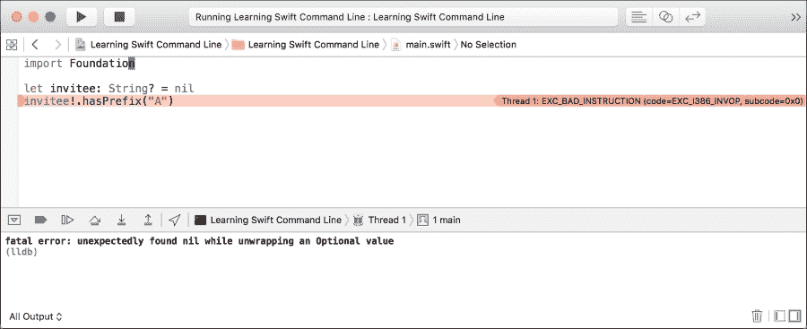
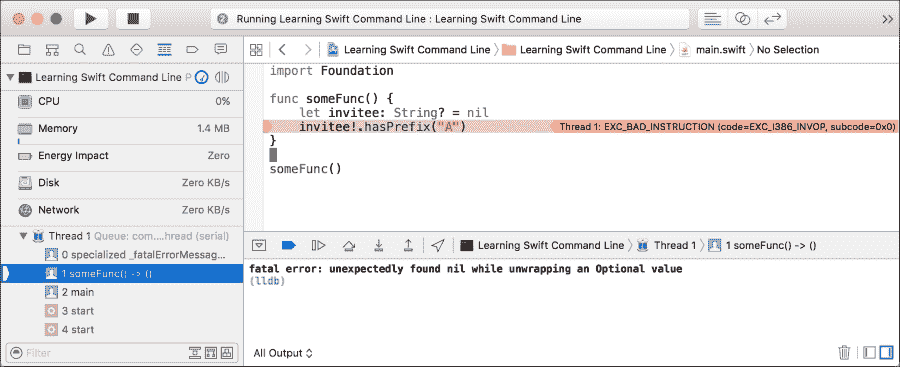

# 第四章.存在与否——可选类型

正如我们在第二章中讨论的，*构建块——变量、集合和流程控制*，所有变量和常量在使用之前都必须有一个值。这是一个很好的安全特性，因为它可以防止你忘记为变量提供一个初始值。对于某些数字变量，例如开始时点三明治的数量为零，这可能是有意义的，但对于所有变量来说并不合理。例如，站立保龄球柱的数量应该从 10 开始，而不是零。在 Swift 中，编译器强制你决定变量应该从哪里开始，而不是提供一个可能不正确的默认值。

然而，还有其他场景，你需要表示值的完全缺失。一个很好的例子是，如果你有一个单词定义的字典，并且尝试查找字典中不存在的单词。通常，这将返回一个字符串，所以你可以返回一个空字符串，但如果你还需要表示一个单词存在但没有定义的情况呢？另外，对于使用你的字典的其他程序员来说，当他们查找不存在的单词时会发生什么可能并不明显。为了满足表示值缺失的需求，Swift 有一个特殊的类型，称为**可选类型**。

在本章中，我们将涵盖以下主题：

+   定义一个可选类型

+   解包可选类型

+   可选链

+   隐式展开可选类型

+   可选类型的调试

+   底层实现

# 定义一个可选类型

因此，我们知道 Swift 中可选类型的作用是允许表示值的缺失，但它看起来是什么样子，又是如何工作的呢？可选类型是一个特殊的类型，可以“包装”任何其他类型。这意味着你可以创建一个可选的`String`，可选的`Array`等等。你可以通过在类型名称后添加一个问号（`?`）来实现这一点，如下所示：

```swift
var possibleString: String?
var possibleArray: [Int]?
```

注意，此代码没有指定任何初始值。这是因为所有可选类型默认情况下都没有值。如果我们想提供一个初始值，我们可以像其他任何变量一样这样做：

```swift
var possibleInt: Int? = 10
```

此外，请注意，如果我们省略了类型指定（`: Int?`），`possibleInt`将被推断为`Int`类型，而不是可选的`Int`。

现在，说一个变量没有值是很冗长的。相反，如果一个可选变量没有值，我们说它是 nil。所以`possibleString`和`possibleArray`都是 nil，而`possibleInt`是`10`。然而，`possibleInt`并不是真正的`10`。它仍然被包装在可选类型中。

你可以通过在游乐场中放入以下代码来查看变量可以采取的所有形式：

```swift
var actualInt = 10
var possibleInt: Int? = 10
var nilInt: Int?
print(actualInt) // 10
print(possibleInt) // Optional(10)
print(nilInt) // nil
```

如你所见，`actualInt`打印出的结果正如我们所期望的，但`possibleInt`打印出的结果是一个包含值`10`的可选值，而不是仅仅是`10`。这是一个非常重要的区别，因为可选值不能用作它所包裹的值。`nilInt`只是报告它为 nil。在任何时候，你都可以更新可选值中的值；这包括使用赋值运算符（`=`）为其赋值：

```swift
nilInt = 2
print(nilInt) // Optional(2)
```

你甚至可以通过将其赋值为`nil`来移除可选值中的值：

```swift
nilInt = nil
print(nilInt) // nil
```

因此，我们有了这种可能包含也可能不包含值的变量包装形式。如果我们需要访问可选值中的值，我们该怎么办？答案是，我们必须解包它。

# 解包可选值

解包可选值有多种方式。它们本质上都断言可选值中确实有值。这是 Swift 的一个非常好的安全特性。编译器强制你考虑一个可能的情况，即可选值可能没有任何值。在其他语言中，这是一个非常常见的被忽视的场景，可能导致难以追踪的 bug。

## 可选绑定

解包可选值最安全的方式是使用一种称为**可选绑定**的技术。使用这种技术，你可以将一个临时常量或变量赋值给可选值中包含的值。这个过程包含在一个`if`语句中，这样你就可以在没有值的情况下使用`else`语句。可选绑定看起来类似于以下代码：

```swift
if let string = possibleString {
    print("possibleString has a value: \(string)")
}
else {
    print("possibleString has no value")
}
```

可选绑定与`if`语句的主要区别在于`if let`语法。从语义上看，这段代码的意思是：“如果你可以让常量`string`等于`possibleString`中的值，就打印出它的值；否则，打印出它没有值。”可选绑定的主要目的是创建一个临时常量，它是可选值的正常（非可选）版本。

我们也可以在可选绑定中使用一个临时变量：

```swift
possibleInt = 10
if var actualInt = possibleInt {
    actualInt *= 2
    print(actualInt) // 20
}
print(possibleInt) // Optional(10)
```

注意，在 Swift 中，星号（`*`）用于乘法。你还应该注意这个代码的一个重要特点。如果你将它放入一个 playground 中，即使我们乘以了`actualInt`，可选值内部的值也不会改变。当我们稍后打印出`possibleInt`时，值仍然是`Optional(10)`。这是因为尽管我们将`actualInt`变成了一个变量（也称为可变），它只是`possibleInt`内部值的临时副本。无论我们对`actualInt`做什么，都不会改变`possibleInt`内部的值。如果我们必须更新`possibleInt`中实际存储的值，我们只需在修改完成后将`possibleInt`赋值给`actualInt`：

```swift
possibleInt = 10
if var actualInt = possibleInt {
   actualInt *= 2
   possibleInt = actualInt
}
print(possibleInt) // Optional(20)
```

现在，`possibleInt`内部包裹的值实际上已经被更新了。

你可能会遇到的一个常见场景是需要解包多个可选值。一个选择是简单地嵌套可选绑定：

```swift
if let actualString = possibleString {
    if let actualArray = possibleArray {
        if let actualInt = possibleInt {
            print(actualString)
            print(actualArray)
            print(actualInt)
        }
    }
}
```

然而，这可能会很麻烦，因为它每次都会增加缩进级别以保持代码的整洁。相反，你实际上可以将多个可选绑定列在单个语句中，用逗号分隔：

```swift
if let actualString = possibleString,
    let actualArray = possibleArray,
    let actualInt = possibleInt
{
    print(actualString)
    print(actualArray)
    print(actualInt)
}
```

这通常会产生更易读的代码。

在函数内进行简洁的可选绑定还有另一种很好的方法，就是使用 guard 语句。这样，你可以进行一系列解包操作，而无需增加代码的缩进级别：

```swift
func someFunc2() {
    guard let actualString = possibleString,
        let actualArray = possibleArray,
        let actualInt = possibleInt
    else {
        return
    }

    print(actualString)
    print(actualArray)
    print(actualInt)
}
```

这个结构允许我们在 guard 语句之后访问解包后的值，因为 guard 语句保证了如果可选值为 nil，我们会在到达该代码之前退出函数。

这种解包方式很好，但说可选绑定是访问可选值内值最安全的方式，这意味着存在一种不安全地解包可选值的方法。这种方法被称为**强制解包**。

## 强制解包

解包可选值最短的方式是使用强制解包。当使用时，在变量名后使用感叹号（`!`）：

```swift
possibleInt = 10
possibleInt! *= 2
print(possibleInt) // "Optional(20)"
```

然而，它被认为是不安全的，是因为如果你尝试解包当前为 nil 的可选值，整个程序将会崩溃：

```swift
nilInt! *= 2 // fatal error
```

你得到的完整错误是**在解包可选值时意外地发现值为 nil**。这是因为强制解包本质上是你个人保证可选值确实包含值的保证。这就是为什么它被称为“强制”。

因此，强制解包应仅限于有限的情况下使用。它绝不应该仅仅为了缩短代码而使用。相反，它只应在你可以从代码的结构保证它不可能是 nil 的情况下使用，即使它被定义为可选的。即使在那种情况下，你也应该看看是否可以使用非可选变量。你可能会使用的另一个地方是如果你的程序真的无法从可选值为 nil 中恢复。在这种情况下，你应该至少考虑向用户显示错误，这总比程序崩溃要好。

一种可能有效使用场景的例子是与延迟计算值一起使用。延迟计算值是在第一次访问时才创建的值。为了说明这一点，让我们考虑一个代表文件系统目录的假设类。它将有一个列出其内容的属性，该属性是延迟计算的。代码将类似于以下代码：

```swift
class FileSystemItem {}
class File: FileSystemItem {}
class Directory: FileSystemItem {
    private var realContents: [FileSystemItem]?
    var contents: [FileSystemItem] {
        if self.realContents == nil {
            self.realContents = self.loadContents()
        }
        return self.realContents!
    }

    private func loadContents() -> [FileSystemItem] {
        // Do some loading
        return []
    }
}
```

在这里，我们定义了一个名为 `FileSystemItem` 的超类，`File` 和 `Directory` 都继承自它。目录的内容是一个 `FileSystemItem` 列表。我们定义 `contents` 为一个计算变量，并将实际值存储在 `realContents` 属性中。计算属性检查 `realContents` 是否有值加载；如果没有，它将加载内容并将它们放入 `realContents` 属性中。基于这种逻辑，我们知道当我们到达返回语句时，`realContents` 内部肯定会有一个值，因此使用强制解包是绝对安全的。

## nil 合并

除了可选绑定和强制解包之外，Swift 还提供了一个名为 **nil 合并运算符** 的运算符来解包可选值。它由一个双问号（`??`）表示。基本上，这个运算符允许我们为变量或操作结果提供一个默认值，以防它是 nil。这是一种将可选值安全转换为非可选值的方法，其代码看起来可能如下所示：

```swift
var possibleString: String? = "An actual string"
print(possibleString ?? "Default String") // "An Actual String"
```

在这里，我们要求程序打印出 `possibleString`，除非它是 nil；如果是 nil，则只打印 `"Default String"`。由于我们确实给它赋了一个值，所以它打印出了那个值，并且值得注意的是，它是以常规变量的形式打印出来的，而不是可选值。这是因为无论如何，一个实际值都将被打印出来。

这是一个在默认值有意义时，简洁且安全地解包可选值的好工具。

# 可选链

在 Swift 中，一个常见的场景是必须从一个可选值中计算出一些内容。如果可选值有值，你将希望将计算结果存储在其上，但如果它是 nil，则结果应直接设置为 nil：

```swift
var invitee: String? = "Sarah"
var uppercaseInvitee: String?
if let actualInvitee = invitee {
    uppercaseInvitee = actualInvitee.uppercaseString
}
```

这相当冗长。为了在不安全的方式中缩短它，我们可以使用强制解包：

```swift
uppercaseInvitee = invitee!.uppercaseString
```

然而，可选链允许我们安全地做到这一点。本质上，它允许对可选值进行可选操作。当调用操作时，如果可选值是 nil，它立即返回 nil；否则，它返回对可选值内部值执行操作的结果：

```swift
uppercaseInvitee = invitee?.uppercaseString
```

因此，在这个调用中，`invitee` 是一个可选值。我们不是解包它，而是在它后面放置一个问号（`?`），然后进行可选操作。在这种情况下，我们要求获取它的 `uppercaseInvitee` 属性。如果 `invitee` 是 nil，则 `uppercaseInvitee` 立即设置为 nil，甚至没有尝试访问 `uppercaseString`。如果它实际上包含一个值，则 `uppercaseInvitee` 被设置为包含值的 `uppercaseString` 属性。请注意，所有可选链都返回一个可选结果。

你可以以这种方式将任意多的调用（可选和非可选）一起链起来：

```swift
var invitees: [String]? = ["Sarah", "Jamison", "Marcos", "Roana"]
invitees?.first?.uppercaseString.hasPrefix("A")
```

这段代码检查邀请人列表的第一个元素是否以字母`A`开头，即使它是小写`A`。首先，它使用可选链，以防`invitees`是 nil。然后对`first`的调用使用额外的可选链，因为该方法返回一个可选`String`。然后我们调用`uppercaseString`，它不返回可选值，这使得我们可以在结果上访问`hasPrefix`而无需使用另一个可选链。如果在任何时刻任何一个可选值是 nil，结果将是 nil。这可以有两个不同的原因：

+   邀请人是 `nil`

+   `first`返回`nil`，因为数组是空的

如果链一直到达`uppercaseString`，就没有失败路径了，它肯定会返回一个实际值。你会注意到在这个链中恰好使用了两个问号，并且有两个可能的失败原因。

起初，可能难以理解何时应该和不应该使用问号来创建一系列调用；规则是如果链中的前一个元素返回一个可选值，则始终使用问号。然而，为了做好准备，让我们看看如果你不正确地使用可选链会发生什么：

```swift
invitees.first // Error
```

在这种情况下，我们试图在不使用链的情况下直接在可选值上调用一个方法，所以我们得到一个错误，说**可选类型'[String]?'的值未展开；你是指要使用'!'还是'?'吗？**。这不仅告诉我们值没有被展开，甚至建议两种处理问题的常见方法：强制展开或可选链。

我们还有试图不恰当地使用可选链的情况：

```swift
var otherInvitees = ["Kai", "Naya"]
otherInvitees?.first // Error
```

这里，我们得到一个错误，说**不能在非可选值类型'[String]'上使用可选链**。了解你可能会在犯错时看到的错误感非常好；这样你就可以快速纠正它们，因为我们都时不时地会犯愚蠢的错误。

可选链的另一个伟大特性是它可以用于对不实际返回值的可选进行方法调用：

```swift
invitees?.removeAll()
```

在这种情况下，我们只想在可选数组中确实有值时调用`removeAll`。所以，用这段代码，如果有值，所有元素都会从它中移除；否则，它将保持 nil。

最后，链式调用是一个编写简洁代码的好选择，同时仍然保持表达性和可理解性。

# 隐式展开的可选

另一种可选类型称为**隐式展开的可选**。实际上有两种看待隐式展开可选的方式；一种方式是说它是一个也可以是 nil 的正常变量；另一种方式是说它是一个你不必展开即可使用的可选。重要的是要理解的是，与可选类似，它们可以是 nil，但你不必像正常变量那样展开它们。

你可以用感叹号（`!`）而不是问号（`?`）在类型名后定义一个隐式未包装的可选类型：

```swift
var name: String!
```

与常规可选类型类似，隐式未包装的可选类型不需要给出一个初始值，因为它们默认为 nil。

起初这听起来像是两者的最佳之处，但现实中它更像是两者的最坏之处。即使隐式未包装的可选类型不需要解包，如果它在使用时为 nil，它也会使你的整个程序崩溃：

```swift
name.uppercaseString // Crash
```

想象它们的一个好方法是，每次使用时，它都会隐式地进行强制解包。感叹号放在其类型声明中，而不是每次使用时。这可能会引起问题，因为它看起来与其他任何变量相同，除了它的声明方式。这意味着它非常不安全，与普通可选类型不同。

所以如果隐式未包装的可选类型是两者的最坏之处，并且如此不安全，那么它们为什么甚至存在呢？现实是，在罕见的情况下，它们是必要的。它们用于变量不是真正可选的情况，但你也不能给它一个初始值。这对于具有非可选成员变量但无法在初始化期间设置的定制类型几乎总是这种情况。

这种情况的一个罕见例子是在 iOS 中的视图。正如我们之前讨论的，UIKit 是苹果为 iOS 开发提供的框架。在这个框架中，苹果提供了一个名为`UIView`的类，用于在屏幕上显示内容。苹果还在 Xcode 中提供了一个名为 Interface Builder 的工具，它允许你在可视化编辑器中而不是在代码中设计这些视图。许多以这种方式设计的视图将需要引用其他可以在以后通过编程访问的视图。当一个这样的视图被加载时，它是在没有任何连接的情况下初始化的，然后所有连接都会被建立。一旦所有连接都建立好了，视图上就会调用一个名为`awakeFromNib`的函数。这意味着这些连接在初始化期间不可用，但在`awakeFromNib`被调用后可用。这种操作顺序也确保了`awakeFromNib`总是在实际使用视图之前被调用。这是一个需要使用隐式未包装可选类型的情况。成员变量可能无法在视图初始化后定义，当它完全加载时：

```swift
Import UIKit
class MyView: UIView {
    @IBOutlet var button: UIButton!
    var buttonOriginalWidth: CGFloat!

    override func awakeFromNib() {
        self.buttonOriginalWidth = self.button.frame.size.width
    }
}
```

注意，我们实际上声明了两个隐式未包装的可选类型。第一个是一个按钮的连接。我们知道这是一个连接，因为它前面有`@IBOutlet`。因为这个连接是在初始化之后才设置的，所以它被声明为隐式未包装的可选类型，但它们仍然保证在调用视图上的任何其他方法之前被设置。

这就引出了我们解包第二个变量`buttonOriginalWidth`的情况，这是隐式进行的，因为我们需要等待连接建立，才能确定按钮的宽度。在调用`awakeFromNib`之后，我们可以安全地将`button`和`buttonOriginalWidth`视为非可选类型。

你可能已经注意到，我们必须深入到应用程序开发中，才能找到一个隐式可选类型的有效用例，这可能是由于 UIKit 是用 Objective-C 实现的，正如我们将在第十章第十章。利用过去 – 理解和翻译 Objective-C 中了解到的那样。这是对这样一个事实的又一证明，即它们应该被谨慎使用。

# 调试可选类型

我们已经看到了由于可选类型导致的几种常见的编译器错误。如果我们尝试在一个本应应用于包装值的可选类型上调用方法，我们会得到一个错误。如果我们尝试解包一个实际上不是可选类型的值，我们也会得到一个错误。我们还需要准备好可选类型可能导致的运行时错误。

正如我们之前讨论的，如果尝试强制解包一个为 nil 的可选类型，它会导致运行时错误，也被称为崩溃。这既可能发生在显式强制解包中，也可能发生在隐式强制解包中。如果你到目前为止已经遵循了我在本章中的建议，这种情况应该很少发生。然而，我们最终都会与第三方代码打交道，也许他们很懒惰，或者他们使用强制解包来强制他们的代码使用期望。

此外，我们有时都会因为懒惰而感到疲惫。当你对编写应用程序的核心功能感到兴奋时，担心所有边缘情况可能会令人疲惫或气馁。我们可能会在担心主要功能的同时临时使用强制解包，并计划稍后回来处理它。毕竟，在开发过程中，让强制解包导致应用程序的开发版本崩溃，比它未处理该边缘情况而默默失败要好。我们甚至可能决定，处理边缘情况不值得开发努力，因为开发应用程序的每一件事都是一种权衡。无论如何，我们需要快速识别强制解包导致的崩溃，以免浪费额外的时间试图找出出了什么问题。

当应用程序尝试解包一个 nil 值时，如果你当前正在调试应用程序，Xcode 会显示尝试解包的行。该行会报告存在一个**EXC_BAD_INSTRUCTION**错误，你也会在控制台中收到一条消息，说**致命错误：在解包可选值时意外发现 nil**：



你有时还必须查看当前正在调用失败代码的代码。为此，你可以使用 Xcode 中的调用栈。调用栈是所有到达此位置的功能调用的完整路径。所以，如果你有`function1`调用`function2`，然后`function2`调用`function3`，`function3`将在顶部，`function1`将在底部。一旦执行退出`function3`，它将从栈中移除，所以你将只有`function2`在`function1`的顶部。

当你的程序崩溃时，Xcode 会自动显示调用栈，但你也可以通过导航到**视图** | **导航器** | **显示调试导航器**来手动显示它。它看起来会类似于以下截图：



在这里，你可以点击不同的代码级别来查看事物的状态。如果程序在 Apple 的框架中崩溃，而你无法访问代码，这将变得更加重要。在这种情况下，你可能需要将调用栈向上移动到你的代码调用框架的点。你也许还能够查看函数的名称，以帮助你弄清楚可能出了什么问题。

在调用栈的任何地方，你都可以查看调试器中变量的状态，如下所示：


如果你看不到这个变量的视图，你可以通过点击屏幕右下角第二个从右边的按钮来显示它，该按钮将被灰色显示。在这里，你可以看到`invitee`确实是 nil，这就是导致崩溃的原因。

虽然调试器非常强大，但如果发现它没有帮助你找到问题，你可以在代码的重要部分添加`print`语句。只要你不像前一个例子那样强制展开可选参数，打印可选参数总是安全的。正如我们之前看到的，当可选参数被打印时，如果没有值，它会打印**nil**，如果有值，它会打印**Optional(<value>)**。

调试是成为一名高效开发者极其重要的部分，因为我们都会犯错误并创建 bug。成为一名优秀的开发者意味着你能够快速识别问题，并在之后很快地理解如何修复它们。这主要来自于实践，但也会来自于对你代码的实际运行情况有牢固的掌握，而不是简单地通过试错来适应你在网上找到的代码以适应你的需求。

# 基本实现

到目前为止，你应该已经对可选参数有了相当强的理解，以及如何使用和调试它，但深入了解一下可选参数的实际工作原理将非常有价值。

实际上，可选类型的问号语法只是一个特殊的缩写。写`String?`相当于写`Optional<String>`。写`String!`相当于写`ImplicitlyUnwrappedOptional<String>`。Swift 编译器有简写版本，因为它们非常常用。这使得代码更加简洁易读。

如果你使用长形式声明一个可选类型，你可以通过按住*Command*键并点击单词**Optional**来查看 Swift 的实现。在这里，你可以看到`Optional`被实现为一个枚举。稍微简化一下代码，我们有：

```swift
enum Optional<T> {
    case None
    case Some(T)
}
```

因此，我们可以看到可选类型实际上有两种情况：`None`和`Some`。`None`代表 nil 的情况，而`Some`情况有一个关联的值，即可选类型中包裹的值。解包是检索`Some`情况中关联值的过程。

这一部分你还没有看到的是角度括号语法（`<T>`）。这被称为**泛型**，它本质上允许枚举具有任何类型的关联值。我们将在第六章*让 Swift 为你工作 – 协议和泛型*中深入探讨泛型。

认识到可选类型仅仅是枚举将帮助你理解如何使用它们。这也让你对概念是如何建立在其他概念之上的有了更深的洞察。可选类型在你意识到它们只是两个情况的枚举之前看起来非常复杂。一旦你理解了枚举，你就可以很容易地理解可选类型了。

# 摘要

在本章中，我们只覆盖了单个概念，即可选类型，但我们已经看到这是一个相当密集的话题。我们看到在表面层面上，可选类型相当直接。它们是一种表示没有值的变量的方式。然而，有多种方法可以访问可选类型中包裹的值，并且它们有非常特定的用例。可选绑定始终是首选，因为它是最安全的方法，但如果我们确信可选类型不是 nil，我们也可以使用强制解包。我们还有一个名为隐式解包可选的类型，用于延迟分配一个不打算是可选的变量；然而，我们应该谨慎使用它，因为几乎总是有更好的替代方案。

现在我们对可选类型有了牢固的理解，我们可以开始看看表面上可能看似微不足道但实际上开启了一个全新世界的东西。Swift 中的所有函数实际上都是变量或常量本身。我们将在下一章探讨这意味着什么。
