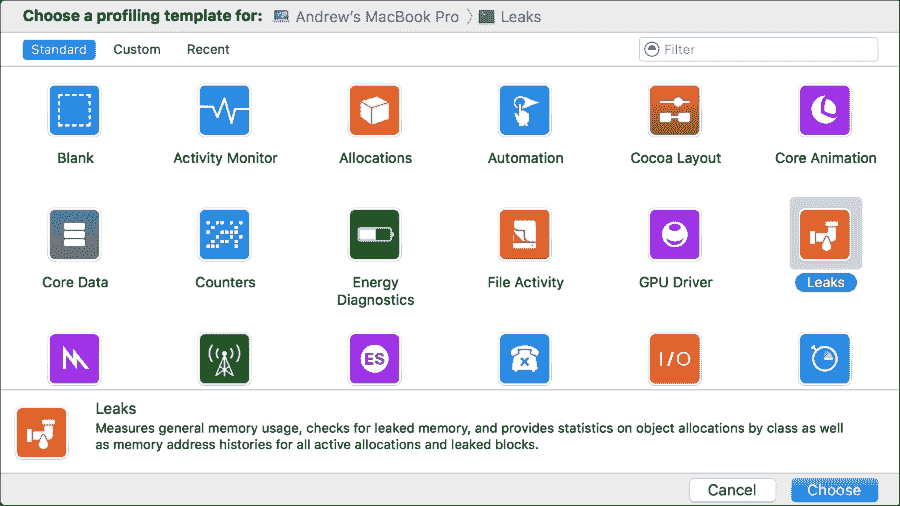
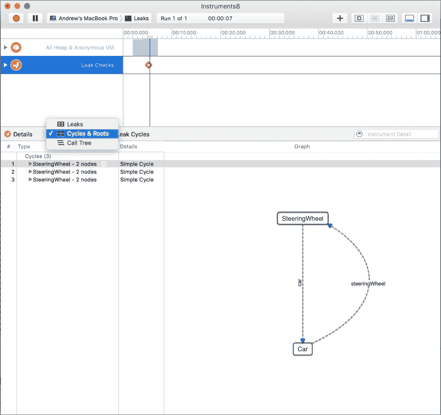

# 第七章。一切皆相连——内存管理

当使用一个应用程序时，最糟糕的事情莫过于它运行缓慢且无响应。计算机用户已经习惯了每一款软件都能立即对每一次交互做出响应。即使是最功能丰富的应用程序，如果使用起来不愉快，因为它没有有效地管理设备资源，那么它也会被毁掉。此外，随着移动计算机和设备的日益普及，编写高效使用电池电力的软件比以往任何时候都更加重要。编写软件的方面中，对响应速度和电池寿命影响最大的是内存管理。

在本章中，我们将讨论 Swift 特有的技术，这些技术使我们能够管理内存，以确保我们的代码保持响应性并最小化其对电池寿命和其他应用程序的影响。我们将通过以下主题来实现这一点：

+   计算机数据存储

+   值类型与引用类型

+   自动引用计数

+   强引用循环

+   失踪的对象

+   结构体与类

# 计算机数据存储

在我们开始查看代码之前，我们需要详细了解数据在计算机中的表示方式。常见的陈词滥调是计算机中的所有数据都是 1 和 0。这是真的，但在讨论内存管理时并不那么重要。相反，我们关心的是数据存储的*位置*。所有计算机，无论是台式机、笔记本电脑、平板电脑还是手机，都在两个地方存储数据。

我们通常首先想到的地方是文件系统。它存储在专门的硬件上；在许多计算机中，这被称为硬盘驱动器，但最近，一些计算机开始使用固态驱动器。当我们购买计算机时，我们还听说它有多少“内存”。计算机内存以“条”的形式出现，比普通驱动器存储的信息少。所有数据，即使主要存储在互联网上的某个地方，也必须加载到计算机的内存中，以便我们与之交互。

让我们来看看这对我们作为程序员意味着什么。

## 文件系统

文件系统是为了长期存储数据而设计的。它的访问速度远慢于内存，但存储大量数据时成本效益更高。正如其名称所暗示的，文件系统只是一个文件的组织层次结构，我们可以通过 Mac 上的*Finder*直接与之交互。这个文件系统在 iPhone 和 iPad 上仍然存在，但它对我们来说是隐藏的。然而，软件仍然可以读取和写入文件系统，因此我们可以永久存储数据，即使在关闭设备之后。

## 内存

内存比文件系统要复杂一些。它被设计用来存储当前运行的软件所需的必要数据，暂时存储。与文件系统不同，一旦关闭设备，所有内存都会丢失。这个类比类似于我们人类有短期和长期记忆。当我们正在交谈或思考某事时，我们正在积极思考的信息子集在我们的短期记忆中，其余的则在我们的长期记忆中。为了积极思考某事，我们必须将其从长期记忆中召回短期记忆。

内存访问速度快，但成本更高。当计算机开始出现异常缓慢的反应时，通常是因为它几乎用完了所有的内存。这是因为当内存不足时，操作系统会自动开始使用文件系统作为备份。原本打算短期存储的信息会自动写入文件系统，这使得再次访问变得非常缓慢。

这类似于我们人类一次性处理过多信息时遇到的问题。如果我们试图在脑海中加两个 20 位的数字，这将花费我们很长时间，或者根本不可能完成。相反，我们通常会边做边在纸上写下部分解决方案。在这种情况下，纸张就充当了我们的文件系统。如果我们能记住所有东西，而不是花时间写下它并读回它，那会更快，但我们一次无法处理那么多信息。

在编程时考虑这一点很重要，因为我们希望减少在任何给定时间使用的内存量。使用大量内存不仅会负面影响我们的软件，还会影响整个计算机的性能。此外，当操作系统不得不求助于使用文件系统时，额外的处理和访问第二块硬件会导致更多的能耗。

现在我们已经理解了我们的目标，我们可以开始讨论如何在 Swift 中更好地管理内存。

# 值类型与引用类型

Swift 中的所有变量和常量都存储在内存中。实际上，除非你明确地将数据写入文件系统，否则你创建的所有东西都将存储在内存中。在 Swift 中，有两种不同类型的类别。这两个类别是**值类型**和**引用类型**。它们之间的唯一区别在于它们在分配给新变量、传递给方法或捕获在闭包中的行为方式。本质上，它们只在尝试将新变量或常量的值分配给现有变量或常量时有所不同。

值类型在被分配到新的位置时总是被复制，而引用类型则不是。在我们详细探讨这究竟意味着什么之前，让我们先了解一下如何确定一个类型是值类型还是引用类型。

## 确定值类型或引用类型

值类型是指定义为结构体或枚举的任何类型，而所有类都是引用类型。根据你如何声明它们，你可以很容易地确定你自己的自定义类型。除此之外，Swift 的所有内置类型，如字符串、数组和字典，都是值类型。如果你不确定，你可以在游乐场中测试任何两种类型，看看它们的行为是否与值类型或引用类型一致。最简单的行为检查是在赋值时发生的情况。

## 赋值时的行为

当值类型被重新赋值时，它会复制，这样之后每个变量或常量都持有可以独立更改的独立值。让我们通过一个简单的字符串示例来看看：

```swift
var value1 = "Hello"
var value2 = value1
value1 += " World!"
print(value1) // "Hello World!"
print(value2) // "Hello"
```

如你所见，当`value2`被设置为`value1`时，会创建一个副本。这样，当我们向`value1`追加`" World!"`时，`value2`保持不变，仍然是`"Hello"`。我们可以将它们视为两个完全独立的实体：


另一方面，让我们看看引用类型会发生什么：

```swift
class Person {
    var name: String

    init(name: String) {
        self.name = name
    }
}
var reference1 = Person(name: "Kai")
var reference2 = reference1
reference1.name = "Naya"
print(reference1.name) // "Naya"
print(reference2.name) // "Naya"
```

如你所见，当我们更改`reference1`的名称时，`reference2`也发生了变化。那么这是为什么？正如其名所示，引用类型仅仅是实例的引用。当你将一个引用赋给另一个变量或常量时，两者实际上都指向同一个实例。我们可以将其视为两个单独的对象引用同一个实例：


在现实生活中，这就像两个孩子分享一个玩具。他们都可以玩这个玩具，但如果其中一个孩子弄坏了玩具，两个孩子的玩具都会坏。

然而，重要的是要意识到，如果你将引用类型赋值给新的值，它不会改变它最初引用的值：

```swift
reference2 = Person(name: "Kai")
print(reference1.name) // "Naya"
print(reference2.name) // "Kai"
```

如你所见，我们将`reference2`赋值给了完全不同的`Person`实例，因此它们现在可以独立操作。我们可以将它们视为两个不同实例上的两个单独引用，如下面的图像所示：


这就像给其中一个孩子买了一个新玩具。

这表明引用类型实际上是值类型的一个特殊版本。区别在于引用类型本身不是任何类型的实例。它只是引用另一个实例的一种方式，有点像占位符。你可以复制引用，以便有两个变量引用同一个实例，或者你可以给一个变量一个指向新实例的完全新的引用。在引用类型中，基于多个变量之间共享实例，存在一个额外的间接层。

现在我们知道了这一点，验证一个类型是值类型还是引用类型最简单的方法是检查它在赋值时的行为。如果你修改第一个值时第二个值发生了变化，这意味着你正在测试的类型是引用类型。

## 输入时的行为

另一个值类型的行为与引用类型不同的地方是在将它们传递到函数和方法中时。然而，如果你将传递变量或常量到函数视为另一种赋值操作，那么这种行为的记忆就会变得非常简单。这意味着当你将值类型传递到函数中时，它会被复制，而引用类型仍然共享相同的实例：

```swift
func setNameOfPerson(person: Person, var to name: String) {
    person.name = name
    name = "Other Name"
}
```

在这里，我们定义了一个函数，它接受一个引用类型：`Person`和一个值类型：`String`。当我们函数内部更新`Person`类型时，我们传入的人员也会发生变化：

```swift
var person = Person(name: "Sarah")
var newName = "Jamison"
setNameOfPerson(person, to: newName)

print(person.name) // "Jamison"
print(newName) // "Jamison"
```

然而，当我们函数内部更改字符串时，传入的`String`保持不变。

当事情变得稍微复杂一些时，是关于`inout`参数。`inout`参数实际上是对传入实例的引用。这意味着它将值类型视为引用类型：

```swift
func updateString(inout string: String) {
    string = "Other String"
}

var someString = "Some String"
updateString(&someString)
print(someString) // "Other String"
```

如您所见，当我们函数内部更改了`inout`版本的`string`时，它也改变了函数外部的`someString`变量，就像它是一个引用类型一样。

如果我们记住引用类型只是值类型的一个特殊版本，其中值是一个引用，那么我们可以推断出引用类型的`inout`版本将可能实现什么。当我们定义一个`inout`引用类型时，我们实际上有一个指向引用的引用；这个引用就是指向引用的那个引用。我们可以将`inout`值类型和`inout`引用类型之间的区别可视化如下：


如果我们简单地更改这个变量的值，我们会得到与它不是`inout`参数时相同的行为。然而，我们也可以通过将其声明为`inout`参数来更改内部引用的指向：

```swift
func updatePerson(inout insidePerson: Person) {
    insidePerson.name = "New Name"
    insidePerson = Person(name: "New Person")
}

var person2 = person
updatePerson(&person)
print(person.name) // "New Person"
print(person2.name) // "New Name"
```

我们首先创建第二个引用：`person2`，指向与之前具有名字`"Jamison"`的`person`变量相同的实例。之后，我们将原始的`person`变量传递到我们的`updatePerson:`方法中，得到以下结果：


在这个方法中，我们首先将现有人员的名字更改为新名字。我们可以从输出中看到`person2`的名字也发生了变化，因为函数内部的`insidePerson`和`person2`仍然引用着相同的实例：


然而，我们随后也将`insidePerson`赋值给`Person`引用类型的一个全新的实例。这导致函数外部的`person`和`person2`指向两个完全不同的`Person`实例，使得`person2`的名字变为`"New Name"`，并将`person`的名字更新为`"New Person"`：


在这里，通过将`insidePerson`定义为`inout`参数，我们能够改变传入变量的引用位置。这有助于我们将所有不同的类型视为一个类型指向另一个类型。

在任何时刻，这些箭头中的任何一个都可以通过赋值指向新的内容，实例始终可以通过引用来访问。

## 闭包捕获行为

我们必须关注的最后一个行为是当变量在闭包中被捕获时。这是我们之前在第五章中未涵盖的闭包内容，*现代范式 – 闭包和函数式编程*。闭包实际上可以使用与闭包本身相同作用域中定义的变量：

```swift
var nameToPrint = "Kai"
var printName = {
    print(nameToPrint)
}
printName() // "Kai"
```

这与我们之前看到的正常参数非常不同。我们实际上并没有将`nameToPrint`指定为参数，也没有在调用方法时传递它。相反，闭包捕获了定义在其之前的`nameToPrint`变量。这些类型的捕获在函数中类似于`inout`参数。

当捕获值类型时，它可以被更改，并且会改变原始值：

```swift
var outsideName = "Kai"
var setName = {
    outsideName = "New Name"
}
print(outsideName) // "Kai"
setName()
print(outsideName) // "New Name"
```

正如你所见，`outsideName`在调用闭包后被更改了。这正好像一个`inout`参数。

当捕获引用类型时，任何更改也将应用于变量的外部版本：

```swift
var outsidePerson = Person(name: "Kai")
var setPersonName = {
    outsidePerson.name = "New Name"
}
print(outsidePerson.name) // "Kai"
setPersonName()
print(outsidePerson.name) // "New Name"
```

这也正好像一个`inout`参数。

我们需要记住的关于闭包捕获的另一个部分是，在闭包定义之后更改捕获的值仍然会影响闭包内的值。我们可以利用这一点来使用我们在上一节中定义的`printName`闭包来打印任何名称：

```swift
nameToPrint = "Kai"
printName() // Kai
nameToPrint = "New Name"
printName() // "New Name"
```

正如你所见，我们可以通过更改`nameToPrint`的值来更改`printName`打印的内容。实际上，这种行为在意外发生时很难追踪，因此通常最好尽可能避免在闭包中捕获变量。在这种情况下，我们正在利用这种行为，但大多数情况下，它会导致错误。在这里，最好将我们想要打印的内容作为参数传递。

避免这种行为的另一种方法是使用一个名为**捕获列表**的功能。使用它，你可以通过复制来指定你想要捕获的变量：

```swift
nameToPrint = "Original Name"
var printNameWithCapture = { [nameToPrint] in
    print(nameToPrint)
}
printNameWithCapture() // "Original Name"
nameToPrint = "New Name"
printNameWithCapture() // "Original Name"
```

捕获列表是在闭包的开始处定义的，在任何一个参数之前。它是由逗号分隔的变量列表，我们想要在方括号内复制这些变量。在这种情况下，我们请求复制`nameToPrint`，因此当我们稍后更改它时，它不会影响打印出的值。我们将在本章后面看到捕获列表的更高级用法。

# 自动引用计数

现在我们已经了解了 Swift 中数据表示的不同方式，我们可以探讨如何更好地管理内存。我们创建的每个实例都会占用内存。自然地，永远保留所有数据是没有意义的。Swift 需要能够释放内存，以便它可以用于其他目的，一旦我们的程序不再需要它。这是我们管理应用程序内存的关键。我们需要确保 Swift 能够尽快释放我们不再需要的所有内存。

Swift 知道何时可以释放内存，是因为代码无法再访问一个实例。如果没有变量或常量引用一个实例，它就可以被重新用于另一个实例。这被称为“释放内存”或“删除对象”。

在 第三章 的 *一次一件——类型、作用域和项目* 中，我们已经讨论了变量何时可访问或不可访问的问题，这部分内容在作用域部分进行了讨论。这使得值类型的内存管理变得非常简单。由于值类型在重新分配或传递给函数时总是被复制，因此一旦它们超出作用域，就可以立即删除。我们可以通过一个简单的例子来全面了解：

```swift
func printSomething() {
    let something = "Hello World!"
    print(something)
}
```

这里有一个非常简单的函数，它会打印出 "Hello World!"。当调用 `printSomething` 时，`something` 被分配给一个新的 `String` 实例，其值为 `"Hello World!"`。在调用 `print` 之后，函数退出，因此 `something` 就不再在作用域内了。此时，`something` 所占用的内存可以被释放。

虽然这很简单，但引用类型要复杂得多。从高层次来看，引用类型的实例在作用域内不再有任何引用时被删除。这相对容易理解，但在细节上会更复杂。管理这一功能的 Swift 特性被称为 **自动引用计数** 或简称 **ARC**。

## 对象关系

自动引用计数（ARC）的关键是每个对象都与一个或多个变量有关。这可以扩展到所有对象都与其他对象有关的概念。例如，一个汽车对象会包含其四个轮胎、引擎等对象。它还会与制造商、经销商和车主有关。ARC 使用这些关系来确定何时可以删除对象。在 Swift 中，有三种不同类型的关系：**强引用**、**弱引用**和**非拥有引用**。

### 强大

第一种，也是默认类型的关系是强关系。它表示变量需要它所引用的实例始终存在，只要变量仍在作用域内。这是值类型可用的唯一行为。当一个实例不再有任何强关系时，它将被删除。

这种关系的一个很好的例子是必须有一个方向盘的汽车：

```swift
class SteeringWheel {}

class Car {
    var steeringWheel: SteeringWheel

    init(steeringWheel: SteeringWheel) {
        self.steeringWheel = steeringWheel
    }
}
```

默认情况下，`steeringWheel`属性与它初始化时关联的`SteeringWheel`实例有一个强关系。从概念上讲，这意味着汽车本身与方向盘有一个强关系。只要汽车存在，它就必须与一个存在的方向盘有关联。由于`steeringWheel`被声明为一个变量，我们可以更改汽车的方向盘，这将消除旧的强关系并添加一个新的，但强关系始终存在。

如果我们创建一个新的`Car`实例并将其存储在一个变量中，那么这个变量将与汽车有一个强关系：

```swift
let wheel = SteeringWheel()
let car = Car(steeringWheel: wheel)
```

让我们分析一下这段代码中的所有关系。首先，我们创建`wheel`常量并将其分配给一个新的`SteeringWheel`实例。这从`wheel`到新实例建立了一个强关系。我们用`car`常量做同样的事情，但这次我们还向初始化器传递了`wheel`常量。现在，不仅`car`与新的`Car`实例有一个强关系，而且`Car`初始化器还从`steeringWheel`属性到与`wheel`常量相同的实例建立了一个强关系：


那么，这种关系图对内存管理意味着什么呢？此时，`Car`实例有一个强关系：`car`常量，而`SteeringWheel`实例有两个强关系：`wheel`常量和`Car`实例的`steeringWheel`属性。

这意味着一旦`car`常量超出作用域，`Car`实例就会被删除。另一方面，`SteeringWheel`实例只有在`wheel`常量超出作用域且`Car`实例被删除之后才会被删除。

你可以想象在你的程序中的每个实例都有一个强引用计数器。每次设置一个强关系到实例时，计数器就会增加。每次一个强引用对象被删除时，计数器就会减少。如果那个计数器回到零，实例就会被删除。

另一个重要的事情是，所有关系都是单向的。仅仅因为`Car`实例与`SteeringWheel`实例有一个强关系，并不意味着`SteeringWheel`实例有任何反向关系。你可以通过向`SteeringWheel`类中添加一个汽车属性来添加自己的反向关系，但当你这样做时必须小心，正如我们将在接下来的强引用循环部分中看到的。

### 弱

Swift 中的下一种关系类型是弱关系。它允许一个对象引用另一个对象，而不强制要求它始终存在。弱关系不会对实例的引用计数器做出贡献，这意味着弱关系的添加不会增加计数器，也不会在移除时减少计数器。

由于弱关系不能保证它始终存在，它必须始终定义为可选的。弱关系是在变量声明前使用`weak`关键字定义的：

```swift
class SteeringWheel {
    weak var car: Car?
}
```

这允许`SteeringWheel`分配一个汽车，而不强制要求汽车永远不会被删除。然后，汽车初始化器可以将这个反向引用分配给自己：

```swift
class Car {
    var steeringWheel: SteeringWheel

    init(steeringWheel: SteeringWheel) {
        self.steeringWheel = steeringWheel
        self.steeringWheel.car = self
    }
}
```

如果汽车被删除，`SteeringWheel`的汽车属性将自动设置为 nil。这允许我们优雅地处理弱关系引用已删除实例的场景。

### 无所有者

最后一种关系类型是无所有者关系。这种关系几乎与弱关系相同。它也允许一个对象引用另一个对象，而不增加强引用计数。唯一的区别是，无所有者关系不需要声明为可选的，并且使用`unowned`关键字而不是`weak`。它类似于隐式展开的可选类型。你可以像对待强关系一样与无所有者关系交互，但如果无所有者实例已被删除而你尝试访问它，你的整个程序将会崩溃。这意味着你应该只在无所有者对象在主要对象仍然存在的情况下永远不会实际被删除的场景中使用无所有者关系。

你可能会问，“为什么我们不会总是使用强关系呢？”答案是，有时需要无所有者或弱引用来打破称为**强引用循环**的东西。

# 强引用循环

强引用循环是指两个实例直接或间接持有对彼此的强引用。这意味着两个对象都无法被删除，因为它们都在确保对方将始终存在。

这种场景是我们遇到的第一种真正糟糕的内存管理场景。保留比所需更长时间的内存是一回事；创建永远无法释放以供再次使用的内存则是完全不同的层次。这种内存问题被称为内存泄漏，因为计算机将逐渐泄漏内存，直到没有更多可用的新内存。这就是为什么你有时会在重启设备后看到速度提升的原因。重启时，所有内存都会再次释放。现代操作系统有时会找到强制释放内存的方法，尤其是在完全退出应用程序时，但我们作为程序员不能依赖这一点。

那么，我们如何防止这些强引用循环呢？首先，让我们看看它们是什么样子。这些循环可以存在的两种主要场景是：在对象之间以及与闭包一起。

## 在对象之间

对象之间的强引用循环是指两种类型直接或间接包含对彼此的强引用。

### 发现

如果我们不使用从`SteeringWheel`到`Car`的弱引用重写前面的汽车示例，那么这是一个对象之间强引用循环的绝佳例子：

```swift
class SteeringWheel {
    var car: Car?
}

class Car {
    var steeringWheel: SteeringWheel

    init(steeringWheel: SteeringWheel) {
        self.steeringWheel = steeringWheel
        self.steeringWheel.car = self
    }
}
```

与前面的代码相比，唯一的区别是`SteeringWheel`上的`car`属性不再声明为弱引用。这意味着当创建一个汽车时，它将设置与`SteeringWheel`实例的强关系，然后从`SteeringWheel`实例创建对汽车的强引用：


这种场景意味着两个实例的引用计数永远不会降到零，因此它们永远不会被删除，内存将会泄漏。

两个对象也可以通过一个或多个第三方间接地相互持有强引用：

```swift
class Manufacturer {
    var cars: [Car] = []
}

class SteeringWheel {
    var manufacturer: Manufacturer?
}

class Car {
    var steeringWheel: SteeringWheel?
}
```

在这里，我们有一个场景，一个`Car`可以有一个对`SteeringWheel`的强引用，而`SteeringWheel`可以有一个对`Manufacturer`的强引用，反过来，`Manufacturer`又有一个对原始`Car`的强引用：


这又是一个强引用循环，它说明了两个更重要的点。首先，默认情况下，可选类型仍然在非 nil 时创建强关系。此外，内置容器类型，如数组和字典，也会创建强关系。

显然，强引用循环可能很难被发现，尤其是因为它们一开始就很难检测。单个内存泄漏很少会对你程序的用户明显，但如果你一次又一次地持续泄漏内存，它可能会导致他们的设备运行缓慢甚至崩溃。

作为开发者，检测它们最好的方式是使用 Xcode 内置的工具**Instruments**。Instruments 可以执行许多任务，但其中之一被称为**Leaks**。要运行此工具，你必须有一个 Xcode 项目；你不能在 Playground 上运行它。它通过从菜单栏中选择**Product** | **Profile**来运行。

这将构建你的项目并显示一系列分析工具：



如果你选择**Leaks**工具并按下左上角的记录按钮，它将运行你的程序并警告你内存泄漏，它可以检测到。内存泄漏将看起来像红色的 X 图标，并将列为泄漏的对象：


你甚至可以选择泄漏对象的**Cycles & Roots**视图，Instruments 将显示你的强引用循环的视觉表示。在下面的屏幕截图中，你可以看到`SteeringWheel`和`Car`之间存在循环：



显然，Leaks 是一个强大的工具，你应该定期在你的代码上运行它，但它不会捕获所有的强引用循环。最后的防线将是你保持对代码的警惕，始终思考所有权图。

当然，检测循环只是战斗的一部分。战斗的另一部分是修复它们。

### 修复

打破强引用循环的最简单方法是简单地完全移除其中一个关系。然而，这通常不是一个选择。很多时候，保持双向关系很重要。

我们修复循环的方法是使一个或多个关系变为弱引用或未拥有。实际上，这正是其他两种关系存在的主要原因。

我们通过将汽车关系改回弱引用来修复原始示例中的强引用循环：

```swift
class SteeringWheel {
    weak var car: Car?
}

class Car {
    var steeringWheel: SteeringWheel

    init(steeringWheel: SteeringWheel) {
        self.steeringWheel = steeringWheel
        self.steeringWheel.car = self
    }
}
```

现在`Car`对`SteeringWheel`有强引用，但只有弱引用回传：


你如何打破任何给定的循环将取决于你的实现。唯一重要的是，在引用循环中某处有一个弱引用或未拥有关系。

未拥有关系适用于连接永远不会缺失的场景。在我们的例子中，有时方向盘存在但没有汽车引用。如果我们将其改为在`Car`初始化器中创建`SteeringWheel`，我们可以使引用未拥有：

```swift
class SteeringWheel2 {
    unowned var car: Car

    init(car: Car) {
        self.car = car
    }
}

class Car {
    var steeringWheel: SteeringWheel2!

    init() {
        self.steeringWheel = SteeringWheel2(car: self)
    }
}
```

此外，请注意我们不得不将`steeringWheel`属性定义为隐式展开的可选属性。这是因为我们在初始化它时必须使用`self`，但同时又不能在所有属性都有值之前使用`self`。将其设置为可选属性允许它在使用`self`创建方向盘时为 nil。只要`SteeringWheel2`初始化器不尝试访问传入汽车的`steeringWheel`属性，这是安全的。

## 使用闭包

如我们在第五章中发现的，“现代范式 – 闭包和函数式编程”，闭包只是另一种类型的对象，因此它们遵循相同的 ARC 规则。然而，由于它们能够捕获其周围作用域中的变量，它们比类更微妙。这些捕获从闭包到捕获变量的强引用往往被忽视，因为与条件、for 循环和其他类似语法相比，捕获变量看起来非常自然。

正如类可以创建循环引用一样，闭包也可以。某个东西可以对一个闭包有强引用，该闭包直接或间接地对原始对象有强引用。让我们看看我们如何发现这一点。

### 发现

提供将在某些事情发生时被调用的闭包属性是非常常见的。这些通常被称为回调。让我们看看一个球类，它有一个当球弹跳时的回调：

```swift
class Ball {
    var location: (x: Double, y: Double) = (0,0)

    var onBounce: (() -> ())?
}
```

这种设置很容易无意中创建强引用循环：

```swift
let ball = Ball()
ball.onBounce = {
    print("\(ball.location.x), \(ball.location.y)")
}
```

在这里，我们每次球弹跳时都会打印出球的位置。然而，如果你仔细考虑，你会看到闭包和球实例之间存在一个强引用循环。这是因为我们在闭包中捕获了球。正如我们已经学到的，这从闭包到球创建了一个强引用。球也通过`onBounce`属性对闭包有一个强引用。这就是我们的循环。

你应该始终意识到你的闭包中捕获了哪些变量，以及该变量是否直接或间接地有强引用到闭包本身。

### 修复

为了修复这些类型的强引用循环，我们再次需要使循环的一部分弱或无所有者。

Swift 不允许我们使闭包引用弱引用，因此我们必须找到一种方法来弱捕获球变量而不是强引用。

要弱捕获一个变量，我们必须使用捕获列表。使用捕获列表，我们可以捕获原始变量的弱或无所有者副本。我们通过在捕获列表变量名之前指定`weak`或`unowned`变量来实现这一点：

```swift
ball.onBounce = { [weak ball] in
    print("\(ball?.location.x), \(ball?.location.y)")
}
```

通过将球副本声明为弱引用，它自动使其成为可选的。这意味着我们必须使用可选链来打印其位置。就像其他弱变量一样，如果球被删除，`ball`将被设置为 nil。然而，根据代码的性质，我们知道如果球被删除，这个闭包永远不会被调用，因为闭包存储在球实例上。在这种情况下，可能最好使用`unowned`关键字：

```swift
ball.onBounce = { [unowned ball] in
    print("\(ball.location.x), \(ball.location.y)")
}
```

总是清理你的代码，通过删除不必要的可选类型，总是很令人愉快。

# 失踪的对象

总是记住强引用循环是一个好主意，但如果我们在使用弱和无所有者引用时过于激进，我们可能会遇到相反的问题，即对象在我们打算删除它之前被删除。

## 在对象之间

当对象的所有引用都是弱引用或无所有者引用时，这种情况会发生。如果我们使用弱引用，这不会是一个致命的错误，但如果这种情况发生在无所有者引用上，程序将会崩溃。

例如，让我们看看前面例子中添加一个额外的弱引用：

```swift
class SteeringWheel {
    weak var car: Car?
}
class Car {
    weak var steeringWheel: SteeringWheel!

    init(steeringWheel: SteeringWheel) {
        self.steeringWheel = steeringWheel
        steeringWheel.car = self
    }
}

let wheel = SteeringWheel()
let car = Car(steeringWheel: wheel)
```

这段代码与前面的代码相同，除了`SteeringWheel`的`car`属性和`Car`的`steeringWheel`属性都是弱引用。这意味着一旦`wheel`超出作用域，它将被删除，将汽车的`steeringWheel`属性重置为 nil。可能存在你想要这种行为的情况，但通常这将是无意中造成的，并产生令人困惑的错误。

重要的是要记住对象的所有关系。只要你还想让对象存在，就应该始终至少有一个强引用，当然，永远不应该有强引用循环。

## 在闭包中

这实际上不会发生在闭包中，因为我们之前讨论过，你不能弱引用一个闭包。如果你尝试这样做，编译器会给你一个错误：

```swift
class Ball2 {
    weak var onBounce: (() -> ())? // Error: 'weak' cannot be
    // applied to non-class type '() -> ()'
}
```

Swift 让我们免于另一种类型的错误。

# 结构体与类

现在我们对内存管理有了很好的理解，我们准备讨论当我们选择将类型设计为结构体或类时所做的全部权衡。凭借我们像上一章中看到的那样扩展协议的能力，我们可以实现与第三章中看到的类继承非常相似的功能，即“一次一块——类型、作用域和项目”。这意味着我们通常是在根据内存影响来选择使用结构体还是类，换句话说，我们是否希望我们的类型是值类型还是引用类型。

值类型有优势，因为它们非常简单，易于推理。你不必担心多个变量引用同一个实例。更好的是，你不必担心我们之前讨论过的所有潜在的问题，即强引用循环。然而，引用类型仍然有优势。

当确实有必要在多个变量之间共享一个实例时，引用类型是有优势的。这尤其适用于表示某种物理资源，如计算机上的端口或应用程序的主窗口，这种资源复制是没有意义的。有些人还会争论说，引用类型使用内存更有效率，因为它们不会因为存在大量副本而占用更多内存。然而，Swift 编译器实际上会对我们的代码进行大量的优化，并在可能的情况下减少或消除大多数实际发生的复制。例如，如果我们将一个值类型传递给一个永远不会修改该值的函数，就没有必要实际创建那个副本。最终，我不建议在它变得必要之前对这种类型进行优化。有时你可能会遇到应用程序的内存问题，这时将大量复制的类型转换为类可能是合适的。

最终，我建议将结构体和协议作为默认选项，因为它们大大减少了复杂性，只有在必要时才回退到类。我甚至建议在可能的情况下使用协议而不是超类，因为它们更容易调整，并且使值类型和引用类型之间的过渡更加容易。

# 摘要

内存管理通常被认为难以理解，但当你将其分解时，你会发现它相对简单直接。在本章中，我们了解到计算机中的所有数据要么存储在文件系统中，这是一个缓慢的永久存储，要么存储在内存中，这是一个快速但临时的位置。文件系统用作内存的备份，极大地减慢了计算机的速度，因此我们作为程序员希望最大限度地减少我们一次使用的内存量。

我们看到在 Swift 中有值类型和引用类型。这些概念对于理解如何减少内存使用和消除内存泄漏至关重要。当对象对自己有强引用时，就会创建内存泄漏，可能通过第三方，这被称为强引用循环。我们还必须小心，确保我们对我们想要保留的每个对象至少保持一个强引用，否则我们可能会过早地丢失它。

通过实践编程，你将更好地预防并修复内存问题。你将编写流畅的应用程序，使你的用户的计算机运行顺畅。

我们现在准备继续讨论 Swift 的最后一个特性，在我们进入更艺术化的计算机编程领域，即错误处理之前。
