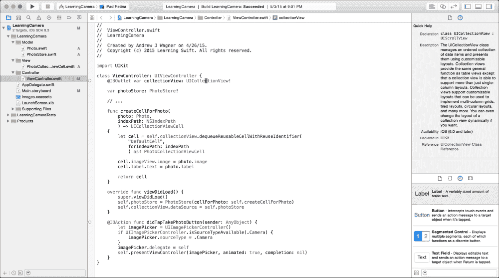
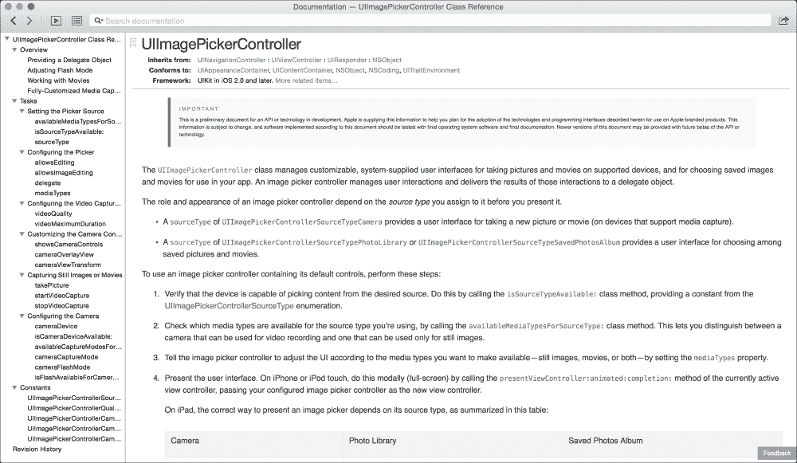

# 第十二章。接下来是什么？ – 资源、建议和下一步

到目前为止，我们在书中已经涵盖了大量的内容。Swift 不是一个小的主题，而应用开发本身比这大得多。我们学习了 Swift 的大部分内容，但涵盖语言的所有小特性并不实用，而且 Swift 仍然是一个新且不断发展的语言。您永远不可能在不参考的情况下记住您所学的一切。您始终可以参考这本书，但苹果的文档也可以作为一个很好的参考。除此之外，如果您真正想成为一名熟练的 Swift 开发者，您可以通过始终学习和进步来确保您的成功。在没有外界帮助的情况下做到这一点是非常困难的。确保您跟上时代的最佳方式是关注并参与您最感兴趣的任何主题的社区。在本章中，我们将介绍如何使用苹果的文档，以及一些关于您可以在哪里找到并参与 Swift、iOS 和 OS X 开发者社区的建议。更具体地说，在本章中，我们将涵盖以下内容：

+   苹果的文档

+   论坛和博客

+   显著人物

+   播客

# 苹果的文档

苹果投入了大量的时间和精力来维护其文档。这些文档经常是确定您如何与他们框架交互的非常有价值的工具。

Xcode 实际上与文档集成得相当好。查看文档的主要方法之一是在**快速帮助**检查器中查看。您可以通过从主菜单导航到**视图** | **实用工具** | **显示快速帮助检查器**来显示它。此检查器显示您当前光标所在的代码的文档。如果该特定类、方法或函数是苹果框架的一部分，您将获得一些有关它的快速帮助，如下面的截图所示：

这里光标位于`UICollectionView`上，因此**快速帮助**检查器为我们提供了关于它的高级信息。

如果您需要更多信息或想要进行更多探索，也可以在单独的窗口中查看文档。您可以通过导航到**帮助** | **文档和 API 参考**来打开此窗口，并可以搜索您想要的任何主题。然而，您也可以通过按住**选项**键并双击它来直接跳转到特定代码的文档。例如，如果您按住**选项**键并双击`isSourceTypeAvailable`，您将获得以下完整的文档窗口：

此窗口的功能与网页非常相似。您可以通过点击任何链接或搜索一个完全不相关的主题来在文档中导航。您还可以使用屏幕左侧的大纲视图跳转到文档页面的特定部分。

当你已经对框架的哪些部分需要用于特定任务有一个大致的了解时，这份文档尤其有用。然后你可以使用这份文档来了解如何正确使用框架的这一部分。随着你对苹果的框架越来越熟悉，这将会变得更加有用，因为记住你用于所有常见任务的框架部分相对容易，但记住它们的确切工作方式则要困难得多，而且往往不切实际。然而，有时文档还不够。下一个你应该寻找答案的地方是网上。

# 论坛和博客

在编程过程中遇到问题或疑问时，几乎可以肯定的是，其他人已经遇到过类似的问题，而且很可能有人已经某处写下了关于它的内容。在你直接在论坛上提问之前，我强烈建议你先自行搜索。首先，你想要节省社区成员的宝贵时间。如果他们不断地重复回答同样的问题，那么他们投入到真正新问题上的时间就会少得多。其次，你常常会发现，在思考如何搜索答案的过程中，你自己就能找到答案。最后，随着你不断练习，你将变得更加擅长搜索编程相关的问题。与找到自己的答案相比，论坛通常要慢得多，显然时间就是金钱。

大多数时候，当你使用搜索引擎查找问题时，你将找到两种主要的资源类型，它们提供了答案：博客文章和论坛。

## 博客文章

与书籍类似，博客文章非常适合更大、更高层次的概念。你可能搜索的内容，例如：“永久存储信息的方法”，你可能会找到许多讨论不同方法的博客文章。博客文章在这方面通常更好，因为它们可以讨论不同解决方案的细微差别，而且它们不受限于针对小问题。

博客文章也可以用于解决极其深入和复杂的问题。例如，我们从 32 位处理器迁移到 64 位处理器，有一些重大的和复杂的影响。真正理解潜在问题对于你未来的发展将比找到你当前问题的快速解决方案更有价值；如果你找不到书籍，博客文章是理想的选择，可以给你提供那种理解。

## 论坛

表单在提供针对特定问题的快速解决方案方面非常出色。最常见的形式可能是 [`stackoverflow.com/`](http://stackoverflow.com/) 和 [forums.developer.apple.com](http://forums.developer.apple.com)。在这些网站上，有非常专注的社区成员在回答和提问。苹果开发者论坛甚至有苹果员工回答问题。提出好问题与回答问题一样重要。这些网站不仅作为获取新问题答案的方式，而且作为未来寻找答案的人的活文档。一个结构良好的问题更容易得到回答，也更容易被搜索引擎找到。

Stack Overflow 上有关于如何提出好问题和答案的优秀文档，但一般来说，它们应该具备以下特点：

+   明确并清晰地说明您所请求的内容。

+   让其他人容易在自己的系统上重现问题。

+   通过在提问时尽可能多地投入努力，尊重任何回答者的时间。

最后一点是最重要的。您希望将问题表述得让比您知识更丰富的人能够精确地锁定问题，而不是浪费时间在您自己可以解决的问题上。这通常意味着描述您已经尝试过的所有事情以及您遇到的障碍。您越清楚地表明您已经投入了真正的努力来解决该问题，您从社区那里得到的反响和答案就会越好。我甚至无法计算我在论坛上撰写问题时解决了多少问题。这种类型的解决方案将比别人给出的解决方案更容易记住，并且更持久。

# 杰出人物

在使用特定语言和/或框架进行编程方面越有经验，就越有可能陷入以相同方式反复解决问题的模式。很可能会发现其他人已经找到了更好的解决同样问题的方法，而且某处有人正在讨论它。即使你自己没有参与其中，你也必须至少观察社区。

跟随社区中的杰出人物是了解社区的最佳方式之一。例如，对于 Swift 来说，关注 Swift 的原始创建者克里斯·拉特纳（Chris Lattner）是一个很好的主意。尽管现在有很多人在开发 Swift，但他曾独自开发了一年多，并且继续在苹果公司的开发者工具部门工作。您可以在 Twitter 上关注他 `@clattner_llvm`，并且关注他在苹果开发者论坛 [`devforums.apple.com/people/ChrisLattner`](https://devforums.apple.com/people/ChrisLattner) 的活动也可能很有用。您可以通过点击 **邮件更新** 按钮来接收关于他活动相关的邮件。

除了 Chris Lattner 之外，还有很多其他有价值的人值得关注，但只有你自己能决定谁对你有价值。注意你在社区中看到很多名字的人，并找出他们是否有博客、播客或任何其他你可以了解他们观点的地方。

# 播客

如果你不太熟悉播客，它们是一种非常宝贵的方式，以相对被动的方式跟上几乎所有话题。它们本质上是可以订阅的按需广播节目，你可以随时收听，比如在开车、做家务或锻炼时。这就是为什么它们特别有价值：它们可以把相对无聊的情况变成极好的学习机会。

苹果在 iOS 中内置了播客应用，你可以使用它，或者应用商店中还有许多其他播客应用，我建议你检查一下。这些应用中的大多数都包括发现机制，这使得找到新的播客更容易，许多播客也会谈论他们推荐的播客。

推荐具体的播客比较困难，因为大多数开发播客的持续时间并不长。制作播客需要花费大量的时间和精力，所以很多人只是做了一段时间，然后长时间休息或决定在某段时间后停止。然而，由于播客的按需性质，回过头去听旧的播客集仍然非常有价值。以下是一些很好的播客，可以帮助你开始：

+   **核心直觉**：来自知名开发者 Daniel Jalkut 和 Manton Reece 关于一般开发主题的优秀播客。

+   **意外科技播客**：由行业大腕包括 Marco Arment（对我而言是一位非常鼓舞人心的开发者）在内的苹果相关科技讨论。

+   **低调播客**：一个简洁且内容丰富的播客，总是 30 分钟或更短，但经常包含围绕独立苹果开发的宝贵信息片段。它由 Marco Arment 和 David Smith 主持，另一位鼓舞人心的开发者。

有些播客非常有价值和有趣，你会想听每一集。有些播客非常适合挑选和选择对你来说有趣和相关的集数。无论你做什么，我建议你不要错过这个免费且容易的机会，以跟上开发社区的发展。 

# 摘要

本章的篇幅虽短，但其重要性却十分显著。如果在阅读完这本书后我能给你留下什么，那就是最好的开发者知道如何从我们可利用的众多来源中寻求并找到自己的解决方案。有时这些解决方案就在像这样的书中；有时则存在于文档、博客文章、论坛、播客，甚至是与其他人的对话中。那些不仅能找到这些解决方案，还能将它们整合并真正理解的开发者，将在他们整个职业生涯中变得极其宝贵。然而，如果你在开始时感到不知所措，请不要担心，因为我们都从那里开始。一次专注于一个问题，不要满足于看似可行的解决方案。确保你理解你实施的每一个解决方案，你将很快，甚至可能没有意识到，成为一个极其熟练的开发者。
