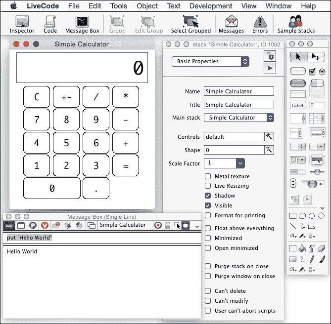
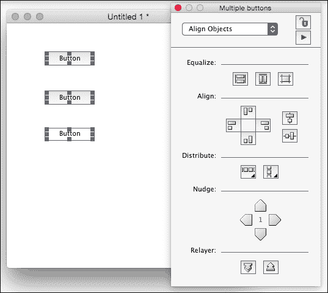
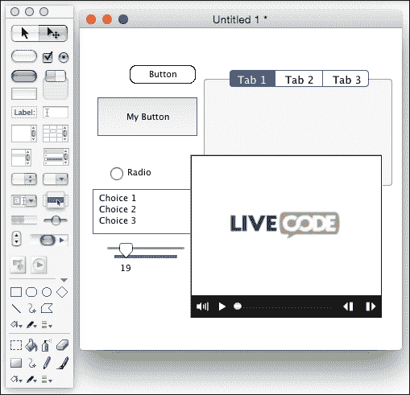
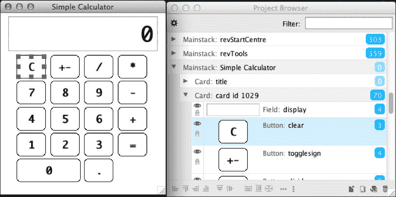
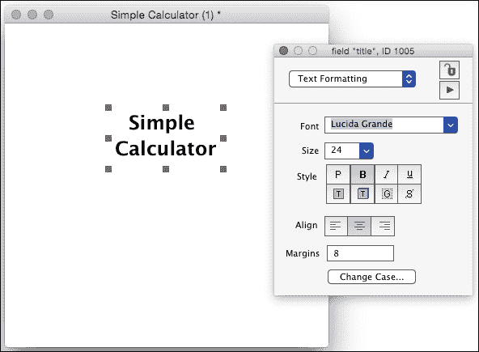
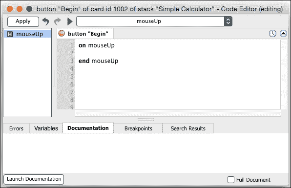
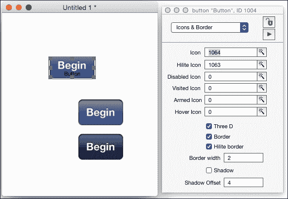
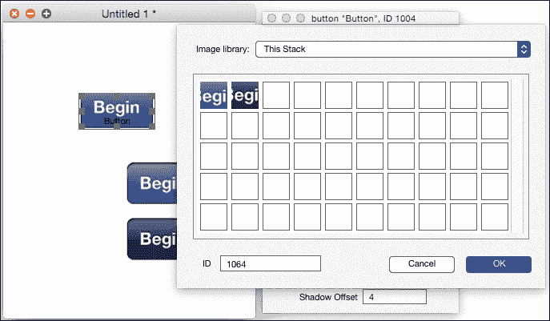
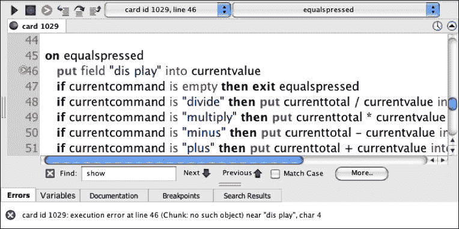

# 第一章。LiveCode 基础知识

*这一章适合你吗？*

*LiveCode 拥有类似英语的编程语言、图形开发环境和易于理解的架构隐喻。当你创建一个应用程序时，你花更多的时间思考如何实现不同的功能，而不是你使用的工具的复杂性。然而，如果你以前从未使用过 LiveCode，它最初仍然会感到陌生。本章旨在让你跟上进度，并为后续章节做好准备，这些章节将需要你更熟悉这个工具的术语和功能。*

所有 LiveCode 都很容易，但有许多容易学习的东西！在整本书中，我们将探讨这些内容，特别是你可以用于移动应用的内容，但首先，我们应该回顾一些基础知识。

在本章中，我们将：

+   熟悉 LiveCode 环境

+   探究 LiveCode "堆栈"的层次结构

+   创建一个简单的计算器应用程序

+   了解许多不同的界面控件

那么，让我们开始吧。

# 背景历史和隐喻

许多开发工具只提供编程语言和系统例程的编程接口。高级工具通常以相同的方式提供这些内容，但结构得如此之好，以至于可以为工具的不同方面想出现实世界的隐喻。LiveCode 非常像这样，其隐喻是一堆卡片。这个隐喻起源于 20 世纪 80 年代中期的苹果电脑 HyperCard 创作工具，该工具由比尔·阿特金森创建。HyperCard 的第一个版本于 1987 年 8 月发布，并在教育和多媒体领域取得了巨大成功。像 Voyager 公司这样的公司，发布了其整个产品线，这些产品都是使用 HyperCard 创建的。

其他公司生产的工具与 HyperCard 非常相似，但它们也试图为用户提供比 HyperCard 更多的功能。其中最突出的是 SuperCard、Plus 和 MetaCard。Plus 继续拥有一个有趣的生命周期；该产品本身最初是跨平台的（最初是 Windows-only），但后来，相同的代码最终出现在 Oracle Media Objects 跨平台工具中。所有这些工具都延续了卡片堆栈的隐喻。

MetaCard 最显著的特点是它是多平台的，而不仅仅是跨平台的。"Stacks"是这些工具创建的文档的通用术语，使用 MetaCard 创建，在 Unix 和 Linux 系统上运行，以及 Mac 和 Windows。遗憾的是，它有点丑！苏格兰公司 RunRev 推出了一款产品，试图以更有吸引力的方式展示 MetaCard。最终，RunRev 收购了 MetaCard，自 2003 年以来，RunRev 一直使用产品名称 Runtime Revolution（后来更名为 LiveCode）在此基础上进行构建。

### 注意

在 2015 年 3 月，RunRev 还将公司名称更改为 LiveCode Ltd。本书中有许多关于 [`runrev.com/`](http://runrev.com/) 的引用，并且应该继续这样维护。然而，如果您遇到 URL 问题，请将其替换为 [`livecode.com/`](http://livecode.com/) 或在 LiveCode 网站上搜索。

在 2013 年，RunRev 成功地发起了 Kickstarter 营销活动，并筹集了 494k 英镑（775k 美元）的资金，以使 LiveCode 开源。LiveCode 的 6.0 版本于 2013 年 4 月发布，作为第一个开源版本。这导致了一个活跃的开发周期，接近 20 个稳定版本，最终在 2014 年 10 月推出了 LiveCode 的 7.0 版本。本书的这一版基于 LiveCode 的 7.0 版本。

7.0 版本的亮点包括对 Unicode 的支持、显示分辨率独立性、可拉伸图形、使用新浏览器的混合应用程序、Mac Cocoa 支持、Raspberry Pi 支持、64 位 Linux 支持，等等。您可以在 2014 年 10 月 23 日的通讯录第 180 期中了解更多关于 LiveCode 7.0 的信息。[`newsletters.livecode.com/october/issue180/`](http://newsletters.livecode.com/october/issue180/)。所有 LiveCode 通讯录都可在 **LiveCode 帮助** 菜单下找到。

在 2014 年，RunRev 又发起了另一场融资活动，以支持 HTML5，并额外筹集了 395k 美元。这种能力和具有开放语言支持的 LiveCode 8.0 版本在 附录 *扩展 LiveCode* 中进一步描述。

在卡片堆栈隐喻的 HyperCard 变体下，文档由包含按钮、字段和位图图形的卡片组成；包含一组卡片的背景；以及包含一组背景的堆栈。LiveCode 采用略微不同的方法，而不是有包含卡片的背景，它允许您将任何一组界面控件分组，并将这些控件设置为作为背景实体来操作。这些最终变得更加灵活，尽管对于大量使用 HyperCard 的人来说可能有些陌生。

HyperCard 和 LiveCode 都提供了进一步扩展层次结构的方法。您能够链接其他堆栈。为了节省时间，您可能选择拥有一个专门用于这些函数的堆栈，并且可以使用以下命令将该堆栈添加到 `stackInUse` 属性中：

```java
start using stack "utility stack"

```

此外，您还可以编写“外部”程序，这些是使用 C 语言编写的命令和函数，可以进一步扩展 LiveCode 的功能。

# 你确实有 LiveCode，不是吗？

如果您尚未安装 LiveCode，请访问 [`livecode.com/download`](http://livecode.com/download) 并下载适用于您的开发平台的社区版。这个版本是开源的，并且免费使用。您需要提供您的姓名和电子邮件，这将为您在 LiveCode 中建立一个用户账户。在撰写本书时，您还可以获得一个免费的 App 设计套件，其中包括一个介绍视频和一个移动 `app2market.livecode` 模板。

如果您计划购买商业版 LiveCode，请阅读[`www.runrev.com/store/`](http://www.runrev.com/store/)，了解那里提供的许多许可证变体。作为一个粗略的指南，基于撰写本书时的价格，要创建免费移动应用程序，成本将是 99 美元，如果您想制作可以收费的应用程序，成本将是 299 美元。额外的使用和支持级别需要额外付费。

LiveCode 的两个版本也有独特的配色方案，商业版使用蓝色元素，社区版使用绿色元素。

一旦您下载了社区版或购买了商业许可证之一，就可以启动它了！

# 了解环境布局

当您第一次打开 LiveCode 时，会显示一个开始中心窗口，它充当打开最近文档、链接到论坛和获取开始信息列表或查看促销信息的方式。保持该窗口打开没有害处，但如果您关闭了它，可以从**帮助**菜单重新打开它。您还可以通过从**视图**菜单中选择**背景**来隐藏屏幕上的其他应用程序窗口。

如果您第一次使用 LiveCode，您会注意到屏幕顶部的工具栏，位于菜单栏下方。请注意最右侧的项目，例如**示例堆栈**、**教程**、**资源**和**字典**。这些区域充满了帮助您开始使用 LiveCode 的信息。**字典**是您会经常使用的东西，浏览条目要么会立即回答您的问题，要么会提供有关您以后可能遇到的问题的详细信息。

**帮助**菜单还提供了访问**用户指南**和链接到其他有用信息的途径。请查看**用户指南**部分，深入了解这里提到的功能。

## 在线课程

除了 LiveCode 本身内部看到的资源之外，RunRev 网站上还有大量信息和许多教程。一个好的起点是[`lessons.runrev.com/`](http://lessons.runrev.com/)。

此截图显示了我们将要使用的窗口和调色板，以及文档窗口，这是一个我们将很快构建的简单计算器：



## 主要窗口

除了文档窗口本身之外，以下是我们现在需要熟悉的几个主要窗口：

+   工具调色板

+   检查器调色板

+   消息框

工具调色板的上部显示了您创建交互式应用程序所需的所有界面控件。在这些控件下方是一组用于编辑矢量图形的工具和一组用于编辑位图图形的工具。

检查器调色板显示了您当前所选控件的全部选项。在前面的屏幕截图中，计算器应用程序中没有选择任何内容，因此检查器调色板显示了堆栈本身的信息。

消息框是一个窗口，允许你尝试单行或多行代码。你还可以在堆栈中调用函数，这使得在追踪问题时测试单个函数变得非常方便。我们将在后面的章节中使用消息框。

如建议的那样，阅读用户指南以深入了解这些窗口，但现在让我们尝试组合一些简单的内容，以便你更熟悉如何使用工具调色板。

# 现在是行动时间——虽然有点麻烦，但你一定会喜欢的！

你在 LiveCode 中通过从工具调色板拖动图标到堆栈窗口中来构建东西。如果调色板尚未打开，可以通过单击工具栏左端的图标或从**对象**菜单中选择检查器菜单项来打开检查器调色板。可以通过从**工具**菜单中选择**工具调色板**并使用以下步骤来打开工具调色板

1.  从**文件**菜单中选择**新建主堆栈**。

1.  在**工具**调色板中，单击**编辑**工具（右上角的图标）。

## 选择编辑或不…

在 LiveCode 中，你可以不选择**编辑**工具，直接从工具调色板将控件拖动到卡片窗口中。然而，你无法选择控件来调整其位置或大小，因此，在以下说明中，我们故意在向卡片窗口添加控件之前选择**编辑**工具：

1.  将工具调色板上方的图标拖动到堆栈窗口中。

1.  尝试**对象**菜单底部的分层选项。

1.  选择多个项目，并在检查器调色板中实验**对齐对象**选项。当你选择多个对象时，对齐选项会自动显示，但你也可以从检查器调色板的下拉菜单中选择**对齐对象**。如果只选择了一个对象，则不会看到此选项。在这里，我们能够看到这些选项，因为选定了三个按钮：

1.  选择一个按钮，并在检查器调色板中输入一个名称和标签。如果你看不到**名称**和**标签**字段，请确保你已经从检查器调色板的下拉菜单中选择了**基本属性**。

1.  向卡片窗口添加更多控件，并练习对齐和命名控件。你还可以在控件被选中时通过拖动角落和边上的手柄来调整它们的大小。如果你添加了一些按钮、字段、标签页面板、滑块和视频播放控件，窗口将看起来如下：

## *刚才发生了什么？*

希望你已经创建了一堆随机的界面控件，也许还有一些排列得很好的！现在，从**文件**菜单中选择**关闭并从内存中删除**选项，创建一个新的**主堆栈**以制作简单的计算器界面。

首先，我们应该回顾一下 LiveCode 堆栈的结构和层次结构，并创建一些基本的导航。

## 创建层次结构

所有的东西都有其去处，但东西放在错误的地方可能会导致问题。我们应该更多地了解 LiveCode 堆栈的结构，以避免这种情况。

## 堆栈结构

如在*背景历史和隐喻*部分所述，LiveCode 使用卡片堆栈的隐喻。当你创建一个新的堆栈时，实际上你有一个单独的卡片堆栈。然而，即使是最简单的应用程序也可能包含多个卡片。例如，可能有启动屏幕、标题卡片、实际任务卡片和致谢页面。在计算器堆栈中，我们将使用两个卡片。**工具**菜单包括一个选项，可以通过显示**项目浏览器**或**应用程序浏览器**来查看堆栈的结构。项目浏览器是在 LiveCode 6.0 版本中引入的，并增加了额外的功能。

项目浏览器面板是一个强大的工具，它允许你在一个窗口中看到所有打开的堆栈、卡片和控制。除了获得全面的概述外，你还可以将其用作远程控制，在堆栈的所有部分之间跳转，并选择和修改按钮、字段等。

以我们即将制作的计算器堆栈为例，在下面的屏幕截图中，我们看到堆栈窗口和项目浏览器面板的并排视图，在**项目浏览器**面板中，我们已选择堆栈中的一个按钮：



**项目浏览器**的上部区域包括一个字段，你可以在此处输入和搜索文本，以减少浏览器中项目的列表，以匹配你输入的内容。在面板的左上角是一个齿轮图标，用于将你带到浏览器的首选项：

浏览器窗口的大部分区域允许你展开堆栈和卡片，并选择那些卡片上的单个控件。在**项目浏览器**中点击一个控件会在堆栈窗口中突出显示它，反之亦然。控件也可以通过上下拖动来重新排序以改变层级。通过点击眼睛和锁图标，控件也可以被隐藏或锁定。下方的区域按钮允许你执行所选控件的多种对齐方式，以添加或复制所选控件。将鼠标悬停在按钮上会显示一个弹出窗口，显示其功能。

关于项目浏览器如何工作的更详细概述可在以下链接找到：

[`www.runrev.com/newsletter/april/issue151/newsletter4.php`](http://www.runrev.com/newsletter/april/issue151/newsletter4.php)。

## 代码去哪里了？

在编程语言中，例如 LiveCode 中的编程语言，*代码*被称为**脚本**，而*方法*或*函数*被称为**处理程序**（尽管在 LiveCode 中，返回值的处理程序也称为函数）。使用难以使用的编程工具创建的项目通常包含数十个外部文本文件，每个模型、视图或控制器一个。在 LiveCode 中，这要简单得多，因为脚本被附加到需要该代码的对象上。

为了处理其他工具中的用户交互，你必须编写接收事件的代码（可能只是按钮上的鼠标点击）以执行相关操作。在 LiveCode 中，有一个消息路径负责这些事件，并将事件向上传递到层次结构。如果你点击一个没有鼠标事件处理程序的 LiveCode 界面控件，点击将向上传递到卡片级别。如果卡片没有为该事件提供处理程序，它将继续向上传递到堆栈级别。

通过使用其他堆栈，你可以有额外的层次结构级别，但就我们的目的而言，我们只需要这三个：按钮、卡片和堆栈。

这种消息层次结构允许我们在多个界面控件中放置所需的代码，这些控件在更高层次上对所有这些控件都是可用的。计算器数字按钮的一个例子是，每个都需要执行完全相同的事情，通过将代码放在卡片级别，所有这些都可以使用那个处理程序。

如果你在卡片级别有共享处理程序，或者文件大小有显著改进，那么并没有性能优势，但在为简单的计算器示例编写代码时，你可以在单个卡片脚本中而不是 11 个计算器按钮脚本中进行更改。

现在我们将开始构建计算器，并将脚本添加到 14 个按钮、一个字段和卡片中。

# 行动时间 - 制作卡片并在它们之间导航

计算器其实不需要标题屏幕，但为了练习添加脚本和进行一些基本导航，我们还是做一个吧。从**文件**菜单开始一个新的 Mainstack，并打开**检查器**调色板。

1.  在**检查器**调色板中，在**名称**字段中输入`Simple Calculator`堆栈名称。

1.  从**对象**菜单中选择**新建卡片**。

1.  使用**视图**菜单转到上一张卡片（**上一张**）或第一张卡片（**第一张**）。

1.  确保你在**工具**调色板中选择了**编辑**工具，并将**标签**字段拖到卡片窗口的中间。在这种情况下，你可以很容易地看到哪个是**标签**字段（图标上写着**标签：**），但作为一个一般提示，你可以将鼠标悬停在**工具**调色板中的控件上，并查看显示控件类型的帮助提示。

1.  在**检查器**调色板的**基本属性**部分，取消选中**不换行**复选框。

1.  在**名称**输入字段中输入`title`。

1.  从**检查器**下拉菜单中选择**内容**，并将初始文本“**标签：**”替换为在**内容**输入字段中输入`Simple Calculator`。

1.  从下拉菜单中选择**文本格式化**，然后点击中间的三个**对齐**按钮中的**居中对齐**按钮。

1.  更改字体、大小和样式选项以制作一个看起来不错的标题，调整字段本身的大小，直到你喜欢它的外观：

1.  从**工具**调色板中拖动一个**推**按钮（位于**工具**调色板左上角第二个图标）并将其放置在标题字段下方。

1.  在**检查器**调色板中，从下拉菜单中选择**基本属性**（在先前的截图中说**文本格式化**的菜单）并在**名称**输入字段中输入`Begin`。尽管你未在**标签**输入字段中输入，LiveCode 也会自动显示与按钮标签相同的文本。

1.  如果你愿意，也可以进入按钮的**文本格式化**选项！

1.  在心理上做好准备；我们即将输入我们的第一个脚本！

1.  在按钮被选中时，从**对象**菜单中选择**对象脚本**。你也可以右键单击按钮本身并选择**编辑脚本**。

1.  脚本窗口将出现，并显示一个`on mouseUp`的起始脚本、空白行和`end mouseUp`，如下截图所示：

通过在空白行中键入`go next`来完成脚本，得到以下最终脚本：

```java
on mouseup
  go next
end mouseup
```

现在，执行以下步骤：

1.  关闭脚本窗口，当询问是否要保存更改时，点击**是**。

1.  从**工具**调色板（看起来像普通光标箭头的最左上角工具）中选择**浏览**工具，并点击你刚刚创建的**开始**按钮。如果一切顺利，你现在应该看到一个空白卡片。别担心，你并没有删除标题字段和按钮！你现在在之前创建的两个卡片中的第二个卡片上。再次使用**视图**菜单回到第一个卡片，再次尝试按钮。

1.  从**文件**菜单中选择**保存**，并将名为`Simple Calculator`的堆栈保存在你稍后容易找到的地方。也许，你可以创建一个文件夹来存放你在这本书阅读过程中制作的几个堆栈。

## *刚才发生了什么？*

这些步骤可能看起来很多，但我们确实创建了所需的两个卡片，布置了一个看起来不错的标题字段和一个带有自己脚本的开始按钮。实际上，这些步骤不到两分钟就能完成，随着你在 LiveCode 中积累经验，操作会更快。

## 快速问答 - 选择最佳名称？

如果你想在多媒体制作工具领域取得成功，以下哪个名字是不合适的？

1.  亨利

1.  比尔

1.  鲍勃

1.  凯文

答案：1

在多媒体的早期，似乎每个人都有一两个流行的名字。有比尔·阿特金森，他创建了 HyperCard，还有比尔·阿普尔顿，他创建了 SuperCard。凯文·卡尔霍恩曾是一段时间 HyperCard 的主要程序员，凯文·米勒是 LiveCode 的负责人。鲍勃·斯坦是 Voyager 公司的创始人之一，他与鲍勃·阿贝尔一起是视觉效果领域的先驱。丹是一个很好的选择，因为丹·温克勒是 HyperTalk 语言的作者，丹尼·古德曼是许多著名编程书籍的作者。如果你想制造汽车或者娶很多王后，亨利会是一个好名字。

# 制作一个简单的计算器应用程序

即使对 LiveCode 只有基本的熟悉度，你也能开始制作一些有用的东西。在这里，我们将制作一个非常简单的计算器堆栈。

## 检查器提示，哦！

你会发现自己在很多情况下都会使用检查器调色板；所以，花点时间研究一下它的行为。当你选择卡片上的一个对象时，你会看到检查器调色板会改变其外观，有时甚至高度也会改变，以显示你选择的项目的选项。它足够智能，能够注意到当你选择了多个项目时，并显示对齐工具。

有时候，你可能想要保持检查器调色板以查看卡片上特定对象的选择，而不是在做出其他选择时切换以显示不同的对象。在检查器调色板的右上角有一个锁形图标，这将允许你将检查器锁定到当前对象。

到目前为止，检查器调色板的大多数选项还没有影响我们，但即将变得相关的一个事实是，你可以为项目设置一个与标签不同的名称。你可能从其他编程语言中知道，这也适用于 LiveCode，有些名称比其他名称合法。也许你无法在名称中使用空格，或者使用冒号或反斜杠。如果你用数字命名一个按钮，按钮“1”可能不是按钮 1，这可能会导致混淆。

对于计算器键，我们将设置一个标签使其看起来正确，并设置一个不会引起混淆的名称。说到那些计算器键……

# 开始行动——制作计算器按钮

以本章开头所示的截图作为指南，让我们构建计算器按钮（如果你稍后想确保你正确地输入了这些脚本，下面列出的脚本也会列出）：

1.  如果你还没有到那里，请转到第二张卡片，当前为空的卡片。

1.  确保在**工具**调色板中选中了**编辑**按钮，并将一个**推按钮**拖到卡片上，放置在`7`按钮的位置。

1.  在检查器调色板的**基本属性**面板中，将**样式**下拉菜单设置为**圆角矩形**（在现实生活中，你会花时间制作漂亮的图形按钮；这里，你只是在匹配我的丑陋的“程序员艺术”！）。

1.  将按钮的名称设置为`number7`，标签设置为`7`。

1.  从 **对象** 菜单中选择 **对象脚本**，就像你使用 **开始** 按钮那样查看起始脚本。

1.  在 `on mouseUp` 和 `end mouseUp` 之间的空白行中输入 `numberPressed the label of me`。注意，`numberPressed` 是一个需要稍后定义的新处理程序。当使用时，`me` 指的是当前对象；在这种情况下，是按下的按钮。

1.  关闭并保存脚本。

1.  选择按钮，通过从 **编辑** 菜单中选择 **复制对象** 来制作一个副本，并将其放置在 **8** 按钮的位置。复制/粘贴和 *Alt*-拖动是复制对象的另外两种方法。

1.  将名称设置为 `number8`，并将标签设置为 `8`。

1.  使用相应的数字而不是 `8`，对按钮 9、4、5、6、1、2、3、0 和小数点重复步骤 8 和 9。对于小数点，让名称为 `decimalpoint`。

1.  再次复制一个按钮，将新按钮命名为 `divide`，并将其标签设置为 `/`。

1.  为除法按钮选择 `Object Script`，并将中间行的 `numberPressed` 改为 `operatorPressed`，使整行变为 `operatorPressed the short name of me`。

1.  再复制除法按钮三次，并将名称分别设置为 `multiply`、`plus` 和 `minus`。将标签分别设置为 `*`、`+` 和 `-`。

1.  再次复制除法按钮，为新按钮命名为 `equals`，标签为 `=`，并将脚本中间行改为 `equalsPressed`。

1.  复制 **=** 按钮，并将新按钮的名称设置为 `toggleSign`，标签设置为 `+-`；然后，将脚本中间行改为 `toggleSign`。

1.  复制 **=** 按钮，并将新按钮的名称设置为 `clear`，标签设置为 `C`；然后，将脚本中间行改为 `clearPressed`。

1.  从 **工具** 面板拖动一个 **标签** 字段到 **检查器** 面板，从下拉菜单中选择 `Text Formatting`。在 `Text Formatting` 设置中，选择一个看起来不错的字体，右对齐文本，并设置大字体大小。将字段命名为 `display`。

1.  编辑 `display` 字段的脚本。对于字段，你不会得到与按钮相同的起始脚本，因此你需要自己输入 `mouseUp` 行。在脚本中输入这三行：`on mouseUp`、`set the clipboarddata["TEXT"] to me` 和 `end mouseUp`。请确保在 `"TEXT"` 两边输入引号。

1.  将所有按钮移动到正确的位置，并选择按钮组然后使用对齐工具，使计算器布局与截图匹配。

1.  现在保存它！

## *刚才发生了什么？*

现在发生了很多事情！我们已经创建了所有的卡片级别对象并输入了它们的脚本。大多数脚本都是“调用”一个我们将要设置的卡片级别处理程序。在这样做之前，尝试理解我们刚刚输入的一些行是值得的。

## 详尽性、同义词和 "me"

LiveCode 中的编程语言具有英语般的性质，非常强大，但非常严格。在其他一些工具中，你可以选择是否使用冗长的英语语法、简洁的语法，或者称为 *点语法* 的语法。Adobe Director 中的 *Lingo 语言* 是一个很好的比较。

假设我们想要更改字段内的文本，即导演电影演员表的第一条记录，我们可以执行以下冗长的语法：

```java
put "hello world" into the text of member 1
```

我们可以执行一种稍微不那么冗长的语法：

```java
the text of member 1 = "hello world"
```

或者，我们可以执行点语法：

```java
member(1).text = "hello world"
```

在 LiveCode 中，没有选择。你必须以以下形式输入：

```java
put value into container
```

然而，你确实可以选择使用单词的完整形式、简短形式或缩写形式。还有同义词，这允许你使用对你更有意义的单词。

这里是两种表达相同意思的方式，第二种变体使用了关键词的缩写形式：

```java
put character 3 of word 2 of card field "name of field 1" into aVariable
put char 3 of word 2 of fld 1 into aVariable
```

当你处理运行脚本的对象的内 容时，你可以使用关键词 `me` 来节省一些输入，如果可能的话，LiveCode 也会尽力理解你的意图。

以我们输入的行为例：

```java
numberPressed the label of me
```

在这里，`numberPressed` 将传播到我们将要添加（很快）的卡片处理程序，而 `the label of me` 将查看脚本所在的对象的标签：

```java
set the clipboarddata["TEXT"] to me
```

在这种情况下，`me` 通常指的是对象（就像 `the label of me` 的情况一样），但由于我们提供了额外的线索 `["TEXT"]`，LiveCode 就知道脚本和文本内容是字段的一部分，而不是字段本身。尽管如此，由于存在混淆的可能性，在以后阅读自己的代码时，你可以添加一些词语来使意思更加清晰：

```java
set the clipboarddata["TEXT"] to the text of me
```

### 注意

顺便说一句，显示字段脚本对于计算器的工作不是必需的。它只是在那里，以便在任何时候，你都可以点击字段，将当前值复制到剪贴板，以便在其他应用程序中粘贴。

你可能会选择比必要的更冗长，只是为了可读性，在这些章节中，情况就是这样。通过使用以下方式，更容易知道将要发生什么：

```java
put the text of me into textvariable
```

与前面的条目相比，以下内容将更加简洁，尽管它们同样有效：

```java
put me into textVariable
```

在任何情况下，由于它是一个字段，LiveCode 都知道你的意图。

你在脚本中看到我们输入了 `short name of me`，这是怎么回事？LiveCode 中的对象有一个关于它们位置的详细描述，例如，`buttonname` 按钮位于 `path/to/stack.livecode` 栈的 `1234` 卡片 ID 上。在计算器应用程序中，我们只需要你设置为按钮名称的单个单词。如果我们请求 `name of me`，它仍然会说“`buttonname` 按钮”。为了只获取名称本身，我们使用 `short name of me`。

有时候你会想要使用`name`的其他变体，包括长名称和缩写名称，你可以在 LiveCode 字典条目中阅读有关`name`的信息。除了描述如何使用`name`的不同方式外，还有一些注意事项你需要注意。

### 小贴士

**大小写敏感性**

如果你们中的任何一位使用了高级 LiveCode，可能会注意到在某些情况下，我使用了错误的字母大小写。LiveCode 并不介意你使用了哪种大小写，所以当我错误地说成`clipboarddata`而不是`clipboardData`时，这并不重要。这个特性并不仅限于 LiveCode，但在接近英语的编程语言中，这是常见的，它们不会在命令执行前要求用户必须完全正确地使用大小写。

## 添加卡片处理程序

如果你敢尝试使用计算器按钮，你会看到很多脚本错误。我们需要添加卡片级别的处理程序，以便成为按钮发出的调用接收端。与其逐行引导你，一次输入一行代码，可能更快的方法是一次性展示所有行并解释每行的作用。作为练习，以下是到目前为止我们输入的行：

在所有数字按钮和小数点按钮上，你应该有这个脚本：

```java
on mouseup
  numberPressed the label of me
end mouseup
```

当你在`numberPressed`调用时按下并释放左鼠标按钮时，将触发`on mouseUp`事件。此事件将调用一个名为`numberPressed`的卡片处理程序，并传递你为包含此脚本的按钮设置的标签。

**C**（清除）按钮有这个脚本：

```java
on mouseUp
  clearPressed
end mouseUp
```

`clearPressed`事件将调用一个名为`clearPressed`的卡片脚本。

其他按钮的工作方式相同；它们调用一个使用该名称的处理程序，我们即将将其添加到卡片脚本中。这是**+**、**-**、*****和**/**按钮的脚本，将按钮的名称传递到卡片级别：

```java
on mouseUp
  operatorPressed the short name of me
end mouseUp
```

以下脚本是为加号按钮准备的：

```java
on mouseUp
  toggleSign
end mouseUp
```

显示字段有这个脚本：

```java
on mouseUp
  set the clipboardData["TEXT"] to me
end mouseUp
```

在字段的情况下，只执行一行代码，所以不需要将其放在卡片级别上，除非我们有很多字段做同样的事情。

那么，我们为什么不添加所有这些卡片级别的脚本呢！我们将逐个处理它们，并解释每个脚本是如何工作的。但首先，让我们看看 LiveCode 是如何处理变量的。

### 小贴士

**下载示例代码**

你可以从你购买的所有 Packt 书籍的账户中下载示例代码文件。[`www.packtpub.com`](http://www.packtpub.com)。如果你在其他地方购买了这本书，你可以访问[`www.packtpub.com/support`](http://www.packtpub.com/support)并注册以直接将文件通过电子邮件发送给你。

## LiveCode 中的变量类型

一般而言，变量是存储你稍后需要访问的值的内存位置，但在大多数编程语言中，你可以指定哪些例程可以访问哪些变量。不那么像英语的语言可能包括`public`、`private`和`protected`等术语。在 LiveCode 中，事情并没有那么不同，但使用的词汇更准确地描述了变量可以使用的区域。如果一个变量要在任何地方都可见，它将是`global`。如果它只是要在当前脚本中使用，它将是`local`。

LiveCode 还具有自定义属性变量，顺便提一下，许多人会使用这些变量来执行计算器按钮的值，而不是依赖于按钮的标签。也许，我们以后会用到它们！

现在，我刚才说到哪里了……哦，是的，卡片级别脚本。这是卡片脚本的第一个语句：

```java
global currentTotal,currentValue,currentCommand,newNumber
```

如前所述，这些变量将允许许多处理器相互传递值。在这种情况下，变量可以是局部的，但通常，你可能会选择将它们设置为全局，认为将来可能会有需要从你所在的脚本外部访问这些变量的情况。

当你启动应用程序时重置事物是个好习惯，LiveCode 有一个`openCard`事件，我们可以利用它。以下代码将重置事物：

```java
on openCard
  clearPressed
end openCard

on clearPressed
  put true into newNumber
  put 0 into field "display"
  put 0 into currentTotal
  put 0 into currentValue
  put empty into currentCommand
end clearPressed
```

将重置行放在自己的`clearPressed`处理器中，将允许我们在其他时间调用它，而不仅仅是当卡片打开时，并且当我们点击**C**清除按钮时，我们直接调用它。这将清零显示字段、计算的总计以及你最后输入计算器的数字。它还会清除用于记住你最后按下的运算符按钮的变量，以及一个布尔（真或假）变量，用于识别你按下的数字按钮是否应该清除显示或附加到显示。

所有编号按钮和小数点按钮都调用此处理器：

```java
on numberPressed n
  if newnumber is true then
    put n into field "display"
    put false into newnumber
  else
    put n after field "display"
  end if
end numberPressed
```

处理器名称后面的`n`注释是一个参数变量，它存储发送到处理器的内容。在这种情况下，它是被按下的按钮的标签。这个例程需要做的只是向显示字段末尾添加一个字符，除非你正在输入一个新的数字。这就是`newNumber`布尔变量的作用；如果它设置为`true`，传入的字符将替换显示字段的所有内容。如果它是`false`，字符将被添加到字段末尾。

当你按下**+**、**-**、****或**/**按钮时，将使用此处理器：

```java
on operatorPressed operator
  if currentCommand is empty then
    put field "display" into currentTotal
    put operator into currentCommand
    put true into newNumber
  else
    put operator into currentCommand
    equalsPressed
  end if
end operatorPressed
```

当你使用计算器时，你输入一个数字，一个运算符，然后另一个数字，接着是另一个运算符或`equals`按钮。现在你按下运算符按钮，因为没有办法知道你在做什么（因为你还没有输入计算中的下一个数字），所以我们必须在按下等于按钮时记住运算符。如果`currentCommand`变量还没有值，我们将显示字段文本存储到`currentTotal`变量中，将你按下的运算符字符存储到`currentCommand`变量中，并确保`newNumber`设置为`true`。这样做确保了下一个你按下的数字按钮将清除显示字段。如果`currentCommand`已经有值，我们将其替换为新值，然后调用在按下`equals`按钮时使用的相同处理程序。

很可能存在处理按下`equals`按钮的更短方法，但在这里，我们将使用几个`if`语句并运行适当的计算代码：

```java
on equalsPressed
  put field "display" into currentValue
  if currentCommand is empty then exit equalsPressed
  if currentCommand is "divide" then put currentTotal / currentValue into field "display"
  if currentCommand is "multiply" then put currentTotal * currentValue into field "display"
  if currentCommand is "minus" then put currentTotal - currentValue into field "display"
  if currentCommand is "plus" then put currentTotal + currentValue into field "display"
  put field "display" into currentTotal
  put true into newNumber
  put empty into currentCommand
end equalsPressed
```

显示字段的内容存储在`currentValue`变量中，最后按下的运算符按钮（存储在`currentCommand`中）被检查，以查看接下来会发生什么。如果没有先前的运算符，例如连续两次按下“等于”，我们将忽略按钮按下并退出程序。对于四个运算符，我们执行适当的计算。之后，我们将新的运行总数存储在`currentTotal`变量中，确保`newNumber`布尔值为`true`（这样下一个数字按钮按下时将清除显示字段），并通过将`empty`放入`currentCommand`变量中忘记最后按下的运算符按钮。

有一个需要注意的事情是，LiveCode 足够智能，知道显示字段内的文本字符串应该被当作浮点数处理。

`togglesign`最后一个处理程序如下：

```java
on togglesign
  if character 1 of field "display" is "-" then
    delete character 1 of field "display"
  else
    put "-" before field "display"
  end if
end togglesign
```

这是一个非常简单的程序，不需要理解它所表示的是浮点数。它只是检查第一个字符是否为负号，如果是，则删除该字符；如果不是，则插入一个连字符，LiveCode 稍后会将其解释为负值。

## 快速问答——试着记住…

当你学习一个新的工具时，你可能会花费很多时间记住你可能需要的一切所在的位置。你知道你想要做什么，你知道如何做，但你就是记不住那个东西在哪里！例如：

Q1. 你去哪里设置计算器标题字段的文本样式？

1.  **编辑**菜单。

1.  **对象**菜单。

1.  **检查器**调色板的**文本格式化**部分。

1.  **文本**菜单。

答案：3

进入这一部分需要从工具调色板中选择编辑工具，点击卡片 1 上的标题字段，然后从检查器调色板下拉菜单中选择**文本格式化**。然而，确实有一个文本菜单。实际上，这正是我们应该使用的！

## 扩展计算器

可以向简单的计算器添加更多功能。如果我们考虑卡片脚本中的函数以及按钮的命名，我们可以开始了解添加新功能所涉及的过程，以下是一些过程：

+   计算器操作按钮的命名是为了让卡片脚本知道您点击了哪个。

+   当按下“等于”按钮时，在`equalsPressed`处理程序中有一组`if`语句，用于确定接下来会发生什么。

## 尝试英雄之旅 – 探索事物的本质

在 Windows 上，你可以使用`Alt 251`添加平方根符号，而在 Mac 上，则使用快捷键*option* + *v*。不幸的是，LiveCode 不喜欢将这些作为按钮标签！至少在 Mac 上，当你在这个检查器调色板中输入字符时，字符会立即消失。一种解决方案是使用消息框并输入以下内容：

```java
set the label of btn "squareroot" to "√"
```

这应该会给你正确的符号作为按钮标签。

LiveCode 有一个平方根函数；在消息框中输入此内容将产生 10 的平方根：

```java
put sqrt(10)
```

现在您已经掌握了这些信息，尝试向计算器添加平方根功能。

# 其他界面控件

到目前为止，我们只需要查看按钮和字段就能创建计算器。在后面的章节中，我们将使用更多的控件，所以让我们先预览一下那些控件。

## 视频播放器控件

LiveCode 可以使用播放器控件类型播放电影。这些可以通过多种方式添加到卡片中，然后使用脚本命令：

+   您可以通过从**文件**菜单中选择**导入为控件/视频文件…**来从您的硬盘驱动器添加文件

+   您可以通过从**对象**菜单中选择**新建控件/播放器**来创建一个空播放器

+   您可以从**工具**调色板中将播放器控件拖动到卡片上。在这种情况下，包含了一个示例电影

+   您可以使用以下代码创建一个带有名称的播放器控件：

    ```java
    new player "player name"
    ```

在将播放器添加到卡片后，您可以通过在**检查器**调色板的**基本设置**选项下输入文件的路径或 URL 来设置要播放的视频文件。您也可以使用脚本设置视频的路径：

```java
set the filename of player "player name" to "file path or URL"
```

## 静态图像控件

就像您刚才看到的视频播放一样，静态图像也可以添加到堆栈中。添加视频播放器的所有选项都可以以相同的方式应用于图像。例如，以下是将 RunRev 公司标志添加到卡片的脚本：

```java
new image "revlogo"
set the filename of image "revlogo" to "http://runrev.com/wp-content/themes/runrev2013/ims/runrev_logo.png"
```

## 滚动按钮

您可以导入的图像可以用作按钮的图标。要设置按钮，使其具有漂亮的空闲状态图像和相关的突出显示图像，您需要执行以下步骤：

1.  选择**文件** | **导入为控件** | **图像文件…**。

1.  选择代表空闲和突出显示状态的图像，然后点击**打开**。

1.  选择你希望看起来像这些图像的按钮，并在**检查器**调色板中的**图标 & 边框**下，点击顶部条目右侧的魔法棒按钮（“图标”）。

1.  在出现的对话框中，从下拉菜单中选择**此堆栈**。

1.  选择按钮空闲状态下的图像。

1.  点击**高亮**条目旁边的魔法棒按钮，并选择高亮状态图像。

1.  在**基本** **属性**下，从样式下拉菜单中选择透明按钮。

1.  取消选中**显示名称**、**自动高亮**和**共享高亮**的复选框。

1.  调整按钮的大小，使其足够大，以便显示图像。

1.  选择每个原始图像，并在**基本属性**下取消选中**可见框**。

在下面的屏幕截图中，我们可以看到导入的两个图像，目的是给**开始**按钮一个更类似 iOS 的外观。按钮被选中，**检查器**调色板显示了图标选择选项：



当你选择用于的图像时，按钮本身会更新。在这种情况下，**高亮**图标已被设置为图形的较暗版本，但如所示，按钮仍然需要调整大小。



## 许多更多控件...

LiveCode 有很多不同的控件。许多只是细微的变体，但也有很多彼此之间相当不同。查看**对象**菜单和**新控件**。正如你所看到的，列表非常长！

# 调试

如果我们在输入所有需要的脚本之前尝试了计算器，你很可能会看到脚本调试的实际操作。希望你已经设法应对你所看到的，一开始可能会令人不知所措。这就是它的样子：



你在这里看到的大部分内容与你在编辑脚本时看到的内容相同，但如果你看到了调试变体，实际上你处于暂停状态，这是程序运行时的冻结帧。在这个例子中，程序停止是因为第 46 行正在寻找名为`dis play`的字段。没有这样的字段，它应该是`display`。

面板底部的错误信息清楚地表明错误与字段名称有关，你可以快速找到错误。有时，你可能需要检查变量以确保它们包含你认为应该包含的值，例如，**变量**选项卡将显示这些值的列表。

一个意外的问题是，你可能看到调试器，但在编写脚本时，你能够通过点击位于你想要停止程序的那一行左侧的列来设置断点。

一旦脚本通过断点停止，你可以使用顶部的按钮行逐行通过代码。当你将鼠标悬停在按钮上方时显示的内容是它的含义。这些按钮是：

+   **继续**：这将再次运行脚本

+   **停止**：这会停止脚本运行，并切换到编辑器，以便你可以进行更改

+   **显示下一语句**：这将在当前行的左侧显示一个指示器

+   **进入下一语句**：这用于进入不同的处理器

+   **跳过下一语句**：这用于在不进入当前行上提到的处理器的情况下，进入当前处理器中的下一语句

+   **退出当前处理器**：这用于跳过之前进入的处理器中剩余的行，并退出到调用当前处理器的处理器

随着你继续操作，你将熟悉脚本编辑器和调试器，但这些都足以让你开始！

在本章中，我们只介绍了足够的内容，让你熟悉环境，以便你可以练习使用一些控件，并进行一些脚本编写。LiveCode 作为一个工具有很多内容，你可能对其他主题感兴趣，或者想要比这里介绍得更深入。

一个好的起点是 LiveCode 自己的在线教程集，这些教程位于[`lessons.runrev.com/`](http://lessons.runrev.com/)。

在搜索框中输入描述你感兴趣领域的词语，你将看到该主题的文章列表。

# 摘要

通过从头创建一个简单的计算器，你现在应该对 LiveCode 环境更加熟悉了。

在本章中，我们介绍了按钮、字段、脚本和堆栈结构，以了解它们是如何协同工作的。我们还展示了几个简短的脚本，以说明 LiveCode 在脚本窗口中调试脚本时使用的类似英语的语法。

然后，我们检查了其他界面控件，为在本书的后续章节中使用这些控件做准备。

我们还讨论了 LiveCode 使用的变量类型以及它如何使用缩写命令和同义词。

现在你已经学到了足够的知识来制作常规的 LiveCode 堆栈，我们需要从 Google 和 Apple 下载并安装额外的软件，这些软件是发布堆栈到移动设备所必需的，然后我们需要开始尝试移动特定的功能——这两者都在下一章中介绍。
