# 第二章。LiveCode 移动入门

*在我们能够做些有趣的事情之前…*

*创建有用的堆栈或最终成为你可以出售的移动应用是一个非常令人满意的过程。你可以分分秒秒地取得进步，并立即看到你所做的改进。不幸的是，在你制作出杰作之前和之后，还有很多不那么令人满意的工作要做。本章将带你了解“之前”的部分。*

LiveCode 通过使用你制作的堆栈以及你添加的任何支持文件来制作移动应用，并使用从移动操作系统提供商下载的开发工具编译应用程序文件，对于 Android 是 Google，对于 iOS 是 Apple。

在本章中，我们将：

+   注册 Google Play

+   在 Amazon Appstore 注册账号

+   下载并安装 Android SDK

+   配置 LiveCode，使其知道在哪里查找 Android SDK

+   通过 Apple 成为 iOS 开发者

+   下载并安装 Xcode

+   配置 LiveCode，使其知道在哪里查找 iOS SDK

+   设置模拟器和物理设备

+   在模拟器和物理设备上测试堆栈

### 注意

**免责声明**

本章引用了许多我们无法控制的互联网页面。在这里，我们确实展示了截图或 URL，但请记住，自我们撰写本内容以来，内容可能已经发生变化。供应商也可能更改了一些细节，但总的来说，我们对程序的描述应该仍然按照我们所描述的方式工作。

我们开始了...

# iOS、Android 还是两者都要？

可能你对 iOS 或 Android 只有兴趣。除非你对另一半的工作原理感到好奇，否则你应该能够轻松地跳转到你感兴趣的章节！如果你像我一样，是一个资本家，那么你应该对这两个操作系统都感兴趣。

获取 Android SDK 所需的步骤比 iOS 开发工具要少得多，因为对于 iOS，我们必须在 Apple 注册为开发者。然而，Android 的配置更为复杂。我们将逐步介绍 Android 的步骤，然后是 iOS 的步骤。如果你是仅使用 iOS 的人，请跳过接下来的几页，从“成为 iOS 开发者”部分重新开始。

# 成为 Android 开发者

没有注册任何东西就可以开发 Android 操作系统应用。我们将尽量保持乐观，并假设在接下来的 12 个月内，你将找到时间制作一个让你致富的出色应用！为此，我们将概述在 Google Play（以前称为 Android Market）和 Amazon Appstore 发布你的应用所需的所有过程。

## Google Play

打开 Google Play 的起始位置是[`developer.android.com/`](http://developer.android.com/)：

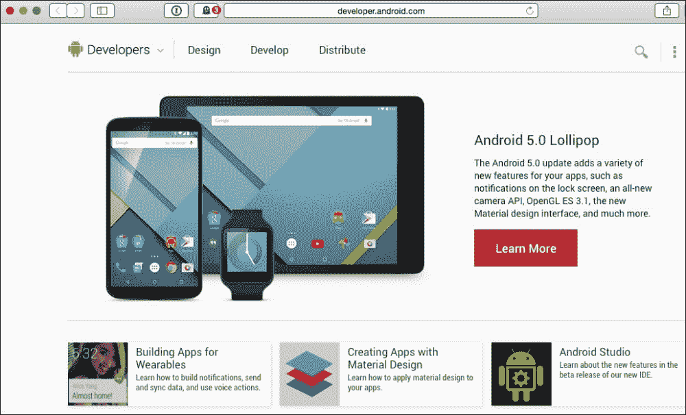

我们很快会回到这个页面下载 Android SDK，但现在，点击菜单栏中的**分发**链接，然后点击下一屏幕上的**开发者控制台**按钮。由于谷歌偶尔会更改这些页面，你可以使用 URL [`play.google.com/apps/publish/`](https://play.google.com/apps/publish/) 或搜索“Google Play 开发者控制台”。你将逐步通过的屏幕在这里没有展示，因为它们会随着时间的推移而变化。

将出现一个登录页面；使用你常用的谷歌详细信息登录。

### 小贴士

**使用哪个电子邮件地址？**

如果你有一个 Gmail 账户，注册一些谷歌服务会更容易。创建一个 Google+账户或注册他们的一些云服务需要 Gmail 地址（或者当时在我看来是这样的！）！如果你之前已经将谷歌钱包作为账户的一部分设置好，注册步骤中的一些步骤会变得简单。所以，使用你的 Gmail 地址，如果你没有，就创建一个！

谷歌会收取你 25 美元的费用来注册谷歌播放。至少现在，你知道这个信息了！输入开发者名称、电子邮件地址、网站 URL（如果你有的话）和你的电话号码。25 美元的支付将通过谷歌钱包完成，这样你就不必再次输入账单详情。

现在，你已经注册完毕，准备好赚大钱！

## 亚马逊应用商店

虽然谷歌播放的规则和费用相对宽松，但亚马逊在注册费用和接受应用提交的审查流程方面都采取了更类似苹果的方法。打开亚马逊应用商店的 URL 是 [`developer.amazon.com/public`](http://developer.amazon.com/public)：

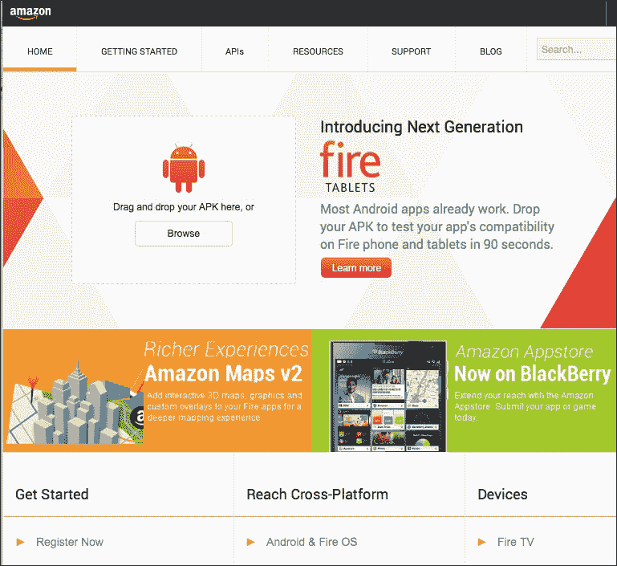

按照以下步骤开始使用亚马逊应用商店：

1.  当你选择**开始**时，你需要登录你的亚马逊账户。

    ### 小贴士

    **使用哪个电子邮件地址？**

    这感觉像是 deja vu！在注册亚马逊应用商店开发者程序时使用你的谷歌电子邮件地址并没有真正的优势，但如果你碰巧有亚马逊的账户，就使用那个账户登录。这将简化支付阶段，并且你的开发者账户和一般的亚马逊账户将相互关联。

1.  在了解费用之前，你需要同意应用商店分发协议条款。

1.  这些费用是每年 99 美元，但第一年是免费的。所以这很好！

1.  与谷歌安卓市场不同，亚马逊在注册时就会要求你的银行详情，希望以后能给你发很多钱！

1.  就这样，你已经准备好再赚一笔，与谷歌给你的那笔一样多！

## 快速问答——什么时候某件事变得太多？

你已经完成了你的大型应用开发，它的大小为 49.5 MB，你只需要添加标题屏幕音乐。为什么你不添加你准备好的两分钟的史诗级曲目呢？

1.  加载会花费太长时间。

1.  人们通常会很快跳过标题屏幕。

1.  文件大小将超过 50 MB。

1.  重金属可能不适合儿童故事书应用！

答案：3

其他答案也是有效的，尽管您可以将音乐作为外部声音播放以减少加载时间，但如果您的文件大小超过 50 MB，那么您将失去通过蜂窝网络而不是无线网络连接的人的潜在销售。在撰写本书时，所有商店都要求您通过无线网络连接到网站，如果您打算下载超过 50 MB 的应用程序。

## 下载 Android SDK

返回到 [`developer.android.com/`](http://developer.android.com/) 并点击 **获取 SDK** 链接，或直接转到 [`developer.android.com/sdk/index.html`](http://developer.android.com/sdk/index.html)。此链接默认为您正在运行的操作系统。点击 **其他下载选项** 链接，查看其他系统的完整选项，如下所示：

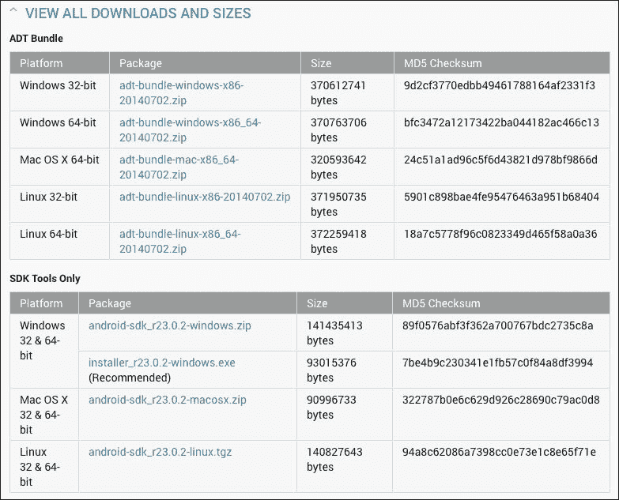

### 注意

在本书中，我们只将涵盖 Windows 和 Mac OS X (Intel)，并且仅涵盖使 LiveCode 与 Android 和 iOS SDK 一起工作所需的内容。如果您打算制作基于原生 Java 的应用程序，您可能对阅读网页 [`developer.android.com/sdk/installing.html`](http://developer.android.com/sdk/installing.html) 中描述的所有步骤感兴趣。

点击您平台上的 SDK 下载链接。请注意，除非您计划在 LiveCode IDE 之外开发，否则不需要 ADT Bundle。您将必须经历的步骤对于 Mac 和 Windows 是不同的。让我们从 Mac 开始。

### 在 Mac OS X (Intel) 上安装 Android SDK

LiveCode 本身不需要 Intel Mac；您可以使用基于 PowerPC 的 Mac 开发堆栈，但 Android SDK 和一些 iOS 工具需要基于 Intel 的 Mac，这很遗憾地意味着如果您正坐在您的 Mac G4 或 G5 旁边阅读此内容，您可能不会走得太远！

Android SDK 需要 **Java 运行时环境**（**JRE**）。由于苹果停止在较新的 OS X 系统中包含 JRE，您应该通过在终端窗口中输入 `java –version` 来检查您的系统中是否有它。终端将显示已安装的 Java 版本。如果没有，您可能会收到如下消息：

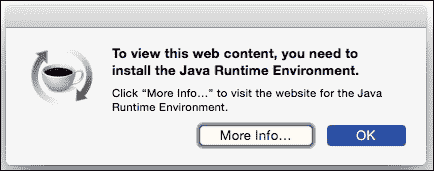

点击 **更多信息** 按钮，按照说明安装 JRE 并验证其安装。在撰写本书时，JRE 8 与 OS X 10.10 不兼容，我不得不使用从 [`support.apple.com/kb/DL1572`](http://support.apple.com/kb/DL1572) 获取的 JRE 6。

您刚刚下载的文件将自动展开以显示一个名为 `android-sdk-macosx` 的文件夹。它现在可能位于您的 `下载` 文件夹中，但更自然的位置是在您的 `文档` 文件夹中，因此在执行下一步之前将其移动到那里。

SDK 读取文件中列出了您在安装过程中需要遵循的步骤。如果这些步骤与这里的不同，那么请遵循读取文件中的步骤，以防它们自这里编写程序以来已更新。

打开**终端**应用程序，它在**应用程序/实用工具**中。您需要更改 `android-sdk-macosx` 文件夹中现有的默认目录。使用终端的一个实用技巧是，您可以拖动项目到终端窗口以获取该项目的文件路径。使用这个技巧，您可以在终端窗口中键入 `cd` 和一个空格，然后拖动 `android-sdk-macosx` 文件夹到空格字符后面。如果您的用户名是 Fred，您将得到以下行：

```java
new-host-3:~ fred$ cd /Users/fred/Documents/android-sdk-macosx

```

当然，行首的用户文件夹将与您匹配，而不是 Fred 的！

无论您的名字是什么，在输入前面的行之后，按**回车**或**Enter**键。位置行现在将更改为如下所示：

```java
new-host-3:android-sdk-macosx colin$

```

您可以仔细键入或从读取文件中复制并粘贴以下行：

```java
tools/android update sdk --no-ui

```

再次按**回车**或**Enter**键。文件下载所需的时间取决于您的互联网连接。即使互联网连接非常快，也可能需要超过一个小时。

如果您想跟踪更新进度，只需在 `tools` 目录中运行 `android` 文件。这将打开 Android SDK 管理器，它与本书中几页后展示的 Windows 版本类似。

### 在 Windows 上安装 Android SDK

下载页面建议您使用 `.exe` 下载链接，因为它为您提供了额外服务，例如检查您是否已安装**Java 开发工具包**（**JDK**）。当您点击链接时，可以使用**运行**或**保存**选项，就像下载任何 Windows 安装程序一样。在这里，我们选择使用**运行**；如果您选择**保存**，那么您需要在文件保存到您的硬盘后打开该文件。在以下情况下，由于 JDK 未安装，会弹出一个对话框提示您前往 Oracle 网站获取 JDK：

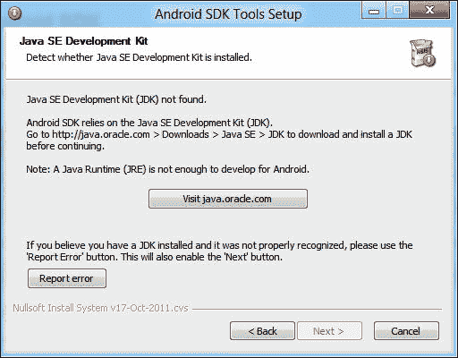

如果您也看到这个屏幕，您可以保持对话框打开，并点击**访问 java.oracle.com**按钮。在 Oracle 页面上，点击复选框同意他们的条款，然后点击与您的平台对应的下载链接。如果您正在运行 64 位版本的 Windows，请选择 64 位选项；如果您正在运行 32 位版本的 Windows，请选择 x86 选项。

无论哪种方式，您都会遇到另一个安装程序，您可以根据喜好运行或保存。当然，安装程序完成其任务也需要一段时间！安装完成后，您将看到一个 JDK 注册页面，您可以选择是否注册。

回到 Android SDK 安装程序对话框，你可以点击**后退**按钮，然后点击**下一步**按钮回到 JDK 检查阶段；但现在，它看到你已经安装了 JDK。像任何 Windows 安装程序一样完成 SDK 安装程序的剩余步骤。

需要注意的一个重要事项是，安装程序的最后一屏会提供打开 SDK 管理器的选项。你应该这么做，所以请抵制取消勾选该框的诱惑！

点击完成，你将短暂地看到一个命令行窗口，如以下截图所示，然后，Android SDK 管理器将出现并执行其操作：

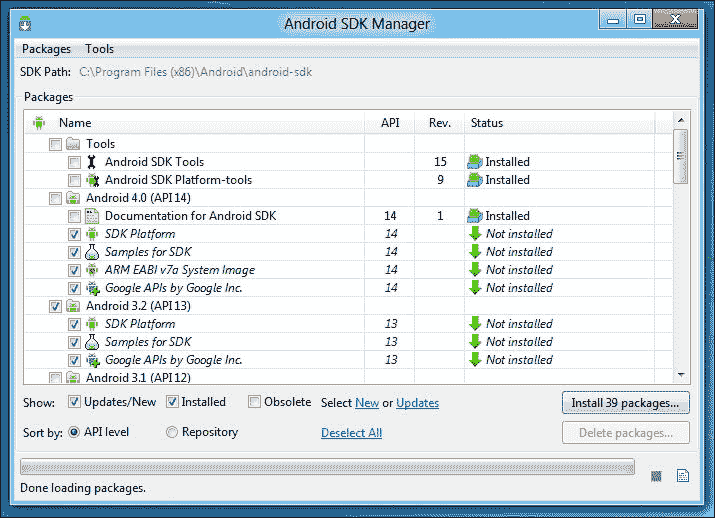

与 Mac 版本一样，所有这些附加组件的下载需要非常长的时间。

## 将 LiveCode 指向 Android SDK

在完成所有安装和命令行工作之后，回到 LiveCode 是一种令人耳目一新的变化！

打开**LiveCode 首选项**并选择**移动支持**：

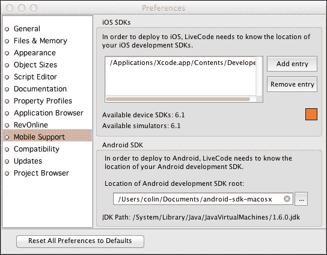

我们将在 iOS 启动后设置两个 iOS 条目（但在 Windows 中这些选项将会变灰）。目前，请点击 Android 开发 SDK 根字段旁边的**…**按钮，并导航到 SDK 安装的位置。如果你已经正确地遵循了前面的步骤，那么 SDK 将在 Mac 的`Documents`文件夹中，或者在 Windows 上你可以导航到`C:\Program Files (x86)\Android\`来找到它（或者如果你选择使用自定义位置，可能在其他地方）。

根据 SDK 管理器中加载的 API，你可能会收到一条消息，指出路径不包括对 Android 2.2（API 8）的支持。如果是这样，请使用 Android SDK 管理器来安装它。尽管此时 Android 5.0 使用 API 21，但 LiveCode 似乎需要 API 8。

呼吸！现在，让我们为 iOS 做同样的事情…

## 快速问答 - 美味的代号

安卓操作系统为每个版本使用一些奇怪的代号。在撰写本书时，我们使用的是 Android OS 5，其代号为 Lollipop。版本 4.1 是 Jelly Bean，版本 4.4 是 KitKat。以下哪个最可能是下一个 Android 操作系统的代号？

1.  柠檬芝士蛋糕

1.  小吃

1.  面条

1.  棉花糖

答案：4

如果不明显的话，模式是这样的：代号采用字母表的下一个字母，是一种食物，但更具体地说，是一种甜点。"Munchies"几乎适用于 Android OS 6，但"Marshmallow"或"马卡龙"会是更好的选择！

# 成为 iOS 开发者

创建 iOS LiveCode 应用程序需要 LiveCode 能够访问 iOS SDK。这作为 Xcode 开发者工具的一部分进行安装，并且是仅限 Mac 的程序。此外，当您将应用程序上传到 iOS App Store 时，所使用的应用程序仅限 Mac，并且是 Xcode 安装的一部分。如果您是 Windows 基础的开发者，并且希望为 iOS 开发和发布，您需要一个实际的基于 Mac 的系统或一个可以运行 Mac OS 的虚拟机。我们甚至可以使用 VirtualBox 来运行基于 Mac 的虚拟机，但性能可能会成为问题。有关更多信息，请参阅 [`apple.stackexchange.com/questions/63147/is-mac-os-x-in-a-virtualbox-vm-suitable-for-ios-development`](http://apple.stackexchange.com/questions/63147/is-mac-os-x-in-a-virtualbox-vm-suitable-for-ios-development)。

成为 Android 开发者和成为 iOS 开发者之间最大的区别是，即使您从未为 iOS App Store 制作过应用程序，您也必须注册 Apple 的开发者计划，而成为 Android 开发者则不需要这样的注册。如果一切顺利，您为各种商店制作了应用程序，那么这并不是什么大问题。将应用程序提交到 Android Market 需要支付 $25，将应用程序提交到 Amazon Appstore 需要支付每年 $99（第一年免费），而成为 Apple 的 iOS 开发者每年需要支付 $99（包括第一年）。只需尝试卖出超过 300 份您那令人惊叹的 $0.99 应用程序，您就会发现这已经足够支付费用了！

注意，LiveCode 会员资格包括免费的 iOS App Store 和应用程序许可，每年费用为 $99。作为 LiveCode 会员，您可以提交您的免费非商业应用程序给 RunRev，他们将提供一份许可，允许您将应用程序作为“封闭源代码”提交到 iOS App Store。这项服务仅限于 LiveCode 会员。每年第一次提交是免费的；之后，每次提交需支付 $25 的管理费。有关更多信息，请参阅 [`livecode.com/membership/`](http://livecode.com/membership/)。

您可以在 [`developer.apple.com/programs/ios/`](http://developer.apple.com/programs/ios/) 注册 iOS 开发者计划：

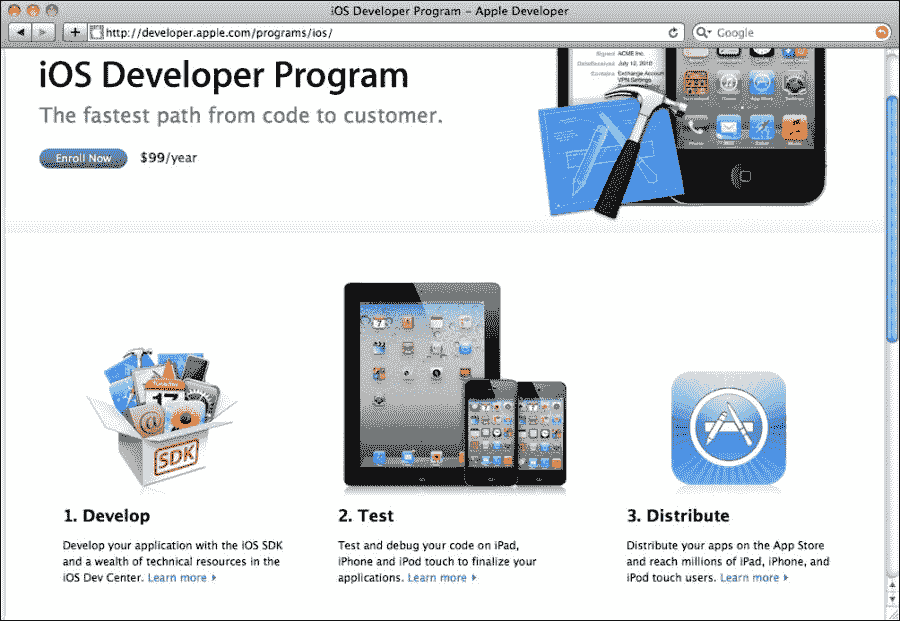

在注册成为 iOS 开发者时，您的当前状态有多种可能性。如果您已经有了 Apple ID，您可以使用它来购买 iTunes 或 Apple 在线商店的产品，您可以选择**我已经有 Apple ID…**选项。为了说明注册的所有步骤，我们将从一个全新的用户开始，如下面的截图所示：

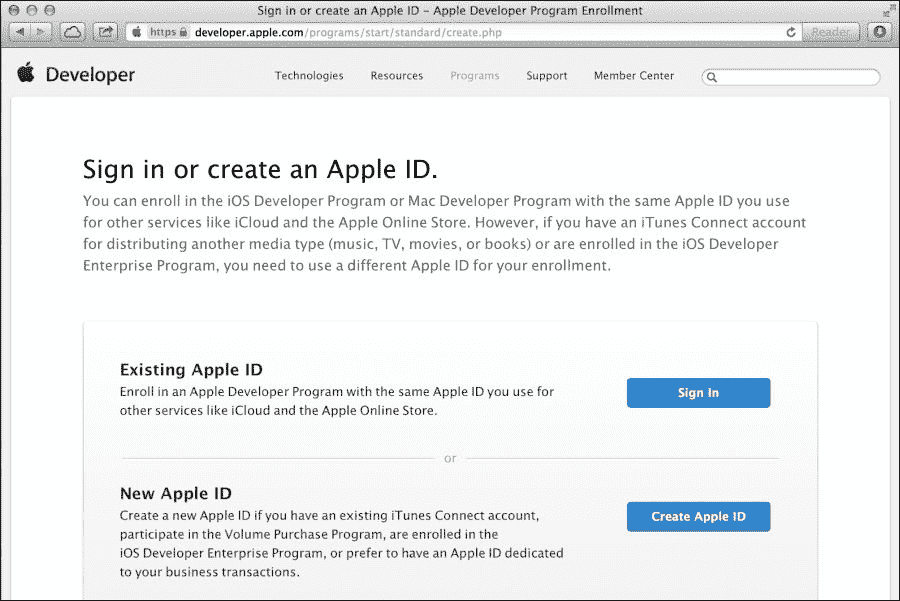

您可以选择是否以个人身份或公司身份注册。我们将选择**个人**，如下面的截图所示：

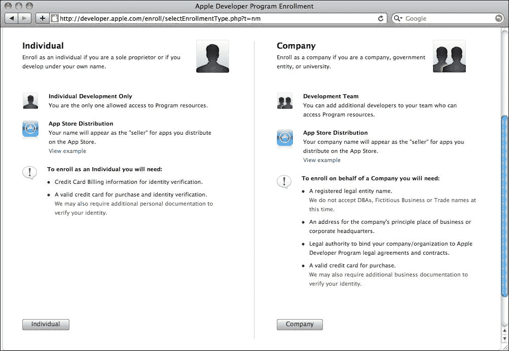

在任何此类注册过程中，您都需要输入您的个人详细信息，设置安全问题，并输入您的邮政地址：


大多数苹果软件和服务都有自己的法律协议供您签署。以下截图显示的是一般的 **注册苹果开发者协议**：

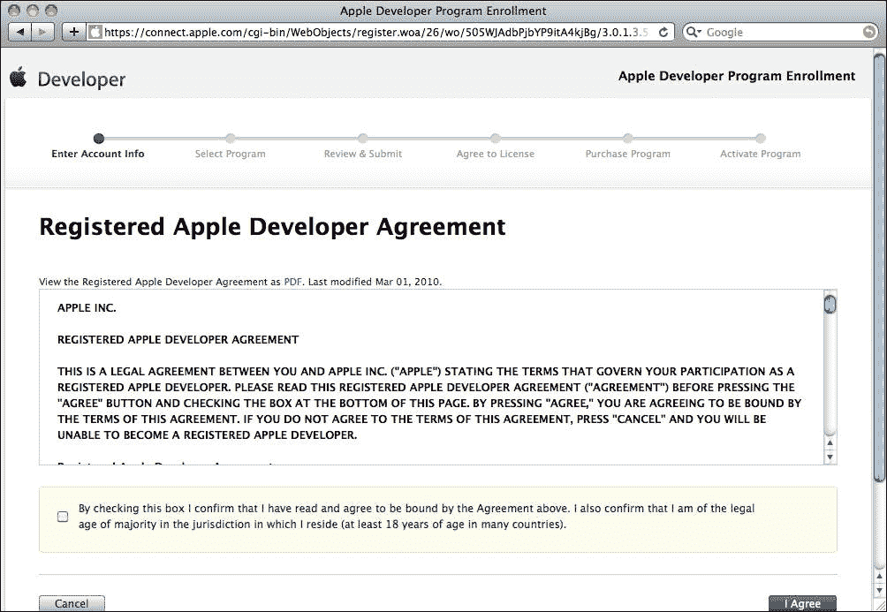

为了验证您使用的电子邮件地址，会通过电子邮件发送一个带有链接的验证码给您，您可以点击此链接，或者手动输入代码。一旦您完成了验证码步骤，您就可以输入您的账单详情。

可能您会继续为 Mac App Store 开发 LiveCode 应用程序，在这种情况下，您需要添加 **Mac 开发者计划** 产品。对于我们来说，我们只需要注册 iOS 开发者计划，如下截图所示：

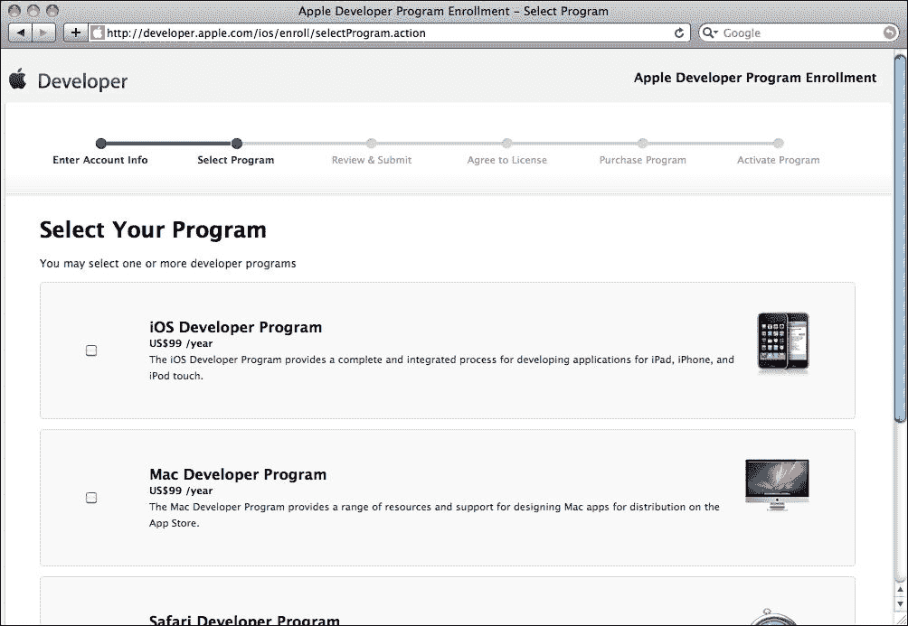

您注册的每个产品都有自己的协议。有很多小字需要阅读！

实际购买 iOS 开发者账户是通过您所在地区的苹果商店处理的，如下所示：

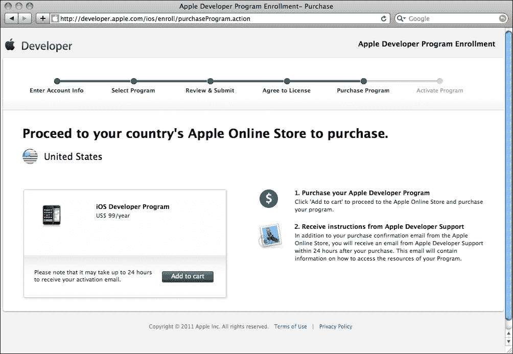

如您在下一张截图中所见，如果您也注册了 Mac 开发者账户，那么这将花费您每年 $99 或 $198。大多数 LiveCode 用户不需要注册 Mac 开发者账户，除非他们的计划是向 Mac App Store 提交桌面应用程序。

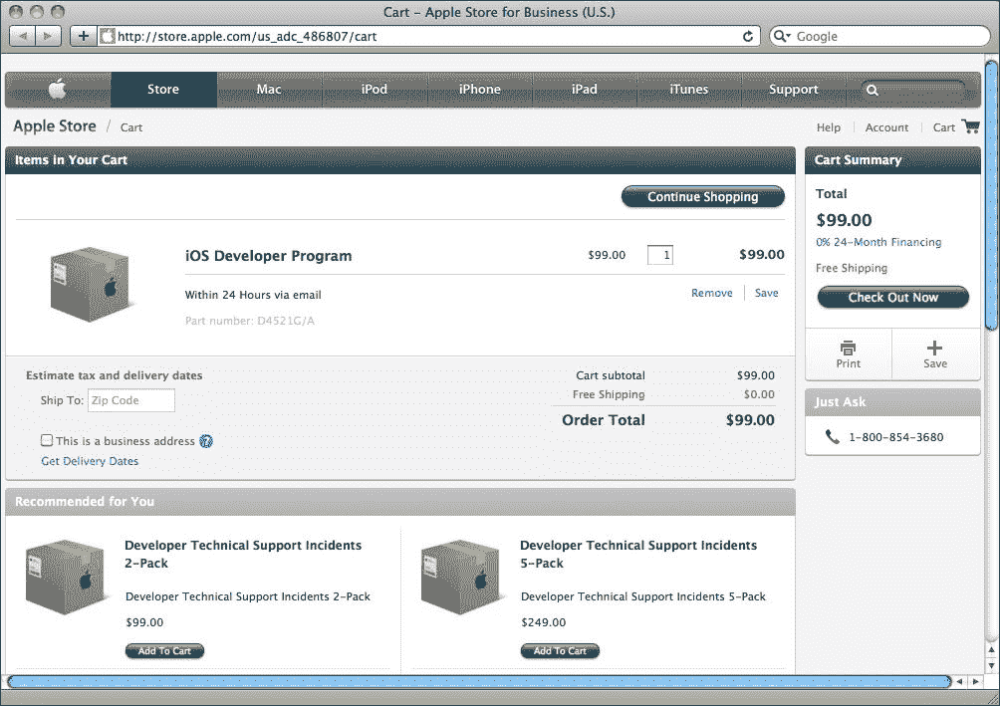

在提交订单后，您会收到一条消息，告诉您您现在已注册为苹果开发者！

很遗憾，您不会立即获得批准，就像 Android 市场或亚马逊应用商店那样。您必须等待五天的批准。在早期 iPhone 开发者时期，批准可能需要一个月或更长时间，所以 24 小时是一个改进！

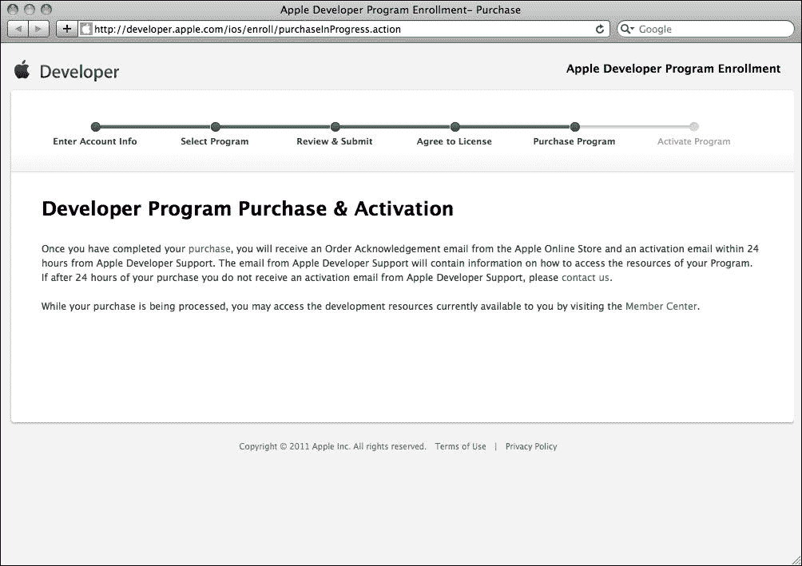

## 快速问答 - iOS 代码名

关于 Android 操作系统代码名的快速问答您可能觉得很简单！但对于 iOS 来说并非如此。

以下哪个名称更有可能是 iOS 未来版本的代码名？

1.  拉斯维加斯

1.  拉古纳海滩

1.  Hunter Mountain

1.  死亡谷

答案：3

虽然没有公开宣传，但苹果确实为每个 iOS 版本使用代码名。之前的例子包括 Big Bear、Apex、Kirkwood 和 Telluride。这些，以及其他所有名称显然都是滑雪胜地。Hunter Mountain 是一个相对较小的山（3,200 英尺），所以如果它被使用，可能只是一个小更新！

## 安装 Xcode

一旦您收到成为 iOS 开发者的确认，您将能够登录到 iOS 开发中心，网址为 [`developer.apple.com/devcenter/ios/index.action`](https://developer.apple.com/devcenter/ios/index.action)。

这个页面被不使用 LiveCode 的 iOS 开发者所使用，里面充满了可以帮助你使用 Xcode 和 Objective-C 创建原生应用的支持文档。我们不需要所有这些支持文档，但我们确实需要下载 Xcode 的支持文档。

在 iOS Dev Center 页面的下载区域，你会看到一个链接指向当前版本的 Xcode，以及一个链接可以访问旧版本。当前版本通过 Mac App Store 提供；当你尝试给定的链接时，你会看到一个按钮，它会带你到 App Store 应用。

从 Mac App Store 安装 Xcode 非常简单。它就像在商店购买任何其他应用一样，只是它是免费的！但它确实要求你使用最新的 Mac OS X 版本。Xcode 将出现在你的`Applications`文件夹中。

如果你使用的是旧系统，那么你需要从开发者页面下载旧版本之一。旧版本的 Xcode 安装过程与其他 Mac 应用的安装过程非常相似：

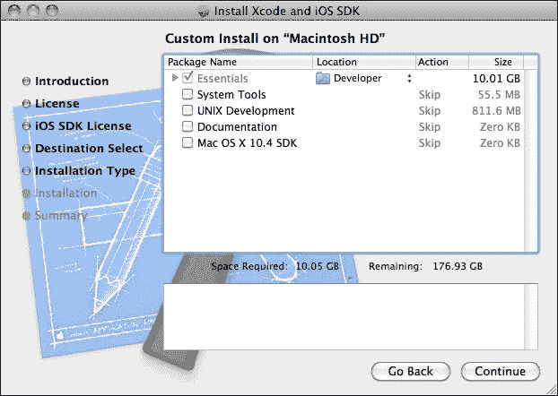

旧版本的 Xcode 安装需要很长时间，但最终，你应该有一个为 LiveCode 准备的`Developer`文件夹或新的 Xcode 应用。

### 小贴士

**处理新旧设备**

在 2012 年初，苹果推出了一款新的 iPad 版本。与 iPad 2 相比，这款产品的卖点主要是它拥有 Retina 显示屏。原始的 iPad 分辨率为 1024 x 768，而 Retina 版本分辨率为 2048 x 1536。如果你希望构建利用这一特性的应用，你必须从 Mac App Store 获取当前版本的 Xcode，而不是从开发者页面获取旧版本。新版本的 Xcode 要求你在 Mac OS 10.10 或更高版本的操作系统上工作。因此，为了完全支持最新的设备，你可能需要更新你的系统软件比预期的更多！但是等等，还有更多……通过使用较晚版本的 Xcode，你将错过支持旧版 iOS 设备（如原始 iPhone 和 iPhone 3G）所需的 iOS SDK 版本。幸运的是，你可以在 Xcode 的“首选项”中找到这些旧 SDK，在“下载”标签页中你可以下载这些旧 SDK 到新版本的 Xcode 中。通常，苹果只允许你下载比当前 Xcode 提供的版本旧一个版本的 SDK。虽然有一些旧版本可用，但苹果不认可这些版本用于 App Store 提交。

## 将 LiveCode 指向 iOS SDKs

打开 LiveCode 的**首选项**并选择**移动****支持**：

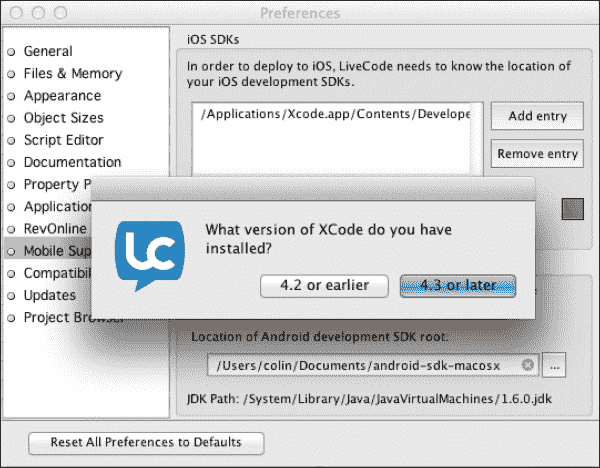

在窗口右上角点击 **添加条目** 按钮，将看到一个对话框询问您是否使用 Xcode 4.2 或 4.3 或更高版本。如果您选择 4.2，那么继续选择您硬盘根目录下名为 `Developer` 的文件夹。对于 4.3 或更高版本，请选择您的 `Applications` 文件夹中的 Xcode 应用程序。LiveCode 知道如何找到 iOS 的 SDK。

# 在我们制作第一个移动应用之前...

现在所需的 SDK 已安装，LiveCode 也知道它们的位置，我们可以在模拟器或物理设备上制作堆栈并测试它。然而，我们确实需要预热模拟器和物理设备...

## 准备在 Android 设备上进行测试开发

在 iOS 上模拟比在 Android 上更容易，在物理设备上测试比在 iOS 上更容易，但设置物理 Android 设备可能非常困难！

# 行动时间 - 启动 Android 虚拟设备

您可能需要深入 Android SDK 文件夹以找到 Android 虚拟设备设置程序。您不妨为它提供一个快捷方式或别名以便快速访问。以下步骤将帮助您设置并启动一个 Android 虚拟设备：

1.  在 Windows 上，导航到位于 `C:\Program Files (x86)\Android\android-sdk\` 的 Android SDK 工具文件夹，在 Mac 上导航到您的 `Documents/android-sdk-macosx/tools` 文件夹。

1.  在 Windows 上打开 **AVD 管理器**或在 Mac 上打开 **android**（这些看起来像 Unix 可执行文件；只需双击它，应用程序将通过命令行窗口打开）。

1.  如果您使用的是 Mac，请从 **工具** 菜单中选择 **管理 AVDs…**。

1.  如果设备列表中有 **平板电脑**，请从列表中选择。如果没有，您可以根据以下章节的说明添加自己的自定义设备。

1.  点击 **开始** 按钮。

1.  在虚拟设备启动时耐心等待！

1.  打开 LiveCode，创建一个新的 **Mainstack**，然后点击 **保存** 将堆栈保存到您的硬盘上。

1.  导航到 **文件** | **独立应用程序设置…**。

1.  点击 Android 图标，然后点击 **为 Android 构建复选框**以选择它。

1.  关闭设置对话框，查看 **开发** 菜单。

1.  如果虚拟机正在运行，您应该会在 **测试目标** 子菜单中看到它。

## 创建 Android 虚拟设备

如果在打开 **Android 虚拟设备**（**AVD**）管理器时没有列出设备，您可能需要...如果您想创建一个设备，请点击 **创建** 按钮。执行此操作时将出现以下截图。有关各个字段的进一步说明，请参阅 [`developer.android.com/tools/devices/index.html`](https://developer.android.com/tools/devices/index.html)。

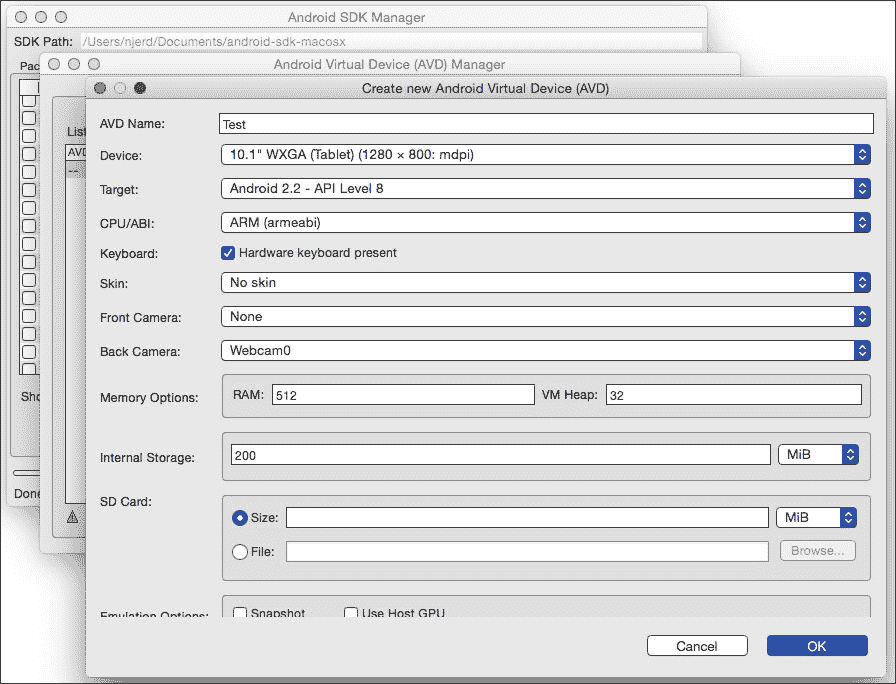

在您创建了一个设备之后，您可以点击**开始**来启动虚拟设备并更改一些**启动选项**。通常情况下，您应该选择**按实际大小缩放显示**，除非它对于您的开发屏幕来说太大。然后，点击**启动**来启动模拟器。有关如何运行模拟器的更多信息，可以在[`developer.android.com/tools/help/emulator.html`](http://developer.android.com/tools/help/emulator.html)找到。

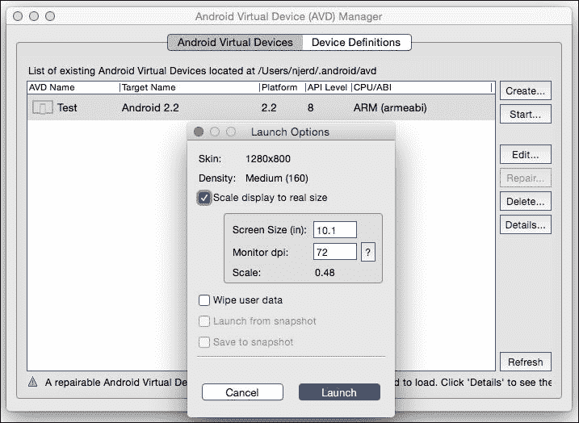

## *刚才发生了什么？*

现在您已经打开了一个 Android 虚拟设备，LiveCode 将能够使用此设备测试堆栈。一旦它加载完成，就可以这样做！

## 连接物理 Android 设备

连接物理 Android 设备可能非常直接：

1.  通过 USB 将您的设备连接到系统。

1.  从**开发** | **测试目标**子菜单中选择您的设备。

1.  从**开发**菜单中选择**测试**，或者点击工具栏中的**测试**按钮。

尽管如此，可能会有一些问题情况，在您解决完这些问题之前，Google 搜索将成为您的最佳朋友！我们应该看看一个示例问题情况，这样您就可以了解如何解决您可能遇到的类似情况。

### 使用 Kindle Fire

当涉及到查找 Android 设备时，Android SDK 会自动识别很多设备。有些设备没有被识别，您需要做些事情来帮助**Android 调试桥接器**（**ADB**）找到这些设备。

Android 调试桥接器（ADB）是 Android SDK 的一部分，它充当您的设备与任何需要访问设备的软件之间的中介。在某些情况下，您需要进入设备的 Android 系统，告诉它允许开发目的的访问。例如，在 Android 3（蜂巢）设备上，您需要进入**设置** | **应用程序** | **开发**菜单，并激活**USB 调试**模式。在 ADB 连接到 Kindle Fire 设备之前，该设备必须首先进行配置，以便允许连接。这是第一代 Kindle Fire 设备上的默认设置。在所有其他 Kindle Fire 型号上，进入设备设置屏幕，选择**安全**，并将**启用**ADB 设置为**开启**。

原始的 Kindle Fire 型号已经启用了 USB 调试，但 ADB 系统根本不知道这个设备。您可以修复这个问题！

# 行动时间 – 将 Kindle Fire 添加到 ADB

只需一行文本即可将 Kindle Fire 添加到 ADB 所知的设备列表中。困难的部分是找到要编辑的文本文件，并在进行必要的更改后重启 ADB。在 Windows 上使用时比在 Mac 上更复杂，因为您还需要配置 USB 驱动程序，所以这两个系统在这里被展示为单独的步骤。

将 Kindle Fire 添加到 Windows 操作系统中的 ADB 的步骤如下：

1.  在 Windows 资源管理器中，导航到 `C:\Users\yourusername\.android\`，这是 `adv_usb.ini` 文件所在的位置。

1.  在文本编辑器中打开 `adv_usb.ini` 文件。该文件没有可见的换行符，因此最好使用 WordPad 而不是记事本。

1.  在三条指令行之后的一行，输入 `0x1949`。

1.  确保文件中没有空白行；文本文件的最后一个字符在 `0x1949` 的末尾应该是 `9`。

1.  现在，保存文件。

1.  导航到 `C:\Program Files (x86)\Android\android-sdk\extras\google\usb_driver\`，这是 `android_winusb.inf` 文件所在的位置。

1.  右键单击文件，在 **属性**、**安全** 中从列表中选择 **用户** 并点击 **编辑** 来设置权限，以便你可以写入文件。

1.  在记事本中打开 `android_winusb.inf` 文件。

1.  将以下三行添加到 `[Google.NTx86]` 和 `[Google.NTamd64]` 部分，并保存文件：

    ```java
    ;Kindle Fire
    %SingleAdbInterface% = USB_Install, USB\VID_1949&PID_0006
    %CompositeAdbInterface% = USB_Install, USB\VID_1949&PID_0006&MI_01
    ```

1.  你需要设置 Kindle，使其使用你刚刚编辑的 Google USB 驱动程序。

1.  在 Windows 控制面板中，导航到 **设备管理器** 并在 **USB** 下的列表中找到 Kindle 条目。

1.  右键单击 Kindle 条目并选择 **更新驱动程序软件…**。

1.  选择允许你在本地驱动器上找到驱动器的选项，导航到 `google\usb_driver\` 文件夹，然后选择它作为新驱动器。

1.  当驱动程序更新时，打开命令窗口（打开命令窗口的一个方便技巧是在桌面上使用 *Shift*-右键单击并选择“在此处打开命令窗口”）。

1.  通过输入以下命令更改目录到 ADB 工具所在的位置：

    ```java
    cd C:\Program Files (x86)\Android\android-sdk\platform-tools\

    ```

1.  输入以下三行代码，并在每行后按 Enter 键：

    ```java
    adb kill-server
    adb start-server
    adb devices

    ```

1.  如果你仍然运行着虚拟设备，你应该会看到 Kindle Fire（以一个看起来很神秘的数量）以及虚拟设备被列出。

对于 Mac（系统）的步骤（非常简单！）如下：

1.  导航到 `adv_usb.ini` 文件所在的位置。在 Mac 上，在 Finder 中，通过导航到 **前往** | **前往文件夹…** 并输入 `~/.android/` 来选择。

1.  在文本编辑器中打开 `adv_usb.ini` 文件。

1.  在三条指令行之后的一行，输入 `0x1949`。

1.  确保文件中没有空白行；文本文件的最后一个字符在 `0x1949` 的末尾应该是 `9`。

1.  保存 `adv_usb.ini` 文件。

1.  导航到 **实用工具** | **终端**。

1.  你可以通过输入以下行让 OS X 知道如何从任何地方找到 ADB（将 `yourusername` 替换为你的实际用户名，如果你将 Android SDK 安装到了其他位置，也请更改路径）：

    ```java
    export PATH=$PATH:/Users/yourusername/Documents/android-sdk-macosx/platform-tools

    ```

1.  现在，尝试与 Windows 相同的三个步骤：

    ```java
    adb kill-server
    adb start-server
    adb devices

    ```

1.  再次，你应该在这里看到 Kindle Fire 被列出。

## **发生了什么？**

我怀疑你将会因为所有这些步骤而做噩梦！在网络上进行了大量的研究才找到了一些这些神秘的技巧。在 Windows 上使用 Android 设备的一般情况是，你必须修改设备的 USB 驱动程序，以便使用 Google USB 驱动程序来处理，你可能还需要修改`adb_usb.ini`文件（在 Mac 上也是如此），以便将设备视为 ADB 兼容设备。

## 准备在 iOS 设备上进行测试开发

如果你仔细地完成了所有这些 Android 步骤，尤其是在 Windows 上，你可能会对这个部分的简短感到惊讶！但是有一个问题；你实际上无法从 LiveCode 在 iOS 设备上进行测试。我们稍后会看看你需要做什么，但首先，我们将看看在 iOS 模拟器中测试应用程序所需的步骤。

# 行动时间 - 使用 iOS 模拟器

初始步骤与我们为 Android 应用程序所做的大致相同，但在后续步骤中，这个过程会变得更快。记住，这仅适用于 Mac OS；如果你在虚拟机中使用 Mac OS，则只能在 Windows 上执行这些操作，这可能会导致性能问题。这很可能不在 Mac OS 的用户协议范围内！换句话说，如果你打算为 iOS 开发，请获取 Mac OS。以下步骤将帮助你实现这一点：

1.  打开 LiveCode，创建一个新的**主堆栈**，并将其保存到你的硬盘上。

1.  选择**文件**，然后选择**独立应用程序设置…**。

1.  点击 iOS 图标以选择**为 iOS 构建**复选框。

1.  关闭设置对话框，查看**开发**下的**测试目标**菜单。

1.  您将看到 iPhone 和 iPad 的模拟器选项列表以及不同版本的 iOS。

1.  要启动 iOS 模拟器，选择一个选项，然后点击**测试**按钮。

## *刚才发生了什么？*

这就是我们使用 iOS 模拟器完成测试所需的所有步骤！要在物理 iOS 设备上进行测试，我们首先需要创建一个应用程序文件。让我们来做这件事。

# 最后，应用程序开发成功！

到目前为止，你应该能够创建一个新的主堆栈，保存它，在独立设置对话框中选择 iOS 或 Android，并在开发/测试菜单项中看到模拟器或虚拟设备。在 Android 应用程序的情况下，如果你在此时通过 USB 连接，你也会看到你的设备列出来。

# 行动时间 - 在模拟器中测试简单的堆栈

感谢你使用我们这些步骤制作出比我们更复杂的东西！以下说明假设你知道如何在对象检查器调色板中自己找到东西：

1.  打开 LiveCode，创建一个新的主堆栈，并将其保存到一个容易找到的地方。

1.  将卡片窗口的大小设置为 480 x 320，并取消选择**可调整大小**复选框。

1.  将标签字段拖到卡片窗口的左上角，并设置其内容为适当的内容。"Hello World"可能就足够了。

1.  如果你正在 Windows 上开发，请跳到步骤 11。

1.  打开**独立应用程序设置**对话框，点击 iOS 图标，然后点击**为 iOS 构建**复选框。

1.  在**方向选项**下，将**iPhone 初始方向**设置为**横屏左**。

1.  关闭对话框。

1.  导航到**开发** | **测试目标**子菜单并选择 iPhone 模拟器。

1.  从**开发**菜单中选择**测试**。

1.  你现在应该能够在 iOS 模拟器中看到你的测试栈正在运行！

1.  如前所述，启动 Android 虚拟设备。

1.  打开独立应用程序设置对话框，点击 Android 图标，然后点击**为 Android 构建**复选框。

1.  在**用户界面选项**下，将**初始方向**设置为**横屏**。

1.  关闭对话框。

1.  如果虚拟设备现在正在运行，请尽一切努力越过锁定的主屏幕，如果它显示的是这个屏幕。

1.  从**开发**/**测试目标**子菜单中选择**Android 模拟器**。

1.  从**开发**菜单中选择**测试**。

1.  你现在应该能在 Android 模拟器中看到你的测试栈正在运行！

## **发生了什么？**

如果一切顺利，你刚刚在 Android 和 iOS 上都制作并运行了你的第一个移动应用！为了锦上添花，我们应该只在物理设备上尝试，这样可以让 Android 有机会展示它有多容易完成。还有一些我们没有打开的“大问题”，这与配置 iOS 设备有关，以便它可以用于测试。这部分内容将在第七章中详细介绍，*部署到您的设备*，你现在可以阅读它，或者你可以访问 iOS 配置文件门户[`developer.apple.com/ios/manage/overview/index.action`](https://developer.apple.com/ios/manage/overview/index.action)，并查看每个不同部分的**如何操作**标签。

# 行动时间 - 在设备上测试简单栈

现在，让我们尝试在物理设备上运行我们的测试。准备好您的 USB 线缆并将设备连接到您的计算机。

让我们先来了解一下在 Android 设备上的步骤：

1.  你仍然需要在**独立应用程序设置**中选择 Android。

1.  如果有初始锁屏，请将您的设备切换到主屏幕。

1.  选择**开发**/**测试目标**并选择您的 Android 设备。它可能说“Android”和一个非常长的数字。

1.  选择**开发**/**测试**。

1.  栈现在应该在您的 Android 设备上运行。

现在，我们将通过以下步骤在 iOS 设备上测试一个简单栈：

1.  如果你还没有阅读第七章，即关于如何将当前环境部署到您的设备或苹果页面的指南，或者还没有安装证书和配置文件，你现在将不得不跳过这个测试。

1.  将**独立应用程序设置**改回**iOS**。

1.  在 iOS 设置的**基本应用程序设置**下，有一个配置文件的**配置文件**下拉菜单。选择一个为你将要测试的设备配置的配置文件。

1.  关闭对话框，并从**文件**菜单中选择**另存为独立应用程序…**。

1.  在**Finder**中找到刚刚创建的文件夹，并打开它以显示应用程序文件本身。由于我们没有给堆栈起一个有意义的名字，它将被命名为**未命名 1**。

1.  打开`Xcode`，它位于你之前安装的`Developer`文件夹中的`Applications`子文件夹。

1.  如果`Xcode`文件夹未选中，请在**窗口**菜单中选择**设备**。

1.  你应该能看到你的设备列出来。选择它，如果你看到一个标有**用于开发**的按钮，点击该按钮。

1.  将应用程序文件直接从**Finder**菜单拖到**设备**窗口中的你的设备上。你应该看到一个带有**+**号的绿色圆圈。你还可以点击**已安装应用程序**下方的**+**号，并在**Finder**窗口中找到你的应用程序文件。你还可以从这个窗口替换或删除已安装的应用程序。

1.  你现在可以在你的 iOS 设备上打开应用程序了！

## **发生了什么？**

除了在真实设备上使测试堆栈工作之外，我们还看到了一旦配置完成，直接在 Android 设备上测试堆栈是多么容易。如果你正在开发一个将在 Android 和 iOS 上部署的应用程序，你可能发现使用 iOS 模拟器进行 iOS 测试可能是最快的工作方式，但为此，你需要直接在 Android 设备上测试，而不是使用 Android SDK 虚拟设备。

## 尝试一下英雄 - Nook

直到最近，Barnes & Noble 的 Nook Color 对 Android 的支持还不够好，无法安装 LiveCode 应用程序。但似乎有所改善，可能又是一个值得你关注的软件商店。

调查注册过程、下载他们的 SDK 等。如果有任何运气，你在注册其他商店时学到的某些流程也可能适用于 Nook 商店。你可以从这里开始注册过程：

[`nookdeveloper.barnesandnoble.com`](https://nookdeveloper.barnesandnoble.com)。

# 进一步阅读

SDK 提供商 Google 和 Apple 提供了大量关于如何设置开发环境、创建证书和配置文件的页面信息。这些信息涵盖了大量不适用于 LiveCode 的主题，所以尽量不要迷失方向！如果你想要进一步阅读，以下 URL 将是良好的起点：

[`developer.android.com/`](http://developer.android.com/)

[`developer.apple.com/ios/`](http://developer.apple.com/ios/)

# 摘要

注册程序、下载文件、到处使用命令行，并耐心等待 Android 模拟器启动——完成本章所涵盖的内容可能需要花费一天中的大部分时间！幸运的是，你只需要经历一次。

在本章中，我们完成了一系列任务，这些任务是在你使用 LiveCode 创建移动应用之前必须完成的。在我们能够下载和安装 Xcode 和 iOS SDK 之前，我们必须注册为 iOS 开发者。然后我们下载并安装了 Android SDK，并配置了 LiveCode 以支持设备和模拟器。

我们还介绍了一些在你准备好上传完成的应用时将非常有用的主题。我们展示了如何注册 Android 市场和 Amazon 应用商店。

在本书的结尾，我们还将介绍一些更平凡的事情，但不是现在！接下来，我们将开始探索移动设备的一些特殊功能。
