# 第三章。构建用户界面

*有这么多不同的屏幕！*

*在为台式计算机制作实用程序或游戏应用程序时，你通常可以避开特定大小的窗口，并为它制作完全适合的定制图形。在移动设备上，你必须应对广泛的屏幕尺寸和宽高比，并且还需要有适合用户设备操作系统的界面元素。*

LiveCode 能够在 Mac、Windows 和 Linux 上发布，并在一定程度上解决了为每个平台制作界面元素看起来正确的问题。**视图** 菜单中有一个 **外观和感觉** 菜单项，你可以从中选择 **原生主题**、**Mac OS Classic**、**Windows 95** 和 **Motif**。对于移动操作系统来说，情况并非如此，因为所有控件看起来都像 Motif。尽管如此，你仍然有两个选择：你可以创建看起来属于目标操作系统的图形，或者你可以调用原生例程，以便让系统本身显示适当的控件。

在本章中，我们将：

+   设置一个 *测试床* 移动应用程序

+   打开电子邮件和浏览器窗口

+   显示日期选择器控件

+   从图库和相机加载图片

+   创建一个 iOS 风格的按钮

+   手动布局界面

+   使用代码来布局界面

+   查看一个强大的移动界面控制的附加组件

# 设置测试床移动应用程序

作为我们要尝试的事情的试验场，我们将设置一个具有多个屏幕的单个移动应用程序，每个屏幕对应我们想要测试的每个事物。

我们应该怎么称呼测试床应用程序？我们可以叫它几乎任何名字，但我们将让 iPhone 为我们做出决定。在 iPhone 和 iPod touch 上，主屏幕图标下方只有一小块空间显示名称。iOS 会显示你的长应用程序名称，并使用省略号将名称的末尾连接起来，显示名称的缩短版本。我的超级无敌应用程序将显示为 My sup…app，信息量不是很大！在不截断文本的情况下可以显示的字母数量会根据使用的字母宽度而变化，但通常，它有一个 11 个字母的限制。因此，我们将测试床应用程序命名为 LC Test Bed，正好是 11 个字母！

# 行动时间 - 制作测试床栈

在我们创建 iOS 和 Android 应用之前，我们应该准备好我们想要的内容，作为一个 LiveCode 栈，并在我们的台式计算机上对其进行全面测试。以下步骤将假设你知道如何在 LiveCode 中完成所要求的内容，而不需要精确的指令。

1.  打开 LiveCode，创建一个新的 **主栈**，并将其保存为 `LCTestBed`。

1.  设置屏幕大小为 320 x 480。这只是确保在最小的屏幕上显示内容。我们将制作的内容将出现在较大屏幕的左上角区域。

1.  我们将为栈中的每一张卡片制作一个按钮；让我们先制作一个名为 **菜单** 的卡片。

1.  添加**电子邮件**、**浏览器**、**日期选择器**和**图片**按钮。确保按钮足够大，可以在你的设备上触摸。你应该有如下所示的内容：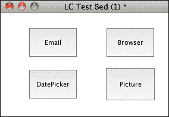

1.  创建四张新的卡片，并将每张卡片的名称与按钮名称匹配。

1.  回到第一张卡片，将每个按钮的脚本设置为跳转到匹配的卡片，使用以下脚本：

    ```java
    on mouseUp
    go card the short name of me
    end mouseUp
    ```

1.  在每张卡片上创建一个按钮，用于返回菜单卡片。将按钮命名为`Menu`。设置其脚本与其他按钮相同。

1.  选择运行（浏览）工具并尝试点击按钮跳转到四张卡片并返回到菜单。

## *刚才发生了什么？*

嗯，没有什么特别激动人心的！然而，你现在应该有五张卡片，并且能够进入和退出菜单卡片。我们将为每张卡片添加脚本以帮助说明其各种功能。最有效的方法是添加所有脚本和相关按钮以及字段，然后一次性测试最终的测试床应用。然而，那样有什么乐趣呢！相反，我们将一次添加一个功能…

## 调用桌面电子邮件应用

有许多情况你可能想从你的应用程序用户那里得到反馈。也许，你希望他们通过电子邮件提出改进建议或向你提问。你可以轻松地启动他们的电子邮件程序，让用户自己决定写什么。或者，你可以设置**收件人**地址、**主题**，甚至消息的**正文**部分。至少，这会使你的生活更轻松，因为你可以根据你在主题字段中放置的内容过滤收到的电子邮件。

# 行动时间 - 调用原生电子邮件应用

在以下步骤中，我们将创建一些字段和一个按钮来尝试发送电子邮件功能：

1.  前往**电子邮件**卡片并创建四个字段。将它们命名为**收件人**、**抄送**、**主题**和**正文**。

1.  创建一个名为**测试**的按钮。

1.  在**测试**按钮中添加以下脚本：

    ```java
    on mouseUp
      put field "To" into toText
      put field "CC" into ccText
      put field "Subject" into subjectText
      put field "Body" into bodyText
      revMail toText,ccText,subjectText,bodyText
    end mouseUp
    ```

1.  选择**运行**工具并在每个字段中输入示例信息。

1.  在设置**独立应用程序设置…**并选择**测试目标**后，点击**测试**按钮。

## *刚才发生了什么？*

LiveCode 语法的巧妙之处在于，移动端的代码也适用于桌面应用程序，反之亦然。如果一切顺利，当你点击测试按钮时，你将发现自己已经进入了默认的电子邮件应用，准备发送你在 LiveCode 堆栈字段中输入的消息。

## 在设备上安装电子邮件测试

桌面测试能够成功运行并不令人惊讶。打开其他应用程序的能力是 LiveCode 的基本功能。尽管如此，发送一些初始文本给新消息还是很有趣的。接下来，我们应该检查这也在设备上是否可行。

# 行动时间 - 在设备上尝试测试床堆栈

使用 USB 将你的 Android 和/或 iOS 设备连接到电脑。这些说明几乎与上一章中测试 "Hello World" 堆栈时的说明相同。从这一点开始，任何指示都将更简短，并基于你已知在设备上测试应用程序的步骤。第七章，*将应用程序部署到您的设备*，描述了 **独立应用程序设置** 对话框中的所有选项。目前，我们只将填写一些细节，所以在这里，我们将只查看对话框的一部分，从 Android 设置开始：

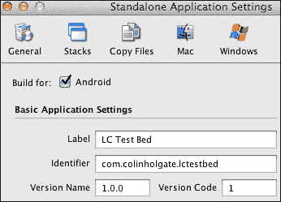

1.  确保在 **独立应用程序设置** 对话框中勾选了 **Android**。

1.  在 **标识符** 字段中，输入一个唯一的标识符；`com.yourname.lctestbed` 就可以。

1.  如果有初始锁屏，将设备切换到主屏幕。

1.  在 LiveCode 中，选择 **开发/测试目标** 并选择你的 Android 设备。它将被命名为 **Android** 后跟一个长数字。

1.  选择 **开发/测试** 选项。

1.  编译后，堆栈应该在您的 Android 设备上运行，您应该能够触摸 **电子邮件** 按钮并执行一个测试消息，该消息将使用 Android 电子邮件应用程序。

在 iOS 上，如果你还没有这样做，请阅读第七章，*将应用程序部署到您的设备*，了解如何将应用程序部署到您的设备。至少阅读那些展示如何安装您的 iOS 开发者证书和配置文件的章节。就像 Android 一样，我们只会在独立应用程序设置中更改几个项目。以下是我们将要更改的对话框截图：

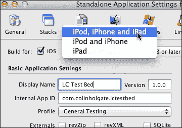

对 iOS 设备执行以下步骤：

1.  将 **独立应用程序设置** 更改为 **iOS**。

1.  在 iOS 设置的 **基本应用程序设置** 下，有一个 **配置文件** 下拉菜单，用于选择你已安装的配置文件。选择一个为你将要测试的设备配置的配置文件。

1.  在 **内部应用程序 ID** 字段中，输入一个唯一的 ID。就像 Android 一样，`com.yourname.lctestbed` 就可以。当然，`yourname` 将是你的名字或公司名字。

1.  如果你正在 iPad 上测试，从 **支持设备** 下拉菜单中选择 **iPod, iPhone 和 iPad** 选项。

1.  关闭对话框，并从 **文件** 菜单中选择 **另存为独立应用程序…**。

1.  保存完成后，你可能看到一个警告消息，告诉你缺少启动画面和图标。现在这并不重要。

1.  在 **Finder** 中找到刚刚创建的文件夹，并打开它以显示应用程序文件本身。

1.  打开 **Xcode** 并从 **窗口** 菜单中选择 **设备**。

1.  您应该能看到您的设备列出来。选择它，如果您看到一个标记为**用于开发**的按钮，请点击该按钮。

1.  直接从**查找器**窗口将应用程序文件拖放到您的设备在**组织者**窗口中。

1.  设备旁边的小彩色圆圈会暂时变成橙色，然后变回绿色。

1.  现在，您可以打开应用程序并尝试**邮件**按钮和测试消息，这将使用标准的 iOS 邮件应用程序。

## *发生了什么？*

我们已经完成了在 Android 和 iOS 设备上安装测试床应用程序所需的步骤。我们还必须在独立应用程序设置中更改一些事情。如您所见，那里有很多设置。您可以在第七章中期待了解它们的所有内容，*将应用程序部署到您的设备*！

## 打开网页

您的应用程序中还有一个要求，就是能够展示额外的在线信息。您希望用户点击链接，或者触摸，以便他们被带到列出用户可以从您那里购买的所有其他应用程序的页面！

# 行动时间 - 调用原生浏览器应用程序

下一个测试将会更快，或者至少，说明将会更简短，因为我们将会将一些步骤浓缩成更简洁的指示，如下所示：

1.  复制**测试**按钮，将其从**邮件**卡片粘贴到**浏览器**卡片上，这样您可以节省一些时间来使按钮看起来更美观。

1.  编辑**测试**按钮脚本并将其更改为以下内容：

    ```java
    on mouseUp
      launch url "http://www.runrev.com/"
    end mouseUp
    ```

1.  选择**运行**工具并点击**测试**按钮。您将在默认浏览器中看到 RunRev 的主页。

在设备上尝试应用程序的步骤与测试电子邮件功能的步骤完全相同。对于 Android：

1.  在**独立应用程序设置**中选择 Android。

1.  从**开发**菜单中选择您的 Android 设备作为测试目标（最有可能的是，它仍然是从之前选择的）。

1.  从**开发**菜单中选择**测试**。

1.  应用程序的前一个测试将被覆盖，并将自动启动新版本。

1.  尝试点击您在浏览器卡片上刚刚创建的**浏览器**按钮和**测试**按钮。如果您点击它们，应该会打开[`runrev.com/`](http://runrev.com/)页面。

对于 iOS：

1.  在独立应用程序设置中选择 iOS。

1.  重新执行**另存为独立应用程序**，然后将应用程序文件拖放到 Xcode 的**组织者**窗口中，就像您第一次做的那样。

1.  尝试点击**浏览器**和**测试**按钮；您应该看到 RunRev 的主页在 Safari 中打开。

## *发生了什么？*

与电子邮件测试一样，添加打开网页的标准代码在 Android 和 iOS 上与在桌面计算机上一样有效。

如果你同时在 Android 和 iOS 上进行测试，你会在查看网页后返回时注意到行为的不同。在 Android 上，你可以按返回箭头按钮，仍然处于你的堆栈的浏览器卡片上。在 iOS 上，当你返回时，堆栈会重新启动。我们将在稍后探讨一个解决方案，我们将数据写入外部文件，这样当应用重新打开时，我们可以返回用户在离开应用之前的状态。

# 仅移动设备使用的日期选择器

接下来的几个示例我们将尝试的，是只在移动设备上工作，而不是在桌面计算机上工作的。

# 动作时间 - 显示日期选择器

许多应用程序需要用户为事件选择一个日期，并且在使用移动设备时，日期选择器会有一个特定的外观。使用 LiveCode，我们可以显示这样的控件：

1.  将浏览器卡片上的**Test**按钮复制并粘贴到 DatePicker 卡片上。

1.  编辑脚本使其看起来像这样：

    ```java
    on mouseUp
    iphonePickDate "date"
    end mouseUp
    ```

1.  选择**Run**工具并尝试**Test**按钮。你会看到一个错误，因为这是一个仅适用于移动设备的功能。

1.  为了改变一下，从**Development/Test Target**菜单中选择**iPhone**或**iPad Simulator**，然后从**Development**菜单中选择**Test**。

1.  你会在 iOS 模拟器中看到你的堆栈打开，你可以尝试**DatePicker**和**Test**按钮，然后看到 iOS 日期选择器显示出来。

1.  使用组织者窗口中的相同旧版“另存为”和安装步骤来尝试在你的 iOS 设备上使用日期选择器。

1.  点击菜单卡片上的**DatePicker**按钮和 DatePicker 卡片上的**Test**按钮。应该会出现一个 iOS 原生日期选择器。

## *刚才发生了什么？*

希望你现在已经变得更好，能够更快地构建和安装移动应用！除了在设备上再次测试之外，我们还尝试了模拟器。一般来说，只要可能，使用 iOS 模拟器会更快，只有在检查多指触摸、加速度计和相机支持等问题时才需要在设备上进行测试。

# 动作时间 - 为移动设备加载图片

或许有一天，我们可以从用户的桌面计算机照片应用或他们的网络摄像头中导入图片，但到目前为止，这些功能只适用于移动设备。

LiveCode 可以调用原生的照片库和相机应用。我们将在 Android 和 iOS 上测试这两个应用，但当然，前提是你的设备上保存了一些图片和相机。对于没有相机的 Kindle Fire，请确保你在图库应用中保存了一些图片，这样我们至少可以尝试加载这些图片。按照以下步骤为移动设备加载图片：

1.  将`DatePicker`卡片上的**Test**按钮复制并粘贴到图片卡片上两次。将按钮的名称更改为 Test Camera 和 Test Library。

1.  编辑测试相机按钮的脚本为：

    ```java
    on mouseUp
    mobilePickPhoto "camera"
    end mouseUp
    ```

1.  编辑测试库按钮的脚本为：

    ```java
    on mouseUp
    mobilePickPhoto "library"
    end mouseUp
    ```

1.  当我们测试图片加载时，加载的图片将位于测试按钮之上，阻止我们返回到菜单卡片。为了解决这个问题，请将以下内容添加到卡片脚本中：

    ```java
    on mouseUp
    if word 1 of the target is "image" then delete the target
    end mouseUp
    ```

1.  进入**独立应用程序设置**并选择**Android**。

1.  我们必须请求 Android 操作系统权限来使用相机并存储图片，因此请勾选**相机**和**写入外部存储**的复选框：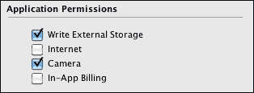

1.  在您的 Android 设备上进行测试步骤，或在 iOS 设备上安装。

1.  一旦应用程序在您的设备上运行，请触摸第一个屏幕上的**图片**，然后**测试库**。您应该看到典型的操作系统特定选项，用于从您的图库或相册中选择图片。

1.  您选择的图片已加载到卡片窗口中，并将填充大部分屏幕，遮挡我们的测试和菜单按钮。我们输入的卡片脚本让您能够触摸图片以删除它，这样您就可以尝试另一个测试。

1.  尝试**测试相机**按钮。您将看到操作系统特定的相机应用程序，当您拍照并在相机应用程序中触摸**使用**或**确定**按钮时，图片将被放置在图片卡片上。

## *刚才发生了什么？*

这些简单的脚本说明了 LiveCode 如何能够调用操作系统特定的应用程序来完成其他情况下需要大量编码的工作。更重要的是，随着 iOS 和 Android 操作系统版本的更新，相同的简单脚本可以激活苹果和谷歌将实现的高级功能。

## 突击测验 - 获得整体概念

Q1. 当提到技术改进时，我们往往认为这是理所当然的。如果您的手机相机只有 2 百万像素，您可能会感到不公平，但回想一下很久以前的事情，以及您习惯看到的大画面。从像素数量来看，一个单张 800 万像素的图片可以容纳多少个原始 Macintosh 屏幕的面积？

1.  4

1.  15

1.  24

1.  45

答案：45！

原始 Mac 的屏幕分辨率为 512 x 342 像素。这将在 800 万像素照片的面积中容纳超过 45 次。

# 制作操作系统风格的按钮

很好，LiveCode 可以调用操作系统的原生控件，但这引发了一个问题，因为当与操作系统按钮一起使用时，标准 Motif 风格的按钮看起来会很丑。我们可以通过使用 LiveCode 的内置功能或使用附加产品来解决这个问题。

## 使用位图

如我们在第一章中看到的，*LiveCode 基础*，你可以为按钮的不同状态使用不同的位图。你可以通过在你的移动设备上截图按钮来获取这样的图片，至少在 iOS 和 Android OS v4 及更高版本中可以这样做，或者你也可以通过下载其他人提供的文件来节省大量时间。其中一些文件仅授权用于原型设计；在这里，我们将查看一个也授权用于商业产品的文件。

# 使用 Photoshop 准备按钮状态的行动时间

我们将要使用的文件包含 Photoshop 滤镜效果，其他程序无法处理，所以很遗憾，你需要 Photoshop 来执行所有这些步骤，或者至少有一个拥有 Photoshop 的朋友！Mac OS X 上的 Pixelmator 和 GraphicConverter 也可以从文件中提取图形，可能只需复制屏幕的一个区域即可。

1.  阅读以下文章：

    [`spin.atomicobject.com/2011/03/07/photoshop-template-for-ios-buttons/`](http://spin.atomicobject.com/2011/03/07/photoshop-template-for-ios-buttons/)

1.  文章指向了一些其他信息来源；不过，现在请下载以下文件：

    [`spin.atomicobject.com/assets/2011/3/7/iOS_Buttons.psd`](http://spin.atomicobject.com/assets/2011/3/7/iOS_Buttons.psd)

1.  在 Photoshop 中打开文件（它可能会自动打开）。

1.  在图层调板中隐藏名为 Background 和 ToolBar – Retina 的层。

1.  展开名为**Bar Button – Retina**的层，并隐藏**按钮标签**层。

1.  使用矩形选框工具选择右上角按钮周围的区域。它应该看起来像这样：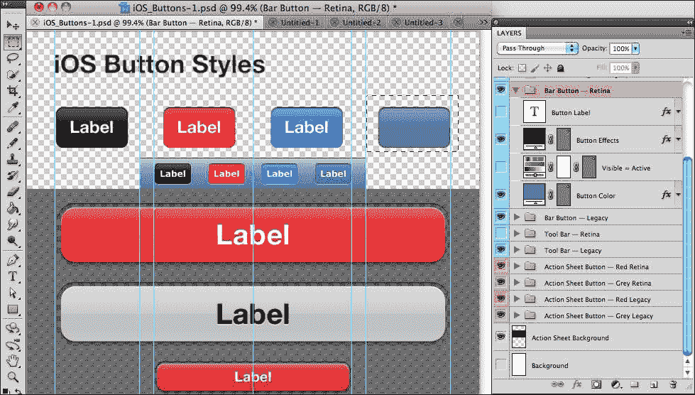

1.  从**编辑**菜单中选择**合并拷贝**。

1.  从**文件**菜单中选择**新建**，并确保**背景内容**属性设置为**透明**，接受你给出的尺寸。

1.  粘贴内容，它将是一个完美的匹配，你将看到该按钮的空闲状态。

1.  从**文件**菜单中选择**另存为网页和设备…**。

1.  在保存对话框中，选择**24 位 PNG**并确保**透明度**框被勾选。使用合适的名称保存 PNG，例如`bluebuttonup.png`。

1.  返回主文档并打开 Visible = Active 层。

1.  再次执行**合并拷贝** | **新建** | **粘贴** | **另存为网页和设备…**。

1.  将 PNG 保存为`bluebuttondown.png`。

1.  返回 LiveCode。

1.  重新打开测试床堆栈。

1.  使用**文件**，**导入为控件**，和**图像文件…**将两个 PNG 文件导入堆栈。

1.  你可以将这两张图片放置在任何位置。在每个图片的**基本属性**中取消勾选**可见**。

1.  在第一张卡片上添加一个新的按钮，并将其命名为位置。

1.  设置按钮脚本为：

    ```java
    on mouseUp
      iphoneStartTrackingLocation
      put iphoneCurrentLocation() into theLocation
      answer theLocation["latitude"]
    end mouseUp
    ```

1.  选择位置按钮，并在**检查器**调板的**基本属性**中关闭**显示名称**和**不透明**。

1.  在**图标与边框**中，关闭**三维效果**、**边框**和**高亮边框**。

1.  点击**检查器**调色板中**图标**条目旁边的魔法棒按钮。

1.  从**图像库**下拉菜单中选择**此堆栈**。

1.  点击两个蓝色图像中较亮的一个。

1.  点击**高亮图标**条目旁边的魔法棒按钮，然后点击两个图像中较暗的一个。

1.  调整按钮的大小，使其刚好足够显示蓝色图像而不会被裁剪。

1.  在按钮上方放置一个标签字段。

1.  在**基本属性**中，勾选**禁用**框。这是为了确保字段不会捕获你将要执行的点击。我们希望按钮能够获得那个点击。

1.  在**内容**中输入`Location`。

1.  在**文本格式化**下，将字段设置为使用**Helvetica Neue，18 点，粗体，居中对齐**。

1.  在**颜色与调色板**下，设置文字颜色为白色。

1.  将字段和按钮对齐，使两者相互居中。

1.  如果你现在使用 iOS 模拟器进行测试并点击位置按钮，你将只看到一个零，但在设备上尝试应该会在你触摸按钮时显示你的纬度（你将不得不在第一次按下按钮时允许应用程序知道你的位置。）

### 备注

注意，示例是 iOS 6 格式。iOS 8 可以在以下位置找到：

[`www.teehanlax.com/tools/iphone/`](http://www.teehanlax.com/tools/iphone/)

## *刚才发生了什么？*

尽管我们制作的按钮可能不是完美的尺寸，甚至可能不符合独立 iOS 按钮的正确外观，但我们确实完成了制作按钮状态图像所需的所有步骤。在图像按钮上放置 LiveCode 字段并不一定能够给出最佳的外观。实际上，你会在 Photoshop 中花费更多的时间来制作适合你使用的标签的正确宽度的按钮，并且可能还需要将文本添加到图像本身。这将看起来更好，并且不需要字段在 LiveCode 中显示按钮的名称。

LiveCode 能够通过设置图形的点及其`fillGradient`来使用代码创建我们需要的图像。然而，一旦你有了模拟按钮或其他类型控件所需的组件，仍然需要更多的脚本才能管理这些元素。

有一个简单的解决方案，尽管这会花费你 50 美元！

## 快速问答——现在的物价

Q1. 随着你对数码照片大小的期望增加，你今天也期望得到更多的价值。当你权衡花费 50 美元的利弊时，你认为与 25 年前相比，电脑的内存现在价值提高了多少？

1.  10 倍的效果

1.  一半的效果

1.  100 倍的效果

1.  20,000 倍！

答案：4

的确如此。25 年前，苹果公司以大约 1,500 美元的价格出售 Macintosh II 的 4MB 附加套件。现在他们以 1,200 美元的价格出售 Mac Pro 的 64GB 附加套件。

# MobGUI 来拯救！

RunRev 总部位于苏格兰爱丁堡，他们是一群有才华的人！然而，他们并不是唯一有才华的苏格兰人，还有约翰·克雷格。他为 LiveCode 开发了一个强大的附加组件，其中包括一个越来越长的类似 iOS 和 Android 操作系统的控件列表。如果你要购买他的产品，你需要支付 50 美元，你将获得当前版本以及在你购买日期后 12 个月内发布的任何更新。虽然我们在这里查看它，我们也可以使用产品的试用版。

# 行动时间 - 开始使用 MobGUI

与 LiveCode 的其他附加组件一样，MobGUI 需要安装到 LiveCode 插件文件夹中。在 Windows 上，这将是在 `My Documents/My LiveCode/Plugins`。在 Mac 上，这将是在 `~/Documents/My LiveCode/Plugins`。此默认位置可以在 **LC Preferences** 菜单和 **Files & Memory** 下进行更改。以下步骤将指导你开始使用 MobGUI：

1.  从 [`mobgui.com/download.php`](http://mobgui.com/download.php) 下载 MobGUI 的最新版本。

1.  `.zip` 文件将展开成为一个名为 **MobGUI_V1-28.livecode** 的 LiveCode 堆栈，用于当前版本。希望当你下载时，会有更新的版本。

1.  将堆栈拖入插件文件夹，并重新打开 LiveCode。

1.  创建一个新的 Mainstack。

1.  从 **Development** 菜单中选择 **Plugins/revMobGUI**。当你这样做时，会出现以下窗口：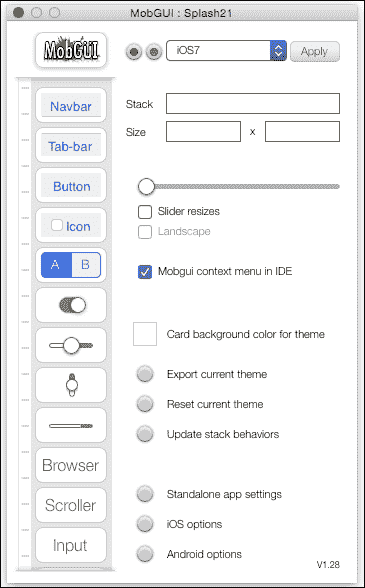

1.  MobGUI 窗口类似于 LiveCode 工具调色板和检查器调色板的组合。

1.  尝试将不同的项目拖放到卡片上，并查看每个项目的选项。

1.  左侧的列表是可滚动的，并显示额外的控件。

1.  一旦控件放置在卡片上，它们就可以像正常的 LiveCode 控件一样进行操作。

1.  上右角的选项字段允许选择不同的主题。选择 **android** 主题，然后点击 **Apply**。请注意，你拖出的控件会发生变化。在撰写本书时，**android** 主题代表较老的预 Lollipop 主题。

1.  在你操作完堆栈后，你可以导出当前主题以供以后使用。你需要保存新创建的名为 **MobGUI Theme** 的堆栈。稍后打开时，此堆栈将有一个 **Import** 按钮。

## *刚才发生了什么？*

LiveCode 的一个显著特点是，你在这个程序中使用的许多窗口和调色板实际上都是堆栈，我们已经开始使用一个相当专业的堆栈，这将为我们节省大量时间，并给我们一个像特定操作系统界面一样的好界面。

## 以 MobGUI 方式制作的测试床应用程序

我们将制作一个类似的测试床应用程序，但这次，我们将尝试给应用程序一个更类似 iOS 的外观。

# 行动时间 - 使用 MobGUI 制作测试床应用程序

当你在 LiveCode 中工作时，开始新的堆栈，关闭其他堆栈，以及打开之前保存的堆栈，这些操作仍然会占用内存。有时，你可能会陷入困惑的状态，只创建了一个新的未命名堆栈，却发现还有一个正在进行的未命名堆栈，这时你会被询问是否要清除。所以，为什么不给自己一个退出并重新启动 LiveCode 的机会呢！以下步骤将帮助您实现这一点：

1.  创建一个新的主堆栈。将名称设置为`MGTestBed`，并将其保存在您容易找到的地方。也许在包含`LCTestBed`堆栈的文件夹中，它感觉有点孤单！

1.  通过选择 **Development/Plugins/revMobGUI** 打开 MobGUI 窗口。

1.  在 MobGUI 窗口的控件页面上，选择**滑块调整大小**复选框，并将滑块移动以选择**320x480**的大小。这是原始 iPhone 的大小。注意其他可用的大小。卡片也可以使用 LiveCode 检查器进行调整。

1.  在 MobGUI 窗口中，选择**IDE 中的 MobGUI 右键菜单**选项。这将使您能够在以后编辑 MobGUI 控件行为。

1.  使用**卡片检查器**，将此第一个卡片的名称设置为 Email。

1.  将 **TabBar** 拖动到卡片窗口中。单击卡片窗口的**底部对齐**。它也会调整卡片宽度。

1.  在 MobGUI 窗口中，将按钮拖动到卡片窗口顶部的 TabBar 上。通过按住 *Alt*/*option* 键并拖动来复制按钮 3 次。使用 LiveCode 的**检查器**调色板中的**对齐工具**对四个按钮进行对齐，并将它们分布在整个卡片上。

1.  选择每个按钮，并将它们的名称和标签设置为`Email`、`Browser`、`DatePicker`和`Picture`。然后调整按钮的大小，使它们适合其名称文本。

1.  选择**Email**按钮，并从**对象**菜单中选择**对象脚本**或右键单击按钮并选择**编辑脚本**选项。脚本将看起来像以下截图：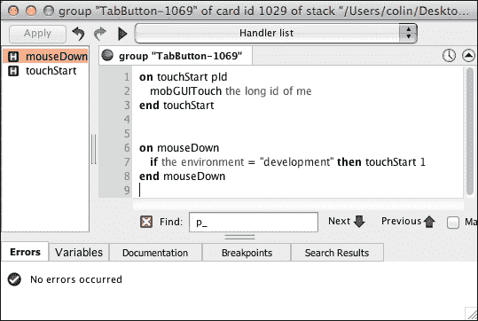

1.  向每个卡片添加以下 `mouseUp` 处理程序

    ```java
    on mouseUp
      go card the short name of me
    end mouseUp
    ```

1.  您可以将第一个按钮的 `mouseUp` 脚本复制并粘贴到其他三个按钮中。注意，MobGUI 在每个按钮的 `mouseUp` 脚本之后创建了一个 **preOpenControl** 处理程序。不要更改它！

1.  我们需要在将要制作的四个卡片上使用这些元素，所以选择**全选**选项，然后从**对象**菜单中选择**选择组**。

1.  确保组已选择并位于常规 LiveCode 检查器调色板中，然后勾选**作为后台运行**复选框。

1.  创建另外三个卡片，并将它们的名称分别命名为`Browser`、`DatePicker`和`Picture`。

1.  从 LiveCode 调色板中，为每个卡片拖动一个标签控件到卡片窗口中，并将名称设置为与卡片名称匹配。

1.  在**独立应用程序设置**中，根据你想要测试的设备选择 iOS 或 Android。

1.  将**内部应用程序 ID**或**标识符**设置为`com.yourname.MGTestBed`。

1.  如果你正在 iOS 上执行相同的操作，请确保从“配置文件”下拉菜单中选择一个配置文件。

1.  你现在可以从**开发**菜单进行测试，但首先你必须选择**iPhone 模拟器**或你的连接的 Android 设备。

## *刚才发生了什么？*

看起来有很多步骤，但实际上并不需要花费太多时间。我们已经有四个卡片之间的导航和一个真实的 iOS 界面。

让我们以更原生、更集成的方式开始一些测试功能。

## MobGUI 原生控件

MobGUI 的一个强大功能是它可以使用普通的 LiveCode 控件作为当你将应用运行在设备上时将成为本地控件的占位符。这不是你不能自己用代码做到的事情，但能够移动占位符控件，直到你满意布局，可以节省很多时间。

# 行动时间 - 使用 MobGUI 的本地控件

MobGUI 允许你在 iOS 和 Android 的原生控件主题之间切换，或者重新定义你自己的主题。

1.  在 MobGUI 窗口中右键点击 iPhone 的小图标，确保你处于原生 iOS 控件集。

1.  前往“电子邮件”卡片，从 MobGUI 窗口拖动 3 个**输入**文本控件和一个**多行**文本控件。

1.  将**输入**控件命名为`To`、`CC`和`Subject`，将**多行**文本控件命名为`Body`。你还可以在输入字段旁边添加一些常规 LiveCode 标签字段，作为输入指示。将 Body 字段设置得足够大，以便输入几行文本。此外，给字段或卡片添加一些背景颜色，以便正确显示字段。

1.  在创建每个字段时，请注意，你可以设置键盘类型。将 To 和 CC 字段设置为电子邮件。

1.  从 iOS 控件 1 集中，将两个按钮拖到卡片窗口。将一个命名为`完成`，另一个命名为`发送`。完成此步骤后，你应该有一个这样的截图：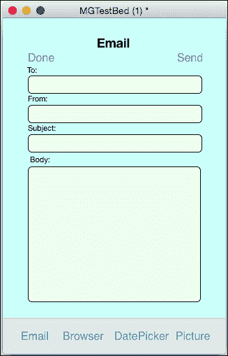

1.  当我们测试应用并触摸其中一个字段时，键盘覆盖层会出现。我们将使用“完成”按钮来隐藏键盘。向“完成”按钮脚本的`mouseUp`处理程序添加一个焦点线：

    ```java
    on mouseUp
      focus on nothing
    end mouseUp
    ```

1.  MobGUI 可以使用`mgText`属性从这些原生字段检索属性。将发送按钮的`mouseUp`处理程序更改为使用此属性为每个字段，并调用`revMail`函数：

    ```java
    on mouseUp
      put the mgText of group "To"" into totext
      put the mgText of group "CC"" into cctext
      put the mgText of group "Subject"" into subjecttext
      put the mgText of group "Body"" into bodytext
      revMail totext,cctext,subjecttext,bodytext
    end mouseUp
    ```

1.  前往浏览器卡片。

1.  从 MobGUI 窗口，将一个**输入**控件拖到卡片窗口，并将其命名为`URL`。

1.  将一个**浏览器**控件拖到卡片窗口，并将其命名为`Page`。

1.  调整大小，使文本字段填满卡片宽度，浏览器控件填满文本字段和底部标签栏之间的区域。

1.  选择 **浏览器** 控件，并在 MobGUI 窗口中输入 **URL** 的值或使用默认值。这将使浏览器控件将其作为第一个页面加载此 URL。

1.  编辑 URL 文本字段的脚本，并添加此处理程序，该处理程序查找回车键以转到 URL：

    ```java
    on inputReturnKey
      mobileControlSet "Page",", "url", the mgText of me
    end inputReturnKey
    ```

1.  尝试另一个测试，并转到“电子邮件”和“浏览器”卡片，看看它们在实际中的应用。

## *发生了什么？*

我们重新创建了早期测试床应用程序中的前两个测试，但现在看起来好多了！此外，我们还利用了 MobGUI 在原生 iOS 控件中获取和设置数据的能力，在这种情况下，使用 `mgText` 属性和 `mobileControlSet`。

注意，所有 MobGUI 控件在 LiveCode 检查器中显示为 **组**，在项目浏览器中显示为 **自定义控件**。这些组由自定义 LiveCode 控件（如按钮、字段等）组成。MobGUI 还会在您的堆栈末尾添加一个 MobGUI 卡片。此卡片包括具有定义行为的不可见按钮。行为是创建对象之间常见功能的方法，而不重复脚本。您可以通过在项目浏览器中显示 MobGUI 卡片时点击右侧的脚本按钮来查看这些行为脚本。除非您有特定的需求要更改这些，否则请保持它们不变。

## 英雄尝试 - 其他测试和漂亮的图标

按照本章前面“行动时间”部分中所述的方式，将其他两个测试添加到堆栈中。对于 `DatePicker` 示例，您可以检查 **字典** 中的 `iPhonePickDate` 定义，以查看如何使用选择日期数据的方式，例如，根据不同屏幕大小进行调整。

到目前为止，我们已使用纵向方向和仅 iPhone 测试了大小。您可能希望使用相同的堆栈用于 iPhone 和 iPad，或者可能是 iPad 和 Android 平板，它们的纵横比相当不同。

即使您只是坚持使用 iPhone，您也仍然需要考虑纵向和横向。因此，我们必须找到方法来安排卡片上的许多控件，以便它们在每个屏幕尺寸和方向上看起来都最好。

有几种方法可以实现这一点。首先，我们将看看如何使用调整大小处理程序。

## 使用调整大小处理程序进行布局

当堆栈的窗口大小改变时，LiveCode 会发送一个 `resizeStack` 消息，我们可以捕获它以重新排列控件以适应新的宽度和高度。

# 行动时间 - 简单的代码布局示例

如果您使用代码来布局卡片的全部控件，可能会变得相当复杂，所以我们只构建一个简单的案例来展示技术。您可以在以后为更复杂的情况进行增强。

1.  创建一个新的主堆栈。

1.  在卡片宽度上添加四个按钮。

1.  将此处理程序放入卡片脚本中：

    ```java
    on resizeStack newWidth,newHeight
    put the width of button 1 into buttonWidth
    put (newWidth - 4 * buttonWidth)/5 into gap
    put the top of button 1 into buttonTop
    repeat with a = 1 to 4
        set the top of button a to buttonTop
        set the left of button a to gap + (a-1) * (gap+buttonWidth)
      end repeat
      pass resizeStack
    end resizeStack
    ```

1.  调整卡片窗口的大小。按钮应该在卡片上均匀分布。

1.  前往 **独立应用程序设置** 并选择 iOS 选项。

1.  确保支持的设备包括 iPad。

1.  将方向选项设置为包括所有四种方向。

1.  从**开发**菜单中，将**测试目标**设置为**iPad 模拟器**并执行测试。

1.  在模拟器中，从**硬件**菜单中选择**向左旋转**或**向右旋转**。

1.  按钮应该在纵向和横向两种方向上均匀分布在屏幕上。

## *发生了什么？*

除了展示如何处理`resizeStack`处理器的简单示例外，我们还看到方向的变化也会发送`resizeStack`消息。

## 使用 LiveCode 几何管理器进行布局

当在卡片上选择一个控件时，检查器面板中有一个名为几何的条目。这是一个有些奇怪的界面！让我们看看：

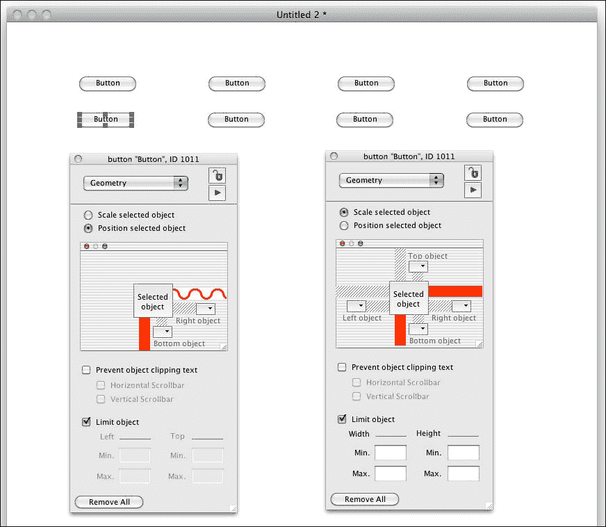

这些微弱的水平和垂直条用于选择您是否希望控件通过固定量或相对量进行缩放或定位。也就是说，如果一个按钮距离卡片窗口的右侧 100 像素，并且您选择从固定量进行定位，那么当您调整卡片窗口大小时，按钮将保持在窗口右侧 100 像素的位置。另一方面，如果您使用相对设置，并且按钮占据卡片窗口的 80%，那么在调整大小后，它仍然占据窗口的 80%。

在这些条中点击第一个会使它变成实心红色，这表示它距离卡片边缘的固定量。如果您再次点击它，它将呈现红色波形形状，表示它将是相对的。

在截图中，您可以看到选定的按钮设置为从卡片底部固定量，从卡片右侧相对量。图像还显示了控件的缩放设置。

注意，一个对象也可以相对于其他对象进行定位。参考前面截图中的**右侧对象**和**底部对象**弹出选择器。

# 行动时间 - 使用几何管理器定位按钮

我们将向当前正在工作的堆栈中添加一些按钮：

1.  取出前四个按钮并复制它们以获得另一组四个按钮，位于前面的按钮下方。

1.  选择新按钮中的第一个，并在检查器面板的**几何**部分中，点击一次垂直条和两次水平条；您将得到前面截图中显示的状态。

1.  对其他三个按钮也进行相同的操作。

1.  尝试调整卡片窗口的大小。

## *发生了什么？*

这是一次相当快的测试，如果一切顺利，你会发现调整卡片窗口大小包括使用我们添加的`resizeStack`处理程序定位前四个按钮，以及使用几何管理器定位第二组四个按钮。使用我们使用的设置，结果应该非常相似，只是第二组四个按钮将保持与卡片窗口底部的固定距离。

几何管理器有很多功能，你应该查看本章末尾所示参考链接中的其他能力。然而，它并不是处理移动屏幕尺寸的最佳方式。

# 分辨率独立性

LiveCode 6.5，以及更远…

在第一章中列出的功能之一，*LiveCode 基础知识*，已经被开发出来，并存在于 LiveCode 6.5 中。新功能是分辨率独立性。

现在，在看到调整屏幕大小的两种复杂方法之后，你可能能够忘记所有这些。在 LiveCode 6.5 中，引入了一个名为“分辨率独立性”的新功能，正确使用此功能将使许多布局困难消失。

目前，为了帮助您处理不同的设备尺寸和纵横比，有两种方法可供选择：多密度支持和全屏缩放模式。其中一些概念有点棘手，但一些截图可能会希望使它们变得清晰！

## 多密度支持

到目前为止，在本章中，我们忽略了设备**DPI**（每英寸点数）的问题。对于 Android 设备，有数百种不同的分辨率和 DPI 值。对于 iOS，只有几种 DPI 和分辨率的变体。最简单的问题案例是，你希望同一个应用在 iPhone 3GS 和 iPhone 4 Retina 或更晚的 iPhone 版本上看起来和工作方式相同。它们都有相同大小的屏幕，但 iPhone 4 的视网膜显示屏的 DPI 是两倍。这个 URL 显示了所有当前 iPhone 之间的差异：[`www.paintcodeapp.com/news/ultimate-guide-to-iphone-resolutions`](http://www.paintcodeapp.com/news/ultimate-guide-to-iphone-resolutions)。

使用 MobGUI 和几何管理器解决方案，你实际上是在幕后存储布局值或指令，这些值或指令准备适应用户的设备屏幕大小。LiveCode 6.5 中的多密度支持是解决此问题的更简单方法。

### 像素和点

像素是图像或屏幕上的发光点，而点是在印刷中的度量单位，通常为 1/72 英寸。如果一个屏幕的 DPI 正好是 72，那么这两个就是相同的，在 Macintosh 计算机的早期日子里，这几乎是事实。更现代的 Mac 和 PC 以及大多数移动设备都比 72 DPI 详细得多。在 LiveCode 6.5 及其后续版本中，您现在可以创建一个以点为单位工作的堆栈，然后通过将每个卡片上的图像和缩放因子应用到它来填充设备屏幕。

在进行此类缩放时，必须假设某些内容为自然尺寸。对于 iOS，LiveCode 使用非 Retina 屏幕作为 1X 缩放因子，而 Retina 屏幕的缩放因子为 2X。iPhone 5 和 6 引入了更多尺寸。iPhone 6 Plus 需要 3X 缩放因子。对于 Android，事情更为复杂，因为它至少有七个缩放因子级别。

实际上，幕后正在进行无限多的缩放因子。然而，您通常不必担心它们，因为 LiveCode 自动为您提供根据所讨论设备的 DPI 显示不同图像版本的能力。

### 图像命名约定

LiveCode 将检查包含的图像文件名（在**独立应用程序设置**对话框的**复制文件**部分中添加的），并将加载相应命名的图像版本。在此示例中，已添加了两个图像，`icon.png`和`icon@2x.png`。为了更容易地识别您看到的是哪一个，512 和 1024 已添加到本应相同的图标两个分辨率：

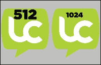

此图像略有放大，以帮助您看到 512 版本的图像分辨率低于 1024 版本。

iOS 使用的名称是：

+   `imagename.ext`（例如，`flowers.png`）

+   `imagename@2x.ext`（例如，`flowers@2x.png`）

+   `imagename@3x.ext`（例如，`flowers@3x.png`）用于 iPhone 6 Plus

第一个被认为是 1X 缩放版本，而`@2x`名称被认为是 2X 缩放版本，`@3x`版本也是如此。

### 注意

注意，您还需要在 LiveCode**独立应用程序设置**中指定适当的**启动屏幕**文件。否则，iPhone 将使用较低分辨率的图像。这可以通过检查设备的`screenRect`来验证。尽管 iPhone 6 Plus 的物理分辨率为 1080 x 1920，但应使用 1242 x 2208 的 3x 图像尺寸。手机会自动调整图像大小。2x 图像在 iPhone 6 上显示良好。

Android 使用的名称和缩放因子更为多样：

+   `imagename@ultra-low.ext - 0.25X`

+   `imagename extra-low.ext - 0.5X`

+   `imagename low.ext - 0.75`

+   `imagename medium.ext - 1X`

+   `imagename high.ext - 1.5X`

+   `imagename@extra-high.ext - 2x`

+   `imagename@ultra-high.ext - 4x`

在实际操作中，您可能会发现您只需要两三个版本的图像就能在广泛范围的 DPI 设备上使图像看起来足够好。

## 全屏缩放模式

在 LiveCode 6.5 及其多密度支持之前，您必须自己完成所有艰苦的工作！至少现在您可以为 iPhone 或 iPad 进行设计，并且 LiveCode 会负责这些设备的 Retina 版本。然而，对于 Android，您仍然需要拥有多种布局，或者有代码可以根据设备的宽高比和像素尺寸定位界面元素。

使用密度支持，您只需要注意宽高比，但仍有许多此类问题需要处理。对于类似工具的应用程序，您很可能会遇到这种麻烦，以便用户获得预期的体验。然而，有许多类型的应用程序更加图形化，可以利用全屏缩放模式：`empty`、`exactFit`、`showAll`、`noBorder`和`noScale`。让我们看看这些是什么……

### 语法

顺便说一下，一般的语法是在您的堆栈脚本中输入以下内容：

```java
on preopenstack
  set the fullscreenmode of the current stack to "showAll"
end preopenstack
```

对于四个活动模式，需要使用引号。空模式不需要引号。

### 空模式

如果**fullscreenmode**是**empty**，则卡片区域将改变以匹配设备屏幕。也就是说，左上角的卡片位于设备屏幕的左上角，卡片的宽度和高度与设备的实际像素宽度和高度相匹配。嗯，除非您已经利用了前面讨论过的多密度支持！本质上，empty 是 LiveCode 早期版本中的现有行为。

### showAll 模式

这种模式比其他模式稍晚出现，存在于 LiveCode 6.6 及其后续版本中。使用**showAll**，作为全屏模式，卡片的内容将被缩放，以便所有内容都显示在设备屏幕内。对于与您的卡片具有不同宽高比的设备，卡片区域外的元素将被显示出来。假设您创建了一个图形书应用，希望卡片的全部高度正好填满设备屏幕的高度，但您不希望在较宽的设备上出现黑色边框，那么您可以将背景图案扩展到卡片区域的左右两侧。在较窄的设备上，例如 iPad，您将看到 4:3 的卡片区域。在较宽的设备上，例如 iPhone 5，将显示额外的背景。以下插图显示了在不同设备上可以看到的背景图像区域：

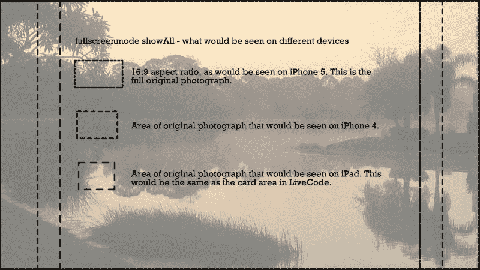

### 信封模式

**letterbox**模式与**showAll**相同，除了卡片区域之外的区域被隐藏，并留下典型的电影信封效果，因此得名！

### 无边框模式

**noBorder**模式非常有用，但需要一些时间来适应。假设你正在制作一款图形冒险游戏，类似于 Myst，并且你希望所有设备都使用相同的图形。你可以创建一个宽高比为 14:9 的场景，并确保重要内容不要离边缘太近。当场景在 iPad 上的**noBorder**模式下查看时，你会看到场景的完整高度和大部分宽度。当在 iPhone 5 上查看时，你会看到场景的完整宽度和大部分高度。正如其名所示，卡片区域将被缩放，因此没有边框，就像信封模式中会有边框一样。以下插图显示了原始 14:9 照片的哪些区域对于 4:3 的 iPad 和 16:9 的 iPhone 是可见的：

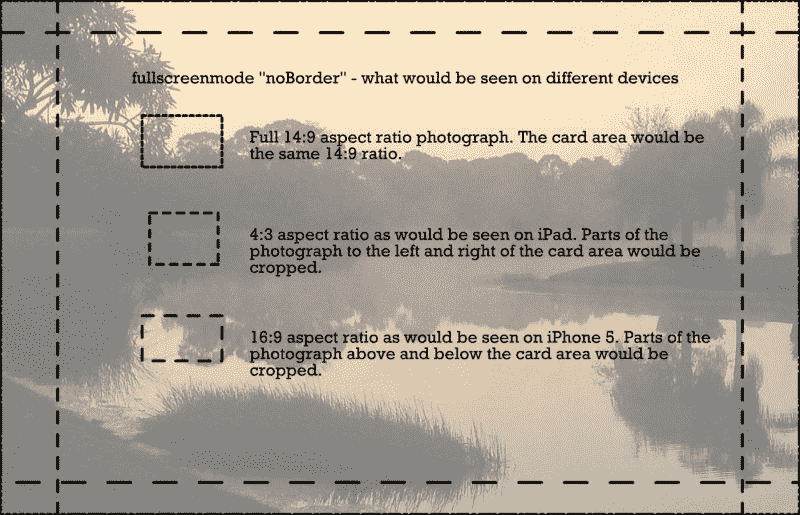

### **exactFit**模式

如其名所示，**exactFit**会将卡片内容挤压以填充设备的屏幕。很难想到这个模式的使用场景，但也许如果你执行某种艺术视觉化，挤压就不会很重要了！

### 注意

如前所述，几何管理器有很多强大的功能。如果你的兴趣也在桌面应用程序上，请查看以下课程：

[`lessons.runrev.com/s/lessons/m/4067/l/19026-Geometry-Manager`](http://lessons.runrev.com/s/lessons/m/4067/l/19026-Geometry-Manager)

# 摘要

使用易于使用的工具，例如 LiveCode，的技巧是创建用户认为是用难以使用的原生工具，如 Xcode，制作的移动应用。你可以实现这一点，因为 LiveCode 能够调用原生功能，并且你可以制作看起来合适的界面。

在本章中，我们通过使用简单的 LiveCode 命令调用原生 OS 功能，介绍了实现这一目标的几种方法。我们准备了用于按钮状态的图像，并添加了这些图像来制作看起来具有 OS 特定风格的按钮。我们还使用 MobGUI 创建了看起来像 iOS 原生控件的控制，并使用代码和几何管理器布局了界面。

到目前为止，这些都是一些小测试堆栈，让我们热身！接下来，我们将查看通用应用程序结构，以制作一个完整的功能应用程序。
