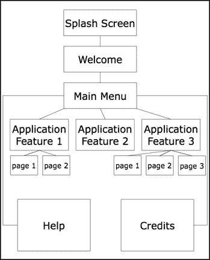
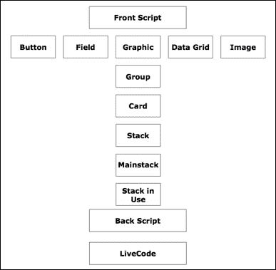
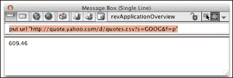
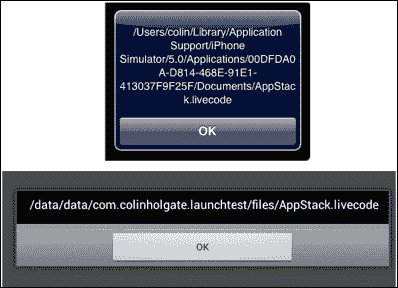
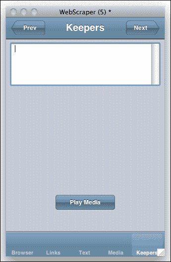

# 第四章：使用远程数据和媒体

*在创建 LiveCode 应用程序时，我们需要考虑栈的结构、其代码以及它使用的数据。当所有支持数据都在应用程序内部时，可以创建应用程序，但很多时候，我们希望显示存在于现实世界中的数据，并且还想将信息（比如高分排行榜）保存到应用程序外部的文本文件中。你可能还想与他人共享信息或在不同应用程序或设备之间同步。*

在本章中，我们将：

+   查看栈可能的结构方式

+   考虑代码应该放在哪里

+   写入和读取外部文本文件

+   创建一个类似剪贴簿的应用程序来记住有趣的基于互联网的媒体文件

### 小贴士

你想节省打字代码的时间吗？

本章有很多代码行。代码会与每个函数的解释一起展示，你可以使用这段代码构建与相应样本文件匹配的内容。然而，在转录脚本时，无论是脚本的内容还是脚本应该放置的位置，都很容易出错。可能更安全的方法是研究样本文件，并在这里阅读整体描述。你可以从 Packt Publishing 网站下载代码，网址为[`www.packtpub.com/books/content/support`](https://www.packtpub.com/books/content/support)。

# 栈结构

栈的结构有两个方面。一方面是关于用户界面元素的组织方式，另一方面是关于在栈的层次结构中你应该放置代码的位置。前者解决的是如何使应用程序易于理解、逻辑性强且易于使用。后者解决的是如何最小化开发时间、后续维护工作，以及如何最大化应用程序的性能。

## 代码驱动和手动创建的布局

当你想象一个典型的移动应用程序看起来像什么时，它可能大致是这样的：



有时，应用程序完全是代码驱动的，你看到的每个屏幕都是根据需要即时使用代码创建的。也许它已经布局了作为资源保存的元素，然后代码会加载这些资源。在任何情况下，整个应用程序都可以在一个 LiveCode 卡片上完成。

另一种方法是将每个可能的屏幕组合作为不同的卡片或甚至栈，并转到看起来像应用程序在那个时刻的样子。

在第一种情况下，你需要运行应用程序并执行用户操作，以检查布局是否正确。然后，你需要返回并更改代码或资源，然后再次尝试。在第二种情况下，你可能面临许多布局组合。

当我们开始在这里制作应用程序时，我们会尝试找到一个中间地带，在那里我们将使用卡片来设置我们需要的主体屏幕，然后我们将使用代码来显示和隐藏其他元素。我们的目标是尽量提高效率，不要编写复杂的代码来布局那些可以快速手动布局的项目。我们也不希望在代码可以取得相同结果的情况下使用大量图像。

## 代码位置

LiveCode 在如何构建你用它制作的事物方面非常灵活。除了可以包含代码的十几种不同类型的控件之外，你还可以控制前端脚本、组、当前卡片、主堆栈、正在使用的堆栈、后端脚本以及 LiveCode 本身。以下图表只显示了几个示例控件，但它给你了一个 LiveCode 层次结构有多少级别的概念：



你还可以有子堆栈，通常用于显示对话框窗口，添加前后脚本的能力，以及你可以将堆栈放入或移出使用。总的来说，可能会变得相当混乱！

这在很大程度上取决于个人风格，至于你将脚本放在哪里，通常你可能会有一个合理的理由来解释你为什么以某种方式做了。你可以争论说，所有发生的行为都应该在点击的按钮的脚本中。这将使得编辑所有涉及的处理器变得容易，如果你需要在另一个堆栈中具有相同的功能，你只需复制按钮即可。然而，如果你在屏幕上有许多这样的按钮并且需要做出更改，你必须对它们全部进行更改。

另一个有效的论点是可以说所有处理器都在堆栈级别。这样，你将有一个中央位置来做出更改，但你将不得不做出很多`if`语句来检查哪个控件已被操作。

你可能希望重用你随着时间的推移开发出的例程，并会有一组你可以投入使用的堆栈，其中每个堆栈仅处理手头任务的特定方面。在面向对象编程（**OOP**）的世界里，将这种方法扩展到疯狂的程度是很常见的，有数百甚至数千个小文件，每个文件处理整体应用程序的一小部分。

我们不会走向这些极端。相反，我们将尝试将代码放在最低级别，这样它就不需要重复代码，正如你创建需要相同代码的额外控件时。在这个过程中，我们将尝试提前思考并发现我们可以使用的效率。让我们看看一个例子。

假设你有一个主菜单按钮，其功能是将用户带回到名为`main`的卡片。将此作为按钮的脚本是有意义的：

```java
on mouseUp
  go card "main"
end mouseUp
```

这看起来像是代码可以到达的最低级别，我们不会重复它，因为只有一个主菜单按钮。然而，如果我们想跟踪用户的进度，主菜单按钮将对此一无所知。所以，我们可以这样做：

```java
on mouseUp
  navTo "main"
end mouseUp
```

在卡片脚本中，会有这个处理程序：

```java
on navTo aCard
  saveNavState
  go card aCard
end navTo
```

`saveNavState`函数会在某个地方保存用户的状态。唯一的问题是，对于我们所创建的每一张卡片，包括主菜单按钮，我们将在它们的脚本中都要有这个`navTo`处理程序。因此，我们将处理程序放在主栈栈脚本中。由于它处于这个级别，它可以处理来自任何卡片上任何按钮的调用。帮助按钮的脚本可能是这样的：

```java
on mouseUp
  navTo "help"
end mouseUp
```

前往帮助卡片也会保存用户的状态。稍后，我们还可以添加一个视觉效果，当你从一个地方跳到另一个地方时，并在`navTo`中而不是绕过使用`navTo`处理程序的各个按钮中做出这种改变。

## 快速问答——命名这个结构

有一个常用的术语用来描述 LiveCode 的层次结构，有助于传达信息如何在层次结构中上下传递。这个术语叫什么？

1.  事件视界

1.  消息路径

1.  调用栈

1.  主栈

答案：2

对于进一步阅读，RunRev 有一个在线课程，描述了消息路径，你可以在以下位置找到：

[`lessons.runrev.com/s/lessons/m/4603/l/44036-the-livecode-message-path`](http://lessons.runrev.com/s/lessons/m/4603/l/44036-the-livecode-message-path)

# 加载和保存外部数据

在许多应用程序中，你可能想要跟踪用户所做的更改。LiveCode 有几种方法可以做到这一点，包括查询 URL、读取和写入文本文件以及保存堆栈内的数据。

## 查询 URL

很常见，基于 Web 的应用程序从服务器端脚本中加载和保存数据。这也适用于 LiveCode 应用程序。以下是一个示例，展示了昨天谷歌的收盘价：

```java
put url "http://quote.yahoo.com/d/quotes.csv?s=GOOG&f=p"

```

在撰写本书时，这一行已经过测试，**消息框**中出现了`609.46`，如下所示：



谁知道当你尝试时你会找到什么！实际上，在本书的第二版修订过程中，跳出的数字是 1172.9301。去谷歌搜索吧！

与任何此类对在线服务的调用一样，有可能需要一些时间才能返回值，在前面的例子中，LiveCode 在数据返回之前将无法执行其他任何操作。对于这种情况的一个替代方法是先加载 URL 以缓存它，然后在它被缓存后显示结果。在数据返回时，LiveCode 可以执行其他操作。按钮脚本可能看起来像这样：

```java
on mouseUp
  unload url "http://quote.yahoo.com/d/quotes.csv?s=GOOG&f=p"
  load url "http://quote.yahoo.com/d/quotes.csv?s=GOOG&f=p" with message "gotit"
end mouseUp

on gotit addr, state
  if state is "cached" or state is "downloaded" then
    answer url addr
  else
    answer state
  end if
end gotit
```

`gotit`处理程序还会检查调用是否正常工作，如果没有，它将显示导致问题的错误。`unload`行用于确保您没有读取之前缓存的值。如果这是一个只偶尔改变的价值，例如股票的收盘价，那么您通常只有在它可能改变时才清除缓存版本。对于这个例子，那可能就是第二天。

发布数据的工作方式相同。一个将您的分数发送到服务器的游戏可以这样操作：

```java
on sendscore username,score
  put url "http://www.mysite.com/hiscores/savescore.php?user=" & username & "&score=" & score into err
  if err is not "ok" then answer err
end sendscore
```

如果`username`或任何其他发布数据的部分包含空格字符，您应该首先在位置处使用`URLEncode`。这样做会将空格和其他特殊字符转换为安全到达目标 URL 的代码。以下将是前面代码的一个更安全的变体：

```java
on sendscore username,score
  put "http://www.mysite.com/hiscores/savescore.php?user=" & username & "&score=" & score into tPostAddress
put url URLEncode(tPostAddress) into err
  if err is not "ok" then answer err
end sendscore
```

## 读取和写入文本文件

在 HyperCard 的时代，保存和加载外部数据的唯一真正选择是编写一个文本文件。当然，LiveCode 也可以这样做，在某些情况下，这可能是最简单的解决方案。配置和首选项文件是几个很好的例子，其中一个小型文本文件可以用来以用户希望的方式设置应用程序。

例如，假设我们有一些配置文本文件名为`englishstrings.txt`和`frenchstrings.txt`，它们包含在**独立应用程序设置**对话框框的**复制文件**列表中，并且它们将被用来在您的应用程序中设置按钮的英文名称或法文名称。此外，我们还想编写一个首选项文件来记住用户的选择。当应用程序打开时，我们会检查首选项文件的内容，然后加载适当的字符串文件。

### 注意

在移动操作系统，尤其是 iOS 中，关于您允许保存数据的位置有严格的规则。随着我们向前发展，我们将使用苹果和谷歌批准用于此类用途的位置。

在移动应用程序中包含的文本文件将与应用程序本身位于同一位置，而您想要写入的文本文件应该位于应用程序的`documents`文件夹中。因为这些路径在 iOS 和 Android 中看起来相当不同，我们应该使用 LiveCode 的`specialFolderPath`函数来定位这些文件夹。以下是一个`openStack`处理程序如何检查首选项是否已设置，如果没有，将用户带到初始语言选择屏幕的方法：

```java
on openStack
  global langstrings
  put "file:" & specialFolderPath("documents") & "/prefs.txt" into prefsfile
  put url prefsfile into prefstext
  if prefstext is empty then
    -- prefs have never been set, so go to the language choice card
    go card "language choice"
  else
    -- language has previously been chosen, so we load up the right file
    put "file:" & specialFolderPath("engine") & prefstext & "strings.txt" into langfile
    put url langfile into langstrings
  end if
end openStack
```

特殊**引擎**文件夹路径与应用程序文件以及您在**独立应用程序设置**对话框的**复制文件**部分中包含的支持文件位于同一位置（如第七章中的*复制文件*部分所述，*将应用程序部署到您的设备*)，在保存独立应用程序时。在前面的例子中，会有名为`englishstrings.txt`、`frenchstrings.txt`、`spanishstrings.txt`等文件。以下代码行将连接包含文件的路径、您希望使用的语言（存储在变量`prefstext`中）以及这些文件名的结尾：

```java
put "file:" & specialFolderPath("engine") & prefstext & "strings.txt" into langfile
```

这将为您提供与您选择的语言匹配的语言字符串文本文件的完整路径。

## 使用另一个堆栈存储数据

理想情况下，您只需保存您当时所在的堆栈中的更改即可，但 iOS 不允许您在应用程序目录中保存更改。我们必须通过在文档文件夹中保存堆栈来解决这个问题。要保存的堆栈可以是我们的应用程序堆栈，也可以是仅用于存储数据的堆栈。在堆栈中保存数据可能比在文本文件中保存更方便。例如，您可以有多个文本字段，用于存储下次运行应用程序时需要的信息片段。如果您使用文本文件，您可能需要很多个，或者您将不得不从单个文件中处理文本以提取个别信息片段。

您可以在不创建移动应用的情况下尝试在堆栈中保存数据，以检查基本技术是否可行。之后，您可以在实际设备上尝试相同的方法。首先在您的计算机上尝试此方法的优势是，您可以浏览到`documents`文件夹，以便看到事情发生时的神奇效果！

# 行动时间 - 创建数据保存堆栈

我们将复制一个堆栈，但前提是那个堆栈没有其他副本。LiveCode 有一个很好的`if there is a…`函数，它就是为了这种情况而设计的！

首先，我们将按照以下步骤创建所需的堆栈：

1.  以名称`LaunchStack`开始一个新的主堆栈。将其保存在除您计算机的`Documents`文件夹以外的其他位置。

1.  以名称`AppStack`开始另一个新的主堆栈。将其保存在第一个堆栈相同的文件夹中。

1.  在每个堆栈的卡片上放置一些数据，这样您就可以轻松地识别出您是否在该堆栈中。例如，将一个按钮拖放到`LaunchStack`堆栈的卡片上，并以一种使其非常容易识别的方式命名它。对`AppStack`堆栈也做同样的操作。

1.  将以下`openStack`处理程序放入`LaunchStack`的堆栈脚本中：

    ```java
    on openStack
      set the defaultFolder to specialFolderPath("Documents")
      if there is not a file "AppStack.livecode" then
      put the filename of this stack into masterfile
        set the itemdelimiter to "/"
        put "AppStack.livecode" into the last item of masterfile
        --put specialFolderPath("engine") & "/AppStack.livecode" into masterfile
        put specialFolderPath("Documents") & "/AppStack.livecode" into appfile
        put URL ("binfile:" & masterfile) into URL ("binfile:" & appfile)
      end if
      go stack specialFolderPath("Documents") & "/AppStack.livecode"
    answer the filename of this stack
    end openStack
    ```

1.  保存堆栈并退出 LiveCode。

在尝试在设备或模拟器上尝试堆栈之前，我们将按照以下步骤将它们作为桌面堆栈尝试：

1.  在你的`Documents`文件夹中查看；目前这个文件夹中不应该有`AppStack.livecode`文件。

1.  通过双击`LaunchStack.livecode`文件来启动 LiveCode。如果你发现 LiveCode 不能以这种方式启动，请确保你有与 LiveCode 关联的`.livecode`文档。如果你使用多个 LiveCode 副本，比如说你正在尝试社区版和商业版，你可以将堆栈文件拖放到你打算使用的 LiveCode 副本上。

1.  在你的`Documents`文件夹中查看；现在应该有一个创建时间与当前时间匹配的`AppStack.livecode`文件。

1.  你也应该看到，AppStack 的路径确实位于你的`Documents`文件夹中。

现在，按照以下步骤在移动设备或 iOS 模拟器上尝试我们的堆栈：

1.  关闭 AppStack 堆栈，并取消注释步骤 4 中输入的`LaunchStack`堆栈脚本中的`put specialFolderPath…`行。

1.  前往**独立应用程序设置**并选择**复制文件**部分。

1.  点击**添加文件…**并定位并添加原始的`AppStack.livecode`堆栈（不是之前测试中创建的那个）。

1.  选择**独立应用程序设置**中的**Android**或**iOS**部分，并勾选复选框以使应用程序适用于该平台。

1.  从**开发**菜单中选择你的测试目标。如果你选择 iOS，那将是 iOS 模拟器之一；如果你选择 Android，那将是连接的 Android 设备。

1.  从**开发**菜单中选择**测试**。你现在应该能够查看 AppStack 以及显示堆栈路径的警告对话框。以下截图显示了 iOS 模拟器窗口和 Android 4 平板电脑上的结果对话框：

## *刚才发生了什么？*

我们设置了应用程序以复制设备文档区域中的主应用程序堆栈，这样我们就能成功地进行更改并保存它们。如果你在 iOS 和 Android 上进行测试，你会看到堆栈的路径看起来相当不同。LiveCode 会为我们找到这些特殊文件夹。

## 快速问答 – 其他特殊位置

检查你是否偶然知道这个或使用这个问题作为借口去阅读发布说明和字典！以下哪个不是`specialFolderPath`类型？

1.  用户

1.  主页

1.  桌面

1.  0x000e

答案：1

`specialFolderPath`类型`Home`和`Desktop`在 Android 中不被使用，而`Desktop`在 iOS 中也不被使用。`0x000e`听起来可疑，但实际上是 Unix 下`My Videos`的`specialFolderPath`条目！系统中都没有`Users`条目。

# 创建一个网络“抓取”应用程序

为了尝试各种原生移动控件，我们将制作一个可以读取网页并提取页面不同媒体链接的应用。该应用将包含一个显示网页浏览器的卡片、显示链接的卡片、网页文本和媒体以及一组用于记住所选项目的卡片。

# 动手实践 - 设置标签导航

在开始制作浏览器卡片的过程之前，我们需要设置应用中所有卡片共享的项目。以下步骤将帮助您完成此操作：

1.  我们将再次使用 MobGUI 来简化操作。通过导航到**开发** | **插件**子菜单选择**revMobGUI**。此外，从 LiveCode **工具**菜单打开**项目浏览器**以观察堆栈结构的发展。

1.  创建一个新的 Mainstack，将其名称设置为 `WebScraper`，并将其保存到某个位置。

1.  在这些说明中，我们将使用纵向模式的 iPhone，但您也可以使用 iPad 或 Android 尺寸的卡片。您可以在 MobGUI 窗口中选择 **iOS7** 和 **320x480**，或者选择您喜欢的选项。

1.  如同在第三章中“使用 MobGUI 记忆布局”部分所做的那样，使用 MobGUI 工具添加一个**导航栏**并点击卡片窗口的**吸附到顶部**，添加一个**标签栏**并点击卡片窗口的**吸附到底部**，以及两者的**背景颜色**。请注意，当将 MobGUI 控件添加到 Mainstack 时，项目会自动添加 MobGUI 卡片和行为控件。

1.  将一个 LiveCode 字段控件拖到 NavBar 中并标记为 `NavBar`。按您喜欢的格式进行格式化。

1.  从 MobGUI 面板拖出一个 **Button** 控件并复制四次。选择所有五个按钮，并在 **Inspector** 中选择 **Align Objects**。将它们的顶部对齐并在卡片上分布它们。将五个按钮拖到您刚刚创建的标签栏上，并根据需要调整它们的大小和位置。

1.  将五个按钮命名为 `Browser`、`Links`、`Text`、`Media` 和 `Keepers`。通过在检查器调色板中设置**标签**条目来完成此操作。

1.  编辑每个按钮的脚本，并在 `mouseUp` 处理程序中添加以下行，使处理程序看起来如下：

    ```java
    on mouseUp
      put the short Name of me into tTabText
      set the Text of field "NavBar" to tTabText
      go card tTabText
      init
    end mouseUp
    ```

1.  从**编辑**菜单中，选择**选择全部** | **对象菜单中的** **分组选择**。

1.  选择该组，在常规 LiveCode 对象检查器的**基本设置**菜单中，给该组命名为 `Common` 并勾选**行为像背景**按钮。

1.  将卡片的名称设置为 `Browser`。

1.  创建一个新的卡片并将其命名为 `Links`。请注意，分组按钮将出现在新卡片上。

1.  对另外三个要命名的卡片 `Text`、`Media` 和 `Keepers` 也进行相同的操作。

1.  前往**独立应用程序设置**，选择您想要尝试的平台**iOS**或**Android**，从**开发**菜单中选择适当的目标，并执行**测试**。

1.  点击或触摸五个标签按钮，你应该会看到`NavBar`字段的名称已更改。

## *发生了什么？*

通过将按钮和卡片命名为相同的名称，我们能够通过附加到组的脚本访问五个卡片。我们还使用了按钮脚本，将 NavBar 的名称设置为与我们跳转到的卡片名称相匹配。`init`行将在我们编写卡片脚本时自动出现。

### 注意

不要在同一张卡片上使用相同类型的控件相同的名称。你的脚本可能会最终操作错误的控件。

## 浏览器卡片

现在，我们将向第一张卡片添加一些控件和脚本，以创建以下迷你网页浏览器：


原生浏览器控件具有许多与之相关的属性、动作和消息。你可以在以下网站上查看**iOS 发布说明**和**Android 发布说明**：

[LiveCode 5.5.5 版本笔记 - iOS](http://downloads.livecode.com/livecode/5_5_5/LiveCodeNotes-5_5_5-iOS.pdf)

[LiveCode 5.5.5 版本笔记 - Android](http://downloads.livecode.com/livecode/5_5_5/LiveCodeNotes-5_5_5-Android.pdf)

支持文档的额外更新可以在以下找到：

[LiveCode 博客 - 6.1.2 带来 iOS 7 支持](http://livecode.com/blog/2013/10/18/6-1-2-brings-ios-7-support/)

尽管如此，对于我们这个应用来说，我们只需要 LiveCode 的少数几个功能。

# 是时候采取行动了——添加浏览器控件

返回堆栈的第一张卡片，找到 MobGUI 窗口中本机控件部分。以下步骤将引导你完成：

1.  将**浏览器**控件拖拽到卡片窗口上。

1.  调整控件大小以填充卡片宽度，并调整控件高度，使其介于标签栏和 NavBar 下方一点的位置。给它命名为`Page`。

1.  在浏览器控件被选中时，确保 MobGUI 窗口中标题为**自动删除**的框被勾选。这将在你不在浏览器卡片上时帮助减少最终应用的内存使用。

1.  从 MobGUI 窗口中，将一个**输入**控件拖拽到浏览器控件和 NavBar 之间的空隙中。将其命名为`url`，并调整大小，使其几乎与卡片一样宽，为右边的**Go**按钮留出空间。

1.  将一个**按钮**控件拖拽到该空间，将其标签设置为`Go`，并调整大小以使其看起来更美观。

1.  编辑**Go**按钮（你可能已经注意到，它实际上是一个组）的脚本，并在 mouseUp 处理程序中添加几行，如下所示：

    ```java
    on MouseUp
      mobileControlSet "Page", "url", the mgText of group "url"
      focus on nothing
    end mouseUp
    ```

1.  之后，我们将向卡片发送一个`init`消息。对于浏览器卡片，我们可以使用这种方式来恢复之前选择的网页。在浏览器卡片脚本中添加以下内容：

    ```java
    on init
      global gPageURL
      if gPageURL is not empty then
        set the pURL of group "Page" to gPageURL
      else
        set the pURL of group "Page" to "http://www.google.com/"
      end if
    end init
    ```

1.  编辑浏览器（组`Page`）控件的脚本。我们将使用`browserFinishedLoading`消息来知道何时更新一些变量和 URL 文本。

1.  修改浏览器控制脚本中的此处理程序，如下所示：

    ```java
    on browserFinishedLoading pURL,pType
      global gPageURL,gPageHTML
      put pURL into gPageURL
      put url pURL into gPageHTML
      set the mgText of group "url" to pURL
      pass browserFinishedLoading
    end browserFinishedLoading
    ```

1.  保存并执行另一个**测试**以查看浏览器卡片的效果。

## *刚刚发生了什么？*

将浏览器控制的`pURL`命令设置为`mgText`就足以使浏览器正常工作，但刚刚所做的一些操作是为了准备我们在其他卡片中需要的内容。特别是，我们使用了常规的 LiveCode `put url`命令将网页 HTML 代码的副本存储在一个全局变量中，当我们开始从页面中提取链接和媒体时，这将是有用的。

## 链接卡片

链接、文本和媒体卡片将使用存储在`gPageHTML`全局变量中的页面源代码，并从中提取感兴趣的部分。它们将如何做到这一点呢？

在提取已知文本模式时，常用的方法是用正则表达式，通常被称为`regex`或`regexp`。在最简单的情况下，它很容易理解，但可能会变得相当复杂。

### 注意

如果你想深入了解正则表达式，请阅读维基百科上的文章：

[`en.wikipedia.org/wiki/Regular_expression`](http://en.wikipedia.org/wiki/Regular_expression)

另一个有用的信息来源是 Packt Publishing 关于正则表达式的文章，您可以在[`www.packtpub.com/article/regular-expressions-python-26-text-processing`](http://www.packtpub.com/article/regular-expressions-python-26-text-processing)找到。

然而，使用正则表达式解析 HTML 内容是不被推荐的。网上有大量文章明确告诉你不要用正则表达式解析 HTML！这里有一个简短示例：

[`boingboing.net/2011/11/24/why-you-shouldnt-parse-html.html`](http://boingboing.net/2011/11/24/why-you-shouldnt-parse-html.html).

现在，解析 HTML 源代码正是我们在这里想要做的事情，解决这个问题的方法之一是混合使用 LiveCode 的其他文本匹配和过滤能力来完成大部分工作。尽管这并不完全是正则表达式，但 LiveCode 可以在其匹配和过滤函数中使用正则表达式，并且它们比完整的正则表达式更容易理解。所以，让我们从使用这些功能开始。

在寻找链接时，我们将假设链接位于`a href`标签内，但即使如此，它可能以很多不同的方式出现。`href`标签的一般结构如下：

```java
<a href="http://www.runrev.com/support/forum/">Link text that the user will see</a>
```

在网页文本中将会出现用户将看到的`链接文本`。当鼠标指向它时，用户将看到指向的手指光标，当点击它时，页面将使用标签`href`部分显示的 URL 重新加载。

上述示例显示了支持论坛的完整路径；以下是一些将完全相同的网络位置写入页面链接的方式：

`http://www.runrev.com/support/forum/`

`/support/forum/`

`support/forum/`

`../support/forum/`

第一个链接无论你在什么位置点击都会带你到那里。第二个链接如果你在[`runrev.com/`](http://runrev.com/)网站上其他地方点击，则会带你到那里。第三个链接在你位于[`runrev.com/`](http://runrev.com/)网站的根级别时是正确的，最后一个示例将从一个其他根级别目录在网站上工作。

使用正则表达式，你可能创建一个处理页面源代码中链接所有可能变体的复杂表达式，但即使如此，它也不会给我们需要的完整路径。

通过逐步处理，我们可以将整个页面源代码减少到一组“a href”条目，提取每行的 URL 部分，最后，将前面的变体转换为完整的路径 URL。

# 行动时间 - 创建一个链接提取函数

有时候，在单独的堆栈中创建测试然后将其中的函数应用到你的应用程序堆栈中是非常方便的。以下要点将帮助你创建一个链接提取函数：

1.  创建一个新的**主堆栈**并保存它，以确保安全！

1.  添加几个字段和一个按钮。

1.  将按钮的脚本设置为以下内容：

    ```java
    on mouseUp
      put url "http://www.runrev.com/" into field 1
      put getLinks(field 1) into field 2
    end mouseUp
    ```

1.  编辑堆栈脚本并创建一个`getLinks`函数。从返回它发送的内容开始：

    ```java
    function getLinks pPageSource
      return pPageSource
    end getLinks
    ```

1.  如果你现在尝试点击按钮，你会看到整个页面源代码出现在字段 2 中。

1.  我们将使用过滤函数，并且它需要文本以单独的行存在。因此，我们希望每个链接都在一行中。`replace`函数可以很好地做到这一点。在“return”行之前添加这两行脚本：

    ```java
      replace "/a>" with "/a>" & return in pPageSource
      replace "<a" with return & "<a" in pPageSource
    ```

1.  现在尝试点击按钮。两个字段看起来几乎一样，但任何包含链接的行都将单独一行显示。

1.  添加一行以过滤列表，使其只显示包含链接的行：

    ```java
      filter pPageSource with "*a href*/a>"
    ```

1.  `*`字符是通配符，它将列表减少到只包含同时具有`a href`和`/a>`的行。再次尝试按钮。

1.  现在你将看到只有包含链接的行，但它们仍然包含链接本身的两侧的垃圾信息。我们需要的部分是在第一个和第二个引号之间，使用`itemdelimiter`我们可以获取这部分。添加以下行：

    ```java
    set the itemdelimiter to quote
      repeat with a = 1 to the number of lines in pPageSource
        put item 2 of line a of pPageSource into line a of pPageSource
      end repeat
    ```

1.  现在点击按钮，你应该得到一个只包含每行 URL 部分的列表。然而请注意，大多数链接以`/`开头而不是`http`。

1.  在堆栈脚本中再创建一个函数，用于将链接转换为完整路径：

    ```java
    function getPath pPageURL,pLinkURL
    end getPath
    ```

1.  现在，添加处理 URL 变体的代码（到`getPath`函数），从它的完整路径开始：

    ```java
      if pLinkURL contains "://" then
        return pLinkURL
      end if
    ```

1.  如果你还记得之前的内容，我们已将主页面的 URL 保存在一个全局变量中，`gPageURL`。对于链接是根相对路径的情况（它以`/`开头），我们想要组合主机位置和链接 URL：

    ```java
      set the itemdelimiter to "/"
      if char 1 of pLinkURL is "/" then
        return item 1 to 3 of pPageURL & pLinkURL
      else
    ```

1.  当第一个字符不是`/`时，它可能以`../`开头，以在服务器结构中向上移动一级。删除页面 URL 的最后部分将给我们需要与链接 URL 组合的内容：

    ```java
    if char 1 to 3 of pLinkURL is "../" then
      delete the last item of pPageURL
      delete the last item of pPageURL
      delete char 1 to 2 of pLinkURL
      return pPageURL & pLinkURL
    else
    For other cases we combine the page URL and the link URL:
      delete the last item of pPageURL
      return pPageURL & "/" & pLinkURL
      end if
    end if
    ```

1.  最后，如果所有这些检查都失败了，我们将返回一个空字符串，这样这个奇怪的链接 URL 结构就不会在以后混淆我们：

    ```java
      return ""
    end getPath
    ```

1.  要使`getLinks`函数使用`getPath`函数，我们需要对步骤 9 中显示的脚本进行更改：

    ```java
      repeat with a = 1 to the number of lines in pPageSource
      put getPath(gPageURL,item 2 of line a of pPageSource) into line a of pPageSource
    end repeat
    ```

## *发生了什么？*

我们分阶段开发了一个函数，该函数可以在网页源文本中找到以一组完整路径 URL 结尾的链接，我们可以将这些链接呈现给用户。

## 缺失的链接

测试堆栈中缺失的一块是存储页面 URL 的全局变量。在应用堆栈的情况下，该值由浏览器控制的`browserFinishedLoading`函数提供，但在这里，我们需要为测试目的插入一个值。

在按钮脚本和堆栈脚本中放置一个全局声明行。在按钮脚本中，用我们的测试用例值填写变量。脚本将如下所示：

```java
global gPageURL

on mouseUp
  put "http://www.runrev.com/" into gPageURL
  put url gPageURL into field 1
  put getLinks(field 1) into field 2
end mouseUp
```

现在尝试按钮，你应该能在第二个字段中看到完整的路径 URL 列表。如果它工作正常，复制两个堆栈函数和全局声明行，并将它们粘贴到 WebScraper 堆栈的堆栈脚本中。

### 还有一件事…

选项卡栏脚本包括一个初始化行。这将调用卡片脚本；在这种情况下，是链接卡片脚本，但它目前还不存在！让我们来创建它。

# 是时候添加链接卡片初始化处理程序了

在继续之前，请确保你对测试堆栈中的函数感到满意，并且已经使用以下步骤将它们复制到 WebScraper 堆栈脚本中：

1.  前往 WebScraper 堆栈的链接卡片。

1.  编辑卡片脚本并添加这些全局变量和`init`函数：

    ```java
    global gPageHTML,gLinks

    on init
    if the platform is "iphone" or the platform is "android" then
      put getLinks(gPageHTML) into gLinks
      if the number of lines in gLinks = 0 then
         answer "There are no links in this page!"
      else
         mobilePick gLinks,0
         if the result > 0 then
          put the result into tLinkLine
          put line tLinkLine of gLinks into tLink
          go card "Browser"
          set the mgText of group "url" to tLink
          set the Text of field "NavBar" to "Browser"
          mobileControlSet "Page", "url", the mgText of group "url"
          end if
        end if
      end if
    end init
    ```

1.  对应用进行测试。

1.  在 iPhone 模拟器或 Android 设备上（如果你使用的是这些设备），将 URL 更改为[`www.runrev.com/`](http://www.runrev.com/)并选择**前往**按钮。

1.  当页面加载时，选择**链接**选项卡按钮。

1.  现在，你应该能看到来自 RunRev 页面的链接列表；但这次，它是以原生选择器列表的形式呈现的。

1.  从列表中选择一个链接，然后**完成**。

1.  你将被带回到带有加载的链接页面的浏览器卡片。

## *发生了什么？*

我们输入的卡片脚本与测试堆栈中的按钮执行相同的任务；在那里，它调用堆栈函数以获取链接列表。在这里，我们不是将列表放入普通字段中，而是使用了 LiveCode 的能力，通过以下行打开原生选择器控件：

```java
mobilePick gLinks,1
```

此函数所需的参数是要显示的项目列表和一个索引位置，该位置将被选中。通过输入`1`，默认选中第一个项目。从选择器返回的结果是选中项目的索引，我们可以使用这个索引在`gLinks`变量中查找匹配的行。

剩余的行将带我们回到浏览器卡片，设置要加载的 URL，并更改 NavBar 以反映卡片名称。

## 文本卡片

使文本卡片工作要简单得多，但包括一条难以置信的复杂正则表达式行，该行可以在以下位置找到：

[`stackoverflow.com/questions/3951485/regex-extracting-readable-non-code-text-and-urls-from-html-documents`](http://stackoverflow.com/questions/3951485/regex-extracting-readable-non-code-text-and-urls-from-html-documents)

# 动手时间 - 设置文本卡片

我们将从您制作的测试堆栈开始，这样我们就可以在将其添加到 WebScraper 堆栈之前在那里使函数工作。

1.  复制你在提取链接时制作的按钮。将函数调用`getLinks`更改为`getText`；其余的脚本可以保持不变。

1.  编辑测试堆栈的脚本并添加此函数：

    ```java
    function getText pPageSource
      put replaceText(pPageSource,"(?:<(?P<tag>script|style)[\s\S]*?</(?P=tag)>)|(?:<!--[\s\S]*?-->)|(?:<[\s\S]*?>)","") into pPageSource
      replace lf with "" in pPageSource
      replace tab with " " in pPageSource
      return pPageSource
    end getText
    ```

1.  尝试点击您刚刚制作的按钮。你应该看到您的第二个字段只填充了网页的文本部分。

1.  复制函数并回到 WebScraper 堆栈脚本。将函数粘贴到那里。

1.  前往堆栈的文本卡片，并从 MobGUI 窗口中，将**多行文本**控件拖到卡片上。将其名称设置为`PageText`。

1.  调整控件大小以填充 NavBar 和 Tab-bar 之间的区域。如果文本无法填满字段，您可能需要使用 LiveCode 检查器来修改大小。

1.  在控制器的 MobGUI 窗口属性中，取消勾选**可编辑**复选框。

1.  编辑卡片脚本并添加此`init`函数：

    ```java
    global gPageHTML

    on init
      if the platform is "iphone" or the platform is "android" then
        mobileControlSet "PageText","text",getText(gPageHTML)
      end if
    end init
    ```

1.  尝试对应用进行**测试**。

1.  在**浏览器**卡片中，将 URL 从[`google.com/`](http://google.com/)更改为[`runrev.com/`](http://runrev.com/)并点击**前往**。

1.  点击底部的**文本**标签按钮。

1.  你现在应该处于**文本**卡片上，并且应该能够看到在原生滚动文本字段中显示的网页文本元素。

## *发生了什么？*

这个非常长的正则表达式在网页源代码中运行，移除了任何脚本、样式或仅仅是标签信息，而文本部分则保持不变。然而，它会在文本中留下很多多余的换行符和制表符，我们继续使用 LiveCode 的`replace`函数来移除它们。最终文本可能并不完美，但您可以使用标准的移动文本功能来复制文本的部分以在其他应用中使用。

## 媒体卡片

媒体卡片将非常类似于链接卡片，卡片脚本中有一个`init`函数和一个堆栈脚本函数用于从页面中提取媒体链接。

# 动手时间 - 提取媒体链接列表

可能有一个正则表达式可以提取页面上的所有`src`链接，但我们只对我们知道 LiveCode 能够显示或播放的内容感兴趣。因此，在这些步骤中，我们将使用更狡猾的方法来提取我们能够处理的链接：

1.  你不妨去测试堆栈看看！

1.  通过复制其他两个中的一个来创建第三个按钮，并在按钮脚本中将`getLinks`或`getText`部分更改为调用`getMedia`。

1.  在堆栈脚本中输入所有这些：

    ```java
    global gPageURL

    function getMedia pPageSource
      put ".jpg,.png,.gif,.jpeg,.mov,.mp4,m4v,.mp3" into tExtensions
      repeat with a = 1 to the number of items in tExtensions
        put item a of tExtensions into tExtension
        replace tExtension with tExtension & "*" & return in pPageSource
      end repeat
      repeat with a = the number of lines in pPageSource down to 1
        put line a of pPageSource into tLine
        if the last char of tLine is "*" then
          delete the last char of tLine
          put removeLeaders(gPageURL,tLine) into line a of pPageSource
        else
          delete line a of pPageSource
        end if
      end repeat
      return pPageSource
    end getMedia

    function removeLeaders pPageURL,pLinkURL
      put quote&"'()" into tDelimiters
      repeat with a = 1 to the number of chars in tDelimiters
        put char a of tDelimiters into tDelimiter
        set the itemdelimiter to tDelimiter
        put the last item of pLinkURL into pLinkURL
      end repeat
      return getPath(pPageURL,pLinkURL)
    end removeLeaders
    ```

1.  点击按钮，你应该会看到网页中各种图片的完整路径列表。

## *刚才发生了什么？*

这种狡猾的方法涉及找到感兴趣媒体被提及的任何地方，并添加一个星号和回车符，以确保链接容易被识别，并且位于独一无二的行尾。然后，将这些行中的每一行都发送到另一个函数`removeLeaders`，以移除链接开始之前该行中的任何其他文本。最后，我们使用了在提取链接时使用的相同的`getPath`函数，以提供媒体文件的完整路径。

现在我们有了媒体链接的列表，我们需要添加卡片级别的处理程序，以向用户展示列表并将他们选择的媒体项目加载到卡片窗口中。

# 行动时间 - 设置媒体卡片脚本

将你在测试堆栈脚本中证明可以工作的函数复制，粘贴到 WebScraper 堆栈脚本中。然后执行以下步骤：

1.  前往**媒体**卡片。与**链接**卡片一样，我们不会向卡片添加任何控件，因为我们将通过脚本完成。所以，编辑卡片脚本。

1.  这是媒体卡片的`init`函数和所需的全局变量：

    ```java
    global gPageHTML,gMediaList

    on init
      if the platform is "iphone" or the platform is "android" then
        put getMedia(gPageHTML) into gMediaList
        if the number of lines in gMediaList = 0 then
          answer "There is no media in this page!"
        else
          set the itemdelimiter to "/"
          put empty into tMediaNames
          repeat with a = 1 to the number of lines in gMediaList
            put the last item of line a of gMediaList into line a of tMediaNames
          end repeat
          mobilePick tMediaNames,1
          if the result > 0 then
            put the result into tMediaLine
            showMedia line tMediaLine of gMediaList
          end if
        end if
      end if
    end init
    ```

1.  与链接的情况不同，我们建立了一个仅包含 URL 文件名部分的列表，将在本地选择器中显示，并且当我们选择某项内容时，将在堆栈脚本中调用`showMedia`函数。

1.  编辑堆栈脚本。

1.  创建`showMedia`函数：

    ```java
    on showMedia pMediaFile
      if there is an image "mediaImage" then delete image "mediaImage"
      set the itemdelimiter to "."
      switch (the last item of pMediaFile)
        case "png"
        case "gif"
        case "jpg"
        case "jpeg"
          new image
          set the name of image the number of images to "mediaImage"
          set the filename of image "mediaImage" to pMediaFile
          break
        case "mp4"
        case "m4v"
        case "mov"
        case "mp3"
          set the showController of the templatePlayer to true
          play video pMediaFile
        break
      end switch
    end showMedia
    ```

1.  测试应用。

1.  你可以从 google.com 页面开始；点击**媒体**标签按钮查看该页面上使用的所有图片列表。

1.  从列表中选择一个图片并点击**完成**。

1.  图片应该出现在卡片上。

1.  返回到**浏览器**卡片并将 URL 更改为`http://www.apple.com/`。

1.  苹果通常在主页上包含一些视频链接缩略图。点击其中一个，以便看到大型的视频播放器。然而，不要播放它！

1.  点击**媒体**标签按钮查看该页面上所有媒体的列表。

1.  滚动列表并寻找一个名字较长的项目，看起来它肯定是一个视频。

1.  选择该项并按**完成**。视频应该在卡片上加载并播放。

1.  在观看完视频后，使用视频控制器的**完成**按钮返回到**媒体**卡片。

1.  然后，你可以再次点击**媒体**标签按钮，使选择器重新出现。

1.  返回到**浏览器**卡片，并输入包含 MP3 文件示例的 URL。`http://www.ntonyx.com/mp3_songs.htm`就是这样一个例子。

1.  点击**媒体**标签按钮返回到包含该页面上所有媒体列表的**媒体**卡片，在这种情况下，主要是 MP3 文件。

1.  从列表中选择一个 MP3 文件，然后点击 **完成**。MP3 应该在播放视频的相同播放器中播放。

## *发生了什么？*

在这个示例中，我们使用了标准 LiveCode 控件，图像，以及原生控件，视频播放器。LiveCode 处理播放器的设置，并且使用非常简单的 "play video videoname" 语法，我们能够调用原生播放器。它能够播放视频和音频文件。

## Keepers 卡

实际上，这应该是 Keepers **卡片**。这些卡片是你可以存放找到的有趣媒体的地方。由于文件大小原因，我们实际上只是存储媒体的 URL；毕竟，一个长的视频很快就会耗尽你的设备存储空间！

# 行动时间 – 设置 Keepers 卡

1.  前往 **Keepers** 卡并创建一个用于 **Prev**、**Next** 和 **Play Media** 的 MobGUI 按钮。创建一个 MobGUI **多行** 字段并命名为 `mediaURL`。确保取消选中 **自动删除** 选项，以便在更改卡片时保留 URL 数据。还要取消选中 **可编辑** 选项。你现在应该有一个类似于以下截图的内容：

1.  将以下行添加到 **Prev** 按钮的 `mouseUp` 处理程序中：

    ```java
      if the number of this card is > 5 then
        go previous
      end if
    ```

1.  将以下行添加到 **Next** 按钮的 `mouseUp` 处理程序中。注意，使用 `- 1` 是因为最后一张卡片是 MobGUI 卡：

    ```java
      if the number of this card < the number of cards - 1 then
        go next
      end if
    ```

1.  将此行添加到 Play Media 按钮的 `mouseUp` 处理程序中：

    ```java
      showMedia the mgText of group "mediaURL"
    ```

1.  选择四个控件并将它们分组。勾选表示 **像背景一样行为** 的复选框。将组命名为 `keeperbuttons`。

1.  编辑新组的脚本。添加此 `refresh` 处理程序：

    ```java
    on refresh
      set the itemdelimiter to "."
      if char 1 of the last item of the mgText of group "mediaURL" is "m" then
        show group "Play Media"
      else
        hide group "Play Media"
        showMedia the mgText of group "mediaURL"
      end if
    end refresh
    ```

1.  我们需要回到并添加内容到 **Media** 卡。

1.  前往 **Media** 卡并添加一个 MobGUI 按钮。设置名称和标签为 `Keep Media`。

1.  一个棘手的问题是，媒体将在小屏幕上全屏播放，并且在你看到 **Keep Media** 按钮的时候，视频已经消失了。我们可以通过在全局变量中存储最后显示的媒体的 URL 来解决这个问题。

1.  在 **Media** 卡脚本中，更改 `init` 函数，以便后续行如下所示：

    ```java
    if the result > 0 then
      put the result into tMediaLine
      put line tMediaLine of gMediaList into gLastMedia
      showMedia gLastMedia
    end if
    ```

1.  将全局变量声明行修改为包含 `gLastMedia` 变量。

1.  将 **Keep Media** 按钮的 `mouseUp` 处理程序设置为以下内容：

    ```java
    on mouseUp
      global gLastMedia
      go  card (the number of cards -1)
      if the mgText of group "mediaURL" is not empty then
      new card
      end if
      set the mgText of group "mediaURL" to gLastMedia
      save stack "WebScaper" as (specialFolderPath("documents") & "/WebScraper.livecode")
      send "refresh" to group "keeperButtons"
    end mouseUp
    ```

1.  现在，堆栈保存媒体只需要最后一步。我们需要创建一个类似于本章前面所做的那样启动应用程序。创建一个名为 `LaunchScraper` 的堆栈，其堆栈脚本如下：

    ```java
    on openStack
      set the defaultFolder to specialFolderPath("Documents")
      if there is not a file "WebScraper.livecode" then
        put the filename of this stack into masterfile
        set the itemdelimiter to "/"
        put "WebScraper.livecode" into the last item of masterfile
        put specialFolderPath("engine") & "/WebScraper.livecode" into masterfile
        put specialFolderPath("Documents") & "/WebScraper.livecode" into appfile
        put URL ("binfile:" & masterfile) into URL ("binfile:" & appfile)
      end if
      go stack specialFolderPath("Documents") & "/WebScraper.livecode"
      answer the filename of this stack
    end openStack
    ```

1.  确保 Launch Scraper 和 Web Scraper 应用程序位于同一文件夹中。只打开 Launch Scraper 应用程序，并确保 Web Scraper 应用程序包含在 **独立应用程序设置** 的 **复制文件** 中。

1.  选择你的 **测试目标** 设备，然后 **测试**。注意，最后一个答案语句将显示主应用存储在你设备上的路径和文件名。一旦你确信它正在正常工作，可以将其注释掉。

1.  使用**浏览器**卡片加载一个包含大量图片、视频或声音的页面，然后转到**媒体**卡片查看这些列表。

1.  选择任何项目，然后点击**完成**。

1.  如果你喜欢图片、声音或视频，使用**保留媒体**按钮将媒体推到堆栈的底部以保存媒体 URL。

1.  选择更多媒体片段并保留它们。

1.  前往**保留者**部分，并使用**下一页**和**上一页**按钮浏览你保留的项目。

1.  图片应自动显示，视频和音频可以通过**播放媒体**按钮开始播放。

## *刚才发生了什么？*

我们添加了我们应用程序的最后一个功能，一组卡片，我们可以通过它们查看我们选择保留的媒体片段。

## 尝试一下英雄般的操作——添加一些预设位置

如果你真的制作了 Web Scraper 应用并开始觉得它有用，很可能会有一些网页你希望反复访问。每次都输入 URL 会很麻烦。所以，为什么不在**浏览器**卡片上创建一个隐藏字段并输入你喜欢的网页列表。在卡片上添加一个按钮，这样你就可以选择这些页面。你选择的页面可以加载到所需的**浏览器**控件。所有完成这些步骤的步骤都在*链接卡片*部分中进行了介绍。

很可能，如果你仔细遵循了本章的所有步骤，并且确实所有步骤都完美无缺，你仍然不会有一个可以提交到应用商店的应用程序！你需要一个启动画面、主菜单、标签按钮上的图标，以及图形设计师的一些创意！从功能上讲，如果保留的图片可以缩放和平移会很好。

# 摘要

在这里我们讨论的一些主题可能不那么引人注目，主要是关于处理 HTML 文本的，但我们也使用了一些移动功能。我们展示了原生应用如何存储数据以供后续使用，以及如何创建和控制网页浏览器。我们还涵盖了使用原生选择器来展示列表的方法。我们还创建了一个具有所有正常操作系统特定功能的原生滚动字段，并使用原生媒体播放器播放视频和音频。

下一章几乎完全关于处理图形，所以我们会确保使用一些图像处理手势，并且你可以稍后重新访问 Web Scraper 应用，为 Keepers 卡片添加相同的特性。
