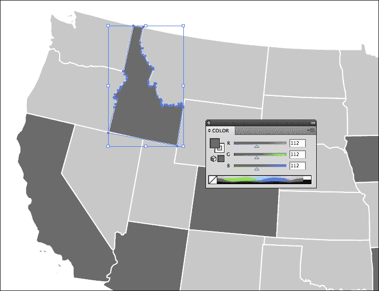
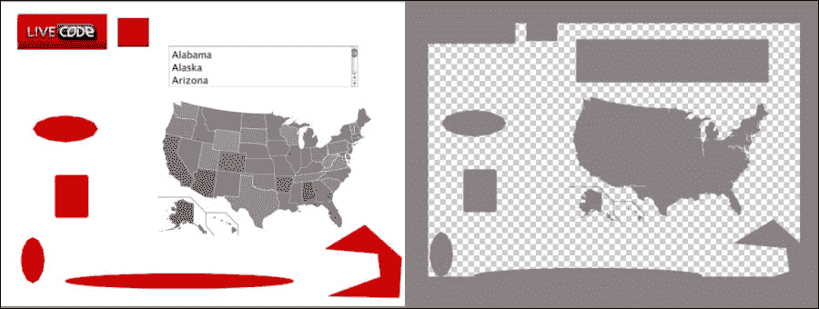
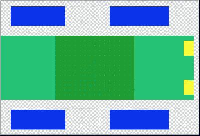
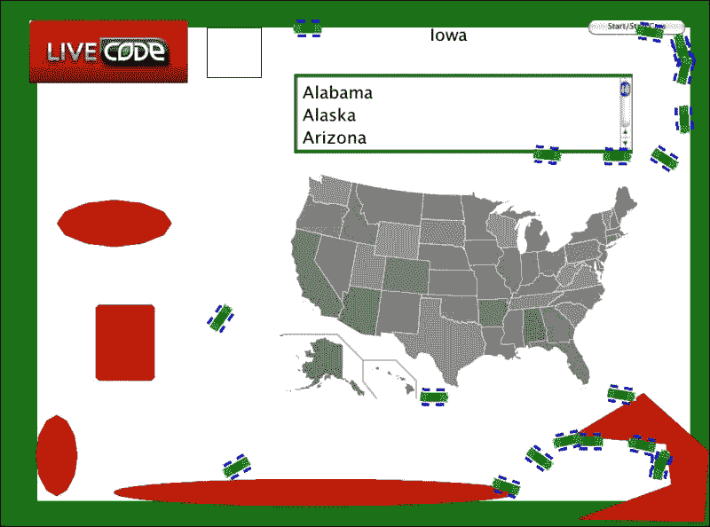
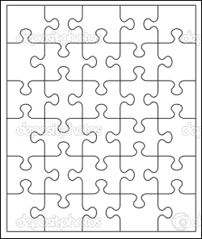
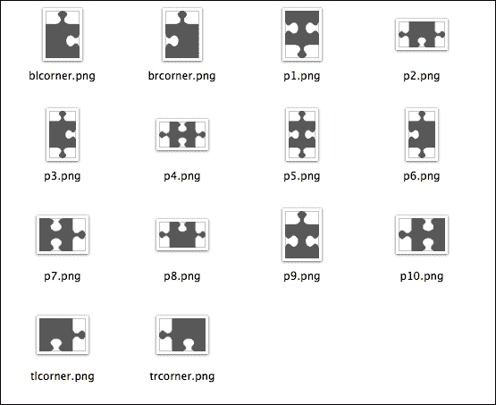
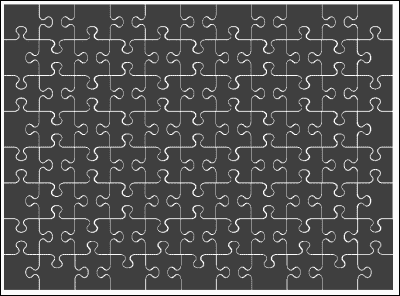
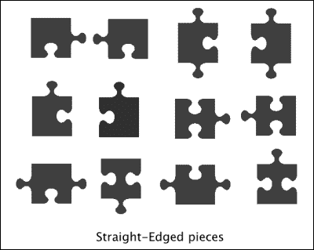
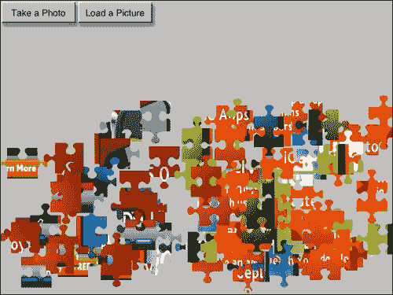

# 第五章。制作拼图应用

*想象一下…*

*到目前为止，我们一直在处理大量文本或调用移动操作系统功能。这些事情很整洁，但它们并不那么直观。如果你渴望玩弄图片和图像数据，你的时机到了！*

LiveCode 并非天生的图形 powerhouse，它处理图像数据（其他工具通常称为“位图数据”）的方式有些不寻常。它有效地将图像的像素存储为一系列单字节字符，以表示每个像素的红色、绿色和蓝色值。处理最终图像相当灵活，但为了创建类似拼图的东西，我们需要了解 LiveCode 属性 `imageData` 的格式。

在本章中，我们将：

+   检查 LiveCode 在图像对象中存储位图数据的方式

+   找一种方法使用单个位图代替 50 个按钮

+   制作一个碰撞检测图

+   创建一个利用多个移动设备功能的拼图应用

# 图像数据格式

在其他作者工具中，例如 Adobe Director 和 Adobe Flash，位图数据以 24 位或 32 位的值矩阵形式存储。如果你想知道图像顶部第 15 行从左侧数第 20 个像素的颜色，你将不得不使用一个 `getPixel` 函数并填入这些数字。在 Flash 中，它为所有变量类型使用零起始点，你必须编写以下代码：

```java
pixelcolor = bitmapvariable.getPixel(19,14);
```

实际上，你必须以 `var pixelcolor:uint` 开始这一行，但在这里我们关注的是主要差异，而不是强类型编程语言的怪癖！在 Director 中，它像 LiveCode 一样使用基于 1 的变量，你必须编写以下代码：

```java
pixelcolor = imagevariable.getPixel(20,15)
```

同样，没有必要进行变量类型定义，甚至行尾也不需要分号。当我们分心时，Flash 也不需要行尾的分号，或者至少，你不必自己输入它。Flash 知道你的意图！回到正题…

在 LiveCode 中，图像的每个像素由四个字节表示，你可以像访问单字节字符一样访问它们。字节的值范围是 0-255，并且存储这些值，特别是值 `0`，在字符变量中效果不佳。因此，在利用它之前，你必须将字符值转换为数值。基本问题是，尽管数值存储在变量中，但当你开始对其执行计算时，LiveCode 希望使用十进制算术而不是变量内的二进制形式。你必须将变量转换为可以使用 `charToNum` 函数处理的东西。

### 注意

那么，为什么字符变量不喜欢零呢？好吧，在个人电脑的早期阶段，主要的编程语言是 Pascal。在 Pascal 中，包含字面字符串的变量需要一种方式来知道字符串的长度。Pascal 字符串的第一个字节存储字符串的长度，这对于 255 个字符来说是足够的，而且在当时，人们可能认为这已经足够了，而且比任何人需要的都多！然而，在现实生活中，字符串可以比 255 个字符长。这个段落本身就有超过 900 个字符长。为了解决这个问题，C 编程语言使用零来表示*C 字符串*的结尾。你可以有一行一百万个字符；然而，只有最后一个字符是零。RGB 值不关心 C 字符串的限制，到处都是零，这就是为什么我们尽可能快地将它转换为数值值。

除了每个像素以四个字节的信息存储的奇特之处外，也没有办法指定行和列。图像中的所有像素的四个字节都是连续存储的；你必须进行计算才能知道你正在寻找的像素在数据中的位置。如果你之前使用过位图编辑器，比如 Photoshop 或 Gimp，你肯定知道你选择内容是基于一个对应的*X*和*Y*坐标值，这个坐标值对应于像素所在的列和行。LiveCode 不让你以这种方式访问位图。因此，我们需要进行计算。

在 LiveCode 中，如果你想将前一个示例中的像素值作为 24 位值检索，可以这样操作：

```java
put getPixel(""test image"",20,15) into pixelcolor

function getPixel pImage,pX,pY
  put the imageData of image pImage into tImageData
  put the width of image pImage into tWidth
  put ((pY-1)*tWidth + (pX-1)) * 4 into tStartChar
  put charToNum(char tStartChar+2 of tImageData) into tRed
  put charToNum(char tStartChar+3 of tImageData) into tGreen
  put charToNum(char tStartChar+4 of tImageData) into tBlue
  return tRed*65536+tGreen*256+tBlue
end getPixel
```

表面上看，这是 LiveCode 中实现方式比其他语言长得多的情况之一。然而，相当常见的是，你确实需要像素中的红色、绿色和蓝色值，而在其他语言中，你必须采取额外步骤来提取这些值。

将返回的数字转换为 24 位 RGB 值的额外步骤并不麻烦，因为 LiveCode 可以通过你自己的函数轻松扩展。如果你需要 24 位值，使用前面的函数，你将为 LiveCode 语言添加一个`getPixel`函数。即使只是获取红色值，你仍然需要进行计算。也许有一天，LiveCode 将有一个内置的`getPixel`函数，它的工作速度比你的函数更快。这里返回的 24 位数字实际上是以三个十进制数字表示的，而不是 24 位二进制值，但它通常仍被称为*24 位*。

## 神秘字节…

表示一个像素的四个字符中的第一个字符是不使用的。LiveCode 有关于如何使用`imageData`的教程，其中那个字节被称为 Alpha。这很有道理，因为即使提供 32 位数的其他工具也将值拆分为 Alpha、红色、绿色和蓝色。为什么 RunRev 称为 Alpha 的字节不包含 alpha 值？谁知道呢！

一种可能性是值没有很好地发挥其作用。当谈到 alpha 透明度时，你有时可能是指图像是透明的，就像 GIF 图像中可能的情况一样。有时，你可能是指它是半透明的，即它只有部分透明。

为了解决问题的模糊性，LiveCode 有两个图像的其他属性，`maskData` 和 `alphaData`：

```java
put the maskData of image "test image" into tMaskData
put the alphaData of image "test image" into tAlphaData
```

这些图像属性仍然有所有行连在一起，你必须进行计算以找到给定像素的 alpha 值存储的位置。

使用 `maskData`，你可以得到每个像素的一系列值。对于除了 0 以外的每个值，像素都是可见的。

使用 `alphaData`，你可以得到像素不透明度的一系列值。0 将是完全透明的，255 将是完全不透明的，介于两者之间的值将是半透明的。128 将是 50% 不透明的。

在本章的后面，我们将使用 `maskData` 和 `alphaData`，我们将把 0-255 的 `alphaData` 值称为其 *透明度*，把零或非零的 `maskData` 值称为其 *遮罩*。

# imageData 的误用

LiveCode 在线教程中的主题包括 `imageData` 的操作，将彩色图像转换为灰度图像（这个将彩色图像转换为灰度图像的特定示例位于 [`lessons.runrev.com/s/lessons/m/4071/l/25371-vision-how-do-i-convert-a-color-image-to-grayscale`](http://lessons.runrev.com/s/lessons/m/4071/l/25371-vision-how-do-i-convert-a-color-image-to-grayscale)）。我们在这里不会做这个。相反，我们将使用图像、遮罩和 alpha 中的值来实现一些不会改变图像的巧妙功能。实际上，在某些情况下，我们甚至可能看不到图像！

# 行动时间 – 测试 getPixel 函数

在到达有用的示例之前，让我们创建一个 `getPixel` 函数来获取图像中某点的颜色分量，然后完成一个快速测试用例。以下步骤将帮助你完成这个过程：

1.  创建一个新的 Mainstack。点击 **保存** 将其保存为 **ImageDataTests**。

    ### 注意

    我们将使用同一个堆栈来展示几个方面，最后，我们可能会尝试在移动设备上尝试它！

1.  将堆栈的分辨率设置为你的最大测试设备的大小，或者如果你将使用 iPad 模拟器，就尝试 1024 x 768。

1.  从 **文件** 菜单中，导航到 **导入为控件** | **图像** 并选择你拥有的任何小图像文件，将其放置在卡片窗口的左上角。下一个示例将使用可以从任何 LiveCode 网页轻松获得的 LiveCode 标志图像。

1.  在图像旁边放置一个新的 `Graphic` 对象。它将显示单色，所以只需让它足够大，以便你可以轻松地看到颜色。将其命名为 `swatch`。

1.  将图形设置为默认显示一个空框，所以在消息框中输入以下内容：

    ```java
    set the filled of graphic 1 to true
    ```

1.  编辑图像的脚本，并输入以下行：

    ```java
    on mouseMove pMx,pMy
      --put getPixel(the short name of me,pMx - the left of me,pMy - the top of me) into tPixelColor
      --set the backgroundColor of graphic "swatch" to tPixelColor
    end mouseMove
    ```

1.  注意，这两行已被注释掉。如果我们在创建该函数之前不断请求`getPixel`，LiveCode 只会抱怨！

1.  编辑堆栈脚本。添加`getPixel`函数，它与我们在前面步骤中讨论的图像数据格式非常相似：

    ```java
    function getPixel pImage,pX,pY
      put the imageData of image pImage into tImageData
      put the width of image pImage into tWidth
      put ((pY-1)*tWidth + (pX-1)) * 4 into tStartChar
      put charToNum(char tStartChar+2 of tImageData) into tRed
      put charToNum(char tStartChar+3 of tImageData) into tGreen
      put charToNum(char tStartChar+4 of tImageData) into tBlue
      return tRed,tGreen,tBlue
    end getPixel
    ```

1.  在图像脚本中，取消注释两行。开始指向图像，你应该看到色板图形的颜色改变以匹配光标下的像素。

## *发生了什么？*

我们做了一个非常简单的例子，说明了如何使用图像中像素的颜色；在这种情况下，如何着色色板。由于设置图形的`backgroundColor`需要`redvalue`、`greenvalue`和`bluevalue`，我们不需要将图像中的值转换为 24 比特数，`getPixel`函数能够返回`tRed,tGreen,tBlue`。

现在，与我们使用的方法相比，与内置的`mouseColor`函数相比，并没有真正的好处。然而，至少我们尝试了`getPixel`函数！

## 快速问答——一个字节中有多少比特？

*字节*在本章中提到了几次，你很可能已经知道关于*比特深度*的信息，因为我们已经讨论了数字照片。那么，告诉我，一个字节中有多少比特？

1.  32

1.  24

1.  8

1.  取决于你有多饿

答案：8

在本章的其余部分，我们甚至不会提及比特或字节；然而，仅为了满足数学家的兴趣，了解一个字节由 8 比特组成是好的。比特是一个二进制数字，当你开始用这种方式思考比特时，你会发现一个字节可以存储 2 的 8 次方个值（二进制是基数 2）。这一点在查看 Pascal 字符串的长度时就会显现出来（2 的 8 次方是 256，因此 Pascal 字符串中字符的范围是 0-255），这有助于你意识到，如果一张图片由一个字节组成，对于每个像素的红色、绿色和蓝色值，它就是一个 24 比特的图片。一旦你为 alpha 通道添加另一个字节的数据，你就得到了一个 32 比特的图片。

## 模拟许多按钮

在某些应用程序中，你需要确切知道用户指向图像的哪个区域。例如，当有一个地图，你想要显示与用户点击的区域相关的信息时，这可以通过很多矩形按钮来完成，或者你可以将区域分解成图形并使用`mouseEnter`处理程序来检测它是哪个区域。相反，你可以使用单个图像来表示所有区域。

# 是时候行动了——制作美国地图

在网上有很多地方可以获取公共领域图像用于你的应用程序。搜索`public domain images`，你会看到指向维基百科文章、政府网站和其他允许你下载免费使用图像的网站的链接。以下步骤中显示的地图来自以下文件：

[`upload.wikimedia.org/wikipedia/commons/3/32/Blank_US_Map.svg`](http://upload.wikimedia.org/wikipedia/commons/3/32/Blank_US_Map.svg).

1.  创建一个名为 `states` 的新字段。找到一个包含 50 个美国州的字母顺序列表，将其粘贴到字段中，或者你也可以手动输入它们！

1.  创建另一个字段，将文本大小设置为 24，并将字段宽度设置得足够容纳 *New Hampshire*（仅限单词，不包括整个州！）的大小。将字段命名为 `state`。

    ### 小贴士

    **下载完成的地图**

    注意，你可以通过从本书的支持文件部分下载 `us-map.png` 文件来节省大量工作，你可以在 [www.PacktPub.com](http://www.PacktPub.com) 找到它。

1.  如果你拥有 Adobe Illustrator，用其打开 SVG 文件。如果没有，则用 GIMP 打开。在 Macintosh OS X 上，Pixelmator 是一个低成本的选择。

1.  按字母顺序，在每个州上填入一个颜色，其中红色、绿色和蓝色的值与该州的行号加 100 相匹配。我们添加 100 是为了让我们将看到的灰色阴影不那么暗。

1.  对所有州重复相同的操作。以下是 Illustrator 中的开始外观，爱达荷州即将被着色为 `112`，`112`，`112`：

1.  改变地图的大小，使其大约填充堆栈窗口的三分之一，然后选择 **导出**。

    ### 小贴士

    **颜色配置文件设置**

    LiveCode 以一种忽略图像中颜色配置信息的方式处理位图，这会破坏我们试图做的事情。在导出图像时，检查是否有选项将颜色配置文件设置为 `genericRGB`。如果没有，则使用 Color Sync 等工具应用 `genericRGB` 颜色配置文件。一旦图像保存，你可以做一些事情来确保它能够正确导入到 LiveCode 中。在导入之前，在消息框中输入并将屏幕伽玛设置为 `2.23`，然后按 *Enter*。这将设置 LiveCode 为正确的设置，以确保颜色值正确显示。

1.  如果你使用 Illustrator，将背景设置为 **白色**，并将抗锯齿设置为 **无**。在使用 GIMP 时，确保 PNG 文件没有保存 alpha 通道。

1.  在消息框中输入此行，然后按 *Enter* 键：

    ```java
    set the screengamma to 2.23
    ```

1.  将 PNG 图像导入到你的 `ImageDataTests` 栈中。

1.  将图像的脚本设置为以下内容：

    ```java
    on mouseMove pMx,pMy
      put getPixel(the short name of me,pMx - the left of me,pMy - the top of me) into tStateColor
      set the itemdelimiter to comma
      put item 1 of tStateColor - 100 into tLine
      put line tLine of field "states" into field "state"
    end mouseMove
    ```

1.  尝试指向不同的州，至少指向那些你已经着色的州。州名应该出现在 `state` 字段中。

## *刚才发生了什么？*

对于这个案例，我们只需要查看光标下像素的红色通道值（绿色和蓝色值相同，因为我们使用了灰色的颜色值）。而不是编写另一个函数来仅获取数据的红色部分，我们重用了现有的 `getPixel` 函数，但只关注该函数返回的第一个项目。这个数字，在减去我们添加的 100（为了让阴影不那么暗）之后，被用作查找值来获取相应的州名。

## 突击测验 – 获取整体概念

示例地图图像是一个 SVG 文件。对于给定的图像，SVG 文件比 PNG 文件小吗？（进行一点维基百科研究并决定答案。）

1.  是的

1.  否

1.  取决于图像的性质

答案：3

SVG 是描述如何绘制图像的方式，而 PNG 是描述图像像素的方式。在 PNG 中，这些信息也被以无损方式压缩。对于示例地图，在其原始大小下，24 位的 PNG 文件大小是 SVG 文件的一半。描述美国各州轮廓需要大量的数据！如果需要放大图像，PNG 文件会变成更大的文件，而 SVG 文件大小将保持不变。另一方面，如果图像是一个对角渐变的矩形块，SVG 文件会非常小，而 PNG 文件会非常大，因为数据压缩无法很好地工作，因为没有相同颜色的像素长串。

## 使用 maskData 进行碰撞检测

在古老的二维迷宫冒险游戏中，你的角色会以明显的块状移动，而在检查是否有墙壁或空隙时，程序只需要检查相对较少的位置。占据的位置可以存储在数组中，占用很少的内存。

对于其他迷宫游戏，例如那些弹珠迷宫倾斜板游戏，你必须以更精细的程度检测碰撞。一个完整的物理引擎可以处理这个问题，但通过将迷宫存储为图像并检查角色或弹珠前面的像素，可以得到一些有趣的结果。

在一个功能齐全的游戏中，最好使用`imageData`或可能`alphaData`，这样你就可以知道你将要撞到什么，并且从你读取的值中，你还可以知道你撞到了什么。例如，在弹珠迷宫游戏中，你需要知道你是否已经越过了洞口。

然而，对于接下来的测试，我们将只使用`maskData`并看看我们能否避免撞到我们前面的东西。

# 行动时间 - 制作赛道

我们将制作一个小汽车的赛道，我们将使用我们构建的堆栈来制作它！首先，我们需要将卡片上的内容转换为表示墙壁和空间的图像：

1.  使用 LiveCode 的绘图工具，向`ImageDataTest`堆栈中添加一些对象。这些将成为赛道上的障碍物。

1.  要创建我们需要的图像，在消息框中输入以下内容：

    ```java
    import snapshot from rect the rect of this stack
    ```

1.  前面的命令将截取卡片窗口的屏幕截图并将其放置在卡片上作为新的*图像*控件。新的图像将覆盖整个卡片，因此不会引起注意。你可以通过项目浏览器确认图像已创建并选择它。

1.  右键单击创建的图像并选择**启动编辑器**。这将打开你在**首选项**/**常规**中设置的位图编辑器。如果你之前没有这样做，LiveCode 会提示你选择一个编辑器。

1.  在你的图像编辑器的**图层**窗口中，复制初始的单个图层。

1.  在复制图像图层下方创建一个新的透明图层。

1.  删除原始图层。

1.  使用编辑器的*魔术棒*选择包含图像的图层中的卡片图像的空白区域（不是透明图层）。删除所选区域以显示透明图层。

1.  反转选择并填充一个深色（颜色不重要，因为我们只是用它来看到洞的位置）。

1.  花一些时间填补任何小缝隙。还要在图像的外围放置一个粗边框。这显示了卡片的外观以及现在快照图像应该看起来像什么：

1.  **合并**文档的图层，然后选择**保存**。

1.  返回 LiveCode 并点击**更新**按钮，快照图像将更新以反映您所做的更改。

1.  给图像命名为`backdrop`。稍后，我们将设置图像在其它对象之后，但现在我们将让它位于所有其他对象之上。

## *刚才发生了什么？*

我们刚刚制作了一个看起来相当奇怪的赛道！在一个真正的俯视赛车游戏中，你必须仔细设计一个看起来很棒的赛道，并为碰撞检测制作图像的副本。在副本中，你必须擦除表示汽车可以驾驶的部分，然后，你必须用单色填充图像的其余部分。玩家将看到看起来很棒的赛道，而在下面则是用于检测碰撞的副本单色版本。

我们现在需要一个能在我们制作的赛道上自行驾驶的汽车。

# 是时候行动了——制作一辆赛车

花尽可能多的时间来创建汽车图像。让它面向右边。然后，一旦它在堆栈中，我们将开始向它的脚本添加所需的函数。大约 40 像素的宽度应该是合适的。我们的示例汽车也可在[www.PacktPub.com](http://www.PacktPub.com)找到。以下是我们正在讨论的近距离图像，如 Photoshop 中所示：



如果你喜欢，你的作品甚至可以更好！保存为具有透明度的 24 位 PNG。好的，发动引擎…：

1.  将图像作为控件导入，并将其放置在`ImageDataTests`堆栈的白色区域中。命名为`car1`。

1.  如您所愿复制图像（以下脚本可以处理多达 100 辆汽车），并按顺序命名每个，例如`car2`、`car3`等。

1.  争论来说，正确的*面向对象*的方式是将一些函数放在图像上，一些放在卡片或堆栈脚本中，但出于性能原因，我们将一切放在堆栈脚本中。打开堆栈脚本。

1.  添加一个用于全局变量的行：

    ```java
    global gBackdropMaskData,gMaskWidth,gSpeeds,gMovingCars,gMaskWidth
    ```

1.  我们很快将添加一个启动/停止按钮，该按钮将调用一个函数来切换汽车是否移动。将切换函数添加到堆栈脚本中：

    ```java
    on startStopCars
      if gMovingCars is true then
        put false into gMovingCars
      else
        put the maskData of image "backdrop" into gBackdropMaskData
        put the width of image "backdrop" into gMaskWidth
        setSpeeds
        put true into gMovingCars
        send moveCars to this card in 2 ticks
      end if
    end startStopCars
    ```

1.  由 `startStopCars` 调用的 `setSpeeds` 处理器将为每辆汽车图像初始化 `gSpeeds` 变量，并将初始方向设置为零，并将汽车定位在白色区域的一个已知位置（在本例中为 `200, 200`）。将 `setSpeeds` 处理器添加到 `startStopCars` 处理器下面的堆栈脚本中：

    ```java
    on setSpeeds
      put empty into gSpeeds
      repeat with a = 1 to 100
        put "car" & a into carname
        if there is a image carname then
          put (random(10)+10)/10 into item 1 of line a of gSpeeds
          put 0 into item 2 of line a of gSpeeds
          set the loc of image carname to 200,200
        else
          exit repeat
        end if
      end repeat
    end setSpeeds
    ```

1.  在 `moveCars` 处理器中，如第 8 步所示，我们将查看 `gBackdropMaskData` 变量以检查汽车是否会撞到坚固的物体。添加此 `hitBarrier` 函数：

    ```java
    function hitBarrier pX,pY
      put (pY-1)*gMaskWidth + pX into tStartChar
      put charToNum(char tStartChar of gBackdropMaskData) into tMaskValue
      if tMaskValue = 255 then return true
      else return false
    end hitBarrier
    ```

1.  `moveCars` 处理器最初由 `startStopCars` 处理器调用，然后，每经过两个计时周期后，它会调用自己，直到 `gMovingCars` 变量被设置为 `false`。将长的 `moveCars` 处理器输入到堆栈脚本中：

    ```java
    on moveCars
      put the long time
      lock screen
      repeat with a = 1 to 100
        put "car" & a into carname
        put .1 into anglechange
        if there is a image carname then
          put 0 into counter
          repeat while counter < 20
            add 1 to counter
            put item 1 of line a of gSpeeds into tCarSpeed
            put item 2 of line a of gSpeeds into tCarDirection
            put item 1 of the loc of image carname into tCarX
            put item 2 of the loc of image carname into tCarY
            put the round of ((cos(tCarDirection)*tCarSpeed)*20 + tCarX) into tLookAheadX
            put the round of ((sin(tCarDirection)*tCarSpeed)*20 + tCarY) into tLookAheadY
            if hitBarrier(tLookAheadX,tLookAheadY) then
              put tCarDirection + anglechange into item 2 of line a of gSpeeds
              put anglechange * -1 * ((20 - random(10))/10) into anglechange
              put max(1,tCarSpeed - .1) into item 1 of line a of gSpeeds
            else
              put min(3,tCarSpeed + .05) into item 1 of line a of gSpeeds
              exit repeat
            end if
            end repeat
          set the loc of image carname to item 1 of the loc of image carname + (tLookAheadX-item 1 of the loc of image carname)/10,item 2 of the loc of image carname + (tLookAheadY-item 2 of the loc of image carname)/10
          set the angle of image carname to 360 - item 2 of line a of gSpeeds / PI * 180
        else
          exit repeat
        end if
      end repeat
      unlock screen
      if gMovingCars is true then send moveCars to this card in 2 ticks
    end moveCars
    ```

    ### 小贴士

    **避免碰撞**

    抽取一段时间来查看 `moveCars` 处理器；它在做什么？你无疑已经听说过碰撞检测；这就是你拥有代码来识别一个物体与另一个物体或墙壁发生碰撞的地方。当这种情况发生时，你可以触发一个爆炸或碰撞声音。然而，对于我们的示例，我们实际上不希望发生碰撞，因为我们希望汽车在碰撞前转向。对于每辆汽车，最多 100 辆，我们将查看汽车前方以检查它是否会撞到赛道的边缘。如果它会这样做，我们将反复改变汽车行驶的方向，直到找到一个安全的前进方向。

1.  在卡片窗口中添加一个启动/停止汽车按钮，并设置其脚本为：

    ```java
    on mouseUp
      startStopCars
    end mouseUp
    ```

1.  选择背景图像，并从 **对象** 菜单中选择 **发送到后台**。

1.  现在保存它是个好主意！

1.  点击运行/浏览工具，然后点击启动/停止汽车按钮，以查看你的汽车在界面周围行驶。这里有 20 辆汽车移动的样子：

1.  注意，你可以继续指向你最初加载的图像的部分（前一个示例中的 LiveCode 标志）以查看右侧的色卡改变颜色。此外，如果你指向不同的美国州，你创建的 `state` 字段中的文本会改变。

## *刚才发生了什么？*

我们已经使用 **imageData** 实现了颜色选择器，并作为多个按钮区域使用，然后继续使用图像的 **maskData** 作为碰撞图。让汽车以智能方式移动背后有很多算术，你可以改变一些数字以获得不同的汽车行为，或者你可以休息一下，准备制作一个拼图！

## 快速问答 – 计算这个！

对于美国地图，我们只需要模拟 50 个按钮。如果你使用红色、绿色和蓝色值，你能模拟多少个按钮？

1.  一个巨大的按钮

1.  65,536 个按钮

1.  16,777,216 个按钮

答案：3

就像关于*位和字节*的讨论一样（嘿，我确信我们不会在本章的其余部分看到这些词了！），红色、绿色和蓝色值组合起来给我们 2 的 24 次方可能的值。如果你只使用了两种颜色，那么答案将是 65,536。

本章中我们尝试的内容使用的技术在任何 LiveCode 应用中都很有用，并不特定于移动应用。你可以尝试你构建的堆栈；它将在屏幕上有 20 辆车行驶的移动设备上运行得很好！当触摸屏幕时，颜色选择器和状态图在移动设备上工作。然而，这些测试并没有真正利用到移动设备的功能。

# 制作拼图游戏

本章的剩余部分将基于关于`imageData`的前面信息，并利用一些移动设备的功能。我们将制作一个拼图游戏应用。

## 分解成碎片…

我们将要使用的一般技术是，取一组具有良好 alpha 通道的 PNG 图片（这创建了拼图块的边缘），然后我们将用我们自己的图片替换实际的像素数据。因此，我们首先需要一些 PNG 图片。

如果你想要制作一个商业移动应用，要么创建你自己的拼图形状，要么购买一个免版税的图片。对于原型设计，你可以从网上抓取任何图片来开始基本操作，然后你可以用你购买的高质量图片替换它们。在这里，我们使用的是来自[`depositphotos.com/`](http://depositphotos.com/)的预览图片，它也销售高质量版本。

当你拥有高质量版本时，你可能希望创建每个拼图块，以便它们完美地相互接触。在这里，我们使用预览图片，并将每个拼图块的内部部分选择出来，然后从这些部分创建 PNG 图片。拼图块之间会有小缝隙，但至少这样我们可以快速准备所需的图片。

# 动手时间 – 创建拼图块和选择图片

如果你希望跟随这里显示的完全相同的图片，要知道它是从以下文件的上左部分拍摄的：

[`static3.depositphotos.com/1004551/191/v/950/depositphotos_1914748-Jigsaw-puzzle-blank-templates.jpg`](http://static3.depositphotos.com/1004551/191/v/950/depositphotos_1914748-Jigsaw-puzzle-blank-templates.jpg)。

图片如下所示：



以下步骤将帮助创建拼图块和选择图片：

1.  创建一个大小为 1024 x 768（或你的平板设备大小）的新主堆栈。将堆栈命名为`jigsaw`，设置标题为`Jigsaw Puzzle`，并保存。

1.  在你的图像编辑器中打开整个拼图图片。

1.  使用**魔棒**工具选择拼图左上角拼图块的内部部分。

1.  用一种颜色填充它，以便容易发现任何剩余的缝隙。

1.  将内容复制并粘贴到一个新的文档中（该文档具有透明背景，大小与复制的碎片相同）。

1.  使用设置为相同填充颜色的画笔工具修复任何缺口。

1.  保存为 PNG 文件（使用 Photoshop，这将是在 Web 和设备上保存，24 位，具有透明度）。使用可能有助于你轻松识别图片的命名方案。例如，`tlcorner.png`、`p1.png`、`trcorner.png`等等。

1.  通过所有不同形状的区域进行操作。在示例图片中，可能会有多达 14 种独特的形状。不需要保存与你已经拥有的形状和方向相同的其他碎片。

1.  图片集将与以下屏幕截图中的类似：

1.  将所有 14 张图片作为**Control/Image**导入。

1.  将拼图布局在覆盖大部分卡片窗口的区域。在下面的屏幕截图中，拼图大小为 900 x 622 像素，由 11 x 8 个碎片组成。通过选择键盘上的箭头键，你可以选择一个碎片后准确放置。

1.  以网格状方式命名图片。左上角的碎片将被命名为`p 1 1`，右上角的边缘碎片将被命名为`p 11 1`，而右下角的碎片将被命名为`p 11 8`。

1.  选择所有碎片并将它们分组。将组命名为`pieces`。

1.  创建一个名为`fromcamera`的按钮和一个名为`Take a Photo`的标签。将按钮脚本设置为以下内容：

    ```java
    on mouseUp
      loadimage "camera"
    end mouseUp
    Make another button, named "fromlibrary" and labeled "Load a Picture", with this script:
    on mouseUp
      loadimage "library"
    end mouseUp
    ```

1.  将按钮设置为获得阴影效果；使用**检查器**面板中的**图形效果**选项。

1.  编辑卡片脚本并添加以下全局变量和函数，它们将初始化其他我们将制作的函数所需的价值：

    ```java
    global originalimage, puzzlewidth, puzzleheight, snapdistance, hcount, vcount

    on opencard
       setvalues
    end opencard

    on setvalues
       put 900 into puzzlewidth
       put 662 into puzzleheight
       put 50 into snapdistance
       put 11 into hcount
       put 8 into vcount
    end setvalues
    ```

1.  现在，添加`loadImage`处理程序，这两个按钮将调用它以从用户的相机或相册中获取图片：

    ```java
    on loadImage cameratype
      if puzzlewidth is empty then setvalues
      if there is an image "original" then delete image "original"
      mobilePickPhoto cameratype,puzzlewidth,puzzleheight
      if the result is empty then

        lock screen
        set the name of image the number of images to "original"
        set the width of image "original" to puzzlewidth
        set the height of image "original" to puzzleheight
        put the imageData of image "original" into originalImage
        delete image "original"
        --makepuzzle
        --scatter
        unlock screen
      else
        answer the result
      end if
    end loadImage
    ```

1.  `makepuzzle`和`scatter`行目前被注释掉，这样你可以测试到目前为止的功能。

## *发生了什么？*

拼图碎片现在已就位，并且以我们可以利用的方式命名。如果你转到**独立应用程序设置**并选择**iOS**或**Android**，你可以尝试该应用程序。

### 小贴士

**设置一些测试图片**

如果你使用 iPad 模拟器，你将无法测试从相机获取图片的功能，最初你将只有相册中的默认图片。要添加自己的照片，将图片从**Finder**拖动到模拟器窗口，图片将被添加到照片库中。你可以切换到模拟器的首页，使用*cmd* + *Shift* + *H*键组合重新选择拼图应用。这样，你可以添加一些图片到库中，以便选择一个作为拼图的图片。

当 LiveCode 从移动设备获取图片时，无论是从相机还是从库或相册中获取，它都会将图片放置为一个图像控件，这是卡片上最顶层的对象。我们不需要图片本身，只需要它的`imageData`。在`loadImage`处理程序中，图片被制作成与拼图块组相同的大小，`imageData`存储在全局变量`originalimage`中，而图片本身则被删除。

接下来，我们将选定的图片传输到拼图块上。

# 行动时间 – 转移 imageData

通过将选定的图像设置为与包含拼图块的组具有相同的宽度和高度（这就是 900 和 662 数字的来源），我们就可以将整个图像中匹配的矩形数据传输到相关的拼图块中。以下步骤将指导您传输 imageData：

1.  再次打开卡片脚本。添加`makepuzzle`处理程序：

    ```java
    on makepuzzle
      resetpuzzle
      put the number of images in group "pieces" into imagecount
      repeat with a = 1 to imagecount
        makepiece the short name of image a of group "pieces"
      end repeat
    end makepuzzle
    ```

1.  `makepuzzle`处理程序将遍历每个拼图块并调用另一个处理程序来为该块传输数据。以下是`makepiece`处理程序：

    ```java
    on makepiece piecename
      put the width of image piecename into piecewidth
      put the height of image piecename into pieceheight
      put empty into tempimage
      put the left of image piecename - the left of group "pieces" into dx
      put the top of image piecename - the top of group "pieces" into dy
      repeat with y = 1 to pieceheight
        put ((y+dy-1) * puzzlewidth + dx)*4 into sourcestart
        put char sourcestart+1 to sourcestart+piecewidth*4 of originalimage after tempimage
      end repeat
      set the imageData of image piecename to tempimage
    end makepiece
    ```

1.  在早期的`imageData`测试中，我们一次只对一个像素感兴趣，但在这里，我们想要很多行数据。算术运算，`*((y+dy-1) * puzzlewidth…*`，等等，可以快速一次提取一整行的像素。这些行被构建成一个新的变量`tempimage`，最终被传输到实际的拼图块中。

1.  在拼图块有了`imageData`的矩形之后，我们接下来需要将拼图块移动到随机位置，使游戏准备好供用户玩耍。这是通过一个`scatter`处理程序来完成的：

    ```java
    on scatter
      repeat with a = 1 to the number of images in group "pieces"
        set the myloc of image a of group "pieces" to the loc of image a of group "pieces"
        put the short name of image a of group "pieces" into n
        if edgepiece(n) then
          set the loc of image a of group "pieces" to 40 + random(400),300 + random(400)
        else
          set the loc of image a of group "pieces" to 500 + random(500),300 + random(400)
        end if
      end repeat
    end scatter
    ```

1.  大多数拼图游戏玩家首先做的事情是分离*直边*拼图块。我们可以以节省他们时间的方式编写代码。我们可以使用一个函数将边缘拼图块放置在非边缘拼图块之外。从先前的`scatter`处理程序中调用的`edgepiece`函数如下：

    ```java
    function edgepiece pName
      return word 2 of pName = 1 or word 3 of pName = 1 or word 2 of pName = hcount or word 3 of pName = vcount
    end edgepiece
    ```

1.  我们为每个拼图块精心设置的名称被检查以验证该拼图块是否位于拼图的左、右、上或下边缘。换句话说，它是一个位于拼图外边缘的拼图块。散布将直边拼图块放置在屏幕的左侧，其他拼图块则放置在屏幕的右侧，如图所示：

1.  `makepuzzle`处理程序的开始调用一个`resetpuzzle`处理程序，该处理程序用于确保拼图块回到起始位置，准备好加载新图片。这是通过在每个拼图块上使用名为`myloc`的属性变量来实现的，它记录了拼图块的初始位置。以下是`resetpuzzle`处理程序：

    ```java
    on resetpuzzle
      repeat with a = 1 to the number of images in group "pieces"
        if the myloc of image a of group "pieces" is not empty then
          set the loc of image a of group "pieces" to the myloc of image a of group "pieces"
        else
         set the myloc of image a of group "pieces" to the loc of image a of group "pieces"
        end if
      end repeat
    end resetpuzzle
    ```

1.  您可以看到，如果`myloc`尚未设置，则拼图块必须在起始位置，因此`resetpuzzle`处理程序会继续并在`myloc`属性中记录该位置。

1.  取消注释在*行动时间 - 创建拼图块和选择图像*步骤 17 的行（`makepuzzle`和 scatter 行）并尝试再次测试应用程序。现在你应该能够选择一张图片，并在展开的拼图块中看到它。希望你会看到类似这样的东西：

## *发生了什么？*

如前所述，正确的算术运算使得我们从大图中提取所需矩形`imageData`相对容易，并将其存储在大小与该矩形相同的小图像中。然而，有一个魔法般的细节并未被指出，即拼图保持了其形状！尽管我们已经完全替换了图像的`imageData`，这是如何发生的呢？设置`imageData`不会干扰图像的`alphaData`。我们导入的 PNG 图像保留了其原始的 alpha 通道，因此仍然保持了相同的形状，只是图像不同。

## 添加交互性

我们的拼图游戏已经准备好发货了！好吧，除了它完全没有交互性之外！让我们添加一些。

# 行动时间 – 设置触摸事件

到目前为止的处理程序都在卡片脚本中，计划是让不同的卡片有不同的拼图类型。交互处理程序可以放在所有卡片都适用的堆栈脚本中。

1.  打开堆栈脚本。在堆栈脚本中，我们还需要一个全局变量，但有一些初始化项需要处理。用以下这些行开始堆栈脚本：

    ```java
    global snapdistance

    on preopenstack
      if the platform contains "iphone" then iphoneUseDeviceResolution true
    end preopenstack

    on openstack
      set the compositorType of this stack to "Static OpenGL"
    end openstack
    ```

1.  `preopenstack`处理程序检查应用程序是否在 iPhone 上，并请求使用设备的原生分辨率。这将确保 Retina 显示屏显示最佳质量。将`compositorType`设置为`"Static OpenGL"`将有助于性能。

1.  我们将使用的交互性将利用触摸事件。每个触摸都带有相关的 ID 值。以下是检测触摸事件开始的处理器：

    ```java
    on touchStart touchid
      put the short name of the target into n
      if word 1 of n is "p" then
        set the dropShadow of image n to the dropShadow of button "fromlibrary"
        set the relayerGroupedControls to true
        set the layer of the target to the number of images in group "pieces"
      end if
    end touchstart
    ```

1.  目标名称的检查是一种快速的方法，以确保我们除了拼图块之外不会拖动任何东西。当拼图块被触摸时，我们使用`relayerGroupedControls`和层函数使该拼图块出现在其他拼图块之上。

1.  你还记得我们是如何给两个按钮添加阴影效果的吗？除了使它们看起来更美观之外，我们在这里也使用了它。通过给拼图块添加相同的`dropShadow`，我们创造了一种错觉，即拼图块似乎漂浮在屏幕上方。

1.  接下来要注意的是运动，我们可以通过`touchMove`事件来实现：

    ```java
    on touchMove touchid,touchx,touchy
      put the short name of the target into n
      if word 1 of n is "p" then
        set the loc of the target to touchx,touchy
      end if
    end touchMove
    ```

1.  再次，有一个快速的双重检查，以确保它是拼图块；如果不是，那么就是一个简单的将拼图块位置设置为用户手指位置的情况。

1.  当用户释放拼图块时，我们检查它是否靠近其起始位置，如果是，我们将拼图块移动到其位置并移除 dropShadow 效果：

    ```java
    on touchEnd touchid
      put the short name of the target into n
      if word 1 of n is "p" then
        checkdistance the short name of the target
        set the dropShadow of the target to empty
        checkfinished
      end if
    end touchEnd
    ```

1.  这是`checkdistance`处理程序和它调用的`distance`函数：

    ```java
    on checkdistance dt
      if snapdistance is empty then put 100 into snapdistance
      put distance(item 1 of the loc of image dt - item 1 of the myloc of image dt,item 2 of the loc of image dt - item 2 of the myloc of image dt) into d
      if d<snapdistance then
        put max(.1,min(.2,d/200)) into t
        move image dt to the myloc of image dt in t seconds
        set the relayerGroupedControls to true
        set the layer of image dt to 2
      end if
    end checkdistance

    function distance dx,dy
      return sqrt(dx*dx+dy*dy)
    end distance
    ```

1.  `distance`函数基于**勾股定理**，返回拼图块与其原始`myloc`值之间的像素数。`snapdistance`是一个全局变量，用于确定拼图块是否足够接近其起始位置，从而被认为是目标位置。

1.  `move`行使用 LiveCode 的移动函数，将拼图块动画化到其位置。

1.  最后一点，让我们检查一下拼图是否完成。将以下处理程序添加到堆栈脚本中：

    ```java
    on checkfinished
      repeat with a = 1 to the number of images in group "pieces"
        if the myloc of image a of group "pieces" <> the loc of image a of group "pieces" then exit checkfinished
      end repeat
      answer "You've done it!"
    end checkfinished
    ```

## *刚才发生了什么？*

拼图现在应该完全工作。从我们添加的触摸功能中难以轻易猜测的是，它支持多点触控。你可以同时拖动多达 10 个拼图块（或你的设备多点触控的限制）。在这里，每个拼图块都会显示一个阴影，当你放手时，所有拼图块都会动画化到它们的位置。

## 尝试一下英雄之旅——这是为孩子们准备的

与拼图本身相关的函数位于卡片脚本中。尝试制作一张新卡片，其中包含更大的拼图块和更高的`snapdistance`值（值越高，将拼图块放置到位就越容易）。你可以为堆栈制作一张包含难度级别按钮的起始卡，其中一个按钮会跳转到更简单的拼图。这对年轻玩家来说将是理想的。

添加一些引导图形将帮助玩家知道完成拼图的边缘在哪里，对于更简单的难度级别，甚至可以包括单个拼图块的轮廓。

# 摘要

在使用`imageData`于绘图程序、图像处理应用等场景时，有许多其他可能性，并且与前面的示例相同。在本章中，我们回顾并理解了`imageData`、`alphaData`和`maskData`的格式，以及如何将`imageData`的一个区域复制到另一个图像中。这里还涵盖了读取图像的单独像素并寻找像素值的新用途。我们还看到了如何使用多点触控交互，将这些`imageData`块以拼图的形式激活。

与图形一起工作可以非常有趣，希望这仅仅是您将要创造的起点。然而，在下一章中，我们将回到制作实用应用程序。唉……
