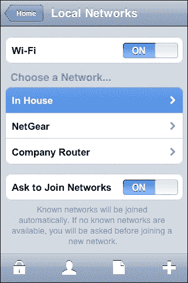

# 附录 A. 扩展 LiveCode

# 到目前为止的故事…

“漫长的道路”是披头士乐队发布的最后一首单曲，它也可以作为描述在移动设备上使 LiveCode 运作所需努力的书籍的好标题！iPhone 上出现应用程序后，RunRev 就在开发从 LiveCode 发布 iPhone 应用程序的方法。然后，在 2010 年 4 月，史蒂夫·乔布斯撰写了这篇臭名昭著的文章，您可以在以下链接找到：

[`www.apple.com/hotnews/thoughts-on-flash/`](http://www.apple.com/hotnews/thoughts-on-flash/)

Adobe 也正在开发一种从 Flash Professional 发布 iPhone 应用的方法，但由于苹果决定不允许基于 Flash 的应用程序在 iPhone 上使用，App Store 的提交规则发生了变化，禁止开发者使用除 Xcode 之外的其他工具发布应用程序。

一些工具因为使用 Xcode 进行最终发布而继续处于灰色地带。GameSalad 和 Unity 应用程序继续发布并在 App Store 中表现良好。RunRev 试图说服苹果允许 LiveCode（当时仍被称为**Runtime Revolution**）作为 iPhone 的发布工具，甚至承诺只发布 iPhone 应用程序，并且不追求在 Android 上的发布。苹果坚持立场并拒绝了这一提议。

对于 Adobe 来说，这并不是世界末日，它开始着手 Android 发布。然而，RunRev 已经计划了一个围绕将应用程序发布到 iOS 的想法的会议，但那次会议不得不推迟。

在 2010 年夏天，苹果对开发者进行了一次调查，其中提到的几个问题给了像我这样的人一个机会，请求苹果允许开发者使用他们首选的开发工具，这样他们就不必被迫使用 Xcode。很难确定这是否是造成差异的原因，但 2010 年 9 月 9 日，苹果改变了其在该问题上的立场。以下是那天早上我们醒来看到的帖子：

[`www.apple.com/pr/library/2010/09/09Statement-by-Apple-on-App-Store-Review-Guidelines.html`](http://www.apple.com/pr/library/2010/09/09Statement-by-Apple-on-App-Store-Review-Guidelines.html)

Colin Holgate（本书的合著者）迅速在 Revolution 电子邮件列表上发布了一条消息，标题为“*如何彻底让 Kevin 感到高兴*”；“Kevin”是 RunRev 的首席执行官 Kevin Miller。它产生了预期的效果，您仍然可以阅读后续的消息：

[`runtime-revolution.278305.n4.nabble.com/how-to-totally-make-Kevin-s-day-td2532866.html`](http://runtime-revolution.278305.n4.nabble.com/how-to-totally-make-Kevin-s-day-td2532866.html)

这让 RunRev 重新回到了正轨，实现了开发“发布到 iOS”功能的目标；那时，iPhone OS 已经更名为 iOS。推迟的会议最终在 2011 年 4 月底在圣何塞举行。到那时，RunRev 不仅使 iOS 功能运行良好，而且还发布了“发布到 Android”功能的第一个版本。

有趣的是，如果你打算从 LiveCode 发布 Android 应用，你可以感谢苹果公司如此固执！

# 扩展 LiveCode

LiveCode 的发展速度相当快，到 2012 年 4 月，RunRev 已经实现了 Android 的所有 iOS 功能，并为 iOS 添加了许多功能。

即使到现在，并非所有功能都得到了覆盖，并且存在一个第三方市场，提供 LiveCode 的附加组件，这些组件要么使 LiveCode 的开发更加容易，要么提供标准版本中尚未提供的功能。以下是一些附加组件，其中大部分可以在 LiveCode 市场购买：

[`www.runrev.com/store/`](http://www.runrev.com/store/)

## MobGUI

我们已经在早期章节中使用了 **MobGUI**。它以插件的形式存在。你可以将 MobGUI 文件放置在你的 `plugins` 文件夹中。LiveCode 课程 [`lessons.runrev.com/s/lessons/m/4071/l/21341-how-to-install-custom-user-plugins`](http://lessons.runrev.com/s/lessons/m/4071/l/21341-how-to-install-custom-user-plugins) 描述了如何添加插件。

MobGUI 的工作方式是允许你将常规 LiveCode 控件放置到你的堆栈卡片上，然后当应用程序运行时，标准控件会被本地控件替换。这比仅仅制作看起来像 iOS 控件的标准控件有优势，因为控件看起来也会正确。

MobGUI 并没有做任何你不能用你自己的脚本做到的事情，但它确实使布局和使用移动操作系统本地控件变得容易得多。它有一个选项可以在 iOS 和 Android 主题之间切换。有一个 MobGUI 的 YouTube 频道，它会展示你可以使用这个工具完成的一些事情，你可以在以下位置找到：

[`www.youtube.com/user/MobGUI`](http://www.youtube.com/user/MobGUI)

## tmControl

**tmControl** 是由 **Tactile Media** 开发的一系列主题，它可以让你的 LiveCode 程序堆栈拥有更艺术化的外观。除了科幻和其他主题之外，`tmControl` 中还包含一个 iOS 主题。以下是它的样子：



实际上并不太令人惊讶！计划中还包括 Android 主题以及 iOS 主题的补充。你可以在以下位置找到目前可用的主题：

[`tmtools.tactilemedia.com/tmcontrol/themes.html`](http://tmtools.tactilemedia.com/tmcontrol/themes.html)

## DropTools 调板

由雷霆之子软件公司制作的 DropTools 调板是 LiveCode 的免费附加组件，它作为一个外壳来托管多种自定义 LiveCode 控件。除了作为雷霆之子自定义控件的支持者之外，它还被其他开发者用作将他们自己的自定义控件推向市场的一种简单方式。DropTools 网站包括如何开发与 DropTools 兼容的自定义控件的详细说明。

网站还充当自定义 LiveCode 控件的**聚合器**，包括到 DropTools 和非 DropTools 兼容的附加程序的链接。DropTools 的主页位于：

[`droptools.sonsothunder.com/`](http://droptools.sonsothunder.com/)

许多自定义控件与移动应用程序无关，但其中有一些确实相关，并且这个数字无疑会随着时间的推移而增加。尽管他们正在努力扭转局势，但 DropTools 不与 LiveCode 社区版本兼容。

## mergExt

`mergExt`扩展是 LiveCode 的外部命令套件。在撰写本书时，没有可用的 LiveCode Android SDK，因此目前这些仅适用于 iOS。以下是当前列表，包括从 LiveCode 市场页面[`mergext.com`](http://mergext.com)摘录的描述：

+   `mergAccessory`: 这是一个 iOS 外部插件，用于通过**外部配件框架**连接和与配件硬件通信。

+   `mergAES`: 这提供了易于使用的 AES 128 和 256 位加密，在 CBC 或 ECB 模式下。

+   `mergAnswerColor`: 这是一个 iOS 外部插件，它提供了一个模态颜色选择器。

+   `mergAV`: 这是一个 iOS 外部插件，它增加了与**AVFoundation 框架**相关的功能和命令。这目前包括选择、录制、保存和编辑视频。

+   `mergAWS`: 这是一个 iOS 和 MacOS X 的外部插件，它增加了使用亚马逊网络服务的功能和命令。

+   `mergBanner`: 这是一个 iOS 外部插件，它将一个**iAd 横幅**添加到您的应用程序屏幕底部。

+   `mergBgTask`: 这是一个 iOS 外部插件，它添加了在 iOS 上启动和停止后台任务的命令。后台任务允许您的应用程序在后台继续执行代码。

+   `mergBonjour`: 这是一个 iOS 外部插件，实现了 Bonjour 服务；搜索和注册。

+   `mergCL`: 这实现了显著的位置变化和区域监控。外部插件将允许 iOS 在后台唤醒您的应用程序，并在用户进入或退出区域或移动到显著距离时接收消息。

+   `mergDoc`: 这是一个 iOS 外部插件，它增加了与文档交互相关的功能和命令。这目前包括提供模态预览、在应用程序菜单中打开、文档选项菜单以及请求 PNG 格式的文档图标。打印功能也在这里提供。

+   `mergDropbox`: 这是一个 iOS 外部插件，用于与用户的 Dropbox 账户交互。该外部插件使您能够上传和下载文件、创建文件夹以及管理用户 Dropbox 账户上的文件。

    Dropbox 同步 SDK 为您处理所有文件同步，并允许您像本地文件系统一样与您的应用程序目录交互。

+   `mergFTPD`: 这为您的应用程序添加了一个 FTP 守护进程，允许 FTP 客户端连接。使用`mergFTPD`从桌面版本管理您的应用程序文件。

+   `mergGK`: 这是一个 iOS 外部插件，它为 LiveCode 添加了 GameKit/Game Center 命令和功能。

+   `mergJSON`: 这是一个支持 LiveCode 支持的所有平台的 JSON 编码/解码外部插件。

+   `mergLA`: 这是一个 iOS 外部插件，它添加了一个命令，如果用户已设置生物识别触摸 ID 认证，则向用户展示本地认证对话框。

+   `mergMK`s: 这是一个 LiveCode MapKit 外部插件，它添加了一个地图控件，支持并显示带有航向的用户位置，添加注释标记和多段线。

+   `mergMP`: 这是一个 iOS 外部插件，它添加了与 MediaPlayer 框架相关的函数和命令。这目前包括查询 iPod 库和访问找到的媒体集合属性等功能。

+   `mergNIC`: 这是一个 iOS 外部插件，用于获取设备上活动的网络接口信息。

+   `mergNotify`: 这是一个 iOS 外部插件，它添加了一个命令，每当 iOS 通知中心接收到事件通知时，都会请求通知回调。

+   `mergPop`: 这是一个 iOS 外部插件，它添加了用于展示操作表（iPad 上的弹出）和上下文菜单以供用户交互的功能。

+   `mergReader`: 这是一个 iOS 外部插件，使用开源的`vfrReader`项目展示模态 PDF 阅读器。

+   `mergSettings`: 这是一个 iOS 外部插件，它将 LiveCode 应用程序与**设置**应用程序集成，并包括`InAppSettingsKit`以在您的应用程序内展示匹配的对话框。

+   `mergSocial`: 这是一个 iOS 外部插件，它添加了命令以展示 Twitter、Facebook 和微博帖子模态视图。

+   `mergSocket`: 这是一个 iOS 外部插件，它提供 TCP 和 UDP（数据报）客户端和服务器套接字。

+   `mergXattr`: 这是一个 iOS 外部插件，它添加了命令以设置文件的`do not backup`和`protection`属性。

+   `mergZXing`: 这是一个 LiveCode 外部插件，它使用`ZXing`库通过移动设备的后置摄像头读取广泛的条码类型。

## animationEngine

这允许您创建平滑的动画并检测对象之间的碰撞。它非常适合创建游戏和制作演示应用程序。您可以在 LiveCode Marketplace 网站上找到其信息页面 [`livecode.com/store/marketplace/animation-engine-5/`](https://livecode.com/store/marketplace/animation-engine-5/)。

尽管不是专门用于移动设备，但`animationEngine`已经调整以符合 iOS App Store 的要求，因此它仍然可以用于制作 iOS 应用程序。它也适用于 Android 应用程序。

## AirLaunch

如上一章中“为 iOS 创建空中安装程序”部分所示，AirLaunch 是一个附加组件，可以轻松创建 iOS 的空中安装程序文件。有关详细信息，请参阅：

[`www.hyperactivesw.com/airlaunch/index.html`](http://www.hyperactivesw.com/airlaunch/index.html)

## The ControlManager IDE

The Flexible Learning Company 的 ControlManager 是一个 IDE 面板，旨在提供轻松查看项目结构、属性和布局的访问权限。它与 LiveCode 的免费版以及 Windows、Mac 和 Linux 平台的商业版兼容。它随着你在 IDE 中的操作而同步，并在你工作时自动更新。

ControlManager 设计了三个标签显示，旨在支持 IDE，以直观的方式展示结构、属性和几何形状。

+   **控件浏览器**：这是一个可导航的结构层次结构，具有洗牌选项和控制特定图标识别，从深层嵌套的组到所有可用堆栈、子堆栈和卡片的总览。

+   **属性编辑器**：它允许你在一个易于查看的列表中预览、比较和编辑任何控件、组、卡片、子堆栈或堆栈的任何属性。这些可以按字母顺序或按类型列出，包括访问基本或多维自定义属性。你可以应用从 `dropShadows` 到 `colorOverlays` 的任何视觉效果，并使用内置的拖动控件为 `fillGradient` 和 `strokeGradient` 应用。

+   **几何编辑器**：它包含用于 3 方向调整大小、4 方向微调、9 方向对齐、6 方向分布和 5 方向层叠的点击功能，以及 7 种图像处理选项。使用 LiveCode 的前端脚本层，面板会自动与你同步，在你切换对象、卡片和堆栈时刷新。有关 ControlManager 的更多信息，请参阅 [`www.flexiblelearning.com/controlmanager/`](http://www.flexiblelearning.com/controlmanager/)。

# 创建你自己的附加组件

你可能感兴趣的两种主要附加组件类型是自定义控件和外部命令及函数（通常称为**外部组件**）。

## 自定义控件

自定义控件通常由一个包含许多标准控件和一组管理这些控件外观和交互的脚本组成。自定义控件的功能完全封装在其内部，不会以任何方式影响其环境。有关如何制作此类自定义控件的教程，请参阅：

[`lessons.runrev.com/m/4071/l/22272-custom-controls`](http://lessons.runrev.com/m/4071/l/22272-custom-controls)

如果你打算制作一个优秀的自定义面板，以便轻松地将自定义控件拖放到卡片窗口中，请考虑使其与 DropTools 兼容。这样你就可以节省大量时间解决 DropTools 已经解决的问题，并且你的自定义控件将与其他 DropTools 控件相匹配，使屏幕上的自定义面板不那么拥挤！有关如何开发与 DropTools 兼容的控件的信息，请参阅：

[`droptools.sonsothunder.com/developer/`](http://droptools.sonsothunder.com/developer/)

## 外部组件

在之前提到的“课程”页面的左侧有一长串教程列表，其中一些与创建外部组件的主题相关。这些特定的教程旨在开发桌面应用程序的外部组件。要开发移动外部组件，你应该查看：

[`livecode.com/developers/guides/externals/`](http://livecode.com/developers/guides/externals/)

在撰写本文时，此页面仅涵盖 iOS 外部组件，但仍有理由相信，在你阅读这本书的时候，将会有关于如何创建 Android 外部组件的信息。这个页面相当长，甚至还包括一个 17 分钟的视频！视频也可以在 YouTube 上观看：

[`www.youtube.com/watch?feature=player_embedded&v=lqduyQkhigg`](https://www.youtube.com/watch?feature=player_embedded&v=lqduyQkhigg)

创建外部组件并不简单。如果你有一个有用的外部组件的想法，但觉得它超出了你的能力或兴趣，可以创建，那么请查看 `mergExt` 网站：

[`mergext.com`](http://mergext.com)

在这里，你可以提出你希望创建的外部组件的建议。

如果你确实认为自己可以创建外部组件，为什么不将它们作为产品提供呢？这些附加组件的现行价格在 30-100 美元之间——你所做的任何销售都将抵消你的开发成本。

## 开源

**LiveCode 社区**是一个开源应用程序。这意味着你可以查看和编辑运行它所用的所有代码，包括引擎代码。

使用 LiveCode 社区创建的任何应用程序都必须是开源的。你可以出售你制作的内容，但你必须根据 GPL 许可证公开你的源代码。你可以将其包含在你的分发应用程序中，或者包含一个用户可以点击以查看你的代码的链接。如果你在任何时候想创建一个专业应用程序并保护你的代码，你可以购买 LiveCode 的商业许可证，这允许你构建一个封闭源代码应用程序。

如果你了解 C++，你可以直接进入代码并添加你自己的功能、修复和增强。经过筛选过程后，你的新功能可以被整合到 LiveCode 本身，使其对每个人来说都更好。以下链接显示了你可以如何为此贡献力量：

[`livecode.com/community/contribute-to-livecode/`](http://livecode.com/community/contribute-to-livecode/)

想要贡献代码的用户需要签署一份可以在以下位置找到的贡献者协议：

[`livecode.com/store/account/contributor-agreement-signup`](http://livecode.com/store/account/contributor-agreement-signup)

RunRev 使用**GitHub**托管构成 LiveCode 的源文件。这是所有与 LiveCode 源文件交互的地方。如果你想对 LiveCode 进行修改，你需要一个 GitHub 账户并了解如何使用它。如果你只对获取 LiveCode 文件的开源副本感兴趣，你可以从 GitHub 下载压缩包，而无需在[`github.com/runrev/livecode`](https://github.com/runrev/livecode)注册。

## 质量控制

如果你不太熟悉 C++并且遇到了一个错误，你可以以传统方式报告它并请求功能。你可以通过参与错误管理过程来帮助 RunRev 提高 LiveCode 的质量。特别是，你有充足的机会帮助重现已报告的错误并在源代码中修复错误。

**质量控制中心**对所有人均开放。你可以报告错误，请求将错误分配给你，并监视正在解决的错误进度。在质量控制中心屏幕底部提供了一个有用的搜索栏。这让你可以访问你提出的错误、分配给你的错误、需要调查的错误以及为下一个版本准备好的修复。你可以通过访问以下链接来创建自己的质量控制中心账户：

[`quality.runrev.com/`](http://quality.runrev.com/)

一旦你设置了账户，你可以继续使用此链接来未来访问质量控制中心。在提交新的错误之前，你应该在数据库中搜索类似的问题。

# 新的扩展世界

到目前为止，我们讨论的所有内容都是可用的。然而，LiveCode 8.0 的开发中即将迎来一个新世界。以下文本是 2014 年 9 月 RunRev14 会议和 2015 年初 Benjamin Beaumont 在 LiveCode 早期通讯状态报告中展示的未来的展望。我们一直在听说**开放语言**和**小部件**。一些术语和细节可能与我们所展示的不同。确实，开放语言已经看到了 LiveCodish、模块化 LiveCode 和现在的 LiveCode Builder 等术语。

虽然所有之前的附加组件都是扩展，但这个术语正在获得更广泛的意义。扩展是以某种方式扩展引擎的黑色盒子，导出执行特定功能的处理程序。它们与引擎的其余部分和其他扩展隔离。

新的**扩展**可以是库或小部件。库是外部组件的替代品，添加命令和类似于内置的函数，它们不在消息路径中。参数可以类型化，消除了对代码重复类型检查的需要。它们还支持无缝使用外部代码。库的编写方式与小部件完全相同，只是库中的任何“公共”处理程序都作为 LiveCode 脚本中的语法提供。

在 LiveCode 中，**小部件**是一个可以直接访问 2D 绘图库并在其上绘图的脚本。小部件就像你从工具调色板中选择的标准内置控件。特别是，小部件可以完全控制它们的响应方式以及 LiveCode 脚本看到的哪些消息。

小部件作为一系列事件处理程序实现，例如`mouseEnter`、`mouseLeave`、`mouseMove`、`mouseDown`、`mouseUp`、`mouseRelease`、`keyPress`、`save`、`load`，最后是`paint`。`paint`事件用于使用 2D 画布语法渲染小部件。所有操作都使用浮点坐标，因此我们将有亚像素定位。小部件将能够内部拥有一个子小部件树，这样就可以用简单的小部件构建复杂的小部件。

## 扩展内部

扩展作为包含编译后的 LiveCode Builder、原始 LiveCode Builder 源代码（如果是一个开源扩展则非可选）、编译后的外部代码（如果需要）以及仅对扩展私有的基于文件的资源的单个文件存档进行构建和分发。

扩展将被版本化，这样你就可以发布维护更新和功能更新。对于维护更新，LiveCode 用户无需采取任何行动，但用户需要选择何时更新 LiveCode 以获取功能更新。

扩展可能需要安装其他扩展，IDE 会无缝处理这一点。如果你加载了一个需要你尚未安装的扩展的堆栈，IDE 会去寻找它们，但你可能需要为其中的一些付费！

## LiveCode Builder

**LiveCode Builder**是现有 LiveCode 语言的变体，旨在成为一种“系统构建”语言。它是一种最小化语言，其所有功能理论上都由库提供。外部代码绑定内置其中，并以字节码形式静态编译。

LiveCode Builder 的设计目标之一是易于转换为基于 Web 的技术（JavaScript 和 HTML5）。随着 LiveCode 8 的成熟，计划是将现有引擎功能的一部分移入用 LiveCode Builder 编写的库中，这样大多数引擎功能就可以在 HTML5 和传统平台之间共享。这是实现 HTML5 支持的关键里程碑。

LiveCode Builder 的代码与当前的脚本语言相比如何？对于所有基本操作，如`repeat/if/switch/put`，它们几乎相同，如果不是完全相同。主要区别在于你必须指定变量的类型并实例化它们。以下是一个示例：

```java
variable tArray as array
put the empty array into tArray
put "ben" into tArray["name"]
if tArray["name"] is "Ben" then
answer "I found" && tArray["name"]
end if
```

另一个区别是，有许多新的语法可以完成以前不可能完成的事情。例如，在屏幕上绘制小部件会访问画布 API。你还必须添加一些默认设置来告诉 LiveCode 如何处理源文件以及使用哪些库。以下是一个简单的粉红色圆形小部件示例：

```java
widget com.livecode.extensions.beaumont.pinkCircle
metadata title is "My Pink Circle"
metadata author is "Benjamin Beaumont"
metadata version is "1.0.0"
use com.livecode.canvas
public handler OnPaint()
// Create a path with a radius of half the width of the canvas
variable tCirclePath as Path
put rounded rectangle path of my bounds with radius my height / 2 into tCirclePath
// Set the paint to a solid pink color
set the paint of this canvas to solid paint with color [1, 0, 1]
// Fill the path
fill tCirclePath on this canvas
end handler
end widget
```

## 其他构造

### 包

包通过一个具有良好定义语法的文本文件定义了扩展的内容。此描述传递给 LiveCode Builder 编译器。

+   模块化 LiveCode 源文件（部分）

+   预编译的外部代码（代码）

+   任意基于文件的资源（文件/文件夹）

### 模块

模块是一组由多个针对特定平台专门化的源文件组成的处理程序集合。模块可以是小部件或由部分的第一行指定的库...

+   小部件<名称> [基于<名称>]

+   库<名称> [对于<平台>]

## 路线图

RunRev 大约每年更新一次 LiveCode 路线图。您可以在以下位置找到最新的路线图：

[`livecode.com/community/roadmap/`](http://livecode.com/community/roadmap/)

LiveCode 版本 8.0 将包含我们之前讨论的内容，并成为许多更多进步的基础。**开放语言**将被用于在开发测试此功能的过程中，以类似英语的语法完成网络、套接字和数据库库。**小部件**将成为改进控件的基础，以在所有平台上播放视频，以及一个新的矢量形状对象。将基于之前的技术开发一个新的**集成开发环境**。

2014 年 8 月，RunRev 完成了一项 40 万美元的筹资活动，以将**HTML5**支持添加到 LiveCode 套件中。这笔资金允许雇佣额外的员工来支持这一努力。HTML5 网络交付将能够将您的 LiveCode 应用程序输出到现代网络浏览器中，允许在浏览器环境中忠实呈现您的应用程序。它使用 HTML5，因此不需要浏览器插件。您将能够使用 LiveCode 创作真正的网络应用程序。

在此之后，将有一系列项目排队完成。一个**物理引擎**将 Box2D 集成到 LiveCode 中，并包含动画循环功能。一个**Windows 8**端口将基于为 Macintosh Cocoa 端口开发的新平台 API，以支持 Windows 移动设备。
