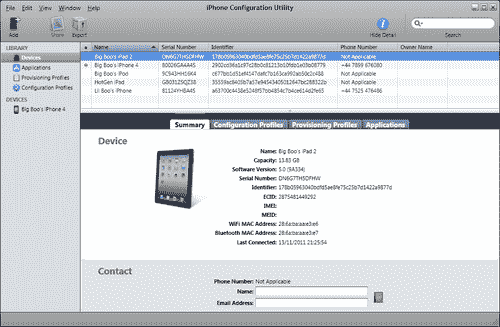

# 第一章. Marmalade 入门

在本章中，我们将首先学习如何为开发设置 Marmalade SDK。虽然 Marmalade 既有 Windows 版本也有 Mac 版本，但 Windows 版本是两个版本中开发最完善的，也是本书将主要涵盖的内容。在本章结束时，我们将知道如何完成以下操作：

+   使用 Marmalade SDK 设置 Windows PC 以进行开发

+   创建并构建 "Hello World" 项目

+   在多个移动平台上部署和运行 "Hello World" 项目

所以，无需多言，让我们开始吧！

# 安装 Marmalade SDK

以下部分将向您展示如何使用 Marmalade 将您的 PC 设置为开发环境，从安装合适的开发环境到许可、下载和安装您的 Marmalade 版本。

## 安装开发环境

在我们开始编码之前，我们首先需要安装 Microsoft Visual C++ 的一个版本，这是 Marmalade 使用的 Windows 开发环境。如果您还没有安装版本，您可以免费下载一个副本。在撰写本文时，Express 2012 版本刚刚发布，但 Marmalade 直接支持的最新免费版本仍然是 Visual C++ 2010 Express，可以从以下 URL 下载：

[`www.microsoft.com/visualstudio/en-us/products/2010-editions/visual-cpp-express`](http://www.microsoft.com/visualstudio/en-us/products/2010-editions/visual-cpp-express)

按照此网页上的说明下载和安装产品。

### 注意

对于 Marmalade 的 Apple Mac 版本，支持的开发环境是 Xcode，它可以从 Mac App Store 免费下载。在本书中，我们将假设使用的是 Marmalade 的 Windows 版本，除非特别说明。

## 选择您的 Marmalade 许可类型

在设置好合适的开发环境后，我们现在可以开始下载 Marmalade 本身。首先，您需要使用以下 URL 访问 Marmalade 网站：

[`www.madewithmarmalade.com`](http://www.madewithmarmalade.com)

网站顶部有两个按钮，分别标有 **购买** 和 **免费试用**。点击其中一个（哪个都行，因为它们都指向同一个地方！）您将看到一个页面，解释许可选项，这些选项也在以下表格中描述：

| 许可类型 | 描述 |
| --- | --- |
| 评估版 | 这是免费的，但有时间限制（目前为 45 天），虽然您可以将其部署到所有支持的平台，但您不允许分发使用此版本构建的应用程序。 |
| Community | 这是开始使用 Marmalade 最低成本的方式，但您只能将其发布在 iOS 和 Android 上，并且您的应用程序在启动时也会显示 Marmalade 启动画面。 |
| Indie | 此版本消除了基本许可证的限制，没有启动画面，并且可以针对任何受支持的平台。 |
| Professional | 此版本在开发过程中遇到任何问题时，提供 Marmalade 的专属支持，并允许提前访问 Marmalade 的新版本。 |

当您选择了许可证级别后，您首先需要通过提供电子邮件地址和密码在 Marmalade 网站上注册。

### 注意

您注册的电子邮件地址将与您的许可证相关联，并将在稍后用于激活。请确保在注册时使用有效的电子邮件地址。

一旦您完成注册，您将被带到网页，您可以在此选择所需的许可证级别。确认付款后，您将收到一封电子邮件，允许您激活许可证并下载 Marmalade 安装程序。

## 下载和安装 Marmalade

现在您已经拥有有效的许可证，请使用我们之前使用的相同 URL 返回 Marmalade 网站。

1.  如果您尚未登录到网站，请使用网页右上角的**登录**链接进行登录。

1.  点击**下载**按钮，您将被带到可以下载 Marmalade 安装程序最新和以前版本的页面。点击您所需的版本按钮，开始下载。下载完成后，运行安装程序并按照说明操作。安装程序将首先要求您通过选择单选按钮接受**最终用户许可协议**，然后要求输入安装位置。

1.  接下来，输入您想要安装的文件位置。默认安装目录会丢弃次要修订号（因此版本 6.1.1 将安装到名为 6.1 的子目录中）。您可能希望将次要修订号重新添加回去，以便更容易同时安装多个版本的 Marmalade。

1.  一旦安装程序将文件复制到您的硬盘驱动器后，它将显示 Marmalade 配置实用程序，这在下一节中有更详细的描述。一旦配置实用程序关闭，安装程序将提供选项，在退出前启动一些有用的资源，例如 SDK 文档。

    ### 注意

    同时安装多个版本的 Marmalade SDK 并按需切换版本是可能的，因此有关安装目录的建议变得非常有用。当 Marmalade 的新版本修复了特定设备的 bug，但您仍然需要支持需要不同版本 Marmalade 的旧项目时，这一点尤其有用。

## 使用 Marmalade 配置实用程序

**Marmalade 配置实用程序**窗口在安装过程结束时出现，但也可以通过其快捷图标启动：


### 注意

在 Windows Vista 或 Windows 7 上启动 Marmalade 配置实用程序时，您应该在图标上右键单击并选择 **以管理员身份运行** 选项，否则您所做的任何更改可能不会被应用。

最重要元素是 **License Information** 框。在此框下方有一个标签为 **Activate License...** 的按钮，允许您激活您的 Marmalade 安装。按照以下步骤进行激活：

1.  点击 **Activate License...** 按钮以显示一个对话框，该对话框要求您输入您在获取许可证时使用的电子邮件地址和密码。

1.  对话框还有一个带有标签 **Machine ID (Ethernet MAC address)** 的下拉框，您应该确保将其设置为始终存在于您计算机上的以太网端口的 MAC 地址。通常您不需要更改此设置。

1.  点击 **OK** 按钮连接到 Marmalade 许可证服务器。您将被要求选择您想要安装的许可证。（通常只有一个选项可用。）选择它并点击 **OK**。

1.  将显示适用于您所使用许可证类型的 **End User License Agreement**（EULA）摘要，因此请点击 **OK** 以接受它。对话框中也提供了完整 EULA 的引用。

1.  您现在应该会看到一个确认成功安装许可证的消息。此时 Marmalade 准备就绪！

在我们完成之前，让我们看看其他可用的选项。第一个选项标签为 **Marmalade System (S3E) Base**，它由一个下拉框组成，允许您选择您想要使用的 Marmalade SDK 版本，当然，如果您安装了多个版本的话！

### 注意

S3E 是 Segundo Embedded Execution Environment 的缩写，这是 Marmalade SDK 的最低层。这个命名约定是在 SDK 开发初期采用的，并且一直沿用至今。正如您将在本书后面看到的那样，有许多以这个名称为前缀的 API。

**Default Build Environment** 允许您选择您希望使用的开发环境，假设您安装了多个受支持的 Visual C++ 版本。

带有标签 **RVCT ARM Compiler** 的下拉框允许您更改在制作设备构建时将使用的编译器。（大多数移动设备都包含 ARM CPU，因此我们必须为这种处理器类型编译我们的代码。）Marmalade 随 GCC 编译器一起发货，并默认使用它，但它也可以使用 ARM 的 RVCT C++ 编译器，这是一项额外购买，可以生成更好的优化代码。我们通常不需要更改此设置，可以将其保留在第一个选项 **不使用 RVCT** 上。

**Advanced Options...** 按钮提供了访问更详细的项目构建选项以及 SDK 的一些实验性部分。您通常不需要在此处进行任何更改。

## 管理您的 Marmalade 账户和许可证

在我们开始实际编码之前，值得提一下如何管理您的 Marmalade 许可证和账户。如果您回到 Marmalade 网站并登录，您会注意到网站右上角有一个标记为**我的账户**的链接。

将鼠标指针悬停在链接上，将出现一个选项菜单，允许您更改账户详情和许可证使用情况。以下各节提供了有关这些选项的更多信息。

### 查看您的账户概览

菜单选项**概览**将带您到一个页面，您可以在其中查看您的个人详细信息以及您账户下设置的许可证和用户的总结。从该屏幕，有按钮允许您更新您的个人资料，修改注册用户信息，购买新的许可证，以及管理现有的许可证。

### 更新您的个人资料信息

点击**我的账户**菜单中的**个人资料**选项或点击个人资料概览屏幕上的**更新个人资料信息**按钮，将显示一个页面，允许您更改诸如您的姓名、联系信息、地址和账户登录密码等信息。还有一个复选框，允许您订阅 Marmalade 的电子邮件新闻更新。

### 管理您的许可证

点击**我的账户**菜单中的**许可证**链接或在概览屏幕上点击标记为**管理**的按钮，将带您到一个页面，您可以在其中升级许可证级别或为新的团队成员购买更多许可证。

本页底部的**管理许可证**部分显示了您账户中所有当前活跃的许可证，并允许您释放当前正在使用的许可证，以便将其转移到另一台电脑。

如果您需要因某些原因在另一台电脑上工作，或者如果您有一台新的开发电脑希望将许可证转移到上面，那么释放许可证是有用的。您可以随时释放许可证，但单个许可证一次只能在一台电脑上使用。

### 管理您的用户列表

如果您在一个团队中工作，那么您显然需要不止一个 Marmalade 许可证，但您还需要管理谁可以访问这些许可证。点击**我的账户**菜单中的**用户**选项或点击概览页面上的**管理用户**按钮，您就可以这样做。

此页面显示分配给您的所有用户的列表，还有一个**邀请用户**部分，允许您将新用户添加到您的账户。在提供的框中输入他们的电子邮件地址，然后点击**发送邀请**按钮，发送一封邮件告诉他们如何激活他们自己的 Marmalade 账户。

# 创建 Marmalade 项目

安装了 Marmalade 后，我们现在可以开始进行一些编码工作了，还有什么比从经典的“Hello World”程序开始更好的地方呢。

## 创建“Hello World”项目

要开始一个新的项目，我们首先必须创建一个 MKB 文件，这是 Marmalade 的自有项目文件格式。我们使用 MKB 文件来指定构建我们的项目所需的所有源文件、库和构建选项。

MKB 文件实际上用于生成一个 Visual C++ 项目文件，但每次我们想要向我们的项目添加或删除源文件时，我们必须通过编辑 MKB 文件，并使用 Marmalade 的 makefile 构建脚本从它重新生成 Visual C++ 项目文件，我们将在稍后查看这个脚本。

除了源文件外，MKB 文件还允许你列出你的应用程序运行所需的所有其他数据文件和资源文件，因为这些信息在将你的应用程序部署到不同的移动平台时将会被需要。

Marmalade 确实附带了一个名为 LaunchPad 的小工具，可以用来创建新项目，但为了学习如何构建 Marmalade 项目，我们将从头开始创建一切。

### 小贴士

**下载示例代码**

你可以从你在 [`www.PacktPub.com`](http://www.PacktPub.com) 的账户中下载你购买的所有 Packt 书籍的示例代码文件。如果你在其他地方购买了这本书，你可以访问 [`www.PacktPub.com/support`](http://www.PacktPub.com/support) 并注册以直接将文件通过电子邮件发送给你。

### “Hello World”项目的 MKB 文件

让我们从“Hello World”项目开始。创建一个新目录来存放项目文件，然后在这个目录中创建一个名为 `Hello.mkb` 的文件，并将以下内容输入到其中：

```swift
#
# Main MKB file for Hello project
#

# Modules used by this project
subprojects
{
  iwgx
}

# The files that make up the project (source, data etc.)
files
{
  [SourceCode]
  (source)

  Main.cpp
}

# Settings to configure the deployment process 
deployments
{
  name="Hello"
  caption="Hello World"
}
```

`Hello.mkb` 的第一个部分是 `subprojects` 部分，它列出了我们的应用程序使用的所有附加代码模块。在这个例子中，一个代码模块是一个可以作为一组 C 或 C++ 源文件添加到我们的项目中的库，或者作为与头文件一起的预编译、可链接的对象文件。在先前的例子中，只有一个，`iwgx`，这是负责渲染图形的 Marmalade 代码模块。

Marmalade 中的所有高级模块都以这种方式引用，你也可以使用这个系统创建自己的模块，以实现跨项目代码的重用。要创建一个子项目模块，我们使用一个 MKF 文件，这实际上比 MKB 文件多了一个不同的文件扩展名！当我们向 `subprojects` 列表中添加条目时，Marmalade 的 makefile 构建脚本将搜索一个合适的 MKF 文件，该文件描述了每个子项目。我们将在本书后面的详细示例中看到如何做到这一点。

下一个部分被标记为 `files`，这是我们列出我们项目中的所有源代码文件的地方。你有可能将你的源文件拆分到不同的目录中。为了方便，你只需在括号中放入目录名（在我们的例子中是 `(source)`），然后列出目录下的所有源文件。

还可以将相关的文件分组到子部分中，我们使用方括号（例如我们示例中的`[SourceCode]`）来做到这一点。任何位于此以下的源文件都将被添加到该部分，并随后在 Visual C++解决方案资源管理器中的单独文件夹中显示。不需要目录和组名匹配，实际上，如果你愿意，一个组中可以有多个目录。

最后，我们来到了`deployments`部分，这是设置各种控制将我们的应用程序部署到不同设备类型的各种设置的地点。

在我们的示例中，我们设置了两个设置。`name`设置提供了我们最终可执行文件的文件名，并且也被用于 Marmalade 为我们创建的文件和目录名，而`caption`设置则在设备上安装应用程序图标时显示的名称。

上述两种设置都是适用于所有设备类型的通用设置示例，但还有许多其他设置可用，这些设置特定于特定平台，如 iOS 或 Android。这些设置的完整列表可以在作为 Marmalade SDK 一部分安装的`Marmalade Documentation`帮助文件中找到，我们还将在本书的第八章“支持广泛的设备”以及尚未为这个示例展示的 MKB 文件的附加部分中查看。

在 MKB 文件中使用空白完全取决于你个人的喜好。尽管大多数 Marmalade 示例倾向于在块内缩进条目，但也可以使用制表符或空格。

也可以使用井号（`#`）字符添加注释。然后，从井号字符到当前行末尾的所有内容都被视为注释。

### "Hello World"项目的源文件

现在，我们可以为我们的项目使用 MKB 文件，但我们仍然无法对它做任何事情，因为我们已经告诉 Marmalade 存在一个名为`Main.cpp`的源文件，而这个文件还不存在。如果我们尝试使用 MKB 文件来构建项目，我们会收到关于此缺失文件的错误报告，所以让我们创建它。

你会记得我们说过，我们的`Main.cpp`文件将位于 MKB 文件中的`source`目录下，因此首先在项目目录中创建这个新的子目录。现在，在源目录中创建一个名为`Main.cpp`的文件，并将以下内容输入其中：

```swift
//---------------------------------------------------------
// Learning Mobile Game Development with Marmalade
// Chapter 1 - Hello
//---------------------------------------------------------

// Marmalade SDK includes
#include "IwGx.h"
#include "s3eConfig.h"
#include "s3eDevice.h"

//---------------------------------------------------------
// Main entry point
//---------------------------------------------------------
int main()
{
  // Initialise Marmalade modules
  IwGxInit();

  // Set a default message, then check the ICF file to see if
  // a proper message has been specified
  char lMessage[S3E_CONFIG_STRING_MAX] = "Hello!";
  s3eConfigGetString("APP", "Message", lMessage);

  // Set screen clear colour to black
  IwGxSetColClear(0, 0, 0, 255);

  // Draw text at double default size
  IwGxPrintSetScale(2);

  // Loop until we receive a quit message
  while (!s3eDeviceCheckQuitRequest())
  {
    // Allow device to process its internal events
    s3eDeviceYield(0);

    // Clear the screen
    IwGxClear();

    // Display our message on screen
    IwGxPrintString(10, 10, lMessage);

    // Flush IwGx draw buffers to screen
    IwGxFlush();

    // Swap screen double buffer
    IwGxSwapBuffers();
  }

  // Terminate Marmalade modules
  IwGxTerminate();

  return 0;
}
```

代码应该相当简单易懂，但这里有一个快速分解。

首先，我们引用包含文件，以便我们可以使用 Marmalade 中对我们应用程序必要的部分，然后我们创建我们的主要入口点函数`main`。这相当于标准 C 或 C++程序中的`main()`函数，但因为它不接受参数，因为 Marmalade 不接受命令行参数。在移动设备上指定命令行参数相当困难，所以实际上并没有必要！

我们应用程序需要做的第一件事是通过调用 `IwGxInit()` 初始化 Marmalade 的渲染模块，这将初始化屏幕并设置标准行为，例如显示的双缓冲。

接下来，我们分配一个字符缓冲区，它将包含我们将在屏幕上显示的消息。我们将其初始化为默认消息以确保有内容显示，但随后我们使用对 `s3eConfigGetString` 函数的调用来查看是否在应用程序的配置文件中指定了另一条消息，这将在稍后详细解释。

以下对 `IwGxSetColClear` 的调用将所需的屏幕背景色设置为黑色，然后对 `IwGxPrintSetScale` 的调用告诉 Marmalade 使用其内置字体（字体大小相当小）以双倍默认分辨率显示文本。

现在我们进入主处理循环，它将持续进行，直到 `s3eDeviceCheckQuitRequest` 函数返回一个真值，这将在用户退出应用程序或设备因任何原因向应用程序发送退出请求时发生。

我们主循环的第一行是对 `s3eDeviceYield` 的调用。这是一个非常重要的函数，必须在应用程序运行期间定期调用，以便允许设备的操作系统执行重要任务，如处理事件——用户输入、来电等。在大多数情况下，主循环中对该函数的单次调用就足够了。

传递给 `s3eDeviceYield` 的值是我们应用程序将让给操作系统处理的最大时间（以毫秒为单位）。通常这个值被设置为零，这足以让设备处理事件，但一旦所有事件都处理完毕，就会将控制权返回给我们的应用程序。

接下来，我们调用 `IwGxClear` 清除屏幕，然后使用 `IwGxPrintString` 在屏幕上显示一条消息。`IwGxFlush` 导致 Marmalade 引擎处理所有我们的绘图请求，以生成最终的屏幕图像，然后我们可以使用 `IwGxSwapBuffers` 将其显示给世界。

最后，在主循环之外，我们调用 `IwGxTerminate` 关闭 Marmalade 的渲染引擎，并最终返回零以指示我们的应用程序在没有任何错误的情况下完成。

## 构建 "Hello World" 项目

现在我们已经设置了项目并编写了必要的代码，现在是时候构建它了。为此，打开一个 Windows 资源管理器窗口，导航到包含 `Hello.mkb` 文件的文件夹，然后只需双击该文件。你可能看到命令提示符窗口的短暂闪烁，但经过短暂的延迟后，Visual C++ 应该会自动启动并打开我们的项目。

双击 MKB 文件实际上会执行 Marmalade 的 makefile 构建脚本。这是一个用 Python 语言编写的脚本，它接收 MKB 文件并输出一个 Visual C++解决方案文件和其他必需的元素。在安装 Marmalade 时，会自动设置文件关联，因此你可以双击文件，或者使用命令提示符通过切换到项目目录并输入`Hello.mkb`来创建你的项目。

在我们继续编译和运行项目之前，让我们快速看一下 Marmalade 为我们创建了什么。

如果你查看项目目录，应该有两个新目录，以下部分将描述它们。

### 构建目录

MKB 文件创建的目录之一将被命名为`build_hello_vcxx`，其中“xx”部分取决于你使用的 Visual C++版本。

此目录是 Marmalade 的工作目录，所有在构建过程中创建的对象文件都存储在这里。在制作设备构建时，它也将成为我们的部署包的存放地。

从 MKB 文件创建的 Visual C++解决方案文件也位于此目录中，虽然你可以使用这些文件在项目之间切换，但你绝不应该使用 Visual C++ IDE 中的选项添加文件或更改项目设置。

### 注意

总是修改 MKB 文件中的项目更改，然后关闭 Visual C++并双击 MKB 文件以重新构建解决方案，或者使用命令提示符在 Visual C++内部执行构建以更新解决方案文件中的任何更改。你不应该在 Visual C++ IDE 中直接进行更改，因为它们将在下一次使用 MKB 文件重新创建项目文件时丢失。

### 数据目录

MKB 文件还会生成一个名为`data`的目录，这是 Marmalade 要求你放置任何应用程序需要加载的文件的地方，例如图像、3D 模型数据、声音文件等。虽然你可以自己创建此目录和这些文件，而且不会造成问题，但我们还是让 makefile 构建器为我们完成这项工作吧！

如果你查看`data`目录，你会看到构建过程还创建了两个名为`app.icf`和`app.config.txt`的文件。这些文件用于配置你的应用程序，并在以下部分中解释。

#### app.config.txt 文件

此文件提供了在`app.icf`文件中可以设置的所有应用程序特定设置的列表，以及每个设置的作用描述和如何使用。使用此文件有两个原因：

1.  向此文件添加条目可以保持你的项目设置在一个地方记录，这样其他编码者可以检查此文件以了解特定设置的作用。

1.  在`app.icf`文件中包含的任何设置，如果不在`app.config.txt`文件中记录，当你尝试在程序中指定或访问它时，将会生成一个运行时错误信息。

此外，`app.config.txt`文件还要求你为你的设置定义一个组名，这可以通过使用方括号来指定。

如果你查看“Hello World”项目代码中的`s3eConfigGetString`函数调用，你将看到这个示例。这个调用试图从`APP`组中访问一个名为`Message`的设置，所以现在让我们将它添加到`app.config.txt`文件中，以防止在运行我们的应用程序时触发任何断言。编辑文件并在底部添加以下行：

```swift
[APP]
Message      The message we want to display on screen
```

#### app.icf 文件

`app.icf`文件用于将配置设置添加到你的应用程序中，如前所述，这些设置必须在你的项目`app.config.txt`文件中记录，或者可以定义在应用程序使用的子项目中的一个类似文件中。

添加配置设置只是简单地添加设置名称后跟一个等号，然后是你希望使用的值。你还必须确保使用与`app.config.txt`文件中相同的方括号符号将设置添加到正确的组中。以下是一个示例：

```swift
[APP]
Message="Hello World"
```

在`app.icf`文件中创建的设置可以通过`s3eConfigGetInt`和`s3eConfigGetString`函数在代码中访问。

`app.icf`文件还有一些其他技巧，因为也可以创建特定于某个平台或甚至特定于单个设备的设置。以下是实现方法：

+   要将应用程序限制在特定的平台上，添加行`{OS=platform}`，并且在此之后的所有设置将仅适用于该设备平台。`platform`值通常是操作系统的名称，例如`ANDROID`、`BADA`或`WINDOWS`，尽管值得提一下，你应该使用`IPHONE`来指代 iPhone、iPod 和 iPad！如果有疑问，你可以使用调用`s3eDeviceGetString(S3E_DEVICE_OS)`来发现特定操作系统需要使用的值。

+   要将应用程序限制在特定的设备或设备上，添加行`{ID=platform id}`，并且任何后续设置只有在运行在指定的设备上时才会应用。`platform`值与之前使用的相同，而`id`是特定设备的标识符。`id`值的格式取决于操作系统，但你可以通过调用`s3eDeviceGetString(S3E_DEVICE_ID)`来发现特定设备应使用什么值。如果你需要将设置应用于多个设备，也可以提供以逗号分隔的`id`值列表。

注意，这两个设置将继续生效，直到指定了新的操作系统或 ID 值。如果你希望将所有设置全局应用，只需在你最后的操作系统或 ID 特定设置后添加`{}`。

### 小贴士

确保您的 OS-或 ID 特定的部分始终以`{}`结束是一个好习惯，否则在部署到设备并发现您刚刚更改的一些设置似乎没有生效时，可能会导致您大伤脑筋。

为了说明`{}`的使用，让我们向“Hello World”项目的`app.icf`文件添加一些设置。打开文件，将其以下几行添加到文件底部：

```swift
[APP]
{OS=ANDROID}
Message="Hello Android!"
{}

{OS=BADA}
Message="Hello Bada!"
{}

{OS=IPHONE}
Message="Hello iOS!"
{}

{OS=QNX}
Message="Hello BlackBerry!"
{}

{OS=WINDOWS}
Message="Hello Windows!"
{}
```

您应该能从中看出，我们已经为每个我们希望支持的不同的平台类型指定了不同的消息字符串。

## 在 Windows 模拟器中构建和运行

现在是时候看看“Hello World”项目在实际中的运行情况了。这只是一个简单的问题，就是在 Visual C++中编译代码并运行它。

要编译代码，只需选择**构建** | **构建解决方案**或按*F7*键。Visual C++将编译并链接`Main.cpp`文件。

现在我们可以执行程序了。选择**调试** | **开始调试**或简单地按*F5*。Marmalade Windows 模拟器将被启动，它将加载并执行我们的程序。以下图像显示了在 Windows 模拟器中运行时“Hello World”项目应该看起来像什么：


您会注意到 Windows 模拟器包含许多菜单选项。这些选项允许 Windows 模拟器尽可能接近您选择的任何设备运行。最好的方法是亲自探索菜单选项，但以下是一些您可能想做的更有用的事情：

+   加速度计：在 Windows 上测试加速度计输入是不可能的，没有**配置** | **加速度计...**。这将弹出一个对话框，允许您使用鼠标旋转手机的 3D 图像，以模拟加速度计输入。

+   OpenGL ES 版本：Windows 模拟器选项**配置** | **GL...**允许您模拟不同版本的 OpenGL ES，这使得您能够轻松地看到您的游戏在不同类型的硬件上可能看起来像什么。它还允许您完全禁用 OpenGL ES 支持，这将迫使 Marmalade 使用其内置的软件渲染器。

+   屏幕分辨率：移动设备支持广泛的屏幕分辨率，因此**配置** | **表面...**允许您选择您想要的任何屏幕大小。

+   设备挂起和恢复的模拟：很容易忘记许多设备的主要功能实际上是电话而不是游戏平台，这意味着你的应用程序可能会在任何时候被来电中断。Marmalade 负责处理大多数自动处理这种情况的繁琐细节，但仍然可能存在需要在这种情况下执行特殊操作的情况。Windows 模拟器允许你通过**事件** | **模拟挂起**和**事件** | **模拟恢复**来测试你的应用程序是否正确响应。

# 部署 Marmalade 项目

我们现在已经成功创建并运行了我们的第一个 Marmalade 应用程序，但将其在 Windows 上运行并不是我们的最终目标。Marmalade SDK 的整个目的就是为了让我们能够一次性开发应用程序，然后将其部署到一系列移动设备平台。

当然，我们可能需要更改一些资产，例如，因为我们针对的是广泛的屏幕分辨率，希望我们的应用程序始终看起来最佳，代码本身应该不需要修改才能成功运行。

为了说明这一点，我们现在将“Hello World”项目部署到多个不同的移动设备平台。

## 为 ARM CPU 编译“Hello World”项目

在 Windows 上运行我们的项目意味着我们使用标准的 Visual C++编译器编译代码，因此生成 Intel x86 代码。然而，一个事实是，今天大多数可用的移动设备都包含某种版本的 ARM 处理器，因此我们首先需要为 ARM 编译我们的代码。

幸运的是，Marmalade 为我们简化了这一点。在 Visual C++窗口的顶部，你应该看到一个默认设置为**（x86）调试**的下拉菜单。

如果你打开下拉菜单，你会看到为预配置了几个针对我们的构建类型，但我们感兴趣的是**GCC (ARM) Release**选项。选择此选项并再次构建解决方案（**构建** | **构建解决方案**或按*F7*），Visual C++将使用 GCC 编译器创建我们应用程序的 ARM 版本。

现在我们只需要将代码上传到设备上！

## 部署“Hello World”项目

现在我们已经有了代码的 ARM 编译版本，我们需要创建一个安装包，以便我们可以在真实移动设备上测试它。为此，我们需要使用**Marmalade 系统部署工具**。按照以下步骤进行部署过程：

1.  要启动工具，确保选择了**GCC (ARM) Release**构建类型并且代码已经编译。选择**调试** | **开始调试**（或按*F5*）。由于 Visual C++调试器只能调试 Intel x86 可执行文件，所以没有太多意义，**Marmalade 系统部署工具**将被启动。

1.  程序将首先要求我们选择要部署的构建类型，并将有多个单选按钮可供选择。只有当前已构建的构建类型才是可选择的。在我们的情况下，我们需要选择 **ARM GCC 发布** 单选按钮，然后点击标有 **下一阶段 >** 的按钮，以继续到下一步。

1.  下一页要求我们选择部署配置。我们可以指定我们想要创建部署包文件的目录，并且还有一个可供选择的可用部署配置的复选框列表。Marmalade 允许我们创建不同的配置，这意味着我们可以将不同的资源包部署到不同的设备上。目前我们不会关注这些，所以请确保 **默认** 设置被选中，然后再次点击 **下一阶段 >** 按钮。

1.  现在，我们面前是一个列出我们可以部署的所有设备类型的页面。使用复选框选择要部署的平台，然后再次点击 **下一阶段 >**，即可进入最终页面。

1.  在最后一页的顶部，我们可以看到即将制作的不同的部署类型的简要描述，每个都有下拉框，用于指定我们是否只需生成必要的包文件，完全忽略该构建类型，或者可选地安装并运行包。

    ### 注意

    Marmalade 系统配置工具中可用的 **包和安装** 选项通常依赖于你的系统已经设置了额外的第三方软件，这些软件不是作为 Marmalade SDK 的一部分自动安装的。因此，在这本书中，我们将一般保持使用 **包** 选项，并使用手动方法安装和运行部署包。

1.  既然我们已经配置了想要的部署类型，只需按下 **部署全部** 按钮，Marmalade 将为所有选定的不同目标创建包。

默认的部署包位置位于 Marmalade 的 `Build` 目录中。如果你使用 Windows 资源管理器查看此目录，你会看到已创建一个名为 `deployments` 的新目录。反过来，此目录包含一个名为 `default` 的文件夹，它来自我们使用的部署配置。

### 注意

可以通过点击部署实用程序的最终页面上的 **探索…** 按钮来打开 Windows 资源管理器到部署文件夹。

`default` 目录包含我们选择的每个部署平台的子目录，并且每个子目录都将包含一个 `release` 目录，因为我们是从发布构建创建部署的。请注意，也可以部署调试构建，这在调试时可能很有用。进入 `release` 文件夹，在那里你会找到我们刚刚制作的部署包。

现在剩下的只是安装并在设备上运行它。

### 在 Android 设备上安装

让我们先看看如何安装 Android 构建。

### 注意

在能够使用部署工具进行 Android 部署之前，有一个先决条件，即必须安装 Java JDK。你可以从以下网页下载它：

[`www.oracle.com/technetwork/java/javase/downloads/index.html`](http://www.oracle.com/technetwork/java/javase/downloads/index.html)

"Hello World"项目的 Android 包文件名为`Hello.apk`，要安装它，我们首先需要将其复制到 Android 设备上。这可以通过将文件复制到 SD 卡上完成，或者如果你的设备有内置存储内存，可以将文件复制到那里。

在我们能够安装我们的包之前，我们首先需要确保 Android 设备允许我们这样做。进入你的设备的**设置**程序并选择**应用程序**选项。在这里有一个**未知来源**选项，它允许我们安装自己的包。确保这个选项被勾选。

接下来，在你的设备上找到文件管理应用程序。不同的设备可能为这个应用程序有不同的名称，但通常它有一个图标，上面有一个档案文件夹的图片。导航目录以找到你复制的`Hello.apk`文件的位置，然后点击列表中的文件条目。

屏幕将切换以显示应用程序请求访问的大列表，以及**安装**和**取消**按钮。点击**安装**按钮，包将被安装。然后你可以选择**打开**按钮来启动你的应用程序，或者如果你现在不想运行它，可以选择**完成**按钮。点击**打开**，我们应该会看到我们的**Hello Android**消息。

### 注意

通过安装 Android SDK，还可能通过允许部署工具自动打包、安装和运行部署的包来加速设备上的测试。关于如何设置 Android SDK 以使其工作的说明可以在本书的第十章扩展 Marmalade") *使用扩展开发工具包(EDK)扩展 Marmalade* 中找到。

### 在 iOS 设备上安装

如果你尝试创建"Hello World"项目的 iOS 构建，你会注意到它目前无法完成，因为签名错误。这是因为你需要向 Marmalade 提供一些证书文件，这些文件只能通过成为注册的苹果开发者来生成。

加入**iOS 开发者计划**目前每年需要 99 美元，你可以在以下网页上找到更多详细信息：

[`developer.apple.com/programs/which-program/`](https://developer.apple.com/programs/which-program/)

一旦注册，您将能够访问**iOS Dev Center**，这将允许您创建所需的证书。通常您需要一个 Apple Mac 来生成这些证书，但方便的是，Marmalade 提供了一个名为**iPhone Sign Request Tool**的小工具，可以解决这个问题。以下是您需要执行的操作：

1.  启动 Marmalade iPhone Sign Request Tool，并按照以下方式填写字段：

    1.  **证书请求文件**：选择一个位置来保存此文件。您需要稍后将其上传到 iOS Dev Center。

    1.  **密钥文件**：从下拉框中选择**developer_identity.key**。

    1.  **通用名称**：您在注册 iOS Developer Program 时使用的名称。

    1.  **电子邮件地址**：您在注册 iOS Developer Program 时使用的电子邮件地址。

1.  现在，登录到 iOS Dev Center 并点击**iOS Provisioning Portal**链接。

1.  在左侧面板中，点击**Certificates**链接。点击**Development**选项卡，然后点击**Request Certificate**按钮以打开一个包含说明的页面。在新页面上，按**Choose File**按钮上传在第 1 步中生成的文件。

1.  再次点击左侧面板中的**Certificates**链接，然后点击提示您下载 WWDR 中间证书的链接。将此文件保存到您的 Marmalade SDK 安装目录下的子目录`s3e\deploy\plugins\iphone\certificates`中。

1.  在您的网络浏览器中刷新**Certificates**页面，直到您在**Action**列中看到**Download**按钮。点击此按钮并将文件保存到步骤 4 中的目录，将其重命名为`developer_identity.cer`。

1.  在左侧面板中，点击**Devices**链接，通过点击**Add Devices**按钮并输入设备及其 40 位十六进制设备 ID 的描述来将您的测试设备注册到 iOS Dev Center。有一个标记为**Finding the Device ID**的链接，它告诉您如何为特定设备发现此值。

1.  接下来点击**App IDs**链接，然后点击**New App ID**按钮，注册一个新的 App ID 以供您的应用程序使用。您只需输入一个描述（可以是您想要的任何内容）和一个形式为`com.domainname.appname`的包标识符。`domainname`部分可以是您喜欢的任何内容（它不必与真实的 URL 相关），而`appname`部分应该是您应用程序的名称，或者您可以使用一个星号，这样就可以使用该 App ID 为任何应用程序。

1.  点击**Provisioning**链接，然后点击**New Profile**按钮。为配置文件输入一个描述性名称，并勾选您的证书名称旁边的复选框。从下拉框中选择在第 7 步中生成的 App ID，然后勾选所有您希望此配置文件应用于的设备的复选框。

1.  再次点击**配置文件**链接，并不断刷新此页面，直到在您的新配置文件旁边出现**下载**按钮。

在 Marmalade 文档的帮助文件中可以找到有关此过程的信息，大多数 iOS 配置文件门户页面上也有**如何**标签，解释了涉及的过程，尽管大多数这些假设您正在使用 Apple Mac 生成各种文件。

在克服所有这些障碍之后，我们可以使用**Marmalade 系统部署工具**生成一个正确签名的 iOS 安装包，该包将被命名为`Hello.ipa`。现在，要将它安装到设备上！

可以使用 iTunes 来安装您的构建版本，但请注意，它可能有点儿运气成分，不一定能成功。有时 iTunes 无法识别新的构建版本，需要同步到设备上。根据我的经验，一个更可靠的选项是使用**iPhone 配置实用工具**，这是一个可以从以下网址免费下载的 Apple 工具：

[`support.apple.com/kb/DL1466`](http://support.apple.com/kb/DL1466)



首先，您需要让 iPhone 配置实用工具了解您的配置文件。在左侧最远端面板中点击**配置文件**，然后在工具栏中点击**添加**按钮。导航到步骤 9 中创建的配置文件文件，并点击**打开**按钮将其添加到可用配置文件列表中。或者，您也可以从 Windows 资源管理器中将文件拖放到列表中。

接下来，在左侧面板中点击**应用程序**条目，然后点击工具栏中的**添加**按钮。在部署的**发布**目录中找到`Hello.ipa`文件，并点击**确定**将其添加到已知应用程序列表中，或者您也可以从 Windows 资源管理器中将文件拖放到列表中。

现在，使用 USB 线将您的 iOS 设备连接到计算机。在短暂延迟后，它应该出现在左侧面板的底部。点击您的设备名称，您应该在主面板中看到五个标签出现。点击**配置文件**标签，然后点击您配置文件旁边的**安装**按钮。完成后，此按钮将更改为**移除**按钮。

我们接下来的步骤是安装应用程序本身，因此点击**应用程序**标签以查看设备上已安装或可安装的所有应用程序的列表。找到标记为**Hello**的条目，并点击其**安装**按钮，一旦应用程序安装完成，该按钮将更改为显示**移除**。

在完成所有这些之后，我们最终可以通过在设备上找到其图标并点击它来运行我们的应用程序。您应该会看到消息**Hello iOS**，我承认在经过如此漫长的过程后，这可能显得有些令人失望。

### 在 BlackBerry QNX 设备上安装

Marmalade 还可以部署到 BlackBerry QNX 设备，其中最著名的是 PlayBook 平板电脑。为了部署到 PlayBook，我们首先需要进行一些设置工作。在接下来的步骤中，需要输入一些命令行。在这些命令行中，有一些用尖括号括起来的参数。在每个命令组之后，有一个表格解释了如何替换尖括号内的参数。

1.  首先转到以下 URL 下载 BlackBerry Native SDK，其中包含一些用于签名构建的工具：

    [`developer.blackberry.com/native/download/`](https://developer.blackberry.com/native/download/)

1.  通过在 Windows 资源管理器中右键单击安装程序的图标并选择**以管理员身份运行**选项来运行安装程序，以避免在安装 SDK 时出现权限问题。

1.  安装完成后，请转到以下 URL 请求一些签名密钥：

    [`www.blackberry.com/SignedKeys/nfc-form.html`](https://www.blackberry.com/SignedKeys/nfc-form.html)

1.  我们需要请求一个**设备代码签名密钥**，因此选择第一个单选按钮以请求此密钥类型，然后输入所需的个人资料信息（你的姓名、公司名称等）。你还将被要求输入一个由八个字母数字字符组成的 PIN 值。确保你记住在这个阶段输入的内容，因为你需要它来完成密钥的注册。

1.  在勾选许可协议复选框并单击**提交**按钮之前，请确保已勾选标记为**适用于 BlackBerry PlayBook OS 和 BlackBerry 10 及以上版本**的复选框。

1.  密钥文件将通过电子邮件发送给你，但它们到达之前可能会有几小时的延迟。当你拥有密钥文件时，在你的 PC 上创建一个空文件夹并将它们保存到该文件夹中。以下步骤将假设文件夹名为`C:\PlayBook`。

1.  打开一个命令提示符窗口，将当前目录更改为你在第 6 步中创建的目录，并输入以下命令。第一个命令设置`PATH`环境变量，以便其他命令可以执行。这些命令将你的密钥文件注册到 BlackBerry 签名服务器，并允许你的 PC 生成调试令牌：

    ```swift
    C:\PlayBook> C:\bbndk-2.0.1\bbndk-env.bat
    C:\PlayBook> blackberry-keytool -genkeypair -keystore sigtool.p12 -storepass <password> -dname "cn=<company name>" -alias author
    C:\PlayBook> blackberry-signer -csksetup -cskpass <password>
    C:\PlayBook> blackberry-signer -register -csjpin <pin> -cskpass <password> <RDK file>
    C:\PlayBook> blackberry-debugtokenrequest.bat -register -cskpass <password> -csjpin <pin> <PBDT file>
    ```

    | 参数 | 需要输入的值 |
    | --- | --- |
    | `<公司名称>` | 在第 4 步请求密钥文件时指定的公司名称。 |
    | `<密码>` | 你选择的密码。在每个命令中使用相同的值。 |
    | `<PBDT 文件>` | 这是第 6 步中通过电子邮件发送给你的 PBDT 密钥文件的文件名。该文件名应采用`client-PBDT-1234567.csj`的形式，其中数字部分将唯一标识你的密钥文件。 |
    | `<pin>` | 在第 4 步请求密钥文件时指定的 PIN 值。 |
    | `<RDK 文件>` | 这是第 6 步中通过电子邮件发送给你的 RDK 密钥文件的文件名。该文件名应采用`client-RDK-1234567.csj`的形式，其中数字部分将唯一标识你的密钥文件。 |

1.  我们现在可以使用以下命令行生成调试令牌文件：

    ```swift
    C:\PlayBook> blackberry-debugtokenrequest -cskpass <password> -keystore sigtool.p12 -storepass <password> -deviceId 0x<device id> debugtoken.bar
    ```

    | 参数 | 需要输入的值 |
    | --- | --- |
    | `<设备 ID>` | 您 BlackBerry 设备的设备 ID。例如，您可以在 PlayBook 的设置屏幕中找到此值，进入设置屏幕，在左侧面板中点击**关于**项，然后在下拉框中选择**硬件**选项。标记为**PIN**的值是设备 ID。当您在命令行中指定此值时，确保您以`0x`为前缀，就像在 C++源代码中一样，以表示十六进制值。 |
    | `<密码>` | 这是您在上一组命令中使用的相同密码。 |

1.  要在设备上安装调试令牌，首先确保设备通过 WiFi 连接到与您的 PC 相同的网络，然后查看设备设置以确定分配给它的 IP 地址。这可以通过转到**关于**面板并在下拉框中选择**网络**来找到。

1.  接下来，我们必须在设备上启用开发模式，这可以在设置屏幕中完成。选择**安全**面板，然后在该屏幕上点击**开发模式**条目。将**使用开发模式**旁边的切换控制设置为**开启**。您将被要求输入用于开发模式的密码，因此输入一个到编辑框中，然后点击**上传调试令牌**按钮。

1.  现在我们必须输入一个额外的命令行来在设备上安装调试令牌。

    ```swift
    C:\PlayBook> blackberry-deploy -installDebugToken debugtoken.bar -device <ip address> -password <device password>
    ```

    | 参数 | 需要输入的值 |
    | --- | --- |
    | `<设备密码>` | 在第 10 步设置的设备密码。 |
    | `<IP 地址>` | 在第 9 步发现的设备 IP 地址。 |

1.  现在我们必须将以下两行添加到 MKB 文件的`deployments`部分，以便我们可以创建一个有效的部署包：

    ```swift
    playbook-author="<company name>"
    playbook-authorid="<author id>"
    ```

    | 参数 | 需要输入的值 |
    | --- | --- |
    | `<公司名称>` | 在第 4 步请求密钥文件时指定的公司名称值。 |
    | `<作者 ID>` | 找到这个值有点复杂。首先复制第 8 步生成的`debugtoken.bar`文件，将其重命名为`.zip`扩展名。现在您可以使用归档程序查看此文件。进入`META_INF`目录并提取`MANIFEST.MF`文件。在文本编辑器中打开此文件，查找名为`Package-Author-Id`的条目。此条目后面的字符串就是您需要在 MKB 文件中输入的值。 |

1.  如果 Visual C++已打开，请关闭它。双击项目 MKB 文件以使用之前所做的更改重新构建它，并启动 Visual C++。执行项目的**GCC (ARM) 发布**构建，然后按*F5*启动部署工具。

1.  在部署工具中，更改设置以创建 BlackBerry QNX 部署。当您到达标记为**部署摘要**的页面时，在点击**部署所有**按钮之前，将下拉框更改为**包和安装**选项。

1.  在部署工具的最后页面将显示，对于 BlackBerry 部署，有两个额外的字段。第一个字段标记为**设备主机名（或 IP 地址**），您应提供您想要安装包的设备的 IP 地址。另一个字段标记为**设备密码**，您应输入在第 10 步中设置的密码。然后再次点击**部署全部**按钮，部署将通过 WiFi 传输并安装到设备上。

构建现在应该已经安装到设备上，所以松一口气，然后在应用程序列表中寻找它的图标。触摸图标以运行程序，你应该会看到一个愉快的短消息**Hello BlackBerry**！

### 在 Bada 设备上安装

在 Bada 设备上安装构建是一个例子，说明在**Marmalade 系统部署工具**中使用**包、安装和运行**选项实际上是一个非常不错的选择，因为无法手动将包复制到 Bada 设备上以进行安装。

首先，您需要为您的 Bada 设备安装一些设备驱动程序，以便部署工具可以连接到它。Marmalade 确实附带了一些 Bada 驱动程序，但确定三个可能的驱动程序中哪一个与您的设备匹配可能很困难。因此，最好首先安装 Samsung Kies 工具，它附带了许多驱动程序，并将自动为您安装正确的驱动程序。您可以从以下网址下载 Kies：

[`www.samsung.com/uk/support/usefulsoftware/KIES/JSP`](http://www.samsung.com/uk/support/usefulsoftware/KIES/JSP)

安装 Kies 后，使用 USB 线缆将您的设备连接到计算机，并运行部署工具。当您到达平台选择页面时，您将看到有四个可能的 Bada 选项。您必须选择适合您设备的正确选项，这取决于您的设备所具有的 Bada 版本以及其屏幕分辨率。

选择正确的 Bada 平台选项后，点击**下一阶段 >**按钮，然后在窗口顶部的下拉框中选择**包、安装和运行**。点击**部署全部**按钮，将创建一个安装包，该包将安装到您的设备上并执行，然后您应该会看到所有单色的**Hello Bada**消息！

# 摘要

“Hello World”项目可能非常简单，但它已经展示了 Marmalade 的惊人力量。我们现在知道如何创建一个新的 Marmalade 项目，构建它，并为其创建和应用我们自己的应用程序特定设置。

我们然后在 Windows 模拟器中运行我们的项目，并学习了如何在多个不同的移动平台上部署和运行它。

在屏幕上显示一些文本虽然不是世界上最令人兴奋的事情，但接下来的一章我们将学习如何使用 Marmalade SDK 在屏幕上绘制简单的 2D 图像。我们还将了解 Marmalade 是如何使我们轻松使用位图图像的。
