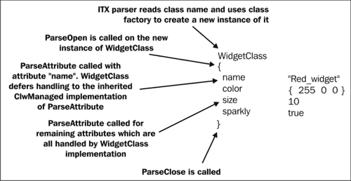
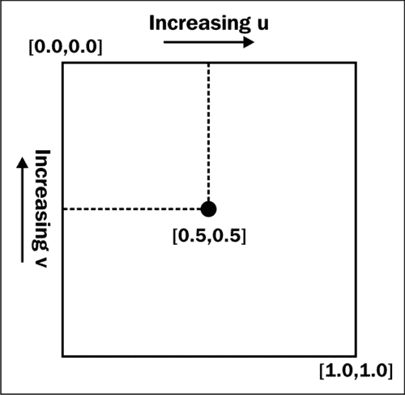
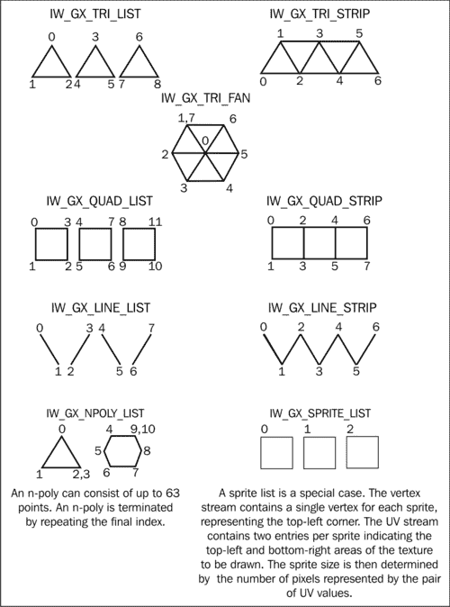
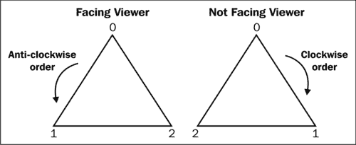
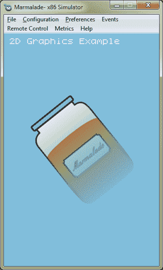
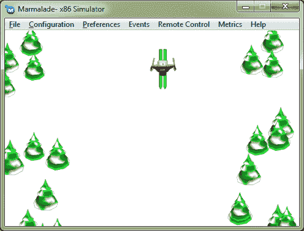

# 第二章：资源管理和 2D 图形渲染

除非你恰好正在编写一个老式的文本冒险游戏（甚至即使你正在这样做），否则你很可能会希望在屏幕上显示的不仅仅是简单的调试字体中的文本。绘制漂亮的图形要求我们也能够将这些图形加载到内存中以便显示；因此，在本章中，我们将探讨以下内容：

+   使用 Marmalade 的资源管理器加载游戏资源

+   使用我们自己的自定义类扩展资源管理系统

+   我们可用于渲染目的的编程选择

+   如何使用 IwGx API 在屏幕上显示位图图像

# Marmalade ITX 文件格式

ITX 文件是 Marmalade 的内置文件格式，可用于将各种数据加载到我们的程序中。扩展名 ITX 是 Ideaworks TeXt 的缩写；Ideaworks 是在重新品牌为 Marmalade 之前创建 SDK 的公司的原始名称。

ITX 文件具有简单的文本格式，并用作资源加载的基础。虽然我们可以自己加载资源，但这样做就像是在重新发明轮子，因为 Marmalade 已经为这一真正繁琐的编码方面提供了大量的支持。

Marmalade 有一个名为 IwUtil 的 API，它包含了一系列广泛的有用实用函数，从内存管理和调试到对象的序列化和随机数生成。它还包含一个名为 `CIwTextParserITX` 的类，它允许我们加载和处理 ITX 文件。

要将此功能添加到我们的项目中，我们只需将 `iwutil` 添加到 MKB 文件的 `subprojects` 列表中，然后在程序开始时添加对 `IwUtilInit` 的调用，并在关闭代码中添加对 `IwUtilTerminate` 的调用。

在我们可以使用文本解析器之前，我们需要通过使用 `new CIwTextParserITX` 来创建它的一个实例。这个类是一个单例类，因此我们可以在程序开始时创建它的一个实例，然后在代码的其余部分中尽可能多地重用它（不要忘记在关闭时释放它！）。该实例可以通过 `IwGetTextParserITX` 函数访问，然后我们可以使用以下代码加载和解析 ITX 文件：

```swift
IwGetTextParserITX()->ParseFile("myfile.itx");
```

ITX 文件不过是一个由类定义组成的庞大集合。类的实例通过首先写出类的名称，然后跟随着用花括号括起来的该实例的参数列表来定义。假设我们有一个名为 `WidgetClass` 的类，其定义如下（现在不必担心 `CIwManaged` 类和 `IW_MANAGED_DECLARE` 宏，我们稍后会讨论这些）：

```swift
class WidgetClass : public CIwManaged
{
public:
  IW_MANAGED_DECLARE(WidgetClass)
  WidgetClass();
private:
  uint8         mColor[3];
  int32         mSize;
  bool          mSparkly;
  WidgetClass*  mpNextWidget;
  uint32        mNextWidgetHash;
};
```

下面是一个示例，说明我们如何在 ITX 文件内部实例化这个类：

```swift
WidgetClass
{
  name     "red_widget"
  color    { 255 0 0 }
  size     10
  sparkly  true
}

WidgetClass
{
  name     "green_widget"
  color    { 0 255 0 }
  size    20
  sparkly  false
  next    "red_widget"
}
```

这个示例声明了两个`WidgetClass`的实例，并用名称、颜色值、大小以及一个标志来初始化这些实例，该标志指示所讨论的小部件是否闪闪发光。每个这些设置都被称为属性，它们可以是任何我们想要的类型——字符串、整数、浮点数、布尔值或值的数组（`color`属性提供了一个例子）。

希望您正在查看这个，并思考这个格式是如何被 Marmalade 文本解析器神奇地加载和实例化的，因为它显然对`WidgetClass`一无所知。这是一个很好的问题！答案是，您希望从 ITX 文件中解析的任何类都必须首先从 Marmalade 类`CIwManaged`派生。

## CIwManaged 类

`CIwManaged`类是在 Marmalade SDK 中使用的基类，以及我们自己的类，每当我们要能够通过从文件加载来创建它们的实例时。

该类提供了一些虚拟方法，我们可以覆盖这些方法以允许解析器识别我们自己的自定义类，并将它们序列化为二进制格式，并解决对其他类或资源的引用。它还提供了在运行时实例化我们类副本所需的编码粘合剂。

这个功能对我们来说非常有用，因为它允许我们使我们的代码更加数据驱动。比如说，我们有一个描述玩家可以收集的物品的类。在我们的游戏中可能有多种不同的物品类型，所以我们不必在源代码中创建它们的实例，这只有程序员才能更改，我们反而可以从 ITX 文件中实例化它们，这样没有编程知识的游戏设计师就可以编辑它们。

### 使用类工厂实例化类

`CIwTextParserITX`在 ITX 文件中遇到的第一件事是类名，它将使用这个类名来创建我们类的一个全新实例。它是通过使用类工厂来实现的，这是 IwUtil API 的另一个部分。

类工厂是一种编程模式，它允许我们通过要求另一个类（所谓的工厂）为我们创建一个相关的类实例来在运行时生成新对象实例。

Marmalade 类工厂系统允许我们通过注册一个标识类的唯一哈希值和一个创建该类新实例的方法来将我们自己的类添加到 SDK 本身提供的类中。

哈希值通常是通过将类名转换为数字来得到的，这是通过将类名作为字符串传递给 IwUtil API 的函数`IwHashString`来实现的。虽然这并不能保证产生一个唯一的数字，但对于我们的目的来说通常已经足够好了，并且与其他类名的哈希值发生冲突的情况很少。

要将我们自己的自定义`CIwManaged`派生类添加到类工厂中，我们只需执行以下操作（如果您想查看这个完整的示例以及接下来几节将要涉及的内容，请查看本章伴随的 ITX 项目的源代码）：

1.  将宏 `IW_MANAGED_DECLARE(CustomClassName)` 添加到类的公共部分。此宏声明了一个名为 `GetClassName` 的方法，它将返回类的名称作为字符串，并添加了一些类型定义，以便更容易地使用 `CIwArray` 类，这是 IwUtil 提供的另一个功能。

1.  将宏 `IW_MANAGED_IMPLEMENT_FACTORY(CustomClassName)` 添加到类的源文件中。此宏实现了 `GetClassName` 方法，并创建了必要的类工厂函数，该函数将用于创建我们类的新的实例。

1.  最后，我们必须通过在初始化代码中添加宏 `IW_CLASS_REGISTER(CustomClassName)` 来将我们的类注册到类工厂本身。

完成这些后，我们现在可以将我们的类包含在 ITX 文件中。`CIwTextParserITX` 类现在可以通过调用类工厂函数 `IwClassFactoryCreate("CustomClassName")` 来创建它的全新实例。

### 解析一个类

在处理完我们类的新的实例创建后，下一步是允许 `CIwTextParserITX` 通过修改其成员来配置该实例。这是通过以下 `CIwManaged` 类的虚拟方法完成的：

| 方法 | 描述 |
| --- | --- |
| `ParseOpen` | 当文本解析器达到类定义的开始花括号时，将调用此方法。它可以用来初始化在解析对象过程中可能需要的任何内部内容。重要的是不要使用此方法将类的所有成员变量初始化为某些默认值。类构造函数是做这件事的更好地方，因为它保证在实例以任何方式创建时都会被调用。 |
| `ParseAttribute` | 当在对象定义中遇到属性时，将调用此方法。该属性作为标准 C 风格字符串传递给此方法，然后可以按需处理它。文本解析器可以在此方法中使用，以多种不同方式提取任何数据元素，包括字符串、整数和布尔值。 |
| `ParseClose` | 当遇到类定义的结束花括号时，将调用此方法。 |

| `ParseCloseChild` | 在 ITX 文件中，可以在其他类定义内部嵌入类定义。如果一个类没有实现 `ParseClose` 方法，那么当遇到其结束花括号时，将调用父类的 `ParseCloseChild` 方法，并传递子类的指针。在这种情况下，父类和子类并不指代类继承层次结构，而是指在 ITX 文件中类的定义方式。例如：

```swift
ParentClass
{
    name "parent"

    ChildClass
    {
        name "child"
    }
}
```

|

当重写这些方法中的任何一个时，通常应该调用超类中的方法版本，无论是 `CIwManaged` 还是其他从它派生的类。例如，`name` 属性是由 `CIwManaged::ParseAttribute` 解析的，它不仅读取类的名称，还生成名称的哈希值。当涉及到后续的序列化和解析类实例时，哈希值非常重要。

下面的图示展示了本章前面定义的 `WidgetClass` 实例如何被 ITX 解析器处理：



对于 `WidgetClass`，我们唯一肯定需要实现的方法是 `ParseAttribute` 方法，它可能看起来像以下代码：

```swift
bool WidgetClass::ParseAttribute(CIwTextParserITX* apParser,
const char* apAttribute)
{
  if (!stricmp(apAttribute, "color"))
  {
    apParser->ReadUInt8Array(mColor, 3);
  }
else if (!stricmp(apAttribute, "size"))
  {
    apParser->ReadInt32(&mSize);
  }
else if (!stricmp(apAttribute, "sparkly"))
  {
    apParser->ReadBool(&mSparkly);
  }
else if (!stricmp(apAttribute, "next"))
  {
  CIwStringL lNextWidget;
  apParser->ReadString(lNextWidget);
  mNextWidgetHash = IwHashString(lNextWidget.c_str());
  }
else
    return CIwManaged::ParseAttribute(apParser, apAttribute);
return true;
}
```

### 序列化一个类

序列化对象实例是将对象的当前状态转换为（或从）二进制格式的过程。

虽然在解析 ITX 文件时并非绝对必要，但它仍然是 `CIwManaged` 提供的功能中的一个非常有用的部分，并且构成了我们在本章后面将要看到的资源处理过程的一个基本部分。

当保存当前游戏进度或高分表等数据时，序列化功能也非常有用，尽管当然我们也可以选择使用常规的文件处理操作来完成这项工作。

我们类的序列化是通过重写虚拟方法 `Serialise` 来处理的。然后，该方法可以使用 IwUtil 提供的序列化函数，这些函数都以前缀 `IwSerialise` 开头。

例如，`IwSerialiseInt32` 将序列化一个 `int32` 值。所有这些函数都使用了 Marmalade 的基本变量类型定义，因为这些定义在变量的内存占用方面更为明确。有关 `IwSerialise` 函数和变量类型的信息，请参阅 Marmalade SDK 安装目录中的头文件 `IwSerialise.h` 和 `s3eTypes.h`。

我们必须确保调用我们的超类 `Serialise` 实现以确保对象的每个部分都被序列化。通常，这将是我们在 `Serialise` 实现中做的第一件事，但只要它在某个时候被调用，就不必这样做。

我们可以通过调用 `IwSerialiseOpen` 来将我们的对象序列化到我们选择的文件中。这允许我们指定文件名和一个布尔标志，该标志指示我们是在读取还是写入文件。然后我们调用我们想要序列化的每个对象的 `Serialise` 方法，最后调用 `IwSerialiseClose` 来完成这个过程。

`IwSerialise` 函数的一个很好的特性是，在大多数情况下，我们不必担心 `Serialise` 方法是否被调用以将数据写入文件，或者是否被调用以从文件中读取数据。我们只需调用该函数，它就会根据需要读取或写入值。

有时候我们会关心读取或写入文件中的值；例如，如果我们需要分配一块内存来读取一些值。函数`IwSerialiseIsReading`和`IwSerialiseIsWriting`允许我们做出适当的决定。

以下代码片段通过展示`Serialise`方法可能的样子来说明序列化函数的使用：

```swift
void WidgetClass::Serialise()
{
  CIwManaged::Serialise();
  IwSerialiseUInt8(mColor[0], 3);
  IwSerialiseInt32(mSize);
  IwSerialiseBool(mSparkly);
}
```

### 解析类

解析类实例的行为是在从 ITX 文件解析对象或从序列化过程中创建它时修复我们类中未正确初始化的任何部分。

这种情况可能发生在什么时候？需要解析我们的实例的最常见原因是当实例需要指向另一个类时，而这个类在第一次创建时可能不存在。

这一点最好通过一个例子来说明。假设我们的类包含指向另一个类实例的指针，以便实现链表。当我们读取实例时，我们可能会引用一个尚未创建的实例，因此我们无法立即创建链表。

为了解决这个问题，我们可以在数据中存储一个值，以便我们稍后查找所需的实例。这可能是一个表示实例名称的字符串，或者可能是一个唯一的标识符号码。

一旦所有实例都已读取，我们就可以依次调用`CIwManaged`类的虚拟方法`Resolve`，并使用我们认为合适的方法获取指向正确实例的指针。例如，我们可能维护一个所有类实例的列表，每当创建新实例时，都会添加到这个列表中。然后我们可以使用这个列表来查找所需的实例。

并非总是需要创建我们自己的`Resolve`实现，但如果我们这样做，我们必须确保从我们的超类中调用方法的重载版本。

我们将再次审视`WidgetClass`以总结这一切。你可能记得它有一个成员`mpNextWidget`，它指向另一个`WidgetClass`实例。在 ITX 文件中，我们通过指定另一个`WidgetClass`实例的名称来为这个成员提供一个值。在`ParseAttribute`方法中，我们读取这个名称并从中计算出一个哈希值，该值存储在`mNextWidgetHash`成员变量中。

我们可以实现`Resolve`方法并查找指向正确实例的指针，但我们也需要维护所有`WidgetClass`实例的列表才能做到这一点。一种方法是在实现`ParseClose`时将每个实例存储在列表中。以下代码展示了如何实现这一点：

```swift
void WidgetClass::ParseClose(CIwTextParserITX* apParser)
{
  // Add this instance to a list.  gpWidgetList is an instance of a
  // Marmalade class called CIwManagedList which is very useful
  // for storing lists of objects derived from CIwManaged!
  gpWidgetList->Add(this);
}

void WidgetClass::Resolve()
{
  // Look up an instance of WidgetClass with the given hash
  if (mNextWidgetHash)
  {
    mpNextWidget = static_cast<WidgetClass*>
                   (gpWidgetList->GetObjHashed(mNextWidgetHash));
  }
}
```

# Marmalade 资源管理器

大多数位图艺术包都能够以多种不同的文件格式保存图像，但我们真正需要的是访问实际的位图数据本身，这很可能是以压缩格式存储的，与任何特定的文件格式无关。

Marmalade 通过 IwResManager API 简化了加载图像的任务。这个 API 依赖于我们刚刚讨论的 ITX 文件格式，并且不仅限于加载图像。它还可以用于加载 3D 模型和动画等数据，我们还可以用它来跟踪我们自己的自定义类。

### 注意

之前我们必须创建自己的 `CIwTextParserITX` 实例来解析 ITX 文件。当需要时，IwResManager 会创建自己的 `CIwTextParserITX` 实例，所以我们不需要担心创建自己的实例。

## 将 IwResManager 添加到项目中

要使 IwResManager API 可用于项目，所有需要做的只是将 `iwresmanager` 添加到 MKB 文件中的子项目列表中。

要初始化 API，只需添加对 `IwResManagerInit` 的调用，这将创建 Marmalade 资源管理器类 `CIwResManager` 的单例实例。这个类用于加载、释放，当然还有访问我们的项目资源，无论它们是什么。可以使用函数 `IwGetResManager` 访问单例。

当我们的项目终止时，我们应该调用 `IwResManagerTerminate`，这将销毁资源管理器单例以及它可能仍在内存中加载的任何资源。

## 使用 GROUP 文件指定资源

Marmalade 允许我们将不同类型的资源收集到资源组中。我们可以自由混合图像、声音、3D 模型以及我们可能需要使用的任何其他数据类型。

我们为什么要将资源分组在一起呢？比如说，你正在编写一个包含多个不同级别的游戏。每个级别将有一些公共资源（例如，玩家图形），但可能还有特定于该级别的独特元素，所以当级别正在播放时，只将这些资源保留在内存中是有意义的。因此，你可以为玩家图形创建一个资源组，并为每个级别创建单独的组。

为了将资源组加载到我们的程序中，我们首先需要创建一个 GROUP 文件。实际上，GROUP 文件是一个扩展名为 `.group` 的 ITX 文件，它允许我们列出我们想要聚集的所有资源。

让我们从查看一个示例 GROUP 文件开始：

```swift
CIwResGroup
{
  name  "game_resources"

  "./images/titlescreen.png"
  "./sounds/sounds.group"
  "./levels/levels.itx"
}
```

该文件的 第一行 定义了一个新的 `CIwResGroup` 类实例，这是用于实现资源组的类，我们在定义的大括号内做的第一件事就是给资源组命名。这个名称将用于稍后允许我们访问资源组。

### 注意

GROUP 文件应只包含一个 `CIwResGroup` 定义。Marmalade SDK 文档指出，如果你指定了多个，行为将是未定义的。实际上这并不是一个问题，因为 GROUP 文件是可以在一次加载的资源的最底层块，所以指定多个 `CIwResGroup` 实际上也没有真正的益处。

示例定义的剩余行指定了我们想要包含在此组中的资源，并且通常这些只是相关资源的文件名。随着我们继续阅读本书，我们将看到一些额外的功能，这些功能由组文件提供，但到目前为止，我们将专注于加载资源的主要任务。

在示例中，我们指定了三个我们希望成为此资源组一部分的文件。第一个是一个保存为 PNG 文件格式的位图图像。下一个资源是对另一个 GROUP 文件的引用。当这个 GROUP 文件被加载时，`sounds.group` 文件也将被加载到内存中。

我们要包含的最后一个文件是 `levels.itx`，这是一个标准的 ITX 文件，将被用来创建我们自己的类的实例。

## 加载组和访问资源

在我们的程序中加载 GROUP 文件，我们需要做以下操作：

```swift
CIwResGroup* pResGroup;
pResGroup = IwGetResManager()->LoadGroup("groupfile.group");
```

这将在项目的 `data` 目录中查找指定的 GROUP 文件，并将其加载到内存中。`LoadGroup` 方法返回创建的 `CIwResGroup` 实例的指针，我们可以将其存储起来，以便稍后释放资源组及其所有资源。

当资源组在内存中时，我们可以通过两种方式访问单个资源。第一种方式是要求 `CIwResGroup` 实例本身为我们定位特定的资源。以下是我们的操作方法：

```swift
CIwResource* pResource;
pResource = pResGroup->GetResNamed(name, type, flags);
```

在 `GetResNamed` 调用中，`name` 参数是一个以空字符终止的字符串，包含我们想要访问的资源名称。这是在 ITX 文件中使用 `name` 属性指定的值。如果没有明确指定 `name` 值，将使用 GROUP 文件中遇到的第一个资源名称（不包括任何扩展名）。在上一个示例的 GROUP 文件中，这个名称将变为 `titlescreen`，因为文件中的第一个资源是 `titlescreen.png` 文件。

`type` 参数指示我们正在尝试定位的资源类别。此参数也是一个字符串，简单地说就是资源类型的类名。

最后还有 `flags` 参数，我们通常可以完全省略它，因为它默认值为零。我们可以使用各种标志来改变搜索资源的方式。例如，`IW_RES_PERMIT_NULL_F` 将防止在找不到所需资源时触发断言。不过，有关这些标志的更多信息，请查阅 Marmalade 文档，尽管在大多数情况下，我们需要的默认值是零。

如果找不到资源，`GetResNamed` 调用将返回 `NULL`，否则它将返回我们的资源，作为一个指向 `CIwResource` 实例的指针，然后我们可以将其转换为所需的类类型。

访问资源的第二种方式是要求资源管理器通过搜索所有当前加载的组来找到它。这可能非常有用，因为它意味着我们不必确切知道要搜索哪个资源组。显然，搜索所有当前加载的资源组将更慢，但这意味着我们不必跟踪我们加载的每个资源组。毕竟，这就是资源管理器的作用！搜索所有加载组以查找特定资源的调用如下：

```swift
CIwResource* pResource;
pResource = IwGetResManager()->GetResNamed(name, type, flags);
```

参数与调用 `CIwResGroup::GetResNamed` 方法的参数完全相同。

最后，我们可以通过以下调用从内存中删除一个资源组和它包含的所有内容：

```swift
IwGetResManager()->DestroyGroup(pResGroup);
```

每当我们不再需要在内存中保留那些资源时（例如，仅当在玩游戏的一个特定级别时，包含该级别资源的组才需要保留在内存中），我们应该销毁一个组。然而，在关闭时销毁所有组并不是绝对必要的，因为 Marmalade 将确保在应用程序终止时释放所有已分配的资源。

## CIwResource 类

我们已经看到 `CIwManaged` 类可以用来通过从文件中加载它们来轻松创建我们自己的类的实例。通过 `CIwResource` 类，这一功能得到了进一步的改进，它允许我们将自己的类包含到资源组中。

在前一个章节中展示的 GROUP 文件示例中，我们指定了 `levels.itx` 文件，该文件可能包含我们自定义类的定义。如果我们的自定义类使用 `CIwResource` 作为其基类（或者当然，任何从 `CIwResource` 继承而来的类），那么我们所有的资源都可以添加到资源组中，这样我们就无需自己跟踪它们。

## GROUP 文件序列化

我们可以轻松加载不同类型的资源真是太好了，但最终我们可能不希望将我们的应用程序与一组易于识别或编辑的文件一起部署。这有几个原因：

+   加载速度：解析一个文本文件并将其转换为类是一个比直接加载已解析序列化版本更慢的操作。还可能需要对我们原始数据进行某种转换，以便使其在游戏中可用，因此如果我们能避免这样做，我们将提高我们游戏的加载时间。

+   为了防止黑客攻击：如果我们分发一组文本文件和常见的文件格式，如 PNG 文件，我们将使某人很容易地黑客攻击并修改我们的游戏或未经授权使用游戏资源。

+   代码大小更小：如果我们正在加载的资源数据已经是我们游戏代码可以直接使用的格式，那么就没有必要包含任何将原始数据格式转换为我们的内部格式的代码。这使得代码大小更小，同时也稍微有助于防止黑客。

+   部署大小：文本文件通常比它们的序列化二进制等效文件大得多，因此发送二进制版本可以减少我们的安装包大小。

Marmalade 通过使用 `CIwManaged` 类提供的序列化功能，自动将我们加载的每个 GROUP 文件转换为它的二进制等效文件来解决所有这些问题。

在资源组完全加载后，资源管理器将对组内每个资源的每个实例调用 `Serialise` 方法，创建一个文件，其文件名在原始 GROUP 文件名后添加 `.bin`。例如，名为 `images.group` 的文件中的资源将被序列化到名为 `images.group.bin` 的文件中。

一旦创建了 GROUP 文件的序列化版本，资源管理器将销毁资源组，然后从新序列化的版本中重新创建它。这一步骤之所以存在，是因为它使得发现问题，例如忘记序列化类的成员变量，变得更加容易。

存在一个有用的 ICF 设置，用于控制资源构建过程。只需将以下内容添加到 ICF 文件中（参考第一章，*使用 Marmalade 入门*，以了解 ICF 文件是什么）：

```swift
[RESMANAGER]
ResBuild=1
```

当设置为 `1` 时，`ResBuild` 设置将确保资源管理器始终加载 GROUP 文件并将其序列化。将其设置为 `0`，则跳过 GROUP 文件解析阶段，而是直接加载 GROUP 文件的现有序列化版本。这在开发期间非常有用，既可以增加没有添加或更改资源时的应用程序启动时间，也可以更接近设备上的加载过程。

### 注意

如果你已经对你的游戏资源进行了更改，但运行时它们没有出现，那么 `ResBuild` 标志始终是一个好的起点。令人惊讶的是，要做出资源更改并忘记你已禁用资源构建是多么容易！

## 资源处理器

值得一提的是，IwResManager API 的最后一个部分，这就是 **资源处理器** 的概念。

你可能想知道资源管理器是如何加载和处理不同类型的文件的。我们可以在 GROUP 文件中列出一些文件名，这很好，但 PNG 格式的图像文件究竟是如何被加载成我们可以用于渲染的形式的呢？当然是通过资源处理器！

资源处理器是 `CIwResHandler` 的子类，用于加载和处理特定类型的资源，该类型由一个或多个文件扩展名标识。

当文本解析器在 GROUP 文件中遇到文件名时，它会查看文件扩展名，然后检查是否已为该扩展名注册了资源处理器。如果没有找到合适的处理器，将引发错误；否则，文件名将被传递给相关的资源处理器类，该类将执行对文件所需的任何操作，使其在我们的代码中可用。

Marmalade 中的整个资源管理系统都依赖于资源处理器才能工作。GROUP 文件、ITX 文件和位图图像文件都由从 `CIwResHandler` 派生的类处理，如果我们想使用核心 Marmalade SDK 不支持的某些文件类型，我们可以创建自己的自定义资源处理器。

当我们谈到在 第七章 *添加声音和视频* 中实现声音时，我们将再次回到资源处理器的话题，因为 Marmalade 核心 SDK 不支持任何声音文件格式。

# Marmalade SDK 提供的图形 API

现在我们已经熟悉了资源管理，我们可以继续进行更有趣的任务，即在显示上显示图片。

Marmalade 通过提供多种在屏幕上绘制图形的方法来宠坏了我们。以下各节提供了我们可用的不同选项的概述。

## s3eSurface API

显示访问的最低级别是 `s3eSurface` API。它通过使用内存指针提供对显示的访问，然后您可以使用该指针直接读取或修改像素。

您可以找到显示的宽度和高度（以像素为单位），以及步长，即您需要跳过多少字节才能到达显示图像的下一行。

音调受显示的像素格式（16 位、24 位或 32 位显示都是可能的）的影响，并且通常还会添加额外的填充字节，以便每行从字对齐的内存地址开始，这可以提高显示内存访问时间。

实际上，这个 API 很少被使用，部分原因是因为它不提供绘制位图图像或线条的支持，但主要是因为它在许多现代设备上由于显示是由 **图形处理单元**（**GPU**）绘制的而非常慢，这可能会限制 CPU 如何以及何时访问此内存。

我们不会在本书中任何地方使用此 API，但如果您想使用它，您不需要向您的项目添加任何内容，因为它始终在 Marmalade 项目的任何地方可用。

## IwGL API 和 OpenGL ES

如上所述，今天大多数移动设备都包含一个用于加速绘图操作并释放 CPU 以执行其他任务的 GPU，例如更新游戏当前状态。在大多数移动平台上采用的标准 API 是 OpenGL ES。

OpenGL ES API 是 OpenGL API 的衍生品，OpenGL API 已经在许多桌面系统上使用了多年。OpenGL ES 被构想为 OpenGL 的简化版本，专为嵌入式系统设计（因此得名 ES 部分！）。

OpenGL ES 有两个主要版本。1.x 标准是为具有固定、功能渲染管道的设备设计的，这意味着虽然可以控制如何将 3D 点转换成 2D 坐标，以及如何将多边形及其关联的纹理（如果有）光栅化到屏幕上，但你完全受限于硬件提供的选项。

OpenGL ES 的 2.x 标准是为 GPU 硬件设计的，其中 3D 点的转换和结果多边形的光栅化可以通过 **着色器** 来编程。着色器是一个可以非常快速应用于转换 3D 点（顶点着色器）或计算渲染像素所需颜色的简短程序（像素或片段着色器）。

在大多数情况下，支持 OpenGL ES 2.x 的设备也将支持 OpenGL ES 1.x，但两者不能混合。当初始化 OpenGL 时，您请求创建一个或另一个接口作为 OpenGL 上下文。上下文实际上不过是一个大结构，它存储了 OpenGL 运作所需的所有信息，例如当前帧缓冲区、像素混合模式以及可用的着色器。

那么，IwGL API 究竟是什么呢？简单来说，它是对 OpenGL ES 的包装，允许我们直接调用常规的 OpenGL ES 函数调用，但它还提供了一些其他非常有用的功能：

+   IwGL 简化了初始化 OpenGL ES 的过程，只需一个函数调用——`IwGLInit`。这个函数调用将初始化帧缓冲区并设置 OpenGL 上下文，使其准备好并准备好运行，使用适合可用硬件的设置。还提供了对初始化的精细控制，允许使用应用程序的 ICF 文件中设置的设置来选择显示和深度缓冲区格式。

+   它提供了上下文状态缓存函数，例如保留所有当前上传到 OpenGL ES 的纹理的副本。在您的应用程序被挂起的情况下（例如，由来电引起）所有纹理和其他资源可能会丢失，通常您需要负责重新加载所有需要的资源。IwGL 自动为我们处理所有这些。

+   任何 OpenGL ES 扩展函数（特定 GPU 可能提供的超出 OpenGL ES 基础级别要求的功能）都映射到可以直接调用的函数，如果该函数实际上不受支持，则不会引发错误。通常，在尝试调用它之前，您需要专门检查是否存在扩展。

+   它还提供了一个虚拟分辨率系统，这使得将现有代码（这些代码是硬编码到特定分辨率或屏幕方向）调整为不同分辨率或方向变得容易，只需调整或旋转渲染的图像即可。

当您正在将使用 OpenGL ES 编写的现有代码移植到 Marmalade 时，IwGL 是 Marmalade SDK 的一个无价部分，因为它允许您利用 Marmalade 将项目部署到多个平台的能力，而无需完全重写整个项目。

然而，我们在这本书中也不会使用 IwGL。虽然我们无法阻止自己使用这个 API 来开发新的项目，但这确实意味着我们只能针对具有 GPU（或支持 OpenGL 软件模拟版本）的设备进行开发，我们仍然需要自己处理诸如加载纹理等问题。

您可以通过在 MKB 文件的`subprojects`部分添加`iwgl`来在自己的项目中使用 IwGL API。

## Iw2D API

由于这是一章关于 2D 图形渲染的章节，Iw2D API 肯定是我们应该选择的方式，对吧？

嗯，是的，也不是。它确实有很多优点，如下所示：

+   它使我们能够渲染平面着色的基本图形，如线条、弧线、矩形和多边形，可以是轮廓或填充形状。

+   它使我们能够轻松加载位图图像并在屏幕上渲染它们，还可以对这些图像应用缩放或旋转变换。

+   它使我们能够在屏幕上绘制看起来比我们目前看到的默认调试字体好得多的文本。

+   它提供了一些优化，使我们能够加快渲染速度。例如，它可以将绘制特定图像的多个请求批量处理为单个调用，这在许多设备上可以带来良好的性能提升。

然而，正如你可能已经从本节的语气中推断出的那样，我们在这本书中也不会使用 Iw2D。

如果您只对渲染 2D 图形感兴趣，Iw2D 可能完全能满足您的需求，但如果您将来想要过渡到 3D 图形，您最终会发现 Iw2D API 并不能满足您的所有需求，比如渲染任何形状的纹理多边形，而不仅仅是矩形。

由于我们将在本书的后面部分处理 3D 图形，因此我们使用 Marmalade 开始我们的渲染之旅，本身使用 3D 图形是有意义的。

如果您想在您的项目中使用这个 API，只需在 MKB 文件的`subprojects`部分添加`iw2d`。

## IwGx API

最后，我们来到了本书中将使用的 API；实际上，我们在创建我们的“Hello World”项目时已经使用了一小部分。女士们，先生们，我向大家介绍 IwGx API！

此 API 非常灵活，并具有以下功能：

+   它支持硬件和软件渲染管线，因此您的代码可以在具有 GPU 的现代硬件上未经修改地运行，同时在较老或功能较弱的硬件上回退到基于软件的渲染器。您甚至可以混合这两个管线，例如，您可以使用 GPU 进行光栅化，但仍然使用 CPU 进行变换和光照操作。

+   它为我们处理了一些繁琐的事情，例如初始化显示和纹理管理，这与 IwGL API 类似。

+   它允许我们在任意多边形上使用纹理映射和平滑或高洛德着色等特性。

+   它提供了一些调试功能，例如简单的文本渲染（如我们的“Hello World”项目所示）和渲染形状，如矩形和圆形。

+   它使得针对 OpenGL ES 2.x 设备变得更容易，因为它提供了必要的着色器程序来模拟 Open GL ES 1.x 的固定功能管线，同时仍然允许我们在需要时提供自己的自定义着色器。

通过从一开始就使用 IwGx 进行 2D 图形的渲染，我们将发现稍后绘制 3D 多边形要容易得多，因为涉及的技术非常相似。

### 注意

随着 Marmalade 版本 6.1 的发布，IwGx API 进行了一些现代化改造，并标准化了使用浮点值来指定多边形信息。在此版本之前，一些信息（例如，纹理 UV 值）是以定点整数格式指定的。还有一个基于软件的渲染引擎，用于针对没有 GPU 硬件的旧设备。如果您有仍然需要旧定点方式执行操作的现有代码，可以通过在项目 MKB 文件中添加 `define IW_USE_LEGACY_MODULES` 来回退。

现在应该不会让人感到惊讶，我们只需在 MKB 文件的 `subprojects` 部分添加 `iwgx`，就可以在我们的项目中使用 IwGx。

# 使用 IwGx 渲染 2D 图形

现在我们已经知道了如何加载资源，我们可以开始做一些有趣的事情。我们将探讨如何在屏幕上绘制位图图像。

## IwGx 初始化和终止

我们已经在“第一章”的“Hello World”项目中看到了如何做到这一点，即 *Marmalade 入门*。我们只需在程序开始时调用 `IwGxInit` 来设置 IwGx，并在结束时调用 `IwGxTerminate` 来关闭它。

## 渲染一个多边形

在 IwGx 中，最常用的多边形类型是线条、三角形和四边形（基本上是两个共享公共边的三角形）。

还支持精灵，它们总是矩形的形状，不允许纹理缩放，以及 n-多边形，可以包含多达 63 个顶点。

由于三角形和四边形更加灵活，精灵很少被使用，尽管在软件渲染模式下它们可以更快地绘制。对于软件渲染器来说，n-多边形也可能比一系列三角形更快地绘制，但它们通常最好避免，因为它们需要即时转换为三角形才能使用硬件渲染进行绘制。

要在屏幕上渲染多边形，我们至少需要指定它想要出现在屏幕上的位置和它想要的颜色。此外，我们可能还想使用位图图像来绘制多边形。以下章节将展示我们如何提供这些信息。

### 材料和纹理

首先，我们让 IwGx 知道我们想要应用到我们的多边形上的颜色（或者确实是颜色）和图像。我们通过指定我们想要使用的材料来完成这项工作，这是一个`CIwMaterial`类的实例，它将此信息组合在一起。为了设置我们想要使用的材料，我们必须使用以下函数调用向 IwGx 提供一个指向相关`CIwMaterial`实例的指针：

```swift
IwGxSetMaterial(pMaterial);
```

如果我们在绘制一个没有应用图像的多边形，那么材料至少需要提供我们想要使用的颜色信息。

一种材料实际上包含四种不同的颜色，如果你对 3D 图形渲染稍有了解，你可能会认出它们。它们是环境色、漫反射色、发射色和镜面色。对于 2D 渲染目的，我们只关心环境色。当我们进入第四章 3D Graphics Rendering 中的 3D 渲染时，我们会探讨其他颜色。

材料还指定了我们想要应用的纹理。纹理指定了一个我们要应用到我们的多边形上的位图图像，在 Marmalade 中由`CIwTexture`类表示。

`CIwTexture`类实际上是对`CIwImage`类的包装，它实际上存储了图像的像素信息。`CIwTexture`增加了控制图像如何渲染的功能，支持启用和禁用诸如双线性过滤和米波映射等功能。

材料还提供了控制其他多边形渲染功能的能力，例如多边形是渲染为平面还是高洛德着色，以及绘制时如何与当前屏幕内容混合。

材料可以通过代码创建，也可以由资源管理器实例化。以下章节将说明这一点。

#### 在代码中创建材料

在代码中创建材料只需要创建一个新的`CIwMaterial`实例，并使用可用的方法设置颜色、纹理和其他设置。例如，为了创建一个渲染明亮的红色、半透明多边形的材料，我们可以使用以下代码：

```swift
CIwMaterial* lpRedMaterial = new CIwMaterial;
lpRedMaterial->SetColAmbient(255, 0, 0, 128);
lpRedMaterial->SetAlphaMode(CIwMaterial::ALPHA_BLEND);
```

注意，如果你尝试在程序堆栈上创建一个本地的 `CIwMaterial` 实例，Marmalade 会抛出一个断言消息。这是因为渲染并不是在你调用绘图函数的那一刻发生的，所以当渲染真正发生时，材质数据可能会被其他函数重用相同堆栈空间时破坏。

#### 使用 MTL 文件创建材质

虽然在代码中创建材质很简单，但有一种更简单的方法，尤其是在指定带有纹理的材质时。这涉及到我们朋友 ITX 文件的另一种用途。

材质文件具有 `.mtl` 扩展名，并且使用与 ITX 文件相同的格式化规则。我们可以在 MTL 文件中创建任意数量的 `CIwMaterial` 实例，并用所需的颜色、纹理和其他设置初始化它们。

作为额外的好处，我们在 MTL 文件中引用的任何纹理也将自动加载，这意味着我们不需要在 GROUP 文件中单独列出它。为了使这一点生效，所有源图像文件必须位于名为 `textures` 的子目录中，该子目录位于 MTL 文件所在的同一目录中，或者它们必须已经从另一个 GROUP 文件或在同一 GROUP 文件中在引用 MTL 文件之前加载到内存中。

### 注意

Marmalade 本地支持 PNG、TGA、GIF 和 BMP 图像文件格式。如果你想要加载任何其他类型的位图，你需要提供自己的自定义资源处理程序来做到这一点。

下面是一个 MTL 文件可能的样子：

```swift
CIwMaterial
{
  name      "red"
  colAmbient  { 255 0 0 128 }
  alphaMode    BLEND
}

CIwMaterial
{
  name      "grid"
  colAmbient  { 128 128 128 128 }
  texture0    "grid.png"
  alphaMode    ADD
  shadeMode    FLAT
  filtering    false
}
```

这个例子生成了一种半透明的红色材质，相当于上一节中创建的材质，以及一个使用名为 `grid.png` 的纹理的材质，该材质以平面着色和加性透明度绘制，亮度为原始图像的一半，并且没有双线性过滤。

### 注意

你可能已经注意到，图片是通过一个名为 `texture0` 的属性来指定的。Marmalade 材质实际上可以分配两个纹理，当渲染多边形时它们可以混合在一起，它们被称为 `texture0` 和 `texture1`。在这本书中，我们只关注单纹理材质。

这里要列出的属性名称太多，所以为了获得完整的列表，请查看 Marmalade 文档页面中的 `CIwMaterial` 类。该页面列出了所有这些属性。

要使这些材质在我们的代码中可用，我们只需要在加载的 GROUP 文件中引用 MTL 文件。然后我们可以通过使用本章前面描述的资源管理器函数按名称搜索它们来获取材质。

### 注意

建议在创建使用 MTL 文件的材料时，不要使用`CIwMaterial`类中的方法修改它们的任何设置。相反，使用`CIwMaterial::Copy`方法制作材料的副本。虽然这样做是可能的，但如果相同的材料用于渲染多个不同的事物，可能会出现问题，因为渲染并不在绘制函数调用时立即发生。因此，最终结果是不可预测的，因为它将取决于`CIwMaterial`在最终渲染时如何配置。

### 顶点流

为了在屏幕上显示多边形，我们需要指定一个定义角点的屏幕坐标列表。由于我们目前只进行 2D 渲染，每个坐标都指定为一个`CIwSVec2`实例，这是一个在另一个名为**IwGeom**的 Marmalade API 中定义的向量类。在渲染多边形时使用的任何数据项列表，无论是顶点、颜色还是其他，通常被称为**流**，因此顶点列表被称为**顶点流**。

虽然我们可以通过将`iwgeom`添加到 MKB 文件的`subprojects`部分并调用`IwGeomInit`和`IwGeomTerminate`来指定此 API 作为我们项目的一部分，但实际上并不需要这样做，因为 IwGx 本身依赖于这个 API。

`CIwSVec2`类使用有符号 16 位整数定义一个两分量向量，因此非常适合指定屏幕坐标。

IwGx 中的默认屏幕坐标系将原点放置在屏幕的左上角，x 分量水平向右增加，y 分量垂直向下增加。然而，可以通过传递一个包含原点所需位置的`CIwSVec2`实例到函数`IwGxSetScreenSpaceOrg`来改变原点的位置。

以下图表说明了我们如何在标准 iPhone 分辨率屏幕（320 x 480 像素）上指定三角形的坐标。屏幕的左上角是原点，坐标位置为**（0，0**），而右下角的位置为**（320，480**）。


要渲染这个三角形，我们只需填充一个包含坐标的`CIwSVec2`数组的数组，并将其提交给 IwGx，如下所示：

```swift
CIwSVec2* v = new CIwSVec2[3];
v[0].x = 160;    v[0].y = 120;
v[1].x = 20;     v[1].y = 360;
v[2].x = 300;    v[2].y = 360;
IwGxSetVertStreamScreenSpace(v, 3);
```

函数调用`IwGxSetVertStreamScreenSpace`允许我们指定用于渲染的屏幕空间（即像素）坐标列表，但我们必须明确声明我们提交了多少个顶点。在我们的三角形的情况下，这是三个。

还可以使用`IwGxSetVertStreamScreenSpaceSubPixel`函数调用指定我们的坐标，使用子像素定位。虽然输入可能有点长，但使用子像素定位确实提供了屏幕上更平滑移动的优势，因为我们不再仅限于以整个像素为单位在屏幕上移动事物。

使用子像素坐标也可以提高最终渲染图像的质量，因为如果我们在使用双线性过滤进行渲染时，缓慢移动的对象不会在像素位置之间跳跃。

IwGx 每个像素只支持八个子像素位置；因此，为了将我们的坐标转换为使用子像素定位，我们只需将屏幕坐标乘以八或使用位运算符将左移三位。

### 颜色流

如果我们想使用平面着色来绘制多边形，使得渲染的每个像素都是相同的颜色，我们只需设置我们材质的环境颜色，我们的工作就完成了。

然而，如果我们想使用高光着色渲染多边形，我们需要指定每个顶点使用的颜色。这不能通过材质来完成，因此我们需要通过提供自己的颜色流来覆盖材质的颜色信息。

我们通过创建一个 `CIwColour` 对象数组来完成这项工作，这是 Marmalade 选择表示颜色的方法。这个类有四个公共成员变量，类型为 `uint8`（一个无符号字节），分别称为 `r`、`g`、`b` 和 `a`，它们（可能不会令人惊讶）代表颜色的红色、绿色、蓝色和 alpha 值。

### 注意

注意，由于 Marmalade 是在英国开发的，API 中所有单词 *color* 的实例实际上都会拼写成 *colour*。

`CIwColour` 还提供了一些方法，使设置和操作颜色更加容易。

返回到之前图中定义的三角形，如果我们想将其顶部着色为红色，右下角为绿色，左下角为蓝色，我们可以使用以下代码：

```swift
CIwColour* c = new CIwColour[3];
c[0].Set(255, 0, 0, 255);
c[1].Set(0 255, 0, 255);
c[2].Set(0, 0, 255, 255);
IwGxSetColStream(c);
```

注意，`IwGxSetColStream` 不需要我们指定流中的颜色数量。这是因为 IwGx 预期找到的颜色数量与顶点的数量相同。如果我们不想指定颜色流，我们只需将 `NULL` 传递给 `IwGxSetColStream` 函数，将使用所选材质的颜色。

### UV 流

当使用纹理渲染多边形时，我们需要以某种方式指示该纹理应该如何映射到多边形上。我们通过指定一个 UV 流来完成，这允许我们声明纹理的哪个部分应该出现在每个顶点上。然后，渲染引擎可以通过在多边形表面插值 UV 值来计算出每个渲染像素所需的纹理部分。

在 IwGx 中，使用浮点数指定 UV 坐标。单个 UV 值通常写作 (u, v)，在 IwGx 中使用 `CIwFVec2` 类表示，这是我们在之前遇到的 `CIwSVec2` 的浮点等效类。向量的 x 分量代表 **u**，y 分量代表 **v**。

UV 值映射到纹理上，使得 **(0.0, 0.0)** 是图像的左上角，**(1.0, 1.0)** 是右下角。我们可以通过使用大于一的值，将纹理重复平铺到多边形上，最多重复八次。



### 注意

在 Marmalade 版本 6.1 之前，UV 值以 12 位定点表示法使用 16 位有符号整数给出。值 4096 相当于 1.0，8192 相当于 2.0，而 2048 相当于 0.5。IwGeom API 为我们提供了定义`IW_GEOM_ONE`，我们可以用它来避免在代码中到处出现难看的魔法数字。通过回滚到本章前面详细说明的 IwGx API 的旧版本，此功能仍然可以使用。

通过这种方式映射 UV 值，我们使它们与纹理图像的实际大小无关。如果我们出于任何原因更改图像的大小，它不会破坏渲染，因为我们的 UV 值不需要更改。

与顶点流一样，我们只需分配一个`CIwSVec2`数组，填充该数组，并将其提交给 IwGx，就可以指定一组 UV 值。我们不需要指定我们提交的 UV 值数量，因为 IwGx 期望看到与顶点相同的 UV 数量。以下是一些可能想要使用的示例代码，用于将纹理应用到三角形上：

```swift
CIwSVec2* uv = new CIwSVec2[3];
uv[0].x = IW_GEOM_ONE / 2;    uv[0].y = 0;
uv[1].x = 0;                  uv[1].y = IW_GEOM_ONE;
uv[2].x = IW_GEOM_ONE;        uv[2].y = IW_GEOM_ONE;
IwGxSetUVStream(uv, 0);
```

`IwGxSetUVStream`的第二个参数指示 UV 值应用于哪个纹理。如果我们使用的材质只有一个纹理，我们可以完全省略此参数，因为它将默认为`0`，但如果材质确实有第二个纹理，我们需要通过将`IwGxSetUVStream`的第二个参数更改为 1 来提供用于它的 UV 流。此 UV 流可以与第一个纹理的流相同，也可以是完全不同的 UV 值集。

如果我们的材质没有应用纹理，没有必要将 UV 流设置为`NULL`，因为它将被完全忽略。

### 绘制多边形

我们现在已经看到了如何设置几乎所有我们需要的信息来指定我们想要的多边形如何出现，因此我们最终可以指示 IwGx 绘制它。为此，我们需要让 IwGx 知道我们应该如何使用以下函数调用来解释各种输入流：

```swift
IwGxDrawPrims(polygon_type, indices, num_indices);
```

`polygon_type`参数指示我们是在绘制三角形、四边形、线条、精灵还是 n-多边形，而`indices`参数是一个`uint16`值的数组，显示了我们应该按什么顺序访问输入流中的元素。这被称为**索引流**。`num_indices`参数只是`indices`数组中元素数量的计数。

以下图表显示了 IwGx 支持的多边形类型。请注意，可以通过提供更长的数据流一次绘制多个多边形。这是我们应尽可能尝试做的事情，因为它可以防止 GPU 在等待提供新的多边形信息时闲置。



图中标注顶点的数字对应于索引流中的元素。在渲染时，`indices`数组按照每个多边形类型显示的顺序遍历，它包含的值指示应使用输入流中的哪个元素来渲染每个顶点。

要绘制我们一直在构建的三角形，我们可以使用以下代码片段：

```swift
uint16* indices = new uint16[3];
indices[0] = 0;  indices[1] = 1;  indices[2] = 2;
IwGxDrawPrims(IW_GX_TRI_STRIP, indices, 3);
```

我们可以进一步简化这一点，因为在这个实例中索引流实际上不是必需的，因为我们的输入流是按流中出现的顺序逐个元素访问的，所以我们可以像这样指定`NULL`作为`indices`参数：

```swift
IwGxDrawPrims(IW_GX_TRI_STRIP, NULL, 3);
```

在创建索引流时，还有一个需要注意的点，那就是我们提供顶点的顺序。因为 IwGx 也可以用于在屏幕上渲染 3D 多边形，它支持背面裁剪，这可以防止任何朝向观察者远离的多边形被渲染。

如何将多边形分类为朝向或远离观察者？如果我们给多边形的每个顶点标注一个递增的数字，从第一个顶点的零开始，然后沿着多边形的边缘从顶点到顶点依次标注，那么当在屏幕上渲染并按升序数字顺序考虑时，如果多边形的顶点形成一个逆时针模式，则该多边形朝向观察者。顶点提供的顺序称为**绕行顺序**，以下图表更清楚地说明了这一点：



将顶点按正确顺序排列不是解决这个问题的唯一方法，但当我们进步到渲染 3D 多边形时，养成按这种方式排列顶点的习惯是值得的。我们可以通过调用`CIwMaterial::SetCullMode`方法并使用以下枚举值之一来禁用或反转每个材质的背面裁剪操作：`CULL_FRONT`、`CULL_BACK`或`CULL_NONE`。默认值为`CULL_BACK`。

### 注意

如果你试图绘制一个多边形，但就是无法显示出来，首先应该检查你的顶点的绕行顺序。它们可能只是被 GPU 裁剪而没有被绘制出来！

我们的多边形信息现在已经提交用于渲染；但我们还看不到它在屏幕上显示。

### 显示渲染的图像

在屏幕上显示某物的最终步骤是将所有绘图请求刷新到屏幕上，然后显示最终图像。

IwGx 自动为我们提供了一个双缓冲显示设置。这意味着我们所有的渲染都是在离屏缓冲区完成的，然后在所有绘图完成后切换到显示这个缓冲区。如果我们不这样做，我们可能会看到一个不完整、闪烁的屏幕显示，因为我们的图形可能在不完整的状态下被显示。

要完成绘制周期，我们只需添加以下两行代码：

```swift
IwGxFlush();
IwGxSwapBuffers();
```

就这样！我们已经绘制了我们的第一个多边形！

# 示例代码

如果你下载本章的代码包，你将找到三个项目，它们展示了本章学到的 Marmalade 功能的使用。

## ITX 项目

ITX 项目演示了 ITX 文本解析器和 `CIwManaged` 类的使用。

示例首先通过解析 ITX 文件创建我们自己的类的自定义实例，然后将这些实例序列化到文件中。然后，所有实例都被销毁并重新创建，通过重新加载序列化的文件。

示例还演示了 IwUtil API 的两个更多部分的用法，这些部分我们没有深入探讨，但了解它们是非常有用的。首先是 `CIwManagedList` 类，它用于维护从 `CIwManaged` 继承的对象列表，其次是 `IwTrace` 系统，它允许我们将信息记录到文件（以及标准输出），以帮助调试。

## Graphics2D 项目

Graphics2D 项目将本章学到的所有内容结合起来，在屏幕上渲染一个旋转的、带纹理的多边形。以下截图展示了这个项目的实际运行情况：



## 滑雪项目

在整本书中，我们将构建一个完整的游戏示例，将我们学到的知识应用到实际实践中。这个游戏将是那个老牌的简单滑雪游戏的一个版本，玩家引导滑雪者沿着山下滑，试图通过尽可能多的旗帜，同时避开障碍物。

在本章中，我们从屏幕顶部的一个滑雪图形开始，该图形从一侧移动到另一侧，同时一些随机的树木在屏幕边缘向上滚动。

以下截图显示了项目当前的状态：



虽然这本书的目的不是教你游戏的编程细节（假设你已经知道如何做），但提供一些关于如何组装示例游戏的笔记可能仍然是有价值的。

### GameObject 类

`GameObject` 类是构成游戏世界任何一部分的基础类。目前有两个类从这个类继承，`Skier` 和 `Tree`。猜猜它们代表什么！

`GameObject` 提供了两个虚拟方法，这些方法可以被子类覆盖以实现游戏对象的行为。`GameObject::Update` 方法通过向对象应用速度来支持改变对象的位置，而 `GameObject::Render` 方法允许定义大小和材质，并且它将使用这些信息在对象当前位置绘制一个纹理多边形。

### ModeManager 和 Mode 类

大多数游戏的主要流程通常在内部表示为某种状态机。即使是最简单的游戏通常也至少有一个标题屏幕和主游戏屏幕，但加上暂停模式、高分榜、选项屏幕等，你很快就会拥有大量你的游戏可能处于的状态。

通常，这些状态是完全互斥的，但有时我们可能希望同时有几个状态处于活动状态，或者至少是可见的。例如，暂停模式通常会出现在游戏屏幕上方。只有暂停模式会接受输入，但暂停模式和游戏屏幕都需要被绘制。

一种方法（这纯粹是我个人的偏好；你的可能大相径庭）是创建一个单独的类来处理游戏的一个部分。为了更好地描述，我使用一个名为 `Mode` 的基类来表示这些类。

`Mode` 类与 `GameObject` 类相似，因为它提供了两个虚拟方法，称为 `Update` 和 `Render`。一个模式可以被激活，这意味着它的 `Update` 方法将在每一帧执行，并且它可以被可见，这意味着它的 `Render` 方法将被调用。这两个状态完全独立于彼此。

当创建一个 `Mode` 实例时，它将自动添加到一个由名为 `ModeManager` 的单例类维护的列表中。`ModeManager` 类使用 `Mode` 实例的列表来更新所有活动模式，并在主游戏循环的每次迭代中渲染所有可见模式。

目前，项目只包含一个名为 `ModeGame` 的单个模式，它负责加载和释放所需资源，并初始化、更新和渲染构成游戏世界的所有 `GameObject`。

# 摘要

在本章中，我们学习了 Marmalade 强大的资源管理系统。我们知道如何在其简单层面上使用它来加载和释放资源，例如位图图像或我们自己的自定义类；我们还对资源管理系统是如何构建的，以及我们如何通过自己的功能来扩展它有一个很好的了解。

我们还介绍了屏幕上渲染图像的选项，并看到了如何使用其中之一，IwGx，来在屏幕上渲染多边形。

在下一章中，我们将学习如何开始使用现代移动设备上可用的各种输入选项，因为游戏的核心就是它们的交互性。
