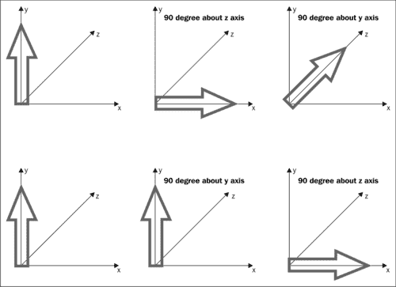
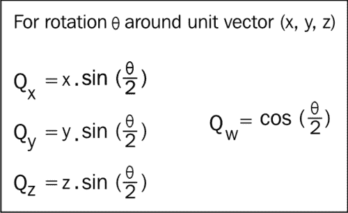
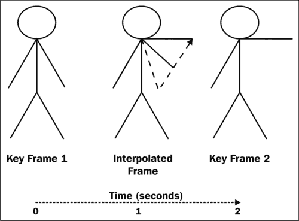
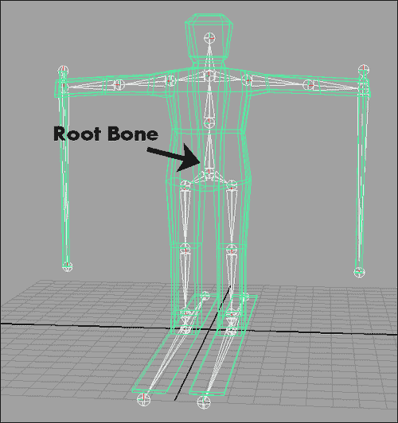
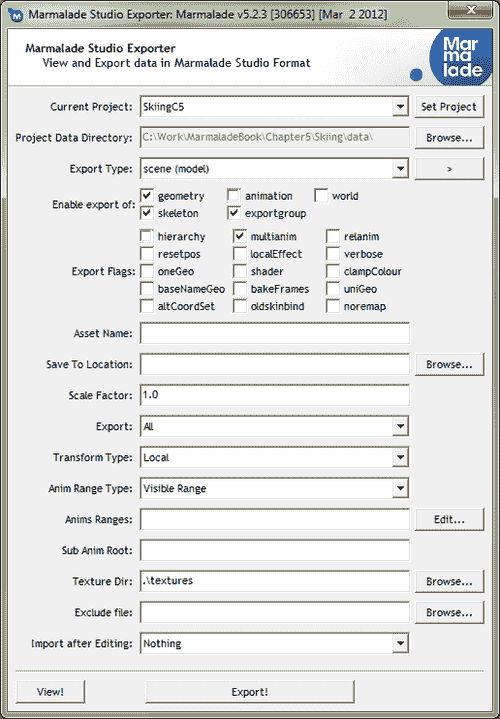
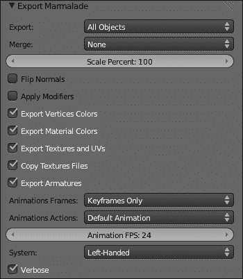
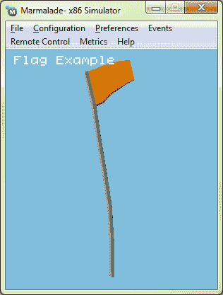
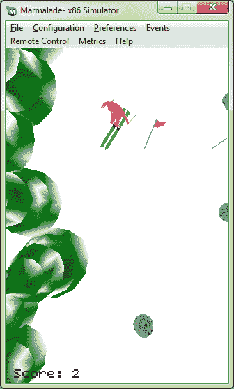

# 第五章：3D 图形动画

我们现在已经看到了如何创建 3D 模型并在屏幕上显示它，但我们目前限于非动画模型。当然，我们可以随意旋转或缩放，但当需要动画化比立方体更复杂的物体时，比如一个人物模型，这真的不够。

在本章中，我们将探讨以下主题：

+   3D 动画涉及概念快速概述

+   从 3D 建模软件包中导出动画

+   在 Marmalade 项目中加载和渲染导出的 3D 动画

# 3D 动画快速入门

让我们先看看 3D 模型动画的实现方式。

## 使用模型矩阵进行动画

到目前为止，最简单、最明显地动画化 3D 模型的方法是改变其位置、方向和大小。这三个属性都可以使用在渲染模型时设置的模型矩阵来指定。

我们可以在游戏类中存储一个矩阵，并为每一帧乘以一个表示位置、旋转和缩放变化的第二个矩阵；但这种方法通常不可靠。随着时间的推移，矩阵开始退化，这是由于涉及乘法和加法中的精度误差的累积效应。矩阵通常会变得非正交（即其三个轴不再相互垂直），这会对 3D 模型产生剪切效应。缩放也可能受到这些精度误差的影响，导致 3D 模型逐渐缩小！

一种更可靠的方法是将平移、旋转和缩放分别存储，并为每一帧计算一个新的矩阵。如何实现将在以下章节中描述。

### 通过平移进行动画

我们的游戏类只需要维护一个包含对象当前世界位置的位矢量的位置向量。我们可以通过添加一个速度向量来在游戏中移动对象，该向量指示游戏对象在本帧移动了多远以及朝哪个方向移动，相对于存储的位置向量。

要生成最终的模型矩阵，我们只需要将位置向量复制到矩阵的平移部分。我们通常在最后一步这样做，因为在生成旋转和缩放时乘以矩阵会影响矩阵的平移。

```swift
// lTimeStep is the time elapsed since the last frame (here we're
// setting it to the time interval required to run at 30 frames
// per second).
float lTimeStep = 1.0f / 30.0f;

// Calculate how far we've moved this frame and update position
CIwFVec3 lVelocityStep = mVelocity * lTimeStep;
mPosition += lVelocityStep;

// Copy the position into the matrix used to render the model
mModelMatrix.t = mPosition;
```

### 通过旋转进行动画

模型矩阵左上角的 3x3 部分指定了模型要绘制的旋转。我们的游戏对象存储所需的旋转并在每一帧更新它。当渲染时间到来时，我们只需使用存储的旋转来计算旋转矩阵。

存储对象旋转的方式有很多种。以下章节将展示三种最常见的方式。

#### 使用欧拉角进行旋转

**欧拉角**由 x、y 和 z 轴上所需的旋转角度组成，我们通常使用向量来存储这些角度。如果不需要围绕每个轴旋转，你可以选择只存储所需的旋转值。

欧拉角很容易可视化并实现，这也是为什么它们被广泛使用的原因。要将一组欧拉角转换为旋转矩阵，我们只需要为每个轴的旋转生成三个矩阵，然后将它们相乘。

然而，这正是欧拉角的问题所在。矩阵乘法的结果取决于矩阵乘法的顺序；因此，在使用欧拉角时，你必须仔细选择乘法顺序，这取决于你想要实现的目标。以下图表展示了如何说明这一点：



在图表中，我们正在旋转一个指向正 y 轴的箭头。在第一行中，我们首先围绕 z 轴旋转 90 度，然后围绕 y 轴旋转 90 度。箭头最终指向 z 轴。

在图表的第二行中，我们使用相同的原始箭头，但以相反的顺序应用旋转。正如你所看到的，这次箭头最终指向 x 轴的方向。

以下代码片段展示了如何构建用于应用 XYZ 顺序的欧拉角的完整旋转矩阵：

```swift
CIwFMat lMatXYZ;
lMatXYZ.SetRotX(xAngle);
lMatXYZ.PostRotateY(yAngle);
lMatXYZ.PostRotateZ(zAngle);
```

### 注意

Marmalade 中使用的所有角度都是以弧度指定的，而不是度。

#### 使用轴角对进行旋转

表示旋转的**轴角**方法需要存储方向向量和旋转角度。该向量表示我们希望对象朝向的方向，而角度允许对象绕该轴旋转。

当处理玩家角色时，我们可能会发现这种方式指定旋转很有用。例如，为了定位一个人类角色，我们可能会指定方向向量为正 y 轴，这样就可以使用旋转角度来改变角色的航向。

Marmalade 允许我们将轴角对转换为用于渲染的矩阵，如下所示：

```swift
CIwFVec3 lDir(0.0f, 1.0f, 0.0f);
float lAngle = PI / 2.0f;
CIwFMat lMat;
lMat.SetAxisAngle(lDir, lAngle);
```

#### 使用四元数的旋转

**四元数**是表示三维旋转的另一种方法，当你第一次遇到它时，可能会觉得有点令人震惊。我不会继续谈论四维超球体和让你的大脑部分融化，我只会提供一个快速指南，告诉你如何使用四元数。如果你想了解更多，我建议你在 Google 上搜索“四元数”!

四元数由四个分量组成：x、y、z 和 w。3D 旋转可以用**单位四元数**来表示，这与向量的表示方式类似，只是意味着所有四个分量的平方和的模长为 1。

两个单位四元数的乘法类似于两个旋转矩阵的乘法。结果表示第一个方向被第二个方向旋转，并且结果取决于你执行乘法的顺序。

四元数的大问题是它们几乎无法可视化。如果给出一个欧拉角或轴角对，大多数人可以在脑海中形成一个关于该旋转外观的图像，但对于四元数来说则不然。

四元数可以从旋转矩阵（以及因此欧拉角）和轴角对中相当容易地创建。以下图表显示了轴角对与四元数之间的关系：



四元数在骨骼角色 3D 动画中真正发挥其作用，这是我们将在本章后面讨论的主题。这是一种需要每次更新动画帧时计算大量旋转的技术，幸运的是，四元数在内存使用和执行速度方面都使这一过程更加高效。

虽然四元数的理论对于我们这些凡人可能有点可怕，但实际上我们几乎没有必要担心数学问题，因为 Marmalade 为我们提供了一个四元数类，`CIwFQuat`，我们可以使用。例如，可以从轴角对创建四元数，然后从中生成旋转矩阵，如下所示：

```swift
CIwFQuat lQuat;
lQuat.SetAxisAngle(1.0f, 0.0f, 0.0f, PI / 2.0f);
CIwFMat lMat(lQuat);
```

### 通过缩放动画

缩放因子通常存储为包含 x、y 和 z 轴所需大小的向量，或者作为应用于每个轴的单个缩放值。通常后者就足够了，因为当模型在每个轴上不均匀缩放时，它们看起来会很奇怪。

缩放矩阵的创建非常简单，因为你只需将 x、y 和 z 轴所需的缩放因子放置在矩阵 3x3 旋转部分的从左上角到右下角的对角线上。所有其他单元格都保留为零。

由于创建缩放矩阵非常简单，`CIwFMat`类不包含创建通用缩放矩阵的方法。然而，它确实提供了一些快捷方法，使得通过相同的缩放因子在每个轴上缩放矩阵变得容易。以下代码片段提供了一个示例：

```swift
CIwFMat lMat;
lMat.SetRotX(PI / 2.0f);
lMat.ScaleRot(2.0f);
```

此代码将创建一个围绕 x 轴旋转 90 度的旋转矩阵，然后仅将矩阵的旋转部分按因子二放大。你也可以选择仅放大矩阵的平移部分，或者使用`ScaleTrans`和`Scale`方法分别放大旋转和平移。

## 3D 模型动画

模型矩阵动画当然非常重要，因为没有它我们就无法在游戏世界中定位和移动我们的 3D 模型；但仅凭这一点并不能使游戏看起来最吸引人。

大多数游戏需要更多。例如，我们可能希望一个人类或动物角色行走、奔跑、跳跃或执行其他类型的动作。理想情况下，我们需要一种方法使 3D 模型的整体形状随时间变化。

以下章节将解释我们如何实现这一点。

### 使用形态目标

3D 模型动画的一个简单方法是使用**形态目标**。为此，我们改变 3D 模型的顶点位置以生成动画的**关键帧**。关键帧只是模型的一组特定顶点位置，它是整体动画的重要组成部分，例如，角色行走时腿部移动的各种位置。关键帧还与时间相关联。

下图展示了一个非常简单的例子，一个木偶人举起手臂。**关键帧 1**在时间索引**0**秒时手臂处于下垂位置，而**关键帧 2**在时间索引**2**秒时手臂被举起。这些关键帧可以被视为独立导出的 3D 模型。



如果我们想要回放这个动画，我们可以在正确的时间绘制相关的 3D 模型，但这会产生非常生硬的结果，类似于 2D 位图动画。相反，我们可以在**0**到**2**秒之间的任何时间索引计算**插值帧**，以获得更平滑的结果。

计算插值帧的过程足够简单。我们从第一个关键帧中的每个顶点计算出与第二个关键帧中相应顶点的**delta 向量**。然后，我们将 delta 向量按我们想要计算的索引时间与两个关键帧之间总时间的比例进行缩放，并将缩放后的结果加到第一个关键帧中顶点的位置上。

在图中，我们想要计算时间索引**1**秒的插值帧，因此我们将 delta 向量按一半的比例缩放。最终结果将是手臂半举起时的帧。

这种方法可能易于实现，但最终我们发现它存在一些问题，如下所述：

+   结果动画的准确性：仔细观察前图中木偶人的插值帧，你会发现木偶人的手臂实际上变短了。这是因为我们正在以直线方式插值顶点位置，而实际上我们需要末端顶点围绕肩部点旋转。

+   所需的关键帧数量：为了制作高质量的动画，我们需要存储大量关键帧。在我们的木偶人动画示例中，我们可以提供额外的关键帧，从而最小化手臂缩短效果。然而，由于我们需要存储模型中每个顶点的位置，无论其是否移动，这很快就会变成大量数据。

+   确保顶点顺序在关键帧之间不发生变化的必要性：我们能够可靠地实现形变目标动画的唯一方法是在每个关键帧中，模型中的每个顶点在顶点流中都处于相同的位置。当从建模软件导出 3D 模型时，顶点流顺序可能会在帧之间发生变化，这会导致我们的动画在顶点在完全错误的位置之间插值时表现不正确。

由于上述原因，Marmalade 不支持形变目标动画，尽管如果你愿意，实现这种方法相当简单。形变目标对于面部动画等任务仍然非常有用，随着移动设备性能的不断提高，这可能会很快成为移动游戏中的更常见功能。

### 使用骨骼动画

大多数 3D 视频游戏都会使用骨骼动画系统来实现 3D 模型的动画。这种方法通过允许动画师设置虚拟骨骼的骨骼结构，然后可以使用这些骨骼来变形 3D 模型的顶点。3D 模型本身通常被称为动画的**皮肤**。

要设置骨骼动画，第一步是使用 3D 建模软件创建你想要动画化的 3D 模型，并使其处于**绑定姿态**。绑定姿态通常选择为便于访问模型中每个多边形进行纹理和着色，以及布置骨骼的位置。对于人类角色来说，这通常意味着手臂从身体水平伸展出去的姿态，脚部相隔一段短距离。

在创建绑定姿态后，动画师开始进行**绑定**过程。这涉及到通过放置骨骼将骨骼添加到模型中。骨骼被链接在一起形成**层次结构**；因此，每当移动一个骨骼时，所有与其链接的子骨骼也会移动。最终，在层次结构中会有一个顶级父骨骼，这被称为**根骨骼**。

为了性能考虑，最好将骨骼数量保持在最小，但这也必须与保证足够数量以实现高质量动画的需求相平衡。以下图表显示了在我们示例游戏项目中使用的 3D 滑雪角色在被绑定后的样子：



骨骼布局完成后，下一步是将皮肤（换句话说，多边形的网格）绑定到骨骼上。这是通过允许 3D 模型的每个顶点被一个或多个骨骼修改来实现的。

如果一个顶点映射到多个骨骼，也会为每个骨骼定义一个权重，以确定它对顶点的影响程度。权重范围从零到一，特定顶点的所有权重的总和应该等于一。

大多数 3D 建模软件都会在自动执行绑定过程时有一个良好的尝试，但通常动画师需要对绑定进行一些调整，以确保当骨骼移动时，皮肤能够正确地动画化。

完成所有这些后，动画师就可以通过旋转和移动骨骼来定义所需的关键帧位置，从而让角色做他们想做的任何事情，就像使用变形目标一样。骨骼系统将产生最终动画的更好质量，并且存储关键帧所需的内存量通常不会太大，因为需要存储的只是每个骨骼的朝向和位置。

Marmalade SDK 配备了一个骨骼动画系统，我们将在本章的剩余部分学习它。该系统非常灵活，几乎没有限制。

需要注意的主要事项是，你只能有一个根骨骼，总共最多 256 个骨骼，并且每个顶点最多只能受到四个骨骼的影响。在大多数情况下，这些限制不太可能给你带来任何问题。

# 使用 3D 建模软件创建动画数据

已经有整本书籍专门讲解如何最好地创建 3D 动画角色；因此，不出所料，我们在这里不会探讨如何实际制作动画 3D 模型。实际上，我在上一章关于“程序员艺术”的警告可能对“程序员动画”来说加倍适用。为了支持这个说法，请看看本书示例程序中的图形，这些都是我亲自制作的“程序员艺术”的例子。我真的应该听从自己的建议。

无论如何，希望这个提示现在已经深入人心，让我们看看如何从 3D 建模软件中导出动画数据。

导出动画需要导出多种新文件类型。这些将在稍后详细讨论，但简而言之，它们是代表骨骼、皮肤以及实际动画本身的文件。以下各节将展示如何导出这些数据。

## 使用 Marmalade 3D 导出插件导出动画

如果你使用 3DS Max 或 Maya 来创建你的动画，所需的动画文件将通过 Marmalade 导出插件导出。为了刷新你的记忆，以下截图显示了导出插件窗口：



要导出动画，只需将其加载到你的建模软件中，并按照以下步骤操作：

1.  设置导出选项的方式与导出静态模型时相同。如果你忘记了各种选项是什么，请查看第四章中的步骤列表，“3D 图形渲染”。现在，我们将查看额外的动画特定选项。

1.  确保在标记为**启用导出**的组中仅勾选**几何**、**骨骼**和**exportgroup**复选框。

1.  您现在可以点击**导出！**按钮以写入模型的 GEO、MTL 和 GROUP 文件。还将导出两种新文件类型，即 SKEL 和 SKIN 文件，正如您可能猜到的，它们代表模型的骨骼和皮肤信息。

这些步骤中导出的文件对于动画模型是必要的，但它们实际上并不包含任何动画数据。以下是获取描述模型实际动画方式的数据的方法：

1.  返回导出插件窗口，并点击**导出类型**组合框右侧的按钮。应该出现一个弹出菜单，您应从中选择**anim**选项。

1.  **启用导出**部分中的复选框应更改，以便仅勾选**动画**复选框。

1.  在**导出标志**部分，如果您场景中有多个动画要导出，可以选择**multianim**复选框。请注意，每个动画应为相同的 3D 模型。

1.  **动画范围类型**选项可以取三个可能值之一。默认值为**可见范围**，它将仅导出在建模包中动画轨道栏上当前可见的帧的范围。下一个选项是**单个动画范围**，它将仅导出每个动画的第一个和最后一个关键帧之间的动画数据。最后一个选项**完整范围**仅在 Maya 中可用。它将导出整个动画，无论是否在动画轨道栏上设置了帧范围。

1.  **动画范围**选项允许您将一个大的动画序列拆分成几个较小的动画。如果您点击**编辑…**按钮，将显示刚刚看到的对话框。使用**添加**按钮创建一个新的动画范围，使用**名称**文本框命名动画，然后拖动滑块设置动画的**开始**和**结束**帧。使用**删除**按钮从列表中删除一个动画范围。**完成**按钮将关闭对话框并接受所做的任何更改，而**取消**按钮将在关闭对话框之前丢弃所做的任何更改。

1.  影响动画导出的最后一个选项是**子动画根**文本框。您可以输入骨骼中一个骨骼的名称，并且动画数据将仅为此骨骼及其子项导出。我们将在本章后面了解更多关于子动画的内容。

1.  在导出插件中设置好所有与动画相关的选项后，只需点击**导出！**按钮即可输出一个或多个 ANIM 文件。导出的文件数量取决于场景中动画的数量、**multianim**复选框的状态以及是否使用了**动画范围**选项。

## 使用 Blender 插件导出动画

您还可以使用 Blender 插件导出动画。Blender 中用于动画的术语有些不寻常，因为 Blender 将骨骼称为**骨架**，但除此之外，动画的方法是相同的。



以下是您应遵循的步骤以从 Blender 导出动画模型：

1.  将您希望导出的动画加载到 Blender 中，然后转到**文件** | **导出** | **Marmalade 跨平台应用程序 (.group**)以显示导出选项屏幕。提醒一下，导出选项在之前的屏幕截图中已显示，但请参考第四章中列出的步骤，*3D 图形渲染*，以获取有关标准模型导出设置的更多信息。

1.  要告诉导出器写入所有不同的动画文件类型，请确保选中**导出骨架**复选框。

1.  **动画帧**组合框包含三个选项。**无**将不导出任何动画数据，**仅关键帧**将仅导出动画的关键帧数据（这是您通常会选择的选项），而**完整动画**将导出每帧的数据，无论它是否是关键帧（这通常被称为“烘焙”动画，意味着您将获得建模软件包中看到的精确动画，但代价是动画内存占用增加）。

1.  **动画动作**组合框包含两个设置。**默认动画**将仅导出已选为骨架默认值的动画。另一个选项是**所有动画**，这将导出为骨架定义的所有动画。

1.  最后的设置是**动画帧率**值。这决定了动画每秒的播放速度，因此可以通过更改此值来加快或减慢动画的播放速度，而无需更改所有关键帧的时间。

1.  要导出数据，请确保您已在屏幕顶部的框中输入了文件位置和名称，然后单击**导出 Marmalade**按钮。

# Marmalade 3D 动画文件格式

我们现在可以从我们选择的 3D 建模软件包中导出动画数据，但在我们实际使用它们之前，让我们快速查看我们刚刚生成的新文件类型。

## SKEL 文件

**SKEL 文件**包含有关我们动画骨骼的所有信息。文件首先定义了一个`CIwAnimSkel`类的实例，这是一个多个`CIwAnimBone`实例的包装器。

`CIwAnimSkel`实例是从`CIwResource`类派生出来的，因此它有一个与之关联的名称，以便可以在资源管理器中查找。实例的名称取自 SKEL 文件的文件名，而 SKEL 文件的名称又来自骨骼的根骨骼名称。

每个`CIwAnimBone`实例都有一个与之关联的名称、位置和旋转，这定义了动画的绑定姿势。位置只是一个模型空间中的向量，而旋转则以四元数的形式存储。除了根骨骼之外，每个骨骼还会列出其父骨骼，从而构建骨骼层次结构。

SKEL 文件与 GEO 和 MTL 文件一起导出到`models`子目录中。以下是一个 SKEL 文件的示例：

```swift
CIwAnimSkel
{
  numBones 12
  CIwAnimBone
  {
    name "FlagPoleBase"
    pos {-0.38309,-1.27709,0}
    rot {0.70711,0,0,0.70711}
  }
  CIwAnimBone
  {
    name "PoleA"
    parent "FlagPoleBase"
    pos {258.20248,0.00000,0}
    rot {1,0,0,0}
  }
  CIwAnimBone
  {
    name "PoleB"
    parent "PoleA"
    pos {255.88675,0.00000,0}
    rot {1.00000,0,0,-0.00200}
  }
  CIwAnimBone
  {
    name "PoleC"
    parent "PoleB"
    pos {257.60138,-0.00000,0}
    rot {0.00000,0.99998,0.00615,0.00000}
  }
  CIwAnimBone
  {
    name "PoleD"
    parent "PoleC"
    pos {255.08751,-0.00000,-0.00000}
    rot {0.00000,0.99998,0.00621,0.00000}
  }
  CIwAnimBone
  {
    name "PoleE"
    parent "PoleD"
    pos {257.19775,0.00000,-0.00000}
    rot {1.00000,0,0,0.00206}
  }
  CIwAnimBone
  {
    name "FlagStart"
    parent "PoleE"
    pos {152.41219,0.00000,-0.00000}
    rot {0.61894,0,0,-0.78544}
  }
  CIwAnimBone
  {
    name "FlagA"
    parent "FlagStart"
    pos {85.99931,-0.00000,-0.00000}
    rot {0.99505,0,0,0.09934}
  }
  CIwAnimBone
  {
    name "FlagB"
    parent "FlagA"
    pos {57.19376,0.00000,-0.00000}
    rot {1.00000,0,0,0.00128}
  }
  CIwAnimBone
  {
    name "FlagC"
    parent "FlagB"
    pos {61.42473,0.00000,-0.00000}
    rot {0.99996,0,0,0.00846}
  }
  CIwAnimBone
  {
    name "FlagD"
    parent "FlagC"
    pos {60.33911,0,-0.00000}
    rot {0.99996,0,0,-0.00877}
  }
  CIwAnimBone
  {
    name "FlagE"
    parent "FlagD"
    pos {60.36695,-0.00000,-0.00000}
    rot {0.99985,0,0,0.01754}
  }
}
```

## SKIN 文件

**SKIN 文件**是骨骼和 3D 模型绑定姿势中顶点之间的桥梁。它包含所有表示哪些顶点受哪些骨骼影响的数据。

文件首先定义了`CIwAnimSkin`类的一个实例。此实例包含对定义所需骨骼的`CIwAnimSkel`实例的引用，以及用于在计算新顶点位置后渲染模型的`CIwModel`实例。与 SKEL 文件一样，`CIwAnimSkin`实例的名称是从 SKIN 文件的文件名派生的。

文件随后包含多个`CIwAnimSkinSet`类的实例，这表明哪些顶点被哪些骨骼修改。这是通过首先列出骨骼（最多四个），然后列出集合中的顶点数量来实现的。然后，通过提供模型顶点流中顶点的索引，随后为每个骨骼提供一个权重值，为每个顶点指定骨骼权重。每个顶点的权重值之和必须总计为 1。

SKIN 文件也导出到`models`子目录，以下代码提供了一个部分示例。这些文件由于需要大量数据，即使是简单的动画也会相当大，因此提取应该足以提供这些文件的外观。

```swift
CIwAnimSkin
{
  skeleton "FlagPoleBase"
  model "Flag"
  CIwAnimSkinSet
  {
    useBones { FlagPoleBase }
    numVerts 16
    vertWeights {0,1}
    vertWeights {1,1}
    vertWeights {2,1}
    vertWeights {3,1}
    vertWeights {4,1}
    vertWeights {35,1}
    vertWeights {58,1}
    vertWeights {60,1}
    vertWeights {62,1}
    vertWeights {64,1}
    vertWeights {65,1}
    vertWeights {90,1}
    vertWeights {91,1}
    vertWeights {92,1}
    vertWeights {93,1}
    vertWeights {94,1}
  }
  CIwAnimSkinSet
  {
    useBones { FlagPoleBase PoleA }
    numVerts 10
    vertWeights {5,0.50170,0.49830}
    vertWeights {6,0.50251,0.49749}
    vertWeights {7,0.50177,0.49823}
    vertWeights {8,0.50116,0.49884}
    vertWeights {9,0.50114,0.49886}
    vertWeights {57,0.50251,0.49749}
    vertWeights {59,0.50177,0.49823}
    vertWeights {61,0.50116,0.49884}
    vertWeights {63,0.50114,0.49886}
    vertWeights {66,0.50170,0.49830}
  }

// Several more CIwAnimSkinSet instances would have been
// defined here but they have been left out to avoid
// filling the book with boring numbers!

  CIwAnimSkinSet
  {
    useBones { FlagA FlagB FlagC FlagD }
    numVerts 8
    vertWeights {39,0.15992,0.33285,0.33292,0.17431}
    vertWeights {44,0.15632,0.33444,0.33462,0.17462}
    vertWeights {49,0.17817,0.32895,0.32812,0.16476}
    vertWeights {54,0.18163,0.32749,0.32638,0.16450}
    vertWeights {106,0.15632,0.33444,0.33462,0.17462}
    vertWeights {112,0.17817,0.32895,0.32812,0.16476}
    vertWeights {120,0.18163,0.32749,0.32638,0.16450}
    vertWeights {121,0.15992,0.33285,0.33292,0.17431}
  }
  CIwAnimSkinSet
  {
    useBones { FlagB FlagC FlagD FlagE }
    numVerts 20
    vertWeights {40,0.14751,0.34532,0.34603,0.16114}
    vertWeights {41,0.02763,0.13480,0.41879,0.41879}
    vertWeights {45,0.14368,0.34743,0.34842,0.16046}
    vertWeights {46,0.02625,0.13072,0.42151,0.42151}
    vertWeights {50,0.16232,0.34459,0.34444,0.14865}
    vertWeights {51,0.03730,0.16777,0.39776,0.39717}
    vertWeights {55,0.16581,0.34255,0.34229,0.14936}
    vertWeights {56,0.03875,0.17110,0.39544,0.39471}
    vertWeights {102,0.02763,0.13480,0.41879,0.41879}
    vertWeights {103,0.02625,0.13072,0.42151,0.42151}
    vertWeights {107,0.14368,0.34743,0.34842,0.16046}
    vertWeights {108,0.02625,0.13072,0.42151,0.42151}
    vertWeights {109,0.03730,0.16777,0.39776,0.39717}
    vertWeights {113,0.16232,0.34459,0.34444,0.14865}
    vertWeights {114,0.03730,0.16777,0.39776,0.39717}
    vertWeights {115,0.03875,0.17110,0.39544,0.39471}
    vertWeights {122,0.16581,0.34255,0.34229,0.14936}
    vertWeights {123,0.14751,0.34532,0.34603,0.16114}
    vertWeights {124,0.03875,0.17110,0.39544,0.39471}
    vertWeights {125,0.02763,0.13480,0.41879,0.41879}
  }
}
```

## ANIM 文件

我们需要考虑的最后一个文件类型是**ANIM 文件**，正如其名称所暗示的，这是定义特定动画的实际文件。

文件首先声明了`CIwAnim`类的一个实例，与其他动画类类型一样，将给出一个从文件名派生的资源名称。

这个动画将要应用到的骨骼是`CIwAnim`实例首先指定的内容。然后是多个`CIwAnimKeyFrame`声明，详细说明了在特定时间索引下每个受影响骨骼的位置和方向。

关键帧不需要列出骨骼中每个骨骼的朝向和位置。如果一个骨骼相对于其父骨骼没有移动，其位置将保持与上一个关键帧相同。

导出器将创建一个`anims`子目录来保存所有 ANIM 文件。以下代码提供了一个 ANIM 文件的示例；但与 SKIN 文件一样，这只是一个部分示例，以免使这本书的页面充满大量数字：

```swift
CIwAnim
{
  skeleton "FlagPoleBase"
  // Keyframe# 1
  CIwAnimKeyFrame
  {
    time 0
    bone "FlagPoleBase"
    pos {-0.38309,-1.27709,0}
    rot {0.70711,0,0,0.70711}

    bone "PoleA"
    pos {258.20248,0.00000,0}
    rot {1,0,0,0}

    bone "PoleB"
    pos {255.88675,0.00000,0}
    rot {1.00000,0,0,-0.00200}

    bone "PoleC"
    pos {257.60138,-0.00000,0}
    rot {0.00000,0.99998,0.00615,0.00000}

    bone "PoleD"
    pos {255.08751,-0.00000,-0.00000}
    rot {0.00000,0.99998,0.00621,0.00000}

    bone "PoleE"
    pos {257.19775,0.00000,-0.00000}
    rot {1.00000,0,0,0.00206}

    bone "FlagStart"
    pos {152.41219,0.00000,-0.00000}
    rot {0.61894,0,0,-0.78544}

    bone "FlagA"
    pos {85.99931,-0.00000,-0.00000}
    rot {0.99505,0,0,0.09934}

    bone "FlagB"
    pos {57.19376,0.00000,-0.00000}
    rot {1.00000,0,0,0.00128}

    bone "FlagC"
    pos {61.42473,0.00000,-0.00000}
    rot {0.99996,0,0,0.00846}

    bone "FlagD"
    pos {60.33911,0,-0.00000}
    rot {0.99996,0,0,-0.00877}

    bone "FlagE"
    pos {60.36695,-0.00000,-0.00000}
    rot {0.99985,0,0,0.01754}

  }
  // Keyframe# 5
  CIwAnimKeyFrame
  {
    time 0.16667
    bone "FlagPoleBase"
    pos {-0.38309,-1.27709,0}
    rot {0.73026,0,0,0.68317}

    bone "PoleA"
    pos {258.20248,0.00000,0}
    rot {0.99889,0,0,-0.04716}

    bone "PoleB"
    pos {255.88675,0.00000,0}
    rot {0.99864,0,0,-0.05222}

    bone "PoleC"
    pos {257.60138,-0.00000,0}
    rot {0.00000,0.99857,-0.05338,0.00000}

    bone "PoleD"
    pos {255.08751,-0.00000,-0.00000}
    rot {0.00000,0.99624,0.08662,-0.00000}

    bone "PoleE"
    pos {257.19775,0.00000,-0.00000}
    rot {0.99483,0,0,-0.10158}

  }
  // Keyframe# 15
  CIwAnimKeyFrame
  {
    time 0.58333
    bone "FlagPoleBase"
    pos {-0.38309,-1.27709,0}
    rot {0.70668,0,0,0.70754}

    bone "PoleA"
    pos {258.20248,0.00000,0}
    rot {0.99873,0,0,0.05033}

    bone "PoleB"
    pos {255.88675,0.00000,0}
    rot {0.99775,0,0,0.06711}

    bone "PoleC"
    pos {257.60138,-0.00000,0}
    rot {0.00000,0.99951,0.03144,-0.00000}

    bone "PoleD"
    pos {255.08751,-0.00000,-0.00000}
    rot {0.00000,0.99996,0.00868,0.00000}

    bone "PoleE"
    pos {257.19775,0.00000,-0.00000}
    rot {0.99853,0,0,0.05420}

  }
  // Further key frames follow to define the remainder of the
  // animation but these have been removed to avoid including
  // large amounts of datafile in the pages of this book
}
```

# 加载和渲染导出的 3D 动画

我们现在可以开始渲染 3D 动画了，就像渲染静态 3D 模型一样，这出奇地简单。

## 将 IwAnim API 添加到项目中

在我们能够使用 Marmalade 的动画功能之前，我们首先需要将 IwAnim API 添加到我们的项目中。这个 API 建立在渲染静态 3D 模型所需的 IwGraphics API 之上。

与所有此类 Marmalade API 一样，我们通过在 MKB 文件的`subprojects`部分列出`iwanim`来为一个项目添加对 IwAnim 的支持。然后我们必须在调用`IwGraphicsInit`之后调用`IwAnimInit`，在关闭时需要调用`IwAnimTerminate`。

## 加载和访问 3D 动画

GROUP 文件格式再次帮助我们，以便将动画数据加载到内存中。导出过程已经为我们创建了一个包含 GEO、MTL、SKEL 和 SKIN 文件的 GROUP 文件，因此我们只需为我们要使用的 ANIM 文件添加条目。

在 GROUP 文件中引用所有内容后，我们只需使用资源管理器将其加载到内存中，然后以与我们处理任何其他资源相同的方式访问资源。

以下代码片段说明了我们如何加载 GROUP 文件，然后访问渲染动画 3D 模型所需的资源：

```swift
CIwResGroup* lpFlagGroup = IwGetResManager()->
  LoadGroup("Flag/Flag.group");
CIwModel* lpFlag = static_cast<CIwModel*>(lpFlagGroup->
  GetResNamed("Flag", "CIwModel"));
CIwAnimSkel* lpSkel = static_cast<CIwAnimSkel*>(lpFlagGroup->
  GetResNamed("FlagPoleBase", "CIwAnimSkel"));
CIwAnimSkin* lpSkin = static_cast<CIwAnimSkin*>(lpFlagGroup->
  GetResNamed("Flag", "CIwAnimSkin"));
CIwAnim* lpFlagWobble = static_cast<CIwAnim*>(lpFlagGroup->
  GetResNamed("FlagWobble", "CIwAnim"));
```

好的，现在我们已经将资源加载到内存中，我们需要对它们做些什么。

## 播放 3D 动画

为了播放动画，我们需要让 Marmalade 知道我们想要播放哪个动画，播放速度应该是多少，以及我们是否想要它是一次性播放还是循环播放。所有这些以及更多都是由`CIwAnimPlayer`类提供的。

在创建`CIwAnimPlayer`的新实例后，我们必须提供动画所需的骨骼实例的指针。这如下所示：

```swift
CIwAnimPlayer* lpAnimPlayer = new CIwAnimPlayer;
lpAnimPlayer->SetSkel(lpSkel);
```

玩家对象现在已准备好开始动画，所以我们只需传递我们想要播放的动画的详细信息。这只需一行代码即可完成：

```swift
lpAnimPlayer->PlayAnim(lpFlagWobble, 1.0f,
                       CIwAnimBlendSource::LOOPING_F, 0.0f);
```

`PlayAnim`方法首先接受我们想要播放的`CIwAnim`实例的指针。然后它期望看到播放速度、一些控制标志和一个混合间隔。

播放速度被指定，使得值为`1`产生正常导出的动画速度。将此值加倍将使动画以两倍速度播放，依此类推。

函数的第三个参数是一组控制标志，主要用于指示动画在达到最后一个关键帧时是否应该循环。如果需要循环，应使用标志`CIwAnimBlendSource::LOOPING_F`。

`CIwAnimBlendSource`定义了多个其他值，但其中大部分是用于只读状态标志的，`CIwAnimPlayer`类提供了其他方法，应该用来确定当前状态。因此，在这个方法中唯一将使用的其他标志是`CIwAnimBlendSource::RESET_IF_SAME_F`，这将强制动画播放器重新启动指定的动画，如果它已经是当前动画。如果将正在播放的动画传递给`PlayAnim`方法，除非使用此标志，否则请求将被忽略。

动画播放器现在已初始化，所以最后必须做的事情是指示它计算所需的动画帧。这是通过在主游戏循环的每次迭代中调用`CIwAnimPlayer`实例的`Update`方法来完成的，如下代码所示：

```swift
lpAnimPlayer->Update(lTimeStep);
```

`lTimeStep`参数是一个`float`类型的值，表示当前动画状态应该前进的时间量（以秒为单位）。当这个调用完成后，将创建一个骨骼副本，所有骨骼都将正确定位和旋转，以便渲染当前动画帧。

## 渲染 3D 动画

随着动画播放器现在愉快地更新，最后一步是将动画模型渲染出来。这可能整个过程中最简单的一部分，如下代码所示：

```swift
IwGxSetViewMatrix(&lViewMatrix);
IwGxSetModelMatrix(&lModelMatrix);

IwAnimSetSkelContext(lpAnim->GetSkel());
IwAnimSetSkinContext(lpSkin);

lpFlag->Render();

IwAnimSetSkelContext(NULL);
IwAnimSetSkinContext(NULL);
```

希望其中大部分对你来说已经很熟悉了。第一步是设置我们想要用于渲染的视图和模型矩阵。然后我们需要提供一些关于动画帧的信息，即动画骨骼和皮肤数据。

骨骼信息由`CIwAnimPlayer`实例维护，可以使用`GetSkel`方法检索。皮肤只是由资源管理器加载的`CIwAnimSkin`实例。我们使用`IwAnimSetSkelContext`和`IwAnimSetSkinContext`函数将此数据提供给渲染引擎。

要将动画模型渲染到屏幕上，我们只需在`lpFlag`上调用`Render`方法，`lpFlag`是一个指向`CIwModel`实例的指针，就像我们渲染没有动画的模型一样。

渲染完成后，我们清除皮肤和骨骼上下文，这样未来的模型渲染调用就不会在渲染过程中尝试使用错误的数据。养成这个习惯是好的，因为确定一个未动画模型突然开始剧烈变形的原因可能是一个棘手的错误，难以追踪。

# 进一步探索 3D 动画

恭喜！你现在能够渲染全动画的 3D 模型了！虽然这是一个相当酷的成就，但我们迄今为止看到的功能只是 IwAnim API 允许我们做的表面功夫。以下章节描述了一些我们可用的其他功能。

## 反向播放动画

有时候能够播放动画倒放是有用的。例如，想象一个角色跪下来检查一个物体。而不是创建一个全新的动画来让他们再次站起来，我们只需播放跪下的动画倒放即可。

通过将负动画速度传递给`PlayAnim`调用，可以简单地实现动画倒放，因此`-1`的值将以正常速度倒放动画。

## 动画之间的混合

在两个动画之间转换时，我们通常不希望直接跳转到新序列的开始，因为这可能导致当前动画帧和新动画第一帧之间出现明显的跳跃。我们可以通过在动画之间混合来解决这个问题。

我们在首次介绍`PlayAnim`方法时提到了如何实现这一点。此方法中的最后一个参数是混合时间，它以秒为单位使用浮点数指定。

通过指定非零混合间隔，动画播放器将计算旧动画和新动画所需的动画帧，然后在指定的时间内通过在这两个帧之间插值来生成第三个过渡帧。过渡帧是随后用于绘制 3D 模型的帧。一旦混合间隔结束，原始动画将停止计算，因为它不再需要。

## 检测动画播放事件

能够检测动画是否循环或播放完成非常重要，因为我们可以开始将动画链接在一起或防止用户在动画完成之前执行任务。例如，想象一个玩家需要重新装填武器，并播放一个动画来展示这个过程。我们需要知道动画何时完成，以便允许玩家再次开始攻击。

`CIwAnimPlayer`类允许我们通过调用`IsCurrentAnimComplete`方法来检测一次性动画是否完成，当动画播放完毕时，该方法将返回`true`。

此外，还有`IsCurrentBlendComplete`方法，当动画播放器完成两个动画之间的混合时，将返回`true`。

检测动画是否循环也是可能的，尽管`CIwAnimPlayer`没有提供快速检测此事件的快捷方式。相反，我们必须进行一些手动标志测试。

在任何时刻，动画播放器都可以更新两个主要动画：当前动画（定义为最后使用`PlayAnim`方法指定的动画）和上一个动画（在`PlayAnim`上次调用时带有混合间隔正在播放的动画）。

这两个动画的当前状态存储在`CIwAnimBlendSource`类的实例中，我们可以通过名为`GetSourceCurr`和`GetSourcePrev`的`CIwAnimPlayer`类方法来访问它们。`CIwAnimBlendSource`类有一个名为`GetFlags`的方法，它返回以位掩码形式表示的播放状态信息。要检测动画是否循环，我们只需查看标志`CIwAnimBlendSource::LOOPED_F`是否设置。以下源代码展示了这一操作：

```swift
if (lpAnimPlayer->GetSourceCurr()->GetFlags() &
                      CIwAnimBlendSource::LOOPED_F)
{
  // Animation has looped!
}
```

如果您喜欢这种方法，您还可以使用标志`CIwAnimBlendSource::COMPLETE_F`来检测单次动画何时完成。

## 优化动画播放

你还记得我们是通过调用`CIwAnimPlayer`的`Update`方法来计算当前动画帧的吗？这个方法必须做很多事情，其中一些我们可能实际上不需要在每一帧都做。例如，如果一个游戏中的角色当前不在屏幕上可见，我们可能想要确保我们仍然可以遍历其动画；但是，计算当前动画帧的骨骼位置是浪费处理器时间，因为我们不会渲染动画。

`Update`方法实际上是通过调用`CIwAnimPlayer`的另外三个方法来实现的，如果我们愿意，可以独立调用这些方法。

第一个方法是`UpdateParameters`，它将我们需要更新动画的时间增量作为其唯一的参数。此方法将更新动画播放器当前正在使用的所有动画的时间索引，并设置标志以指示那些动画是否已完成或循环。

`UpdateSources`方法不接受任何参数，用于计算每个动画的当前骨骼方向，并根据需要应用动画之间的混合。

最后是`UpdateMatrices`方法，它同样不需要任何参数。这个方法执行将每个骨骼的位置和方向转换为用于在渲染过程中更新 3D 模型顶点流的矩阵的最终步骤。

这些方法需要按照之前呈现的顺序调用，但如果不需要计算该方法的输出结果，则不需要在每一帧都调用所有三个方法。

## 播放子动画

**子动画**允许我们仅对整个骨骼的一部分进行动画处理，这在我们需要游戏中的角色能够同时执行两个不同的动作时非常有用。例如，一个角色可能在游戏世界中移动时能够挥舞几种不同的武器。应用于角色的主要动画将是一个行走、跑步或仅静止不动的动画。然后，子动画可以叠加在主要动画之上，以显示玩家持有、射击或重新装填不同类型的武器。

为了导出子动画，我们只需在 Marmalade 导出插件中的**子动画根**字段中指定子动画的根骨骼名称。在之前给出的示例情况下，你可能会选择从有两个手臂骨骼作为子节点的骨骼开始导出子动画。

不幸的是，Blender 插件目前不支持此功能，尽管您可能可以导出整个动画，然后在 ANIM 文件中手动删除对子动画根骨骼以上层次骨骼的任何引用。

子动画导出后，要播放它，我们只需调用`CIwAnimPlayer`的`PlaySubAnim`方法。此函数的使用示例如下：

```swift
lpAnimPlayer->PlaySubAnim(0, lpFlagWave, 1.0f,
CIwAnimBlendSource::LOOPING_F, 0.0f);
```

如您所见，它在结构上几乎与`PlayAnim`方法相同。唯一的区别是额外的初始参数，即子动画索引号。动画播放器可以同时支持两个不同的子动画，索引号应为`0`或`1`，以指示您希望更改哪个子动画。

要检测子动画的当前播放状态，我们可以通过`CIwAnimPlayer`的`GetSourceSub`方法获取`CIwAnimBlendSource`实例。此方法接受一个参数，即所需子动画的索引号。

## 偏移动画

当处理导致游戏角色移动的动画，如行走、奔跑或进行攻击动作时，我们希望根据正在播放的动画更新角色的位置，以便角色的脚看起来不会在地面上滑动。

Marmalade 提供了一种通过**偏移动画**来实现此功能的方法，这是一种由单个骨骼组成的动画，其位置和旋转可以用来在游戏世界中移动对象。偏移动画使用与其他动画相同的导出过程进行导出。

要使用偏移动画，我们使用`CIwAnimPlayer`的`PlayOfsAnim`方法，如下面的代码所示：

```swift
lpAnimPlayer->PlayOfsAnim(lpMovementAnim, 1.0f, 0);
```

此函数的参数是指向偏移动画实例的指针、播放速度（再次，值为`1`将以正常速度播放），以及所需的动画标志；因此，可以一次性或循环播放偏移动画。

要找到偏移动画的当前状态，我们可以使用`CIwAnimPlayer`上的`GetSourceOfs`方法来检索维护它的`CIwAnimBlendSource`实例。

我们还可以使用`CIwAnimPlayer`的`GetMatOfsInitial`、`GetMatOfsFinal`和`GetMatOfs`方法来获取起始、结束和当前偏移的位置和旋转信息。这些方法中的每一个都允许访问一个表示偏移当前方向的`CIwFMat`对象。然后我们可以使用这些信息来更新游戏角色的位置，以便其他游戏功能，如碰撞检测，可以继续正常工作。

## 获取骨骼位置和旋转

在之前讨论子动画时，我们展示了角色能够携带各种不同武器的例子。子动画当然只能提供这个问题的部分解决方案，因为它们会将角色的手臂移动到正确的姿势；但是，由于武器不是源 3D 模型的一部分，角色看起来就像是在空中抓取。

我们需要一种方法来绘制进一步描述武器的模型，但我们如何将其定位在正确的位置？

答案是要求动画播放器提供位于武器模型需要绘制点的骨骼的当前朝向和位置。我们可以通过调用`CIwAnimPlayer`的`GetBoneNamed`方法来实现，该方法将返回指向表示请求骨骼当前朝向的`CIwAnimBone`实例的指针。

可以使用`CIwAnimBone`的`GetPos`和`GetRot`方法找到骨骼的位置和旋转，这些方法允许我们在模型空间中生成一个矩阵，或者如果它已经在`CIwAnimPlayer`实例的更新过程中计算过，`GetMat`方法将返回一个表示骨骼位置和旋转的模型空间矩阵。

使用骨骼信息，我们可以轻松地计算出用于在正确位置渲染武器模型的模型矩阵。首先，我们使用骨骼信息在模型空间中生成一个矩阵，然后乘以任何旋转矩阵以将角色定位在游戏世界中。最后，加上角色的世界位置，武器模型就可以在角色的手中渲染出来。

# 示例代码

以下几节概述了本章附带的示例项目。

## 旗帜项目

此示例演示了播放主动画和子动画。一面旗帜在虚拟的风中飘扬。每隔几秒钟，旗杆会摇摆，但杆顶的旗帜会继续飘动。以下图可以看到屏幕截图：



旗帜飘扬的动画是通过循环的子动画实现的，而旗杆的摇摆是主动画，每五秒作为一次性的动画启动。

这种方法的一个问题是子动画只有在当前有主动画进行时才会播放。而不是创建一个旗杆静止的一帧动画，这里使用了一个巧妙的技巧。

旗杆摇摆动画实际上是连续播放的，但速度为零。由于摇摆动画的第一帧是杆子直立的位置，我们已经实现了静态动画帧的目标。

每隔五秒，摇摆动画作为一次性的动画重新启动。当摇摆动画完成后，我们将其速度设置为零以再次保持旗杆稳定。

## 滑雪项目

本章对滑雪项目的修改真的让它看起来更像一个游戏。以下截图和以下部分突出了添加的新功能：



### 新的游戏玩法功能

在此之前，游戏中并没有太多实际的游戏玩法。我们可以左右操控这个小滑雪者，但除了撞到树上之外，实际上并没有太多可以做的事情。

为了应对这种情况，添加了由几面旗帜组成的门。玩家必须引导滑雪者通过这些门来增加他们的分数，现在分数显示在屏幕底部。

为了实现门，创建了一个名为`Flag`的新类。`ModeGame`类在赛道上选择一个随机位置，并在该位置左右稍远处生成一个旗帜。旗帜向上滚动，当它们从顶部滚动出去时，在游戏世界的底部选择一个新的随机位置。

`ModeGame`类维护对两个`Flag`实例的指针，以便在它们滚动出屏幕并需要重新定位时检测到，同时我们也可以使用这些指针来确定玩家是否在它们之间移动。

还引入了随机放置的岩石，必须避开它们，因为撞到它们会导致游戏结束，就像撞到树一样。这些由另一个新类`Rock`表示。这个类与现有的`Tree`类非常相似，主要区别在于当岩石从屏幕顶部滚动出去时，它会在底部以新的水平位置替换。

### 添加了动画

考虑到本章的主题，很明显，向游戏中添加动画将是做出的更改之一。

我们的小滑雪角色现在被赋予了一个循环动画，所以这个小家伙现在用他的滑雪杖推动自己前进。如果玩家撞到树或岩石，这个可怜的小家伙现在也会摔倒，最终在地上堆成一团。哎呦！

游戏中添加的另一个动画是为旗帜设计的。它与本章其他示例项目中的动画结构相同。一个子动画播放，使旗帜在风中飘扬，而主动画则是旗帜杆摇摆。

动画不是在固定的时间间隔摇摆，而是在玩家滑雪太靠近旗帜时触发。

# 概述

我们在本章中广泛地介绍了 3D 动画。现在我们可以在游戏世界中移动、旋转和缩放 3D 模型，并且我们可以使用骨骼动画来改变模型的实际形状，使角色行走、奔跑、跳跃、跳舞或完成我们需要的任何动作。

我们还探讨了更多高级主题，例如动画之间的混合、在主动画之上应用子动画，以及从进行中的动画中检索骨骼位置和方向信息，以便我们找到模型特定部分的位置。

在下一章中，我们将回到二维空间，探讨我们如何使游戏的用户界面比仅使用布局糟糕的调试字体看起来更漂亮。
