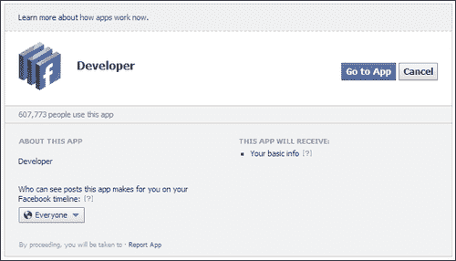
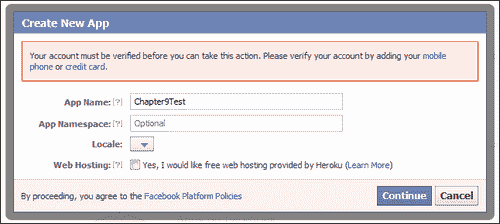
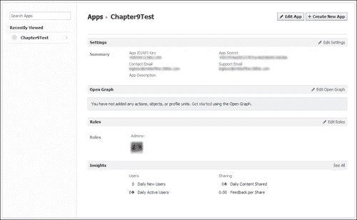
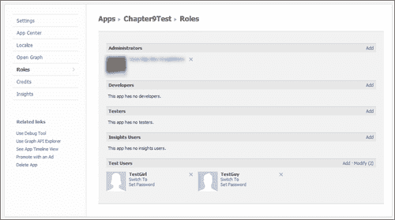

# 第九章。添加社交媒体和其他在线服务

现代移动设备在图形和声音方面非常强大，但它们与其他专用手持式电子游戏系统之间最大的区别可能是，大多数设备都能连接到互联网。

虽然其他游戏系统可能可以通过 WiFi 上网，但许多现代设备也可以使用 3G 或其他此类数据连接，无论用户身处何地都能连接到互联网。因此，许多游戏现在都具备连接社交媒体网站（如 Facebook）或使用苹果的 Game Center 等服务分享分数的功能。

在本章中，我们将探讨如何使用 Marmalade 将以下在线功能添加到我们的游戏中：

+   启动网页浏览器以显示网页

+   在 iOS 和 Android 上与 Facebook 集成

+   熟悉其他在线功能的可能性，包括广告和在应用内购买

# 在设备浏览器中启动网页

让我们通过查看向我们的游戏中添加在线功能的最简单方法——在设备浏览器中启动网页——来开始我们对连接世界的探索。

能够将用户引导到网站对于诸如说明书、提示和技巧或技术支持访问等事项非常有用。它对于通过提供一个简单的“获取更多游戏”按钮来促进跨推广也非常好，这个按钮突出显示了你创建的其他游戏。

我们是如何实现这个魔法的？这真的很简单！只需包含头文件`s3eOSExec.h`，然后调用`s3eOSExecAvailable`来查看我们正在运行的平台上是否支持此功能。Marmalade 支持的大多数平台都允许此功能，但最好总是检查一下！

如果支持可用，我们只需调用函数`s3eOSExecExecute`，并传入网页的 URL 和一个布尔值，表示我们的应用程序是否将退出。在不支持多任务处理的平台上，此参数将不起作用，因此通常可以将此标志设置为`false`以确保我们的应用程序不会被关闭。

这里有一个代码片段来演示：

```swift
if (s3eOSExecAvailable())
{
  s3eOSExecExecute("http://www.google.com", false);
}
```

这种方法的主要缺点是，通过在设备的内部网页浏览器中启动应用程序，它会将用户从我们的游戏中带走；但在前面提到的案例中，鉴于实现起来非常简单，这可能是一个可以接受的权衡。

# 与社交媒体集成

社交媒体网站如 Facebook 通过让玩家为我们传播信息，为我们的游戏提供了一种很好的广告方式。有无数的游戏例子允许玩家在他们的 Facebook 墙或 Twitter 上发布消息，以展示他们最新的高分或吹嘘在游戏中达到的某个目标。

在本节中，我们将详细探讨如何实现与 Facebook 的集成，同时也会简要地讨论 Twitter。

## 使用 Facebook

Marmalade 附带一个名为 s3eFacebook 的 API，它封装了与 Facebook 服务器通信的大部分复杂操作。不幸的是，这种易用性是有代价的，那就是它只支持 iOS 和 Android。

如果需要在所有平台上支持 Facebook，我们需要从头开始使用 Marmalade 提供的 IwHTTP API 通过 HTTP 请求来实现一切。这是一个具有挑战性的任务，所以在这部分书中我们将使用 s3eFacebook API。

### 创建 Facebook 应用

将 Marmalade 项目与 Facebook 集成的第一步是在 Facebook 网站上创建一个 Facebook 应用，这实际上只是验证任何 Facebook API 请求来源的一种方式。

当我们创建一个 Facebook 应用时，我们会得到两个十六进制值。其中一个被称为**App Id**（有时也称为**API Key**），另一个是**App Secret**。当我们向 Facebook 发送请求以在 Facebook 服务器上识别我们的应用时，这些值将是必需的。

要创建 Facebook 应用，请按照以下步骤操作：

1.  通过访问[www.facebook.com](http://www.facebook.com)并输入用户名和密码来登录 Facebook。如果您还没有 Facebook 账户，您也可以在此地址注册一个。

1.  登录到 Facebook 后，访问 URL [www.facebook.com/developers](http://www.facebook.com/developers)。如果您之前从未创建过 Facebook 应用，您将看到一个类似于前面截图的对话框。这个屏幕有一个下拉框，允许您指定是否让所有人或只是您的朋友能看到应用创建的帖子。现在，请将此设置为默认值**所有人**，然后点击**转到应用**按钮。

1.  现在，您将看到一个屏幕，详细列出您创建的所有 Facebook 应用，如果这是您第一次创建应用，这个屏幕将是空的！点击**+ 创建新应用**按钮开始创建 Facebook 应用。

1.  应该现在出现的上一个对话框应该没有包含关于验证账户文本的粉红色框（更多关于这一点稍后讨论）。为了本章的目的，我们只需要提供**应用名称**值，这是一个字符串，当我们的 Marmalade 项目首次尝试访问 Facebook 时将显示给用户。因此，使用游戏名称或公司名称作为此字段是有意义的。

1.  点击 **Continue** 按钮创建 Facebook 应用程序。请注意，现在可以忽略剩余的字段。**App Namespace** 的值用于在 Facebook 上作为 URL 或 HTTP 请求的一部分引用应用程序，并且是为了更高级的 Facebook 集成。**Locale** 和 **Web Hosting** 控制也可以在本章中忽略。

1.  现在，您将看到那些令人烦恼的 Captcha 对话框之一，以证明您是人类，而不是某种垃圾邮件发送的网虫。输入图片中显示的单词以继续。

1.  在这一点上，您可能会再次看到步骤 4 中的 **Create New App** 对话框，这次带有小粉色框中的文本。这是 Facebook 为了阻止数百个恶意 Facebook 应用程序被创建而设置的另一个安全检查。在您创建 Facebook 应用程序之前，您需要授权您的 Facebook 账户。我建议您点击标有 **mobile phone** 的链接来验证您的账户，因为这无疑是迄今为止最简单的方法。您将被要求输入您的手机号码，以便发送包含授权代码的短信给您，然后您将输入该代码以验证自己。

1.  一旦您验证了您的账户，您将再次返回到 **Create New App** 对话框。请确保 **App Name** 的值是正确的，并再次点击 **Continue** 按钮。Captcha 屏幕可能会再次出现，所以请填写它。

1.  在这一点上，Facebook 应用程序已经创建，您现在应该看到与之前显示的屏幕相似的屏幕，该屏幕显示了有关 Facebook 应用程序的各种信息。最重要的是 **App Id/App Key** 和 **App Secret** 值，您稍后需要它们；所以请记下它们。

### 创建 Facebook 测试用户

显然，我们希望在应用程序实施后测试其 Facebook 集成，但如果我们不需要向所有朋友发送测试墙贴等内容，那就更好了。因此，创建一个测试用户是个好主意。

由于可理解的原因，Facebook 并不想让我们为测试用户创建完整的 Facebook 账户，因此他们允许我们使用我们的 Facebook 应用程序创建测试用户。按照以下步骤创建测试用户：

1.  登录 Facebook 并访问 [www.facebook.com/developers](http://www.facebook.com/developers) 页面。

1.  在左侧面板中点击相关的 Facebook 应用程序，然后点击页面右侧 **Roles** 部分的 **Edit Roles** 标签链接。

1.  Facebook 应用的 **Roles** 页面将显示（见前面的截图）。底部有一个标有 **Test Users** 的部分，其中有一个标有 **Add** 的链接，您应该点击以创建新的测试用户。

1.  将会弹出一个包含三个选项的小对话框。第一个选项标有**添加数量**，是一个下拉框，允许生成一到十个测试用户。

1.  **授权此应用**复选框使我们能够确定创建的用户是否已经授权 Facebook 应用使用他们的账户。值得创建两种类型的用户来全面测试我们的应用程序，但最终是否现在授权还是在我们首次尝试使用此用户账户登录时授权，取决于您。

1.  最后，**启用 Ticker**复选框让您决定用户是否将使用 Facebook Ticker 界面（这是一个实时墙帖子和其他事件的时间线）或较老的标准界面。并非所有用户都有权访问较新的 Ticker 界面，因此值得使用这两种方法测试您的项目。

1.  点击**添加**按钮以创建新用户。您将返回到第 3 步中首次显示的屏幕，但现在新用户将显示在页面底部。

1.  每个测试用户旁边都会有一些链接。您应该首先点击**设置密码**链接，以便为该用户设置密码。将出现一个文本框，允许您输入密码。

1.  接下来，点击其中一个用户旁边的**切换到**链接，以登录为该用户并显示他们的 Facebook 墙。

1.  在测试用户墙的右上角，应该有一个标有**编辑个人资料**的按钮。点击它。

1.  在**编辑个人资料**屏幕上，点击左侧面板中的**联系信息**链接。

1.  屏幕顶部应该有两个与个人资料关联的电子邮件地址。其中之一应该是`<username@tfbnw.net>`的形式，这是我们稍后作为测试用户登录时需要使用的电子邮件地址。记下这个电子邮件地址以及您在第 8 步中设置的密码。

### 将 s3eFacebook API 添加到 Marmalade 项目中

在配置了 Facebook 应用和测试用户后，让我们开始将 Facebook 支持添加到 Marmalade 项目中。首先要做的是打开项目 MKB 文件，并将`s3eFacebook`添加到`subprojects`列表中。然后，我们可以在需要使用 s3eFacebook API 函数时包含`s3eFacebook.h`文件。

我们还需要在`deployments`部分的 MKB 文件中添加另一个配置设置。问题所在行看起来像这样，并且仅适用于 iOS 构建。在 iOS 上，当我们登录到 Facebook 时，我们的应用程序会暂时失去焦点，这个值确保我们在登录过程完成后恢复控制：

```swift
iphone-bundle-url-schemes="fb0123456789abcdef"
```

在初始`fb`之后的十六进制值应替换为 Facebook 应用生成的 16 位 App Id。

### 检查 s3eFacebook 支持

如前所述，s3eFacebook API 仅支持 iOS 和 Android，因此能够在运行时检查我们是否能够支持 Facebook 是很好的。这可以通过使用`s3eFacebookAvailable`函数轻松完成，如果 API 可用，则返回`S3E_TRUE`，如果不可用，则返回`S3E_FALSE`。

### 初始化和终止

在我们能够调用任何 s3eFacebook API 之前，我们必须首先初始化一个 Facebook 会话。我们通过调用`s3eFBInit`函数来完成此操作，该函数接受一个参数，即包含我们想要使用的 Facebook 应用程序 App Id 的以 null 结尾的字符串。

该函数将返回一个指向`s3eFBSession`实例的指针，我们将需要使用它来访问 Facebook API 并向其发出请求。

我们可以通过调用`s3eFBTerminate`函数来释放 Facebook 会话，该函数接受从`s3eFBInit`返回的会话指针作为其唯一参数。

在我们想要发出任何 Facebook 请求的第一次调用`s3eFBInit`函数后，我们可以使用相同的会话信息来执行应用程序的生命周期。`s3eFBTerminate`函数只需要在关闭时调用。

### 登录和退出 Facebook

在我们能够发出任何 Facebook 请求之前，我们必须首先登录到 Facebook。这是通过`s3eFBSession_LogIn`函数完成的，该函数接受五个参数。第一个是`from s3eFBInit`返回的`s3eFBSession`指针。然后我们可以指定一个回调函数，该函数将在成功登录后触发。还可以指定一个指向用户数据块的指针，当它被触发时，该指针将被传递到回调函数中。

回调函数可以指定为`NULL`，在这种情况下，我们需要通过调用`s3eFBSession_LoggedIn`函数来检查登录是否完成。该函数接受会话指针作为参数，当会话登录时将返回`S3E_TRUE`。

`s3eFBSession_LogIn`函数的最后两个参数是一个以 null 结尾的字符串数组，列出了我们想要使用的 Facebook API 权限以及该数组中的权限数量。权限允许我们的应用程序通知用户，我们的应用程序想要在他们的账户上执行某些操作，例如在他们的墙上发布或访问他们的照片收藏。完整的权限列表可以在网页[`developers.facebook.com/docs/authentication/permissions/`](http://developers.facebook.com/docs/authentication/permissions/)中找到。

以下示例代码展示了示例回调函数以及如何使用`s3eFBSession_Login`函数：

```swift
// Login callback
void LoginCallback(struct s3eFBSession* apSession,
s3eResult* apLoginResult, void* apUserData)
{
  if (*apLoginResult == S3E_RESULT_SUCCESS)
  {
    // Logged in OK
  }
  else
  {
    // Login failed
  }
}

// Log in to Facebook using the session returned from s3eFBInit.
const char* permissions[] = { "publish_stream" };

s3eFBSession_Login(lpSession, LoginCallback, NULL,
  permissions, 1);
```

此代码尝试登录 Facebook，请求`publish_stream`权限，该权限允许应用程序在用户的墙上发布内容。

当尝试进行 Facebook 登录时，我们的应用程序将失去焦点，并启动设备的 Facebook 应用程序。如果用户没有安装 Facebook 应用程序，设备上的网络浏览器将被启动。

您将被要求提供您的 Facebook 账户的登录详情，因此为了测试目的，请输入我们之前生成的测试用户账户的详情。登录后，另一个屏幕将出现，详细说明我们的应用程序想要如何使用用户的 Facebook 账户。在上一个示例中，这将是向用户的墙发布消息。如果 Facebook 应用程序尚未为 Facebook 账户授权，屏幕上还将有两个按钮，分别标有**允许**和**不允许**，用户可以使用这些按钮分别授予或拒绝访问权限。

### 注意

Facebook 登录过程首先会检查用户是否已经通过浏览器 cookie 登录到 Facebook，如果是这种情况，则不会要求用户提供用户名和密码详情。如果测试设备也是您自己的个人设备，您在测试应用程序之前可能希望从 Facebook 登出，以避免打扰您的朋友列表中的其他人！

在授权（或实际上拒绝授权）Facebook 应用程序后，我们的应用程序将重新获得焦点，并将触发登录回调函数以说明过程是否成功。如果未授权 Facebook 应用程序或没有可用的互联网连接，登录将失败。

再次从 Facebook 登出也很简单。我们只需调用`s3eFBSession_Logout`函数，并将`s3eFBSession`指针作为其唯一参数传递。实际上，我们只有在关闭应用程序或您明确希望登出以允许使用不同的用户凭据时才需要从 Facebook 登出。只要我们的应用程序正在执行，会话就不会过期或失效。

### 向用户的墙发布消息

我们现在将查看游戏最常使用 Facebook 做的一件事之一：向用户的墙发布消息，以提醒他们的朋友新的高分或游戏中的成就。

为了做到这一点，我们将使用 Facebook Graph API。还有其他方法，但 Graph API 是目前最最新潮的方法，并且看起来在不久的将来不太可能被取代。

### 注意

有关 Facebook Graph API 的更多信息，请查看网页[`developers.facebook.com/docs/reference/api/`](http://developers.facebook.com/docs/reference/api/)，有关墙帖子详情，请查看[`developers.facebook.com/docs/reference/api/post/`](http://developers.facebook.com/docs/reference/api/post/)。

要开始发送 Facebook Graph API 请求，我们使用函数`s3eFBRequest_WithGraphPath`。此函数将会话指针、所需的 Facebook Graph 路径和要使用的 HTTP 方法（GET 或 POST）作为参数。Graph 路径和 HTTP 方法都指定为以 null 终止的字符串。

如果成功，该函数将返回一个指向`s3eFBRequest`结构的指针，表示新的请求；如果失败，则返回`NULL`。

在创建请求结构后，我们可以使用` s3eFBRequest_AddParamNumber`和` s3eFBRequest_AddParamString`函数向其中添加所需的各个参数。这两个函数都接受` s3eFBRequest`结构指针和一个以 null 终止的字符串作为参数名称的前两个参数。对于前一个函数调用，第三个参数是一个 64 位整数值（Marmalade 定义了一个名为`int64`的类型），对于后一个函数，是一个指向以 null 终止的字符串的`const char`指针。

大多数 Graph API 值都需要你指定一个访问令牌来证明你的应用程序有权发出请求。访问令牌作为登录过程的一部分提供给我们的应用程序，我们可以使用` s3eFBSession_AccessToken`函数检索它，该函数再次以会话指针作为其唯一输入。访问令牌作为`const char`指针返回。

可以使用` s3eFBRequest_AddParamString`函数通过指定` access_token`作为参数名称，并使用` s3eFBSession_AccessToken`函数的返回值作为参数值，将访问令牌添加到 Graph 请求中。

一旦将所有参数添加到请求中，我们就可以使用` s3eFBRequest_Send`函数将其发送到 Facebook 服务器。该函数接受请求指针作为其第一个输入，然后是一个回调函数，以及一个指向可选数据块的指针，当触发回调函数时，该数据块将被传递给回调函数。

如果请求已发送，该函数将立即返回` S3E_RESULT_SUCCESS`，如果传输过程中出现问题，则返回` S3E_RESULT_ERROR`。s3eFacebook API 将等待 Facebook 的请求到达，并在请求到达时调用指定的回调函数。

当请求完成时，我们应该调用` s3eFBRequest_Delete`来释放与其相关的任何资源。

让我们通过一个示例来了解如何将所有这些点应用于向用户的墙发布一条简单消息：

```swift
// Sample callback function for s3eFBRequest_Send function
void RequestCallback(struct s3eFBRequest* apRequest,
   s3eResult* apRequestResult, void* apUserData)
{
   if (*apRequestResult == S3E_RESULT_SUCCESS)
   {
      // Request successful
   }
   else
   {
      // Request failed
   }

   // Free the request resources
   s3eFBRequest_Delete(apRequest);
}

// The following code snippet illustrates how we can send a request
// to Facebook using the Graph API to post a wall message

s3eFBRequest* lpRequest = s3eFBRequest_WithGraphPath(lpSession,
   "me/feed", "POST");
if (lpRequest)
{
   // Add the required parameters
   const char* lpAccessToken = s3eFBSession_AccessToken(lpSession);
   s3eFBRequest_AddParamString(lpRequest, "access_token",
      lpAccessToken);
   s3eFBRequest_AddParamString(lpRequest, "message",
      "Hello Facebook!");

   // Send the request to Facebook
   if (s3eFBRequest_Send(lpRequest, RequestCallback, NULL) ==
      S3E_RESULT_SUCCESS)
   {
      // Wait for the callback to be triggered now!
   }
   else
   {
      // Error occurred sending request, so free it
      s3eFBRequest_Delete(lpRequest);
   }
}
```

### 进一步的 s3eFacebook 功能

前几节实际上只是触及了使用 s3eFacebook 可能实现的 Facebook 集成的表面。例如，我们没有提到处理由 Facebook API 发送回我们应用程序的任何结果。有一系列以`s3eFBRequest_Response`为前缀的函数，允许分析 Facebook 请求的返回值。

关于整个 s3eFacebook API 的更多信息，请访问 Marmalade 文档中的**Marmalade API 参考** | **扩展 API 文档** | **Facebook 扩展** | **Facebook API 参考**。

## 使用 Twitter

很遗憾，Marmalade 没有提供针对 Twitter 的专用内置支持；所以如果你认为 Twitter 很重要，你需要提供自己的实现。

实现这一功能的一种方法是通过直接使用 Twitter API，通过 IwHTTP API 向 Twitter 的服务器发送 HTTP 请求。这将允许创建一个应该能在所有操作系统上正常工作的解决方案；但可能需要编写大量代码来处理在线工作时可能出现的所有可能问题（例如，网络连接中断、服务器超时等）。

另一种可能性，尽管它将仅限于 iOS 和 Android，将是使用 Marmalade **扩展开发工具包**（**EDK**）来访问这两个平台上现有的 Twitter 解决方案。这可能更容易实现，因为低级别的 Twitter API HTTP 请求已经被处理；但 EDK 目前仅支持 iOS 和 Android。第十章，*使用扩展开发工具包（EDK）扩展 Marmalade*，本书将更详细地探讨 EDK。

如果你感兴趣在 Marmalade 中支持 Twitter，以下网页可能对你有所帮助：

[`dev.twitter.com/docs/twitter-libraries#cplusplus`](https://dev.twitter.com/docs/twitter-libraries#cplusplus)

它提到了一些现有的基于 C++的库，用于访问 Twitter，这些库可能为 Marmalade 解决方案提供一个良好的起点。

# 连接到其他类型的在线服务

现在我们快速浏览一下移动设备上游戏通常连接到的其他类型在线服务。虽然我们不会对这些服务进行深入探讨，但提及它们仍然有助于形成一个更全面的了解，了解可能实现的功能。

## 支持社交游戏网络

社交游戏网络，如苹果的 Game Center 或跨平台解决方案，如 Scoreloop 或 OpenFeint，在许多移动游戏中已成为常见。在接下来的章节中，我们将探讨 Marmalade 项目中可用于这些类型服务的可能性。

### 使用苹果的 Game Center

在移动游戏世界中，最知名的社会游戏系统之一无疑是苹果的 Game Center([`www.apple.com/game-center/`](http://www.apple.com/game-center/))。不出所料，这个系统完全致力于基于 iOS 的设备，所以如果你正在为 iOS 开发游戏，这可能是你支持的首选。

由于它是一个 Objective-C 库，我们无法直接访问苹果的 API，因此 Marmalade 提供了一个名为 s3eIOSGameCenter 的服务包装 API。

s3eIOSGameCenter API 对于我们来说太大，无法在这里深入探讨，但它是对标准苹果提供的 API 的相当紧密封装，因此理解如何将你在互联网上遇到的任何示例代码转换为使用 Marmalade 封装相当简单。一个演示其使用的示例项目包含在 Marmalade 安装文件夹`examples\s3eIOSGameCenter`中，Marmalade 文档中也有大量信息，包括**Marmalade API 参考** | **S3E API 文档** | **S3E: 仅限 iOS** | **S3E iOS 游戏中心**。

支持 Game Center 的所有主要功能，包括排行榜和成就、多人匹配和甚至语音聊天！

### 使用 Scoreloop

Scoreloop 系统是一个极受欢迎的跨平台解决方案，截至写作时，它支持 iOS、Android、BlackBerry PlayBook 和 Windows Phone 7。鉴于 Marmalade 支持这三种平台中的前三种，再加上 Scoreloop 的友好人士还提供了一个可以直接在 Marmalade 项目中使用的 API 版本，如果您想在跨平台项目中支持社交游戏，这是一个非常好的选择。

Marmalade 版本的 Scoreloop 提供了对排行榜、成就和 Scoreloop 的离线多人游戏挑战系统的支持。

更多关于 Scoreloop 的信息可以在[www.scoreloop.com](http://www.scoreloop.com)找到，在那里您可以注册一个免费的开发者账户并下载 SDK 的最新版本。

## 支持内购

所谓的免费增值游戏（Freemium games）的当前流行是因为现在除了单次购买成本外，还有其他方式为游戏收费。**内购**（**IAP**）的出现使我们能够免费赠送我们的游戏，同时通过向已经玩过并享受过我们游戏的用户销售额外的游戏模式或关卡包来获利。

在接下来的章节中，我们将探讨 Marmalade 如何支持 iOS 和 Android 上的内购。

### 为 iOS 设备添加内购功能

与 Game Center 一样，苹果提供的内购 SDK 是用 Objective-C 编写的，因此我们无法直接在 Marmalade 项目中使用它。

同样，Marmalade 通过将苹果库封装成一个名为 s3eIOSAppStoreBilling 的 API 来解决此问题。

此 API 允许我们获取可购买的产品列表及其成本。然后我们可以请求购买特定产品，当苹果的服务器处理完所有幕后工作以处理付款时，我们将收到成功或失败的通知。

就像原始的 Apple 实现一样，我们不支持在购买完成后自动下载额外数据。相反，我们必须在收到购买确认后自行实现这一功能，这可能涉及将所有“可解锁”数据与原始应用程序下载一起发送，或者从我们自己的服务器下载。

如需了解有关此 API 的更多信息，请访问 Marmalade 文档，通过访问**Marmalade API 参考** | **S3E API 文档** | **S3E: 仅限 iOS** | **S3E iOS 应用商店计费**，并在 Marmalade 安装目录中的`examples\s3e\s3eIOSAppStoreBilling`可以找到示例代码。

### 为 Android 设备添加内购功能

Marmalade 还为在 Android 上实现内购提供了一个名为 s3eAndroidMarketBilling 的包装 API。这个 API 的命名仍然基于原始的 Android 商店名称（Android Marketplace），但它与重命名的 Google Play 系统兼容。

很遗憾，Marmalade 无法提供一个可以针对多个平台的单一 API，这仅仅是因为 iOS 和 Android 系统的工作方式如此不同。一个很好的例子是，Google Play 系统不允许我们查询应用程序可用的产品列表。这是 Google 方面的一个真正奇怪的遗漏（尤其是考虑到您仍然需要在 Google Play 服务器上设置产品列表），这意味着我们要么必须在应用程序中硬编码产品标识符，要么提供自己的服务器来镜像这些信息。

在文档中，您可以通过访问**Marmalade API 参考** | **S3E API 文档** | **S3E: 仅限 Android** | **S3E Android 市场计费**来找到有关此 API 的信息，并且`examples\s3e\s3eAndroidMarketBilling`目录中包含一些示例代码。

## 使用广告

我们刚刚探讨了从您的游戏中生成收入的一种方式，即内购，但另一种方式是利用许多可用的广告解决方案之一。就像大多数网站常见的可点击广告一样，我们可以将游戏屏幕显示的一小部分空间留给广告，从而提供另一个潜在的收益来源。

以下部分将探讨我们可用的选项。

### 实现 iOS 设备的 iAd 支持

如您所知，Apple 为其 iOS 设备提供自己的广告解决方案，称为**iAd**。同样，这需要使用 Objective-C API，因此 Marmalade SDK 提供了一个名为**s3eIOSIAD**的 C 包装器。

这是一个非常简单的 API，允许您从 iAd 服务器请求广告。如果广告可用，您可以选择何时显示它，因此如果需要，广告只需在游戏中的特定点可见。

在**Marmalade API 参考 | S3E API 文档** | **S3E：仅限 iOS** | **S3E iOS iAd**中可以找到此 API 的文档，示例代码位于 Marmalade 安装目录中的`examples\s3e\s3eIOSIAd`。

### 使用其他广告解决方案

由于 iAd 只能在 iOS 平台上使用，因此当我们针对其他平台时，我们被迫考虑其他可能的解决方案（尽管大多数这些其他解决方案仍然可以在 iOS 上使用！）。

Marmalade 不直接提供对任何其他广告系统的支持，但其他开发人员在这里接受了挑战，并在 Marmalade Code Community 页面上提供了自己的解决方案供使用。

在撰写本文时，有两个有用的项目称为*s3eAdWhirl*和*s3eAdNinja*，至少为 Android 提供了支持。这些解决方案非常巧妙，因为它们实际上针对多个移动广告源，以确保广告尽可能频繁地在您的应用程序中显示，以最大化您的收入。

*IwGameAds*模块是另一个开源社区项目，展示了如何与多个广告服务集成，并且可以在比您能挥动一根非常长的棍子还要多的平台上工作。其完整源代码和文档可以在以下网址找到：

[`www.drmop.com/index.php/iwgameads-sdk/`](http://www.drmop.com/index.php/iwgameads-sdk/)

在不太可能的情况下，如果这些不符合您的需求，并且您想使用特定的移动广告系统，另一种可能性是使用下一章中更详细描述的扩展开发工具包来实现对该系统的支持。

# 示例代码

现在让我们看看本章相关联的示例代码。

## Facebook 项目

Facebook 项目将本章关于发布到用户 Facebook 墙上的所有信息汇集在一个地方，这样您可以轻松地看到如何在更真实的应用程序中实现代码。

运行示例后，我们看到了两个菜单按钮。第一个按钮允许我们登录和退出 Facebook，而第二个按钮在我们成功登录后允许我们向我们的墙发布消息。状态消息将在屏幕底部显示。

s3eFacebook API 已被进一步封装到一个名为`Facebook`的小类中，该类处理 Facebook 的登录和注销以及构建 Graph API 请求。这是一个很好的方法，因为它提供了进一步的抽象层，并将所有 s3eFacebook API 的使用集中在一个地方。如果 Facebook 的核心 API 因任何原因（考虑到 Facebook 可能随时更改做事的方式，这是可能的）发生变化，所有需要更新的代码都很容易找到。

使用`s3eOSReadStringUTF8WithDefault`函数请求要发布到墙上的消息；因此，这个示例也充当了使用此 API 的指南。

如果你想构建和运行此示例代码，你需要创建自己的 Facebook 应用，并为其提供由它生成的 App Id 和 App Secret 值。`app.icf`文件包含两个设置，允许指定这些值（尽管目前代码中实际只使用了 App Id！）。

还需要修改项目 MKB 文件中的`iphone-bundle-url-schemes`行。如果此设置未更改，则应用程序在 iOS 设备上完成 Facebook 登录过程后不会重新获得焦点。

如本章前面讨论 s3eFacebook API 时提到的，此示例代码只能在 iOS 和 Android 设备上运行。

## 滑雪项目

本章介绍了 Facebook 支持被添加到滑雪项目中。为 Facebook 项目创建的`Facebook.cpp`和`Facebook.h`文件未经修改地添加到滑雪项目中，以支持向用户的墙发布消息。

当玩家达到“游戏结束”屏幕时，会检查是否提供了 Facebook 支持。如果没有，将显示正常的“游戏结束”消息，并在短暂的延迟后，用户将返回到标题屏幕。

如果 Facebook 功能可用，将显示一个略有不同的“游戏结束”屏幕。这个版本会告知玩家他们的得分，并询问他们是否想在墙上发布一条消息来向朋友炫耀。提供了标记为**是**和**否**的按钮，让玩家选择要做什么。

如果他们点击**是**按钮，游戏将尝试登录 Facebook，然后发布一条详细说明玩家得分的消息。请求还引用了一个图像文件和一个网页链接，这些链接也将与墙上的消息一起显示。

与之前的 Facebook 项目一样，需要创建自己的 Facebook 应用，并为其提供正确的 App Id、App Secret 以及`iphone-bundle-url-schemes`设置值。

# 摘要

在本章中，我们简要地探讨了如何将各种在线服务添加到我们的游戏中。具体来说，我们看到了如何将 Facebook 支持添加到我们的游戏中，并且现在知道了如果想要包含社交游戏、广告或应用内购买，我们应该从哪里开始着手。

这些主题中的每一个都足以填满整整一章，但遗憾的是，这本书中并没有足够的空间进行更深入的探讨。不过，希望你现在已经对可用的选项有了很好的了解。

在本章的几个地方提到了扩展开发工具包（EDK）作为实现当前 Marmalade SDK 基础部分不支持在线功能的一种可能方式。在下一章中，我们将探讨 EDK，看看我们如何访问构成 iOS 和 Android 操作系统的 API。
