# 第二章：使用声明式 UI 创建屏幕并探索 Compose 原则

移动应用程序需要用户界面（UI）以供用户交互。例如，在安卓中创建 UI 的旧方式是命令式的。这意味着使用独特的**可扩展标记语言**（XML）布局来创建应用程序 UI 的单独原型，而不是构建逻辑所使用的相同语言。

然而，随着现代安卓开发，有一种趋势是停止使用命令式编程，开始使用声明式的方式来制作用户界面，这意味着开发者根据接收到的数据来设计用户界面。这种设计范式使用一种编程语言来创建整个应用程序。

公平地说，对于新开发者来说，在构建用户界面时决定学习什么可能看起来有些困难：是采用旧的方式创建视图，还是选择新的 Jetpack Compose。然而，如果你在 Jetpack Compose 时代之前已经构建了一个安卓应用程序。

在这种情况下，你可能已经知道使用 XML 有点繁琐，尤其是如果你的代码库很复杂。然而，将 Jetpack Compose 作为首选选择可以使工作变得更简单。此外，它通过确保开发者使用更少的代码来简化 UI 开发，因为他们利用了直观的 Kotlin API。因此，新开发者创建视图时倾向于使用 Jetpack Compose 而不是 XML。

然而，了解两者可能是有益的，因为许多应用程序仍然使用 XML 布局，你可能会需要维护视图，但使用 Jetpack Compose 来构建新的。在本章中，我们将通过尝试使用列、行、盒子、懒列等来实现小型示例来查看 Jetpack Compose 的基础知识。

在本章中，我们将介绍以下食谱：

+   在 Jetpack Compose 中实现 Android 视图

+   在 Jetpack Compose 中实现可滚动列表

+   使用 Jetpack Compose 和视图页实现第一个标签布局

+   在 Compose 中实现动画

+   在 Jetpack Compose 中实现无障碍功能

+   使用 Jetpack Compose 实现声明式图形

# 技术要求

本章的完整源代码可以在[`github.com/PacktPublishing/Modern-Android-13-Development-Cookbook/tree/main/chapter-two`](https://github.com/PacktPublishing/Modern-Android-13-Development-Cookbook/tree/main/chapter-two)找到。要查看所有食谱，你需要分别运行所有预览函数。因此，寻找`@Preview`可组合函数来查看创建的 UI。

# 在 Jetpack Compose 中实现 Android 视图

在每个安卓应用程序中，拥有 UI 元素非常关键。安卓中的视图是 UI 的简单构建块。视图确保用户可以通过点击或其他动作与你的应用程序交互。这个食谱将探讨不同的 Compose UI 元素，并查看我们如何构建它们。

## 准备工作

在这个菜谱中，我们将创建一个项目，我们将在整个章节中重复使用它，所以让我们继续按照*第一章*，“现代 Android 开发技能入门”，中的步骤创建你的第一个 Android 项目。

创建一个名为`Compose Basics`的项目。此外，我们将主要使用**预览**部分来查看我们创建的 UI 元素。

## 如何做到这一点...

一旦你创建了项目，请按照以下步骤构建几个 Compose UI 元素：

1.  在我们的项目中，让我们继续创建一个新的包，命名为 components。这是我们添加所有创建的组件的地方。

1.  创建一个名为`UIComponents.kt`的 Kotlin 文件；在`UIComponent`内部，继续创建一个可组合函数，命名为`EditTextExample()`，并调用`OutlinedTextField()`函数；这将提示你导入所需的导入，即`androidx.Compose.material.OutlinedTextField`：

    ```java
    @Composable
    ```

    ```java
    fun EditTextExample() {
    ```

    ```java
        OutlinedTextField()
    ```

    ```java
    }
    ```

1.  当你深入查看`OutlineTextField`（见*图 2.1*），你会注意到该函数接受几个输入，当你需要自定义自己的可组合函数时，这非常有用。

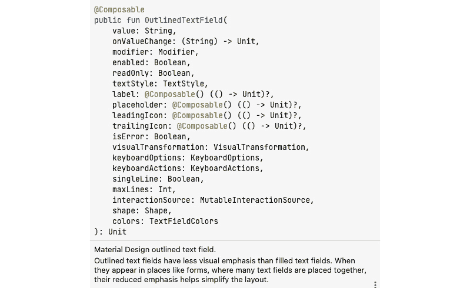

图 2.1 – The OutlinedTextField 输入

1.  在我们的例子中，我们不会对创建的 UI 做太多处理，而是仅仅看看我们是如何创建它们的。

1.  现在，为了完全创建基于我们看到的输入类型的`OutlinedTextField()`，我们可以给它一个文本和颜色，并使用`Modifier()`对其进行装饰；也就是说，通过给它特定的指令，例如`fillMaxWidth()`，这设置了最大宽度。当我们说填充时，我们只是指定它应该完全填充。我们将`.padding(top)`设置为`16.dp`，这会在`dp`中为内容的每一边应用额外的空间。它还有一个值，即要输入到`OutlinedTextField`中的值，以及一个`onValueChange` lambda，它监听输入变化。

1.  我们还为我们的一些`OutlinedText`在聚焦和未聚焦时设置了边框颜色，以反映不同的状态。因此，如果你开始输入，框会变成蓝色，如代码中指定的：

    ```java
    @Composable
    ```

    ```java
    fun EditTextExample() {
    ```

    ```java
        OutlinedTextField(
    ```

    ```java
            value = "",
    ```

    ```java
            onValueChange = {},
    ```

    ```java
            label = { Text(stringResource(id =
    ```

    ```java
            R.string.sample)) },
    ```

    ```java
            modifier = Modifier
    ```

    ```java
                .fillMaxWidth()
    ```

    ```java
                .padding(top = 16.dp),
    ```

    ```java
            colors =
    ```

    ```java
                TextFieldDefaults.outlinedTextFieldColors(
    ```

    ```java
                    focusedBorderColor = Color.Blue,
    ```

    ```java
                    unfocusedBorderColor = Color.Black
    ```

    ```java
                )
    ```

    ```java
        )
    ```

    ```java
    }
    ```

1.  我们还有一种类型的`TextField`，它不是轮廓式的，如果你比较`OutlinedTextField`接受的输入，你会注意到它们相当相似：

    ```java
    @Composable
    ```

    ```java
    fun NotOutlinedEditTextExample() {
    ```

    ```java
        TextField(
    ```

    ```java
            value = "",
    ```

    ```java
            onValueChange = {},
    ```

    ```java
            label = { Text(stringResource(id =
    ```

    ```java
            R.string.sample)) },
    ```

    ```java
            modifier = Modifier
    ```

    ```java
                .fillMaxWidth()
    ```

    ```java
                .padding(top = 8.dp, bottom = 16.dp),
    ```

    ```java
            colors =
    ```

    ```java
                TextFieldDefaults.outlinedTextFieldColors(
    ```

    ```java
                    focusedBorderColor = Color.Blue,
    ```

    ```java
                    unfocusedBorderColor = Color.Black
    ```

    ```java
                )
    ```

    ```java
        )
    ```

    ```java
    }
    ```

1.  你可以通过在`@Preview`可组合函数内添加 Compose 函数来运行应用程序。在我们的例子中，我们可以创建`UIElementPreview()`，这是一个用于显示我们 UI 的预览函数。在*图 2.2*中，顶部视图是`OutlinedTextField`，而第二个是普通的`TextField`。

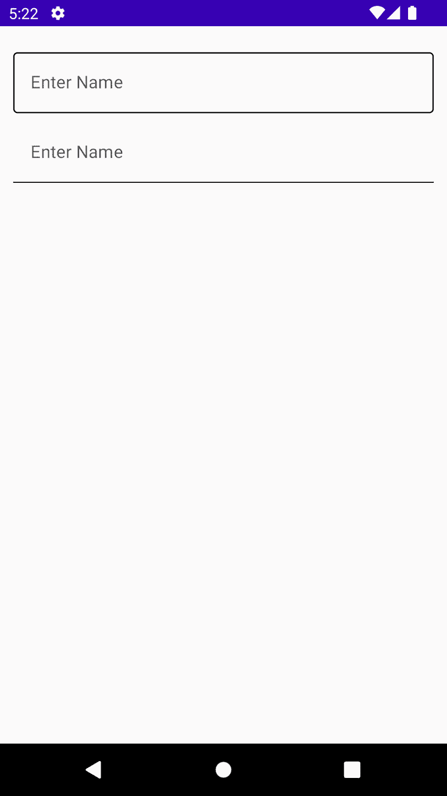

图 2.2 – OutlinedTextField 和 TextField

1.  现在，让我们继续看看按钮的例子。我们将探讨以不同形状创建按钮的不同方法。如果你悬停在 `Button()` 组合函数上，你会看到它接受什么作为输入，如图 *图 2**.3* 所示。

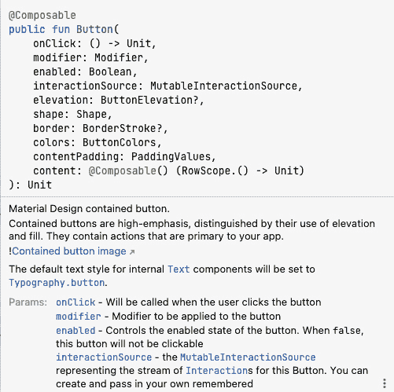

图 2.3 – 按钮输入

在我们的第二个例子中，我们将尝试创建一个带有图标按钮。此外，我们还将添加文本，这在创建按钮时至关重要，因为我们需要指定给用户什么动作或按钮在被点击后将执行什么操作。

1.  因此，请继续在同一个 Kotlin 文件中创建一个名为 `ButtonWithIcon()` 的 Compose 函数，然后导入 `Button()` 组合函数。

1.  在其中，你需要导入一个带有 `painterResource` 输入的 `Icon()`，一个内容描述，`Modifier` 和 `tint`。我们还需要 `Text()`，这将给我们的按钮一个名字。在我们的例子中，我们不会使用 `tint`：

    ```java
    @Composable
    ```

    ```java
    fun ButtonWithIcon() {
    ```

    ```java
        Button(onClick = {}) {
    ```

    ```java
            Icon(
    ```

    ```java
                painterResource(id =
    ```

    ```java
                    R.drawable.ic_baseline_shopping_bag_24                ),
    ```

    ```java
                contentDescription = stringResource(
    ```

    ```java
                    id = R.string.shop),
    ```

    ```java
                modifier = Modifier.size(20.dp)
    ```

    ```java
            )
    ```

    ```java
            Text(text = stringResource(id = R.string.buy),
    ```

    ```java
                Modifier.padding(start = 10.dp))
    ```

    ```java
        }
    ```

    ```java
    }
    ```

1.  让我们继续创建一个新的组合函数，并将其命名为 `CornerCutShapeButton()`；在这个例子中，我们将尝试创建一个带有切角的按钮：

    ```java
    @Composable
    ```

    ```java
    fun CornerCutShapeButton() {
    ```

    ```java
        Button(onClick = {}, shape = CutCornerShape(10)) {
    ```

    ```java
            Text(text = stringResource(
    ```

    ```java
                id = R.string.cornerButton))  }}}}
    ```

1.  让我们继续创建一个新的组合函数，并将其命名为 `RoundCornerShapeButton()`；在这个例子中，我们将尝试创建一个带有圆角的按钮：

    ```java
    @Composable
    ```

    ```java
    fun RoundCornerShapeButton() {
    ```

    ```java
        Button(onClick = {}, shape =
    ```

    ```java
        RoundedCornerShape(10.dp)) {
    ```

    ```java
            Text(text = stringResource(
    ```

    ```java
                id = R.string.rounded))
    ```

    ```java
        }
    ```

    ```java
    }
    ```

1.  让我们继续创建一个新的组合函数，并将其命名为 `ElevatedButtonExample()`；在这个例子中，我们将尝试创建一个带有凸起的按钮：

    ```java
    @Composable
    ```

    ```java
    fun ElevatedButtonExample() {
    ```

    ```java
        Button(
    ```

    ```java
            onClick = {},
    ```

    ```java
            elevation = ButtonDefaults.elevation(
    ```

    ```java
                defaultElevation = 8.dp,
    ```

    ```java
                pressedElevation = 10.dp,
    ```

    ```java
                disabledElevation = 0.dp
    ```

    ```java
            )
    ```

    ```java
        ) {
    ```

    ```java
            Text(text = stringResource(
    ```

    ```java
                id = R.string.elevated))
    ```

    ```java
        }
    ```

    ```java
    }
    ```

1.  当你运行应用程序时，你应该会有一个类似于 *图 2**.4* 的图像；在 `TextField` 之后的第一按钮是 `ButtonWithIcon()`，第二个是 `CornerCutShapeButton()`，第三个是 `RoundCornerShapeButton()`，最后一个是 `ElevatedButtonExample()`。

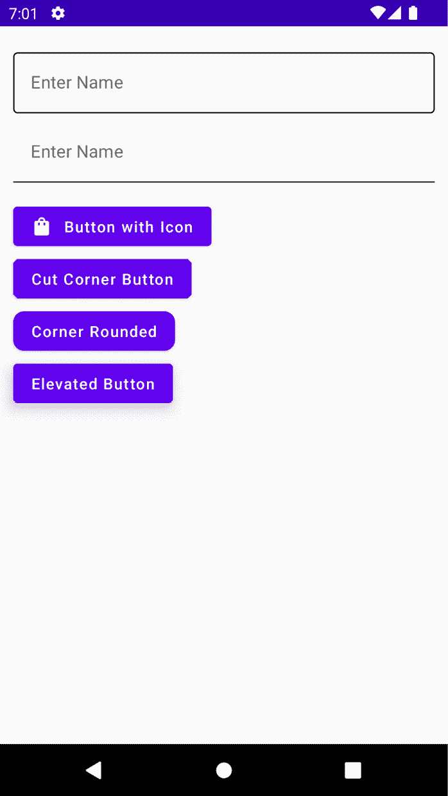

图 2.4 – 不同的按钮类型和其他 UI 元素

1.  现在，让我们来看最后一个例子，因为我们在整本书中将会使用不同的视图和样式，并且在这个过程中我们会学到更多。现在，让我们来看一个图像视图；`Image()` 组合函数接受几个输入，如图 *图 2**.5* 所示。

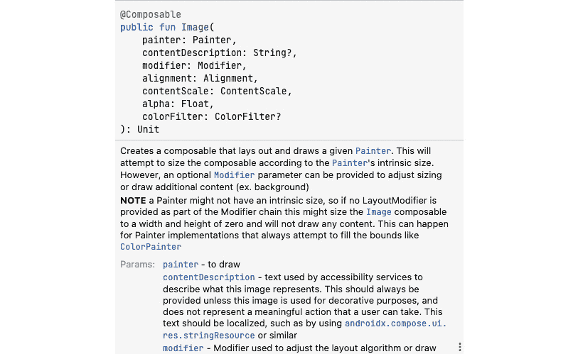

图 2.5 – 不同的 ImageView 输入类型

1.  在我们的例子中，`Image()` 将只有一个画家，它不是可空的，这意味着你需要为这个组合函数提供一个图像，一个用于辅助功能的文本描述和一个修改器：

    ```java
    @Composable
    ```

    ```java
    fun ImageViewExample() {
    ```

    ```java
        Image(
    ```

    ```java
            painterResource(id = R.drawable.android),
    ```

    ```java
            contentDescription = stringResource(
    ```

    ```java
                id = R.string.image),
    ```

    ```java
            modifier = Modifier.size(200.dp)
    ```

    ```java
        )
    ```

    ```java
    }
    ```

1.  你还可以尝试玩弄其他东西，比如添加 `RadioButton()` 和 `CheckBox()` 元素并自定义它们。当你运行你的应用程序时，你应该会有类似于 *图 2**.6* 的东西。


图 2.6 – 几个 UI 组件

## 它是如何工作的…

每个可组合函数都使用`@Composable`注解。这个注解告诉 Compose 编译器，提供的编译器旨在将提供的数据转换为 UI。同时，需要注意的是，每个可组合函数的名称需要是名词，而不是动词或形容词，谷歌提供了这些指南。您创建的任何可组合函数都可以接受参数，使应用逻辑能够描述或修改您的 UI。

我们提到 Compose 编译器，这意味着编译器是任何特殊的程序，它接受我们编写的代码，检查它，并将其转换为计算机可以理解的东西——或者机器语言。

在`Icon()`中，`painterResouce`指定我们将添加到按钮中的图标，内容描述有助于辅助功能，而修饰符用于装饰我们的图标。

我们可以通过添加`@Preview`注解并设置`showBackground = true`来预览我们构建的 UI 元素：

```java
@Preview(showBackground = true)
```

`@Preview`功能强大，我们将在未来的章节中探讨如何更好地利用它。

# 在 Jetpack Compose 中实现可滚动列表

当构建 Android 应用程序时，我们都可以同意的一件事是，您必须知道如何构建`RecyclerView`来显示您的数据。使用我们新的现代构建 Android 应用程序的方式，如果我们需要使用`RecyclerView`，我们可以使用`LazyColumn`，它类似。在这个食谱中，我们将查看行、列和`LazyColumn`，并使用我们的模拟数据构建一个可滚动列表。

此外，我们将在过程中学习一些 Kotlin。

## 准备工作

我们将继续使用`Compose Basics`项目来构建一个可滚动列表；因此，要开始，您需要完成之前的食谱。

## 如何操作...

按照以下步骤构建您的第一个可滚动列表：

1.  让我们继续构建我们的第一个可滚动列表，但首先，我们需要创建我们的模拟数据，这是我们希望在列表中显示的项目。因此，创建一个名为`favoritecity`的包，我们的可滚动示例将驻留其中。

1.  在`favoritecity`包内部，创建一个新的数据类，并将其命名为`City`；这将是我们模拟数据源的数据类`data class City()`。

1.  让我们为我们的`City`数据类建模。确保您在添加注解值后添加必要的导入：

    ```java
    data class City(
    ```

    ```java
        val id: Int,
    ```

    ```java
        @StringRes val nameResourceId: Int,
    ```

    ```java
        @DrawableRes val imageResourceId: Int
    ```

    ```java
    )
    ```

1.  现在，在我们的模拟数据中，我们需要创建一个 Kotlin 类，并将其命名为`CityDataSource`。在这个类中，我们将创建一个名为`loadCities()`的函数，它将返回我们的`List<City>`列表，我们将在可滚动列表中显示它。请查看*技术要求*部分，以获取所有必需的导入以获取所有代码和图像：

    ```java
    class CityDataSource {
    ```

    ```java
        fun loadCities(): List<City> {
    ```

    ```java
            return listOf<City>(
    ```

    ```java
                City(1, R.string.spain, R.drawable.spain),
    ```

    ```java
                City(2, R.string.new_york,
    ```

    ```java
                    R.drawable.newyork),
    ```

    ```java
                City(3, R.string.tokyo, R.drawable.tokyo),
    ```

    ```java
                City(4, R.string.switzerland,
    ```

    ```java
                    R.drawable.switzerland),
    ```

    ```java
                City(5, R.string.singapore,
    ```

    ```java
                    R.drawable.singapore),
    ```

    ```java
                City(6, R.string.paris, R.drawable.paris),
    ```

    ```java
            )
    ```

    ```java
        }
    ```

    ```java
    }
    ```

1.  现在，我们已经有了我们的模拟数据，是时候将其显示在我们的可滚动列表上了。让我们在我们的`components`包中创建一个新的 Kotlin 文件，并将其命名为`CityComponents`。在`CityComponents`中，我们将创建一个名为`@Preview`的函数：

    ```java
    @Preview(showBackground = true)
    ```

    ```java
    @Composable
    ```

    ```java
    private fun CityCardPreview() {
    ```

    ```java
        CityApp()
    ```

    ```java
    }
    ```

1.  在我们的`@Preview`函数内部，我们还有一个组合函数`CityApp()`；在这个函数内部，我们将调用我们的`CityList`组合函数，该函数有一个列表作为参数。此外，在这个组合函数中，我们将调用`LazyColumn`，`items`将是`CityCard(cities)`。请参阅*如何工作*部分以获取关于`LazyColumn`和`items`的进一步解释：

    ```java
    @Composable
    ```

    ```java
    fun CityList(cityList: List<City>) {
    ```

    ```java
        LazyColumn {
    ```

    ```java
            items(cityList) { cities ->
    ```

    ```java
                CityCard(cities)
    ```

    ```java
            }
    ```

    ```java
        }
    ```

    ```java
    }
    ```

1.  最后，让我们构建我们的`CityCard(city)`组合函数：

    ```java
    @Composable
    ```

    ```java
    fun CityCard(city: City) {
    ```

    ```java
        Card(modifier = Modifier.padding(10.dp),
    ```

    ```java
        elevation = 4.dp) {
    ```

    ```java
            Column {
    ```

    ```java
                Image(
    ```

    ```java
                    painter = painterResource(
    ```

    ```java
                        city.imageResourceId),
    ```

    ```java
                    contentDescription = stringResource(
    ```

    ```java
                        city.nameResourceId),
    ```

    ```java
                    modifier = Modifier
    ```

    ```java
                        .fillMaxWidth()
    ```

    ```java
                        .height(154.dp),
    ```

    ```java
                    contentScale = ContentScale.Crop
    ```

    ```java
                )
    ```

    ```java
                Text(
    ```

    ```java
                    text = LocalContext.current.getString(
    ```

    ```java
                        city.nameResourceId),
    ```

    ```java
                    modifier = Modifier.padding(16.dp),
    ```

    ```java
                    style = MaterialTheme.typography.h5
    ```

    ```java
                )
    ```

    ```java
            }
    ```

    ```java
        }
    ```

    ```java
    }
    ```

1.  当你运行`CityCardPreview`组合函数时，你应该有一个可滚动的列表，如图*图 2.6*所示。

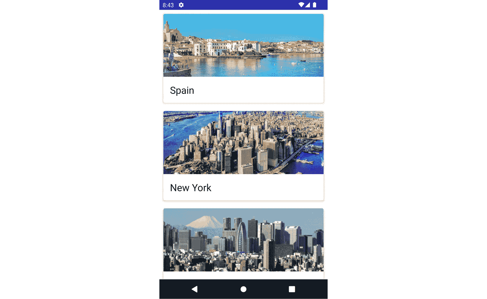

图 2.7 – 可滚动的城市列表

## 它是如何工作的…

在 Kotlin 中，列表有两种类型，**不可变**和**可变**。不可变列表是无法修改的项目，而可变列表是可以修改的列表中的项目。为了定义列表，我们可以说列表是一个泛型有序元素集合，这些元素可以是整数、字符串、图像等，这主要取决于我们希望列表包含的数据类型。例如，在我们的例子中，我们有一个字符串和图像，通过名称和图像帮助我们识别我们最喜欢的城市。

在我们的`City`数据类中，我们使用`@StringRes`和`@DrawableRes`来直接从`res`文件夹中轻松获取`Drawable`和`String`，它们也代表了图像和字符串的 ID。

我们创建了`CityList`，并使用组合函数进行注释，声明城市对象列表作为函数的参数。在 Jetpack Compose 中，可滚动的列表是通过`LazyColumn`实现的。`LazyColumn`与`Column`的主要区别在于，使用`Column`时，你只能显示少量项目，因为 Compose 一次加载所有项目。

此外，列只能持有固定的组合函数，而`LazyColumn`，正如其名所示，按需加载内容，这使得在需要时加载更多项目变得很好。此外，`LazyColumn`内置了滚动功能，这使得开发者的工作更加容易。

我们还创建了一个组合函数`CityCard`，其中我们导入了来自 Compose 的`Card()`元素。卡片包含关于单个对象的内容和操作；在我们的例子中，例如，我们的卡片有一个图像和城市的名称。Compose 中的`Card()`元素在其参数中有以下输入：

```java
@Composable
fun Card(
    modifier: Modifier = Modifier,
    shape: Shape = MaterialTheme.shapes.medium,
    backgroundColor: Color = MaterialTheme.colors.surface,
    contentColor: Color = contentColorFor(backgroundColor),
    border: BorderStroke? = null,
    elevation: Dp = 1.dp,
    content: @Composable () -> Unit
),
```

这意味着你可以轻松地将卡片模型调整为最佳匹配；我们的卡片有填充和提升，范围有一个列。在这个列中，我们有一个图像和文本，这有助于描述图像以提供更多上下文。

## 参见

在 Compose 中还有更多关于列表和网格要学习的内容；你可以使用此链接了解更多信息：[`developer.android.com/jetpack/compose/lists`](https://developer.android.com/jetpack/compose/lists)。

# 使用 Jetpack Compose 和视图页实现第一个标签布局

在 Android 开发中，页面之间有滑动是非常常见的，一个重要的用例是在引导页或甚至当你尝试以标签页、轮播的方式显示特定数据时。在这个菜谱中，我们将构建一个简单的水平分页器在 Compose 中，并看看我们如何利用新知识来构建更好、更现代的 Android 应用。

## 准备工作

在这个例子中，我们将构建一个水平分页器，当被选中时改变颜色以显示选中状态。我们将深入研究状态，在 *第三章*，*在 Jetpack Compose 中处理 UI 状态和使用 Hilt*，以获得更好的理解。打开 `Compose Basics` 项目开始。

## 如何操作…

按照以下步骤构建你的标签页轮播：

1.  将以下分页器依赖项添加到 `build.gradle(Module:app)`：

    ```java
    implementation "com.google.accompanist:accompanist-pager:0.x.x"
    ```

    ```java
    implementation "com.google.accompanist:accompanist-pager-indicators:0.x.x"
    ```

    ```java
    implementation 'androidx.Compose.material:material:1.x.x'
    ```

Jetpack Compose 提供了 **Accompanist**，这是一组旨在通过开发者常用的功能来支持它的库 – 例如，在我们的案例中，就是分页器。

1.  在之前菜谱的相同项目中，让我们创建一个包并命名为 `pagerexample`；在其内部，创建一个 Kotlin 文件并命名为 `CityTabExample`；在这个文件中，创建一个可组合函数并命名为 `CityTabCarousel`：

    ```java
    @Composable
    ```

    ```java
    fun CityTabCarousel(){}
    ```

1.  现在，让我们继续构建我们的 `CityTabCarousel`；在我们的例子中，我们将创建一个包含来自先前项目的城市的模拟页面列表：

    ```java
    @Composable
    ```

    ```java
    fun CityTabCarousel(
    ```

    ```java
        pages: MutableList<String> = arrayListOf(
    ```

    ```java
            "Spain",
    ```

    ```java
            "New York",
    ```

    ```java
            "Tokyo",
    ```

    ```java
            "Switzerland",
    ```

    ```java
            "Singapore",
    ```

    ```java
            "Paris" )) {. . .}
    ```

1.  我们需要根据状态改变按钮的颜色，为此，我们需要使用 `LocalContext`，它提供了我们可以使用的上下文。我们还需要创建一个 `var pagerState = rememberPagerState()`，这将记住我们的分页器状态，最后，当点击时，我们需要将分页器移动到下一个城市，这将非常有帮助。因此，继续向 `CityTabCarousel` 可组合函数中添加以下内容：

    ```java
    val context = LocalContext.current
    ```

    ```java
    var pagerState = rememberPagerState()
    ```

    ```java
    val coroutineScope = rememberCoroutineScope()
    ```

1.  现在，让我们创建 `Column` 元素并添加我们的 `ScrollableTabRow()` 可组合函数：

    ```java
    Column {
    ```

    ```java
        ScrollableTabRow(
    ```

    ```java
            selectedTabIndex = pagerState.currentPage,
    ```

    ```java
            indicator = { tabPositions ->
    ```

    ```java
                TabRowDefaults.Indicator(...)
    ```

    ```java
            },
    ```

    ```java
            edgePadding = 0.dp,
    ```

    ```java
            backgroundColor = Color(
    ```

    ```java
                context.resources.getColor(R.color.white,
    ```

    ```java
                    null)),
    ```

    ```java
        ) {
    ```

    ```java
            pages.forEachIndexed { index, title ->
    ```

    ```java
                val isSelected =
    ```

    ```java
                    pagerState.currentPage == index
    ```

    ```java
                TabHeader(
    ```

    ```java
                    title,
    ```

    ```java
                    isSelected,
    ```

    ```java
                    onClick = { coroutineScope.launch {
    ```

    ```java
                    pagerState.animateScrollToPage(index)
    ```

    ```java
                    } },
    ```

    ```java
                )
    ```

    ```java
            }
    ```

    ```java
        }
    ```

1.  为 `HorizontalPager` 添加 `Text()` 和 `TabHeader()`：

    ```java
        HorizontalPager(
    ```

    ```java
            count = pages.size,
    ```

    ```java
            state = pagerState,
    ```

    ```java
            modifier = Modifier
    ```

    ```java
                .fillMaxWidth()
    ```

    ```java
                .fillMaxHeight()
    ```

    ```java
                .background(Color.White)
    ```

    ```java
        ) { page ->
    ```

    ```java
            Text(
    ```

    ```java
                text = "Display City Name:
    ```

    ```java
                    ${pages[page]}",
    ```

    ```java
                modifier = Modifier.fillMaxWidth(),
    ```

    ```java
                style = TextStyle(
    ```

    ```java
                    textAlign = TextAlign.Center
    ```

    ```java
                )
    ```

    ```java
            )
    ```

    ```java
        }
    ```

1.  请通过在 *技术要求* 部分提供的链接下载此菜谱的完整代码，以添加所有必需的代码。最后，运行 `@Preview` 函数，你的应用应该看起来像 *图 2**.8*。

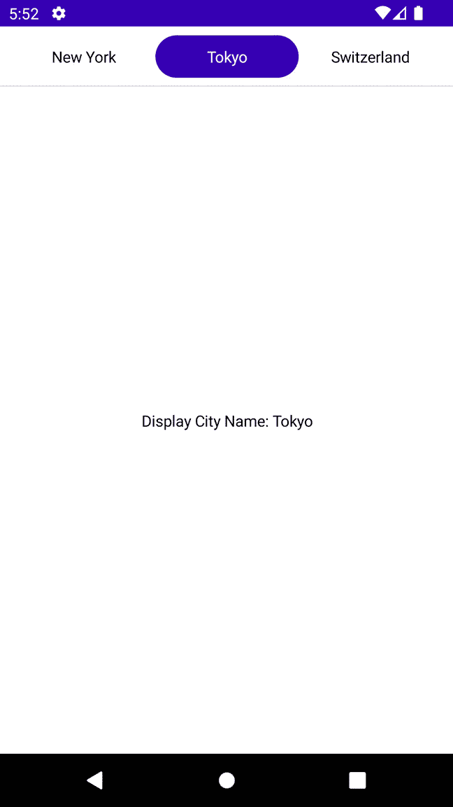

图 2.8 – 城市标签页

## 作用原理…

Accompanist 包含一些重要的库 – 例如，系统 UI 控制器、AppCompact Compose 主题适配器、Material 主题适配器、分页器、Drawable 绘画器和流布局，仅举几例。

我们在 `CityTabCarousel` 函数中的 `Column` 内部使用的 `ScrollableTabRow()` 包含一排标签，并有助于显示当前聚焦或选中的标签下的指示器。此外，正如其名称所暗示的，它允许滚动，你不需要实现额外的滚动工具。它还将其标签偏移放置在起始边缘，你可以快速滚动屏幕外的标签，正如你在运行 `@Preview` 函数并与之互动时所看到的那样。

当我们在 Compose 中调用 `remember()` 时，这意味着我们保持任何值在重新组合时的一致性。Compose 提供这个函数来帮助我们存储单个对象到内存中。当我们触发应用程序运行时，`remember()` 存储初始值。正如其词义，它只是保留值并返回存储的值，以便可组合函数可以使用它。

此外，每当存储的值发生变化时，你可以更新它，而 `remember()` 函数将保持它。下次我们在应用程序中触发另一个运行并发生重新组合时，`remember()` 函数将提供最新的存储值。

你也会注意到我们的 `MutableList<String>` 在每个位置都有索引，我们这样做是为了检查哪个被选中了。正是在这个 Lambda 中，我们调用 `TabHeader` 并展示选中的标签页。`forEachIndexed` 对每个元素执行给定的操作，并提供元素的顺序索引。我们还确保当用户点击特定的标签时，我们处于正确的页面：

```java
onClick = { coroutineScope.launch { pagerState.animateScrollToPage(index) } }
```

`HorizontalPager` 是一个水平滚动的布局，允许我们的用户从左到右翻动项目。它接受几个输入，但我们根据我们的用例提供计数、状态和修饰符。在 Lambda 中，我们显示文本 – 在我们的例子中，显示我们所在的页面，这有助于导航，如 *图 2**.9* 所示：

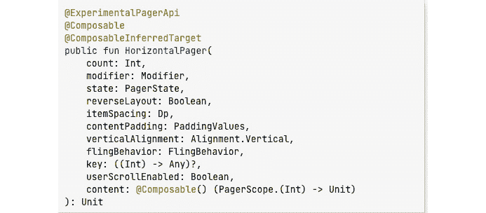

图 2.9 – HorizontalPager

我们的 `TabHeader` 可组合函数有一个 `Box()`；在 Jetpack Compose 中，一个盒子将始终根据内容大小调整自身，并且这受指定约束的限制。在我们的例子中，我们用可选择的修饰符装饰我们的 `Box`，这配置组件作为互斥组的一部分可被选择，允许在任何给定时间只选择每个项目一次。

重要提示

确保你的目标和编译 SDK 目标为 33。此外，你会注意到 Accompanist 的大多数库都是实验性的，这意味着它们可能会改变。关于是否在生产中使用这些库存在争议，因此你应该始终咨询你的团队关于这些 API。要查看 Accompanist 支持的库的完整列表，你可以点击以下链接：[`github.com/google/accompanist`](https://github.com/google/accompanist)。

# 在 Compose 中实现动画

Android 中的动画是将运动效果添加到视图的过程。这可以通过使用图像、文本，甚至启动一个新的屏幕来实现，在那里使用运动效果可以明显地注意到过渡。在现代 Android 开发中，动画至关重要，因为现代 UI 更加交互式，更能适应更平滑的体验，用户也喜欢它们。

此外，如今的应用程序评分是基于它们的 UI 和用户体验有多好，因此确保你的应用程序现代化且稳健是必要的。在这个例子中，我们将构建一个可折叠的工具栏，这是一种在 Android 世界中广泛使用的动画。

## 准备工作

我们将继续使用 `Compose` `基础` 项目。

## 如何实现...

在这个食谱中，我们将构建一个可折叠的工具栏；现在你可以利用 Compose 的力量构建其他出色的动画。力量在你手中：

1.  我们不需要为此食谱添加任何依赖项。我们已经有了一切所需。因此，让我们继续创建一个新的包并添加一个 Kotlin 文件，名为`collapsingtoolbar`。

1.  在 Kotlin 文件中，继续创建一个新的可组合函数，`CollapsingTool``BarExample()`：

    ```java
    @Composable
    ```

    ```java
    fun CollapsingToolbarExample() {...}
    ```

1.  我们将需要的所有可组合函数都将放在一个框中；你可以参考之前的食谱来刷新你的记忆。我们还需要定义我们将开始折叠视图的高度，这可以基于个人喜好；在我们的例子中，我们可以将`height`设置为`260.dp`：

    ```java
    private val height = 260.dp
    ```

    ```java
    private val titleToolbar = 50.dp
    ```

1.  让我们继续添加更多的可组合函数，并使用虚拟文本数据来显示，一旦我们滚动内容。我们可以假设这个应用程序用于阅读我们显示的城市的信息：

    ```java
    @Composable
    ```

    ```java
    fun CollapsingToolbarExample() {
    ```

    ```java
        val scrollState: ScrollState =
    ```

    ```java
            rememberScrollState(0)
    ```

    ```java
        val headerHeight = with(LocalDensity.current) {
    ```

    ```java
            height.toPx() }
    ```

    ```java
        val toolbarHeight = with(LocalDensity.current) {
    ```

    ```java
            titleToolbar.toPx() }
    ```

    ```java
        Box(
    ```

    ```java
            modifier = Modifier.fillMaxSize()
    ```

    ```java
        ) {
    ```

    ```java
            CollapsingHeader(scrollState, headerHeight)
    ```

    ```java
            FactsAboutNewYork(scrollState)
    ```

    ```java
            OurToolBar(scrollState, headerHeight,
    ```

    ```java
                toolbarHeight)
    ```

    ```java
            City()
    ```

    ```java
        }
    ```

    ```java
    }
    ```

1.  在我们的`CollapsingHeader`函数中，我们传递滚动状态和`headerHeight`一个浮点数。我们用`Modifier.graphicLayer`装饰 Box，其中我们设置了一个视差效果，使其看起来很好，并且易于展示。

1.  我们还确保添加了一个`Brush()`并设置了所需的颜色，并指定了它应该开始的位置：

    ```java
    Box(
    ```

    ```java
        Modifier
    ```

    ```java
            .fillMaxSize()
    ```

    ```java
            .background(
    ```

    ```java
                brush = Brush.verticalGradient(
    ```

    ```java
                    colors = listOf(Color.Transparent,
    ```

    ```java
                    Color(0xFF6D38CA)),
    ```

    ```java
                    startY = 1 * headerHeight / 5
    ```

    ```java
                )
    ```

    ```java
            )
    ```

    ```java
    )
    ```

    ```java
    ...
    ```

1.  `FactsAboutNewYork`不是一个复杂的可组合函数，只是虚拟文本；然后，最后，在`ToolBar`中，我们利用`AnimatedVisibility`并声明我们的`enter`和`exit`过渡：

    ```java
    AnimatedVisibility(
    ```

    ```java
        visible = showToolbar,
    ```

    ```java
        enter = fadeIn(animationSpec = tween(200)),
    ```

    ```java
        exit = fadeOut(animationSpec = tween(200))
    ```

    ```java
    ) {
    ```

    ```java
    ...
    ```

1.  最后，运行`@Preview`函数，你将得到一个可折叠的工具栏，这将为你的 UI 带来平滑的体验。此外，在*技术要求*部分获取完整的代码。

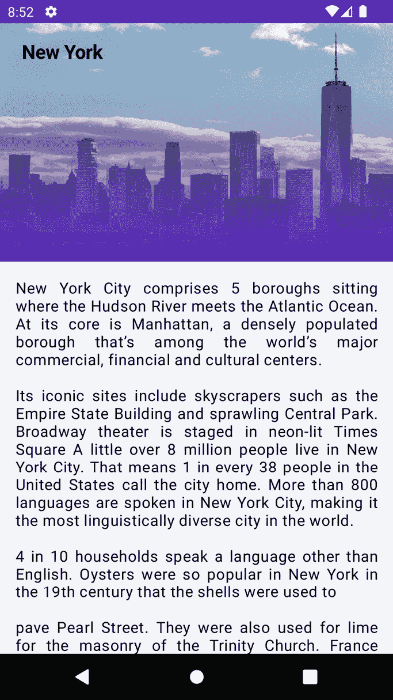

图 2.10 – 一个可折叠的工具栏

## 工作原理...

在现代 Android 开发中，Jetpack Compose 库提供了许多作为可组合函数可用的动画 API。例如，你可能希望你的图片或文本淡入淡出。

因此，如果你正在动画化出现和消失，这可以是一个图像、文本、单选组、按钮等等，你可以使用`AnimatedVisibility`来实现这一点。否则，如果你正在根据状态交换内容，并希望你的内容交叉淡入淡出，你可以使用`CrossFade`或`AnimatedContent`。

`val headerHeight = with(LocalDensity.current) { height.toPx() }` 提供密度，该密度将用于转换 DP 和 SP 单位，当我们在提供 DP 时可以使用它，我们将在稍后将其转换为布局的主体。

您可以调用修饰符并使用 `graphicsLayer` 独立更新其上方的任何内容，以最小化无效内容。此外，`graphicsLayer` 可以用于应用缩放、旋转、不透明度、阴影或甚至裁剪等效果。

`translationY = -scroll.value.toFloat() / 2f`基本上设置了层相对于其顶部边界的垂直像素偏移。默认值始终为零，但您可以自定义以适应您的需求。我们还确保渐变只应用于包裹标题，`startY = 1 * headerHeight /` `5`。

`EnterTransition` 定义目标内容应该如何出现；这里的“目标”可以是图像、文本，甚至是单选组。另一方面，`ExitTransition` 定义当退出应用程序或导航离开时，初始目标内容应该如何消失。

`AnimatedContent` 提供 `slideIntoContainer` 和 `slideOutOfContainer`，并根据目标状态的变化动画化其内容，这是非常出色的。此外，您还可以通过创建一个包含所有动画值和 `Update()` 函数的类来封装转换并使其可重用，该函数返回该类的实例。

同样，值得一提的是，与使用 `MotionLayout` 在 Android 中进行动画的旧方法一样，在 Jetpack Compose 中有许多进行转换的方法。例如，在 *表 2.1* 中，您将看到不同类型的转换：

| **EnterTransition** | **ExitTransition** |
| --- | --- |
| `SlideIn` | `SlideOut` |
| `FadeIn` | `FadeOut` |
| `SlideInHorizontally` | `SlideOutHorizontally` |
| `SlideInVertically` | `SlideOutVertically` |
| `ScaleIn` | `SlaceOut` |
| `ExpandIn` | `ShrinkOut` |
| `ExpandHorizontally` | `ShinkHorizontally` |
| `ExpandVertically` | `ShrinkVertically` |

表 2.1 – 一个显示不同类型转换的表格

此外，您可以通过通过 `AnimatedVisibility` 内容 lambda 中的 `transition` 属性访问基本转换实例，在 Jetpack Compose 中添加您自己的自定义动画效果，而无需超出已内置的进入和退出动画。您还会注意到已添加的任何动画状态。

# 在 Jetpack Compose 中实现可访问性

在我们构建 Android 应用程序时，我们需要始终牢记可访问性，因为这使技术更具包容性，并确保在构建应用程序时考虑到所有有特殊需求的人。

可访问性应该是团队的努力。如果处理得当，优势包括有更多人使用您的应用程序。可访问的应用程序对每个人来说都更好。您还可以降低被起诉的风险。

有不同的残疾类型，如视觉、听觉和运动障碍。如果你打开你的 **无障碍** 设置，你会看到残疾人士在其设备上使用的不同选项。

## 准备工作

如同之前的食谱，我们将继续使用之前食谱中的示例项目；你不需要安装任何东西。

## 如何操作…

对于这个食谱，我们将描述视觉元素，这些元素非常重要：

1.  默认情况下，当我们添加一个 `Image` 函数时，你可能会注意到它有两个参数，一个是用于图像的绘制器，另一个是用于视觉描述元素的文本描述：

    ```java
    Image(painter = , contentDescription = )
    ```

1.  当你将内容描述设置为 `null` 时，你向 Android 框架表明此元素没有关联的动作或状态。所以，让我们继续更新我们所有的内容描述：

    ```java
    Image(
    ```

    ```java
        modifier = modifier
    ```

    ```java
        painter = painterResource(city.imageResourceId),
    ```

    ```java
        contentDescription =
    ```

    ```java
            stringResource(R.string.city_images))
    ```

    ```java
    )
    ```

1.  确保将字符串添加到 `string` `res` 文件夹：

    ```java
    <string name="city_images">City Images</string>
    ```

1.  因此，请确保为需要它的每个图像添加内容描述。

1.  在 Compose 中，你可以通过在修饰符中指定并使用语义来显示这是一个标题，轻松地指示一个文本是否是标题。让我们在我们的装饰文本中添加这个：

    ```java
    ...
    ```

    ```java
    modifier = Modifier
    ```

    ```java
        .padding(18.dp)
    ```

    ```java
        .semantics { heading() }
    ```

    ```java
    ...
    ```

1.  最后，我们可以继续编译、运行并测试我们的应用程序是否可以通过以下链接手动测试（使用 talkback 或使用自动化测试）来验证无障碍性：[`developer.android.com/guide/topics/ui/accessibility/testing`](https://developer.android.com/guide/topics/ui/accessibility/testing)。

## 它是如何工作的…

Jetpack Compose 是考虑到无障碍性构建的；也就是说，如 `RadioButton`、`Switch` 等材料组件在内部设置了大小，但仅当这些组件可以接收用户交互时。

此外，任何用户可以点击或与之交互的屏幕元素应该足够大，以便可靠地交互。标准格式将这些元素设置为至少 `48dp` 的宽度和高度。

例如，`Switch` 的 `onCheckChanged` 参数被设置为非空值，包括至少 `48dp` 的宽度和高度；我们将有 `CheckableSwitch()` 和 `NonCheckableSwitch()`：

```java
@Composable
fun CheckableSwitch(){
    var checked by remember { mutableStateOf(false) }
    Switch(checked = checked, onCheckedChange = {} )
}
@Composable
fun NonCheckableSwitch(){
    var checked by remember { mutableStateOf(false) }
    Switch(checked = checked, onCheckedChange = null )
}
```

一旦你在你的应用程序中实现了无障碍功能，你可以通过从 Play Store 安装分析工具（`uiautomatorviewer` 和 `lint`）来轻松测试它。你也可以使用 Espresso 或 Roboelectric 自动化你的测试，以检查无障碍支持。

最后，你可以通过转到 **设置**，然后转到 **无障碍**，并选择 **talkback** 来手动测试你的应用程序的无障碍支持。这位于屏幕顶部；然后按 **开启** 或 **关闭** 来打开或关闭 talkback 功能。然后，导航到对话框确认，点击 **确定** 以确认权限。

## 更多…

在开发者构建应用程序时，他们应该考虑更多关于可访问性的问题，包括一个状态，使他们能够通知用户是否已选择`Switch`按钮。这确保了他们的应用程序支持可访问性并符合标准。

# 使用 Jetpack Compose 实现声明式图形

在 Android 开发中，你的应用程序可能有不同的需求，这种需求可能是为了特定目的而构建自己的自定义图形。这在许多稳定的大型 Android 代码库中非常常见。任何自定义视图的关键部分是其外观。此外，自定义绘图可能是一个非常简单或复杂的任务，这取决于应用程序的需求。在现代 Android 开发中，Jetpack Compose 使得处理自定义图形变得更加容易，因为需求巨大。例如，许多应用程序可能需要精确控制屏幕上发生的事情；用例可能简单到在屏幕上放置一个圆，或者构建更复杂的图形来处理已知用例。

## 准备工作

打开`Compose Basics`项目开始这个菜谱。你可以在*技术要求*部分找到完整的代码。

## 如何做到这一点...

在我们的项目中，让我们创建一个新的包，命名为`circularexample`；在这个包内部，创建一个 Kotlin 文件，命名为`DrawCircleCompose`；在文件内部，创建一个`CircleProgressIndicatorExample`可组合函数。目前你不需要导入任何内容：

1.  现在，让我们继续定义我们的可组合函数。由于在我们的例子中，我们想在圆中显示一个跟踪器，我们需要浮动以填充我们的圆。我们还将定义颜色，以帮助我们识别进度：

    ```java
    @Composable
    ```

    ```java
    fun CircleProgressIndicatorExample(tracker: Float, progress: Float) {
    ```

    ```java
        val circleColors = listOf(
    ```

    ```java
            colorResource(id = R.color.purple_700),
    ```

    ```java
            colorResource(id = R.color.teal_200)
    ```

    ```java
        )
    ```

1.  现在，让我们调用`Canvas`来绘制我们的弧线。我们给我们的圆设置大小为`200.dp`，并添加`8.dp`的内边距。有趣的部分在于`onDraw`。`startAngle`设置为`-90`；起始角度以度为单位设置，以便更好地理解。

零代表 3 点钟方向，你也可以调整你的起始角度来观察`-90`是如何转换的。`useCenter`布尔值表示是否将弧线闭合到边界中心。因此，在我们的例子中，我们将它设置为`false`。然后，最后，我们设置`style`，这可以根据我们的喜好设置为任何内容：

```java
Canvas(
    modifier = Modifier
        .size(200.dp)
        .padding(8.dp),
    onDraw = {
        this.drawIntoCanvas {
            drawArc(
                color = colorSecondary,
                startAngle = -90f,
                sweepAngle = 360f,
                useCenter = false,
                style = Stroke(width = 55f, cap =
                    StrokeCap.Butt),
                size = Size(size.width, size.height)
            )
colorResource(id = R.color.teal_200)
 . . .
```

1.  我们刚刚画出了圆的第一部分；现在，我们需要用`Brush`绘制进度，它使用`linearGradient`：

    ```java
    drawArc(
    ```

    ```java
        brush = Brush.linearGradient(colors =
    ```

    ```java
            circleColors),
    ```

    ```java
        startAngle = -90f,
    ```

    ```java
        sweepAngle = progress(tracker, progress),
    ```

    ```java
        useCenter = false,
    ```

    ```java
        style = Stroke(width = 55f, cap =
    ```

    ```java
            StrokeCap.Round),
    ```

    ```java
        size = Size(size.width, size.height)
    ```

    ```java
    ) . . .
    ```

    ```java
    . . .
    ```

1.  最后，我们的`progress`函数告诉`sweepAngle`我们的进度应该基于我们的跟踪能力：

    ```java
    private fun progress(tracker: Float, progress: Float): Float {
    ```

    ```java
        val totalProgress = (progress * 100) / tracker
    ```

    ```java
        return ((360 * totalProgress) / 100)
    ```

    ```java
    }
    ```

    ```java
    . . .
    ```

1.  运行`preview`函数，你应该会看到一个与*图 2.11*相同的圆形进度指示器。

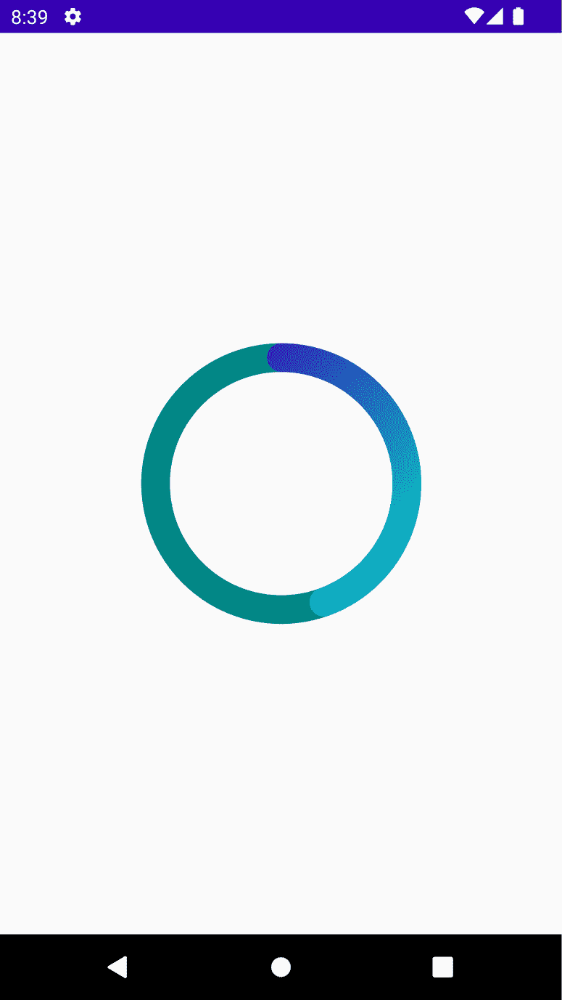

图 2.11 – 显示圆形进度图像

重要提示

`Canvas`组合函数使用`Canvas`来组合一个对象，该对象反过来创建并帮助管理基于视图的 Canvas。同时，重要的是要提到，Compose 通过维护状态和创建及释放任何必要的辅助对象，使开发者更容易使用。

## 它是如何工作的...

通常，`Canvas`允许你指定屏幕上你想要绘制区域的区域。在旧的 Android 应用程序构建方式中，我们也使用了`Canvas`，而现在在 Compose 中，它更加强大和有价值。

`linearGradient`使用指定的颜色和提供的起始和结束坐标创建一个线性渐变。在我们的示例中，我们提供了项目自带的基本颜色。

绘图函数有一些默认的参数，你可以使用。例如，默认情况下，`drawArc`，如你所见，接受几个输入：

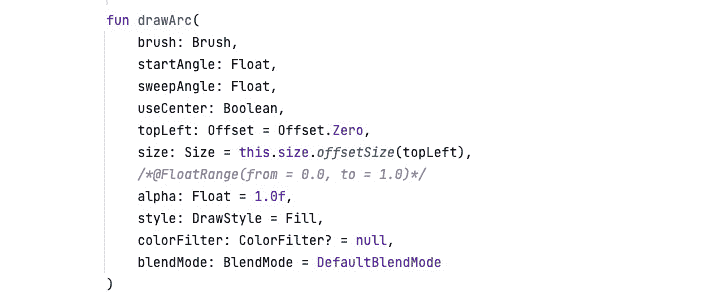

图 2.12 – 展示 drawArc 函数的输入

在我们的示例中，`sweepAngle`，它表示相对于`startAngle`按顺时针方向绘制的弧度大小，返回一个计算进度的函数。这个函数可以根据你的需求进行定制。在我们的示例中，我们传递了一个跟踪器和进度，并返回一个浮点数。

由于我们想要填充圆形，我们创建`cal totalProgress`，它检查*progress * 100*除以跟踪器，并返回*360 (circle) *我们的进度除以 100*。你可以根据你的需求定制这个函数。你还可以编写代码来监听你的位置，并根据你创建的监听器的输入值移动进度。

## 还有更多...

你可以用`Canvas`和自定义绘图做更多的事情。一个增强你对这个主题知识的好方法是查看 Stack Overflow 上发布的旧解决方案，例如绘制一个心形或任何其他形状，并看看你能否在 Compose 中做到同样的效果。
