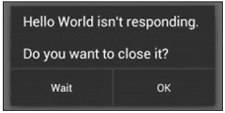
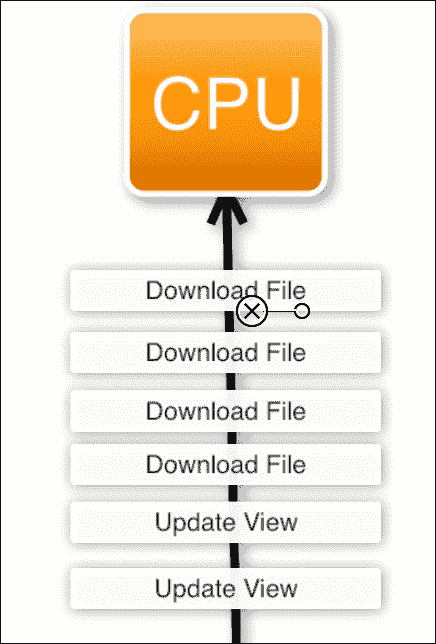
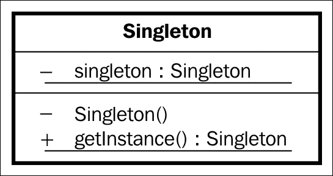
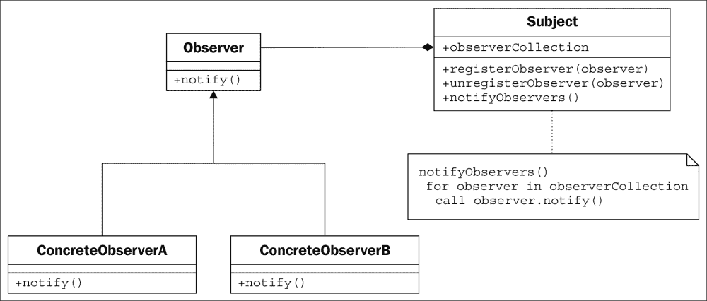

# 第四章：并发和软件设计模式

作为开发者，你不仅要编写可以工作的代码，而且要尽可能使用现有的解决方案，以便将来可以更好地维护你的代码。如果其他开发者需要在你项目中工作，他们会很快理解你在做什么。这要归功于软件设计模式。

为了正确理解这些模式，我们需要了解 Android 中并发工作原理的基本概述。我们将阐明 UI 线程是什么，并讨论在线程中延迟事件的不同机制。

我们将介绍在 Android 中最常用的模式，这将帮助我们进一步了解 Android 功能和开发技术，并成为更好的开发者。

+   并发

    +   处理器和线程

    +   AsyncTask

    +   服务

    +   IntentService

    +   加载器

+   Android 中的模式

    +   单例

    +   适配器和持有者

    +   观察者

# Android 中的并发

如果你是一个 Android 用户，你可能会对 ANR 消息有所了解。这可能不会让你立刻明白，所以请看以下图片：



**活动无响应**（**ANR**）发生在 UI 或主线程中运行代码时，阻止用户交互超过 5 秒钟。

在 Android 中，一个应用程序运行一个单一的线程，称为用户界面线程。我们将解释线程是什么，即使是没有编程背景的读者也能理解。我们可以将线程视为由 CPU 执行的指令或消息列。这些指令来自不同的地方；它们来自我们的应用程序以及操作系统。这个线程用于处理用户的响应、生命周期方法和系统回调。

CPU 逐个顺序地处理消息；如果它很忙，消息将在队列中等待执行。因此，如果我们在应用程序中执行长时间的操作并向 CPU 发送许多消息，我们将不会让 UI 消息得到执行，这将导致用户感受到手机无响应。



这个问题的解决方案似乎很明显：如果一个线程不够用，我们可以使用多个。例如，如果我们发起一个网络请求，这将在另一个线程中完成，并且当它结束时，它会与主线程通信以显示所请求的数据。

只有主线程或 UI 线程可以访问 UI；因此，如果我们 在另一个线程中执行任何后台计算，我们必须告诉主线程显示这些计算的结果，因为我们不能直接从那里做。

## 处理器和线程

我们之前描述的消息在一个名为`MessageQueue`的队列中运行，这个队列是每个线程独有的。一个处理器可以向这个队列发送消息。当我们创建一个处理器时，它与创建它的线程的`MessageQueue`相关联。

处理器用于两种情况：

+   向同一线程发送延迟消息

+   向另一个线程发送消息

这就是为什么在我们的`SplashActivity`中，我们将使用以下代码：

```java
new Handler().postDelayed(new Runnable() {
  @Override
  public void run() {

    Intent intent = new Intent(SplashActivity.this, MainActivity.class)

    startActivity(intent);
  }
},3000);
```

### 提示

当你创建一个新的`Handler()`方法时，请确保导入`Android.OS`处理程序。

在这里，我们使用了`postDelayed(Runnable, time)`方法来发送一个延迟的消息。在这种情况下，消息是一个可运行对象，表示可以执行的命令。

当`runOnUIThread()`活动内部有一个方法，允许我们向 UI 线程发送一个可运行对象时，就不需要创建处理程序与它通信。当我们有活动的上下文并且想在 UI 上运行某些内容时，这非常有用，例如从在后台执行的任务中向 UI 发布更新。

如果我们查看 Android 源代码中的方法，我们可以看到它只是简单地使用处理程序在 UI 线程中发布可运行对象：

```java
public final void runOnUiThread(Runnable action) {
  if (Thread.currentThread() != mUiThread) {
    mHandler.post(action);
  } else {
    action.run();
  }
}
```

通常，当我们想要在后台执行长时间任务并想要管理并行线程执行时，会手动创建线程。线程有一个`run()`方法，在其中执行指令，并在创建后启动以执行`run()`：

```java
Thread thread = new Thread(){

  @Override
  public void run() {
    super.run();
  }
};

thread.start();
```

创建线程和处理程序以执行后台任务的缺点是手动处理，如果我们有太多这样的任务，很容易导致应用程序变得难以阅读。Android 有其他机制来执行任务，如`AsyncTask`。

## 介绍 AsyncTasks

这可能是你在初学者级别看到的内容，但我们将从并发性的角度来查看它。`Asynctask`基于线程和处理程序，旨在轻松地在后台执行任务并发布 UI 更新。

要使用`AsyncTask`，需要对其进行子类化，它有四个可以被覆盖的方法：`onPreExecute`，`doInBackground`，`onProgressUpdate`和`onPostExecute`。

`OnPreExecute`方法在后台执行任何工作之前调用；这意味着它仍在 UI 线程上，并用于在开始任务前初始化变量和进度。

`doInBackground`方法在后台线程中执行。在这里，你可以调用`onProgressUpdate`，它向 UI 线程发布一个更新，例如，通过增加`ProgressBar`的值来显示任务的进度。

最后一个方法，`onPostExecute`，在后台任务完成并且在 UI 线程上运行时被调用。

以一个例子来说明：一个`AsyncTask`在后台运行需要*x*秒完成，并且每秒更新一次进度。进度条对象作为参数在构造函数中传递，秒数作为参数在`execute`方法中传递，在`doInBackground`中检索。请注意，在以下代码中，`<Integer,Integer,Void>`类型分别指的是输入参数、进度更新和后执行阶段的类型：

```java
public class MyAsyncTask extends AsyncTask<Integer,Integer,Void> {

  ProgressBar pB;

  MyAsyncTask(ProgressBar pB) {
    this.pB = pB;
  }

  @Override
  protected void onPreExecute() {
    super.onPreExecute();
    pB.setProgress(0);
  }

  @Override
  protected void onProgressUpdate(Integer... values) {
    super.onProgressUpdate(values);
    pB.setProgress(values[0]);
  }

  @Override
  protected Void doInBackground(Integer... integers) {
    for (int i = 0; i < 10; i++){
      try {
        Thread.sleep(1000);
      } catch (InterruptedException e) {
        e.printStackTrace();
      }
      onProgressUpdate(new Integer[]{i});
    }
    return null;
  }

  @Override
  protected void onPostExecute(Void o) {
    super.onPostExecute(o);
    Log.d("AsyncTask","Completed");
  }

}
```

创建了`AsyncTask`类后，以下是我们可以执行它的方式：

```java
new MyAsyncTask( progressBar ).execute(new Integer[]{10});
```

如果我们同时执行一个以上的`AsyncTask`，从 Android 3.0 版本开始，它们默认会按顺序运行。如果我们想要并行运行它们，将不得不创建一个执行器，并使用`THREAD_POOL_EXECUTOR`参数调用`executeOnExecutor()`。

至于限制，我们应该提到`AsyncTask`必须始终从主线程执行，并且不能在同一个对象中两次调用`execute()`；因此，它们不能循环。

## 了解服务

当下载文件或执行任何短操作时，`AsyncTask`是理想的，你可以在任务完成时通知 UI。然而，在 Android 中，有些情况你需要执行一个非常长的任务，可能不需要 UI 交互。例如，你可以有一个应用在服务器上打开一个套接字（直接通道），用于流式传输音频，以便于收听广播应用。

即使应用不在屏幕上显示，服务仍然可以运行；它默认在后台运行，但使用的是主线程。因此，如果我们想要执行长时间的任务，需要在服务内部创建一个线程。它必须在清单文件中声明，如果我们将其声明为公开，也可以从另一个应用中使用。

与`AsyncTask`相反，服务可以从任何线程触发；它们通过`onStartService()`方法触发，并通过`onStopService()`停止。

可选地，服务可以绑定到一个组件；一旦你绑定了组件，就会调用`onBind()`。当绑定发生时，我们有一个接口可供组件与服务交互。

### 一种服务类型 – `IntentService`

`IntentService`是`services`的一个子类，可以从一个意图触发。它创建一个线程并包含回调，以了解任务何时完成。

`IntentService`背后的想法是，如果你不需要并行运行任务，实现一个接收意图并顺序处理它们的服务，并在任务完成时通知，会更容易。

当我们调用`onStart`时，服务会不断运行；然而，`IntentService`被创建后，只在收到意图并完成任务的小时间段内运行。

一个真实的例子，我们可以考虑一个应用，在应用不在屏幕上显示时，需要在后台执行短任务。这可能是新闻阅读器应用的情况，它将新闻存储在您的设备上，以便您在没有网络连接的情况下离线访问。这可能是一个每天发布文章的报纸应用，允许用户在没有网络连接的飞机上或在通勤的火车上阅读文章。

想法是，当文章发布时，应用在后台运行时用户会收到推送通知。这个通知将触发一个意图去下载文章，这样用户下次打开应用时，不需要任何额外交互，文章就已经在那里了。

下载文章是一个小而重复的任务，需要在应用在后台、在线程中运行时完成，无需并行操作，这正是`IntentService`完美适用的场景。

## 引入装载器（Introducing loaders）

在结束并发部分之前，我们将快速了解一下`Loader`类。装载器的目的是在活动中更容易地异步加载数据，因此在片段中也是如此。从 Android 3.0 开始，每个活动都有`LoaderManager`来管理在其中使用的装载器。在基于片段导航的应用程序中，即使在你切换片段之间，也可以在活动级别执行后台操作。

装载器（Loaders）从数据源加载数据；当这个数据源发生变化时，它会自动刷新信息，这也是为什么装载器与数据库配合使用堪称完美。例如，一旦我们将装载器连接到数据库，这个数据库就可能被修改，而装载器将捕获这些更改。这将允许我们即时刷新用户界面，让用户立即看到变化。

在第八章《数据库和装载器》中，我们将实现`CursorLoader`来查询我们将在`MasteringAndroidApp`中创建的数据库。

# 模式的重要性（The importance of patterns）

当软件开发者需要开发具有特定功能的功能或组件时，通常可以用不同的方法来做；可以用不同的代码或不同的结构来实现。很可能同样的问题已经被其他开发者解决了无数次，以至于解决方案从具体实现中抽象出来，变成了一个模式。与其重新发明轮子，不如了解并实施这些模式。

在 Android 开发中，我们每天都在使用模式，即使我们没有意识到这一点。大多数时候，我们使用的是 Android 内置的模式实现。例如，当我们想要对按钮执行点击操作并设置`OnClickListener`时——换句话说，就是等待`onClick()`方法被调用——我们使用的是观察者模式实现。如果我们创建一个弹出窗口`AlertDialog`，我们使用的是`AlertDialog.Builder`，它使用了生成器模式（Builder pattern）。有许多这样的例子，但我们希望的是能够将这些解决方案应用到我们自己的问题中。

有不同类型的模式分为四类，以下是在开发 Android 应用时我们可能会遇到的一些例子：

+   创建（Creation）

    +   单例（Singleton）

    +   生成器（Builder）

    +   工厂方法（Factory method）

+   行为型（Behavioral）

    +   观察者（Observer）

    +   策略（Strategy）

    +   迭代器（Iterator）

+   结构型（Structural）

    +   适配器（Adapter）

    +   门面（Façade）

    +   装饰器（Decorator）

+   并发（Concurrency）

    +   锁（Lock）

    +   调度器（Scheduler）

    +   读写锁（Read-write lock）

为了完成`MasteringAndroidApp`，我们需要实现前三个组的模式。关于第四组（并发），我们需要了解 Android 中的并发概念，但我们不需要自己实现一个并发模式。

### 提示（Tip）

模式通常由 UML 图表示。

根据维基百科（[`en.wikipedia.org/wiki/Class_diagram`](http://en.wikipedia.org/wiki/Class_diagram)），“*在软件工程中，统一建模语言（UML）中的类图是一种静态结构图，通过显示系统的类，它们的属性，操作（或方法）以及对象之间的关系来描述系统的结构*”。

## 单例模式

软件设计模式中的单例（Singleton），限制了对象的创建，使其只能有一个实例。想法是全局访问这个单一对象。

这种模式通过如果之前没有创建过对象就创建对象，如果已经创建过就返回现有实例来实现。以下是 UML 图：



在某些情况下，我们希望一个对象能够全局访问，并且我们希望它在应用程序中是唯一的。例如，在使用 Volley 时，我们希望保持一个唯一的请求队列，以便所有请求都在同一个队列中，并且我们希望它能够全局访问，因为我们需要从任何片段或活动中添加请求。

这是一个单例实现的基本示例：

```java
public class MySingleton {

    private static MySingleton sInstance;

    public static MySingleton getInstance(){
        if (sInstance == null) {
            sInstance = new MySingleton();
        }
        return sInstance;
    }
}
```

为了理解实现，请记住在 Java 中，静态变量与类相关联，而不是与对象相关联。同样，静态方法可以在不创建类实例的情况下调用。

拥有一个静态方法意味着它可以从应用程序的任何地方被调用。我们可以调用 `MySingleton.getInstance()`，它将始终返回相同的实例。第一次调用时，它会创建并返回它；后续调用时，它会返回已创建的实例。

使用单例和测试框架有一个缺点；我们将在第十一章，*在 Android 上调试和测试*中讨论这个问题。

### 应用程序类中的单例

我们可以将单例实现适配到 Android。鉴于在 `Application` 类中的 `onCreate` 方法在我们打开应用程序时只被调用一次，且 `Application` 对象不会被销毁，我们可以在应用程序中实现 `getInstance()` 方法。

应用这些更改后，我们的应用程序类将类似于以下结构：

```java
public class MAApplication extends Application {

  private static MAApplication sInstance;

  @Override
  public void onCreate() {
    super.onCreate();

    sInstance = this;

    // Enable Local Datastore.
    Parse.enableLocalDatastore(this);

    ParseObject.registerSubclass(JobOffer.class);

    Parse.initialize(this, "KEy", "KEY");
  }

  private static MAApplication getInstance(){
    return sInstance;
  }
}
```

现在，我可以在应用程序的任何地方调用 `MAAplication.getInstance()`，并在应用程序类中创建成员变量，通过单例 `MAAplication` 对象全局访问这些变量。例如，在 Volley 的情况下，我可以在 `OnCreate()` 中创建 `RequestQueue`，然后随时从 `MAAplication` 对象中获取它。执行以下代码：

```java
private RequestQueue mRequestQueue;

@Override
public void onCreate() {
  super.onCreate();

  sIntasnce = this;

  mRequestQueue = Volley.newRequestQueue(this);
  .
  .
  .
}

public RequestQueue getRequestQueue(){
  return mRequestQueue;
}
```

采用这种方法，我们有一个单例，即我们的 `Application` 类；其余的全局可访问对象都是成员变量。另一种选择是创建一个新的单例类来存储 Volley 请求队列以及每个需要全局访问的新请求单例。

### 提示

不要在`Application`类中使用这种方法来持久化数据。例如，如果我们点击主页按钮进入后台，过了一段时间后，Android 可能需要内存，会杀死应用。因此，下次打开应用时，即使看起来我们回到了上一个实例，也会创建一个新的实例。如果你在`onCreate`中重新初始化所有变量，并且后来不改变它们的状态，这样做是可以的。为了避免这种情况，请避免使用 setters。

## 观察者模式

这种模式在 Android 中得到了广泛的使用。我们讨论的大多数网络库都实现了这种模式，如果你是 Android 开发者，你肯定已经多次使用过它——我们需要实现它，甚至是为了检测按钮的点击。

观察者模式基于一个对象，即观察者，它注册其他对象来通知它们状态变化；在这里，监听状态变化的对象就是*观察者*。这种模式可以用来创建一个发布/订阅系统：



以下是一个注册多个观察者的模式的实现：

```java
public class MyObserved {

  public interface ObserverInterface{
    public void notifyListener();
  }

  List<ObserverInterface> observersList;

  public MyObserved(){
    observersList = new ArrayList<ObserverInterface>();
  }

  public void addObserver(ObserverInterface observer){
    observersList.add(observer);
  }

  public void removeObserver(ObserverInterface observer){
    observersList.remove(observer);
  }

  public void notifyAllObservers(){
    for (ObserverInterface observer : observersList){
      observer.notify();
    }
  }
}

public class MyObserver
implements MyObserved.ObserverInterface {

  @Override
  public void notify(){
    //Do something
  }
}
```

你会注意到，观察者可以是任何实现了接口—`ObserverInterface`的对象。这个接口是在被观察对象中定义的。

如果我们将这个与在 Android 中处理按钮点击的方式进行比较，我们执行`myButton.setOnClickListener(observer)`。在这里，我们添加了一个等待点击的观察者；这个观察者实现了`OnClick()`方法，这是在我们的案例中通知的方法。

在 Volley 中，当我们创建一个网络请求时，必须指定两个作为参数的监听器：`Response.Listener`和`Response.ErrorListener`，它们分别调用`onResponse()`和`onErrorResponse()`。这是观察者模式的清晰实现。

我们将在第六章，*CardView 和材料设计*中实现观察者模式的一个变体，即发布/订阅模式的例子。

## 介绍适配器模式

**适配器**是我们在创建`ListView`或`ViewPager`时在 Android 中使用的元素，但它也是一个众所周知的设计模式。我们将看看两者的定义及其关系。

一方面，适配器作为一种设计模式，它充当两个不兼容接口之间的桥梁。它允许两个不同的接口一起工作。这就像现实世界中的适配器，比如 SD 卡到 micro SD 卡的适配器，它允许两个不兼容的系统一起工作。如图所示，适配器被调用新的所需方法，但在内部，它调用来自*被适配者*的旧方法。


另一方面，来自`android.widget.Adapter`的适配器是一个对象，我们用它为列表的每一行或视图分页的每一页创建视图。因此，它适配数据、一组元素和一组视图。

要实现一个适配器，我们必须扩展`BaseAdapter`并重写`getView()`和`getCount()`方法。通过这两个方法，适配器将知道它需要创建多少个视图以及如何创建这些视图。

在下一章中，我们将更深入地探讨这个主题，同时使用`ListViews`，我们还将讨论`ViewHolder`模式，这是在 Android 中使用适配器和列表时的一种特殊模式。

# 总结

在本章结束时，你应该能够理解 Android 中的并发性以及与之工作的所有不同机制。你应该知道有一个主线程用于更新 UI，我们可以创建后台线程来执行其他任务。你还必须知道让应用在后台（换句话说，不在屏幕上）执行任务与在后台线程中执行任务的区别。你也应该知道软件设计模式的重要性，并能够实现其中的一些。

在下一章中，我们将学习如何使用列表视图，我们将实现一个适配器，并发现一种新模式`ViewHolder`，它将是理解从 Android Lollipop 开始引入的`ListView`和`RecyclerView`之间区别的关键。
