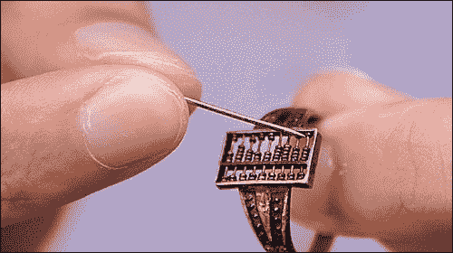
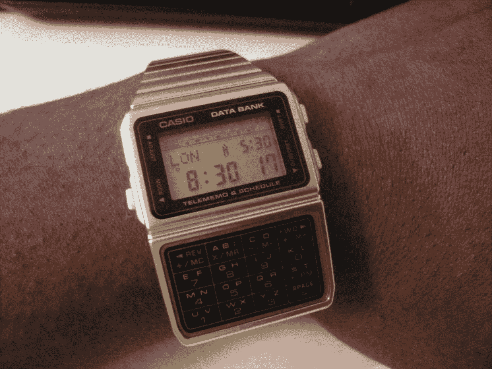
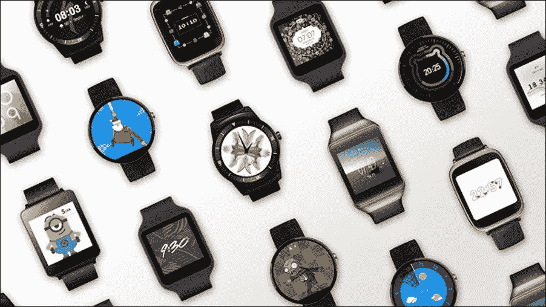

# 第一章. 可穿戴计算简介

|   | *"了解过去越多，你对未来的准备就越充分。" |   |
| --- | --- | --- |
|   | --*西奥多·罗斯福* |

在本章中，我们将讨论可穿戴计算的发展，并了解它如何与其他计算范例相匹配，例如桌面、移动和普适计算。

# 进化

可穿戴计算，尽管普遍被认为是最新的技术创新，但在算盘时代就已经存在了，算盘是一种几个世纪前由商人和贸易商使用的计算工具。根据中国文化的历史资料，人们认为在清朝时期，嵌在戒指中的算盘被用作计算器（[`www.chinaculture.org/classics/2010-04/20/content_383263_4.htm`](http://www.dailymail.co.uk/sciencetech/article-2584437/Is-wearable-computer-300-year-old-Chinese-abacus-ring-used-Qing-Dynasty-help-traders.html)）：

一种相对较新的现代可穿戴计算设备是卡西欧 Databank。它是卡西欧在 20 世纪 80 年代初制造的一系列电子手表，集成了计算器、计时器、世界时钟、联系人管理和电视及 VCR 的遥控器等功能。

它非常受欢迎，并被认为那个时代的科技奇迹。与那个时代可用的手动或简单的数字手表相比，它非常方便。它不仅用于查看时间和设置闹钟，还帮助执行一些实用功能，例如快速计算或在飞行中回忆存储的联系人信息：

创新者和发明家总是着迷于将技术与生活方式尽可能紧密地结合在一起。无论是被认为是第一个已知现代可穿戴设备用于控制 iPod 的 Burton Amp 夹克，还是用于宠物主人追踪宠物位置和活动的最新可穿戴设备**Whistle**，可穿戴设备正变得越来越普遍。

# 摩尔定律

英特尔联合创始人戈登·摩尔 50 年前预测，集成电路中晶体管数量的增长将大约每两年翻一番。这是计算能力爆炸性增长的基准。随着时间的推移，电子元件的尺寸逐渐减小，设备的处理能力变得更强大。

20 世纪 60 年代和 70 年代用于运行企业和大型企业的主机计算机，占据了客厅的大小。随后，它们缩小到中端服务器和台式计算机。计算机中使用的集成电路芯片和微处理器变得越来越强大，存储设备的尺寸变得很小，存储容量也增加了。

桌面电脑逐渐转变，以笔记本电脑和笔记本电脑的形式变得更加便携。笔记本电脑配备了可充电电池，可以让用户在需要的时候，无论何时何地，都可以使用他们的电脑来满足个人或商业需求。

**个人数字助理**（**PDA**）被用作移动计算设备，用于管理联系人和执行一些基本的与业务相关的任务。

然后进入了智能手机时代。当史蒂夫·乔布斯在 2007 年推出 iPhone 时，市场上已经有一些智能手机了。然而，苹果推出 iPhone 以及谷歌随后推出的 Android 平台，引领了智能手机行业的强劲和健康竞争。

我们现在在可穿戴设备趋势中看到的是历史的重演。但这一次，谷歌在 2014 年推出了 Android Wear 平台，而苹果在 2015 年 4 月宣布了其首款可穿戴手表。

三星、LG、Pebble 和 Jawbone 等主要公司都纷纷加入了这一行列，市场上已经出现了各种可穿戴设备。

# 普适计算

普适计算是一种计算范式，其中人类与计算机的交互可以在任何地方、任何地方以及通过他们周围的任何设备发生。比如说，你正在使用办公室的台式电脑处理一个重要的商业提案，你几乎完成了你的提案文档，但现在是离开办公室去接孩子放学，并带她去游泳练习的时间。你离开了工作，接了孩子，带她去了游泳学校。当她正在做游泳练习时，你继续使用你的智能手机从你离开的地方继续处理商业提案，并在她完成游泳练习之前将文档发送给客户。

当你开车回家时，你收到了客户的回复电子邮件。你驾驶的汽车中集成了像*Siri*或*Alexa*这样的应用程序或系统，它会大声朗读你从客户那里收到的电子邮件。当你到家时，你使用你的智能手表回复客户的商业提案，甚至为下一次会议安排了日期和地点。

这个例子可能听起来有些夸张，但这里要强调的重要观点是，不是技术正在接管人类的生活，而是人类在随时随地做他们想做的事情，无缝连接，并使用简单的交互。他们周围的设备会帮助他们完成他们想做的事情，而无需知道或感觉到他们在这样做。这就是普适计算的基础哲学。它只是让你在需要的地方做事情，无需询问或了解是否可以在那里完成。

人类与计算设备的交互可以是普遍的，甚至可能在不意识到它发生的情况下发生。

云计算和无线通信协议以及蓝牙、**低功耗蓝牙**（**BLE**）、**近场通信**（**NFC**）、**射频识别**（**RFID**）和 ZigBee 等技术通过形成所有这些设备相互通信和构建所需上下文的基础设施，使得与设备的这种互动成为可能。

应用开发者、设计师和服务提供商应该设计他们的应用程序和服务，以便用户可以在任何地方、使用周围的任何设备与他们互动。每种设备都有其自身的形态和为特定需求而设计。在构建将提供卓越用户体验的应用程序时，理解用户环境和与设备互动的需求非常重要。例如，由于尺寸和形态因素，在手表应用程序中拥有类似键盘的用户界面组件可能并不实用，而使用可穿戴平台内提供的语音输入功能进行语音输入则可能可行。

# 移动与可穿戴设备

在过去十年左右的时间里，智能手机已经成为我们日常生活的有机组成部分。它们已经成为我们自身的自然延伸，并使我们随身携带它们，放在口袋、手提包或钱包中，以帮助我们完成日常任务。它们被用来执行从日常到更重要任务的各种任务。过去使用个人电脑或笔记本电脑执行的任务，现在正逐渐通过口袋大小的智能手机或平板电脑来完成。

智能手机之所以达到如此高的采用率和普及率，是因为它们的便携性。与个人笔记本电脑相比，它们更轻便，便于携带，用户几乎可以在任何需要的地方使用它们。

尽管智能手机和平板电脑可以在许多情况下满足移动计算需求，但它们在许多情况下并不方便。当你已经忙于一只手时，另一只手又想使用手机，手机就变得不方便。为了完成诸如查看当前时间或快速查看收到的文本通知等微妙任务，你仍然需要从口袋或钱包中取出手机。可穿戴设备可以帮助我们通过更简单、更快捷的交互更快地完成任务。

可穿戴计算是计算创新中的下一个重大前沿。它拥有各种可能性和优势。尽管智能手机被认为是**非常个人化的设备**，但它们并不像智能手表或健身活动追踪器这样的可穿戴设备那样亲密。可穿戴设备或携带式设备的优势在于它们始终在身上，并测量诸如心率、步数和体温等重要指标。

它们在医疗保健市场具有巨大的潜力，可以每分钟监测我们的健康状况，并指导用户通过必要的步骤来拥有健康的生活方式。

可穿戴设备也可以用于生物识别身份验证。有一些初创公司，如**Nymi**([`nymi.com/using_the_nymi_band`](https://nymi.com/using_the_nymi_band))，使用个人心率和脉搏率作为身份验证的识别因素。

我们是否可以停止携带基于 RFID 的进入建筑物的访问卡，并使用可穿戴手表进行身份验证？这甚至可能阻止我们记住各种在线网站的密码；相反，我们可以使用生物识别数据，如心率虹膜识别，为登录这些系统建立身份验证配置文件。

# Hello Android Wear

安卓穿戴是谷歌为可穿戴设备（如智能手表）设计的安卓操作系统的移植版本。截至写作时，有超过一打制造商，如 LG、摩托罗拉、华为、华硕、Fossil 和 TAG Heuer，生产安卓穿戴手表：

安卓穿戴平台与其竞争对手苹果的**watchOS**平台的主要区别在于对设备和屏幕尺寸的支持。

与目前仅提供 42 毫米和 38 毫米矩形屏幕尺寸的苹果手表不同，安卓穿戴提供圆形、方形和矩形屏幕形状，而且除了标准的 42 毫米和 38 毫米尺寸外，还有各种不同的屏幕尺寸。

另一个需要注意的关键点是，安卓穿戴设备可以通过安卓穿戴应用在 Android 和 iOS 平台上进行配对。

在这本书中，我们将涵盖安卓穿戴应用程序开发涉及的主题，并帮助你掌握平台，以便编写丰富强大的安卓穿戴应用程序。

# 摘要

在本章中，我们讨论了可穿戴计算范式，并将其与移动和桌面计算平台进行了对比。

在下一章中，我们将深入探讨使用 Android Studio IDE 设置安卓穿戴应用程序开发环境的相关主题。所以，系好安全带，准备好享受接下来的乐趣和刺激之旅。
