# 第三章：开发 Android Wear 应用程序

|   | *"所有妥协都是基于给予和接受，但在基本原则上不能有任何妥协。对基本原则的任何妥协都是投降。因为那全是给予而没有接受。"* |   |
| --- | --- | --- |
|   | --*圣雄甘地* |

在本章中，我们将讨论上一章使用 Android Studio 导入的示例骨架项目所涉及的概念。我们将详细讨论相关的代码，以帮助我们了解 Android Wear 应用程序的基本构建块。

然后，我们将使用 Android Studio 从头开始创建一个新的 Android Wear 应用程序。我们将逐步讲解创建应用程序所需的步骤，并讨论所需的代码更改以及运行应用程序以查看预期结果。

让我们卷起袖子，看看一些代码的实际效果。

# 骨架应用程序

如果您还记得上一章的内容，我们使用 Android Studio 导入了示例项目来构建一个基本的可穿戴应用程序。如果您想知道所有代码的来源，这里是这个项目的 GitHub 仓库链接，[`github.com/googlesamples/android-SkeletonWearableApp/`](https://github.com/googlesamples/android-SkeletonWearableApp/).

Android Studio 一直在更新。在撰写本文时，Android Studio 2.0 预览版 7 是当前可用的最新版本。当您阅读这本书时，它可能或可能不是同一版本。

如果由于某种原因，Android Studio 不允许您导入骨架可穿戴应用程序，或者示例代码的仓库不在 Google 的 Samples GitHub 仓库中可用，您可以从我在 GitHub 仓库中为该项目创建的分支中克隆它，[`github.com/siddii/android-SkeletonWearableApp`](https://github.com/siddii/android-SkeletonWearableApp).

### 注意

如果您之前进行过任何 Android 应用程序开发，您将能够跟随本章内容。如果没有，这是一个复习一些 Android 应用程序开发基本概念和基础的好时机。

# Android 清单文件

每个 Android 应用程序都包含一个名为 `AndroidManifest.xml` 的 Android 清单文件。它包含 Android 操作系统启动应用程序所需的全部必要信息。清单文件用于声明活动、服务、意图、SDK 版本、功能、权限以及 Android 应用程序的其他特定组件和行为元素。

我们应该密切关注包含在骨架可穿戴应用程序中的 Android 清单文件的第 *23* 行：

```java
<uses-feature android:name="android.hardware.type.watch" />
```

这一行基本上向 Android 操作系统解释说它是一个 Android Wear 应用程序。为了证明这一点，让我们尝试从 `AndroidManifest.xml` 文件中注释掉这一行并启动应用程序。当您使用模拟器启动应用程序时，您应该看到以下错误信息：

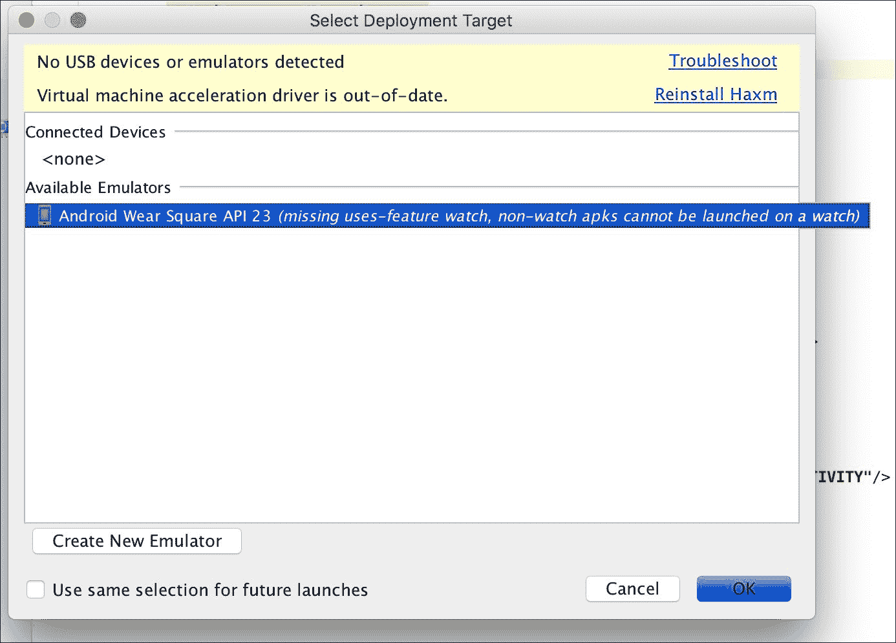

# Gradle 构建文件

让我们来看看 Gradle 构建文件是如何配置的。根目录中的`settings.gradle`文件包括此项目的所有模块。在这种情况下，只有一个模块，即`Wearable`模块文件夹：

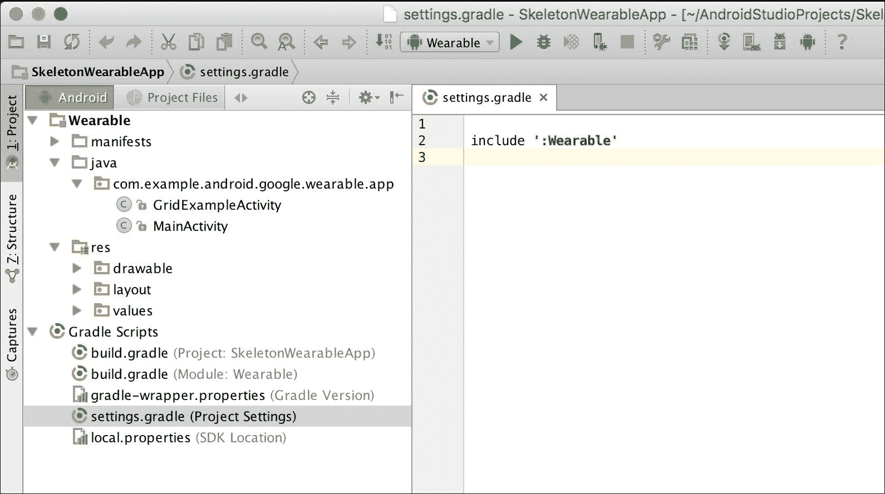

你会注意到有两个`build.gradle`文件。一个位于项目级别，另一个位于`Wearable`文件夹的模块级别。

项目的`build.gradle`文件是空的，因为我们没有针对项目构建设置的具体内容，而`Wearable`模块中的`build.gradle`文件包含此应用程序的所有构建配置：

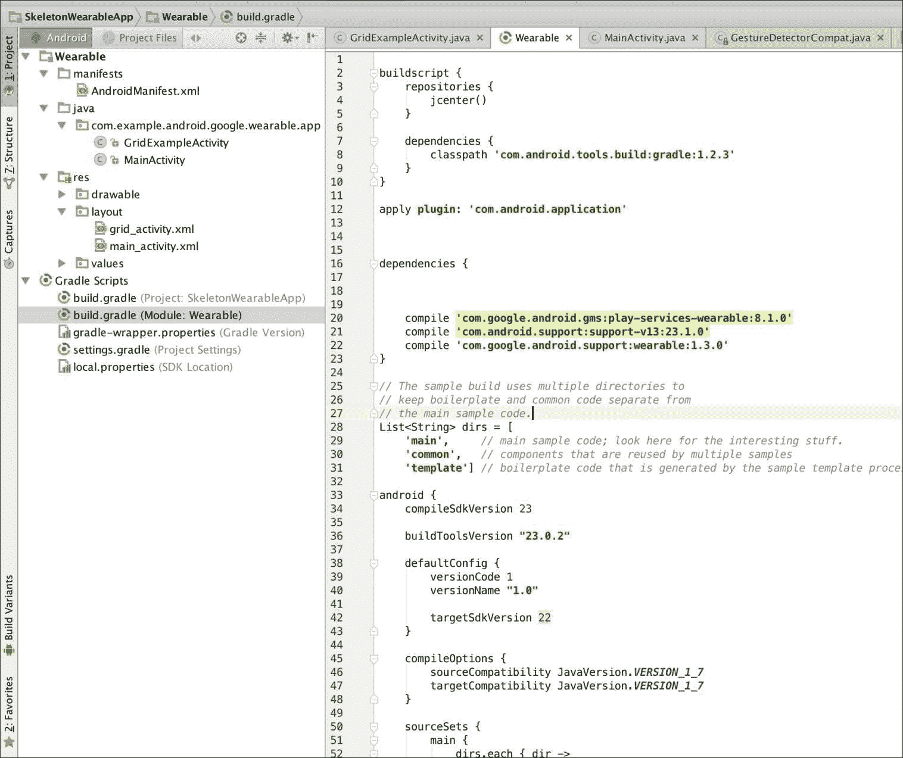

`build.gradle`文件的 20、21 和 22 行指定了此项目的外部构建依赖项。第 20 行包括对**Google Play Services**的依赖，它是 Android Wear 平台的一个组成部分。Google Play Services 在数据同步和 Android 手机与可穿戴设备之间的通信中被大量使用。我们将在后面的章节中详细讨论它们。

第 21 行包括对`v13`支持库的依赖。原因是我们在`GridExampleActivity`类中使用了**Fragment**。

显然，第 22 行包括对可穿戴支持库的依赖，因为这是一个可穿戴应用程序。

其余的配置对于 Android 应用程序来说相当标准，包括源路径、编译和目标 SDK 版本以及应用程序的版本设置。

# 应用活动

骨干项目包含两个活动，`MainActivity`和`GridExampleActivity`。`MainActivity`活动包含一个带有`Main Activity`标题文本和位于`ScrollView`布局中的三个按钮。

让我们来看看`main_activity.xml`文件，看看组件布局是如何结构的。使用 Android Studio 开发 Android 应用程序的最大优势之一是其布局编辑器。尽管在运行时可能并不完全相同，但它可以在 UI 组件运行时渲染方面提供一个更直观的概念。

在你打开`main_activity.xml`文件后，确保你已经在 Android Studio 右侧选择了**预览**工具窗口：

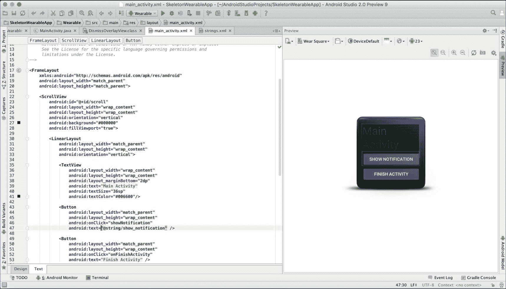

Android Studio 布局编辑器将显示布局文件更改的实时预览。它还有助于了解组件在不同形态因子上的布局方式。正如我们所知，Android Wear 有方形和圆形的形态因子，因此检查组件在方形和圆形形式上的布局将是一个好主意。

点击布局下拉菜单将显示 SDK 和工具配置中可用的所有形态因子：

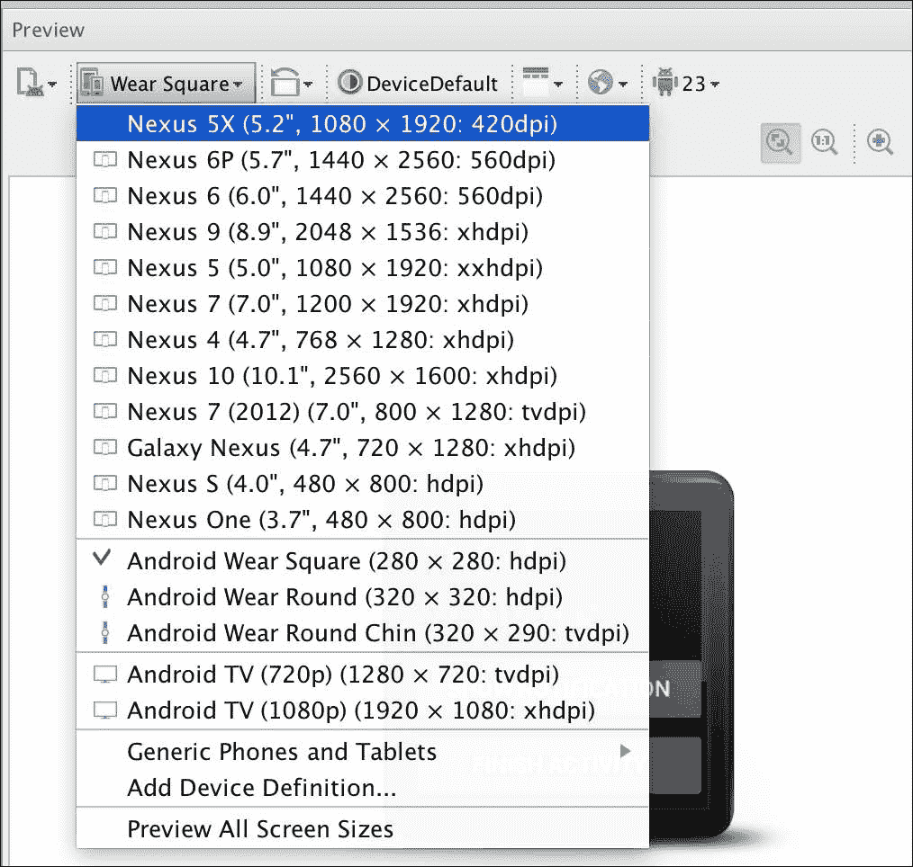

如果你选择了**Android Wear Round**布局，那么你将能够看到`main_activity.xml`文件在圆形表盘的 Android Wear 手表上的渲染效果。

为了提供最佳的用户体验，你应该确保组件布局合理，并且用户能够无障碍地访问 UI 元素。我们能够做到这一点的唯一方法是，在多种形态和布局设置上测试应用程序：

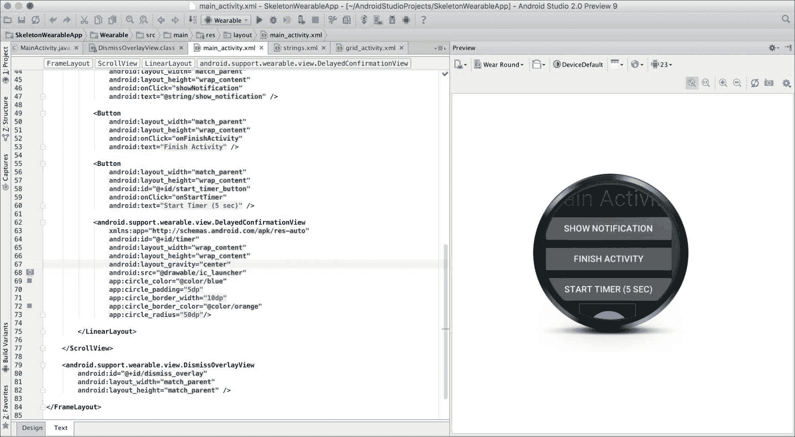

随着本书的进一步学习，我们将利用一些 Android 支持库的技术，帮助服务方形和圆形的 Android Wear 设备。

到目前为止，你已经对如何使用一些基本的 Android Wear API 对象和组件开发骨架可穿戴应用程序有了基本的了解。花些时间阅读`GridExampleActivity`和其他项目部分，以了解这些项目组件是如何相互连接的。

如果你对这个项目中的代码不太熟悉，不要害怕。本书的后续章节中，我们将深入探讨 Android Wear 应用程序开发的各个方面。

# 让我们构建一个 Android Wear 应用程序

到目前为止，我们一直在查看从 Google 的 GitHub 仓库克隆的骨架可穿戴应用程序样本。我们熟悉了骨架应用程序的结构，并对代码和组件的结构有了一些想法。

现在，是我们构建自己的 Android Wear 应用程序的时候了。我们将使用 Android Studio 从头开始创建这个应用程序。

从 Android Studio 欢迎屏幕，点击如下截图所示的**创建新 Android Studio 项目**选项：

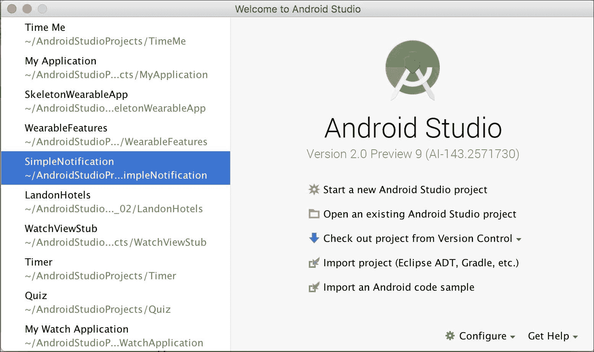

使用适合你系统设置的名称、域名和包名配置项目：

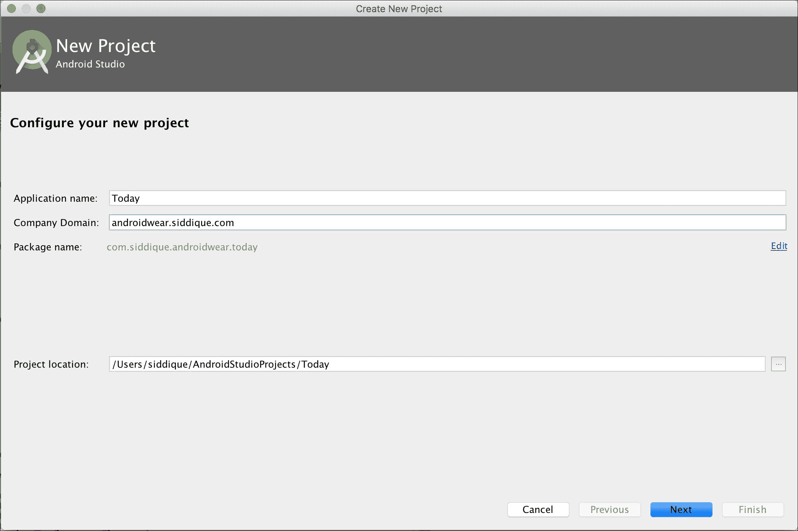

在**目标 Android 设备**屏幕上，取消选中**手机和平板**选项，并确保选择**Wear**选项。Android Studio 将根据你系统上安装的 SDK 和系统镜像自动选择创建应用程序所需的最安全的最低 SDK。

我们将查看 Android Studio 为这个应用程序选择的默认设置：

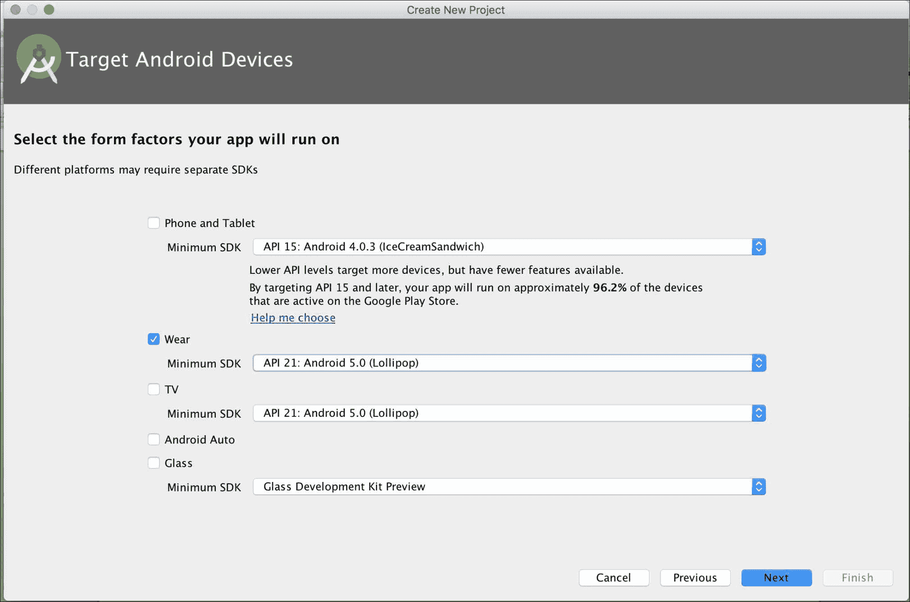

点击**下一步**按钮后，选择**空白 Wear 活动**。默认情况下，Android Studio 将选择**始终开启 Wear 活动**：

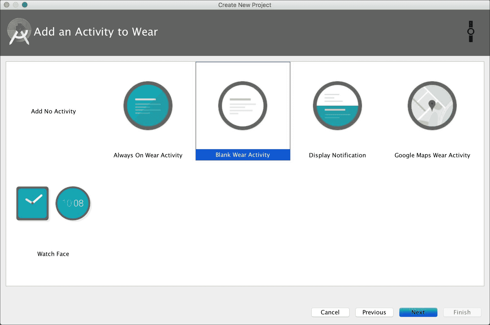

在下一屏幕上，保持活动名称和其他配置不变：

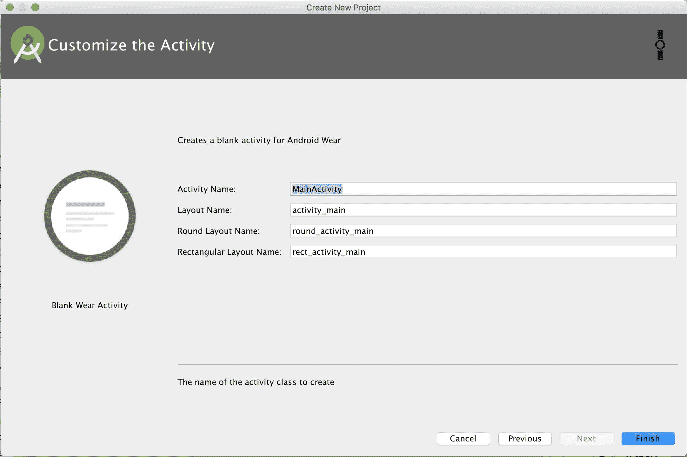

点击**完成**按钮后，Android Studio 将花费一些时间来编译和构建项目。

完成后，你将看到包含`MainActivity`和三个布局文件的项目，分别是`activity_main.xml`、`rect_activity_main.xml`和`round_activity_main.xml`。

Android Studio 还会为应用程序创建一个默认的运行配置：

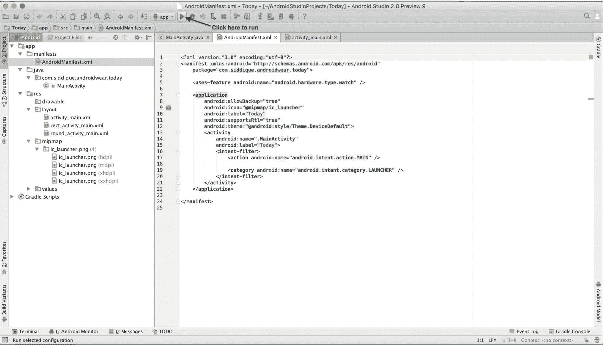

点击 **运行** 将列出所有 Android 设备模拟器。你可以从我们之前创建的列表中选择一个。

在你选择模拟器之后，设备将启动并且 Android Studio 将将应用部署到模拟器上。在这个阶段请保持耐心，因为设备启动并运行我们刚刚构建的应用可能需要一段时间。尽量不要干扰正在运行的模拟器，因为它可能会影响应用的运行。

### 小贴士

虽然使用模拟器开发 Android 应用听起来可能很简单，但令人沮丧的部分是模拟器的启动和应用加载时间。如果你有使用物理设备开发的选择，请选择它，而不是浪费大量时间等待和观察。

在本书的某个阶段，我们将使用物理 Android 手机和可穿戴设备进行开发。当我们到达那里时，我们将介绍使用这些设备所需的设置和配置。

下面是成功运行此应用后屏幕的截图：

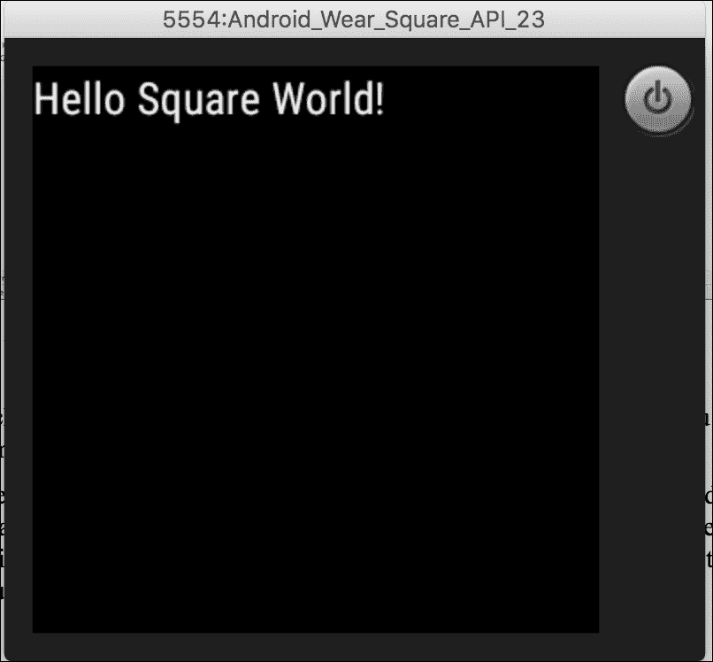

现在我们来为这个项目添加一些定制功能。更新 `MainActivity` 文件的 `onCreate` 方法，如下所示：

```java
protected void onCreate(Bundle savedInstanceState){
  super.onCreate(savedInstanceState);
  setContentView(R.layout.activity_main);
  final WatchViewStub stub = (WatchViewStub) findViewById(R.id.watch_view_stub);

  stub.setOnLayoutInflatedListener(new   WatchViewStub.OnLayoutInflatedListener() 
  {
    @Override
    public void onLayoutInflated(WatchViewStub stub) 
    {
      mTextView = (TextView) stub.findViewById(R.id.text);
      Date today = new Date();
      SimpleDateFormat dateFormat = new SimpleDateFormat("EEEE, MMMM d - yyyy");mTextView.setText("Today is " + dateFormat.format(today));
    }     
  });
}
```

我们在这里做的基本上是为 `mTextView` 组件设置一个动态文本，内容为今天的日期。

使用以下内容更新 `rect_activity_main.xml` 文件。我们刚刚更新了布局的背景颜色，并更新了文本视图的颜色和填充选项：

```java
<?xml version="1.0" encoding="utf-8"?>

<LinearLayout

  android:layout_width="match_parent"
  android:layout_height="match_parent"
  android:orientation="vertical"
  tools:context="com.siddique.androidwear.today.MainActivity"
  tools:deviceIds="wear_square"
  android:background="@color/orange"
>

<TextView
  android:id="@+id/text"
  android:layout_width="wrap_content"
  android:layout_height="wrap_content"
  android:text="@string/hello_square"
  android:textSize="25sp"
  android:textAlignment="center"
  android:textColor="@color/black"
  android:paddingTop="25dp"
/>

</LinearLayout>
```

当你重新运行应用时，你的输出应该看起来像以下截图：

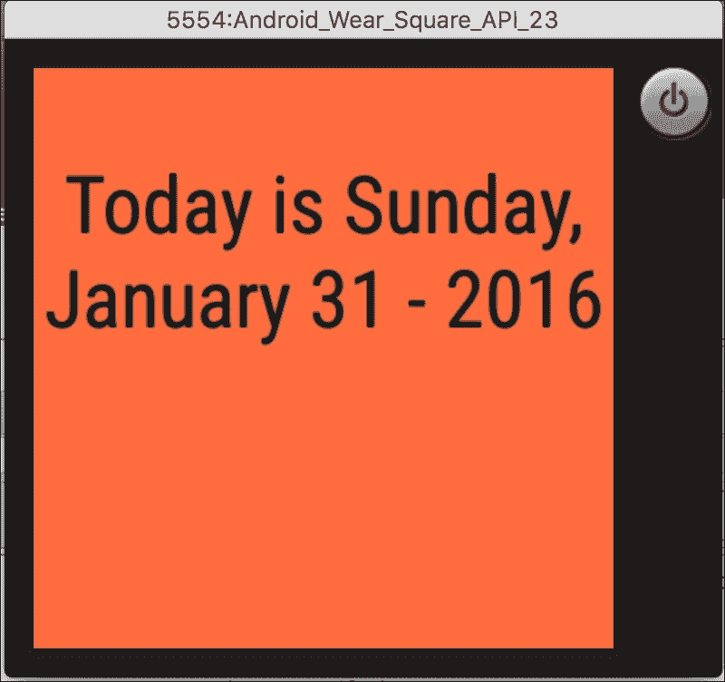

### 注意

如果你遇到了前面步骤中的任何问题，不要担心。我们讨论的代码可以在 GitHub 仓库中找到（[`github.com/siddii/mastering-android-wear/tree/master/Chapter_3`](https://github.com/siddii/mastering-android-wear/tree/master/Chapter_3)）。你可以用它作为参考或与你的项目进行比较。

# 摘要

我们通过查看骨架可穿戴应用的示例代码，讨论了我们的 Android Wear 项目的各种组件和方面。我们查看了 Android Studio 的布局编辑器，并了解了它是如何用于预览布局文件的实时更新的。

我们使用 Android Studio 从头开始开发了 `Today` 这个 Android Wear 应用。随着本书的进一步进展，我们将扩展这个应用。
