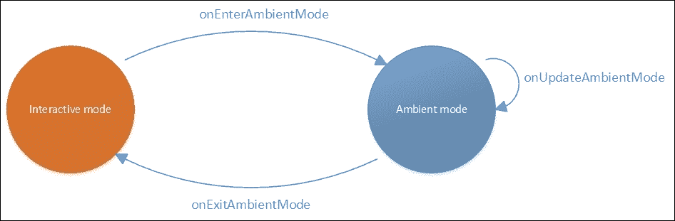
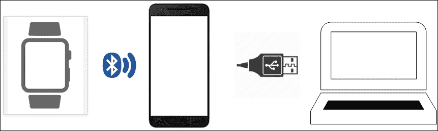
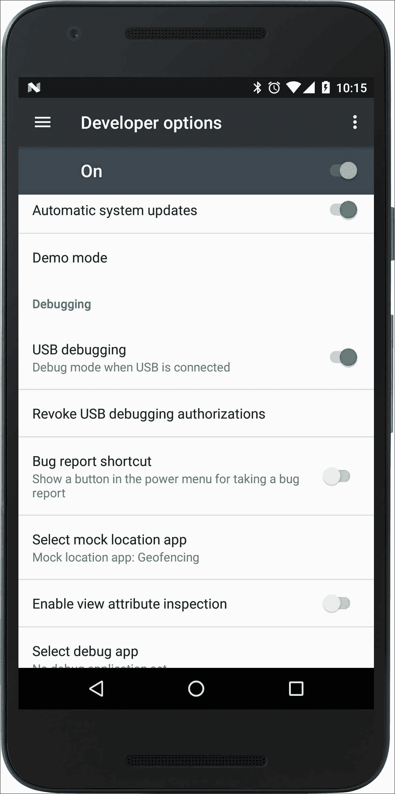
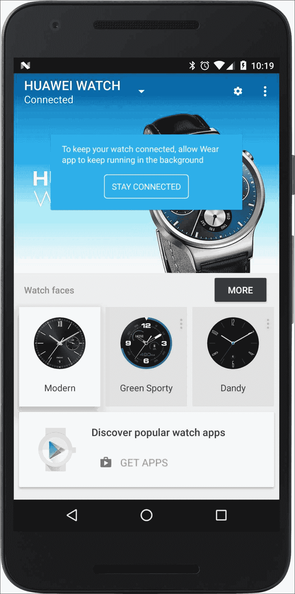
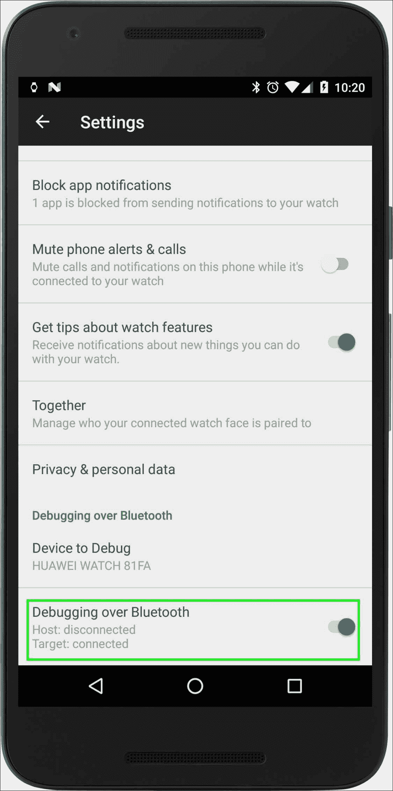
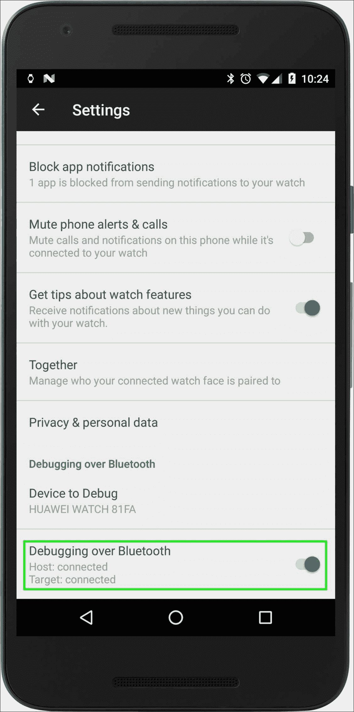
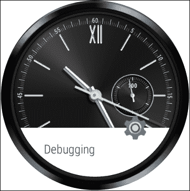
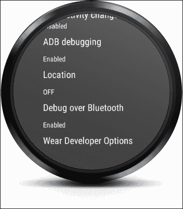
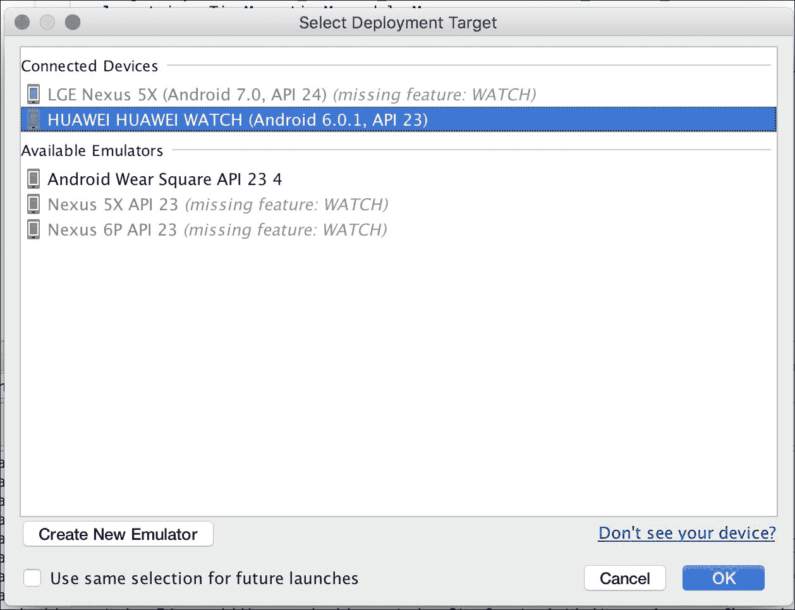

# 第十一章. 高级特性和概念

> "当人做梦时，他就是天才。" —— 黑泽明

在本章中，我们介绍了与使应用始终运行相关的设计关注点和 API 功能。我们开发了一个活动来演示始终在线的能力。然后我们简要介绍了通过蓝牙连接调试可穿戴应用，并以 Android Wear 2.0 的预览结束。

### 注意

本章的代码可在 GitHub 上参考（[`github.com/siddii/mastering-android-wear/tree/master/Chapter_11`](https://github.com/siddii/mastering-android-wear/tree/master/Chapter_11)）。请注意，为了简洁起见，代码片段仅按需包含。鼓励读者从 GitHub 下载引用的代码，并在阅读本章时跟随进度。

# 保持手表运行

你可能还记得我们在上一章中关于表盘的讨论，其中表盘最初以交互模式运行。当屏幕超时后，表盘将继续运行，因为设备进入了省电的环境模式。

虽然这个功能，即表盘的始终在线能力，是表盘固有的——我们不希望在我们需要看时间时，我们的手表偷懒——但这并不一定适用于所有可穿戴应用。例如，如果我们有一个`todo`应用或`Step counter`应用处于活动状态，那么屏幕超时并使表盘失效只是时间问题。如果我们想回到我们的应用，我们就必须与我们的可穿戴设备交互，将其从环境模式中唤醒，并显示我们最后使用的活动或应用。我们可以想象出这种情况可能会成为用户挫败感的来源。

幸运的是，如果我们的设备正在运行 Android 版本 5.1 或更高版本，我们可以利用 Android Wear API 在执行我们的可穿戴应用期间节省电量。这些设备允许应用在保持前台的同时仍然节省电量。应用可以被编码来控制即使在继续履行其主要目的的同时，在环境模式中显示的内容。这样的应用实际上就是始终在线的。

## 制作始终在线的应用

当我们想要为我们的可穿戴应用启用环境模式时，以下是一些我们需要做和/或需要注意的事情：

+   我们的 SDK 应该更新到包括 Android 5.1 或更高版本的平台，因为这个版本为活动提供了环境模式支持。有关更多信息，请参阅第二章中的*Android SDK 包*部分，*在 Android Studio 上设置开发环境*。

+   我们必须将我们的清单`targetSdkVersion`设置为 API 级别 22 或更高（即版本 5.1）。

+   我们可以选择通过指定`minSdkVersion`属性为设备运行 Android 5.1 之前版本提供向后兼容性。这样做的话，支持环境模式的活动将自动回退到主屏幕并退出活动。

+   我们的活动应该扩展`WearableActivity` API 类，以便继承启用环境模式所需的所有方法。

+   我们应该在活动的`onCreate()`监听器中调用`setAmbientEnabled()`方法。

+   我们应该清楚地理解交互式和环境模式之间的转换以及在这些转换期间调用的相关监听器，如图中本节末尾所示。

+   我们应该特别注意在环境模式下更新活动 UI，使用基本布局和最小化的颜色调色板，以最大限度地节约电力。

+   我们应该尝试使用一致的布局来更新活动 UI，以便用户在交互式和环境模式之间的转换看起来尽可能无缝。

+   在环境模式下，我们应该小心不要过于频繁地更新屏幕。记住，环境模式的全局目标就是节省电力。如果更新活动 UI 的频率超过 10 秒，可能会成为电力消耗的来源，并且对启用环境模式整体上起到反作用。如果由于应用性质（如地图或健身）需要更频繁地更新，可以考虑使用 API 的`AlarmManager`类（[`developer.android.com/reference/android/app/AlarmManager.html`](https://developer.android.com/reference/android/app/AlarmManager.html)）。

### 注意

值得重复的是，运行 Android 5.1（API 级别 22）之前版本的设备可能无法访问新 API 的始终开启功能，但只要我们在清单中指定`minSdkVersion`属性为 20 或更高，它们仍然可以无错误地运行这些应用。

考虑以下图表，展示了屏幕 UI 活动更新的情况：



# 始终运行计步器

现在，让我们通过将我们的计步器从第七章，*语音交互、传感器和追踪*，增强为始终开启，来实际演示之前章节中介绍的所有内容。让我们直接进入正题。

## Android 清单文件

首先要做的是更新`AndroidManifest.xml`文件，并将`StepCounterActivity`类的`launchMode`设置为`singleInstance`。这是在环境模式下每分钟更新屏幕多次所必需的。如果不这样做，`AlarmManager`类会在每次闹钟触发时启动一个意图来打开一个新的活动，而不是重用同一个（已经激活的）活动。以下是文件中的片段：

```java
<activity 
    android:name=".StepCounterActivity" 
    android:label="@string/daily_step_count_title" 
    android:launchMode="singleInstance" 
/> 

```

一旦我们启动计步器，我们就会看到一个多彩的背景图像和一个显示自设备重启以来所走的步数的显示屏，如下面的截图所示：


### StepCounterActivity 类

此活动为我们计步器做了大部分工作。我们通过调用`setAmbientEnabled()`方法将`onCreate()`方法修改为将其设置为 true。我们还定义了一个辅助方法`refreshDisplayAndSetNextUpdate()`，我们从`onCreate()`监听器以及`onEnterAmbient()`和`onUpdateAmbient()`监听器中调用它。对`isAmbient()`方法的调用确定我们是否使用环境间隔值或活动间隔值。此外，在环境模式下，我们移除背景，使像素变黑，并用白色前景绘制数据。最大化使用黑色并最小化使用白色直接有助于节省电池电量。

以下代码列表展示了我们的计步器`StepCounterActivity`类：

```java
public class StepCounterActivity extends WearableActivity  implements SensorEventListener 
{ 
  private SensorManager mSensorManager; 
  private Sensor mSensor; 

  // Steps counted since the last reboot 
  private int mSteps = 0; 

  private static final String TAG =  StepCounterActivity.class.getName(); 
  private BoxInsetLayout stepCounterLayout; 
  private CardFrame cardFrame; 
  private TextView title, desc; 
  private AlarmManager mAmbientStateAlarmManager; 
  private PendingIntent mAmbientStatePendingIntent; 

  /** 
   * This custom handler is used for updates in "Active" mode. We use a separate static class to 
   * help us avoid memory leaks. 
   */ 

  private final Handler mActiveModeUpdateHandler = new UpdateHandler(this); 

  /** 
   * Custom 'what' for Message sent to Handler. 
   */ 

  private static final int MSG_UPDATE_SCREEN = 0; 

  /** 
   * Milliseconds between updates based on state. 
   */ 

  private static final long ACTIVE_INTERVAL_MS =  TimeUnit.SECONDS.toMillis(1); 
  private static final long AMBIENT_INTERVAL_MS =  TimeUnit.SECONDS.toMillis(20); 

  @Override 
  protected void onCreate(Bundle savedInstanceState)  
  { 
    super.onCreate(savedInstanceState); 
    setContentView(R.layout.activity_daily_step_counter); 

    mSensorManager = (SensorManager)  getSystemService(Context.SENSOR_SERVICE); 
    mSensor =  mSensorManager.getDefaultSensor(Sensor.TYPE_STEP_COUNTER); 

    setAmbientEnabled(); 

    mAmbientStateAlarmManager = (AlarmManager)  getSystemService(Context.ALARM_SERVICE); 
    Intent ambientStateIntent = new  Intent(getApplicationContext(), DailyTotalActivity.class); 

    mAmbientStatePendingIntent = PendingIntent.getActivity( 
      getApplicationContext(), 
      0 /* requestCode */, 
      ambientStateIntent, 
      PendingIntent.FLAG_UPDATE_CURRENT); 

    stepCounterLayout = (BoxInsetLayout)  findViewById(R.id.step_counter_layout); 
    cardFrame = (CardFrame)  findViewById(R.id.step_counter_card_frame); 
    title = (TextView) findViewById(R.id.daily_step_count_title); 
    desc = (TextView) findViewById(R.id.daily_step_count_desc); 
    refreshDisplayAndSetNextUpdate(); 
  } 

  /** 
   * Loads data/updates screen (via method), but most importantly, sets up the next refresh 
   * (active mode = Handler and ambient mode = Alarm). 
   */ 

  private void refreshDisplayAndSetNextUpdate()  
  { 
    Log.i(TAG, "Refresh display and set next update "); 
    refreshStepCount(); 
    long timeMs = System.currentTimeMillis(); 
    if (isAmbient())  
    { 
      /** Calculate next trigger time (based on state). */ 
      long delayMs = AMBIENT_INTERVAL_MS - (timeMs %  AMBIENT_INTERVAL_MS); 
      long triggerTimeMs = timeMs + delayMs; 

      /** 
       * Note: Make sure you have set activity launchMode to singleInstance in the manifest. 
       * Otherwise, it is easy for the AlarmManager launch intent to open a new activity 
       * every time the Alarm is triggered rather than reusing this Activity 
       */ 

      mAmbientStateAlarmManager.setExact( 
        AlarmManager.RTC_WAKEUP, 
        triggerTimeMs, 
        mAmbientStatePendingIntent); 

    } 
    else  
    { 
      /** Calculate next trigger time (based on state). */ 
      long delayMs = ACTIVE_INTERVAL_MS - (timeMs %  ACTIVE_INTERVAL_MS); 

      mActiveModeUpdateHandler.removeMessages(MSG_UPDATE_SCREEN); 
      mActiveModeUpdateHandler.sendEmptyMessageDelayed  (MSG_UPDATE_SCREEN, delayMs); 
    } 
  } 

  /** 
   * Prepares UI for Ambient view. 
   */ 

  @Override 
  public void onEnterAmbient(Bundle ambientDetails)  
  { 
    Log.d(TAG, "onEnterAmbient()"); 
    super.onEnterAmbient(ambientDetails); 

    /** Clears Handler queue (only needed for updates in active mode). */ 

    mActiveModeUpdateHandler.removeMessages(MSG_UPDATE_SCREEN); 

    /** 
     * Following best practices outlined in WatchFaces API (keeping most pixels black, 
     * avoiding large blocks of white pixels, using only black and white, 
     * and disabling anti-aliasing, etc.) 
     */ 

    stepCounterLayout.setBackgroundColor(Color.BLACK); 
    cardFrame.setBackgroundColor(Color.BLACK); 
    desc.setTextColor(Color.WHITE); 
    desc.getPaint().setAntiAlias(false); 
    title.setTextColor(Color.WHITE); 
    title.getPaint().setAntiAlias(false); 
    refreshDisplayAndSetNextUpdate(); 
  } 

  @Override 
public void onUpdateAmbient()  
{ 
    Log.d(TAG, "onUpdateAmbient()"); 
    super.onUpdateAmbient(); 

    refreshDisplayAndSetNextUpdate(); 
} 

/** 
 * Prepares UI for Active view (non-Ambient). 
 */ 
@Override 
public void onExitAmbient()  
{ 
    Log.d(TAG, "onExitAmbient()"); 
    super.onExitAmbient(); 

    /** Clears out Alarms since they are only used in ambient mode. */ 
    mAmbientStateAlarmManager.cancel(mAmbientStatePendingIntent); 

    stepCounterLayout.setBackgroundResource(R.drawable.jogging); 
    cardFrame.setBackgroundColor(Color.WHITE); 

    desc.setTextColor(Color.BLACK); 
    desc.getPaint().setAntiAlias(true); 

    title.setTextColor(Color.BLACK); 
    title.getPaint().setAntiAlias(true); 

    refreshDisplayAndSetNextUpdate(); 
  } 
} 

```

由于前面的更改，计步器现在在环境模式下的显示如下：


# 调试可穿戴应用

开发者可以使用的一个重要且极其有用的工具是设置我们运行在可穿戴设备上的可穿戴应用的调试。我们有从我们的开发机器运行调试命令的能力，以排除我们的可穿戴应用的故障，并将任何调试输出发送到手持设备，然后手持设备必须连接到开发机器。为了完成此操作，需要进行一些设置。设备之间的一般连接性如下所示：



这里最大的好处是我们不需要从开发机器运行两个独立的 USB 连接——一个连接到手持设备，另一个连接到可穿戴设备。相反，我们可以通过蓝牙连接直接从开发机器部署和调试代码到手持设备。这在开发过程中需要重复进行故障排除时特别有帮助。没有这个功能，我们就必须忍受过多电缆的混乱，而我们知道我们可以没有这些。

## 设备设置

调试必须在伴侣手持设备和可穿戴设备上设置，尽管设置方式略有不同。

### 手持应用上的 USB 调试

按照以下步骤在手持应用上执行调试：

1.  在手持设备上启动**设置**屏幕，并确保在**开发者**选项中已开启**USB 调试**。

1.  定位并启动**开发者选项**。或者，你可能需要点击**关于手机**菜单，向下滚动到构建号并点击它七次以激活**开发者选项**菜单项。一旦可用，点击一次。

1.  如以下截图所示，选择启用**USB 调试**：



### 可穿戴应用上的蓝牙调试

按照此处提到的步骤，使用蓝牙在可穿戴应用上进行调试：

1.  通过点击主屏幕两次来启动**Wear**菜单。

1.  启动**设置**。

1.  定位并启动**开发者选项**。或者，你可能需要点击**关于手机**，向下滚动到构建号并点击它七次以激活**开发者选项**菜单项。一旦可用，点击一次。

1.  选择启用**通过蓝牙进行调试**选项。

### 手持设备应用上的会话设置

执行以下步骤，在手持设备应用中设置会话：

1.  在手持设备上启动 Android Wear 伴侣应用。

1.  从右上角的菜单中选择**设置**：

1.  选择启用**通过蓝牙进行调试**选项。注意，在手持设备上该选项下会显示以下消息：

```java
      Host: disconnected 
      Target: connected 

```



这是因为我们尚未将你的手持设备连接到你的开发机器。让我们接下来做这件事。

现在，让我们使用 USB 线将手持设备连接到我们的开发机器，并在`adb`命令提示符下输入以下内容。我们使用一个任意的端口`4444`，我们可以使用任何可用的端口：

```java
adb forward tcp:4444 localabstract:/adb-hub
adb connect localhost:4444

```

在手持设备的伴侣应用中，你现在应该在**通过蓝牙进行调试**选项下看到以下内容：

```java
Host: connected 
Target: connected 

```



因此，我们已经完成了为我们的可穿戴设备设置调试会话。在成功连接后，我们在可穿戴设备上看到如下通知：



现在，让我们通过执行一些调试命令来测试一下。

注意，如果我们想在`adb`命令提示符下执行`adb devices`命令，我们应该看到我们的可穿戴设备显示为`localhost:4444`。现在我们可以使用以下格式执行`adb`命令来调试我们的应用程序：

```java
adb -s localhost:4444 <command>

```

例如，考虑以下命令：

```java
adb -s localhost:4444 shell

```

在可穿戴设备中的开发者选项中，我们可以看到**ADB 调试**和**通过蓝牙调试**选项已启用：



现在我们已经在开发机器、手持设备和可穿戴设备之间建立了成功的连接，我们将能够直接从 Android Studio 通过蓝牙连接部署和调试我们的代码。手表将显示为部署目标，如下截图所示：



# 前进之路 - 回顾 Android Wear 2.0

当我们开始编写这本书时，Android Wear 2.0 已经超越了构思阶段，进入了设计阶段。Android Wear 预览 API 仍在开发中，预计将在我们完成第一稿的一半时发布。尽管 2.0 API 仍在完善中，开发工作正在进行，但感兴趣的开发商可以尝试作为 Android Wear 2.0 开发者预览版 API 的一部分。

在本节中，我们将突出一些被整合到 2.0 API 中的关键新特性，同时关注本书前几章中我们所看到的内容。

## 表盘复杂功能

在我们讨论表盘时，我们提出了交互式表盘的概念，我们通过点击手势提供了与表盘的有限用户交互。Android Wear 2.0 将这种额外的显示复杂性正式化为复杂功能的概念。复杂功能本质上是指显示时间之外的数据的任何功能，即小时和分钟。2.0 版本提供了一个表盘复杂功能 API，允许表盘显示额外信息，而无需底层管道获取数据。相反，数据的提供——无论是电池电量指示器还是天气信息——通过复杂功能 API 外部化到一个复杂功能数据提供者，然后该提供者控制数据在表盘上的显示方式。从这种复杂功能数据提供者消耗数据的表盘仍然负责绘制复杂功能。

## 导航和操作抽屉

Android Wear 2.0 API 从上到下都基于材料设计，我们在核心组件和内置小部件中看到了其设计原则的实现。

我们在 第九章 中介绍了导航和操作抽屉，在讨论材料设计的过程中。Android Wear 2.0 进一步巩固了这些小部件与材料设计概念的协调一致。

有额外的抽屉预览支持，以便用户在滚动时可以访问这些抽屉。此外，预览视图和导航抽屉关闭操作已通过添加在 `WearableActionDrawer` API 的预览视图中显示第一个操作的能力而自动化。这些抽屉小部件在新 2.0 API 中也是可扩展的，支持创建自定义抽屉。

## 扩展和消息样式通知

Android Wear 2.0 对通知及其视觉交互进行了重大改进。用户可以通过所谓的扩展通知获得改进的体验。当我们为通知指定额外的内容页面和操作时，它们会在扩展通知中向用户开放。每个扩展通知都遵循材料设计原则。用户可以通过简单地点击通知来查看扩展通知。然而，通知必须由配对的伴侣手持设备上的应用程序生成，并且不应为其设置`Notification.contentIntent`类。

2.0 版本还提供了一个`Notification.MessagingStyle`类，它使用包含在`MessagingStyle`通知中的聊天消息。结果是扩展通知中增强了类似应用程序的体验。

## 输入法框架

Android 的**输入法框架**（**IMF**）允许用户使用系统的默认输入法或第三方输入法输入文本。输入可以通过点击单个键或通过手势输入来完成。Android Wear 2.0 将这些相同的功能扩展到了可穿戴设备上。用户将能够从已安装的输入法列表中选择多个输入法，并设置其中一个为默认输入法。

## 远程输入和智能回复

Wear 2.0 允许用户通过远程输入 API 从一系列输入选项中进行选择。这些包括语音输入、表情符号、智能回复、开发者提供的预设回复列表以及默认输入法。

此外，开发者可以为他们的通知启用一个**智能回复**功能，让用户获得快速可靠的回复聊天消息的方式。与上下文相关的选项可以出现在扩展通知以及远程输入中。

## 手腕手势

想象一下，只需轻轻一挥手腕就能与我们的可穿戴设备交互。这正是 Wear 2.0 API 的设计师在提供两个手腕手势（*外翻手腕*和*内翻手腕*手势）供应用程序使用时所考虑的。这种典型用例可能是在一只手必须进行交互的情况下滚动通知列表或新闻文章，例如当另一只手拿着一杯大咖啡时。

在 2.0 版本中，可以通过前往**设置** | **手势** | **手腕手势**来启用/禁用手腕手势。

## 桥接模式

默认情况下，通知是从伴侣手持设备上的应用程序共享到可穿戴设备的（也称为桥接）。如果还有独立的应用程序发出相同的通知，那么这可能会引起烦恼，因为相同的通知会从独立的应用程序以及伴侣手持设备上出现，这是由于桥接的原因。

为了改善这个问题，Android Wear 2.0 预览版包含了一个名为**桥接模式**的功能。此模式允许独立应用通过其清单来开启或关闭从伴侣手持应用桥接通知的功能。此外，API 允许通过声明取消 ID 来在不同设备间同步通知取消。

## 独立的可穿戴设备

这是不可避免的。伴侣手持设备在使应用智能使用资源方面是一个有价值的设计隐喻。但随着将计算能力和内存集中到小型设备中的持续进步，减少对伴侣手持设备的依赖，甚至完全淘汰它们的可能性正在变得越来越现实。

独立设备将使可穿戴应用能够在没有伴侣应用的情况下独立工作。而不是像目前那样将 Android Wear 应用嵌入到相应的伴侣应用中，使用多 APK 交付方法将允许开发者独立于相应的伴侣应用发布 Android Wear 应用。

### 注意

APK 是用于安装到 Android 操作系统的 Android 文件格式。我们将在下一章中详细讨论这个问题。现在，只需理解 Google Play 提供了多 APK 支持，这使我们能够为我们的应用发布不同的 APK，每个 APK 针对不同的设备配置。因此，每个 APK 都是应用的独立版本，尽管它们在 Google Play 上可能共享相同的应用列表和包名。每个 APK 也使用相同的发布密钥进行签名。

消除对伴侣应用的依赖，反过来，也消除了对可穿戴数据层 API 的需求。Android Wear 应用将能够直接进行网络请求。此外，直接访问网络资源为 Wear 应用提供了新的认证方式。以下是一些方式：

+   使用标准 Google 键盘进行直接文本输入

+   使用`android.accounts.AccountManager` API 类同步和存储账户数据

# 摘要

我们在本章的开头讨论了当我们的可穿戴设备进入环境模式时如何保持我们的应用运行。然后，我们使用来自第七章的`Today`应用增强了我们的步数计数器活动，使其始终开启，从而接近 Android Wear API 中允许我们为应用启用环境模式的那些部分。然后，我们在展示 Android Wear 2.0 的预览版之前，简要地提到了在蓝牙上调试可穿戴应用。
