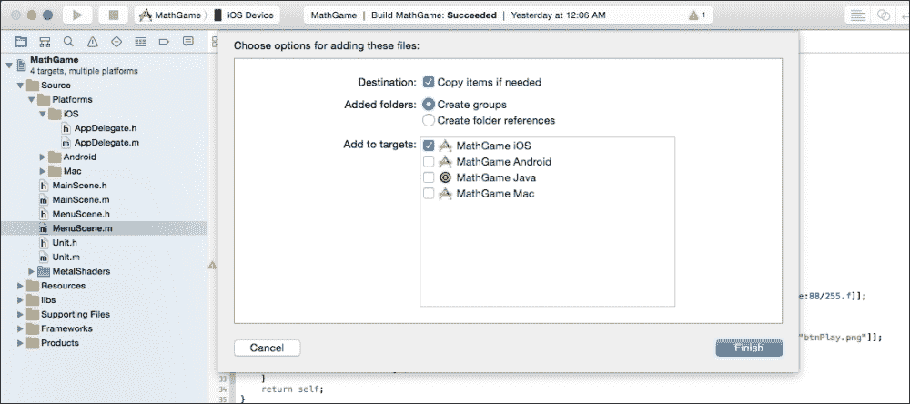
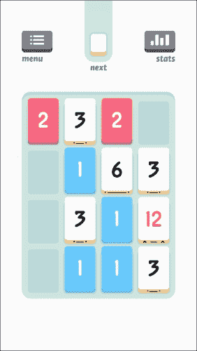

# 第四章：音频与音乐

本章主要介绍使用 Cocos2d 向游戏玩家呈现音乐和音效的不同方式，以及为什么高质量的音乐和音效在优秀游戏中很重要。相信我，音效不仅仅是当事件发生时播放一个声音文件。否则，为什么会有整整一章来介绍它？尽管有很多用户在移动设备上关闭声音玩游戏，但它仍然是某些玩家体验的一部分，因此我们必须密切关注我们选择的声音以及它们的实现方式。

在本章中，我们将涵盖以下主题：

+   加载和卸载效果

+   以创意方式播放音效和循环背景音乐

+   在飞行中修改播放的声音

+   其他好的声音示例

### 小贴士

对于到目前为止的代码，请打开**第四章**项目以及书中包含文件中的“**声音**”目录中的音效。

建议您遵循提供的代码，因为本章以及未来的章节将引用书中提供或提到的方法和类。

如果原型中存在任何游戏玩法错误或不平衡，那没关系；我们将在后面的章节中介绍润色。记住，原型是快速完成的，目的是向他人展示游戏的核心概念，而不是提供一个成品。

# 先决条件

确保你已经将声音文件复制到你的项目中。如果它们不在那里，无论你尝试多少次预加载、卸载、播放或循环，声音文件都不会播放。与用于 TexturePacker 的精灵表和用 Glyph Designer 创建的 BMFonts 不同，最好将声音文件拖到你的项目中，并确保勾选了“**如果需要则复制项目**”复选框，如图所示。这将确保文件在你决定删除它们之前都存在于你的项目中。



# 观察不同音频类型之间的差异

如果你想知道 MP3、CAF 和其他音频文件和数据格式之间的区别，请查看[`www.raywenderlich.com/69365/audio-tutorial-ios-file-data-formats-2014-edition`](http://www.raywenderlich.com/69365/audio-tutorial-ios-file-data-formats-2014-edition)，这是一篇关于所有不同类型音频的详细解释。对于这本书来说，这不是必需的，但如果您试图节省空间或想知道是否可以使用某些音频文件，这个链接将很有帮助。

在本章（以及本书的其余内容）中，我们将使用 MP3 格式（以及随后的内容），因为它是一个非常常见的格式，同时也是 OALSimpleAudio 和 iPhone 本地支持的格式。

# 了解 OALSimpleAudio

如果您曾经想要一种简单的方法来播放音效文件，OALSimpleAudio 就是您需要的工具。它可以非常容易地加载各种音效文件，播放音效，循环背景音乐，以及更多。它的存在和与 Cocos2d 的集成使得使用声音和音乐的沉浸式功能使您的游戏栩栩如生变得容易得多。

### 小贴士

如果您之前使用过 Cocos2d 进行编程并且想知道 SimpleAudioEngine 在哪里，从 Cocos2d v3.0 开始，OALSimpleAudio 是播放音效的新方法。它基本上是 SimpleAudioEngine 的所有功能。

## 预加载音效

如果您尝试使用 OALSimpleAudio 播放音效，设备会尝试快速将音效加载到内存中并立即播放，这会导致轻微的冻结或延迟。幸运的是，有一种方法可以加载音效和音乐，这样在您尝试播放音效时，不会在用户面前冻结。

OALSimpleAudio 允许预加载音效，这实际上是在您需要音效之前很久就将音效读入内存。您可以选择在游戏开始时（当用户从主屏幕首次启动它时）或在关卡之间通过卸载和重新加载即将到来的关卡的效果来进行。使用 OALSimpleAudio 将音文件加载到内存中的方法是添加以下代码行：

```swift
ALBuffer *buffer = [[OALSimpleAudio sharedInstance] preloadEffect:@"soundEffect.mp3"];
```

`buffer` 变量赋值是可选的，如果您需要打印有关音文件的各种信息，如频率或缓冲区的位数，则使用它。

### 小贴士

尽管前面的代码示例显示了 `.mp3` 作为文件扩展名，但 OALSimpleAudio 可以加载 iOS 支持的任何音效文件。

然而，如果您想减少加载所有游戏内音效所需的时间，您可以在后台进行，这被称为异步加载。

## 异步加载文件

以异步方式加载您的文件是减少加载时间的同时加载所有文件的最佳方式。然而，请注意，由于以这种方式加载发生在后台，无法保证当用户开始与您的游戏交互时文件已经准备好。

如果您希望在游戏开始时（在加载屏幕，主菜单开始之前，主菜单开始时，或您认为游戏开始的地方）让某些音效可用，如果您仍然希望大多数音效异步加载，建议只加载所需的最小音效量。

要这样做，可以使用以下代码行。它将加载推入后台，并在完成后通知您：

```swift
__block ALBuffer *soundBuffer;
[[OALSimpleAudio sharedInstance] preloadEffect:@"soundEffect.mp3" reduceToMono:NO completionBlock:^(ALBuffer* buffer)
{
  soundBuffer = buffer;
}];
```

## 卸载音效

如果你知道你不会在一段时间内使用音效，或者你经常遇到内存警告，卸载你的音效可能会有用。例如，如果你的游戏在教程中只使用某个声音文件进行旁白，一旦用户通过教程，你就可以卸载这个音效以释放一些内存。OALSimpleAudio 不会卸载正在播放或暂停的音效。

要卸载特定的音效，你可以使用以下代码行：

```swift
[[OALSimpleAudio sharedInstance] unloadEffect:@"soundEffect.mp3"];
```

要一次性卸载所有音效，你可以使用以下代码行：

```swift
[[OALSimpleAudio sharedInstance] unloadAllEffects];
```

### 小贴士

将这些卸载调用放在 `AppDelegate` 类的 `applicationDidReceiveMemoryWarning` 方法中是一个推荐的位置。

# 播放音效和循环背景音乐

显然，你不会整天只加载和卸载音效，所以让我们来看看这些声音的实际播放。

## 播放一些背景音乐

总是通过播放背景音乐来设定声音的基调非常重要。无论是意味着一种阴郁、枯萎的基调，还是一种快乐、轻松、向上的基调，音乐都可以帮助吸引玩家，使他们更加投入到游戏中。

由于背景音乐可能会在整个游戏的大部分时间里播放，因此预加载它并不是完全必要的。然而，仍然建议这样做，因为它可以防止音乐开始播放时游戏开始时的轻微延迟。你可以使用以下代码预加载背景音乐：

```swift
[[OALSimpleAudio sharedInstance] preloadBg:@"backgroundMusic.mp3"];
```

在添加了前面的代码行之后，你可以通过一个调用简单地循环播放背景音乐。要播放预加载的背景音乐，请添加以下代码行：

```swift
[[OALSimpleAudio sharedInstance] playBgWithLoop:YES];
```

因此，对于这本书的项目，我们将在游戏进行时播放背景音乐。因此，我们希望用户能够尽早沉浸其中，所以我们将预加载背景音乐，甚至在第一个场景加载之前就开始播放。打开 `AppDelegate.m` 文件，进入 `startScene` 方法。在返回语句上方添加以下代码行：

```swift
[[OALSimpleAudio sharedInstance] preloadBg:@"backgroundMusic.mp3"];
```

现在我们已经让 OALSimpleAudio 知道了我们的背景音乐是什么，我们可以立即循环播放文件，因此当第一个场景显示时，已经有音乐在播放。所以，在预加载行下方添加以下内容：

```swift
[[OALSimpleAudio sharedInstance] playBgWithLoop:YES];
```

难道这不很可爱吗？但仅有背景音乐是不够的。让我们在用户在游戏中进行不同活动时添加一些音效。

## 按钮点击时的声音

人类心理特质之一是在采取行动时渴望反馈。因此，当在数字空间中按下按钮时，我们需要给用户反馈，告诉他们他们的操作已被接收。这就是为什么按钮会稍微变暗，以表示它被按下。在释放按钮时，我们还想播放一个音效，告诉用户他们的操作正在处理中。

要在 Cocos2d 中播放按钮按下时的声音效果，只需将播放声音文件的代码行添加到按钮调用的任何方法中。所以，对于这个项目，打开`MainScene.m`，转到`goToMenu`方法，并在调用`replaceScene`方法之前的行添加此代码行：

```swift
[[OALSimpleAudio sharedInstance] playEffect:@"buttonClick.mp3"];
```

这将在开始加载下一个场景之前播放声音效果一次。同样，对于**重启**按钮，转到`MenuScene.m`中的`restartGame`方法和`goToGame`方法：

```swift
-(void)restartGame
{
  [[OALSimpleAudio sharedInstance] playEffect:@"buttonClick.mp3"];
  [[CCDirector sharedDirector] replaceScene:[MainScene scene]];
}

-(void)goToGame
{
  [[OALSimpleAudio sharedInstance] playEffect:@"buttonClick.mp3"];
  [[CCDirector sharedDirector] replaceScene:[MainScene scene]];
}
```

### 小贴士

如果你在第一次点击按钮时注意到轻微的延迟，这表明你应该在用户按下指定的按钮之前预加载声音效果。

现在，如果我们只有背景音乐和按钮点击，我们当然需要更多地吸引用户。因此，当用户在游戏板上移动单位一段距离时，我们将添加一些声音。

## 单位移动声音

与按钮点击效果类似，我们希望在调用`moveUnit`方法时播放效果。为什么在这里而不是在`Unit`类中？因为如果我们在这个类中调用它，我们可能会一次调用 81 次（9 x 9 网格）。是的，这是很难实现的，但从技术上讲是可能的。一次调用 81 次会导致效果堆叠在一起，比我们想要的要响得多。

因此，打开`MainScene.m`并转到`moveUnit`方法。在这里，在我们更新用户想要移动的单位的位置之后，我们将播放声音效果：

```swift
-(void)moveUnit:(NSNotification*)notif
{
  NSDictionary *userInfo = [notif userInfo];
  Unit *u = (Unit*)userInfo[@"unit"];
  u.position = [self getPositionForGridCoord:u.gridPos];

// Add this line:
  [[OALSimpleAudio sharedInstance] playEffect:@"moveUnit.mp3"];

  ++numTurnSurvived;

   // ..etc..
}
```

当你运行游戏并移动一个单位时，你应该听到一个非常微妙的响声。之所以如此微妙，是因为用户将在整个游戏中这样做。我们不想让他们被移动声音效果淹没，因为这可能会激怒一些玩家，导致他们关闭声音或简单地退出游戏，我们不想看到这种情况发生。

## 单位组合声音

虽然移动动作实际上每回合都会发生（否则回合就不会发生），但两个单位每回合结合的情况可能并不总是如此。因此，当玩家将两个弱单位结合成一个强单位时，我们希望给他们一种奖励感。

由于我们的单位组合代码有点分散，我们必须小心地放置代码，以确保单位组合声音效果在每个组合中只播放一次。例如，如果所有三个单位同时进入一个方块，我们应该只播放一次效果，而不是意外地播放两次。这使得事情有点棘手，但到目前为止，我们不必担心三或四单位的组合，只需处理两个单位的组合。对于三和四单位的组合，将分别播放两次和三次，但对于游戏的早期版本来说这没问题。

首先，打开你的`MainScene.m`文件，并在代码中的任何位置添加此方法：

```swift
-(void)playUnitCombineSoundWithValue:(NSInteger)total
{
}
```

然后转到`checkForAnyDirectionCombineWithUnit`方法，并在`NSInteger fv`和`NSInteger ov`行（`fv`和`ov`分别代表第一个值和其他值，它们将保存传递给此方法的第一个单元和其他单元的值）下面添加以下代码行：

```swift
if (first.isFriendly)
[self playUnitCombineSoundWithValue:fv+ov];
```

此外，转到`checkForCombineWithUnit`方法，并在相同的位置（在两个`NSInteger`声明下面）添加以下代码行。

我们有`if`语句的原因是我们需要确保只有在友好单位与另一个友好单位结合时才播放音效。我们不需要检查`other`，因为我们只调用此方法时使用的是相同类型的两个单元。至于`fv+ov`和`total`参数，它们将在本章后面使用，所以现在只需等待。

最后，在`playUnitCombineSound`方法中，你需要添加以下代码行，以便实际播放效果：

```swift
[[OALSimpleAudio sharedInstance] playEffect:@"unitCombine.mp3"];
```

如果你现在运行游戏，当一方单位与另一方单位结合时，你会听到声音。我们还想在这个游戏的早期版本中添加一种更多类型的音效。

## 用户失败时的声音

最后但同样重要的是，我们想在用户输掉游戏时播放一些声音。一遍又一遍地听到失败音效并不是很有激励性，但它有助于保持用户留存率，因为它强调了“让我再试一次，我差一点就做到了”的感觉。挑选合适的音效可能有点困难，但一旦你找到了一个你觉得足够好的音效，你就可以继续将其添加到**游戏结束**屏幕上。

所以首先，我们需要一个**游戏结束**屏幕。类似于`Unit`类，创建一个`GameOverScene`类，其子类为`CCScene`。你的`GameOverScene.h`文件应该看起来像这样：

```swift
#import "CCScene.h"

@interface GameOverScene : CCScene
{
  CGSize winSize;
}

@property (nonatomic, assign) NSInteger numUnitsKilled;
@property (nonatomic, assign) NSInteger numTotalScore;
@property (nonatomic, assign) NSInteger numTurnsSurvived;

+(CCScene*)scene;
@end
```

然后打开你的`GameOverScene.m`文件。它看起来像这样：

```swift
#import "GameOverScene.h"

@implementation GameOverScene

+(CCScene*)scene
{
  return [[self alloc] init];
}

-(id)init
{
  if ((self=[super init]))
  {
    winSize = [[CCDirector sharedDirector] viewSize];

    //these values range 0 to 1.0, so use float to get ratio
    CCNode *background = [CCNodeColor nodeWithColor:[CCColor colorWithRed:128/255.f green:0/255.f blue:88/255.f]];
    [self addChild:background];

  }
  return self;
}

-(void)goToMenu
{
  //to be filled in later
}

-(void)restartGame
{
  //to be filled in later
}
@end
```

在`GameOverScene`的`init`方法中，我们希望播放游戏结束音效。我们在这里添加它，以便游戏结束场景加载时立即播放音效。所以，在背景颜色代码行下面，添加以下代码以播放游戏结束音效：

```swift
[[OALSimpleAudio sharedInstance] playEffect:@"gameOver.mp3"];
```

要播放声音，我们需要在用户失败时将用户发送到`GameOverScene`，所以转到`MainScene.m`文件中的`endGame`方法，并将该代码行更改为以下内容（不要忘记在文件顶部添加`#include "GameOverScene.h"`代码行）：

```swift
[[CCDirector sharedDirector] replaceScene:[GameOverScene scene]];
```

由此，你就有了一个游戏结束的音效！所以，到目前为止，我们已经放置了所有的音效：单位移动、组合、游戏结束、背景音乐等等。但是过了一段时间后，声音有点重复，所以让我们稍微修改一下声音，以减少重复声音的烦恼。

# 在线修改音效

使用 OALSimpleAudio（以及 SimpleAudioEngine 也是如此）的一个非常酷的特性是，你可以修改音频文件在播放给用户时的声音。例如，如果你希望有一系列硬币被收集，并且每个连续收集的硬币播放的音调比前一个略高，你可以简单地根据收集到的硬币数量来修改音调。

## 音量（或增益）、音调和声像

通过一个简单的调用，向默认的`playEffect`方法添加几个参数，你可以修改音效的响度、音效的音调和音效在扬声器中的播放位置。你可以用以下代码做到这一点：

```swift
//volume range: 0.0 to 1.0
//pitch range: 0.0 to inf (1.0 is normal)
//pan range:  -1.0 to 1.0 (far left to far right)
//loop:  If YES, will play until stop is called on the sound
[[OALSimpleAudio sharedInstance] playEffect:@"soundEffect.mp3" volume:1 pitch:1 pan:1 loop:NO];
```

## 停止循环音效

如果你之前回答“是”并希望在某个时刻停止循环，你必须获取前面函数的返回值，如下所示：

```swift
id<ALSoundSource> effect;

effect = [[OALSimpleAudio sharedInstance] playEffect:@"soundEffect.mp3" volume:1 pitch:1 pan:1 loop:NO];
```

然后调用变量上的相应停止函数：

```swift
[effect stop];
```

## 修改组合音效

理想情况下，我们不希望用户每次组合单位时都听到相同的音效。这不仅会让用户感到厌烦和烦恼，而且会让游戏感觉更加无聊，缺乏刺激。因此，我们希望对组合音效进行轻微的修改，这样随着用户组合单位数量的增加，他们会因为成功而感到自信，从而愿意玩得更久。

其中一种方法是通过修改音效的音调。这将在某个点上有效，直到音效被推向一个方向，此时提供另一个音效来处理真正大量的单位组合会更好。

打开`MainScene.m`文件并滚动到`playUnitCombineSoundWithValue`方法。在这里，你需要修改代码，使其看起来像这样：

```swift
CGFloat pitchValue = 1.0 - (total / 100.f);
//eg: fv+ov = 20 ... 1.0 - 0.2 = 0.8
if (total < 50)
{
  [[OALSimpleAudio sharedInstance] playEffect:@"unitCombine.mp3"
    volume:1 pitch:pitchValue pan:0 loop:NO];
}

else
{
  [[OALSimpleAudio sharedInstance]
    playEffect:@"largeUnitCombine.mp3"];
}
```

当你运行游戏并组合一个单位时，你会听到音效越来越深沉，直到达到某个值（临界点——在这种情况下，新的单位值为 50 或更高）。在这个时候，我们希望播放不同的音效，这正是内部`if`语句所处理的。

# 其他优秀的音效位置

以下是一些充分利用音效的游戏示例。这些游戏不仅更能吸引用户，而且也是如何将音效用于除基本事件（如简单的用户移动或按钮点击）之外的好例子：

+   *三合一*：这款游戏卡片上有脸谱，如果你什么都不做，过一会儿你会听到卡片发出随机噪音。此外，如果你尝试将卡片滑动到不会移动任何东西的位置（无效操作），你会听到其中一张卡片说“不！”这真的很可爱，也是游戏氛围通过声音得到维持的另一种方式。看看游戏的 UI 界面，如下面的截图所示：

+   *《穿越公路》*：在这款游戏中，时不时地，你会遇到一辆播放音乐的车辆，比如警车或垃圾车。这些都比较罕见，但当玩家遇到并听到额外的音效层次时，游戏体验会更加愉快，因为它不仅仅是一辆路过的车。此外，游戏中所有的汽车和火车，如果你戴着耳机，你会听到车辆的音乐从一只耳朵传到另一只耳朵。看看这款游戏的用户界面：

# 摘要

本章教你如何使用`OALSimpleAudio`和 Cocos2d 预加载、卸载、播放和修改声音文件。你还看到了一些我们在这本书的项目中整合声音的酷方法。由于游戏仍然处于类似原型的阶段，声音可能会改变或被修改。然而，绝大多数都已经实现。此外，如果你想了解如何在菜单或设置中通过选项来打开/关闭游戏中的声音或音乐，请阅读第六章，*整理和抛光*，因为那一章将涵盖更多此类细节。

在`OALSimpleAudio`中还有很多情境方法，这一章没有涉及。如果你想了解更多关于它们的信息，你可以查看[`www.learn-cocos2d.com/api-ref/1.0/ObjectAL/html/interface_o_a_l_simple_audio.html#aaf877e4f0526408d569fd12f37e8e1f7`](http://www.learn-cocos2d.com/api-ref/1.0/ObjectAL/html/interface_o_a_l_simple_audio.html#aaf877e4f0526408d569fd12f37e8e1f7)的文档。

在下一章中，我们将介绍一些非常酷的概念和机制，大多数游戏开发者都没有花时间在他们的游戏中实现——这不仅仅是 Game Center 或 iCloud 支持。
