# 第六章. 整理与润色

润色是你在整本书中学到最重要的东西。如果你能掌握制作游戏润色的艺术，那么它无论简单还是复杂，你都会有一个很棒的游戏。而且，即使你可能是一个多年没有程序错误的优秀程序员，或者是一个当人们看到你的角色设计时会晕倒的艺术家，你仍然需要润色你的游戏。这对于任何现代游戏来说，让玩家有一个坚实的体验是绝对必要的。

在本章中，你将了解清理游戏、平滑粗糙边缘，并将具有酷炫机制的游戏变成有趣、可玩且难忘体验所需的一切。但这不仅仅是让它看起来好。它需要感觉好，整个用户体验都需要是愉快的。不分先后，我们将涵盖以下内容：

+   按钮按下视觉效果

+   单位组合脉冲

+   一个教程

+   在 Facebook 和 Twitter（以及更多）上分享

+   声音开/关

+   游戏中心排行榜

+   滑动过渡

显然，你不必做所有这些，但如果你想让更多人玩你的游戏，他们更有可能玩它，如果它经过了打磨。现在，润色时最重要的事情是图形和声音风格。它们需要保持一致，同时也要视觉上吸引人，这样用户在玩游戏时就不会感到困惑或被吓到。

话虽如此，如果你打开 `第六章` 项目，你会看到游戏的图形和字体已经更新。看起来和感觉都很扎实。唯一剩下要做的就是本章所涵盖的内容（正如你刚才在列表中看到的）。那么，让我们开始吧。

# 按钮按下视觉效果

嗯，按钮按下视觉效果很棒！Cocos2d 足够好，当触摸按钮时，它会提供按钮的暗化效果，但让我们给我们的按钮添加更多动画，让它们有更多的“点击”感觉。

## 修改 CCButton 类

如果我们只想让单个按钮具有特定的效果，我们只需修改它存在的位置上的那个按钮。然而，我们希望游戏中的所有按钮都有相同的效果，因此我们需要打开 `CCButton.m` 文件。最简单的方法是在项目中搜索 `CCButton` 并点击任何指向 `CCButton.m` 的链接。

在这里，你将在文件顶部附近添加两个函数：`scaleButtonUp` 和 `scaleButtonDown`。这两个函数都在按钮上运行动作，这些动作给按钮带来了许多游戏中常见的弹跳按下效果：

### 小贴士

或者，你也可以扩展/继承 `CCButton` 并重写创建所需效果所需的方法。这种方法在 Cocos2d 版本更新更改 `CCButton` 默认代码的情况下也稍微更稳定。但就目前而言，我们只需修改现有的 `CCButton` 代码。

```swift
@implementation CCButton

//add this one...
-(void)scaleButtonDown
{
  [self stopAllActions];

  id scaleDown = [CCActionEaseInOut actionWithAction:[CCActionScaleTo actionWithDuration:0.11f scale:0.8f] rate:2];
  id scaleBackUp = [CCActionEaseInOut actionWithAction:[CCActionScaleTo actionWithDuration:0.13f scale:0.9f] rate:2];
  id actionSequence = [CCActionSequence actions:scaleDown, scaleBackUp, nil];
  [self runAction:actionSequence];
}

//and this one...
-(void)scaleButtonUp
{
  [self stopAllActions];

  id scaleDown = [CCActionEaseInOut actionWithAction: [CCActionScaleTo actionWithDuration:0.11f scale:1.15f] rate:1.5f];
  id scaleBackUp = [CCActionEaseInOut actionWithAction: [CCActionScaleTo actionWithDuration:0.13f scale:1.0f] rate:2];
  id actionSequence = [CCActionSequence actions:scaleDown, scaleBackUp, nil];
  [self runAction:actionSequence];
}
```

然后在 `touchEntered` 方法的底部添加对 `scaleButtonDown` 方法的调用，如下所示：

```swift
- (void) touchEntered:(CCTouch *)touch withEvent:(CCTouchEvent *)event
{
   ...

  //add this:
  [self scaleButtonDown];
}
```

最后，在`touchExited`和`touchUpInside`中，你必须添加对`scaleButtonUp`方法的调用。这是针对以下情况：要么当玩家的手指离开按钮（表示如果他们抬起手指，它就不会被激活），要么当他们实际上“按下”按钮时：

```swift
- (void) touchExited:(CCTouch *)touch withEvent:(CCTouchEvent *)event
{
  self.highlighted = NO;

  //add this:
  [self scaleButtonUp];
}

- (void) touchUpInside:(CCTouch *)touch withEvent:(CCTouchEvent *)event
{
  ...

  //add this:
  [self scaleButtonUp];
}
```

就这样！给我们的按钮添加那一点额外的抛光只花了整整 2 分钟。这并不是什么能单独卖出游戏的东西，但它足够微妙，能让玩家感觉到：“哇，开发者们真的花了时间来制作这个游戏！”

# 单位组合时的脉冲

当我们的单位组合时，实际上并没有发生什么特别的事情。所以，我们要做的是添加一个轻微的脉冲效果。基本上，当两个单位组合时，我们希望单位以类似于我们刚刚创建的按钮视觉（它扩张然后再次缩小）的方式增长。

### 小贴士

当单位生成时，你还可以做一些花哨的事情，比如粒子效果（例如，微妙的爆炸/爆发效果）、精灵动画和其他各种事情。

精炼的关键是跳出思维定式，同时观察游戏中已有的东西，以保持美学的一致性和稳固性。

为了执行我们想要的脉冲效果，因为我们很可能会在多个地方放置相同的代码，让我们创建一个接受`CCNode`对象并应用我们心中所想效果的函数。所以，在`MainScene.m`中，在代码的某个地方（最好是组合代码附近）添加以下方法：

```swift
-(void)pulseUnit:(CCNode*)unit
{
  CGFloat baseScale = 1.0f;
  if (UI_USER_INTERFACE_IDIOM() == UIUserInterfaceIdiomPhone)
    baseScale = 0.8f;

  id scaleUp = [CCActionEaseInOut actionWithAction:[CCActionScaleTo actionWithDuration:0.15f scale:baseScale * 1.2f] rate:2];
  id scaleDown = [CCActionEaseInOut actionWithAction:[CCActionScaleTo actionWithDuration:0.15f scale:baseScale * 0.9f] rate:2];
  id scaleToFinal = [CCActionEaseInOut actionWithAction:[CCActionScaleTo actionWithDuration:0.25f scale:baseScale] rate:2];
  id seq = [CCActionSequence actions:scaleUp, scaleDown, scaleToFinal, nil];  

  [unit stopAllActions];
  [unit runAction:seq];
}
```

这个函数考虑了单位的“原始缩放”，然后运行一个向上和向下缩放的二步序列。然而，我们想确保如果有超过两个单位组合（我们将在同一单位上多次调用此函数），我们停止单位上所有当前的动作。

现在我们已经有一个函数准备好了，让我们在四个单位组合的地方添加对这个函数的调用。

前两个地方在`checkForCombineWithUnit`方法中（如果你在这里没有使用“第六章”的代码，这个方法就没有实现）：

```swift
-(void)checkForCombineWithUnit:(Unit*)first andUnit:(Unit*)other usingDeletionArray:(NSMutableArray*)array
{
  ...

      if (ov > fv)
      {
        ...

        [self pulseUnit:other];
      }
      else
      {
        ...

        [self pulseUnit:first];
      }
  ...
}
```

在`checkForAnyDirectionCombine`方法的最后两个地方：

```swift
–(void)checkForAnyDirectionCombineWithUnit:(Unit*)first andUnit:(Unit*)other usingDeletionArray:(NSMutableArray*)array
{
  ...

    if (ov > fv)
    {
      ...

      [self pulseUnit:other];
    }
    else
    {
      ...

      [self pulseUnit:first];
    }
}
}
```

就这样！运行游戏并组合两个单位，你就会看到脉冲效果。同样，这也是微妙的，这正是我们所需要的——许多微妙的变化随着时间的积累会变得很多。

# 指南

我们已经到了需要教玩家如何玩我们的游戏的时候了。虽然你可能能够在你站在测试者的肩膀上时向他们解释游戏，但你无法为从 App Store 下载应用的人做同样的事情。因此，我们需要一个指南，而且要快，因为我们希望玩家玩游戏，而不是玩指南。

对于这个项目，我们将有一个简单的指南，基本上通过几个词和一些图片来解释游戏的主要概念：

+   玩家用手指滑动单位

+   组合他们自己的单位

+   击败敌人单位

+   保护中心广场

显然，我们可以通过解释更多细微的概念来深入探讨，但相反，我们给玩家留出空间去学习、实验和亲自测试。我们只想让教程为他们做好准备，这样他们在游戏开始时不知道该做什么，或者输了却不知道为什么输时不会感到沮丧。

## 教程阶段变量和 NSUserDefaults 键

我们想知道用户在教程中的哪个阶段。因此，我们需要知道要显示哪些文本和选项。例如，如果我们创建了一个使用多个场景的教程，我们就不需要变量，因为场景会指示我们正在进行哪个教程。然而，因为我们是在 `MainScene` 中完成所有这些（并且因为我们希望在教程结束后能够平滑地过渡到常规游戏），最好使用一个变量来跟踪我们已经走了多远。

因此（因为我们将在后面的部分中需要访问这个变量），让我们在 `MainScene.h` 中创建一个 `@property` 变量，如下所示：

```swift
}
+(CCScene*)scene;

...

//here:
@property (nonatomic, assign) NSInteger tutorialPhase; 
@end
```

如果这是一个好的教程，用户在第一次通过时就能学会，所以我们可以假设在完成所有步骤后，将“他们是否完成？”变量设置为 true。这意味着我们想在变量中记录他们之前是否完成了教程，所以我们将再次使用 `NSUserDefaults`。让我们定义另一个键，这样我们就可以消除人为错误并提高代码的可读性。在 `MainScene.h` 文件中，在文件顶部声明以下键：

```swift
FOUNDATION_EXPORT NSString *const KeyFinishedTutorial;
```

在 `MainScene.m` 文件中，定义关键变量在顶部，可以像以下这样：

```swift
NSString *const KeyFinishedTutorial = @"keyFinishedTutorial";
```

最后，我们想确定是否显示教程。因为我们有一个存储决定因素的键，我们可以简单地从 `NSUserDefaults` 中读取它，然后以正常方式运行游戏或从阶段 1 开始教程。

因此，在 `MainScene.m` 文件的 `init` 方法底部，修改 `spawnNewEnemy` 调用为以下内容：

```swift
if ([[NSUserDefaults standardUserDefaults] boolForKey:KeyFinishedTutorial])
{
  [self spawnNewEnemy:[self getRandomEnemy]];
  self.tutorialPhase = 0;
}
else
{
  //spawn enemy on far right with value of 1
  Unit *newEnemy = [Unit enemyUnitWithNumber:1 atGridPosition:ccp(9, 5)];
  newEnemy.position = [MainScene getPositionForGridCoord: newEnemy.gridPos];
  [newEnemy setDirection:DirLeft];
  [self spawnNewEnemy:newEnemy];
  self.tutorialPhase = 1;

  [self showTutorialInstructions];
}
```

此外，为了消除错误并为我们之后的编码工作打下基础，我们定义了 `showTutorialInstructions` 对象（现在空体是完全可以接受的；我们将在下一节中介绍它）：

```swift
-(void)showTutorialInstructions
{
}
```

在前面的 if-else 语句中，你可以看到 tutorialPhase 被设置为 0（这次不进行教程）或 1（从阶段 1 开始教程），这取决于他们是否完成了教程。如果没有完成，它还会在最右边生成一个值为 1 的新敌人。

这是我们教程的开始——设置必要的结构。接下来，我们将处理根据教程所处的阶段实际显示文本。

## 显示每个阶段的文本（以及 CCSprite9Slice）

每个教程阶段都需要有自己的文本。为此，我们将仅参考教程阶段变量并将文本分配给标签，根据我们所在的阶段。也就是说，在刚刚创建的 `showTutorialInstructions` 方法中，我们添加以下行来显示初始阶段 1 的文本：

```swift
NSString *tutString = @"";
if (self.tutorialPhase == 1)
{
tutString = @"Drag Friendly Units";
}

CCLabelBMFont *lblTutorialText = [CCLabelBMFont labelWithString:tutString fntFile:@"bmScoreFont.fnt"];
lblTutorialText.color = [CCColor colorWithRed:52/255.f green:73/255.f blue:94/255.f];
lblTutorialText.position = [MainScene getPositionForGridCoord:ccp(5,2)];
lblTutorialText.name = @"tutorialText";
[self addChild:lblTutorialText z:2];
CCSprite9Slice *background = [CCSprite9Slice spriteWithSpriteFrame:[[CCSpriteFrameCache sharedSpriteFrameCache] spriteFrameByName:@"imgUnit.png"]];
background.margin = 0.2;
background.position = ccp(0.5,0.4);
background.positionType = CCPositionTypeNormalized;
background.contentSize = CGSizeMake(1.05f, 1.2f);
background.contentSizeType = CCSizeTypeNormalized;
[lblTutorialText addChild:background z:-1];
```

运行项目。你会看到文本横跨网格的顶部中央。但从代码角度来看，我们刚才添加的块中有很多内容，所以让我们快速浏览一下新内容。

首先，我们给标签命名（在之前的版本中是一个标签属性，但现在是一个字符串），这样我们就可以通过 `getChildByName` 函数在以后搜索它来访问 `CCNode`。接下来，我们将标签定位在 `z:2`，这样我们就确保它位于其他所有内容之上（默认是 `z:0`，最多我们有我们的单位在 `z:1`，所以 `z:2` 应该是合适的）。

此外，还有一个名为 `CCSprite9Slice` 的对象，这对你来说可能很陌生。如果你之前从未听说过 9 切片（或 9 拼图）精灵，请参考以下图表来了解它：


简而言之，中心部分可以在任何方向上缩放，角落不缩放，顶部和底部边距水平缩放，左侧和右侧边距垂直缩放。

当你需要边距缩放时，才需要 9 切片精灵。在其他任何情况下，最好使用常规的 `CCSprite`。

由于我们希望保持我们的艺术风格一致，我们可以使用 `Unit.pn`g 作为我们的 9 切片精灵，并附带 20%的边距（其余部分是空白，所以这是一个很好的数字）。然后我们将它定位在标签后面（使用 `z:-1`）并将内容大小设置为略大于标签的宽度和高度。

### 小贴士

当使用 `CCSprite9Slice` 时，如果你想改变按钮的 `scale`，你必须改变它的 `contentSize` 值，而不是缩放属性。

此外，边距值（或值）只能达到最大值 0.5（这意味着在任何方向上的图像的 50%）。

现在，我们将教程推进到下一个阶段。

## 推进教程

仅显示文本并不意味着我们有令人印象深刻的内容，因为到目前为止这并不是真正的教程。我们需要实现高级部分。因此，创建一个名为 `advanceTutorial` 的函数以及 `removePreviousTutorialPhase`（将用于删除前一个阶段的文本）并按照以下方式编辑它们：

```swift
-(void)advanceTutorial
{
  ++self.tutorialPhase;
  [self removePreviousTutorialPhase];

  if (self.tutorialPhase<7)
  {
    [self showTutorialInstructions];
  }
  else
  {
    //the tutorial should be marked as "visible"
    [[NSUserDefaults standardUserDefaults] setBool:YES forKey:KeyFinishedTutorial];
    [[NSUserDefaults standardUserDefaults] synchronize];
  }
}
-(void)removePreviousTutorialPhase
{
}
```

实际上，我们是在说，如果我们推进到下一个教程阶段，并且阶段小于 7，我们就显示下一个教程的说明。否则，我们只需将 `didFinishTutorial` 布尔值设置为 `true`。

最后，我们应该为每个阶段包含适当的文本，这样当我们开始推进教程阶段时，我们实际上可以看到进度。所以，在`showTutorialInstructions`函数中，修改`if`语句，使其看起来像以下（它还为第一阶段创建并显示了一个**如何玩**标签）：

```swift
if (self.tutorialPhase == 1)
{
  tutString = @"Drag Friendly Units";

  CCLabelBMFont *lblHowToPlay = [CCLabelBMFont labelWithString:@"How to Play:" fntFile:@"bmScoreFont.fnt"];
  lblHowToPlay.color = [CCColor colorWithRed:52/255.f green:73/255.f blue:94/255.f];
  lblHowToPlay.position = [MainScene getPositionForGridCoord:ccp(5,1)];
  lblHowToPlay.name = @"lblHowToPlay";
  lblHowToPlay.scale = 0.8;
  [self addChild:lblHowToPlay z:2];

  CCSprite9Slice *bgHowTo = [CCSprite9Slice spriteWithSpriteFrame:[[CCSpriteFrameCache sharedSpriteFrameCache] spriteFrameByName:@"imgUnit.png"]];
  bgHowTo.margin = 0.2;
  bgHowTo.position = ccp(0.5,0.4);
  bgHowTo.positionType = CCPositionTypeNormalized;
  bgHowTo.contentSize = CGSizeMake(1.05f, 1.2f);
  bgHowTo.contentSizeType = CCSizeTypeNormalized;
  [lblHowToPlay addChild:bgHowTo z:-1];
}
else if (self.tutorialPhase == 2)
{
  tutString = @"Combine Friendly Units";

  id fadeRemoveHowToPlay = [CCActionSequence actions:[CCActionEaseInOut actionWithAction:[CCActionFadeOut actionWithDuration:0.5f] rate:2], [CCActionCallBlock actionWithBlock:^{
    [self removeChildByName:@"lblHowToPlay"];
  }], nil];

  [[self getChildByName:@"lblHowToPlay" recursively:NO] runAction:fadeRemoveHowToPlay];

}
else if (self.tutorialPhase == 3)
{
  tutString = @"Defeat Enemies";
}
else if (self.tutorialPhase == 4)
{
  tutString = @"Protect Center";
}
else if (self.tutorialPhase == 5)
{
  tutString = @"Survive";
}
else if (self.tutorialPhase == 6)
{
  tutString = @"Enjoy! :)";
}
```

### 小贴士

注意，前面的代码也可以写成 switch-case 语句的形式。

那就是全部了！让我们实际上推进我们的教程，这样我们可以在走过每个阶段时看到我们的进展。

## 在所有正确的地方推进

由于我们已经安排好了所有函数，我们只需要在我们想要开始下一阶段时调用`advanceTutorial`函数。

第一阶段将在我们第一次移动单位后推进，所以在`moveUnit`函数中，请在底部添加以下内容：

```swift
if (self.tutorialPhase == 1 || self.tutorialPhase == 2)
  [self advanceTutorial];
```

嘿！既然我们已经在做了，为什么不包括第二阶段呢？毕竟，我们只是在两个阶段都滑动了一次。

第三阶段将在从右边进来的敌人被摧毁时结束，所以在`handleCollisionWithFriendly`函数中，你需要在下面的 if 语句中添加以下方法调用。第四阶段也将随着一个单位的摧毁而结束，所以我们将包括它：

```swift
if (enemy.unitValue<= 0)
{
  [arrEnemies removeObject:enemy];
  [selfremoveChild:enemy];
  ++numUnitsKilled;

  if (self.tutorialPhase == 3 || self.tutorialPhase == 4)
[selfadvanceTutorial];
}
```

接下来是当教程阶段 5 结束时，这发生在用户想要移动但任何单位移动尚未计算之前。对阶段 6 也是如此，所以请在`moveUnit`函数的顶部添加以下调用：这是因为我们不希望意外地推进教程两次（如果我们将其添加到底部就会发生这种情况）：

```swift
if (self.tutorialPhase == 5 || self.tutorialPhase == 6)
  [self advanceTutorial];
```

但等等！我们想要确保教程中每个人的体验都是一样的。所以，就像我们在`init`方法中在场景开始时创建自定义单位一样，我们将在`moveUnit`函数中创建一个自定义单位。在你的`moveUnit`函数中，修改这个`if`语句，在相应的教程阶段创建一个自定义单位：

```swift
if (numTurnSurvived % 3 == 0 || [arrEnemiescount] == 0)
{
  if (self.tutorialPhase == 4)
  {
    Unit *newEnemy = [Unit enemyUnitWithNumber:4 atGridPosition:ccp(5,9)];
    [newEnemy setDirection:DirUp];
    newEnemy.position = [MainScene getPositionForGridCoord:ccp(5,9)];
    [self spawnNewEnemy:newEnemy];
  }
  else
  {
    [self spawnNewEnemy:[self getRandomEnemy]];
  }
}
```

好吧！有了这个，我们应该有一个相当扎实的教程，但它仍然有点笨拙，我们肯定可以用一些润色（巧合的是，我们就在这一章）。所以，让我们继续让它成为最好的教程。

## 移除之前阶段的文本

现在，旧文本只是堆积起来，让我们清理一下。在`removePreviousTutorialPhase`函数中，添加以下代码块。它将获取文本，重命名它（这样就不会意外地发生命名冲突），快速淡出文本，并移除它：

```swift
-(void)removePreviousTutorialPhase
{
  CCLabelBMFont *lblInstructions = (CCLabelBMFont*)[self getChildByName:@"tutorialText" recursively:NO];
  lblInstructions.name = @"old_instructions";

  id fadeRemoveInstructions = [CCActionSequence actions:[CCActionEaseInOut actionWithAction:[CCActionFadeTo actionWithDuration:0.5f opacity:0] rate:2], [CCActionCallBlock actionWithBlock:^{
    [self removeChild:lblInstructions];
  }], nil];

  [lblInstructions runAction:fadeRemoveInstructions];
}
```

好的！但仍然需要更多润色。让我们添加一些图形元素到我们的教程中，以便更好地解释我们希望用户做什么。

## 指示方向的指针

文字很好，但对于那些不能阅读英语的人来说呢？或者对于那些不理解我们所说的**拖动友好单位**的人来说呢？最好有一个图像来展示我们的意思。在这种情况下，我们将使用一个小手，用食指指向，以展示预期的拖动动作。

这是我们将要添加的内容。注意手指（正在向右移动并同时淡出），以及在上一个部分中添加的文本，如截图所示：

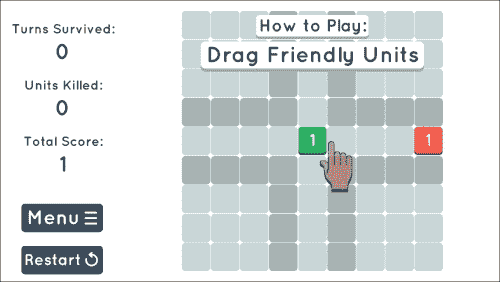

在我们的 `showTutorialInstructions` 方法中，我们想要创建一个手指，引导用户走向正确的方向。因此，在你的 `showTutorialInstructions` 方法的底部，添加以下代码块来创建一个手指并将其定位到中间正方形的中心：

```swift
CCSprite *finger = [CCSprite spriteWithSpriteFrame:[[CCSpriteFrameCache sharedSpriteFrameCache] spriteFrameByName:@"imgFinger.png"]];
finger.anchorPoint = ccp(0.4,1);
finger.position = [MainScene getPositionForGridCoord:ccp(5,5)];
finger.name = @"finger";
finger.opacity = 0;
[self addChild:finger z:2];
```

注意我们是如何命名手指并将其定位在 `z:2`（为了与我们的教程保持一致）。

下一步是让我们的手指以我们希望用户滑动单位的方向进行动画处理。因此，在你已经将手指添加到场景之后，调用以下函数：

```swift
... 
  [self addChild:finger z:2];

  [self runFingerArrowActionsWithFinger:finger];
}

-(void)runFingerArrowActionsWithFinger:(CCSprite*)finger
{
}
```

在这里，我们只是直接将手指变量传递给函数（因为搜索具有匹配名称的子项会占用更多处理时间）。现在，我们只需要对我们手指的图像做以下操作：

1.  淡入手指

1.  向右滑动

1.  在它向右滑动时逐渐淡出

1.  稍等片刻

1.  重新定位手指

1.  重复

这看起来相当简单，对吧？是的，除了当我们想要按顺序排列所有这些事件时。在这种情况下，代码看起来相当复杂。这是我们希望函数看起来像这样的：

```swift
-(void)runFingerArrowActionsWithFinger:(CCSprite*)finger
{
  Unit *u = [Unit friendlyUnit];
  if (self.tutorialPhase == 1 || self.tutorialPhase == 3)
  {
    id slideRight = [CCActionSequence actions:[CCActionEaseIn actionWithAction:[CCActionFadeIn actionWithDuration:0.25f] rate:2], [CCActionEaseInOut actionWithAction:[CCActionMoveBy actionWithDuration:1.0f position:ccp(u.gridWidth*2, 0)] rate:2],[CCActionDelay actionWithDuration:0.5f], nil];

    id fadeOutAndReposition = [CCActionSequence actions:[CCActionDelay actionWithDuration:0.25f], [CCActionEaseInOut actionWithAction:[CCActionFadeOut actionWithDuration:1.0f] rate:2], [CCActionDelay actionWithDuration:0.5f], [CCActionCallBlock actionWithBlock:^{
      finger.position = [MainScene getPositionForGridCoord:ccp(5,5)];
    }], nil];

    [finger runAction:[CCActionRepeatForever actionWithAction:slideRight]];
    [finger runAction:[CCActionRepeatForever actionWithAction:fadeOutAndReposition]];

  }  
  else if (self.tutorialPhase == 2)
  {

    finger.position = [MainScene getPositionForGridCoord:ccp(6,5)];
    id slideLeft = [CCActionSequence actions:[CCActionEaseIn actionWithAction:[CCActionFadeIn actionWithDuration:0.25f] rate:2], [CCActionEaseInOut actionWithAction:[CCActionMoveBy actionWithDuration:1.0f position:ccp(-u.gridWidth*2, 0)] rate:2],[CCActionDelay actionWithDuration:0.5f], nil];

    id fadeOutAndReposition = [CCActionSequence actions:[CCActionDelay actionWithDuration:0.25f], [CCActionEaseInOut actionWithAction:[CCActionFadeOut actionWithDuration:1.0f] rate:2], [CCActionDelay actionWithDuration:0.5f], [CCActionCallBlock actionWithBlock:^{
      finger.position = [MainScene getPositionForGridCoord:ccp(6,5)];
    }], nil];

    [finger runAction:[CCActionRepeatForever actionWithAction:slideLeft]];
    [finger runAction:[CCActionRepeatForever actionWithAction:fadeOutAndReposition]];

  }
}
```

实际上，手指将淡入，向右滑动（同时淡出），然后重新定位，并在教程的第一阶段和第三阶段（第二阶段相反方向）无限期地重复这些动作。

很遗憾，我们还没有完成手指的编码。当我们想要进入下一阶段时，我们必须移除它，记得吗？

因此，在 `removePreviousTutorialPhase` 方法中，我们只是给标签添加一个非常相似的移除样式，唯一的区别是，我们将将其应用于手指（这次，我们需要使用 `getChildByName` 的搜索功能，因为这个函数在不确定的时间被调用）：

```swift
CCSprite *finger = (CCSprite*)[self getChildByName:@"finger" recursively:NO];
finger.name = @"old_finger";
id fadeRemoveFinger = [CCActionSequence actions:[CCActionEaseInOut actionWithAction:[CCActionFadeTo actionWithDuration:0.5f opacity:0] rate:2], [CCActionCallBlock actionWithBlock:^{
  [self removeChild:finger];
}], nil];
[finger runAction:fadeRemoveFinger];
```

就这些关于手指的内容！我们已经得到了一个按照我们想要的方向滑动的手指，包括漂亮的淡入淡出效果。我们还有文本显示和移除，文本前进等等。唯一剩下要做的就是确保我们的用户只能按照我们想要的方向移动他们的单位。

## 拒绝非教程移动

只有当他们在特定的顺序中移动时，我们的教程才能按预期工作。因此，我们需要在通过教程时限制他们的初始移动。

在`Unit.m`中，在`touchMoved`函数中，我们想要确保单位只有在第一阶段三个阶段中朝正确方向移动时才能开始被拖动。因此，向`touchMoved`函数中添加以下 if 语句（当距离小于`20`时）：

```swift
if (!self.isBeingDragged && ccpDistance(touchPos, self.touchDownPos) >20)
{
  ...

    if (
  (((MainScene*)self.parent).tutorialPhase == 1 && self.dragDirection != DirRight) ||
  (((MainScene*)self.parent).tutorialPhase == 2 && (self.dragDirection != DirLeft || self.unitValue == 1)) ||
  (((MainScene*)self.parent).tutorialPhase == 3 && self.dragDirection != DirRight))
    {
      self.isBeingDragged = NO;
      self.dragDirection = DirStanding;
    }
}
```

这就是为什么我们创建了一个`tutorialPhase`对象作为属性——这样我们就可以从另一个类中访问阶段。但这里发生的事情本质上是对教程阶段的检查，如果它是第一阶段、第二阶段或第三阶段中的任何一个，它将进行另一个检查以查看`dragDirection`是否指示正确的方向。对于第二阶段还有一个额外的检查，因为它不允许单位值为 1。

如果这些情况中的任何一个是真的，我们将`isBeingDragged`设置为`NO`，并将拖动方向设置为站立（这样在第二阶段就不会发生意外的行为）。

教程到此结束！虽然花了一些时间，但它不仅简单快捷，而且相当全面，同时不影响游戏体验。

然后，一旦我们的教程结束，它将从那个点无缝地过渡到常规游戏。另一个优点是：假设玩家输了，没有完成，或者点击了菜单或重新开始；或者手机在教程期间某个时刻没电了。当他们回来时，教程将简单地从开始处重新开始，这是好的，也是故意的。

### 小贴士

从教程中得到的要点是要保持简短，在他们完成时保存，并测试所有可能的“愚蠢”方式，用户可能会尝试搞砸教程（因此有关于拒绝错误动作的最后一部分）。

# 在 Facebook 和 Twitter（以及更多）上分享

在社交媒体上分享游戏现在非常普遍。我们的游戏不会是那个例外。这不仅是你游戏的营销工具，因为用户会在他们的社交媒体页面上为你推广游戏，而且也是一个提升参与度的好方法，因为人类喜欢竞争。能够分享和比较他们的分数（以及间接竞争）让用户更想玩游戏，这对开发者和玩家来说都是双赢的局面。

## 使用内置的分享功能

要整合 Facebook、Twitter、消息、电子邮件和其他分享选项，最简单的方法是通过`UIActivityView`对象。它就是你在照片应用左下角按钮按下时看到的相同分享方式。

基本上，我们只需要告诉`ActivityView`对象我们想要显示什么，以及我们想要排除哪些活动类型，然后通过`CCDelegate`呈现视图控制器。

首先，我们需要创建一个**分享**按钮。

## 创建分享按钮

在`GameOverScene.m`中，将以下代码块添加到`initWithScoreData`方法中。这将在我们游戏结束屏幕的底部中央创建一个**分享**按钮：

```swift
//add share buttons
CCButton *btnShare = [CCButton buttonWithTitle:@"" spriteFrame:[[CCSpriteFrameCache sharedSpriteFrameCache] spriteFrameByName:@"btnShare.png"]];

[btnShare setTarget:self selector:@selector(openShareView)];
btnShare.position = ccp(winSize.width/2, winSize.height * 0.1);
[self addChild:btnShare];
```

然后，创建当分享按钮被按下时将调用的方法（现在必须添加，否则当达到`GameOverScene`时游戏会崩溃）：

```swift
-(void)openShareView
{

}
```

运行游戏，当你到达游戏结束屏幕时，你会在底部中央看到分享按钮。目前，它没有任何作用，所以让我们显示活动视图。

## 创建一个用于当前分数的变量

我们需要一种方法来跟踪玩家的当前分数和最近一次游戏的分数。尽管我们可以将此信息传递给游戏结束场景，除非我们将该值存储在实例变量中，否则我们无法在我们的分享中使用它。

因此，在`GameOverScene.h`中，添加一个用于当前分数的变量，如下所示：

```swift
@interface GameOverScene : CCScene <CCTableViewDataSource>
{
  CGSize winSize;
  NSArray *arrScores;
  NSInteger highScoreIndex;

  //add this:
  NSInteger numCurrentScore;
}
```

然后，在`initWithScoreData`方法中，我们添加以下行，以便我们可以获取传递给场景的总分：

```swift
numCurrentScore = [dict[DictTotalScore] integerValue];
```

现在我们已经准备好在分享的文本中使用分数了。

## 创建 UIActivityView 对象

在你刚刚创建的`openShareView`方法中，添加这几行代码（之后会有解释）：

```swift
NSString *textToShare = [NSString stringWithFormat:@"I scored %d in MathGame! See if you can beat me!",numCurrentScore];

NSString *appID = @"123456789"; //change to YOUR app's ID
NSURL *appStoreURL = [NSURL URLWithString:[NSString stringWithFormat:@"https://itunes.apple.com/app/id%@", appID]];

NSArray *objectsToShare = @[textToShare, appStoreURL];

UIActivityViewController *activityVC = [[UIActivityViewController alloc] initWithActivityItems:objectsToShare applicationActivities:nil];
```

首先是我们要显示的文本。我们需要保持它简短，有几个原因。最重要的原因是 Twitter 只允许 140 个字符，所以我们需要确保我们不会超过这个限制。第二个原因是，我们的潜在未来玩家可能不会阅读超过一两个句子的内容。最后，我们想要发送的*通用消息*至少要让人感觉是个人化的。它必须像阅读两个最好的朋友之间的对话一样。

接下来是 App Store 的链接，它也接受应用的 ID。注意`appID`变量是`1`到`9`。目前这还不是确切的 App ID（甚至不是书籍项目的 App ID），所以当我们创建 iTunes Connect 中的应用时（或者如果你已经创建了一个应用，你现在可以使用那个 App ID）我们将修改这一行代码。

之后是包含在分享中的对象数组。只需将它们添加到数组中即可。

最后，我们使用`objectsToShare`数组创建`UIActivityViewController`对象。

但目前还没有显示任何内容，所以让我们来处理这个问题。

## 显示 UIActivityViewController

在你初始化`activityVC`变量在`openShareView`方法后，添加以下代码块。它将确保活动视图不会显示某些活动，然后通过共享的`CCDelegate`显示视图控制器：

```swift
NSArray *excludeActivities = @[UIActivityTypeAirDrop,
    UIActivityTypePrint,
    UIActivityTypeAssignToContact,
    UIActivityTypeSaveToCameraRoll,
    UIActivityTypeAddToReadingList,
    UIActivityTypePostToFlickr,
    UIActivityTypePostToVimeo];

activityVC.excludedActivityTypes = excludeActivities;

[[CCDirector sharedDirector] presentViewController:activityVC animated:YES completion:nil];
```

由于我们不希望用户打印任何内容，将任何内容分配给联系人，或将它们添加到他们的阅读列表（Flickr，Vimeo 等），我们需要排除这些活动，这意味着它们不会出现在用户点击分享按钮时出现的视图中。

这是一个所有可能的`UIAcitivityTypes`列表：

+   `UIActivityTypeAddToReadingList;`

+   `UIActivityTypeAirDrop;`

+   `UIActivityTypeAssignToContact;`

+   `UIActivityTypeCopyToPasteboard;`

+   `UIActivityTypeMail;`

+   `UIActivityTypeMessage;`

+   `UIActivityTypePostToFacebook;`

+   `UIActivityTypePostToFlickr;`

+   `UIActivityTypePostToTencentWeibo;`

+   `UIActivityTypePostToTwitter;`

+   `UIActivityTypePostToVimeo;`

+   `UIActivityTypePostToWeibo;`

+   `UIActivityTypePrint;`

+   `UIActivityTypeSaveToCameraRoll;`

因此，对于您自己的项目，您可以随意包含或排除这些内容中的任意多少。例如，如果您正在分享一个视频，您可以非常容易地允许 Vimeo 或保存照片。

就这样！如果您现在运行游戏并点击**分享**按钮，您将看到活动视图弹出，以及消息、电子邮件、Facebook 和 Twitter 的各种按钮。点击任何一个都会加载相应的视图，以及添加的消息和 URL。

### 小贴士

当您将此添加到自己的项目中时，需要注意的关键点是排除列表。

这就是最终版本的外观：

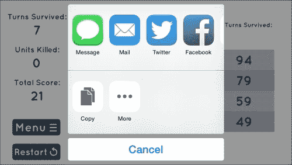

## 添加截图到分享

尽管我们添加了一些文本并包括了一个指向 App Store 上游戏的链接，但我们可能还应该包括一个截图，因为如果附有截图，人们至少会检查一下游戏。

话虽如此，我们并不真的想要从游戏结束屏幕截取截图，所以我们必须在过渡到`GameOverScene`之前截取游戏的截图。

因此，打开`MainScene.m`并添加以下方法。它将截取游戏屏幕：

```swift
-(UIImage*)screenshot
{
  [CCDirector sharedDirector].nextDeltaTimeZero = YES;

CCRenderTexture* rtx =
[CCRenderTexture renderTextureWithWidth:winSize.width
  height:winSize.height];
[rtx begin];
  [[[CCDirector sharedDirector] runningScene] visit];
[rtx end];

return [rtx getUIImage];
}
```

然后，在`endGame`方法中，让我们调用前面的方法并将其存储在局部变量中，以便我们可以将其传递给`GameOverScene`数据：

```swift
UIImage *image = [self takeScreenshot];

NSDictionary *scoreData = @{DictTotalScore : @(numTotalScore),
    DictTurnsSurvived :@(numTurnSurvived),
    DictUnitsKilled :@(numUnitsKilled),
    DictHighScoreIndex :@(hsIndex),  
    @"screenshot" : image};
```

注意到在`scoreData`字典中添加了`@"screenshot"`键。这将传递我们的`UIImage`，这样我们就可以在`GameOverScene`中获取它。

接下来，在`GameOverScene.h`中，添加一个用于截图的变量，如下所示：

```swift
@interface GameOverScene : CCScene <CCTableViewDataSource>
{
  CGSize winSize;
  NSArray *arrScores;
  NSInteger highScoreIndex;
  NSInteger numCurrentScore;

  //add this:
  UIImage *screenshot;
}
```

然后在`GameOverScene.m`中的`initWithScoreData`方法中，我们想要使用`@"screenshot"`键将截图存储在字典中的变量：

```swift
screenshot = dict[@"screenshot"];
```

最后，在游戏结束场景的`openShareView`方法中，我们只需要将截图变量添加到`objectsToShare`数组中，它将自动包含：

```swift
NSArray *objectsToShare = @[textToShare, myWebsite, screenshot];
```

就这样！通过现在运行游戏并到达分享按钮，无论您是通过 Facebook、Twitter、消息还是电子邮件分享，您都会看到图像。

### 小贴士

如果您真的想要做得更精致，您可以允许用户保存图像，以防他们想要保留自己的记录。为此，只需从`openShareView`方法中的排除数组中删除`SaveToCameraRoll`选项。

这就是添加截图后的游戏外观（通过 Facebook 分享）：

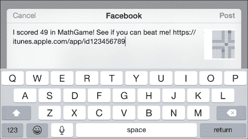

# 开关声音

目前，无论发生什么情况，我们都在播放音效和音乐。即使你可能是一个喜欢听声音或音乐的人，当你设计游戏时（这确实是一个增加用户参与度的元素），你可能会开放地接受这样一个事实：有时人们根本不喜欢听到任何声音。因此，我们必须给他们提供开关声音的选项。

## 没有选项或设置？那就去主菜单吧！

由于我们没有暂停屏幕、选项、设置或类似的东西，我们将把开关声音的按钮添加到主菜单中。这意味着添加按钮所需的代码要少得多，而不是为它们创建一个全新的场景。这种安排也与游戏的简洁感保持一致。

### 提示

如果你想要创建一个暂停屏幕并将这两个按钮添加到其中，那么请尽你所能去做。然而，代码将略有不同，因为如果你推入一个 `CCScene` 而不是替换（这本质上允许你在临时进入新场景的同时暂停游戏），然后弹出你推入的场景（换句话说，恢复暂停的游戏），你需要确保正确的变量被设置为 false。

## 创建按钮

首先，我们将在主菜单中创建声音和音乐开/关按钮。这些按钮将与普通按钮略有不同，因为它们需要在不同状态之间切换，而不仅仅是普通的按钮点击。

在 `MenuScene.m` 文件中，让我们在 `init` 方法中创建初始按钮：

```swift
if ((self=[super init]))
{

    //these values range 0 to 1.0, so use float to get ratio
    CCNode *background = [CCNodeColor nodeWithColor:[CCColor whiteColor]];
    [self addChild:background];

    winSize = [CCDirector sharedDirector].viewSize;
    CCButton *btnPlay = [CCButton buttonWithTitle:@"" spriteFrame:[CCSpriteFrame frameWithImageNamed: @"btnPlay.png"]];
    btnPlay.position = ccp(winSize.width/2, winSize.height * 0.5);
    [btnPlay setTarget:self selector:@selector(goToGame)];
    [self addChild:btnPlay];

    //add the sound and music buttons:

    CCButton *btnSound = [CCButton buttonWithTitle:@"" spriteFrame:[[CCSpriteFrameCache sharedSpriteFrameCache] spriteFrameByName:@"btnSoundOn.png"]];
    [btnSound setBackgroundSpriteFrame:[[CCSpriteFrameCache sharedSpriteFrameCache] spriteFrameByName: @"btnSoundOff.png"] forState:CCControlStateSelected];
    btnSound.position = ccp(winSize.width * 0.35, winSize.height * 0.2);
    [btnSound setTogglesSelectedState:YES];
    [btnSound setTarget:self selector:@selector(soundToggle)];
    [self addChild:btnSound];

    CCButton *btnMusic = [CCButton buttonWithTitle:@"" spriteFrame:[[CCSpriteFrameCache sharedSpriteFrameCache] spriteFrameByName:@"btnMusicOn.png"]];
    [btnMusic setBackgroundSpriteFrame:[[CCSpriteFrameCache sharedSpriteFrameCache] spriteFrameByName:@"btnMusicOff.png"] forState:CCControlStateSelected];
    btnMusic.position = ccp(winSize.width * 0.65, winSize.height * 0.2);
    [btnMusic setTogglesSelectedState:YES];
    [btnMusic setTarget:self selector:@selector(musicToggle)];
    [self addChild:btnMusic];

  ...
}
```

然后，我们需要确保创建按钮按下时将调用的方法：

```swift
-(void)soundToggle
{

}

-(void)musicToggle
{

}
```

在此点运行游戏将导致以下截图所示的结果。如果你按下任一按钮，它们将在彼此之间切换，如果你退出并返回，按钮将重置到其原始状态。

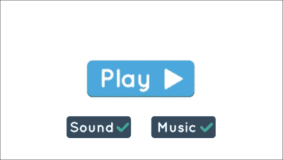

## 创建键

为了获取（并存储）声音和音乐变量，我们需要像过去一样使用 `NSUserDefaults`。为了在编码时减少用户错误，我们希望为我们的字典键定义常量。

由于 `MainScene` 已经被导入到我们所有的类中，我们可以在那里安全地定义常量。因此，打开 `MainScene.h` 文件，并将以下代码添加到文件顶部，与其他常量一起：

```swift
FOUNDATION_EXPORT NSString *const KeySound;
FOUNDATION_EXPORT NSString *const KeyMusic;
```

然后，在 `MainScene.m` 文件中，将以下代码添加到文件顶部，与所有其他常量一起，以便它们被定义：

```swift
NSString *const KeySound = @"keySound";
NSString *const KeyMusic = @"keyMusic";
```

现在我们能够获取存储的数据，以及如果我们需要的话，高效地保存任何值。

## 从 NSUserDefaults 中获取声音和音乐布尔值

我们希望将数据存储在变量中，这样我们就不必反复从 `NSUserDefaults` 中读取和写入，而只需在我们真正需要时进行操作。

因此，在 `MainScene.h` 文件中，添加两个布尔变量用于控制声音开/关和音乐开/关，如下所示：

```swift
@interface MenuScene :CCNode
{
  CGSize winSize;
  BOOL isSoundOn, isMusicOn;
}
```

然后，在你将按钮添加到场景中 `MainScene.m` 的 `init` 方法之后，使用你刚刚定义的键从 `NSUserDefaults` 中读取声音和音乐值：

```swift
isSoundOn = [[NSUserDefaults standardUserDefaults] boolForKey:KeySound];
isMusicOn = [[NSUserDefaults standardUserDefaults] boolForKey:KeyMusic];
```

现在我们想实际告诉声音和音乐按钮是否应该显示它们的**X**标记或勾选标记。为此，我们将只设置选中的值为其变量的相反。这是因为如果声音没有开启，我们希望显示选中版本：

```swift
btnSound.selected= !isSoundOn;
btnMusic.selected= !isMusicOn;
```

这可行，但没有办法测试它，所以当按下相应的按钮时，我们实际上修改一下值。

## 设置和保存值

在`soundToggle`方法中，我们将把`isSoundOn`变量设置为它的相反（切换开和关）。紧接着，我们将设置（并保存）它的值到我们之前定义的键：

```swift
-(void)soundToggle
{
  isSoundOn = !isSoundOn;
  [[NSUserDefaults standardUserDefaults] setBool:isSoundOn forKey:KeySound];
  [[NSUserDefaults standardUserDefaults] synchronize];
}
```

然后，我们也将对`musicToggle`方法中的`isMusicOn`变量做同样的处理：

```swift
-(void)musicToggle
{
  isMusicOn = !isMusicOn;
  [[NSUserDefaults standardUserDefaults] setBool:isMusicOn forKey:KeyMusic];
  [[NSUserDefaults standardUserDefaults] synchronize];
}
```

如果你现在运行游戏，你将能够切换声音和音乐的真/假变量，并且当你要么去另一个场景然后回来，要么退出游戏然后回来时，值将保留为你最后设置的值。但音乐仍然没有暂停，声音也没有关闭，所以让我们修复这个问题。

## 暂停/恢复背景音乐和声音

如果在按下音乐按钮时背景音乐正在播放，我们需要暂停它，反之亦然。

首先，让我们转到`musicToggle`方法并添加对`isMusicOn`变量的检查。如果它被启用，我们可以播放背景音乐。否则，我们将暂停音乐，直到用户再次将其打开：

```swift
isMusicOn ? [[OALSimpleAudio sharedInstance] playBg] : [[OALSimpleAudio sharedInstance] bgPaused];
```

之后，我们还将添加一个检查来查看`isSoundOn`是否被启用。如果是，我们将播放`buttonClick`音效：

```swift
if (isSoundOn)
[[OALSimpleAudio sharedInstance] playEffect:@"buttonClick.mp3"];
```

我们也将对`toggleSound`方法和`goToGame`方法做同样的处理，这两个方法都是在按钮被按下时被调用的。因此，我们将播放一个按钮点击音效（只有当声音被启用时）：

```swift
-(void)goToGame
{
  if (isSoundOn)
    [[OALSimpleAudio sharedInstance] playEffect:@"buttonClick.mp3"];
  [[CCDirector sharedDirector] replaceScene:[MainScene scene]];
}

-(void)soundToggle
{
  ...

  if (isSoundOn)
    [[OALSimpleAudio sharedInstance] playEffect:@"buttonClick.mp3"];
}
```

对于`MenuScene`，所有工作都已完成！如果你按下音乐按钮和/或声音按钮，你会注意到效果的开和关，正如预期的那样。现在我们已经处理了`MenuScene`，让我们继续处理其他所有我们将播放音效（以及开始音乐）的位置。

### 小贴士

或者，你可以创建一个类，它有启动和停止背景音乐、播放特定音效和播放按钮点击的方法，所有这些方法都使用`OALSimpleAudio`。

然后，你可以找到并替换所有`OALSimpleAudio`的实例，用你自己的自定义类替换。

## 处理主场景声音

由于我们在游戏的几乎每个类中都有音效和音乐播放，我们需要确保它们只在相应的值是 true 时播放。

所以首先，让我们打开`MainScene.h`并添加一个类似的变量用于声音：

```swift
@interface MainScene :CCScene
{
  BOOL isSoundOn;
}
```

接下来，在`init`方法中，确保你从`NSUserDefaults`获取值：

### 小贴士

还确保你在尝试播放任何音效之前在`init`方法中设置`isSoundOn`变量。如果你之后分配值，你可能会遇到意外的结果。

```swift
-(id)init
{
    if ((self=[super init]))
    {
      //used for positioning items on screen
      winSize = [[CCDirector sharedDirector] viewSize];
    isSoundOn = [[NSUserDefaults standardUserDefaults] boolForKey:KeySound];

    ...
}
return self;
return self;
}
```

在 `MainScene.m` 中搜索 `OALSimpleAudio`，并访问每一个实例，在其上方添加以下 `if` 语句，以便仅在特定的声音被启用时播放声音效果：

```swift
if (isSoundOn)
  ...
```

在 `playUnitCombineSound` 中应该有两个，一个在 `goToMenu` 中，一个在 `restartGame` 中，一个在 `moveUnit` 中。显然，如果你有更多的声音效果在播放，那么你也应该在那里添加它们，但到目前为止只有这五个。

## 对 `GameOverScene`（以及任何其他场景）重复操作

这基本上和 `MainScene` 一样，所以不会有太多的解释。但你真正需要做的只是以下这些：

+   在 `GameOverScene.h` 中创建 `isSoundOn` 变量。

+   在 `init` 方法中从 `NSUserDefaults` 赋值

+   在每个要播放的声音效果之前添加 if 语句

+   由于这是你唯一的另一个场景，继续到 `AppDelegate`。

## 处理 AppDelegate 音乐

我们需要确保如果用户在之前的版本中决定关闭音乐，音乐不会在用户首次加载游戏时随机开始播放。

所以在 `AppDelegate.m` 中，在调用 `playBgWithLoop` 方法之前添加以下 if 语句。注意，我们不需要将其存储在变量中，因为我们只会使用它一次：

```swift
if ([[NSUserDefaults standardUserDefaults] boolForKey:KeyMusic])
    [[OALSimpleAudiosharedInstance] playBgWithLoop:YES];
```

## 确保声音/音乐开始时启用

我们想要确保的一件事是，当用户开始游戏时，声音和音乐应该被启用。默认情况下，`NSUserDefaults` 中的任何布尔值都是 false。因此，我们需要确保在游戏开始之前，它们都被设置为 true，但只在他们第一次运行游戏时。

所以在 `AppDelegate.m` 中，在 `startScene` 的开头，让我们添加代码来检查他们是否之前玩过：

```swift
- (CCScene*) startScene
{
  //if they have not played before (in other words, first time playing)
  if (![[NSUserDefaults standardUserDefaults] boolForKey:@"hasPlayedBefore"])
  {
    [[NSUserDefaults standardUserDefaults] setBool:YES forKey:KeySound];
    [[NSUserDefaults standardUserDefaults] setBool:YES forKey:KeyMusic];
    [[NSUserDefaults standardUserDefaults] setBool:YES forKey:@"hasPlayedBefore"];

    [[NSUserDefaults standardUserDefaults] synchronize];
  }

  ...

  return [MainScene scene];//[CCBReader loadAsScene:@"MainScene"];
}
```

就这样！这需要一点仔细的计划来确保我们处理了用户可能遇到的所有情况，但这正是打磨你的游戏的全部要点——确保无论用户做什么或能做什么，游戏都能适当地、如预期地响应。

### 小贴士

为声音和音乐添加开关设置的关键要点如下：将值存储在 `NSUserDefaults` 中，从每个场景的局部变量中获取该值，并使用该变量来确定是否应该播放声音效果。如果你想确保你已获取了所有实例，查找项目中的 `OALSimpleAudio` 并遍历你创建的所有类。

确保检查你添加的任何未来声音效果的变量。

# 游戏中心排行榜

我们已经有一组存储在用户设备上的前 20 名高分，为什么不创建一个全球排行榜呢？实际上，即使许多玩家在玩游戏时没有使用 Game Center，它也是另一个推动参与度的元素。而且（这是真正酷的部分）——如果你还不知道的话——你实际上可以在 Game Center 中让玩家对你的游戏进行评分。这甚至不是一个额外的功能，因为他们只需点击排行榜或成就面板顶部的星级数量，就会将评分发送到 App Store。

在我们的游戏中创建一个用于显示的排行榜不仅仅是关于代码，因此我们首先需要在 iTunes Connect 中创建排行榜。在我们可以创建 iTunes Connect 中的应用程序之前，我们需要设置一个 App ID。

## 创建 App ID

到目前为止，如果你想要添加排行榜，你必须注册一个 Apple 开发者账户，如果你还没有的话。在第一章，*刷新我们的 Cocos2d 知识*中，注册过程被解释了。否则，如果你只是为了练习而跟随，请随意这样做，但没有开发者账户，你不能创建排行榜或成就。

首先，你需要从开发者网站创建 App ID。前往 [`developer.apple.com/devcenter/ios/index.action`](https://developer.apple.com/devcenter/ios/index.action) 并登录到拥有 iOS 开发者许可证的 Apple 账户。

登录后，在**iOS 开发中心**下，前往**证书、标识符和配置文件**部分，如下面的截图所示：

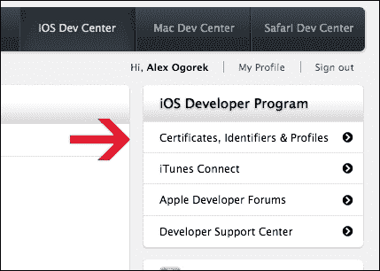

从这里，前往**标识符**部分，以便我们可以创建一个 App ID，如下面的截图所示：

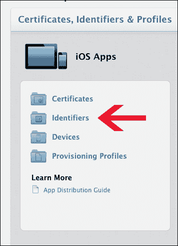

然后，通过点击右上角的**+**按钮开始创建 App ID。在这里，我们需要为 App ID 输入一个名称，包标识符的名称（这通常是反向 DNS 表示法；例如，[www.keitgames.com](http://www.keitgames.com)可能有 `com.keitgames.mygame` 作为包 ID），以及我们想要的任何服务（我们目前将其保留为默认设置）。以下截图供您参考：

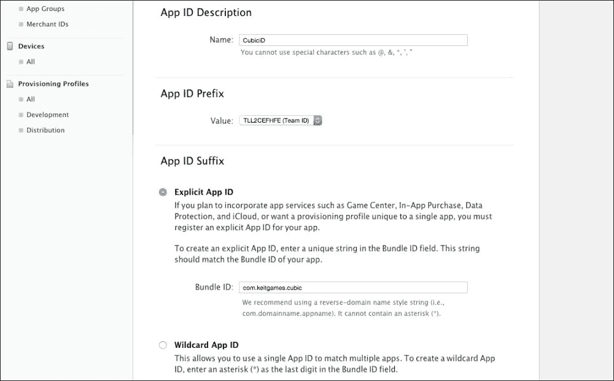

确保你使用自己的包标识符（前面的截图仅显示了一个示例以及所有内容的位置）。

完成这些后，点击**继续**然后点击**提交**。然后 App ID 应该就创建完成了。

接下来，在 Xcode 项目的设置中，选择 iOS 目标并更新包标识符为你刚刚创建的那个。

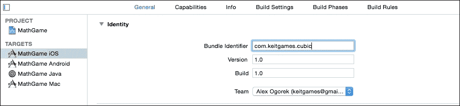

现在，包 ID 和 App ID 已经设置好了，我们可以在 iTunes Connect 中创建应用程序，这将允许我们设置和测试我们的排行榜。

## 在 iTunes Connect 中创建应用程序

在 iTunes Connect 中创建应用相对简单，并且仅用作线框，以便我们可以创建排行榜。在下一章中，我们将涵盖所有细节；现在您只需要知道我们现在在 iTunes Connect 中设置它（而不是稍后）的唯一原因是用于设置排行榜。

首先，前往[`itunesconnect.apple.com/WebObjects/iTunesConnect.woa`](https://itunesconnect.apple.com/WebObjects/iTunesConnect.woa)并登录您的开发者账户。然后点击**我的应用**，通过点击左上角的**+**按钮创建一个新应用，并点击**新 iOS 应用**。

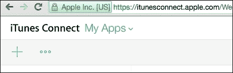

然后填写它要求的信息，包括您之前创建的应用 ID。SKU 实际上并不重要，因为它仅用于您自己的内部使用。

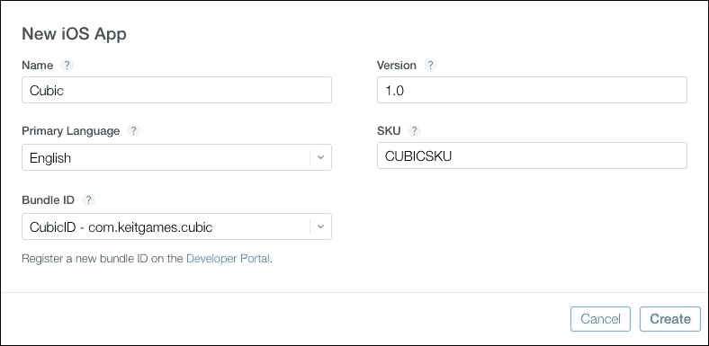

一旦在 iTunes connect 中创建了应用，点击**游戏中心**。

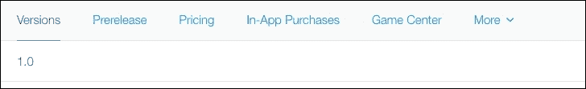

当询问它是用于单个游戏还是多个游戏时，这取决于您在创建项目时的决定。但为了本书项目的目的，我们将为单个游戏创建它。

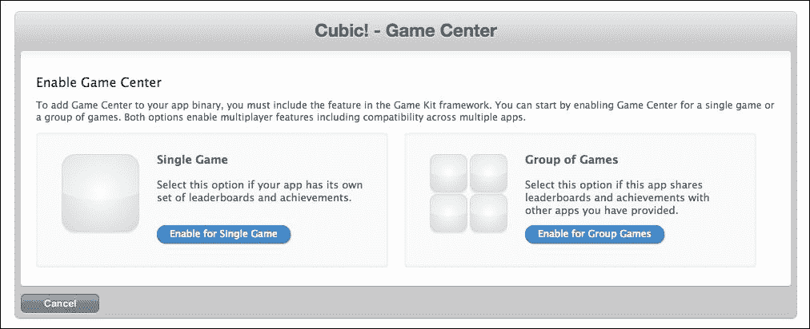

之后，您将被带到游戏中心设置屏幕，然后就可以继续下一步了。

## 创建排行榜

在 iTunes Connect 中的游戏中心设置部分，点击**添加排行榜**按钮，然后点击**单个排行榜**。

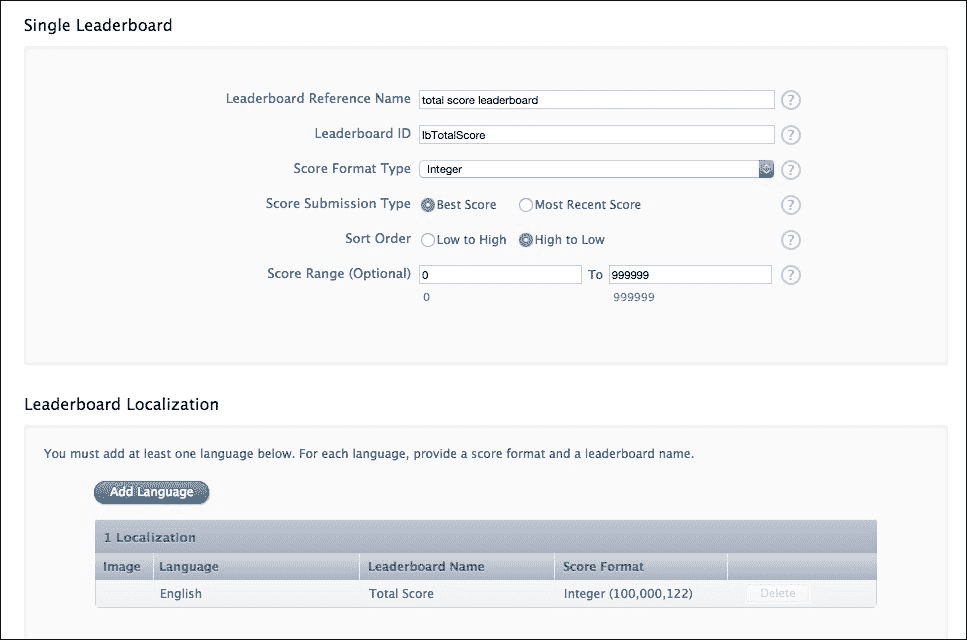

排行榜参考仅用于 iTunes Connect 内部的内部使用，以防您需要搜索它（或一眼就能知道它是哪个排行榜）。**排行榜 ID**将在代码中使用，因此它应该是独特且与其他排行榜（如果您创建了任何）不同的。得分格式仅使用整数，因此我们将使用**整数**格式。我们希望只提交最佳得分（因为排行榜中每个人只能有一个得分）并按从高到低排序。最后，我们希望范围从 0 到 999,999。技术上我们不必设置这个，但我们还是设置了。

接下来，我们添加一种语言。以下是一个显示**英语**的示例：

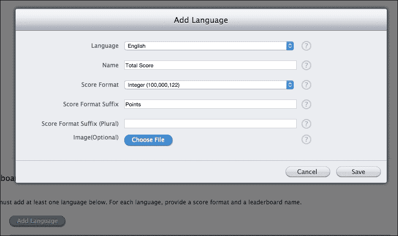

**名称**是用户将看到的排行榜顶部的标题，因此我们希望它很明显，表明这是哪个排行榜。**得分格式**与您刚才看到的一样。**得分格式后缀**的作用如下：由于我们有**分数**，得分为 625 的排行榜将显示为**625 分数**。如果您认为在每个得分中都包含单词**分数**看起来会很奇怪，您可以随意省略它，但到目前为止，我们将保留它。

在输入所有这些信息后，点击底部的**保存**。哇！它已经创建好了！接下来是编写 Game Center 登录、验证、排行榜展示、提交分数以及处理 Game Center 的所有其他内容。

## 添加 GameKit 框架

在我们开始编写任何代码之前，我们需要在我们的项目中包含 GameKit 框架。所以，在你的项目设置中，转到**iOS 目标**，然后转到**构建阶段**，在**链接二进制与库**部分，点击**+**按钮将框架添加到项目中，如图所示：

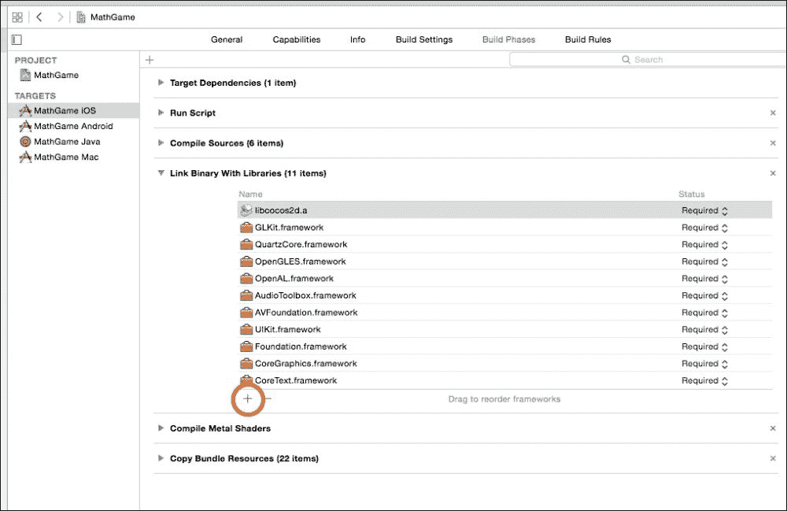

然后，搜索`gamekit`（不区分大小写），点击`GameKit.framework`的结果，然后点击**添加**。

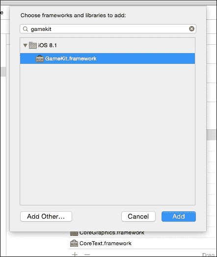

现在我们完成了！现在我们准备好编写代码了。

## GameKit 辅助文件

为了简化，你只需将`GKHelper`文件复制到你的项目中（确保选中了**复制**复选框）。实际上，编写 Game Center 代码并不难——对于有 Game Center 的每个项目都是如此。所以，为什么要在手动输入代码上浪费时间，当你可以直接准备好文件时？

实际上，`GKHelper`单例类所做的是管理你的`GKLocalPlayer`（设备上 Game Center 当前登录的用户），以及任何来自服务器或发往服务器的调用，以及任何排行榜分数提交和成就跟踪。

### 小贴士

`GKHelper`类是使用在线教程[`www.raywenderlich.com/23189/whats-new-with-game-center-in-ios-6`](http://www.raywenderlich.com/23189/whats-new-with-game-center-in-ios-6)创建的，如果你需要更多解释。还有一个更深入的指南在[`www.appcoda.com/ios-game-kit-framework/`](http://www.appcoda.com/ios-game-kit-framework/%20)，它涵盖了 Game Center 的各个方面。如果你遇到困难，或者仍然需要额外帮助（对于刚开始接触 Game Center 编程的人来说可能会很困惑），请参考它。

*重要提示*：假设你遇到了以下错误信息：

```swift
GameKitHelper ERROR: {
NSLocalizedDescription = "The requested operation could not be completed because this application is not recognized by Game Center.";
}
```

然后，你必须前往设备**设置** | **游戏中心**并启用**沙盒**，如图所示：

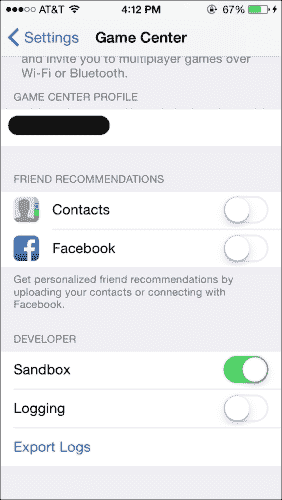

## 验证用户

现在一切就绪，创建完成，准备使用，我们可以开始编写实际的排行榜代码，并在用户登录 Game Center 时显示它。

首先，我们需要验证本地玩家；也就是说，如果他们还没有登录，就让他们登录，或者只需发送一个请求来获取`GKLocalPlayer`。

我们将在应用开始时进行这一操作，所以请在`AppDelegate.m`中导入`GKHelper.h`文件，并将以下方法调用添加到`startScene`方法的顶部：

```swift
[[GKHelper sharedGameKitHelper] authenticateLocalPlayer];
```

如果一切操作都正确，当你现在运行游戏时，你应该会在屏幕顶部看到一个横幅欢迎当前登录的玩家。如果没有，它会要求他们登录。

如果你收到一条错误消息，内容类似于请求的操作被取消或禁用，请前往**设置**应用，然后进入**游戏中心**。尝试重新登录和登出，或者启用底部的**沙盒**模式（参见前面的截图）。这应该可以解决问题。

## 创建游戏中心按钮

我们想要一个按钮来访问排行榜和其他游戏中心内容，所以请在`GameOverScene.m`文件的`init`方法中添加以下代码。它将在屏幕的右下角创建一个按钮：

```swift
//add Game Center buttons
CCButton *btnGameCenter = [CCButton buttonWithTitle:@"" spriteFrame:[[CCSpriteFrameCache sharedSpriteFrameCache] spriteFrameByName:@"btnGameCenter.png"]];
[btnGameCenter setTarget:self selector:@selector(viewGameCenter1)];
btnGameCenter.position = ccp(0.75, 0.1);
btnGameCenter.positionType = CCPositionTypeNormalized;
[self addChild:btnGameCenter];
```

我们还想要显示排行榜，这需要`GKHelper`，所以请在`GameOverScene.m`的顶部导入`GKHelper.h`文件：

```swift
#import "GKHelper.h"
```

然后创建`viewGameCenter`方法，这只是一个调用以显示排行榜：

```swift
-(void)viewGameCenter
{
  [[GKHelper sharedGameKitHelper] presentLeaderboards];
}
```

如果你现在运行游戏并进入游戏结束场景，你会在屏幕右下角看到一个**游戏中心**按钮，点击它（如果你已经登录到游戏中心），它将打开排行榜。现在唯一剩下的事情是将得分提交到游戏中心，以便在排行榜中显示。

## 提交得分

由于我们的`GKHelper`类可以为我们完成所有的得分报告，我们只需要调用相应的函数。既然我们知道`GameOverScene`将包含最近一局的得分总和，我们可以使用传入的字典作为提交给排行榜的得分值。

因此，在`GameOverScene.m`的`init`方法中，添加对`submitScore`函数的调用：

```swift
[[GKHelper sharedGameKitHelper] submitScore:[dict[DictTotalScore] integerValue]];
```

就这样！设置花费了一些时间，大约 10 行代码，但我们已经有一个全局排行榜。

这里有两个需要注意的事项：

+   你可能想实现成就，但`GKHelper`类中还没有实现这些代码，所以很遗憾，你需要自己完成。尽管这并不太难，但在这个游戏中不是必需的，所以它被跳过了。如前所述，[`www.appcoda.com/ios-game-kit-framework/`](http://www.appcoda.com/ios-game-kit-framework/)有一个很好的资源，解释了如何实现成就。它是在 2014 年 3 月写的，所以当你读到这本书的时候，代码应该仍然有效。

+   在实现排行榜时，如果你遇到任何问题，请确保从 iTunes Connect 设置到游戏中心、**沙盒**模式和代码本身，所有这些都在线。游戏中心可能有点棘手和令人烦恼。尽管这些年来它有所改进，但仍然可能有点挑剔。如果你仍然有问题，你可能不是唯一一个。一个很好的开始搜索的地方是 Stack Overflow。如果你不熟悉该网站，不要担心。他们有一个问答格式，有成千上万的人提出了关于代码和其他问题的疑问，还有更多的人给出了正确的答案。

那就是游戏中心的全部内容！为了完善我们的项目，最后要做的就是在场景之间创建一个自定义过渡，使游戏感觉更健壮，而不是只是瞬间在场景之间切换。

# 滑动过渡

虽然对于测试目的来说这很好，但场景之间的即时过渡（以及游戏首次加载时突然出现）是糟糕的。我们将添加一个快速的滑动过渡，在每个场景之间。换句话说，当用户点击按钮或发生应该用新场景替换场景的事件时，我们将让它看起来好像所有场景都在一个巨大的白色纸张上，只是用户看不到。

## 创建一个通用的滑动函数

由于我们将在各个地方做这件事，我们需要一个足够通用的函数，以便我们可以将任何场景从任何位置传递给它，并且它将执行我们想要它执行的确切操作。

因此，由于 `MainScene.h` 在所有地方都被导入，我们将在其中创建一个通用函数。打开 `MainScene.h` 文件，并在 `@interface` 行上方添加此枚举：

```swift
NS_ENUM(NSInteger, kMoveDirection)
{
  kMoveDirectionUp,
  kMoveDirectionDown,
  kMoveDirectionLeft,
  kMoveDirectionRight
};

@interface MainScene :CCScene
{ ... }
```

这将允许我们告诉通用函数将场景滑动到哪个方向。

然后，在 `MainScene.h` 文件中添加以下方法声明：

```swift
+(void)rubberBandToScene:(CCNode*)scene fromParent:(CCNode*)parent withDuration:(CGFloat)duration withDirection: (enumkMoveDirection)direction;
```

此方法接受的场景参数是你想要过渡到的场景、父级（你当前所在的场景）、你想要滑动持续多长时间，以及你想要滑动到哪个方向。

接下来，在 `MainScene.m` 文件中添加实际的功能。它将使我们的场景滑动到视图中，然后替换为 `CCDirector`（详细解释见注释）：

```swift
+(void)rubberBandToScene:(CCScene*)scene fromParent:(CCNode*)parent withDuration:(CGFloat)duration withDirection:(enumkMoveDirection)direction
{
  //grab the view size, so we know the width/height of the screen
  CGSize winSize = [[CCDirector sharedDirector] viewSize];

  //add the new scene to the current scene
  [parent addChild:scene z:-1];

  //set a distance to "over move" by
  NSInteger distance = 25;

  //variables for how much to move in each direction
  CGPoint posBack = ccp(0,0);
  CGPoint posForward = ccp(0,0);

  //determine the specifics based on which direction the slide is going to go
  if (direction == kMoveDirectionUp)
  {
    posBack.y = -distance;
    posForward.y = winSize.height + distance*2;
    scene.position = ccp(0,-winSize.height);
  }
  elseif (direction == kMoveDirectionDown)
  {
    posBack.y = distance;
    posForward.y = -(winSize.height + distance*2);
    scene.position = ccp(0,winSize.height);
  }
  elseif (direction == kMoveDirectionLeft)
  {
    posBack.x = distance;
    posForward.x = -(winSize.width + distance*2);
    scene.position = ccp(winSize.width, 0);
  }
  elseif (direction == kMoveDirectionRight)
  {
    posBack.x = -distance;
    posForward.x = winSize.width + distance*2;
    scene.position = ccp(-winSize.width,0);
  }

  //declare the slide actions
  id slideBack = [CCActionEaseInOut actionWithAction:[CCActionMoveBy actionWithDuration:duration/4 position:posBack] rate:2];
  id slideForward = [CCActionEaseInOut actionWithAction:[CCActionMoveBy actionWithDuration:duration/2 position:posForward] rate:2];
  id slideBackAgain = [CCActionEaseInOut actionWithAction:[CCActionMoveBy actionWithDuration:duration/4 position:posBack] rate:2];
  id replaceScene = [CCActionCallBlock actionWithBlock:^{

    //remove the new scene from the current scene (so we can use it in the replace)
    [parent removeChild:scene cleanup:NO];

    //reset its position to (0,0)
    scene.position = ccp(0,0);

    //actually replace our scene with the passed-in one
    [[CCDirector sharedDirector] replaceScene:scene];
  }];

  //arrange the actions into a sequence (which also includes the replacing)
  id slideSeq = [CCActionSequence actions:slideBack, slideForward, slideBackAgain, replaceScene, nil];

  //execute the sequence of actions
  [parent runAction:slideSeq];
} 
```

然而，由于我们在一个方向或另一个方向上稍微将场景移动到屏幕外，我们需要确保我们有足够的“背景”来覆盖额外的部分。

## 扩展背景

在 `MainScene.m` 文件 `init` 方法的顶部，我们将背景的声明更改为以下内容：

```swift
CCNode *background = [CCNodeColor nodeWithColor:[CCColor whiteColor] width:winSize.width*5 height:winSize.height*5];
background.anchorPoint = ccp(0.5,0.5);
background.position = ccp(winSize.width/2, winSize.height/2);
[self addChild:background z:-2];
```

将 `z` 值设置为 `-2`，以便我们可以将新场景放置在 `-1`（如前述代码所示）。因此，即使背景是屏幕宽度和高度的五倍，当它滑动到视图中时，新场景仍然可见。

现在只剩下调用函数这一步了。

## 使用橡皮筋过渡替换场景

由于我们创建了一个如此方便的通用函数，我们不需要做任何事情，只需调用一次。因此，在 `MainScene.m` 文件中，修改你的 `goToMenu` 函数以调用你刚刚创建的 `rubberBandToScene` 方法：

```swift
-(void)goToMenu
{
  if (isSoundOn)
    [[OALSimpleAudio sharedInstance] playEffect:@"buttonClick.mp3"];

  [MainScene rubberBandToScene:[MenuScene scene] fromParent:self withDuration:0.5f withDirection:kMoveDirectionDown];
}
```

还要修改 `MainScene.m` 文件中 `endGame` 方法的相同行：

```swift
-(void)endGame
{
  //right here:
  NSInteger hsIndex = [self saveHighScore];

  UIImage *image = [self takeScreenshot];

  NSDictionary *scoreData = @{DictTotalScore : @(numTotalScore),
    DictTurnsSurvived :@(numTurnSurvived),
    DictUnitsKilled :@(numUnitsKilled),
    DictHighScoreIndex :@(hsIndex),
    @"screenshot" : image};

  [MainScene rubberBandToScene:[GameOverScene sceneWithScoreData: scoreData] fromParent:self withDuration:0.5f withDirection:kMoveDirectionUp];

}
```

注意，去菜单的方向是 `DirectionDown`，而 `endGame` 对象是 `DirectionUp`。现在运行游戏并按下那个**菜单**按钮。美吧？但这只是我们拥有的许多场景过渡之一。所以，让我们处理剩下的部分，好吗？

## MenuScene 中的过渡

当我们点击**播放**按钮时，我们理想上希望有相同的效果，所以首先我们需要创建一个超大的背景。在`MenuScene.m`中，修改背景代码以看起来像`MainScene`：

```swift
-(id)init
{
  if ((self=[super init]))
  {
    winSize = [CCDirector sharedDirector].viewSize;

    //these values range 0 to 1.0, so use float to get ratio
    CCNode *background = [CCNodeColor nodeWithColor: [CCColorwhiteColor] width:winSize.width*5 height:winSize.height*5];
    background.anchorPoint = ccp(0.5,0.5);
    background.position = ccp(winSize.width/2, winSize.height/2);
  [self addChild:background z:-2];
  ...
}
```

然后，在`goToGame`函数中，我们只需调用我们之前创建的通用函数：

```swift
-(void)goToGame
{
  if (isSoundOn)
    [[OALSimpleAudio sharedInstance] playEffect: @"buttonClick.mp3"];

  [MainScene rubberBandToScene:[MainScene scene] fromParent:self withDuration:0.5f withDirection:kMoveDirectionUp];
} 
```

## 游戏结束时的过渡

到目前为止，我们已经将进入菜单和游戏结束过渡添加到了主游戏场景中。我们还在主菜单场景中实现了进入游戏过渡。唯一剩下要做的就是将进入菜单和进入游戏的过渡放到`GameOverScene`中。

要做到这一点，你可以在`GameOverScene.m`中做你迄今为止所做的一切，并修改`goToMenu`和`restartGame`方法中的`replaceScene`代码行：

```swift
-(void)goToMenu
{
  //to be filled in later
  [MainScene rubberBandToScene:[MenuScene scene] fromParent:self withDuration:0.5f withDirection:kMoveDirectionDown];
}

-(void)restartGame
{
  //to be filled in later
  [MainScene rubberBandToScene:[MainScene scene] fromParent:self withDuration:0.5f withDirection:kMoveDirectionDown];
}
```

就这样！我们不仅成功创建了一个自定义过渡（与 Cocos2d 3.0+版本附带的那种相当无聊的过渡相比），而且还轻松地实现了它。它增加了那么一点“哇！这很有趣！”的感觉，这是好事，因为这就是玩家会感受到的。快乐的玩家意味着更高的参与度，更高的参与度意味着更高的评分和更多的朋友推荐（这意味着你口袋里的钱更多）。

## 其他润色想法

本章未涵盖的一些其他润色想法如下：

+   为角色或单位提供更平滑的动画

+   流畅的动作（例如，如前一章所述的贝塞尔效果）

+   没有加载屏幕（结束当前场景看起来正好像下一个场景开始的样子，并且瞬间过渡）

+   没有崩溃（是的，修复所有这些问题）

+   一些细微的细节，如背景移动或简短的 NPC 旁白

+   在中断（如电话、电池耗尽等）的情况下保存用户的进度

但这些只是几个例子。你可以在游戏中做无数的小改动来让它变得更好一点，但遗憾的是！在某个时候，我们需要发布游戏，所以下一章将专注于添加最后的修饰和将游戏提交给苹果。

# 摘要

在本章中，你学习了各种润色游戏的方法，并真正关注了一些微妙但重要的元素，例如声音和音乐的开关按钮、场景之间的滑动以及社交分享功能。

总是有些东西可以被调整和优化，使其更加精致。例如，如果你想了解更多关于更传统的精灵动画，你可以使用`CCAnimation`来实现。关于这方面的优秀参考指南可以在[`www.cocos2d-swift.org/docs/api/Classes/CCAnimation.html`](http://www.cocos2d-swift.org/docs/api/Classes/CCAnimation.html)找到。

注意，到目前为止，我们还没有为游戏想出一个名字。尽管名字是所有用户都会看到并熟悉的东西，但它对游戏开发并不重要，这就是为什么它排在最后。
