# 第七章. 达成目标

与前几章相比，本章内容将相对较少，因为这款游戏现在已经准备好发布。我们将讨论项目中的最终化步骤，以及在你将游戏提交给苹果审核之前在 iTunes Connect 中需要做的事情。具体来说，我们将在本章相对简短的篇幅中涵盖以下主题：

+   添加默认图像

+   图标

+   分析

+   在 iTunes Connect 上准备应用

+   发布游戏及其后续步骤

对于本章，我们将使用`Chapter 7`项目，因为它包含一些错误修复以及一些其他润色元素。建议你在继续之前打开此项目。

### 小贴士

在撰写本书时，Cocos2d 版本 3.4 不支持原生 iPhone 6 或 6 Plus。因此，不幸的是，当苹果将 iPhone 5 屏幕放大以匹配 iPhone 6 或 6 Plus 的分辨率时，艺术作品将看起来有些模糊。如果你决心让原生分辨率工作，你可以参考[`forum.cocos2d-swift.org/t/iphone-6-ios-resolutions-and-assets/15062/68`](http://forum.cocos2d-swift.org/t/iphone-6-ios-resolutions-and-assets/15062/68)上的一个帖子。它描述了在运行 6 Plus 版本时使用 iPad Retina 版本 6 的资产，在运行时使用 iPhone Retina 资产。

# 添加默认图像

现在，我们只需要为每一款 iPad 和每一款预 6 代 iPhone 创建启动图像。此外，我们还将进行一种类似黑客式的解决方案，这将使 iPhone 6 或 6 Plus 的图形略好一些（尽管仍然不是原生），同时使 iPhone 5 的外观在某种程度上同时变得更好和更差（取决于你如何看待它）。

首先，在项目的`Icon`文件夹中，删除现有的`Default`图像，将它们移动到回收站而不是仅仅删除引用。

项目文件中应包含一个名为`Default Images`的文件夹，其中包含项目所需的每个文件。将这些文件拖入 Xcode 项目（确保勾选了**复制**复选框）。

由于我们没有许多需要原生默认图像的设备，我们现在将跳过资产目录。如果你想使用它们，当然可以，但当你有正确命名的默认图像，就像我们这里一样，这不是必需的（也没有任何真正的益处）。

## 添加加载屏幕

虽然默认图像是用户首先看到的，但我们仍然希望从初始图像到我们的游戏有一个平滑的过渡，而不是它突然改变。因此，我们将创建一个仅用于将游戏视图滑入位置的过渡场景。

首先，创建一个新的类——一个`CCScene`的子类——并将其命名为`LoadingScene`。

然后，将`scene`方法添加到`LoadingScene.h`文件中：

```swift
+(CCScene*)scene;
```

接下来，用以下代码替换你的`LoadingScene.m`文件：

```swift
#import "LoadingScene.h"
#import "MainScene.h"

@implementation LoadingScene
+(CCScene*)scene
{
  return [[self alloc] init];
}

-(id)init
{
  if ((self=[super init]))
  {
//sets the window size and adds a white background
    CGSize winSize = [[CCDirector sharedDirector] viewSize];
    CCNodeColor *background = [CCNodeColor nodeWithColor:[CCColor whiteColor] width:winSize.width  height:winSize.height*5];
    background.position = ccp(0.5,0.5);
    background.positionType = CCPositionTypeNormalized;
    background.anchorPoint = ccp(0.5,0.5);
    [self addChild:background z:-2];

//creates the Cubic! Title in the middle of the screen (where it's located in the Default.png image)
    CCLabelBMFont *lblTitle = [CCLabelBMFont labelWithString:@"Cubic!" fntFile:@"bmTitleFont.fnt"];
    lblTitle.position = ccp(0.5,0.5);
    lblTitle.color = [CCColor colorWithRed:52/255.f green:73/255.f blue:94/255.f];
    lblTitle.positionType = CCPositionTypeNormalized;
    [self addChild:lblTitle];

//creates a progress circle that shows the user that stuff is happening (even though everything is technically already loaded at this point)
    CCSprite *circle = [CCSprite spriteWithSpriteFrame:[[CCSpriteFrameCache sharedSpriteFrameCache] spriteFrameByName:@"imgLoadingCircle.png"]];
    CCProgressNode *loadingTime = [CCProgressNode progressWithSprite:circle];
    loadingTime.type = CCProgressNodeTypeRadial;
    loadingTime.midpoint = ccp(0.5,0.5);
    [loadingTime runAction:[CCActionProgressFromTo actionWithDuration:1 from:0.0f to:100.0f]];
    loadingTime.position = ccp(winSize.width/2, winSize.height * 0.2);
    [self addChild:loadingTime];

    //schedules the transition to the main menu after 2 seconds (1 second for progress circle, and another second of waiting for a smoother transition)
    [self scheduleOnce:@selector(transitionToMainScene) delay:2];
  }
  return self;
}

//method to transition using our rubber band effect created previously
-(void)transitionToMainScene
{
  [MainScene rubberBandToScene:[MainScene scene] fromParent:self withDuration:0.6 withDirection:kMoveDirectionUp];
}

@end
```

理解我们想要过渡到`MainScene`，因此我们必须导入它。

还要注意`CCProgressNode`对象。这将是一个模拟加载的环形。由于我们的游戏加载相对较快，无需真正的加载条或其他类型的进度测量，我们不希望用户在连续几秒钟看到相同的图像时感到困惑。因此，我们添加了一个`CCProgressNode`对象，让他们知道“嘿，有事情发生了！”

当您查看代码时，这相当直观。中点本质上就像其他`CCNode`对象上的锚点。如果您想要一个条形而不是圆形，只需更改类型。其他所有内容都应该保持不变。

## 从主场景切换到加载场景

最后，为了让这一切发生，我们只需要将`LoadingScene.h`的导入语句添加到`AppDelegate.m`文件中：

```swift
#import "LoadingScene.h"
```

然后，在您的`startScene`方法底部，查找以下行：

```swift
return [MainScene scene];
```

用以下新代码替换它，这将进入我们刚刚创建的`LoadingScene`对象：

```swift
return [LoadingScene scene];
```

如果您此时运行游戏，您将看到初始默认图像加载，然后在一两秒后进度环出现，最后，加载屏幕将消失并拖动`MainScene`一起消失。

现在我们已经处理了初始启动，让我们设置图标。

# 图标

SpriteBuilder 为我们提供的默认图标方便了测试，但现在是时候让我们与众不同，创建我们自己的图标。

### 小贴士

要使用下一节中将要讨论的模板，您需要 Photoshop。如果您有设计团队，您可能已经拥有它。如果您没有 Photoshop，您可以从其网站获取免费试用版。

## 模板

根据您计划支持的设备和 iOS 版本，大约有 10 到 15 种不同的应用程序图标大小。如果您更改图标，手动更新所有这些大小将是一件痛苦的事情。幸运的是，使用由 Michael Flarup 创建的模板创建所需的图标大小比以往任何时候都要容易。

您可以从[www.appicontemplate.com](http://www.appicontemplate.com)下载模板。下载完成后，您可以从 Photoshop 中打开它并开始使用。准备好后，只需运行下载中包含的动作，它就会为您生成文件。

还有关于如何使用模板的非常好的视频，所以本着不重复的原则，这里不会展示如何使用。

## 将图标添加到项目中

首先，我们希望移除旧图标，因为我们不希望有任何干扰或意外出现在某人的设备上。所以只需删除旧图标。

一旦您创建了新的图标（或者如果您希望使用本项目包含的图标），只需将文件拖入 Xcode 中，确保勾选**复制**复选框。这也在下面的屏幕截图中有展示：

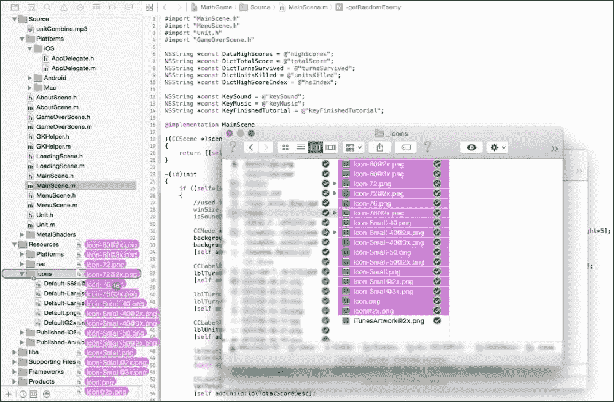

目前，项目不会使用新的图标，因此我们需要为每个尺寸分配用于资产目录的图标文件。

## 资产目录

我们将使用资产目录来存储我们的图标。理想情况下，我们也应该将它们用于启动图像，但由于我们目前不支持任何疯狂的设备尺寸或方向，所以目前并不必要。

然而，对于图标来说，创建资产目录然后根据你希望支持的 iOS 版本将图标拖放到适当的位置要容易得多。

因此，首先，你需要通过访问项目的常规设置并点击**使用资产目录**按钮在 Xcode 中创建资产目录。

如果资产目录已经存在，只需点击下拉框右侧的箭头导航到该资产目录。以下截图也展示了这一过程供您参考：

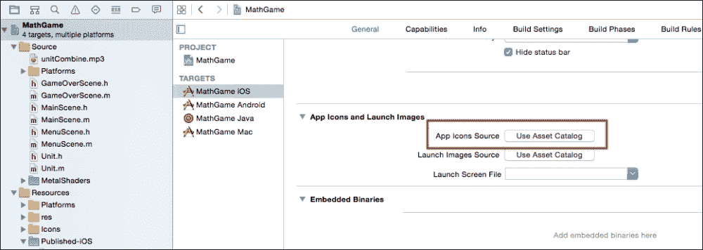

然后，在创建完目录后，只需根据它们所需的尺寸将图片拖放到适当的位置。以下截图是它们应该是什么样子的粗略表示，但请确保拖动正确的图片，否则 Xcode 会发出警告，指出你提供了错误尺寸的图片。幸运的是，我们使用的模板为我们提供了良好的图片名称，因此我们可以快速查看哪个图标是什么尺寸的。

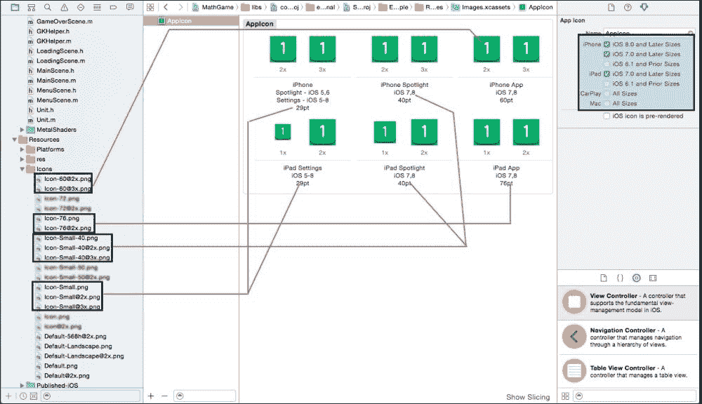

注意，我们不支持**iOS 6.1 及以下**的尺寸。虽然你可能认为这只是几个图标尺寸的问题，但如果你真正愿意支持 iOS 6 和更早的版本，你必须在一个运行旧设备的设备上运行你的应用，以确保没有任何崩溃。

总之，一旦你将图片添加到资产目录中，清理项目并重新运行。你会看到预期的**更新**图标。就这样了！

# 分析和用户数据

在我们提交应用之前，还有一件最后的事情要做，那就是设置一些快速分析工具来确定用户如何玩游戏。我们将使用一个名为**Flurry**的 API。如果你之前没有听说过它，或者听说过但从未使用过，没关系，接下来的部分将带你完成设置过程。

Flurry 有三大优点：

+   设置和使用简单

+   可用的详细分析

+   它是免费的！谁会反对呢？

那我们就开始吧，从注册过程开始。

## 注册 Flurry

前往[`www.flurry.com/`](http://www.flurry.com/)，然后在右上角点击**注册**。填写所需信息，然后点击**注册**。

之后，它会询问你希望跟踪哪个平台的分析。在这里，因为我们正在为 iPhone 和 iPad（iOS 的通用应用）制作应用，我们将选择 iPhone。如果应用仅在 iPad 上可用，你将选择 iPad 版本。

我们接着添加应用的名称，并选择应用所属的类别。

准备就绪后，单击底部的 **创建应用**，Flurry 将要求您验证您的电子邮件。一旦您点击电子邮件中的链接（或复制他们发送的代码并将其粘贴到他们提供的验证框中），您将被引导到一个屏幕，告知您过程已成功。然后您应该会得到一个 API 密钥。

### 小贴士

请记住将此 API 密钥复制到某个地方或保持网页打开，因为我们稍后开始会话跟踪时需要它。

在成功设置后，您应该会看到一个下载 SDK 的链接。下载 SDK（ZIP 文件），并等待其完成。这可能需要一两分钟。

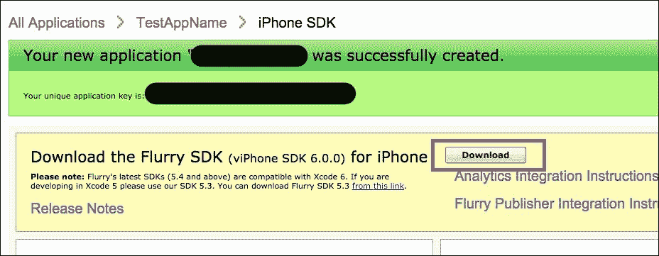

一旦 SDK 下载并解压，我们就可以将 Flurry 添加到我们的项目中。

## 将 Flurry 添加到您的项目中

由于 Flurry API 应该与所有其他库一起包含，在下载的 SDK 中，你应该会看到一个 `Flurry` 文件夹。将整个文件夹拖到 Xcode 的 `libs` 文件夹中（确保勾选了复制复选框）。

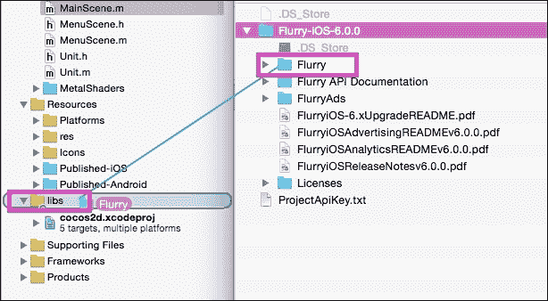

然后，我们需要确保我们的项目中包含适当的框架，以便 Flurry 正确地执行其功能。因此，在我们的项目 **构建阶段** 中，我们将添加一些框架。只需在 **链接二进制与库** 部分的 **+** 按钮下单击即可。

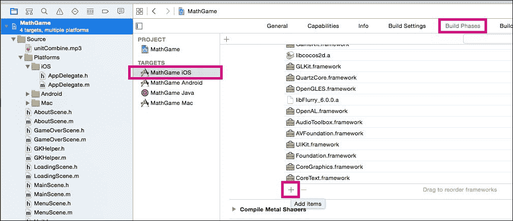

然后，搜索并添加以下框架：

+   `Security.framework`

+   `SystemConfiguration.framework`

+   `CFNetwork.framework`

最后，库已经被包含到我们的项目中，我们可以在 `AppDelegate.m` 文件中导入 Flurry 头文件，并在 `application:didFinishLaunchingWithOptions` 方法中开始跟踪会话：

```swift
#import "Flurry.h"

@implementation AppController

- (BOOL)application:(UIApplication *)application didFinishLaunchingWithOptions:(NSDictionary *)launchOptions
{

    [Flurry startSession:@"API_KEY_HERE"];
[Flurry setLogLevel:FlurryLogLevelAll];
...
}
```

注意，`API_KEY_HERE` 字符串应该是您在首次创建应用时获取的实际 API 密钥，因此现在您可以随意复制它。

当您刚开始（或实际上任何时候）进行调试时，您也会有一些调试信息。理想情况下，您应该在发布时禁用这些信息，但现在，在测试时查看正在发生的事情是有帮助的。

## 记录事件

事件是 Flurry 的核心。它们基本上是一种无限的方式来跟踪您自己的自定义事件。您不需要保留预定义的函数或事件，只需简单地传递您希望跟踪的事件名称（只是一个字符串），Flurry 会为您处理其余部分。

例如，假设我们想跟踪用户启动游戏多少次。由于我们经常访问 `MainScene`，我们不希望跟踪到错误的信息。因此，只有在他们移动一个单位时（但仅当 `numTurnsSurvived` 等于 `1` 时）才记录事件。

打开 `MainScene.m` 文件，在 `moveUnit` 函数中，将以下代码添加到方法顶部，该方法将记录当前会话的 `started_game` 事件：

```swift
if (numTurnSurvived == 1)
  [Flurry logEvent:@"started_game"];
```

另一个例子可能是当用户完成教程时。所以，在`MainScene.m`中，在我们的`advanceTutorial`方法中，让我们为用户完成教程的情况添加一个事件：

```swift
-(void)advanceTutorial
{
  ...
  else
  {  
    ...

    [Flurry logEvent:@"tutorial_finished"];
  }
}
```

添加事件跟踪竟然这么简单！你可以拥有无限数量的不同名称的事件，每个会话最多可以跟踪 300 个独特的事件（所以请尽可能多地使用与你的应用/游戏相关的），并且对特定事件跟踪的次数没有限制。

### 小贴士

此外，还有带有参数的事件记录，例如用户是否注册，他们使用的是哪种设备，他们是否使用了特定的设置，等等。任何字符串都可以作为参数。你可以在 Flurry API 中了解更多关于参数的信息，请参阅[`developer.yahoo.com/flurry/docs/analytics/gettingstarted/events/ios/`](https://developer.yahoo.com/flurry/docs/analytics/gettingstarted/events/ios/)。

当你完成使用应用时，Flurry 会自动提交任何会话数据。虽然这听起来有些含糊不清，但本质上是在按下**主页**按钮时发送数据。

话虽如此，如果你正在测试，请确保 Flurry 使用 Xcode 正确记录了你的事件，并且在按下设备上的**主页**按钮（或模拟器）之前不要点击**停止**按钮。数据可能永远不会发送，你可能会花费数小时甚至数天 wondering why nothing seems to be working, when you actually never gave Flurry a chance to send the information.

现在我们的事件已经被记录并发送到 Flurry 服务器，让我们实际跟踪和分析我们的数据。

## 跟踪和可视化数据

幸运的是，Flurry 不仅抓取我们的原始数据，而且还为我们创建了有用的分析，所以我们不需要自己进行数据分析。例如，如果你想查看每天有多少人开始玩游戏，或者有多少人通过存活超过 20 回合来完成游戏，你可以在他们的网站上轻松查看此类数据。以下是使用 Flurry 几周后的截图：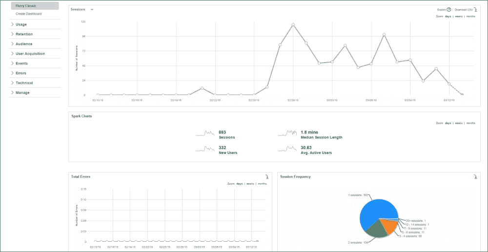


注意，事件出现在你的 Flurry 事件仪表板（不是数据，而是事件名称）上大约需要 15 到 45 分钟。如果在几小时后你仍然没有在仪表板中看到事件列表，请再次尝试，但这次请确保你正确地退出了应用。这意味着在 Xcode 中停止应用之前先按下**主页**按钮，以便 Flurry 可以检测到该事件并发送数据。

此外，Flurry 不会实时显示，所以发送给他们的任何实际数据都会被处理，并且至少需要 24 小时才能显示。在测试时，如果你发现自己想知道数据在哪里，只需等待一两天。然后它应该开始显示。如果它没有显示，请确保你在 Xcode 中看到了正确的调试日志消息。

### 小贴士

如果你在使用 Flurry 时迷路了，需要进一步解释，或者只是想了解更多关于 Flurry 高级功能的信息，你可以在他们的网站上查看*入门*指南，网址为[`developer.yahoo.com/flurry/#get-started`](https://developer.yahoo.com/flurry/#get-started)。它相当全面。

如果你感兴趣的是 Flurry 的替代品，你可以通过快速搜索 iOS Analytics，以及查看[`www.apptamin.com/blog/app-analytics-tools/`](http://www.apptamin.com/blog/app-analytics-tools/)来了解，它展示了（并详细介绍了）各种其他分析工具。

# 在 iTunes Connect 上准备应用

现在我们已经准备好了所有东西，让我们继续准备 iTunes Connect ([`itunesconnect.apple.com`](https://itunesconnect.apple.com))，以便我们可以提交这个游戏供苹果审核。本节假设你已经有一个开发者账号并且在 iTunes Connect 中有一个应用。

### 小贴士

如果你还没有开发者账号，现在是获取账号的好时机。如果你不知道如何获取，请阅读第一章，*刷新我们的 Cocos2d 知识*。如果你已经有了开发者账号，但还没有在 iTunes Connect 中创建应用，请回到第六章的*游戏中心*部分，*整理和润色*。在那里，你会看到在 iTunes Connect 中创建应用的逐步方法。一旦完成，你就可以从这里继续了。

对于大部分内容，iTunes Connect 是相当直观的。然而，我们将快速了解每个部分的内容以及你需要输入的信息。

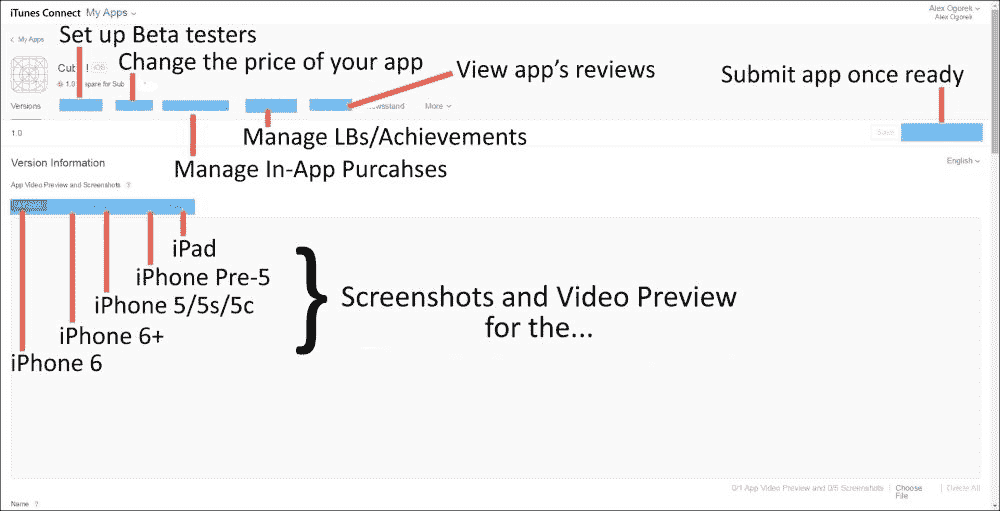

当你在 iTunes Connect 中打开你的应用时，你会在顶部看到许多部分，以及截图和视频预览的部分。必须为每个你支持的平台包含截图。由于我们将支持所有设备，因此最好为每个设备添加截图（也许还可以添加一个简短的 30 秒视频）。

理想情况下，你应该为每个设备拍摄自己的截图，这就是为什么项目文件中没有包含截图（每个设备最多可以添加五个截图）。

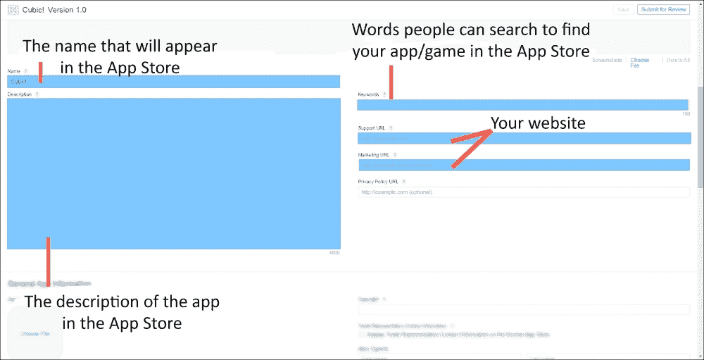

在截图下方，你会看到 App Store 中的应用显示名称，一个描述（4000 字符限制）的应用描述，用户可以在 App Store 中输入以找到你的应用/游戏，以及一个链接到你的网站，供想要了解更多关于你的用户访问。

关键词以逗号分隔，且最多 100 个字符。例如，以下是一些可以用来描述这个游戏的术语。这个字符串长度为 28 个字符：

`cube,square,grid,number,math`

如果你需要帮助确定关键词的长度，你只需搜索字符串长度计数器，通常任何一个都可以完成这项工作。

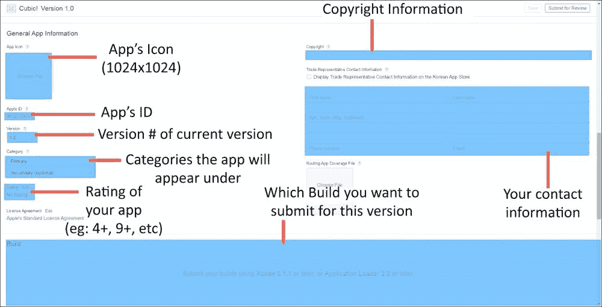

接下来是应用的图标（这必须是 1024 x 1024 像素，并且是 PNG 或 JPG 格式），它将在整个 App Store 中显示——版本号、它将出现在哪些类别下等等。版权信息的例子可以是 KeitGames 2015（想象一下在填写这部分时旁边有一个版权符号）。

需要注意的一点是**评分**部分。在这里，尽管它很微妙，但你必须点击**编辑**按钮，通过自我评分的过程来确定应用适合的最小年龄组。在我们的案例中，它将是 4+。

此外，在你提交构建到 iTunes 后，它将进入一个持续几分钟的处理阶段。之后，在**构建**部分，你可以选择你想要提交给应用特定版本的构建。

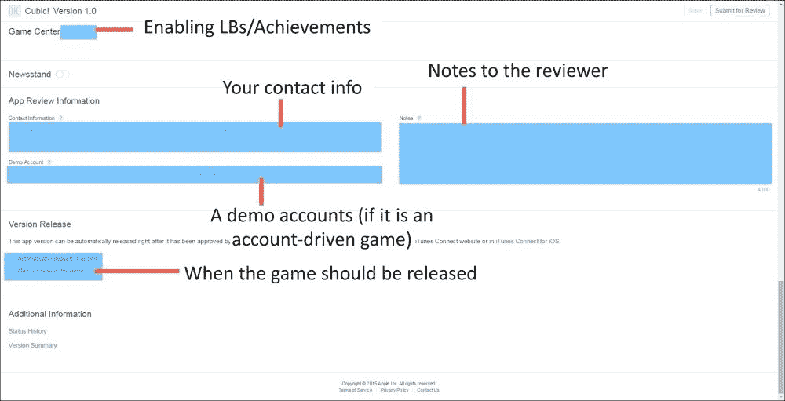

接下来是游戏中心部分。这部分与屏幕顶部的**游戏中心**标签页是分开的，因为尽管你可能已经设置了一个正常工作的排行榜并在测试构建中工作，除非你在这里启用**游戏中心**并选择你想要添加的排行榜，否则它不会出现在发布版本中。

如果你的应用或游戏需要登录才能工作，你也可以提供演示账户，以及提交你可能有的任何关于审查你应用的笔记。

最后，如果我们选择**自动发布此版本**，那么每当应用被苹果公司批准时，它将立即开始为 App Store 处理。它将在当天或第二天（或你设置在顶部**定价**部分中的任何未来日期）显示。假设你选择**手动发布此版本**。那么即使应用被苹果公司批准，它也不会开始处理（因此即使在设定的发布日期之后，也无法下载），直到你点击**发布此版本**。

在填写了所有相关信息后，我们实际上可以开始创建构建并将其提交给苹果公司。

# 发布游戏及其后续步骤

这就是真正的兴奋时刻，你会对自己说“是时候了。”

但说真的，当你的游戏终于准备好发布，你将其发送给苹果公司进行审查，并计划让可能数百万的人接触到它时，这是一个激动人心的时刻。

发布游戏的第一件事是创建一个可以上传到苹果服务器的应用归档文件。为此，只需转到**产品** | **归档**（如果变灰，请将设备类型从模拟器更改为设备，即使你没有连接设备）。

归档完成后，将打开一个类似于以下截图所示的屏幕（如果未打开，你可以转到**窗口** | **组织者**）：

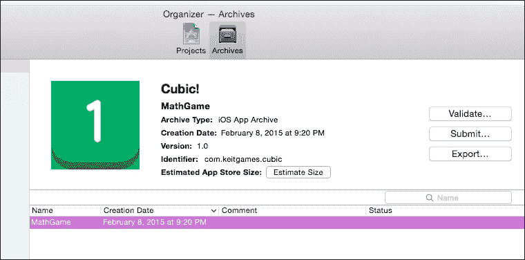

从这里，点击 **导出**。选择 **保存为 iOS 应用部署** 并点击 **下一步**。

如果您尚未登录，请登录，然后它会带您到一个类似这样的屏幕：

### 小贴士

如果它说找不到与捆绑 ID 匹配的应用，只需点击 **重试**。第二次应该能找到它。

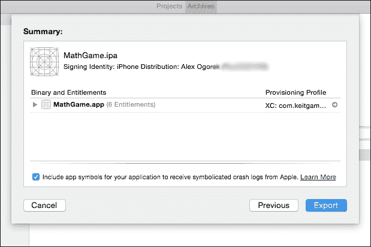

点击 **导出**，然后将其保存到您可以稍后找到的地方（例如桌面）。

现在通过前往 **Xcode** | **打开开发者工具** | **应用加载器** 来打开 **应用加载器**。登录并选择 **交付您的应用**。

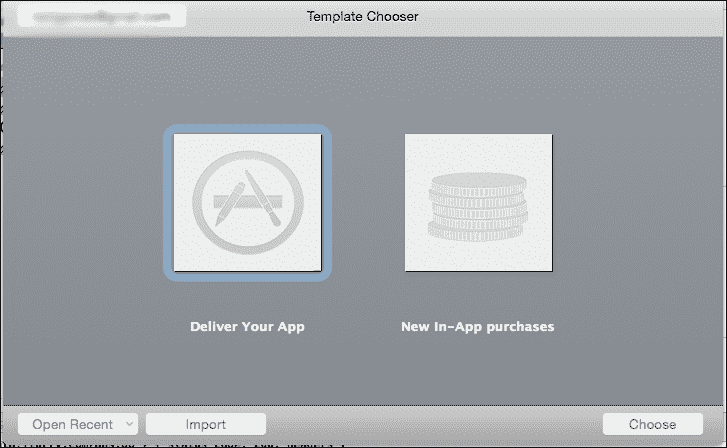

现在，导航到您导出的 IPA 文件所在的任何位置，并打开它。它将读取数据，屏幕看起来类似于这样：

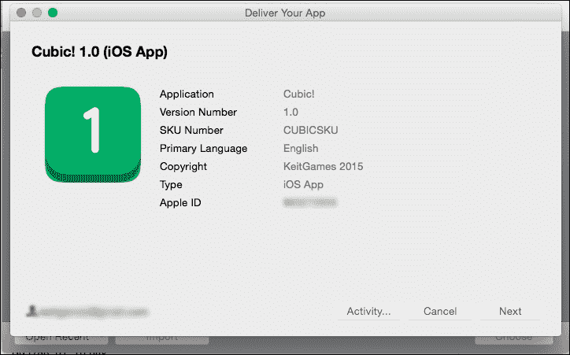

当您点击 **下一步** 时，它将验证所有图标是否已正确添加，默认图像是否存在，以及确保应用与您提供的信息相匹配的其他任何内容。

如果出现任何错误、警告或问题，您可能不是唯一遇到该问题的人。快速进行谷歌搜索从未伤害过任何人。

一旦完成验证过程，它将把应用上传到苹果的服务器。

### 小贴士

注意，这并不意味着应用已经“提交”以供审查。它只是上传了，以便您在准备好时可以从 iTunes Connect 中选择它。即使它说在审查时会被电子邮件通知，这也是不正确的（这很奇怪）。

等待几分钟之后，现在返回到 iTunes Connect，您应该在 **构建** 部分旁边看到一个 **+** 按钮。当您点击它时，您应该能够选择最近上传的构建。

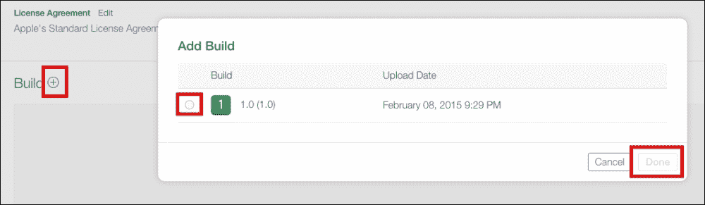

在顶部点击 **保存**。然后点击 **提交以供审查**。然后完成关于您的应用包含内容的必填问卷（在我们的案例中，没有任何内容）。然后点击 **提交**。

我们正在路上！

### 小贴士

一个更快的方法是无需使用应用加载器来验证和提交您的应用到 App Store。您不需要点击 **导出**，而是可以点击 **验证** 或 **提交**，然后执行相同的流程。

## 提交后

现在您的应用状态为 **等待审查**，最好利用您的时间，要么准备更新（因为理论上，您可以不断推送更新，一旦一个被接受，就推送另一个）要么向公众推广您的游戏。

理想情况下，您一直在早期就做这些事情：记录您的进度，在社交媒体上发布，告诉您的朋友和家人您正在创建的游戏，等等。但如果没有，没关系！接下来的几个部分将引导您完成这个过程。

## 测试人员和目标市场

如果你还没有人玩你的游戏，也没有进行 alpha 或 beta 测试，现在可能是做这件事的最佳时机。你应该尝试吸引不同技能水平的玩家，看看不同用户如何与你游戏互动，这样你就可以尽可能多地消除混乱。

此外，如果你想知道，“我应该寻找什么样的人来测试我的游戏？”你需要考虑你的理想玩家是谁。如果你在制作儿童游戏，试着让儿童（或者甚至他们的父母）玩你的游戏。如果游戏类型是塔防，试着找到那些非常喜欢塔防游戏的人，这样他们就可以给你提供很好的反馈。

如果你感兴趣的是与不在你附近的人进行 beta 测试，请考虑苹果的 TestFlight 集成。最初，TestFlight 是一个独立的产品，但现在苹果已经将其包含在 iTunes Connect 中（如果你点击了**预发布**标签，你可能已经看到了它）。基本上，你可以通过获取他们的电子邮件来邀请人们使用你的应用程序/游戏。你以提交的方式上传构建版本，除了你必须将构建版本添加到预发布中，经过审查过程后，苹果允许测试者下载并玩游戏。

但拥有 beta 测试者和确定你的目标受众只是第一步。第二步涉及将你的游戏交给很多人。

## 应用程序评论网站

使你的游戏成功的关键之一是将游戏交给其他人，特别是那些写博客或文章的人，这些文章是其他人制作的游戏的评论。如果一个游戏很棒，你会在各个地方看到它，也许苹果也会注意到，并在他们 App Store 的**特色**部分推荐它。

如果你给任何开发者（他们不在知名公司）发电子邮件并询问苹果是如何介绍他们的，通常得到的回答都是一样的：“我们根本不知道会发生这样的事情。我们只是让一些网站评论我们的游戏，然后突然之间，我们的游戏就在 App Store 上被推荐了一周！”

话虽如此，有一个巨大的应用程序评论网站列表在[`maniacdev.com/2012/05/ios-app-review-sites`](https://maniacdev.com/2012/05/ios-app-review-sites)，这样你就不必自己寻找它们。

尽管 URL 显示“2012”，但在撰写本书时，它已经被更新到 2014 年 8 月，网站按 Alexa 排名排序，将浏览量最大的网站放在列表顶部（浏览量最小的放在底部）。

苹果为每个提交到 App Store 的版本提供 100 个促销代码。在向这些网站推广/提交你的游戏时使用这些代码。

### 小贴士

注意，如果你的游戏还没有成为像*Mashable*或*TechCrunch*这样的网站的热门，那么在没有成为大热门的情况下，直接进入这些网站的可能性不大，所以为了更好地利用促销代码，从列表的较低位置开始，逐步上升可能是一个更好的选择，而不是下降。

## 其他信息来源

有一个名为*PixelProspector*的网站。在游戏开发方面（尤其是独立游戏，如果你在读这本书，这很可能是你喜欢的），他们拥有大量的资源、链接、指南等。即使你是知名工作室的一员，这也是一个获取信息的好来源（特别是他们相对较新的**营销**部分）。你可以在这里查看[`www.pixelprospector.com/indie-resources/`](http://www.pixelprospector.com/indie-resources/)。你可能会找到一些有用的东西。

# 摘要

在本章中，你学习了如何为你的应用创建默认图片，正确设置图标（包括使用资源库），通过 Flurry 向应用添加分析，在 iTunes Connect 上设置一切，发布你的应用，并规划发布后的行动。

在下一章中，我们将介绍苹果公司最新的编程语言，称为**Swift**。我们将看到一个非游戏示例，以及一个使用 Cocos2d Swift 版本的简单游戏。
