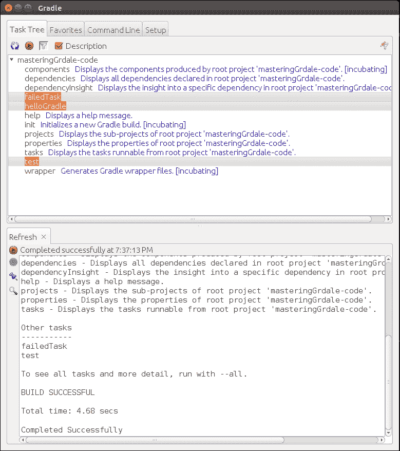
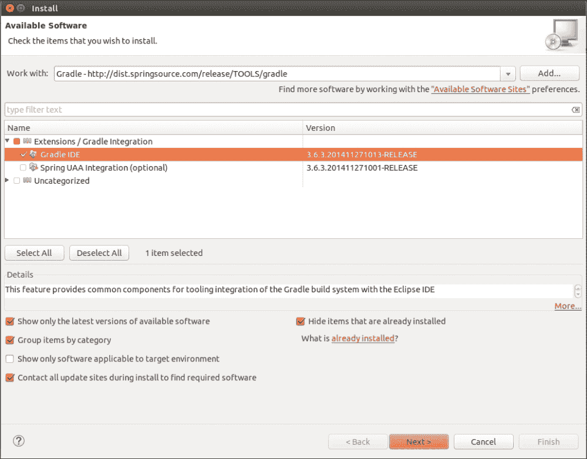
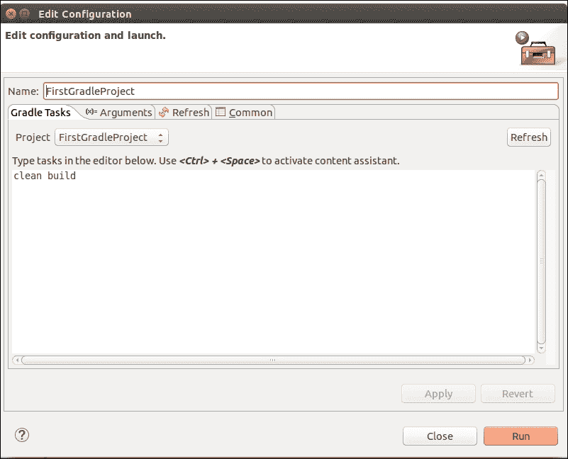

# 第一章. 使用 Gradle 入门

考虑一个典型的 IT 公司开发中心场景。不同的团队在一个包含许多组件的企业项目中共同工作。团队在服务器端技术、前端技术、消息层、移动开发等方面工作，可能还有一个单独的团队负责质量保证。每个团队都按照自己的进度工作，开发自己的组件，进行单元测试和提交代码，并且这个周期在多个迭代中重复。到目前为止，每个人都感到很高兴，因为他们能够按照软件发布日期按时完成工作。然后是集成阶段，当团队必须构建完整的项目并将软件（可能是 WAR、JAR 或任何服务）部署到集成/预发布环境中时。然后噩梦开始了。

尽管每个团队都成功地遵循了许多软件工程的最佳实践，例如每天提交代码、对代码进行单元测试以及在开发者的测试环境中验证工作的软件，但在集成或预发布环境中，情况突然发生了变化。团队陷入了配置和互操作问题、本地化问题、环境问题等等。

这可能对任何项目来说都是一个非常常见的场景，如果他们没有使用任何自动化解决方案来构建和部署流程，情况会变得更糟。因此，需要自动化流程，或者我们可以称之为 **构建自动化系统**（**BAS**），它能够无缝地自动化构建项目的手动任务，并以可重复、可靠和可移植的方式交付软件。BAS 不声称将完全没有问题或错误，但有了 BAS，软件可以更好地管理，最大限度地减少重复犯同样错误的可能性。

Gradle 是市场上可用的先进构建自动化工具之一。在接下来的 10 章中，我们将探讨如何使用 Gradle 和其他相关技术来缓解这些问题。然而，在我们开始学习 Gradle 之前，我们需要了解什么是 BAS 以及为什么我们需要它。

# 理解构建自动化系统

构建任何软件中最常见的流程包括编译源文件、将编译输出打包成压缩格式（ZIP、JAR 或任何其他格式），并将所需的资源文件和配置文件添加到打包中。除此之外，还可能包括一些其他活动，例如在源代码上运行静态代码分析以提供关于设计和编码模式反馈，另一个重要领域是质量保证，它涉及单元测试、集成测试、回归测试等。

BAS 是软件生命周期的一部分，它自动化了软件的构建和部署阶段。第一阶段是构建软件，这是创建二进制文件或可执行文件的过程。第二阶段是部署阶段，其中我们需要在特定位置安装软件。此阶段还包括各种其他活动，如解包捆绑包、软件本地化、根据环境配置软件以及设置执行软件所需的环境特定属性。下一个重要步骤是功能测试，以检查软件的行为。一旦一切正常，对你来说就是一个快乐和微笑的结局。

因此，作为一名开发者，编写代码和测试用例只是**软件开发生命周期**（**SDLC**）中的主要任务之一。构建和部署也被视为任何软件生命周期中的另一个重要阶段。如果管理不当，可能会导致重大停机时间和客户不满。

构建自动化使我们能够自动化构建过程中的手动步骤。它还有助于消除冗余任务，减轻手动干预的风险，保持构建的历史记录，并节省手动过程中的成本和时间。这里的目的是每次运行构建脚本时都创建可重复的资产，而如果你每次都手动执行步骤，则不会是这样。

许多开发者将构建自动化与**持续集成**（**CI**）联系起来。不要混淆。CI 允许执行构建过程、执行部署活动以及许多其他活动。它有助于创建构建和部署自动化的工作流程。它还帮助安排构建并提供按需执行构建。计划可以是每小时一次、每四小时一次、夜间构建或每次用户提交时。一些知名的 CI 工具包括 Jenkins、TeamCity、Bamboo、Hudson、Cruise Control 等，它们与构建工具（如 Ant、Maven 和 Gradle）完全不同。

## BAS 的必要性

想象一下，所有前面提到的构建软件的步骤都需要手动完成，每个开发者都必须在不同的机器上执行步骤。现在你可以意识到，在构建问题而不是关注实际业务需求上浪费了多少努力。这就是我们需要 BAS 的原因之一。以下是我们为构建系统自动化的主要活动之一：

+   将源代码翻译成二进制文件

+   将二进制文件与配置文件打包以创建可部署的工件

+   执行测试用例

+   将工件发布到公共仓库

+   将工件部署到不同的环境（开发、QA 和生产）

+   增量构建

+   总结构建当前状态的状况报告

另一个拥有构建自动化系统（BAS）的原因是减少操作复杂性。如果一个新成员加入团队，并且他必须手动构建软件，如果没有自动化，这可能会成为他的噩梦。与其专注于业务需求，他们的大部分时间将浪费在如何编译它、如何运行单元测试、如何执行集成测试等等。

实际上，他需要知道的是在哪里提交源代码，在哪里放置资源，以及执行构建过程需要运行哪些命令。构建过程应该自动执行编译、打包、运行测试、上传断言等所有任务。

构建和部署过程越自动化，你将越快地将可交付成果提供给客户。它还有助于业务连续性。在系统崩溃或网络故障的情况下，你可以在更短的时间内重建和部署软件到备份基础设施上。

一些开发者认为项目自动化是浪费时间，为什么他们要付出额外的努力，因为他们的 IDE 已经完成了这项工作。他们可以在 IDE 的帮助下构建 JAR、WAR 或任何其他可交付单元，并部署相同的单元。由于他们可以快速构建和测试，它们在本地系统上运行得非常好。问题开始于集成发生时。因此，需要一个自动化系统来避免任何手动干预（除非这是唯一的选择），并使构建可移植、可预测和高效。

# Gradle 概述

在深入了解 Gradle 的细节之前，我们需要了解一些与构建系统相关的术语。

建筑工具有两种类型，即**命令式构建工具**和**声明式构建工具**。命令式构建工具告诉系统做什么以及如何做。换句话说，它提供一组动作语句或命令，系统按相同的顺序执行这些命令并执行这些动作。你可以将 Ant 作为命令式构建系统的例子。

相反，声明式构建工具指导系统，告诉它你想要实现什么，系统将找出如何解释它。使用声明式方法，用户只需要确定*什么*，而不是*如何*。这是 Maven 在 Ant 获得一些知名度后为构建世界带来的关键创新之一，我们不需要编写每个动作的每一步，最终创建一个非常庞大且冗长的构建脚本。使用 Maven，我们需要为构建和构建系统本身编写一些配置参数，构建系统自己决定如何解释它。内部，声明式层基于一个强大的命令式层，可以根据需要直接访问。Ant 和 Maven 是非常好的且可靠的构建系统。它们在它们设计和构建的所有领域都是创新的。每个都为构建空间引入了关键的创新。

Gradle 结合了两种工具的优点，并提供了额外的功能，同时使用 Groovy 作为**领域特定语言**（**DSL**）。它具有 Ant 工具的强大功能和 Maven 的构建生命周期以及易用性。

Gradle 是一个通用、声明式的构建工具。它是通用的，因为你可以用它来构建几乎任何你在构建脚本中想要实现的东西。它是声明式的，因为你不想在构建文件中看到大量的代码，这些代码难以阅读和维护。因此，虽然 Gradle 提供了约定和简单、声明式构建的概念，但它也使工具具有适应性，并赋予开发者扩展的能力。它还提供了一种轻松定制默认行为和添加任何第三方功能的不同挂钩的方法。

主要来说，Gradle 是一个 JVM 语言构建工具，但它也支持 C、C++、Android 等。你可以在[`docs.gradle.org/current/userguide/nativeBinaries.html`](https://docs.gradle.org/current/userguide/nativeBinaries.html)找到更多关于此的信息。

它为 Java 项目所需的各个阶段提供自动化，例如编译、打包、执行测试用例等。它将类似的自动化任务分组为插件。当你将任何插件导入 Gradle 脚本文件时，它们都会附带一系列预定义的任务。要开始使用 Gradle，你需要具备基本的 Java 知识。它使用 Groovy 作为其脚本语言，这也是另一种 JVM 语言。我们将在下一章讨论 Groovy。由于构建脚本是用 Groovy 编写的，因此它比用 Ant 或 Maven 编写的脚本要短得多，表达性更强，也更清晰。在 Gradle 中使用 Groovy DSL 时，样板代码的数量要少得多。它还利用了 Maven 的约定以提高熟悉度，同时使其易于根据项目需求进行定制。开发者可以在任何时候添加新功能或扩展现有功能。他们可以覆盖现有任务或插件以提供新功能。

# 安装和快速入门

Gradle 的安装相当简单。你可以从 Gradle 主页[`www.gradle.org/downloads`](https://www.gradle.org/downloads)下载 Gradle 发行版，它以不同的格式提供。

## 前置条件

Gradle 需要安装 Java JDK 或 JRE，需要版本 6 或更高（要在你的机器上检查 Java 版本，请使用`java -version`）。一些功能可能不与 JRE 兼容，因此建议安装 JDK。此外，Gradle 自带其自己的 Groovy 库；因此，不需要安装 Groovy。Gradle 会忽略任何现有的 Groovy 安装。

Gradle 有三种格式可供选择：

+   `gradle-[version]-all.zip`：此文件包含源代码、二进制文件和文档

+   `gradle-[version]-bin.zip`：此文件仅包含二进制文件

+   `gradle-[version]-src.zip`：此文件仅包含源代码，以防你想扩展 Gradle 的功能

或者，你也可以直接下载 `gradle-[version]-bin.zip` 文件。

下载完成后，你需要解压 zip 文件，并根据你的操作系统进行配置。

## Gradle for Windows

以下是在 Windows 上安装 Gradle 的步骤：

1.  在硬盘上解压 Gradle 发行版。

1.  将 Gradle 的安装路径（例如，`c:\gradle-2.4`）添加到 `GRADLE_HOME` 变量中。请注意，此位置应该是 `bin` 或 `lib` 文件夹的父目录。

1.  将 `GRADLE_HOME/bin` 添加到 `PATH` 变量中。

当你准备好使用 Gradle 时，通过运行带有 `--version` 或 `-v` 命令行参数的 `gradle` 命令来验证你的安装。

```java
> gradle –version

------------------------------------------------------------
Gradle 2.4
------------------------------------------------------------

Build time:   2015-05-05 08:09:24 UTC
Build number: none
Revision:     5c9c3bc20ca1c281ac7972643f1e2d190f2c943c

Groovy:       2.3.10
Ant:          Apache Ant(TM) version 1.9.4 compiled on April 29 2014
JVM:          1.7.0_79 (Oracle Corporation 24.79-b02)
OS:           Windows 8.1 6.3 amd64

```

## Gradle for Mac/Linux

以下是在 Mac/Linux 操作系统上安装 Gradle 的步骤。

1.  解压 Gradle 发行版。

1.  在你的初始化脚本（`~/.profile`）中添加以下两行。

1.  导出 `GRADLE_HOME = <Gradle_Installation_Dir>`

1.  导出 `PATH=$PATH:$GRADLE_HOME/bin`

通过执行 `source ~/.profile` 来重新加载配置文件，并执行 `gradle –version` 命令。你将能够看到与上一节中提到的类似输出。

## Gradle JVM 选项

Gradle 与环境变量 `JAVA_OPTS` 设置的 JVM 选项相同。如果你不想使用此设置，并想专门将参数传递给 Gradle 运行时，你可以使用环境变量 `GRADLE_OPTS`。

假设你的系统中的 `JAVA_OPTS=512MB`，并且你想将 Gradle 应用的默认最大堆大小增加到 `1024MB`。你可以这样设置：

```java
GRADLE_OPTS="-Xmx1024m"

```

我们可以在项目特定的构建文件中应用此设置。或者，我们也可以通过将变量添加到 Gradle 启动脚本中（这将在本章后面讨论）来将此设置应用于所有 Gradle 构建。

# 我们的第一脚本

在最后一节中，我们学习了如何安装 Gradle。现在是我们创建第一个 Gradle 脚本的时候了。这个脚本将在控制台上打印 `Hello Gradle- This is your first script`。只需打开一个文本编辑器，输入以下三行，并将文件保存为 `build.gradle`。

```java
task helloGradle << {
      println 'Hello Gradle- This is your first script'
}
```

然后按照以下方式执行 `gradle helloGradle` 命令：

```java
$ gradle helloGradle
:helloGradle
Hello Gradle- This is your first script
BUILD SUCCESSFUL
Total time: 4.808 secs

```

那么，我们在这里做了什么呢？

+   我们创建了一个名为 `build.gradle` 的 Gradle 构建脚本文件。这是构建文件的默认名称。你可以给构建文件起任何名字。然而，为了执行脚本，你必须使用带有文件名的 `-b` 选项与 `gradle` 命令一起使用。否则，构建将失败，并显示 `"Task '%TASK_NAME%' not found in root project '%PROJECT_NAME'"` 错误。

+   尝试执行 `gradle -b <buildfile_name> helloGradle` 命令，你应该会得到相同的结果。

+   使用 gradle 命令，我们已经执行了一个名为`helloGradle`的任务，该任务在控制台打印一行。因此，我们传递给 gradle 命令的参数是任务名称。您可以使用 Gradle 命令执行一个或多个任务，并且这些任务将按照它们在命令行中出现的顺序执行。

    ### 小贴士

    有一种方法可以使用`defaultTasks`关键字定义默认任务，如果用户在构建文件中没有提到要执行的具体任务，则默认执行。我们将在第三章*管理任务*中进一步讨论这一点。

Gradle 命令初始化脚本，读取命令行上提到的所有任务，并执行任务。此外，如果任何任务有多个依赖项，则依赖任务将按字母顺序执行，除非这些任务本身强制执行顺序。您可以在第三章*管理任务*中找到更多关于任务排序的信息。

请记住，每个 Gradle 构建都包含三个组件：项目、任务和属性。每个构建至少有一个项目和一个或多个任务。项目的名称是构建文件存在的父目录名称。

# Gradle 命令行参数

现在您已经创建了第一个可工作的脚本，是时候探索 Gradle 支持的不同命令行选项了。

您已经看到了使用`-b`选项来指定构建脚本的使用方法。我们将从`--help`或`-h`或`-?`开始，列出 Gradle 命令行中所有可用的选项。

```java
$ gradle -h
USAGE: gradle [option...] [task...]

-?, -h, --help        Shows this help message.
-a, --no-rebuild      Do not rebuild project dependencies.
-b, --build-file      Specifies the build file.
-c, --settings-file   Specifies the settings file.
--configure-on-demand   Only relevant projects are configured in this build run. This means faster build for large multi-project builds. [incubating]
--continue            Continues task execution after a task failure.

```

在前面的输出中，`-h`或`--help`显示了许多更多选项。我们已经截断了输出。

您可以在您的系统上执行该命令并检查所有选项。其中大部分都是自我解释的。在本节中，我们将讨论一些最有用选项的用法。

现在我们将在`build.gradle`脚本中添加两个更多任务，`failedTask`和`test`，并将文件保存为`sample_build.gradle`。名为`failedTask`的任务预期将始终因断言失败而失败，而`test`任务依赖于之前创建的任务`helloGradle`。任务可以成功（在任务中执行所有语句而没有任何异常）或失败（由于任何异常或错误，这些异常或错误在任务的任何一行代码中提到），从而停止脚本的执行。

```java
task failedTask << {
      assert 1==2
}

task test(dependsOn: helloGradle ) << {
      println 'Test case executed'
}
```

在执行`gradle -b sample_build.gradle failedTask test`命令时，我们观察到`test`任务从未被执行。由于 Gradle 按命令行中出现的顺序顺序执行任务，如果任务执行失败，则忽略所有剩余的任务。

```java
$ gradle -b sample_build.gradle failedTask test
:failedTask FAILED
FAILURE: Build failed with an exception.
…
BUILD FAILED

Total time: 6.197 secs

```

默认情况下，Gradle 如果任何任务执行失败，则会停止构建过程。这个特性有助于快速获得构建过程的反馈。如果您不想因为任何任务的失败而停止构建的执行，并且希望继续执行其他任务，则可以通过使用 `--continue` 命令行选项来实现。当我们要构建一个多模块项目，其中一些模块可能由于编译错误或测试失败而失败时，这个特性可能很有用。使用 `–continue` 选项，我们将获得所有模块的完整状态。

```java
$ gradle -b sample_build.gradle failedTask test --continue
:failedTask FAILED
:helloGradle
Hello Gradle- This is your first script
:test
Test case executed

FAILURE: Build failed with an exception.

```

正如您在前面的输出中看到的，`failedTask` 任务执行失败。因此，构建被标记为 `FAILURE`。然而，这次 `test` 任务执行成功。同时注意，`helloGradle` 任务在 `test` 任务之前执行。这是因为我们已将 `test` 任务定义为依赖于 `helloGradle` 任务。这是创建任务依赖关系的一种方法。现在，请不要对任务依赖关系感到困惑。我们将在 第三章 *管理任务* 中详细讨论这个主题。

现在，如果 `helloGradle` 任务失败会发生什么？只需在 `helloGradle` 任务中添加一行 `assert 1==2`。断言语句强制任务失败。当您查看以下输出时，您会发现测试任务没有执行，因为依赖的任务失败了：

```java
$ gradle -b sample_build.gradle failedTask test --continue
:failedTask FAILED
:helloGradle
Hello Gradle- This is your first script
:helloGradle FAILED

FAILURE: Build completed with 2 failures.

```

在前面的场景中，测试任务依赖于 `helloGradle` 任务。这意味着每次我们执行 `test` 任务时，`helloGradle` 任务都会默认执行。如果您想避免执行 `helloGradle` 任务，可以使用 `-x or --exclude-task` 选项。

```java
$ gradle -b sample_build.gradle failedTask --continue test -x helloGradle
:failedTask FAILED
:test
Test case executed

```

另一个有用的选项是 `--dry-run` 或 `-m`，它运行构建但不执行任务。如果您想了解任务执行顺序或验证脚本，这很有用。

```java
$ gradle --dry-run -b sample_build.gradle failedTask test --continue
:failedTask SKIPPED
:helloGradle SKIPPED
:test SKIPPED
BUILD SUCCESSFUL
Total time: 4.047 secs

```

### 注意

`--dry-run` 执行不属于任何任务且定义在任务块之外的语句。为了验证这一点，在任务块定义之外添加一个 `println` 语句并观察结果。

到目前为止，您可能已经注意到每个输出都显示了除任务输出和错误消息之外的信息。尝试使用命令行选项 `-q` 或 `--quiet` 仅显示任务输出：

```java
$ gradle -q -b sample_build.gradle failedTask --continue test
Hello Gradle- This is your first script
Test case executed

```

选项 `--debug` (`-d`)、`--info` (`-i`)、`--full-stacktrace` (`-S`) 和 `--stacktrace` (`-s`) 以不同的日志级别和堆栈跟踪显示输出。`--debug` 是最详细的日志级别。`--full-stacktrace` 和 `--stacktrace` 如果构建因异常失败时，会显示堆栈跟踪。尝试使用这些命令行选项执行之前执行的命令，并观察输出：

```java
$ gradle -d -b sample_build.gradle failedTask --continue test

```

现在我们将探索 `--daemon`、`--stop` 和 `--no-daemon` 选项。在我的机器上，执行前面的脚本大约需要 3.6 秒。对于这个简单的脚本，大部分执行时间都花在了 Gradle 的初始化上。当我们执行 Gradle 命令时，会启动一个新的 Java 虚拟机，然后加载 Gradle 特定的类和库，最后执行实际的构建步骤。可以使用 `--daemon` 选项来改进 Gradle 的初始化和执行。如果你在进行测试驱动开发，需要频繁执行单元测试或者需要重复运行特定任务，这将非常有用。

要启动守护进程，可以使用 `--daemon` 选项。守护进程在空闲 3 小时后会自动过期。要检查系统上是否正在运行守护进程，在 UNIX 环境中使用 `ps` 命令，或在 Windows 系统中使用进程资源管理器。一旦启动了守护进程，再次执行相同的 Gradle 任务。你会发现执行时间有所改善。

或者，你可以使用 `gradle.properties` 文件来设置系统属性 `org.gradle.daemon` 以启用守护进程。在这种情况下，执行任务时不需要指定 `--daemon` 选项。要尝试一下，在创建 `sample_build.gradle` 文件相同的目录下创建一个名为 `gradle.properties` 的文件，并添加这一行 `org.gradle.daemon=true`。现在，运行 gradle 命令并检查守护进程是否正在运行。`org.gradle.daemon` 是我们设置的属性，用于配置 Gradle 构建环境。我们将在 第六章 中更多地讨论属性和系统变量，即 *使用 Gradle*。

要停止守护进程，请使用 `gradle --stop` 选项。有时，你可能不想使用守护进程执行 Gradle 任务。使用 `--no-daemon` 选项与任务一起，忽略任何正在运行的守护进程。

```java
$ gradle -b sample_build.gradle failedtask --continue test 
--daemon

$ ps -ef | grep gradle
root   25395  2596 46 18:57 pts/1  00:00:04 
/usr/local/java/jdk1.7.0_71/bin/java ….. 
org.gradle.launcher.daemon.bootstrap.GradleDaemon 2.4 
/home/root/.gradle/daemon 10800000 93dc0fe2-4bc1-4429-a8e3-
f10b8a7291eb -XX:MaxPermSize=256m -XX:+HeapDumpOnOutOfMemoryError -
Xmx1024m -Dfile.encoding=UTF-8 -Duser.country=US -Duser.language=en -
Duser.variant

$ gradle --stop
Stopping daemon(s).
Gradle daemon stopped.

```

虽然推荐在开发环境中使用 Gradle 守护进程，但它偶尔可能会损坏。当 Gradle 从多个来源执行用户构建脚本（例如，在持续集成环境中）时，可能会耗尽守护进程，如果资源管理不当，可能会导致内存泄漏。因此，建议不要在预发布或持续集成环境中启用守护进程。除了命令行之外，Gradle 还可以在 **图形用户界面**（**GUI**）中执行。在下一节中，我们将讨论 Gradle 支持的图形用户界面。其他重要的命令行选项，如 `–D` 或 `--system-prop`、`-P` 或 `--project-prop`，将在 第六章 中讨论，即 *使用 Gradle*，当我们更深入地探讨使用 Gradle 构建 Java 应用程序时。

# Gradle 图形用户界面

除了命令行参数和工具之外，Gradle 还提供了一个图形用户界面。您可以通过以下命令行选项启动它：

```java
$ gradle --gui

```

它启动了一个**图形用户界面**（**GUI**），可以直接从 GUI 中执行 Gradle 任务。



图 1.1

它包含四个选项卡，以下是对它们的解释：

+   **任务树**：您执行此命令的目录被视为父项目目录。如果此目录下有`build.gradle`文件，任务树将列出`build.gradle`文件中所有可用的任务。如果没有`build.gradle`文件在此目录下，它将只列出默认任务。您可以通过双击任务名称来执行任何任务。

    *图 1.1*显示了我们在早期开发的`failedTask`、`helloGradle`和`test`任务，以及默认的 Gradle 任务。

+   **收藏夹**：这类似于您的浏览器收藏夹，您可以在此处保存常用命令。此外，它还提供别名功能。如果您想在命令行上执行多个任务，您可以将其添加到此，并给它一个简单的显示名称。例如，您可以点击加号，在命令行文本框中添加以下任务：`clean build`。

    在显示名称区域添加`init`。您会看到**init**出现在**收藏夹**区域。下次，只需点击**init**即可执行`clean build`任务。

+   **命令行**：这类似于控制台。在这里，您可以执行单个或多个内联命令。它将执行命令，并在下方的窗口中显示结果。

+   **设置**：即使您从特定的项目目录启动了 GUI，您也可以使用此选项卡更改目录。它允许您更改当前目录以执行命令。此外，它有助于更改一些通用设置，例如日志级别、堆栈跟踪输出等。它还允许您通过自定义 Gradle 执行器执行其他 Gradle 版本。

# 启动脚本

考虑以下场景，对于您的每个 Gradle 项目，您都依赖于本地的内部 jar 文件。此外，您还希望为每个 Gradle 项目设置一些常见的环境变量（如`GRADLE_OPTS`）。

一个简单的解决方案是将 jar 文件添加到依赖项闭包中。另一个解决方案可以是创建一个通用的构建文件，并将其包含在每个构建文件中。

Gradle 通过引入初始化脚本为这类问题提供了最简单的解决方案。

初始化脚本并不是特殊的文件，而是一个具有`.gradle`扩展名的 Gradle 脚本。然而，这将在执行任何构建文件之前执行。

### 注意

可能会有多个初始化脚本。

初始化脚本的一些用途如下：

+   为您的每个项目下载一些常见的 jar 文件

+   执行与系统细节和/或用户细节相关的常见环境配置。

+   注册监听器和记录器。

那么，Gradle 是如何找到这些初始化脚本的呢？定义初始化脚本有多种方式，如下所示：

+   `<USER_HOME>/.gradle/init.d`目录下所有扩展名为`.gradle`的文件被视为初始化脚本。Gradle 会在执行任何 Gradle 构建脚本之前，执行此目录下的所有`.gradle`文件。

+   `<USER_HOME>/.gradle/`目录下名为`init.gradle`的文件被视为初始化脚本。

+   `<GRADLE_HOME>/init.d/`目录下所有扩展名为`.gradle`的文件。

+   您甚至可以使用`-I <file name>`或`--init-script <file name>`指定任何 Gradle 文件作为初始化脚本。

    ### 注意

    即使在前面提到的位置找到多个文件，Gradle 也会在执行任何项目构建脚本之前，将这些文件作为初始化脚本执行。

下面是一个示例`init`脚本。

```java
println "Hello from init script"
projectsLoaded {
  rootProject.allprojects {
    buildscript {
      repositories {
        maven {
          url "http://central.maven.org/maven2/"
        }
      }
      dependencies {
        classpath group: 'javax.mail', name: 'javax.mail-api', 
          version: '1.4.5'
      }
    }
  }
}
```

将前面的代码复制并粘贴，保存为`init.gradle`文件，位于前面提到的任何路径下。`println`语句有意添加到该文件中，以帮助您理解`init`脚本的执行周期。每次您从目录中执行任何 Gradle 脚本时，您都会看到`Hello from init script`。除了打印`Hello from init script`之外，当脚本首次执行时，此脚本还会在 Gradle 缓存中下载`javax.mail-api-1.4.5.jar`。除非存储库中的文件发生变化，否则它不会再次下载此库。如果您不了解缓存是什么，请不要担心。您将在本章后面的部分学习更多关于缓存管理的内容。记住，有时在初始化脚本中定义过多的配置可能会出现问题。特别是，调试可能会很困难，因为项目不再自包含。

# 构建生命周期

Gradle 构建有一个生命周期，包括三个阶段：初始化、配置和执行。理解构建生命周期和执行阶段对于 Gradle 开发者至关重要。Gradle 构建主要是任务集合，用户可以定义任务之间的依赖关系。因此，即使两个任务依赖于同一个任务，例如，任务 C 和任务 B 都依赖于任务 A，Gradle 也会确保任务 A 在整个构建脚本执行过程中只执行一次。

在执行任何任务之前，Gradle 为构建准备了一个所有任务的**有向无环图**（**DAG**）。它是定向的，因为一个任务直接依赖于另一个任务。它是无环的，因为如果任务 A 依赖于任务 B，而您让任务 B 依赖于任务 A，这将导致错误，因为两个任务之间不能有循环依赖。在执行构建脚本之前，Gradle 配置任务依赖图。

让我们快速讨论三个构建阶段。

## 初始化

用户可以为单个项目以及多项目构建创建构建脚本。在初始化阶段，Gradle 确定哪些项目将参与构建过程，并为这些项目中的每个项目创建一个项目实例。

## 配置

这个阶段配置项目对象。所有构建脚本（如果用户正在执行多项目构建），作为构建过程的一部分，都会被执行，而不会执行任何任务。这意味着你在配置块中编写的所有不在任务之外的语句都会在配置阶段执行。这里不会执行任何任务；只会为所有任务创建一个有向无环图。

## 执行

在这个阶段，Gradle 按照命令行中给出的顺序执行所有任务。然而，如果任务之间存在依赖关系，这些关系将首先得到尊重，然后再按照命令行顺序执行。

# 缓存管理

任何构建工具的主要重点是不仅自动化构建和部署过程，还要有效地管理缓存。没有软件是孤立工作的。每个软件都依赖于某些第三方库和/或内部库。

任何好的构建工具都应该自动处理软件依赖。它应该能够自动下载依赖项并维护版本。当 Ant 发布时，这个功能是不可用的，开发者需要手动下载依赖项并自己维护其版本。尽管后来通过扩展 Ant 以 Ivy 解决了这个问题。

Gradle 会自动下载构建文件中给出的所有依赖项。它确定项目所需的所有库，从存储库中下载，并将其存储在其本地缓存中。下次您运行构建时，它不需要再次下载这些依赖项（除非需要），因为它可以重用缓存中的库。它还会下载所有传递依赖项。

### 小贴士

**下载示例代码**

您可以从[`www.packtpub.com`](http://www.packtpub.com)下载您购买的所有 Packt 出版物的示例代码文件。如果您在其他地方购买了这本书，您可以访问[`www.packtpub.com/support`](http://www.packtpub.com/support)并注册，以便将文件直接通过电子邮件发送给您。

## 缓存位置

关于缓存，首先出现的问题是 Gradle 在哪个位置维护其缓存。Gradle 使用 `<USER_HOME>/.gradle/caches` 作为默认目录来存储其本地缓存。如果开发者使用多个版本的 Gradle 来构建软件，则可能包含多个版本目录。实际的缓存分为两部分。所有从仓库下载的 JAR 文件都可以在 `modules-2/files-2.1` 下找到。此外，你还会找到一些存储已下载二进制文件元数据的二进制文件。如果你查看 `modules-2/files-2.1` 目录，它具有 `group/name/version/checksum` 格式的路径，其中包含实际的二进制文件。你可以在 第五章 *依赖项管理* 中详细了解依赖项管理。

## 更改缓存位置

如果你想要将缓存位置更改为除默认位置之外的目录，你需要设置以下环境变量。你可以在 Windows 中将其作为环境变量设置，在 Unix/Linux 中在 `.profile` 文件中设置：

```java
GRADLE_USER_HOME=<User defined location>

```

## 缓存功能

现在，让我们讨论 Gradle 缓存的一些重要功能。

### 减少流量

Gradle 缓存管理的主要功能之一是减少网络流量。当你第一次构建应用程序时，Gradle 将所有依赖项下载到缓存中，这样下次就可以直接从缓存中获取。

如果在构建脚本中配置了多个仓库，并且在一个仓库中找到了 JAR 文件，那么 Gradle 不会在其他仓库中搜索相同的 JAR 文件。在另一种情况下，如果 JAR 文件在第一个仓库中没有找到，但已从第二个仓库中获取，那么 Gradle 将存储关于第一个仓库的元数据信息，这样下次就不会再搜索缺失的 JAR 文件，以节省时间和网络流量。

### 依赖项位置

每当 Gradle 从仓库下载依赖项时，它也会将其元数据中的仓库位置存储起来。这有助于检测变化，以防二进制文件从仓库中删除或其结构发生变化。

### 版本集成

如果开发者更新了他机器上的 Gradle 版本，并且他已经下载了旧缓存中的库，那么这些库将被重用。Gradle 还提供了与 Maven 本地仓库的紧密集成。Gradle 通过比较其校验和与本地缓存来确定远程仓库中的工件是否已更改。所有校验和匹配的工件都不会下载。除了校验和之外，Gradle 还会考虑一个额外的参数来比较远程和本地工件；Gradle 使用 HTTP 头参数 *content-length* 或最后修改日期的值。

### 关闭远程检查

使用 `--offline` 命令行选项，开发者可以要求 Gradle 只查看本地缓存，而不是远程缓存。如果用户在没有网络连接的情况下工作，这可能很有用。如果 Gradle 在本地缓存中找不到 JAR 文件，构建将失败。

### 版本冲突

如果开发者没有指定任何特定的依赖版本，并且有多个版本可供下载，那么默认情况下，Gradle 总是下载最新的工件版本。

# Gradle 与 IDE

到目前为止，在本章中，我们已经创建了一些基本的 Gradle 脚本。我们将通过创建一个使用 Gradle 的 Java 应用程序来结束本章。为了创建 Java 应用程序，我们将使用带有 Gradle 插件的 Eclipse IDE。

使用 **集成开发环境**（**IDE**），应用程序开发变得容易得多。在本节中，我们将探讨如何在 Eclipse 中安装 Gradle 插件、创建简单的 Java 应用程序、探索 Eclipse 插件任务以及从 Eclipse 执行 Gradle 任务。

除了 Eclipse，另一个流行的 IDE 是 JetBrains IntelliJ IDEA。Gradle 也支持 IDEA 插件，它与 Eclipse 插件非常相似。然而，在本书中，我们将只关注 Eclipse 插件，因为它免费提供且是开源的。

## 在 Eclipse 中安装 Gradle 插件

来自 Spring Source 的 Eclipse Integration Gradle 项目（[`github.com/spring-projects/eclipse-integration-gradle/`](https://github.com/spring-projects/eclipse-integration-gradle/））帮助开发者使用 Eclipse 中的 Gradle。此工具提供以下支持：

+   使用多项目

+   使用 `Gradle Import Wizard` 将 Gradle 项目导入到 Eclipse

+   使用 `New Gradle Project Wizard` 创建新的 Gradle 项目

+   使用依赖管理来配置 Eclipse 项目的类路径

+   使用 `Gradle Task UI` 执行 Gradle 任务

+   通过 DSLD（DSL 描述符）与 Groovy Eclipse 集成

以下是在 Eclipse（3.7.2 或更高版本）更新站点中安装此插件的操作步骤：

1.  启动 Eclipse。导航到 **帮助** | **安装新软件**。

1.  在 **安装新软件** 对话框中，点击 **添加** 按钮以添加新站点。

1.  将 **位置** 输入为 `http://dist.springsource.com/release/TOOLS/gradle`，将 **名称** 输入为 `Gradle`。您可以输入任何有意义的名称。

1.  点击 **确定** 添加仓库。

1.  从仓库列表中选择新创建的 Gradle 仓库。

1.  仅勾选 **扩展/Gradle 集成** | **Gradle IDE** 旁边的框。点击 **下一步**（参见图 1.2）。

1.  在下一屏幕上，点击 **下一步**。

1.  接受条款和条件并点击 **完成**。Eclipse 应该下载并安装 Gradle IDE。然后重新启动 Eclipse。

    图 1.2

## 在 IDE 中使用 Gradle 项目

我们已成功安装 Gradle 插件。现在，我们将创建一个简单的 Gradle 项目，并查看一些与 Eclipse 相关的重要文件，例如，`.project` 和 `.classpath`。然后我们将使用 Gradle 任务 UI 构建项目。

以下是创建 Gradle 项目的步骤：

1.  在 Eclipse 中，导航到 **文件** | **新建** | **Gradle** | **Gradle 项目**。

1.  在 **新 Gradle 项目** 窗口中，将项目名称指定为 **FirstGradleProject**，并选择样本项目为 **Java Quickstart**。

1.  点击 **完成** 并等待构建成功。

你将找到以下控制台输出：

```java
:cleanEclipseClasspath UP-TO-DATE
:cleanEclipseJdt UP-TO-DATE
:cleanEclipseProject UP-TO-DATE
:cleanEclipse UP-TO-DATE
:eclipseClasspath
…
:eclipseJdt
:eclipseProject
:eclipse

BUILD SUCCESSFUL

```

输出清楚地显示了这里正在发生的事情。Gradle 首先执行一系列清理任务（`cleanEclipseClasspath`、`cleanEclipse` 等），然后从 Maven 仓库下载一些 jar 文件，最后执行更多任务（`eclipseJdt`、`eclipse` 等）以完成构建过程。

自动生成的 `build.gradle` 文件包含以下内容：

```java
apply plugin: 'java'
apply plugin: 'eclipse'

sourceCompatibility = 1.5
version = '1.0'
jar {
  manifest {
    attributes 'Implementation-Title': 'Gradle Quickstart', 'Implementation-Version': version
  }
}

repositories {
  mavenCentral()
}

dependencies {
  compile group: 'commons-collections', name: 'commons-collections', version: '3.2'
  testCompile group: 'junit', name: 'junit', version: '4.+'
}

test {
  systemProperties 'property': 'value'
}

uploadArchives {
  repositories {
    flatDir {
      dirs 'repos'
    }
  }
}
```

这个 `build` 文件与我们在本章前面创建的文件相当不同。在开头添加了 Java 和 Eclipse 插件声明。添加了项目属性，如 `sourceCompatibility` 和版本。仓库声明为 `mavenCentral()`。在 `compile` 和 `testCompile` 上配置了依赖项、common-collections 和 JUnit。我们将在下一章中学习每个组件；现在，让我们专注于 Gradle 项目创建的其他工件。

如果你浏览项目的源代码（查找 `src` 文件夹），你会发现应用程序已经预填充了一些 Java 源代码和 JUnit 测试用例。

除了源代码和构建文件外，还添加了一些其他文件，即 `.project`、`.classpath` 和一个文件夹，即 `.settings`。这些都是 Eclipse 默认创建的文件。正如其名所示，`.project` 文件包含有关项目的元数据信息，如名称、描述和构建规范。`.classpath` 文件描述了 Java 依赖项、外部库依赖项和其他项目依赖项。`.settings/org.eclipse.jdt.core.prefs` 存储有关 Java 编译器版本、源和目标 Java 版本的信息。所有这三个文件都是在执行 `eclipse` 任务时的构建过程中创建的。

因此，我们声称 Eclipse 插件负责创建所有 Eclipse IDE 特定的文件。为了确认，首先从基本文件夹的项目中执行 `gradle cleanEclipse` 命令：

```java
$ gradle cleanEclipse
:cleanEclipseClasspath
:cleanEclipseJdt
:cleanEclipseProject
:cleanEclipse

BUILD SUCCESSFUL

```

`cleanEclipse` 任务执行了三个额外的依赖任务：`cleanEclipseClasspath`（删除 `.classpath` 文件）、`cleanEclipseJdt`（删除 `.settings/org.eclipse.jdt.core.prefs` 文件）和 `cleanEclipseProject`（删除 `.project` 文件）。

检查这三个文件是否已从项目中删除，最后执行 `gradle eclipse` 命令以重新创建这些文件。

```java
$ gradle eclipse
:eclipseClasspath
:eclipseJdt
:eclipseProject
:eclipse

BUILD SUCCESSFUL

```

现在的问题是，如果我有一个 Java 项目，我如何在 Eclipse IDE 中导入该项目？

我们已经学过这个了，你可能已经猜到了。只需要三个步骤：将 Eclipse 插件添加到构建文件中（应用 `eclipse` 插件），执行 Eclipse 任务（`gradle eclipse`），最后使用 **Eclipse 文件** | **导入** 来导入项目。

或者，您可以使用 Gradle IDE。从 Eclipse 中，通过导航到 **文件** | **导入** | **Gradle** | **Gradle 项目** 来选择项目，然后执行 `构建模型` 并完成。使用 Gradle IDE 可以帮助避免之前提到的所有手动步骤。

我们将通过探索 Gradle 任务 UI 来结束本节，它使我们能够执行任务。Gradle 任务执行由标准的 Eclipse 启动框架支持。这意味着在执行任何任务之前，我们必须创建一个标准的 Eclipse 启动配置。要创建启动配置，请导航到 **Gradle 项目** | **运行方式** | 并点击 **Gradle 构建**。

在文本区域中，输入您想要执行的任务名称，例如 `clean build`。然后点击 **运行** 来执行任务。默认情况下，启动配置将保存为项目名称。在 *图 1.3* 中，配置保存为 **FirstGradleProject**，这是项目名称。



图 1.3

这个启动配置将被保存在 Eclipse 中，以便可以再次执行。要启动之前保存的配置 **FirstGradleProject**，您需要导航到 **运行方式** | **Gradle 构建**。这将再次执行 `clean build` 命令。

# 概述

在本章中，我们简要讨论了什么是构建自动化系统，为什么我们需要它，以及为什么 Gradle 是一个流行的构建自动化系统。您还学习了如何安装 Gradle，并创建了我们的第一个 Gradle 脚本。然后我们讨论了命令行选项、GUI 支持、缓存管理和启动脚本。最后，我们使用带有 Gradle 插件的 Eclipse IDE 开发了一个简单的 Java 应用程序。

本章中开发的全部构建脚本都是用 Groovy 编写的，但我们还没有讨论它。因此，在下一章中，我们将学习 Groovy 编程语言的一些基本概念。下一章主要面向已经具备一些 Java 和面向对象编程概念基本知识的开发者。
