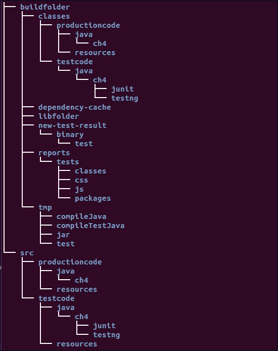
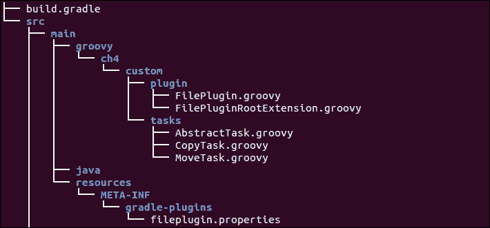

# 第四章 插件管理

在上一章中，我们讨论了 Gradle 任务，它是 Gradle 中的执行原子单位。在大多数情况下，任务在模块中只提供单一的工作单元。我们可以选择将任务捆绑在一起，并按特定顺序执行它们，以提供完整的功能。这种任务、属性和配置的组合称为插件。插件是任务的逻辑组合，可能具有生命周期。你可以根据需求配置插件以改变行为。你可以扩展它以提供额外的功能。在更广泛的意义上，Gradle 提供了两种类型的插件；脚本插件和二进制插件。Gradle 将构建脚本视为脚本插件，并且你可以通过将构建脚本导入到当前项目中，在项目中使用其他构建脚本。

二进制插件是我们使用诸如 Java 或 Groovy 之类的编程语言创建的插件。Gradle 为不同的构建功能提供了内置的二进制插件。在 Gradle 中创建二进制插件有不同的方法，我们将在自定义插件部分进行讨论。首先，我们将探索脚本插件。

# 脚本插件

脚本插件实际上就是一个 Gradle 文件，我们将其导入到其他构建文件中。这就像在不同的类之间模块化你的代码一样。当一个构建文件的大小超过一定限制，或者将不同的功能组合到一个文件中时，将连贯的任务分割到不同的构建文件中可能是一个更好的选择。然后，你可以将这些文件导入到主构建文件中以使用新的功能。

要导入构建文件，你可以使用以下代码：

```java
apply from: <Path of otherfile.gradle>
```

这里，路径可以是本地文件，也可以是项目目录的相对位置或有效的 URL。然而，如果你提到 URL，缺点是文件将每次都下载。一旦构建文件被导入，你就可以使用构建文件中定义的任务，而无需任何额外的配置。

如果你正在主构建文件中添加多个构建文件，确保导入的构建文件中没有具有相同名称的任务。在导入过程中，如果 Gradle 发现两个具有相同名称的任务，它将抛出以下异常：

```java
* What went wrong:
A problem occurred evaluating script.
> Cannot add task ':<TASK_NAME>' as a task with that name already exists.
* Try:
Run with --stacktrace option to get the stack trace. Run with --info or --debug option to get more log output.

```

考虑以下目录结构：

`/Chapter4/scriptplugin.gradle`

```java
task scriptPluginTask1 << {
  println "this is scplugin1"
}
```

`/Chapter4/build.gradle`

```java
apply from: 'scriptplugin.gradle'

task mainTask << {
  println "This is main task"
}
```

执行以下命令：

```java
$ gradle mainTask scriptPluginTask1
:mainTask
This is main task
:scriptPluginTask1
this is scplugin1

BUILD SUCCESSFUL

```

在这里，我们在`scriptplugin.gradle`文件中定义了`scriptPluginTask1`，并将此构建文件导入到主脚本`build.gradle`中。因此，将`scriptplugin.gradle`文件导入到`build.gradle`中会使`scriptPluginTask1`在主构建文件中可用，并且你可以直接调用它而无需提及任何构建文件名。

# 二进制插件

二进制插件是实现 **Plugin** 接口的类，你可以将其嵌入到构建脚本中。或者，你可以创建一个单独的项目，将其打包成一个 jar 文件，并将该 jar 文件作为类路径条目添加到项目中。第二种方法使其更具可重用性。每个二进制插件都有一个 ID 来唯一标识它。要使用二进制插件，你需要使用 `apply plugin` 语句来包含它：

```java
apply plugin: '<pluginid>'

```

例如，要使用 Java 插件，你可以编写以下代码：

```java
apply plugin: 'java'

```

你也可以使用类类型来添加插件。例如，如果你正在创建一个自定义类，`DisplayPlugin`，作为一个插件，你可以应用以下代码：

```java
apply plugin: DisplayPlugin

```

在使用这种方法之前，请确保你在构建文件中使用导入语句导入此类。所有 Gradle 核心插件默认都可用。你不需要任何额外的配置就可以使用它们。对于第三方或社区插件，在使用之前，你需要确保它们在类路径中可用。你可以通过在 `buildscript{}` 闭包中添加插件到类路径来实现。当你将任何插件应用到构建文件时，该插件的所有任务都会自动添加。你可以直接使用默认配置的任务，或者如果需要，你可以自定义任务配置。

# Gradle 的内置插件

Gradle 提供了不同的内置插件来自动化构建过程。Gradle 不仅提供了不同的插件来构建项目，还提供了用于测试项目、代码分析、IDE 支持、Web 容器支持等的插件。

以下是一些不同类别中常用的插件。你可以在 Gradle 文档的[`docs.gradle.org/current/userguide/userguide`](https://docs.gradle.org/current/userguide/userguide)中找到关于核心插件的更多详细信息。

## 构建和测试插件

这些插件也支持测试功能，可以执行 Junit 和 TestNG 测试：

+   Java 插件

+   Groovy 插件

+   Scala 插件

+   War 插件

## 代码分析插件

以下是一些代码分析插件：

+   Checkstyle 插件

+   FindBugs 插件

+   Sonar 插件

+   Sonar Runner 插件

+   PMD 插件

## IDE 插件

以下是一些 IDE 插件：

+   Eclipse 插件

+   IDEA 插件

这些是一些常用的插件。除了核心插件之外，你还可以在[`plugins.gradle.org/`](https://plugins.gradle.org/)找到第三方插件。它允许使用 Gradle `Plugin Publishing` 插件发布二进制插件。考虑花一些时间学习如何发布插件以及如何使用 `Plugin Publishing` 插件。在接下来的章节中，我们将学习一些核心插件。在下一节中，我们将探索 Java 插件。

# Java 插件

在 第一章，*使用 Gradle 入门* 中，我们已创建了一个名为 `FirstGradleProject` 的 Java 项目。然而，讨论仅限于 Eclipse 插件任务。我们没有讨论关于 Java 插件的内容。Java 插件是 Gradle 核心 API 的一部分，它使我们能够使用支持编译 Java 代码、测试代码、组装二进制文件以创建库等任务来构建 Java 项目。它支持约定而非配置。这意味着，如果我们使用此插件，一些默认配置已经对开发者可用，例如源代码的位置、编译后的类文件的位置以及 jar 命名约定。除非我们想要覆盖这些配置，否则我们不需要编写大量代码来与默认任务和属性一起工作。

要应用 Java 插件，我们只需在构建文件中添加一个语句：

```java
apply plugin: 'java'
```

在内部，Java 插件的 apply 方法使用 **project** 对象作为参数调用，并且启用构建脚本以便使用 Java 插件提供的所有任务和属性。为了理解 Java 插件，我们将创建一个新的 Java 应用程序（项目名称 `Ch04-Java1`），类似于我们在 第一章 中开发的 Java 项目 `FirstGradleProject`，*使用 Gradle 入门*。我们将添加两个新的类，Customer 和 Order；我们还将添加一个新的 JUnit 或 TestNG 库依赖项，以支持项目的单元测试功能。

通过这个示例的帮助，我们将探索不同的 Java 插件约定。更准确地说，我们将尝试理解不同的任务是如何工作的，以及 Java 插件支持哪些默认约定。然后，在下一节中，我们将学习如何自定义不同的属性，以便我们可以在构建文件中创建自己的配置。

## 约定

为了理解约定，让我们从 Java 插件任务开始。一旦我们将 Java 插件应用到项目中以显示所有可用的任务（项目名称 `Ch04-Java1`），我们就可以使用任务命令：

```java
$ gradle tasks --all
...

Build tasks
-----------
assemble - Assembles the outputs of this project. [jar]
build - Assembles and tests this project. [assemble, check]
buildDependents - Assembles and tests this project and all projects that depend on it. [build]
buildNeeded - Assembles and tests this project and all projects it depends on. [build]
classes - Assembles classes 'main'.
 compileJava - Compiles Java source 'main:java'.
 processResources - Processes JVM resources 'main:resources'.
clean - Deletes the build directory.
jar - Assembles a jar archive containing the main classes. [classes]
testClasses - Assembles classes 'test'. [classes]
 compileTestJava - Compiles Java source 'test:java'.
 processTestResources - Processes JVM resources 'test:resources'.

...

Documentation tasks
-------------------
javadoc - Generates Javadoc API documentation for the main source code.[classes]

...

Verification tasks
------------------
check - Runs all checks.
test - Runs the unit tests.

Rules
-----
Pattern: clean<TaskName>: Cleans the output files of a task.
Pattern: build<ConfigurationName>: Assembles the artifacts of a configuration.
Pattern: upload<ConfigurationName>: Assembles and uploads the artifacts belonging to a configuration.

To see all tasks and more detail, run with --all.

BUILD SUCCESSFUL

```

上述输出显示了 Java 插件中的不同构建任务、测试任务、文档任务和其他可用任务。输出还显示了不同任务之间的任务依赖关系。例如，任务类内部依赖于`compileJava`和`processResources`任务，分别编译和处理`src/main/java`和`src/main/resources`中的源代码和资源。同样，`compileTestJava`任务和`processTestResources`任务分别编译和处理`src/test/java`和`src/test/resources`中的资源。所有这些任务的输出是编译后的类和资源，按照惯例将在`build`目录下创建，并在程序执行期间添加到`classpath`中。现在，让我们通过一个示例来探索这些任务的意义以及默认可用的约定。

要仅在`src/main`下编译类，我们应该使用`classes`任务。编译后的类将创建在`build/classes/`目录下。

```java
$ gradle classes
:compileJava
:processResources UP-TO-DATE
:classes

BUILD SUCCESSFUL

```

`testClasses`任务编译并处理测试类和资源，并且还会执行类任务。在以下输出中，你可以看到`compileJava`、`processResources`和`classes`任务再次执行，但任务被标记为`UP-TO-DATE`。这是因为这些任务的输入和输出没有变化，因为我们已经在上一条命令中执行了`classes`任务。执行成功后，你将在`build/classes`文件夹下找到一个测试目录：

```java
$ gradle testClasses
:compileJava UP-TO-DATE
:processResources UP-TO-DATE
:classes UP-TO-DATE
:compileTestJava
:processTestResources UP-TO-DATE
:testClasses

BUILD SUCCESSFUL

```

另一个重要的任务是`test`任务。这个任务可以帮助执行在`src/test`目录下编写的单元测试代码。执行成功后，你将在`build/test-results`目录下找到测试结果：

```java
$ gradle test
:compileJava UP-TO-DATE
:processResources UP-TO-DATE
:classes UP-TO-DATE
:compileTestJava UP-TO-DATE
:processTestResources UP-TO-DATE
:testClasses UP-TO-DATE
:test

BUILD SUCCESSFUL

```

你可以使用`assemble`任务或`jar`任务将类和资源打包到 JAR 文件中。`jar`任务只会创建 JAR 文件，而`assemble`任务可以帮助你生成其他工件，包括 JAR 文件。例如，当你应用 war 插件时，`jar`任务被禁用，并替换为 war 任务。默认情况下，JAR 文件命名为`<project-name>.jar`，并创建在`build/libs`下。如果你在构建文件中没有设置`<project-name>`，你将得到名为`<project-folder-name>.jar`的 JAR 文件名。如果 JAR 文件不包含任何版本，这并不是一个好的做法。你可以在构建文件中为你的项目添加版本属性，这将生成`<name>-<version>.jar`。在我们的示例中，项目名称是`Ch04-Java1`，版本属性在构建文件中设置为`1.0`。因此，JAR 文件将被命名为`Ch04-Java1-1.0.jar`。执行以下命令，你将在`build/libs`下找到 JAR 文件：

```java
$ gradle assemble
:compileJava UP-TO-DATE
:processResources UP-TO-DATE
:classes UP-TO-DATE
:jar
:assemble

BUILD SUCCESSFUL

```

### 小贴士

JAR 文件中不会打包任何测试类。

另一个任务是`build`任务，它一起执行`check`和`assemble`任务。`clean`任务删除另一个任务创建的所有工件。它实际上删除了完整的`build/`文件夹。这意味着，`clean`任务删除了所有任务生成的输出，即`check`和`assemble`。要删除特定任务的输出，我们可以应用`clean<TaskName>`规则。例如，要删除由`build`任务创建的 jar 文件，我们可以执行`gradle cleanJar`命令。

Java 插件中的所有任务都是基于诸如源目录位置、构建文件夹名称、测试结果文件夹等约定来执行的。为了更好地理解这一点，以下示例展示了 Gradle 支持的一些约定：

```java
task displayJavaPluginConvention << {

  println "Lib Directory: $libsDir"
  println "Lib Directory Name: $libsDirName"
  println "Reports Directory: $reportsDir"
  println "Test Result Directory: $testResultsDir"

  println "Source Code in two sourcesets: $sourceSets"
  println "Production Code: ${sourceSets.main.java.srcDirs}"
  println "Test Code: ${sourceSets.test.java.srcDirs}"
println "Production code output: ${sourceSets.main.output.classesDir} & ${sourceSets.main.output.resourcesDir}"
println "Test code output: ${sourceSets.test.output.classesDir} & ${sourceSets.test.output.resourcesDir}"
}
```

输出显示了 Java 插件支持的各个约定。您可以在官方 Gradle 文档中找到完整的列表，网址为[`docs.gradle.org/current/userguide/java_plugin.html`](https://docs.gradle.org/current/userguide/java_plugin.html)。

```java
$ gradle displayJavaPluginConvention
:displayJavaPluginConvention
Lib Directory: <path>/build/libs
Lib Directory Name: libs
Reports Directory: <path>/build/reports
Test Result Directory: <path>/build/test-results
Source Code in two sourcesets: [source set 'main', source set 'test']
Production Code: [<path>/src/main/java]
Test Code: [<path>/src/test/java]
Production code output: <path>/build/classes/main & <path>/build/resources/main
Test code output: <path>/build/classes/test & <path>/build/resources/test

BUILD SUCCESSFUL

```

有时，这些默认配置可能不够用。我们可能需要配置一些默认属性以支持我们的需求。在下一节中，我们将探讨如何配置一些默认配置。

## 配置

在前面的示例中，我们了解了 Java 插件中可用的默认属性或约定。现在，我们将配置一些这些属性。当我们想要更改构建目录名称、库文件夹名称或项目的源文件位置时，这很重要。

与源相关的配置更改可以在`sourceSets`闭包中设置。即将到来的代码片段（项目名称`Ch04-Java2`）显示，源代码位置已从`src/main/java`更改为`src/productioncode`，分别用于源代码位置和`src/test/java`到`src/testcode`用于测试代码位置。因此，编译后的类现在将分别存储在`classes/productioncode`和`classes/testcode`位置，分别对应源代码和测试代码。这不会替换`main`到`productioncode`的源目录，但 Gradle 现在将在`main`和`productioncode`目录中查找源代码，在`test`和`testcode`目录中查找测试代码。如果您希望 Gradle 仅在`productioncode`目录中查找源代码，您可以设置`java.srcDirs`属性。

这些 Java 插件约定是在`JavaPluginConvention`和`BasePluginConvention`类中编写的。其中一个这样的属性，`testResultsDirName`，也可以在`build`文件中设置：

```java
buildDir = 'buildfolder'
libsDirName = 'libfolder'

sourceSets {
  main {
    java {
      srcDir 'src/productioncode/java'
    }
    resources {
      srcDir 'src/productioncode/resources'
    }
  }
  test{

    java {
      srcDir 'src/testcode/java'
    }
    resources {
      srcDir 'src/testcode/resources'
    }
  }
}

testResultsDirName = "$buildDir/new-test-result"
sourceSets.main.output.classesDir "${buildDir}/classes/productioncode/java"
sourceSets.main.output.resourcesDir "${buildDir}/classes/productioncode/resources"
sourceSets.test.output.classesDir "${buildDir}/classes/testcode/java"
sourceSets.test.output.resourcesDir "${buildDir}/classes/testcode/resources"
```

这些更改将确保`buildfolder`、`libfolder`和`test-result`文件夹已被替换为`buildfolder`、`libfolder`和`new-test-result`文件夹。

图 4.1 显示了`src`文件夹和新的`buildfolder`的目录结构：



图 4.1

所有这些新更改都可以通过执行之前创建的`displayJavaPluginConvention`任务来验证。执行任务后，你会发现输出已更新为新的配置：

```java
$ gradle displayJavaPluginConvention
:displayJavaPluginConvention
Lib Directory: <path>/buildfolder/libfolder
Lib Directory Name: libfolder
Reports Directory: <path>/buildfolder/reports
Test Result Directory: %path%/buildfolder/new-test-result
Source Code in two sourcesets: [source set 'main', source set 'test']
Production Code: [<path>/src/main/java, <path>/src/productioncode/java]
Test Code: [<path>/src/test/java, <path>/src/testcode/java]
Production code output: <path>/buildfolder/classes/productioncode/java & <path>/buildfolder/classes/productioncode/resources
Test code output: <path>/buildfolder/classes/testcode/java & <path>/buildfolder/classes/testcode/resources

BUILD SUCCESSFUL

```

# 自定义插件

在本节中，我们将讨论如何创建自定义插件。可以通过实现`org.gradle.api.Plugin<T>`接口来创建插件。此接口有一个名为`apply(T target)`的方法，必须在插件类中实现。通常，我们为 Gradle 项目编写插件。在这种情况下，T 变为 Project。然而，T 可以是任何类型的对象。

实现插件接口的类可以放置在多个位置，例如：

+   相同的构建文件

+   `buildSrc`目录

+   独立项目

这与我们在上一章中讨论的创建自定义任务类似。当我们在一个构建文件中定义一个插件时，其作用域仅限于定义的项目。这意味着，此插件不能在其他任何项目中重用。如果我们想将我们的插件分发给其他项目，这并不是一个好主意。对于多项目 Gradle 构建，插件代码可以放置在根项目的`buildSrc`文件夹或根项目的构建文件中。所有子项目都将能够访问此自定义插件。创建插件最优雅的方式是创建一个独立的 Groovy 项目，从它创建一个 jar 文件，并在项目之间和团队之间共享插件。现在，我们将通过示例探索如何创建一个自定义插件。

## 构建文件

在以下示例中，我们添加了一个`FilePlugin`类，该类在构建文件中实现了 Plugin 接口。在 apply 方法中，我们添加了两个任务，`copy`和`move`。这些任务是简单的任务，它们在控制台打印一行。现在，如果我们想执行`copy`或`move`任务，我们需要将此插件添加到构建文件中。在这个例子中，插件名称是`FilePlugin`。我们使用`apply plugin`语句添加此插件。如果没有添加插件，当你尝试执行复制任务时，你会找到`Could not find property 'copy' on root project 'PROJECT_NAME'.`的错误信息：

```java
apply plugin: FilePlugin

class FilePlugin implements Plugin<Project> {
  void apply(Project project) {
    project.task('copy') << {
      println "Task copy is running"
        //....
      }
    project.task('move') << {
      println "Task move is running"
      //...
    }
  }
}
copy.doLast { println "Copy Task ending .." }
```

在命令行中执行复制任务（针对`Ch04_CustomPlugin1`项目）时，我们发现在控制台按预期打印出以下两行：

```java
$ gradle copy
:copy
Task copy is running
Copy Task ending ..
BUILD SUCCESSFUL

```

## `buildSrc`目录

与任务类似，为了将插件代码与构建文件分开，我们可以在项目根目录内创建一个 `buildSrc` 文件夹，并将任何通用代码、任务或插件放置在这个文件夹中。在以下示例中，插件是在 `buildSrc` 文件夹中创建的，它可以在根构建文件和所有子项目中重用。我们在 `buildSrc/src/main/groovy` 下创建了一个 `FilePlugin.groovy` 类。这个类实现了插件接口，并在 `apply` 方法中添加了两个任务：`copy` 任务和 `move` 任务。这个 `FilePlugin.groovy` 类与上一个示例中所做的工作类似。对于这个示例，我们将创建一个项目 `Ch04_CustomPlugin2`。此外，在 `FilePlugin.groovy` 类中，我们需要添加包声明和导入语句（`import org.gradle.api.*`）。

在构建执行期间，此插件类将由 Gradle 自动编译并添加到项目的类路径中。由于插件定义不在构建文件中，我们需要一种机制在构建文件中声明插件信息。这是通过导入 `Plugin` 类并使用 `apply plugin` 语句添加插件来实现的。以下代码片段显示了主构建文件的内容。此外，我们在 `copy` 任务中添加了一个 `doLast` 方法，仅用于日志记录目的：

```java
import ch4.FilePlugin
apply plugin: FilePlugin

copy.doLast {   
println "This is main project copy dolast"
}
```

接下来，我们创建了两个子项目：`project1` 和 `project2`。每个项目都有一个简单的构建文件。这个构建文件与主构建文件类似。构建文件导入了并应用了 `FilePlugin`，并将 `doLast` 方法添加到 `copy` 任务中用于日志记录。以下代码显示了 `project1` 的 `build.gradle` 文件内容。`project2` 的构建文件也与此类似：

```java
import ch4.FilePlugin
apply plugin: FilePlugin

copy.doLast {
  println "Additional doLast for project1"
}
```

我们需要另一个 `settings.gradle` 文件，它包括主项目中的子项目：

```java
include 'project1', 'project2'
```

不要与 `settings.gradle` 文件混淆。我们将在第六章“与 Gradle 一起工作”中详细讨论多项目构建。*与 Gradle 一起工作*。

为了方便起见，`Ch04_CustomPlugin2` 项目的目录结构如图 4.2 所示：


图 4.2

当我们执行 `copy` 任务时，我们发现有三个 `copy` 任务正在执行：一个来自主项目，另外两个来自子项目 `project 1` 和 `project 2`。

```java
$ gradle copy
:buildSrc:compileJava UP-TO-DATE
:buildSrc:compileGroovy
:buildSrc:processResources UP-TO-DATE
:buildSrc:classes
:buildSrc:jar
:buildSrc:assemble
:buildSrc:compileTestJava UP-TO-DATE
:buildSrc:compileTestGroovy UP-TO-DATE
:buildSrc:processTestResources UP-TO-DATE
:buildSrc:testClasses UP-TO-DATE
:buildSrc:test UP-TO-DATE
:buildSrc:check UP-TO-DATE
:buildSrc:build
:copy
Task copy is running
This is main project copy dolast
:project1:copy
Task copy is running
Additional doLast for project1
:project2:copy
Task copy is running
Additional doLast for project2

BUILD SUCCESSFUL

```

## 独立项目

在最后一节中，我们将插件代码放在了 `buildSrc` 目录中，并在根构建文件和所有子项目的构建文件中使用了该插件。这只是将插件代码模块化从构建逻辑中分离出来的一步。然而，此插件在其他项目中不可重用。理想情况下，插件应该在一个独立的 Groovy 项目中创建。然后我们创建一个 JAR 文件，并将该 JAR 文件包含在其他构建文件的类路径中。在本节中，我们将探讨如何创建一个独立的插件项目。

我们将从一个简单的 Groovy 项目开始。我们将在`src/main/groovy`中添加一个插件类`FilePlugin.groovy`和两个任务`CopyTask`和`MoveTask`。我们还会在资源文件夹中添加一个属性文件。项目的快照（`Ch04_CustomPlugin3`）显示在图 4.3 中：



图 4.3

`FilePlugin.groovy`类通过引用`CopyTask`和`MoveTask`类创建了两个名为`copy`和`move`的任务。这些任务是通过在`TaskContainer`对象上调用`create(...)`方法，并将`taskname`和`task`类作为方法参数来创建的。这两个任务都扩展了`DefaultTask`并定义了自己的实现。这只是一个例子，展示了我们在上一章中学到的创建自定义任务的方法。我们创建了一个额外的任务`customTask`，它将打印`sourceFile`属性的值。`sourceFile`属性是通过扩展对象定义的。插件扩展是普通的 Groovy 对象，用于向插件添加属性。你可以使用`extension`对象向`Plugins`提供属性/配置信息。你可以在插件中创建多个扩展对象来将相关的属性分组在一起。Gradle 为每个扩展对象添加一个配置闭包块。

`FilePlugin.groovy`类的代码片段如下：

```java
package ch4.custom.plugin

import org.gradle.api.Plugin
import org.gradle.api.Project
import org.slf4j.Logger
import org.slf4j.LoggerFactory
import ch4.custom.tasks.CopyTask
import ch4.custom.tasks.MoveTask

class FilePlugin implements Plugin<Project> {

  @Override
  public void apply(Project project) {

    def extension = project.extensions.create("simpleExt", FilePluginRootExtension)

    project.tasks.create("copy", CopyTask.class)
    project.tasks.create("move", MoveTask.class)
    project.task('customTask') << {
    println "Source file is "+project.filePluginExtension.sourceFile
    }
  }
}
```

下面的代码是`AbstractTask`、`CopyTask`、`MoveTask`和`extension`类的源代码。

文件：`AbstractTask.groovy`

```java
package ch4.custom.tasks

import org.gradle.api.DefaultTask
import org.gradle.api.tasks.TaskAction

class AbstractTask extends DefaultTask {

}
```

文件：`CopyTask.groovy`

```java
package ch4.custom.tasks

import org.gradle.api.tasks.TaskAction

class CopyTask extends AbstractTask {

  @TaskAction
  def action1() {
    println "Copy Task Running"
  }
}
```

文件：`MoveTask.groovy`

```java
package ch4.custom.tasks

import org.gradle.api.tasks.TaskAction

class MoveTask extends AbstractTask {

  @TaskAction
  def action1() {
    println "Move Task Running"
  }

}
```

文件：`FilePluginRootExtension.groovy`

```java
package ch4.custom.plugin

class FilePluginRootExtension {

  def sourceFile = "/home/tmp"
  def destinationFile

}
```

现在，我们需要一个插件 ID，这样 Gradle 才能找到这个插件信息。这是通过在`src/main/resources/META-INF/gradle-plugins`下创建一个属性文件来完成的。文件名成为插件 ID。在我们的例子中，我们给文件命名为`fileplugin.properties`。因此，插件 ID 是`fileplugin`。在任何其他构建文件中，我们现在可以应用这个插件，如下所示：

```java
apply plugin: 'fileplugin'
```

在`fileplugin.properties`文件中，我们需要添加`implementation-class`属性，它映射到实现类中的主插件：

```java
implementation-class=ch4.custom.plugin.FilePlugin
```

这就是你需要的一切。现在，我们可以构建这个项目来创建一个 jar 文件，然后我们可以在任何其他项目中使用这个 jar。在我们的例子中，jar 文件被命名为`Ch04_CustomPlugin3-1.0.jar`。如果你希望将插件发布到[`plugins.gradle.org/`](https://plugins.gradle.org/)，你需要确保插件 ID 是唯一的。在这种情况下，你可能想要将`fileplugin.properties`重命名为类似`mastering.gradle.ch4.properties`的东西，以确保插件 ID 的唯一性。

一旦创建了 jar 文件，该插件就可以在任何其他构建文件中使用。代码片段显示了如何通过 `buildscript` 闭包将本地目录定义为仓库。插件 jar 文件可以通过依赖闭包包含在类路径中。在示例中，我们正在使用本地目录中的插件。理想情况下，我们应该将插件 jar 发布到私有或公共仓库，并通过 Maven 或 Ivy URL 引用它：

```java
buildscript {
  repositories {
    flatDir {dirs "../Ch04_CustomPlugin3/build/libs/"}
  }
dependencies {
  classpath group: 'ch4.custom.plugin', name: 'Ch04_CustomPlugin3',version: '1.0'
}
}
apply plugin: 'fileplugin'

copy.doLast {
  println "This is from project $project.name"
}
```

我们在复制任务中添加了一个 `dolast`，它打印项目名称。尝试执行以下命令：

```java
$ gradle copy cT
:copy
Copy Task Running
This is from project UsingPlugin
:customTask
Source file is /home/tmp

BUILD SUCCESSFUL

Total time: 3.59 secs

```

从输出中，你可以理解复制任务有两个语句。一个我们在插件定义中提到，另一个我们在 `build.gradle` 文件中添加。`customTask` 的输出打印了源文件的默认值，即 `/home/tmp`。这个值是在 `FilePluginRootExtension.groovy` 类中设置的。如果你想将属性更新为其他值，请在构建文件中添加以下配置闭包：

```java
filePluginExtension {
  sourceFile = "/home/user1"
}
```

在添加前面的闭包之后，尝试执行以下命令：

```java
$ gradle cT
:customTask
Source file is /home/user1

BUILD SUCCESSFUL

Total time: 3.437 secs

```

现在，输出已更改为 `filePluginExtension` 闭包中提到的新的值。

# 摘要

在本章中，我们主要讨论了两个主题：Java 插件和自定义插件。在 Java 插件中，我们学习了 Gradle 支持的默认约定和属性。然后我们讨论了如何自定义和配置这些属性。在自定义插件中，我们展示了创建插件的不同方法。然而，Gradle 中有如此多的插件需要讨论。我们将在第六章 Working with Gradle 和第七章 Continuous Integration 中讨论一些重要的插件。然而，我们无法在本书中涵盖所有插件。我们请求读者查阅 Gradle 文档以获取更多详细信息。

在下一章中，我们将介绍 Gradle 中的另一个重要主题，即依赖管理。我们将学习在构建文件中各种仓库配置、不同的依赖解析策略、在仓库中发布工件等内容。
