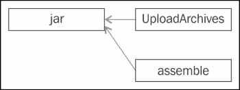
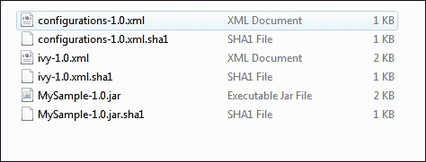
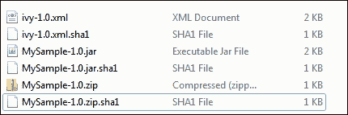

# 第五章：依赖管理

任何软件最重要的特性之一就是依赖管理。正如我们所知，没有任何软件是独立工作的，我们通常依赖于第三方或开源库。这些库在编译和运行时执行过程中是必需的，并且它们必须存在于类路径中。Gradle 对依赖管理提供了出色的支持。我们只需在构建文件中编写几行代码，Gradle 就会在内部完成所有繁重的配置管理工作。

在本章中，我们将深入探讨 Gradle 的**依赖管理**细节。我们将讨论不同的特性，例如如何管理项目依赖、解决冲突以及解决策略。我们还将讨论如何在不同的仓库中发布工件。

# 概述

依赖管理是任何构建工具最重要的特性之一。它有助于以更好的方式管理软件依赖。如果你使用的是**Ant**，它最初不支持任何依赖管理，你需要将每个依赖的 jar 文件及其位置写入`build.xml`。对于没有太多依赖的小型应用程序，这种方法可能效果不错。然而，对于企业应用程序，软件依赖于数百个其他库，这些库内部可能还依赖于其他库（传递依赖），在这种情况下，需要在`build.xml`中配置每个 jar 文件的方法可能可行，但需要巨大的维护工作量。此外，管理它们的版本冲突对于任何开发者来说都是一个巨大的痛苦，可能会将构建过程变成一场噩梦。为了解决 Ant 中的这些缺点，Maven 引入了内置的依赖管理解决方案。

之后，Ant 也集成了 Apache Ivy（一个依赖管理解决方案）以提供相同的功能。Gradle 带来了自己的依赖管理实现。它有助于定义一级依赖，逻辑地将它们分组到不同的配置中，定义多个仓库，并在构建文件执行后提供发布资产的任务。它还支持 Ivy、Maven 和平文件仓库。在本章中，除了依赖管理之外，我们还将探讨仓库配置和资产发布，即如何配置不同的仓库并将资产上传到仓库。

# 依赖配置

在开始依赖配置之前，让我们讨论一下如何在 Java 中发布打包的软件。您可以将软件打包并发布为`.jar`、`.war`或`.ear`文件格式到仓库中。目标是共享这些资产在组织内部的团队或开源开发者之间。考虑一个场景，您正在将一个实用项目（`messageutil.jar`）发布到仓库中。尽管发布过程主要取决于组织的政策，但常见的做法是，您计划发布的所有资产都应该**版本化**并存储在中央仓库中，以便其他团队可以共享它。这种版本化有助于跟踪库的不同版本。有了版本化的库，您还可以在出现任何功能问题时回滚到旧版本。每次您将任何资产发布到仓库时，请确保它已版本化。要了解更多关于版本化的信息，请查看此链接：[`semver.org/`](http://semver.org/)。

## 依赖类型

除了内部或外部的 JAR 文件外，项目还可以依赖于：

+   文件系统上的文件

+   同一构建中的其他一些项目（在多项目构建的情况下）

+   Gradle API（用于自定义任务和插件）

+   Gradle 使用的 Groovy 版本（用于自定义任务和插件）

在我们开发自定义任务和插件时，在前几章中我们看到了 Gradle API 和 Groovy 版本的示例。项目依赖关系将在第六章 *使用 Gradle* 中讨论。在本章中，我们将讨论全局和本地仓库上的其他模块依赖关系，以及本地系统上的文件依赖关系。

我们将从一个简单的示例开始依赖管理。假设您正在构建一个名为`SampleProject`的项目，该项目依赖于第三方库`log4j-1.2.16.jar`。

构建项目时，您需要在编译时使用这个 jar 文件。Gradle 提供了一种非常简单且系统化的方式来定义项目的依赖关系，即通过以下方式使用**dependencies**闭包：

```java
dependencies {
  <configuration name> <dependencies>
}
```

Gradle 将依赖关系分组到不同的配置中。如果您将**Java 插件**应用到项目中，它将提供六个不同的配置，如下表所示：

| 名称 | 详情 |
| --- | --- |
| `compile` | 这里提到的依赖关系将在源代码（`src/main/java`）的编译过程中添加到类路径中 |
| `runtime` | 这里提到的依赖关系在执行源代码（`src/main/java`）时需要运行时 |
| `testCompile` | 这里提到的依赖关系将在测试代码（`src/main/test`）的编译过程中添加到类路径中 |
| `testRuntime` | 这里提到的依赖关系在执行测试代码（`src/main/test`）时需要运行时 |
| `archives` | 这用于告诉构建文件关于项目生成的工件 |
| `default` | 这包含在运行时使用的工件和依赖关系 |

要定义前面的依赖项，您需要将以下详细信息传递给 Gradle 的依赖项管理器：

+   JAR 文件组（或命名空间）

+   JAR 文件名

+   JAR 文件版本

+   分类器（如果 JAR 有类似分类器的特定 JDK 版本）

依赖项可以以下列方式之一定义：

+   单个依赖项：

    ```java
    compile group: 'log4j', name: 'log4j', version: '1.2.16'
    ```

+   作为 Arraylist 的依赖项：

    ```java
    compile 'log4j:log4j:1.2.16','junit:junit:4.10'
    ```

+   作为配置闭包的依赖项：

    ```java
    compile ('log4j:log4j:1.2.16') ) {
        // extra configurations
    }
    ```

+   以键值格式作为配置闭包的依赖项：

    ```java
    compile (group:'log4j',name:'log4j',version:'1.2.16') {
        // extra configurations
    }
    ```

    ### 提示

    在平面目录（本地或远程文件系统）的情况下，不需要依赖项组名。

要配置项目依赖项，您需要在 `dependencies` 闭包中提及所有库。因此，构建文件将看起来像这样：

```java
apply plugin: 'java'
repositories {
  mavenCentral()
}
dependencies {
  compile group: 'log4j', name: 'log4j', version: '1.2.16'
}
```

不要与我们在示例中添加的 `repositories` 闭包混淆。我们将在下一节中讨论这个问题。

## 仓库

当我们说依赖项已识别和定义时，工作已经完成了一半。Gradle 将如何知道从哪里获取这些依赖项呢？这就是 `repositories` 概念的出现。Gradle 提供了 `repositories` 闭包来定义可以从哪里下载依赖项的仓库。您可以在项目中配置任意数量的仓库和任意类型的仓库。对于在 `dependencies` 闭包中列出的依赖项，Gradle 将按顺序搜索仓库。如果它在配置的仓库之一中找到一个库或依赖项（如果配置了多个仓库），它将跳过搜索其他仓库。在下一节中，我们将学习如何配置不同的仓库。

## 仓库配置

您可以使用以下方法来配置仓库。Gradle 允许您在构建文件中使用多个配置。

+   **Maven Central 仓库**：此配置用于直接从 **Maven Central 仓库** 下载您的依赖项。您不需要记住仓库 URL。您可以直接将 `mavenCentral()` 添加到此处提到的 `repositories` 闭包中：

    ```java
    repositories {
      mavenCentral()
    }
    ```

+   **Maven JCenter 仓库**：Gradle 还通过在 `repositories` 中使用 `jcenter()` 直接连接到 `jCenter` 仓库。

    ```java
    repositories {
      jcenter()
    }
    ```

+   **Maven 本地仓库**：可能存在一种情况，本地 Maven 缓存中包含所有必需的依赖项，并且您不想连接到 Maven 中央仓库。相反，您将需要使用 Maven 的本地缓存中的 JAR 文件。在这种情况下，您可以在 `repositories` 闭包中使用 `mavenLocal()`。默认情况下，Maven 的本地缓存路径将是 `<USER_HOME>/.m2/repository`。如果您想将其更改为另一个位置，您可以在 `<USER_HOME>/.m2` 或 `<USER_HOME>/.m2/conf` 下的 `settings.xml` 中配置路径。拥有此配置可以轻松地在本地构建另一个项目的“SNAPSHOT”版本并将其包含在内。

    ```java
    repositories {
      mavenLocal()
    }
    ```

+   **Ivy 仓库**：如果您想引用 Ivy 仓库，可以按以下方式定义：

    ```java
    repositories {
      ivy {
        url "http://<ivyrepositorylocation>"
        layout "ivy"  // valid values are maven, gradle, ivy
      }
    }
    ```

    你还可以为你的 Ivy 仓库定义自定义布局。由于 Ivy 不允许本地发布如 Maven 这样的工件，因此没有等效的`ivyLocal()`。

+   **组织仓库**：无论有多少开源仓库，你都需要一个私有仓库来进行软件开发，因为你拥有这个仓库，并且私有仓库可以更好地跟踪和管理变更。要使用你组织的私有仓库，你可以按照以下格式配置`Repositories`位置：

    ```java
    repositories {
      maven {
        url "http://private.repository/path"
        credentials {
          username 'guest'
          password '123123'
        }
      }
      ivy { // For Ivy repositories
      url "http://private.repository/path"
      }
    }
    ```

    如果你的私有仓库需要认证，你也可以提供凭证。你还可以将凭证添加到`~/.gradle/gradle.properties`中，并从那里使用它，因为将凭证直接添加到构建文件中并不是一个好的做法。

    对于 Maven 格式的仓库，jar 文件总是附带有`pom.xml`作为元数据。可能存在一种情况，即 POM 文件和 JAR 文件位于两个不同的位置。在这种情况下，你可以如下提及这两个位置：

    ```java
    repositories {
      maven {
        url "http://private.repository/pompath"
        artifactUrls "http://private.repository/jardir"
      }
    }
    ```

    ### 小贴士

    如果前面提到的 URL 包含 JAR 文件，Gradle 将从该位置下载 JAR 文件；否则，它将在`artifactUrls`中搜索。你可以提及多个`artifactUrls`。

+   **扁平目录仓库**：可能存在一种情况，当你引用本地文件系统中的仓库（不是`mavenLocal()`位置）时。这种情况可能发生在其他项目或团队在不同的位置创建 JAR 文件并将这些 JAR 文件发布到中央位置时。你希望你的项目仅将本地目录用于依赖项。这可以通过以下代码实现：

    ```java
    repositories {
      flatDir {
      dirs '/localfile/dir1', '/localfile/dir2'
      }
    }
    ```

    这种方法并不推荐，因为这会导致不一致。推荐的方法是始终使用私有或全局仓库。

# 依赖项解析

我们已经看到了定义依赖项和仓库的标准方式，这可以帮助你快速入门这些概念。现在是时候深入了解了，了解如何自定义标准配置，以适应你的特定需求。

## 传递依赖

假设你的应用程序依赖于`commons-httpclient-3.1.jar`，这是一个一级依赖项。然而，这个 JAR 文件又依赖于以下其他 JAR 文件，`commons-codec-1.2.jar`和`commons-logging-1.0.4.jar`。如果我们尝试查找更多细节，`commons-logging jar`又依赖于其他一些 JAR 文件。

在这里，`commons-httpclient-3.1`是一个一级依赖项；前面提到的两个 JAR 文件是二级依赖项，依此类推。然而，使用 Gradle，你不需要管理所有这些级别的依赖项。想象一下，如果你必须在构建文件中找出并提及每个级别的依赖项，这将是非常繁琐且耗时的。如果你遇到一些版本冲突，这会变得更加痛苦。

使用 Gradle，你不需要担心任何此类依赖项相关的问题。Gradle 为依赖项管理提供完全自动化。你只需定义第一级依赖项，Gradle 就会处理所有传递性依赖项。默认情况下，它将下载所有传递性依赖项，直到最后一级。

## 排除传递性

对于某些场景，你可能不希望 Gradle 获取所有传递性依赖项。相反，你希望对构建文件中提到的库有完全的控制权，只下载这些库。要关闭传递性特性，你可以在构建文件 (`build_transitive.gradle`) 中设置传递性标志 `off`：

```java
apply plugin:'java'
repositories {
  mavenCentral()
}
dependencies {
  compile group:'commons-httpclient', name:'commons-httpclient', version:'3.1', transitive: false
}
```

清理 Gradle 缓存 (`~/.gradle/caches`) 并再次尝试构建项目。这次它将只下载一个 JAR 包，即 `commons-httpclient-3.1.jar`：

```java
$ gradle –b build_transitive.gradle build
…..
:compileJava
Download https://repo1.maven.org/maven2/commons-httpclient/commons-httpclient/3.1/commons-httpclient-3.1.pom
Download https://repo1.maven.org/maven2/commons-httpclient/commons-httpclient/3.1/commons-httpclient-3.1.jar
:processResources UP-TO-DATE
…….

```

如果你需要第二级依赖项的其他版本，或者第二级依赖项在仓库中缺失，而你希望手动复制它，这个特性可能很有用。

## 选择性排除

可能存在一种情况，当你想要部分使用传递性特性时，也就是说，你不想阻止 Gradle 获取传递性依赖项，但你又知道这可能会导致版本冲突。因此，你可能希望某些特定的 JAR 包在第二级或下一级依赖中被排除。为了从第二级开始选择性排除依赖项，你可以使用以下配置：

```java
dependencies{
  compile('commons-httpclient:commons-httpclient:3.1') {
    exclude group:'commons-codec' // exclude by group
    // exclude group:'commons-codec',module:'commons-codec'
  }
}
```

### 小贴士

排除标准需要将组作为必填字段，但模块可以是可选的。

## 版本冲突

版本冲突是一个非常常见的场景，其中项目依赖于特定版本的 JAR 包。例如，你的项目依赖于 `commons-httpclient-3.1` JAR 包和 `commons-codec-1.1` JAR 包。`commons-httpclient-3.1` JAR 包有一个对 `commons-codec-1.2` JAR 包的传递性依赖。在构建过程中，Gradle 将找到对同一 JAR 包的两个不同版本的依赖。你的构建文件 (`build_versionconflict.gradle`) 将看起来像这样：

```java
apply plugin:'java'

repositories {
  mavenCentral()
}
dependencies {
  compile group:'commons-httpclient', name:'commons-httpclient', version:'3.1'
  compile group:'commons-codec',name:'commons-codec', version:'1.1'
}
```

### 注意

由于版本冲突引起的问题甚至需要相当长的时间才能被发现。

Gradle 支持不同的策略来解决版本冲突场景，如下所示：

+   **最新版本**：默认情况下，Gradle 在发现同一 JAR 文件的不同版本时会应用 **获取最新版本** 策略来解决版本冲突问题。在前面的场景中，它将跳过版本 1.1 并下载版本 1.2 的 `commons-codec` JAR 包。

    执行 `gradle –b build_versionconflict.gradle clean build` 命令后，输出将如下所示：

    ```java
    Download https://repo1.maven.org/maven2/commons-codec/commons-codec/1.1/commons-codec-1.1.pom
    Download https://repo1.maven.org/maven2/commons-codec/commons-codec/1.2/commons-codec-1.2.pom
    ......
    Download https://repo1.maven.org/maven2/commons-codec/commons-codec/1.2/commons-codec-1.2.jar
    :processResources UP-TO-DATE
    ......

    BUILD SUCCESSFUL

    ```

+   **在冲突时失败**：获取最新版本的策略并不总是有效。有时，你可能会希望构建失败以便进一步调查，而不是获取最新版本。要启用此功能，你可以通过添加以下闭包来应用 `failOnVersionConflict()` 配置：

    ```java
    configurations.all {
    resolutionStrategy {
      failOnVersionConflict()
    }
    }
    ```

    你可以使用前面的配置更新你的构建文件。如果你想将此策略应用于所有构建，你可以将其添加到你的 `init` 脚本中。

+   **强制指定版本**：在冲突情况下，另一种选择是，而不是使构建失败，你可以下载特定版本的 JAR。这可以通过使用 **强制标志** 实现：

    ```java
    dependencies {
      compile group:'commons-httpclient', name:'commons-httpclient', version:'3.1'
      compile group:'commons-codec',name:'commons-codec', version:'1.1', force:true
    }
    ```

    现在，尝试执行 `gradle -b build_versionconflict.gradle build` 并观察输出：

    ```java
    Download https://repo1.maven.org/maven2/commons-codec/commons-codec/1.1/commons-codec-1.1.pom
    Download https://repo1.maven.org/maven2/commons-codec/commons-codec/1.1/commons-codec-1.1.jar
    :processResources UP-TO-DATE
    :classes
    ….
    BUILD SUCCESSFUL

    ```

## 动态依赖项

要使构建对 JAR 版本更灵活，你可以使用 `latest.integration` 占位符，或者你可以定义一个版本范围，例如 `1.+`。使用此选项，你不必坚持特定的版本。使用 `1.+` 或 `2.+` 格式，它将固定主版本为 1 或 2（可以是任何数字），并选择次版本的最新版本（例如，1.9 或 2.9）。

```java
compile group:'commons-codec',name:'commons-codec', version: '1.+'
compile group:'commons-codec',name:'commons-codec', version: 'latest.integration'
```

你可以使用其中任何一个来获取最新的依赖项。

# 依赖项定制

每当 Gradle 在仓库中搜索依赖项时，首先它会搜索一个模块描述符文件（例如，`pom.xml` 或 `ivy.xml`）。Gradle 解析此文件并下载模块描述符中提到的实际 JAR 文件及其依赖项。可能存在一种情况，即没有模块描述符文件。在这种情况下，Gradle 直接查找 JAR 文件并下载它。

Gradle 允许你以不同的方式处理依赖项。不仅你可以下载其他文件格式，如 ZIP 和 WAR，如果需要，还可以指定不同的分类器。

## 下载非 JAR 文件

默认情况下，Gradle 下载具有 `.jar` 扩展名的文件。有时，你可能需要下载 ZIP 文件或 WAR 文件，这些文件没有模块描述符。在这种情况下，你可以明确指定文件的扩展名：

```java
Dependencies {
  runtime group: 'org.mywar', name: 'sampleWeb', version: '1.0', ext: 'war'
}
```

## 带有分类器的文件依赖项

有时你可能会以特殊的标记（称为分类器）发布工件，例如 `sampleWeb-1.0-dev.war` 或 `sampleWeb-1.0-qa.jar`。要下载带有分类器的工件，Gradle 提供了 `classifier` 标签：

```java
dependencies {
  runtime group: 'org.mywar', name: 'sampleWeb', version: '1.0', classifier: 'qa', ext:'war'
}
```

## 替换传递依赖项

如果你不想下载现有的传递依赖项并想用你定制的传递依赖项替换它们，Gradle 提供了以下方法：

```java
dependencies {
  compile module(group:'commons-httpclient', name:'commons-httpclient', version:'3.1') {
    dependencies "commons-codec:commons-codec:1.1@jar"
  }
}
```

在这里我们使用了 `@jar`，它可以替代前面示例中使用的 `ext` 标签。此代码片段将不会下载 `commons-httpclient` 的现有传递依赖项，但它将下载花括号内提到的 JAR 文件。

## 依赖项的定制配置

当我们应用 Java 插件时，Gradle 会自动为你提供一些默认配置，例如编译和运行时配置。我们可以扩展这个功能，并使用自己的配置来管理依赖项。这是一种将仅在构建时需要的依赖项分组以实现特定任务（如代码生成器（依赖于模板库）、xjc、cxf wsdl 转换为 Java 等）的绝佳方式。我们可以将这些依赖项分组在我们的用户定义配置下。在使用依赖项闭包下的自定义配置之前，我们需要在配置闭包内定义它。以下是从 `build_customconf.gradle` 文件中的代码片段：

```java
apply plugin: 'java'
version=1.0
configurations {
  customDep
}
repositories {
  mavenCentral()
}
dependencies {
  customDep group: 'junit', name: 'junit', version: '4.11'
  compile group: 'log4j', name: 'log4j', version: '1.2.16'
}

task showCustomDep << {
  FileTree deps  = project.configurations.customDep.asFileTree
  deps.each {File file ->
    println "File names are "+file.name
  }
}
```

以下是从前面的代码中得到的输出：

```java
$ gradle –b build_customconf.gradle showCustomDep
:showCustomDep
….
Download https://repo1.maven.org/maven2/junit/junit/4.11/junit-4.11.jar
Download https://repo1.maven.org/maven2/org/hamcrest/hamcrest-core/1.3/hamcrest-core-1.3.jar
File names are junit-4.11.jar
File names are hamcrest-core-1.3.jar

BUILD SUCCESSFUL

```

## 依赖项报告

Gradle 提供了一种非常方便的方式来列出从第一级到第 *n* 级的所有项目依赖项。它包括所有你的**传递依赖项**，包括手动更改、覆盖和强制依赖项。依赖项树按配置（如编译、测试编译等）分组。以下是从 `build_depreport.gradle` 文件中的代码片段：

```java
apply plugin: 'java'
version=1.0
repositories {
  mavenCentral()
}
dependencies {
  compile group: 'log4j', name: 'log4j', version: '1.2.16'
  compile 'commons-httpclient:commons-httpclient:3.1'
  compile 'dom4j:dom4j:1.6.1'
}
```

```java
$ gradle –b build_depreport.gradle dependencies
…
Root project
….

+--- log4j:log4j:1.2.16
+--- commons-httpclient:commons-httpclient:3.1
|    +--- commons-logging:commons-logging:1.0.4
|    \--- commons-codec:commons-codec:1.2
\--- dom4j:dom4j:1.6.1
 \--- xml-apis:xml-apis:1.0.b2

default – Configuration for default artifacts.
+--- log4j:log4j:1.2.16
+--- commons-httpclient:commons-httpclient:3.1
|    +--- commons-logging:commons-logging:1.0.4
|    \--- commons-codec:commons-codec:1.2
\--- dom4j:dom4j:1.6.1
 \--- xml-apis:xml-apis:1.0.b2

runtime – Runtime classpath for source set 'main'.
+--- log4j:log4j:1.2.16
+--- commons-httpclient:commons-httpclient:3.1
|    +--- commons-logging:commons-logging:1.0.4
|    \--- commons-codec:commons-codec:1.2
\--- dom4j:dom4j:1.6.1
 \--- xml-apis:xml-apis:1.0.b2

testCompile – Compile classpath for source set 'test'.
+--- log4j:log4j:1.2.16
+--- commons-httpclient:commons-httpclient:3.1
|    +--- commons-logging:commons-logging:1.0.4
|    \--- commons-codec:commons-codec:1.2
\--- dom4j:dom4j:1.6.1
 \--- xml-apis:xml-apis:1.0.b2

testRuntime – Runtime classpath for source set 'test'.
+--- log4j:log4j:1.2.16
+--- commons-httpclient:commons-httpclient:3.1
|    +--- commons-logging:commons-logging:1.0.4
|    \--- commons-codec:commons-codec:1.2
\--- dom4j:dom4j:1.6.1
 \--- xml-apis:xml-apis:1.0.b2

BUILD SUCCESSFUL

```

它将显示所有配置的所有依赖项的子级。你可能会惊讶地看到为什么其他配置（如运行时和测试运行时）也会显示，尽管只定义了编译配置。以下表格显示了不同配置之间的关系：

| Dependency | Extends |
| --- | --- |
| compile | - |
| runtime | compile |
| testCompile | compile |
| testRuntime | runtime, testCompile |
| default | runtime |

如果你只想列出某个配置的依赖项，可以使用 `–configuration <配置名称>` 来指定：

```java
$ gradle –b build_depreport.gradle dependencies –configuration compile
:dependencies

Root project

compile – Compile classpath for source set 'main'.
+--- log4j:log4j:1.2.16
+--- commons-httpclient:commons-httpclient:3.1
|    +--- commons-logging:commons-logging:1.0.4
|    \--- commons-codec:commons-codec:1.2
\--- dom4j:dom4j:1.6.1
 \--- xml-apis:xml-apis:1.0.b2

BUILD SUCCESSFUL

```

### 依赖项特定细节

有时候，在下载某些传递依赖项时可能会遇到问题，而你不知道哪个依赖项正在下载那个 JAR 文件。

假设你在执行前面的 `build_depreport.gradle` 脚本时，在获取 `commons-logging` JAR 文件时遇到问题。它不是一级依赖项，你不知道哪个一级依赖项对此负责。要获取这些详细信息，请使用 `dependencyInsight` 命令：

```java
$ gradle –b build_depreport.gradle dependencyInsight –dependency commons-logging –configuration runtime
:dependencyInsight
commons-logging:commons-logging:1.0.4
\--- commons-httpclient:commons-httpclient:3.1
 \--- runtime

BUILD SUCCESSFUL

```

如果你没有指定 `–configuration` 选项，它将默认应用 `compile` 配置。其他选项包括 `runtime`、`testCompile` 等，如前例所述。

# 发布工件

到目前为止，我们已经讨论了很多关于依赖项的内容。我们如何定义项目依赖项、自定义它们以及配置仓库以下载库。现在，让我们尝试构建工件（JAR、WAR 等）并将其发布到**工件仓库**（可能是本地文件系统、远程位置或 Maven 仓库），以便所有其他团队可以共享。

## 默认工件

当我们应用 Java 插件时，Gradle 会向项目添加一些默认配置，例如编译、运行时、测试编译。Java 插件还添加了一个额外的配置`archive`，用于定义你的项目工件。Gradle 通过一些插件提供默认工件。例如，Java、Groovy 插件将 JAR 作为默认工件发布，`war 插件`将 WAR 作为默认工件。这个 JAR 可以使用`uploadArchives`任务上传或发布到仓库。

以下代码片段展示了如何通过`build_uploadarchives.gradle`文件配置仓库以上传归档：

```java
apply plugin: 'java'
version=1.0

repositories {
  mavenCentral()
}
dependencies {
  compile group: 'log4j', name: 'log4j', version: '1.2.16'
  compile 'commons-httpclient:commons-httpclient:3.1'
  compile 'dom4j:dom4j:1.6.1'
}
uploadArchives {
  repositories {
    maven {
      credentials {
        username "guest"
        password "guest"
      }
      url "http://private.maven.repo"
    }
    //flatDir {dirs "./temp1" }
  }
}
```

我们可以使用平面目录作为仓库，而不是 Maven 仓库。在先前的示例中，将 Maven 闭包替换为`flatDir {dirs "./temp1" }`配置。现在，如果你执行`gradle uploadArchives`命令，你将在`temp1`目录中找到已发布的 JAR 文件。

## 自定义工件

对于每个配置，Gradle 默认提供`Upload<配置名称>`，它将组装并上传指定配置中的工件。Java 插件提供的`UploadArchives`任务将默认工件（`jar`）上传到仓库。

有时，你可能需要与 JAR 文件一起生成一些额外的工件，如 ZIP 和 XML 文件。这可以通过归档任务来定义工件。



图 5.1

在前面的图中，**assemble**任务依赖于**jar**任务，这仅仅是你的 Java 插件项目的默认工件。你可以使用`archives`配置来配置额外的工件。归档配置的输入可以是一个工件本身或创建工件的任务。

让我们看看以下两个示例：

### 与你的 JAR 文件一起生成额外的 XML 文件

在本例中，我们将生成一个额外的 XML 文件与 JAR 文件一起，并将其上传到仓库。以下是`CustomArtifact`/`build.gradle`文件的内容：

```java
apply plugin: 'java'
archivesBaseName="MySample" // to customize Jar Name
version=1.0
repositories {
  mavenCentral()
}
def confFile = file('configurations.xml') // artifact2
artifacts {
  archives confFile
}
uploadArchives {
repositories {
   flatDir {dirs "./tempRepo"}
}
}
```

这里，我们已将`configurations.xml`作为一个单独的 XML 文件添加到归档中，这样我们就可以将文件与 JAR 文件一起上传到仓库。

执行 Gradle 的`uploadArchives`命令后，你将在`tempRepo`目录中找到以下文件：



图 5.2

Gradle 还会生成校验和以及部署描述符（这里为`ivy-1.0.xml`），与工件一起生成。

在以下部分，我们将学习如何上传 ZIP 文件作为工件。

### 与你的 JAR 文件一起生成额外的 ZIP 文件

如果你想要上传一个额外的 ZIP 文件与 JAR 文件一起，你可以在`artifacts`闭包中提及额外的归档。以下是`CustomArtifact/build_zip.gradle`文件：

```java
apply plugin: 'java'
archivesBaseName="MySample" // to customize Jar Name
version=1.0
repositories {
  mavenCentral()
}
task zipSrc(type: Zip) {
  from 'src'
}
artifacts {
  archives zipSrc
}
uploadArchives {
  repositories {
    flatDir {dirs "./temp1" }
  }
}
```

执行`gradle -b build_zip.gradle uploadArchives`命令后，验证`temp1`目录中的文件：



图 5.3

这里，除了 JAR 文件外，还生成了一个额外的 `MySample-1.0.zip` 文件。您可能已经注意到，我们没有对 `zipSrc` 任务进行任何额外的调用，这是创建 ZIP 文件所必需的。在这里，Gradle 采用了一种声明式方法。无论您在 `artifacts` 闭包中配置了哪些存档，Gradle 都会创建这些存档。在此闭包内，您可以分配不同类型的任务，例如 JAR、ZIP、TAR (`org.gradle.api.tasks.building.AbstractArchiveTask`) 或任何要存档的文件。

## 自定义配置

与自定义依赖项一样，您也可以为您的存档定义自定义配置。考虑以下示例 (`CustomArtifacts/build_customconf.gradle`):

```java
apply plugin: 'java'

archivesBaseName="MySampleZip" // to customize Jar Name
version=1.0
configurations {
  zipAsset
}
repositories {
  mavenCentral()
}
task zipSrc(type: Zip) {
  from 'src'
}
artifacts {
  zipAsset zipSrc
}
uploadZipAsset {
  repositories {
    flatDir {dirs "./temp1" }
  }
}
```

现在，执行 `gradle –b build_customconf.gradle uploadZipAsset` 命令以创建和上传文件到仓库。在示例中，我们定义了一个自定义配置 `zipAsset`。我们在 artifacts 闭包内部使用了该配置。如前例所述，Gradle 自动为每个配置提供 `upload<configname>` 任务。因此，我们有 `cuploadZipAsset` 任务可用于上传所需的 ZIP 文件到仓库。

## Maven 发布插件

在上一节中，我们讨论了 Maven 插件和其他仓库配置。在这里，我们将讨论 Gradle 引入的新插件（`maven-publish plugin`）。

为了对发布过程有更多的控制，Gradle 提供了 `'maven-publish'` 插件。通过以下示例，您将看到它如何帮助我们使用 `MavenPublish`/`build.gradle` 文件进行发布：

您可以使用以下闭包来配置发布：

```java
publishing {
  publications {
    customPublicationName(MavenPublication) {
      // Configure the publication here
    }
  }
}
```

以下文件是 `MavenPublish/build.gradle`。

```java
apply plugin: 'java'
apply plugin: 'maven-publish'

publishing {
  publications {
    mavenJava(MavenPublication) {
      from components.java
      groupId 'org.mygroup'
      artifactId 'MySampleProj'
      version '1.0'
    }
  }

}
```

此插件添加以下任务：

+   `publish`: 这会发布此项目产生的所有发布物

+   `publishToMavenLocal`: 这会将此项目产生的所有 Maven 发布物发布到本地 Maven 缓存

当您在 `publishing` 内部添加前面提到的 `publications` 闭包时，它将添加两个额外的任务，`generatePomFileFor<publicationName>Publication` 和 `public<publicationName>PublicationToMavenLocal`。您可以在任务列表中找到以下附加任务：

+   `generatePomFileForPluginPublication`: 这为发布 'plugin' 生成 Maven POM 文件

+   `publishPluginPublicationToMavenLocal`: 这会将 Maven 发布的 'plugin' 发布到本地 Maven 仓库

要在本地 Maven 仓库中发布存档，请执行以下命令：

```java
$ gradle –i publishToMavenLocal

:publishMavenJavaPublicationToMavenLocal
Executing task ': publishMavenJavaPublicationToMavenLocal' (up-to-date check took 0.001 secs) due to:
 Task has not declared any outputs.
Publishing to repository org.gradle.api.internal.artifacts.repositories.DefaultMavenLocalArtifactRepository_Decorated@4a454218
[INFO] Installing /Chapter5/sent/MavenPublish/build/libs/MavenPublish.jar to <%USER_HOME>/.m2/repository/org/mygroup/MySampleProj/1.0/MySampleProj-1.0.jar
: publishMavenJavaPublicationToMavenLocal (Thread[main,5,main]) completed. Took 1.079 secs.

BUILD SUCCESSFUL

```

如果您浏览本地 Maven 仓库，您也会发现 POM 文件具有以下内容：

```java
<?xml version="1.0" encoding="UTF-8"?>
<project xsi:schemaLocation="http://maven.apache.org/POM/4.0.0 http://maven.apache.org/xsd/maven-4.0.0.xsd" 
>
  <modelVersion>4.0.0</modelVersion>
  <groupId>org.mygroup</groupId>
  <artifactId>MySampleProj</artifactId>
  <version>1.0</version>
</project>
```

默认情况下，它为 Java 项目生成 JAR 文件。如果您想与 JAR 文件一起添加额外的存档，您可以通过在以下格式中添加额外的存档声明来自定义前面的配置。

下面是`MavenPublish/build_zip.gradle`的示例代码：

```java
apply plugin: 'java'
apply plugin: 'maven-publish'

task zipSrc(type: Zip) {
  baseName = 'SampleSource'
  from 'src'
}

publishing {
  publications {
    mavenJava(MavenPublication) {
      from components.java
      groupId 'org.mygroup'
      artifactId 'MySampleProj'
      version '1.0'

      artifact zipSrc {
        classifier "sources"
      }
      // artifact can be <Jar,Zip tasks which will generate jar,zip file>

    }
  }
}
```

```java
$ gradle –b build_zip.gradle – i publishToMavenLocal
. . .
Publishing to repository org.gradle.api.internal.artifacts.repositories.DefaultMavenLocalArtifactRepository_Decorated@434d54de
[INFO] Installing /Chapter5/MavenPublish/build/libs/MavenPublish.jar to <USER_HOME>/.m2/repository/org/mygroup/MySampleProj/1.0/MySampleProj-1.0.jar
[INFO] Installing /Chapter5/MavenPublish/build/distributions/SampleSource-source-.zip to <USER_HOME> /.m2/repository/org/mygroup/MySampleProj/1.0/MySampleProj-1.0-source-.zip
:publishPluginPublicationToMavenLocal (Thread[main,5,main]) completed. Took 0.85 secs.
. . .

BUILD SUCCESSFUL

```

现在，在本地仓库中，除了 JAR 文件外，你还会找到一个额外的 ZIP 文件。

### 注意

请记住，对于你发布的每个额外工件，你都需要提及一个分类器。Gradle 只允许一个没有分类器的工件。

### 发布到本地仓库

要使用`maven-publish`插件将工件发布到本地仓库，我们可以使用与在 Maven 插件中讨论的相同配置。仓库的闭包与之前完全相同，但它必须被一个发布闭包所包围。你可以按照以下方式定义闭包：

```java
Publishing {
  repositories {
    maven {
      name "localRepo"
      url "http://local.maven.repo"
      credentials { // if required
        username  = 'username'
        password = 'password'
      }
    }
  }
}
```

你甚至可以通过指定 URL `./localrepo` 将工件发布到本地文件仓库。Maven 将自动为你创建目录结构，你可以在`localrepo/<group>/<version>/artifact-<version>.jar`下找到工件。

如果你提到`maven { ….}`闭包中的名称属性，Gradle 将自动创建一个名为`publishPluginPublicationTo<name>Repository`的新任务：

```java
publishing {
  repositories {
    maven {
      name "localRepo"
      url "./localrepo"
    }
  }
}
```

现在，你将能够使用`publishMavenJavaPublicationToLocalRepoRepository`任务或简单地使用`publish`任务来发布到仓库；例如`gradle -b build_localrepo.gradle publish`。

### 自定义 POM

默认情况下，Gradle 使用默认参数为工件生成 POM 文件。如果你想使用`pom.withXml`闭包修改 POM 文件以包含额外的详细信息，你可以这样做。你可以在 XML 文件中添加任意数量的新节点，也可以更新一些现有细节。请记住，`groupId`、`artifactId`和`version`是只读的。你不能修改这些细节。考虑文件`build_custompom.gradle`。

```java
apply plugin: 'java'
apply plugin: 'maven-publish'
publishing {
  publications {
    mavenCustom(MavenPublication) {
      from components.java
      groupId 'org.mygroup'
      artifactId 'MySampleProj'
      version '1.0'

    pom.withXml {
      def root = asNode()
      root.appendNode('name', 'Sample Project')
      root.appendNode('description', 'Adding Additional details')
      def devs = root.appendNode('developers')
      def dev = devs.appendNode('developer')
      dev.appendNode('name', 'DeveloperName')
      }
    }
  }
}
```

现在，执行`publishToMavenLocal`任务，你将在仓库中找到生成的`pom.xml`文件。

# 摘要

本章介绍了 Gradle 提供的依赖管理细节。我们探讨了依赖配置、依赖解析中涉及的战略以及配置传递依赖。我们还学习了 Gradle 提供的不同版本的冲突策略，以及我们如何配置它以获得最大利益。

我们还讨论了仓库。我们介绍了如何使用不同的仓库，例如平面文件、本地**Maven 仓库**和托管在 HTTPS 服务器上的远程仓库。最后，我们讨论了项目的发布。通过使用不同的插件，你可以将工件发布到中央位置，如本地或远程**Maven 仓库**。我们还讨论了如何利用新的 maven-publish 插件以及如何配置它，以便它符合我们的要求。

在下一章中，我们将讨论一些重要的插件，如 War 和 Scala。我们还将讨论其他重要概念，例如文件管理、多项目和属性管理。
