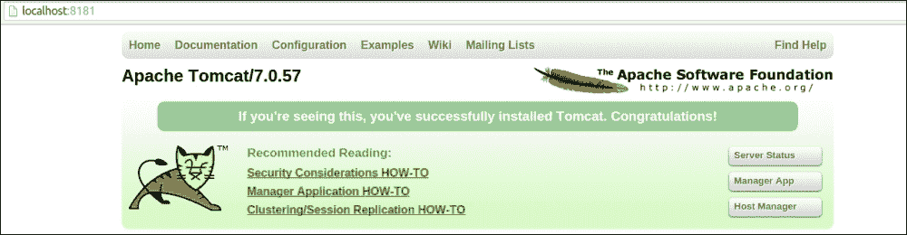
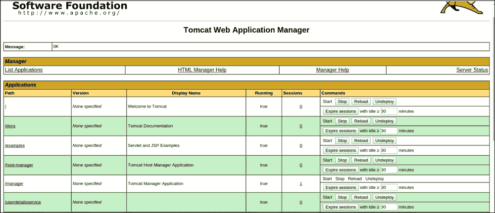
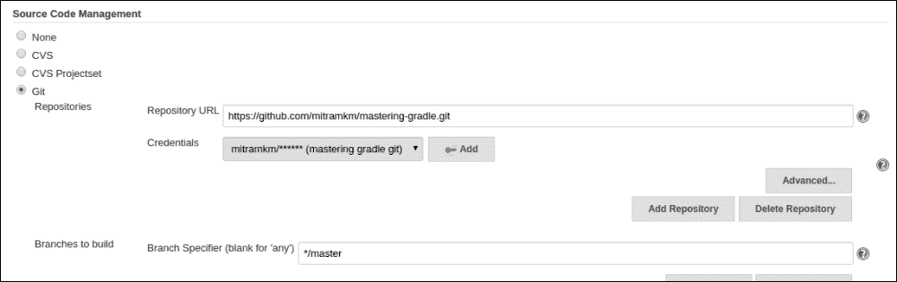
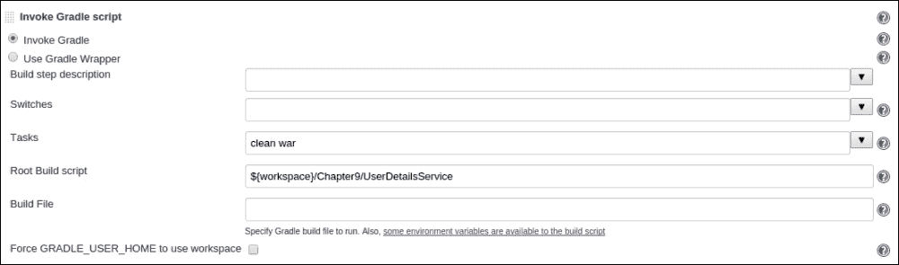
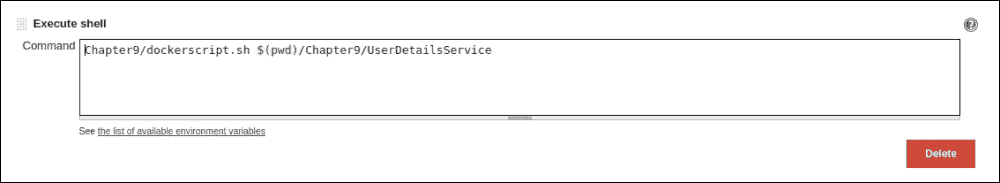
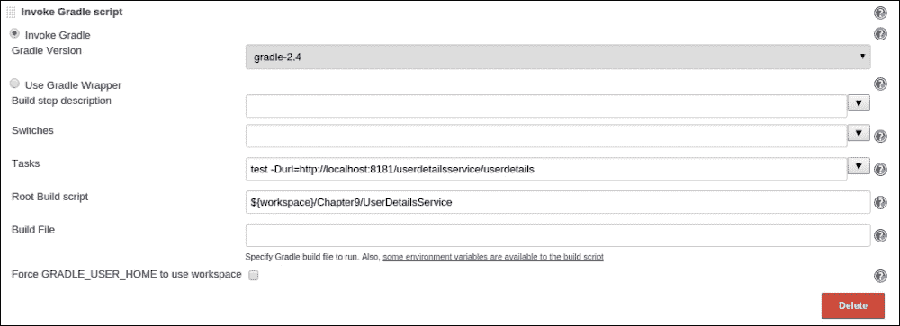
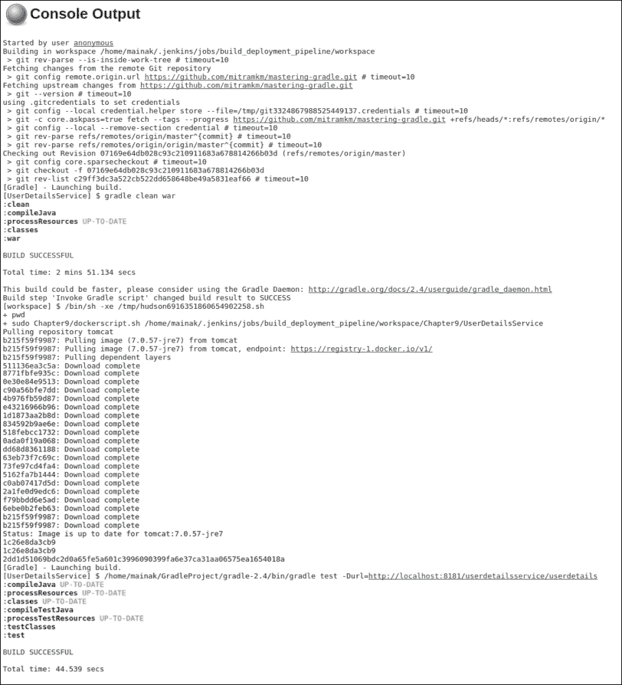

# 第九章：部署

如果我们不谈论软件组件的部署方面，那么一本 Gradle 书籍将是不完整的。在我看来，在软件工程中，在构建自动化之后的下一个最合逻辑的步骤就是部署。部署本身是一个不同的领域，这与 Gradle 关系不大。但仍然我认为讨论构建和部署工具是有意义的，这样读者就可以对**构建**、**部署**和**测试**工作流程有一个概述。在本章中，我们将讨论部署的一些基础知识，以了解构建和部署过程。我们将学习如何使用 Gradle、Jenkins 和 Docker 等工具一起创建构建、部署和测试工作流程。在我们开始之前，我们必须理解什么是部署。部署与构建过程在软件生命周期中同样重要。你可以编写和构建出色的软件，但如果应用程序没有部署，它就不会产生太多价值。软件的部署不仅仅是安装软件并启动它。它因应用程序而异，因操作系统而异。某些应用程序只需将 JAR 文件复制到特定位置即可部署；某些应用程序需要在 Web 容器或外部容器中部署等。我们可以将软件的部署过程概括如下：

1.  准备你想要部署应用程序的先决硬件和软件环境。

1.  在准备好的环境中复制项目资产。

1.  根据环境配置资产。

1.  准备应用程序的生命周期，如启动、停止、重启等。

1.  对应用程序进行合理性检查，以验证其功能。

所以，部署不仅仅是复制资产并通知每个人应用程序已准备好使用。它还涉及许多其他的前置和后置步骤。部署过程也随着开发过程的发展而发展，并且仍在随着新技术的发展而演变。曾经有一段时间，运维团队会在指定的节点上手动部署应用程序，配置负载均衡机制和从盒子到盒子的路由，以有效地处理客户端请求。现在，借助新的云基础设施，例如**基础设施即服务**（**IaaS**）或各种自动化工具，只需一键或一些命令，开发者就可以在一个盒子、集群环境、基于云的环境或容器化环境中部署应用程序。在本章中，我们将重点关注使用 Docker（一种应用程序容器化技术）的部署过程。我们将详细探讨 Docker 的不同方面，如安装、配置；Docker 相对于虚拟服务器节点部署的优势；在 Docker 内部部署应用程序；以及如何使其对外界可用。

# Gradle 在部署中的作用

Gradle 在构建和部署过程中扮演着重要的角色。开发者可以根据需求组合使用不同的工具来自动化整个构建和部署过程。例如，Jenkins、Puppet、Chef 和 Docker 等工具有助于创建构建和部署基础设施。但对于非常简单的部署，Gradle 的一些功能可能很有用。Gradle 提供了一系列任务，可以自动化一些之前提到的部署任务。以下是一些有用的任务：

1.  下载任务用于下载工件（ZIP、WAR、EAR 等）及其依赖项。

    您可以通过仅将列表添加到依赖项闭包中来下载工件。以类似的方式，您可以下载运行软件所需的所有其他依赖项。不需要将软件及其所有依赖项捆绑在一起，使其变得笨重。在安装软件时下载依赖项以使其轻量级是很好的。

1.  解压或解 tar 任务以解压工件。

    一旦下载了工件及其依赖项，下一步（如果需要）就是解压或解 tar 工件。

1.  配置应用程序。

    可以通过添加自定义任务在 Gradle 中完成应用程序的配置或本地化。

1.  启动/停止应用程序。

    可以使用现有的 Gradle 任务（如 JavaExec 或任何其他自定义任务）来启动/停止应用程序。

在我看来，尽管这些任务可以在 Gradle 中自动化，但更好的替代方案可能是 Shell 脚本或 Perl 等脚本语言。在本章的后面部分，当我们创建构建和部署管道的示例时，Gradle 将仅作为纯构建和测试工具。我们不会探索任何特定于部署的任务或插件。现在，我们将继续讨论下一个主题，Docker，它在近年来随着微服务架构的出现而变得非常流行。

# Docker 概述

Docker 是一种开源的基于容器的虚拟化技术，有助于在容器内自动化应用程序的部署。Docker 使用 Linux 内核的资源隔离功能，如 cgroups 和内核命名空间，并允许在主机机器上独立且相互隔离地运行多个容器。与虚拟机相比，Docker 的优势在于它是一个轻量级的过程，与虚拟机相比，它提供了资源共享同一内核时的资源隔离，包括主机机的驱动程序。Docker 是开源技术，支持不同的平台。由于 Docker 建立在 Linux 内核之上，它通过**Boot2Docker**应用程序支持 Windows 和 Mac。

Docker 的一些主要特性包括：

+   Docker 引擎：轻量级容器，用于创建、管理和容器化应用程序。

+   可移植性：其中一个重要特性是容器重用。您可以准备一个 Tomcat 镜像，并将此镜像用作所有其他 Web 应用程序的基础镜像。此镜像可以部署在任何系统上，如桌面、物理服务器、虚拟机，甚至云平台。

+   Docker Hub：Docker 还有一个基于 SaaS 的全球共享公共注册表。您可以找到不同种类的镜像，如 MySQL、Tomcat、Java、Redis 和其他技术。用户可以创建和上传镜像到这个存储库。

+   更快的交付：与虚拟机相比，Docker 容器非常快。这个特性有助于减少开发、测试和部署的时间。

+   API：Docker 支持一个用户友好的 API 来管理 Docker 容器。

您可能已经在组织的基础设施中使用虚拟机。Docker 与虚拟机非常不同。虚拟机有自己的操作系统和设备驱动程序、内存、CPU 份额等。另一方面，容器与宿主操作系统共享，并且与其他宿主上的容器共享大部分这些资源。

让我们看看 Docker 和虚拟机之间的一些区别：

+   Docker 使用 Linux 容器，这些容器共享相同的操作系统，而每个虚拟机都有自己的操作系统，这增加了开销

+   Docker 使用**另一个联合文件系统（AUFS**），这是一个分层文件系统。它有一个所有容器共享的只读部分，以及每个容器独有的写入部分，用于写入自己的数据

+   Docker 是一种轻量级技术，它自己需要的资源最少，因为它共享了最多的资源，而完整的虚拟机系统共享最少的资源，并获取大部分自己的资源

+   与虚拟机相比，Docker 的启动时间非常短。

+   Docker 主要适用于小型应用程序（微服务），这些应用程序可以共享公共资源，并通过一些进程进行隔离，而虚拟机则适用于需要完全隔离资源的重型应用程序

在接下来的两个部分中，我们将处理 Docker 安装，然后我们将学习一些最常用的 Docker 命令。

# 安装 Docker

要在 Ubuntu Trusty 14.04 LTS 上安装 Docker，可以使用以下命令：

```java
$ sudo apt-get update
$ sudo apt-get -y install docker.io

```

或者，要获取 Docker 的最新版本，可以使用以下方法：

```java
$ sudo wget -qO- https://get.docker.com/ | sh

```

要了解安装的版本，您需要运行`docker version`命令，如下所示：

```java
$ docker version
Client version: 1.6.0
Client API version: 1.18
Go version (client): go1.4.2
Git commit (client): 4749651
...

```

Docker 也支持在 Mac OS X、Windows 或云平台上运行。这些平台的 Docker 安装指南可在[`docs.docker.com/`](https://docs.docker.com/)找到。

要验证安装，您可以执行`docker run hello-world`命令。此命令下载一个测试镜像并在容器中运行命令：

```java
$ docker run hello-world
Unable to find image 'hello-world' locally
Pulling repository hello-world
91c95931e552: Download complete 
a8219747be10: Download complete 
Hello from Docker.

```

如果在控制台上显示先前的消息，则表示安装成功。在下一节中，我们将学习一些有用的 Docker 命令。

# Docker 命令

一旦在主机上安装了 Docker，它将以守护进程的形式运行。提供给用户的界面是 Docker 客户端。Docker 守护进程与用户之间的通信通过 Docker 客户端进行。Docker 为不同的需求提供了各种命令，这有助于非常容易地自动化部署过程。现在我们将学习不同的 Docker 命令。由于这不是一本 Docker 书，所以讨论将限于一些基本命令。您可以参考以下 Docker 网站，以获取完整的参考指南：[`docs.docker.com/reference/`](https://docs.docker.com/reference/)。

## 帮助命令

一旦安装了 Docker，要查看所有支持的命令列表，您可以输入 `docker help`。

此命令列出所有可用的 Docker 命令。Docker 命令的基本语法是 `docker <options> command <argument>`。

## 下载镜像

如我们之前所述，Docker 提供了自己的公共仓库，您可以从那里下载镜像以开始使用 Docker。除非需要，否则您不需要通过创建镜像来重新发明轮子。在仓库中，您可以找到许多镜像，从简单的操作系统镜像到嵌入 Java、Tomcat、MySQL 等的镜像。要从仓库中下载镜像，您可以使用 `docker pull <image name>` 命令，如下所示：

```java
$ docker pull ubuntu

latest: Pulling from ubuntu

e9e06b06e14c: Pull complete 
a82efea989f9: Pull complete 
37bea4ee0c81: Pull complete 
...

```

默认情况下，此命令从公共 Docker 仓库拉取镜像，但您也可以配置私有仓库。

## 镜像列表

一旦下载了镜像，您可以使用 `docker images` 命令查找镜像列表，如下所示：

```java
$ docker images
REPOSITORY          TAG                 IMAGE ID            CREATED VIRTUAL SIZE
<none>              <none>              07f8e8c5e660        14 hours ago        188.3 MB
python              2.7                 912046e33f03        8 days ago          747.9 MB
ubuntu              latest              d0955f21bf24        6 weeks ago         188.3 MB

```

它将列出文件系统中所有可用的下载镜像。您可以使用镜像创建一个或多个容器。

## 创建容器

一旦下载了镜像，您可以使用 Docker 的 `run` 命令创建容器，如下所示：

```java
$ docker run -dit --name "testUbuntu1" ubuntu /bin/bash
b25a9d5806a71f411631c4bb5c4c2dd4d059d874a24fee2210110ac9e8c2909a

```

此命令从 Ubuntu 镜像创建一个名为 `testUbuntu1` 的容器，我们提到的命令是 `/bin/bash`，仅用于执行 shell 或命令行界面。此命令的输出是容器 ID。您可以通过容器名称 `tesUbuntu1` 或容器 ID 访问该容器。

这里 `-d` 选项将以守护进程的形式启动，`-i` 选项是用于交互式，`-t` 选项是分配伪 `TTY`。让我们按照以下方式创建另一个容器：

```java
$ docker run -dit --name "testUbuntu2" ubuntu /bin/bash
f9cdd046cbf47f957ef972690592245f27784f5f79ded6ca836afab54b4f9a8f

```

它将创建另一个名为 `testUbuntu2` 的容器。您可以通过提供不同的名称来创建具有相同镜像的多个容器。如果您没有指定任何名称，Docker 将分配一些默认名称。运行命令的语法是 `$ docker run <options> <imagename> <command>`。

## 容器列表

要查找正在运行的容器列表，请使用 Docker 的 `ps` 命令，如下所示：

```java
$ docker ps 
CONTAINER ID      IMAGE             COMMAND         CREATED         STATUS            PORTS             NAMES
b25a9d5806a7      ubuntu:latest     /bin/bash         2 minutes ago   Up 2 minutes                          testUbuntu1 

```

在这里，我们创建了两个容器，但输出只显示了正在运行的容器 `testUbuntu1`。现在使用 `–a` 选项运行相同的命令，如下所示：

```java
$ docker ps -a
CONTAINER ID      IMAGE             COMMAND           CREATED         STATUS                   PORTS             NAMES
f8148e333eb3      ubuntu:latest     echo hello world  7 seconds ago   Exited (1) 7 seconds ago                     testUbuntu2 
b25a9d5806a7      ubuntu:latest     /bin/bash         3 minutes ago   Up 3 minutes                                 testUbuntu1

```

输出列出了所有容器及其各自的状态。注意`testUbuntu2`容器已退出，即已停止，而`testUbuntu1`仍在运行。

## 启动/停止容器

一旦从图像创建容器，可以使用以下命令启动/停止容器：

```java
$ docker start|stop containername|containerid

```

以下是一个前述命令的示例：

```java
$ docker stop testUbuntu1
$ docker start f8148e333eb3

```

## 连接到容器

如果您已启动容器，然后想要连接到正在运行的容器控制台，可以使用 Docker 的`attach`命令，如下所示：

```java
$ docker attach testUbuntu1
[Enter]
root@b25a9d5806a7:/#

```

使用*Ctrl* + *P* + *Q*退出容器。`exit`或`^C`命令将带您退出容器，并且还会通过杀死所有运行进程来停止正在运行的容器。如果您只想退出容器而不停止，请使用*Ctrl* + *P* + *Q*。这些命令可能因操作系统而异。有关更多详细信息，请参阅 Docker 文档。

## 删除容器

Docker 的`rm`命令从机器中删除或移除容器，如下所示：

```java
$ docker rm testUbuntu2
testUbuntu2

```

您可以通过运行`docker ps -a`命令来检查是否已正确删除：

## 删除图像

要从系统中删除图像，请使用`docker rmi`命令。此命令将从机器中删除图像。在删除图像之前，您需要停止任何正在运行的容器。操作如下：

```java
$ docker rmi ubuntu

```

## 将文件复制到容器

使用 UNIX 的`cp`命令，可以从主机复制文件到容器。例如，以下命令将主机系统中的`dir1`文件夹复制到容器的`/home/mycontents`目录。在这里，我们必须提供主机机器上安装的容器的绝对路径：

```java
$sudo cp -r dir1 /var/lib/docker/aufs/mnt/b25a9d5806a71f411631c4bb5c4c2dd4d059d874a24fee2210110ac9e8c2909a/home/mycontents/

```

但这不是一个好的做法。替代方案是在创建容器时使用`–v`选项挂载目录：

```java
$ docker run -ditP --name testUbuntu -v /home/user1/dir1:/home/dir1 ubuntu

```

前述命令将创建一个名为`testUbuntu`的容器。该命令还将主机机器的`/home/user1/dir1`目录映射到容器的`/home/dir1`目录。

要将容器中的内容复制到主机机器，可以使用`docker cp`命令，如下所示：

```java
$ docker cp testUbuntu1:/home/dir1/readme.txt .

```

## 容器详情

Docker 的`inspect`命令有助于找到容器运行的完整详情，如下所示：

```java
$ docker inspect testUbuntu1
[{
  "Args": [],
  "Config": {
    "AttachStderr": false,
    "AttachStdin": false,
    "AttachStdout": false,
    "Cmd": [
    "/bin/bash"
    ],
    "CpuShares": 0,
    "Cpuset": "",
    "Domainname": "",
    "Entrypoint": null,
    "Env": [
    "PATH=/usr/local/sbin:/usr/local/bin:/usr/sbin:/usr/bin:/sbin:/bin"
    ],
...
...
    "PublishAllPorts": false,
    "VolumesFrom": null
  },
  "HostnamePath": "/var/lib/docker/containers/b25a9d5806a71f411631c4bb5c4c2dd4d059d874a24fee2210110ac9e8c2909a/hostname",
  "HostsPath": "/var/lib/docker/containers/b25a9d5806a71f411631c4bb5c4c2dd4d059d874a24fee2210110ac9e8c2909a/hosts",
"Id": "b25a9d5806a71f411631c4bb5c4c2dd4d059d874a24fee2210110ac9e8c2909a",
"Image": "d0955f21bf24f5bfffd32d2d0bb669d0564701c271bc3dfc64cfc5adfdec2d07",
  "MountLabel": "",
  "Name": "/testUbuntu1",
  "NetworkSettings": {
      "Bridge": "docker0",
      "Gateway": "172.17.42.1",
      "IPAddress": "172.17.0.22",
      "IPPrefixLen": 16,
      "PortMapping": null,
      "Ports": {}
  },
  "Path": "/bin/bash",
...
...
}
```

它将提供容器的完整详情，例如名称、路径、网络设置、IP 地址等。

## 更新 DNS 设置

更新 DNS 设置，您可以编辑`/etc/default/docker`文件。您可以在该文件中更改代理设置和 DNS 设置。文件内容如下所示：

```java
# Docker Upstart and SysVinit configuration file

# Customize location of Docker binary (especially for development testing).
#DOCKER="/usr/local/bin/docker"

# Use DOCKER_OPTS to modify the daemon startup options.
#DOCKER_OPTS="--dns 8.8.8.8 --dns 8.8.4.4"

# If you need Docker to use an HTTP proxy, it can also be specified here.
#export http_proxy="http://127.0.0.1:3128/"

# This is also a handy place to tweak where Docker's temporary files go.
#export TMPDIR="/mnt/bigdrive/docker-tmp"
```

网络是一个重要的概念，您应该花更多时间阅读有关它的内容。更多详细信息可以在[`docs.docker.com/articles/networking/`](https://docs.docker.com/articles/networking/)找到。

## 从容器创建图像

您可能对从基础容器创建带有额外软件的新镜像感兴趣。考虑一个例子，您已经从基础 Ubuntu 镜像创建了`testUbuntu1`容器。然后您安装了 Tomcat 服务器，部署了 Web 应用程序，也许您还安装了一些其他必需的软件，如 Ant、Git 等。您可能希望保存所有更改以备将来使用。以下`docker commit`命令在这种情况下很有用：

```java
$ docker commit  -m "Creating new image" testUbuntu1 user1/ubuntu_1

```

此命令将创建一个新镜像`user1/ubuntu_1`，它将包含基本 Ubuntu 镜像和您在该容器上安装的所有应用程序。此命令将新镜像提交到本地仓库。下次，您可以从新镜像启动容器。

```java
$ docker run -dit --name testUbuntu_1  user1/ubuntu_1

```

此命令将使用之前提交的新镜像创建名为`testUbuntu_1`的容器。如果您在 Docker 仓库中创建了账户([`registry.hub.docker.com`](https://registry.hub.docker.com))，您甚至可以将新镜像推送到公共仓库。

# 在 Docker 中运行应用程序

到目前为止，我们已经学习了什么是 Docker 以及如何使用不同的命令来操作 Docker。在本节中，我们将开发一个 Web 应用程序，并将该 Web 应用程序部署到 Docker 容器中。为了简化，我们将从 Docker 仓库下载一个 Tomcat 镜像。然后，通过适当的端口映射启动 Docker 容器，以便可以从主机机器访问它。最后，将在运行的容器中部署一个 Web 应用程序。

要创建 Tomcat 容器，我们将从中央仓库[`registry.hub.docker.com/_/tomcat/`](https://registry.hub.docker.com/_/tomcat/)拉取一个镜像。该仓库支持 Tomcat 的不同版本，如 6、7 和 8。对于此应用程序，我们将使用 Tomcat 7.0.57 版本。此版本可以通过运行`docker pull tomcat:7.0.57-jre7`命令从注册表中下载。

下载镜像后，我们必须使用下载的镜像创建容器并启动它。使用带有选项`-p <host_port>:<container_port>`的`docker run`命令创建并启动容器。此选项可以通过将主机端口路由到容器端口来访问正在运行的 Tomcat 容器。以下命令以`userdetailsservice`为名启动容器。此外，使用`–rm`选项在容器退出时删除文件系统。这对于清理过程是必需的：

```java
$ docker run -it --rm -p 8181:8080 --name "userdetailsservice" tomcat:7.0.57-jre7
Using CATALINA_BASE:   /usr/local/tomcat
Using CATALINA_HOME:   /usr/local/tomcat
Using CATALINA_TMPDIR: /usr/local/tomcat/temp
Using JRE_HOME:        /usr
Using CLASSPATH:     /usr/local/tomcat/bin/bootstrap.jar:/usr/local/tomcat/bin/tomcat-juli.jar
May 03, 2015 5:03:07 PM org.apache.catalina.startup.VersionLoggerListener log
INFO: Server version:        Apache Tomcat/7.0.57
...

```

运行命令后，Tomcat 服务器可以通过主机机器上的`http://localhost:8181`访问：



图 9.1

Tomcat 服务器正在运行；下一个任务是部署 Web 应用程序到运行的容器中。部署 Web 应用程序可以通过多种方式完成。在这里，我们将讨论三种不同的部署 Web 应用程序的方法。

+   将 Web 应用程序作为数据卷添加：我们已经学习了如何使用`-v`选项将数据卷挂载到容器中。这种方法甚至可以应用于部署 Web 应用程序。如果我们有主机机器上的 Web 应用程序的文件结构，它可以挂载到 Tomcat 的 webapps 目录中。

    以下命令显示了在 Tomcat 容器的`/usr/local/tomcat/webapps/`目录中部署名为`userdetailsservice`的应用程序的示例：

    ```java
    $ docker run -it --rm -p 8181:8080 -v ~/userdetailsservice:/usr/local/tomcat/webapps/userdetailsservice --name "userdetailsservice" tomcat:7.0.57-jre7

    ```

+   从主机复制 WAR 文件到容器：另一种方法是直接从主机机器复制应用程序 WAR 文件到容器。为了实现这一点，首先我们必须使用之前解释的 run 命令启动容器：

    ```java
    $ docker run -it --rm -p 8181:8080 --name "userdetailsservice" tomcat:7.0.57-jre7

    ```

    当容器运行时，我们必须找到长的容器 ID。这可以通过使用带有`--no-trunc`选项的`docker ps`命令来完成：

    ```java
    $ docker ps --no-trunc
    CONTAINER ID                                                       IMAGE                COMMAND             CREATED              STATUS               PORTS               NAMES
    1ad08559109a0f5eec535d05d55e76c5ad3646ae7bb6f4fffa92ad4721955349   tomcat:7.0.57-jre7   "catalina.sh run"   About a minute ago   Up About a minute   0.0.0.0:8181->8080/

    ```

    然后，我们可以使用简单的 UNIX `cp`命令将`.war`文件复制到 Docker 文件系统，如下所示：

    ```java
    $ sudo cp ~/UserDetailsService/build/lib/userdetailsservice.war /var/lib/docker/aufs/mnt/1ad08559109a0f5eec535d05d55e76c5ad3646ae7bb6f4fffa92ad4721955349/usr/local/tomcat/webapps

    ```

    然而，这种方法并不推荐，因为从主机复制文件到容器不是一个好的选择。相反，我们应该使用数据挂载选项。

+   Tomcat 管理员：Tomcat 管理员工具可以从基于 Web 的用户界面部署 Web 应用程序。要从 Tomcat 管理员部署 Web 应用程序，您需要具有对 Tomcat 管理 GUI 的正确访问权限。我们为这个示例下载的 Tomcat 镜像不允许我们访问 Tomcat 管理员页面。因此，首先，我们必须通过修改`tomcat-users.xml`文件来为用户启用访问权限。我们可以简单地使用`-v`选项将现有的`tomcat-users.xml`文件绑定到容器，如下所示：

    ```java
    $ docker run -it --rm -p 8181:8080 -v ~/Downloads/tomcat-users.xml:/usr/local/tomcat/conf/tomcat-users.xml --name "userdetailsservice" tomcat:7.0.57-jre7

    ```

    这种方法效果很好。但如果您想永久修改容器的`tomcat-users.xml`文件，可以采取不同的方法。首先，我们必须使用以下命令启动 Tomcat 容器：

    ```java
    $ docker run -it --rm -p 8181:8080 --name "userdetailsservice" tomcat:7.0.57-jre7 command.

    ```

    然后，在另一个终端中，使用 Docker 的`exec`命令进入容器的 bash，如下所示：

    ```java
    $ docker exec -it userdetailsservice /bin/bash

    ```

下一步是从文本编辑器修改`/usr/local/tomcat/conf/tomcat-users.xml`文件。为此，我们可能需要使用`apt-get install vim`命令安装 vim。您可以使用任何您选择的文本编辑器：

```java
root@0ff13ab7f076:/usr/local/tomcat# apt-get update
root@0ff13ab7f076:/usr/local/tomcat# apt-get install vim

```

在成功安装 vim 之后，我们必须在`tomcat-users.xml`文件的末尾添加以下行（在`</tomcat-users>`之前），以启用管理员用户对 Tomcat-admin GUI 的访问：

```java
<role rolename="manager-gui"/>
<user username="admin" password="admin" roles="manager-gui"/>
```

现在，更改已经应用到容器中，我们必须通过使用以下`docker commit`命令创建一个新的镜像来保存新的更改：

```java
$ docker commit 0ff13ab7f076 usedetailsimage:v1
1d4cbdbe2b6ba97048431dbe2055f1df4d780cf5564200c5946e0944baf84b8f

```

新镜像已保存为带有`v1`标签的`usedetailsimage`。这可以通过列出所有`docker images`来验证：

```java
$ docker images
REPOSITORY          TAG                 IMAGE ID            CREATED   VIRTUAL SIZE
usedetailsimage     v1                  1d4cbdbe2b6b        8 seconds ago       384.4 MB
hello-world         latest              91c95931e552        3 weeks ago         910 B
tomcat              7.0.57-jre7         b215f59f9987        3 months ago        345.9 MB

```

这个新创建的镜像可以用来启动 Tomcat 服务器，如下所示：

```java
$ docker run -it --rm -p 8181:8080 --name "userdetailsservice" usedetailsimage:v1

```

在 Tomcat 成功启动后，我们将能够使用 `admin/admin` 凭据登录到 Tomcat 管理员页面 `http://localhost:8181/manager/`。可以通过选择部署 WAR 文件选项来部署 Web 应用程序。应用程序 `userdetailsservice` 启动需要几秒钟，它将在 Tomcat 管理员页面上显示，如下面的截图所示：



图 9.2

# 构建、部署和测试管道

在上一节中，我们学习了如何使用 Docker 创建一个类似于 Apache Tomcat 的容器，以及如何在运行中的容器中部署应用程序。一旦应用程序启动并运行，我们就可以运行一些自动化测试来验证其功能。这应该很简单！还能做些什么呢？嗯，在这本书的整个过程中，我们学习了如何使用 Gradle 自动化构建过程；在第七章“持续集成”中，我们讨论了持续集成工具，例如 Jenkins。现在，我们应该能够应用所有这些知识来创建一个简单的构建、部署和测试工作流程，以自动化从构建到部署的整个过程。不要与持续交付管道混淆。这只是一个简单的示例，用于使用 Gradle、Docker 和 Jenkins 等工具一起自动化构建、部署和测试。我们可以通过以下三个简单步骤设置管道：

+   使用 Gradle 自动化创建或构建工件的过程。

+   在运行中的容器中部署新创建的库。该容器是通过 Docker 创建并启动的。

+   运行自动化测试以验证已部署应用程序的功能。

这些步骤可以通过 Jenkins 的帮助按顺序配置和执行。我们所需做的只是创建一个新的 Freestyle 项目，例如 `build_deployment_pipeline`。然后，添加源代码管理配置，如 Git（Git URL 为 [`github.com/mitramkm/mastering-gradle.git`](https://github.com/mitramkm/mastering-gradle.git)），如下面的截图所示。有关更多详细信息，请参阅第七章“持续集成”。在完成基本的 Jenkins 作业配置后，我们必须配置三个构建步骤来自动化构建、部署和测试执行：



图 9.3

在源代码管理配置之后，我们必须在 Jenkins 中添加一个构建步骤来构建 Web 应用程序。在这个步骤中，我们将对名为`UserDetailsService`的 Gradle 项目执行`clean war`任务。这是一个简单的 Web 应用程序，用于公开 RESTful 服务。Gradle 任务将在项目的`build/libs`目录中创建一个 WAR 文件。在构建步骤配置中，我们指定了`Root Build script`为`${workspace}/Chapter9/UserDetailsService`。因此，WAR 文件将在`%JENKINS_HOME%/jobs/build_deployment_pipeline/workspace/Chapter9/UserDetailsService/build/libs/`目录中创建：



图 9.4

我们已经完成了第一步。下一步是创建一个 Tomcat 容器并部署 WAR 文件。这可以通过运行一个自动化以下任务的 shell 脚本来完成：

1.  从仓库中拉取 Tomcat 容器。

1.  检查是否有任何现有的容器正在运行。如果有任何容器正在运行，请停止并删除该容器。

1.  使用所需的配置（如端口、名称、内存和 CPU）启动容器。

1.  最后，部署应用程序。

以下 shell 脚本自动化了之前提到的所有操作：

```java
#!/bin/sh

if [ -z "$1" ]; then
 BUILD_HOME=$(pwd)/UserDetailsService
else
 BUILD_HOME=$1
fi

docker pull tomcat:7.0.57-jre7

runningContainer=`docker ps -l | grep userdetailsservice | awk '{print $1}'`

if [ ! -z "$runningContainer" ]
then
 docker stop $runningContainer
 docker rm $runningContainer
fi

docker run -d -v $BUILD_HOME/build/libs/userdetailsservice.war:/usr/local/tomcat/webapps/userdetailsservice.war -p 8181:8080 --name "userdetailsservice" tomcat:7.0.57-jre7

```

脚本已准备就绪。我们将配置并执行脚本，作为部署管道作业的第二步构建步骤。尽管我们使用 shell 脚本控制 docker 命令，但即使这样也可以使用 Gradle 任务（如 Exec）或 Gradle Docker 插件来完成。一些 Docker 插件可在[`plugins.gradle.org/`](https://plugins.gradle.org/)找到。如果您想以 Gradle 的方式完成所有操作，也可以探索这些插件：



图 9.5

执行第二步构建步骤后，Web 应用程序在 Tomcat 容器中运行并启动。最后，我们必须通过运行自动化测试套件来验证应用程序的功能。示例 Web 应用程序是一个 RESTful 服务，它通过 HTTP GET 和 POST 方法公开`getUsers()`和`createUser()`类型的功能。以下代码片段是`TestNG`测试用例的示例，可以作为健全性检查执行。它对`http://localhost:8080/userdetailsservice/userdetails`执行 HTTP GET 和 HTTP POST 调用：

```java
@Test 
public void createUser() {
  User request = new User("User1", "User user", "user@abc.com");
  User response = resttemplate.postForObject(URL, request, User.class);
  Assert.assertEquals(response.getEmail(), "user@abc.com");
}

@Test(dependsOnMethods="createUser")
public void getUsers() {
  User[] response = resttemplate.getForObject(URL, User[].class);
  Assert.assertEquals(response.length, 1);
}
```

要执行测试用例，我们将在 Jenkins 管道中创建一个第三步构建步骤，任务为 gradle test。在这个例子中，为了简单起见，我们在`src/test`文件夹中创建了集成测试代码。理想情况下，在`src/test`目录中，我们应该只保留单元测试代码。如果您正在编写任何集成或回归测试，它应该在单独的 Java 项目中完成。另一个需要记住的是，测试任务主要用于执行单元测试代码。如果您正在编写一些集成测试代码，请考虑创建一个新的 Gradle 任务（如`integrationTest`），该任务运行 JUnit、TestNG 或任何其他测试套件：



图 9.6

现在，我们已经准备好在 Jenkins 中运行作业。作业依次执行三个任务——构建一个网络应用程序，在新创建的容器中部署应用程序，并最终执行一些集成测试。完整作业的控制台输出显示在下述屏幕截图中：



图 9.7

# 摘要

在本章中，我们讨论了应用程序部署以及如何借助 Docker 容器化应用程序。我们学习了如何使用 Gradle、Docker 和 Jenkins 自动化构建、部署和测试工作流程。

在下一章中，我们将介绍 Android 应用程序开发及其使用 Gradle 的构建过程。
