# 第十章：使用 Gradle 构建 Android 应用

近年来，随着智能手机用户的不断增加，除了大数据和云计算之外，移动应用开发已经成为一个主要的关注领域。大多数公司都在为他们的产品开发移动应用，如游戏、社交网络、电子商务等。这种趋势无疑将在未来几年内继续增长。因此，在最后一章中，我们将涵盖与移动技术相关的主题。

在本章中，我们将讨论如何使用 Android Studio 作为 IDE 创建基本的 Android 应用以及如何使用 Gradle 构建应用。我们已经知道，Gradle 哲学基于约定而非配置，与市场上其他构建工具相比，使用 Gradle 编写构建自动化基础设施要容易得多。这就是为什么 Gradle 是 Android 官方构建工具的原因之一。您只需在构建文件中编写几行代码，应用就可以为不同的平台和版本做好准备，例如免费或付费。它还提供了在发布前对应用进行签名的支持。使用 Gradle，您可以在模拟器或物理设备上运行应用以执行单元和功能测试。

在本章中，我们将主要关注两个领域：使用 Android Studio 对 Android 应用开发的快速概述以及 Gradle 作为 Android 构建工具的各个方面。由于这是一本关于 Gradle 的书，我们的讨论将集中在理解 Gradle 特性上。

# 使用 Android Studio 创建 Android 项目

我们将从创建一个示例 Android 应用开始，当您在移动设备上打开它时，它将显示`Hello World`。您可以使用带有**Android 开发工具**（**ADT**）插件的 Eclipse 或由 Google 发布的 Android Studio。Android Studio 基于 IntelliJ IDEA，现在是构建 Android 应用最首选的 IDE。带有 ADT 的 Eclipse 和 Android Studio 的设置说明可以在[`developer.android.com/sdk/index.html`](http://developer.android.com/sdk/index.html)找到。

在本章中，我们将使用 Android Studio 进行应用开发。一旦您在系统上下载并安装了 Android Studio，请启动 Android Studio。Android Studio 还会安装 Android SDK，这是编译和执行 Android 应用所必需的。要创建一个应用，导航到**文件** | **新建项目**。您将看到以下屏幕：

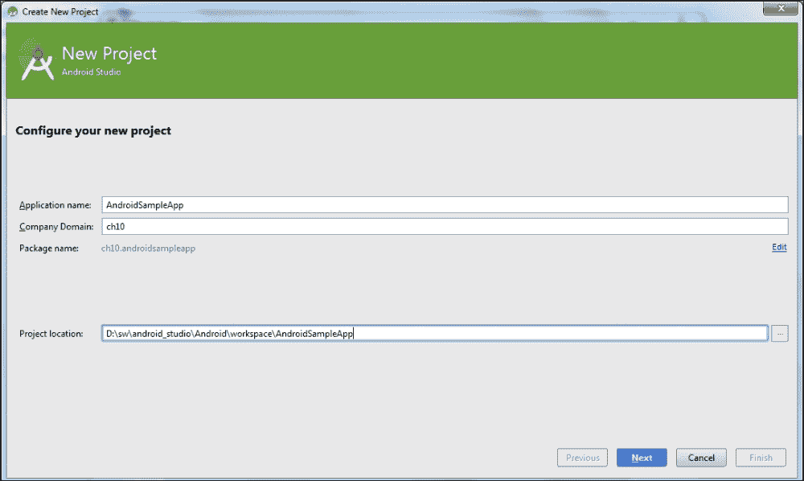

图 10.1

点击**下一步**按钮并按照步骤操作。在活动屏幕上，选择**空白活动**：

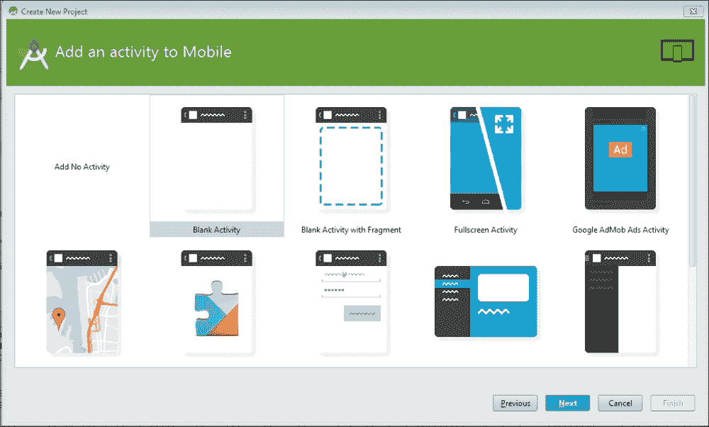

图 10.2

对于本章，我们的主要目的是创建一个示例应用程序，并强调使用 Gradle 的 Android 应用程序构建过程。因此，不需要创建一个完整的 Android 应用程序。因此，示例应用程序将只做一项工作，即在启动应用程序时显示 `Hello World`。

要完成项目设置，在 **自定义活动** 界面中，提供如 **活动名称**、**标题**等详细信息：

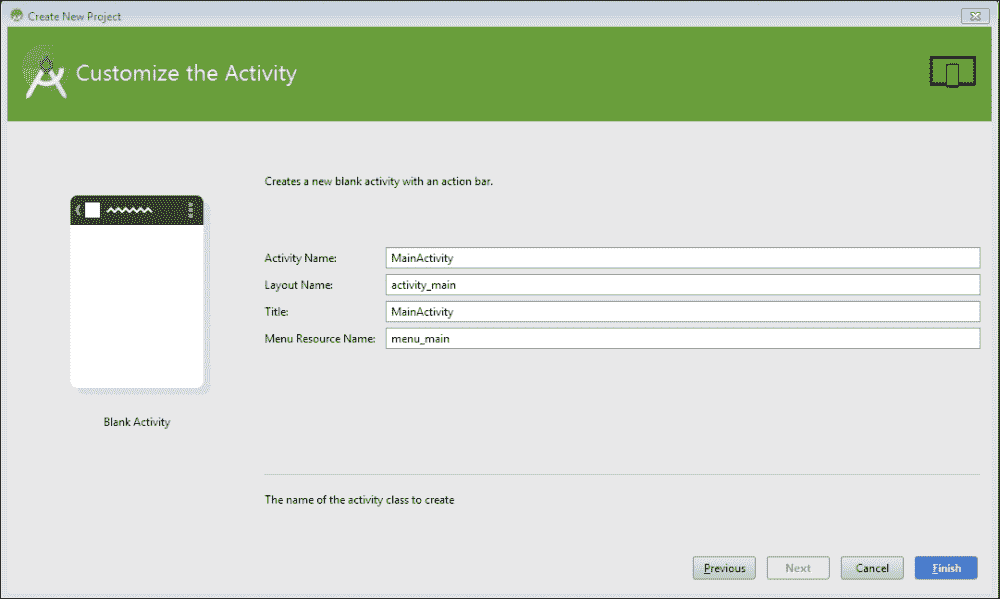

图 10.3

一旦点击 **完成**，Android Studio 将创建项目，目录结构如下所示：

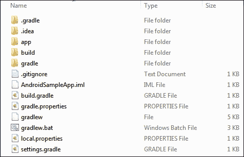

图 10.4

在项目主目录中，你会找到 `build.gradle` 和 `settings.gradle` 文件。这意味着 Android Studio 创建了一个多项目构建结构。在 第六章 中，我们已经介绍了多项目结构，其中父项目包含一个或多个子项目。父项目包含所有子项目共享的公共配置和其他相关细节。

Android Studio 为父项目创建一个 `build.gradle` 文件，并为子项目创建单独的 `build.gradle` 文件。它还会创建一个包含所有属于此父项目的子项目的 `settings.gradle` 文件。你还会找到 `local.properties` 文件。此文件包含有关 Android SDK 位置的信息。此文件的内容如下：

```java
sdk.dir=<Location of Android sdk>
```

Android Studio 还添加了 Gradle Wrapper，这意味着 Android 项目可以在未安装 Gradle 的机器上构建。Gradle Wrapper 自动安装 Gradle 并执行构建。

实际的 Android 应用程序位于 `app` 目录中，该目录包含源代码、资源等。`app` 目录的内容如下所示：

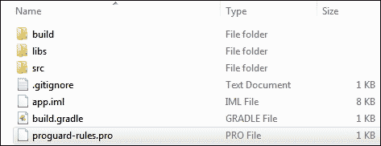

图 10.5

它包含用于 Java 源代码和测试代码的 `src` 目录。

源代码目录和测试目录分别是 `src/main/java` 和 `src/androidTest/java`，如下截图所示：

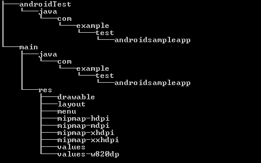

图 10.6

你已经了解 Java 插件及其默认约定。如果我们在一个项目中包含 Java 插件，源结构将是 `src/main/java` 和 `src/main/resources`。对于 Android 插件，除了这两个目录外，你还可以添加特定于 Android 约定的额外文件和文件夹，如以下内容所述：

+   `AndroidManifest.xml`

+   `res/`

+   `assets/`

+   `jni/`

+   `proguard-rules.pro`

这可以在 `android` 封闭中配置为 `sourceSets` 属性，如下所示：

```java
android {
sourceSets {
  main {
    java {
      manifest.srcFile 'Manifest.xml' res.srcDirs = ['src/res'] assets.srcDirs = ['src/assets']
    }
  }
}
}
```

我们将在这里讨论一些重要概念。更多详细信息请参阅[`developer.android.com/sdk/index.html`](https://developer.android.com/sdk/index.html)。

`AndroidManifest.xml` 文件是必须存在于应用程序目录中的重要文件之一。它包含与应用程序相关的一些重要信息，例如活动、内容提供者、权限等。清单文件仅包含预定义元素。一些值是从 Gradle 属性中填充的。您不能在清单文件中添加任何自定义元素。例如 `<manifest>` 和 `<application>` 这样的元素是必需的，并且只出现一次。其他元素是可选的，可以应用一次或多次。

`res` 目录用于放置资源。您可以在 `res` 目录下放置所有应用程序资源，例如布局文件、可绘制文件和字符串值。有关资源的更多详细信息，请参阅[`developer.android.com/guide/topics/resources/providing-resources.html`](http://developer.android.com/guide/topics/resources/providing-resources.html)。

在 `res` 目录内部支持的目录包括：

+   `animator`

+   `anim`

+   `color`

+   `drawable`

+   `mipmap`

+   `layout`

+   `menu`

+   `raw`

+   `values`

+   `xml`

`assets` 目录可能包含所有基本文件。此目录下的文件将作为未经修改的 `.apk` 文件的一部分，并且保留原始文件名。

`jni` 包含使用 Java Native Interface 的本地代码。

`proguard-rules.pro` 包含与 ProGuard 相关的设置。我们将在本章后面讨论 ProGuard 设置。

# 使用 Gradle 构建 Android 项目

我们使用一个简单的活动创建了应用程序，现在我们将尝试使用 Gradle 构建应用程序。Android Studio 已经为项目自动生成了两个构建文件；一个位于项目根目录的 `build.gradle` 文件，另一个位于 `app` 目录中的构建文件。我们将使用子项目（`app` 文件夹）的 `build.gradle` 文件来构建 Android 应用程序。此 `build.gradle` 文件包含以下内容：

```java
apply plugin: 'com.android.application'

android {
  compileSdkVersion 22
  buildToolsVersion "22.0.1"

  defaultConfig {
    applicationId "ch10.androidsampleapp"
    minSdkVersion 15
    targetSdkVersion 22
    versionCode 1
    versionName "1.0"
  }
  buildTypes {
    release {
      minifyEnabled false
      proguardFiles getDefaultProguardFile('proguard-android.txt'), 'proguard-rules.pro'
    }
  }
}

dependencies {
  compile fileTree(dir: 'libs', include: ['*.jar'])
  compile 'com.android.support:appcompat-v7:22.1.1'
}
```

在第一行，我们使用 `apply plugin: 'com.android.application'` 语句应用了一个插件。这与应用任何其他标准 Gradle 插件类似。但这个插件 JAR 文件将从哪里下载？如果您检查父项目的 `build.gradle` 文件，您将找到以下条目：

```java
buildscript {
   repositories {
       jcenter()
   }
   dependencies {
       classpath 'com.android.tools.build:gradle:1.2.3'
   }
}
```

在 `buildscript` 闭包中，我们定义了依赖项为 `com.android.tools.build:gradle:1.2.3`。此 JAR 文件将从 `jcenter` 仓库下载，并将其添加到 `build.gradle` 的类路径中。

构建文件的下一部分是 Android 闭包定义，其中我们定义了与应用程序相关的所有基本配置，例如 SDK 版本、支持的最低 SDK 版本、目标 SDK 版本、应用程序 ID 和版本控制。

接下来，我们有标准的 `dependencies` 闭包来定义应用程序的编译和运行时依赖项。在这里，我们已经包括了 `lib` 目录和 `appcompat-v7 jar` 作为依赖项。

通过这些简单的配置，我们就可以使用 Gradle 构建应用程序。我们已经在构建文件中应用了 Android 插件。现在，我们将探索可用于构建项目的不同任务。在命令提示符中输入 `gradle tasks` 以获取任务列表，如下所示：

```java
> gradle tasks

Android tasks
-------------
androidDependencies - Displays the Android dependencies of the project.
signingReport - Displays the signing info for each variant.

Build tasks
-----------
assemble - Assembles all variants of all applications and secondary packages.
assembleAndroidTest - Assembles all the Test applications.
assembleDebug - Assembles all Debug builds.
……………...
compileDebugSources
compileDebugUnitTestSources
compileReleaseSources
compileReleaseUnitTestSources
mockableAndroidJar - Creates a version of android.jar that's suitable for unit tests.
…………………….

Install tasks
-------------
installDebug - Installs the Debug build.
installDebugAndroidTest - Installs the android (on device) tests for the Debug build.
uninstallAll - Uninstall all applications.
uninstallDebug - Uninstalls the Debug build.
uninstallDebugAndroidTest - Uninstalls the android (on device) tests for the Debug build.
uninstallRelease - Uninstalls the Release build.

……………

```

### 提示

注意，要构建 Android 项目，你需要 Gradle 2.2.1 及以上版本。

以下是一些你可能需要构建 Android 应用程序的重要任务：

+   `assemble`: 此任务与 Java 插件的组装任务相同，用于组装应用程序的输出。

+   `check`: 这类似于 Java 插件的检查任务，它运行所有检查。

+   `clean`: 此任务删除构建过程中创建的所有工件。

+   `build`: 此任务执行组装和检查任务，并构建应用程序工件。

+   `androidDependencies`: 此任务将显示项目的所有 Android 依赖项。

+   `connectedCheck`: 它将在所有连接的设备上并行执行检查任务

+   `install<buildVariant>`: 你可以找到各种安装任务（例如 `installDebug`、`installRelease`），它们用于在设备上安装特定的 `buildVariant`。我们将在本书的后续部分中更详细地讨论 `buildVariant`。

## buildTypes

`buildTypes` 配置用于定义构建类型或环境，例如调试、发布、QA 和预发布，以构建和打包应用程序。默认情况下，当你构建 Android 项目时，你可以在 `build/outputs/apk` 目录中找到创建的调试和发布版本。默认情况下，调试版本使用自动创建的已知用户名/密码的密钥/证书进行签名。发布构建类型在构建过程中未签名；因此，你可以找到为发布构建类型创建的 `app-release-unsigned.apk` 文件。发布构建类型在部署到任何设备之前需要签名。

你可以自定义构建和发布构建类型，也可以通过添加自己的构建类型来扩展构建类型，如下所示：

```java
buildTypes {
  release {
    minifyEnabled false
    proguardFiles getDefaultProguardFile('proguard-android.txt'), 'proguard-rules.pro'
  }
  staging.initWith(buildTypes.release)
  staging {
    debuggable true
  }
}
```

在这里，我们添加了一个额外的构建类型 `staging`（用于预发布环境），并将其配置为发布构建类型的副本，并添加了 `debuggable true`。你可以修改以下属性以适用于任何构建类型：

| 属性名称 | 调试类型的默认值 | 发布和其他类型的默认值 |
| --- | --- | --- |
| `debuggable` | `true` | `false` |
| `jniDebuggable` | `false` | `false` |
| `renderscriptDebuggable` | `false` | `false` |
| `renderscriptOptimLevel` | `3` | `3` |
| `applicationIdSuffix` | `null` | `null` |
| `versionNameSuffix` | `null` | `null` |
| `signingConfig (稍后讨论)` | `android.signingConfigs.debug` | `null` |
| `zipAlignEnabled` | `false` | `true` |
| `minifyEnabled`（稍后讨论） | `false` | `false` |

> *表 10.1*

此外，对于每个构建类型，您可以定义其特定的构建类型 SourceSet，例如 `src/<build type>`。如前例所述，您可以定义一个新的目录 `src/staging`，并将与预发布相关的源代码和资源放在此目录中。

此外，对于每个构建类型，Android 插件将在以下格式中添加新任务：`assemble<buildtype>`、`install<buildtype>`、`compile<buildtype>`、`jar<buildtype>`。这可以通过执行 `gradle task` 命令来观察，如下所示：

```java
> gradle  tasks | grep -i staging
assembleStaging - Assembles all Staging builds.
compileStagingSources
compileStagingUnitTestSources
installStaging - Installs the Staging build.
uninstallStaging - Uninstalls the Staging build.
lintStaging - Runs lint on the Staging build.
testStaging - Run unit tests for the staging build.
jarStagingClasses

```

如前所述，这些任务仅与预发布构建类型相关联。

### ProGuard 设置

对于 `release` 构建类型，Gradle 提供了用于优化和混淆代码的 Proguard 工具的访问权限。它缩小了源代码，并使 `.apk` 文件的大小减小。您可以通过在 `buildTypes/release` 封闭中设置 `minifyEnabled` 来启用/禁用此功能。如 *表 10.1* 中所述，默认值设置为 `false`；因此，如果要启用它，请将其设置为 `true`。

默认设置可以通过 `getDefaultProguardFile('proguard-android.txt')` 方法获取。您可以在 `<Android sdk dir>/tools/proguard` 找到 ProGuard 工具的位置。如果您想为项目提供自定义规则，可以将它添加到 Android Studio 提供的 `proguard-rules.pro` 文件中。您甚至可以添加自己的文件，并使用不同的名称：

```java
 buildTypes {
  release {
    minifyEnabled true
    proguardFiles getDefaultProguardFile('proguard-android.txt'), 'proguard-rules.pro'
  }
}
```

### 构建风味

构建风味或产品风味与构建类型不同。这是另一个分离级别，允许构建应用程序的多个风味，例如付费版本、免费版本、手机版本和标签版本。每个应用程序版本都可以有自己的独立功能和不同的硬件要求。`productFlavors` 和 `buildTypes` 的组合形成了一个构建变体，并为每个构建变体生成不同的 APK。产品风味在 `productFlavors` 封闭下定义：

```java
productFlavors {
  phone{
    applicationId "ch10.androidsampleapp"
    minSdkVersion 14
    targetSdkVersion 20

    versionName "1.0-phone"
  }
  tab {
    applicationId "ch10.androidsampleapp"
    minSdkVersion 15
    targetSdkVersion 22
    versionName "1.0-tab"
  }
}
```

现在，如果我们使用 `gradle clean build` 命令构建项目，我们将在 `build/outputs/apk/` 目录中找到不同的 APK 文件。我们有两个风味（`phone` 和 `tab`）和四个构建类型（`debug signed`、`debug unaligned`、`staging` 和 `release`）。因此，在构建过程中将创建总共 *2*4 = 8* 个 APK 文件。

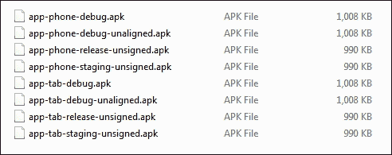

图 10.7

当我们在上一节中将 `staging` 添加为构建类型时，我们观察到 Gradle 自动创建了一些任务。同样，对于每个风味配置，Gradle 将添加不同的任务，如 `assemblePhoneDebug` 和 `assembleTabDebug`：

```java
> gradle tasks | grep -i phone
assemblePhone - Assembles all Phone builds.
assemblePhoneDebug - Assembles the DebugPhone build.
assemblePhoneDebugAndroidTest - Assembles the android (on device) tests for the PhoneDebug build.
assemblePhoneRelease - Assembles the ReleasePhone build.
assemblePhoneStaging - Assembles the StagingPhone build.
compilePhoneDebugAndroidTestSources
compilePhoneDebugSources
compilePhoneDebugUnitTestSources
compilePhoneReleaseSources
compilePhoneReleaseUnitTestSources
compilePhoneStagingSources
compilePhoneStagingUnitTestSources
installPhoneDebug - Installs the DebugPhone build.
installPhoneDebugAndroidTest - Installs the android (on device) tests for the PhoneDebug build.
uninstallPhoneDebug - Uninstalls the DebugPhone build.
uninstallPhoneDebugAndroidTest - Uninstalls the android (on device) tests for the PhoneDebug build.
uninstallPhoneRelease - Uninstalls the ReleasePhone build.
uninstallPhoneStaging - Uninstalls the StagingPhone build.
connectedAndroidTestPhoneDebug - Installs and runs the tests for DebugPhone build on connected devices.
lintPhoneDebug - Runs lint on the PhoneDebug build.
lintPhoneRelease - Runs lint on the PhoneRelease build.
lintPhoneStaging - Runs lint on the PhoneStaging build.
testPhoneDebug - Run unit tests for the phoneDebug build.
testPhoneRelease - Run unit tests for the phoneRelease build.
testPhoneStaging - Run unit tests for the phoneStaging build.
jarPhoneDebugClasses
jarPhoneReleaseClasses
jarPhoneStagingClasses

```

产品风味扩展了 `defaultConfig` 封闭中的配置。您可以在每个产品风味中覆盖默认配置。对于每个风味，您还可以拥有独立的源代码和所需的文件，如 `src/<flavor>/java`、`src/<flavor>/resources` 等。

## 在设备/模拟器上运行应用程序

一旦构建了应用程序，您可能想要在模拟器或物理移动设备上安装或运行应用程序。为了简单起见，我们将在模拟器上运行应用程序。在开发阶段，借助模拟器，您可以在不使用设备的情况下测试不同平台上的应用程序。使用模拟器的优点如下：

+   您可以在多个模拟器设备上测试应用程序

+   您可以使用不同的硬件功能进行测试，例如声音、网络摄像头或传感器

+   您可以控制电池电量、手机位置、网络设置，如 2G 或 3G 等

模拟器非常灵活，但使用过多的模拟器可能会降低系统性能。根据您的系统配置，您应仔细配置模拟器。您可以使用 AVD 管理器添加新的模拟器设备，如图所示：

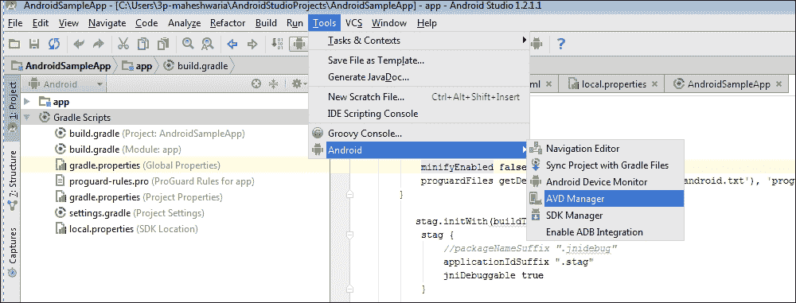

图 10.8

这将显示现有的模拟器设备。您可以根据应用程序需求创建新的设备。有关更多信息，请参阅此链接 [`developer.android.com/tools/help/emulator.html`](http://developer.android.com/tools/help/emulator.html)。

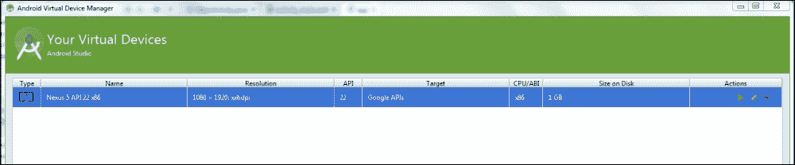

图 10.9

您可以通过点击 **动作** 列表中的启动符号来启动模拟器。在我们的例子中，我们创建了一个 **Nexus 5 API 22x86** 模拟器来测试应用程序。或者，您也可以通过在命令提示符中执行以下命令来启动模拟器设备：

```java
>%ANDROID_SDK%\tools\emulator.exe -netdelay none -netspeed full -avd Nexus_5_API_22_x86

```

初始化模拟器需要一些时间。一旦模拟器启动并运行，我们应该能够从 Android Studio 运行应用程序。转到 **运行** 菜单并选择 **运行应用程序**。

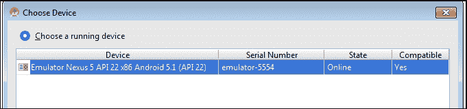

图 10.10

这将显示所有连接到系统的设备以及正在运行的模拟器。您可以选择任何正在运行的设备并点击 **确定**。几秒钟后，应用程序应该会在模拟器中可见。

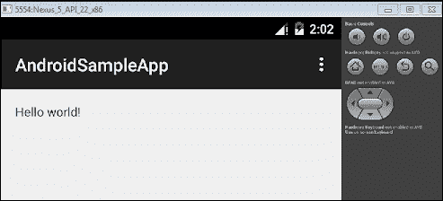

图 10.11

或者，您也可以使用 `gradle install<buildVariant>` 命令来安装应用程序。我们已经在上一节中创建了不同的构建变体和口味。让我们尝试在模拟器上安装 `PhoneDebug` 变体。操作如下：

```java
> gradle installPhoneDebug
:app:preBuild UP-TO-DATE 
:app:prePhoneDebugBuild UP-TO-DATE 
:............
.............
:app:mergePhoneDebugAssets UP-TO-DATE 
:app:compilePhoneDebugJava UP-TO-DATE 
:app:compilePhoneDebugNdk UP-TO-DATE 
:app:compilePhoneDebugSources UP-TO-DATE 
:app:preDexPhoneDebug UP-TO-DATE 
:app:dexPhoneDebug UP-TO-DATE 
:app:validateDebugSigning 
:app:packagePhoneDebug UP-TO-DATE 
:app:zipalignPhoneDebug UP-TO-DATE 
:app:assemblePhoneDebug UP-TO-DATE 
:app:installPhoneDebug 
Installing APK 'app-phone-debug.apk' on 'Nexus_5_API_22_x86(AVD) - 5.1'
Installed on 1 device. 

BUILD SUCCESSFUL

Total time: 24.543 secs

```

您可以在手机的程序列表中找到该应用程序。`AndroidSampleApp` 是我们使用 Gradle 任务安装的应用程序。您可以启动应用程序并检查输出。它将显示 `Hello World`。

要使用 Gradle 卸载应用程序，请使用以下 gradle uninstall 命令：

```java
> gradle uninstallPhoneDebug

```

### 签署发布版本

你可能在运行`gradle tasks`时观察到与发布相关的安装任务尚未创建；例如，`installPhoneRelease`、`installTabRelease`等。如果你使用密钥库签名应用程序，将会有与发布构建类型相关的任务可用。现在，我们将尝试使用密钥库签名一个应用程序。如果你已经有一个有效的密钥库，你可以使用该文件来签名应用程序；否则，你需要使用以下命令生成一个新的密钥库：

```java
> keytool -genkey -v -keystore myCustomkey.keystore -alias customKey -keyalg RSA -keysize 2048 -validity 10000

```

要创建密钥库，我们需要提供一些基本信息。在输入所有详细信息后，前面的命令将生成`myCustomkey.keystore`文件。现在，我们必须使用以下配置更新`build.gradle`以启用应用程序的签名：

```java
android {

......
signingConfigs {
  release {
    storeFile file("myCustomkey.keystore")
    storePassword "welcome"
    keyAlias "customKey"
    keyPassword "welcome"
  }
}
  ……………
buildTypes {
  release {
    minifyEnabled false
    signingConfig signingConfigs.release
    proguardFiles getDefaultProguardFile('proguard-android.txt'), 'proguard-rules.pro'
  }
  ………………
}
```

现在，如果我们执行`gradle tasks`命令，我们会发现为发布构建添加了新的任务。同样，新的 APK 文件将在`apk`文件夹中创建：

```java
> gradle tasks | grep -i install
Install tasks
installPhoneDebug - Installs the DebugPhone build.
installPhoneDebugAndroidTest - Installs the android (on device) tests for the PhoneDebug build.
installPhoneRelease - Installs the ReleasePhone build.
installPhoneStaging - Installs the StagingPhone build.
installTabDebug - Installs the DebugTab build.
installTabDebugAndroidTest - Installs the android (on device) tests for the TabDebug build.
installTabRelease - Installs the ReleaseTab build.
installTabStaging - Installs the StagingTab build.
uninstallAll - Uninstall all applications.
....

```

# 摘要

在本章中，我们简要讨论了使用 Gradle 作为构建工具的 Android 开发。我们还讨论了 Android 插件提供的不同闭包以及如何遵循默认约定构建 Android 项目。我们还解释了如何自定义构建文件以满足新项目的要求。当然，还有很多事情可以讨论，例如 Android 开发和使用 Gradle 的 Android，但我们无法在一个章节中涵盖所有内容。这需要一本书来详细说明 Android 插件的全部功能。但我们认为，我们已经涵盖了构建 Android 项目所需的大部分基本和重要步骤，这将帮助你开始使用 Gradle 作为 Android 构建系统。
