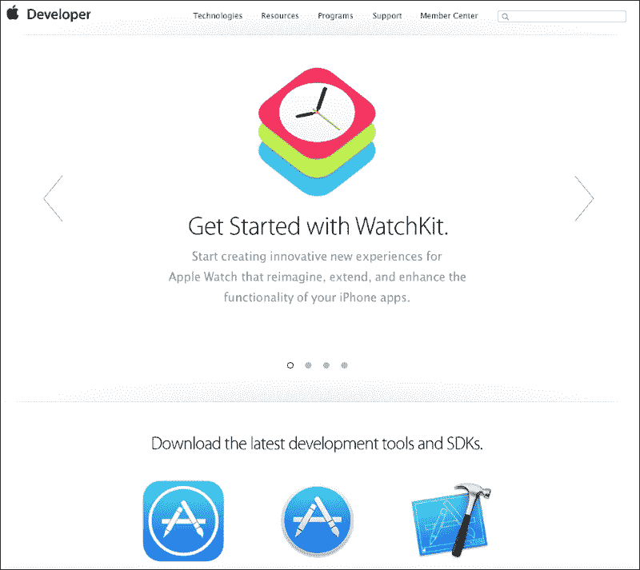
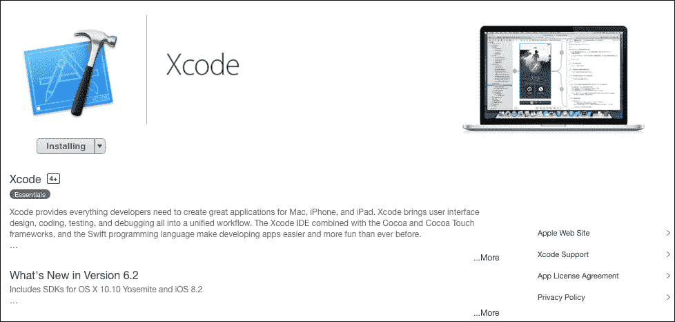
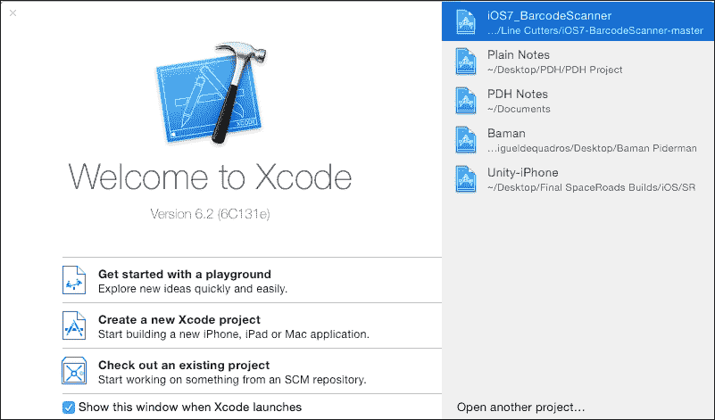
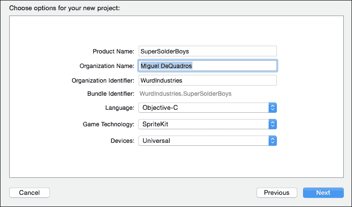
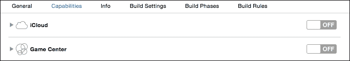
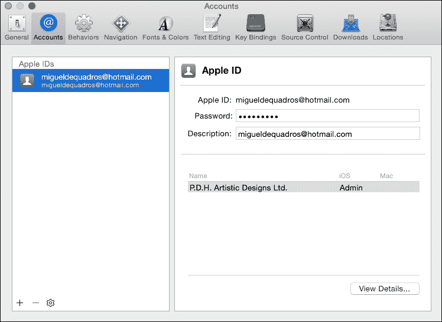
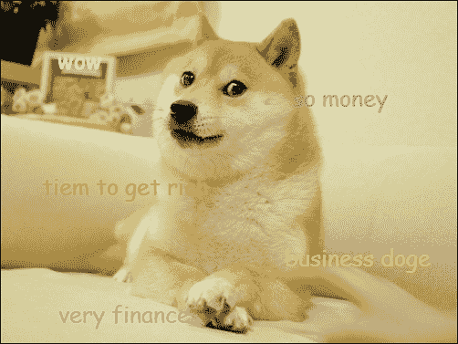
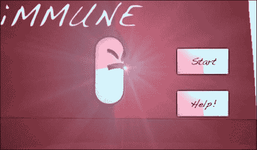
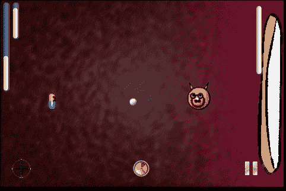
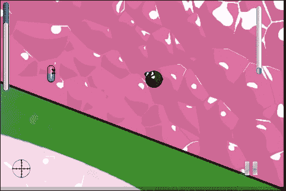

# 第一章：在 Xcode 和游戏开发中可以期待什么

欢迎来到移动游戏开发的世界！无论你是经验丰富的开发者还是新手开发者，你都在一个激动人心、快速发展的行业中。你购买这本书是为了掌握 iOS 游戏开发，这正是你将在本书结束时做到的！然而，你需要从某个地方开始，对吧？让我们看看本章将讨论什么：

+   注册成为 iOS 开发者

+   为开发设置你的 Mac

+   从游戏开发市场可以期待什么

移动游戏开发行业非常激动人心！准备好迈出游戏开发的第一步。我们将帮助你注册成为 Apple 开发者，设置你的 Mac 开发环境，并参观 Xcode 的一些功能。我们将看看源文件（包含我们代码的文件）是什么样的。然后，我们将讨论游戏开发市场，以及它有多么令人惊叹。我在开玩笑，这是一个有趣的市场！

让我们直接进入主题，好吗？

# 注册成为 iOS 开发者

就像许多平台（Mac、PC、Android、Blackberry 和 Windows Mobile）一样，iOS 要求你注册成为开发者。别担心！这很简单，只需访问[developer.apple.com/ios/](http://developer.apple.com/ios/)，你将看到主页，如下面的截图所示：



滚动到找到**iOS Apps**。点击**iOS Apps**按钮，你将看到 iOS 开发者中心。熟悉这个网站以及我们将在本书后面介绍的 iTunes Connect，你在游戏开发过程中会大量使用这些网站。

如果你还没有开发者账户，点击**免费注册**文本，以便你可以注册一个新的 Apple ID。苹果的另一个优点是，他们的账户都是关联的，所以当你注册开发者账户时，你可以使用你的 Apple ID。在下一页，你将被要求使用你的 Apple ID 登录或创建一个新的。只需按照提示操作，填写所有信息，并支付年度费用（99 美元/119 加拿大元）。完成之后，你应该可以访问 SDK。如果你没有被重定向回 iOS 开发者中心，请访问[developer.apple.com/ios](http://developer.apple.com/ios/)并滚动到**下载**部分。截至本书编写时，Xcode 的当前版本是 6.2。点击**下载**按钮。你将被带到下载页面；然而，你将被转到 Mac AppStore。Xcode 现在托管在 Mac AppStore 上，这要好得多，因为它在需要时自动更新 Xcode。你将看到 Xcode 安装页面，如下面的截图所示：



点击 **获取** 按钮下载 Xcode。下载完成后（除非你有光纤高速互联网，否则可能需要一段时间：它是 2.5 GB。AppStore 会自动为你安装 Xcode。

现在，你应该在你的 dock 上看到一个闪亮的新的图标。当你打开它时，可能会提示你进行额外的安装以支持调试或其他功能，请继续让它下载所需的任何额外组件，如图所示：



现在，你将看到 Xcode 欢迎屏幕。从这里，你可以创建新项目、打开旧项目，甚至查看最近的项目列表。

我们将开始设置我们的游戏项目，所以点击 **创建新的 Xcode 项目**，然后新的项目向导将弹出。在这里，你有许多空的项目模板可供选择，但针对这个项目，我们将在 iOS 选择下的 **应用程序** 中选择 **游戏** 模板。点击 **游戏**，然后点击 **下一步**。下一屏幕将要求提供所有游戏信息，它将如下所示：

+   **产品名称**: 这是项目或游戏的名称。

+   **组织名称**: 这是你在 Apple 开发者网站上注册时使用的公司或个人名称。

+   **组织标识符**: 这将显示在你的捆绑标识符（稍后讨论证书）中，通常证书读取为 `com.yourcompany.yourproduct`，但你也可以自定义它为 `yourcompany.yourproduct`。

+   **捆绑标识符**: 这是你的项目的标识符。你将在我们稍后安装的开发者证书上看到它，你将在上传到 AppStore 时也会看到它。

+   **语言**: 在开发时，我们现在可以选择两种语言：Swift 和 Objective-C。对于这本书，我们将使用 Objective-C。

+   **游戏技术**: 这包括你在开发时可以使用的各种“套件”，例如 SceneKit、SpriteKit、OpenGL ES 和 Metal。对于这个项目，我们将选择 SpriteKit。

+   **设备**: 默认设备是通用；但是，如果你想选择目标设备，你可以这样做。有时，由于屏幕尺寸较小，iPad 应用程序在 iPhone 上看起来可能不合适，由于分辨率不同，东西可能不会正确地适应，并且不会正确显示。

按照以下截图所示填写所有信息字段：



总结一下，对于这个项目，我们将选择 **Objective-C**、**SpriteKit** 和 **通用**。当你填写完所有信息后，点击 **下一步** 按钮，并将你的项目保存在一个容易记住的位置。

现在，你已经进入了 Xcode！看到这些内容感到困惑吗？别担心，实际上导航起来相当简单。

以下截图显示了常规项目设置，这是你加载 Xcode 项目时看到的第一件事：


对于这个项目，我们只想支持横向方向；因此，从 **部署信息** 下的 **设备方向** 部分取消选择 **纵向** 选项，并保留两个横向方向的选择。

如果你愿意，可以为我们的游戏添加不同的功能。点击屏幕中央顶部栏上的 **功能** 按钮，你将看到许多可以添加到你的应用程序中的不同选项。例如，我们可以添加 **游戏中心** 用于排行榜和成就，或者我们可以通过点击按钮从关闭切换到开启来添加 iCloud 功能。我们可以使用 iCloud 在远程存储游戏保存数据，如下面的截图所示：



在顶部栏的各个部分中，有很多设置和变量可以进行更改。我们将在本书稍后讨论其中的一些。

让我们浏览一下我们的项目文件，以便熟悉文件的功能。在左侧栏中，你会看到 `.h` 和 `.m` 文件，这些是所有编程工作的地方。

`.h` 文件是你的头文件，我们将声明变量（例如整数和布尔值）和出口（如果我们通过故事板构建，我们会声明按钮、标签等。我们会在头文件中声明它们，并在故事板中连接它们）。

别担心，我们将在本书稍后进行更多详细讨论。

`.m` 文件是你的主要文件，大部分的编码工作都在这里进行。在头文件中声明的声明只要文件集相同，就可以访问，例如，你可以在 `AppDelegate.m` 文件中访问来自 `AppDelegate.h` 文件的整数。有方法可以从其他文件访问变量，例如框架；或者只要将头文件导入到你正在工作的文件中。这些是我们稍后将要讨论的内容。我不想在这个时候让你感到困惑。

让我们来看看 `AppDelegate.h` 和 `AppDelegate.m` 文件，从 `.h` 文件开始，你将看到以下文本：

```swift
//
//AppDelegate.h
//SuperSolderBoys
//
//Created by Miguel DeQuadros on 2015-03-25.
//Copyright (c) 2015 Miguel DeQuadros. All rights reserved.
//

#import <UIKit/UIKit.h>

@interface AppDelegate : UIResponder <UIApplicationDelegate>

@property (strong, nonatomic) UIWindow *window;

@end
```

注释中的文本会有所变化（你可以通过在注释后输入 `//` 来注释文本）。当你看到文本为绿色时，你就知道文本已被注释。

几乎所有的代码文件都会以导入文件开始。在前面代码中看到的 `AppDelegate` 类显示了 `#import <UIKit/UIkit.h>`，这将允许你访问来自 `UIKit` 头文件的命令和函数。你可以在这里导入任何其他头文件，例如，如果你想创建一个可以通过 PayPal 进行支付的应用程序，你可以导入 PayPal SDK，然后通过输入 `#import <PayPal/PayPal.h>` 或需要导入的任何文件来将其导入到你的文件中。当你开始输入时，Xcode 将显示你可以导入的文件列表。

现在，我们将查看下一行，即 `@interface AppDelegate : UIResponder <UIApplicationDelegate>`。这取决于您正在使用的界面类型（您是否正在处理应用程序代理、主菜单的视图控制器，或者 PayPal 支付视图控制器）；它可以是此文件中的 `ApplicationDelegate` 方法，也可以是 `UIViewController` 或 `SKScene` 方法。同样，这取决于您正在使用的界面类型。您将在本书中看到不同界面的各种变体。

最后，我们将看到最后高亮显示的行，即 `@property (strong, nonatomic) UIWindow *window;`。这是您声明的地方。这一行声明了应用程序窗口。属性是我们类中使用的各种项目的声明。例如，属性可以是整数、布尔值、窗口（如前所述），甚至按钮。

最后，我们有 `@end` 行，这仅仅是文件的结束。

现在，让我们看看 `.m` 文件：

```swift
//
//  AppDelegate.m
//  SuperSolderBoys
//
//  Created by Miguel DeQuadros on 2015-03-25.
//  Copyright (c) 2015 Miguel DeQuadros. All rights reserved.
//

#import "AppDelegate.h"

@interface AppDelegate ()

@end

@implementation AppDelegate

- (BOOL)application:(UIApplication *)application didFinishLaunchingWithOptions:(NSDictionary *)launchOptions {
    // Override point for customization after application launch.
    return YES;
}

- (void)applicationWillResignActive:(UIApplication *)application {
    // Sent when the application is about to move from active to inactive state. This can occur for certain types of temporary interruptions (such as an incoming phone call or SMS message) or when the user quits the application and it begins the transition to the background state.
}

- (void)applicationDidEnterBackground:(UIApplication *)application {
    // Use this method to release shared resources, save user data, invalidate timers, and store enough application state information to restore your application to its current state in case it is terminated later.
    // If your application supports background execution, this method is called instead of applicationWillTerminate: when the user quits.
}

- (void)applicationWillEnterForeground:(UIApplication *)application {
    // Called as part of the transition from the background to the inactive state; here you can undo many of the changes made on entering the background.
}

- (void)applicationDidBecomeActive:(UIApplication *)application {
    // Restart any tasks that were paused (or not yet started) while the application was inactive. If the application was previously in the background, optionally refresh the user interface.
}

- (void)applicationWillTerminate:(UIApplication *)application {
    // Called when the application is about to terminate. Save data if appropriate. See also applicationDidEnterBackground:.
}

@end
```

在这个文件中，当应用程序达到某些状态时，您将调用各种函数。如果您阅读了一些函数，您将看到注释文本（要注释文本，请在代码行前输入 `//`），说明每个状态的作用，例如当应用程序终止时，或者当它进入后台时。有了这些函数，您可以保存数据，记录信息，甚至暂停游戏。

看起来很简单，对吧？一旦您掌握了方法，事情确实会变得简单！

现在，我们必须将我们的开发者账户添加到 Xcode 的账户偏好设置中。这使得签名证书和配置文件变得容易得多。

要添加您的账户，请点击最上面的工具栏中的 **Xcode**（您可以看到文件、编辑等所有这些功能），然后点击 **偏好设置**。或者，您可以按 *CMD* *+*，以快速访问菜单。

当偏好设置窗口出现时，点击 **账户** 选项卡，这是窗口中的第二个选项卡。

在窗口的左下角，点击 **+** 按钮以添加账户。当下拉菜单出现时，选择 **添加 Apple ID**。

再次强调，Xcode 使用您的正常 Apple ID 登录来登录开发者会员中心和 iTunes Connect，这非常方便，因为您不需要记住多个登录信息。



现在我们已经将账户添加到 Xcode 中，我们需要将所有开发者证书添加到我们的密钥链中。

前往 [developer.apple.com](http://developer.apple.com)，点击 **会员中心**，并使用您的 Apple ID 登录。在 **技术资源和工具** 部分下，点击 **证书、标识符和配置文件** 图标。

现在，我们将看到 iOS、Mac 和 Safari 的选择。这些将显示每个平台的证书，组织得非常整洁。

在 iOS 下点击**证书**标签页，如果你的会员资格是新的，你将看到一个**入门**网页。只需按照所有步骤操作，这些步骤将引导你创建和安装证书。关于这方面的更多内容将在本书的后续部分进行讨论。

当你安装好所有证书后，你就完成了！现在我们已经安装并设置了 Xcode，让我们谈谈资产创建。

## 为你的精彩游戏创建资产

实际上，你可以使用大量程序来创建游戏资产。等等！什么是资产？！简单来说，资产是你游戏中使用的各种图像、音效或视频。例如，我们有精灵。等等！什么是精灵？！**精灵**是你游戏中使用的图像；这可以包括角色、平台、背景、物品和对象。资产也可以是音效、音乐和视频。

对于精灵，我喜欢使用 Adobe Photoshop，特别是如果我制作的游戏是像素艺术 2D 游戏。它非常出色，因为你可以利用图层为每个需要移动的独立身体部分进行动画。然而，如果我要制作看起来更逼真的东西，我会使用 3D Studio Max 来创建我的模型，然后将它们渲染成小图像文件。

这些软件套件并不便宜。3DS Max 超过 3000 美元，Adobe Suite 过去大约是 1600 美元，尽管他们现在提供月度计划。

如果你正在寻找免费选项，可以查看用于图像创建的**Gimp**等程序。我使用过它：它的布局就像 Photoshop 一样，使用起来同样简单且功能强大。或者，使用基于浏览器的图像处理程序**Pixlr**，它与 Photoshop 非常相似。

如果你想要做一些酷炫的 3D 内容，可以查看**Blender**、**Wings3D**和**DAZ Studio**。

对于音乐，许多人喜欢使用老式的**Garage Band**。有很多乐器选项、预制的循环，以及使用电脑键盘作为音乐键盘的能力。

对于音频处理，开发者和其他人之间的主要选择是**Audacity**。你可以通过添加淡入淡出、点击、静音、反转音频、添加更多内容来操纵音频文件。它相当酷。

对于视频，我个人喜欢使用**3DS Max**，然后将其导入到**iMovie**中。iMovie 应用程序很棒，因为它可以将你的视频文件导出以供 iPhone 使用，所以我们不需要担心文件兼容性或屏幕尺寸。你可以使用 Blender 在短时间内为你的介绍创建一些令人惊叹的 3D 动画，或者你可以使用**Adobe Flash**来动画化它们，它还可以将它们导出为 iPhone 和 iPad 的特定格式。

我们将在下一章中更多地讨论资产的实际创建。同时，让我们谈谈游戏开发场景，以及当你进入时可以期待什么。

## 进入游戏开发市场

正如我在本章引言中提到的，你已经进入了一个超级激动人心的市场。游戏开发市场发展迅速，总是变化，非常有趣，有很大的赚钱潜力，正如 Doge 将会解释的：



然而，虽然这是一个有趣且赚钱潜力巨大的行业，但并非所有事情都那么有趣，也不是一蹴而就的成功。

在我开发游戏超过十年间，我了解到你以为会卖得好的，可能并不会卖得好。我制作的第一款游戏叫做**iMMUNE**，当时我在编程时觉得它相当不错。经过多次试玩测试，以及收集人们的意见后，我觉得这款游戏已经准备好发布了，并且希望它能取得巨大的成功，就像我们所有人一样。

发布的那天过去了，我几乎没有看到任何销售。自然地，我感到非常沮丧，但现在我意识到我在开发和发布游戏时犯了很多错误。让我来解释一下发生了什么——这个想法是从我的祖母那里来的，她（就像大多数祖母一样）因为身体不适而需要服用很多药物。有一天，我们讨论了整个猪流感疫情，我那时的青少年大脑自动想，“嘿！我们都吃药，现在的猪流感情况相当疯狂。为什么不利用这个机会呢？”我并不是对世界健康状况漠不关心，我只是认为，在当前情况下，人们会搜索猪流感或药品，我的游戏将会被很多人看到。

因此，我为 iMMUNE 想出了一个主意。这个主意很简单，你扮演一颗药丸，穿越人体，你必须与病毒战斗，最终在游戏结束时摧毁猪流感病毒。以下是 iMMUNE 的截图：



我认为这是一个很好的主意，周围的人也这么认为。因此，在经过数月的匆忙赶工，并且承认遗漏了一些主要功能，比如带有帮助按钮的主菜单之后，我犯的第一个错误是将游戏上传到 AppStore。我开始公开宣传游戏，用截图和预告片以及预告片来制造炒作。

当时，我觉得，“你知道的，我已经在这款游戏上投入了大约九个月的时间，我希望从中得到一些合理的回报。我将价格定为 2.99 美元。”这是我犯的第二处错误。

这款游戏于 2009 年 8 月 5 日发布，大约在开发后一年。我开始看到一星的评价出现。啊！讨厌的人总是会讨厌。这是我犯的第三个错误。

几天后，我的最好朋友买了这款游戏并给我打电话，这是我们之间的对话：

**他**：嘿，我刚刚买了你的游戏。我怎么玩？

**我**：哦，只需倾斜设备来移动角色，然后按下准星按钮来射击病毒。然后...

我很确定他在我试图解释的时候睡着了。（我会把这个错误和我的第一个错误联系起来。）正如以下图片所示，用户界面没有很好地标记或解释。界面只是随意拼凑在一起的。



屏幕上有太多东西需要读者理解，但没有任何解释。屏幕上有太多元素需要玩家理解，但都没有解释。这是一个不幸的错误。

不必说，我继续使用名为**GameSalad**的程序创作了续集，我为此写了两本书。我喜欢这个程序。然而，当我创建 iMMUNE 2 时，GameSalad 还处于非常早期的开发阶段，这意味着它会经常崩溃，而且缺少了很多功能。简而言之，我也把这件事搞砸了。我试图改进第一个程序中的错误。

那么，出了什么问题？让我为你分析一下。

+   **错误 1**：我急于推出游戏，遗漏了关键功能。正如所提到的，我没有包括主菜单，这本身并不是什么糟糕的事情。糟糕的是，我没有告诉玩家该做什么，就直接把他们扔进了游戏。当玩家感到沮丧时，他们去 YouTube 上看如何玩游戏，结果发现如果设备倾斜得太远，主要角色就会跑出屏幕。再次强调，我忘记写的那段代码，“如果玩家位置 > 屏幕高度 = 停止移动”，完全被忽略了。我是怎么错过那一点的？

+   **错误 2**：我设定了看似合理的价格$2.99。然而，$2.99 能买到什么？一杯咖啡，或者一张多伦多枫叶队的球票，考虑到他们最近的表现？$2.99 能买到很多东西，只需去一家一元店看看就知道了。人们愿意为应用支付$2.99 吗？不。他们曾经这样做过吗？实际上并没有。这就是为什么大多数游戏都采用免费增值的支付结构。游戏可以免费下载，但你可以用一角钱购买 1800 颗胡萝卜种子。

+   **错误 3**：当我开始看到一星差评涌入时，我想这只是人们“讨厌”而已，因为他们确实会这样！我的意思是，看吧，我的游戏相当棒。对吧？*对吧？*不。

我从这些导致我浪费了一年的时间的关键错误中学到了什么？首先，不要急于推进项目。高预算的项目为了赶工期而匆忙完成，而我们作为玩家，讨厌这样的游戏，因为它太不完善了。检查每一行代码，彻底进行游戏测试，以确保一切正常运作。当然，有些东西你可能会错过，因为 14 岁的孩子用油腻的手指以每分钟 1000 次的速率砸着他们的二手 iPad，这不是游戏应该被玩的方式。确保它第一次就能正常工作。我建议在发布前进行焦点小组测试吗？

高昂的价格标签是一个重大的错误。我想从开发游戏所花费的时间中获得大量的回报，这就是为什么我把价格定得太高——*太高了*。我想我们第一次开发游戏时都有这样的心态，我们没有考虑到我们的价格无法支撑市场。我应该把它定价得尽可能低，当时是 0.99 美元，“免费增值”并不是真正的事情。我觉得我已经为游戏投入了相当多的努力，就像下面的图片所示，我甚至放进了会根据你如何握持设备而倾斜的胃酸。我觉得我已经制作了一个相当不错的、高质量的游戏。哦，我错了。



最后，我应该阅读评论，并认真对待它们。我意识到我对玩家所做的一切，以及这并不公平。我的游戏有点问题，我承认了。我努力修复它，并将其更新到 1.1 版本。我添加了主菜单、帮助屏幕、游戏开始时的帮助弹出窗口，并修复了那个愚蠢的 bug，其中角色会从屏幕边缘漂浮出去而不是仅仅停止。我还将价格标签降低到 0.99 美元。你可能猜得到我接下来要说什么。太晚了。在我 MMUNE 1.1 版本发布给公众时，对之前错误的冷漠和普遍的厌恶最终导致了游戏的失败。

但是，新玩家怎么办？他们不会在游戏更新时看到新的截图和游戏玩法吗？是的，他们会——但这个时间段比死星上的热力排气口还要短。AppStore 是一个很好的地方，但应用就像僵尸一样蜂拥而至“瑞克·格里姆斯”，你会看到你的应用出现在新列表中，也许一个小时左右，它就下降了十个位置或更多。

这是我在游戏开发市场的个人经历。我有过成功，但那是在失败之后。当我将我的最新游戏*paceRoads*发布在**Desura**和**IndieRoyale**上时，我很幸运地被我的开发者关系联系人告知在游戏发布前降低我之前设定的价格，这最终导致了游戏的成功。

我知道这一切听起来像厄运和阴霾，好像我在“讨厌”这个市场。但，我不是，我爱游戏开发和整个开发者社区。我只是不希望你犯和我一样的错误。

我谈论在市场上赚钱的巨大潜力，而且确实如此！如果你有时间，可以查找*Trism*的创作者，或者看看*愤怒的小鸟*。不必多说了，但那些通常是拥有数十亿美元用于广告的巨大公司。像我们这样的普通人没有那么多钱，所以我们的创作，尽管可能很棒，也可能在蜂拥而至中迷失。我们将在第七章*部署和盈利*中讨论如何克服这一点。

不要让这些话让你气馁，因为游戏开发和市场实际上非常有趣。如果你有任何问题，你可以在开发者论坛上询问一群比你更有知识的人，你将得到答案——而且是一个很好的答案。我甚至有一个开发者请求我发送我的项目给他，以便他能看到问题所在，然后他重新编写了导致我麻烦的代码集。

当我说你进入了一个激动人心的世界时，请相信我！游戏开发不仅是你技术知识的表达，也是你创造力的体现。

在我之前的那本书《Packt Publishing 出版的《GameSalad Essentials》中，我推荐过这本书，在这本书中我还会再次推荐它，请看看电影《Indie Game The Movie》。你将看到一些在市场上取得巨大成功的开发者的真实世界经历，你将看到他们所经历的挣扎和困难。我强烈推荐观看这部电影。

我抱怨够了！让我们进入有趣的部分，下一章我们将开始为我们的游戏创建资产。

# 摘要

在这一章中，我们注册成为 iOS 开发者，在我们的 Mac 上设置了 Xcode，并讨论了设置证书，以便我们可以开始开发我们棒极了的游戏！我们对 Xcode 和编码文件的工作原理进行了快速概述，并讨论了一些我们可以用来为我们的游戏创建资产（我使用和免费替代品）的程序。然后，我们讨论了我个人在游戏开发市场的经验，预期什么，以及要避免哪些错误。

现在我们已经完成了所有这些，让我们开始创建资产吧！
