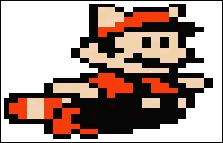
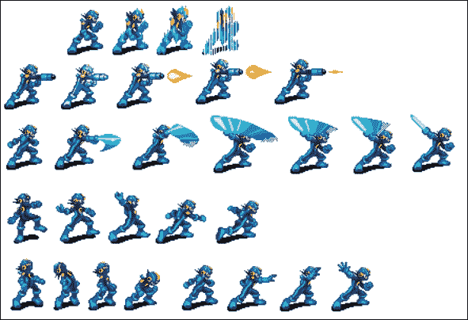
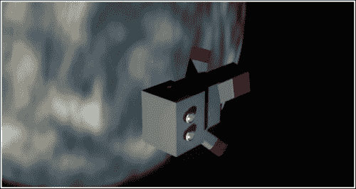
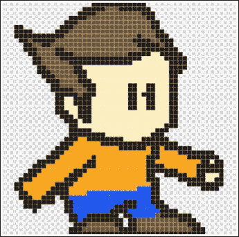
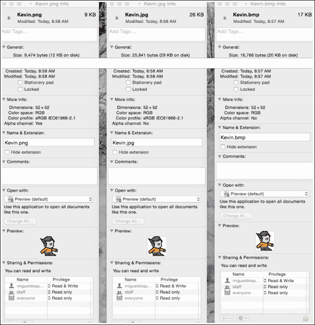
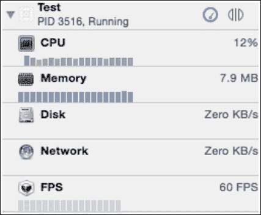
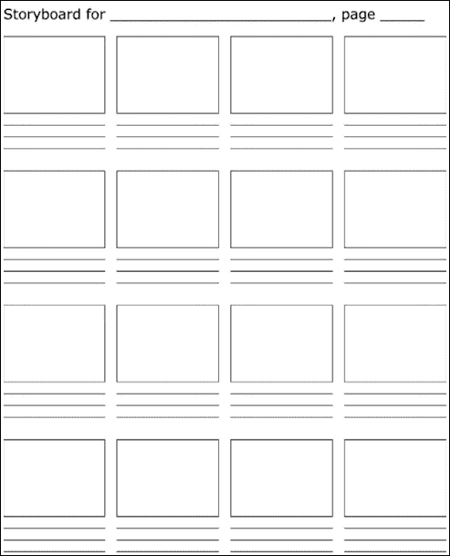

# 第二章.创建资源

现在你已经将 Xcode 设置好了，我知道你迫不及待地想要开始开发你那令人惊叹的新游戏！然而，正如你所知，我们必须循序渐进！所有游戏都有资源，例如 3D 模型、图像或超级酷炫的音效。如果你对这类东西一无所知，那么你来到了正确的地点！在本章中，我们将讨论以下内容：

+   为你的游戏创建或获取资源

+   创建优化的资源

+   设计你的游戏

这是你可以开始真正发挥创意的地方！一旦你开始设计你那令人惊叹的新项目的基石，乐趣真的开始了。

有些资源很容易创建，有些则需要更多的努力，有些可能需要支付他人为你创建，还有些可能需要下载免费资源，如下面的图片所示：

足够的介绍，让我们开始吧！

# 让我们谈谈资源

资源是游戏的基石。它们将基本上组成你的游戏，无论你是创建 3D 大片，还是像本书中我们将要做的 2D 平台游戏。

你将需要创建、购买或为你创建的项目资源。让我们来分解一下。

## 精灵

什么？！别担心，不是像《奥德赛》中的水精灵那样。当谈到视频游戏资源时，精灵基本上是游戏中使用的图像。看到本章引言中的马里奥图像了吗？那就是精灵。精灵还可以用于特殊效果，如 2D 镜头光晕或粒子。精灵通常创建在包含角色及其动画的精灵图中，如下面的图片所示，这是一张从许多《洛克人》系列中撕下来的精灵图：

精灵可以非常容易地创建，也可以非常复杂，需要花费数小时来绘制。是的，绘制。精灵可以使用任何图像软件绘制，只需使用鼠标，或者平板电脑（我强烈推荐购买一个，因为它可以让精灵创建变得容易得多）。

另一方面，精灵可以使用 3D 动画程序渲染。我曾在一些早期的游戏中使用过 3D Studio Max，我对结果非常满意。

+   **最佳精灵大小**：根据设备而异，但一个 32x32 像素的图像在 3GS 上看起来不错，但在视网膜 iPad 上则几乎看不见。

+   **文件类型**：在我看来，PNG 通常是最好的文件格式，因为它们具有很好的压缩（文件大小小=性能更好）、质量和支持透明度，这在绘制你的角色时是必不可少的，你不想让他们周围有一个白色的框！

+   **推荐软件**：我偏爱 Adobe Photoshop，但正如我在其他书中多次提到的，有很多免费的替代品。例如，Gimp 就是一个完美的例子。

## 音效

BOOM! KABLAMO! PAFF! 嗯，这些话泡并不是游戏必需的！音效和您创建的精灵一样重要。现在，除非您有专业的音频录制设备，否则音效的创作可能会很棘手。对我来说，我在互联网上搜索免版税音效。相信我，有很多可供您使用的音效，从卡通音效到枪声和爆炸声。 [www.freesound.org](http://www.freesound.org) 是一个我多次为我的游戏使用的优秀网站。

### 文件类型

iPhone 音频 SDK 文档指出，iPhone 支持多种音频格式，然而每种格式都有其缺点：

+   **MP3**：这是一种高度压缩但也是高质量的编码格式，可以保留音乐和语音的丰富性。然而，iPhone 一次只能播放一个 MP3 流，因为它需要使用硬件解码器。这使得 MP3 不能作为音效的格式，因为它会打断背景音乐和/或正在播放的用户音乐。

+   **WAV**：iPhone 仅支持 PCM 编码且不需要任何压缩代码的 WAV 文件。虽然 WAV 支持许多不同的采样率和比特深度，但它会产生非常大的文件（16 位/44.1kHz 立体声音频为 180k/sec）。当您需要快速播放许多效果时，这种大尺寸变得难以承受。

+   **AIFF**：这与 WAV 文件有类似的问题——支持 Apple 无损压缩。

+   **自定义**：您可以使用 iPhone 的低级 API 从任何来源播放自己的音频，但这对在游戏中播放简单的音效来说似乎有些过度。

+   **推荐软件**：对于处理音效和重写/转换它们，我迄今为止找到的最好的软件是**Audacity**。它是免费的，易于使用，并支持主要的音频格式。以下图片显示了 Audacity 的标志：

## 音乐

另一个重要的资产是音乐。我喜欢音乐，希望我的游戏里能一直播放着歌曲。然而，我理解在许多游戏中，音乐可以用来设定氛围，并为接下来的场景激发情感。创作音乐并不困难，只需要有良好的听觉和一点点的创造力。您可以自己创作音乐，或者下载免版税音频。您总是想确保它是免版税的，否则可能会让某人非常（法律上）生气。

### 格式

如前所述，音乐的最佳格式是 MP3。它只允许一个音轨，因此不会被其他音效打断，提供高质量、低文件大小。

### 最佳软件

使用 Garage Band 进行创作，以及任何编辑，再次使用 Audacity。

## 视频

亲自来说，我喜欢为我的游戏创建和播放剪辑场景视频。我觉得它们在游戏之间提供了一个很好的休息，但，嘿，那只是我。我知道许多人一看到就开始跳过。

以下图片是从我的一个名为*LOST*的项目介绍视频中抓取的：

### 文件类型

M4V（许多程序，包括 QuickTime，可以将任何视频转换为 M4V，但如果你想有更多的控制权，请使用**Handbrake**）。

### 最佳软件

我经常使用 3DS Max 进行我的视频创作，然后将其导入**iMovie**进行编辑。如果你在寻找一个 2D 解决方案，试试 Adobe Flash（我相信它曾经被称为**FlashMX**）。对于视频转换，使用 Handbrake，它有大量的设置可以调整，以调整视频以达到所需的画质和文件大小。

# 创建优化资源

让我们从创建优化精灵以获得最佳性能开始。这将如何影响性能？将游戏想象成一部视频，将你的设备想象成 DVD 播放器，甚至电视。游戏逐帧播放，你的设备显示每一帧。然而，它必须渲染每一帧。这发生得如此之快，以至于你永远不会注意到，但现在想象一下，如果你的设备必须渲染大图像（让我们想想拨号互联网加载一张大照片）。这可能需要更长的时间，因为设备必须更努力地工作，所以电池会更快地耗尽。

这只是可能减慢性能的一个原因；我们将在后面进一步讨论其他原因。

在下面的图中，我画了我上一本书中的角色设计，我在 Photoshop 中画了他：

供你参考，他的名字是**凯文**。看起来不像什么，对吧？以下是绘画的详细信息：

+   **图像大小**：52px x 52px

+   **色彩空间**：RGB

+   **压缩**：目前没有

+   **文件类型**：未保存

我继续将图像保存为三种不同的文件类型：位图、PNG 和 JPEG。在下面的图中，我们可以看到不同的文件类型，从左到右分别是 PNG、JPEG 和位图：

那么，我们在这里看到的是什么？让我们来分析一下。我们将从 JPEG 开始，这是一种广泛使用的图像格式：

+   **文件大小**：29KB，当你考虑到我们现在有数 TB 的硬盘时，这相当小。然而，JPEG 确实声称有最大的文件大小。

+   **Alpha 通道**：不，如前所述，JPEG 不允许透明度，如果你只是创建一个填充整个框且没有背景的精灵，那就没问题，但对我们这里的这个小角色来说，JPEG 对我们没有任何帮助。

除了这些，JPEG 与 PNG 文件相同：

+   **文件大小**：9KB，比其他文件小得多，这意味着性能提升！

+   **Alpha 通道**：是的！这个家伙在这里是赢家！

然后是位图：

+   **文件大小**：17KB，再次非常小，在这种情况下是中等文件大小

+   **Alpha 通道**：再次，没有

+   **色彩配置文件**：不存在

实际上，位图是基本图像文件，关于实际图像的信息不多。

太棒了！所以看起来 PNG 是赢家！我进一步测试了我的理论：我将这三张图片导入到一个空的 **SpriteKit** 项目中，想看看渲染每张图片之间的差异。想知道我的发现吗？当然你想知道！这完全关乎科学！：

+   **BMP**: 不能像其他两张图片那样导入到 `Images.xcassets` 部分，这真是个遗憾...但我找到了解决办法。CPU 使用率高达 16%，内存使用量在 7.6MB 到 7.8MB 之间（与 PNG 非常相似），当精灵创建时的帧率下降到 56FPS，这是一个完全不可察觉的下降。

+   **JPEG**: 在 Xcode 的调试器中，只需简单地渲染精灵文件旋转如陀螺，CPU 使用率似乎在 12% 左右（我使用的是 16GB 的 iPhone 5S），内存使用量为 7.9MB，帧率保持在 60FPS，这是你能达到的最佳效果。

+   **PNG**: 再次，在调试器中，渲染 PNG 图像旋转如陀螺，CPU 使用率在 11% 到 12% 之间波动，内存使用量在 7.5MB 到 7.8MB 之间，比 JPEG 略低，但仅渲染一张图片时并不明显，帧率保持在稳定的 60FPS。

下面是研究结果的样子：

对于每种文件类型，我在屏幕上创建了大约 200 张图片，所有图片都以相同的速度旋转，并且从未看到帧率有任何波动，但确实看到了 CPU 和内存（大约增加了 5-10%）的适度增加。

总体来说，这些数据并不差。似乎 PNG 的渲染比其他格式更容易，这在渲染内存中的多个对象或图像时差异很大。

## 视频转换

当你使用没有 iOS 预设的第三方程序转换视频时，iOS 支持以下格式和设置：

+   **H.264 视频**: 最高 1.5 Mbps，640 x 480 像素，每秒 30 帧，H.264 基线版本的低复杂度，带有 AAC-LC 音频，最高 160 Kbps，48 kHz，立体声音频，文件格式为 `.m4v`、`.mp4` 和 `.mov`。

+   **H.264 视频**: 最高 768 Kbps，320 x 240 像素，每秒 30 帧，基线配置文件，最高 Level 1.3，带有 AAC-LC 音频，最高 160 Kbps，48 kHz，立体声音频，文件格式为 `.m4v`、`.mp4` 和 `.mov`。

+   **MPEG-4 视频**: 最高 2.5 Mbps，640 x 480 像素，每秒 30 帧，简单配置文件，带有 AAC-LC 音频，最高 160 Kbps，48 kHz，立体声音频，文件格式为 `.m4v`、`.mp4` 和 `.mov`。

### 注意

更多信息，请参阅 [`developer.apple.com/library/ios/documentation/Miscellaneous/Conceptual/iPhoneOSTechOverview/MediaLayer/MediaLayer.html`](https://developer.apple.com/library/ios/documentation/Miscellaneous/Conceptual/iPhoneOSTechOverview/MediaLayer/MediaLayer.html)。

记住，开发者论坛和 iOS 开发文档将是你的最佳朋友！

## 音频转换

Audrey Tam 有一篇关于 iOS 音频编码的精彩文章。以下是文章中在[raywenderlich.com](http://raywenderlich.com) ([`www.raywenderlich.com/69365/audio-tutorial-ios-file-data-formats-2014-edition`](http://www.raywenderlich.com/69365/audio-tutorial-ios-file-data-formats-2014-edition))找到的快速摘录：

> "实际上，只有少数几种（格式）是首选的编码方式。要知道使用哪种，你首先需要记住这一点："
> 
> "你可以快速且无问题地播放线性 PCM、IMA4 以及一些其他未压缩或仅压缩的格式。"
> 
> "对于更高级的压缩方法，如 AAC、MP3 和 ALAC，iPhone 确实有硬件支持快速解压缩数据——但问题是它一次只能处理一个文件。因此，如果你同时播放这些编码中的多个，它们将在软件中解压缩，这会很慢。"
> 
> *所以，为了选择你的数据格式，这里有一些通常适用的规则：*
> 
> ***如果空间不是问题***，只需使用线性 PCM 对所有内容进行编码。这不仅是你音频播放最快的方式，而且你可以同时播放多个声音而不会遇到任何 CPU 资源问题。
> 
> ***如果空间是问题***，你很可能会想为背景音乐使用 AAC 编码，为音效使用 IMA4 编码。

如果你游戏中有很多音频文件正在播放（谁没有呢？），你可以通过将它们导入 iTunes，然后右键单击并选择创建 AAC 版本来节省大量时间和猜测。iTunes 将创建一个新的 AAC 版本，你可以找到并导入到你的项目中，而且它将 100%有效。无需猜测！

我知道，有时试图弄清楚使用哪种格式以及如何转换东西可能会让人感到困惑，但苹果通过在 iTunes 中直接包含音频转换功能，使得事情变得相对简单。

现在让我们简单谈谈设计。

# 如何设计你的游戏

游戏设计可以非常有趣，尤其是当你有一个非常好的想法，并且你只是继续滚动并添加更多内容时。毫无疑问，你已经有了一个游戏的想法，但总是把事情写下来是一个好主意。我经常告诉人们，写下它，否则你可能会完全忘记，或者某些关键细节。我自己也这样做过，我在凌晨 2 点醒来时有一个关于新游戏的绝佳想法，但我没有写下来，到早上我完全忘记了那个绝佳的想法。这不仅有助于记住事情，还有助于规划和加速创建和开发过程。本书中我们将要创建的游戏将以《contra》的风格进行，它将是一款平台射击游戏，我们将添加允许与朋友一起玩的能力！但这将在本书的后面部分介绍。我们还将一起进行规划过程。以下是一个模板游戏设计文档，它将概述我们计划在本书中为游戏做的事情。

一些这些标题将被省略，这是可以的，因为我们可以随着进展了解某些细节。

# 游戏设计文档

在创建游戏设计文档时，我们将使用以下模式：

+   标题页

    +   **游戏名称**：Adesa

+   游戏概述

    +   **游戏概念**：一款如《contra》的游戏，2D 平台射击游戏。玩家是一个卡通太空士兵，在飞船爆炸后被发射到太空中。

    +   **类型**：平台射击游戏。

    +   **目标受众**：从儿童到成人（游戏将不包含任何暴力画面）。

    +   **游戏流程摘要**：游戏将是一款横版卷轴游戏，玩家将通过触摸控制进行操作，无论是在游戏中还是在菜单中。

    +   **外观和感觉**：8 位 2D 的乐趣。

+   游戏玩法

    +   **游戏进度**：逐级，没有玩家升级

    +   **任务/挑战结构**：定位丢失的设备 → 找到离开星球的方法

    +   **谜题结构**：NA

    +   **目标**：游戏的目标是什么？

        寻找丢失的设备

        在找到被摧毁的补给后寻找食物

        逃离被囚禁的居民并夺回被盗的设备

        到达通讯中继站

        与通讯官战斗

        收音机广播称坠毁是故意的

        开始回收零件以建造一艘船

        建造飞船

        与居民战斗以防止你的飞船被摧毁

        返回家园（太空游戏玩法？）

        与宿敌战斗

+   **机制**：游戏规则是什么，无论是隐含的还是明确的？这是游戏运行下的宇宙模型。把它想象成一个真实世界的模拟，所有这些部分是如何相互作用的？这实际上可以是一个非常大的部分。

    +   **物理**：正常

    +   **游戏中的移动**：跑和跳

    +   **对象**：一些可以通过推动移动（例如，走进它们）

    +   **动作，包括使用的任何开关和按钮，与对象的交互，以及使用的通信方式**：需要按下的按钮（确切的方式将在开发过程中确定），通信将通过屏幕文本进行

    +   **战斗**：用 telefuser 射击敌人（需要记住这个名字）

    +   **经济**：无

    +   **游戏选项**：可能的难度、Facebook 集成以发布成就、多人游戏

    +   **作弊和彩蛋**：随着开发的继续，将逐步揭晓

+   故事、背景和角色

    +   **故事和叙述**：简单而甜蜜，你的飞船在太空任务中爆炸，把你抛入浩瀚的太空。你降落在未探索的世界，必须找到你的补给品并战斗回到家园。你发现爆炸是计划好的，因为主要敌人想要你在太空军中的位置。

    +   游戏世界

        +   世界的一般外观和感觉：阴暗而忧郁，几乎像森林一样。

    +   **角色**：杰夫，主要玩家，是太空军的首脑。莫莉，副指挥官，是第二个可玩角色。内莫是你的宿敌，他计划摧毁你的飞船以取代你在太空军中的位置。

+   关卡

    +   **关卡**：每个关卡应包括摘要、所需的开场材料（以及如何提供）、目标和关卡中发生事件的细节。根据游戏的不同，这可能包括地图的物理描述、玩家需要采取的关键路径，以及哪些遭遇是重要的或偶然的（参见 3.1.4 节中的关卡进度想法）。

    +   **训练关卡**：找到你的装备将让玩家熟悉控制台，并逐渐让他们接触战斗。

+   接口

    +   **视觉系统**：如果你有 HUD，上面有什么？健康、生命和枪管热度

    +   **控制系统**：屏幕触摸控制

    +   **音频、音乐、音效**：将在稍后完成

    +   **帮助系统**：主菜单和训练关卡的帮助屏幕

+   人工智能

    +   **对手和敌人 AI**：简单的节奏行星居民战斗者，一看到你就射击

    +   **非战斗和友好角色**：N/A

+   技术

    +   **目标硬件**：iPhone 和 iPad

    +   **开发硬件和软件，包括游戏引擎**：SpriteKit

    +   **网络需求**：在线活动所需的蓝牙和可能的无线需求

+   **游戏美术**：正在开发中

看吧？这并不难！它相当深入，但并非所有内容都是必需的。我实际上删除了很多行，因为它们不适用于我们即将创建的游戏。现在游戏基本上已经规划好了，你可以利用另外两个设计文档。第一个是关卡设计表，第二个是分镜脚本。

关卡设计表为你提供了一个网格，你可以用它来在纸上创建你的关卡：

本书资源部分为您提供了空白模板。我建议您将它们打印出来并放入活页夹中，这样您就可以拥有一个如图所示的“游戏设计手册”：

我使用分镜来设计游戏中将发生的故事场景。这不是必需的，但嘿，把事情规划好总是好事，这样开发过程就可以快速而顺利地进行。

我喜欢规划过程！我认为我们差不多可以起飞并进入开发阶段了，不是吗？是的！不过这要等到下一章，我已经在本章中说了很多了。当涉及到设备性能和优化时，有很多东西需要学习，而且可能会相当复杂。我完全是自学成才的，所以我希望你也学到了一些东西！

奔向更高处，让我们开始我们精彩游戏的发展吧！

# 摘要

在本章中，我们讨论了资产创建、使用哪些程序以及最佳格式。然后我们进行了文件类型渲染的精彩比较，以展示哪种文件类型更高效且对系统更友好。接着我们讨论了游戏开发的设计方面。我们查看了一个游戏设计文档，以及关卡设计和分镜脚本文档。在下一章，我们将开始开发！
