# 第七章。部署和赚钱

哇！你到目前为止已经做了很多工作了！而且我们还没有完成！现在是时候让你的辛勤工作得到回报了。在本章中，我们将讨论在开发最后阶段需要注意的以下事项：

+   准备应用部署

+   赚钱（赚更多的钱！）

你所有的辛勤工作都归结于此，现在是时候通过赚取你应得的辛苦钱来大放异彩了！当然，赚钱的方式远不止简单地为你的应用收费，你知道的，让我们直接深入探讨吧？

让我们开始赚钱...

# 准备部署

终于到了！终于到了；你所有的努力都归结于这次部署。

对我来说，这始终是开发中最激动人心的时刻，尤其是当你收到苹果公司的电子邮件，说你的应用正在审查时。

然后，当它发布时，只看到你的应用在 AppStore 上就非常激动人心！我永远不会忘记我发布的第一个应用，当我看到我的第一个应用并四处向我的整个家庭展示的那一刻。我终于做到了。现在轮到你了。

首先，我们将在 iTunes Connect 中创建我们的应用。只需访问[itunesconnect.apple.com](http://itunesconnect.apple.com)并使用与你的开发者账户关联的 Apple ID 登录，如下面的截图所示：

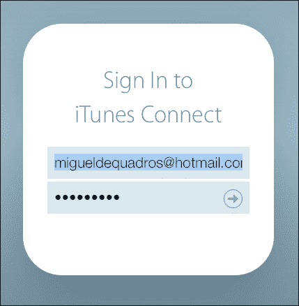

登录后，点击**我的应用**图标：

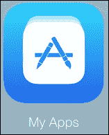

从这里，你现在将能够看到你创建的所有应用（如果有）：

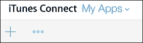

在**iTunes Connect**标志下方，只需点击**+**按钮开始创建一个新应用。你现在将看到一个下拉菜单出现，询问你想创建什么类型的应用。我们将创建一个新的 iOS 应用。

接下来，你会看到一个新弹出的窗口，要求你提供一些关于应用的基本信息，例如应用名称、应用语言、包标识符（我将在下一秒讨论它）、版本号以及应用的 SKU（对于 SKU，我实际上只是使用我填写它的时间，但你可以使用你喜欢的任何东西）：

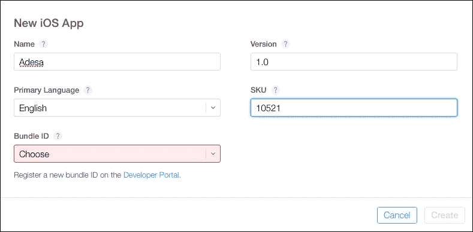

没有包标识符？只需点击**在开发者门户上注册新的包标识符**按钮，位于**包标识符**选择框下方。

从那里，只需填写所有信息，例如应用 ID 描述、前缀、后缀以及你想要包含在应用中的服务。

一旦填写完毕，返回应用创建屏幕并选择新的包标识符（如果它还没有出现，只需取消创建并重试）。

你的应用现在已经创建好了！嗯，有点儿...

下一页需要你填写有关应用的完整信息——也就是说，描述、关键词、截图、版权信息等。

现在，是时候将你的应用提交到 AppStore 进行审查了！

有两种方法可以做到这一点。一种是通过 Xcode 直接进行，第二种是通过应用程序加载器（以下图像中都可以看到这两个应用程序图标）；我们将讨论如何进行。

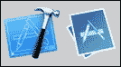

无论你选择哪种方法上传你的应用程序，两种方法都需要你进行存档。在你存档应用程序之前，我强烈建议再次进行测试，以确保一切按预期工作。

要在 Xcode 中创建存档，请确保在方案选择下选择了 **iOS 设备**。为了回顾，方案是在模拟器或你想要运行项目的 iOS 设备上的预设。以下截图显示了 **iOS 设备** 选项：

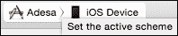

一旦选择了，只需在工具栏上点击 **产品**，然后选择 **存档**。通过存档，你实际上是将整个项目放入一个单一的、压缩的文件中，以便你可以将其上传到应用商店。

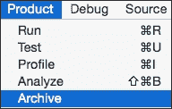

现在，你只需要等待...根据你的应用程序大小，你可能需要等待一段时间。

一旦完成，你将遇到存档窗口，该窗口将显示你为你的出色应用创建的所有存档列表：

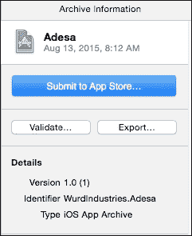

现在，通过 iTunes 验证过程验证您的应用程序是个好主意。

你怎么做？很简单！点击在 **存档** 窗口中看到的 **验证** 按钮：

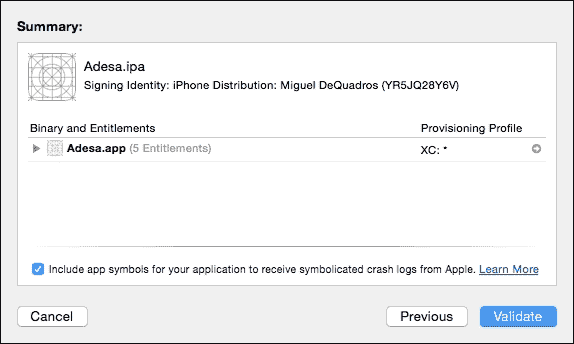

如果一切顺利，你将看到一个窗口显示已验证。然而，如果你像我一样，你将遇到错误，如下面的截图所示：

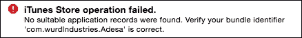

果然，我犯了一个错误，没有使用正确的配置文件。

一切都完成后，我们可以上传它！

简单地点击大型的 **提交到 App Store** 按钮！

在出现的对话框中，从弹出菜单中选择一个团队，然后点击 **选择**。

如果需要，Xcode 将为你创建一个分发证书和分发配置文件。分发配置文件的名称以文本 **XC** 开头。

在出现的对话框中，检查应用程序、其权限和配置文件，然后点击 **提交**。

Xcode 将随后将存档上传到 iTunes Connect。如果出现对话框表示找不到应用程序记录，请点击 **完成**，在 iTunes Connect 中创建应用程序记录，并重复这些步骤。

如果发现问题，点击 **完成** 并在继续之前修复它们。

如果没有发现问题，点击 **提交** 以上传你的应用程序。

现在，你已经将你的应用程序上传到 App Store！等待一封电子邮件，说明你的应用程序正在审查！

这是上传您的应用程序最简单的方法，但您也可以通过**ApplicationLoader**选项上传您的应用程序。只需打开**ApplicationLoader**标签页；您将看到**模板选择器**，它将允许您上传应用程序或上传内购内容，如下面的截图所示：

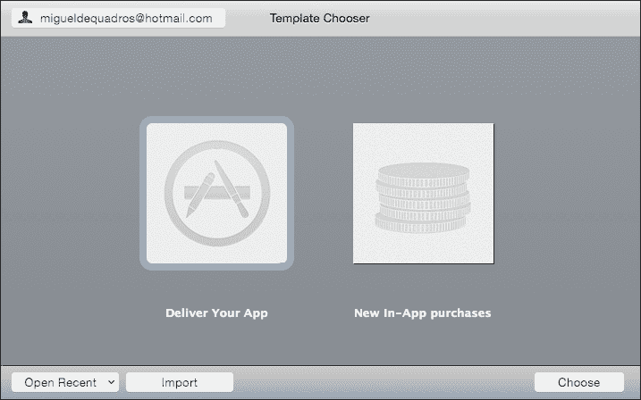

在我们点击**交付您的应用程序**之前，我们需要在 Xcode 中将项目导出为存档。

在 Xcode 中，点击**组织者**中的**窗口**，我们将回到我们应用程序的存档。现在，我们不会点击**提交到 AppStore**，而是点击**导出**。

接下来，它将询问您如何保存应用程序——**为 iOS App Store 部署保存**、**为 Ad Hoc 部署保存**或**为企业部署保存**。

选择**为 iOS AppStore 部署保存**，然后点击**下一步**，如下面的截图所示：

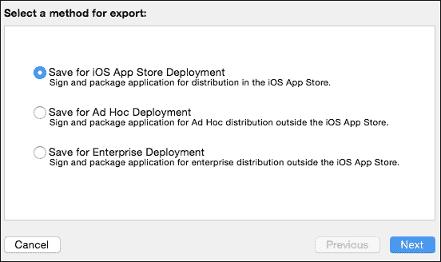

再次，它将询问您希望使用哪个开发团队；选择您正在使用的团队。

它将再次运行验证测试，然后询问您希望将存档保存到何处。

简单选择一个容易记住的位置，然后返回到**Application Loader**并点击**交付您的应用程序**。

选择您刚刚创建的应用程序。应用程序加载器将搜索应用程序，并显示一个包含所有应用程序详细信息的窗口，例如名称、版本号、SKU 号、主要语言、版权、类型和 Apple ID。

点击**下一步**。**Application Loader**开始上传您的应用程序二进制文件到 App Store。

一旦完成，您只需等待即可！

您可以随时登录到 iTunes Connect，以了解您应用程序的状态。

现在，是时候赚点钱啦！

## 赚钱的技巧

仅通过向您的应用程序收取 0.99 美元（或您所在国家的类似转换）来赚钱并不是唯一的方法。实际上，根据我的经验，这是从您的应用程序中赚钱最糟糕的方法之一。

事实上，我通过内购广告赚到的钱比通过应用程序购买的资金要多。

您能做的最好的事情就是将您的应用程序免费提供，然后加入某种广告渠道，如**iAds**、**Admob**、**Chartboost**或任何其他 iOS 兼容的广告 API。

让我们来看看一些广告 API 以及您如何注册它们并将它们集成到您的游戏中。

### iAds

由于您已经注册为 iOS 开发者，您不需要进行任何注册流程。然而，您需要（如果您还没有的话）设置适当的 iAds 合同。

要做到这一点，请登录到[itunesconnect.apple.com](http://itunesconnect.apple.com)并点击**协议、税务和银行**图标：

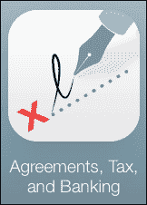

在下一屏幕，如果你还没有设置，你会看到**请求合同**。只需请求**iAd 应用网络**合同。我建议你请求所有协议，但在这个章节的这一部分，我们只需要 iAds。

一旦你点击**请求**，你将被要求提供法人实体信息——换句话说，就是有权同意合同的个人的信息。完成后，只需同意并返回合同屏幕。

当你回到合同屏幕时，你将需要填写你的银行信息、税务信息等，如下截图所示：

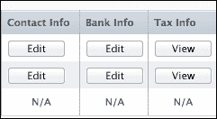

你兴奋了吗？我知道我很兴奋！以下是一些关于 iAds 的快速信息：

+   **横幅视图仅使用屏幕的一部分来显示横幅广告**：我们都见过，那些在我们玩游戏或使用应用时出现在底部的微小广告。

+   **全屏广告为 iPad 应用提供更大的广告**：我们甚至可以显示全屏广告！当玩家击败一个关卡时，这可能会很有用。你可以显示全屏广告，这样就不会打扰玩家的游戏体验。

+   **您可以在用户与广告互动时暂停非必要活动**：一旦用户点击广告，它将启动一个全屏的交互式体验。这会遮挡下面发生的一切，但幸运的是，我们可以暂停游戏中的一切，这样我们的玩家的进度就不会因为广告显示而受阻，我们的玩家也不会遇到敌人。那不会很有趣...

+   **取消广告会对你的应用产生负面影响**：如果你的应用需要用户的注意力，你可以通过编程取消交互式广告体验，并强制用户回到你的应用。然而，苹果建议你只有在绝对必要时才这样做，因为这可能会影响你的填充率。

现在我们可以开始集成！

这真的很简单，所以让我们先添加 iAds 框架到我们的项目中。你还记得如何添加框架吗？以下截图显示了如何进行此操作：

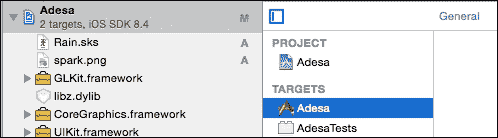

如果你不记得，不要担心！在你的 Xcode 中，在侧边栏中选择你的项目。然后，在中心窗口中，选择你的**目标**（见上一张截图），在“常规”部分，向下滚动到窗口底部，你会看到**链接的框架和库**：

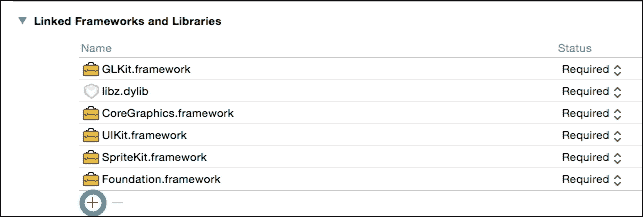

简单地点击**+**按钮来添加一个新的框架。在搜索栏中，输入截图显示的“iAd”。

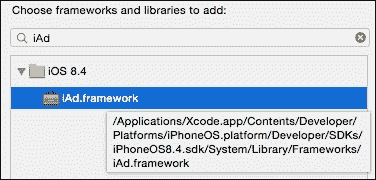

然后，点击**确定**按钮！

就这么简单！iAd 框架已正式集成到我们的项目中！现在，我们唯一要做的就是插入显示广告的代码。

我们将进入**ViewController.h**文件，并调整代码，使其看起来如下所示：

```swift
#import <UIKit/UIKit.h>
#import <SpriteKit/SpriteKit.h>
#import <iAd/iAd.h>

@interface ViewController : UIViewController <ADBannerViewDelegate> {
    ADBannerView *adView;
}

@end
```

为了解释，我们将 iAd 框架导入到`ViewController`类中，然后声明了`ViewController`类和`AdBannerViewDelegate`来控制 iAds。

然后，我们声明了`ADBannerView`变量为`adView`。

让我们进入我们的`ViewController.m`文件，并更改以下方法以显示我们的广告。加粗的文本是新增的内容：

```swift
- (void)viewDidAppear:(BOOL)animated
{
    [super viewDidAppear:animated];
    [[NSNotificationCenter defaultCenter] addObserver:self selector:@selector(handleNotification:) name:@"hideAd" object:nil];
    [[NSNotificationCenter defaultCenter] addObserver:self selector:@selector(handleNotification:) name:@"showAd" object:nil];
    // Configure the view.
    SKView * skView = (SKView *)self.view;
    skView.showsFPS = NO;
    skView.showsNodeCount = NO;

    // Create and configure the scene.
    SKScene * scene = [GameLevelScene sceneWithSize:skView.bounds.size];
    scene.scaleMode = SKSceneScaleModeAspectFill;

    // Present the scene.
    [skView presentScene:scene];
    self.canDisplayBannerAds = YES;

    adView = [[ADBannerView alloc] initWithFrame:CGRectZero];
    adView.frame = CGRectOffset(adView.frame, 0, 0.0f);
    adView.delegate=self;
    [self.view addSubview:adView];

}

- (void)handleNotification:(NSNotification *)notification
{
    if ([notification.name isEqualToString:@"hideAd"]) {
        adView.hidden = YES;
    }else if ([notification.name isEqualToString:@"showAd"]) {
        adView.hidden = NO;
    }
}
```

现在，我们将转到我们的`GameLevelScene.m`文件。让我们滚动到我们的`initWithSize`方法并添加以下代码（再次强调加粗的文本是新增的）：

```swift
-(id)initWithSize:(CGSize)size {
    if (self = [super initWithSize:size]) {
        /* Setup your scene here */
        NSLog(deviceName());

        self.userInteractionEnabled = YES;
        self.backgroundColor = [SKColor colorWithRed:.0 green:.0 blue:.0 alpha:1.0];
        self.physicsWorld.gravity = CGVectorMake(0, 0);
        self.physicsWorld.contactDelegate = self;

        if (_level == 0){
        [[NSNotificationCenter defaultCenter] postNotificationName:@"showAd" object:nil];
        SKLabelNode *playLabel = [SKLabelNode labelNodeWithFontNamed:@"AvenirNext-Heavy"];
        playLabel.text = @"Adesa";
        playLabel.fontSize = 40;
        playLabel.position = CGPointMake(self.size.width / 2.0, self.size.height / 1.7);
        [self addChild:playLabel];

        SKSpriteNode *playButton = [SKSpriteNode spriteNodeWithImageNamed:@"play"];
        playButton.position = CGPointMake(self.size.width /2.0 , self.size.height / 2.5);
        playButton.name = @"playButton";
        [self addChild:playButton];
        }

    }
    return self;
}
```

然后，我们将进一步滚动到我们的`touchesBegan:`方法，并在`if (node.name isEqualToString:@"playButton"])`方法中添加以下代码：

```swift
[[NSNotificationCenter defaultCenter] postNotificationName:@"hideAd" object:nil];
```

感到困惑？没问题！

我们所做的是设置一个通知中心来接受某些，嗯，通知。这是在不同类文件之间调用方法的一种简单方式。我们只是在我们`ViewController`类中设置了通知中心，以接收显示和隐藏横幅的通知。

为什么我们这样做？

标签页视图只能在`ViewController`类中显示。在我们的游戏中，我们只有一个视图控制器，而我们的`GameLevelScene`不是一个`ViewController`类；它是一个显示在`ViewController`类上的 SpriteKit 场景。因此，如果你在我们的场景中设置并显示标签页视图，它将不会显示，因为它是一个 SpriteKit 场景，而不是`ViewController`类。

有道理吗？

一旦你完成了所有的编码，测试一下会发生什么！

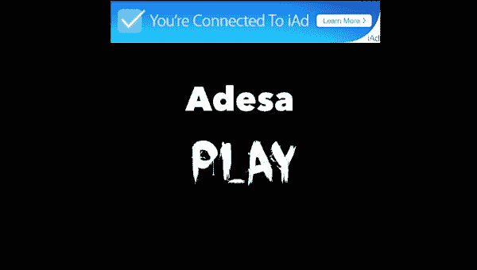

然后，当你点击播放按钮时，你会看到以下内容：

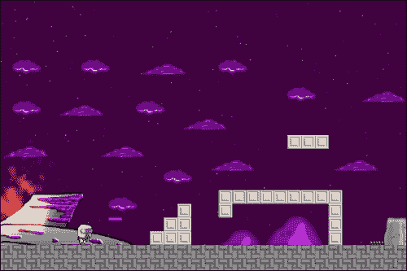

全部没有了！

请记住，直到游戏发布之前，实际上不会有广告出现；在此之前，它将显示占位符广告。

就这样！你现在正走在赚取广告收入的道路上！

现在，让我们谈谈其他的广告渠道。

### AdMob

下载框架后（你可以在谷歌上轻松找到），将其解压缩到一个容易再次找到的地方。

我们所需要做的就是右键点击左侧栏上的我们的项目，然后选择**将文件添加到（你的项目名称）**：

定位你刚刚下载的`GoogleMobileAds.framework`，并将其添加。

AdMob SDK 依赖于以下 iOS 开发框架，这些框架可能不是你的项目的一部分：

+   AdSupport

+   AudioToolbox

+   AVFoundation

+   CoreGraphics

+   CoreMedia

+   CoreTelephony

+   EventKit

+   EventKitUI

+   MessageUI

+   StoreKit

+   SystemConfiguration

一旦你导入了这些框架并引用了 AdMob SDK，Xcode 将自动链接到所需的框架。

按照谷歌自己的文档，在你的`ViewController`类中添加以下代码来设置广告：

```swift
@import GoogleMobileAds;

#import "ViewController.h"

@implementation ViewController

- (void)viewDidLoad {
 [super viewDidLoad];

 NSLog(@"Google Mobile Ads SDK version: %@", [GADRequest sdkVersion]);
}

- (void)didReceiveMemoryWarning {
 [super didReceiveMemoryWarning];
}

@end
```

现在我们项目已经引用了 SDK，让我们将其中的横幅广告添加进去。

**GADBannerView**（**GoogleAd 广告视图**）可以从故事板或代码中创建。对于常规应用，事物在 Storyboard 编辑器中组合，但相同的方法也适用于我们的游戏等，只需记住将代码保留在您的 `ViewController` 类中：

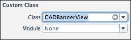

打开主故事板，在底部的右上角的 **对象库** 中搜索 `UIView`，并将一个 `UIView` 元素拖动到您的视图控制器中。然后，在右上角的 **身份检查器** 按钮中，我们将更改此视图的类为 `GADBannerView`，如前图所示：

`GADBannerView` 类需要在代码中引用以加载广告。通过导航到 **视图** | **辅助编辑器** | **显示辅助编辑器** 打开 **辅助编辑器**：

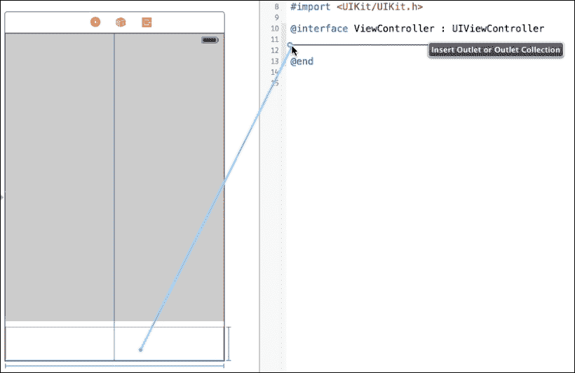

在辅助编辑器中，确保显示 `ViewController.h` 文件。接下来，按住 Control 键（或只需右键单击并拖动），点击 `GADBannerView` 元素，并将光标拖动到 `ViewController.h` 文件上。

这是将您的故事板中的出口链接到代码的最简单方法。这已经非常简化，并从编程中省去了一堆工作；以前，我们不得不手动输入出口，然后在故事板编辑器中手动链接它，这并不有趣。我们将通过以下操作添加以下代码，通过这样做，我们将导入 Google 广告框架：

```swift
@import GoogleMobileAds;

@interface ViewController : UIViewController

@property (weak, nonatomic) IBOutlet GADBannerView *bannerView;
```

然后添加以下代码，并对您 `ViewController.m` 文件中已有的方法进行必要的调整。

现在，要显示广告，只需在 `ViewDidLoad` 部分或您希望它出现的地方插入以下方法：

```swift
 NSLog(@"Google Mobile Ads SDK version: %@", [GADRequest sdkVersion]);
 self.bannerView.adUnitID = @"ca-app-pub-3940256099942544/2934735716";
 self.bannerView.rootViewController = self;
 [self.bannerView loadRequest:[GADRequest request]];
```

这（几乎）就这么简单！

需要做出一些更改。首先，您需要通过网站创建一个新的 `AppID` 变量。您只需将 ID 复制并粘贴到 `self.bannerView.adUnitID =` 后面即可。

## 实现 Chartboost！

导入框架将取决于您导入的框架。以下是 Chartboost 所需的框架：

+   StoreKit

+   CoreGraphics

+   UIKit

+   基础

您只需添加这三个中的一个。其他三个应包含在 SpriteKit 项目中。对于 Chartboost，我们需要在 `AppDelegate` 类中开始初始化应用 ID 和应用签名，这两个都在 Chartboost 网站上设置。在 `AppDelegate.m` 文件的顶部，我们需要导入以下内容：

```swift
#import <Chartboost/Chartboost.h>
#import "AppDelegate.h"
#import <CommonCrypto/CommonDigest.h>
#import <AdSupport/AdSupport.h>
```

然后，在我们的 `Application didFinishLaunchingWithOptions` 方法中，我们需要添加以下代码块：

```swift
 [Chartboost startWithAppId:@"YOUR_CHARTBOOST_APP_ID"
                  appSignature:@"YOUR_CHARTBOOST_APP_SIGNATURE"
                      delegate:self];
```

这里有一个说明，Chartboost 必须以这种方式初始化，因为它们记录应用启动来跟踪您的分析。如果您不这样做，您将不会获得任何广告。然后您会哭泣。想知道接下来是什么吗？以下代码将展示广告：

```swift
[Chartboost showInterstitial:CBLocationHomeScreen];
```

真的是这么简单！当您想要显示广告时，只需添加那行代码，然后搞定！我现在就能闻到收入的气息了！

你知道，你们都是一群了不起的听众，我真心希望你们从这本书中学到了很多。

我真的觉得你将能够轻松地创建自己的完整游戏，并通过它们轻松地赚钱。

但你知道什么...我们还没有完成。不，不！我们实际上将要讨论如何更新你的应用，以及添加多人游戏功能！

系好安全带，这一章将会非常精彩！

独自一人去太危险了...下面的图片看起来熟悉吗？

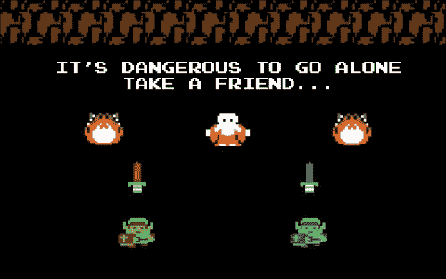

# 摘要

在这一章中，你学习了如何在 App Store 上部署你的应用，以及如何通过整合广告渠道，如 iAds、Admob 和 Chartboost，在你的发布的应用中赚钱。现在，你可以开发并部署尽可能多的应用。享受开发、部署和通过你的应用赚钱吧。
