# 第二章：*第二章*: 与 DarkMode 一起工作

我们都喜欢它……嗯，至少我们大多数人都是这样，而且那些喜欢它的人也已经期待它有一段时间了。苹果首次在 2018 年 macOS Mojave 中尝试 Dark Mode，不仅改变了用户与操作系统交互的方式，还为开发者首次构建原生深色主题应用铺平了道路。

iPhone 的 DarkMode 直到 2019 年 WWDC 才宣布，但我们都知道它即将到来，而且有了 AppKit 所提供的一切，我们知道 UIKit 将提供什么，我们将会享受到一份大礼。

在本章中，我们将涵盖您需要了解的所有内容，以便在 iOS 和 iPadOS 中启动并运行 DarkMode；从将现有应用进行调整以支持 DarkMode，到在构建我们的应用时添加的所有小而隐藏的额外功能，以确保我们为用户提供最佳体验。我们还将讨论最佳实践——注意我们可以做的那些小事，让 UIKit 中的 DarkMode 从一开始就使我们的生活变得容易得多。

本章将涵盖以下主题：

+   什么是 DarkMode？

+   在 DarkMode 中与视图一起工作

+   与资产一起工作

+   进一步探索 Dark Mode

# 技术要求

对于本章，您需要从苹果的 App Store 下载 Xcode 版本 11.4 或更高版本。

您还需要运行最新版本的 macOS（Catalina 或更高版本）。只需在 App Store 中搜索 Xcode，选择并下载最新版本。启动 Xcode，并遵循系统可能提示的任何附加安装说明。一旦 Xcode 完全启动，您就可以开始了。

从以下 GitHub 链接下载示例代码：[`github.com/PacktPublishing/Mastering-iOS-14-Programming-4th-Edition`](https://github.com/PacktPublishing/Mastering-iOS-14-Programming-4th-Edition)。

# 什么是 DarkMode？

在本节中，我们将首先探讨 Dark Mode 究竟是什么，我们如何使用它，以及它不仅对最终用户，也对开发者能做什么。我们将从在我们的设备上启用它，到在 Xcode 中使用环境覆盖以及在模拟器中的开发者选项，涵盖所有内容。

## 理解为什么我们需要 DarkMode

正如我在本章引言中提到的，我们大多数人已经非常渴望 iOS 中的 DarkMode 有一段时间了。我们开发者早在 2018 年就解决了 Xcode 的问题——但我在很多次（尤其是在过去 12 个月里）被问到的热门问题之一是……为什么？

这可能只是因为一天中的某个简单时间。卫星导航系统在我们的汽车中已经这样做了很多年——一旦太阳下山，我们的系统就会切换，屏幕上就会弹出更加轻松、微妙的回家路线——那么为什么不为我们的应用做同样的事情呢？

嗯，事实证明，一些应用程序已经这样做了一段时间（在一定程度上），尽管它们并不一定提供自动夜间模式。iOS 的 Twitter 应用在 WWDC 19 宣布之前就提供了“暗黑模式”选项。

让我们停下来，思考一下这种控制的逻辑，以及你需要改变的一切来实现这一点。我相信像 Twitter 这样的大公司已经编写了自己的内部框架来处理这个问题，但底层基本上看起来会像以下这样：

```swift
var isDarkMode = false
var profileLabel: UILabel? {
    didSet {
        profileLabel?.textColor = isDarkMode ? .white : .black
    }
}
var profileBackground: UILabel? {
    didSet {
        profileBackground?.textColor = isDarkMode ? .black : .white
    }
}
```

从文本颜色到可能装饰你的 UIButton 或 UIViews 的阴影，所有这些都需要考虑。

背景也是一个需要考虑的重大变化。许多 iOS 开发者遵循的一个常见模式是，简单地在白色画布上开发全新的应用程序；从这里开始，我们不需要担心控制背景颜色或用 IBOutlet 跟踪它——它只是我们应用程序其余部分的桌布。

在实现暗黑模式功能后，一切都需要改变——甚至那些自豪地坐在一种背景风格上的资产图像，在另一种背景下可能会消失。让我们看看在实现暗黑模式时，Xcode 附带的一些开发者功能。

## 暗黑模式的核心开发者概念

让我们先从如何在设备上开启暗黑模式来开发开始看起。如果你还没有这样做，你可以通过前往**设置** | **显示与亮度**来简单地切换它，你应该会看到以下屏幕：

![Figure 2.1 – Display and brightness

![img/Figure_2.01_B14717.jpg]

图 2.1 – 显示与亮度

你还会注意到**自动**切换选项，这让我们能够使用**日落至日出**或自定义计划，这将自动在亮暗外观之间切换（就像我们的卫星导航一样）。

现在我们已经覆盖了这一点，让我们看看 iOS 模拟器提供给开发者的选项。让我们先采取以下步骤：

1.  打开 Xcode。

1.  启动模拟器（**Xcode | 打开开发者工具 | 模拟器**）。

    在比最终用户版本的 iOS 略有不同的位置，你会在开发者设置下找到暗黑模式切换（**设置 | 开发者 | 暗黑外观**）：

![Figure 2.2 – Dark mode developer settings

![img/Figure_2.02_B14717.jpg]

图 2.2 – 暗黑模式开发者设置

与我们之前看到的复杂界面不同，我们只看到了标准的切换按钮。现在让我们看看作为开发者，我们可以用暗黑模式做些什么。

## Xcode 内部的暗黑模式

现在我们已经了解了 iOS 如何处理切换到暗黑模式，让我们看看我们，作为开发者，如何在 Xcode 中做到同样的事情。

默认情况下，所有针对 iOS 13 SDK 的新项目都将自动支持暗黑模式；然而，针对任何更早的 SDK 的构建则不会。

这对现有应用可能没有所有必要的调整来支持深色模式有些帮助，而且你不想发布更新后发现自己破坏了运行深色模式的应用。

然而，如果你将你的项目更新到 iOS 13 SDK，那么你可能会遇到这个问题，但不用担心，我们将在本章后面的 *将现有应用迁移到深色模式* 部分介绍如何让你的现有应用为深色模式做好准备。

让我们先看看故事板——我们都喜欢它们（或者讨厌它们），但多年来它们所做的一件事就是在一个比白色还要白的画布上展示自己。

让我们开始吧：

1.  打开 Xcode 并创建一个新的 **单视图 - 故事板**项目。

1.  你可以将其命名为任何你想要的名字（我将命名为“第二章 - 深色模式”）。

    你可以跟随本章的内容进行学习，或者从 GitHub 下载示例代码。

创建完成后，点击 **Main.Storyboard**，你应该会看到以下内容：

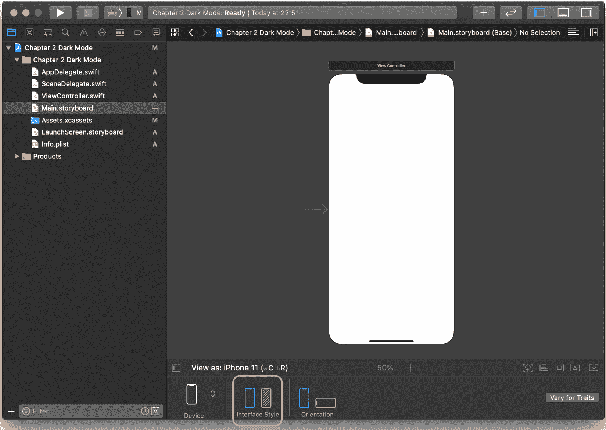

图 2.3 – Xcode 界面风格

在前面的屏幕截图中，我突出显示了我们的兴趣区域——在这里，我们可以在故事板中预览浅色和深色外观的切换，因此我们可以快速看到我们添加到画布上的对象的外观，而无需启动模拟器。

现在，这并不总是能帮到我们，因为我们的某些 UILabel 或 UIButtons 可能会通过编程方式装饰。然而，这是一个很好的开始，并且肯定会在任何应用的开发周期中派上用场。

让我们看看我们的标签在实际应用中的样子。这里，我们直接添加了一个 UILabel。**浅色外观**被选中，标签看起来就像我们在这个阶段习惯看到的那样：

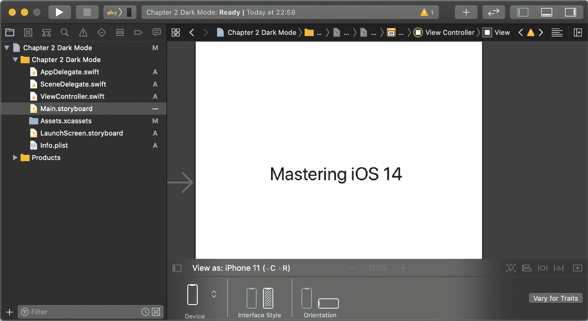

图 2.4 – 主故事板

现在，让我们切换到 **深色外观**并看看会发生什么：

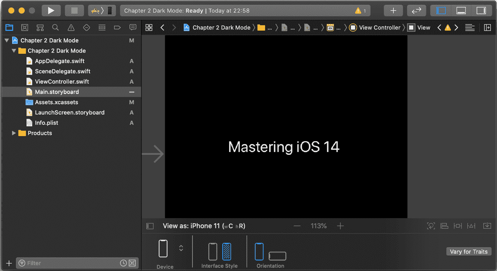

图 2.5 – 主故事板 – 深色模式

就像魔法一样，我们的画布进入了深色模式，我们的 UILabel 的颜色会自动调整。我们可以立即看到，无需在设备或模拟器上编译或运行应用，每个界面风格下的外观。

我想一百万个问题中的一个是 *iOS 是如何知道切换 UILabel 字体的颜色的？* 好问题，我们将在本章后面的 *与视图和深色模式一起工作* 部分更详细地介绍。

然而，正如我之前提到的，有些时候你需要在模拟器中测试你的应用。标签和视图不总是静态的，可能会动态生成——这就是环境覆盖的作用所在。

我们首先在模拟器中启动我们的应用。一旦成功启动，你应该在 Xcode 中看到以下高亮选项：

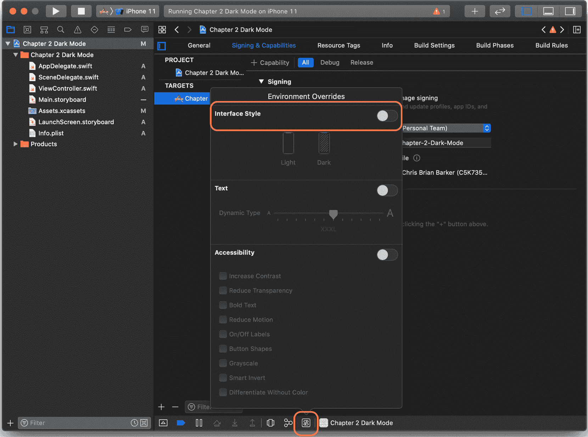

图 2.6 – 环境覆盖

点击此图标，你将看到一个 **环境覆盖** 弹出窗口。在这里，你可以选择切换 **界面样式** 覆盖，这反过来又允许你选择亮色和暗色外观。

如果你切换开关并在每个选项之间切换，你会在模拟器中看到你的应用自动更新，无需关闭应用、更改设置和重新启动。确实非常不错——感谢，Xcode！

在我们继续之前，有一点需要指出：我们之前提到，使用旧版 iOS SDK 开发的现有应用不会受到深色模式的影响，但如果你选择将你的应用更新到 iOS 13 SDK，你可能会遇到一些问题。

紧迫的截止日期和紧急的 bug 修复可能不会给你机会在你的应用中采用深色模式，所以 Xcode 给你提供了强制亮色外观的选项，无论用户的偏好如何。

在 `Info.plist`（或 `Light`：

```swift
UIUserInterfaceStyle
```

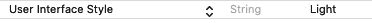

图 2.7 – Info.plist – 用户界面样式

现在，你会发现，即使在环境覆盖的情况下，你也不能切换到暗色模式。

在本节中，我们开始使用 iOS 和，更重要的是，Xcode 的深色模式，并了解了 Xcode 为我们准备开发具有亮色和暗色外观的应用所做的小事情。在下一节中，我们将开始探讨 Xcode 如何处理视图，并介绍语义“动态”颜色。

# 在深色模式下使用视图

到目前为止，在本章中，我们不仅介绍了深色模式是什么，还介绍了它从开发角度提供了什么。

在本章中，我们将进一步深入研究深色模式，看看 Xcode 如何动态处理我们的 UIView（以及从 UIView 派生的对象）。

我们首先将理解自适应和语义颜色的核心概念，并通过遵循一个简单的模式，Xcode 可以为我们做很多繁重的工作。

然后，我们将进一步深入，看看我们可用的各种语义颜色级别，包括主要、次要和三级选项，但更重要的是，我们何时会期望使用它们。

## 什么是自适应颜色？

对我来说，这是让开发者参与设计和开发他们的深色模式应用的一个重大步骤，当然，苹果公司也有兴趣让开发者体验尽可能无缝。

自适应颜色是定义特定外观的单个颜色类型或风格的一种方式。让我们直接进入 Xcode，看看我们自己的情况：

1.  回到你之前创建的项目，并突出显示你添加的 UILabel。

1.  现在，看看 **属性检查器** 窗口中的 **颜色** 属性：

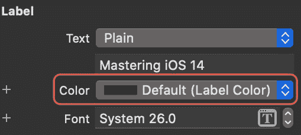

图 2.8 – 标签属性

你会注意到选中的颜色是**默认（标签颜色）**——**标签颜色**是我们的自适应颜色。

但这究竟意味着什么？实际上，这非常简单：它意味着对于一种界面风格，它是一种颜色，而对于另一种，则是不同的颜色。

在我们之前的例子中，我们的 UILabel 在浅色模式下是黑色，在深色模式下是白色——这说得通，对吧？

好吧，在某种程度上是的，但当然这取决于我们的 UILabel 所在的背景类型——让我们看看。

回到我们的故事板中，突出显示我们的视图的背景，然后再次转到**属性检查器**窗口：

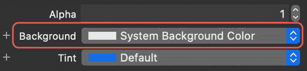

图 2.9 – 背景颜色属性

再次，这里我们有我们的自适应颜色，**系统背景颜色**。当我们需要切换外观时，Xcode 会为我们做所有的工作。

该节前面的部分是两个主要颜色（在我们的标签中使用黑色和白色）之间对比的一个很好的例子，这本身就是对浅色和深色外观中颜色应该是什么的典型理解——但我们并不总是使用黑色或白色，对吧？

因此，苹果已经更新了所有可用的系统颜色以使其具有自适应功能。让我们看看。

回到 Xcode，突出显示我们的 UILabel，并将**颜色**更改为**系统靛蓝色**：

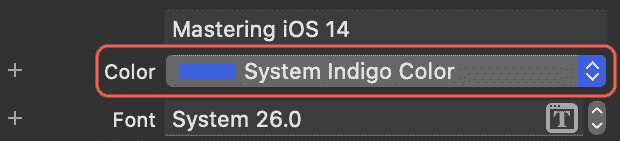

图 2.10 – 字体颜色属性

现在，让我们使用 Xcode 的故事板中的切换按钮在浅色模式和深色模式之间切换。我们看到的是什么？正是我们预期的靛蓝色：

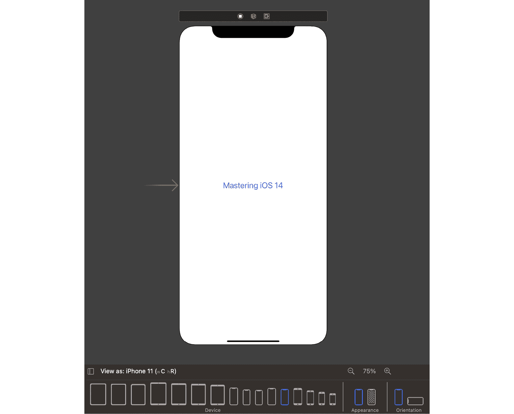

图 2.11 – 带有靛蓝色文字的浅色模式

以下截图显示了深色模式的屏幕：

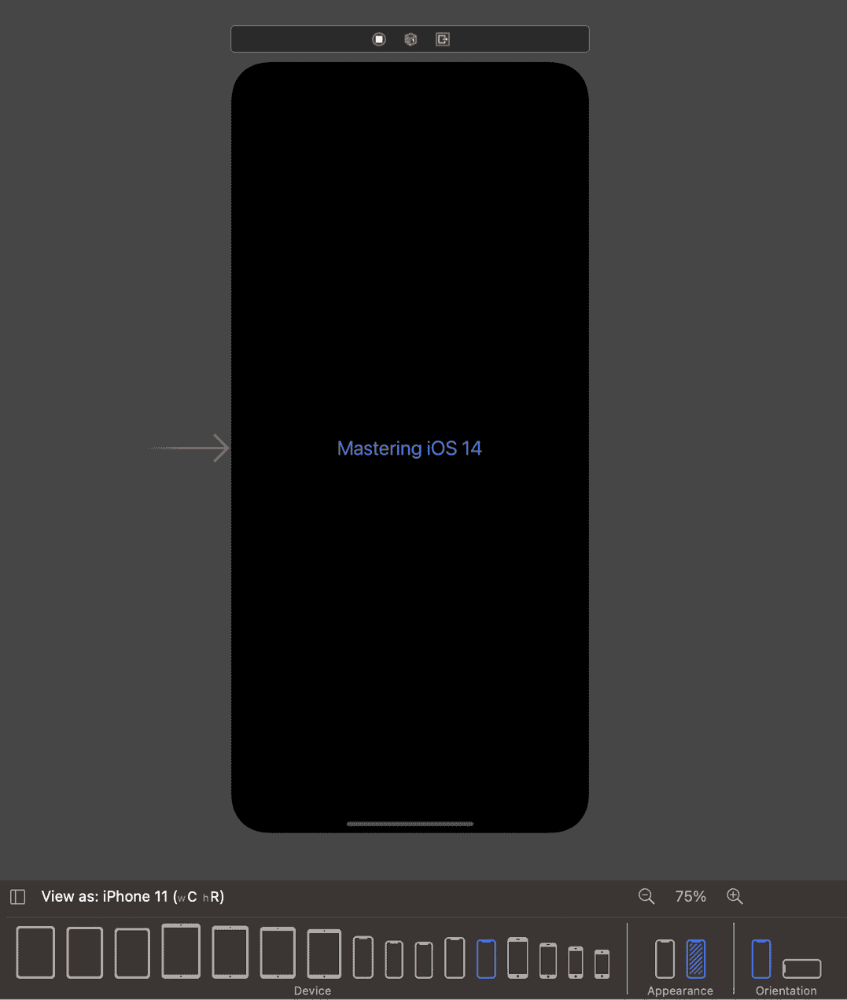

图 2.12 – 带有靛蓝色文字的深色模式

然而，每个系统颜色都已被专门调整为每个外观。让我们看看每个外观的 RGB 值：

+   `R 94: G 92: B 230`

+   `R 88: G 86: B 214`

尽管每个 RGB 值之间有细微的差别，但在外观上它有巨大的影响，并且使其能够突出显示苹果定义的（如我们的系统背景颜色）的其他自适应颜色。

现在我们已经了解了所有关于自适应颜色的知识，让我们看看语义颜色以及苹果如何帮助我们预先定义我们想要使用的颜色以及某种颜色应该在哪里使用。

## 什么是语义颜色？

要回答本节的问题，我们需要快速回顾一下我们在*什么是自适应颜色？*部分已经覆盖的内容，因为我们已经触及了语义颜色。

记得我们 UILabel 中的**标签颜色**和**系统背景颜色**吗？这些都是语义颜色——与其物理颜色无关，更多的是与其定义和预期用途有关。

通过语义颜色，苹果创建了一个专为标签、背景以及表格视图等分组内容设计的预定义的自适应颜色范围。每个颜色都有额外的首选、次要和三级变体。

让我们将这些应用到我们的当前 Xcode 项目中：

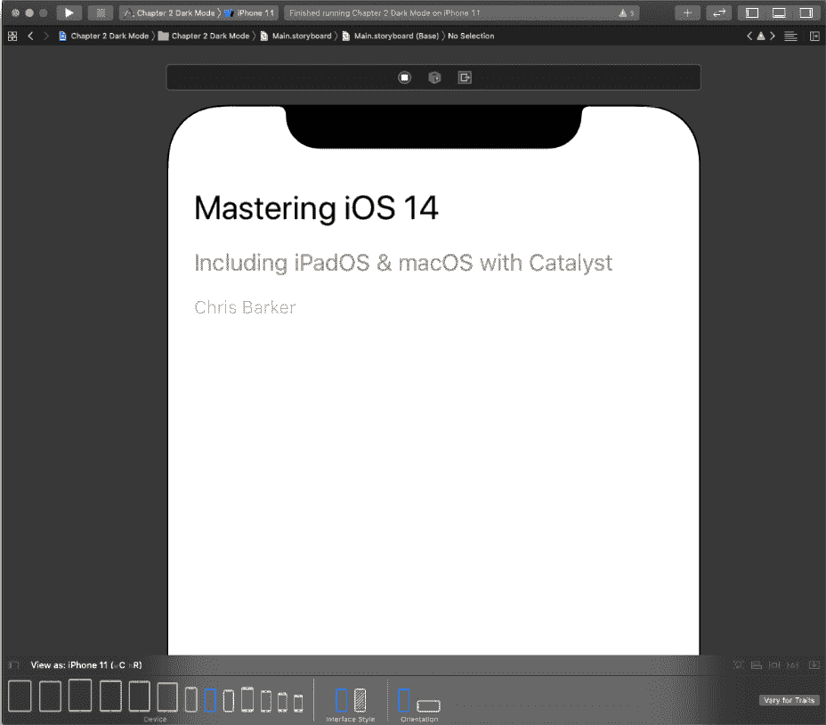

图 2.13 – 带语义变体的 UILabel

我在这里添加了几个更多的 UILabel，并做了一点简单的重新排列（没有什么特别的），但我所做的是为每个**标签**设置了相应的语义变体 – 让我们看看：

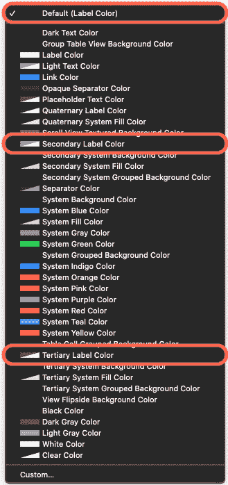

图 2.14 – 颜色选项

如果我们展开我们的 UILabel 的颜色选项，我们可以看到所有可用的预定义自适应/语义和系统以及变体颜色的列表。我突出显示了为每个新标签选择的颜色。

现在，让我们切换外观到暗色，看看效果如何：

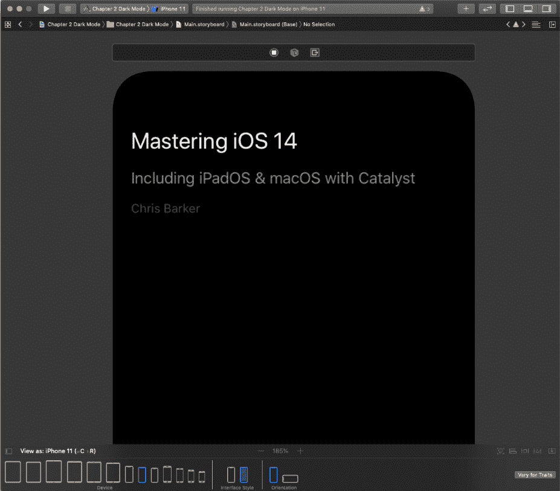

图 2.15 – 暗色模式下的语义标签

让我们更进一步，添加一些更多自适应内容。在这里，我添加了一个 UIView 作为内容之间的分隔符，一个 UIButton，它将是一个 URL 链接，以及一个 UITableView：

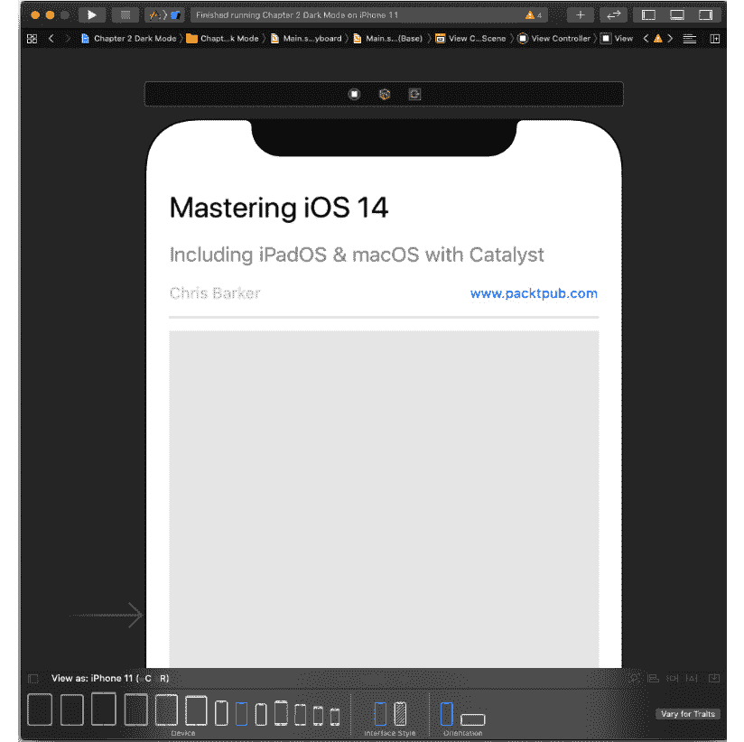

图 2.16 – 分隔符和其他背景颜色

我为我的每个新视图分配了以下语义颜色：

+   **分隔符**：**分隔符颜色**

+   **按钮**：**链接颜色**

+   **表格视图**：**分组表格视图背景颜色**

让我们在 iOS 模拟器中运行它，并看看并排效果。你会注意到一些有趣的事情：

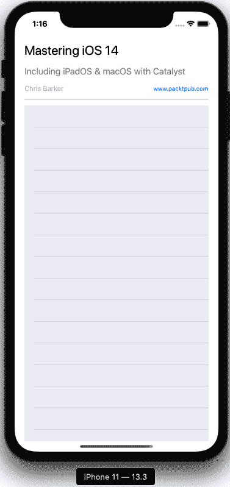

图 2.17 – 亮色和暗色模式下的表格视图

在亮色外观中，你可以清楚地看到表格视图的分组背景颜色与系统背景颜色形成对比；然而，如果我们看看暗色外观，你就不太能看到它。这是因为随着更深的背景颜色，分隔不需要那么明显；黑色对黑色不会丢失，看起来更自然，而白色对白色则不然。

所有这些都看起来在 Interface Builder 中构建得很好，但现在让我们看看我们如何以编程方式实现它。

## 使用程序化方法

让我们先为我们的每个对象创建 IBOutlets。如果你不熟悉创建出口，简单地说，在`ViewController`中，我们做以下操作：

1.  首先声明所有我们的出口属性。

1.  然后，从`IBOutlet`连接器（位于您的属性左侧），按*Command* + *主光标点击*。

1.  按住并拖动此控件到您想要连接的 UIView 或对象上。

    在单独的窗口中打开 Interface Builder 和`ViewController`将真正有助于这个过程：

    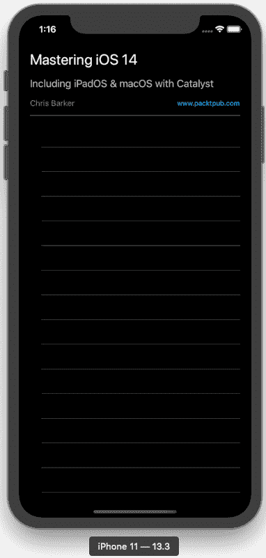

    图 2.18 – 创建出口

1.  我们需要在`ViewController.swift`文件中的类声明内创建这些。将以下突出显示的代码复制到你的类中：

    ```swift
    class ViewController: UIViewController {
        @IBOutlet weak var headerImageView: UIImageView!
        @IBOutlet weak var primaryLabel: UILabel!
        @IBOutlet weak var secondaryLabel: UILabel!
        @IBOutlet weak var tertiaryLabel: UILabel!

        @IBOutlet weak var linkButton: UIButton!

        @IBOutlet weak var separatorView: UIView!

        @IBOutlet weak var tableView: UITableView!

        override func viewDidLoad() {
            super.viewDidLoad()
        }
    }
    ```

1.  现在，我们可以通过编程方式分配我们的颜色。在`viewDidLoad()`函数内部，添加以下突出显示的代码：

    ```swift
    override func viewDidLoad() {
        super.viewDidLoad()

        primaryLabel.textColor = UIColor.label
        secondaryLabel.textColor = UIColor.secondaryLabel
        tertiaryLabel.textColor = UIColor.tertiaryLabel

        linkButton.titleLabel?.textColor = UIColor.link

        separatorView.backgroundColor = UIColor.separator

        tableView.backgroundColor = UIColor.systemGroupedBackground

    }
    ```

如果你启动模拟器中的应用，你会看到一切应该保持不变。如果我们真的想测试我们的逻辑，请回到界面构建器，并将我们的一个 UILabel 设置为**系统绿色颜色**。重新运行应用，并观察程序代码如何优先级更高并覆盖界面构建器。

在本节中，我们探讨了如何在界面构建器或通过编程方式使用自适应和语义颜色与视图一起工作，我们了解了使用颜色变体的价值，并看到了它们在浅色和深色外观中的效果。在下一节中，我们将探讨资产目录以及我们如何为我们的应用创建自定义的自适应颜色和图像。

# 使用资产目录进行深色模式的工作

由于在 Xcode 9 中添加颜色到资产目录的能力变得可用，现在有更多理由充分利用 Xcode 的宝贵资产之一。

在本节中，我们将探讨我们如何使用资产目录不仅创建我们的自定义颜色，还可以创建我们自己的自适应颜色和图像，从而让我们在开发动态外观应用时充分利用 Xcode 的功能。

## 使用自定义自适应颜色

继续使用我们当前的项目，转到文件检查器，并突出显示`Assets.xcassets`文件夹。在以下布局可见的情况下，点击以下截图中的突出显示的**+**按钮，并从选项列表中选择**新建颜色集**：

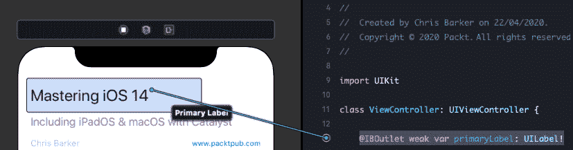

图 2.19 – 创建颜色集

添加另外三个颜色集，并命名为以下：

+   `brandLabel`

+   `brandSecondaryLabel`

+   `brandTertiaryLabel`

突出显示`brandLabel`，然后突出显示中央资产预览窗口中的选项。注意现在在**属性检查器**面板中向我们提供的属性选项列表：

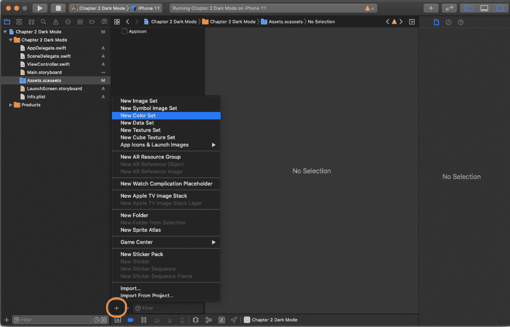

图 2.20 – 添加颜色集

如您所见，我们现在可以定义我们想要使用的`brandLabel`颜色。但首先，让我们使其自适应。在**属性检查器**面板中，将**外观**从**无**更改为**任何，浅色，深色**。

你会在下拉菜单中注意到还有一个选项是**任何，深色**，那么让我们来看看这代表什么：

+   **无**：这是一个默认颜色，不会适应你选择的外观。

+   **任何，深色**：在这种情况下，**任何**将支持你应用的旧版本，以及任何其他不是深色的变体（基本上就是浅色）。**深色**将会是深色…

+   **任何，浅色，深色**：与前面相同，但将允许你为旧版和浅色（以及深色）选择特定的值。

因此，关于这一点我们已经了解了，现在让我们添加一些颜色。正如之前提到的，这是你可以非常具体地选择颜色的地方，无论是根据个人喜好还是你必须遵循的品牌指南。对我来说，我只需要点击**显示颜色选择器**并选择我最喜欢的颜色：

+   **任何（旧版）** 和浅色使用橙汁色

+   深色模式下更细腻的**哈密瓜**色：

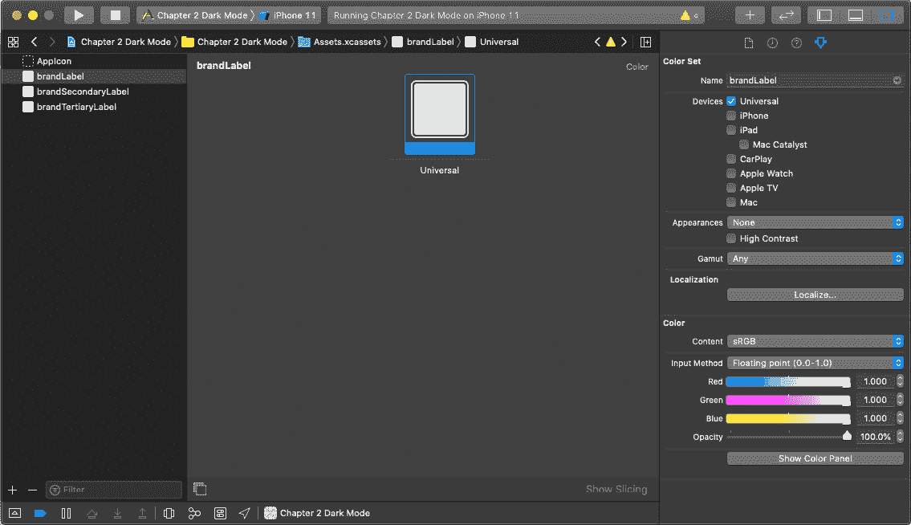

图 2.21 – 选择颜色

对于 `brandSecondaryLabel` 和 `brandTertiaryLabel` 也做同样的操作，记得根据你打算使用的语义目的稍微调整颜色。

完成这些后，回到 Interface Builder，突出显示 `primaryLabel`，然后打开 **属性检查器** 中的颜色选项。你应该会看到以下内容：

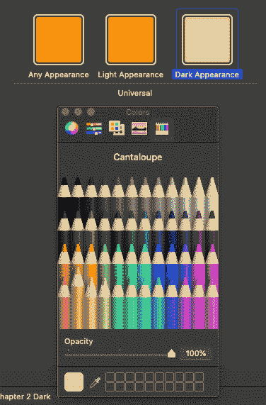

图 2.22 – 默认标签颜色

你在资产目录中创建的所有颜色集都可以在 Interface Builder 中直接使用。继续为每个标签添加它们，并通过在 Interface Builder 中切换外观来查看它们的外观：

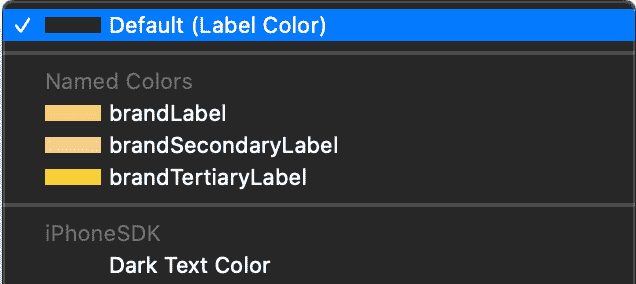

图 2.23 – 颜色集，浅色模式与深色模式

这样做之后，你就在 Xcode 的力量下为你的应用创建了自己的自适应、语义和动态颜色 – 所有这些都在 Xcode 的能力范围内。

如果你想要通过编程使用颜色，你可以通过简单地以几种不同的方式引用资产名称来实现。

首先是直接引用资产名称：

```swift
primaryLabel.textColor = UIColor(named: "brandLabel")
```

或者，你也可以通过按 *Shift* + *CMD* + *M* 并从图标选项中选择**显示颜色调板**来直接从媒体库中选择资产，并选择你想要的颜色。

这将在你的代码中直接插入来自资产目录的颜色作为色样：

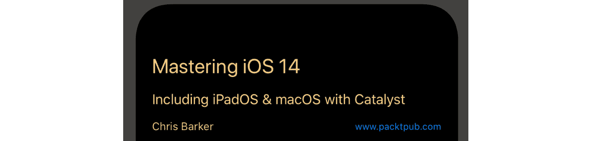

图 2.24 – 通过编程分配颜色集

或者，如果你真的想保持你的代码干净，你可以创建一个 UIColor 的扩展，允许你定义自己的属性：

```swift
extension UIColor {
    static var brandLabel: UIColor {
        return UIColor(named: "brandLabel") ?? UIColor.label
    }
}
```

现在可以这样使用：

```swift
primaryLabel.textColor = UIColor.brandLabel
```

这是一种很好、干净且易于管理的方式来通过编程管理你的自定义颜色集，但这完全是个人的偏好，各花入各眼。如果你正在处理一个大型替代颜色指南，将主颜色在一个扩展中更改，将自动将更改推广到你的整个应用，无需担心遗漏一个或两个标签。

接下来，让我们看看同样的方法，但这次是针对图像的。

## 使用自定义自适应图像

我们在前一节中学习了关于资产目录如何与自适应图像一起工作的很多知识，*自定义自适应颜色*，幸运的是，我们可以在为我们的项目创建自适应图像时充分利用这一点。

就像我们创建新的颜色集一样，让我们按照以下步骤进行：

1.  回到**Assets.xcassets**。

1.  创建一个新的图像集：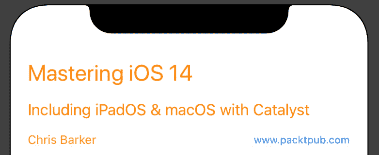

    图 2.25 – 新的图像集

1.  将你的新图像命名为**header**，高亮显示它，并在**属性检查器**窗口中将外观更改为**任何，暗**。你现在应该会看到以下内容：


图 2.26 – 添加新的图像集

当向图像目录添加图像时，你会得到添加**1x**、**2x**或**3x**图像的选项 – 这些是你可以为不同屏幕大小设置的不同图像比例。有关更多信息，请参阅以下来自 Apple 文档的内容。

对于这个示例，我们将向**2x**选项添加两张不同的图像：一张用于**任何**，另一张用于**暗**。你可以从 GitHub 中找到我使用的示例项目中的图像，或者选择你自己的图像 – 这取决于你。从 Finder 中，只需将图像拖放到 Xcode 中**2x**占位符即可。完成操作后，你应该会看到以下内容：


图 2.27 – 新的图像集变体

现在，回到你的故事板，并在项目中添加一个 UIImageView。将其添加到`ViewController`的顶部以作为头部。

一旦设置好，请转到**属性检查器**面板，并选择**图像**选项的下拉菜单 – 在那里，你应该能看到你新创建的资产，**头部**：

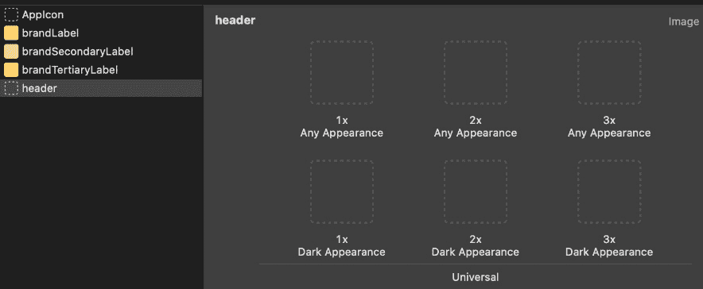

图 2.28 – 从图像集中设置头部

选择它并查看（根据你选择的图像大小，你可能需要将**内容模式**设置为**填充** – 这些选项也可以在**属性检查器**中找到）。

运行模拟器并查看本章到目前为止你所取得的成就，记得通过使用 Xcode 中的环境覆盖来在亮模式和暗模式之间切换…看起来相当不错，对吧？

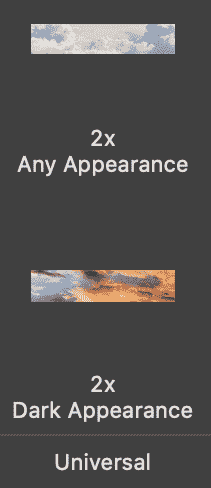

图 2.29 – 亮模式与暗模式下的头部灯光

就像我们处理颜色集一样，如果我们愿意，当然可以以编程方式处理。让我们给我们的应用程序添加另一个扩展来处理这一点：

```swift
extension UIImage {
    static var header: UIImage {
        return UIImage(named: "header") ?? UIImage()
    }
}
```

我们可以再次像之前一样使用：

```swift
headerImageView.image = UIImage.header
```

我们通过将头部图像直接分配给我们的 UIImageView 来实现这一点。

在本节中，我们利用了资产目录的力量，使我们能够为我们的应用创建自定义的适应性和动态颜色和图像。在下一节中，我们将探讨如何利用我们迄今为止所学的一切来最佳地更新遗留应用以支持深色模式，以及如何最佳地识别我们可以做的那些小事来为各种外观确保我们的应用未来可兼容。

# 进一步探索深色模式

在前面的章节中，我们向您介绍了在特定情况下创建或迁移现有应用至深色模式时需要考虑的许多因素。在本节中，我们将探讨一些应该始终牢记在心的“小贴士”，这些小贴士在您接近深色模式时应该放在心中。

## 使用 SwiftUI 深色模式

2019 年 6 月宣布 SwiftUI 以来，对基于 UI 的开发的关注发生了巨大转变。与深色模式同时发布，正如预期的那样，SwiftUI 充分利用了外观切换。

让我们先看看如何在 SwiftUI 中程序化地检测深色模式：

1.  首先，我们将创建一个环境变量，使我们能够访问设备当前的外观状态：

    ```swift
    @Environment(\.colorScheme) var appearance
    ```

1.  接下来，让我们使用一个简单的三元运算符根据当前外观显示一些文本：

    ```swift
    Text(appearance == .dark ? "Dark Appearance" : "Light Appearance")
    ```

真的是非常简单。

现在，让我们看看自动预览窗口中可用的选项。SwiftUI 使用 `PreviewProvider`，它允许我们动态地显示我们正在设计/开发的内容。

要在 `PreviewProvider` 中启用深色模式，只需添加以下突出显示的代码并启用热刷新：

```swift
struct ContentView_Previews: PreviewProvider {
    static var previews: some View {
        ContentView()
            .environment(\.colorScheme, .dark)
    }
}
```

在这里，我们添加了一个修改器来设置 `.colorScheme` 环境变量为 `.dark`。如果我们想并排预览 `.light` 和 `.dark`，我们可以简单地做以下操作：

```swift
struct ContentView_Previews: PreviewProvider {
    static var previews: some View {
        Group {
            ContentView().environment(\.colorScheme, .light)
             ContentView().environment(\.colorScheme, .dark)
        }
    }
}
```

小贴士

要了解更多关于 SwiftUI 的信息，请查看 Packt Publishing 提供的 *Learn SwiftUI*：[`www.packtpub.com/business-other/learn-swiftui`](https://www.packtpub.com/business-other/learn-swiftui)。

## 使用特性集合程序化处理变化

在开发您的新应用期间，可能会有一些场合需要根据当前的外观处理特定的场景。然而，我们需要采取与之前在 SwiftUI 示例中不同的方法来处理这个问题。

接口样式是 `UITraitCollection` 类的一部分（它反过来又是 UIKit 的一部分）。我们可以在 `ViewController` 中的任何地方使用以下方式对值进行条件检查：

```swift
traitCollection.userInterfaceStyle == .dark
```

与 SwiftUI 不同，我们不能简单地使用三元运算符，因为 `userInterfaceStyle` 有超过两个值：

```swift
public enum UIUserInterfaceStyle : Int {
    case unspecified
    case light
    case dark
}
```

**未指定**也是一个选项（想想我们资产目录中的 **Any**），因此在检测我们界面样式的变化时最好使用另一种方法。

让我们先回到我们的 `ViewController.swift` 文件，并添加以下 `override` 函数：

```swift
override func traitCollectionDidChange(_ previousTraitCollection: UITraitCollection?) {
    super.traitCollectionDidChange(previousTraitCollection)
    // Logic here    
}
```

每当对特性（如外观）进行更改时，都会调用此重写方法。从这一点出发，我们现在可以采取任何我们想要进行的更改，但我们面临的问题是特性不仅用于外观，而且这个重写方法可能因各种原因而被调用。

因此，如果我们特别关注外观的变化，我们可以使用传递给我们的代理函数的 `previousTrait` 属性，并与当前系统特性进行比较——如果有差异，我们就知道外观已经改变。让我们看看我们如何做到这一点：

```swift
override func traitCollectionDidChange(_ previousTraitCollection: UITraitCollection?) {
    super.traitCollectionDidChange(previousTraitCollection)
    let interfaceAppearanceChanged = previousTraitCollection?.hasDifferentColorAppearance(comparedTo: traitCollection)
}
```

通过使用 `hasDifferentColorAppearance` 方法，我们现在可以轻松地比较之前的特性与当前的特性，看看是否有任何变化——这个方法返回一个布尔值，因此我们可以方便地使用它。

## 为视图、ViewController 和窗口指定外观

在某些情况下，你可能希望根据你的应用程序的特定区域指定外观，或者如果你正在迁移到暗黑模式（但需要更多时间来实现某个功能）。只需插入以下适当的代码即可满足你的需求。

### 视图

在这里，我们将创建并实例化一个基本的 UIView：

```swift
let view = UIView()
view.overrideUserInterfaceStyle = .dark // .light
```

我们分配亮色或暗色值。

### ViewController

如果我们想在 UIViewController 中实现这个功能，我们只需做以下操作：

```swift
overrideUserInterfaceStyle = .dark
```

再次强调，我们通常在 `viewDidLoad()` 方法中分配亮色或暗色值（通常如此）。

### 窗口

如果我们需要访问当前窗口，可以按照以下方式操作：

```swift
for window in UIApplication.shared.windows {
    window.overrideUserInterfaceStyle = .dark
}
```

（这不是一个推荐的方法，而且你很难找到任何真正的理由想要这样做……）

## 暗黑模式下的可访问性

询问一下，有人会开玩笑说 **暗黑模式** 在 iOS 中已经存在多年了，无论是作为 **经典反转** 还是 **智能反转** 的可访问性功能。我甚至在官方宣布暗黑模式两个月前的一个会议幻灯片中提到了它。

但考虑到这一点，关于 iOS 中可访问性的讨论开始增多——一些评论将暗黑模式称为“苹果终于支持可访问性”，这让我非常难过。

无论外观如何，可访问性始终在 iOS 中扮演着重要角色——但是，即使引入了暗黑模式，这一点仍然没有改变，因为暗黑模式支持所有可访问性功能。

如果你回顾本章早先的部分，*暗黑模式的核心开发概念*，你会记得我们提到了可以安排我们的亮色和暗色外观——就像你可以在 iOS 9 中使用的 Nightshift 一样，这同样是一个关注可访问性的元素。

在本节中，我们在暗黑模式方面做了一些创新，脱离了基本实现，使我们能够查看可用的更广泛选项以及在我们应用程序中实现暗黑模式时需要考虑的事情。

# 摘要

在本章中，我们详细介绍了深色模式的相关内容——不仅从编程的角度，还包括了我们应用中使用的颜色外观和目的背后的理论。

我们首先查看 Xcode 和 iOS 如何为深色模式进行设置，学习了 Xcode 中使用的环境覆盖，以及我们如何在开发过程中切换 Storyboard 中的外观。

接下来，我们介绍了自适应和语义颜色，并学习了如何使用苹果的默认系统颜色，以及我们如何自己创建动态和自适应的颜色集。

在学习了颜色集之后，我们将这些知识应用到图像上，并利用了资产目录的力量。

最后，我们介绍了一些“值得了解”的主题，例如 SwiftUI 中的深色模式、程序化召唤外观以及无障碍性。

在下一章中，我们将探讨 iOS 14 中的列表，涵盖关于 UITableViews 和 UICollectionViews 你需要知道的一切。

# 进一步阅读

+   **苹果人机界面指南（深色模式）**: [`developer.apple.com/design/human-interface-guidelines/ios/visual-design/dark-mode/`](https://developer.apple.com/design/human-interface-guidelines/ios/visual-design/dark-mode/)

+   **苹果人机界面指南（颜色）**: [`developer.apple.com/design/human-interface-guidelines/ios/visual-design/color/`](https://developer.apple.com/design/human-interface-guidelines/ios/visual-design/color/)

+   **资产目录参考**: [`developer.apple.com/library/archive/documentation/Xcode/Reference/xcode_ref-Asset_Catalog_Format/index.html`](https://developer.apple.com/library/archive/documentation/Xcode/Reference/xcode_ref-Asset_Catalog_Format/index.html)
