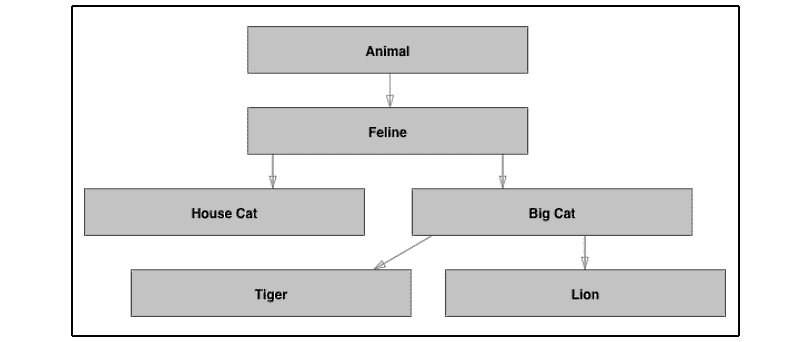

# 第七章：*第七章*：使用协议、泛型和扩展实现灵活的代码

经验丰富的程序员（或应该知道）面向对象编程（**OOP**）的核心概念。它已经存在了一段时间，并且塑造了我们许多人开发软件的方式。但相对较新的范式以协议的形式出现，即**协议导向编程**（**POP**）。POP 并不是作为 OOP 的替代品，但近年来它获得了很大的关注，尤其是在 Swift 社区中。

在本章中，我们将学习关于 POP（Post Office Protocol）所需了解的一切，从标准实现到关联类型，再到泛型。到本章结束时，你将对自己在应用中实现 POP 以及理解它所能提供的内容充满信心。

本章将涵盖以下主题：

+   理解和实现协议

+   充分利用扩展

+   使用泛型增加灵活性

# 技术要求

对于本章，你需要从 Apple 的 App Store 下载 Xcode 版本 11.4 或更高版本。

你还需要运行最新的 macOS（Catalina 或更高版本）。只需在 App Store 中搜索`Xcode`，选择并下载最新版本。启动 Xcode，并遵循系统可能提示的任何附加安装说明。一旦 Xcode 完全启动，你就可以开始了。

从以下 GitHub 链接下载示例代码：[`github.com/PacktPublishing/Mastering-iOS-14-Programming-4th-Edition/tree/master/Chapter%207%20-%20Playground/Protocols.playground`](https://github.com/PacktPublishing/Mastering-iOS-14-Programming-4th-Edition/tree/master/Chapter%207%20-%20Playground/Protocols.playground)

# 理解和实现协议

Swift 和`UIKit`的设计核心是协议。你可能注意到了这一点，当你实现自定义`UIViewController`过渡，或者当你处理表格视图或集合视图时。当你实现这些功能时，你创建的对象充当过渡、表格视图和集合视图的代理，并将它们符合特定的协议。当你在*第五章*“使用动画沉浸你的用户”中处理视图控制器过渡时，我们也实现了一个符合`UIViewControllerAnimatedTransitioning`的`NSObject`子类。

说到这里，让我们更深入地探讨一下我们如何创建和设计自己的协议，以便在 Swift 应用中使用。

## 定义自己的协议

协议不仅限于代理行为。定义一个协议与定义一个类、结构体或枚举非常相似。主要区别在于，协议本身不实现或存储任何值。它充当调用符合协议的对象与声称符合协议的对象之间的合同。

让我们通过编写一些代码来看看这个例子，我们将创建一个新的游乐场来完成这个任务。

让我们实现一个简单的协议，定义任何声称自己是宠物的对象应满足的期望。该协议将被称为 `PetType` 协议。在 UIKit 和 Swift 标准库中定义的协议使用 `Type`、`Ing` 或 `Able` 作为后缀来表示协议定义的是行为而不是具体类型。你应该尽可能遵循这个约定，因为它使你的代码对其他开发者更容易理解：

```swift
protocol PetType {

    var name: String { get }
    var age: Int { get set }
    static var latinName: String { get }

    func sleep()

}
```

`PetType` 的定义表明，任何声称自己是 `PetType` 的对象必须有一个只读变量（一个常量）称为 `name`，一个可以更改的 `age`（因为它指定了 `get` 和 `set`），一个使宠物休息的 `sleep()` 方法，以及最后，一个静态变量，用于描述 `PetType` 的拉丁名。

每当你定义一个协议要求存在某个变量时，你也必须指定该变量应该是可获取的、可设置的，还是两者都可以。如果你指定必须实现某个方法，你就像平常一样编写该方法，但你在第一个花括号处停止。你只写下方法签名。

协议还可以要求实现者有一个静态变量或方法。对于 `PetType` 来说，这是方便的，因为宠物的拉丁名不一定属于某个特定的宠物，而是属于宠物所属的整个物种，因此将此作为类型的属性而不是实例的属性来实现是非常有意义的。

为了展示一个像 `PetType` 这样的小协议有多强大，你将实现两个宠物：一只猫和一只狗。你还将编写一个函数，它接受任何宠物，然后通过调用 `sleep()` 方法让它们打盹。

对于这个协议的面向对象方法，可以创建一个名为 `Pet` 的类，然后创建两个子类，`Cat` 和 `Dog`。`sleep()` 方法将接受一个 `Pet` 的实例，它看起来可能像这样：

```swift
func sleep(pet: Pet) {
    pet.sleep()
}
```

请不要误解，前面提到的面向对象的方法是有效的，在如此小的规模上，不会出现真正的问题。

然而，当继承层次结构增长时，你通常会得到一些基类，这些类中包含的方法只与少数几个子类相关。或者，你可能会发现自己无法向某个类添加某些功能，因为继承层次结构在一段时间后就会阻碍。

让我们看看当你使用 `PetType` 协议解决这个挑战而不使用任何继承时，它看起来会是什么样子：

```swift
struct Cat: PetType {

    let name: String
    var age: Int
    static let latinName: String = 'Felis catus'

    func sleep() {
        print('Cat: Zzzz')
    }

}
struct Dog: PetType {
    let name: String
    var age: Int
    static let latinName: String = 'Canis familiaris'

    func sleep() {
        print('Dog: Zzzz')
    }

}
func nap(pet: PetType) {
    pet.sleep()
}
```

我们刚刚成功实现了一个可以同时接受 `Cat` 和 `Dog` 对象并使它们打盹的单个方法。

代码不是检查类型，而是检查传入的宠物是否符合`PetType`协议，如果符合，则可以调用其`sleep()`方法，因为协议规定任何`PetType`实例都必须实现`sleep()`方法。这引出了本章的下一个主题：检查特性而不是类型。

## 检查特性而不是类型

在经典的面向对象编程中，你通常会创建超类和子类来将具有相似能力的对象分组在一起。如果你用类大致模拟动物王国的猫科动物群体，你最终得到的图示看起来像这样：



图 7.1 – 面向对象流程

如果你尝试模拟更多的动物，你会发现这是一个复杂的工作，因为一些动物虽然彼此在类图中相距甚远，但它们共享许多特性。

一个例子是猫和狗通常被当作宠物。这意味着它们可以有一个所有者，也许还有一个家。但猫和狗并不是唯一被当作宠物的动物，因为鱼、豚鼠、兔子甚至蛇也被当作宠物。

要找到一种合理的方式重新结构化你的类层次结构，以便你不必在层次结构中的每个宠物上重复添加所有者和家，这将是困难的，因为不可能有选择性地将这些属性添加到正确的类中。

当你编写一个打印宠物家的函数或方法时，这个问题变得更糟。你可能不得不让这个函数接受任何动物，或者为具有你所需属性的每种类型编写相同的函数的单独实现。这两种方法都不合理，因为你不想重复编写相同的函数，只是参数的类不同。即使你选择这样做，最终得到一个接受`Fish`实例的打印动物家的地址的方法，将`GreatWhiteShark`实例传递给名为`printHomeAddress()`的函数也没有太多意义，因为鲨鱼通常没有家地址。当然，这个问题的解决方案是使用协议。

在上一节描述的情况中，对象主要是根据它们是什么来定义的，而不是根据它们做什么。我们关心的是动物是否属于特定的家族或类型，而不是它们是否生活在陆地上。你不能区分会飞的动物和不会飞的动物，因为并非所有鸟类都会飞。

继承与这种思维方式不兼容。想象一下一个`Pigeon`结构的定义，看起来像这样：

```swift
struct Pigeon: Bird, FlyingType, OmnivoreType, Domesticatable
```

由于`Pigeon`是一个结构体，你知道`Bird`不是一个结构体或类——它是一个协议，定义了成为鸟类的一些要求。

`Pigeon` 结构体也符合 `FlyingType`、`OmnivoreType` 和 `Domesticatable` 协议。每个协议都告诉你有关 `Pigeon` 的能力或特性的信息。定义解释了鸽子是什么以及它能做什么，而不仅仅是传达它继承自某种类型的鸟类。

例如，几乎所有的鸟类都能飞翔，但也有一些例外。你可以用类来模拟这种情况，但这种方法可能很繁琐，并且可能不够灵活，这取决于你的需求和代码如何演变。

使用协议设置 `Pigeon` 结构体非常强大；你现在可以编写一个 `printHomeAddress()` 函数，并设置它以接受任何符合 `Domesticatable` 协议的对象：

```swift
protocol Domesticatable {
    var homeAddress: String? { get }
}
func printHomeAddress(animal: Domesticatable) {
    if let address = animal.homeAddress {
        print(address)
    }
}
```

`Domesticatable` 协议需要一个可选的 `homeAddress` 属性。并不是所有可以驯化的动物实际上都被驯化了。

例如，考虑一下鸽子；有些鸽子被当作宠物饲养，但大多数不是。这也适用于猫和狗，因为并不是每只猫或狗都有家。

这种方法很强大，但将你的思维从面向对象的思维模式（其中你考虑继承层次结构）转变为以特性为中心的协议导向思维模式并不容易。

让我们通过定义 `OmnivoreType`、`HerbivoreType` 和 `CarnivoreType` 来扩展示例代码。这些类型将代表动物王国中的三种主要食性类型。你可以在这些协议内部使用继承，因为 `OmnivoreType` 既是 `HerbivoreType` 也是 `CarnivoreType`，所以你可以让 `OmnivoreType` 继承自这两个协议：

```swift
protocol Domesticatable {
    var homeAddress: String? { get }
}
protocol HerbivoreType {
    var favoritePlant: String { get }
}
protocol CarnivoreType {
    var favoriteMeat: String { get }
}
protocol OmnivoreType: HerbivoreType, CarnivoreType { }
```

将两个协议组合成一个，就像你在前面的例子中所做的那样，是非常强大的，但当你这样做时要小心。

你不希望创建一个像在面向对象编程中那样疯狂的继承图；你刚刚了解到继承可能非常复杂且不灵活。

想象一下编写两个新函数，一个用于打印食肉动物的 favorite meat，另一个用于打印草食动物的 favorite plant。这些函数看起来会是这样：

```swift
func printFavoriteMeat(forAnimal animal: CarnivoreType) {
    print(animal.favoriteMeat)
}
func printFavoritePlant(forAnimal animal: HerbivoreType) {
    print(animal.favoritePlant)
}
```

之前的代码可能正是你自己会写的代码。然而，这两种方法都不接受 `OmnivoreType`。这是完全可以接受的，因为 `OmnivoreType` 继承自 `HerbivoreType` 和 `CarnivoreType`。

这与你在经典面向对象编程中习惯的方式相同，主要区别在于 `OmnivoreType` 继承自多个协议而不是一个。

这意味着 `printFavoritePlant()` 函数接受一个 `Pigeon` 实例作为其参数，因为 `Pigeon` 符合 `OmnivoreType`，而 `OmnivoreType` 继承自 `HerbivoreType`。

使用协议以这种方式组合你的对象可以极大地简化你的代码。你不需要考虑复杂的继承结构，而是可以用定义了特定特性的协议来组合你的对象。这种方法的优点是它使得定义新对象相对容易。

想象一下发现了一种新的动物，它既能飞、能游泳，又生活在陆地上。这种奇怪的新物种很难添加到基于继承的架构中，因为它与其他动物不兼容。

当使用协议时，你可以将 `FlyingType`、`LandType` 和 `SwimmingType` 协议添加到你的协议中，这样你就准备好了。任何接受 `LandType` 动物作为参数的方法或函数都会愉快地接受你的新动物，因为它符合 `LandType` 协议。

掌握这种思维方式并不简单，它需要一些练习。但每次你准备创建一个超类或子类时，问问自己为什么。如果你试图在那个类中封装某种特性，尝试使用协议。

这将训练你以不同的方式思考你的对象，在你意识到这一点之前，你的代码将会更干净、更易读、更灵活，使用协议和检查特性而不是基于对象是什么来采取行动。

正如你所见，协议不需要有很多要求；有时一个或两个就足以传达正确的含义。不要犹豫，只创建具有单个属性或方法的协议；随着时间的推移，你的项目增长和需求变化，你会为自己这样做而感到庆幸。

## 通过默认行为扩展你的协议

之前的例子主要使用了变量作为协议的要求。协议的一个小缺点是它们可能导致一些代码重复。

例如，每个 `HerbivoreType` 对象都有一个 `favoriteMeat` 变量。这意味着你必须在每个符合 `HerbivoreType` 的对象中重复这个变量。通常，你希望代码重复尽可能少，反复重复变量可能看起来像是一种倒退。

即使你不需要反复声明相同的属性也很不错，但这样做也存在一定的风险。如果你的应用程序变得很大，你不可能总是记得每个类、子类和超类。这意味着更改或删除特定属性可能会在其他类中产生不希望的结果。

在符合特定协议的每个对象上声明相同的属性并不是什么大问题；通常只需要几行代码就能做到这一点。然而，协议也可以要求符合它们的对象必须存在某些方法。

反复声明它们可能会很麻烦，尤其是如果大多数对象的实现都是相同的话。幸运的是，你可以利用协议扩展来实现一定程度的默认功能。

为了探索协议扩展，让我们将 `printHomeAddress()` 函数移动到 `Domesticatable` 协议中，这样所有 `Domesticatable` 对象都可以打印它们自己的家庭地址。你可以采取的第一种方法是立即在协议扩展中定义方法，而不将其添加到协议的要求中：

```swift
extension Domesticatable {
    func printHomeAddress() {
        if let address = homeAddress {
            print(address)
        }
    }
}
```

通过在协议扩展中定义 `printHomeAddress()` 方法，每个符合 `Domesticatable` 的对象都可以使用以下方法，而无需在对象本身中实现它：

```swift
let pidgeon = Pigeon(favoriteMeat: 'Insects',
                       favoritePlant: 'Seeds',
                       homeAddress: 'Greater Manchester,                        England')
pidgeon.printHomeAddress()
```

如果你想要实现与协议关联的默认行为，这种技术非常方便。

你甚至不需要将 `printHomeAddress()` 方法作为要求添加到协议中。然而，如果你不小心，这种方法可能会给你一些奇怪的结果。以下代码片段通过向 `Pigeon` 结构体添加 `printHomeAddress()` 的自定义实现，展示了这种奇怪结果的一个例子：

```swift
struct Pigeon: Bird, FlyingType, OmnivoreType, Domesticatable {
    let favoriteMeat: String
    let favoritePlant: String
    let homeAddress: String?

    func printHomeAddress() {
        if let address = homeAddress {
            print('address: \(address.uppercased())')
        }
    }
}
```

当你调用 `myPigeon.printHomeAddress()` 时，将使用自定义实现来打印地址。然而，如果你定义了一个函数，例如 `printAddress(animal:)`，它接受一个 `Domesticatable` 对象作为参数，将使用协议提供的默认实现。

这是因为 `printHomeAddress()` 不是协议的要求。因此，如果你在一个 `Domesticatable` 对象上调用 `printHomeAddress()`，将使用协议扩展中的实现。如果你使用与上一节相同的代码片段，但将 `Domesticatable` 协议更改为以下代码所示，两次调用 `printHomeAddress()` 将打印相同的内容，即 `Pigeon` 结构体中的自定义实现：

```swift
protocol Domesticatable {
    var homeAddress: String? { get }
    func printHomeAddress()
}
```

在大多数情况下，这种行为可能是不预期的，所以通常一个好的做法是在协议要求中定义你使用的所有方法，除非你绝对确定你想要看到的行为。

协议扩展不能持有存储属性。这意味着你不能将变量添加到协议中，为它们提供默认实现。尽管扩展不能持有存储属性，但在某些情况下，你仍然可以向协议扩展添加一个计算属性，以避免在多个地方重复相同的变量。让我们来看一个例子：

```swift
protocol Domesticatable {
    var homeAddress: String? { get }
    var hasHomeAddress: Bool { get }
    func printHomeAddress()
}
extension Domesticatable {
    var hasHomeAddress: Bool {
        return homeAddress != nil
    }

    func printHomeAddress() {
        if let address = homeAddress {
            print(address)
        }
    }
}
```

如果你想要检查一个 `Domesticatable` 是否有家庭地址，你可以添加一个布尔值的要求，`hasHomeAddress`。如果设置了 `homeAddress` 属性，`hasHomeAddress` 应该为真。否则，它应该是假的。

这个属性是在协议扩展中计算的，所以你不需要将这个属性添加到所有 `Domesticatable` 对象中。在这种情况下，使用计算属性非常有意义，因为其值的计算方式很可能在所有 `Domesticatable` 对象中都是相同的。

在协议扩展中实现默认行为使得我们之前看到的协议导向方法更加强大；你实际上可以模仿一个称为多重继承的功能，而不需要所有子类化的缺点。

简单地添加对协议的遵从可以为你的对象添加各种功能，如果协议扩展允许，你就不需要向你的代码中添加任何其他内容。让我们看看如何通过关联类型使协议和扩展更加强大。

## 使用关联类型改进你的协议

协议导向编程的一个令人惊叹的方面是关联类型的用法。关联类型是一种泛型、不存在的类型，它可以像任何实际存在的类型一样在你的协议中使用。

这个泛型的实际类型是由编译器根据其使用的上下文确定的。这个描述是抽象的，你可能不会立即理解为什么或如何关联类型可以给你的协议带来好处。毕竟，协议本身不就是一种非常灵活的方式，可以让几个不相关的对象根据它们遵守的协议满足某些标准吗？

为了说明和发现关联类型的使用，你将稍微扩展你的动物王国。你应该做的是给草食动物一个`eat`方法和一个数组来跟踪它们吃过的植物，如下所示：

```swift
protocol HerbivoreType {
    var plantsEaten: [PlantType] { get set }
    mutating func eat(plant: PlantType)
}
extension HerbivoreType {
    mutating func eat(plant: PlantType) {
        plantsEaten.append(plant)
    }
}
```

这段代码乍一看看起来不错。草食动物吃植物，这是通过这个协议确立的。`PlantType`协议定义如下：

```swift
protocol PlantType {
    var latinName: String { get }
}
```

让我们定义两种不同的植物类型和一个将用于演示前面代码中问题的动物：

```swift
struct Grass: PlantType{ var latinName = 'Poaceae'
}
struct Pine: PlantType{ var latinName = 'Pinus'
}
struct Cow: HerbivoreType {
    var plantsEaten = [PlantType]()
}
```

这里不应该有什么大的惊喜。让我们继续创建一个`Cow`实例并给它喂食`Pine`：

```swift
var cow = Cow()
let pine = Pine()
cow.eat(plant: pine)
```

这实际上并没有什么意义。牛不吃松树；它们吃草！我们需要某种方式来限制这只牛的食物摄入量，因为这种方法是不可行的。

目前，你可以给`HerbivoreType`动物喂食任何被认为是植物的东西。你需要某种方式来限制你给牛喂食的食物类型。在这种情况下，你应该将`FoodType`限制为只有`Grass`，而不必为可能想要喂食的每个`HerbivoreType`植物类型定义`eat(plant:)`方法。

你现在面临的问题是所有`HerbivoreType`动物主要吃一种植物类型，并不是所有植物类型都适合所有草食动物。这正是关联类型成为绝佳解决方案的地方。`HerbivoreType`协议的关联类型可以限制某个草食动物可以吃的`PlantType`为`HerbivoreType`定义的单个类型。让我们看看这会是什么样子：

```swift
protocol HerbivoreType {
    associatedtype Plant: PlantType
    var plantsEaten: [Plant] { get set }
    mutating func eat(plant: Plant)
}
extension HerbivoreType {
    mutating func eat(plant: Plant) {
        print('eating a \(plant.latinName)')
        plantsEaten.append(plant)
    }
}
```

第一行高亮显示的行将泛型`Plant`类型（作为一个不存在的真实类型）与协议关联起来。为`Plant`添加了一个约束，以确保它是一个`PlantType`。

第二个高亮行展示了如何将`Plant`关联类型用作`PlantType`。植物类型本身仅是符合`PlantType`的任何类型的别名，并用作我们用于`plantsEaten`和`eat`方法的类型。让我们重新定义`Cow`结构体，以查看这个关联类型的作用：

```swift
struct Cow: HerbivoreType {
    var plantsEaten = [Grass]()
}
```

将`plantsEaten`定义为`PlantType`数组，现在它被定义为`Grass`数组。在协议和定义中，植物的类型现在是`Grass`。

编译器理解这一点，因为`plantsEaten`数组被定义为`[Grass]`。让我们定义第二个`HerbivoreType`，它吃不同类型的`PlantType`：

```swift
struct Carrot: PlantType {
    let latinName = 'Daucus carota'
}
struct Rabbit: HerbivoreType {
    var plantsEaten = [Carrot]()
}
```

如果你尝试给牛喂一些胡萝卜，或者如果你尝试给兔子喂松树，编译器将抛出错误。原因在于关联类型约束允许你在每个结构体中单独定义`Plant`的类型。

关于关联类型的一个注意事项是，编译器并不总是能够正确推断关联类型的实际类型。在我们的当前示例中，如果没有`plantsEaten`数组在协议中，就会发生这种情况。

解决方案是为符合`HerbivoreType`的类型定义一个`typealias`，这样编译器就能理解`Plant`代表哪种类型：

```swift
protocol HerbivoreType {
    associatedtype Plant: PlantType
    var plantsEaten: [Plant] { get set }
    mutating func eat(plant: Plant)
}
```

当正确使用时，关联类型可以非常强大，但有时使用它们也可能因为编译器必须做的推断量而给你带来很多麻烦。

如果你忘记了一些微小的步骤，编译器可能会迅速失去对你的意图的跟踪，而且错误信息并不总是最明确的。

使用关联类型时，请记住这一点，并尽量确保你对你想要关联的类型尽可能明确。

有时，添加一个类型别名来帮助编译器比试图让编译器自己正确推断一切要好。

这种灵活性不仅限于协议。你还可以向函数、类、结构体和枚举添加泛型属性。让我们看看这是如何工作的，以及它如何使你的代码非常灵活。

# 使用泛型增加灵活性

使用泛型编程并不总是容易，但它确实使你的代码非常灵活。当你使用泛型时，你总是在你的程序简单性和代码灵活性之间做出权衡。有时引入一点复杂性以允许以其他方式不可能的方式编写代码是值得的。

例如，考虑你之前看到的`Cow`结构体。为了在`HerbivoreType`协议中指定泛型关联类型，我们在`Cow`结构体中添加了一个类型别名。现在想象一下，并不是所有的牛都喜欢吃草。也许有些牛更喜欢花朵、玉米或其他东西。你将无法使用类型别名来表达这一点。

为了表示你可能希望为每个牛实例使用不同的 `PlantType` 的情况，你可以在 `Cow` 本身添加一个泛型。以下代码片段显示了你可以如何做到这一点：

```swift
struct Cow<Plant: PlantType>: HerbivoreType {
    var plantsEaten = [Plant]()
}
```

在 `<` 和 `>` 之间，泛型类型名称指定为 `Plant`。此泛型被限制为 `PlantType` 类型。

这意味着任何将作为 `Plant` 的类型都必须遵守 `PlantType` 协议。协议将看到 `Cow` 现在有一个泛型 `Plant` 类型，因此不需要添加类型别名。当你创建 `Cow` 的实例时，你现在可以传递每个实例自己的 `PlantType`：

```swift
let grassCow = Cow<Grass>()
let flowerCow = Cow<Flower>()
```

将泛型应用于此类实例比你想象的要常见。`Array` 实例使用泛型来确定它包含的元素类型。以下两行代码在功能上是相同的：

```swift
let strings = [String]()
let strings = Array<String>()
```

第一行使用方便的语法创建了一个字符串数组。第二行使用 `Array` 初始化器，并明确指定了它将包含的元素类型。

有时，你可能会发现自己正在编写一个可以从泛型参数或返回类型中受益的函数或方法。一个泛型函数的绝佳例子是 `map`。使用 `map`，你可以将项目数组转换成不同项目的数组。你可以定义自己的简单版本的 `map` 如下所示：

```swift
func simpleMap<T, U>(_ input: [T], transform: (T) -> U) -> [U] {

    var output = [U]()
    for item in input {
        output.append(transform(item))
    }

    return output
}
```

在这里，`simpleMap(_:transform:)` 有两个泛型类型，`T` 和 `U`。这些名称是泛型的常见占位符，因此它们使任何阅读此代码的人都能清楚地知道他们即将处理泛型。

在这个示例中，该函数期望一个输入 `[T]`，你可以将其读作某种东西的数组。它还期望一个闭包，该闭包接受一个参数 `T` 并返回 `U`。

你可以将这理解为闭包从那个某种东西的数组中取出一个元素，并将其转换成另一种东西。

该函数最终返回一个 `[U]` 的数组，换句话说，是另一种东西的数组。

你可以使用 `simpleMap(_:transform:)` 如下所示：

```swift
let result = simpleMap([1, 2, 3]) { item in
    return item * 2
}
print(result) // [2, 4, 6]
```

泛型并不总是容易理解，如果你需要一些时间来适应它们，这是完全可以接受的。它们是一个强大而复杂的话题，我们可以写更多关于它们的内容。

最好的方法是使用它们，练习它们，并尽可能多地阅读有关它们的内容。现在，你应该有足够的想法和内容去思考和玩耍。

注意，泛型不仅限于结构体和函数。你还可以以相同的方式将泛型添加到你的枚举和类中。

# 摘要

在本章中，你看到了如何利用协议的强大功能来处理对象的特性和能力，而不仅仅是使用其类作为衡量其能力的唯一方式。然后，你看到了如何扩展协议以实现默认功能。这使你能够通过仅添加协议一致性来组合强大的类型，而不是创建子类。

你也看到了协议扩展如何根据你的协议要求表现，以及将协议扩展中的任何内容定义为协议要求是明智的。这使得协议行为更加可预测。

最后，你学习了关联类型的工作原理以及它们如何通过向你的协议添加泛型类型来提升你的协议水平，这些泛型类型可以针对符合你协议的每个类型进行调整。你甚至看到了如何将泛型应用于其他对象，例如函数和结构体。

本章中展示的概念相当高级、复杂且强大。要真正掌握它们的使用，你需要训练自己用特性而不是继承层次来思考。

一旦你掌握了这些，你就可以尝试协议扩展和泛型类型。如果你一开始并不完全理解这些主题，这是完全可以接受的；对于大多数有面向对象编程经验的程序员来说，这些都是全新的思维方式。

现在我们已经探索了一些关于协议和值类型的理论，在下一章中，你将学习如何通过简要回顾我们之前章节中的联系人应用来应用这些新知识，以改进你那里写的代码。
