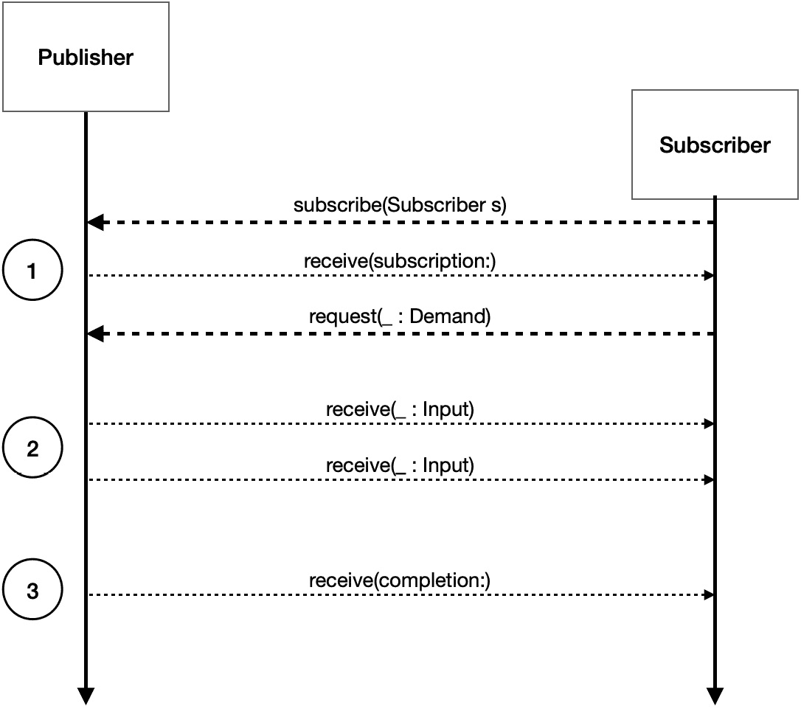
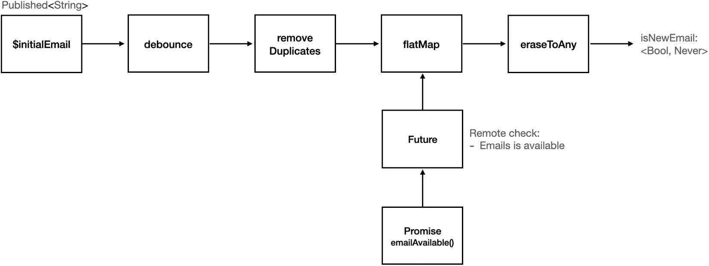
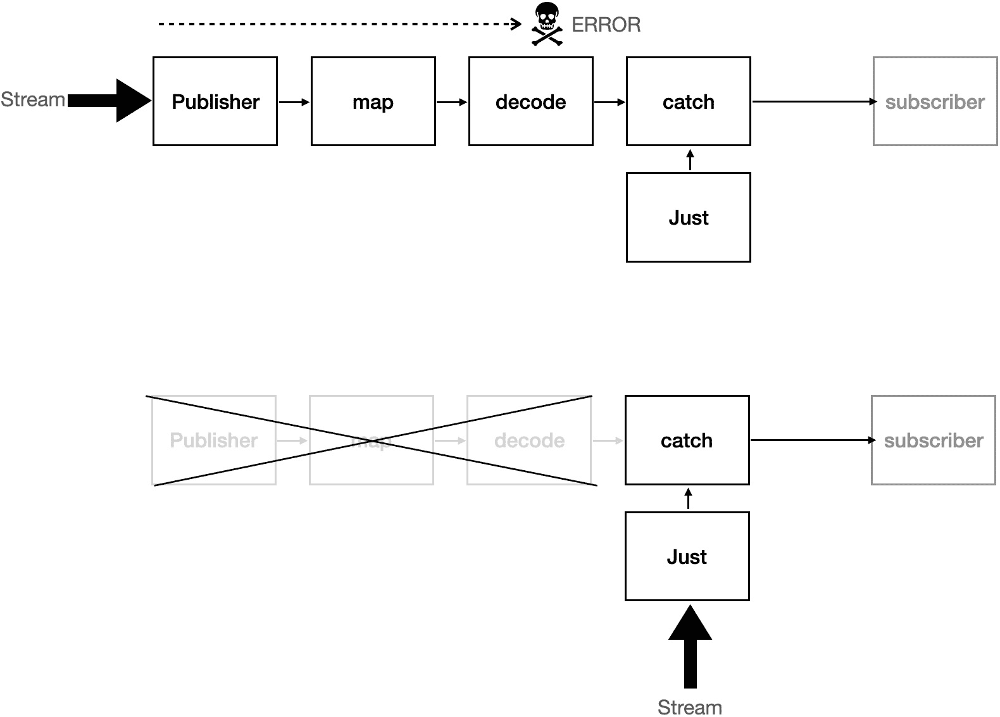
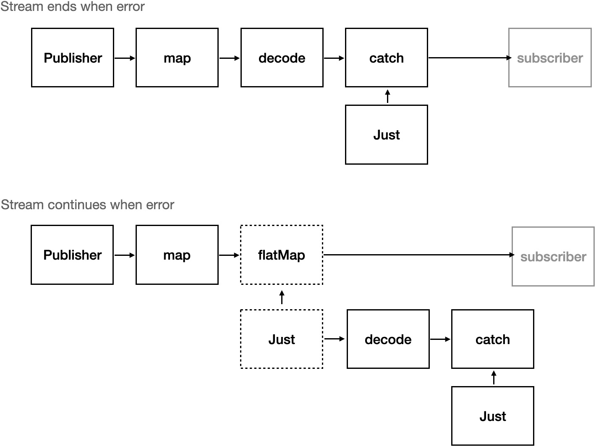

# 第十三章：*第十三章*：使用 Combine 框架

随着 **Combine** 的推出，苹果为开发者提供了一种处理代码中事件的新方法；一种函数式和声明式的方法，开发者可以轻松实现流和发布者/订阅者范式，而无需外部库。借助 Combine 在你的应用中集中处理事件，可以使你的代码比使用其他传统方法（如嵌套闭包或回调）更容易理解。

在本章中，你将学习以下主题：

+   理解 Combine 框架：我们将通过代码示例回顾框架的基本组件——发布者、订阅者、主题和操作符。

+   组合发布者、订阅者和操作符：我们将在示例应用中构建一个小功能，将所有这些概念混合在一起。

+   使用操作符构建无错误流：我们将在一个实际示例应用中使用 `flatMap` 和 `catch` 创建可以正确处理错误的流。

到本章结束时，你应该能够在你自己的应用的多个部分中使用 Combine，以生成简单、有效且易于理解的声明式代码，这将有助于你的应用代码易于理解、扩展和维护。

# 技术要求

本章的代码包包括两个起始项目，分别称为 **CombineExample_start** 和 **PublishersAndSubscribers_start**。你可以在代码包仓库中找到它们：

[`github.com/PacktPublishing/Mastering-iOS-14-Programming-4th-Edition`](https://github.com/PacktPublishing/Mastering-iOS-14-Programming-4th-Edition)

# 理解 Combine 框架

苹果在 2019 年发布了 Combine 框架，并将其定义为提供一个声明式 Swift API 以处理随时间变化的值的框架。存在 **发布者**，它们产生这些值，以及 **订阅者**，它们消费这些值。这些随时间变化的值可能代表不同的异步事件。

让我们看一下以下章节中 Publisher 和 Subscriber 协议定义的概述，以了解它们的关键概念。

## 理解发布者

如前所述，发布者在 Combine 中用于随时间生成值。让我们深入了解定义它们的 Swift 协议，以了解关键概念。Swift 中的 `Publisher` 定义如下：

```swift
public protocol Publisher {
    //1
    associatedtype Output
    //2
    associatedtype Failure : Error
    //3
    public func subscribe<S>(_ subscriber: S) where S : Subscriber, Self.Failure == S.Failure, Self.Output == S.Input
}
```

让我们更详细地解释每个编号的注释：

1.  每个 `Publisher` 实例都有一个关联的类型，`Output`。这定义了发布者将在随时间生成值的类型。

1.  同时，`Publisher` 也可以生成错误，并且相关的类型 `Failure` 用于定义这些错误的类型。如果一个 `Publisher` 永远不会生成错误，则 `Failure` 可以定义为类型 `Never`。

1.  最后，`发布者`允许`订阅者`实体`订阅`它，以接收随时间产生的值。请注意，为了生成一个有效的订阅，发布者的`Output`类型必须与订阅者的`Input`类型匹配。同样，两者的`Failure`类型也必须匹配。

下面的图显示了`发布者`的概要：


图 13.1 – 发布者概要

现在我们已经对发布者的关键概念有了初步描述，让我们对`订阅者`协议也做同样的处理。

## 理解订阅者

我们已经看到，`发布者`实体会随着时间的推移产生值。现在让我们看看`订阅者`实体如何消费这些值。在 Combine 中，`发布者`和`订阅者`紧密协作，所以让我们看看它们的内部细节。Swift 中的`订阅者`协议看起来是这样的：

```swift
public protocol Subscriber : CustomCombineIdentifierConvertible {
    //1
    associatedtype Input
    //2
    associatedtype Failure : Error
    //3
    func receive(subscription: Subscription)
    //4
    func receive(_ input: Self.Input) -> Subscribers.Demand
    //5
    func receive(completion: Subscribers.Completion<Self.Failure>)
}
```

再次，让我们回顾每一条编号的行：

1.  `订阅者`实体将随着时间的推移接收值。关联类型`Input`定义了这些值的类型。

1.  同时，`订阅者`也可以接收错误，关联类型`Failure`用于定义这些错误的类型。如果一个`订阅者`永远不会收到错误，则`Failure`可以定义为类型`Never`。

1.  此方法通知`订阅者`，对`发布者`的订阅成功，它可能开始请求元素。

1.  通知`订阅者`，`发布者`已产生一个新项目。

1.  一些订阅可能在一段时间后结束。在这些情况下，此方法被调用以通知`订阅者`它将不再接收任何值。它允许我们在完成之前执行一个完成块。

下面的图显示了`订阅者`的概要：


图 13.2 – 订阅者概要

如果我们将发布者和订阅者图结合起来，我们得到以下架构：


图 13.3 – 发布者和订阅者架构

注意发布者和订阅者的输出-输入类型和失败类型必须相等。

现在我们已经对发布者和订阅者的基本概念有了了解，让我们看看它们是如何进行通信的。这里有三个步骤，如下图中所示：



图 13.4 – 发布者和订阅者通信过程

下面的列表更详细地描述了这个过程：

1.  在第一步中，`订阅者`告诉`发布者`它想要订阅。`发布者`发送回一个订阅。`订阅者`使用该订阅开始请求元素。订阅者可以从 N 个值请求到无限值。

1.  现在`发布者`可以自由地随时间发送这些值。`订阅者`将接收这些输入。

1.  在不期望无限值的订阅中，会向 `Subscriber` 发送一个完成事件，使其知道订阅已结束。

现在我们对发布者和订阅者有了基本的概念，也知道它们通信的步骤。这就足够理论了！这里有一个单发布者向订阅者发送数组值的实际示例。你可以在新的 Xcode playground 中尝试以下代码：

```swift
import Cocoa
import Combine
//1
let publisher = [1,2,3,4].publisher
//2
let subscriber = publisher.sink { element in
  print(element)
}
```

在第一个注释中，我们创建了一个包含从 1 到 4 的整数的数组，并使用 Sequence 协议的便利实例属性 `publisher` 将其包装在一个新的 `Publisher` 实例中。

在第二个注释中，我们使用 `sink` 方法将订阅者附加到发布者上，并在其完成块中定义了一个在接收到的每个值上执行的操作。

如果你执行此代码，输出将如下所示：

```swift
1
2
3
4
```

初始数组包含从 1 到 4 的数字，这就是我们打印的内容。但如果我们只想打印偶数呢？我们如何转换生产者和订阅者之间的数据？幸运的是，Combine 提供了 **操作符** 来帮助我们。让我们接下来了解更多关于它们的信息。

## 理解操作符

`filter`、`map`、`reduce`、`scan`、`combineLatest`、`merge` 和 `zip`。

### 使用 `filter`

`filter` 操作符用于从流中移除匹配某些条件的值。

让我们通过使用 `filter` 操作符的基本示例来看看。想象一下，从之前的数组 `[1,2,3,4]` 中，我们只想打印数组的偶数。我们这样做：

```swift
import Cocoa
import Combine
let publisher = [1,2,3,4].publisher
let subscriber = publisher
  .filter { $0 % 2 == 0}
  .sink { print($0) }
```

注意 `filter` 操作符位于发布者和订阅者之间，并以声明式的方式定义了元素的修改。

如果你运行此代码，你将在控制台获得以下结果：

```swift
2
4
```

现在让我们看看另一个示例，说明操作符在处理 Combine 时是多么有用。记住，订阅者和发布者的第一条规则是订阅者的 `Input` 必须等于发布者的 `Output`。当它们不相等时会发生什么？嗯，操作符可以帮助我们将发布者的 `Output` 转换为适应订阅者适当的 `Input` 类型。帮助我们的一个操作符是 `map`。

### 使用 `map`

`map` 操作符帮助我们应用某种操作到流中的每个值，将其转换为不同的类型。

以下代码使用 `map` 操作符将发布者的 `Output`（整数值）转换为订阅者需要的 `Input`（`User` 实例）：

```swift
let publisher = [1,2,3,4].publisher
let subscriber = publisher
  .map { return User(id: $0)}
  .sink { print($0.description()) }
```

`map` 操作符将一个 `Int` 值流 `['1,2,3,4']` 转换为一个 `User` 实例流。当我们使用 `sink` 时，我们可以调用这些用户的 `description()` 方法。


图 13.5 – 使用 `map` 在流上转换输出

上一图表示了`map`如何改变**输出**类型（而在这个例子中，**失败**类型保持不变）。当使用 Combine 工作时，使用这种类型的图（在文档中或在心中）对于在流的每个步骤中处理正确的类型非常有帮助。

可用的算子不仅限于`filter`和`map`。让我们看看其他有用的算子，如`reduce`、`scan`、`combineLatest`、`merge`和`zip`。

### 使用 reduce

`reduce`算子返回使用给定操作应用的所有流值的组合结果。

你可以在 Xcode playground 中尝试以下示例。继续并检查`reduce`的以下示例：

```swift
import Combine
let reduceExample = [1,2,3,4].publisher
  .reduce(1, { $0 * $1 })
  .sink(receiveValue: { print ("\($0)", terminator: " ") })
```

如果你执行此代码，控制台中的输出如下：

```swift
24
```

如果你已经使用了 Swift 标准库中的常规`reduce`函数，那么 Combine 中的`reduce`版本应该很容易理解。它的工作方式相同，但使用来自发布者的值。`reduce`所做的是应用一个操作并累积下一个值的累积结果，从给定的值开始。在我们的例子中，`1, { $0 * $1 }`，第一个参数是初始值，因此是`1`，接下来的参数是要执行的操作：将当前值（存储为`$0`）乘以下一个传入的值（`$1`），并保留它以供下一次迭代。因此，如果我们的输入是`[1,2,3,4]`并且我们的起始值是`1`，那么`reduce`所做的是*1 x 1 x 2 x 3 x 4 = 24*。我们将要解释的下一个算子与`reduce`非常相似。让我们跳到`scan`。

### 使用 scan

与`reduce`非常相关的算子是`scan`。`scan`算子与`reduce`完全相同，但它会在每个步骤中发出结果。查看以下代码：

```swift
import Combine
let scanExample = [1,2,3,4].publisher
  .scan(1, { $0 * $1 })
  .sink(receiveValue: { print ("\($0)", terminator: " ") })
```

现在，执行此操作将产生以下输出：

```swift
1 2 6 24
```

如您所见，它给出了与`reduce`相同的最终结果（`scan`在每个步骤中发出一个值，而不是仅在结束时。因此，使用`scan`，我们得到以下随时间变化的值：

+   1x1 = **1**

+   1x2 = **2**

+   2x3 = **6**

+   6x4 = **24**

这些算子（`filter`、`map`、`reduce`和`scan`）帮助我们转换来自另一个发布者的值。但一些算子将多个发布者的输入组合成一个单一的流输出。让我们看看其中的一些：`combineLatest`、`merge`和`zip`。

### 使用 combineLatest

这是一个将两个其他发布者的最新值组合在一起的发布者。这两个发布者必须具有相同的失败类型。当任何一个发布者发出新值时，下游订阅者将接收到一个元组，包含来自上游发布者的最新元素。

在 playground 中尝试以下代码：

```swift
import Combine
let chars = PassthroughSubject<String, Never>()
let numbers = PassthroughSubject<Int, Never>()
let cancellable = chars.combineLatest(numbers)
    .sink { print("Result: \($0).") }
chars.send("a")
numbers.send(1)
chars.send("b")
chars.send("c")
numbers.send(2)
numbers.send(3)
```

控制台输出如下：

```swift
Result: ("a", 1).
Result: ("b", 1).
Result: ("c", 1).
Result: ("c", 2).
Result: ("c", 3).
```

注意，直到`("a", 1)`之前我们没有任何输出，这意味着`combineLatest`在所有输入发送初始值之前不会产生任何输出。之后，每当输入发送新的值时，它将产生一个值，发送每个输入的最新值。

还有其他版本的 `combineLatest` 可以合并三个或四个输入，而不仅仅是两个：`combineLatest3`、`combineLatest4`。

如果我们只想获取任何输入发布者的最新输出（意味着只是一个值，而不是一个元组）怎么办？对于这些情况，我们可以使用 `merge`。

### 使用合并

使用 `merge`，我们将多个输入发布者聚合到一个单个流中，输出将是它们中的任何一个的最新值。查看游乐场中的此代码：

```swift
import Combine
let oddNumbers = PassthroughSubject<Int, Never>()
let evenNumbers = PassthroughSubject<Int, Never>()
let cancellable = oddNumbers.merge(with: evenNumbers)
    .sink { print("Result: \($0).") }
oddNumbers.send(1)
evenNumbers.send(2)
oddNumbers.send(3)
```

输出将如下所示：

```swift
Result: 1.
Result: 2.
Result: 3.
```

如您所见，输出一次只有一个值，这与我们从 `combineLatest` 获得的包含所有输入最新值的元组不同。

有另一个有用的方法可以处理多个发布者。让我们看看 `zip` 能做什么。

### 使用 zip

`zip` 是一个发布者，当两个输入发布者都发出新值时，它会发出一对元素。让我们看看它如何与 `combineLatest` 的相同示例不同。在游乐场中执行以下代码：

```swift
import Combine
let chars = PassthroughSubject<String, Never>()
let numbers = PassthroughSubject<Int, Never>()
let cancellable = chars.zip(numbers)
    .sink { print("Result: \($0).") }
chars.send("a")
numbers.send(1)
// combineLatest output:  (a,1)
// zip output:            (a, 1)
chars.send("b")
// combineLatest output:  (b,1)
// zip output:            nothing
chars.send("c")
// combineLatest output:  (c,1)
// zip output:            nothing
numbers.send(2)
// combineLatest output:  (c,2)
// zip output:            (b,2)
numbers.send(3)
// combineLatest output:  (c,3)
// zip output:            (c,3)
```

查看每行下的注释，表示 `combineLatest` 和 `zip` 每次给出的输出。注意 `zip` 不会在两个发布者都发出新值之前向下游发送新的值对。当这种情况发生时，它将发送一个包含两者最老的非发出值的元组。`CombineLatest` 将使用最新的，并且每次一个发布者发出单个新值时（它不会等待两个发布者都发出！）就会发出一个元组。这是主要区别。

在解释了发布者、订阅者和操作符实体之后，让我们在下一节中看看 Combine 中的另一个有用实体：**主题**。

## 理解主题

根据苹果文档：

"主题是一个发布者，它公开了一个方法，允许外部调用者发布元素。"

定义相当直接。主题就像发布者一样，但它们有一个方法，`send(_:)`，你可以用它将新元素注入它们的流中。单个 `Subject` 允许多个订阅者同时连接。

有两种内置的主题类型：`CurrentValueSubject` 和 `PassthroughSubject`。让我们看看它们之间的区别。

### 与 CurrentValueSubject 一起工作

这是一个包含初始值的主题。每次它改变时，它都会广播当前值。

当订阅者连接到 `CurrentValueSubject` 时，它将接收当前值，以及当它改变时的下一个值。这意味着 `CurrentValueSubject` 有状态。以下是一个示例（您可以在游乐场中尝试此代码）：

```swift
import Combine
let currentValueSubject = CurrentValueSubject<String, Never>("first value")
let subscriber = currentValueSubject.sink { print("received: \($0)") }
currentValueSubject.send("second value")
```

如果你执行此代码，输出将如下所示：

```swift
received: first value
received: second value
```

这里有一些有趣的部分：

+   当我们初始化主题时，我们需要传递一个初始值。

+   当订阅者订阅时，它会获取主题中持有的当前值。注意在控制台输出中，即使我们在该值生成后订阅了主题，订阅者仍然打印了 `first value`。

+   每次我们调用 `send(_:)`，订阅者都会接收到下一个值。

现在，让我们看看另一种内置的主题类型，`PassthroughSubject`。

### 使用 PassthroughSubject

`PassthroughSubject` 和 `CurrentValueSubject` 之间的主要区别在于 `PassthroughSubject` 不保留任何状态。检查以下代码（你可以在游乐场中尝试它）：

```swift
import Combine
let passthroughSubject = PassthroughSubject<String, Never>()
passthroughSubject.send("first value")
let subscriber = passthroughSubject.sink { print("received: \($0)")}
passthroughSubject.send("second value")
```

如果你执行这段代码，这里是你将得到的输出：

```swift
received: second value
```

注意订阅者在第一个值发送后是如何创建的。这个第一个值没有被接收，因为没有订阅者连接。然而，第二个值在输出中显示，因为它是在订阅建立后发送的。

我们已经看到了 `Publisher`、`Subscriber`、`Operator` 和 `Subject` 的基本用法。现在，让我们创建一个更大、更复杂的示例，看看如何将 Combine 概念应用到现实世界的应用程序中。

# 结合发布者、订阅者和操作符

在本节中，我们将通过一个现实世界的示例功能将上一节的概念全部混合在一起。假设我们有一个包含通讯录的应用程序，并且允许用户通过输入他们的电子邮件地址订阅通讯录，使用两个 `UITextFields`：**电子邮件**和**重复电子邮件**字段。假设在我们的业务逻辑中，我们需要检查电子邮件是否正确，我们将进行以下检查：

+   本地检查：我们将要求用户两次输入电子邮件地址，并且两次输入应该相同。

+   本地检查：电子邮件应该包含一个 "@"。

+   本地检查：电子邮件至少应该有五个字符长。

+   远程检查：我们还将假设我们有一个远程方法在后台检查电子邮件是否唯一，这意味着它尚未存在。

一旦所有这些条件都满足，我们将启用一个 `UITextfield` 来重复它。你也会看到一个 `combineLatest`。

打开 `ViewController.swift` 文件。你会注意到几个被标记为属性包装器 `@Published` 的变量：

```swift
@Published var initialEmail: String = ""
@Published var repeatedEmail: String = ""
```

`@Published` 在这里所做的是从属性本身创建一个发布者。所以，每次 `initialEmail` 或 `repeatedEmail` 的值发生变化时，它们都会被发布给任何订阅它们的用户。你可以通过使用 `$initialEmail`（在属性名称前加上 `$`）来访问 `initialEmail` 的发布者。注意在同一个类中定义的两个 `IBActions`：

```swift
@IBAction func emailChanged(_ sender: UITextField) {
  initialEmail = sender.text ?? ""
}
@IBAction func repeatedEmailChanged(_ sender: UITextField) {
  repeatedEmail = sender.text ?? ""
}
```

通过结合 `IBAction` 和 `@Published`，我们创建了一个漏斗，每次用户在 `initialEmail` `UITextField` 中输入一些内容时，它将通过 `$initialEmail` 发布者发布。

这为什么方便？记住，根据上面定义的业务逻辑，我们需要确保 `initialEmail` 和 `repeatedEmail` 都相等。现在我们有两个发布者，每次用户在两个文本字段中的任何一个中输入时，都会发出它们的值。我们如何将这两个值结合起来进行比较？Combine 框架有完美的方法来做这件事：`CombineLatest`。将以下变量添加到 `ViewController.swift` 文件中：

```swift
var validatedEmail: AnyPublisher<String?, Never> {
  return Publishers
    .CombineLatest($initialEmail, $repeatedEmail) //1
    .map { (email, repeatedEmail) -> String? in  //2
      guard email == repeatedEmail, email.contains("@"), email.count > 5 else { return nil }
      return email
    }
    .eraseToAnyPublisher() //3
}
var cancellable: AnyCancellable? //4
```

让我们逐行分析代码注释：

1.  首先，我们使用`Publishers.CombineLatest`将两个不同的发布者合并为一个：`$initialEmail`和`$repeatedEmail`。这将产生一个新的流（发布者）类型为`Publishers.CombineLatest<Published<String>.Publisher, Published<String>.Publisher>`。不要让这个长的类型吓到你。这意味着“两个字符串发布者的发布者”。`CombineLatest`的魔力在于，如果两个输入中的任何一个发生变化，你将得到新的值，同时也会得到另一个输入的最新值，这在类似这种情况中非常有用。

1.  第二，我们在“两个字符串发布者的发布者”上应用`map`运算符。通过使用`map`，我们解包了底层的发布字符串，以便能够使用字符串本身，并在处理它们之后返回不同的结果。这就是我们应用业务规则的地方：如果两个电子邮件地址相等，它们包含一个“@”并且长度超过五个字符，我们返回`email`。否则，我们返回`nil`。因此，通过`map`，我们将流输出类型转换为新的类型，以适应我们的需求。

1.  在这个阶段，如果我们检查我们所拥有的类型的类型，你会看到这个：`Publishers.Map<Publishers.CombineLatest<Published<String>.Publisher, Published<String>.Publisher>, String?>`. 这非常复杂，难以阅读和使用。但是 Combine 为我们提供了一种简化这个的方法，因为重要的是发布者本身的内容，而不是围绕它的所有包装。通过使用`eraseToAnyPublisher`，我们将这个类型改变为仅仅是`AnyPublisher<String?, Never>`。这要容易理解和使用得多（如果你想在 API 中发布它，例如，其他开发者更容易消化）。

1.  我们创建了一个可取消的属性`var`，以便在下面的代码片段中使用。

这个流程可以表示如下


图 13.6 – validatedEmail 流

现在，将此行代码添加到`viewDidLoad()`方法中：

```swift
cancellable = validatedEmail.sink { print($0) }
```

通过调用`sink`，我们将一个订阅者附加到`validatedEmail`发布者上，并将其存储在我们新的`var`属性`cancellable`中。每次我们收到一个新的值时，我们只需将其打印到控制台进行测试。让我们试试！执行应用并输入任何满足所有条件的电子邮件地址（在两个字段中）（例如，`abc@email.com`）。

当你输入有效的地址时，你会在控制台中看到它。当地址无效时，你将看到`nil`。

我们已经看到了很多新的 Combine 概念被压缩在非常少的代码中。在我们继续我们的演示项目之前，我们将快速总结这些新概念：

+   `@Published`属性包装器：允许我们从属性变量创建发布者。我们可以通过在属性名称前加`$`来访问发布者。它只适用于类属性，不适用于结构体。

+   `Publishers.CombineLatest`：允许我们将两个发布者合并为一个，该发布者将在有变化时（或 `nil`，如果没有先前的值）始终推送每个发布者的最新值。

+   `map`：允许我们转换流。我们对具有 `Output` 类型的发布者应用一个 `map`，并将其转换成一个新的、不同的 `Output`。

+   `eraseToAnyPublisher`：允许我们将复杂类型擦除以使用更简单的 `AnyPublisher<Output, Failure>` 流。这在将我们的类作为 API 发布时非常有用。

在这个小总结之后，我们仍然有一个功能尚未完成以满足需求列表。我们已经实现了三个电子邮件地址的本地检查，但我们还需要完成最后一个，那就是：

+   远程检查：我们还将假设我们有一个远程方法来检查后端，以确保电子邮件是唯一的，这意味着它尚未存在。

在 `ViewController.swift` 文件中，有一个名为 `func emailAvailable(…)` 的模拟方法。它只返回一个完成块。此方法旨在表示一个根据电子邮件是否已在后端存在而返回 `True` 或 `False` 的网络调用。出于演示目的，我们不会实现网络调用本身，只是模拟结果。

让我们使用 Combine 来实现这个功能。我们将创建一个新的发布者，该发布者将发出一个 Bool 值，指示用户输入的电子邮件是否存在于后端，使用一个模拟的网络调用，`emailAvailable(…)`。将以下代码添加到 `ViewController.swift` 文件中：

```swift
var isNewEmail: AnyPublisher<Bool, Never> { //1
  return $initialEmail //2
    .debounce(for: 1, scheduler: RunLoop.main) //3
    .removeDuplicates() //4
    .flatMap { email in //5
      return Future { promise in
        self.emailAvailable(email) { available in
          promise(.success(available))
        }
      }
    }
    .eraseToAnyPublisher()
}
```

这里有很多新的概念，所以让我们逐个查看编号注释：

1.  我们正在定义一个新的发布者，`isNewEmail`，类型为 `<Bool, Never>`。这个发布者将帮助我们发出事件，指示用户输入的电子邮件是否存在于我们的数据库中。

1.  要获取用户在电子邮件字段中输入的任何新值，我们首先使用在 `$initialEmail` 部分中定义的已发布的属性。

1.  用户可以在文本字段中非常快速地输入/删除。我们的目标是每次通过 `$initialEmail` 发布者（意味着每次用户在电子邮件字段中输入时）接收到新值时都进行网络调用。这意味着我们将对网络进行过多的查询。Combine 的 `.debounce` 方法将帮助我们减少我们正在处理的数据量。通过使用 `.debounce(1...)`，我们指定从从 `$initialEmail` 获取的所有值中，我们每 `1` 秒只处理一个值。其余的值将被丢弃。这对于处理与用户界面和网络（文本字段、按钮、搜索栏等）连接的发布者非常有帮助。

1.  另一个有用的方法是 `removeDuplicates()`。如果用户输入了 "`abc`" 然后删除了 "`c`" 以快速重新输入 "`c`"，我们将进行多次调用。但如果我们使用 `removeDuplicates()`，我们将避免这种不必要的操作。

1.  第五步稍微复杂一些。这是我们执行网络调用的地方。首先，我们有一个`.flatMap`包裹着一切。这个函数将发布者的元素转换成新的发布者类型。在`flatMap`内部，我们有一个`Future`。`Future`是一个发布者，最终会发出一个值然后完成（或失败）。在`Future`内部，我们有一个`Promise`：在 Combine 中，`Promise`是一个接受`Result`的闭包的`typealias`。现在让我们再次描述整个过程，但这次是从内到外：网络调用`emailAvailable`以`promise.success(…)`的形式返回一个结果。这个 Promise 被包裹在一个 Future 中，变成了一个发布者流。这个流在这个时候是一个`Future<Bool, Never>`。现在，我们用`flatMap`包裹一切，所以上游的`initialEmail: Published<String>.Publisher`变成了`AnyPublisher<Bool, Never>`（也借助了`eraseToAnyPublisher`）。

这是生成`isNewEmail`的完整流程：



图 13.7 – isNewEmail 流

所以，经过这一系列的转换后，我们得到了一个发布者，`isNewEmail`，它会在用户在 UI 中输入时（几乎每次，除了重复和防抖动的）发出一个`Bool`值，指示电子邮件地址在我们的后端是否唯一。这真的很酷！这对我们的业务逻辑检查非常有用。

我们的最后一步是将本地检查的发布者（`validatedEmail`）与远程发布者（`isNewEmail`）结合起来，以得到最终的输出。所需的业务逻辑是启用`String`和`True`值，因此所有条件都满足。最好的方法是将两个不同发布者的最新值结合起来并处理它们是什么？我们上面已经使用了它！它是`combineLatest`。将以下代码添加到`ViewController.swift`文件中：

```swift
var finalEmail: AnyPublisher<String?, Never> {
  return Publishers.CombineLatest(validatedEmail, isNewEmail).map { (email, isNew) -> String? in
    guard isNew else { return nil }
    return email
  }
  .eraseToAnyPublisher()
}
```

如前述代码所示，我们使用`CombineLatest`来处理两个不同发布者的最新值。从`validatedEmail`中，我们得到一个有效的电子邮件地址或否则的`nil`值。从`isNewEmail`中，我们得到一个`Bool`值，指示电子邮件是否存在于数据库中。结果是一个新的发布者，`finalEmail`，类型为`<String?, Never>`。请查看下一张图中的流程：


图 13.8 – finalEmail 流

现在如何启用和禁用`viewDidLoad`函数，让我们详细解释一下：

```swift
signupButtonCancellable = finalEmail
  .map { $0 != nil }
  .receive(on: RunLoop.main)
  .assign(to: \.isEnabled, on: signupButton)
```

在这段代码中，我们从一个`finalEmail`发布者`(<String?, Never>)`开始，我们对其`map`操作，将流转换为`<Bool, Never>`，然后应用`.receive`确保我们在主线程中执行这个操作（因为我们在这里处理 UI，一个`UIButton`）。最后，我们将流中的值`(<Bool>)`分配给`signupButton`的`isEnabled`属性！查看下一张图，它详细说明了流的步骤：


图 13.9 – 将 finalEmail 分配给 signUpButton

以下是所有内容! 执行 the 应用程序，并亲自尝试：如果您输入的电子邮件地址符合所有条件（如 `abc@email.com`），则 **注册** 按钮将被启用。否则，它将被禁用。

在本节中，我们学习了大量的新 Combine 概念和方法，用于组合不同的流、转换输出、修改我们正在工作的线程、处理用户输入等。我们使用了 `flatMap` 来将上游元素转换为下游的不同类型。然而，`flatMap` 有更多用途。其中之一是帮助流从错误中恢复，这得益于 `catch`。在下一节中，我们将看到一个流如何失败，以及如何使用 `flatMap` 和 `catch` 来恢复它。

# 使用运算符构建无错流

对于本节，请打开名为 `PublishersAndSubscribers_start` 的代码包中的项目。查看 `ViewController.swift` 文件。

此文件包含一个 `User` 结构体：

```swift
struct User: Codable {
  let id: String
  static var unknown: User {
    return User(id: "-1")
  }
}
```

`User` 结构体相当简单。它包含一个 `String` 属性 `id`，以及一个名为 `unknown` 的 `static var`，它返回一个 `id` 等于 `-1` 的 `User` 实例。除了 `User` 结构体之外，该文件还包含 `ViewController` 本身。

视图控制器包含两个方法：

+   首先，`postNotification()`：这只是在通知中心触发一个包含 `id` 等于 `123` 的 `User` 实例的通知。通知的名称是 `networkResult`。

+   第二个，`postNotificationThatFails()`：这只是在通知中心触发一个包含随机数据（这次不是 `User` 实例）的通告，这些数据是 Base-64 编码的。通知的名称是 `networkResult.`。

我们将使用 Combine 消费这两个通知。这两种方法都代表一个虚拟的网络调用，其结果以这种方式通过通知中心发送。所以，把它们想象成当你尝试查询某些对象（在这种情况下是一个用户）并使用通知将结果传播到你的应用程序时，你将从后端获取的网络调用响应。

现在，让我们尝试调用 `postNotification()` 并使用 Combine 消费结果。在 `viewDidLoad()` 方法中调用 `postNotification()`：

```swift
override func viewDidLoad() {
  super.viewDidLoad()
  postNotification()
}
```

现在，让我们创建一个发布者，它从通知中心发出值，并使用 `cancellable` 属性作为订阅者来消费它们。将 `viewDidLoad()` 方法更改为以下内容：

```swift
override func viewDidLoad() {
  super.viewDidLoad()
  //1
  let publisher = NotificationCenter.default.publisher(for: Notification.Name("networkResult"))
  //2
  cancellable = publisher.sink { item in
    print(item)
  }
  //3
  postNotification()
}
```

让我们按行回顾注释：

1.  首先，我们正在创建一个发布者，它从名为 `networkResult.` 的通知中心发出任何值。这与我们在 `postNotification()` 方法中发送的通知名称相匹配。

1.  我们正在订阅之前步骤中创建的发布者，并将结果存储在 `cancellable` 属性中。在创建订阅者时，我们使用 `sink` 来定义一个完成块，该块将打印到控制台接收到的任何值。

1.  最后，我们发布一个通知。

如果你执行此代码并在控制台检查，你应该看到以下结果：

```swift
name = networkResult, object = Optional(<7b226964 223a2231 3233227d>), userInfo = nil
```

这意味着我们的流工作正常！我们已经发送了一个通知，我们的发布者已经转发它，我们的订阅者已经将其打印到控制台。正如你在控制台输出中看到的那样，通知有三个属性：`name`、`object`和`userInfo`。我们想要展开`object`属性中的内容。所以，让我们用操作符修改我们的发布者。将发布者代码更改为以下代码：

```swift
let publisher = NotificationCenter.default.publisher(for: Notification.Name("networkResult"))
  .map { notification in return notification.object as! Data }
```

执行它并检查控制台输出：

```swift
12 bytes
```

在此代码中，我们正在映射通知值并将`object`内容作为`Data`发送。在控制台输出中，你可以看到我们的订阅者现在正在接收这些数据字节，而不是完整的通知。太好了！下一步是将这些`Data`字节转换为`User`实例。为此，我们需要解码数据。Combine 有完美的辅助方法来完成这个任务。将发布者代码更改为以下代码：

```swift
let publisher = NotificationCenter.default.publisher(for: Notification.Name("networkResult"))
  .map { notification in return notification.object as! Data }
  .decode(type: User.self, decoder: JSONDecoder())
```

通过添加前面的高亮行，我们正在使用`map`操作中的`Data`并将其解码为一个`User`实例！这一切都在一行中完成。但是，如果你现在尝试执行，你将在`subscriber`的`sink`行得到一个编译错误，提示如下：

```swift
Referencing instance method 'sink(receiveValue:)' on 'Publisher' requires the types' Publishers.Decode<Publishers.Map<NotificationCenter.Publisher, JSONDecoder.Input>, User, JSONDecoder>.Failure' (aka 'Error') and 'Never' be equivalent
```

这意味着：如果你检查我们使用的`sink`方法，你会发现它要求消费它的`Failure`类型必须是`Never`：

```swift
extension Publisher where Self.Failure == Never
```

在添加`decode`行后，我们的发布者不再有`Never`类型的失败，因为`decode`可以产生错误。所以，编译器告诉你类型不再匹配。我们需要做一些可以捕获`decode`产生的任何错误并将其转换为`Never`失败操作的事情。Combine 还有一个有用的操作符可以帮助我们在这个场景中：`catch`。将发布者代码更改为以下新块：

```swift
let publisher = NotificationCenter.default.publisher(for: Notification.Name("networkResult"))
  .map { notification in return notification.object as! Data }
  .decode(type: User.self, decoder: JSONDecoder())
  .catch {_ in
    return Just(User.unknown)
  }
```

让我们更详细地解释`catch`。`catch`将处理上游中的任何错误，并且不会使应用崩溃，而是完成/结束产生错误的发布者，并用一个新的发布者（你必须提供在`return`块中）替换它。

因此，在这种情况下，如果我们从`decode`操作中得到错误，我们的通知发布者将结束，并将被`Just(User.unknown)`替换。`Just`是一个只发出一个值然后完成的发布者。查看下一张图：





上一张图的上半部分显示了在`decode`阶段发生错误时`catch`进入行动的流。在图的下半部分，你可以看到`catch`如何丢弃初始发布者并用`catch`块中定义的（在这种情况下是一个`Just`发布者）替换它。

让我们尝试一下，如果我们提供一个在`decode`阶段会产生错误的值会发生什么。在`viewDidLoad()`的末尾，在`postNotification()`之后，添加以下行：

```swift
postNotificationThatFails()
```

因此，我们现在发送了两个通知，一个包含用户数据，另一个包含随机字符串。第二个在`decode`步骤应该失败。执行应用；您将看到以下输出：

```swift
User(id: "123")
User(id: "-1")
```

这太棒了！第一个通知被解码并转换成了合适的用户。第二个在解码时失败，但我们的`catch`块使用一个新的发布者恢复了流，并将一个未知的`User`结构体传递给接收者。

然而，我们的解决方案存在一个问题。在`viewDidLoad()`方法的末尾，在`postNotificationThatFails()`之后添加这一行：

```swift
postNotification()
```

因此，我们现在发送了三个通知：首先是一个常规通知，然后是一个失败的通知，接着是另一个常规通知。执行应用并注意输出：

```swift
User(id: "123")
User(id: "-1")
```

这里的问题是什么？问题是，我们只收到了两个值，尽管发送了三个通知！那么问题在哪里？问题是我们的`catch`块用`Just`发布者替换了失败的流。正如之前所说，`Just`发布者只发送一个值然后完成。任何在失败之后发送的值都将丢失。

让我们改进这个解决方案，以便在从错误中恢复后继续处理值。将`publisher`块替换为以下内容：

```swift
let publisher = NotificationCenter.default.publisher(for: Notification.Name("networkResult"))
  .map { notification in return notification.object as! Data }
  .flatMap { data in
    return Just(data)
      .decode(type: User.self, decoder: JSONDecoder())
      .catch {_ in
        return Just(User.unknown)
      }
  }
```

在前面高亮显示的代码中，您可以看到我们将`decode`和`catch`块包裹在`flatMap` + `Just`块中。在以下图中查看更改前后的差异：



![Figure 13.11 – Flow before and after flatMap

注意在新代码中，在`flatMap`内部，我们现在使用以下代码为每个新值创建一个新的第二个流：

```swift
.flatMap { data in
    return Just(data)
      .decode(type: User.self, decoder: JSONDecoder())
      .catch {_ in
        return Just(User.unknown)
      }
  }
```

这很重要，因为它意味着当出现错误时，`catch`会将流替换为`Just(User.unknown)`发布者，但它不会替换原始流；它只会替换在`flatMap`内部为这个特定元素创建的流。这意味着对于从通知中心到达的下一个元素，我们仍然有主要发布者在工作。现在执行应用，并在控制台中看到以下结果：

```swift
User(id: "123")
User(id: "-1")
User(id: "123")
```

这太棒了！我们不仅处理了错误，还处理了之后到达的新元素！

在本节中，您已经看到了如何使用`flatMap`和`catch`来使您的流无错误。现在让我们总结本章内容。

# 摘要

在本章中，我们学习了 Combine 的基础知识：什么是发布者，什么是订阅者，为什么我们需要操作符，哪些更有用，以及所有这些元素如何串联起来帮助我们。

我们构建了两个不同的应用程序来展示 Combine 如何帮助我们在应用程序中处理，从处理用户界面事件、解码和应用业务规则，到创建无错误的数据流和从失败的操作中恢复的方法。Combine 为我们提供了许多内置功能，这将使我们的代码易于阅读和维护。

在下一章中，我们将学习 iOS 14 的一个新特性：应用快照。
