# 第十六章：*第十六章*：创建你的第一个部件

随着 iOS 14 的推出，苹果引入了 WidgetKit。现在，用户可以在主屏幕上使用部件。通过在主屏幕上显示少量有用的信息，部件为用户提供了一个长期期待的关键功能。一些例子包括查看股市价格、天气或交通状况、日历上的下一次会议等，只需在主屏幕上扫一眼即可。用例是无限的！

在本章中，你将了解 WidgetKit 的基本原理，以及部件设计和它们的限制性关键方面。然后，我们将从头开始构建一个部件。从一个非常简单、小尺寸的部件开始，我们将通过创建新尺寸、网络调用、动态配置、占位符视图等来扩展其功能！我们将在接下来的章节中讨论所有这些主题：

+   介绍部件和 WidgetKit

+   开发你的第一个部件

到本章结束时，你将能够创建自己的部件，使你的应用能够提供独特的全新功能，从而吸引用户下载并更积极地使用你的应用。

# 技术要求

本章的代码包包括一个名为`CryptoWidget_1_small_start`的入门项目及其后续部分。你可以在代码包仓库中找到它们：

[`github.com/PacktPublishing/Mastering-iOS-14-Programming-4th-Edition`](https://github.com/PacktPublishing/Mastering-iOS-14-Programming-4th-Edition)

# 介绍部件和 WidgetKit

在本节中，我们将学习 WidgetKit 的基础知识以及 iOS 14 中部件的选项和指南。

用户和开发者多年来一直在请求一个特定的功能：他们都想在主屏幕上拥有部件。部件使用户能够配置、个性化并在主屏幕上消费相关的小数据块。它们还使开发者能够提供可快速查看的内容，并为他们的应用增加价值。

下面是部件（在本例中为日历和提醒事项部件）在 iPhone 主屏幕上的预览：

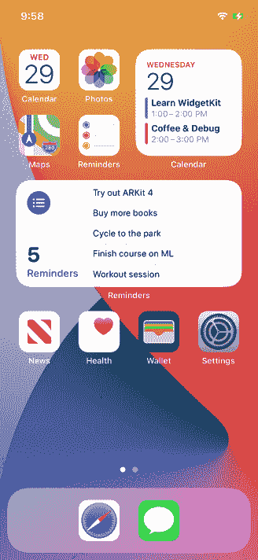

图 16.1 – 带有部件的 iOS 主屏幕

现在在 iOS 14 和 macOS 11 及更高版本中可以实现这一点。开发者可以使用**WidgetKit**和 SwiftUI 的新**部件 API**在 iOS、iPadOS 和 macOS 上创建部件。

iOS 14 中的**智能堆叠**包含一组不同的部件，包括用户经常打开的部件。如果用户启用**智能旋转**，Siri 可以在自定义堆叠中突出显示相关的部件。

iOS 13 及更早版本创建的部件

在 iOS 14 之前创建的部件无法放置在主屏幕上，但它们仍然可在今日视图和 macOS 通知中心中访问。

在介绍新部件功能之后，让我们看看在构建部件时有哪些选项，以及苹果的设计指南是什么。

## 部件选项

用户可以在 iOS 的主屏幕或 Today 视图、iPad 的 Today 视图或 macOS 的通知中心上放置小部件。

小部件有三种尺寸：小、中、大。每种尺寸应有不同的用途；小部件的大版本不应只是小尺寸版本字体和图像的放大，而是应该包含更多信息。小部件不同尺寸背后的理念是，尺寸越大，包含的信息应该越多。例如，天气小部件在小尺寸版本中只提供当前温度，但在中尺寸版本中还将包括每周天气预报。

用户可以在屏幕的不同部分排列小部件，甚至创建小部件堆叠来分组它们。

为了开发一个小部件，开发者需要为他们应用创建一个新的扩展：一个**小部件扩展**。他们可以使用时间线提供者来配置小部件。时间线提供者在需要时更新小部件信息。

假设一个小部件需要一些配置（例如，在天气应用中选择默认城市，或在大型天气小部件中显示多个城市）。在这种情况下，开发者应在小部件扩展中添加自定义 Siri 意图。创建自定义 Siri 意图会自动为小部件提供用户定制的界面。

## 小部件指南

当为 iOS 14 或 macOS 11 创建小部件时，请考虑以下设计指南：

+   将你的小部件聚焦于你应用的主要功能。例如，如果你的应用是关于股市的，你的小部件可以显示用户投资组合的总价值。

+   每个小部件的大小应显示不同数量的信息。如果你的骑行追踪小部件在小尺寸下显示今天燃烧的卡路里，它也可以在中尺寸下显示每天的周卡路里，并在大尺寸下添加额外的信息，例如行驶的公里数/英里数。

+   相比于固定信息，更倾向于动态信息，这些信息在一天中会变化；这将使你的小部件对用户更具吸引力。

+   相比于配置选项更多的小部件，更倾向于简单的小部件。

+   小部件提供点击目标和检测功能，使用户能够点击它们以在应用中打开详细信息。小型小部件支持单个点击目标；中型和大型小部件支持多个目标。尽量保持简单。

+   支持深色模式。如有需要，还可以考虑使用 SF Pro 作为字体和 SF Symbols。

在本节中，我们了解了新的小部件功能和 WidgetKit。我们涵盖了构建小部件时可用选项和设计指南。在下一节中，我们将从头开始构建一个简单的小部件，并逐步添加更多功能。

# 开发你的第一个小部件

在本节中，我们将使用一个现有应用，逐步创建其上的小部件。

我们将要开发的这款应用是一款加密货币行情应用，用户可以查看不同加密货币的最新价格。我们将创建一个小部件，让用户可以直接从主屏幕上查看加密货币的价格，这样他们就不必打开应用本身。

请打开本章代码包中名为 `CryptoWidget_start` 的项目。这是我们构建小部件的基础项目。在开始任务之前，让我们快速回顾一下基础项目本身。

构建并发布项目。应用显示加密货币价格列表：

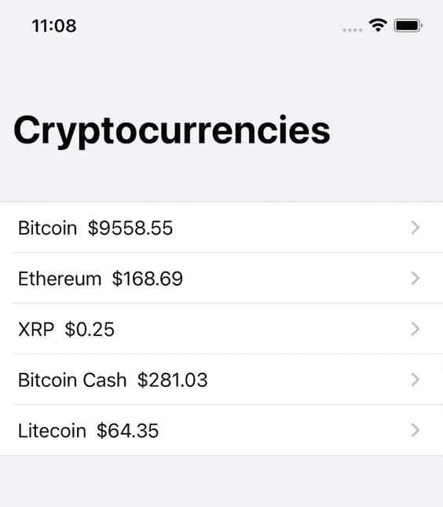

图 16.2 – 基础应用

你还可以进入每个硬币的详细视图，但仅出于演示目的，它不包含额外的信息。由于我们将使用现有的代码库，在修改它之前，让我们突出一些关键点：

+   项目被组织成三个文件组（除了默认生成的文件和应用代理）：`Views`、`Model` 和 `Network`。

+   `Views` 文件夹包含项目的 `UIView` 文件。视图是使用 SwiftUI 创建的。当使用 WidgetKit 构建小部件时，SwiftUI 是推荐的方式。如果你不熟悉 SwiftUI，不要担心；在这个项目中，我们只会使用基本的视图。

+   在 `Network` 文件夹内部，我们有一个名为 `DataManager.swift` 的类。这个类包含 `getData()` 方法，负责从 CoinMarketCap 的 API 中获取加密货币价格。你可以在他们的网站上创建一个免费的开发者账户以获取最新的价格。否则，演示应用使用一个演示密钥，为我们提供的加密货币提供历史价格。如果你创建自己的账户，你只需要用你自己的密钥替换这个密钥的值：`let apiKeyValue = "b54bcf4d-1bca-4e8e-9a24-22ff2c3d462c"`。

+   `Model` 文件夹包含与 `getData()` 方法结果一起工作的基本结构体：`Coin` 和 `CoinList`。这些结构体将包含来自 API 的加密货币符号和价格信息。

现在，让我们看看项目的主体视图，它位于 `Views` 文件夹内的 `ContentView.swift` 文件中。`ContentView` 结构体包含 `@ObservedObject var dataManager = DataManager()`。`@ObservedObject` 标签表示这个 SwiftUI 视图将观察 `dataManager` 结构体的变化，并将刷新/响应这些变化。记住，`dataManager` 是我们用来从网络上检索加密货币数据的类，所以我们的主要视图观察任何变化是有意义的。检查 `ContentView` 的主体：

```swift
var body: some View {
  NavigationView {
    if dataManager.loading {
      Text("Loading...")
    } else {
      CoinListView(data: dataManager.coins.data)
    }
  }
}
```

当 `dataManager` 处于加载状态时，视图将显示简单的 `Loading…` 文本，当 `dataManager` 加载完成并包含一些数据时，将显示 `CoinListView`。很简单！现在，如果你检查 `CoinListView.swift` 的实现，你会看到它是一个简单的列表，显示它接收到的每个硬币的信息：

```swift
var body: some View {
  VStack {
    ForEach(data, id: \.symbol){ coin in
      CoinRow(coin: coin)
    }
  }
}
```

目前没有什么太花哨的！到目前为止，我们有 `dataManager`，它调用 `getData()` 从 API 获取代币信息，以及 `ContentView`，在数据被调用时显示 `Loading…` 文本，并在获取到代币信息时显示代币详情列表。所有这些都是在几个类和几行代码中完成的…这就是 SwiftUI 的力量！现在我们已经对基础项目有了清晰的了解，让我们开始创建小部件扩展，以开始构建我们出色的加密货币小部件！

## 创建小部件扩展

将小部件添加到应用程序的第一步是创建一个小部件扩展。创建小部件扩展将为我们提供一个默认的小部件协议实现，这将帮助我们准备好基本组件。

在创建扩展之前，让我们回顾一下以下图中显示的小部件扩展的各个部分：

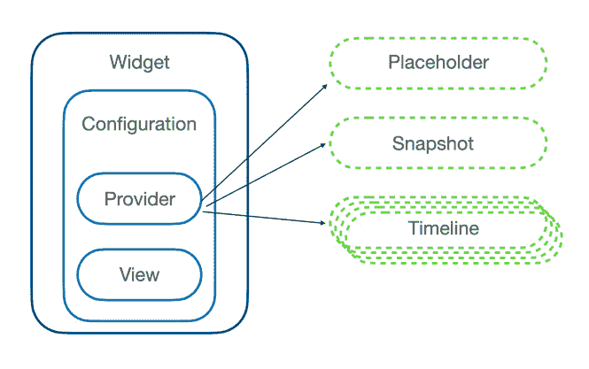

图 16.3 – 小部件构建块

如前图所示，以下是小部件扩展构建块的解释：

+   如果小部件可以被用户配置，它将需要一个自定义 Siri 意图配置定义。例如，显示股票的小部件可以要求用户进行配置以选择要显示的股票。

+   需要一个提供者来提供要在小部件上显示的数据。提供者可以生成占位符数据（即在用户浏览小部件画廊或加载时显示），时间线（表示随时间变化的数据），以及快照（组成时间线的单元）。

+   需要一个 SwiftUI 视图来显示数据。

当创建小部件目标时，Xcode 将自动生成所有这些类的占位符。现在让我们来做这件事；按照以下步骤操作：

1.  在名为 `CryptoWidget_start` 的项目中，转到 **文件** | **新建** | **目标** | **小部件扩展**。

1.  您可以使用 `CryptoWidgetExtension` 作为产品名称，并勾选 **包含配置意图** 选项：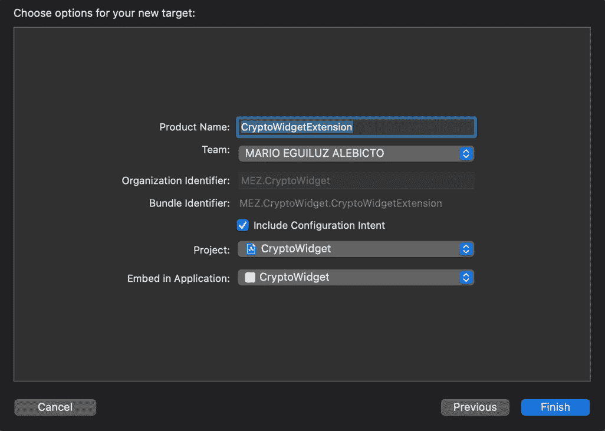

    图 16.4 – 小部件扩展选项

1.  点击以下弹出窗口中的 **激活**。

如果您已经按照前面的步骤操作，那么您的项目现在应该包含一个具有以下文件夹结构的新目标：

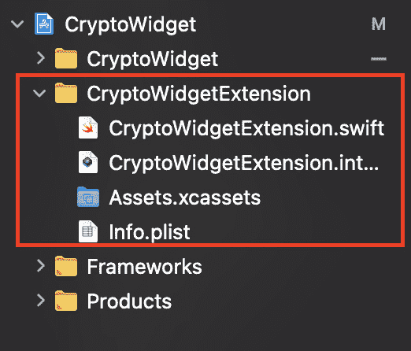

图 16.5 – 小部件目标结构

在创建小部件扩展时，Xcode 已经自动生成了两个重要的文件：`CryptoWidgetExtension.swift` 和 `CryptoWidgetExtension.intentdefinition`。现在让我们专注于 `CryptoWidgetExtension.swift`。打开它，让我们看一下。检查以下代码片段：

```swift
@main
struct CryptoWidgetExtension: Widget {
    let kind: String = "CryptoWidgetExtension"
    var body: some WidgetConfiguration {
        IntentConfiguration(kind: kind, intent: ConfigurationIntent.self, provider: Provider()) { entry in
            CryptoWidgetExtensionEntryView(entry: entry)
        }
        .configurationDisplayName("My Widget")
        .description("This is an example widget.")
    }
}
```

如您所见，正如之前讨论的那样，我们有小部件的基本构建块：

+   一个名为 `IntentConfiguration` 的意图配置，允许用户配置小部件。

+   一个提供数据给小部件的提供者：`Provider()`

+   一个用于显示数据的视图：`CryptoWidgetExtensionEntryView`

`CryptoWidgetExtension` 结构被标记为 `@main`，这意味着它是小部件的入口点。其主体由 `IntentConfiguration` 和 `CryptoWidgetExtensionEntryView` 组成，该视图接收一个 `entry` 实例作为输入。

在同一文件中，我们还有 `Provider` 所需方法的自动生成定义（`placeholder()`、`getSnapshot()` 和 `getTimeline()`）：

+   `placeholder(…)` 方法将为小部件提供第一次渲染小部件时的初始视图。占位符将使用户对小部件的外观有一个大致的了解。

+   `getSnapshot(…in context…)` 方法将为小部件提供一个值（输入），当小部件需要在短暂情况下显示时使用。`context` 中的 `isPreview` 属性表示小部件正在小部件画廊中显示。在这些情况下，快照必须快速：这些场景可能需要开发人员使用占位符数据并避免网络调用，以便尽可能快地返回快照。

+   `getTimeline(…)` 方法将为小部件提供一组值，以显示当前时间（以及可选的未来时间）。

我们将稍后使用另一个重要的修饰符。在 `.description("这是一个示例小部件。")` 之后，添加以下行：

```swift
 .supportedFamilies([.systemSmall])
```

这是我们配置此小部件可用不同大小的位置。在章节的后面部分，我们将添加中等大小的类型。

现在，让我们看看代码的另一个部分。在文件末尾，您将找到 `Preview` 部分：

```swift
struct CryptoWidgetExtension_Previews: PreviewProvider {
    static var previews: some View {
        CryptoWidgetExtensionEntryView(entry: SimpleEntry(date: Date(), configuration: ConfigurationIntent()))
            .previewContext(WidgetPreviewContext(family: .systemSmall))
    }
}
```

这部分代码将允许我们使用 SwiftUI 显示预览，以显示我们在开发小部件时的外观。如果您启动预览，您将看到目前它只显示时间（如果您看不到预览选项卡，请转到 Xcode 顶部菜单的 **编辑** | **画布**）：

![Figure 16.6 – Editor canvas preview]

![img/Figure_16.06_B14717.jpg]

图 16.6 – 编辑画布预览

这太棒了！我们可以实时编码并看到最终结果。让我们分析一下我们是如何获得带有时间的小部件视图的。看看我们是如何使用 `CryptoWidgetExtensionEntryView` 作为预览的主视图的？

```swift
CryptoWidgetExtensionEntryView(entry: SimpleEntry(date: Date(), configuration: ConfigurationIntent()))
    .previewContext(WidgetPreviewContext(family: .systemSmall))
```

此视图接收 `SimpleEntry`（仅包含日期）和一个普通的、空的 `ConfigurationIntent`。

然后，我们通过创建 `previewContext` 并将其分配为 `.systemSmall` 来对视图应用修饰符。通过这样做，我们在小部件预览中渲染视图！

`CryptoWidgetExtensionEntryView` 是如何使用 `SimpleEntry` 的？让我们检查实现：

```swift
struct CryptoWidgetExtensionEntryView : View {
    var entry: Provider.Entry
    var body: some View {
        Text(entry.date, style: .time)
    }
}
```

嗯，它只是显示带有日期的文本！所以，总的来说，预览正在执行以下操作：

+   使用 `SimpleEntry` 作为小部件的数据输入

+   使用 `CryptoWidgetExtensionEntryView` 作为主视图来显示数据输入

+   使用 `WidgetPreviewContext` 修饰符来使用小型小部件作为预览的画布

在心中牢记所有这些概念后，是时候开始创建我们自己的小部件了。让我们修改前面的结构体，以显示比特币的价值而不是简单的日期。

首先，如果我们想在部件中显示一个币的价值（例如比特币），我们需要一个条目来包含这些信息。让我们将`Coin`数组添加到`SimpleEntry`结构的属性中：

```swift
struct SimpleEntry: TimelineEntry {
  let date: Date
  let configuration: ConfigurationIntent
  let coins: [Coin]
}
```

通过存储`coins`属性，条目可以在稍后向小部件的视图传递此信息。如果你尝试构建项目，你将得到如下错误：

```swift
Cannot find type 'Coin' in scope
```

这是因为`Coin`文件只是主应用目标的一部分。我们需要选择`Coin`以及`Views`、`Network`和`Model`文件夹下的所有其他文件，并将它们添加到小部件的目标中：

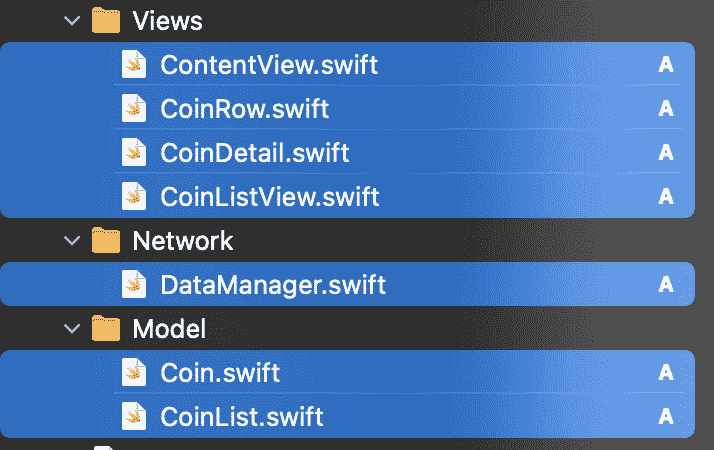

图 16.7 – 从主应用共享文件到小部件目标

在将上一张截图中的文件添加到小部件目标后，编译时将出现新的不同错误。所有这些错误的主要原因是你向`Coin`添加了一个新属性，现在在`Provider`结构体中有部分地方我们在初始化`Coin`实例时没有那个新属性。为了修复它，我们将向`Provider`实现中添加一些占位符数据（目前如此），在创建`Provider`内部的任何`SimpleEntry`实例时将其作为币传递。稍后，我们将使用来自 API 的真实数据而不是这些占位符数据。

在`Provider`结构体内部添加以下代码。其第一行将如下所示：

```swift
struct Provider: IntentTimelineProvider {
    let coins = [Coin(id: 1, name: "Bitcoin", symbol: "BTC", quote: Quote(USD: QuoteData(price: 20000))), Coin(id: 1, name: "Litecoin", symbol: "LTC", quote: Quote(USD: QuoteData(price: 200)))]
//…
```

我们正在创建一些假数据以生成一个包含比特币和莱特币一些值的`Coin`数组。现在，我们可以使用这个`coins`值将它们注入到`Provider`类内部创建`SimpleEntry`的三个地方：

+   首先，我们在`placeholder(…)`方法内部注入它：

    ```swift
    SimpleEntry(date: Date(), configuration: ConfigurationIntent(), coins: coins)
    ```

+   然后，我们在`getSnapshot(…)`方法内部注入它：

    ```swift
    let entry = SimpleEntry(date: Date(), configuration: configuration, coins: coins)
    ```

+   然后，我们在`getTimeline(…)`方法内部注入它：

    ```swift
    let entry = SimpleEntry(date: entryDate, configuration: configuration, coins: coins)
    ```

最后，你可能在`CryptoWidgetExtension_Previews`结构体内部遇到完全相同的问题。`previews`属性正在使用`SimpleEntry`在部件中显示它。你需要再次添加`coins`属性。只需使用此代码：

```swift
CryptoWidgetExtensionEntryView(entry: SimpleEntry(date: Date(), configuration: ConfigurationIntent(), coins: [Coin(id: 1, name: "Bitcoin", symbol: "BTC", quote: Quote(USD: QuoteData(price: 20000))), Coin(id: 1, name: "Litecoin", symbol: "LTC", quote: Quote(USD: QuoteData(price: 200)))]))
          .previewContext(WidgetPreviewContext(family: .systemSmall))
```

太好了！项目现在应该可以正确编译。尝试渲染预览以查看发生了什么。哎呀！你仍然应该在小的部件中看到日期/时间，而没有币值！为什么？我们将币值传递给小部件的条目，但小部件的视图还没有使用它。检查当前的实现：

```swift
struct CryptoWidgetExtensionEntryView : View {
  var entry: Provider.Entry
  var body: some View {
      Text(entry.date, style: .time)
  }
}
```

我们在内部有包含币信息的`entry`，但我们只显示日期。我们需要修改视图以显示新的信息！在主应用中，我们有一个视图，给定一个币，显示其名称和价格。让我们使用它。更改`CryptoWidgetExtensionEntryView`的实现（更改已突出显示）：

```swift
struct CryptoWidgetExtensionEntryView : View {
  var entry: Provider.Entry
  var body: some View {
    CoinDetail(coin: entry.coins[0])
  }
}
```

现在，构建并刷新预览。太棒了！你应该在 Widget 上看到比特币的价格和名称，如下面的截图所示：

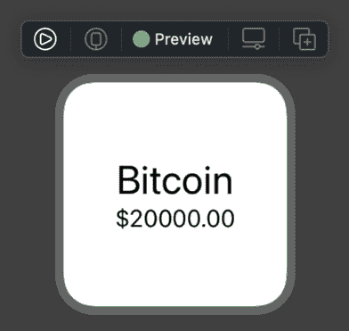

图 16.8 – 显示比特币价格的 Widget

如果你想在模拟器中尝试，只需启动 Widget 目标。记住，你应该首先启动（至少一次）主应用。

在本节中，我们学习了如何向应用添加 Widget 扩展。然后，我们探讨了主要组件及其之间的关系：提供者、条目、Widget 视图和 SwiftUI 的预览系统。最后，我们修改了所有这些组件以适应我们的需求，并创建了我们的第一个小 Widget。在下一节中，我们将学习如何添加占位符预览以及如何添加中等尺寸的 Widget！

## 实现多尺寸 Widget

在上一节中，我们向项目中添加了一个 Widget 目标并创建了 Widget 的第一个视图，即小尺寸视图。现在让我们做一些修改，以便开发一个中等尺寸的 Widget，以及 Widget 的占位符预览。

如果你没有跟上上一节的内容，可以使用名为 `CryptoWidget_1_small_widget` 的项目。让我们首先向项目中添加一个占位符预览。在第一次渲染你的 Widget 时，WidgetKit 会将其渲染为占位符。为了渲染数据，它将使用以下方法请求提供者提供一个条目：

```swift
func placeholder(in context: Context) -> SimpleEntry 
```

但是，为了在开发过程中看到它的外观，我们可以使用 SwiftUI 创建它的预览。继续在 `CryptoWidgetExtension.swift` 文件中添加以下结构体：

```swift
struct PlaceholderView : View {
  let coins = [Coin(id: 1, name: "Bitcoin", symbol: "BTC", quote: Quote(USD: QuoteData(price: 20000))), Coin(id: 1, name: "Litecoin", symbol: "LTC", quote: Quote(USD: QuoteData(price: 200)))]
    var body: some View {
      CryptoWidgetExtensionEntryView(entry: SimpleEntry(date: Date(), configuration: ConfigurationIntent(), coins: coins)).redacted(reason: .placeholder)
    }
}
```

看看我们如何使用主要的 Widget 视图 (`CryptoWidgetExtensionEntryView`) 作为占位符视图，并给它提供模拟数据？然而，有趣的部分是高亮显示的部分：`.redacted(reason: .placeholder)`。现在我们已经使用模拟数据创建了一个占位符视图，让我们创建它的预览并检查 `redacted` 修改符的效果。

移除 `CryptoWidgetExtension_Previews` 的实现，并添加这个新的实现，修改后的代码如下所示：

```swift
struct CryptoWidgetExtension_Previews: PreviewProvider {
    static var previews: some View {
      Group {
        CryptoWidgetExtensionEntryView(entry: SimpleEntry(date: Date(), configuration: ConfigurationIntent(), coins: [Coin(id: 1, name: "Bitcoin", symbol: "BTC", quote: Quote(USD: QuoteData(price: 20000))), Coin(id: 1, name: "Litecoin", symbol: "LTC", quote: Quote(USD: QuoteData(price: 200)))]))
          .previewContext(WidgetPreviewContext(family: .systemSmall))
        PlaceholderView()
          .previewContext(WidgetPreviewContext(family: .systemSmall))
      }
    }
}
```

首先，我们将之前的 `CryptoWidgetExtensionEntryView` 视图封装在 `Group` 中。这是因为现在我们想要显示一组预览，`CryptoWidgetExtensionEntryView` 和新的 `Placeholder`。

然后，我们添加了新创建的 `Placeholder` 视图，并像之前一样应用了一个小 Widget 的 `previewContext`。编译并继续预览渲染；你应该看到以下内容：

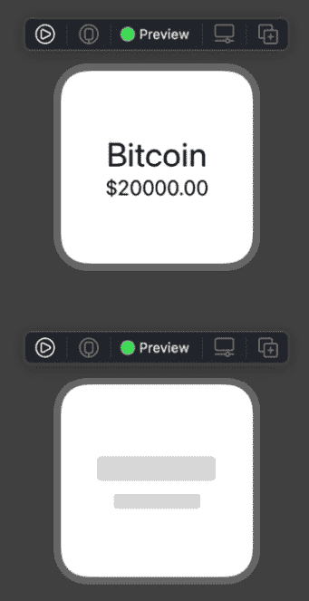

图 16.9 – 带有红字修改符的占位符视图

你现在看到 `.redacted(reason: .placeholder)` 的效果了吗？SwiftUI 正在用占位符视图替换标签。创建你自己的小部件占位符视图非常简单！

目前，我们有一个小型小部件及其预览。让我们开始创建它的中等尺寸版本。更大的小部件应该利用额外的可用空间为用户提供额外的价值。你的中等或大尺寸小部件不应该只是简单的大尺寸版本。在我们的例子中，我们以小尺寸显示比特币的价格。现在，在中等尺寸，我们将一次性显示多种加密货币的价值。用户只需一眼就能获得市场的更大图景！

在上一节中，我们配置了`supportedFamilies`以允许小尺寸的小部件。我们还需要添加中等尺寸。你将在`CryptoWidgetExtension`结构体中找到它。将`.systemMedium`添加到`supportedFamilies`中，因此配置行应该看起来像这样：

```swift
.supportedFamilies([.systemSmall, .systemMedium])
```

现在让我们为中等尺寸的小部件创建一个预览。请继续在`CryptoWidgetExtension_Previews`中现有小部件下方添加一个新的`Group`。在现有的`Group{ … }`结束的地方添加以下代码（因此你应该有一个接一个的组）：

```swift
Group {
  CryptoWidgetExtensionEntryView(entry: SimpleEntry(date: Date(), configuration: ConfigurationIntent(), coins: [Coin(id: 1, name: "Bitcoin", symbol: "BTC", quote: Quote(USD: QuoteData(price: 20000))), Coin(id: 1, name: "Litecoin", symbol: "LTC", quote: Quote(USD: QuoteData(price: 200))), Coin(id: 1, name: "Ethereum", symbol: "ETH", quote: Quote(USD: QuoteData(price: 1200)))]))
    .previewContext(WidgetPreviewContext(family: .systemMedium))
  PlaceholderView()
    .previewContext(WidgetPreviewContext(family: .systemMedium))
}
```

看看这个新的视图组与现有的视图是否相同，唯一的区别在于高亮的代码？我们现在在`systemMedium`预览中显示小部件及其占位符。如果你恢复渲染，你应该看到这两个新的预览（除了之前的小尺寸预览）：

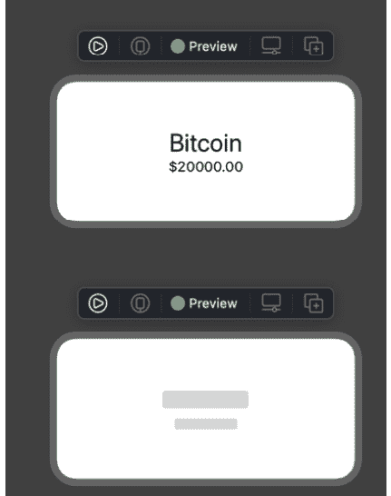


图 16.10 – 中等尺寸小部件和占位符

你可以想象，对于一个用户来说，这个结果将会非常令人失望。我们显示的信息与小型小部件完全相同，但在他们的主页上占据了更多的空间（这对他们来说非常宝贵！）让我们通过更改系统显示中等尺寸版本时我们的`CryptoWidgetExtensionEntryView`的布局来改进这一点。我们可以利用额外的空间一次显示不止一种货币。删除`CryptoWidgetExtensionEntryView`的实现，并使用以下代码：

```swift
struct CryptoWidgetExtensionEntryView : View {
  var entry: Provider.Entry
  //1
  @Environment(\.widgetFamily) var family
  //2
  @ViewBuilder
  var body: some View {
    switch family {
    //3
    case .systemSmall where entry.coins.count > 0:
      CoinDetail(coin: entry.coins[0])
    //4
    case .systemMedium where entry.coins.count > 0:
      HStack(alignment: .center) {
        Spacer()
        CoinDetail(coin: entry.coins.first!)
        Spacer()
        CoinListView(data: entry.coins)
        Spacer()
      }
    //5
    default:
      PlaceholderView()
    }
  }
}
```

让我们讨论代码中的编号注释：

1.  我们使用`@Environment(\.widgetFamily)`变量，它允许我们知道正在使用哪个小部件家族。基于这个信息，我们可以为不同尺寸使用不同的布局。

1.  视图必须使用`@ViewBuilder`声明其主体，因为它使用的视图类型是可变的。

1.  我们使用`family`（`widgetFamily`）属性来切换它，并为不同尺寸的小部件提供不同的视图。对于小型小部件，我们继续使用之前的`CoinDetail`视图。

1.  对于中等尺寸的小部件，我们使用一种视图组合，使我们能够显示一种硬币的详细信息及其旁边的其他硬币列表。通过这种方式，我们增加了价值，并利用可用空间为用户提供更多信息。

1.  最后，我们使用`Placeholder`来处理开关的`default`情况。

现在你可以恢复预览以查看更改。中等尺寸的组应该看起来像这样：

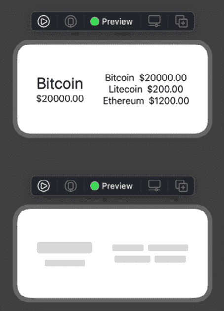

图 16.11 – 中等尺寸小部件

太棒了！我们现在有一个为中等尺寸家庭提供额外价值的不同小部件！我们还有一个重要的任务要完成。我们在小尺寸和中尺寸显示的数据只是示例数据。此外，我们没有让用户选择他们想要在小尺寸小部件中显示的代币；我们强制显示比特币，他们可能对此不感兴趣。

在下一节中，我们将学习如何为小部件提供动态配置（因此用户可以配置小部件的选项）以及如何显示真实数据。

## 提供小部件的数据和配置

到目前为止，我们有一个具有各种大小的小部件和一个显示加密货币示例数据的占位符视图。在本节中，我们将用来自 API 的真实数据替换这些示例数据，并且我们还将允许用户配置一些选项，以进一步个性化小部件。

如果你没有跟随前面的章节，你可以使用名为 `CryptoWidget_2_medium_widget` 的项目。

让我们先从小部件提供真实数据开始。提供条目（因此是数据）给小部件视图的实体是 `Provider`。某种方式上，我们需要 `Provider` 了解我们的数据源并向视图提供传入的数据。在我们的主应用中，负责提供数据的结构是 `DataManager`。请继续在 `CryptoWidgetExtension.swift` 文件中向 `Provider` 结构添加以下属性：

```swift
@ObservedObject var dataManager = DataManager()
```

我们正在将 `DataManager` 实例添加到小部件的 `Provider` 中。请注意，我们使用 `@ObservedObject` 标签标记了这个属性。如果你之前没有在 SwiftUI 中使用过它，那么每当带有此标签的可观察属性发生变化时，它都会使依赖于它的任何视图无效。

每当 `DataManager` 发生变化时，依赖于它的视图将无效并刷新以反映这些更改。现在，我们可以从 `Provider` 中删除示例数据并使用数据管理器。删除以下行：

```swift
let coins = [Coin(id: 1, name: "Bitcoin", symbol: "BTC", quote: Quote(USD: QuoteData(price: 20000))), Coin(id: 1, name: "Litecoin", symbol: "LTC", quote: Quote(USD: QuoteData(price: 200)))]
```

如果你构建项目，你将得到三个编译错误——每个提供者方法中都有一个，我们使用的是刚刚删除的 `coins` 属性。请继续使用 `dataManager.coins.data` 属性来代替已删除的代币属性。这个属性来自 `dataManager`，包含从 API 获取的真实数据。

现在，启动主应用，从设备中删除之前的小部件，并将其再次添加到主屏幕上。你应该会看到如下内容：

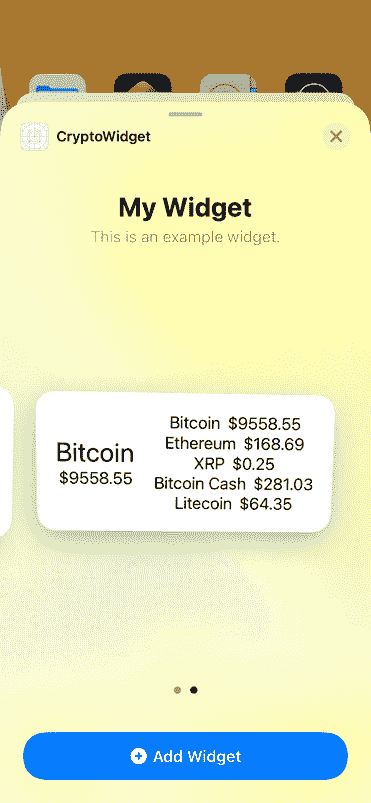

图 16.12 – 小部件画廊

这是一个非常好的消息！这不再是示例数据；列表中现在有最多五个具有真实值的代币（记住，如果你使用的是本章开头讨论的沙盒端点，这些值可能不会是最新的）。

现在我们已经在 widget 中显示了真实值。下一步将是稍微改进一下小尺寸 widget。目前，小尺寸 widget 显示的是比特币的价格。但用户可能对其他加密货币感兴趣。我们将使用配置意图来允许用户输入配置值，并使我们的 widget 更加动态。

在本章开头，当我们向主应用添加 widget 扩展时，我们在 widget 扩展文件夹中选择了 `CryptoWidgetExtension.intentdefinition`。这是一个 Siri 意图定义文件，我们可以配置 widget 将接受的作为用户输入的选项。让我们为我们的特定情况配置意图定义。我们希望用户能够从预定义的代币名称列表中选择一个代币，以在小型 widget 中显示该代币的价格。

让我们先创建一个包含以下值的枚举：`BTC`、`LTC` 和 `ETH`：

1.  点击 `CryptoWidgetExtension.intentdefinition` 文件。在 `coinSelect` 中更改类型为 **添加枚举**。

1.  这个操作将带你进入创建一个新的枚举。将枚举命名为 `Coin Select` 并添加以下值：

    `1`. `LTC`

    `2`. `ETH`

    `3`. `BTC`

    它应该看起来像这样：

    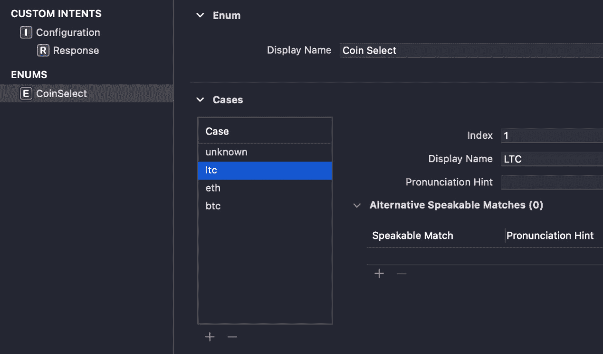

    图 16.13 – Coin Select 枚举配置

1.  现在返回到意图的 **配置** 部分。你可以取消选择 **运行时 Siri 可以请求值** 选项。确保其他选项设置如以下截图所示：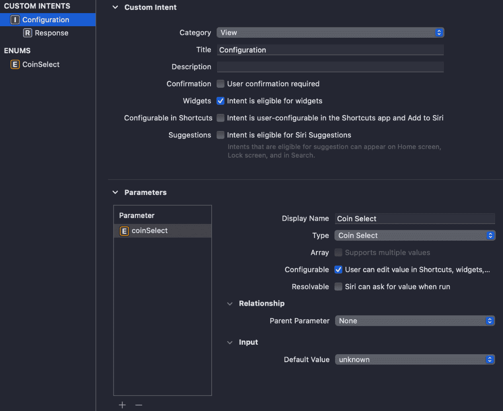

    图 16.14 – 自定义意图配置

    以这种方式配置自定义意图并创建了用于显示一些列表值的枚举后，我们就可以在 widget 中使用这个意图了。

1.  返回到 `CryptoWidgetExtension.swift` 文件并检查 `SimpleEntry` 定义。在每一个条目中，我们都可以访问到 `configuration` 属性（它是一个我们刚刚配置的 `ConfigurationIntent` 实例）。这意味着每次我们访问一个条目时，都可以访问到自定义意图的值。

    现在，在 `CryptoWidgetExtensionEntryView` 中，我们有一个可用的 `entry`（当然！这是我们想要显示的数据）。因此，我们可以访问它内部的配置意图。让我们利用它！我们将修改 `.systemSmall` switch 案例以使用配置意图信息并显示不同的代币，而不仅仅是显示比特币。

1.  继续查找以下代码：

    ```swift
    case .systemSmall where entry.coins.count > 0:
          CoinDetail(coin: entry.coins[0]) 
    ```

1.  用这个新的替换它：

    ```swift
    case .systemSmall where entry.coins.count > 0:
      switch entry.configuration.coinselect) to know which coin from the enum the user selected. Based on that, we are displaying a specific coin in the small-sized widget.Try to build the project. You may get a compile error. This error happens because the widget doesn't yet know about the custom Siri intent type (even though Xcode generated it for us). This error may be fixed in future versions of Xcode. If you have an error, check the following:
    ```

1.  前往主应用设置，在 **支持意图** 部分的 `ConfigurationIntent` 意图下，如以下截图所示：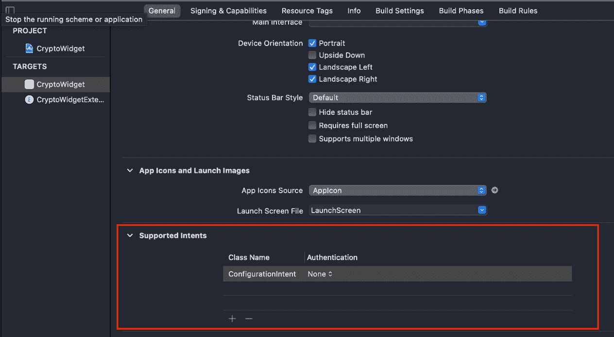

    图 16.15 – 将你的意图添加到支持意图部分

1.  再次构建项目，编译错误应该会消失。

1.  如果您仍然有任何错误，请尝试以下操作：

    a) 编译并运行主应用的目标。

    b) 运行小部件的目标。从模拟器中删除小部件并再次添加（小尺寸的那个）。

1.  现在，如果您在设备上的小尺寸小部件（或模拟器）上长按，您应该能够看到“编辑小部件”选项。它将显示您的新自定义意图，如下面的截图所示：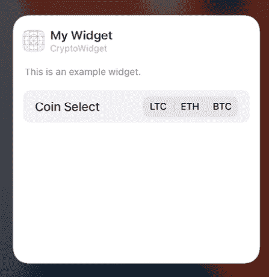

    图 16.16 – 小部件配置选项

1.  尝试选择**ETH**或**LTC**。然后，您的小部件将重新加载并显示该货币！这太棒了；我们现在有一个可配置的加密货币小部件。

在本节中，我们学习了如何使用 Siri 意图使小部件可配置，因此用户可以从主屏幕选择值并编辑小部件。

现在，还有一个我们尚未讨论的话题。在`Provider`结构体中，我们了解到`getTimeline(…)`方法将为小部件提供一系列值，以在一段时间内显示，以刷新显示的信息并保持最新。但我们没有讨论如何控制小部件实际刷新的时间，甚至是否在我们控制之下。我们将在下一节中学习这一点。

## 刷新小部件的数据

保持小部件更新需要消耗系统资源，并可能需要大量的电池使用。因此，系统将限制每个小部件在一天内可以执行更新的次数，以节省电池寿命。

带着这个想法，我们必须理解我们并没有完全控制我们小部件的刷新时间和频率，并且小部件并不总是处于活跃状态。我们能够给系统一些提示，关于何时对我们的小部件刷新是最理想的，但最终决定权在系统手中。

系统使用预算在一段时间内分配重新加载。这个预算受以下因素的影响：

+   小部件被展示给用户的次数有多少？

+   小部件上次重新加载是什么时候？

+   小部件的主要应用是否处于活跃状态？

为小部件分配的预算可以持续 24 小时。用户频繁访问的小部件每天可以刷新高达 70 次，这意味着它大约每 15 分钟更新一次。

您可以通过在您小部件的`Timeline`方法中提供尽可能多的信息来帮助 WidgetKit 估算您小部件的最佳预算。以下是一些示例：

+   一个遵循食谱的烹饪小部件可以在时间线上安排不同的步骤，在特定时间点显示烹饪步骤：预热烤箱 15 分钟，烹饪 30 分钟，休息 10 分钟，等等。这将导致一个在特定分钟（15 – 30 – 10）上时间间隔分开的条目时间线。WidgetKit 将尝试在这些时间点刷新您的 小部件，以显示适当的条目。

+   为了让小部件每两小时提醒用户喝水，你可以生成一个时间线来提醒用户每两小时喝一杯水。但你可以更有效率，避免在用户睡觉的夜间进行任何刷新。这将产生一个更有效率的时间线，并节省一些 WidgetKit 可以用来在真正需要时更频繁地刷新你的小部件的预算。

现在，在我们的特定示例中，让我们修改时间线，让 WidgetKit 每隔 5 分钟刷新我们的小部件（一个非常激进的要求！）！但我们知道加密货币非常波动，对于这个例子，我们希望尽可能多地刷新价格。按照以下步骤操作：

1.  现在请打开名为 `CryptoWidget_4_timeline` 的项目，该项目位于本章的代码包中。首先，让我们在 `DataManager` 中创建一个新的方法，允许我们通过完成块获取最新的加密货币数据。

1.  将以下方法添加到结构体中：

    ```swift
    func refresh(completionHandler: @escaping (CoinList) -> Void) {
      guard let url = URL(string: apiUrl) else { return }
      var request = URLRequest(url: url)
      request.setValue(apiKeyValue, forHTTPHeaderField: apiKeyHeader)
      URLSession.shared.dataTask(with: request){ (data, _, _) in
        print("Update coins")
        guard let data = data else { return }
        let coins = try! JSONDecoder().decode(CoinList.self, from: data)
        DispatchQueue.main.async {
          print(coins)
          self.coins = coins
          self.loading = false
          completionHandler(coins)
        }
      }.resume()
    }
    ```

    看看这个方法与 `getData()` 的相似之处，但这个方法不是 `private` 的，并且它还返回 `coins`，以便我们可以在需要时在 `completion` 处理器中使用。

1.  接下来，转到名为 `CryptoWidgetExtension.swift` 的文件，并修改 `Provider` 结构体中的 `getTimeline(…)` 方法，用以下实现替换：

    ```swift
    func getTimeline(for configuration: ConfigurationIntent, in context: Context, completion: @escaping (Timeline<Entry>) -> ()) {
      print("New Timeline \(Date())")
      dataManager.refresh { (coins) in
        let currentDate = Date()
        let futureDate = Calendar.current.date(byAdding: .minute, value: 15, to: currentDate)!
        let timeline = Timeline(entries: [SimpleEntry(date: Date(), configuration: configuration, coins: coins.data)], policy: .after(futureDate))
        completion(timeline)
      }
    }
    ```

让我们看看方法中发生了什么：

1.  首先，我们正在使用我们创建的新方法 `refresh(…)` 来获取加密货币的最新值。

1.  一旦我们在完成处理程序中准备好了硬币，我们就在未来创建一个日期，这个日期是 15 分钟之后。

1.  然后，我们创建一个包含 `coins` 最新值的 `SimpleEntry` 的 `Timeline`，以及一个刷新策略。刷新策略设置为在 15 分钟后创建一个新的时间线（`futureDate`）。通常，15 分钟是 WidgetKit 再次更新你的小部件所需的最短时间。如果你尝试更低的值，你可能不会得到任何结果。

    因此，为了总结这个方法，当 WidgetKit 请求我们时间线时，我们调用我们的 API 来获取最新的加密货币值，然后我们将它们包装在一个准备显示的小部件视图中，并设置一个“15 分钟后”的刷新策略。

1.  现在，尝试从模拟器或你的设备中删除应用程序和小部件。安装应用程序和扩展，并在主屏幕上添加一个小部件。当你添加小部件时，你应该在日志中看到时间线方法的第一个语句，类似于以下内容：

    ```swift
    New Timeline 2021-01-23 20:51:51 +0000
    ```

    然后，15 分钟后，你应该再次看到它出现。刷新策略已经启动，我们再次提供了一个带有最新值的刷新版本：

    ```swift
    New Timeline 2021-01-23 21:06:52 +0000
    ```

太棒了！我们现在知道如何刷新我们的小部件了！最后提醒一下：除了 `.after` 之外，还有更多的刷新策略。以下是选项：

+   `TimelineReloadPolicy.after(Date)`: 在特定日期过后将生成一个新的时间线。

+   `TimelineReloadPolicy.atEnd`：在当前时间线的最后一条条目通过之后，将生成一个新的时间线。

+   `TimelineReloadPolicy.never`：小部件的应用将负责让 WidgetKit 知道何时下一个时间线准备就绪。

在本节中，我们学习了 WidgetKit 如何决定何时刷新您的小部件，以及我们如何提供时间线和刷新策略，以便系统更好地了解我们希望何时更新小部件。现在，让我们通过总结来结束本章。

# 总结

我们从学习小部件和 WidgetKit 的基础知识开始本章。我们了解了通用指南、基本选项及其目的。在介绍之后，我们直接进入了开发我们的第一个小部件。我们首先向现有应用中添加了一个小型小部件。

然后，我们在小部件中添加了一个占位符视图，以便用户对首次加载时小部件的外观有一个良好的概念。之后，我们创建了一个更大、中等大小的版本，它能够显示比小型小部件多得多的信息，并提供更多的价值。

最后，我们学习了如何在 Siri 自定义意图的帮助下使小部件可由用户配置。通过使用自定义意图，用户能够向小部件提供某些配置值以个性化体验。

在本章中，你学习了如何创建小部件并充分利用 WidgetKit。在下一章中，我们将学习关于 ARKit 的知识，这是苹果公司的增强现实框架。
