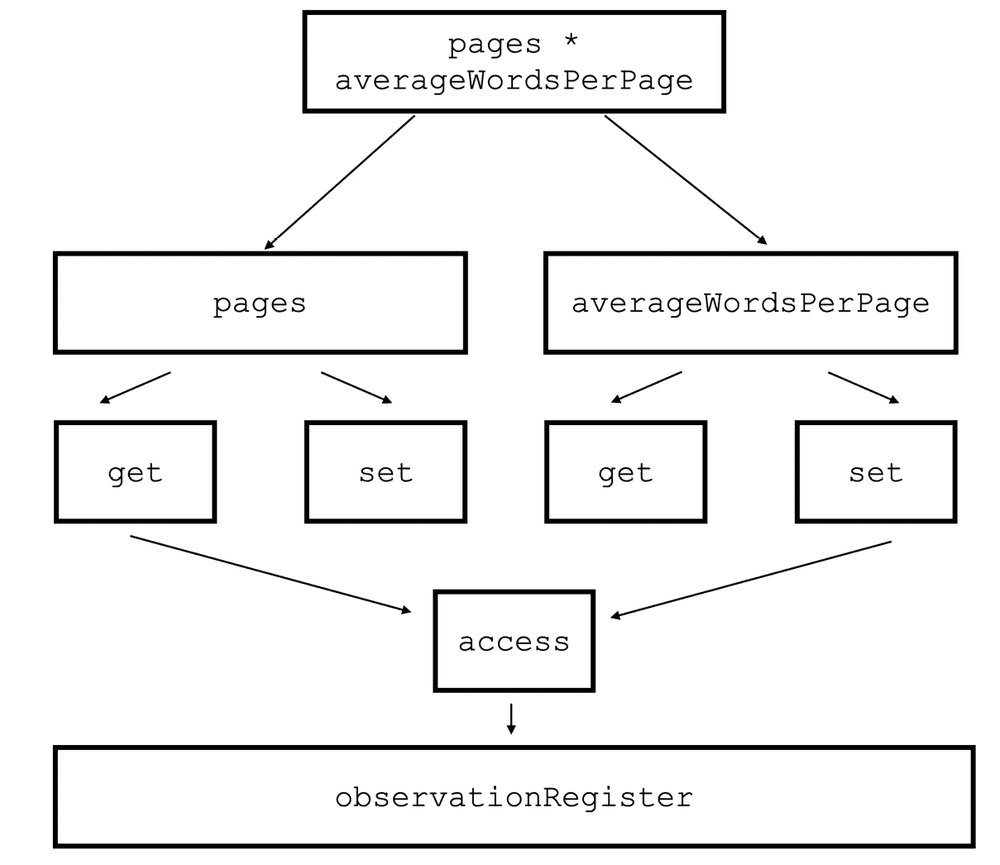

# 第四章：<st c="0">3</st>

# <st c="2">理解 SwiftUI 观察系统</st>

<st c="35">在第</st> *<st c="39">第二章</st>*<st c="48">中，我们讨论了 SwiftData，这是我们数据管理的一个基本框架。</st> <st c="122">然而，为了使数据管理有效，我们还需要另一侧能够观察变化并向用户显示它们的东西。</st>

<st c="259">SwiftUI 包含允许我们有效地观察这些变化并将它们绑定到操作和 UI 更新的工具。</st> <st c="375">然而，这些工具在多年中变得复杂且令人困惑。</st>

<st c="445">现在，我们将探讨观察如何变得简单得多，同时深入到 SwiftUI 数据流的</st> <st c="583">核心。</st>

<st c="593">在本章中，我们将涵盖以下主题：</st>

+   <st c="646">回顾 SwiftUI 观察系统并讨论</st> <st c="698">其问题</st>

+   <st c="710">添加</st> `<st c="719">@Observable</st>` <st c="730">宏并学习它是如何</st> <st c="751">工作的</st>

+   <st c="759">讨论观察属性，包括</st> <st c="800">计算变量</st>

+   <st c="818">使用环境变量并将它们适应到</st> <st c="873">新框架</st>

+   <st c="886">讨论新的</st> `<st c="906">@Bindable</st>` <st c="915">属性包装器</st>

+   <st c="932">学习如何将我们的应用程序迁移到与</st> <st c="979">观察框架</st> <st c="994">一起工作</st>

<st c="1000">准备好开始了吗？</st> <st c="1015">？</st>

# <st c="1024">技术要求</st>

<st c="1047">本章包含许多代码示例，其中一些可以在以下 GitHub</st> <st c="1141">仓库中找到：</st> [<st c="1153">https://github.com/PacktPublishing/Mastering-iOS-18-Development/tree/main/Chapter3</st>](https://github.com/PacktPublishing/Mastering-iOS-18-Development/tree/main/Chapter3)

<st c="1235">要运行它们，我们需要 Xcode 15</st> <st c="1271">或更高版本。</st>

# <st c="1280">回顾 SwiftUI 观察系统</st>

<st c="1322">在我们讨论当前的 SwiftUI 观察系统之前，让我们回顾一下 SwiftUI</st> <st c="1405">观察系统。</st>

<st c="1424">在 Xcode 15 之前，九个属性包装器处理了 SwiftUI 中的状态和数据更新</st> <st c="1496">。</st>

<st c="1507">让我们尝试按</st> <st c="1535">应用程序级别</st> <st c="1540">对它们进行分组：</st>

+   `<st c="1564">@</st>``<st c="1565">Binding</st>`<st c="1572">,</st> `<st c="1574">@Environment</st>`

+   `<st c="1600">@State</st>`<st c="1606">,</st> `<st c="1608">@Binding</st>`<st c="1616">,</st> `<st c="1618">@</st>``<st c="1619">StateObject</st>`<st c="1630">,</st> `<st c="1632">@Environment</st>`

+   `<st c="1668">@</st>``<st c="1669">ObservableObject</st>`<st c="1685">,</st> `<st c="1687">@Published</st>`

+   `<st c="1715">@AppStorage</st>`、`<st c="1726">@</st>` `<st c="1729">SceneStorage</st>`、`<st c="1741">@EnvironmentObject</st>`

`<st c="1762">不同的级别让我们了解不同包装器的不同角色。</st>` `<st c="1850">让我们来探讨一些这些包装器，以了解系统是如何工作的。</st>`

`<st c="1923">一个本地的</st>` `<st c="1932">@State</st>` 属性包装器管理视图内部原始属性的状态。例如，一个特定视图是否隐藏、可用按钮的数量、当前排序方法等都是由这个包装器管理的。

`<st c="2161">我们使用 <st c="2186">@State</st>` 属性包装器的原因是 SwiftUI 视图是不可变的。</st>` `<st c="2192">这意味着 SwiftUI 每次发生变化时都会重建视图，但 <st c="2327">@State</st>` `<st c="2333">值在渲染会话之间不会改变。</st>`

`<st c="2396">问题开始于我们基于数据模型信息构建视图的时候。</st>` `<st c="2465">例如，一个书店应用从本地数据文件中显示书籍列表的情况。</st>` `<st c="2563">在这种情况下，我们的视图必须使用 `<st c="2637">ObservableObject</st>` 协议与另一个数据模型对象协同工作。</st>

`<st c="2663">现在我们来回顾一下</st>`。

## `<st c="2685">遵守 ObservableObject 协议</st>`

我们可以使用 `<st c="2729">ObservableObject</st>` 协议与 `<st c="2795">@ObservedObject</st>` 属性包装器一起用于需要被观察的类。

`<st c="2865">这是一个 <st c="2889">UserData</st>` 类的例子，它成为一个 `<st c="2921">@ObservedObject</st>` 属性包装器：</st>`

```swift
 class UserData: <st c="2971">ObservableObject</st> { <st c="2990">@Published</st> var username = "Avi Tsadok"
}
struct ContentView: View {
 <st c="3058">@ObservedObject var userData = UserData()</st> var body: some View {
        Text("Welcome, \(userData.username)!")
            .padding()
    }
}
```

`<st c="3175">实现数据类观察有三个部分：</st>`

1.  `<st c="3254">ObservableObject</st>`：如果我们想让一个类在 SwiftUI 中被观察，它必须遵守 `<st c="3342">ObservableObject</st>` 协议。这表示 SwiftUI，任何从这个类派生出的实例都可以在视图中被观察。

1.  `<st c="3475">@Published</st>` `<st c="3536">@Published</st>` 属性包装器，SwiftUI 创建了一个发布者，并在 SwiftUI 视图中使用它。

1.  `<st c="3658">@ObservedObject</st>` `<st c="3697">@ObservedObject</st>` 属性包装器在视图和对象之间建立连接，允许视图在变化时被通知。

<st c="3833">记住，`<st c="3870">@ObservedObject</st>` <st c="3885">属性包装器仅用于观察目的——这意味着视图不能直接修改观察对象的属性。</st>

<st c="4019">如果我们想更改观察对象属性，我们必须使用另一个属性包装器——</st> `<st c="4112">@</st>``<st c="4113">StateObj</st><st c="4121">ect</st>`<st c="4125">。</st>

<st c="4126">一个</st> `<st c="4129">@StateObject</st>` <st c="4141">属性包装器与</st> `<st c="4173">@State</st>`<st c="4179">类似，只是它适用于可观察对象而不是</st> <st c="4232">原始值。</st>

<st c="4249">然而，这还没有结束——如果我们想在视图和其子视图之间创建双向连接，我们需要</st> <st c="4367">在子视图中添加一个</st> `<st c="4376">@Binding</st>` <st c="4384">属性包装器，并在父视图中添加一个</st> `<st c="4423">@State</st>` <st c="4429">属性包装器。</st>

## <st c="4466">解释当前观察情况的问题</st>

<st c="4528">对当前 SwiftUI 中观察数据方式的简要回顾强调了在 SwiftUI 中观察数据是多么复杂和令人困惑。</st>

<st c="4663">以</st> `<st c="4687">ObservableObject</st>` <st c="4703">协议</st> <st c="4777">为例</st>，在大多数情况下，我们希望将所有属性标记为使用</st> `<st c="4777">@Published</st>` <st c="4787">属性包装器</st>。如果这样，为什么我们还需要努力工作呢？难道我们没有一种方法可以将</st> `<st c="4777">@Published</st>` <st c="4884">属性包装器添加到所有</st> <st c="4919">属性中吗？

<st c="4934">观察框架在这里使用 Swift 宏，这是一个可以帮助我们减少样板代码的功能。</st> <st c="5037">要了解更多信息，请访问</st> *<st c="5066">第十章</st>* <st c="5076">并了解</st> <st c="5092">Swift 宏。</st>

# <st c="5105">添加`@Observable`宏</st>

<st c="5134">观察框架的主要目标是尽可能简化我们的工作，它通过大量使用宏来实现这一点。</st>

<st c="5272">让我们以</st> `<st c="5286">Book</st>` <st c="5290">类</st> <st c="5298">为例：</st>

```swift
 class Book: <st c="5323">ObservableObject</st> { <st c="5342">@Published</st> var title:String = "" <st c="5375">@Published</st> var author: String = "" <st c="5410">@Published</st> var publishedYear: Date = Date() <st c="5454">@Published</st> var numberOfPages: Int = 0
}
```

<st c="5493">`<st c="5498">Book</st>` <st c="5502">`类是一个标准的`<st c="5523">ObservableObject</st>` <st c="5539">类，包含四个属性，每个属性都使用`<st c="5583">@Published</st>` <st c="5593">属性包装器。</st>

<st c="5611">使用</st> `<st c="5622">Observation</st>` <st c="5633">框架，我们可以摆脱所有的属性包装器和</st> `<st c="5697">ObservableObject</st>` <st c="5713">协议，只需在</st> <st c="5760">类声明</st><st c="5770">中添加一个宏：</st>

```swift
<st c="5779">@Observable</st> class Book {
    var title:String = ""
    var author: String = ""
    var publishedYear: Date = Date()
    var numberOfPages: Int = 0
}
```

<st c="5912">`<st c="5917">@Observable</st>` <st c="5928">宏，像大多数宏一样，为我们处理繁琐的工作。</st> <st c="5994">它使`<st c="6007">Book</st>` <st c="6011">结构体可观察，并为它的属性添加了一个发布者。</st>

<st c="6069">让我们尝试在一个</st> `<st c="6091">Book</st>` <st c="6095">类中</st> `<st c="6105">使用视图：</st>

```swift
 struct ContentView: View { <st c="6140">var book:Book = Book()</st> var body: some View {
        VStack {
            Text(book.title)
            Button("Change") { <st c="6230">book.title = "Mastering iOS 17"</st> }
        }
        .padding()
    }
}
```

<st c="6280">在上面的代码中，我们有一个按钮和一个带有</st> `<st c="6339">Text</st>` <st c="6343">视图的视图，该视图显示书籍标题。</st> <st c="6379">点击按钮会更改书籍标题。</st>

<st c="6424">书籍标题的更改更新了文本；然而，即使书籍没有标记为</st> `<st c="6542">@ObserverdObject</st>` <st c="6558">或</st> `<st c="6562">@StateObject</st>` <st c="6574">属性包装器，更新也会发生！</st>

<st c="6592">这怎么可能？</st>

<st c="6609">让我们深入一点，</st> <st c="6644">看看发生了什么！</st>

## <st c="6653">了解 @Observable 宏的工作原理</st>

<st c="6694">我知道谈论宏可能会让你感到厌烦，但你记得</st> `<st c="6775">@Observable</st>` <st c="6786">是一个宏，而且我们可以</st> <st c="6815">展开它吗？</st>

<st c="6825">所以，让我们展开它，看看发生了什么：</st>

```swift
 @Observable
class Book { <st c="6902">@ObservationTracked</st> var title:String = ""
 <st c="6944">@ObservationIgnored private var _title: String = ""</st>
 <st c="6995">{</st>
 <st c="6997">@storageRestrictions(initializes: _title)</st>
 <st c="7039">init(initialValue) {</st>
 <st c="7060">_title = initialValue</st>
 <st c="7082">}</st>
 <st c="7084">get {</st>
 <st c="7090">access(keyPath: \.title)</st>
 <st c="7115">return _title</st>
 <st c="7129">}</st>
 <st c="7131">set {</st>
 <st c="7137">withMutation(keyPath: \.title) {</st>
 <st c="7170">_title = newValue</st>
 <st c="7188">}</st>
 <st c="7190">}</st>
 <st c="7192">}</st>
 <st c="7194">@ObservationTracked</st> var author: String = "" <st c="7239">@ObservationTracked</st> var publishedYear: Date = Date() <st c="7292">@ObservationTracked</st> var numberOfPages: Int = 0 <st c="7339">@ObservationIgnored private let _$observationRegistrar</st>
 <st c="7393">= Observation.ObservationRegistrar()</st>
 <st c="7430">internal nonisolated func access<Member>(</st>
 <st c="7472">keyPath: KeyPath<Book , Member></st>
 <st c="7504">) {</st>
 <st c="7508">_$observationRegistrar.access(self, keyPath:</st>
 <st c="7553">keyPath)</st>
 <st c="7562">}</st>
 <st c="7564">internal nonisolated func withMutation<Member,</st>
 <st c="7611">MutationResult>(</st>
 <st c="7628">keyPath: KeyPath<Book , Member>,</st>
 <st c="7661">_ mutation: () throws -> MutationResult</st>
 <st c="7701">) rethrows -> MutationResult {</st>
 <st c="7732">try _$observationRegistrar.withMutation(of: self,</st>
 <st c="7782">keyPath: keyPath, mutation)</st>
 <st c="7810">}</st>
<st c="7812">}</st>
<st c="7813">extension Book: Observation.Observable {</st>
<st c="7853">}</st>
```

<st c="7855">这为一个</st> <st c="7884">微小的宏做了很多工作！</st>

<st c="7895">看起来还有</st> <st c="7924">内部宏</st><st c="7938">，例如</st> `<st c="7951">@ObservationTracked</st>`<st c="7970">，其中之一</st> <st c="7985">我已经展开了。</st>

<st c="7996">所以，这里发生了什么？</st>

<st c="8023">这里有五件事情我们可以</st> <st c="8053">看到：</st>

+   `<st c="8157">Observable</st>`<st c="8167">，不是一个协议。</st> <st c="8185">该协议本身是空的，但 SwiftUI 使用它来标记类为被观察的。</st> <st c="8268">使用扩展，你</st> <st c="8291">可以在宏代码的末尾看到协议的符合情况。</st>

+   `<st c="8378">observationRegistrar</st>`<st c="8398">：`<st c="8405">observationRegistrar</st>` <st c="8425">变量是一个单例结构体，负责管理被观察类属性的注册。</st> <st c="8529">SwiftUI 依赖于这个结构体来检测当被观察属性被访问</st> <st c="8607">或修改时。</st>

+   `<st c="8709">Observation</st>` <st c="8720">框架需要这些获取器和设置器来跟踪每个访问或</st> <st c="8788">修改尝试。</st>

+   `<st c="8947">@Observable</st>` <st c="8958">宏为每个原始变量添加了一个私有变量，仅为此目的。</st> <st c="9032">获取器和设置器使用私有变量来返回和修改存储的值。</st>

+   `<st c="9172">access()</st>` <st c="9180">和</st> `<st c="9185">withMutation()</st>` <st c="9199">方法。</st> <st c="9209">计算变量调用这些方法来通知</st> `<st c="9265">observationRegistrar</st>` <st c="9285">实例关于任何数据修改访问。</st> <st c="9331">之后，</st> `<st c="9346">observationRegistrar</st>` <st c="9366">实例会告诉 SwiftUI 这些变化。</st>

<st c="9410">我们下面有这么多代码的原因是，</st> *<st c="9466">Observation</st>* <st c="9477">框架的目标是简化观察数据模型的过程。</st> <st c="9548">没有宏，使类符合</st> *<st c="9576">Observable</st>* <st c="9586">协议是不够的 – 在 SwiftUI 视图中仍然需要用</st> `<st c="9660">@ObservedObject</st>` <st c="9675">标记实际的模型。</st> <st c="9721">*<st c="9725">Observation</st>* <st c="9736">框架通过其 getter 和 setter 方法跟踪每个属性，这使得它在我们的视图中实现起来更加简洁。</st>

<st c="9854">请注意，在我们之前讨论的展开代码中有一个小的宏 –</st> `<st c="9938">@</st>``<st c="9939">ObservationIgnored</st>`<st c="9957">。</st>

## <st c="9958">使用 @ObservationIgnored 排除属性观察</st>

<st c="10022">我们已经</st> <st c="10034">了解到，与之前为每个变量添加</st> `<st c="10093">@Published</st>` <st c="10103">属性包装器的模式不同，在</st> `<st c="10147">@Observable</st>` <st c="10158">宏中，所有属性默认都是被观察的。</st>

<st c="10209">让我们思考一下这个的后果 – 它会如何影响</st> <st c="10270">我们的工作？</st>

<st c="10279">每个属性现在都被观察的事实意味着每次它在我们的 SwiftUI 视图中出现并且我们修改它时，我们的视图</st> <st c="10404">都会被更新。</st>

<st c="10417">SwiftUI 确实是一个高度优化的框架，但它是优化了，因为它只在需要时更新视图。</st> <st c="10529">如果一个特定的数据模型属性不需要是动态的和被观察的，我们应该将其排除在跟踪之外。</st> <st c="10642">保持我们的 UI 响应并影响</st> <st c="10694">其性能，观察许多属性是至关重要的。</st>

<st c="10747">让我们尝试添加一个不应该</st> <st c="10800">被观察的属性：</st>

```swift
 @Observable
class Book {
    var title:String = ""
    var author: String = ""
    var publishedYear: Date = Date()
    var numberOfPages: Int = 0 <st c="10944">@ObservationIgnored</st>
 <st c="10963">var lastPageRead: Int = 0</st> }
```

<st c="10991">在这个代码示例中，我们添加了一个名为</st> `<st c="11039">lastPageRead</st>`<st c="11051">的属性。这是一个重要的属性，但它不影响我们的 UI 状态，我们在布局视图时不会显示或考虑它。</st> <st c="11181">因此，我们将使用</st> `<st c="11220">@</st>``<st c="11221">ObservationIgnored</st>` <st c="11239">宏来忽略它。</st>

`<st c="11246">与 `<st c="11258">@ObservationTracked</st>` `<st c="11277">宏不同，该宏是 `<st c="11295">@Observable</st>` `<st c="11306">宏用来创建观察属性获取器和设置器的，` `<st c="11385">@ObservationIgnored</st>` `<st c="11404">不会修改属性。</st>` `<st c="11434">SwiftUI 只使用该宏来确定它不使用 `<st c="11521">观察</st>` `<st c="11530">注册</st>` `<st c="11541">对象。</st>`

`<st c="11549">默认观察所有属性为我们提供了一个即插即用的令人兴奋且强大的功能——观察` `<st c="11666">计算变量</st>` `<st c="11684">。</st>`

## `<st c="11685">观察计算变量`

`<st c="11714">首先，提醒一下——计算变量是一个具有获取器和可选设置器的属性。</st>` `<st c="11811">这意味着计算变量没有自己的存储，其值是从其他变量（也可以是计算变量）派生出来的。</st>`

`<st c="11958">看看下面的代码：</st>`

```swift
 class Book: ObservableObject {
    @Published var pages: Int = 0
    @Published var averageWordsPerPage: Int = 0 <st c="12092">@Published var totalWordsInBook: Int {</st>
 <st c="12130">return pages * averageWordsPerPage</st>
 <st c="12165">}</st> }
```

`<st c="12169">` `<st c="12173">Book</st>` `<st c="12177">类遵循古老的 `<st c="12209">ObservableObject</st>` `<st c="12225">协议。</st>`

`<st c="12235">注意，` `<st c="12252">totalWordsInBook</st>` `<st c="12268">属性是一个计算变量——它将` `<st c="12321">pages</st>` `<st c="12326">和` `<st c="12331">averageWordsPerPage</st>` `<st c="12350">变量相乘，以返回书中的总字数。</st>`

我们希望观察计算变量，以便在我们的 SwiftUI 视图中展示其结果，因此我们使用 `<st c="12409">` `<st c="12533">@Published</st>` `<st c="12543">属性包装器。</st>`

`<st c="12561">遗憾的是，这是不可能的。</st>` `<st c="12597">尝试使用以下错误编译结果：</st>` `<st c="12629">`

*`<st c="12645">属性包装器不能应用于计算属性</st>`* *`<st c="12686">`*

`<st c="12703">遵循 `<st c="12748">ObservableObject</st>` `<st c="12764">协议有一个很大的缺点，因为它可能是一个有用的用例。</st>`

`<st c="12807">使用 Observable 宏可以很好地解决这个问题：</st>` `<st c="12849">`

```swift
 @Observable
class MyBook {
    var pages: Int = 0
    var averageWordsPerPage: Int = 0
    var totalWordsInBook: Int {
        return pages * averageWordsPerPage
    }
}
```

在前面的代码中，我们只是添加了计算变量，并且我们可以没有问题地在我们的视图中观察它 `<st c="13018">` `<st c="13050">` `<st c="13118">`。

`<st c="13130">它是如何工作的？</st>` `<st c="13149">如果一个计算变量没有其值的后端存储，我们如何观察它？</st>`

<st c="13234">因此，我总是确保解释事物底层工作原理的原因。</st> <st c="13318">如果我们回到</st> *<st c="13339">学习@Observable 宏的工作原理</st> <st c="13379">部分，我们扩展了</st> `<st c="13405">@Observable</st> <st c="13416">宏，并看到了观察和跟踪工作的有趣细节。</st> <st c="13493">每个</st> <st c="13499">观察属性都成为一个计算值，并使用 getter 和</st> <st c="13576">setter 进行跟踪。</st>

<st c="13585">因此，当我们添加一个值从另一个观察属性派生的计算变量时，这意味着每次我们访问这个计算变量时，也会访问其他属性。</st> <st c="13771">这种访问触发了</st> <st c="13796">观察框架。</st>

*<st c="13818">图 3</st>**<st c="13827">.1</st> <st c="13829">以可视化的方式展示了观察计算变量是如何工作的：</st>



<st c="13988">图 3.1：SwiftUI 如何观察计算变量</st>

*<st c="14039">图 3</st>**<st c="14048">.1</st> <st c="14050">很好地展示了计算变量是如何从其他属性派生的，以及访问它们最终会如何</st> <st c="14064">下降到</st> `<st c="14180">observationRegister</st> <st c="14200">对象。</st>

<st c="14207">让我们看看它是如何</st> <st c="14230">付诸实践的：</st>

```swift
 @Observable
class Book {
    var title:String = ""
    var pages: Int = 0
    var averageWordsPerPage: Int = 0 <st c="14340">var totalWordsInBook: Int {</st>
 <st c="14367">return pages * averageWordsPerPage</st>
 <st c="14402">}</st> }
struct ContentView: View {
    var book:Book = Book()
    var body: some View {
        VStack {
            Text(book.title)
            Button("Change") { <st c="14524">book.averageWordsPerPage = 300</st>
 <st c="14554">book.pages = 200</st>
 <st c="14571">}</st>
 <st c="14573">Text("number of pages in the book:</st>
 <st c="14608">\(book.totalWordsInBook)")</st> .padding()
    }
}
```

<st c="14649">在之前的代码中，当我们点击</st> `<st c="14687">averageWordsPerPage</st> <st c="14706">和</st> `<st c="14711">pages</st> <st c="14716">属性时，会更新</st> <st c="14732">，当我们点击</st> **<st c="14745">Change</st> <st c="14751">按钮。</st>

<st c="14759">更新触发观察框架并更新视图，因为我们访问了</st> <st c="14845">totalWordsInBook</st> <st c="14861">，即使在下一行中它是一个</st> <st c="14904">计算变量。</st>

<st c="14922">然而，将</st> `<st c="14943">@ObservationIgnored</st> <st c="14962">属性添加到这两个属性（</st>`<st c="15001">averageWordsPerPage</st> <st c="15021">和</st> `<st c="15026">pages</st> <st c="15031">）中不会触发</st> `<st c="15052">totalWordsInBook</st> <st c="15068">计算属性，因为</st> `<st c="15099">@Observation</st> <st c="15111">框架无法知道有什么东西发生了变化。</st> <st c="15161">好事是我们通过扩展我们的</st> `<st c="15228">@</st>``<st c="15229">Observable</st> <st c="15239">宏来了解了它是如何工作的。</st>

<st c="15246">到目前为止，</st> <st c="15255">我们非常清楚</st> `<st c="15281">@Observable</st> <st c="15292">宏是如何工作的，以及变量和计算变量是如何被观察的。</st>

<st c="15359">现在，让我们再进一步，看看如何将这些观察变量用作</st> <st c="15411">环境变量。</st>

# <st c="15462">使用环境变量</st>

<st c="15497">直接与观察对象工作的视图是一个常见的用例。</st> <st c="15571">例如，一个视图可以与一个</st> `<st c="15607">ViewModel</st>` <st c="15616">类一起工作，或者有一个 SwiftData 查询从</st> <st c="15683">持久存储中检索数据模型。</st>

<st c="15700">然而，也有一些</st> <st c="15719">情况，我们有一个在多个视图中共享的观察对象。</st>

<st c="15789">此类用例的一些示例如下：</st> <st c="15827">。</st>

+   **<st c="15838">应用设置</st>**<st c="15851">：用户资料是应用设置的一部分，可以存储在一个</st> <st c="15919">环境变量</st>中

+   **<st c="15939">主题和样式</st>**<st c="15958">：主颜色色调、字体样式、间距，以及更多</st>

+   **<st c="16008">用户认证状态</st>**<st c="16034">：登录状态是环境变量的一个好例子</st><st c="16068">。</st> <st c="16078">环境变量</st>

<st c="16098">在视图层次结构中共享相同的对象可能会很麻烦，但 SwiftUI 提供了一个有用的功能，称为</st> **<st c="16210">环境变量</st>**<st c="16231">。虽然环境变量不是 iOS 最近才添加的（它们在 iOS 17 之前就已经可用），但 Observation 框架提供了</st> <st c="16370">全面的支持。</st>

<st c="16392">有两种方法可以将环境变量添加到我们的项目中——按类型或按键。</st> <st c="16483">让我们从更直接的方法开始：</st> <st c="16530">按类型。</st>

## <st c="16538">按类型添加环境变量</st>

<st c="16577">让我们尝试为我们的</st> <st c="16614">书籍项目</st>添加主题支持。我们将首先创建我们的</st> `<st c="16662">Themes</st>` <st c="16668">类：</st>

```swift
<st c="16675">@Observable</st> class Themes {
    var primaryColor: Color = .red
}
```

<st c="16735">我们的</st> `<st c="16740">Themes</st>` <st c="16746">类目前只有一个属性：主颜色。</st> <st c="16803">注意，我们添加了</st> `<st c="16828">@Observable</st>` <st c="16839">宏来更新我们的 UI，当</st> <st c="16872">主题改变时。</st>

<st c="16886">接下来，我们将我们的观察对象添加到我们的</st> `<st c="16932">BookApp</st>` <st c="16939">结构体</st>中：

```swift
 @main
struct BookApp: App { <st c="16976">var themes: Themes = Themes()</st> var body: some Scene {
        WindowGroup {
            ContentView() <st c="17057">.environment(themes)</st> }
    }
}
```

<st c="17083">在</st> `<st c="17091">BookApp</st>` <st c="17098">结构体中，我们进行了两个更改：</st>

+   `<st c="17264">@State</st>` <st c="17270">或</st> `<st c="17274">@ObservedObject</st>`<st c="17289">。</st>

+   `<st c="17392">主题</st>` <st c="17398">对象易于访问。</st>

<st c="17413">现在，让我们转向我们的视图</st> <st c="17442">并看看我们如何</st> <st c="17461">使用它：</st>

```swift
struct ContentView: View { <st c="17496">@Environment(Themes.self) var themes</st> var book: Book = {
      let book = Book()
      book.title = "Mastering iOS 17"
      return book
  }()
  var body: some View {
    VStack {
      Text(book.title)<st c="17665">.foregroundStyle(themes.primaryColor)</st> }
  }
}
```

将主题实例添加到我们的 `<st c="17743">ContentView</st>` 结构体中很简单。我们使用 `<st c="17798">@Environment</st>` 属性包装器来注入我们之前创建的主题对象。

我们在主体部分使用主题的主要颜色来为我们的 `<st c="17939">书名</st>` 着色。

现在，我们必须注意，我们可以在层次结构中的每个视图中使用环境变量，即使我们没有使用环境修改器初始化它。

这里是一个例子：

```swift
 struct ContentView: View {
    var body: some View {
        VStack {
            MyTitle(text: "Mastering iOS 17")
        }
    }
}
struct MyTitle: View { <st c="18255">@Environment(Themes.self) var themes</st> let text: String
    var body: some View {
        Text(text).foregroundStyle(<st c="18358">themes.primaryColor</st>)
    }
}
```

在前面的代码中，我们创建了一个名为 `<st c="18452">MyTitle</st>` 的另一个 SwiftUI 组件，它具有环境变量 `themes`。

`<st c="18508">MyTitle</st>` 视图是 `<st c="18536">ContentView</st>` 层次结构的一部分。因此，它可以直接访问 `<st c="18598">themes</st>` 变量。

通过类型传递环境变量很简单！然而，当在大规模工作的时候，它有一些缺点。我相信主要缺点是我们将代码耦合到了一个特定的类型。在 `<st c="18822">themes</st>` 的例子中，我们处理的是一个显式的类型（`<st c="18872">Themes</st>`）。

SwiftUI 提供了一种更好的方式来管理环境变量，那就是使用环境键。

## 通过键添加环境变量

当我们的项目变得更重要时，管理环境变量会更好。

使用环境键提高了我们的视图和实际变量之间的分离。

为了更好地管理环境值，SwiftUI 有两个主要组件：

+   `<st c="19281">EnvironmentValues</st>` **<st c="19299">结构体</st>**：这是一个以键值形式结构化的不同环境值的容器。它可以从应用中的任何视图访问。我们可以扩展这个结构体并添加新的变量。

+   `<st c="19485">EnvironmentKey</st>` **<st c="19500">协议</st>**：它允许我们为新的变量添加一个键，并使用该键添加新的环境值。

让我们看看它在实践中是如何工作的：

```swift
 struct ThemesKey: <st c="19660">EnvironmentKey</st> {
    static let defaultValue = Themes()
}
extension <st c="19724">EnvironmentValues</st> {
    var themes: Themes {
        get { self[ThemesKey.self]}
        set { self[ThemesKey.self] = newValue}
    }
}
```

<st c="19835">我们首先做的是添加一个新的</st> `<st c="19878">EnvironmentKey</st>` <st c="19892">类型，命名为</st> `<st c="19904">ThemesKey</st>`<st c="19913">。部分</st> `<st c="19927">EnvironmentKey</st>` <st c="19941">协议是设置变量的默认值，在这种情况下，是一个</st> `<st c="20016">Themes</st>` <st c="20022">实例。</st>

<st c="20032">一旦我们有一个新的环境键，我们必须将其添加到我们的</st> `<st c="20091">EnvironmentValues</st>` <st c="20108">容器中。</st> <st c="20120">我们通过扩展容器并添加一个名为</st> `<st c="20199">themes</st>`<st c="20205">的新计算变量来实现这一点。</st>

<st c="20206">获取器和设置器都很直接 –</st> `<st c="20259">get</st>` <st c="20262">函数根据相关键（</st>`<st c="20321">ThemesKey</st>`<st c="20331">）返回值，而</st> `<st c="20343">set</st>` <st c="20346">函数在该键上存储一个新的变量。</st>

<st c="20390">在扩展容器之后</st> <st c="20413">，我们可以轻松地从任何我们拥有的视图中访问该键：</st> <st c="20478"></st>

```swift
 struct ContentView: View { <st c="20514">@Environment(\.themes) var themes</st> // rest of the view
}
```

<st c="20569">还记得之前提到的环境修饰符吗？</st> <st c="20618">现在我们可以移除它了：</st>

```swift
 ContentView() <st c="20696">EnvironmentValues</st> struct, we extended the global variables container of our app. That’s the reason why we have access from any view.
			<st c="20828">Other than accessing the values from any view, working with environment variable keys has several</st> <st c="20927">additional advantages:</st>

				*   **<st c="20949">Quickly replacing the variable type in the future</st>**<st c="20999">: Unlike adding an environment value by type, we are not tied to a specific type when adding the variable by key.</st> <st c="21114">We can easily replace the type itself in one place and not have to replace it in all views as long as we keep the</st> <st c="21228">same interface.</st>
				*   **<st c="21243">Great for testing</st>**<st c="21261">: Another advantage of not being coupled to a specific type is the ability to create mocks and add</st> <st c="21361">unit tests.</st>
				*   `<st c="21505">get</st>` <st c="21508">and</st> `<st c="21513">set</st>` <st c="21516">functions in the</st> `<st c="21534">EnvironmentValues</st>` <st c="21551">struct?</st> <st c="21560">Now, we can customize them the way we</st> <st c="21598">want to.</st>

			<st c="21606">We can understand why environment keys are essential for big projects by looking at the list</st> <st c="21700">of advantages.</st>
			<st c="21714">No matter how we work with environment variables, they are crucial for a clean and simple SwiftUI code, especially when we combine them with</st> `<st c="21856">@</st>``<st c="21857">Observable</st>` <st c="21867">objects.</st>
			<st c="21876">By now, we already know how to create an observed object and inject it into child views using</st> <st c="21971">environment variables.</st>
			<st c="21993">Our next topic revolves</st> <st c="22017">around the compatibility problem that the</st> *<st c="22060">Observation</st>* <st c="22071">framework created for us, specifically</st> <st c="22111">reg</st><st c="22114">arding binding.</st>
			<st c="22130">Binding objects using @Bindable</st>
			<st c="22162">Let’s start with a short recap of what</st> <st c="22202">binding is.</st>
			<st c="22213">In some cases, a view and its</st> <st c="22244">child must share a state and create a two-way connection for reading and modifying a value.</st> <st c="22336">To do that, we use</st> <st c="22354">something</st> <st c="22365">called</st> **<st c="22372">binding</st>**<st c="22379">.</st>
			<st c="22380">One classic</st> <st c="22392">example is</st> `<st c="22404">TextField</st>` <st c="22413">– a</st> `<st c="22418">TextField</st>` <st c="22427">view is a SwiftUI component with a</st> `<st c="22463">text</st>` <st c="22467">variable.</st> <st c="22478">Both</st> `<st c="22483">TextField</st>` <st c="22492">and its parent view share the same value of text.</st> <st c="22543">Therefore, it’s a</st> <st c="22561">binding</st> <st c="22569">variable:</st>

```

struct ContentView: View { <st c="22606">@State var email: String = ""</st> var body: some View {

        VStack {

            TextField("电子邮件", text: <st c="22692">$email</st>)

        }

    }

}

```swift

			<st c="22706">We see that the</st> `<st c="22723">email</st>` <st c="22728">variable is marked as a state, but the</st> `<st c="22768">TextField</st>` <st c="22777">view is the one that updates it.</st> <st c="22811">The binding occurs using the</st> `<st c="22840">$</st>` <st c="22841">character.</st>
			<st c="22851">We can create a binding variable ourselves using the</st> `<st c="22905">@Binding</st>` <st c="22913">proper</st><st c="22920">ty wrapper:</st>

```

struct MyCounter: View { <st c="22958">@Binding var value: Int</st> var body: some View {

        VStack {

            Button("增加") {

                value += 1

            }

        }

    }

}

struct ContentView: View { <st c="23080">@State var count: Int = 0</st> var body: some View {

        VStack {

            MyCounter(value: <st c="23154">$count</st>)

            Text("值 = \(count)")

        }

    }

}

```swift

			<st c="23193">The</st> `<st c="23198">count</st>` <st c="23203">variable in the parent</st> <st c="23227">view (</st>`<st c="23233">ContentView</st>`<st c="23245">) and the</st> `<st c="23256">value</st>` <st c="23261">variable in the child view (</st>`<st c="23290">ContentView</st>`<st c="23302">) share</st> <st c="23311">the same state, and now we have a two-way connection</st> <st c="23364">between them.</st>
			<st c="23377">We can connect a binding variable to a</st> `<st c="23417">@State</st>` <st c="23423">property wrapper (such as in the example we just saw) or a</st> `<st c="23483">@</st>``<st c="23484">ObservedObject</st>` <st c="23498">variable.</st>
			<st c="23508">Can you guess what the problem is</st> <st c="23543">with trying to create a binding connection using the</st> `<st c="23596">Observation</st>` <st c="23607">framework?</st>
			<st c="23618">So, apparently, classes</st> <st c="23642">that are marked with the</st> `<st c="23668">@Observed</st>` <st c="23677">macro are not eligible for</st> `<st c="23705">@State</st>` <st c="23711">or</st> `<st c="23715">@ObservedObject</st>`<st c="23730">, so we can’t use</st> `<st c="23748">@Binding</st>` <st c="23756">with them.</st>
			<st c="23767">Fortunately, with the</st> *<st c="23790">Observation</st>* <st c="23801">framework, we have a new property wrapper</st> <st c="23844">called</st> **<st c="23851">@Bindable</st>**<st c="23860">.</st>
			<st c="23861">Let’s see a short</st> <st c="23880">example of how to use</st> `<st c="23902">@Bindable</st>` <st c="23911">with a</st> <st c="23919">counter object:</st>

```

struct ContentView: View { <st c="23962">var counter = Counter()</st> var body: some View {

        VStack {

            CounterView(counter: <st c="24038">counter</st>)

            Text("值 = \(counter.value)")

        }

    }

}

struct CounterView: View {

<st c="24114">@Bindable var counter: Counter</st> var body: some View {

        VStack {

            Button("增加") { <st c="24197">counter.increment()</st> }

        }

    }

}

```swift

			<st c="24224">The code example has two views as before – a</st> `<st c="24270">ContentView</st>` <st c="24281">view and a child view named</st> `<st c="24310">CounterView</st>`<st c="24321">. The</st> `<st c="24327">ContentView</st>` <st c="24338">view has a variable called</st> `<st c="24366">counter</st>` <st c="24373">of the</st> `<st c="24381">Counter</st>` <st c="24388">type.</st> <st c="24395">The</st> `<st c="24399">Counter</st>` <st c="24406">class is marked</st> <st c="24422">with</st> `<st c="24428">@Observed</st>`<st c="24437">, so we don’t need to mark the property as</st> `<st c="24480">@State</st>` <st c="24486">or</st> `<st c="24490">@ObservedObject</st>`<st c="24505">.</st>
			<st c="24506">In the</st> `<st c="24514">CounterView</st>` <st c="24525">structure, we</st> <st c="24540">also have a counter from the same type, but it is marked with</st> `<st c="24602">@Bindable</st>`<st c="24611">. This means we need to bind it to an object with a</st> <st c="24663">similar type.</st>
			<st c="24676">The</st> `<st c="24681">CounterView.counter</st>` <st c="24700">and</st> `<st c="24705">ContentView.counter</st>` <st c="24724">variables are linked – whenever we change the value in the child view, it automatically reflects in the parent view.</st> <st c="24842">Notice that with</st> `<st c="24859">@Bindable,</st>` <st c="24869">we don’t need to add any</st> `<st c="24895">$</st>` <st c="24896">signs to the variable expression.</st> <st c="24931">Everything</st> <st c="24942">just works.</st>
			<st c="24953">Binding is a critical usage of SwiftUI – it stands at the heart of many input views such as text fields, toggles, sheets,</st> <st c="25076">and more.</st>
			<st c="25085">Working with the</st> `<st c="25103">@Bindable</st>` <st c="25112">macro can be confusing – we now have both</st> `<st c="25155">@Binding</st>` <st c="25163">and</st> `<st c="25168">@Bindable</st>` <st c="25177">at the same time!</st> `<st c="25196">@Binding</st>` <st c="25204">is used for states and observable objects and</st> `<st c="25251">@Bindable</st>` <st c="25260">is used for...</st> <st c="25276">observed objects?</st>
			<st c="25293">So yes, it feels like we are in a transition era.</st> <st c="25344">The good news is that we can solve the issue easily by migrating our project</st> <st c="25421">to</st> *<st c="25424">Observable</st>*<st c="25434">.</st>
			<st c="25435">Migrating to Observable</st>
			<st c="25459">Before migrating to</st> *<st c="25480">Observable</st>*<st c="25490">, we must ensure that our app deployment target is at least 17\.</st> <st c="25554">Remember that this</st> <st c="25573">feature (and most of the new features described in this book) are from iOS 17, and some are irrelevant if our app deployment target is</st> <st c="25708">not 17.</st>
			<st c="25715">Let’s try to recap the different</st> <st c="25749">Observable attributes:</st>

				*   `<st c="25771">@State</st>`<st c="25778">: This is used to manage the state within a specific view.</st> <st c="25838">A change to a</st> `<st c="25852">@State</st>` <st c="25858">property triggers a view update.</st> <st c="25892">For example, data related to a list or view visibility can be marked</st> <st c="25961">as</st> `<st c="25964">@State</st>`<st c="25970">.</st>
				*   `<st c="25971">@Observable</st>`<st c="25983">: This can</st> <st c="25995">be applied to a class to make the class observable.</st> <st c="26047">Each class property is automatically marked with</st> `<st c="26096">@Published</st>` <st c="26106">unless we mark them as</st> `<st c="26130">@ObservataionIgnored</st>`<st c="26150">.</st> `<st c="26152">@Observable</st>` <st c="26163">can be added to view models or business</st> <st c="26204">logic classes.</st>
				*   `<st c="26218">@Bindable</st>`<st c="26228">: This creates a two-way connection between a property and another value.</st> <st c="26303">Text field input, toggles, or a counter are examples of views for implementing a</st> `<st c="26384">@</st>``<st c="26385">Bindable</st>` <st c="26393">connection.</st>
				*   `<st c="26405">@Environment</st>`<st c="26418">: Mark an object to be shared down the view hierarchy with this attribute.</st> <st c="26494">For example, configuration or a theme can be shared with all views in the hierarchy using the</st> `<st c="26588">@</st>``<st c="26589">Environemnt</st>` <st c="26600">attribute.</st>

			<st c="26611">This list aims to summarize the different attributes in the Observable framework and their</st> <st c="26703">use cases.</st>
			<st c="26713">Once we decide to move to the</st> *<st c="26744">Observable</st>* <st c="26754">framework, there are a few things we need</st> <st c="26797">to do:</st>

				*   <st c="26803">Remove the pro</st><st c="26818">tocol conformation to</st> `<st c="26841">ObservableObject</st>` <st c="26857">and add the</st> `<st c="26870">@Observable</st>` <st c="26881">macro for all the</st> <st c="26900">relevant classes</st>
				*   <st c="26916">Remove the</st> `<st c="26928">@Published</st>` <st c="26938">property wrapper and add</st> `<st c="26964">@ObservationIgnored</st>` <st c="26983">for the properties we don’t want</st> <st c="27017">to observe</st>
				*   <st c="27027">Remove the</st> `<st c="27039">@ObservedObject</st>` <st c="27054">property wrapper</st>
				*   <st c="27071">Rename</st> `<st c="27079">@Binding</st>` <st c="27087">to</st> `<st c="27091">@Bindable</st>` <st c="27100">for the properties that are based</st> <st c="27135">on classes</st>

			<st c="27145">Once we finish migrating to the</st> `<st c="27178">Observable</st>` <st c="27188">framework, things will be clearer and more straightforward, with fewer property wrappers and less protocol conformation.</st> <st c="27310">The binding can also be simple – now it’s</st> `<st c="27352">@Binding</st>` <st c="27360">for primitive values and</st> `<st c="27386">@Bindable</st>` <st c="27395">for classes.</st> <st c="27409">That’s not perfect, but not too bad either.</st> <st c="27453">It’s time to</st> <st c="27466">enjoy</st> *<st c="27472">Observable</st>*<st c="27482">!</st>
			<st c="27483">Summary</st>
			<st c="27490">This was another chapter that made use of Swift macros and other advanced Swift techniques.</st> <st c="27583">A small note: to understand topics such as</st> *<st c="27626">Observable</st>*<st c="27636">, I recommend having good knowledge of Swift.</st> <st c="27682">Otherwise, it becomes just another boring tutorial.</st> <st c="27734">Knowing how things work on the inside is fascinating and can only make</st> <st c="27805">us better.</st>
			<st c="27815">In this chapter, we did a recap of the SwiftUI observation system, and we discussed its problem.</st> <st c="27913">We added the</st> `<st c="27926">@Observable</st>` <st c="27937">macro and explored how it works.</st> <st c="27971">We talked about computed variables, environment variables, and bindable.</st> <st c="28044">Ultimately, we discussed migrating from the “old” observation system to the new</st> *<st c="28124">Observable</st>* <st c="28134">framework.</st>
			<st c="28145">Remember – observation is a core feature of SwiftUI and is crucial to delivering a superior experience to</st> <st c="28252">our users.</st>
			<st c="28262">In the next chapter, we will learn about another critical feature, especially in mobile – navigation</st> <st c="28364">and search.</st>

```
