# 第十章：<st c="0">9</st>

# <st c="1">使用 Swift Charts 创建动态图表</st>

**<st c="42">Swift Charts</st>** <st c="55">是苹果的一个框架，允许</st> <st c="91">我们以美丽和富有表现力的图表展示数据。</st> <st c="147">与图表一起工作不是一个次要的话题——数据是移动应用中的一个基本主题，展示洞察力和趋势的快速信息对于我们的应用</st> <st c="323">用户体验至关重要。</st>

<st c="339">在本章中，我们将涵盖以下主题：</st> <st c="375">以下内容：</st>

+   <st c="392">了解为什么我们需要在应用中使用图表</st> <st c="429">我们的应用中</st>

+   <st c="437">了解 Swift</st> <st c="456">Charts 框架</st>

+   <st c="472">创建条形图、折线图、饼图、面积图和</st> <st c="523">点图</st>

+   <st c="535">使用图表可视化函数</st> <st c="558">图表</st>

+   <st c="569">使用 ChartProxy 实现图表的</st> <st c="614">用户交互</st>

+   <st c="630">通过遵循</st> <st c="702">可绘制协议</st>允许不同数据类型与图表一起工作

<st c="720">在我们创建第一个图表之前，让我们了解图表为什么很重要以及它们带来了什么价值。</st>

# <st c="823">技术要求</st>

<st c="846">对于本章，您必须从苹果的</st> <st c="924">App Store</st>下载 Xcode 版本 15.0 或更高版本。</st>

<st c="934">您还需要运行最新的 macOS 版本（Ventura 或更高版本）。</st> <st c="1007">只需在 App Store 中搜索 Xcode，选择并下载最新版本。</st> <st c="1092">启动 Xcode，并遵循系统可能提示的任何其他安装说明。</st> <st c="1195">一旦 Xcode 完全启动，您就准备好</st> <st c="1239">开始了。</st>

<st c="1245">从以下 GitHub</st> <st c="1297">链接</st>下载示例代码：[<st c="1303">https://github.com/PacktPublishing/Mastering-iOS-18-Development/tree/main/Chapter9/Chapter9.swiftpm</st>](https://github.com/PacktPublishing/Mastering-iOS-18-Development/tree/main/Chapter9/Chapter9.swiftpm)

# <st c="1402">为什么需要图表？</st>

<st c="1414">以下内容可能不是</st> <st c="1448">特定于移动端的章节，但仍然非常重要。</st> <st c="1509">许多应用以文本方式显示有用的信息，例如表格、列表或网格。</st> <st c="1598">虽然以列表或网格的形式显示信息可能有益，但用这种方式讲述故事要困难得多。</st>

<st c="1710">用户有时难以处理信息的文本表示，而将其可视化可能有助于他们获得有趣的见解并做出决策。</st> <st c="1867">可能会有不同类型的见解，这些见解可以是数据点之间的关系、趋势和</st> <st c="1971">重复的模式。</st>

<st c="1989">由于屏幕尺寸和信息在网格中展示的挑战，数据在手机上可能更难消化。</st> <st c="2127">然而，屏幕尺寸并不是手机唯一的挑战——用户通常期望快速了解数据洞察，而不是分析电子表格。</st> <st c="2273">移动用户体验与桌面体验不同，因为它们有不同的用例和行为。</st> <st c="2370">由于这种差异，图表在移动应用中的价值甚至比在桌面应用中更大，因为它们提供了一种以视觉方式展示信息的方法。</st> <st c="2490">信息。</st>

<st c="2511">尽管如此，避免过度使用图表或在图表比表格或列表更有意义的地方使用图表是至关重要的。</st> <st c="2627">例如，一个显示用户最新交易的银行应用会使用列表而不是图表。</st> <st c="2734">列表是一种以可扫描的格式展示原始数据的好方法，它既交互性强，又允许用户执行操作或查看更多细节。</st> <st c="2867">更多信息。</st>

<st c="2880">正如我们已经有列表、表格和集合视图一样，我们现在有了 Swift Charts，这是一个专门用于以信息丰富、可视化方式展示数据的框架。</st> <st c="3020">方式。</st>

# <st c="3035">介绍 Swift Charts 框架</st>

<st c="3074">创建简单易用的图表一直是一个挑战。</st> <st c="3115">与表格、集合视图或列表不同，大多数第三方图表框架</st> <st c="3223">从未在</st> **<st c="3246">UIKit/SwiftUI</st>**<st c="3259">中感觉自然。</st>

<st c="3260">在 iOS 16 中，苹果公司宣布了 Swift Charts，这是一个 SwiftUI 框架，它以图表的形式展示结构化数据，并且非常适合在 SwiftUI 视图中使用。</st> <st c="3371">很好地</st> <st c="3384">适应了 SwiftUI 视图。</st>

<st c="3397">让我们看看一个</st> <st c="3424">条形图</st> <st c="3429">的例子：</st>

```swift
 import Charts
struct BarMarkView: View {
    struct Sales: Identifiable {
        var id: UUID = UUID()
        let itemType: String
        let qty: Int
    }
    let data: [Sales] = [
        Sales(itemType: "Apples", qty: 50),
        Sales(itemType: "Oranges", qty: 60),
        Sales(itemType: "Watermelons", qty: 30)
    ]
    var body: some View {
        VStack { <st c="3731">Chart(data) {</st>
 <st c="3744">BarMark(</st>
 <st c="3753">x: .value("Fruit", $0.itemType),</st>
 <st c="3786">y: .value("qty", $0.qty)</st>
 <st c="3811">)</st>
 <st c="3813">}</st> }
    }
}
```

<st c="3821">尽管代码示例看起来很长，但它简单易读易懂。</st> <st c="3900">此示例显示了一个</st> `<st c="3924">BarMark</st>` <st c="3931">图表，展示了不同水果的销售数据。</st> <st c="3982">它有一个</st> `<st c="3991">Sales</st>` <st c="3996">结构，包含特定水果类型的单一销售信息，以及一个</st> `<st c="4080">data</st>` <st c="4084">数组，包含关于几种</st> <st c="4137">水果类型的销售信息。</st>

<st c="4149">在 SwiftUI 的主体部分，我们添加了一个名为</st> <st c="4193">`<st c="4201">Chart</st>` <st c="4206">`的新视图，并将</st> `<st c="4216">data</st>` <st c="4220">数组作为参数。</st> <st c="4243">在那个</st> `<st c="4255">Chart</st>` <st c="4260">视图中，我们添加了一个</st> `<st c="4276">BarMark</st>` <st c="4283">视图——一种以条形展示数据信息的方式——传递来自我们</st> `<st c="4371">Sales</st>` <st c="4376">结构体的</st> `<st c="4347">x</st>` <st c="4348">和</st> `<st c="4353">y</st>` <st c="4354">值。</st>

*<st c="4384">图 9</st>**<st c="4393">.1</st>* <st c="4395">显示了结果：</st>

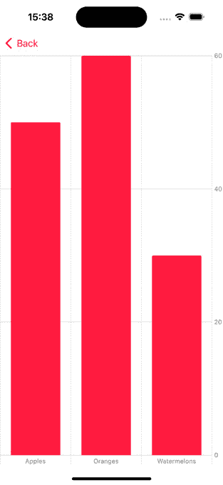

<st c="4422">图 9.1：条形标记图表</st>

*<st c="4449">图 9</st>**<st c="4458">.1</st>* 显示了我们的代码结果——一个包含图例和标题的三个红色条形图视图。<st c="4542">我们可以看到创建图表有多容易，就像我们创建</st> `<st c="4625">列表</st>` <st c="4629">或</st> `<st c="4635">垂直堆叠</st>` <st c="4641">视图</st>一样。

<st c="4647">让我们探索和学习如何创建不同的图表类型，并了解</st> <st c="4727">它们的用法。</st>

# <st c="4739">创建图表</st>

<st c="4755">在我们继续之前，让我们了解</st> <st c="4792">Swift Charts 框架中图表的视图结构。</st> <st c="4854">正如我们从最后一个代码示例中可以看到的，图表视图被称为</st> `<st c="4921">Chart</st>`<st c="4926">：</st>

```swift
<st c="4928">Chart</st>(data) { <st c="4943">BarMark</st>(
                    x: .value("Fruit", $0.itemType),
                    y: .value("qty", $0.qty)
                )
            }
```

<st c="5014">图表中的每个数据点</st> <st c="5030">被称为</st> `<st c="5138">条形标记</st>` <st c="5145">类型。</st> <st c="5152">如果图表接收一个数组作为参数，它会在幕后执行一个</st> `<st c="5213">ForEach</st>` <st c="5220">循环并创建</st> <st c="5253">几个标记。</st>

<st c="5267">实际上，我们可以编写与以下相同的代码：</st> <st c="5309">：</st>

```swift
<st c="5323">Chart</st> { <st c="5332">ForEach</st>(data, id:\.id) { item in <st c="5366">BarMark</st>(x: .value("Fruit",
                              item.itemType),
                            y: .value("qty", item.qty))
                }
            }
```

<st c="5441">在这个代码示例中，我们使用之前相同的数据数组，使用一个</st> `<st c="5522">ForEach</st>` <st c="5529">循环迭代它，并为每个数组项创建一个</st> `<st c="5549">条形标记</st>` <st c="5556">视图。</st> <st c="5583">这个例子对于理解图表是如何构建的至关重要，这样我们就可以在未来自定义和配置</st> <st c="5678">它们。</st>

<st c="5698">现在，让我们进一步探索</st> `<st c="5722">条形标记</st>` <st c="5729">图表</st> <st c="5736">。</st>

## <st c="5749">创建条形标记图表</st>

<st c="5772">我们可以使用基于</st> `<st c="5786">条形标记</st>`<st c="5793">的图表</st> <st c="5806">来比较不同的数据点，例如销售额和各国人口规模。</st> <st c="5893">我们看到了创建具有多个条形标记的图表是多么简单。</st>

<st c="5955">然而，使用条形标记视图创建图表的工作还没有结束。</st> <st c="6023">我们还有更多选项来扩展这个标记，以提供更多信息。</st>

<st c="6097">我们将从一个堆叠的条形图开始。</st>

### <st c="6135">添加堆叠标记</st>

<st c="6156">标准标记代表二维数据点，比较一个值与另一个值。</st> <st c="6202">有时，数据集可能有一个更深层的故事，因为每个条形可能由几个值组成。</st>

例如，让我们拿我们刚刚创建的销售图表来讨论苹果的销售情况。</st> <st c="6434">苹果销售当前值为 50 件。</st> <st c="6480">也许我们想展示这个值是如何在绿色和红色苹果之间分配的。</st> <st c="6563">在这种情况下，我们可以使用</st> <st c="6590">堆叠标记。</st>

<st c="6603">现在，我们将向我们的</st> <st c="6641">现有图表</st> 添加一个堆叠条形图。

<st c="6656">首先，我们需要调整</st> <st c="6681">我们的</st> `<st c="6686">Sales</st>` <st c="6691">结构以包含我们的</st> <st c="6717">fruit color：</st>

```swift
 struct Sales: Identifiable {
    var id: UUID = UUID()
    let itemType: String
    let qty: Int <st c="6816">var fruitColor: String = ""</st> }
```

<st c="6845">现在，我们已经向</st> `<st c="6870">fruitColor</st>` <st c="6880">属性添加到</st> `<st c="6897">Sales</st>` <st c="6902">结构中，我们可以更新</st> <st c="6928">我们的数据集：</st>

```swift
 let data: [Sales] = [
        Sales(itemType: "Apples", qty: 20, fruitColor:
          "Green"),
        Sales(itemType: "Apples", qty: 30, fruitColor:
          "Red"),
        Sales(itemType: "Oranges", qty: 60),
        Sales(itemType: "Watermelons", qty: 30)
]
```

<st c="7153">目前，我们的更新后的数据集</st> <st c="7184">有两个与苹果销售相关的记录，每个记录都包含</st> <st c="7245">销售的颜色。</st>

<st c="7256">现在我们已经有了所有需要的数据，让我们创建一个图表并将每个属性分配给图表中的正确角色：</st>

```swift
 Chart(data) {
            BarMark(x: .value("Fruit", $0.itemType),
                    y: .value("qty", $0.qty)) <st c="7469">.foregroundStyle(by: .value("Color",</st>
 <st c="7505">$0.fruitColor))</st> }
```

<st c="7523">在这个代码示例中，我们唯一的不同之处在于</st> `<st c="7580">foregroundStyle</st>` <st c="7595">视图修改器，它有助于区分不同的水果颜色。</st> <st c="7671">让我们看看</st> *<st c="7695">图 9</st>**<st c="7703">.2</st>*<st c="7705">的结果。</st>

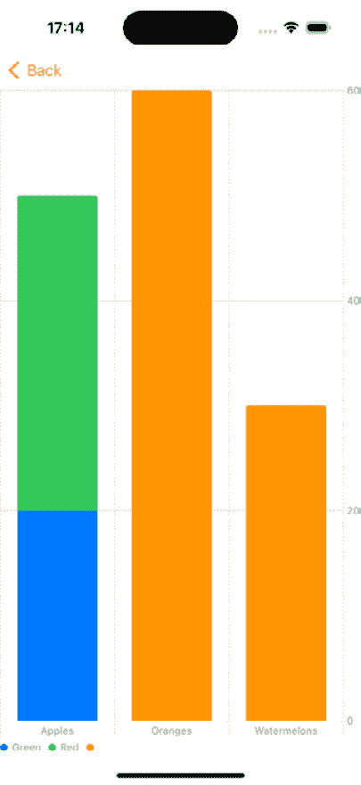

<st c="7712">图 9.2：堆叠条形图视图</st>

<st c="7740">在</st> *<st c="7744">图 9</st>**<st c="7752">.2</st>*<st c="7754">中，我们可以看到苹果条形图是由两种类型的值构建的。</st> <st c="7822">蓝色代表绿色苹果，绿色代表</st> <st c="7881">红色苹果。</st>

<st c="7892">我们看到了当我们添加具有相同</st> <st c="7930">x</st> <st c="7945">值的几个标记时，图表框架知道如何将它们堆叠在一起。</st>

<st c="8009">接下来，让我们看看当我们没有向我们的</st> *<st c="8057">y</st>* <st c="8058">值添加数据时会发生什么。</st>

### <st c="8082">添加一维条形标记</st>

<st c="8102">大多数图表都是二维的，这意味着</st> <st c="8143">它们有一个</st> *<st c="8157">x</st>* <st c="8158">和</st> *<st c="8163">y</st>* <st c="8164">轴，用于比较不同的数据类别。</st> <st c="8211">然而，我们可以专注于一个类别（这意味着图表将只有一个</st> *<st c="8287">y</st>* <st c="8288">轴值）并创建一个</st> <st c="8314">一维图表。</st>

<st c="8336">例如，让我们从上一个例子中的苹果类别开始，并尝试基于它创建一个一维条形图。</st> <st c="8440">。</st>

<st c="8446">首先，让我们丰富我们的数据，并添加</st> `<st c="8484">黄色</st>` <st c="8490">作为额外的</st> <st c="8508">水果颜色：</st>

```swift
 let data: [Sales] = [
        Sales(itemType: "Apples", qty: 20, fruitColor:
              "Green"),
        Sales(itemType: "Apples", qty: 30, fruitColor:
              "Red"), <st c="8655">Sales(itemType: "Apples", qty: 40, fruitColor:</st>
 <st c="8701">"Yellow"),</st> ]
```

<st c="8714">我们的数据集现在包括</st> <st c="8738">的</st> `<st c="8743">绿色</st>`<st c="8748">、</st> `<st c="8750">红色</st>`<st c="8753">，和</st> `<st c="8759">黄色</st>` <st c="8765">水果</st> <st c="8771">颜色。</st>

<st c="8779">接下来，让我们创建我们的图表，但这次，我们不会定义</st> <st c="8841">的</st> *<st c="8845">y</st>*<st c="8846">-轴：</st>

```swift
 Chart(data) {
                BarMark( <st c="8876">x: .value("Qty", $0.qty)</st> )
                .foregroundStyle(by: .value("Color",
                  $0.fruitColor))
            }
```

<st c="8957">在这个代码示例中，我们只传递了</st> `<st c="8999">x</st>` `<st c="9000">BarMark</st>` <st c="9007">参数。</st> <st c="9019">然而，如果我们检查</st> `<st c="9046">BarMark</st>` <st c="9053">标题，我们可以看到有一个只需要</st> `<st c="9118">x</st>` <st c="9119">参数的方法：</st>

```swift
 public init<X>(<st c="9316">init()</st> function in this code example is the method that we are using. Now, let’s see what the chart we create looks like when it’s only one-dimensional (*<st c="9469">Figure 9</st>**<st c="9478">.3</st>*):
			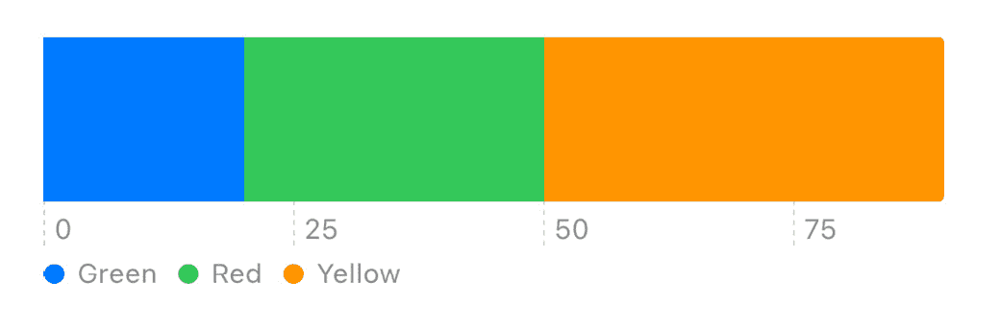

			<st c="9510">Figure 9.3: A 1D chart</st>
			<st c="9532">In</st> *<st c="9536">Figure 9</st>**<st c="9544">.3</st>*<st c="9546">, our data is presented in a one-dimensional chart presenting three different types</st> <st c="9630">of apples.</st>
			<st c="9640">One thing still bothers us here: notice</st> <st c="9680">that the fruit colors don’t match</st> <st c="9714">the actual colors the Charts framework assigned to each fruit when it created the chart.</st> <st c="9804">That’s because the Charts framework generates the colors while encoding the value.</st> <st c="9887">If we want to match the fruit color to the chart presented color, we need to use the</st> `<st c="9972">chartForegroundStyleScale</st>` <st c="9997">view modifier:</st>

```

Chart(data) {

                BarMark(

                    x: .value("Qty", $0.qty)

                )

                .foregroundStyle(by: .value("Color",

                $0.fruitColor))

            } <st c="10118">.chartForegroundStyleScale("Green" :</st>

<st c="10155">Color.green, "Red" : Color.red,</st>

<st c="10218">chartForegroundStyleScale</st>函数是一个我们可以应用于 Chart 和不同<st c="10312">ShapeStyle</st>协议的视图修改器。在这种情况下，我们使用反映水果颜色的颜色并提高清晰度。

            *<st c="10431">图 9</st>**<st c="10440">.4</st>* <st c="10442">显示了如何将颜色匹配到</st> <st c="10503">名称后图表的外观：</st>

            ![图 9.4：具有自定义颜色的 1D 图表

            <st c="10547">图 9.4：具有自定义颜色的 1D 图表</st>

            <st c="10588">我们可以使用</st> `<st c="10600">chartForegroundStyleScale</st>` <st c="10625">不仅适用于 1D 图表，也适用于所有其他类型的</st> <st c="10678">图表。</st>

            <st c="10688">我们看到了如何</st> <st c="10699">使用 BarMarks</st> <st c="10715">进行堆叠和一维标记。</st> <st c="10755">另一种我们可以使用 BarMarks 的方法是用于区间</st> <st c="10807">条形图。</st>

            <st c="10818">添加区间条形图</st>

            <st c="10845">我们使用</st> **<st c="10853">区间条形图</st>** <st c="10872">来表示按区间分组的数据，例如</st> <st c="10898">时期、年龄组、或</st> <st c="10920">数值范围。</st>

            <st c="10965">例如，假设我们想显示一份工人及其在一天中工作的时间间隔的列表。</st>

            <st c="11080">首先，让我们创建一个表示一系列</st> <st c="11138">工作时段的数据集：</st>

```swift
 let emma = "Emma Johnson"
let liam = "Liam Patel"
let sophia = "Sophia Garcia"
let data: [EmployeDayWork] = [
        EmployeDayWork(name:emma, startTime: 10, endTime:
          12),
        EmployeDayWork(name:liam, startTime: 8, endTime:
          11),
        EmployeDayWork(name: sophia, startTime: 10.5,
          endTime: 11.5),
        EmployeDayWork(name: emma, startTime: 14, endTime:
          15),
        EmployeDayWork(name: liam, startTime: 13.5,
          endTime: 14.2),
        EmployeDayWork(name: sophia, startTime: 15,
          endTime: 16)
]
```

            <st c="11610">数据</st> `<st c="11628">数组中的每个项目</st>` <st c="11632">代表一名员工的工时。</st> <st c="11681">请注意，我们并不关心项目的顺序——Charts 框架负责正确地排序它们。</st> <st c="11795">然而，我们关心与员工姓名的一致性，因此 Charts 框架也可以正确地</st> <st c="11904">分组</st> <st c="11905">这些项目。</st>

            <st c="11914">让我们看看我们如何基于</st> <st c="11941">那个数据集</st> <st c="11965">构建</st> <st c="11969">一个区间图表：</st>

```swift
 Chart(data) {
                BarMark( <st c="12006">xStart</st>: .value("Start", $0.startTime), <st c="12046">xEnd</st>: .value("End", $0.endTime), <st c="12080">y</st>: .value("Employee", $0.name)
                )
            }
```

            <st c="12114">在这个代码示例中，我们创建了一个包含新参数的 BarMark 初始化器——</st>`<st c="12198">xStart</st>`<st c="12205">，它表示区间开始的价值，</st> `<st c="12261">xEnd</st>`<st c="12265">，详细说明它结束的位置，以及</st> `<st c="12296">y</st>`<st c="12297">，员工的姓名。</st>

            <st c="12319">现在，让我们看看当我们运行它时区间图表看起来像什么（</st>*<st c="12379">图 9</st>**<st c="12388">.5</st>*<st c="12390">）：</st>

            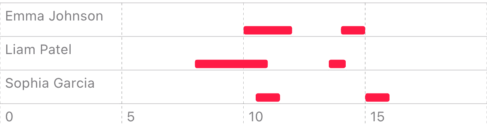

            <st c="12444">图 9.5：一个区间图表</st>

            <st c="12473">在</st> *<st c="12477">图 9</st>**<st c="12485">.5</st>*<st c="12487">中，我们可以看到一个时间线，其中每个员工都代表一行，他们的工作周期是这个时间线中的</st><st c="12600">区间。</st> <st c="12622">区间条形图是一个复杂的组件的例子，从头开始构建可能很复杂，而 Charts 框架可以简化</st> <st c="12771">这个过程。</st>

            <st c="12783">BarMark 看起来是一个非常灵活的图表类型，这也是它如此常见的原因之一。</st> <st c="12878">它允许我们展示不同类型的信息，无论是比较值还是随时间变化的不同趋势，在堆叠、一维或</st> <st c="13019">区间布局中。</st>

            <st c="13036">然而，有时，选择一个更具体的图表</st> <st c="13077">来更精确地表达数据</st> <st c="13107">可能是一个更好的选择。</st>

            <st c="13143">所以，让我</st><st c="13156">们设置</st> <st c="13164">LineMark 图表。</st>

            <st c="13179">创建 LineMark 图表</st>

            <st c="13204">在表格中展示数据的一个挑战是展示趋势和模式。</st> <st c="13245">尽管 BarMark 图表类型比表格做得更好，但还有更好的方法来展示趋势，尤其是在处理大量</st> <st c="13439">信息时。</st>

            <st c="13454">为了更有效地展示趋势和模式，我们可以使用 LineMark 图表，它使用表示一系列</st> <st c="13590">数据点的线来表示数据。</st>

            <st c="13602">让我们以一个显示随时间变化的手机销售图表为例。</st> <st c="13670">我们创建了一个名为</st> `<st c="13698">SalesFigure</st>` <st c="13709">的结构</st>，其中包含有关产品类型、销售日期和</st> <st c="13790">总金额的信息：</st>

```swift
 struct SalesFigure: Identifiable {
    var id: UUID = UUID()
    let product: String
    let day: Date
    let amount: Double
}
```

            <st c="13915">现在我们有了结构，让我们创建</st> <st c="13958">我们的数据集，就像我们在所有</st> <st c="13990">之前的示例中所做的那样：</st>

```swift
 let phoneProduct = "Phone"
let salesFigures: [SalesFigure] = [
        SalesFigure(product: phoneProduct, day:
          Date(timeIntervalSince1970: 1714078800), amount:
            100),
        SalesFigure(product: phoneProduct, day:
          Date(timeIntervalSince1970: 1714165200), amount:
            120),
        SalesFigure(product: phoneProduct, day:
          Date(timeIntervalSince1970: 1714251600), amount:
            90),
        SalesFigure(product: phoneProduct, day:
          Date(timeIntervalSince1970: 1714338000), amount:
            70)
    ]
```

            <st c="14450">`salesFigures`</st> <st c="14455">变量包含有关四天销售的信息。</st> <st c="14467">LineMark 图表适合处理多个条目，但我们只使用四个进行</st> <st c="14611">演示目的。</st>

            <st c="14634">现在，让我们使用</st> `<st c="14658">salesFigures</st>` <st c="14670">变量通过</st> `<st c="14701">LinkMark</st>` <st c="14709">视图连接到一个图表：</st>

```swift
 Chart(salesFigures) { <st c="14738">LineMark(</st>
 <st c="14747">x: .value("time", $0.day),</st>
 <st c="14774">y: .value("amount", $0.amount)</st>
 <st c="14805">)</st> }
```

            <st c="14809">我们在图表内创建了一个 LineMark，将日期设置为</st> *<st c="14872">x</st>* <st c="14873">轴，数量设置为</st> *<st c="14901">y</st>* <st c="14902">轴。</st> <st c="14909">运行此代码应显示一个类似于</st> *<st c="14966">图 9</st>**<st c="14974">.6</st>*<st c="14976">:</st>

            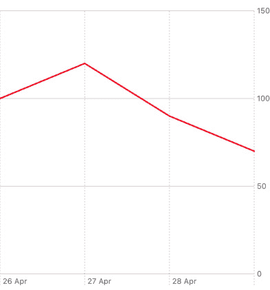

            <st c="15010">图 9.6：一个 LineMark 图表</st>

            <st c="15038">图</st> *<st c="15052">9</st>**<st c="15060">.6</st>* <st c="15062">显示了数据集期间手机销售的下降趋势。</st> <st c="15129">关于折线图的好处是，它很容易比较一个 LineMark 与另一个。</st> <st c="15213">我们只需要更新我们的数据集。</st> <st c="15257">因此，让我们也添加平板电脑销售以与</st> <st c="15308">手机销售进行比较：</st>

```swift
<st c="15320">let tabletProduct = "Tablet"</st> let salesFigures: [SalesFigure] = [
        SalesFigure(product: phoneProduct, day:
          Date(timeIntervalSince1970: 1714078800), amount:
            100), <st c="15481">SalesFigure(product: tabletProduct, day:</st>
 <st c="15521">Date(timeIntervalSince1970: 1714078800), amount:</st>
 <st c="15570">70),</st> // …
        SalesFigure(product: phoneProduct, day:
          Date(timeIntervalSince1970: 1714338000), amount:
            70), <st c="15675">SalesFigure(product: tabletProduct, day:</st>
 <st c="15715">Date(timeIntervalSince1970: 1714338000), amount:</st>
 <st c="15764">110)</st> ]
```

            <st c="15771">在这个代码示例中，我们通过向数组中添加平板电脑销售数据项来更新</st> <st c="15804">我们的数据集。</st>

            <st c="15866">为了使图表在两种产品类型之间区分开来，我们使用</st> `<st c="15936">foregroundStyle</st>` <st c="15951">视图修饰符：</st>

```swift
 LineMark(
     x: .value("time", $0.day),
     y: .value("amount", $0.amount)
     )<st c="16099">foregroundStyle</st> view modifier applies different styles to different product types. Looking at the code, we can see that the chart can distinguish between these two types.
			<st c="16269">Let’s see what the chart looks like after we have added the tablet sales figures (</st>*<st c="16352">Figure 9</st>**<st c="16361">.7</st>*<st c="16363">):</st>
			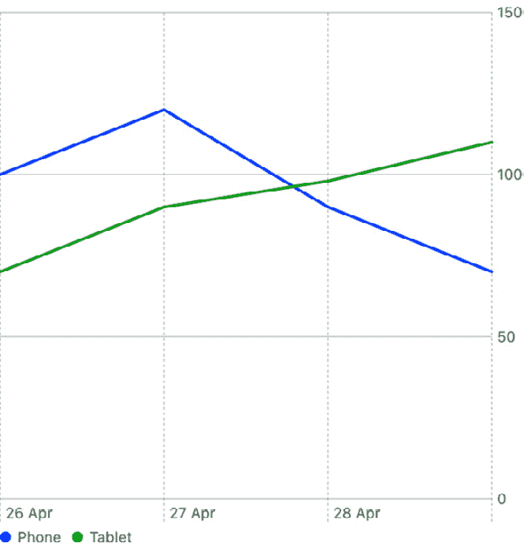

			<st c="16416">Figure 9.7: LineMark chart with two types of product sales figures</st>
			*<st c="16482">Figure 9</st>**<st c="16491">.7</st>* <st c="16493">shows tablet sales compared to phone sales.</st> <st c="16538">We can see that while the phone sales declined, the tablet sales increased.</st> <st c="16614">That’s an insight that is difficult to get just from</st> <st c="16667">the dataset.</st>
			<st c="16679">Thus far, we have created two primary</st> <st c="16717">types of charts: bar and line charts.</st> <st c="16756">These two types are pretty popular, as they are simple to understand and work for many</st> <st c="16843">use cases.</st>
			<st c="16853">Another popular chart type Apple added in iOS 17 is</st> **<st c="16906">SectorMark</st>**<st c="16916">, also known as a</st> <st c="16934">pie chart.</st>
			<st c="16944">Creating a SectorMark chart</st>
			<st c="16972">A SectorMark, or pie, chart</st> <st c="17000">provides a way to visualize the proportions of different values.</st> <st c="17066">Unlike the other charts, the pie chart is based on a circular shape divided into slices, and each slide represents a different</st> <st c="17193">item value.</st>
			<st c="17204">Apparently, the SectorMark chart looks like another form of Stacked Marks we covered earlier (under</st> *<st c="17305">Adding</st>* *<st c="17312">Stacked Marks</st>*<st c="17325">).</st>
			<st c="17328">However, SectorMark charts became more popular than Stacked Marks as they are visually appealing and easier to understand.</st> <st c="17452">Moreover, StackedMark and SectorMark charts are excellent for comparing different parts and seeing their contribution to the whole.</st> <st c="17584">However, stacked marks are practical when we want to compare one whole to another, and SectorMark charts are helpful when we want to focus on</st> <st c="17726">one whole.</st>
			<st c="17736">Like the previous examples, to create a SectorMark chart, we need to prepare a dataset.</st> <st c="17825">So, let’s create a dataset representing a poll result about</st> <st c="17885">consuming fruits:</st>

```

let data: [最喜欢的水果] = [

        最喜欢的水果（名称："Apple"，价值：30）,

        最喜欢的水果（名称："Banana"，价值：25）,

        最喜欢的水果（名称："Orange"，价值：20）,

        最喜欢的水果（名称："Strawberries"，价值：15）,

        最喜欢的水果（名称："Grapes"，价值：10）

    ]

```swift

			<st c="18148">In this example, we created a structure named</st> `<st c="18195">FavoriteFruit</st>`<st c="18208">, which contains the name of the fruit and the number of people who chose</st> <st c="18282">that fruit.</st>
			<st c="18293">To use the data dataset, we will add a</st> `<st c="18333">SectorMark</st>` <st c="18343">view to</st> <st c="18352">our chart:</st>

```

图表（数据）{item in <st c="18384">扇形标记（角度：.value("Value", item.value))</st> .foregroundStyle(by: .value("Fruit",

                    item.name))

        }

```swift

			<st c="18480">The</st> `<st c="18485">SectorMark</st>` <st c="18495">structure has an angle parameter that reflects the numeric value of the slice.</st> <st c="18575">We also added the</st> `<st c="18593">foregroundStyle</st>` <st c="18608">view modifier, which colors the slice according to the item’s</st> <st c="18671">fruit property.</st>
			<st c="18686">Let’s look at what the SectorMark chart looks like when running our code (</st>*<st c="18761">Figure 9</st>**<st c="18770">.8</st>*<st c="18772">):</st>
			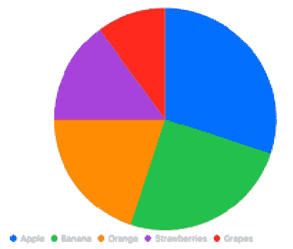

			<st c="18777">Figure 9.8: SectorMark chart</st>
			*<st c="18805">Figure 9</st>**<st c="18814">.8</st>* <st c="18816">shows a beautiful, colorful pie</st> <st c="18848">chart, including the legend titles.</st> <st c="18885">We can even set an inner radius to add a</st> **<st c="18926">donut style</st>** <st c="18937">to</st> <st c="18941">the chart:</st>

```

图表（数据）{item in

    扇形标记（角度：.value("Value", item.value)，<st c="19020">内半径：50</st>）

    .foregroundStyle(by: .value("Fruit", item.name))

}

```swift

			<st c="19088">The addition of the inner radius creates a</st> **<st c="19132">hole</st>** <st c="19136">in the pie chart, as we can see in</st> *<st c="19172">Figure 9</st>**<st c="19180">.9</st>*<st c="19182">:</st>
			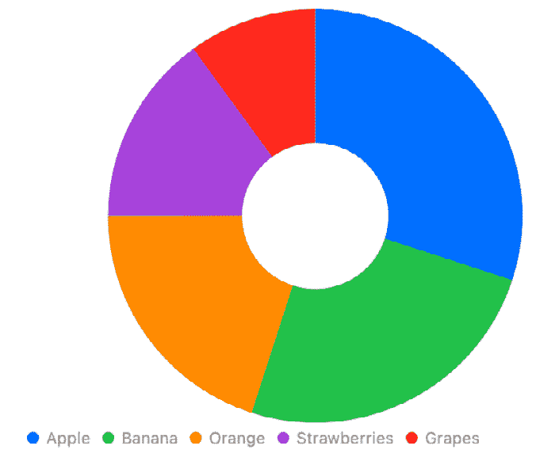

			<st c="19185">Figure 9.9: A SectorMark chart with an inner radius</st>
			*<st c="19236">Figure 9</st>**<st c="19245">.9</st>* <st c="19247">shows a donut-shaped SectorMark chart.</st> <st c="19287">This shape allows us to provide more information in the center of the chart.</st> <st c="19364">Some even say that this form is more readable to users as it eliminates the need to</st> <st c="19448">compare angles.</st>
			<st c="19463">Until now, we have</st> <st c="19482">created</st> `<st c="19491">BarMark</st>`<st c="19498">,</st> `<st c="19500">LineMark</st>`<st c="19508">, and</st> `<st c="19514">SectorMark</st>` <st c="19524">charts.</st> <st c="19533">The following chart combines two charts we discussed – the LineMark and stacked BarMark charts.</st> <st c="19629">That’s the</st> `<st c="19640">AreaMark</st>` <st c="19648">chart.</st>
			<st c="19655">Creating an AreaMark chart</st>
			<st c="19682">The stacked BarMark chart</st> <st c="19708">we discussed under the</st> *<st c="19732">Adding Stacked Marks</st>* <st c="19752">section shows two important figures – the total value of a category and how that total is divided into sub-categories while observing the different proportions.</st> <st c="19914">The LineMark chart, on the other hand, shows the trend or patterns between different</st> <st c="19999">data points.</st>
			<st c="20011">However, what if we want to combine these two types of marks, showing how a value is composed of different categories</st> <st c="20130">over time?</st>
			<st c="20140">That’s what the AreaMark chart</st> <st c="20172">is for.</st>
			<st c="20179">Let’s take our LineMark sales figures example.</st> <st c="20227">We have a dataset representing phone and tablet sales over time.</st> <st c="20292">Now, we want to see the total sales of these two types of products over time while still observing the different trends of</st> <st c="20415">each product.</st>
			<st c="20428">So, we can create an</st> `<st c="20450">AreaMark</st>` <st c="20458">chart based on the</st> <st c="20478">same dataset:</st>

```

图表（销售数据）{ data in <st c="20522">AreaMark</st>(

                x: .value("Date", data.day),

                y: .value("Sales", data.amount)

            )

            .foregroundStyle(by: .value("Product",

            data.product))

        }

```swift

			<st c="20651">Our code example is identical</st> <st c="20681">to the LineMark example we discussed under the</st> *<st c="20729">Creating LineMark charts</st>* <st c="20753">section; the only difference is that we are now using AreaMark instead</st> <st c="20825">of LineMark.</st>
			<st c="20837">However, the result is different (</st>*<st c="20872">Figure 9</st>**<st c="20881">.10</st>*<st c="20884">):</st>
			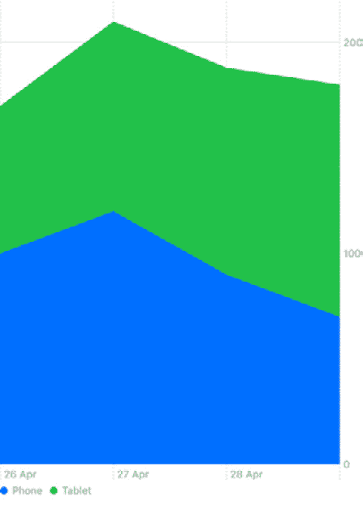

			<st c="20889">Figure 9.10: An AreaMark chart for total sales</st>
			<st c="20935">At first glance,</st> *<st c="20953">Figure 9</st>**<st c="20961">.10</st>* <st c="20964">shows similar information as</st> *<st c="20994">Figure 9</st>**<st c="21002">.7</st>*<st c="21004">—trends of product sales figures.</st> <st c="21039">However, there are differences.</st> <st c="21071">The filled area in</st> *<st c="21090">Figure 9</st>**<st c="21098">.10</st>* <st c="21101">represents the</st> **<st c="21117">total sales</st>** <st c="21128">of products for both phones and tablets, and each color represents a different product type.</st> <st c="21222">On the other hand,</st> *<st c="21241">Figure 9</st>**<st c="21249">.7</st>* <st c="21251">only shows a comparison between these two product types, side</st> <st c="21314">by side.</st>
			<st c="21322">The AreaMark chart</st> <st c="21341">is great for market share analysis, financial data visualization, and general information, including data trends and</st> <st c="21459">cumulative totals.</st>
			<st c="21477">However, charts can give us much more than data comparison and trends.</st> <st c="21549">Let’s meet our final chart, PointMark, which can provide a different level</st> <st c="21624">of insight.</st>
			<st c="21635">Creating a PointMark chart</st>
			<st c="21662">Until now, we have discussed</st> <st c="21691">marks that have helped us compare sales figures or observe trends.</st> <st c="21759">What about areas such as correlation analysis or predictive modeling?</st> <st c="21829">To fulfill that need, the PointMark chart, also known as the</st> **<st c="21890">scatterplot chart</st>**<st c="21907">, aims to show the relatio</st><st c="21933">nships</st> <st c="21940">between</st> <st c="21949">two variables.</st>
			<st c="21963">Let’s find the correlation</st> <st c="21990">between students’ study hours and grades.</st> <st c="22033">First, we create a dataset representing</st> <st c="22073">the data:</st>

```

struct StudentData: Identifiable {

    var id: UUID = UUID()

    var hoursStudied: Double

    var examScore: Double

}

let studentDataSet: [StudentData] = 

    学生数据（学习时长：1.7 小时，考试成绩：61.8 分）,

    学生数据（学习时长：7.9 小时，考试成绩：78.6 分）,

    学生数据（学习时长：4.1 小时，考试成绩：44.3 分）,

    学生数据（学习时长：4.7 小时，考试成绩：63.4 分）,

    学生数据（学习时长：7.8 小时，考试成绩：90.4 分）,

    学生数据（学习时长：8.6 小时，考试成绩：83.2 分）,

    学生数据（学习时长：2.8 小时，考试成绩：29.7 分）,

    学生数据（学习时长：6.3 小时，考试成绩：72.9 分）,

    学生数据（学习时长：6.4 小时，考试成绩：73.8 分）,

    `)`

`<st c="28753">chartOverlay</st> view modifier in this code example.` 

```swift

			<st c="22717">This code example has a</st> `<st c="22742">StudentData</st>` <st c="22753">structure containing information about student study time and grades.</st> `<st c="22824">studentsDataSet</st>` <st c="22839">is an array that contains information about</st> <st c="22884">ten students.</st>
			<st c="22897">Now, let’s create a</st> `<st c="22918">PointMark</st>` <st c="22927">chart based on</st> <st c="22943">that array:</st>

```

`<st c="29988">图 9.14：图表和 chartOverlay 结构</st>`

`<st c="23025">y: .value("score", $0.examScore))</st>` }

```swift

			<st c="23061">Like previous charts, the</st> `<st c="23087">PointMark</st>` <st c="23096">structure</st> <st c="23106">has</st> `<st c="23111">x</st>` <st c="23112">and</st> `<st c="23117">y</st>` <st c="23118">parameters.</st> <st c="23131">The</st> `<st c="23135">x</st>` <st c="23136">parameter represents the hours studied, and the</st> `<st c="23185">y</st>` <st c="23186">parameter represents</st> <st c="23208">the score.</st>
			*<st c="23218">Figure 9</st>**<st c="23227">.11</st>* <st c="23230">shows what the</st> `<st c="23246">PointMark</st>` <st c="23255">chart looks like when running</st> <st c="23286">the code:</st>

			![Figure 9.11: PointMark chart			<st c="23300">Figure 9.11: PointMark chart</st>			*<st c="23328">Figure 9</st>**<st c="23337">.11</st>* <st c="23340">shows that most students achieve high grades when studying more hours.</st> <st c="23412">We can also identify one student who managed to achieve a mid-level grade almost without studying</st> <st c="23510">at all!</st>			<st c="23517">Even though PointMark is less common than the previous charts we reviewed, it can be helpful in financial, CRM, or</st> <st c="23633">education apps.</st>			<st c="23648">Speaking of education apps, many apps require other types of charts.</st> <st c="23718">That includes charts that are based on functions</st> <st c="23766">and not datasets.</st> <st c="23785">With Charts, we can also work more dynamically and straightforwardly visualize functions.</st> <st c="23875">Let’s see how to</st> <st c="23892">do that.</st>			<st c="23900">Visualizing functions with Charts</st>			<st c="23934">Until now, we have discussed</st> <st c="23963">how to build charts using datasets, which include raw data</st> <st c="24022">information such as sales figures, market shares, or usage trends.</st> <st c="24090">However, we don’t have to use datasets to create charts, as functions can also perform as a data source for</st> <st c="24198">our charts.</st>			<st c="24209">For example, we may want to display a normal distribution line graph next to our BarMark chart.</st> <st c="24306">We could also create an education app that displays mathematical functions such as circles or a</st> <st c="24402">sinus function.</st>			<st c="24417">To do that, we need to use a different</st> <st c="24456">type of chart</st> <st c="24471">called</st> **<st c="24478">plot</st>**<st c="24482">.</st>			<st c="24483">The Charts framework has two types of plots –</st> `<st c="24530">LinePlot</st>` <st c="24538">and</st> `<st c="24543">AreaPlot</st>`<st c="24551">. Let’s see an example of</st> `<st c="24577">LinePlot</st>` <st c="24585">sh</st><st c="24588">owing a graph for a</st> <st c="24609">sinus function:</st>````}`        `return sin(x)`    `Chart { <st c="25162">AreaPlot</st>(x:"x", y:"y") { x in``Chart(studentDataSet) { <st c="22979">PointMark(x: .value("hours", $0.hoursStudied),````swift			<st c="24681">In this (very!) short code example, we added a</st> `<st c="24729">LinePlot</st>` <st c="24737">chart with a closure that returns the</st> `<st c="24776">y</st>` <st c="24777">value of a given</st> `<st c="24795">x</st>` <st c="24796">value.</st> <st c="24804">In this case, we used a simple</st> `<st c="24835">sin</st>` <st c="24838">function.</st> *<st c="24849">Figure 9</st>**<st c="24857">.12</st>* <st c="24860">shows what the chart</st> <st c="24882">looks like:</st>			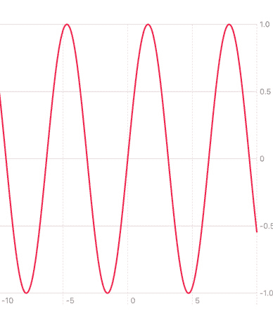

			<st c="24895">Figure 9.12: A LinePlot chart</st>
			<st c="24924">In</st> *<st c="24928">Figure 9</st>**<st c="24936">.12</st>*<st c="24939">, we can see the</st> `<st c="24956">LinePlot</st>` <st c="24964">chart generated from a simple</st> <st c="24995">mathematical function.</st>
			<st c="25017">As mentioned earlier</st> <st c="25038">in this section, the second chart type we can use to visualize</st> <st c="25101">functions is</st> `<st c="25115">AreaPlot</st>`<st c="25123">, the equivalent</st> <st c="25140">of</st> `<st c="25143">AreaMark</st>`<st c="25151">:</st>

```

`y: .value("amount", $0.amount)`

        `return sin(x)`

    `.foregroundStyle(by: .value("Product",`

`}`

```swift

			<st c="25210">In this code example, we only changed the chart type from</st> `<st c="25269">LinePlot</st>` <st c="25277">to</st> `<st c="25281">AreaPlot</st>`<st c="25289">.</st> `<st c="25291">AreaPlot</st>` <st c="25299">visualizes the function by filling the area it defines.</st> <st c="25356">Let’s see the output in</st> *<st c="25380">Figure 9</st>**<st c="25388">.13</st>*<st c="25391">:</st>
			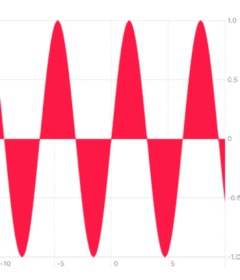

			<st c="25394">Figure 9.13: The AreaPlot chart type</st>
			*<st c="25430">Figure 9</st>**<st c="25439">.13</st>* <st c="25442">shows the same sinus function graph, now filled</st> <st c="25491">with color.</st>
			<st c="25502">Using the LinePlot and AreaPlot chart types to visualize math functions is about much more than just showing how the sinus function behaves.</st> <st c="25644">It is excellent for education, scientific research, finance, health, and business apps.</st> <st c="25732">Now that we know how to create LinePlot and AreaPlot, we have whole</st> <st c="25800">new options.</st>
			<st c="25812">We went over many chart</st> <st c="25836">types, and by now, we can quickly</st> <st c="25870">create charts, just like creating a</st> <st c="25907">simple list!</st>
			<st c="25919">The</st> **<st c="25924">List</st>** <st c="25928">type provides a way to interact</st> <st c="25960">with its items, allowing us to navigate or delve into more information.</st> <st c="26033">So, let’s see how to make our</st> <st c="26063">charts interactive!</st>
			<st c="26082">Allowing interaction using ChartProxy</st>
			<st c="26120">Now that we know how to create</st> <st c="26151">charts, let’s discover more hidden tricks by adding user interaction capabilities.</st> <st c="26235">User interaction in charts, with its many uses, allows users to explore the chart’s data using touch.</st> <st c="26337">Here are some use cases for user interaction</st> <st c="26382">with charts:</st>

				*   `<st c="26446">BarMark</st>` <st c="26453">or</st> `<st c="26457">SectorMark</st>` <st c="26467">charts, the user can navigate to a new screen that shows additional information about the particular data point.</st> <st c="26581">For example, if the</st> `<st c="26601">BarMark</st>` <st c="26608">chart shows information about watermelon sales, we can navigate the user to a screen that details the watermelon</st> <st c="26722">sales deals.</st>
				*   `<st c="26794">LineMark</st>` <st c="26802">charts, for example, provides insights to the user on data points not originally part of the dataset if our</st> `<st c="26911">LinkMark</st>` <st c="26919">chart includes information about the growing population in a specific city over time, touching a particular point the chart can display the population value on a</st> <st c="27082">specific date.</st>
				*   **<st c="27096">Comparing data marks</st>**<st c="27117">: The user can highlight and compare multiple data marks, which is extremely useful in</st> <st c="27205">BarMark-based charts.</st>

			<st c="27226">Moreover, learning how to add interaction capabilities can help us explore more things with our charts, such as how the charts are built and how their calculation</st> <st c="27390">logic works.</st>
			<st c="27402">To understand how interaction works, we need to get to know more Swift Charts</st> <st c="27481">framework components:</st>

				*   `<st c="27502">chartOverlay</st>`<st c="27515">: This is a view modifier that helps us add an overlay view to a chart.</st> <st c="27588">We can use the</st> `<st c="27603">chartOverlay</st>` <st c="27615">view modifier to add more graphic details to our chart, such as rulers and texts.</st> <st c="27698">We can also use the</st> `<st c="27718">chartOverlay</st>` <st c="27730">view modifier to observe gestures and</st> <st c="27769">user interaction.</st>
				*   `<st c="27786">ChartProxy</st>`<st c="27797">: This is a proxy that lets us access the chart values based on the chart area.</st> <st c="27878">Using</st> `<st c="27884">ChartProxy</st>`<st c="27894">, we can convert locations to values and</st> <st c="27935">vice versa.</st>

			`<st c="27946">ChartOverlay</st>` <st c="27959">and</st> `<st c="27964">ChartProxy</st>` <st c="27974">are essential components when handling user interaction; therefore, they come hand in hand.</st> <st c="28067">When adding a</st> `<st c="28081">chartOverlay</st>` <st c="28093">view modifier, it comes with a prox</st><st c="28129">y</st> <st c="28131">to have complete access to</st> <st c="28159">the chart.</st>
			<st c="28169">Let’s try to take a LineMark chart and add a horizontal ruler that allows users to drag their fingers across it.</st> <st c="28283">We’ll start by adding</st> <st c="28305">an overlay.</st>
			<st c="28316">Adding an overlay to our chart</st>
			<st c="28347">The solution for providing</st> <st c="28374">an overlay to our chart consists</st> <st c="28407">of a common practice in SwiftUI using a view modifier.</st> <st c="28463">Look at the following</st> <st c="28485">code example:</st>

```

`Chart(salesFigures){}`

            `<st c="29629">我们将根据用户的</st>` `<st c="29680">点击位置</st>` 

                `x: .value("time", $0.day),`

                `]`

            `}`

            `<st c="28801">我们可以看到</st>` `<st c="28818">chartOverlay</st>` `<st c="28830">附带了一个</st>` `<st c="28844">代理</st>` `<st c="28849">变量，它就是之前讨论过的</st>` `<st c="28873">ChartProxy</st>` `<st c="28883">组件。</st>`

            `$0.product))`

        `<st c="28644">.chartOverlay { proxy in`

`StudentData(hoursStudied: 6.1, examScore: 77.6)`

            `LineMark(`

            `<st c="28915">ChartOverlay</st>` `<st c="28928">不是一个视图，而是一个视图修饰符，它允许我们在图表中添加新的视图。</st>` `<st c="29004">因此，为了识别手势并添加一个仪表，我们可以添加一个带有拖动手势的透明视图，并添加一个</st>` `<st c="29107">仪表视图：</st>`

```swift
 .chartOverlay { proxy in
            ZStack(alignment: .topLeading) {
                    Rectangle().fill(.clear)
                        .contentShape(Rectangle())
                        .gesture(
                            DragGesture()
                                .onChanged { value in
                            }
                        )
                    let lineHeight = proxy.plotSize.height
                    Rectangle()
                        .fill(.red)
                        .frame(width: 2, height:
                          lineHeight)
                        .position(x: markerX, y:
                          lineHeight/2)
            }
        }
```

            `Chart { <st c="24633">LinePlot</st>(x:"x", y:"y") { x in`

```swift
 @State var markerX: CGFloat = 50
```

            ``

            `<st c="29420">在这个代码示例中，我们添加了一个</st>` `<st c="29454">ZStack</st>` `<st c="29460">视图，它有一个清晰的矩形覆盖整个图表，在其上方是一个红色的仪表视图。</st>` `<st c="29554">仪表视图</st>` `<st c="29569">x</st>` `<st c="29570">轴是一个</st>` `<st c="29581">状态变量：</st>`

            `<st c="29924">要查看我们的视图结构，请看</st>` `<st c="29960">图</st>**<st c="29968">9</st>**<st c="29971">.14</st>` `<st c="29971">：</st>`

            `<st c="30310">响应用户的手势</st>`

            `}`

            `<st c="30034">图</st>**<st c="30043">9</st>**<st c="30046">.14</st>` `<st c="30046">显示了我们的图表视图和通过</st>` `<st c="30105">chartOverlay</st>` `<st c="30117">视图修饰符添加的矩形。</st>` `<st c="30133">我们还可以看到它们是通过</st>` `<st c="30183">代理对象连接的。</st>`

            `<st c="30196">此外，我们还添加了</st>` `<st c="30211">一个拖动手势</st>` `<st c="30226">到矩形上。</st>` `<st c="30245">让我们看看如何使用它来相应地改变我们的仪表</st>` `<st c="30289">位置。</st>`

            `<st c="29694">注意，我们使用了我们的</st>` `<st c="29719">代理</st>` `<st c="29724">对象来确定</st>` `<st c="29744">仪表视图的图表大小。</st>` `<st c="29780">这是一个关键的代理</st>` `<st c="29801">使用，因为我们还需要在其他场合使用它，例如在特定位置显示不同视图的计算。</st>`

            `<st c="30343">为了响应用户的手势</st>` `<st c="30376">并将水平仪表移动到最接近的数据点，我们需要实现</st>` `<st c="30459">onChanged</st>` `<st c="30468">闭包：</st>`

```swift
 .onChanged { value in <st c="30499">mark</st><st c="30503">erX = value.location.x</st>
 <st c="30526">if let closestDate = getClosestDateForLocation(x:</st>
 <st c="30576">value.location.x, proxy: proxy) {</st>
 <st c="30610">if let positionX = proxy.position(forX:</st>
 <st c="30650">closestDate) {</st>
 <st c="30665">markerX = positionX</st> }
}
```

            <st c="30689">The</st> `<st c="30694">onChanged</st>` <st c="30703">closure implementation does</st> <st c="30732">three things:</st>

                +   <st c="30745">首先，它</st> *<st c="30756">根据点击位置和代理找到最近的销售额数据点</st>* <st c="30790">。 <st c="30836">我们将在一分钟内介绍</st> `<st c="30856">getClosestDateForLocation</st>` <st c="30881">函数。</st>

                +   <st c="30903">在我们根据点击位置找到最近的销售数据点后，我们使用代理对象来</st> *<st c="31007">检索它在图表上的位置</st>* <st c="31028">。 <st c="31043">代理的一个功能是将数据点转换为位置，反之亦然。</st>

                +   <st c="31128">当我们获得最近的数据点位置时，我们通过设置</st> `<st c="31226">markerX</st>` <st c="31233">状态变量</st>来调整尺子位置。

            <st c="31249">这段代码是使用代理对象可以做什么的一个很好的</st> <st c="31278">示例。</st>

            <st c="31333">有关代理对象的使用，让我们看看</st> `<st c="31377">getClosestDateForLocation</st>` <st c="31402">函数。</st>

            <st c="31412">找到用户触摸点最近的数据点</st>

            <st c="31463">`<st c="31468">getClosestDateForLocation</st>` <st c="31493">`函数的目标是</st> <st c="31507">根据一个特定的位置找到最近的数据点。</st> <st c="31569">`根据一个特定的位置找到最近的数据点。</st>

            <st c="31587">该函数接收两个参数 - 位置（</st>`<st c="31641">CGFloat</st>`<st c="31649">）和</st> <st c="31660">代理对象：</st>

```swift
 func getClosestDateForLocation(x: CGFloat, proxy: ChartProxy) -> Date? {
        var returnedSalesFigure: SalesFigure? if let date = proxy.value(atX: x) as Date? {
            var mDistance: TimeInterval = .infinity
            for salesFigure in salesFigures {
                let distance =
                  abs(salesFigure.day.distance(to: date))
                if distance < mDistance {
                    returnedSalesFigure = salesFigure
                    mDistance = distance
                }
            }
        }
        return returnedSalesFigure?.day
    }
```

            <st c="32079">记住我们的图表看起来像什么 -</st> *<st c="32121">y</st>* <st c="32122">轴代表时间线，而</st> *<st c="32161">x</st>* <st c="32162">轴代表特定日期的总销售额。</st>

            <st c="32214">因此，我们可以使用代理对象来找到特定</st> `<st c="32279">x</st>` <st c="32280">值的日期，这是我们</st> <st c="32303">的第一步：</st>

```swift
 if let date = proxy.value(atX: x) as Date? {
```

            <st c="32359">代理的</st> `<st c="32371">value(atX:)</st>` <st c="32382">函数计算特定</st> `<st c="32433">x</st>` <st c="32434">值的日期值。</st>

            <st c="32441">然而，返回的值是任意的；为了定位最近的数据点，我们必须遍历我们的数据集并搜索最近的</st> `<st c="32581">SalesFigure</st>` <st c="32592">对象。</st> <st c="32601">一旦确定，函数就可以返回它。</st>

            <st c="32650">尽管允许用户与图表交互并不复杂，但它包括一些有趣的视图修改器和对象，使我们能够访问图表数据，执行计算，并显示叠加 UI 组件。</st> <st c="32866">我们不必仅仅为了交互而使用</st> `<st c="32891">代理</st>` <st c="32896">对象和</st> `<st c="32912">chartOverlay</st>` <st c="32924">视图修改器——我们可以显示更多信息，改进图表设计，在罕见的情况下，甚至可以</st> <st c="33054">创建自己的图表。</st>

            <st c="33064">到目前为止，我们使用的是具有基础类型的数据集 –</st> `<st c="33118">String</st>`<st c="33124">,</st> `<st c="33126">Double</st>`<st c="33132">, 和</st> `<st c="33138">Date</st>`<st c="33142">。然而，当我们查看 Swift Charts 框架的头文件时，我们发现</st> <st c="33212">一些有趣的东西：</st>

```swift
 func position<P>(forX value: P) -> CGFloat? where P : <st c="33289">Plottable</st> public struct LineMark {
     init<X, Y>(x: <st c="33338">PlottableValue</st><X>, y: PlottableValue<Y>)
     where X : <st c="33389">Plottable</st>, Y : <st c="33404">Plottable</st> }
```

            <st c="33415">似乎不同的图表函数</st> <st c="33458">只与符合</st> `<st c="33500">Plottable</st>` <st c="33509">协议的类型一起工作。</st> <st c="33520">让我们来看看</st> <st c="33540">那是什么。</st>

            <st c="33548">符合 Plottable 协议</st>

            <st c="33585">到目前为止，我们一直假设</st> <st c="33630">我们抛到图表上的任何数据集都会工作。</st> <st c="33684">然而，我们发现代理对象可以执行一些有趣的计算，而这些计算用任何数据都是不可能完成的，这也是我们数据类型需要支持在</st> <st c="33885">图表中绘制能力的原因之一。</st>

            <st c="33893">因此，Swift Charts 框架只与符合</st> `<st c="33979">Plottable</st>` <st c="33988">协议的数据类型一起工作，这允许数据在</st> <st c="34032">图表中绘制。</st>

            <st c="34040">首先，每个原始数据类型已经符合</st> `<st c="34098">Plottable</st>` <st c="34107">协议。</st> <st c="34118">此外，我们在上一个示例中使用的</st> `<st c="34128">Date</st>` <st c="34132">类也符合</st> `<st c="34188">Plottable</st>` <st c="34197">协议。</st> <st c="34208">我们甚至可以在苹果</st> <st c="34242">头文件中看到这一点：</st>

```swift
 extension Date : Plottable, PrimitivePlottableProtocol
extension String : Plottable, PrimitivePlottableProtocol
```

            <st c="34367">然而，仅与原始类型或 Foundation 类型一起工作并不</st> <st c="34432">总是实用。</st>

            <st c="34449">以，例如，我们的</st> `<st c="34479">Sales</st>` <st c="34484">结构体</st> 从 *<st c="34504">Adding Stacked</st>* *<st c="34519">Marks</st>* <st c="34524">部分：</st>

```swift
 struct Sales: Identifiable {
    var id: UUID = UUID()
    let itemType: String
    let qty: Int <st c="34619">var fruitColor: String = ""</st> }
```

            <st c="34648">将</st> `<st c="34662">itemType</st>` <st c="34670">属性声明为字符串</st> <st c="34691">并不总是最佳实践。</st> <st c="34723">通常，类型是封闭列表的一部分，使用字符串可能会导致拼写错误和重复。</st> <st c="34819">我们可能更愿意使用枚举，因为它</st> <st c="34872">更适合处理类型列表：</st>

```swift
 enum FruitType {
    case Apples
    case Oranges
    case Watermelons
}
struct Sales: Identifiable {
    var id: UUID = UUID() <st c="35032">let itemType: FruitType</st> let qty: Int
    var fruitColor: String = ""
}
```

            <st c="35098">在这个例子中，我们创建了一个</st> `<st c="35129">FruitType</st>` <st c="35138">枚举来替换来自 `<st c="35178">String</st>` 的</st> `<st c="35159">itemType</st>` <st c="35167">类型。</st>

            <st c="35185">我们的下一步是使</st> `<st c="35215">FruitType</st>` <st c="35224">枚举符合</st> `<st c="35241">Plottable</st>`<st c="35250">:</st>

```swift
 extension FruitType: <st c="35274">Plottable</st> {
    var <st c="35290">primitivePlottable</st>: String {
        rawValue
    }
}
```

            <st c="35332">在这个例子中，我们使用了</st> `<st c="35362">primitivePlottable</st>` <st c="35380">变量获取器来返回类型的原始值。</st> <st c="35435">这将使</st> `<st c="35455">FruitType</st>` <st c="35464">类型有资格在 Charts 中使用。</st>

            <st c="35504">尽管不是每种类型都可以在图表中使用，但我们可以轻松地使它们有资格。</st> <st c="35543">遵守</st> `<st c="35621">Plottable</st>` <st c="35630">协议既简单又直接，并允许我们在图表中使用自定义类型。</st> <st c="35713">这样，我们就可以在我们的图表中使用几乎任何我们想要的数据类型。</st>

            <st c="35727">总结</st>

            <st c="35735">Swift Charts 框架非常令人兴奋。</st> <st c="35776">它允许我们使用简单的数据集创建令人惊叹的图表，这使得展示数据洞察、趋势和比较变得容易得多。</st>

            <st c="35919">本章回顾了 Swift Charts 框架的不同图表类型，包括 BarMark、LineMark、SectorMark、AreaMark 和 PointMark。</st>

            <st c="36064">我们还讨论了每个图表的不同用途和目标，学习了如何自定义它们，并添加了用户交互以增加更多功能。</st> <st c="36207">最后，我们回顾了</st> `<st c="36233">Plottable</st>` <st c="36242">协议，它允许我们的图表使用几乎任何我们想要的数据类型。</st> <st c="36314">到目前为止，我们应该能够快速在我们的</st> <st c="36367">应用中实现图表。</st>

            <st c="36380">我们的下一章包括一个高级但非常强大的主题——</st> <st c="36445">Swift 宏。</st>

```swift

```

```swift

```

# <st c="0">第二部分：使用高级技术完善你的 iOS 开发</st>

<st c="61">在本部分，你将提升你的 iOS 开发技能，并探索高级主题，如 Swift 宏、测试、Combine、架构、**<st c="198">机器学习</st>**（**<st c="216">ML</st>**<st c="218">）和 AI。</st> <st c="230">如果你想要充分利用 iOS 18，这部分内容是必读的。</st>

<st c="295">本节包含以下章节：</st>

+   *<st c="341">第十章</st>*<st c="352">，*<st c="354">Swift 宏</st>* 

+   *<st c="367">第十一章</st>*<st c="377">，*<st c="379">使用 Combine 创建管道</st>* 

+   *<st c="411">第十二章</st>*<st c="421">，*<st c="423">利用 Apple 智能和 ML 变得聪明</st>* 

+   *<st c="466">第十三章</st>*<st c="476">,</st> *<st c="478">通过应用意图将您的应用暴露给 Siri</st>*

+   *<st c="521">第十四章</st>*<st c="531">,</st> *<st c="533">使用 Swift 测试提高应用质量</st>*

+   *<st c="577">第十五章</st>*<st c="588">,</st> *<st c="590">探索 iOS 架构</st>*
