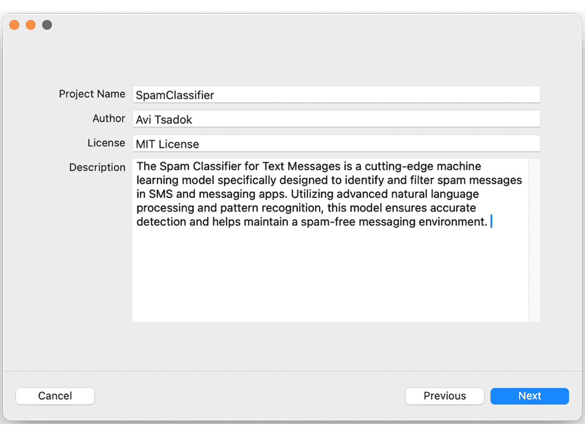
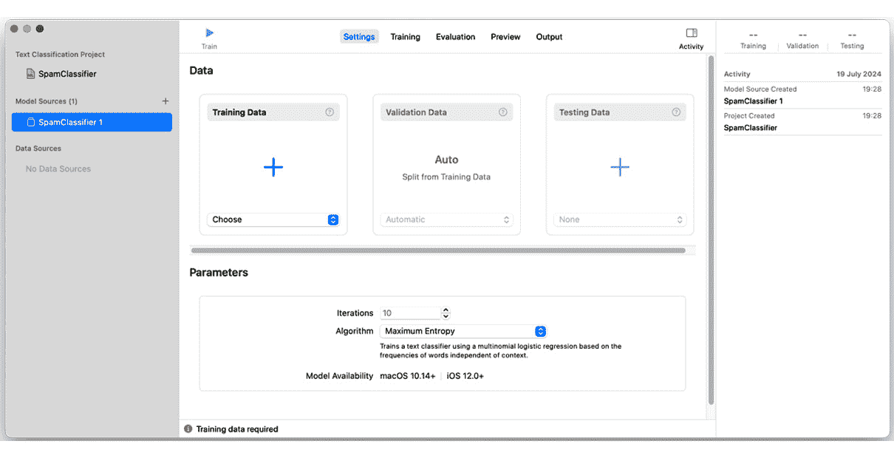
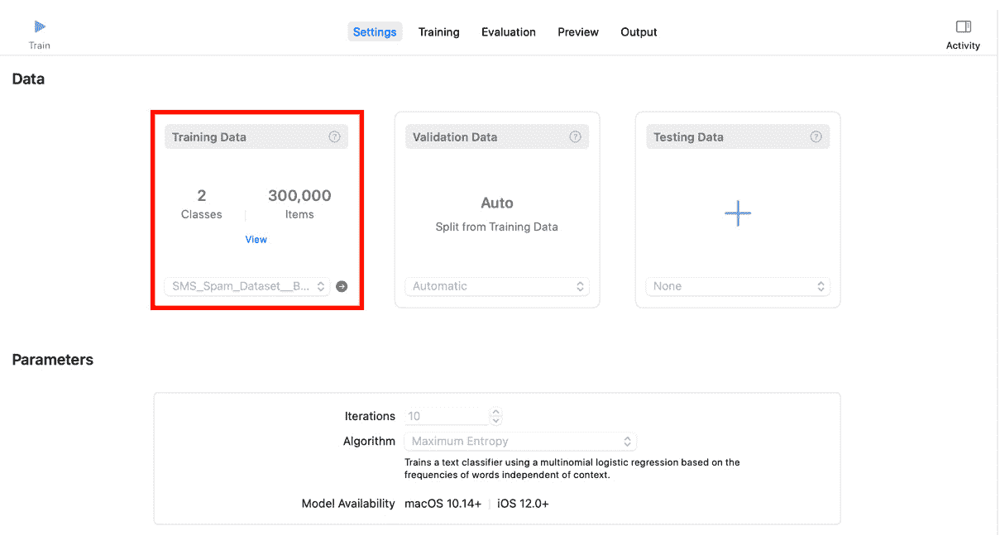
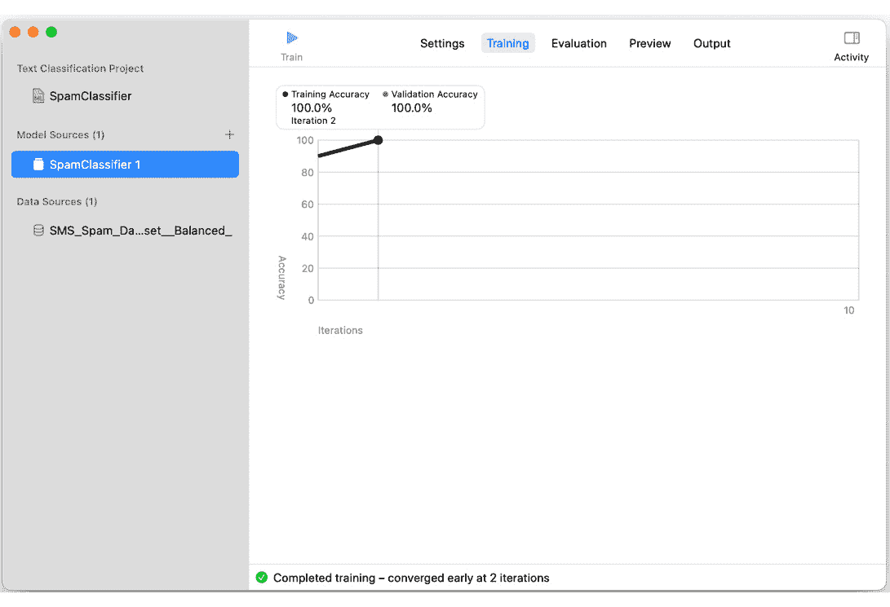
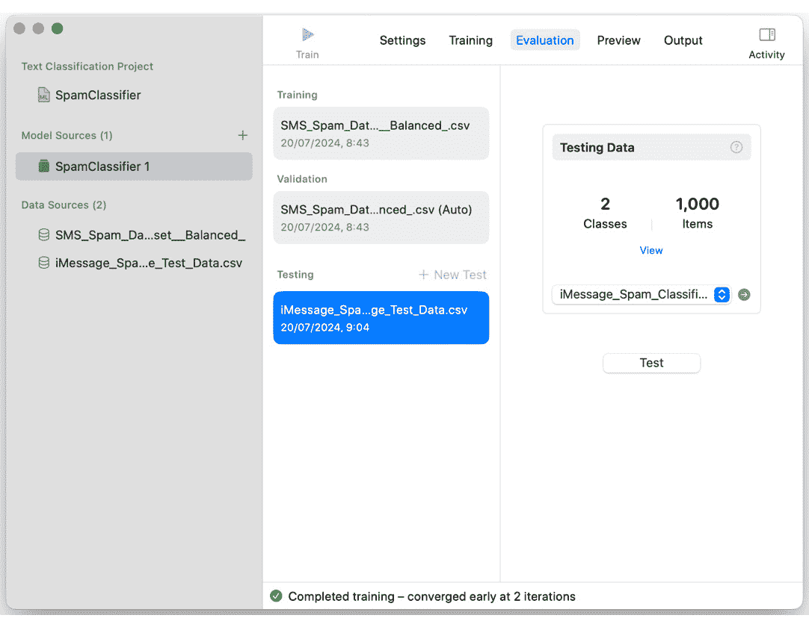
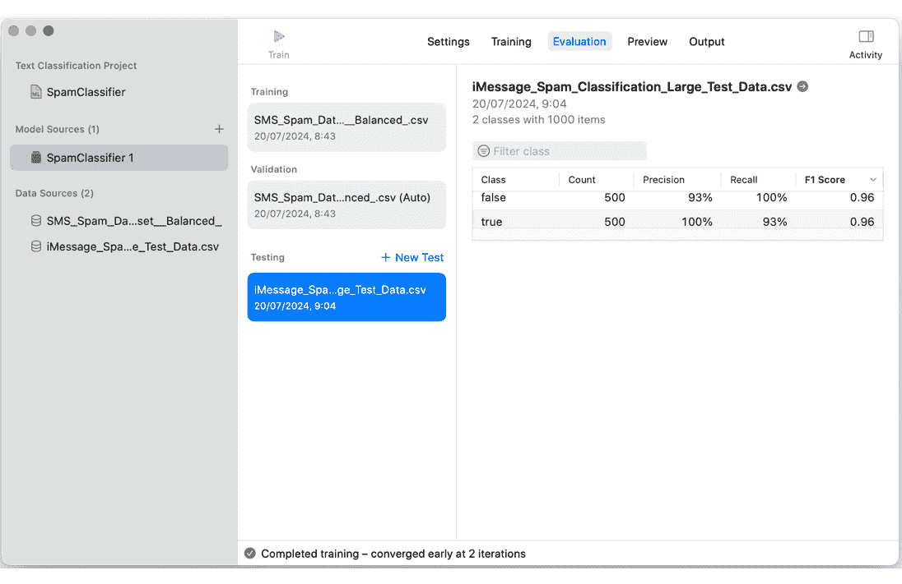
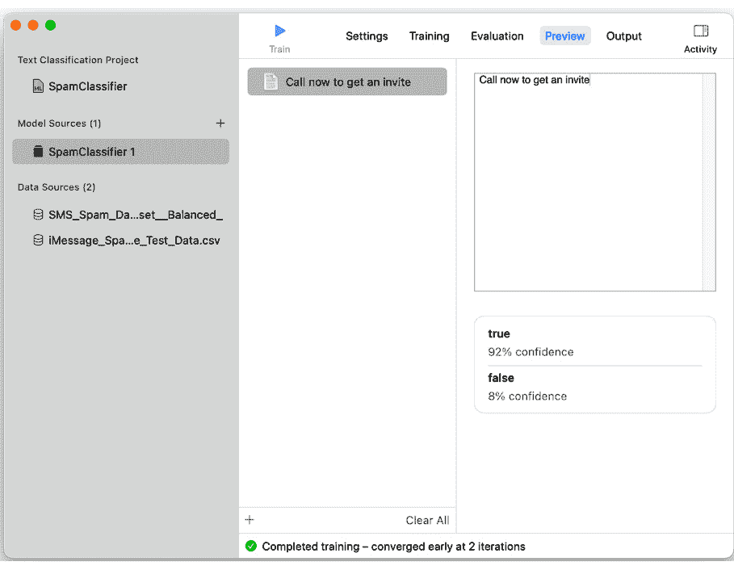
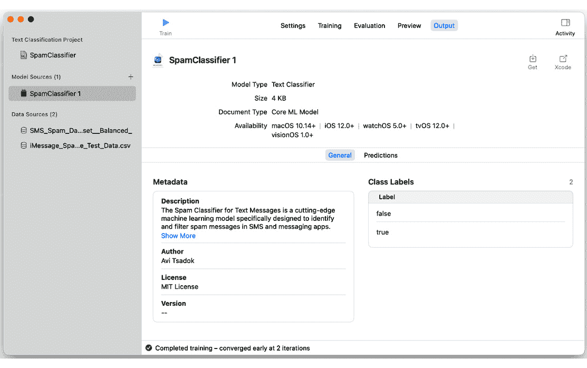

# 第十三章：<st c="0">12</st>

# <st c="3">利用苹果智能和机器学习变得聪明</st>

<st c="46">2022 年 11 月 ChatGPT 的发布并不是第一个出现的</st> **<st c="120">人工智能</st>** <st c="143">(</st>**<st c="145">AI</st>**<st c="147">) 工具，但它确实是将人工智能推到</st> <st c="194">聚光灯下</st> 的那个。

<st c="208">有些人可能会认为苹果比其他公司晚进入人工智能领域。</st> <st c="275">也许吧，但可以肯定的是，iOS 为用户和开发者都提供了机器学习能力。</st>

<st c="379">机器学习几乎在每个我们可以想到的领域都开辟了新的能力——从搜索、统计和洞察力到理解图像和声音。</st> <st c="536">甚至有一些基于人工智能和机器学习能力的应用程序。</st>

<st c="611">目前，这些功能大多是基于服务器的。</st> <st c="668">尽管如此，手机</st> **<st c="718">系统级芯片</st>** <st c="732">(</st>**<st c="734">SoC</st>**<st c="737">) 性能的持续改进使它们能够在设备上执行预测，这开辟了</st> <st c="812">新的机会。</st>

<st c="830">在本章中，我们将</st> <st c="859">完成以下内容：</st>

+   <st c="873">涵盖人工智能和机器学习的基础知识，学习不同术语，了解机器学习的工作原理以及训练</st> <st c="1001">模型</st> 的含义

+   <st c="1008">探索内置的机器学习框架，例如</st> **<st c="1062">自然语言处理</st>** <st c="1089">(</st>**<st c="1091">NLP</st>**<st c="1094">)、视觉和</st> <st c="1110">声音分析</st>

+   <st c="1124">向我们的 Core</st> <st c="1159">Spotlight 实现</st> 添加语义搜索

+   <st c="1183">使用 Create</st> **<st c="1253">机器学习</st>** <st c="1269">(</st>**<st c="1271">ML</st>**<st c="1273">) 应用程序和 Core</st> <st c="1301">ML 框架</st> 构建和集成自定义机器学习模型

<st c="1313">机器学习是一个广泛的主题，我们有很多内容要介绍，所以让我们直接进入主题，了解</st> <st c="1414">基础知识。</st>

# <st c="1425">技术要求</st>

<st c="1448">您必须从苹果的</st> <st c="1525">App Store</st> <st c="1526">下载 16.0 或更高版本的 Xcode，用于本章。</st>

<st c="1535">您还需要运行最新版本的 macOS（Ventura 或更高版本）。</st> <st c="1608">在 App Store 中搜索</st> `<st c="1619">Xcode</st>` <st c="1624">，选择并下载最新版本。</st> <st c="1686">启动 Xcode，并遵循系统可能提示的任何附加安装说明。</st> <st c="1789">一旦 Xcode 完全启动，您就准备好</st> <st c="1833">开始了。</st>

<st c="1839">本章包含许多代码示例，其中一些可以在以下 GitHub 存储库中找到：</st> <st c="1933">[`github.com/PacktPublishing/Mastering-iOS-18-Development/tree/main/Chapter12`](https://github.com/PacktPublishing/Mastering-iOS-18-Development/tree/main/Chapter12)<st c="2028">。</st>

<st c="2029">请注意，本章中的一些示例需要在设备上运行，而不是在模拟器上。</st>

# <st c="2116">回顾人工智能和机器学习的基础知识</st>

<st c="2165">在我们深入之前，让我们承认其复杂性——人工智能和机器学习是两个巨大的主题，不可能在一章或甚至一本书中涵盖。</st>

<st c="2325">然而，如果我们想在项目中实现一些机器学习功能，建议我们先了解基础知识。</st>

<st c="2458">因此，让我们从了解机器学习和人工智能之间的区别开始。</st>

## <st c="2541">学习人工智能和机器学习之间的区别</st>

<st c="2598">人工智能被认为是计算机科学中的一个新兴话题，并且自**ChatGPT**发布以来，这一趋势得到了加速。</st>

<st c="2716">尽管机器学习不是一项新技术，但许多人仍然需要澄清机器学习和人工智能之间的区别。</st> <st c="2761">这并不是说它们没有关系——它们是有关系的。</st> <st c="2834">尽管如此，鉴于苹果公司已经将人工智能深度集成到其系统中，作为 iOS 专业开发者，现在有一个清晰的概述这些区别是至关重要的。</st>

<st c="3035">那么，什么是机器学习（ML）呢？</st> <st c="3052">机器学习技术专注于开发算法和统计模型，以帮助计算机执行预测和分类等任务。</st> <st c="3193">例如，一个模型可以接收一个图像并回复它是否包含猫，或者一个模型可以处理一些文本并定位动词和名词。</st>

机器学习模型是一个执行预测和分类的算法<st c="3337"></st><st c="3418"></st><st c="3491"></st><st c="3545"></st><st c="3585"></st><st c="3589"></st><st c="3591"></st><st c="3609"></st><st c="3633"></st><st c="3661"></st><st c="3710"></st><st c="3714"></st><st c="3807"></st><st c="3810"></st><st c="3812"></st><st c="3831"></st><st c="3862"></st>

相反，人工智能是一系列技术和方法，能够创建一个能够执行与人类通常所做任务相似的系统<st c="3888"></st><st c="4016"></st>

一个很好的例子是**<st c="4049">LLM</st>**（**<st c="4054">大型语言模型</st>**）服务，如**<st c="4094">ChatGPT</st>**或**<st c="4105">Gemini</st>**。另一个例子是涉及许多机器学习模型的项目，如自动驾驶汽车，这些项目包括目标检测和决策<st c="4027"></st><st c="4038"></st><st c="4049"></st><st c="4052"></st><st c="4054"></st><st c="4094"></st><st c="4101"></st><st c="4105"></st><st c="4111"></st><st c="4185"></st><st c="4222"></st>

我们现在明白，机器学习模型是人工智能的一个构建块<st c="4242"></st><st c="4308"></st><st c="4361"></st>

## 让我们讨论这个重要的主题<st c="4370"></st>

具有决策树算法的模型包含一个树，其中叶子代表不同的决策或预测<st c="4396"></st><st c="4401"></st><st c="4409"></st><st c="4479"></st><st c="4544"></st><st c="4588"></st>

但这里的*<st c="4616">数据</st>* <st c="4620">是什么意思呢？<st c="4632"></st><st c="4642"></st><st c="4654"></st><st c="4715"></st>

在本章接下来的内容中，我们将把构建和创建模型数据称为训练<st c="5002"></st><st c="5101"></st><st c="5120"></st>

## 训练模型<st c="5136"></st><st c="5143"></st>

<st c="5156">两个不同的机器学习模型可以拥有相同的算法和结构，但由于训练过程的不同，数据可能不同。</st> <st c="5273">使用训练过程，我们教会模型根据输入数据做出准确的预测和决策。</st> <st c="5282">这个过程涉及优化模型的数据（参数），以便在未见过的数据上准确地进行预测。</st> <st c="5395">这个过程包括优化模型的数据（参数）以在未见过的数据上准确执行预测。</st>

<st c="5507">训练一个模型需要我们执行几个步骤：</st>

1.  **<st c="5563">数据收集</st>**<st c="5579">：我们需要准备一个相对较大的数据集来训练我们的模型。</st> <st c="5648">我们还必须通过处理缺失值、清理无关数据项和归一化值来预处理数据。</st>

1.  **<st c="5763">分割数据集</st>**<st c="5789">：现在我们有了数据集，我们必须将其分为训练数据、验证集和测试集。</st> <st c="5887">我们在不同的训练阶段使用这些数据集。</st>

1.  **<st c="5943">选择我们的机器学习算法</st>**<st c="5965">：每种算法旨在解决不同的问题。</st> <st c="6018">例如，逻辑回归算法解决分类问题，线性回归算法解决回归问题。</st>

1.  **<st c="6160">前向传播</st>**<st c="6173">：我们将训练数据通过模型来做出预测。</st>

1.  **<st c="6240">验证</st>**<st c="6251">：我们使用验证数据集来评估模型的表现，并根据结果调整模型。</st>

1.  **<st c="6357">测试</st>**<st c="6365">：我们使用测试数据来评估我们的模型在实时使用案例中，使用未见过的输入数据时的性能。</st>

<st c="6471">这是训练过程的概要图。</st> <st c="6527">在实践中，这个过程包含更多步骤，例如计算损失和优化。</st> <st c="6622">然而，目标是让你对训练过程有一个大致的了解，以便你能理解以下主题。</st> <st c="6728">别担心——我们很快就会一起构建和训练一个机器学习模型！</st>

<st c="6796">既然我们已经了解了机器学习模型是什么，让我们尝试理解它如何与 iOS 相关。</st>

# <st c="6881">苹果的智能和机器学习</st>

<st c="6907">当 ChatGPT 变得流行时，许多人觉得苹果在人工智能和机器学习方面落后了。</st> <st c="6988">这本书不是讨论那个问题的场所； suffice it to say that ML has since been an integral part of iOS for years.</st> <st c="7030">iOS 使用机器学习来根据其内容优化我们的照片。</st> <st c="7117">键盘预测涉及机器学习模型，iOS 保存电池的方式也基于机器学习。</st>

<st c="7276">所有这些特性和功能都对用户透明，并在幕后执行。</st> <st c="7368">然而，iOS 18 通过许多功能，如改进的 Siri、图像游乐场和</st> <st c="7485">写作工具</st>，将 AI 推到了聚光灯下。

<st c="7499">iOS 18 也为我们开发者提供了一些实用的功能，但它特别将 ML 和 AI 的领域带到了我们的注意中。</st> <st c="7630">例如，语义搜索是 iOS ML 功能开发者可用的新功能之一。</st>

<st c="7736">在我们深入研究</st> <st c="7757">Core ML 并学习如何训练我们的模型之前，让我们先从 iOS SDK 中提供的模型开始，因为有很大机会我们可以在不训练</st> <st c="7952">新模型的情况下快速找到我们需要的。</st>

# <st c="7962">探索内置机器学习框架</st>

<st c="7995">当我们回顾 AI 和 ML 的基础知识时，我们看到了训练模型意味着什么——这是一个漫长且复杂的过程。</st> <st c="8111">这个过程需要我们准备相对较大的数据集，包括验证集和测试集。</st> <st c="8216">即使那样，我们仍然需要微调我们的 ML 模型并将其包含在我们的应用程序中，同时试图减小其大小。</st>

<st c="8329">但是，不要误解我。</st> <st c="8359">在某些情况下，训练我们的 ML 模型是必不可少的，但在我们开始训练过程之前，了解 iOS 提供的内容是非常重要的。</st>

<st c="8510">在 iOS 中与 ML 框架一起工作并不新鲜。</st> <st c="8556">这些框架几年前就已经被引入，其中一些甚至是在 iOS 10（2016 年）中。</st> <st c="8628">然而，很少有开发者使用它们，可能是因为他们认为它们难以</st> <st c="8708">集成。</st>

<st c="8721">我们将从 ML 工具集中最实用的框架之一——</st> <st c="8796">自然语言处理</st> <st c="8782">开始。</st>

## <st c="8800">使用 NLP 解析文本</st>

<st c="8828">解析和理解文本可以为许多</st> <st c="8904">应用程序</st> <st c="8870">提供显著的价值。</st> <st c="8910">例如，NLP 可以帮助我们理解诸如搜索短语、文本输入或从</st> <st c="9029">导入的文本中提取信息之类的字符串。

<st c="9043">iOS SDK 内置了一个名为</st> <st c="9092">NaturalLanguage</st> <st c="9107">的</st> <st c="9085">自然语言处理</st> <st c="9043">框架</st>

```swift
 import NaturalLanguage
```

<st c="9132">`NaturalLanguage` <st c="9137">框架帮助我们高效地在</st> <st c="9202">设备上解析文本。</st>

<st c="9211">为了理解其工作原理，我们首先必须了解 NLP 在幕后是如何工作的以及其基本术语。</st>

<st c="9307">NLP 模型通过</st> <st c="9328">找到文本不同部分之间的关系</st> <st c="9352">来工作。</st> <st c="9387">尽管这个任务很复杂，但看到它是如何工作的很有趣。</st>

### <st c="9458">理解 NLP 是如何工作的</st>

<st c="9486">NLP 过程涉及文本处理和几个算法来提取必要的信息。<st c="9517">有三个基本步骤 –</st> **<st c="9619">预处理</st>**<st c="9632">，**<st c="9634">特征提取</st>**<st c="9652">，和</st> **<st c="9658">建模</st>**<st c="9666">。让我们逐一介绍。</st>

#### <st c="9698">预处理</st>

<st c="9712">在这个步骤中，NLP 模型首先开始</st> <st c="9751">清理输入，例如删除重复项，将文本分割成单词和句子，将文本转换为小写，以及执行词干提取和词形还原。</st> <st c="9915">以下文本作为</st> <st c="9942">示例：</st>

```swift
 "Running is fun! I love to run."
```

<st c="9986">这将预处理成以下类似的内容：</st><st c="10022">：</st><st c="10032">以下：</st>

```swift
 "run fun love run".
```

<st c="10066">在这个例子中，NLP 移除了停用词（例如</st> `<st c="10120">is</st>`<st c="10122">）并将整个字符串转换为小写。</st>

#### <st c="10157">特征提取</st>

<st c="10176">在字符串预处理之后，我们将其转换成一个特征集，我们可以使用它与 ML 算法一起使用。</st> <st c="10291">在大多数</st> <st c="10299">情况下，这涉及到捕获不同的模式和单词频率。</st> <st c="10371">例如，上一步的字符串，<st c="10419">run fun love run</st>，可以转换成以下：</st>

```swift
 {
  "run": 2,
  "fun": 1,
  "love": 1
}
```

在这个例子中，NLP 模型接收输入字符串并分析每个单词的频率。<st c="10605">这种技术被称为</st> **<st c="10630">词袋模型</st>** <st c="10642">(</st>**<st c="10644">BoW</st>**<st c="10647">)，模型使用它来确定字符串中不同单词的重要性。<st c="10739">请注意，有许多特征提取技术，BoW 只是其中之一。</st> <st c="10818">现在我们已经有了特征提取数据，我们可以选择模型。</st>

#### <st c="10887">建模</st>

<st c="10896">在建模步骤中，我们将字符串和</st> <st c="10937">特征提取作为模型算法的输入。</st> <st c="10989">NLP 使用多个算法来分析字符串 – 逻辑回归、朴素贝叶斯和神经网络。</st> <st c="11097">模型选择的算法取决于它需要完成的任务。</st>

<st c="11174">例如，如果 NLP 框架需要执行情感分析，它将使用基于神经网络的模型。</st> <st c="11289">简单的文本处理任务将使用基于规则的</st> `<st c="11341">系统模型。</st>

<st c="11354">这三个步骤展示了理解简单文本的复杂性。</st> <st c="11431">幸运的是，</st> `<st c="11448">自然语言</st>` `<st c="11463">框架为我们执行了所有这些步骤。</st> <st c="11502">。</st>

<st c="11509">让我们看看如何使用</st> `<st c="11535">自然语言</st>` `<st c="11550">框架 API。</st>

### <st c="11565">使用自然语言 API</st>

<st c="11595">最后，我们将编写一些代码！</st> <st c="11638">自然语言</st> `<st c="11642">框架有两个主要用途 – 分类</st> <st c="11706">和词性标注。</st> <st c="11724">让我们从分类开始。</st>

#### <st c="11756">文本分类</st>

<st c="11776">使用</st> **<st c="11783">文本分类</st>** `<st c="11802">，我们可以分析文本情感以确定它是正面</st> `<st c="11822">还是负面。</st>`

<st c="11886">例如，让我们看看以下文本：</st>

```swift
 The latest update made everything so much better. Great job!
```

<st c="12001">为了使用</st> `<st c="12054">自然语言</st>` `<st c="12069">框架分析这个句子的情感，我们将使用</st> `<st c="12095">NLTagger</st>` `<st c="12103">类：</st>

```swift
 let sentimentAnalyzer = <st c="12135">NLTagger</st>(tagSchemes:
  [<st c="12158">.sentimentScore</st>])
        sentimentAnalyzer.string = userInput
        let (sentiment, _) = <st c="12235">sentimentAnalyzer.tag</st>(at:
          userInput.startIndex, unit: .paragraph, scheme:
          .sentimentScore)
        if let sentiment = sentiment, let score =
          Double(sentiment.rawValue) {
          // here we can use the analyzed score
        } else {
            print("Unable to analyze sentiment")
        }
```

`<st c="12483">NLTagger</st>` <st c="12492">是我们用于处理自然语言文本的主要类。</st> <st c="12546">当我们初始化它时，我们传递我们感兴趣的信息。</st> <st c="12615">在我们的例子中，我们传递了</st> `<st c="12641">sentimentScore</st>` <st c="12655"> – 一种帮助我们确定</st> <st c="12695">文本情感的方案。</st>

<st c="12710">我们的下一步是设置文本输入并调用标记函数，同时传递相关参数，例如范围、单位类型和我们想要分析的方案。</st> <st c="12859">要分析。</st>

<st c="12870">标记函数执行文本分析并返回一个介于-1 和 1 之间的分数，其中负分数表示负面情感，正分数表示</st> `<st c="13040">正面情感。</st>

<st c="13059">如果我们在这段代码示例之前运行这段代码</st> <st c="13082">我们的示例句子，我们将得到 1.0 的分数 – 一个极其</st> <st c="13169">积极的文本！</st>

<st c="13183">尽管文本分类非常容易使用，但它也非常强大。</st> <st c="13263">我们可以使用这种能力来分析用户反馈/评论、聊天机器人和调查，甚至根据用户的情感</st> `<st c="13406">和情绪调整界面。</st>

<st c="13419">我们提到文本分类完全是关于理解文本情感。</st> <st c="13505">然而，我们可以使用自然语言处理技术通过</st> `<st c="13551">词性标注</st>` `<st c="13567">来分析文本。</st>

#### `<st c="13564">词性标注</st>`

**<st c="13577">词性标注</st>** 是将文本分解成组件并为文本中的每个短语分配标签的过程，指示其 `<st c="13702">语法类别</st>`。

让我们以以下文本的例子：

```swift
 She enjoys reading books in the library
```

如果我们尝试将这个句子分解成语法类别，它将类似于 *<st c="13898">She</st>* (代词)，*<st c="13902">enjoys</st>* (动词)，*<st c="13914">reading</st>* (动词)，*<st c="13929">books</st>* (名词)，*<st c="13945">in</st>* (介词)，*<st c="13977">the</st>* (限定词)，以及 *<st c="13999">library</st>* (名词)。

文本的不同部分被称为 **<st c="14058">标记</st>**，它们的语法类别被称为 **<st c="14109">标签</st>**。

`<st c="14113">The</st>` `<st c="14118">NaturalLanguage</st>` `<st c="14133">框架帮助我们执行分词和标记</st>` `<st c="14182">其标记。</st>`

让我们看看以下代码：

```swift
 let inputText = "She enjoys reading books in the library"
let tagger = NLTagger(tagSchemes: [.lexicalClass])
tagger.string = inputText
let options: NLTagger.Options =  [.omitPunctuation,
  .omitWhitespace]
tagger.enumerateTags(in:
  inputText.startIndex..<inputText.endIndex, unit: .word,
  scheme: .lexicalClass, options: options) { tag,
  tokenRange in
    if tag == .verb {
       verb = String(inputText[tokenRange])
       return false
   }
   return true
}
```

上述代码示例使用了之前相同的句子，对其进行分词，并定位到它找到的第一个动词。

我们首先初始化 `<st c="14797">NLTagger</st>`，类似于我们在文本分类中所做的。然而，这次我们通过传递 `<st c="14895">lexicalClass</st>` 作为 `<st c="14911">其方案</st>` 来实现这一点。

然后，我们提供输入 `<st c="14949">文本</st>` 并省略标点和空白。我们这样做是因为我们希望我们的文本尽可能干净。

在我们清理完文本后，我们调用 `<st c="15177">enumerateTags</st>` 函数。该函数遍历给定范围内的文本中的单词并提取不同的标签。我们比较传递的闭包内的标签类型并将其存储在一个 `<st c="15369">实例变量</st>` 中。

在我们的例子中，我们定位到第一个动词，它是 `<st c="15439">enjoys</st>`。

尽管词性标注和文本分类是 `<st c="15497">NLTagger</st>` 的两个主要用例，但它们也可以用于其他用例，例如用于识别文本的语言：

```swift
 let tagger = NLTagger(tagSchemes: [<st c="15650">.language</st>])
tagger.string = inputText
if let language = tagger.dominantLanguage {
     identifiedLanguage =
       Locale.current.localizedString(forLanguageCode:
       language.rawValue) ?? "Unknown"
        } else {
            identifiedLanguage = "Unknown"
        }
```

<st c="15875">在上一个示例中，</st> `<st c="15906">NLTagger</st>` <st c="15914">接收输入文本并提取其语言。</st> <st c="15962">它可以识别 50 种不同的语言——对于一个设备上的</st> <st c="16031">NLP 模型来说非常令人印象深刻！</st>

<st c="16041">我们可以使用语言识别</st> <st c="16076">来识别用户区域设置，并建议更改应用程序的首选语言，或者我们可以将此信息作为分析数据发送到</st> <st c="16207">我们的服务器。</st>

<st c="16219">自然语言处理（NLP）的另一个绝佳例子是</st> **<st c="16252">词嵌入</st>**<st c="16266">。此功能可以帮助我们的应用程序</st> <st c="16306">变得更智能。</st>

<st c="16321">词典中的每个单词都与其他</st> <st c="16369">单词相关。</st> <st c="16377">例如，</st> *<st c="16390">house</st>* <st c="16395">与</st> *<st c="16410">building</st>* <st c="16418">和</st> *<st c="16423">apartment</st>*<st c="16432">相关，而</st> *<st c="16438">cat</st>* <st c="16441">与</st> *<st c="16456">dog</st>*<st c="16464">相关联。</st>

<st c="16465">我们可以轻松地使用名为</st> <st c="16514">NLEmbedding</st> <st c="16532">的类</st> <st c="16521">找到相关单词：</st>

```swift
 guard let embedding = <st c="16557">NLEmbedding.</st>wordEmbedding(for:
  .english) else {
            neighborsText = "Failed to load word
              embedding." return
        } <st c="16664">let neighbors = embedding.neighbors(for:</st>
 <st c="16704">embedding.vector(for: inputWord) ??</st> <st c="16741">[], maximumCount: 5)</st> if neighbors.isEmpty {
       neighborsText = "No neighbors found for
         '\(inputWord)'." } else {
            neighborsText = neighbors.map { "\($0.0)
              (\($0.1))" }.joined(separator: ", ")
        }
```

<st c="16930">在上一个示例中，</st> `<st c="16957">NLEmbedding</st>` <st c="16968">接收输入测试，计算其向量，并找到其邻近的邻居。</st> <st c="17048">如果你想知道这为什么实用，想想一个搜索引擎，即使内容与用户</st> <st c="17185">搜索的内容不完全一致，也能找到相关内容。</st>

<st c="17198">在本节中，我们使用</st> `<st c="17243">NaturalLanguage</st>` <st c="17258">框架</st> <st c="17270">分析了文本。</st> <st c="17270">我们学习了 NLP 的工作原理，如何对文本进行分类，以及提取诸如词性标注甚至</st> <st c="17385">词嵌入</st> <st c="17402">等额外信息。</st> <st c="17475">然而，iOS 应用程序不仅仅包含文本；它们还包括图像。</st> <st c="17497">我们能否也分析图像</st> <st c="17475">呢？</st>

## <st c="17505">使用 Vision 框架分析图像</st>

<st c="17549">分析图像是 iOS 应用程序中的</st> <st c="17584">基本</st> <st c="17603">主题。</st> <st c="17603">分析图像有许多用例，例如检测条形码、扫描文档或</st> <st c="17701">图像编辑。</st>

<st c="17715">在 iOS 中分析图像，我们需要</st> <st c="17753">使用苹果的 Vision 框架。</st> <st c="17783">该框架于 2017 年随 iOS 11 的发布而引入，提供了</st> <st c="17860">高级功能以执行各种图像</st> <st c="17910">分析任务。</st>

### <st c="17925">理解图像分析的工作原理</st>

<st c="17964">从某种意义上说，图像分析的工作方式与文本分析类似，它通过不同的步骤在将数据插入</st> <st c="18076">模型之前对其进行清理和准备</st> <st c="18106">数据。</st>

<st c="18114">图像分析使用一个</st> **<st c="18147">CNN</st>** <st c="18150">(</st>**<st c="18152">卷积神经网络</st>**<st c="18180">)，这是一种专为</st> <st c="18214">视觉数据</st> <st c="18226">设计的神经网络。</st>

<st c="18226">将 CNN 视为一系列过滤器，可以帮助模型更好地理解图像。</st> <st c="18313">如果 NaturalLanguage 模型预处理了文本，移除了空白和</st> <st c="18355">重复的单词</st> <st c="18370">，CNN 将执行类似的过程。</st>

首先，CNN 扫描图像以检测相似的模式，例如线条、边缘和纹理。</st> <st c="18535">然后，它过滤掉它认为的非重要特征，并将图像缩小以包含最重要的信息。</st> <st c="18639">信息。</st>

<st c="18661">现在我们有了更小、更干净的图像，CNN 试图判断图像是什么——例如，“</st>*<st c="18766">它是一只</st>* *<st c="18772">猫。</st>*<st c="18778">”</st>

<st c="18780">检测模式、边缘、过滤它们以及分析图像是复杂的技术，需要</st> <st c="18884">大量的训练。</st> <st c="18905">幸运的是，Vision 框架为我们完成了所有繁重的工作</st> <st c="18966">。</st>

<st c="18973">让我们看看它能为</st> <st c="18999">我们做什么。</st>

### <st c="19006">探索 Vision 框架的功能</st>

<st c="19052">自从 iOS 18 开始，**<st c="19080">Vision 框架 API</st>** <st c="19100">已经变得极其简单，但甚至更加强大。</st>

<st c="19152">为了理解 Vision 框架 API 的工作原理，我们需要记住它基于两种类型——请求</st> <st c="19174">和观察。</st>

<st c="19279">要进行图像分析，我们首先创建一个</st> **<st c="19328">请求</st>**<st c="19335">。然后，我们请求特定的图像并接收一个包含结果（如果我们</st> <st c="19429">有任何）的</st> **<st c="19388">观察</st>** <st c="19399">。</st>

<st c="19439">让我们看看两个流行的用例——检测条形码</st> <st c="19494">和面部。</st>

#### <st c="19504">检测条形码</st>

<st c="19523">查看以下代码以</st> <st c="19553">查看条形码检测</st> <st c="19576">的实际操作：</st>

```swift
 func analyze(url: URL) async {
    let request = <st c="19632">DetectBarcodesRequest()</st> do {
       let barcodeObservations = <st c="19687">try await</st>
 <st c="19696">request.perform(on: url)</st> barcodeIdentifier = <st c="19742">barcodeObservations.first?.payloadString ??</st> ""
    } catch let error {
       print("error analyzing image –
         \(error.localizedDescription)")
        }
    }
```

<st c="19875">前面的代码块使用 Vision 框架执行条形码检测。</st> <st c="19909">首先，我们创建</st> `<st c="19973">DetectBarcodesRequest</st>`<st c="19994">，它表示在给定的</st> <st c="20051">图像 URL 中扫描条形码的请求。</st>

<st c="20061">然后，我们调用请求的</st> `<st c="20090">perform</st>` <st c="20097">函数，在存在多个条形码的情况下，它返回一个包含观察结果的数组</st> <st c="20162">。</st>

<st c="20179">接下来，我们取出第一个观察有效负载并将其存储在一个变量中。</st> <st c="20252">该有效负载代表</st> <st c="20280">条形码标识符。</st>

<st c="20299">请注意，扫描操作可能是一个繁重的任务，这就是为什么它是一个</st> <st c="20376">异步函数。</st>

<st c="20398">Vision 框架的一个有趣的应用示例是检测图像中的人脸——让我们看看</st> <st c="20498">一个示例。</st>

#### <st c="20509">人脸检测</st>

<st c="20525">人脸检测的工作原理与</st> <st c="20561">条形码检测</st> <st c="20581">类似。</st> <st c="20593">让我们看看一个</st> <st c="20593">代码示例：</st>

```swift
 func analyze(url: URL) async {
        let request = <st c="20652">DetectFaceRectanglesRequest()</st> do {
            let observations = try await
              request<st c="20723">.perform</st>(on: url)
            if let <st c="20749">observation</st> = observations.first {
                rect = observation.boundingBox.cgRect
            }
        } catch let error {
            print(error.localizedDescription)
        }
    }
```

<st c="20881">前面的代码示例几乎与之前的条形码示例相同。</st> <st c="20965">首先，我们创建请求。</st> <st c="20995">然而，这次，请求的类型是</st> `<st c="21040">DetectFaceRectanglesRequest</st>`<st c="21067">。接下来，我们在给定的图像 URL 上执行检测操作，并检索到一个观察数组。</st> <st c="21172">每个观察实例包含图像中一个</st> <st c="21225">人脸的矩形。</st> <st c="21253">如果图像包含多个面部，我们将为每个面部获得一个观察结果。</st>

<st c="21331">人脸检测和条形码是 Vision 框架用例的两个常见示例。</st> <st c="21415">然而，Vision 框架充满了惊喜和检测能力。</st> <st c="21494">让我们看看我们还能用它做什么。</st>

#### <st c="21532">探索更多检测能力</st>

<st c="21570">正如提到的，Vision 框架充满了能够检测我们想要的几乎所有东西的机器学习模型。</st> <st c="21687">条形码</st> <st c="21696">和人脸只是冰山一角。</st>

<st c="21738">以下是一些</st> <st c="21756">额外的检测器：</st>

+   **<st c="21777">图像美学分析</st>**<st c="21803">：从美学角度分析图像</st>

+   **<st c="21856">显著性分析</st>**<st c="21874">：用于找到图像中最重要的对象</st>

+   **<st c="21926">对象跟踪</st>**<st c="21942">：用于跟踪对象在一系列</st> <st c="21997">图像中的运动</st>

+   **<st c="22006">人体检测</st>**<st c="22021">：类似于人脸检测，用于在图像中定位手臂、人体、眼睛、嘴巴和鼻子</st> <st c="22104"></st>

+   **<st c="22113">人体和手势姿态</st>**<st c="22132">：用于在图像中定位手臂以及检测</st> <st c="22186">它们的姿态。</st>

+   **<st c="22197">文本检测</st>**<st c="22212">：用于检测图像中的文本</st>

+   **<st c="22245">动物检测</st>**<st c="22262">：用于检测图像中的猫和狗以及</st> <st c="22316">它们的姿态</st>

+   **<st c="22326">背景移除和对象提取</st>**<st c="22367">：用于从图像中移除背景和提取对象</st> <st c="22421">的</st>

<st c="22432">不同请求类型的列表看起来令人印象深刻，确实如此。</st> <st c="22504">审查这些请求反映了视觉框架变得多么强大。</st> <st c="22582">我们可以看到通常为</st> <st c="22627">高端图像编辑应用程序保留的功能，例如背景移除或对象提取，现在只需三行</st> <st c="22749">代码即可实现。</st>

<st c="22757">这为我们的应用程序中的独特功能开辟了新的可能性，例如与相机一起工作或根据</st> <st c="22885">它们的信息来优先处理图像。</st>

<st c="22903">我们已经讨论了分析文本和图像，这些被认为是我们在通常使用中最常见的数据源。</st> <st c="23013">文本和图像分析技术不同，但实现起来很简单。</st>

<st c="23099">现在，让我们转向我们可以分析的不同类型的源——</st> <st c="23163">声音。</st>

## <st c="23169">使用声音分析框架进行音频分类</st>

<st c="23222">对于许多开发者来说，处理音频不是一项流行的</st> <st c="23259">专业知识。</st> <st c="23290">事实上，与开发者习惯的相比，音频被认为是一个复杂且独特的</st> <st c="23346">世界。</st>

<st c="23395">为了减轻这一点，iOS SDK 还包括一个分析框架，可以使用</st> <st c="23492">ML 模型对音频进行分类。</st>

<st c="23502">与</st> **<st c="23520">声音分析框架</st>** <st c="23544">一起工作与我们习惯的视觉框架的简单性不同。</st> <st c="23615">但别担心——它仍然很容易使用。</st>

<st c="23659">声音分析框架包含三个</st> <st c="23704">不同的组件：</st>

+   **<st c="23725">SNAudioFileAnalyzer</st>**<st c="23745">：协调分析工作的主要类</st>

+   **<st c="23797">SNClassifySoundRequest</st>**<st c="23820">：声音</st> <st c="23833">检测请求</st>

+   **<st c="23850">SNResultsObserving</st>**<st c="23869">：我们需要实现的一个协议，用于观察分析器的</st> <st c="23932">结果</st>

<st c="23944">要查看这三个组件的实际效果，请查看以下</st> <st c="24005">代码：</st>

```swift
 func analyze(at url: URL) {
        do {
            let audioFileAnalyzer = try <st c="24082">SNAudioFileAnalyzer</st>(url: url)
            let request = try <st c="24131">SNClassifySoundRequest</st>(classifierIdentifier:
              .version1)
            let resultsObserver = <st c="24210">ClassificationResultsObserver</st>()
            try audioFileAnalyzer.add(request,
              withObserver: resultsObserver)
            audioFileAnalyzer.analyze()
        } catch {
            print("Error: \(error.localizedDescription)")
        }
    }
```

<st c="24396">在这个例子中，我们首先</st> <st c="24422">创建</st> `<st c="24434">SNAudioFileAnalyzer</st>` <st c="24453">实例，并用音频文件的 URL 初始化它。</st> <st c="24511">然后，我们创建一个分类声音请求的请求，将</st> `<st c="24581">version1</st>` <st c="24589">作为一个</st> <st c="24595">参数。</st> <st c="24606">`<st c="24610">version1</st>` <st c="24618">参数指定了模型的预训练分类版本。</st> <st c="24692">在撰写本文时，没有其他版本可用。</st>

<st c="24753">然后，我们创建</st> `<st c="24774">resultsObserver</st>` <st c="24789">实例（我们稍后会简要讨论）并协调一切，使用我们之前创建的分析器。</st>

<st c="24903">我们如何获取结果？</st> <st c="24931">与视觉</st> <st c="24948">框架不同，接收结果可以简化。</st> <st c="25002">`<st c="25006">ClassificationResultsObserver</st>`</st> <st c="25035">是一个自定义类，它符合</st> `<st c="25071">SNResultsObserving</st>`<st c="25089">。让我们看看</st> <st c="25109">类的实现：</st>

```swift
 class ClassificationResultsObserver: NSObject,
  SNResultsObserving {
    func request(_ request: SNRequest, didProduce result:
      SNResult) {
        guard let result = result as? SNClassificationResult else { return }
        if let classification =
          result.classifications.first {
 <st c="25389">let result = classification.identifier</st> }
    }
    func request(_ request: SNRequest, didFailWithError
      error: Error) { }
    func requestDidComplete(_ request: SNRequest) {}
}
```

<st c="25552">该</st> `<st c="25557">SNResultsObserving</st>` <st c="25575">协议有三个基本请求方法 –</st> `<st c="25623">didProduce</st>`<st c="25633">,</st> `<st c="25635">didFailWithError</st>`<st c="25651">,</st> <st c="25653">和</st> `<st c="25657">requestDidComplete</st>`<st c="25675">。</st>

<st c="25676">太好了！</st> <st c="25684">然而，不幸的是，在这种情况下，我们似乎需要回到过去，并使用代理模式来</st> <st c="25795">观察声音分析框架的结果。</st>

<st c="25845">结果是描述我们传递给分析器的声音的字符串。</st> <st c="25917">本书 GitHub</st> <st c="25956">存储库中的代码示例显示了一个婴儿哭泣的声音文件。</st> <st c="26006">在这种情况下，结果将是</st> `<st c="26037">baby_crying</st>`<st c="26051">。</st>

苹果公司尚未正式公布声音分析框架可以识别的声音类别数量。<st c="26166">然而，在大多数情况下，这应该足以满足</st> <st c="26216">日常使用。</st>

声音分析框架非常适合监控应用，添加**<st c="26304">SDH</st>** <st c="26307">(**<st c="26309">为听障人士或听力受损人士提供的字幕</st>**<st c="26350">)到视频字幕，以及</st> <st c="26376">分析视频。</st>

<st c="26393">到目前为止，我们已经讨论了如何分析</st> <st c="26435">不同类型的数据 – 声音、图像和文本。</st> <st c="26486">然而，机器学习在其它领域也很有价值，例如</st> <st c="26534">应用搜索。</st>

## <st c="26545">使用 Core Spotlight 执行语义搜索</st>

<st c="26594">在我们讨论 NLP 的</st> *<st c="26624">使用 NLP 解释文本</st> *<st c="26651">部分时，我们说，最常见的 NLP</st> <st c="26701">用例之一是分析搜索</st> <st c="26732">短语以构建智能</st> <st c="26761">搜索查询。</st>

<st c="26776">尽管</st> `<st c="26793">NaturalLanguage</st>` <st c="26808">框架 API 强大且直观，执行语义搜索</st> <st c="26885">被认为是一项</st> <st c="26899">复杂任务。</st>

<st c="26912">从 iOS 18 开始，Core Spotlight 框架支持语义搜索。</st> <st c="26987">在我们深入细节之前，让我们明确一下</st> **<st c="27043">语义搜索</st>**<st c="27058">这个术语。</st>

### <st c="27059">理解语义搜索是什么</st>

<st c="27097">让我们一起来思考一下标准应用中搜索查询是如何工作的，我们将通过</st> <st c="27128">一个示例</st> <st c="27192">来进行。</st>

<st c="27203">想象一下，我们有一个课程目录应用，用户可以搜索特定的课程，假设我们在本地的</st> <st c="27360">数据存储</st> <st c="27360">中有以下课程列表：</st>

+   <st c="27371">为员工的管理</st>

+   <st c="27396">数据科学</st>

+   <st c="27409">数字营销</st>

+   <st c="27427">ML</st> <st c="27431">和 AI</st>

<st c="27437">我们的用户想要提高他们的领导技能，所以他们在这个课程列表</st> <st c="27545">中搜索管理课程。</st>

<st c="27556">搜索查询的基本形式是匹配一个特定的短语。</st> <st c="27618">例如，如果用户搜索</st> `<st c="27656">管理</st>`<st c="27666">，我们只过滤包含</st> *<st c="27702">管理</st>*<st c="27712">的课程。我们还需要确保输出查询</st> <st c="27759">是不区分大小写的。</st>

<st c="27779">然而，如果用户搜索</st> `<st c="27819">经理</st>`<st c="27826">呢？在这种情况下，我们的查询没有返回任何结果，尽管一个典型的用户如果想要搜索关于管理的课程，他们可以搜索</st> *<st c="27914">经理</st>* <st c="27921">。</st> <st c="27944">他们想要关于管理的课程。</st>

<st c="27961">在这种情况下，我们可以使用</st> `<st c="27991">NaturalLanguage</st>` <st c="28006">框架来尝试对搜索短语进行词形还原。</st> **<st c="28072">词形还原</st>** <st c="28085">是一种将单词还原到其基本形式的技巧。</st> <st c="28141">因此，*<st c="28163">经理</st>* <st c="28170">的基本形式是</st> *<st c="28174">管理</st>*<st c="28180">。</st>

<st c="28181">然而，如果我们想匹配搜索短语</st> *<st c="28229">管理</st>*<st c="28235">，我们还需要所有包含单词</st> *<st c="28280">管理</st>* <st c="28290">的记录都包含单词</st> *<st c="28311">管理</st>* <st c="28317">，这样我们才能相应地过滤结果。</st> <st c="28365">这意味着我们必须为每条记录中的每个单词保持基本形式。</st>

<st c="28435">但事情可能会比这更复杂。</st> <st c="28455">假设用户使用短语</st> *<st c="28551">领导力</st>*<st c="28561">搜索管理课程？在这种情况下，我们将不得不像在本章的</st> *<st c="28653">单词标记</st> <st c="28665">部分</st> <st c="28677">中学到的那样，用嵌入的单词索引我们的记录。</st>

<st c="28690">结论是，基本搜索很简单。</st> <st c="28736">然而，语义搜索，虽然更有效，但也更复杂。</st>

<st c="28818">如前所述，语义搜索建立在</st> **<st c="28872">Core Spotlight 框架</st>**<st c="28896">之上，从 iOS 18 开始。</st> <st c="28920">Core Spotlight 框架并非新事物——它于 2015 年作为 iOS 9 的一部分被引入，帮助开发者索引应用程序内容并使其可搜索，使用 iOS 中的 Spotlight 功能</st> <st c="29096">进行搜索。</st>

<st c="29103">本章不涵盖使用 Core Spotlight 框架。</st> <st c="29168">然而，我们将简要回顾 Core Spotlight 原则，以了解如何启用语义搜索。</st> <st c="29275">让我们开始吧。</st>

### <st c="29287">探索 Core Spotlight 框架</st>

<st c="29326">Spotlight 框架</st> <st c="29350">通过执行查询来索引本地数据并检索它。</st>

<st c="29409">Core Spotlight 框架有三个主要部分——创建可搜索项、索引和查询。</st> <st c="29516">让我们逐一介绍这些部分。</st>

#### <st c="29554">创建可搜索项</st>

<st c="29580">假设我们在本地存储中有书籍结构的实例，并希望实现 Core Spotlight 以允许用户搜索</st> <st c="29712">书籍。</st>

<st c="29722">首先，我们需要将所有我们的</st> `<st c="29753">Book</st>` <st c="29757">实例</st> <st c="29768">映射到</st> `<st c="29771">CSSearchableItem</st>`<st c="29787">:</st>

```swift
 let searchableItems: [<st c="29812">CSSearchableItem</st>] = books.map { book
  in
            let attributeSet =
              CSSearchableItemAttributeSet(contentType:
              .text)
            attributeSet.title = book.title
            attributeSet.contentDescription = book.author <st c="30000">let item = CSSearchableItem(uniqueIdentifier:</st>
 <st c="30045">book.id, domainIdentifier: "books",</st>
 <st c="30081">attributeSet: attributeSet)</st> return item
        }
```

<st c="30123">在先前的代码示例中，我们</st> <st c="30157">取了一个包含</st> `<st c="30175">Book</st>` <st c="30179">的数组，并将其映射到一个包含</st> `<st c="30209">CSSearchableItem</st>`<st c="30225">的数组中。</st> <st c="30252">我们通过创建一个</st> `<st c="30252">CSSearchableItemAttributeSet</st>` <st c="30280">来完成这项工作——这是一个包含可搜索项一般信息的项。</st> <st c="30352">然后，我们初始化一个新的</st> `<st c="30378">CSSearchableItem</st>`<st c="30394">，传递我们的</st> `<st c="30408">CSSearchableItemAttributeSet</st>` <st c="30436">并提供一个唯一标识符，这有助于我们在需要时检索</st> `<st c="30501">Book</st>` <st c="30505">记录</st> <st c="30513">。</st>

#### <st c="30525">索引</st>

<st c="30534">现在我们有一个</st> <st c="30555">包含</st> `<st c="30564">CSSearchableItem</st>`<st c="30580">的数组，我们需要为 Core Spotlight 框架索引数组项。</st> <st c="30649">我们通过</st> <st c="30663">创建</st> `<st c="30672">CSSearchableIndex</st>`<st c="30689">来完成这项工作：</st>

```swift
 let index = <st c="30704">CSSearchableIndex</st>(name: "SpotlightSearchIndex")
        index.<st c="30759">indexSearchableItems</st>(searchableItems) { error
          in
            if let error = error {
                print("Indexing error:
                  \(error.localizedDescription)")
            } else {
                print("Books successfully indexed!")
            }
        }
```

<st c="30937">在先前的示例中，我们创建了一个新的</st> `<st c="30981">CSSearchableIndex</st>` <st c="30998">并调用了</st> `<st c="31014">indexSearchableItems</st>` <st c="31034">函数，该函数使用我们在上一步中创建的包含</st> `<st c="31063">CSSearchableItem</st>` <st c="31079">的数组。</st> <st c="31115">请注意</st> <st c="31124">这是一个异步操作，并且被认为是非常密集的。</st>

#### <st c="31199">查询</st>

<st c="31208">现在我们有了索引，我们可以</st> <st c="31239">执行一个查询来根据一个</st> <st c="31287">搜索短语</st>检索数据：</st>

```swift
 let searchContext = CSUserQueryContext()
        searchContext.fetchAttributes = ["title"]
        searchContext.enableRankedResults = true
        var items: [CSSearchableItem] = []
        let query = CSUserQuery(userQueryString: query,
          userQueryContext: searchContext)
        do {
            for try await element in query.responses {
                switch(element) {
                case .item(let item):
                    items.append(item.item)
                    break
                case .suggestion(let suggestion):
                    // handle suggestions. break
                @unknown default:
                    break
                }
            }
            self.searchResults = items
        } catch let error {
            print(error.localizedDescription)
        }
```

<st c="31833">在先前的示例中，我们创建了一个包含各种查询信息的搜索上下文。</st> <st c="31925">基于</st> <st c="31937">搜索上下文和搜索短语，我们初始化了一个</st> `<st c="32001">CSUserQuery</st>` <st c="32012">对象，并通过调用其</st> `<st c="32057">responses</st>` <st c="32066">获取器来获取搜索结果。</st>

<st c="32074">结果是包含</st> `<st c="32103">CSSearchableItem</st>`<st c="32119">的数组，我们可以通过使用每个记录的唯一标识符来检索原始项。</st>

<st c="32206">现在我们知道了如何使用 Core Spotlight 框架实现搜索，让我们看看如何实现一个</st> `<st c="32313">语义搜索</st>`。</st>

### <st c="32329">实现语义搜索</st>

<st c="32358">将语义搜索功能添加到现有的 Core Spotlight 搜索中很简单。</st> <st c="32382">我们所需做的只是使用以下</st> <st c="32507">静态函数</st>加载 ML 模型一次：

```swift
 CSUserQuery.prepare()
```

<st c="32545">`<st c="32550">prepare</st>` <st c="32557">函数使 Core Spotlight 框架准备好加载其用于</st> <st c="32631">语义搜索</st>的 ML 模型。</st>

如果搜索索引由于隐私问题具有保护级别，我们还需要调用<st c="32741">prepreProtectionClasses</st> <st c="32764">函数：</st>

```swift
 CSUserQuery.prepareProtectionClasses([.completeUnlessOpen])
```

此功能准备搜索标记为具有<st c="32897">completeUnlessOpen</st> <st c="32915">保护级别</st>的索引。

什么是保护级别？

术语**<st c="32971">保护级别</st>**指的是用户具有特定资源的可访问级别，考虑到设备的安全条件。<st c="33084">这里有三种主要</st> <st c="33129">保护级别：</st>

<st c="33150">NSFileProtectionNone</st><st c="33170">：索引始终可访问，即使设备<st c="33226">锁定</st>时也是如此

<st c="33238">NSFileProtectionCompleteUntilFirstUserAuthentication</st><st c="33290">：设备重启后，用户首次认证成功，索引<st c="33377">可访问</st>

<st c="33393">NSFileProtectionComplete</st><st c="33417">：索引仅在设备<st c="33465">解锁</st>时才可访问

记住，准备 ML 模型需要时间和内存，所以最好在搜索用户界面立即之前调用<st c="33565">prepare</st> <st c="33572">函数。

我们讨论了各种<st c="33659">内置 ML 模型，我们可以看到它们涵盖了我们可以使用 ML 功能的许多用例。<st c="33777">然而，有些情况下，iOS SDK 并没有提供我们需要的确切 ML 解决方案。</st> <st c="33867">幸运的是，我们可以使用</st> <st c="33914">CoreML 框架</st>集成我们的模型。

# 使用 CoreML 集成自定义模型

通常，ML 模型是训练来执行特定任务的——识别句子的情感、检测人类或分析声音都是使用不同模型完成的不同任务的例子。<st c="34170">这意味着尽管现有模型潜力巨大，但我们仍然在能做什么方面受到限制。</st> <st c="34175">这意味着</st> <st c="34175">即使现有模型的潜力巨大，我们仍然在能做什么方面受到限制。

这就是**CoreML 框架**<st c="34306">进入场景的地方。</st> <st c="34322">使用 CoreML，我们可以集成 iOS SDK 之外的 ML 模型，我们甚至可以训练自己的模型并添加更多<st c="34468">智能能力。</st>

最好通过一个例子来说明如何做这件事，比如检测<st c="34569">垃圾邮件。</st>

<st c="34583">假设我们正在开发一个消息应用。</st> <st c="34627">最受欢迎的消息应用功能之一是检测垃圾邮件，以提高用户体验和</st> <st c="34739">增加用户留存率。</st>

<st c="34758">我们必须创建一个 ML 模型来将消息分类为垃圾邮件，以实现一个</st> <st c="34830">垃圾邮件检测器。</st>

<st c="34844">为了实现这一点，我们可以使用一个名为 Create ML 的桌面应用程序，它是 Xcode 套件的一部分。</st> <st c="34947">让我们先来了解一下</st> <st c="34982">Create ML！</st>

## <st c="34992">了解 Create ML 应用程序</st>

**<st c="35034">Create ML</st>** <st c="35044">于 2018 年作为</st> <st c="35071">苹果公司持续努力使机器学习对开发者更易获取的一部分而推出。</st> <st c="35144">我们可以使用 Create ML 在各个领域构建、训练和部署 ML 模型。</st>

<st c="35219">要打开 Create ML，请按照</st> <st c="35246">以下步骤操作：</st>

1.  <st c="35258">打开 Xcode。</st>

1.  <st c="35270">在 Dock 上的 Xcode 图标上</st> <st c="35304">右键单击。</st>

1.  <st c="35313">选择</st> **<st c="35321">打开开发者工具</st>** <st c="35340">|</st> **<st c="35343">Create ML</st>**<st c="35352">。</st>

<st c="35353">另一种打开</st> `<st c="35374">Create ML</st>` <st c="35383">的方法是在 Mac 的 Spotlight 中搜索它，并</st> <st c="35436">选择它。</st>

<st c="35449">打开它并点击</st> **<st c="35487">新建文档</st>** <st c="35499">按钮后，我们会看到以下屏幕（</st>*<st c="35537">图 12.1</st>**<st c="35547">.1</st>*<st c="35549">）：</st>


<st c="36033">图 12.1：创建 ML 模板选择器</st>

*<st c="36075">图 12</st>**<st c="36085">.1</st>* <st c="36087">显示了 Create ML 模板选择器屏幕。</st> <st c="36132">每个模板代表我们模型的不同配置，每个都是为处理不同类型的数据而设计的。</st> <st c="36255">例如，</st> **<st c="36272">图像分类</st>** <st c="36292">模板是为处理图像而设计的。</st> <st c="36332">由于我们想要对</st> <st c="36358">文本消息进行分类，我们将选择</st> **<st c="36390">文本分类</st>** <st c="36409">模板并点击</st> **<st c="36433">下一步</st>** <st c="36437">按钮。</st>

<st c="36445">这将带我们进入项目详情屏幕（</st>*<st c="36495">图 12.2</st>**<st c="36505">）：</st>



<st c="36940">图 12.2：项目详情表</st>

<st c="36977">在项目详情表中，我们将填写一些关于我们的 ML 模型的一般信息，例如名称、作者、许可证和描述，然后</st> <st c="37129">点击</st> **<st c="37135">下一步</st>**<st c="37139">。</st>

<st c="37140">我们的下一个屏幕是项目窗口（</st>*<st c="37180">图 12</st>**<st c="37190">.3</st>**<st c="37192">）：</st>



<st c="37585">图 12.3：SpamClassifier 项目窗口</st>

<st c="37631">在</st> *<st c="37635">图 12</st>**<st c="37644">.3</st>*<st c="37646">中，我们可以看到</st> `<st c="37663">SpamClassifier</st>` <st c="37677">项目窗口。</st> <st c="37694">项目窗口是我们构建模型的主要窗口。</st> <st c="37732">让我们回顾一下不同的</st> <st c="37791">窗口组件：</st>

+   **<st c="37809">左侧面板</st>**<st c="37819">：左侧面板列出了项目的不同来源 - 机器学习模型及其数据来源，用于训练和测试</st>

+   **<st c="37940">设置选项卡</st>**<st c="37953">：该</st> **<st c="37960">设置</st>** <st c="37968">选项卡是我们定义不同阶段和一般</st> <st c="38054">训练参数</st>

+   **<st c="38073">训练选项卡</st>**<st c="38086">：该</st> **<st c="38093">训练</st>** <st c="38101">选项卡显示了训练操作的进度</st>

+   **<st c="38150">评估选项卡</st>**<st c="38165">：该</st> **<st c="38172">评估</st>** <st c="38182">选项卡显示了我们的模型在不同阶段</st> <st c="38229">的性能</st>

+   **<st c="38245">预览选项卡</st>**<st c="38257">：我们可以在</st> *<st c="38267">预览</st>** <st c="38271">选项卡中* <st c="38271">与我们的机器学习模型互动并体验它</st>

+   **<st c="38326">输出选项卡</st>**<st c="38337">：该</st> **<st c="38344">输出</st>** <st c="38350">选项卡是我们部署</st> <st c="38388">我们的模型</st>

<st c="38397">组件列表反映了我们在构建</st> <st c="38478">我们的模型时必须经历的各个阶段。</st>

<st c="38488">现在我们知道了 Create ML 是什么，让我们开始构建</st> <st c="38546">我们的模型。</st>

## <st c="38556">构建我们的垃圾邮件分类器模型</st>

<st c="38591">我们的垃圾邮件分类器</st> <st c="38612">模型构建过程基于三个</st> <st c="38653">数据来源 - 训练数据、验证数据和测试数据。</st> <st c="38708">这三个数据来源是我们在本章前面*<st c="38789">训练</st>* *<st c="38802">模型</st>* <st c="38807">部分中提到的。</st>

<st c="38816">首先，让我们看看我们将如何准备</st> <st c="38865">我们的数据。</st>

### <st c="38874">准备我们的数据</st>

<st c="38893">由于我们正在构建一个</st> <st c="38918">垃圾邮件分类器模型，我们必须准备一个包含垃圾邮件和非垃圾邮件的数据集。</st> <st c="39011">文本分类模板要求我们的数据集以 CSV 文件的形式存在，包含两列 –</st> `<st c="39116">文本</st>` <st c="39120">和</st> `<st c="39125">标签</st>`<st c="39130">。在我们的案例中，</st> `<st c="39149">文本</st>` <st c="39153">列代表短信的内容，而</st> `<st c="39212">标签</st>` <st c="39217">列是分类 –</st> `<st c="39249">true</st>` <st c="39253">表示垃圾邮件，而</st> `<st c="39277">false</st>` <st c="39282">表示非垃圾邮件。</st>

<st c="39296">垃圾邮件和非垃圾邮件之间的比例需要反映现实世界的分布。</st> <st c="39396">在我们的案例中，我们有一个包含 300,000 条记录的数据集文件，其中 10%是垃圾邮件，90%是</st> <st c="39502">非垃圾邮件。</st>

<st c="39520">要设置</st> **<st c="39532">训练数据集</st>**<st c="39548">，我们可以将</st> <st c="39565">CSV 文件拖放到</st> **<st c="39584">训练数据</st>** <st c="39597">框中（</st>*<st c="39603">图 12</st>**<st c="39613">.4</st>*<st c="39615">）：</st>



<st c="39986">图 12.4：包含 300,000 条记录的训练数据</st>

*<st c="40033">图 12</st>**<st c="40043">.4</st>* <st c="40045">显示了</st> `<st c="40156">真实</st>` <st c="40160">和</st> `<st c="40165">虚假</st>`<st c="40170">，如前所述。</st> <st c="40191">此外，我们还在左侧面板中有一个新的</st> <st c="40223">数据源 – 我们作为训练数据集导入的文件。</st>

<st c="40299">现在我们有了训练数据，我们可以处理</st> **<st c="40318">验证数据</st>** <st c="40333">了。</st> <st c="40342">提醒一下，作为训练过程的一部分，我们将使用验证数据来调整模型。</st> <st c="40370">我们可以提供自己的验证数据，但 Create ML 允许我们从我们刚刚提供的训练数据集中分割它。</st> <st c="40469">我们可以在评估步骤中稍后添加</st> <st c="40577">测试数据集</st>。

<st c="40591">第三个数据集是</st> **<st c="40617">测试数据</st>**<st c="40629">。我们使用测试数据来查看模型如何对未见过的文本进行分类。</st> <st c="40700">我们可以在评估步骤中稍后添加</st> <st c="40714">测试数据集</st>。

<st c="40760">除了选择不同的数据集，我们还可以设置训练将进行的迭代次数和</st> <st c="40883">模型算法</st>。

每次迭代中，训练过程可以通过回顾前一次迭代的错误并调整其参数（如神经网络中的权重）来自我调整。我们的直觉可能会说，迭代次数越多，我们的模型就越聪明。然而，事实并非如此。首先，在某个点上，再进行迭代并不能提高模型，只会消耗计算资源。但真正的问题是所谓的过拟合。**过拟合**是指机器学习模型学习训练数据过于完美，包括其噪声。在这种情况下，分析未见数据将会有问题。

另一个参数是模型算法（**图 12.5**）：


**图 12.5：选择模型算法**

***图 12.5*** 显示了弹出菜单，我们可以从五个不同的选项中选择模型学习算法。算法概述不在本章的范围内，但简而言之，不同的算法适合不同的需求，并消耗其他资源。例如，**BERT**算法非常适合语义理解，而**条件随机字段**算法非常适合**序列标注**。在我们的案例中，我们将选择**最大熵**算法，它非常适合**分类**。

现在我们已经准备好了所有数据集，我们可以点击左上角的**训练**按钮并开始**训练**。

### **执行训练**

现在，我们已经到达了**主要环节——训练阶段**。在训练阶段，Create ML 应用程序会使用我们在**准备我们的数据**部分定义的算法遍历训练数据集。让我们尝试描述这个过程：

+   在每次迭代中，模型使用验证数据集来**验证自身**。记住，验证数据集可以是不同的。然而，默认情况下，它是训练数据集的一个子集。

+   <st c="42891">训练</st> *<st c="42896">阶段的时间长度由三个主要因素决定</st> <st c="42904">——数据集大小、迭代次数和</st> <st c="43017">选择的算法。</st>

+   <st c="43034">模型不需要执行我们在</st> **<st c="43112">设置</st>** <st c="43120">选项卡中定义的迭代次数。</st> <st c="43126">如果验证准确率达到高水平，</st> *<st c="43175">训练将提前停止</st> * <st c="43205">以节省资源并</st> <st c="43228">避免过拟合。</st>

<st c="43246">在训练</st> <st c="43273">过程结束时，我们将看到以下图表（</st>*<st c="43314">图 12</st>**<st c="43324">.6</st>*<st c="43326">）：</st>



<st c="43660">图 12.6：训练过程结束时的训练选项卡</st>

*<st c="43724">图 12</st>**<st c="43734">.6</st>* <st c="43736">显示了我们在训练阶段的表现。</st> <st c="43782">我们可以看到，在仅经过两次迭代后，我们就达到了高准确率。</st> <st c="43857">在这种情况下，这是因为我们的训练数据集结构良好且可靠。</st> <st c="43939">然而，情况并不总是如此，因此我们需要在这个步骤中保持耐心。</st>

<st c="44012">现在我们的模型已经训练好了，我们需要对其进行测试。</st> <st c="44070">为此，我们将使用我们的测试数据集作为评估步骤的一部分（</st>*<st c="44143">图 12</st>**<st c="44153">.7</st>*<st c="44155">）：</st>



<st c="44654">图 12.7：模型评估步骤</st>

*<st c="44692">图 12</st>**<st c="44702">.7</st>* <st c="44704">显示了评估步骤以及用于训练和验证模型的不同的数据集。</st> <st c="44796">我们还可以看到测试数据包含一个包含 1,000 个项目的数据集。</st> <st c="44869">测试数据集</st> <st c="44889">的结构与训练和验证数据集相似。</st> <st c="44951">点击</st> **<st c="44966">测试</st>** <st c="44970">按钮将在数据集中的所有 1,000 个项目上运行分类，并测量它们的分类准确率。</st> <st c="45084">让我们看看测试结果（</st>*<st c="45111">图 12</st>**<st c="45121">.8</st>*<st c="45123">）：</st>



<st c="45602">图 12.8：评估结果</st>

*<st c="45637">图 12</st>**<st c="45647">.8</st>* <st c="45649">展示了我们需要熟悉的一些术语，以便理解这份报告：</st>

+   `<st c="45825">true</st>` <st c="45829">或</st> `<st c="45833">false</st>` <st c="45838">(根据具体类别而定)并且是正确的。</st> <st c="45896">例如，对于</st> `<st c="45931">false</st>` <st c="45936">类别，93%的精确率意味着模型识别为</st> `<st c="46002">false</st>` <st c="46007">的所有消息实际上</st> <st c="46013">确实是</st> `<st c="46022">false</st>`<st c="46027">。</st>

+   `<st c="46102">true</st>` <st c="46106">类别意味着模型正确识别了所有实际</st> <st c="46173">垃圾邮件消息的 93%。</st>

+   **<st c="46187">F1 分数</st>**<st c="46196">：F1 分数是精确率和召回率的平衡。

<st c="46256">**<st c="46261">F1 分数</st>** <st c="46269">不仅涉及测量模型的准确性。</st> <st c="46324">它平衡了两个重要的指标——</st> **<st c="46360">精确率</st>** <st c="46369">和</st> **<st c="46374">召回率</st>** <st c="46380">——并且反映了更好的模型性能测量。</st> <st c="46436">在我们的案例中，0.96 的分数被认为是非常</st> <st c="46486">高的性能。</st>

<st c="46503">我们的下一个选项卡是</st> **<st c="46520">预览</st>**<st c="46527">，在那里我们可以在游乐场区域内进行操作（</st>*<st c="46573">图 12</st>**<st c="46583">.9</st>*<st c="46585">）：</st>



<st c="46760">图 12.9：预览选项卡</st>

*<st c="46788">图 12</st>**<st c="46798">.9</st>* <st c="46800">显示了我们的模型的</st> **<st c="46819">预览</st>** <st c="46826">选项卡，其中有一个示例消息说，</st> **<st c="46867">现在打电话获取邀请</st>**<st c="46892">。我们的</st> <st c="46898">模型以 92%的置信度将该消息识别为垃圾邮件。</st> <st c="46959">干得好！</st>

<st c="46968">现在，让我们看看我们如何部署</st> <st c="47002">我们的模型。</st>

### <st c="47012">部署我们的模型</st>

<st c="47032">如果我们不能在 Xcode 中部署它，那么拥有一个出色的训练过程是没有意义的。</st> <st c="47053">这就是为什么我们有</st> **<st c="47141">输出</st>** <st c="47147">选项卡（</st>*<st c="47153">图 12</st>**<st c="47163">.10</st>*<st c="47166">）：</st>



<st c="47903">图 12.10：创建 ML 输出选项卡</st>

<st c="47941">**<st c="47946">输出</st>** <st c="47952">选项卡显示了我们的模型摘要，包括我们之前从未见过的细节——模型大小。</st> <st c="48042">模型大小。</st>

<st c="48053">更重要的是，</st> `<st c="48229">mlmodel</st>` <st c="48236">扩展。</st>

<st c="48247">为了在我们的项目中使用</st> `<st c="48259">mlmodel</st>` <st c="48266">扩展，我们需要使用 Core ML。</st> <st c="48321">这就是我们的</st> <st c="48332">下一个主题。</st>

## <st c="48343">使用我们的模型与 Core ML</st>

`<st c="48372">The</st>` **`<st c="48377">Core ML framework</st>`** `<st c="48394">’s goal is to allow us</st>` `<st c="48417">to integrate ML models into</st>` `<st c="48446">our projects.</st>`

`<st c="48459">Our first step is to add the</st>` `<st c="48489">mlmodel</st>` `<st c="48496">file that we saved from the Create ML application to Xcode.</st>` `<st c="48557">We can do that by dragging the file to the project navigator</st>` `<st c="48618">in Xcode.</st>`

`<st c="48627">The main class in the Core ML framework we will use is</st>` `<st c="48683">MLModel</st>` `<st c="48690">, which represents a ML model loaded into the system.</st>` `<st c="48744">To</st>` `<st c="48746">load our Spam Classifier model, we initialize the model in</st>` `<st c="48806">our code:</st>`

```swift
 class MessageClassifier {
    let model: MLModel
    init(configuration: MLModelConfiguration =
      MLModelConfiguration()) throws { <st c="48937">model = try SpamClassifier(configuration:</st>
 <st c="48978">configuration).model</st> }
}
```

`<st c="49003">In the preceding code example, we created a new class, called</st>` `<st c="49066">MessageClassifier</st>` `<st c="49083">, which encapsulates our ML integration with the Spam</st>` `<st c="49137">Classifier model.</st>`

`<st c="49154">We then initiate the class, passing a new</st>` `<st c="49197">MLModelConfiguration</st>` `<st c="49217">. This contains different options, but we can pass an empty instance at</st>` `<st c="49289">this stage.</st>`

`<st c="49300">Our class also contains an</st>` `<st c="49328">MLModel</st>` `<st c="49335">instance.</st>` `<st c="49346">To initiate the model instance, we use the</st>` `<st c="49389">SpamClassifier</st>` `<st c="49403">class, passing</st>` `<st c="49419">our configuration.</st>`

`<st c="49437">But wait – where did the</st>` `<st c="49463">SpamClassifier</st>` `<st c="49477">class</st>` `<st c="49484">come from?</st>`

`<st c="49494">When we added the Spam Classifier</st>` `<st c="49529">mlmodel</st>` `<st c="49536">file into our Xcode project, Core ML generated three interfaces – the` `<st c="49607">SpamClassifier</st>` `<st c="49621">class,</st>` `<st c="49629">SpamClassifierInput</st>` `<st c="49648">,</st>` `<st c="49650">and</st>` `<st c="49654">SpamClassifierOutput</st>` `<st c="49674">.</st>`

`<st c="49675">Now that we have our model, let’s write a function that can predict whether a message</st>` `<st c="49762">is spam:</st>`

```swift
 func prediction(text: String) throws -> Bool {
        let input = SpamClassifierInput(text: text)
        if let result =  try? model.prediction(from: input)
        { <st c="49915">let value = result.featureValue(for:</st>
 <st c="49951">"label")!.stringValue</st> return value == "true"
        }
        return false
    }
```

`<st c="50013">In the preceding example, we created a</st>` `<st c="50053">prediction</st>` `<st c="50063">function that receives a text message as input and</st>` `<st c="50114">returns</st>` `<st c="50123">a Boolean.</st>`

`<st c="50133">It starts by creating a</st>` `<st c="50158">SpamClassifierInput</st>` `<st c="50177">instance with the text input.</st>` `<st c="50208">Then, it generates a prediction result for this input by running the model’s</st>` `<st c="50285">prediction()</st>` `<st c="50297">function.</st>` `<st c="50308">We then get the value from the feature, called</st>` `<st c="50355">label</st>` `<st c="50360">, and compare it</st>` `<st c="50377">to</st>` `<st c="50380">true</st>` `<st c="50384">.</st>`

`<st c="50385">This code example demonstrates how to easily use a custom ML model in our</st>` `<st c="50460">Xcode projects.</st>`

<st c="50475">现在，让我们尝试理解在我们的 Xcode 中使用自定义机器学习是否</st> <st c="50542">这么简单。</st>

## <st c="50554">接下来该往哪里去</st>

<st c="50576">本书的 Core ML 部分是独特的。</st> <st c="50618">在大多数情况下，我已经简化了复杂的话题，使其对开发者更容易理解。</st> <st c="50711">然而，我认为 Core ML 主题</st> <st c="50746">是不同的。</st>

<st c="50759">机器学习是一个广泛的话题，超出了本章的范围。</st> <st c="50815">此外，它是一个复杂的话题。</st> <st c="50851">训练不仅仅是提供数据集。</st> <st c="50899">理解不同类别之间的数据集混合，选择正确的算法，并仔细阅读评估</st> <st c="51028">结果至关重要。</st>

<st c="51046">并且记住，我们创建的模型是自定义的。</st> <st c="51099">这意味着我们无法控制其算法的工作方式，需要随着时间的推移进行观察和微调</st> <st c="51207">它。</st>

<st c="51217">总的来说，机器学习是一个复杂的话题，如果我们想进入这个领域，我们需要比阅读</st> <st c="51338">15 页的内容更深入地了解。</st>

# <st c="51347">总结</st>

<st c="51355">这是一章关于当代最激动人心的主题之一——机器学习（ML）和人工智能（AI）的漫长但引人入胜的章节。</st> <st c="51452">和人工智能。</st>

<st c="51459">我们回顾了人工智能和机器学习的基础知识，了解了训练机器学习模型意味着什么。</st> <st c="51547">我们探索了 iOS SDK 中内置的机器学习模型，包括自然语言处理（NLP）、使用 Vision 框架分析图像，以及使用声音分析框架对音频进行分类。</st> <st c="51715">我们学习了如何向 Core Spotlight 框架添加语义搜索功能，而且如果还不够的话，我们还学习了如何创建和集成自定义机器学习模型到</st> <st c="51892">我们的项目中。</st>

<st c="51905">现在，我们可以给我们的应用添加一些智能功能！</st> <st c="51952">我们的应用！</st>

<st c="51961">说到智能，我们下一章将讨论如何使用 App Intents 集成 Siri。</st> <st c="52060">机器学习阶段还没有结束</st> <st c="52085">呢！</st>
