# 第四章：使用材料设计 3 进行设计

材料设计是由谷歌开发的设计系统。它帮助我们创建美观的用户界面。它为我们提供了一套指南和组件，以便我们在开发安卓应用时使用。

在本章中，我们将介绍**Material 3**。我们还将介绍 Material 3 提供的特性。最后，我们将学习如何在安卓应用中使用 Material 3 以及 Material 3 中的某些组件。

在本章中，我们将介绍以下主要内容：

+   材料设计 3 及其特性

+   在我们的应用中使用材料设计 3

+   为大屏幕和可折叠设备构建

+   使我们的应用易于访问

# 技术要求

要遵循本章中的说明，您需要下载 Android Studio Hedgehog 或更高版本([`developer.android.com/studio`](https://developer.android.com/studio))。

您可以在[`github.com/PacktPublishing/Mastering-Kotlin-for-Android/tree/main/chapterfour`](https://github.com/PacktPublishing/Mastering-Kotlin-for-Android/tree/main/chapterfour)找到本章的代码。

# 材料设计 3 及其特性

**Material Design 3**（**材料 3**）的发布带来了许多新特性，帮助我们为应用构建用户界面。以下是 Material Design 3 的部分特性：

+   **动态颜色**：这是一个将我们应用的颜色设置为用户壁纸颜色的颜色系统。系统界面也会适应这种颜色。这使得用户能够拥有个性化的应用体验。请注意，动态颜色仅适用于 Android 12 及以上设备。

+   **更多组件**：Material 3 提供了一组新的改进组件，可供使用。一些组件有新的用户界面，而其他组件则被添加到 API 中。

+   **简化排版**：Material 3 对排版进行了更简化的命名和分组。我们有以下类型：**显示**、**标题**、**标题**、**正文**和**标签**，每种类型都支持**小**、**中**和**大**尺寸。这使得我们更容易在应用中定义样式。

+   **改进的色彩方案**：色彩方案通过添加更多色彩方案以实现精细的色彩定制进行了大量改进。它还使我们更容易在应用中支持暗色和亮色方案。此外，他们还创建了一个新工具，Material Theme Builder ([`m3.material.io/theme-builder`](https://m3.material.io/theme-builder))，它允许我们为应用生成和导出暗色和亮色主题颜色。

+   **简化形状**：类似于排版，形状也被简化为以下几种：**超小**、**小**、**中**、**大**和**超大**。所有这些形状都有默认值，我们可以随时覆盖它们以使用自己的值。

对于我们来说，好消息是从 Android Studio Hedgehog 版本开始，我们有了预置了 Material 3 的项目模板，这使得事情变得更容易。甚至我们在 *第二章* 中创建的项目也已经预先设置了 Material 3。

Material 3 API 及其前身为我们提供了广泛的应用组件。在下一小节中，我们将探讨一些常见的组件。

## 材料组件

Material 库提供了预构建的组件，我们可以使用它们来构建常见的 UI 组件。让我们看看一些常用的组件以及它们在 Material 3 中的更新。

### 顶部应用栏

这是一个显示在屏幕顶部的组件。它有一个标题，还可以包含与用户所在的屏幕相关的某些操作。一些常见的操作是通常位于屏幕右上角的设置图标。在 Material 3 中，我们有四种类型的顶部应用栏：**居中对齐**、**小**、**中**和**大**，如图所示。


Figure 4.1 – Small top app bar

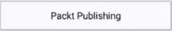

Figure 4.2 – Center-aligned top app bar

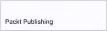

Figure 4.3 – Medium top app bar

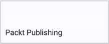

Figure 4.4 – Large top app bar

如 *图 4.1* 到 *图 4.4* 所示，所有顶部栏的宽度相同，只是在高度和标题文本的位置上有所不同。

让我们看看这些顶部应用栏之一的示例代码：

```java
@OptIn(ExperimentalMaterial3Api::class)
@Composable
fun PacktCenterAlignedTopBar() {
    CenterAlignedTopAppBar(
        title = {
            Text(text = "Packt Publishing")
        }
    )
}
```

在这里，我们有我们的自定义可组合组件，并在其中使用 Material 3 的 `CenterAlignedTopBar` 可组合组件，并将 `Text` 传递给 `title` 可组合组件。其他三个（`LargeTopAppBar`、`MediumTopAppBar` 和 `TopAppBar`）类似；唯一的区别是你会使用的可组合组件。请注意，我们使用了 `@OptIn` 注解，因为这些组件仍然是实验性的。

接下来，让我们看看 `FloatingActionButton` 组件。

### FloatingActionButton

大多数应用都使用该组件来表示在应用中经常使用的操作调用。例如，在聊天应用中创建一个新的聊天。它通常位于屏幕的右下角或其他位置，具体取决于你的用例。这就是我们创建组件的方式：

```java
FloatingActionButton(
    onClick = { /*TODO*/ },
    content = {
        Icon(
            imageVector = Icons.Default.Add ,
            contentDescription = "New Chat"
        )
    }
)
```

我们使用来自 Material 3 库的 `FloatingActionButton` 组件。我们在可组合组件上设置了 `onclick` 参数，并在 `content` 拉姆达函数内部传递了一个带有 *add* 图标的 `Icon` 可组合组件。预览应该是以下内容：

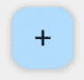

Figure 4.5 – FloatingActionButton

`FloatingActionButton` 组件有这些尺寸：大、正常和小，你可以使用适合你目的的任意一个。

我们还有一种名为 `ExtendedFloatingActionButton` 的 `FloatingActionButton` 组件，其外观如下：

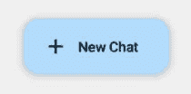

图 4.6 – 扩展 FloatingActionButton

如前图所示，`ExtendedFloatingActionButton`组件允许我们向我们的 FAB 添加更多项目。它们比正常的`FloatActionButton`组件更宽。在这种情况下，我们有一个带有文本**新聊天**的`Text`可组合组件，以及一个图标。您可以使用或不用图标。此实现的代码如下：

```java
ExtendedFloatingActionButton(
    onClick = { /*TODO*/ },
    content = {
        Icon(
            imageVector = Icons.Default.Add ,
            contentDescription = "New Chat"
        )
        Text(
            modifier = Modifier.padding(10.dp),
            text = "New Chat"
        )
    }
)
```

在这里，我们使用了`ExtendedFloatingActionButton`组件，并且仍然传递了之前相同的参数。唯一的不同之处在于，在内容内部，我们传递了一个文本，因为`content`lambda 暴露了`RowScope`，这意味着子可组合组件将按行排列。

接下来，让我们看看底部应用栏组件。

### 底部应用栏

底部应用栏组件在屏幕底部显示导航项。它们通常对具有三个到五个主要目的地的应用程序非常有用。

让我们看看底部应用栏的代码：

```java
BottomAppBar(
    actions = {
        Icon(imageVector = Icons.Rounded.Home, contentDescription = "Home Screen")
        Icon(imageVector = Icons.Rounded.ShoppingCart, contentDescription = "Cart Screen")
        Icon(imageVector = Icons.Rounded.AccountCircle, contentDescription = "Account Screen")
    }
)
```

我们使用`BottomAppBar`组件，并在`actions`lambda 内部传递了三个`Icon`可组合组件来表示我们应该显示的项目。这是可组合组件预览将看起来如下：

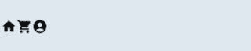

图 4.7 – BottomAppBar

在*图 4*，7*中，我们可以看到有三个图标水平排列。

此外，在`BottomAppBar`中，我们还可以提供`FloatingActionButton`组件。我们将使用我们之前早期使用的`FloatingActionButton`组件。更新的组件代码如下：

```java
BottomAppBar(
    actions = {
        Icon(imageVector = Icons.Rounded.Home, contentDescription = "Home Screen")
        Icon(imageVector = Icons.Rounded.ShoppingCart, contentDescription = "Cart Screen")
        Icon(imageVector = Icons.Rounded.AccountCircle, contentDescription = "Account Screen")
    },
    floatingActionButton = {
        PacktFloatingActionButton()
    }
)
```

在前面的代码中，我们使用了`floatingActionButton`参数，并传递了我们之前创建的`PacktFloatingActionButton()`。更新的预览将如下所示：

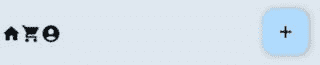

图 4.8 – 带有 FloatingActionButton 的 BottomAppBar

如前图所示，我们的`BottomAppBar`现在在其右侧有一个不错的`FloatingActionButton`。FAB 会自动为您定位到右侧。

我们已经单独查看过不同的组件，但当我们将它们一起放置在一个屏幕上时会发生什么？接下来，我们将要查看`Scaffold`，它就是为了这个目的而设计的。

### Scaffold

这是一个由 Material Design 提供的布局，它可以帮助您轻松地将所有组件放置在屏幕上所需的位置。

让我们看看一个`Scaffold`的示例，它具有顶部应用栏、浮动操作按钮、屏幕上居中的文本和底部导航栏：

```java
Scaffold(
    topBar = {
        PacktSmallTopAppBar()
    },
    bottomBar = {
        PacktBottomNavigationBar()
    },
    floatingActionButton = {
        PacktFloatingActionButton()
    },
    content = { paddingValues ->
      Column(
          modifier = Modifier
              .fillMaxSize()
              .padding(paddingValues)
              .background(Color.Gray.copy(alpha = 0.1f)),
          verticalArrangement = Arrangement.Center,
          horizontalAlignment = Alignment.CenterHorizontally
      ) {
          Text(
              modifier = Modifier.padding(10.dp),
              text = "Mastering Kotlin for Android Development - Chapter 4",
              textAlign = TextAlign.Center
          )
        }
    }
)
```

这里发生了很多事情，所以让我们逐一分析：

+   **Scaffold**可组合组件用于创建一个实现 Material Design 指南的布局。它是一个容器，包含顶部栏、底部栏、浮动操作按钮和内容。

+   **topBar**参数用于指定顶部栏。在这种情况下，我们使用的是我们之前创建的**PacktSmallTopAppBar**可组合组件。

+   **bottomBar** 参数用于指定底部栏。在这种情况下，我们使用的是 **PacktBottomNavigationBar** 可组合组件。

+   **floatingActionButton** 参数用于指定浮动操作按钮。在这种情况下，我们使用的是 **PacktFloatingActionButton** 可组合组件。

+   **content** 参数用于指定屏幕的内容。在这种情况下，我们使用了一个包含 **Text** 可组合组件的 **Column** 可组合组件。文本通过 **verticalArrangement** 和 **horizontalAlignment** 参数在列中居中。请注意，在 **Column** 中，我们使用 **paddingValues** 参数为列添加填充。这是因为 **Scaffold** 可组合组件将 **padding** 值传递给了 **content** 参数。

我们的 `Scaffold` 可组合组件已经准备好了，让我们看看它的预览效果：

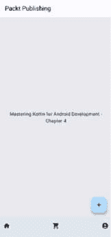

图 4.9 – Scaffold

在 *图 4.9* 中，我们可以看到 `Scaffold` 可组合组件已经将顶部栏、底部栏和浮动操作按钮添加到了屏幕上。组件也按照 Material Design 指南放置在了正确的位置。

到目前为止，我们已经学习了许多组件；Material 3 仍然为我们提供了更多开箱即用的组件。我们将在本书的后续章节中使用一些这些组件。要查看所有组件的完整列表，请访问 Material 3 组件网站（https://m3.material.io/components）以查看它们及其指南。

现在我们已经了解了 Material 3 及其特性，让我们看看如何将其添加到我们的应用中。

# 在我们的应用中使用 Material Design

为了利用上一节中查看的 Material 3 特性，我们需要将其添加到我们的应用中。幸运的是，随着 Android Studio Hedgehog 的推出，我们有 Material 3 模板。甚至我们一直在使用的示例应用也已经使用了 Material 3。真是太酷了，对吧？让我们快速扫描依赖项以了解正在发生的事情：

```java
implementation 'androidx.core:core-ktx:1.10.1'
implementation platform('org.jetbrains.kotlin:kotlin-bom:1.8.0')
implementation 'androidx.lifecycle:lifecycle-runtime-ktx:2.6.1'
implementation 'androidx.activity:activity-compose:1.7.2'
implementation platform('androidx.compose:compose-bom:2022.10.00')
implementation 'androidx.compose.ui:ui'
implementation 'androidx.compose.ui:ui-graphics'
implementation 'androidx.compose.ui:ui-tooling-preview'
implementation 'androidx.compose.material3:material3'
testImplementation 'junit:junit:4.13.2'
androidTestImplementation 'androidx.test.ext:junit:1.1.5'
androidTestImplementation 'androidx.test.espresso:espresso-core:3.5.1'
androidTestImplementation platform('androidx.compose:compose-bom:2022.10.00')
androidTestImplementation 'androidx.compose.ui:ui-test-junit4'
debugImplementation 'androidx.compose.ui:ui-tooling'
debugImplementation 'androidx.compose.ui:ui-test-manifest'
```

这个依赖关系块为我们设置了一些依赖项，包括 `compose` 依赖项。其中最重要的是 `androidx.compose.material3:material3` 依赖项。这是包含 Material 3 组件的依赖项。我们使用 Compose **物料清单**（**BOM**）来管理我们的依赖项。这意味着我们不需要指定每个依赖项的版本。相反，我们指定 BOM 的版本，它将为我们管理依赖项的版本。这是在 Compose 中管理依赖项的推荐方式。这就是为什么我们没有指定每个依赖项的版本。

有了这些，我们的项目已经准备好利用 Material 3 的特性了。在下一小节中，我们将向应用添加更多颜色方案。

## 添加 Material Design 3 颜色方案

如前所述，Material 3 带有很多精细的颜色方案，并引入了**动态颜色**。然而，它们并不是与 Android Studio 生成的模板一起设置的。我们将在接下来的几个步骤中设置它们。

转到 `ui/theme` 包，打开 `Color.kt` 文件，其中包含以下代码：

```java
val Purple80 = Color(0xFFD0BCFF)
val PurpleGrey80 = Color(0xFFCCC2DC)
val Pink80 = Color(0xFFEFB8C8)
val Purple40 = Color(0xFF6650a4)
val PurpleGrey40 = Color(0xFF625b71)
val Pink40 = Color(0xFF7D5260)
```

到目前为止，此文件只定义了少量颜色。这些颜色并不涵盖 Material 3 提供的所有颜色标记。我们将根据需要在应用程序中添加更多颜色。

我们将使用**材料主题构建器**工具来生成这些颜色。让我们打开我们的浏览器并转到材料主题构建器工具([`m3.material.io/theme-builder`](https://m3.material.io/theme-builder))。我们将看到以下屏幕：

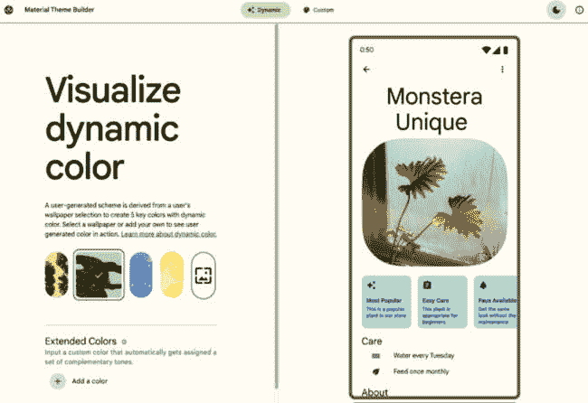

图 4.10 – 材料主题构建器工具

此工具帮助我们可视化应用程序的色彩方案，并显示不同组件的主题化方式。它使我们更容易自定义并生成应用程序的一致色彩方案。它有两个选项卡：**动态**和**自定义**。在**动态**选项卡中，我们可以选择预加载的颜色或壁纸，以查看颜色如何变化。一个有用的功能是，我们还可以添加自己的壁纸，并根据壁纸生成颜色。

在**自定义**选项卡中，我们可以选择一种颜色，工具会根据我们选择的颜色生成所有互补色，确保色彩搭配和谐：

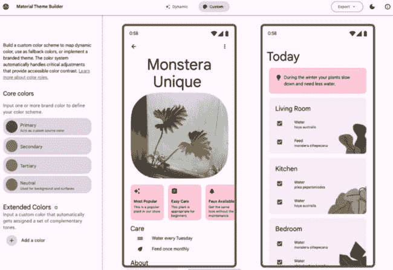

图 4.11 – 材料主题构建器工具自定义颜色

在左侧，我们有**核心颜色**部分，我们可以为我们的应用程序选择**主色**、**次色**、**三级色**或**中性色**。

我们将选择**主色**选项，这将打开一个**颜色** **选择器**对话框：

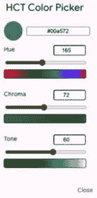

图 4.12 – 颜色选择器

由于我们正在更改主色，我们将能够看到视觉预览更改为匹配我们选择的颜色。现在我们已经准备好了主色，我们将导出文件，以便我们可以在项目中使用它们：

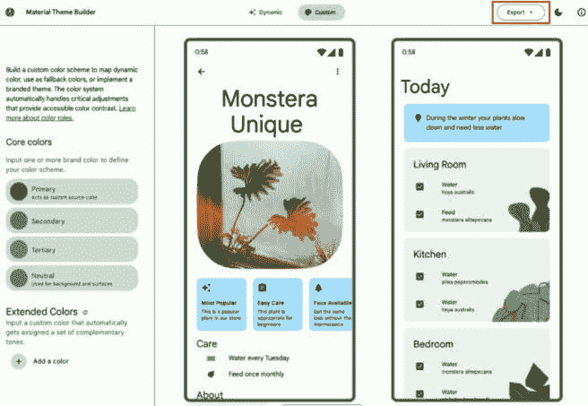

图 4.13 – 导出选项

如*图 4**.13*所示，视觉预览已更改为我们选择的颜色。点击包含 `Color.kt` 和 `Theme.kt` 文件的 `ui` 文件夹中的 `theme` 文件夹。

让我们打开包含以下代码的 `Color.kt` 文件：

```java
val md_theme_light_primary = Color(0xFF006C49)
val md_theme_light_onPrimary = Color(0xFFFFFFFF)
val md_theme_light_primaryContainer = Color(0xFF7AFAC0)
val md_theme_light_onPrimaryContainer = Color(0xFF002113)
val md_theme_light_secondary = Color(0xFF4D6357)
val md_theme_light_onSecondary = Color(0xFFFFFFFF)
val md_theme_light_secondaryContainer = Color(0xFFD0E8D8)
val md_theme_light_onSecondaryContainer = Color(0xFF0A1F16)
val md_theme_light_tertiary = Color(0xFF3D6473)
val md_theme_light_onTertiary = Color(0xFFFFFFFF)
val md_theme_light_tertiaryContainer = Color(0xFFC0E9FB)
val md_theme_light_onTertiaryContainer = Color(0xFF001F29)
val md_theme_light_error = Color(0xFFBA1A1A)
val md_theme_light_errorContainer = Color(0xFFFFDAD6)
val md_theme_light_onError = Color(0xFFFFFFFF)
val md_theme_light_onErrorContainer = Color(0xFF410002)
val md_theme_light_background = Color(0xFFFBFDF9)
val md_theme_light_onBackground = Color(0xFF191C1A)
val md_theme_light_surface = Color(0xFFFBFDF9)
val md_theme_light_onSurface = Color(0xFF191C1A)
val md_theme_light_surfaceVariant = Color(0xFFDCE5DD)
val md_theme_light_onSurfaceVariant = Color(0xFF404943)
val md_theme_light_outline = Color(0xFF707973)
val md_theme_light_inverseOnSurface = Color(0xFFEFF1ED)
val md_theme_light_inverseSurface = Color(0xFF2E312F)
val md_theme_light_inversePrimary = Color(0xFF5CDDA5)
val md_theme_light_shadow = Color(0xFF000000)
val md_theme_light_surfaceTint = Color(0xFF006C49)
val md_theme_light_outlineVariant = Color(0xFFC0C9C1)
val md_theme_light_scrim = Color(0xFF000000)
val md_theme_dark_primary = Color(0xFF5CDDA5)
val md_theme_dark_onPrimary = Color(0xFF003824)
val md_theme_dark_primaryContainer = Color(0xFF005236)
val md_theme_dark_onPrimaryContainer = Color(0xFF7AFAC0)
val md_theme_dark_secondary = Color(0xFFB4CCBD)
val md_theme_dark_onSecondary = Color(0xFF20352A)
val md_theme_dark_secondaryContainer = Color(0xFF364B40)
val md_theme_dark_onSecondaryContainer = Color(0xFFD0E8D8)
val md_theme_dark_tertiary = Color(0xFFA5CDDE)
val md_theme_dark_onTertiary = Color(0xFF063543)
val md_theme_dark_tertiaryContainer = Color(0xFF244C5A)
val md_theme_dark_onTertiaryContainer = Color(0xFFC0E9FB)
val md_theme_dark_error = Color(0xFFFFB4AB)
val md_theme_dark_errorContainer = Color(0xFF93000A)
val md_theme_dark_onError = Color(0xFF690005)
val md_theme_dark_onErrorContainer = Color(0xFFFFDAD6)
val md_theme_dark_background = Color(0xFF191C1A)
val md_theme_dark_onBackground = Color(0xFFE1E3DF)
val md_theme_dark_surface = Color(0xFF191C1A)
val md_theme_dark_onSurface = Color(0xFFE1E3DF)
val md_theme_dark_surfaceVariant = Color(0xFF404943)
val md_theme_dark_onSurfaceVariant = Color(0xFFC0C9C1)
val md_theme_dark_outline = Color(0xFF8A938C)
val md_theme_dark_inverseOnSurface = Color(0xFF191C1A)
val md_theme_dark_inverseSurface = Color(0xFFE1E3DF)
val md_theme_dark_inversePrimary = Color(0xFF006C49)
val md_theme_dark_shadow = Color(0xFF000000)
val md_theme_dark_surfaceTint = Color(0xFF5CDDA5)
val md_theme_dark_outlineVariant = Color(0xFF404943)
val md_theme_dark_scrim = Color(0xFF000000)
```

如您现在所看到的，我们添加了更多颜色。让我们将这些颜色复制到我们项目中的 `Color.kt` 文件中。接下来，让我们打开解压缩文件夹中的 `Theme.kt`。

我们会注意到它与`Theme.kt`文件类似，但它定义了所有 Material 3 颜色方案。将此文件的全部内容复制并粘贴到我们项目中的`Theme.kt`文件中。我们将对代码进行一些小的编辑，以确保我们保持`ChapterFourTheme`名称和动态颜色逻辑。接下来，我们需要将`DarkColorScheme`变量的值更改为以下内容：

```java
private val DarkColorScheme = darkColorScheme(
    primary = md_theme_light_primary,
    onPrimary = md_theme_light_onPrimary,
    primaryContainer = md_theme_light_primaryContainer,
    onPrimaryContainer = md_theme_light_onPrimaryContainer,
    secondary = md_theme_light_secondary,
    onSecondary = md_theme_light_onSecondary,
    secondaryContainer = md_theme_light_secondaryContainer,
    onSecondaryContainer = md_theme_light_onSecondaryContainer,
    tertiary = md_theme_light_tertiary,
    onTertiary = md_theme_light_onTertiary,
    tertiaryContainer = md_theme_light_tertiaryContainer,
    onTertiaryContainer = md_theme_light_onTertiaryContainer,
    error = md_theme_light_error,
    errorContainer = md_theme_light_errorContainer,
    onError = md_theme_light_onError,
    onErrorContainer = md_theme_light_onErrorContainer,
    background = md_theme_light_background,
    onBackground = md_theme_light_onBackground,
    surface = md_theme_light_surface,
    onSurface = md_theme_light_onSurface,
    surfaceVariant = md_theme_light_surfaceVariant,
    onSurfaceVariant = md_theme_light_onSurfaceVariant,
    outline = md_theme_light_outline,
    inverseOnSurface = md_theme_light_inverseOnSurface,
    inverseSurface = md_theme_light_inverseSurface,
    inversePrimary = md_theme_light_inversePrimary,
    surfaceTint = md_theme_light_surfaceTint,
    outlineVariant = md_theme_light_outlineVariant,
    scrim = md_theme_light_scrim,
)
```

在前面的代码中，我们使用`DarkColorScheme`函数来创建一个深色主题。我们传递使用 Material Theme Builder 工具生成的颜色。我们将使用此颜色方案来创建一个深色主题。深色颜色方案变量以类似的方式定义，并且我们可以从工具的`Theme.kt`文件中复制值并添加到那里。现在让我们全面查看我们的主题可组合项：

```java
@Composable
fun ChapterFourTheme(
    darkTheme: Boolean = isSystemInDarkTheme(),
    dynamicColor: Boolean = true,
    content: @Composable () -> Unit
) {
    val colorScheme = when {
        dynamicColor && Build.VERSION.SDK_INT >= Build.VERSION_CODES.S -> {
            val context = LocalContext.current
            if (darkTheme) dynamicDarkColorScheme(context) else dynamicLightColorScheme(context)
        }
        darkTheme -> DarkColorScheme
        else -> LightColorScheme
    }
    val view = LocalView.current
    if (!view.isInEditMode) {
        SideEffect {
            val window = (view.context as Activity).window
            window.statusBarColor = colorScheme.primary.toArgb()
            WindowCompat.getInsetsController(window, view).isAppearanceLightStatusBars = darkTheme
        }
    }
    MaterialTheme(
        colorScheme = colorScheme,
        typography = Typography,
        content = content
    )
}
```

让我们分解前面的代码：

+   **ChapterFourTheme**可组合项用于为我们的应用创建一个主题。它接受三个参数：

    +   **darkTheme**参数用于指定主题是深色还是浅色。默认情况下，我们使用系统主题。

    +   **dynamicColor**参数用于指定主题是否应使用动态颜色。默认情况下，我们使用动态颜色。

    +   **content**参数用于指定主题的内容。在这种情况下，我们使用**MaterialTheme**可组合项来为我们的应用创建一个主题。

+   **colorScheme**变量用于指定要使用的颜色方案。我们使用**when**表达式来确定要使用的颜色方案。如果**dynamicColor**参数为**true**且设备正在运行 Android 12 或更高版本，我们将使用**dynamicDarkColorScheme**或**dynamicLightColorScheme**函数来创建一个动态颜色方案。当不使用动态颜色时，我们将回退到正常主题。如果**darkTheme**参数为**true**，我们将使用**DarkColorScheme**变量来创建一个深色主题。否则，我们将使用**LightColorScheme**变量来创建一个浅色主题。

+   **view**变量用于获取正在使用该主题的视图。

+   **SideEffect**可组合项用于执行副作用。在这种情况下，我们使用它来设置状态栏颜色和状态栏图标颜色。我们使用**WindowCompat**类来获取**InsetsController**并设置状态栏颜色和状态栏图标颜色。我们使用**colorScheme.primary**颜色来设置状态栏颜色。我们使用**darkTheme**参数来确定状态栏图标颜色应该是浅色还是深色。

+   **MaterialTheme**可组合项用于为我们的应用创建一个主题。我们使用**colorScheme**参数来指定要使用的颜色方案。我们使用**typography**变量来指定要使用的排版。

为了能够看到我们所做的更改，我们需要调用我们之前在`ChapterFourTheme`块中的`MainActivity.kt`文件内创建的`PacktScaffold`，如下所示：

```java
class MainActivity : ComponentActivity() {
    override fun onCreate(savedInstanceState: Bundle?) {
        super.onCreate(savedInstanceState)
        setContent {
            ChapterFourTheme {
                PacktScaffold()
            }
        }
    }
}
```

让我们构建并运行这个应用。我们应该能够看到以下内容：

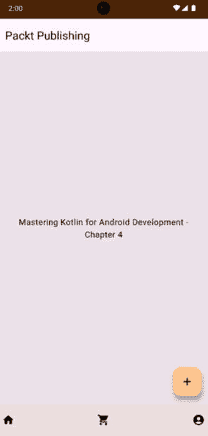

图 4.14 – 第四章应用

就像我一样，你可能想知道为什么应用没有在 Material Theme Builder 工具上设置的绿色调。还记得我们`ChapterFourTheme`可组合中的动态颜色逻辑吗？它负责我们看到的那种棕色调。看看我的壁纸设置：

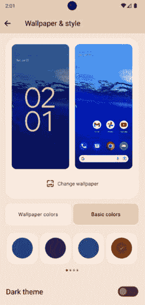

图 4.15 – 壁纸设置

如*图 4.15*所示，我的壁纸设置了棕色。这意味着我们的动态颜色逻辑正在工作，并且我们的应用可以很好地适应我的壁纸设置！

我们已经看到了如何在我们的应用中使用 Material 3 功能。在下一节中，我们将看到如何设计适用于 Jetpack Compose 中大屏幕和可折叠设备的 UI。

# 为大屏幕和可折叠设备设计 UI

近年来，随着 Material 3 的发布，对平板电脑和可折叠设备的关注有所增加。因此，作为开发者，我们必须确保我们的应用在这些设备上运行良好。在本节中，我们将探讨如何使我们的应用在大屏幕和可折叠设备上运行良好。我们需要确保我们的应用适应不同的屏幕尺寸。使我们的应用具有响应性可以提供良好的用户体验。

Material 3 提供了**规范布局**，作为创建大屏幕和可折叠设备 UI 的指南。这些布局如下：

+   **列表-详情视图**：在这里，我们在左侧放置一个项目列表，在右侧显示单个项目的详细信息。

+   **内容流**：在这里，我们将内容元素（如卡片）排列在一个可定制的网格中，这可以很好地展示大量内容。

+   **辅助面板**：在这里，我们将应用内容组织成主要和次要显示区域。主要区域显示主要内容，而次要区域显示辅助内容。主要区域占据屏幕的大部分，而次要区域占据较小的一部分。

为了展示不同的布局，我们必须知道用户所使用的设备的屏幕尺寸。幸运的是，Jetpack Compose 为我们提供了一种获取屏幕尺寸的方法。我们有了 Material 3 的**WindowSizeClass**来帮助我们确定在应用中显示哪个布局。

我们将要学习如何使用`WindowSizeClass`。

## 使用 WindowSizeClass

为了使用`WindowSizeClass`，我们必须将以下依赖项添加到我们的应用中：

```java
implementation 'androidx.compose.material3:material3-window-size-class'
```

这是 Material 3 依赖项，它将`WindowSizeClass`添加到我们的项目中。请注意，我们没有为这个依赖项提供版本号。这是因为我们正在使用 Compose BOM 来管理我们的依赖项。BOM 将为我们管理这个依赖项的版本。

`WindowSizeClass`将可用的屏幕宽度分为三个类别：

+   **紧凑型**：这是指宽度小于 600 dp 的设备。通常，这些设备处于纵向模式。

+   **Medium**：这是指宽度在 600 dp 和 840 dp 之间的设备。横屏模式的平板电脑和可折叠设备属于这一类别。

+   **Expanded**：这是指宽度大于 840 dp 的设备。平板电脑和横屏模式的可折叠设备、横屏模式的手机以及桌面电脑都属于这一类别。

`WindowSizeClass` 使用 `widthSizeClass` 来获取屏幕宽度。除了 `widthSizeClass`，它还有一个 `heightSizeClass` 来帮助我们确定屏幕的高度。

让我们看看 `widthSizeClass` 的实际应用：

```java
when(calculateWindowSizeClass(activity = this).widthSizeClass) {
    WindowWidthSizeClass.Compact -> {
        CharactersScreen(
            navigationOptions = NavigationOptions.BottomNavigation,
            showDetails = false
        )
    }
    WindowWidthSizeClass.Medium -> {
        CharactersScreen(
            navigationOptions = NavigationOptions.NavigationRail,
            showDetails = true
        )
    }
    WindowWidthSizeClass.Expanded -> {
        CharactersScreen(
            navigationOptions = NavigationOptions.NavigationDrawer,
            showDetails = true
        )
    }
    else -> {
        CharactersScreen(
            navigationOptions = NavigationOptions.BottomNavigation,
            showDetails = false
        )
    }
}
```

这里是对前面代码的解释：

+   **calculateWindowSizeClass** 函数用于计算 **WindowSizeClass**。我们传递活动作为参数。该函数来自 **WindowSizeClass** API。它具有 **widthSizeClass** 和 **heightSizeClass** 属性，我们可以使用它们分别获取屏幕的宽度和高度。

+   我们使用 **widthSizeClass** 来自定义我们的显示选项：

    +   对于 **WindowWidthSizeClass.Compact** 的情况，我们使用 **BottomNavigation** 进行导航，并且 UI 应该只显示角色列表。

    +   对于 **WindowWidthSizeClass.Medium** 的情况，我们使用 **NavigationRail** 进行导航，并且 UI 应该显示角色列表和所选角色的详细信息。

    +   对于 **WindowWidthSizeClass.Expanded** 的情况，我们使用 **NavigationDrawer** 进行导航，并且 UI 应该显示角色列表和所选角色的详细信息。

    +   我们有一个默认情况，其中我们使用 **BottomNavigation** 进行导航，并且 UI 应该只显示角色列表。

一眼就能看出我们如何利用 `WindowSizeClass` 来根据屏幕大小自定义我们的 UI 和导航类型。这是一个非常强大的功能，我们可以用它来使我们的 apps 响应。这确保了我们充分利用屏幕大小并提供良好的用户体验。

本节中展示的示例很简单。在本书的 **第七章**（B19779_07.xhtml#_idTextAnchor092）中，我们将有一个更详细的示例，我们将使用 `WindowSizeClass` 来根据屏幕大小自定义我们的 UI。

现在我们已经知道了如何设计和构建适用于大屏幕和可折叠设备的 apps，让我们看看本章的另一个重要主题，即可访问性。

# 使我们的 app 可访问

使我们开发的 apps 可访问性非常重要。它确保我们的 apps 可以被每个人使用。在本节中，我们将探讨我们如何使我们的 apps 可访问。Jetpack Compose 使用 **语义** 来使我们的 apps 可访问。语义用于描述我们 apps 中的 UI 元素。它们被用于使我们的 apps 可访问的辅助服务。语义也被用于自动化测试工具来测试我们的 apps。使我们的 apps 可访问的一些最佳实践如下：

+   我们应该始终确保所有可点击或可触摸的元素，或者那些需要用户交互的元素，足够大，以便容易点击或触摸。大多数 Material 组件默认大小足够大，可以轻松点击或触摸。如果我们必须自行设置大小，我们应该确保大小至少为 48 dp x 48 dp。

+   我们应该为我们的可组合组件添加内容描述。例如，**Icon**和**Image**组件提供了这个参数来描述视觉元素给辅助服务。我们应该始终为这些组件提供内容描述。以下是一个例子：

    ```java
    Icon(
        modifier = Modifier.size(48.dp),
        painter = painterResource(id = R.drawable.ic_launcher_foreground),
        contentDescription = "Icon"
    )
    ```

    你可以从前面的代码中看到，我们正在使用`contentDescription`参数为`Icon`提供描述。这是一个我们应该始终遵循的好习惯。

+   我们应该为我们的可点击元素添加标签。我们可以将可点击标签传递给可点击修饰符。这使我们能够为我们的可点击元素添加描述。以下是一个例子：

    ```java
    Text(
        modifier = Modifier
            .clickable(
                onClick = { /*TODO*/ },
                onClickLabel = "Click Me"
            )
            .padding(10.dp),
        text = "Click Me"
    )
    ```

    在前面的例子中，我们使用`onClickLabel`参数为`Text`可组合组件添加描述。这是一个我们应该始终遵循的好习惯。

+   通过使用语义，我们还可以描述标题。标题用于描述其后的内容。我们可以使用语义为我们的可组合组件添加标题。以下是一个例子：

    ```java
    Text(
        modifier = Modifier
            .semantics { heading() }
            .padding(10.dp),
        text = "Heading One"
    )
    ```

+   我们还可以提供有关我们可组合组件状态的信息。例如，我们可以提供有关按钮状态的信息。我们可以使用语义来提供这些信息。以下是一个例子：

    ```java
    Button(
        modifier = Modifier
            .semantics { stateDescription = "Disabled" }
            .padding(10.dp),
        onClick = { /*TODO*/ },
        enabled = false
    ) {
        Text(text = "Disabled Button")
    }
    ```

    这有助于我们向用户告知我们可组合组件的状态。

+   对于某些组件组，我们也可以使用**mergeDescendants**参数来合并子可组合组件的语义。以下是一个例子：

    ```java
    Column(
        modifier = Modifier
            .padding(10.dp)
            .semantics(mergeDescendants = true) { }
    ) {
        Text(text = "Heading One")
        Text(text = "Heading Two")
        Text(text = "Heading Three")
    }
    ```

    当我们想要为多个可组合组件提供描述时，合并子组件是有用的。在前面的例子中，我们使用`mergeDescendants`参数来合并`Text`可组合组件的语义。然而，在使用此参数时我们应该小心。我们只应该在想要为多个可组合组件提供描述时使用它。如果我们为大量可组合组件使用它，可能会导致性能问题，也可能使用户感到困惑。

要了解更多关于 Jetpack Compose 的辅助功能，请访问官方文档([`developer.android.com/jetpack/compose/accessibility`](https://developer.android.com/jetpack/compose/accessibility))。

# 摘要

在本章中，我们介绍了 Material 3。我们还涵盖了 Material 3 提供的功能。我们看到了如何在我们的应用中使用 Material 3。此外，我们还介绍了如何为大型屏幕设计和开发我们的应用，最后，我们看到了如何使我们的 Jetpack Compose UI 易于访问。

在下一章中，我们将继续构建在前几章中获得的技能。我们将探讨如何架构我们的应用程序以及可用的不同架构。我们将学习如何在我们的应用程序中使用 Jetpack 库以及如何处理依赖注入。
