# 第十五章：提升您的应用

在完成应用的开发和发布后，在使用有助于改进应用的事物时，如 Firebase Messaging 或 Crashlytics，始终保持警觉非常重要。在本章中，我们将学习如何使用 Firebase Messaging 和 Crashlytics。

在本章中，我们将逐步学习如何通过添加分析工具（Firebase Crashlytics）和使用云消息来提高用户参与度来改进我们的应用。我们将学习如何从 Firebase 控制台向应用发送通知。此外，我们还将学习一些确保用户数据不受损害的应用安全技巧。

本章将涵盖以下主要内容：

+   使用 Firebase Crashlytics 检测崩溃

+   使用 Firebase Messaging 提高应用参与度

+   保护您的应用

# 技术要求

要遵循本章的说明，您需要下载 Android Studio Hedgehog 或更高版本([`developer.android.com/studio`](https://developer.android.com/studio))。

您可以使用上一章的代码来遵循本章的说明。您可以在 GitHub 上找到本章的代码，网址为[`github.com/PacktPublishing/Mastering-Kotlin-for-Android/tree/main/chapterfifteen`](https://github.com/PacktPublishing/Mastering-Kotlin-for-Android/tree/main/chapterfifteen)。

# 使用 Firebase Crashlytics 检测崩溃

应用程序可能因多种原因发生崩溃，包括常见的编码问题，如空指针异常、内存泄漏和不正确的数据处理。由不同设备硬件配置和不同 Android 操作系统引起的设备碎片化引入了兼容性问题，有时也可能导致崩溃。网络问题、资源不足或外部依赖（如第三方库）的管理不当也可能导致崩溃。有时，我们可以预见并优雅地处理它们。其他时候，它们是意外的，我们需要了解它们以便修复。我们的应用已经在 Google Play Store 上，所以有时我们可能没有在出现问题的设备上进行调试的便利。**Firebase Crashlytics**等工具可以帮助我们检测应用中的崩溃，并提供我们修复它们所需的信息。在本节中，我们将设置 Firebase Crashlytics 到我们的应用中，并了解我们如何使用它来检测崩溃。

Android Studio 内置了 Firebase 工具，可以帮助我们快速将 Firebase 添加到应用中。我们可以从**工具** | **Firebase**访问它，它应该会打开右侧的侧面板，如图所示：

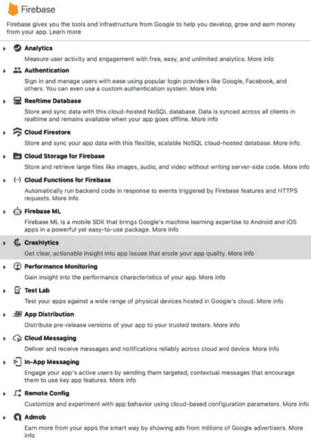

图 15.1 – Firebase 设置

如*图 15.1*所示，我们可以使用此工具设置各种 Firebase SDK。我们感兴趣的是设置**Crashlytics**。点击**Crashlytics**选项，我们将看到以下选项：


图 15.2 – Firebase Crashlytics 设置

由于我们的项目是用 Kotlin 编写的，我们将选择**开始使用 Firebase Crashlytics**作为选项。这将打开一个新窗口，其中包含以下说明：

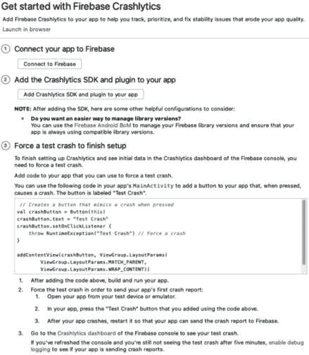

图 15.3 – 设置 Crashlytics 的步骤

如*图 15*.3 所示，它提供了我们设置 Firebase Crashlytics 在应用中的所有必要步骤。让我们点击**连接到 Firebase**选项。这将打开浏览器中的一个新标签页，其中打开了 Firebase 控制台（见*图 15*.4*）。它显示了我们在控制台上的所有 Firebase 项目（如果我们有任何）。使用**创建项目**选项并指定您首选的项目名称：

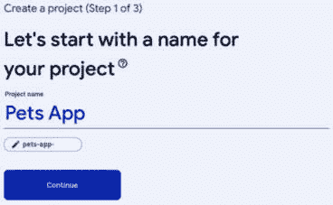

图 15.4 – 新的 Firebase 项目

点击**继续**进入下一步。这将带我们到以下屏幕：

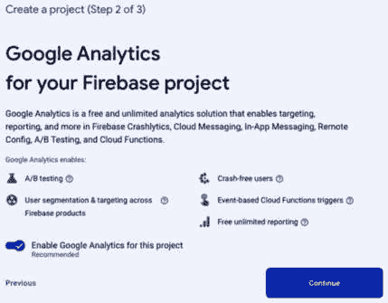

图 15.5 – Google Analytics 设置

在这个屏幕上，我们为我们的应用配置 Google Analytics。它还显示了 Google Analytics 为我们的应用提供的功能。Google Analytics 收集我们应用的用法和行为数据。我们用它来跟踪用户事件、系统事件或错误，分析应用性能，收集用户属性，如语言偏好和地理位置等。

点击**继续**进入下一步：

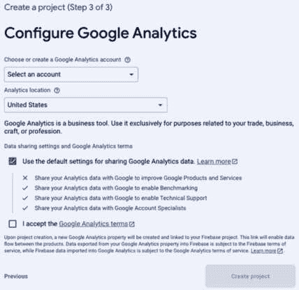

图 15.6 – 配置 Google Analytics

在这一步，我们为 Google Analytics 配置了更多选项。我们必须选择一个 Google Analytics 账户。如果您已经配置了其他项目，选择默认账户将隐藏其他问题。完成操作后，点击**创建项目**以最终创建项目，您将看到以下对话框：

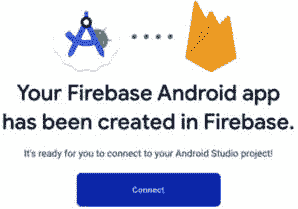

图 15.7 – 完成设置对话框

在我们的项目创建完成后，点击**连接**以最终完成 Firebase Crashlytics 在 Android Studio 中的设置。让我们回到 Android Studio，看看有什么变化。我们可以看到，Firebase Crashlytics 选项现在已被勾选：

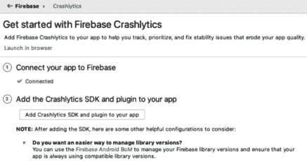

图 15.8 – 应用已连接

下一步是将 Firebase Crashlytics SDK 添加到我们的应用中。我们可以通过点击**将 Crashlytics SDK 和插件添加到您的应用中**按钮来完成此操作。这将向我们的应用添加必要的依赖项。您可以通过检查 Gradle 文件来查看这些更改。

在完成所有步骤后，我们现在可以在`MainActivity.kt`文件中的`onCreate()`函数内添加以下代码：

```java
throw RuntimeException("Test Crash")
```

现在，运行应用。应用将出现以下堆栈跟踪：

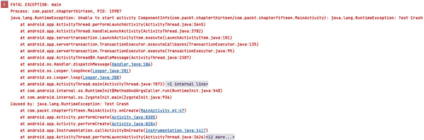

图 15.9 – 崩溃堆栈跟踪

我们可以前往 Firebase 控制台中我们新创建的项目，查看是否已报告崩溃。在 Firebase 控制台中，Crashlytics 通常位于屏幕左侧导航抽屉中的 **发布和监控** 部分。它显示了以下屏幕：

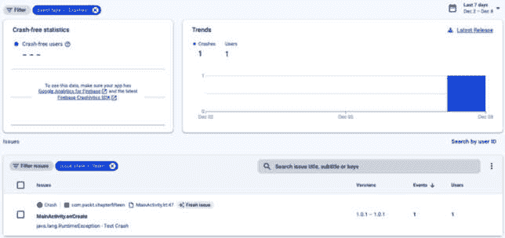

图 15.10 – Firebase 控制台崩溃概述

我们可以看到崩溃已经被报告。我们可以点击 `MainActivity.onCreate` 崩溃来查看更多详细信息。它显示了以下屏幕：

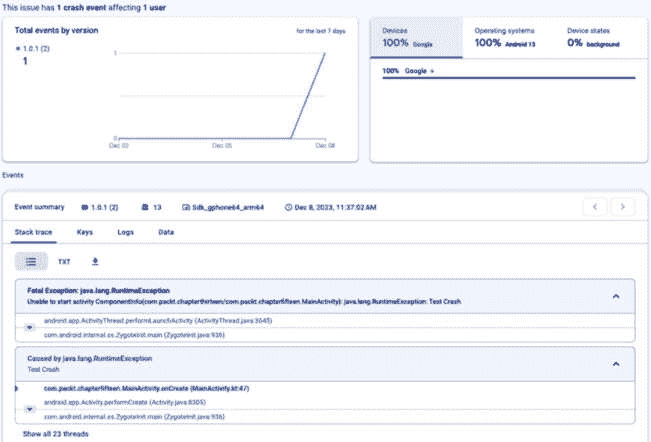

图 15.11 – Firebase 控制台崩溃详情

如 *图 15.10* 所示，我们从 Firebase 控制台获得了以下详细信息：

+   **堆栈跟踪**：这显示了崩溃的堆栈跟踪。

+   **设备**：这显示了崩溃发生的设备。我们可以看到设备型号、操作系统版本和设备状态。

+   **应用版本**：这显示了崩溃的应用版本。它还显示了该版本发生的总崩溃次数。

在调试崩溃时，这些信息非常有用。Android Studio Hedgehog 和更早的版本也提供了一个有用的工具，**App Quality Insights**，它可以帮助我们从 Android Studio 中查看 Firebase 崩溃。我们可以在底部的工具标签中访问它，如下所示：

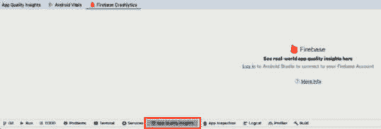

图 15.12 – 应用质量洞察

如 *图 15.11* 所示，我们需要登录到包含我们正在工作的项目的 Firebase 账户。我们可以通过点击 **登录** 按钮并在浏览器中完成登录过程来实现。登录后，我们可以看到应用中发生的崩溃：

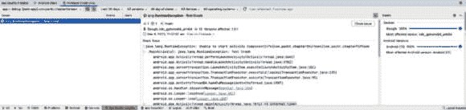

图 15.13 – 应用质量洞察崩溃详情

这显示了所有详细信息，正如我们之前在 Firebase 控制台中看到的。我们还可以看到堆栈跟踪。它的好处是，我们可以轻松地导航到导致崩溃的文件和行，而无需切换上下文并转到浏览器。

在设置好 Firebase Crashlytics 之后，我们现在可以检测到应用中的崩溃并修复它们。这将帮助我们提高应用的质量，并让我们的用户感到满意。

重要提示

记得删除我们添加的导致应用崩溃的代码。

接下来，让我们设置 **Firebase Analytics**，它也会收集有关我们应用的有用信息。这将帮助我们了解用户如何使用我们的应用，并帮助我们做出明智的决策，以改进它。

## 设置 Google Analytics

设置 Google Analytics 与设置 Firebase Crashlytics 类似。重复您为 Firebase Crashlytics 执行的以下步骤：

1.  从 **工具** | **Firebase** 打开 Firebase 工具。

1.  从与我们在 *图 15.1* 中看到的列表类似的选项列表中选择 **Analytics**。

1.  选择 **Google Analytics** 的 **开始使用** 选项。

1.  由于我们的应用程序已经连接到 Firebase，我们可以跳过第一步，直接进行下一步。

1.  点击**将分析添加到您的应用程序**按钮，为我们的应用程序添加必要的依赖项。

1.  一旦 Gradle 同步完成，我们就完成了在应用程序中设置 Firebase 分析的最终步骤。

设置完成后，我们就可以从 Firebase 控制台查看分析数据。我们可以在**分析**部分下的导航抽屉中访问它。它显示了以下屏幕：

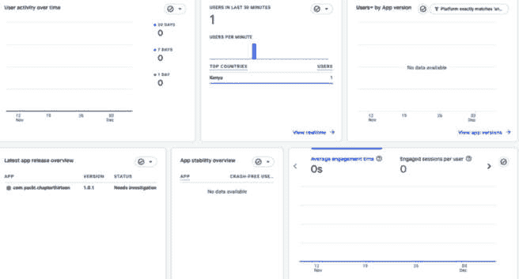

图 15.14 – 应用程序分析

我们已经学会了如何在应用程序中设置 Firebase Crashlytics 和 Firebase Analytics。现在我们可以检测应用程序中的崩溃并收集有关应用程序的有用信息。这将帮助我们提高应用程序的质量并让我们的用户满意。

在下一节中，我们将学习如何使用 Firebase Cloud Messaging 向我们的应用程序发送通知。

# 使用 Firebase 消息提高应用程序参与度

当用户安装我们的应用程序后，他们完成他们想要做的事情后可能不会再使用它。这可能导致活跃用户数量的下降，对不同应用程序有不同的影响。

我们可以利用**Firebase Cloud Messaging**向我们的用户发送通知，提醒他们使用我们的应用程序。这将帮助我们提高应用程序的参与度并增加活跃用户数量。在本节中，我们将设置 Firebase Cloud Messaging 到我们的应用程序中，并查看我们如何使用它向应用程序用户发送通知。

首先，我们需要在我们的应用程序中设置 Firebase Cloud Messaging SDK。这允许我们在项目中使用 SDK，并在设置完成后使我们的应用程序能够接收 Firebase 通知。我们将以与 Firebase Crashlytics 和 Firebase Analytics 相同的方式进行操作。重复以下步骤：

1.  从**工具** | **Firebase**打开 Firebase 工具。

1.  从与我们在图 15.1 中看到的列表类似的选择中，选择**云消息**。

1.  选择**设置 Firebase Cloud Messaging**选项。

1.  由于我们的应用程序已经连接到 Firebase，我们可以跳过第一步，直接进行下一步。

1.  点击**将 FCM 添加到您的应用程序**按钮，为应用程序添加必要的依赖项。

1.  一旦 Gradle 同步完成，FCM SDK 已经在我们的应用程序中设置好了。

我们需要创建一个新的服务来处理接收到的通知，并获取设备令牌。让我们创建一个新的包，名为`firebase`。在这个包内部，让我们创建一个新的文件，名为`FirebaseMessagingService.kt`。这将是我们处理接收到的通知的服务。

让我们在其中添加以下代码：

```java
class FirebaseNotificationService: FirebaseMessagingService() {
    override fun onNewToken(token: String) {
        super.onNewToken(token)
        Log.d("Firebase Token", token)
    }
    override fun onMessageReceived(remoteMessage: RemoteMessage) {
        super.onMessageReceived(remoteMessage)
        sendNotification(remoteMessage)
    }
    private fun sendNotification(remoteMessage: RemoteMessage) {
        val notification = NotificationCompat.Builder(applicationContext, "Pets Apps")
            .setContentTitle(remoteMessage.notification?.title)
            .setTicker(remoteMessage.notification?.ticker)
            .setContentText(remoteMessage.notification?.body)
            .setContentInfo(remoteMessage.notification?.body)
             .setStyle(NotificationCompat.BigTextStyle().bigText(remoteMessage.notification?.body))
            .setSmallIcon(R.drawable.ic_launcher_background)
        if (Build.VERSION.SDK_INT >= Build.VERSION_CODES.O) {
            createChannel(notification, "Pets Apps")
        }
    }
    @RequiresApi(Build.VERSION_CODES.O)
    private fun createChannel(notificationBuilder: NotificationCompat.Builder, id: String) {
        notificationBuilder.setDefaults(Notification.DEFAULT_VIBRATE)
        val channel = NotificationChannel(
            id,
            "Pets Apps",
            NotificationManager.IMPORTANCE_HIGH
        )
        channel.description = "Pets Apps"
        val notificationManager: NotificationManager =
            getSystemService(Context.NOTIFICATION_SERVICE) as NotificationManager
        notificationManager.createNotificationChannel(channel)
    }
}
```

以下是对前面代码的分解：

+   我们创建了一个名为**FirebaseNotificationService**的类，它扩展了**FirebaseMessagingService**。这是处理接收到的通知的服务。

+   我们重写了**onNewToken()**函数。当生成新令牌时，会调用此函数。我们可以使用此令牌向我们的应用发送通知。我们添加了一个日志消息来记录令牌到我们的 Logcat。或者，如果我们有这样的需求，我们可以将令牌发送到我们的后端服务器，用于向我们的应用发送通知。

+   我们重写了**onMessageReceived()**函数。当接收到通知时，会调用此函数。我们调用了**sendNotification()**函数，并将**RemoteMessage**对象传递给它。

+   **sendNotification()**函数创建一个通知并将其显示给用户。我们使用了**NotificationCompat.Builder**类来创建通知。我们还使用了**RemoteMessage**对象来获取通知的**标题**、**正文**和**提示符**。我们还设置了一个用于通知的小图标。如果设备运行在 Android Oreo 或更高版本，我们还设置了通知通道。

+   最后，我们创建了**createChannel()**函数，该函数使用**NotificationChannel**类创建通知通道。我们还设置了通道描述和通道的重要性。此外，我们还设置了通道的默认振动。最后，我们创建了通知管理器，并使用它来创建通道。

服务创建完成后，我们需要在`AndroidManifest.xml`文件中注册它。让我们向其中添加以下代码：

```java
<service
    android:name=".firebase.FirebaseNotificationService"
    android:exported="false">
    <intent-filter>
        <action android:name="com.google.firebase.MESSAGING_EVENT" />
    </intent-filter>
</service>
```

服务注册后，我们现在可以在我们的应用中接收通知了。运行带有最近更改的应用。

接下来，让我们通过从 Firebase 控制台发送通知来测试它。我们可以通过访问我们的 Firebase 控制台，从导航抽屉中选择**云消息**选项（位于**参与**类别中）来实现。它显示了以下屏幕：


图 15.15 – Firebase Cloud Messaging 登录页面

这是我们第一次使用云消息服务，因此我们需要创建一个新的活动。点击**创建您的第一个活动**按钮。这将打开一个包含以下选项的新对话框：

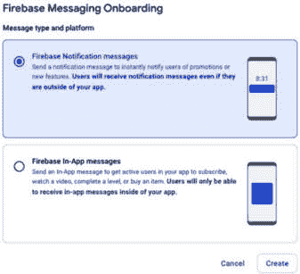

图 15.16 – Firebase Cloud Messaging 选项

我们可以发送**Firebase 通知消息**或**Firebase 应用内消息**。Firebase 通知旨在触及应用外的用户，通过推送通知传递消息，即使我们的应用处于非活动状态。相比之下，Firebase 应用内消息旨在通过在应用界面中直接显示内容来吸引积极使用我们的应用的用户。Firebase 通知适用于发送及时更新或促销，而应用内消息对于传递上下文内容并增强应用内的用户体验非常有效。我们对**Firebase 通知消息**感兴趣。选择**Firebase 通知消息**选项并点击**创建**。这会带我们到以下屏幕：

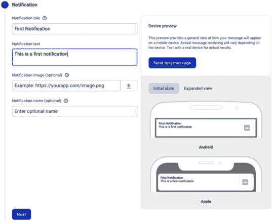

图 15.17 – 创建新的通知

在这个屏幕上，我们添加通知的标题和文本。一旦填写了这些详细信息，点击**下一步**继续到下一步：

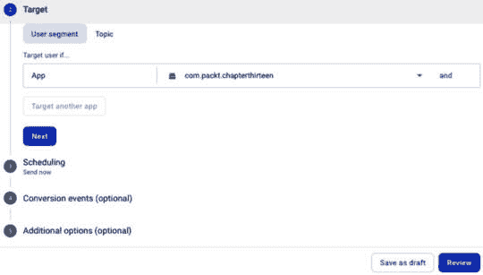

图 15.18 – 目标和调度设置

如*图 15.17*所示，我们设置了通知的目标应用。在这种情况下，它是我们在本章的*使用 Firebase Crashlytics 检测崩溃*部分中创建的应用。然后我们设置了通知的调度。我们将调度设置设置为**立即发送**。点击**查看**按钮，它将显示一个包含我们已设置信息的对话框：

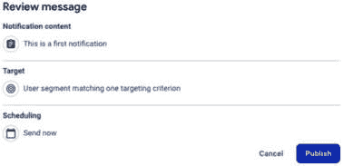

图 15.19 – 查看消息对话框

点击**发布**按钮来发布通知。这将向我们的应用发送通知。现在我们可以从我们的应用中看到通知：

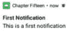

图 15.20 – 第一条通知

重要提示

确保您始终使用真实设备进行测试，以查看您的通知。

我们学习了如何在应用中设置 Firebase Cloud Messaging 以及如何向其发送通知。在下一节中，我们将介绍另一个关键主题——保护我们的应用。

# 保护您的应用

确保您的应用安全尤其重要。我们需要确保我们的用户数据安全。我们还需要确保我们的应用不受攻击。如恶意软件、中间人攻击和数据拦截等攻击对敏感信息构成风险，而如 SQL 注入和权限提升等漏洞可能导致对数据库或应用功能的未授权访问和操纵。跨站脚本和代码注入为攻击者提供了在应用内执行恶意脚本或命令的途径，可能危及用户会话和数据。不安全的数据存储实践可能会泄露敏感信息，而拒绝服务攻击可能会中断应用服务。

在本节中，我们将了解一些关于如何保护我们应用的建议和技巧。以下是我们可以采取的一些措施来保护我们的应用：

+   **HTTPS**: 我们应该始终为所有网络请求使用**HTTPS**，这为我们的应用增加了额外的安全层。

+   **代码最小化和混淆**: 我们应该始终最小化和混淆我们的代码，以使攻击者更难逆向工程我们的应用。我们已经在*第十三章*中为我们的发布构建做了这件事。

+   **加密**: 我们应该始终加密我们在应用中存储的敏感数据。

+   **密码和私钥**: 永远不要在 Shared Preferences 中存储密码和私钥。我们可以始终将它们存储在其他安全的替代方案中，例如用于存储加密密钥的 Android Keystore 系统。

+   **最小化日志信息**: 我们应该始终最小化我们记录的信息。我们永远不应该记录敏感信息，如密码和私钥。

+   **内部存储**: 我们应该始终使用内部存储来存储敏感数据。这是因为内部存储仅对我们应用的私有，其他应用无法访问它。

+   **WebView**: 我们使用 WebView 在我们的应用中显示网页内容。这可能会在我们的应用中引入安全问题，因此在使用 WebView 时我们应该小心。

+   **依赖项**: 我们应该始终保持所有依赖项的最新状态。这是因为依赖项的新版本可能包含我们需要应用到我们应用中的安全修复。我们使用如 Dependabot ([`github.com/dependabot`](https://github.com/dependabot))之类的工具来自动化依赖项更新。

+   **模拟器或 rooted 设备**: 对于支付或银行应用，确保它们不能在模拟器或 rooted 设备上运行。在模拟器和 rooted 设备上，很容易更改您的代码或查看发送到服务器或存储在我们应用中的数据。这可能导致安全问题。

+   **权限**: 我们应该始终在我们的应用中使用必要的权限。我们不应该使用我们不需要的权限。这是因为权限可以用来访问我们应用中的敏感数据。

在您开发应用时，始终牢记安全。这将帮助您确保您的应用是安全的，并且您的用户数据是安全的。您可以从官方 Android 文档中了解更多关于 Android 安全的信息，网址为[`developer.android.com/privacy-and-security/security-tips`](https://developer.android.com/privacy-and-security/security-tips)。

# 摘要

在本章中，我们学习了通过添加分析（在这种情况下，是 Firebase Crashlytics）来改进我们应用的技巧，以及如何使用云消息来增加我们应用的用户参与度。此外，我们还学习了关于保护我们应用的一些技巧和技巧。

我们已经到达了这一章节和本书的结尾。我们希望您在跟随章节的过程中感到愉快，并且现在您已经具备了利用本书所学知识开发 Android 应用的能力。下一步是什么？以下是一些您可以做的事情：

+   使用本章中提到的技巧和窍门来确保您应用的安全性。

+   检查、改进和监控您应用的表现。您可以从官方文档 [`developer.android.com/topic/performance/overview`](https://developer.android.com/topic/performance/overview) 中了解更多相关信息。

+   了解更多关于 **现代 Android 开发**（**MAD**）。MAD 是一套工具和库，帮助我们更快、更好地开发 Android 应用。您可以从官方文档 [`developer.android.com/modern-android-development`](https://developer.android.com/modern-android-development) 中了解更多关于 M.A.D 的信息。

+   了解更多关于 Google Play Vitals 以及如何使用 [`play.google.com/console/about/vitals/`](https://play.google.com/console/about/vitals/) 上的信息来提升您应用的质量。

+   继续学习 Kotlin 和 Android。构建更多应用并与世界分享。您还可以为开源项目做出贡献。
