# 第七章：在您的应用内导航

我们制作的应用需要从一个屏幕移动到另一个屏幕，在这些屏幕上显示不同的内容。到目前为止，我们一直只制作单屏幕的应用。在本章中，我们将学习如何从一个屏幕移动到另一个屏幕。我们将学习如何使用**Jetpack Compose Navigation**库在应用内导航到不同的 Jetpack Compose 屏幕。我们将学习使用此库的技巧和最佳实践。此外，我们还将介绍如何在大型屏幕和可折叠设备上处理导航。最后，我们将通过处理大型屏幕和可折叠设备上的导航来扩展我们在*第四章*中学到的内容。

在本章中，我们将涵盖以下主要主题：

+   Jetpack Navigation 概述

+   导航到 Compose 目标

+   向目标传递参数

+   在可折叠设备和大型屏幕上的导航

# 技术要求

要遵循本章的说明，您需要下载 Android Studio Hedgehog 或更高版本([`developer.android.com/studio`](https://developer.android.com/studio))。

您可以使用上一章的代码来遵循本章的说明。您可以在[`github.com/PacktPublishing/Mastering-Kotlin-for-Android/tree/main/chapterseven`](https://github.com/PacktPublishing/Mastering-Kotlin-for-Android/tree/main/chapterseven)找到本章的代码。

# Jetpack Navigation 概述

Jetpack Navigation 库提供了一个 API，可以轻松处理**复杂导航**，同时遵循 Android Jetpack 的原则。该库适用于旧视图系统，该系统使用 XML([`developer.android.com/guide/navigation`](https://developer.android.com/guide/navigation))，以及 Jetpack Compose([`developer.android.com/jetpack/compose/navigation`](https://developer.android.com/jetpack/compose/navigation))。在本章中，我们将学习后者。

在本章中，我们将在之前章节中使用过的宠物应用的基础上，导航到一个带有返回上一屏幕按钮的详情屏幕。我们还将向详情屏幕传递数据。

首先，我们需要将 Jetpack Navigation Compose 依赖项添加到我们的项目中。让我们在`libs.versions.toml`文件的`versions`部分添加以下库：

```java
compose-navigation = "androidx.navigation:navigation-compose:2.7.2"
```

接下来，我们需要将依赖项添加到我们的应用模块的`build.gradle.kts`文件中：

```java
implementation(libs.compose.navigation)
```

执行 Gradle 同步操作以将库添加到我们的项目中。下一步是创建`NavController`和`NavHost`。`NavController`是一个管理`NavHost`内应用导航的类。`NavHost`是一个容器，它托管可组合项并处理它们之间的导航。让我们创建一个新的包名为`navigation`，并创建一个新的密封类名为`Screens.kt`。在文件内部，让我们添加以下代码：

```java
sealed class Screens(val route: String) {
    object PetsScreen : Screens("pets")
    object PetDetailsScreen : Screens("petDetails")
}
```

这是一个有两个对象的密封类。密封类用于表示受限的类层次结构，其中对象或值只能具有密封类中定义的类型之一。第一个对象是 `PetsScreen`，它将是我们在启动应用时看到的第一个屏幕。第二个对象是 `PetDetailsScreen`，它将是我们在点击 `PetsScreen` 中的宠物项时导航到的屏幕。每次我们需要添加一个新的目的地屏幕时，我们都会在密封类中添加一个新的对象。

接下来，让我们在 `navigation` 包内创建一个名为 `AppNavigation.kt` 的新文件。在文件内部，让我们添加以下代码：

```java
@Composable
fun AppNavigation() {
    val navController = rememberNavController()
    NavHost(
        navController = navController,
        startDestination =  Screens.PetsScreen.route
    ){
        composable(Screens.PetsScreen.route){
            PetsScreen()
        }
    }
}
```

让我们解释前面的代码：

+   我们使用 `rememberNavController()` 函数创建 `NavController`。此函数用于创建将在重组之间被记住的 `NavController`。这很重要，因为我们需要能够在应用中导航到不同的屏幕。

+   我们创建了一个接受 `navController` 和 `startDestination` 的 `NavHost` 组合。`startDestination` 是我们启动应用时想要看到的第一个屏幕。在我们的例子中，它是 `PetsScreen`。

+   我们添加了 `PetsScreen` 组合。这个组合有错误，因为我们还没有创建它。我们将很快做到这一点。

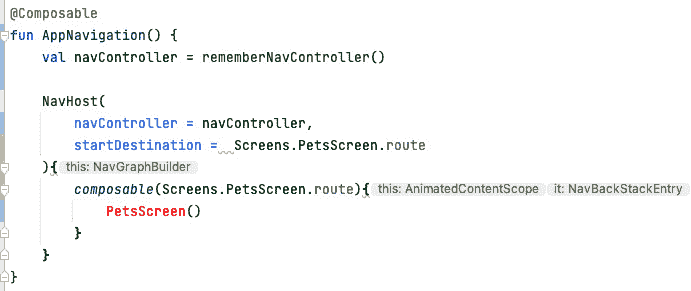

图 7.1 – PetsScreen 错误

如前一个截图所示，`PetsScreen` 组合以红色突出显示，因为我们还没有创建这个组合。我们将对我们的代码进行一些重构。让我们创建一个名为 `PetsScreen.kt` 的新文件。在文件内部，让我们添加以下代码：

```java
@OptIn(ExperimentalMaterial3Api::class)
@Composable
fun PetsScreen(onPetClicked: (Cat) -> Unit) {
    Scaffold(
        topBar = {
            TopAppBar(
                title = {
                    Text(text = "Pets")
                },
                colors =  TopAppBarDefaults.smallTopAppBarColors(
                    containerColor = MaterialTheme.colorScheme.primary,
                )
            )
        },
        content =  { paddingValues ->
            PetList(
                modifier = Modifier
                    .fillMaxSize()
                    .padding(paddingValues),
                onPetClicked = onPetClicked
            )
        }
    )
}
```

`PetsScreen` 组合显示宠物列表。我们已添加一个 `Scaffold` 组合作为根元素。在 `Scaffold` 组合内部，我们添加了一个 `TopAppBar` 组合。我们还添加了一个 `PetList` 组合作为 `Scaffold` 组合的内容。我们还在 `PetList` 组合中添加了一个新的 `onPetClicked` 回调。我们将使用此回调在点击列表中的宠物项时导航到 `PetDetailsScreen`。

这样，我们的导航图就准备好了。我们现在可以将 `AppNavigation` 组合添加到我们的 `MainActivity.kt` 文件中。让我们用以下代码替换 `ChapterSevenTheme` 块内的所有代码：

```java
ChapterSevenTheme {
    AppNavigation()
}
```

构建并运行应用。应用仍然显示与之前相同的可爱宠物列表，但现在我们正在使用 Jetpack Navigation 库来处理我们的导航。

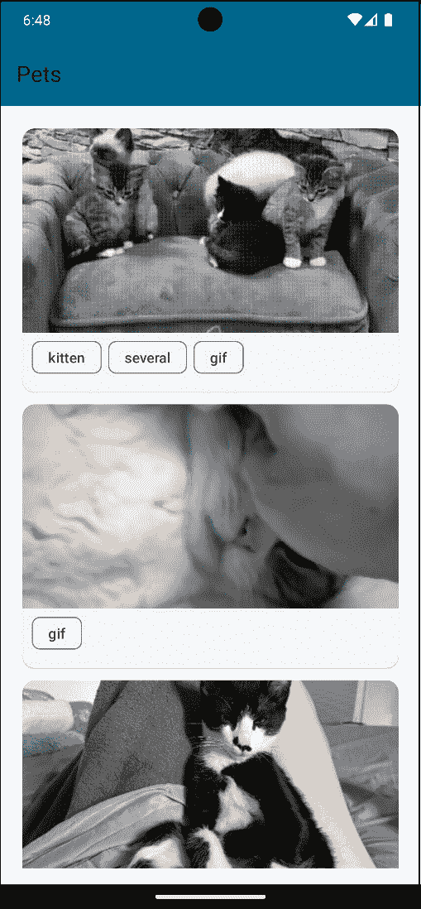

图 7.2 – 宠物

在下一节中，让我们学习如何在点击列表中的宠物项时导航到详情屏幕。

# 导航到 Compose 目的地

在本节中，我们将学习如何在点击列表中的宠物项时导航到详情屏幕。首先，我们需要为 `PetDetailsScreen` 创建一个新的组合。让我们创建一个名为 `PetDetailsScreen.kt` 的新文件，并创建 `PetDetailsScreenContent` 组合，如下所示：

```java
@OptIn(ExperimentalLayoutApi::class)
@Composable
fun PetDetailsScreenContent(modifier: Modifier) {
    Column(
        modifier = modifier
            .fillMaxSize()
            .padding(16.dp),
        verticalArrangement = Arrangement.Center,
        horizontalAlignment = Alignment.CenterHorizontally
    ) {
        AsyncImage(
            model = "https://cataas.com/cat/rV1MVEh0Af2Bm4O0",
            contentDescription = "Cute cat",
            modifier = Modifier
                .fillMaxWidth()
                .height(200.dp),
            contentScale = ContentScale.FillWidth
        )
        FlowRow(
            modifier = Modifier
                .padding(start = 6.dp, end = 6.dp)
        ) {
            repeat(2) {
                SuggestionChip(
                    modifier = Modifier
                        .padding(start = 3.dp, end = 3.dp),
                    onClick = { },
                    label = {
                        Text(text = "Tag $it")
                    }
                )
            }
        }
    }
}
```

在这里，我们创建了一个以 `Column` 作为根元素的组合组件。在 `Column` 元素内部，我们添加了一个显示猫图像的 `AsyncImage` 组合组件。我们还添加了一个 `FlowRow` 组合组件，当空间不足时，它会将项目流动到下一行，这是使用行无法实现的。`FlowRow` 显示了两个 `SuggestionChip` 组合组件。我们将使用此组合组件来显示宠物的详细信息。注意，我们现在正在使用硬编码的猫 ID 和标签。我们将在下一节中从 `PetList` 组合组件传递此数据。接下来，让我们按照以下方式创建 `PetDetailsScreen` 组合组件：

```java
@OptIn(ExperimentalMaterial3Api::class)
@Composable
fun PetDetailsScreen(onBackPressed: () -> Unit) {
    Scaffold(
        topBar = {
            TopAppBar(
                title = {
                    Text(text = "Pet Details")
                },
                colors =  TopAppBarDefaults.smallTopAppBarColors(
                    containerColor = MaterialTheme.colorScheme.primary,
                ),
                navigationIcon = {
                    IconButton(
                        onClick = onBackPressed,
                        content = {
                            Icon(
                                imageVector = Icons.Default.ArrowBack,
                                contentDescription = "Back"
                            )
                        }
                    )
                }
            )
        },
        content = { paddingValues ->
            PetDetailsScreenContent(
                modifier = Modifier
                    .padding(paddingValues)
            )
        }
    )
}
```

`PetDetailsScreen` 组合组件显示宠物的详细信息。我们添加了一个 `Scaffold` 组合组件作为根元素。在 `Scaffold` 组合组件内部，我们添加了一个 `TopAppBar` 组合组件。我们还使用了之前创建的 `PetDetailsScreenContent` 组合组件作为 `Scaffold` 组合组件的内容。我们向 `PetDetailsScreen` 组合组件添加了一个新的 `onBackPressed` 回调。我们将使用此回调在点击 `TopAppBar` 中的返回按钮时导航回上一个屏幕。

我们的下一步是在 `AppNavigation.kt` 文件中添加 `PetDetailsScreen` 的组合组件。让我们在 `PetsScreen` 组合组件下面的 `NavHost` 中添加以下代码：

```java
composable(Screens.PetDetailsScreen.route){
    PetDetailsScreen(
        onBackPressed = {
            navController.popBackStack()
        }
    )
}
```

在这里，我们为 `PetDetailsScreen` 添加了一个组合组件。我们传递了屏幕的路由和 `PetDetailsScreen` 组合组件作为内容。`PetDetailsScreen` 有 `onBackPressed` 参数。该参数处理用户点击顶部左边的返回箭头图标的情况，这通常是位于顶部的。我们在 `onBackPressed` 参数内部使用 `navController.popBackStack()`。此方法尝试从返回堆栈中弹出当前目标并导航到上一个目标。

现在我们需要在点击列表中的宠物项时实际导航到 `PetDetailsScreen`。让我们转到 `PetListItem` 组合组件。我们将向 `PetListItem` 组合组件添加一个新的 `onPetClicked` 回调。修改后的组合组件应该看起来像这样：

```java
@OptIn(ExperimentalLayoutApi::class)
@Composable
fun PetListItem(cat: Cat, onPetClicked: (Cat) -> Unit) {
    ElevatedCard(
        modifier = Modifier
            .fillMaxWidth()
            .padding(6.dp)
    ) {
        Column(
            modifier = Modifier
                .fillMaxWidth()
                .padding(bottom = 10.dp)
                .clickable {
                    onPetClicked(cat)
                }
        ) {
            AsyncImage(
                model = "https://cataas.com/cat/${cat.id}",
                contentDescription = "Cute cat",
                modifier = Modifier
                    .fillMaxWidth()
                    .height(200.dp),
                contentScale = ContentScale.FillWidth
            )
            FlowRow(
                modifier = Modifier
                    .padding(start = 6.dp, end = 6.dp)
            ) {
              repeat(cat.tags.size) {
                  SuggestionChip(
                      modifier = Modifier
                          .padding(start = 3.dp, end = 3.dp),
                      onClick = { },
                      label = {
                          Text(text = cat.tags[it])
                      }
                  )
              }
            }
        }
    }
}
```

在前面的代码中，我们向组合组件添加了一个新的 `onPetClicked` 回调。我们将 `clickable` 修饰符添加到 `Column` 上，并在修饰符内部调用 `onPetClicked` 回调。我们将 `cat` 对象传递给回调。接下来，我们需要按照以下方式将 `onPetClicked` 回调添加到 `PetList` 组合组件中：

```java
@Composable
fun PetList(modifier: Modifier, onPetClicked: (Cat) -> Unit) {
    // other code
}
```

接下来，我们需要将此回调传递到我们使用 `PetListItem` 组合组件的地方。在项目块内部调用位置的修改后的 `PetListItem` 组合组件应该看起来像这样：

```java
PetListItem(
    cat = pet,
    onPetClicked = onPetClicked
)
```

最后，我们需要修改 `AppNavigation` 组合组件，以便将 `onPetClicked` 回调传递给 `PetsScreen` 组合组件。修改后的 `AppNavigation` 组合组件应该看起来像这样：

```java
PetsScreen(
    onPetClicked = {
        navController.navigate(Screens.PetDetailsScreen.route)
    }
)
```

在这里，我们将 `onPetClicked` 回调传递给 `PetsScreen` 组合组件。在回调内部，我们在 `navController` 上调用 `navigate()` 函数并传入 `PetDetailsScreen` 的路由。当我们点击列表中的宠物项目时，这将导航到 `PetDetailsScreen`。

构建并运行应用程序。点击列表中的宠物项目。你会看到应用程序导航到 `PetDetailsScreen`。

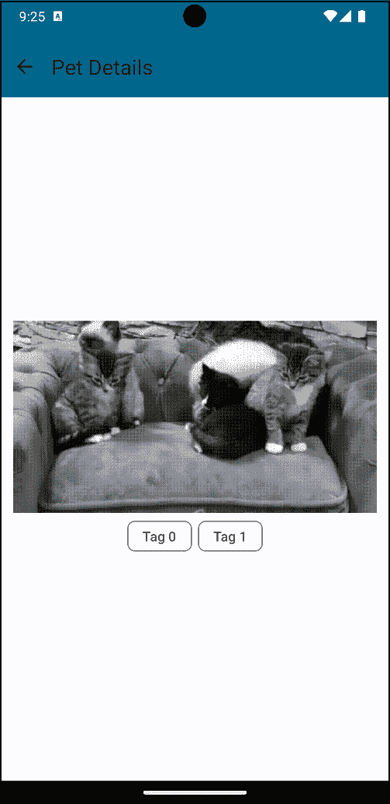

图 7.3 – 宠物详情屏幕

我们可以看到一张可爱的猫咪图片和一些标签。此外，如果我们按下 `TopAppBar` 中的返回按钮，我们将能够导航回 `PetsScreen`。

到目前为止，我们已经能够从 `PetsScreen` 导航到 `PetDetailsScreen`。然而，我们没有向 `PetDetailsScreen` 传递任何数据。在下一节中，我们将学习如何向 `PetDetailsScreen` 传递数据。

# 向目标传递参数

在我们的 `PetDetailsScreen` 中，我们需要移除硬编码的猫咪 ID 和标签，并从 `PetList` 组合组件中传递它们。按照以下步骤操作：

1.  让我们转到 `PetDetailsScreen.kt` 文件中的 `PetDetailsScreenContent` 组合组件，并按如下方式修改它：

    ```java
    @OptIn(ExperimentalLayoutApi::class)
    @Composable
    fun PetDetailsScreenContent(modifier: Modifier, cat: Cat) {
        Column(
            modifier = modifier
                .fillMaxSize()
                .padding(16.dp),
            verticalArrangement = Arrangement.Center,
            horizontalAlignment = Alignment.CenterHorizontally
        ) {
            AsyncImage(
                model = "https://cataas.com/cat/${cat.id}",
                contentDescription = "Cute cat",
                modifier = Modifier
                    .fillMaxWidth()
                    .height(200.dp),
                contentScale = ContentScale.FillWidth
            )
            FlowRow(
                modifier = Modifier
                    .padding(start = 6.dp, end = 6.dp)
            ) {
                repeat(cat.tags.size) {
                    SuggestionChip(
                        modifier = Modifier
                            .padding(start = 3.dp, end = 3.dp),
                        onClick = { },
                        label = {
                            Text(text = cat.tags[it])
                        }
                    )
                }
            }
        }
    }
    ```

    我们向组合组件添加了一个新的 `cat` 参数。我们使用了 `cat` 对象来显示猫咪图片和标签。

1.  接下来，让我们转到 `PetDetailsScreen` 组合组件，并按如下方式修改它：

    ```java
    @OptIn(ExperimentalMaterial3Api::class)
    @Composable
    fun PetDetailsScreen(onBackPressed: () -> Unit, cat: Cat) {
        Scaffold(
            topBar = {
                TopAppBar(
                    title = {
                        Text(text = "Pet Details")
                    },
                    colors =  TopAppBarDefaults.smallTopAppBarColors(
                        containerColor = MaterialTheme.colorScheme.primary,
                    ),
                    navigationIcon = {
                        IconButton(
                            onClick = onBackPressed,
                            content = {
                                Icon(
                                    imageVector = Icons.Default.ArrowBack,
                                    contentDescription = "Back"
                                )
                            }
                        )
                    }
                )
            },
            content = { paddingValues ->
                PetDetailsScreenContent(
                    modifier = Modifier
                        .padding(paddingValues),
                    cat = cat
                )
            }
        )
    }
    ```

    在这里，我们向组合组件添加了一个新的 `cat` 参数。我们将 `cat` 对象传递给了 `PetDetailsScreenContent` 组合组件。

1.  接下来，让我们转到 `AppNavigation` 组合组件，并添加将 `cat` 对象传递给 `PetDetailsScreen` 的逻辑。我们首先需要修改 `PetDetailsScreen` 的组合组件，如下所示：

    ```java
    composable(
        route = "${Screens.PetDetailsScreen.route}/{cat}",
        arguments = listOf(
            navArgument("cat") {
                type = NavType.StringType
            }
        )
    ){
        PetDetailsScreen(
            onBackPressed = {
                navController.popBackStack()
            },
            cat = Json.decodeFromString(it.arguments?.getString("cat") ?: "")
        )
    }
    ```

    让我们解释一下这些更改：

    +   在路由上，我们添加了一个新的参数，称为 `cat`。这是我们用来将 `cat` 对象传递到 `PetDetailsScreen` 的参数。

    +   我们添加了一个新的 `arguments` 参数。该参数用于将参数传递到目标屏幕。我们为 `cat` 参数添加了 `navArgument`。我们将类型设置为 `String`。这是因为我们将传递 `cat` 对象的字符串表示形式。

    +   我们将 `cat` 对象传递给 `PetDetailsScreen` 组合组件。我们使用了 Kotlinx Serialization 库中的 `Json.decodeFromString()`，这是我们之前在 *第六章* 中学习到的，将 `cat` 对象的字符串值转换为 `Cat` 对象。我们使用了 `NavBackStackEntry` 的 `arguments` 属性来获取 `cat` 对象的字符串值。如果 `arguments` 属性为空，我们使用了 Elvis 运算符来返回一个空字符串。

1.  最后，我们需要修改 `AppNavigation` 组合组件中 `PetsScreen` 的 `onPetClicked` 回调，如下所示：

    ```java
    composable(Screens.PetsScreen.route) {
        PetsScreen(
            onPetClicked = { cat ->
                navController.navigate(
                    "${Screens.PetDetailsScreen.route}/${Json.encodeToString(cat)}"
                )
            }
        )
    }
    ```

    我们已修改 `navigate()` 函数，将 `Cat` 对象作为字符串传递。我们还使用了 Kotlinx Serialization 库中的 `Json.encodeToString()`，将 `Cat` 对象转换为字符串。这将作为参数传递给 `PetDetailsScreen`，当我们点击列表中的宠物项时。

1.  构建并运行应用程序。点击列表中的任何可爱猫咪图片，现在详情屏幕将显示我们选择的可爱猫咪的图片和标签：

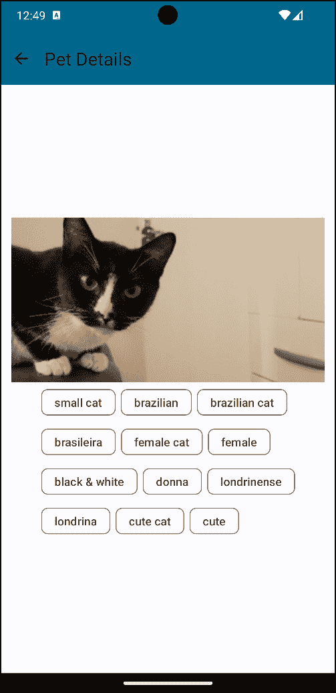

图 7.4 – 宠物详情

我们现在已经能够将数据传递给 `PetDetailsScreen`。我们学习了如何导航到组合目的地并将数据传递到详情屏幕。在下一节中，我们将学习如何在可折叠设备和大型屏幕上处理导航。

# 可折叠设备和大型屏幕的导航

在 *第四章* 的 *为大型屏幕和可折叠设备设计 UI* 部分，我们学习了 `WindowSize` 类以及我们如何在可折叠设备和大型屏幕上使我们的应用程序响应。在本节中，我们将使我们的宠物应用程序在可折叠设备和大型屏幕上响应。我们将进行一些更改，如下所示：

+   向 `PetsScreen` 添加一个底部栏，其中将包含几个选项。

+   添加 `NavigationRail` 和 `NavigationDrawer`，它们将根据屏幕大小使用。

+   观察设备的可折叠状态并根据可折叠状态更改应用程序的布局。

+   根据屏幕大小，我们还将更改内容类型。在大型屏幕上，我们将并列显示猫咪列表和所选猫咪的详细信息。在小屏幕上，我们将分别显示猫咪列表和所选猫咪的详细信息。

需要很多更改。好事是我已经做了这些更改，你可以在项目的 `chapterseven` 文件夹中找到最终版本。让我们逐一查看这些更改：

1.  我们将首先创建一个名为 `NavigationType` 的 `sealed interface`，它代表我们将要在应用程序中使用的不同类型的导航。让我们在 `navigation` 包内创建一个名为 `NavigationType.kt` 的新文件，并添加以下代码：

    ```java
    sealed interface NavigationType {
        object BottomNavigation : NavigationType
        object NavigationDrawer : NavigationType
        object NavigationRail : NavigationType
    }
    ```

    我们在这里使用密封接口而不是密封类。这是因为我们不需要在 `NavigationType` 中保留任何状态。我们也不需要将属性传递给任何 `NavigationTypes`。我们有三个选项：`BottomNavigation`、`NavigationDrawer` 和 `NavigationRail`。我们将使用这些选项根据屏幕大小更改导航类型。

1.  接下来，让我们创建另一个名为 `ContentType` 的密封接口。这个接口将用于根据屏幕大小更改内容显示类型。让我们在 `navigation` 包内创建一个名为 `ContentType.kt` 的新文件，并添加以下代码：

    ```java
    sealed interface ContentType {
        object List : ContentType
        object ListAndDetail : ContentType
    }
    ```

    这表示我们可以根据屏幕大小显示内容的两种模式。我们有 `List` 模式，仅显示猫的列表。我们还有 `ListAndDetail` 模式，它并列显示猫的列表和所选猫的详细信息。

1.  接下来，在我们的 `Screens.kt` 文件中，我们必须添加一个新的目标屏幕，称为 `FavoritesScreen`。该文件的最终代码应如下所示：

    ```java
    sealed class Screens(val route: String) {
        object PetsScreen : Screens("pets")
        object PetDetailsScreen : Screens("petDetails")
        object FavoritePetsScreen : Screens("favoritePets")
    }
    ```

    现在我们有三个目标用于我们的应用程序。

1.  接下来，让我们将 `WindowSize` 依赖项添加到 `libs.versions.toml` 文件的库部分：

    ```java
    compose-window-size = "androidx.compose.material3:material3-window-size-class:1.2.0-alpha07"
    androidx-window = "androidx.window:window:1.1.0"
    ```

1.  我们还需要将依赖项添加到我们的应用程序模块的 `build.gradle.kts` 文件中：

    ```java
    implementation(libs.compose.window.size)
    implementation(libs.androidx.window)
    ```

    执行 Gradle 同步以便将依赖项添加到我们的项目中。

1.  接下来，我们需要创建 `NavigationRail`、`NavigationDrawer` 和 `BottomNavigation` 的组合器。让我们在 `view` 包内创建一个名为 `PetsNavigationRail.kt` 的新文件，并添加以下代码：

    ```java
    @Composable
    fun PetsNavigationRail(
        onFavoriteClicked: () -> Unit,
        onHomeClicked: () -> Unit,
        onDrawerClicked: () -> Unit
    ) {
        val items = listOf(Screens.PetsScreen, Screens.FavoritePetsScreen)
        val selectedItem = remember { mutableStateOf(items[0]) }
        NavigationRail(
            modifier = Modifier
                .fillMaxHeight()
        ) {
            NavigationRailItem(
                selected = false,
                onClick = onDrawerClicked,
                icon = {
                    Icon(
                        imageVector = Icons.Default.Menu,
                        contentDescription = "Menu Icon"
                    )
                }
            )
            NavigationRailItem(
                selected = selectedItem.value == Screens.PetsScreen,
                onClick = {
                    onHomeClicked()
                    selectedItem.value = Screens.PetsScreen
                },
                icon = {
                    Icon(
                        imageVector = Icons.Default.Home,
                        contentDescription = "Home Icon"
                    )
                }
            )
            NavigationRailItem(
                selected = selectedItem.value == Screens.FavoritePetsScreen,
                onClick = {
                    onFavoriteClicked()
                    selectedItem.value = Screens.FavoritePetsScreen
                },
                icon = {
                    Icon(
                        imageVector = Icons.Default.Favorite,
                        contentDescription = "Favorite Icon"
                    )
                }
            )
        }
    }
    ```

    在前面的代码中，我们创建了 `PetsNavigationRail()` 组合器，它有三个参数：`onFavoriteClicked`、`onHomeClicked` 和 `onDrawerClicked`。前两个是回调，将用于导航到不同的屏幕。我们使用 `onDrawerClicked` 回调来在用户与之交互时关闭或打开抽屉。在顶部，我们有 `items` 变量，它包含所有我们的屏幕列表，以及 `selectedItem` 变量，它包含当前选中的屏幕。我们使用来自 Material 3 库的 `NavigationRail` 组合器来显示导航栏。要向 `NavigationRail` 添加项目，我们使用 `NavigationRailItem` 组合器。我们传入项目的选中状态、`onClick` 回调和要显示的图标。

1.  接下来，让我们创建 `PetsBottomNavigationBar` 组合器。让我们在 `view` 包内创建一个名为 `PetsBottomNavigationBar.kt` 的新文件，并添加以下代码：

    ```java
    @Composable
    fun PetsBottomNavigationBar(
        onFavoriteClicked: () -> Unit,
        onHomeClicked: () -> Unit
    ) {
        val items = listOf(Screens.PetsScreen, Screens.FavoritePetsScreen)
        val selectedItem = remember { mutableStateOf(items[0]) }
        NavigationBar(
            modifier = Modifier
                .fillMaxWidth(),
            containerColor = MaterialTheme.colorScheme.background
        ) {
            NavigationBarItem(
                selected = selectedItem.value == Screens.PetsScreen,
                onClick = {
                    onHomeClicked()
                    selectedItem.value = Screens.PetsScreen
                },
                icon = {
                    Icon(
                        imageVector = Icons.Default.Home,
                        contentDescription = "Home Icon"
                    )
                }
            )
            NavigationBarItem(
                selected = selectedItem.value == Screens.FavoritePetsScreen,
                onClick = {
                    onFavoriteClicked()
                    selectedItem.value = Screens.FavoritePetsScreen
                },
                icon = {
                    Icon(
                        imageVector = Icons.Default.Favorite,
                        contentDescription = "Favorite Icon"
                    )
                }
            )
        }
    }
    ```

    `PetsBottomNavigationBar` 组合器与 `PetsNavigationRail` 组合器类似。唯一的区别是我们使用 `NavigationBar` 组合器而不是 `NavigationRail` 组合器。我们有主页和收藏夹项目。我们使用 `NavigationBarItem` 组合器向 `NavigationBar` 添加项目。我们传入项目的选中状态、`onClick` 回调和要显示的图标。

1.  接下来，让我们创建 `PetsNavigationDrawer` 组合器。让我们在 `view` 包内创建一个名为 `PetsNavigationDrawer.kt` 的新文件，并添加以下代码：

    ```java
    @Composable
    fun PetsNavigationDrawer(
        onFavoriteClicked: () -> Unit,
        onHomeClicked: () -> Unit,
        onDrawerClicked: () -> Unit = {}
    ) {
        val items = listOf(Screens.PetsScreen, Screens.FavoritePetsScreen)
        val selectedItem = remember { mutableStateOf(items[0]) }
        Column(
            modifier = Modifier
                .wrapContentWidth()
                .fillMaxHeight()
                .background(MaterialTheme.colorScheme.inverseOnSurface)
                .padding(16.dp)
        ) {
            Row(
                modifier = Modifier
                    .fillMaxWidth()
                    .padding(16.dp),
                horizontalArrangement = Arrangement.SpaceBetween,
                verticalAlignment = Alignment.CenterVertically
            ) {
                Text(
                    text = "Chapter Seven",
                    style = MaterialTheme.typography.titleMedium,
                    color = MaterialTheme.colorScheme.primary
                )
                IconButton(
                    onClick = onDrawerClicked
                ) {
                    Icon(
                        imageVector = Icons.Default.Menu,
                        contentDescription = "Navigation Drawer Icon"
                    )
                }
            }
            NavigationDrawerItem(
                label = { Text(text = "Pets") },
                selected = selectedItem.value == Screens.PetsScreen,
                onClick = {
                    onHomeClicked()
                    selectedItem.value = Screens.PetsScreen
                },
                icon = {
                    Icon(
                        imageVector = Icons.Default.Home,
                        contentDescription = "Home Icon"
                    )
                }
            )
            NavigationDrawerItem(
                label = { Text(text = "Favorites") },
                selected = selectedItem.value == Screens.FavoritePetsScreen,
                onClick = {
                    onFavoriteClicked()
                    selectedItem.value = Screens.FavoritePetsScreen
                },
                icon = {
                    Icon(
                        imageVector = Icons.Default.Favorite,
                        contentDescription = "Favorite Icon"
                    )
                }
            )
        }
    }
    ```

    我们使用了来自 Material 3 库的 `NavigationDrawer` 组合器来显示导航抽屉。我们使用 `NavigationDrawerItem` 组合器向 `NavigationDrawer` 添加项目。我们传入标签、项目的选中状态、`onClick` 回调和要显示的图标。

1.  由于我们的 `PetsNavigationDrawer`、`PetsNavigationRail` 和 `PetsBottomNavigationBar` 组合器都包含 `FavoritesScreen`，让我们在视图包内创建一个名为 `FavoritePetsScreen.kt` 的新文件，并添加以下代码：

    ```java
    @Composable
    fun FavoritePetsScreen() {
        Column(
            modifier = Modifier
                .fillMaxSize(),
            verticalArrangement = Arrangement.Center,
            horizontalAlignment = Alignment.CenterHorizontally
        ) {
            Text(text = "Favorite Pets")
        }
    }
    ```

    这是一个简单的可组合组件，显示文本 `"Favorite Pets"`。我们将使用这个可组合组件作为 `FavoritesScreen` 的内容。我们还需要重构我们的 `AppNavigation()` 可组合组件，使其准备好处理不同的导航和内容类型。最终修改后的可组合组件应如下所示：

    ```java
    @Composable
    fun AppNavigation(
        contentType: ContentType,
        navHostController: NavHostController = rememberNavController()
    ) {
        NavHost(
            navController = navHostController,
            startDestination = Screens.PetsScreen.route
        ) {
            composable(Screens.PetsScreen.route) {
                PetsScreen(
                    onPetClicked = { cat ->
                        navHostController.navigate(
                            "${Screens.PetDetailsScreen.route}/${Json.encodeToString(cat)}"
                        )
                    },
                    contentType = contentType
                )
            }
            composable(
                route = "${Screens.PetDetailsScreen.route}/{cat}",
                arguments = listOf(
                    navArgument("cat") {
                        type = NavType.StringType
                    }
                )
            ) {
                PetDetailsScreen(
                    onBackPressed = {
                        navHostController.popBackStack()
                    },
                    cat = Json.decodeFromString(it.arguments?.getString("cat") ?: "")
                )
            }
            composable(Screens.FavoritePetsScreen.route) {
                FavoritePetsScreen()
            }
        }
    }
    ```

    让我们突出显示这些更改：

    +   我们的 `AppNavigation()` 可组合组件现在接受一个类型为 `ContentType` 的 `contentType` 参数。这是我们用来根据屏幕大小更改内容类型的参数。我们还传递了一个类型为 `NavHostController` 的 `navHostController` 参数。这是我们用来在应用中导航到不同屏幕的参数。之前，`navHostController` 是在 `AppNavigation()` 可组合组件内部创建的。我们已经将其移动到调用位置，这样我们就可以在不同的可组合组件中使用相同的 `navHostController`。

    +   我们使用了新的 `PetsScreen()` 可组合组件，它接受 `contentType` 参数。和之前一样，我们仍然传递 `onPetClicked`，它导航到 `PetDetailsScreen`。之前，我们使用的是 `PetList` 可组合组件。

    +   最后，我们将我们的新 `FavoritePetsScreen` 目的地添加到 `NavHost` 可组合组件中。

1.  让我们看看新的更新 `PetsScreen` 可组合组件的样子。让我们转到 `PetsScreen.kt` 文件并按如下方式修改可组合组件：

    ```java
    @Composable
    fun PetsScreen(
        onPetClicked: (Cat) -> Unit,
        contentType: ContentType,
    ) {
        val petsViewModel: PetsViewModel = koinViewModel()
        val petsUIState by petsViewModel.petsUIState.collectAsStateWithLifecycle()
        PetsScreenContent(
            modifier = Modifier
                .fillMaxSize(),
            onPetClicked = onPetClicked,
            contentType = contentType,
            petsUIState = petsUIState
        )
    }
    ```

    我们向可组合组件添加了一个新的 `contentType` 参数。我们还添加了一个新的 `petsUIState` 参数。这是 `PetsScreen` 的 UI 状态。我们将使用此状态来显示猫的列表。

1.  接下来，创建一个名为 `PetsScreenContent.kt` 的新文件，并添加以下代码：

    ```java
    @Composable
    fun PetsScreenContent(
        modifier: Modifier,
        onPetClicked: (Cat) -> Unit,
        contentType: ContentType,
        petsUIState: PetsUIState
    ) {
        Column(
            modifier = modifier
                .padding(16.dp),
            verticalArrangement = Arrangement.Center,
            horizontalAlignment = Alignment.CenterHorizontally
        ) {
            AnimatedVisibility(
                visible = petsUIState.isLoading
            ) {
                CircularProgressIndicator()
            }
            AnimatedVisibility(
                visible = petsUIState.pets.isNotEmpty()
            ) {
                if (contentType == ContentType.List) {
                    PetList(
                        onPetClicked = onPetClicked,
                        pets = petsUIState.pets,
                        modifier = Modifier
                            .fillMaxWidth()
                    )
                } else {
                    PetListAndDetails(
                        pets = petsUIState.pets
                    )
                }
            }
            AnimatedVisibility(
                visible = petsUIState.error != null
            ) {
                Text(text = petsUIState.error ?: "")
            }
        }
    }
    ```

    让我们解释前面的代码：

    +   `PetsScreenContent` 有一个父 `Column` 可组合组件。在 `Column` 可组合组件内部，我们添加了三个 `AnimatedVisibility` 可组合组件。第一个用于在 `petsUIState` 正在加载时显示 `CircularProgressIndicator`。第二个用于在 `petsUIState` 中的 `pets` 变量不为空时显示猫的列表。第三个用于在 `petsUIState` 有错误时显示错误消息。

    +   当显示猫的列表时，我们检查 `contentType`。如果 `contentType` 是 `List`，我们显示 `PetList` 可组合组件。如果 `contentType` 是 `ListAndDetail`，我们显示 `PetListAndDetails` 可组合组件。我们将很快创建 `PetListAndDetails` 可组合组件。注意，`PetList` 可组合组件也被修改为接受 `pets` 参数。我们将使用此参数来显示猫的列表。我们将在稍后看到这些更改。

    +   最后，如果 `petsUIState` 有错误，我们显示错误消息。

    我们更新的 `PetList` 可组合组件应如下所示：

    ```java
    @Composable
    fun PetList(
        onPetClicked: (Cat) -> Unit,
        pets: List<Cat>,
        modifier: Modifier
    ) {
        LazyColumn(
            modifier = modifier
        ) {
            items(pets) { pet ->
                PetListItem(
                    cat = pet,
                    onPetClicked = onPetClicked
                )
            }
        }
    }
    ```

    这里没有重大更改：我们只是添加了 `pets` 参数。我们使用此参数来在 `LazyColumn` 中显示猫的列表。随着这次更新，现在是时候创建 `PetListAndDetails` 可组合组件了。

1.  让我们在视图包内创建一个名为 `PetListAndDetails.kt` 的新文件，并添加以下代码：

    ```java
    @Composable
    fun PetListAndDetails(pets: List<Cat>) {
        var currentPet by remember {
            mutableStateOf(pets.first())
        }
        Row(
            modifier = Modifier
                .fillMaxWidth(),
            horizontalArrangement = Arrangement.SpaceEvenly
        ) {
            PetList(
                onPetClicked = {
                    currentPet = it
                },
                pets = pets,
                modifier = Modifier
                    .fillMaxWidth()
                    .weight(1f)
            )
            PetDetailsScreenContent(
                modifier = Modifier
                    .fillMaxWidth()
                    .padding(16.dp)
                    .weight(1f),
                cat = currentPet
            )
        }
    }
    ```

    这个可组合组件包含一个`Row`，其中有两个项目，每个项目的权重为`1f`。我们使用了之前创建的更新版的`PetListComposable`和`PetDetailsScreenContent`。我们还添加了一个`currentPet`变量，它保存当前选中的猫。我们使用这个变量来显示选中猫的详细信息。我们还使用这个变量在点击列表中的宠物项目时更新`currentPet`。请确保您还更新了`PetDetailsScreenContent`以接受新的修饰符参数。

    经过我们所做的修改，现在让我们创建一个新的可组合组件，称为`AppNavigationContent`，它根据`NavigationType`显示`NavigationRail`或`BottomNavigation`的逻辑。

1.  让我们在`navigation`包内创建一个名为`AppNavigationContent.kt`的新文件，并添加以下代码：

    ```java
    @Composable
    fun AppNavigationContent(
        contentType: ContentType,
        navigationType: NavigationType,
        onFavoriteClicked: () -> Unit,
        onHomeClicked: () -> Unit,
        navHostController: NavHostController,
        onDrawerClicked: () -> Unit = {}
    ) {
        Row(
            modifier = Modifier
                .fillMaxSize(),
        ) {
            AnimatedVisibility(
                visible = navigationType == NavigationType.NavigationRail
            ) {
                PetsNavigationRail(
                    onFavoriteClicked = onFavoriteClicked,
                    onHomeClicked = onHomeClicked,
                    onDrawerClicked = onDrawerClicked
                )
            }
            Scaffold(
                content = { paddingValues ->
                    Column(
                        modifier = Modifier
                            .fillMaxSize()
                            .padding(paddingValues)
                    ) {
                        AppNavigation(
                            contentType = contentType,
                            navHostController = navHostController
                        )
                    }
                },
                bottomBar = {
                    AnimatedVisibility(
                        visible = navigationType == NavigationType.BottomNavigation
                    ) {
                        PetsBottomNavigationBar(
                            onFavoriteClicked = onFavoriteClicked,
                            onHomeClicked = onHomeClicked
                        )
                    }
                }
            )
        }
    }
    ```

    让我们解释前面的代码：

    +   `AppNavigationContent`可组合组件接受多个参数。`contentType`参数用于显示内容类型。`navigationType`参数用于切换导航选项。`onFavoriteClicked`和`onHomeClicked`是回调函数，将用于导航到不同的屏幕。`navHostController`是一个对象，用于管理`NavHost`内的导航。`onDrawerClicked`用于在用户与之交互时关闭或打开抽屉。

    +   我们有`Row`作为根元素。在`Row`内部，我们有一个`AnimatedVisibility`可组合组件，当`navigationType`为`NavigationType.NavigationRail`时显示`PetsNavigationRail`可组合组件。我们还添加了一个`Scaffold`可组合组件。我们使用`AppNavigation`可组合组件作为`Scaffold`的内容，传递`contentType`和`navHostController`。我们还使用`PetsBottomNavigationBar`可组合组件作为`Scaffold`的底部栏。我们使用`AnimatedVisibility`可组合组件在`navigationType`为`NavigationType.BottomNavigation`时显示`PetsBottomNavigationBar`可组合组件。

1.  最后一步是将`MainActivity.kt`文件重构以使用新的`AppNavigationContent`可组合组件。我们将逐步说明更改。有几个更改：

    1.  首先，我们需要观察设备的可折叠状态。这将使我们能够更改内容类型和导航类型。让我们在`navigation`包内创建一个名为`DeviceFoldPosture.kt`的新文件，并添加以下代码：

    ```java
    sealed interface DeviceFoldPosture {
        data class BookPosture(val hingePosition: Rect) : DeviceFoldPosture
        data class SeparatingPosture(
            val hingePosition: Rect,
            val orientation: FoldingFeature.Orientation
        ) : DeviceFoldPosture
        object NormalPosture : DeviceFoldPosture
    }
    @OptIn(ExperimentalContracts::class)
    fun isBookPosture(foldFeature: FoldingFeature?): Boolean {
        contract { returns(true) implies (foldFeature != null) }
        return foldFeature?.state == FoldingFeature.State.HALF_OPENED &&
                foldFeature.orientation == FoldingFeature.Orientation.VERTICAL
    }
    @OptIn(ExperimentalContracts::class)
    fun isSeparating(foldFeature: FoldingFeature?): Boolean {
        contract { returns(true) implies (foldFeature != null) }
        return foldFeature?.state == FoldingFeature.State.FLAT && foldFeature.isSeparating
    }
    ```

    在前面的代码中，我们有一个密封接口，表示可折叠设备可以处于的不同姿态。我们有`BookPosture`，表示设备处于纵向方向且折叠状态为半开时的姿态。我们有`SeparatingPosture`，表示折叠或铰链设备创建两个逻辑显示区域时的姿态。我们还有`NormalPosture`，表示设备未折叠时的姿态。我们有两个实用函数`isBookPosture()`和`isSeparating()`，用于检查设备的姿态。我们将使用这些函数来检查设备的姿态并根据姿态改变应用程序的布局。

    1.  让我们转到`MainActivity.kt`文件，并在`setContent`块之前添加以下代码：

    ```java
    val deviceFoldingPostureFlow = WindowInfoTracker.getOrCreate(this).windowLayoutInfo(this)
        .flowWithLifecycle(this.lifecycle)
        .map { layoutInfo ->
            val foldingFeature =
                layoutInfo.displayFeatures
                    .filterIsInstance<FoldingFeature>()
                    .firstOrNull()
            when {
                isBookPosture(foldingFeature) ->
                    DeviceFoldPosture.BookPosture(foldingFeature.bounds)
                isSeparating(foldingFeature) ->
                    DeviceFoldPosture.SeparatingPosture(
                        foldingFeature.bounds,
                        foldingFeature.orientation
                    )
                else -> DeviceFoldPosture.NormalPosture
            }
        }
        .stateIn(
            scope = lifecycleScope,
            started = SharingStarted.Eagerly,
            initialValue = DeviceFoldPosture.NormalPosture
        )
    ```

    在这里，我们使用`WindowInfoTracker`来获取窗口布局信息。我们使用`flowWithLifecycle()`来确保只有在活动处于正确的生命周期状态时才获取布局信息。然后我们使用`map`操作符将布局信息映射到不同的姿态。我们使用`stateIn()`操作符，它将一个冷的`Flow`转换为在给定的协程作用域中启动的热`StateFlow`，共享设备姿态的最新发出值。我们使用`SharingStarted.Eagerly`来确保当活动处于启动状态时，我们获取姿态的最新值。我们使用`initialValue`参数将姿态的初始值设置为`DeviceFoldPosture.NormalPosture`。我们将使用这个流来观察设备的姿态并根据姿态改变应用程序的布局。

    1.  接下来，在我们的`setcontent`块内部，我们需要在主题块之前添加变量：

    ```java
    val devicePosture = deviceFoldingPostureFlow.collectAsStateWithLifecycle().value
    val windowSizeClass = calculateWindowSizeClass(activity = this)
    val scope = rememberCoroutineScope()
    val drawerState = rememberDrawerState(initialValue = DrawerValue.Closed)
    val navController = rememberNavController()
    ```

    我们添加了`devicePosture`变量，它持有设备的姿态。我们还添加了`windowSizeClass`变量，它持有设备的窗口大小类；`scope`变量，它持有`CoroutineScope`；`drawerState`变量，它持有抽屉的状态；以及`navController`变量，它持有`NavHostController`。我们将使用这个变量来导航到我们应用程序中的不同屏幕。

    1.  在我们的`ChapterSevenTheme`内部，我们需要添加以下代码：

    ```java
    val navigationType: NavigationType
    val contentType: ContentType
    when (windowSizeClass.widthSizeClass) {
        WindowWidthSizeClass.Compact -> {
            navigationType = NavigationType.BottomNavigation
            contentType = ContentType.List
        }
        WindowWidthSizeClass.Medium -> {
            navigationType = NavigationType.NavigationRail
            contentType = if (devicePosture is DeviceFoldPosture.BookPosture
                || devicePosture is DeviceFoldPosture.SeparatingPosture
            ) {
                ContentType.ListAndDetail
            } else {
                ContentType.List
            }
        }
        WindowWidthSizeClass.Expanded -> {
            navigationType = if (devicePosture is DeviceFoldPosture.BookPosture) {
                NavigationType.NavigationRail
            } else {
                NavigationType.NavigationDrawer
            }
            contentType = ContentType.ListAndDetail
        }
        else -> {
            navigationType = NavigationType.BottomNavigation
            contentType = ContentType.List
        }
    }
    ```

    在这里，我们有两个变量：`navigationType`和`contentType`。我们使用`windowSizeClass`来获取我们设备的宽度，并根据宽度大小为我们的`navigationType`和`contentType`变量分配值：

    +   如果宽度大小是`紧凑`，我们使用`BottomNavigation`作为`navigationType`，使用`List`作为`contentType`。

    +   如果宽度大小是`中等`，我们使用`NavigationRail`作为`navigationType`。对于`contentType`，我们检查`devicePosture`。如果`devicePosture`是`DeviceFoldPosture.BookPosture`或`DeviceFoldPosture.SeparatingPosture`，我们使用`ListAndDetail`作为`contentType`。如果`devicePosture`不是`DeviceFoldPosture.BookPosture`或`DeviceFoldPosture.SeparatingPosture`，我们使用`List`作为`contentType`。

    +   如果宽度大小是`Expanded`，我们检查`devicePosture`。如果`devicePosture`是`DeviceFoldPosture.BookPosture`，我们使用`NavigationRail`作为`navigationType`。如果`devicePosture`不是`DeviceFoldPosture.BookPosture`，我们使用`NavigationDrawer`作为`navigationType`。我们使用`ListAndDetail`作为`contentType`。

    +   最后，如果宽度大小是其他任何值，我们使用`BottomNavigation`作为`navigationType`和`List`作为`contentType`。

    1.  在前面的代码下方，添加此`if`语句：

    ```java
    if (navigationType == NavigationType.NavigationDrawer) {
        PermanentNavigationDrawer(
            drawerContent = {
                PermanentDrawerSheet {
                    PetsNavigationDrawer(
                        onFavoriteClicked = {
                            navController.navigate(Screens.FavoritePetsScreen.route)
                        },
                        onHomeClicked = {
                            navController.navigate(Screens.PetsScreen.route)
                        }
                    )
                }
            }
        ) {
            AppNavigationContent(
                navigationType = navigationType,
                contentType = contentType,
                onFavoriteClicked = {
                    navController.navigate(Screens.FavoritePetsScreen.route)
                },
                onHomeClicked = {
                    navController.navigate(Screens.PetsScreen.route)
                },
                navHostController = navController
            )
        }
    }
    ```

    条件检查`navigationType`是否为`NavigationType.NavigationDrawer`。如果是，我们使用 Material 3 库中的`PermanentNavigationDrawer`可组合组件。我们使用我们为`drawerContent`创建的`PetsNavigationDrawer`可组合组件。我们将`AppNavigationContent`可组合组件用作`PermanentNavigationDrawer`的内容。我们传递`navigationType`、`contentType`、`onFavoriteClicked`、`onHomeClicked`和`navHostController`参数。

    1.  接下来，让我们为我们的`if`语句添加`else`条件：

    ```java
    else {
      ModalNavigationDrawer(
          drawerContent = {
              ModalDrawerSheet {
                  PetsNavigationDrawer(
                      onFavoriteClicked = {
                          navController.navigate(Screens.FavoritePetsScreen.route)
                      },
                      onHomeClicked = {
                          navController.navigate(Screens.PetsScreen.route)
                      },
                      onDrawerClicked = {
                          scope.launch {
                              drawerState.close()
                          }
                      }
                  )
              }
          },
          drawerState = drawerState
      ) {
          AppNavigationContent(
              navigationType = navigationType,
              contentType = contentType,
              onFavoriteClicked = {
                  navController.navigate(Screens.FavoritePetsScreen.route)
              },
              onHomeClicked = {
                  navController.navigate(Screens.PetsScreen.route)
              },
              navHostController = navController,
              onDrawerClicked = {
                  scope.launch {
                      drawerState.open()
                  }
              }
          )
      }
    }
    ```

    在这里，当`navigationType`不是`NavigationType.NavigationDrawer`时，我们使用 Material 3 库中的`ModalNavigationDrawer`可组合组件。我们使用`PetsNavigationDrawer`可组合组件作为`drawerContent`。我们将`AppNavigationContent`可组合组件用作`ModalNavigationDrawer`的内容。我们传递`navigationType`、`contentType`、`onFavoriteClicked`、`onHomeClicked`、`navHostController`和`drawerState`参数。我们还传递`onDrawerClicked`回调，以便在用户与之交互时打开或关闭抽屉。

这些变化有很多；添加它们的工作做得很好！我们现在需要运行这些变化并看到它们付诸实践。幸运的是，我们有一个**可调整大小的模拟器**来帮助测试这些变化。我们将在下一小节创建一个并测试该应用。

## 创建和使用可调整大小的模拟器

要创建和使用可调整大小的模拟器，请按照以下步骤操作：

1.  从 Android Studio 的右侧侧边栏打开**设备管理器**窗口。如果您在那里找不到它，请使用顶部的**视图**菜单选项并选择**工具窗口**；然后，您将看到**设备** **管理器**选项。

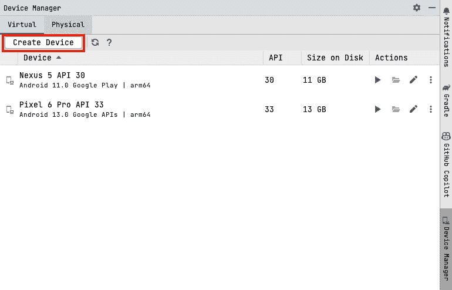

图 7.5 – 设备管理器

1.  选择**虚拟设备**选项卡，然后点击**创建设备**，这将带您进入此弹出窗口：

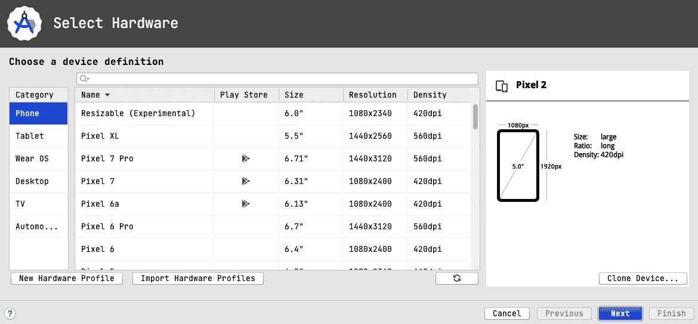

图 7.6 – 新设备配置

窗口允许您自定义您想要创建的设备的属性。您可以更改设备类别，并且还可以选择您想要创建的设备。

1.  让我们在**电话**类别下选择**可调整大小（实验性）**选项。这将使我们能够创建一个可调整大小的设备。点击**下一步**，您将看到以下窗口：

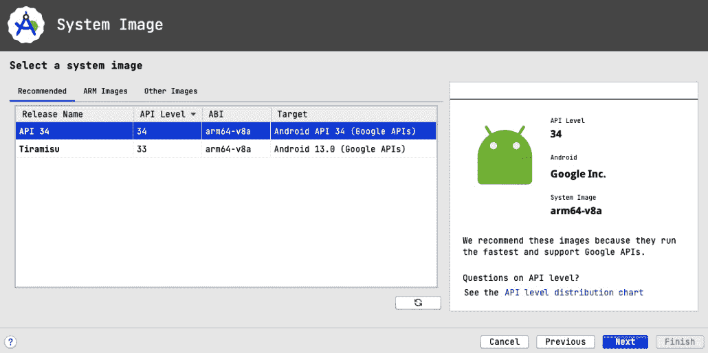

图 7.7 – 系统镜像

1.  在这里，你选择你想要使用的系统镜像。让我们选择 **API 34** 系统镜像。点击 **下一步**，你将看到以下窗口：

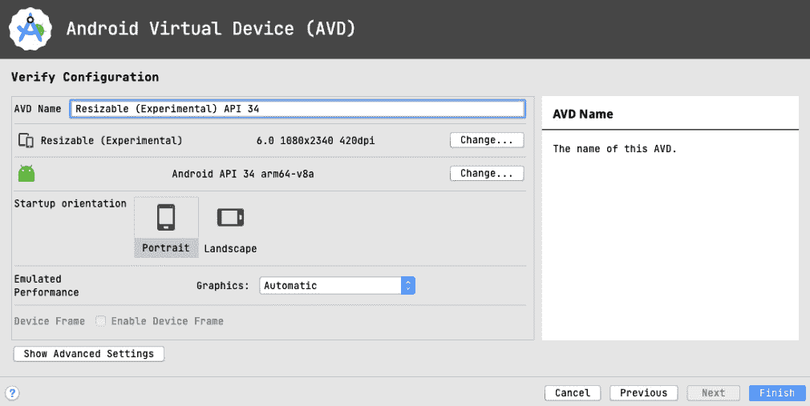

图 7.8 – 设备信息

这是最后一步，你需要确认设备名称和设备方向。我们将保持生成的名称并使用纵向作为默认方向。

1.  点击 **完成**，你将看到设备已添加到你的设备列表中：

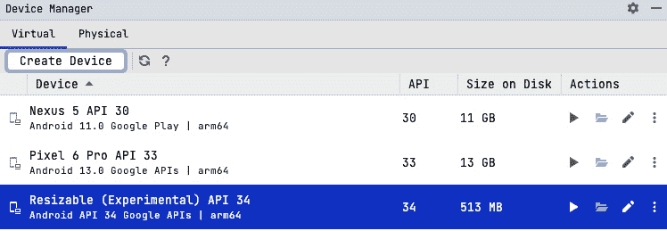

图 7.9 – 设备列表

1.  启动模拟器并运行应用。

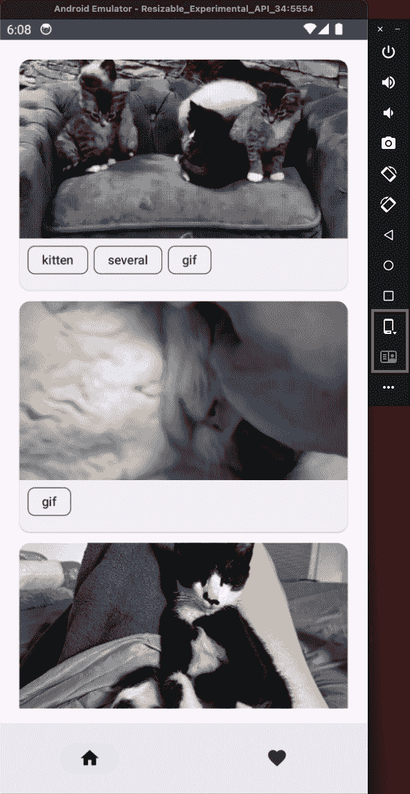

图 7.10 – 可调整大小的模拟器

从模拟器中，我们可以看到有两个选项被突出显示。第一个选项允许我们将设备从小型/普通设备更改为折叠或平板电脑设备。第二个选项允许我们在更改为折叠设备时更改选项。让我们将设备更改为折叠设备。现在应用将导航选项更改为导航轨道，并且屏幕上也有打开的第一个猫的列表和详细信息。

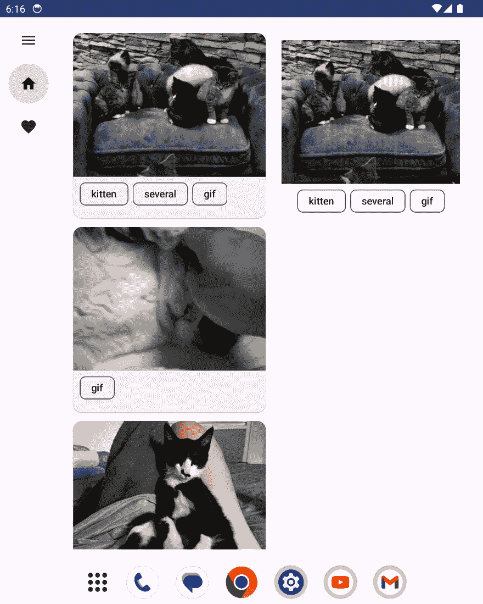

图 7.11 – 折叠设备导航轨道

点击 **折叠** 选项，我们可以看到以下选项：


图 7.12 – 折叠选项

在折叠部分选择第二个选项将带我们到以下屏幕：

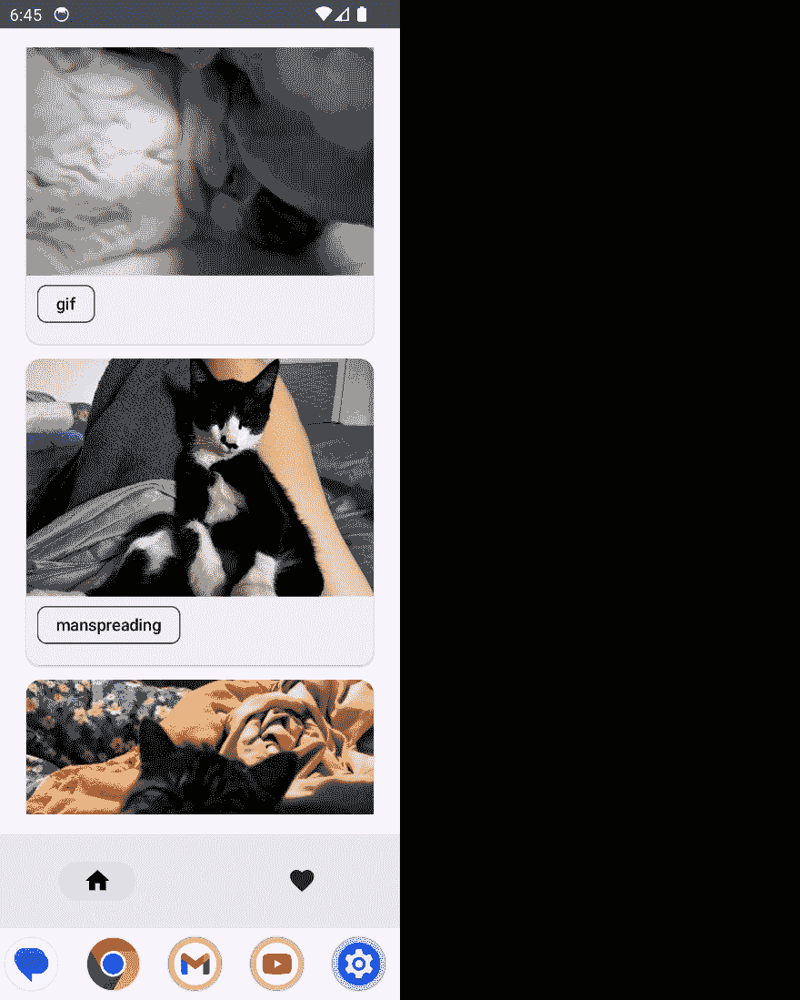

图 7.13 – 折叠设备

从设备尺寸选项，我们也可以切换到平板电脑视图：

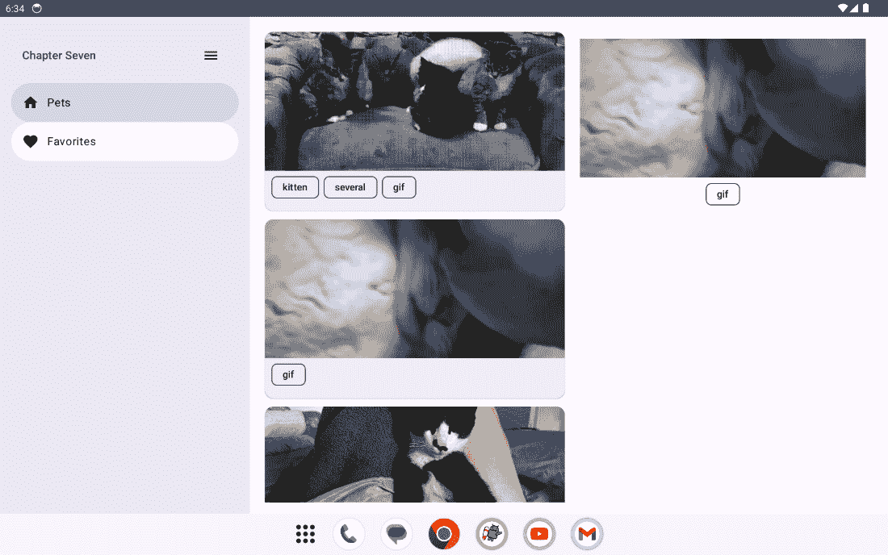

图 7.14 – 平板电脑视图

你现在可以看到应用已经有一个永久的导航抽屉，屏幕上也有打开的第一个猫的列表和详细信息。点击不同的猫，你将看到猫的详细信息显示在屏幕的右侧。我们还可以导航到 **收藏** 屏幕并返回到 **宠物** 屏幕。

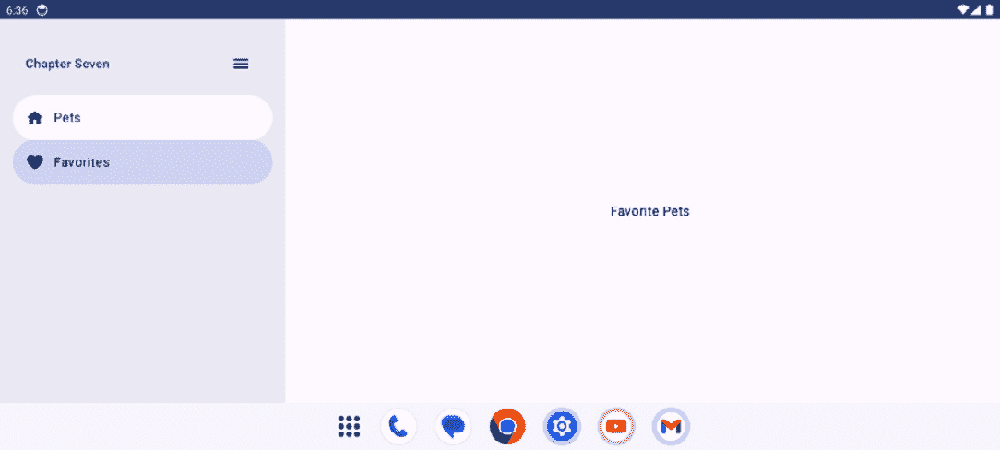

图 7.15 – 收藏宠物屏幕

我们还可以看到模态导航抽屉：

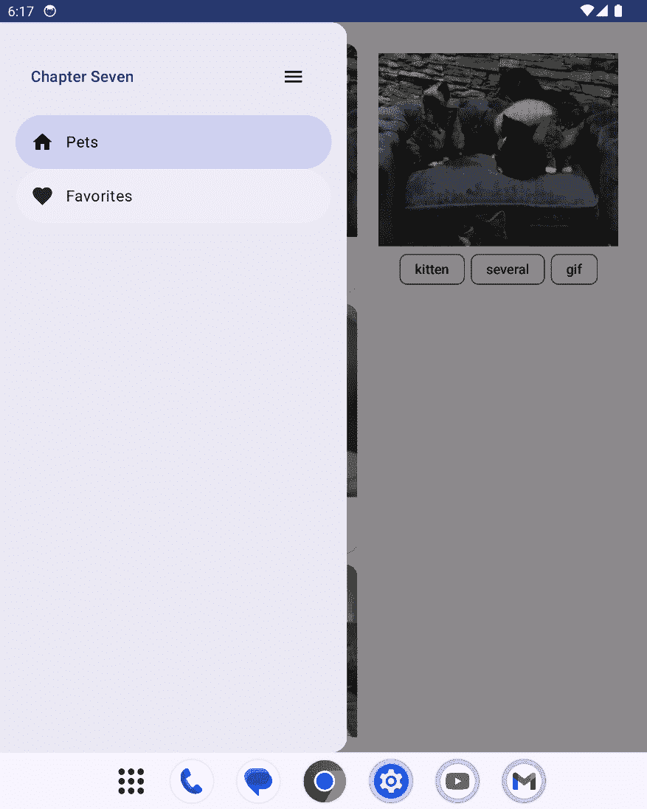

图 7.16 – 模态导航抽屉

可调整大小的模拟器是我们测试不同设备尺寸应用的好方法，但它也有其局限性。以下是可以调整大小的模拟器的局限性：

+   **铰链模拟**：虽然可调整大小的模拟器提供多窗口支持和模拟各种方向，但它们可能无法准确复制折叠设备上物理铰链的行为。铰链的物理特性和行为可能以不同的方式影响应用布局和交互。

+   **硬件特性**：模拟器缺少折叠设备中存在的物理硬件组件，例如实际铰链机制、柔性显示屏、传感器和专有功能，这影响了折叠设备行为的真实模拟。

+   **性能差异**：仿真器可能无法准确代表真实可折叠设备的性能能力，特别是在硬件特定的优化和性能特性方面。

+   **现实世界测试环境**：可折叠设备可能具有影响用户体验的独特环境因素，例如外部照明条件会影响柔性显示屏。仿真器可能无法准确复制这些现实世界场景。

+   **软件仿真与硬件交互**：某些可折叠设备的行为，如跨屏幕的拖放交互或独特的手势，可能由于硬件特定的交互而无法在软件中完全仿真。

我们学习了如何在可折叠设备和大型屏幕上处理导航，以及如何在用户在不同屏幕尺寸之间切换时提供出色的用户体验。这确保了我们的应用能够对不同设备做出响应，并且能够充分利用可用的屏幕尺寸。谷歌团队发布了支持大屏幕和可折叠设备的公司故事；您可以在此查看：[`developer.android.com/large-screens/stories`](https://developer.android.com/large-screens/stories)。

# 摘要

在本章中，我们学习了如何使用 Jetpack Compose 导航库在应用内导航到不同的 Jetpack Compose 屏幕。我们还学习了使用此库的技巧和最佳实践。此外，我们还介绍了如何在导航到屏幕时传递参数。最后，我们通过详细处理大屏幕和可折叠设备中的导航，在*第四章*所学内容的基础上进行了扩展。

我们已经创建了`FavoritePetsScreen`，但截至目前，它只有一个`Text`标签。在下一章中，我们将添加功能以在本地持久化数据，并在没有互联网访问的情况下检索这些数据。我们将学习如何将我们可爱的小猫照片保存到 Room，这是另一个用于离线存储的 Jetpack 库，并且还将添加宠物到我们的收藏列表中。
