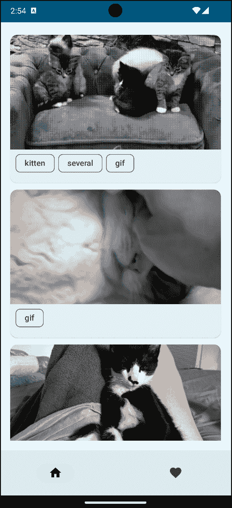
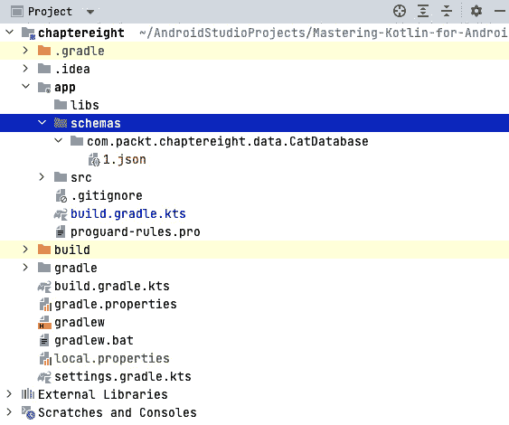
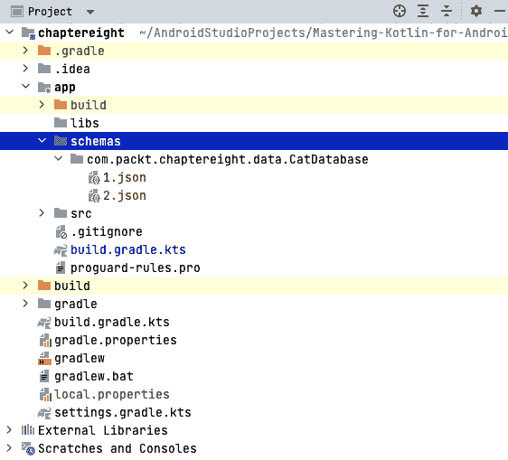
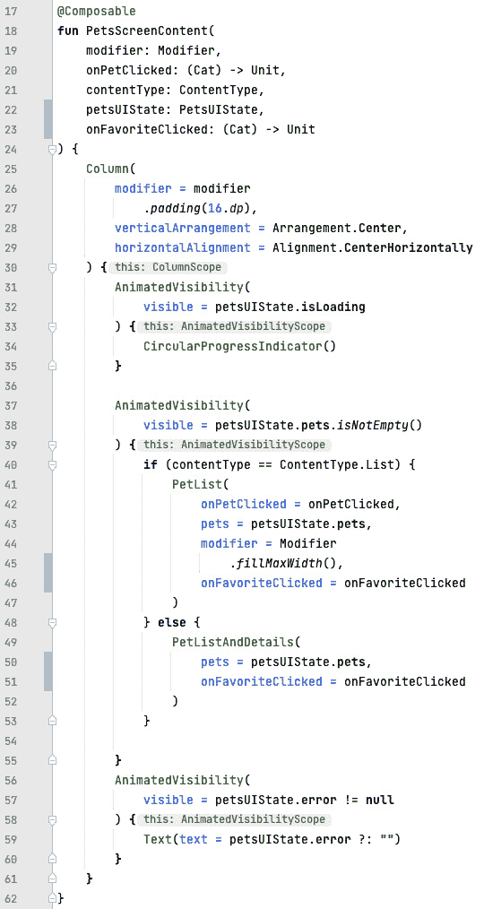
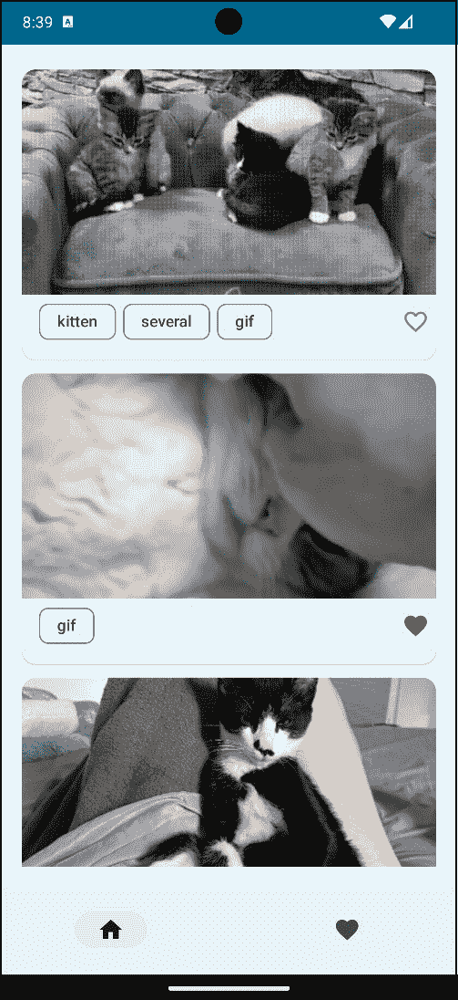
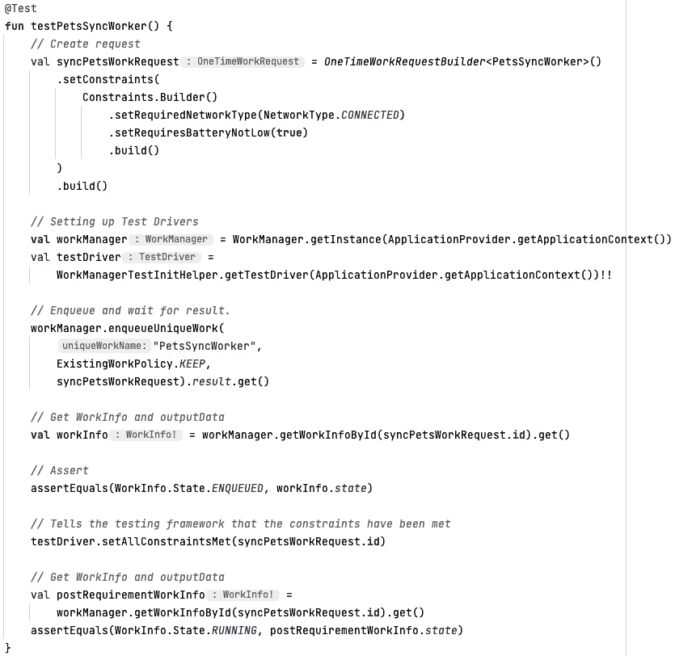

# 第八章：在本地持久化数据和执行后台工作

为了提供更好的用户体验，我们必须确保应用在用户每次打开应用时不要每次都获取数据。有时，用户可能处于没有互联网接入的地区，当用户在这种情况下无法使用您的应用时，这可能会非常令人沮丧。对于此类场景，我们必须本地存储数据。我们还必须以高效的方式存储和更新数据，这样不会耗尽设备的电池或阻止用户在应用上做其他事情。在本章中，我们将探讨如何为我们的应用做到这一点。

在本章中，我们将学习如何将数据保存到本地数据库 **Room** 中，这是 Jetpack 库的一部分。我们将能够保存条目并从 Room 数据库中读取。此外，我们还将学习如何使用 **WorkManager** 执行长时间运行的操作以及一些最佳实践。

在本章中，我们将涵盖以下主要主题：

+   从本地数据库保存和读取数据

+   处理 Room 数据库中的更新和迁移

+   使用 WorkManager 安排后台任务

+   测试您的工作者

# 技术要求

要遵循本章的说明，您需要下载 Android Studio Hedgehog 或更高版本 ([`developer.android.com/studio`](https://developer.android.com/studio))。

您可以使用上一章的代码来遵循本章的说明。您可以在 [`github.com/PacktPublishing/Mastering-Kotlin-for-Android/tree/main/chaptereight`](https://github.com/PacktPublishing/Mastering-Kotlin-for-Android/tree/main/chaptereight) 找到本章的代码。

# 从本地数据库保存和读取数据

我们将基于宠物应用进行构建，该应用显示可爱猫的列表。我们将把我们的可爱猫保存在本地数据库 Room 中，Room 是 Android Jetpack 库的一部分，它为 SQLite 提供了一个包装和抽象层。我们还将使用 `ViewModel`。Room 数据库在 SQLite 上提供了一个抽象层，允许流畅的数据库访问，同时充分利用 SQLite 的全部功能。它还内置了对 Kotlin 协程和流的支撑，以允许异步数据库访问。Room 还在编译时是安全的，因此 SQL 查询中的任何错误都会在编译时被捕获。它允许我们用简洁的代码完成所有这些。

要在我们的项目中使用 Room，我们需要将其依赖项添加到我们的 `libs.versions.toml` 文件中。让我们首先在 `versions` 部分定义 Room 版本，如下所示：

```java
room = "2.5.2"
```

接下来，让我们在我们的 `libraries` 部分添加依赖项：

```java
room-runtime = { module = "androidx.room:room-runtime" , version.ref = "room" }
room-compiler = { module = "androidx.room:room-compiler", version.ref = "room" }
room-ktx = { module = "androidx.room:room-ktx", version.ref = "room" }
```

同步项目以便添加更改。在我们将这些依赖项添加到应用级别的 `build.gradle.kts` 文件之前，我们需要为 Room 编译器设置一个注解处理器。Room 使用 `build.gradle.kts` 文件：

```java
id("com.google.devtools.ksp") version "1.9.0-1.0.13" apply false
```

我们已经添加了 `build.gradle.kts` 文件：

```java
id("com.google.devtools.ksp")
```

这允许我们在我们的应用模块中使用 KSP。为了最终设置 Room，现在让我们将我们之前声明的依赖项添加到应用级别的`build.gradle.kts`文件中：

```java
implementation(libs.room.runtime)
implementation(libs.room.ktx)
ksp(libs.room.compiler)
```

我们已经添加了我们的房间依赖和 Room KTX 库，使用`implementation`配置以及 Room 编译器使用`ksp`配置。我们现在可以开始在我们的项目中使用 Room 了。让我们先为我们的`Cat`对象创建一个实体类。这将是一个数据类，用于在数据库中存储我们的宠物。在`data`包内，创建一个名为`CatEntity.kt`的新文件，并添加以下代码：

```java
@Entity(tableName = "Cat")
data class CatEntity(
    @PrimaryKey
    val id: String,
    val owner: String,
    val tags: List<String>,
    val createdAt: String,
    val updatedAt: String
)
```

这个数据类代表了我们猫的 Room 表。`@Entity`注解用于定义我们的猫的表。我们传递了`tableName`值来指定我们的表名。`@PrimaryKey`注解用于定义`tags`，它是一个字符串列表。Room 提供了使用`@TypeConverter`注解保存非原始类型的功能。让我们创建一个名为`PetsTypeConverters.kt`的新文件，并添加以下代码：

```java
class PetsTypeConverters {
    @TypeConverter
    fun convertTagsToString(tags: List<String>): String {
        return Json.encodeToString(tags)
    }
    @TypeConverter
    fun convertStringToTags(tags: String): List<String> {
        return Json.decodeFromString(tags)
    }
}
```

这个类有两个函数被`@TypeConverter`注解标记。第一个函数将字符串列表转换为字符串。第二个函数将字符串转换为字符串列表。我们使用了 Kotlinx 序列化库将字符串列表转换为字符串，反之亦然。这个类将在我们即将创建的数据库类中引用。

我们现在准备好创建我们的数据库。我们需要创建一个`data`包，创建一个名为`CatDao.kt`的新文件，并添加以下代码：

```java
@Dao
interface CatDao {
    @Insert(onConflict = OnConflictStrategy.REPLACE)
    suspend fun insert(catEntity: CatEntity)
    @Query("SELECT * FROM Cat")
    fun getCats(): Flow<List<CatEntity>>
}
```

接口被`@Dao`注解标记，以告诉 Room 我们将使用这个类作为我们的 DAO。我们在 DAO 中定义了两个函数。`insert`函数用于将猫插入到我们的数据库中。请注意，这是一个`suspend`函数。这是因为我们将使用协程将猫插入到我们的数据库中。由于插入数据库是一个资源密集型操作，需要在后台线程上执行。我们还使用`@Insert`注解，并将`onConflict`参数设置为`OnConflictStrategy.REPLACE`。这告诉 Room 如果猫已经在数据库中存在，则替换它。`getCats`函数用于从我们的数据库中获取所有猫。它有一个`@Query`注解，用于定义一个查询以从我们的数据库中获取猫。我们使用`Flow`从数据库返回猫。`Flow`是一个可观察的数据流。这意味着每次我们更新数据库时，更改将立即发送到视图层，而无需我们做任何额外的工作。酷，对吧？

现在我们需要创建我们的数据库类。在`data`包内，创建一个名为`CatDatabase.kt`的新文件，并添加以下代码：

```java
@Database(
    entities = [CatEntity::class],
    version = 1
)
@TypeConverters(PetsTypeConverters::class)
abstract class CatDatabase: RoomDatabase() {
    abstract fun catDao(): CatDao
}
```

我们定义了一个继承自`RoomDatabase`类的抽象类。我们传递了`entities`参数来指定我们数据库中存储的实体或表。我们还传递了`version`参数来指定我们数据库的版本。我们使用了`@TypeConverters`注解来指定我们将在数据库中使用的类型转换器。我们还定义了一个返回我们的`CatDao`的抽象方法。我们需要为需要它的类提供一个数据库实例。我们将通过使用我们在项目中一直在使用的依赖注入模式来完成此操作。让我们转到`di`包，并在`Module.kt`文件中，在 Retrofit 依赖项下方添加 Room 依赖项：

```java
single {
    Room.databaseBuilder(
        androidContext(),
        CatDatabase::class.java,
        "cat-database"
    ).build()
}
single { get<CatDatabase>().carDao() }
```

首先，我们创建了我们数据库的单个实例。我们使用了`databaseBuilder`方法来创建我们的数据库。我们传递了来自 Koin 的`androidContext()`方法以获取我们应用程序的上下文。我们还传递了`CatDatabase::class.java`来指定我们数据库的类。我们还传递了数据库的`name`。然后我们创建了一个`CatDao`的单个实例。我们使用`get`方法获取我们数据库的实例，然后调用`catDao`函数来获取我们的`CatDao`。

我们的数据库名现已经准备好在我们的存储库中使用。我们将修改`PetRepository`及其实现，以便能够执行以下操作：

+   将项目保存到我们的数据库

+   从我们的数据库读取项目

+   将我们的`getPets()`函数修改为返回一个宠物`Flow`

修改后的`PetRepository.kt`文件应如下所示：

```java
interface PetsRepository {
    suspend fun getPets(): Flow<List<Cat>>
    suspend fun fetchRemotePets()
}
```

我们已经修改了`getPets`函数，使其返回一个宠物`Flow`。Room 不允许在主线程上访问数据库，因此，我们的查询必须是异步的。Room 提供了对可观察查询的支持，每次数据库中的数据发生变化时，它都会从我们的数据库中读取数据并发出新值以反映这些变化。这就是为什么我们从`getPets`函数返回`Flow`实例类型的原因。我们还添加了`fetchRemotePets`函数来从远程数据源获取宠物。现在让我们修改`PetRepositoryImpl.kt`文件，进行一些更改：

```java
class PetsRepositoryImpl(
    private  val catsAPI: CatsAPI,
    private val dispatcher: CoroutineDispatcher,
    private val catDao: CatDao
): PetsRepository {
    override suspend fun getPets(): Flow<List<Cat>> {
        return withContext(dispatcher) {
           catDao.getCats()
               .map { petsCached ->
                   petsCached.map { catEntity ->
                       Cat(
                           id = catEntity.id,
                           owner = catEntity.owner,
                           tags = catEntity.tags,
                           createdAt = catEntity.createdAt,
                           updatedAt = catEntity.updatedAt
                       ) }
               }
               .onEach {
                     if (it.isEmpty()) {
                          fetchRemotePets()
                     }
               }
        }
    }
    override suspend fun fetchRemotePets() {
        withContext(dispatcher) {
            val response = catsAPI.fetchCats("cute")
            if (response.isSuccessful) {
                response.body()!!.map {
                    catDao.insert(CatEntity(
                        id = it.id,
                        owner = it.owner,
                        tags = it.tags,
                        createdAt = it.createdAt,
                        updatedAt = it.updatedAt
                    ))
                }
            }
        }
    }
}
```

我们进行了以下更改：

+   我们在类的构造函数中添加了`catDao`属性。

+   我们已经修改了`getPets`函数，使其返回一个宠物`Flow`。此外，我们还添加了一个`map`操作符，将`CatEntity`映射到`Cat`对象。我们还添加了一个`onEach`操作符来检查宠物列表是否为空。如果为空，我们将调用`fetchRemotePets`函数从远程数据源获取宠物。这为我们的用户提供了一个**离线优先体验**；也就是说，我们首先检查我们数据库中是否有数据，如果没有，我们就从远程数据源获取它。

+   最后，我们修改了从远程数据源获取宠物的 `fetchRemotePets` 函数。当响应成功时，我们将响应映射到 `CatEntity` 实例类型，并将其插入到我们的数据库中。

我们需要在 `Module.kt` 文件中更新 `PetsRepository` 依赖项以添加 `CatDao` 依赖项：

```java
single<PetsRepository> { PetsRepositoryImpl(get(), get(), get()) }
```

在我们的 `PetsRepositoryImpl` 类中，我们已经能够从 Room 数据库中读取和获取数据。接下来，我们将修改 `PetsViewModel` 中的 `getPets()` 函数以适应这些新变化。前往 `PetsViewModel.kt` 文件并修改 `getPets()` 函数，使其看起来如下：

```java
private fun getPets() {
    petsUIState.value = PetsUIState(isLoading = true)
    viewModelScope.launch {
        petsRepository.getPets().asResult().collect { result ->
            when (result ) {
                is NetworkResult.Success -> {
                    petsUIState.update {
                        it.copy(isLoading = false, pets = result.data)
                    }
                }
                is NetworkResult.Error -> {
                    petsUIState.update {
                        it.copy(isLoading = false, error = result.error)
                    }
                }
            }
        }
    }
}
```

我们做了一些小的修改。我们使用了 `asResult()` 扩展函数将宠物的 `Flow` 转换为 `NetworkResult` 的 `Flow`。这是因为我们现在从我们的仓库返回宠物的 `Flow`。其余的代码与之前相同。我们会得到一个错误，因为我们还没有创建 `asResult()` 扩展函数。让我们在我们的 `NetworkResult.kt` 文件中创建它：

```java
fun <T> Flow<T>.asResult(): Flow<NetworkResult<T>> {
    return this
        .map<T, NetworkResult<T>> {
            NetworkResult.Success(it)
        }
        .catch { emit(NetworkResult.Error(it.message.toString())) }
}
```

这是一个 `Flow` 类的扩展函数。它将项目的 `Flow` 映射到 `NetworkResult` 类。现在我们可以回到我们的 `PetsViewModel` 类，并添加扩展函数导入以解决错误。

我们需要做的最后一个更改是在 `Application` 类中向我们的 Koin 实例提供应用程序上下文。前往 `ChapterEightApplication.kt` 文件并修改 `startKoin` 块如下：

```java
startKoin {
    androidContext(applicationContext)
    modules(appModules)
}
```

我们已经将应用程序上下文提供给我们的 Koin 实例。现在，我们可以运行应用程序。你应该能看到可爱猫咪的列表。



图 8.1 – 可爱的猫咪

应用程序仍然像以前一样工作，但现在我们从 Room 数据库中读取项目。如果你关闭数据和 Wi-Fi，应用程序仍然显示可爱猫咪的列表！令人惊讶，不是吗？我们已经能够使应用程序离线工作。拥有良好架构的应用程序的一个好处是，我们可以更改不同的层，而无需必然影响其他层。我们已经能够将数据源从远程数据源更改为本地数据源，而不会影响视图层。这就是拥有良好架构的力量。

我们知道如何从 Room 数据库中插入和读取数据，但更新数据怎么办？在下一节中，我们将学习如何更新 Room 数据库中的数据。在这个过程中，我们还将学习如何使用 Room 的**自动****迁移**功能从一个数据库版本迁移到另一个版本。

# 处理 Room 数据库的更新和迁移

`FavoritePetsScreen` 目前没有任何功能。我们将添加收藏宠物的功能，并在 Room 数据库中更新此信息。为了实现这一点，我们需要做以下事情：

+   设置 Room 模式目录。

+   在我们的 `CatEntity` 类中添加一个新列以存储猫咪的收藏状态。

+   向 `CatDao` 添加一个新功能以更新猫的收藏状态。

+   使用收藏图标更新我们的 UI，一旦点击，就会更新猫的收藏状态。这意味着 ViewModel 和仓库类在过程中也会被更新。

让我们开始以下步骤：

1.  让我们先设置模式目录。在我们的应用级别的 `build.gradle.kts` 文件中，添加以下代码：

    ```java
    ksp {
        arg("room.schemaLocation", "$projectDir/schemas")
    }
    ```

    执行 Gradle 同步然后构建项目。这将生成一个名为当前数据库版本的 `schema json` 文件，如下所示图所示：



图 8.2 – Room 模式目录

如前图所示，你必须切换到 `CatEntity` 接口来存储猫的收藏状态。

1.  我们将把这个字段添加到 `CatEntity` 和 `Cat` 数据类中。转到 `CatEntity.kt` 文件并添加一个名为 `isFavorite` 的新字段：

    ```java
    @ColumnInfo(defaultValue = "0")
    val isFavorite: Boolean = false
    ```

    这是一个默认值为 `false` 的布尔值。我们也使用了 `@ColumnInfo` 注解来指定我们数据库中列的默认值。我们将使用这个字段来存储猫的收藏状态。确保你也在 `Cat` 数据类中添加了 `val isFavorite: Boolean = false` 字段。我们现在需要更新我们的 `CatDao` 类以能够更新猫的收藏状态。

1.  让我们转到 `CatDao.kt` 文件并添加以下功能：

    ```java
    @Update
    suspend fun update(catEntity: CatEntity)
    @Query("SELECT * FROM Cat WHERE isFavorite = 1")
    fun getFavoriteCats(): Flow<List<CatEntity>>
    ```

    这里有两个函数。第一个函数将用于更新猫的收藏状态。我们使用了 `@Update` 注解来告诉 Room 这个函数将用于更新我们数据库中的 `CatEntity` 类。第二个函数将用于从我们的数据库中获取收藏的猫。我们使用了 `@Query` 注解来定义从我们的数据库中获取收藏猫的查询。我们使用了 `Flow` 来从我们的数据库中返回收藏的猫。现在，我们需要向我们的数据库添加一个迁移来添加新的列，这确保了在更新我们的数据库时不会丢失任何数据。向 `CatDatabase` 添加 `autoMigration` 如下：

    ```java
    @Database(
        entities = [CatEntity::class],
        version = 2,
        autoMigrations = [
            AutoMigration(from = 1, to = 2)
        ]
    )
    ```

    我们已经向我们的数据库添加了 `autoMigrations` 参数。我们向参数传递了一个 `AutoMigration` 对象的列表。我们传递了 `from` 和 `to` 参数来指定我们数据库的版本。确保你添加了 `AutoMigration` 类的导入。注意，我们还将我们数据库的 `version` 提高了。这是因为我们向数据库添加了一个新列。构建项目以生成 `schema json` 文件。你应该会看到一个名为新数据库版本的新 schema JSON 文件。我们的模式目录应该看起来像以下这样：



图 8.3 – 更新的 Room 模式目录

如果我们打开 `2.json` 文件，我们会注意到新添加了 `isFavorite` 列到我们的表中。这是为了自动化迁移。我们现在可以更新我们的仓库以能够更新猫的喜欢状态。

1.  让我们转到 `PetsRepository.kt` 文件，并添加以下函数：

    ```java
    suspend fun updatePet(cat: Cat)
    suspend fun getFavoritePets(): Flow<List<Cat>>
    ```

`updatePet(cat: Cat)` 和 `getFavoritePets()` 函数将用于更新猫的喜欢状态和获取喜欢的猫。

1.  让我们在 `PetsRepositoryImpl.kt` 类中添加这两个函数的实现：

    ```java
    override suspend fun updatePet(cat: Cat) {
        withContext(dispatcher) {
            catDao.update(CatEntity(
                id = cat.id,
                owner = cat.owner,
                tags = cat.tags,
                createdAt = cat.createdAt,
                updatedAt = cat.updatedAt,
                isFavorite = cat.isFavorite
            ))
        }
    }
    override suspend fun getFavoritePets(): Flow<List<Cat>> {
        return withContext(dispatcher) {
            catDao.getFavoriteCats()
                .map { petsCached ->
                    petsCached.map { catEntity ->
                        Cat(
                            id = catEntity.id,
                            owner = catEntity.owner,
                            tags = catEntity.tags,
                            createdAt = catEntity.createdAt,
                            updatedAt = catEntity.updatedAt,
                            isFavorite = catEntity.isFavorite
                        )
                    }
                }
        }
    }
    ```

    下面是这些函数的解释：

    +   在 `updatePet` 函数中，我们使用了 `CatDao` 接口中的更新方法来更新猫的喜欢状态。我们还使用了 `withContext` 来确保更新在后台线程上运行。我们根据传递给函数的 `Cat` 对象创建了一个新的 `CatEntity` 类。

    +   在 `getFavoritePets` 函数中，我们使用了 `CatDao` 接口中的 `getFavoriteCats` 函数从我们的数据库中获取喜欢的猫。我们还把 `CatEntity` 列表映射到了 `Cat` 列表中。然后我们返回了一个类型为 `Flow` 的喜欢的猫的实例。

1.  在 `PetsRepositoryImpl.kt` 文件中，我们需要更新 `fetchRemotePets` 和 `getPets` 函数以更新猫的喜欢状态，如下所示：

    ```java
    override suspend fun getPets(): Flow<List<Cat>> {
        return withContext(dispatcher) {
           catDao.getCats()
               .map { petsCached ->
                   petsCached.map { catEntity ->
                       Cat(
                           id = catEntity.id,
                           owner = catEntity.owner,
                           tags = catEntity.tags,
                           createdAt = catEntity.createdAt,
                           updatedAt = catEntity.updatedAt,
                           isFavorite = catEntity.isFavorite
                       )
                   }
               }
               .onEach {
                   if (it.isEmpty()) {
                       fetchRemotePets()
                   }
               }
        }
    }
    override suspend fun fetchRemotePets() {
        withContext(dispatcher) {
            val response = catsAPI.fetchCats("cute")
            if (response.isSuccessful) {
                response.body()!!.map {
                    catDao.insert(CatEntity(
                        id = it.id,
                        owner = it.owner,
                        tags = it.tags,
                        createdAt = it.createdAt,
                        updatedAt = it.updatedAt,
                        isFavorite = it.isFavorite
                    ))
                }
            }
        }
    }
    ```

    当我们将 `CatEntity` 类映射到 `Cat` 对象时，我们添加了 `isFavorite` 参数。这将确保我们在从远程和本地数据源获取猫时，有猫的喜欢状态。

1.  让我们转到 `PetsViewModel` 类，并在 `petsUIState` 变量下方添加以下变量：

    ```java
    private val _favoritePets = MutableStateFlow<List<Cat>>(emptyList())
    val favoritePets: StateFlow<List<Cat>> get() = _favoritePets
    ```

    在这里，我们创建了一个私有的 `MutableStateFlow` 喜欢的猫和一个公共的 `StateFlow` 喜欢的猫。我们将使用 `_favoritePets` 变量来更新喜欢的猫，并使用 `favoritePets` 变量来观察喜欢的猫。这种模式通常建议用于防止将可变状态暴露给视图层。

1.  接下来，让我们在 `PetsViewModel` 中的 `getPets()` 函数下方添加这两个函数：

    ```java
    fun updatePet(cat: Cat) {
        viewModelScope.launch {
            petsRepository.updatePet(cat)
        }
    }
    fun getFavoritePets() {
        viewModelScope.launch {
            petsRepository.getFavoritePets().collect {
                _favoritePets.value = it
            }
        }
    }
    ```

    `updatePet` 函数将从 UI 中调用以更新猫的喜欢状态。`getFavoritePets` 函数将从 UI 中调用以从我们的数据库中获取喜欢的猫。我们从数据库中收集喜欢的猫并更新 `_favoritePets` 变量。有了这些更改，我们现在可以更改我们的视图，以便能够喜欢一只猫并查看喜欢的宠物列表。

1.  我们将首先将我们的喜欢图标添加到 `PetListItem` 组合组件中。让我们转到 `PetList.kt` 文件，并更新 `PetListItem` 组合组件如下：

    ```java
    @OptIn(ExperimentalLayoutApi::class)
    @Composable
    fun PetListItem(
        cat: Cat,
        onPetClicked: (Cat) -> Unit,
        onFavoriteClicked: (Cat) -> Unit
    ) {
        ElevatedCard(
            modifier = Modifier
                .fillMaxWidth()
                .padding(6.dp)
        ) {
            Column(
                modifier = Modifier
                    .fillMaxWidth()
                    .padding(bottom = 10.dp)
                    .clickable {
                        onPetClicked(cat)
                    }
            ) {
                AsyncImage(
                    model = "https://cataas.com/cat/${cat.id}",
                    contentDescription = "Cute cat",
                    modifier = Modifier
                        .fillMaxWidth()
                        .height(200.dp),
                    contentScale = ContentScale.FillWidth
                )
                Row(
                    modifier = Modifier
                        .padding(start = 6.dp, end = 6.dp)
                        .fillMaxWidth(),
                    verticalAlignment = Alignment.CenterVertically,
                    horizontalArrangement = Arrangement.SpaceBetween
                ) {
                    FlowRow(
                        modifier = Modifier
                            .padding(start = 6.dp, end = 6.dp)
                    ) {
                        repeat(cat.tags.size) {
                            SuggestionChip(
                                modifier = Modifier
                                    .padding(start = 3.dp, end = 3.dp),
                                onClick = { },
                                label = {
                                    Text(text = cat.tags[it])
                                }
                            )
                        }
                    }
                    Icon(
                        modifier = Modifier
                            .clickable {
                                onFavoriteClicked(cat.copy(isFavorite = !cat.isFavorite))
                            },
                        imageVector = if (cat.isFavorite) {
                            Icons.Default.Favorite
                        } else {
                            Icons.Default.FavoriteBorder
                        },
                        contentDescription = "Favorite",
                        tint = if (cat.isFavorite) {
                            Color.Red
                        } else {
                            Color.Gray
                        },
                    )
                }
            }
        }
    }
    ```

    我们在 `PetListItem` 组合器中添加了 `Icon` 组合器。如果猫被收藏，我们使用 `Icons.Default.Favorite` 图标，如果没有收藏，我们使用 `Icons.Default.FavoriteBorder` 图标。我们还使用了 `tint` 参数来根据猫的收藏状态改变图标的颜色。`Icon` 现在在 `Row` 中，与 `FlowRow` 一起显示标签列表。我们还向 `PetListItem` 组合器添加了 `onFavoriteClicked` 参数。我们使用此参数更新猫的收藏状态。

1.  让我们更新 `PetList` 组合器，添加一个名为 `onFavoriteClicked` 的新回调参数，并将该参数传递给 `PetListItem` 组合器：

    ```java
    @Composable
    fun PetList(
        onPetClicked: (Cat) -> Unit,
        pets: List<Cat>,
        modifier: Modifier,
        onFavoriteClicked: (Cat) -> Unit
    ) {
        LazyColumn(
            modifier = modifier
        ) {
            items(pets) { pet ->
                PetListItem(
                    cat = pet,
                    onPetClicked = onPetClicked,
                    onFavoriteClicked = onFavoriteClicked
                )
            }
        }
    }
    ```

1.  接下来，我们将添加 `onFavoriteClicked` 回调作为 `PetsScreenContent` 的参数：

    ```java
    @Composable
    fun PetsScreenContent(
        modifier: Modifier,
        onPetClicked: (Cat) -> Unit,
        contentType: ContentType,
        petsUIState: PetsUIState,
        onFavoriteClicked: (Cat) -> Unit
    ) {
        // code
        }
    ```

1.  我们现在可以将参数传递给 `PetList` 组合器：

    ```java
    PetList(
        onPetClicked = onPetClicked,
        pets = petsUIState.pets,
        modifier = Modifier
        .fillMaxWidth(),
        onFavoriteClicked = onFavoriteClicked
    )
    ```

1.  让我们更新 `PetAndDetails` 组合器，添加 `onFavoriteClicked` 参数：

    ```java
    @Composable
    fun PetListAndDetails(
        pets: List<Cat>,
        onFavoriteClicked: (Cat) -> Unit
    ) {
        // code
        }
    ```

1.  我们现在可以将参数传递给 `PetList` 组合器：

    ```java
    PetList(
        onPetClicked = {
        currentPet = it
        },
        pets = pets,
        modifier = Modifier
        .fillMaxWidth()
        .weight(1f),
        onFavoriteClicked = onFavoriteClicked
    )
    ```

1.  回到 `PetsScreenContent.kt` 文件，我们需要将 `onFavoriteClicked` 参数传递给 `PetListAndDetails` 组合器：

    ```java
    PetListAndDetails(
        pets = petsUIState.pets,
        onFavoriteClicked = onFavoriteClicked
    )
    ```

    到目前为止，我们已做的所有更改的最终 `PetScreenContent.kt` 文件应该看起来像这样：



图 8.4 – 更新的 PetscreenContent

1.  接下来，在 `PetsScreen.kt` 文件中的 `PetsScreen` 组合器中，我们需要将 `onFavoriteClicked` 参数添加到 `PetsScreenContent` 组合器中：

    ```java
    PetsScreenContent(
        modifier = Modifier
            .fillMaxSize(),
        onPetClicked = onPetClicked,
        contentType = contentType,
        petsUIState = petsUIState,
        onFavoriteClicked = {
            petsViewModel.updatePet(it)
        }
    )
    ```

    我们已经将 `onFavoriteClicked` 回调传递给了 `PetsScreenContent` 组合器。我们用更新后的猫对象调用了我们的 `PetsViewModel` 类的 `updatePet` 方法。让我们运行应用；现在它有一个新的收藏图标。如果我们点击图标，图标会变成一个红色的实心心形图标：



图 8.5 – 憨态可爱好猫与收藏

1.  最后，我们将更新 `FavoritePetsScreen` 以显示收藏猫的列表。让我们转到 `FavoritePetsScreen.kt` 文件并更新 `FavoritePetsScreen` 组合器，使其如下所示：

    ```java
    @Composable
    fun FavoritePetsScreen(
        onPetClicked: (Cat) -> Unit
    ) {
        val petsViewModel: PetsViewModel = koinViewModel()
        LaunchedEffect(Unit) {
            petsViewModel.getFavoritePets()
        }
        val pets by petsViewModel.favoritePets.collectAsStateWithLifecycle()
        if (pets.isEmpty()) {
            Column(
                modifier = Modifier
                    .fillMaxSize(),
                verticalArrangement = Arrangement.Center,
                horizontalAlignment = Alignment.CenterHorizontally
            ) {
                Text(text = "No favorite pets")
            }
        } else {
            LazyColumn(
                modifier = Modifier
                    .fillMaxSize()
            ) {
                items(pets) { pet ->
                    PetListItem(
                        cat = pet,
                        onPetClicked = onPetClicked,
                        onFavoriteClicked = {
                            petsViewModel.updatePet(it)
                        }
                    )
                }
            }
        }
    }
    ```

    下面是更改的解释：

    +   我们向 `FavoritePetsScreen` 组合器添加了一个新参数 `onPetClicked`。我们将使用此参数导航到 `PetDetailsScreen` 组合器。

    +   我们使用 `koinViewModel()` 方法创建了我们 `PetsViewModel` 类的新实例。

    +   我们从我们的 `PetsViewModel` 类中调用了 `getFavoritePets` 函数来获取我们数据库中的收藏猫。我们使用 `LaunchedEffect` 在组合器首次启动时调用此方法。这是为了确保我们不会每次组合器重新组合时都调用该函数。

    +   我们有一个名为 `pets` 的新变量，它是一个收藏猫咪的 `StateFlow`。我们使用了 `collectAsStateWithLifecycle` 方法从我们的数据库中收集收藏猫咪。此方法具有生命周期感知性，因此它只会在可组合项活跃时收集收藏猫咪。

    +   我们添加了一个检查，以查看收藏猫咪列表是否为空。如果为空，我们向用户显示一条消息。如果不为空，我们显示收藏猫咪的列表。

1.  我们需要更新 `AppNavigation.kt` 文件，将 `onPetClicked` 回调传递给 `FavoritePetsScreen` 可组合项：

    ```java
    FavoritePetsScreen(
        onPetClicked = { cat ->
            navHostController.navigate(
                "${Screens.PetDetailsScreen.route}/${Json.encodeToString(cat)}"
            )
        }
    )
    ```

    这个逻辑类似于我们在 `PetsScreen` 中的逻辑，它处理在 `FavoritePetsScreen` 中导航到 `PetDetailsScreen`。构建并运行应用。点击底部栏上的收藏图标，你应该能看到你收藏的可爱猫咪列表。如果你点击收藏图标，猫咪会立即从收藏猫咪列表中移除。这是因为收藏猫咪列表是一个 `Flow`，每次 Room 更新数据时，它们都会立即发射到视图层。


图 8.6 – 收藏猫咪屏幕

我们已经能够添加收藏猫咪的功能，并在 Room 数据库中更新这些信息。我们还能处理 Room 数据库中的更新和迁移。在下一节中，我们将看到如何使用 WorkManager 来安排后台任务。在这种情况下，我们将使用 WorkManager 从远程数据源获取猫咪并将其保存到我们的数据库中。这改善了我们的首次离线体验，因为我们将在数据库中始终拥有最新的数据。

# 使用 WorkManager 来安排后台任务

WorkManager 是一个适合在后台执行长时间运行任务的 Jetpack 库。它确保即使在您的应用重启或手机重启时，后台任务也能完成。使用 WorkManager，您可以安排一次性作业或重复性作业。

我们将首先将 WorkManager 依赖项添加到我们的项目中。按照以下步骤操作：

1.  让我们转到 `libs.versions.toml` 文件，并在我们的 `versions` 部分如下定义工作版本：

    ```java
    work = "2.8.1"
    ```

1.  在库（libraries）部分，添加以下依赖项：

    ```java
    work-runtime = { module = "androidx.work:work-runtime-ktx", version.ref = "work" }
    workmanager-koin = { module = "io.insert-koin:koin-androidx-workmanager", version.ref = "koin" }
    ```

    在这里，我们有两个依赖项：`work-runtime-ktx` 依赖项，这是 WorkManager 的核心依赖项，以及 `koin-androidx-workmanager` 依赖项，用于将 WorkManager 与 Koin 集成。同步项目以添加这些更改。

1.  接下来，我们需要将依赖项添加到应用级别的 `build.gradle.kts` 文件中：

    ```java
    implementation(libs.work.runtime)
    implementation(libs.workmanager.koin)
    ```

1.  执行 Gradle 同步以将这些依赖项添加到我们的项目中。

我们现在已准备好开始在项目中使用 WorkManager。我们将使用 WorkManager 从远程数据源获取猫咪并将其保存到我们的数据库中。我们将使用 `OneTimeWorkRequest` 类来安排一次性作业，从远程数据源获取猫咪并将其保存到数据库中。让我们开始以下步骤：

1.  让我们创建一个名为 `workers` 的新包，并在其中创建一个名为 `PetsSyncWorker.kt` 的新文件，并添加以下代码：

    ```java
    class PetsSyncWorker(
        appContext: Context,
        workerParams: WorkerParameters,
        private val  petsRepository: PetsRepository
    ): CoroutineWorker(appContext, workerParams) {
        override suspend fun doWork(): Result {
            return try {
                petsRepository.fetchRemotePets()
                Result.success()
            } catch (e: Exception) {
                Result.failure()
            }
        }
    }
    ```

    在前面的代码块中，我们创建了一个实现了 `CoroutineWorker` 类的类。当我们想在后台执行长时间运行的任务时，我们会实现这个类。它使用协程来执行长时间运行的任务。我们将 `appContext` 和 `workerParams` 参数传递给了类的构造函数。我们还传递了 `petsRepository` 参数到类的构造函数。我们重写了 `doWork` 方法，这是一个将在工作调度时被调用的 `suspend` 函数。我们从 `PetsRepository` 调用了 `fetchRemotePets` 来从远程数据源获取猫并保存到我们的数据库中。如果工作成功，我们返回 `Result.success()`；如果工作失败，我们返回 `Result.failure()`。

1.  接下来，让我们在我们的 `Module.kt` 文件中创建一个 `PetsSyncWorker` 的实例：

    ```java
    worker { PetsSyncWorker(get(), get(), get()) }
    ```

    我们正在使用 `worker` Koin DSL 创建 `PetsSyncWorker` 的实例。这是从我们刚刚添加的 Koin WorkManager 库中来的。我们将 `appContext`、`workerParams` 和 `petsRepository` 参数传递给了 `PetsSyncWorker` 的构造函数。

1.  接下来，让我们在我们的 `MainActivity.kt` 文件中添加这个函数：

    ```java
    private fun startPetsSync() {
        val syncPetsWorkRequest = OneTimeWorkRequestBuilder<PetsSyncWorker>()
            .setConstraints(
                Constraints.Builder()
                    .setRequiredNetworkType(NetworkType.CONNECTED)
                    .setRequiresBatteryNotLow(true)
                    .build()
            )
            .build()
        WorkManager.getInstance(applicationContext).enqueueUniqueWork(
            "PetsSyncWorker",
            ExistingWorkPolicy.KEEP,
            syncPetsWorkRequest
        )
    }
    ```

    在前面的代码中，我们使用 `PetSyncWorker` 创建了一个新的 `OneTimeWorkRequest`。我们还在我们的工作请求中设置了一些约束。我们将网络类型设置为 `NetworkType.CONNECTED`，以确保只有在设备连接到互联网时才执行工作请求。我们还有其他网络类型，如下所示：

    +   `NOT_REQUIRED`: 对于此类类型，不需要网络。这对于不需要任何互联网连接即可工作的任务很有用。

    +   `UNMETERED`: 对于此类网络，需要一个非计费的网络连接，如 Wi-Fi。这适用于涉及大量数据传输的任务。

    +   `METERED`: 对于此类网络，需要一个计费网络连接。当设备处于计费连接时，可能需要大量数据的任务可能会被推迟，以避免不必要的费用。

    +   `NOT_ROAMING`: 对于此类工作，需要一个非漫游连接。当设备处于漫游状态时执行可能会产生额外费用的任务与此相关。

    我们还设置了`BatteryNotLow constraint`为`true`，以确保只有在电池电量充足时才执行工作请求。然后我们使用`WorkManager.getInstance(applicationContext)`获取 WorkManager 的实例，然后调用`enqueueUniqueWork`方法来入队我们的工作请求。我们将工作请求的名称、`ExistingWorkPolicy`和工作请求传递给`enqueueUniqueWork`方法。`ExistingWorkPolicy`用于指定如果已存在具有相同名称的工作请求时应该发生什么。我们使用了`ExistingWorkPolicy.KEEP`以确保如果已存在具有相同名称的工作请求，则不会替换工作请求。以下是一些其他可用的策略：

    +   `REPLACE`：取消具有相同唯一名称的现有工作，并将新工作入队。这适用于我们只想执行最新版本的工作，丢弃先前实例的情况。

    +   `APPEND`：即使存在具有相同唯一名称的现有工作，也会将新工作入队。新工作和现有工作将独立执行。这适用于我们希望同一工作的多个实例共存的情况。

    我们现在已准备好开始我们的工作请求。我们将在`MainActivity`的`onCreate`方法中启动工作请求。

1.  在`MainActivity.kt`文件中，在`onCreate`方法中添加以下代码：

    ```java
    startPetsSync()
    ```

    由于我们正在使用 Koin，我们需要在我们的应用程序清单中禁用默认的 WorkManager 初始化。

1.  让我们转到`AndroidManifest.xml`文件，并在应用程序标签内添加以下代码：

    ```java
    <provider
        android:name="androidx.startup.InitializationProvider"
        android:authorities="${applicationId}.androidx-startup"
        android:exported="false"
        tools:node="merge">
        <!-- Removing WorkManager Default Initializer-->
        <meta-data
            android:name="androidx.work.WorkManagerInitializer"
            android:value="androidx.startup"
            tools:node="remove" />
    </provider>
    ```

    添加前面的代码可以防止 WorkManager 自动初始化。如果不这样做，一旦设置了 Koin 初始化，应用程序就会崩溃。崩溃是由 Koin 的依赖注入和 WorkManager 的默认初始化之间的冲突引起的。最后，我们还从 WorkManager 2.6 中移除了 App Startup（[`developer.android.com/topic/libraries/app-startup`](https://developer.android.com/topic/libraries/app-startup)），这是 WorkManager 内部使用的。

1.  要设置自定义 WorkManager 实例，转到`ChapterEightApplication.kt`文件，并在`startKoin`块内添加以下代码：

    ```java
    workManagerFactory()
    ```

1.  构建并运行应用程序，没有任何变化。然而，我们已经安排了一个后台任务，从远程数据源获取猫并将其保存到我们的数据库中。


图 8.7 – 可爱的猫

我们已经创建了我们的`PetsSyncWorker`类，并学习了如何在后台执行工作。在下一节中，我们将为我们的`PetsSyncWorker`类编写测试。

# 测试你的工作者

测试代码非常重要。它确保我们的代码按预期工作，并帮助我们及早发现错误。在本节中，我们将为我们的工作者编写测试。要测试我们的工作者，我们首先需要按照以下步骤设置 WorkManager 测试依赖项：

1.  让我们转到`libs.versions.toml`文件，并在`libraries`部分添加以下依赖项：

    ```java
    work-testing = { module = "androidx.work:work-testing", version.ref = "work" }
    ```

    同步您的项目。这将添加`work-testing`工件，帮助我们测试工作者到我们的项目中。

1.  接下来，我们需要将依赖项添加到我们的应用级别的`build.gradle.kts`文件中：

    ```java
    androidTestImplementation(libs.work.testing)
    ```

    我们使用了`androidTestImplementation`，因为我们将在`androidTest`文件夹中编写测试。执行 Gradle 同步操作以将依赖项添加到我们的项目中。我们现在可以开始编写测试了。

由于我们的`PetsSyncWorker`类需要一些依赖项，我们将创建一个测试规则，提供我们需要的 Koin 依赖项。让我们转到`androidTest`文件夹，创建一个名为`KoinTestRule.kt`的新文件，并添加以下代码：

```java
class KoinTestRule: TestRule {
    override fun apply(base: Statement?, description: Description?): Statement {
        return object : Statement() {
            override fun evaluate() {
                stopKoin()
                startKoin {
                    androidLogger(Level.ERROR)
                    androidContext(ApplicationProvider.getApplicationContext())
                    modules(appModules)
                }
            }
        }
    }
}
```

`KoinTestRule`实现了`TestRule`接口。我们使用了这个规则来提供我们在测试中需要的 Koin 依赖项。我们使用了`startKoin`方法来提供我们需要的 Koin 依赖项。我们使用了`androidContext(ApplicationProvider.getApplicationContext())`方法来获取应用程序上下文。我们还使用了`modules(appModules)`方法来提供我们需要的 Koin 模块。现在，我们准备好开始编写测试了。让我们创建一个名为`PetsSyncWorkerTest.kt`的新文件，并添加以下代码：

```java
@RunWith(AndroidJUnit4::class)
class PetsSyncWorkerTest {
    @get:Rule
    val koinTestRule = KoinTestRule()
    @Before
    fun setUp() {
        val config = Configuration.Builder()
            .setMinimumLoggingLevel(Log.DEBUG)
            .setExecutor(SynchronousExecutor())
            .build()
        // Initialize WorkManager for instrumentation tests.
        WorkManagerTestInitHelper.initializeTestWorkManager(
            ApplicationProvider.getApplicationContext(),
            config
        )
    }
}
```

我们创建了一个名为`PetsSyncWorkerTest`的测试类。我们使用`@RunWith(AndroidJUnit4::class)`注解了该类。我们还创建了一个`KoinTestRule`实例，并使用`@get:Rule`注解将其提供给我们的测试类。我们还创建了一个`setup`函数，并使用`@Before`注解。这个函数将在每个测试之前执行。我们使用`WorkManagerTestInitHelper`类来初始化 WorkManager 进行仪器测试。我们使用`SynchronousExecutor`类来确保工作同步执行。这是为了确保我们的测试是确定性的。我们现在准备好开始编写测试了。

按照以下步骤创建我们的测试：

1.  我们将首先创建一个测试函数来测试我们工作者的功能。在`setup`函数下方将以下代码添加到`PetsSyncWorkerTest.kt`文件中：

    ```java
    @Test
    fun testPetsSyncWorker() {
    }
    ```

    这是一个用`@Test`注解标记的空函数。

1.  按照以下步骤创建工作请求：

    ```java
    val syncPetsWorkRequest = OneTimeWorkRequestBuilder<PetsSyncWorker>()
        .setConstraints(
            Constraints.Builder()
                .setRequiredNetworkType(NetworkType.CONNECTED)
                .setRequiresBatteryNotLow(true)
                .build()
        )
        .build()
    ```

    在前面的代码中，我们使用`PetsSyncWorker`类创建了一个一次性请求。我们还设置了工作请求的约束条件。我们将网络类型设置为`NetworkType.CONNECTED`，以确保只有在设备连接到互联网时才执行工作请求。我们还设置了`BatteryNotLow`约束为`true`，以确保只有在电池电量充足时才执行工作请求。

1.  接下来，设置测试驱动程序：

    ```java
    val workManager = WorkManager.getInstance(ApplicationProvider.getApplicationContext())
    val testDriver =
        WorkManagerTestInitHelper.getTestDriver(ApplicationProvider.getApplicationContext())!!
    ```

    在这里，我们已经设置了测试驱动程序，帮助我们模拟测试所需的条件。例如，它模拟了约束条件得到满足的情况。

1.  将工作请求入队：

    ```java
    workManager.enqueueUniqueWork(
        "PetsSyncWorker",
        ExistingWorkPolicy.KEEP,
        syncPetsWorkRequest).result.get()
    ```

    我们使用了 `enqueueUniqueWork` 方法来入队我们的工作请求。我们将工作请求的名称、`ExistingWorkPolicy` 和工作请求传递给了 `enqueueUniqueWork` 方法。我们使用了 `ExistingWorkPolicy.KEEP` 来确保如果已经存在具有相同名称的工作请求，则不会替换工作请求。我们还使用了 `result.get()` 方法来获取工作请求的结果。

1.  使用 `WorkInfo` 类获取关于我们的工作请求的信息：

    ```java
    val workInfo = workManager.getWorkInfoById(syncPetsWorkRequest.id).get()
    ```

    我们正在获取工作请求的 `WorkInfo`。我们使用了 `getWorkInfoById` 方法来获取工作请求的 `WorkInfo`。我们使用 `result.get()` 方法来获取工作请求的结果。

1.  接下来，让我们获取工作进程的状态并断言我们的工作是入队的：

    ```java
    assertEquals(WorkInfo.State.ENQUEUED, workInfo.state)
    ```

    我们使用了 `assertEquals` 方法来断言我们的工作是入队的。我们使用了 `WorkInfo.State.ENQUEUED` 来检查我们的工作是否入队。

1.  接下来，让我们使用我们之前创建的 `testDriver` 实例来模拟我们的约束条件得到满足：

    ```java
    testDriver.setAllConstraintsMet(syncPetsWorkRequest.id)
    ```

    我们使用 `testDriver` 来模拟约束条件得到满足。我们使用了 `setAllConstraintsMet` 函数来模拟约束条件得到满足。我们将工作请求的 `id` 传递给了 `setAllConstraintsMet` 方法。工作请求 `id` 具有通用唯一标识符（UUID）的实例类型。

1.  最后，让我们获取我们的工作进程的输出和状态：

    ```java
    val postRequirementWorkInfo =
        workManager.getWorkInfoById(syncPetsWorkRequest.id).get()
    assertEquals(WorkInfo.State.RUNNING, postRequirementWorkInfo.state)
    ```

    这是我们的测试的最终步骤。我们使用了 `getWorkInfoById` 方法来获取工作请求的 `WorkInfo`。我们使用了 `result.get()` 方法来获取工作请求的结果。我们使用了 `WorkInfo.State.RUNNING` 来检查我们的工作是否正在运行。我们的最终测试函数应该看起来像以下这样：



图 8.8 – PetsSyncWorker 测试

1.  点击我们测试左侧的绿色运行图标以运行测试。测试运行并且全部为绿色！我们的测试通过了，如下截图所示：


图 8.9 – 测试结果

让所有这些测试协同工作是一项了不起的工作。

# 摘要

在本章中，我们学习了如何将数据保存到本地数据库 Room，它是 Jetpack 库的一部分。我们还保存了项目并从 Room 数据库中读取。在这个过程中，我们还学习了如何在 Room 数据库中更新项目以及如何处理数据库中的自动迁移。此外，我们还学习了如何使用 WorkManager 进行长时间运行的操作，它的最佳实践以及如何为我们的工作进程编写测试。

在下一章中，我们将学习关于运行时权限以及如何在我们的应用中请求它们。
