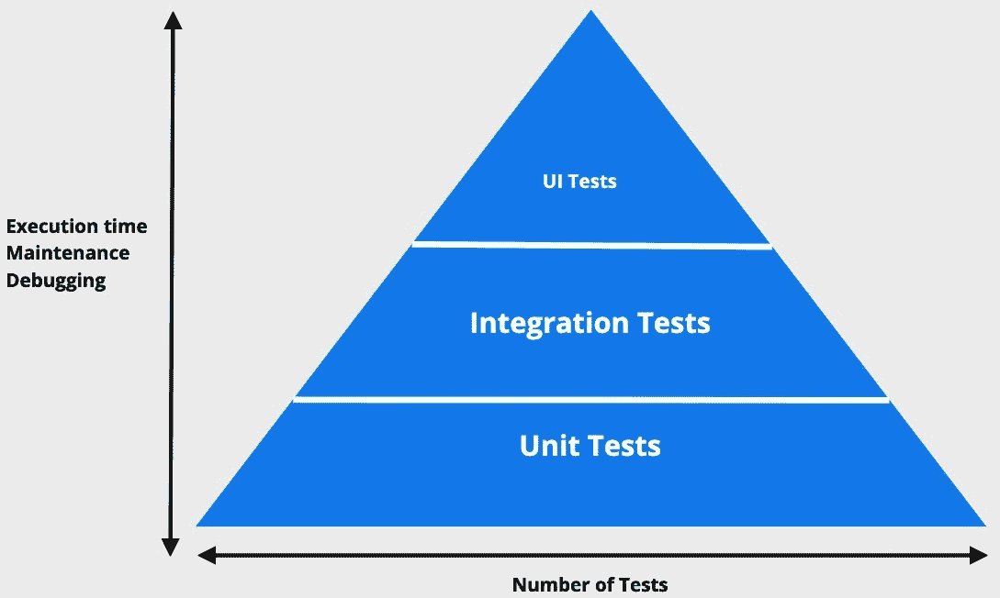
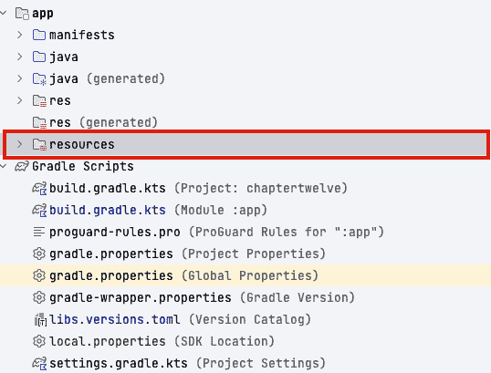
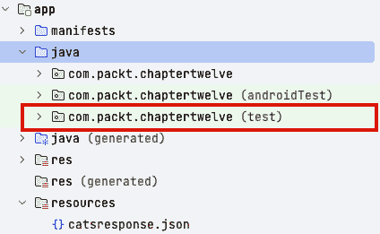
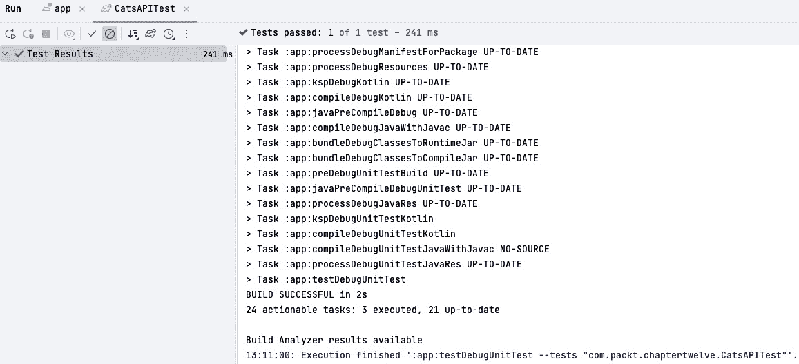
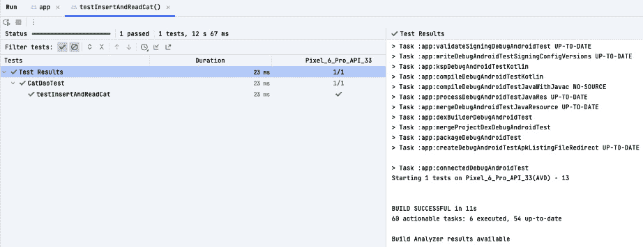
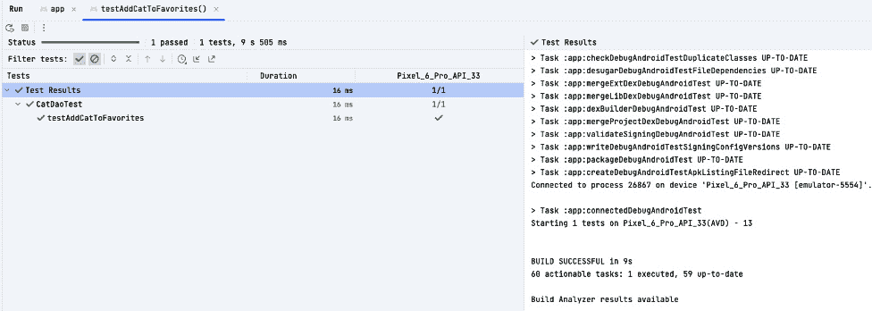

# 第十二章：测试您的应用

测试 Android 应用是开发过程中的一个关键方面，确保我们的应用按预期工作并满足用户期望。它帮助我们识别和修复在它们达到生产之前的问题，并确保我们的应用稳定且性能良好。本章将为您提供编写我们迄今为止创建的应用不同层的测试的技能。

在本章中，我们将学习如何为我们的**MVVM**（**模型-视图-视图模型**）架构中的不同层添加测试。我们将了解添加测试到我们的应用的重要性以及如何添加单元测试、集成测试和仪器测试。

在本章中，我们将涵盖以下主要主题：

+   测试的重要性

+   测试网络和数据库层

+   测试我们的`ViewModels`

+   将 UI 测试添加到我们的可组合组件中

# 技术要求

要遵循本章的说明，您需要下载 Android Studio Hedgehog 或更高版本([`developer.android.com/studio`](https://developer.android.com/studio))。

您可以使用上一章的代码来遵循本章的说明。您可以在[`github.com/PacktPublishing/Mastering-Kotlin-for-Android/tree/main/chaptertwelve`](https://github.com/PacktPublishing/Mastering-Kotlin-for-Android/tree/main/chaptertwelve)找到本章的代码。

# 测试的重要性

编写测试是应用开发的一个关键方面。它有以下好处：

+   它有助于我们在它们达到生产阶段之前**识别和修复错误**。当我们为我们的代码编写测试时，我们可以在早期阶段看到问题，并在它们到达用户之前快速修复它们，这通常成本很高。

+   **确保代码质量**。当我们编写测试时，我们被迫编写可测试的代码。这意味着我们编写的代码是模块化和松散耦合的。这使得我们的代码库更易于维护和协作。当我们发现难以测试的代码片段时，这是一个迹象，表明代码编写得不好，需要重构。

+   编写测试可以**提高文档和代码理解**。当我们编写测试时，我们被迫思考我们的代码是如何工作的以及应该如何使用。这使得其他开发者更容易理解我们的代码。虽然测试可以作为文档的一种形式，但它们不应取代适当的代码文档。

+   测试帮助我们**有信心地重构代码**。当我们有测试在位时，我们可以重构我们的代码，并确信我们没有破坏在重构之前工作良好的应用中的现有功能。这是因为我们可以运行我们的测试并查看它们是否通过或失败。

+   测试帮助我们**测试回归**，尤其是添加新功能或修改现有功能。测试确保现有的功能仍然按预期工作，并且没有出现任何问题。

这些只是提及的一小部分。写测试的好处还有很多，而实现这些好处的最佳方式就是开始为你的代码编写测试。需要注意的是，我们还可以将测试添加到我们的**持续集成/持续交付**（**CI/CD**）管道中，以确保在我们将代码推送到我们的仓库时，测试会自动运行。这也确保了在我们与其他人合作进行项目时，我们可以确信我们的代码始终处于良好状态，并且我们可以有信心地将代码部署到生产环境中。

在 Android 中，我们有一个称为**测试金字塔**的概念，它帮助我们理解我们可以为我们的应用程序编写的几种测试类型以及它们之间的关系。测试金字塔分为三个层次，如下面的图所示：



图 12.1 – 测试金字塔

如前图所示，我们有三个层次的测试：

+   **单元测试**：这些测试位于金字塔的底部。这些是测试单个代码单元的测试，它们在隔离状态下进行测试。单元测试旨在测试应用程序中最小的可测试部分——通常是方法和函数。它们运行速度最快，可靠性最高。它们也是编写和维护最简单的。单元测试仅在本地机器上运行。这些测试被编译为在**Java 虚拟机**（**JVM**）上本地运行，以最小化执行时间。对于依赖于你自己的依赖项的测试，我们使用模拟对象来提供外部依赖项。**MockK**和**Mockito**是流行的模拟依赖项的框架。

+   **集成测试**：这些测试位于金字塔的中间。它们测试不同的代码单元是如何协同工作的。它们的运行速度比单元测试慢。编写它们也很困难，因为它们需要多个组件和依赖项来工作和维护。**Roboletric**是编写集成测试的流行框架。

+   **UI 测试**：这些测试位于金字塔的顶部。它们测试我们应用程序的不同组件是如何协同工作的。由于它们在真实设备或模拟器上运行，所以运行速度最慢，可靠性最低。它们也是编写和维护成本最高的。有几个框架可以用来编写 UI 测试，包括**Espresso**、**UI Automator**和**Appium**。

测试金字塔提供了一种在代码库上分配我们编写的测试的方法。理想的分配百分比是**单元测试 70%**、**集成测试 20%**和**UI 测试 10%**。注意，当我们向上移动金字塔时，测试的数量会减少。这是因为当我们向上移动金字塔时，测试的编写和维护成本会更高。这就是为什么我们应该努力编写比集成测试更多的单元测试，以及比 UI 测试更多的集成测试。

在接下来的几节中，我们将为所讨论的不同层编写测试。让我们先从测试我们的应用程序中的数据库和网络层开始。

# 测试网络和数据库层

在本节中，我们将逐步学习如何编写对网络和数据库层的测试。

## 测试网络层

为了测试我们的网络层，我们将编写单元测试。然而，由于我们使用 Retrofit 进行网络请求，我们将使用`MockWebServer`来模拟网络请求。`MockWebServer`是一个允许我们模拟网络请求的库。让我们首先在我们的版本目录中设置测试依赖项：

1.  打开`libs.version.toml`文件，并在版本部分添加以下版本：

    ```java
    mockWebServer = "5.0.0-alpha.2"
    coroutinesTest = "1.7.3"
    truth = "1.1.5"
    ```

    我们正在设置`mockWebServer`、`coroutinesTest`和`truth`的版本。

1.  接下来，在库部分，添加以下内容：

    ```java
    test-mock-webserver = { module = "com.squareup.okhttp3:mockwebserver", version.ref = "mockWebServer" }
    test-coroutines = { module = "org.jetbrains.kotlinx:kotlinx-coroutines-test", version.ref = "coroutinesTest" }
    test-truth = { module = "com.google.truth:truth", version.ref = "truth" }
    ```

    在这里，我们正在添加这些库的依赖项。

1.  接下来，我们将创建一个包，以便一次性添加所有测试依赖项。在包部分，添加以下内容：

    ```java
    test = ["test-mock-webserver", "test-coroutines", "test-truth"]
    ```

1.  点击顶部的**立即同步**按钮以添加依赖项。

1.  最后，让我们转到应用程序级别的`build.gradle.kts`文件，并添加以下内容：

    ```java
    testImplementation(libs.bundles.test)
    ```

    这将把测试包添加到我们的测试目录中。

1.  点击**立即同步**按钮以将依赖项添加到我们的应用程序中。

在我们开始编写测试之前，我们需要做一些设置任务。首先，我们需要为测试将使用的请求创建一个 JSON 响应：

1.  要做到这一点，右键单击`app`目录，选择**新建**，然后在弹出对话框的底部选择**文件夹**。

1.  从提供的选项中选择`resources`，如图所示：



图 12.2 – 资源文件夹

1.  在这个文件夹内，让我们创建一个名为`catsresponse.json`的新 JSON 文件，并添加以下 JSON：

    ```java
    [
      {
        "_id": "eLjLV4oegWGFv9MH",
        "mimetype": "image/png",
        "size": 39927,
        "tags": [
          "cute",
          "pyret"
        ]
      },
      {
        "_id": "PA2gYEbMCzaiDrWv",
        "mimetype": "image/jpeg",
        "size": 59064,
        "tags": [
          "cute",
          "best",
          "siberian",
          "fluffy"
        ]
      },
      {
        "_id": "8PKU6iXscrogXrHm",
        "mimetype": "image/jpeg",
        "size": 60129,
        "tags": [
          "cute",
          "fat",
          "ragdoll",
          "beautiful",
          "sleeping"
        ]
      }
    ]
    ```

    我们的应用程序使用 Cat as a Service API，该 API 根据您应用的筛选条件返回猫的列表。API 以 JSON 响应的形式返回此猫列表，如前所述。在测试时，尤其是使用模拟数据时，JSON 响应的结构和数据类型应与真实 API 匹配，以确保我们的测试是正确的。

1.  现在我们有了准备好的响应，我们必须创建一个类来利用这个响应，以及在前面的图中所示的`com.packt.chaptertwelve (test)`目录中的测试类：



图 12.3 – 测试目录

1.  在`com.packt.chaptertwelve (test)`目录内，让我们创建一个名为`MockRequestDispatcher.kt`的新 Kotlin 文件，并添加以下代码：

    ```java
    import com.google.common.io.Resources
    import okhttp3.mockwebserver.Dispatcher
    import okhttp3.mockwebserver.MockResponse
    import okhttp3.mockwebserver.RecordedRequest
    import java.io.File
    import java.net.HttpURLConnection
    class MockRequestDispatcher : Dispatcher() {
        override fun dispatch(request: RecordedRequest): MockResponse {
            return when (request.path) {
                "/cats?tag=cute" -> {
                    MockResponse()
                        .setResponseCode(HttpURLConnection.HTTP_OK)
                        .setBody(getJson("catsresponse.json"))
                }
                else -> throw IllegalArgumentException("Unknown Request Path ${request.path}")
            }
        }
        private fun getJson(path: String): String {
            val uri = Resources.getResource(path)
            val file = File(uri.path)
            return String(file.readBytes())
        }
    }
    ```

    以下是前面代码的分解：

    +   我们创建了一个名为`MockRequestDispatcher`的类，它扩展了`Dispatcher`。这个类将用于模拟我们的网络请求。

    +   我们重写了 `dispatch` 函数，该函数接受 `RecordedRequest` 并返回 `MockResponse`。当向服务器发出请求时，将调用此函数。

    +   我们检查请求的路径，如果它与我们的请求路径匹配，我们返回带有响应代码 `200` 和我们之前创建的 `Json` 响应体的 `MockResponse`。目前，我们只模拟了成功的响应，但处理所有不同的 HTTP 响应代码和错误情况对于正确模拟现实世界场景非常重要。

    +   如果路径不匹配，我们将抛出 `IllegalArgumentException`。

    +   最后，我们创建了一个 `getJson` 函数，它接受一个路径并返回一个 `String` 实例类型。这个函数用于读取我们之前创建的文件中的 `Json` 响应。

    我们可以添加任意多的路径到这个类中。由于我们的项目只有一个路径，所以我们只需要这些。

1.  接下来，让我们创建我们的测试类。让我们创建一个名为 `CatsAPITest.kt` 的新 Kotlin 文件，并添加以下代码：

    ```java
    class CatsAPITest {
        private lateinit var mockWebServer: MockWebServer
        private lateinit var catsAPI: CatsAPI
        @Before
        fun setup() {
            // Setup MockWebServer
            mockWebServer = MockWebServer()
            mockWebServer.dispatcher = MockRequestDispatcher()
            mockWebServer.start()
            // Setup Retrofit
            val json = Json {
                ignoreUnknownKeys = true
                isLenient = true
            }
            val retrofit = Retrofit.Builder()
                .baseUrl(mockWebServer.url("/"))
                .addConverterFactory(
                    json.asConverterFactory(
                        contentType = "application/json".toMediaType()
                    )
                )
                .build()
            catsAPI = retrofit.create(CatsAPI::class.java)
        }
        @Test
        fun `fetchCats() returns a list of cats`() = runTest {
            val response = catsAPI.fetchCats("cute")
            assert(response.isSuccessful)
        }
        @After
        @Throws(IOException::class)
        fun tearDown() {
            mockWebServer.shutdown()
        }
    }
    ```

    下面是对前面代码的分解：

    +   我们创建了一个名为 `CatsAPITest` 的类。这个类将用于测试我们的网络层。

    +   我们创建了两个变量：`mockWebServer` 和 `catsAPI`。`mockWebServer` 变量将用于模拟我们的网络请求。`catsAPI` 变量将用于发送我们的网络请求。

    +   我们有 `setup()` 函数，该函数被 `@Before` 注解标记。这意味着这个函数将在我们的测试运行之前运行。在这个函数中，我们做了以下操作：

        +   我们创建了一个 `MockWebServer` 实例并将其分配给 `mockWebServer` 变量。然后我们将 `mockWebServer` 的调度程序设置为 `MockRequestDispatcher` 的一个实例。这是我们之前创建的类。然后我们启动 `mockWebServer`。

        +   我们创建了一个 Retrofit 实例并添加了 `kotlinx-serialization-converter` 工厂。然后我们将 `catsAPI` 变量分配给 `CatsAPI` 的一个实例。

    +   我们有我们的测试函数，该函数被 `@Test` 注解标记。这意味着这个函数将被作为测试运行。在这个函数中，我们做了以下操作：

        +   我们将测试包裹在 `runTest()` 函数中。这是因为我们想要测试挂起函数。`runTest` 是一个协程测试构建器，专为测试协程设计。它是我们之前添加的 `kotlinx-coroutines-test` 库的一部分。

        +   我们使用之前创建的 `catsAPI` 实例向 `mockWebServer` 发送网络请求。然后我们断言响应是成功的。

        +   我们有 `tearDown()` 函数，该函数被 `@After` 注解标记。这意味着这个函数将在我们的测试运行之后运行。这个函数用于关闭我们的 `mockWebServer` 实例。

1.  按下测试类旁边的绿色 *运行* 图标来运行我们的测试。我们应该在 **运行** 窗口中看到以下输出：



图 12.4 – 测试通过

如前图所示，我们的测试运行成功。这意味着我们的网络层按预期工作。我们现在可以继续测试我们的数据库层。

## 测试数据库层

我们使用以下图所示的 `androidTest` 目录：


图 12.5 – Android 测试目录

让我们创建一个名为 `CatsDaoTest.kt` 的新文件，并添加以下代码：

```java
@RunWith(AndroidJUnit4::class)
class CatDaoTest {
    private lateinit var database: CatDatabase
    private lateinit var catDao: CatDao
    @Before
    fun createDatabase() {
        database = Room.inMemoryDatabaseBuilder(
            ApplicationProvider.getApplicationContext(),
            CatDatabase::class.java
        ).allowMainThreadQueries().build()
        catDao = database.catDao()
    }
    @After
    fun closeDatabase() {
        database.close()
    }
}
```

下面是对前面代码的分解：

+   我们创建了两个变量：`database` 和 `catDao`。`database` 变量将用于创建我们数据库的实例。`catDao` 变量将用于创建我们 `CatDao` 接口的实例。

+   我们有 `createDatabase()` 函数，该函数带有 `@Before` 注解。这意味着这个函数将在我们的测试运行之前运行。在函数内部，我们创建我们数据库的实例并将其分配给 `database` 变量。我们使用的是内存数据库。

+   我们有 `closeDatabase()` 函数，该函数带有 `@After` 注解。这意味着这个函数将在我们的测试运行之后运行。此函数用于关闭我们的数据库。

完成这些后，我们现在可以开始编写我们的测试：

1.  在 `CatsDaoTest` 类中，添加以下测试函数：

    ```java
    @Test
    fun testInsertAndReadCat() = runTest {
        // Given a cat
        val cat = CatEntity(
            id = "1",
            owner = "John Doe",
            tags = listOf("cute", "fluffy"),
            createdAt = "2021-07-01T00:00:00.000Z",
            updatedAt = "2021-07-01T00:00:00.000Z",
            isFavorite = false
        )
        // Insert the cat to the database
        catDao.insert(cat)
        // Then the cat is in the database
        val cats = catDao.getCats()
        assert(cats.first().contains(cat))
    }
    ```

    在这个测试中，我们创建了一个包含猫详细信息的 `CatEntity` 对象。然后我们将猫的详细信息插入到数据库中。最后，我们断言猫的详细信息在数据库中。

1.  点击测试类旁边的绿色 *运行* 图标来运行我们的测试。你应该在 **运行** 窗口中看到以下输出：



图 12.6 – 插入和从数据库读取的测试

我们的测试运行成功。这意味着我们的数据库层按预期工作。让我们添加另一个测试来测试将猫添加到收藏夹。

1.  仍然在 `CatsDaoTest` 类内部，让我们添加以下测试函数：

    ```java
    @Test
    fun testAddCatToFavorites() = runTest {
        // Given a cat
        val cat = CatEntity(
            id = "1",
            owner = "John Doe",
            tags = listOf("cute", "fluffy"),
            createdAt = "2021-07-01T00:00:00.000Z",
            updatedAt = "2021-07-01T00:00:00.000Z",
            isFavorite = false
        )
        // Insert the cat to the database
        catDao.insert(cat)
        // Favorite the cat
        catDao.update(cat.copy(isFavorite = true))
        // Assert that the cat is in the favorite list
        val favoriteCats = catDao.getFavoriteCats()
        assert(favoriteCats.first().contains(cat.copy(isFavorite = true)))
    }
    ```

    在这个测试中，我们创建了一个包含猫详细信息的 `CatEntity` 对象。然后我们将猫插入到数据库中。然后我们更新 `CatEntity` 对象，将 `isFavorite` 作为 `true` 传递。最后，我们断言猫在收藏列表中。

1.  点击测试类旁边的绿色 *运行* 图标来运行我们的测试。你应该在 **运行** 窗口中看到以下输出：



图 12.7 – 收藏猫测试

我们的测试运行成功。这意味着我们添加猫到收藏夹的功能工作正常。

我们已经看到了如何测试我们的网络和数据库层。接下来，让我们测试我们的 ViewModel 层。

# 测试我们的 ViewModels

我们的 `ViewModel` 类从仓库获取数据并将其暴露给 UI。为了测试我们的 `ViewModel`，我们将编写单元测试。让我们从在我们的版本目录中设置测试依赖项开始：

1.  打开 `libs.version.toml` 文件，并在版本部分添加以下版本：

    ```java
    mockk = "1.13.3"
    ```

1.  接下来，在库部分，添加以下内容：

    ```java
    test-mockk = { module = "io.mockk:mockk", version.ref = "mockk" }
    ```

1.  将 `test-mockk` 依赖项添加到 `test` 包中。我们的更新后的 `test` 包现在应该看起来像这样：

    ```java
    test = ["test-mock-webserver", "test-coroutines", "test-truth", "test-mockk"]
    ```

1.  点击 `mockk` 允许我们模拟我们的依赖项。

1.  我们现在准备好创建测试类。在测试目录中创建一个新的 Kotlin 文件，命名为 `CatsViewModelTest.kt`，并添加以下代码：

    ```java
    class PetsViewModelTest {
        private val petsRepository = mockk<PetsRepository>(relaxed = true)
        private lateinit var petsViewModel: PetsViewModel
        @Before
        fun setup() {
            Dispatchers.setMain(Dispatchers.Unconfined)
            petsViewModel = PetsViewModel(petsRepository)
        }
        @After
        fun tearDown() {
            Dispatchers.resetMain()
        }
    }
    ```

    下面是对前面代码的分解：

    +   我们创建了两个变量：`petsRepository` 和 `petsViewModel`。`petsRepository` 变量将用于模拟我们的 `PetsRepository` 接口。我们使用 `mockk<PetsRepository>` 提供了一个 `PetsRepository` 的模拟实例。`petsViewModel` 变量将用于创建 `PetsViewModel` 的一个实例。

    +   我们有 `setup()` 函数，该函数被 `@Before` 注解标记。这意味着这个函数将在我们的测试运行之前执行。我们将主分发器设置为 `Dispatchers.Unconfined`。这是因为我们在 ViewModel 中使用协程。然后我们将 `petsViewModel` 属性赋值给 `PetsViewModel` 的一个实例。

    +   我们有 `tearDown()` 函数，该函数被 `@After` 注解标记。这意味着这个函数将在我们的测试运行之后执行。这个函数用于重置主分发器。

这样，我们就准备好编写测试了。在 `tearDown()` 函数下方，添加以下测试函数：

```java
@Test
fun testGetPets() = runTest {
    val cats = listOf(
        Cat(
            id = "1",
            owner = "John Doe",
            tags = listOf("cute", "fluffy"),
            createdAt = "2021-07-01T00:00:00.000Z",
            updatedAt = "2021-07-01T00:00:00.000Z",
            isFavorite = false
        )
    )
    // Given
    coEvery { petsRepository.getPets() } returns flowOf(cats)
    // When
    petsViewModel.getPets()
    coVerify { petsRepository.getPets() }
    // Then
    val uiState = petsViewModel.petsUIState.value
    assertEquals(cats, uiState.pets)
}
```

在这个测试函数中，我们创建了一个猫的列表。然后我们模拟 `PetsRepository` 的 `getPets()` 函数以返回一个猫的流。它返回一个猫的流，因为我们的 `PetsRepository` 中的 `getPets()` 函数返回 `Flow<List<Cat>>`；这样，我们模拟了该函数的正确行为。然后我们调用 `PetsViewModel` 的 `getPets()` 函数。然后我们断言 `PetsRepository` 的 `getPets()` 函数被调用。最后，我们断言我们创建的猫列表与从 `PetsViewModel` 获取的猫列表相同。记住，如果尝试访问 `getPets()` 函数时出现错误，请从我们的 `PetsViewModel` 类中移除私有标记。点击测试类旁边的绿色 *运行* 图标以运行我们的测试。你应该在 **运行** 窗口中看到以下输出：


图 12.8 – PetsViewModelTest

我们的测试运行成功。这意味着我们的 `ViewModel` 层按预期工作。现在我们可以继续测试我们的 UI 层。在下一节中，我们将学习如何在 Jetpack Compose 中编写 UI 测试。

# 将 UI 测试添加到我们的可组合项中

编写 UI 测试对我们来说变得更容易了。Jetpack Compose 提供了一套测试 API，用于查找元素、验证它们的属性，并在这些元素上执行操作。Jetpack Compose 使用 `PetListItem` 可组合项。

让我们转到 `PetListItem.kt` 文件。我们需要在我们的可组合项中添加一个 `testTags` 修饰符。这是因为我们正在使用标签来识别我们的可组合项。在 `PetListItem` 可组合项中，修改可组合项内容如下：

```java
ElevatedCard(
    modifier = Modifier
        .fillMaxWidth()
        .padding(6.dp)
        .testTag("PetListItemCard"),
) {
    Column(
        modifier = Modifier
            .fillMaxWidth()
            .padding(bottom = 10.dp)
            .testTag("PetListItemColumn")
            .clickable {
                onPetClicked(cat)
            }
    ) {
        AsyncImage(
            model = "https://cataas.com/cat/${cat.id}",
            contentDescription = "Cute cat",
            modifier = Modifier
                .fillMaxWidth()
                .height(200.dp),
            contentScale = ContentScale.FillWidth
        )
        Row(
            modifier = Modifier
                .padding(start = 6.dp, end = 6.dp)
                .fillMaxWidth(),
            verticalAlignment = Alignment.CenterVertically,
            horizontalArrangement = Arrangement.SpaceBetween
        ) {
            FlowRow(
                modifier = Modifier
                    .padding(start = 6.dp, end = 6.dp)
            ) {
                repeat(cat.tags.size) {
                    SuggestionChip(
                        modifier = Modifier
                            .padding(start = 3.dp, end = 3.dp),
                        onClick = { },
                        label = {
                            Text(text = cat.tags[it])
                        }
                    )
                }
            }
            Icon(
                modifier = Modifier
                    .testTag("PetListItemFavoriteIcon")
                    .clickable {
                        onFavoriteClicked(cat.copy(isFavorite = !cat.isFavorite))
                    },
                imageVector = if (cat.isFavorite) {
                    Icons.Default.Favorite
                } else {
                    Icons.Default.FavoriteBorder
                },
                contentDescription = "Favorite",
                tint = if (cat.isFavorite) {
                    Color.Red
                } else {
                    Color.Gray
                }
            )
        }
    }
}
```

注意我们已经为我们的组件添加了 `testTag()` 修饰符。有了这个修饰符，我们能够使用 Jetpack Compose 的 Finders API 来找到我们的可组合项。一旦我们使用了查找器，我们就可以对可组合项执行操作并断言。现在让我们在我们的 `androidTest` 目录中创建一个名为 `PetListItemTest.kt` 的新文件，并添加以下代码：

```java
class PetListItemTest {
    @get:Rule
    val composeTestRule = createComposeRule()
    @Test
    fun testPetListItem() {
        with(composeTestRule) {
            setContent {
                PetListItem(
                    cat = Cat(
                        id = "1",
                        owner = "John Doe",
                        tags = listOf("cute", "fluffy"),
                        createdAt = "2021-07-01T00:00:00.000Z",
                        updatedAt = "2021-07-01T00:00:00.000Z",
                        isFavorite = false
                    ),
                    onPetClicked = { },
                    onFavoriteClicked = {})
            }
            // Assertions using tags
            onNodeWithTag("PetListItemCard").assertExists()
            onNodeWithTag("PetListItemColumn").assertExists()
            onNodeWithTag("PetListItemFavoriteIcon").assertExists()
            // Assertions using text
            onNodeWithText("fluffy").assertIsDisplayed()
            onNodeWithContentDescription("Favorite").assertIsDisplayed()
            onNodeWithContentDescription("Cute cat").assertIsDisplayed()
            // Actions
            onNodeWithTag("PetListItemFavoriteIcon").performClick()
        }
    }
}
```

下面是对前面代码的分解：

+   我们创建了一个名为 `PetListItemTest` 的类。我们将使用这个类来测试我们的 `PetListItem` 可组合项。在这个类内部，我们创建了一个名为 `composeTestRule` 的规则。这个规则将用于创建我们的可组合项。通过这个规则，我们可以设置 Compose 内容或访问我们的活动。

+   我们有一个被 `@Test` 注解的 `testPetListItem()` 函数，这个函数中发生了几件事情：

    +   我们使用了 `with` 范围函数来能够使用 `composeTestRule`。然后我们设置了我们的可组合项的内容。在这种情况下，是我们想要测试的 `PetListItem` 可组合项。我们向我们的可组合项传递了一个 `cat` 对象。

    +   我们使用 `onNodeWithTag()` 函数来找到我们的可组合项。然后我们使用 `assertExists()` 函数来断言可组合项的存在。这将使用我们之前添加的标签来找到我们的可组合项。

    +   我们使用 `onNodeWithText()` 函数来找到我们的可组合项。然后我们使用 `assertIsDisplayed()` 函数来断言可组合项的存在。我们还使用了 `onNodeWithContentDescription()` 函数来找到我们的可组合项。这两个函数帮助我们找到文本或内容描述与传递给函数的文本或内容描述匹配的可组合项。

    +   最后，我们使用 `performClick()` 函数对我们的可组合项执行操作。在这种情况下，我们对我们 `PetListItemFavoriteIcon` 可组合项执行点击操作。

点击我们测试类旁边的绿色 *运行* 图标来运行我们的测试。我们应该在 **运行** 窗口中看到以下输出：


图 12.9 – Jetpack Compose UI 测试

我们的测试运行成功。此外，测试也在我们正在工作的设备上运行。我们还能看到组件的显示和执行的操作。

我们已经看到了如何在 Jetpack Compose 中编写 UI 测试。要了解更多关于 Jetpack Compose 的测试信息，请查看官方文档([`developer.android.com/jetpack/compose/testing`](https://developer.android.com/jetpack/compose/testing))。凭借我们在本章中获得的知识，我们可以为我们的应用的不同层添加更多测试。你可以尝试添加更多测试来检验你的知识。

# 摘要

在本章中，我们学习了如何为我们的 MVVM 架构中的不同层添加测试。我们了解了添加测试到我们的应用的重要性，以及如何添加单元测试、集成测试和仪器测试。

在下一章中，我们将逐步学习如何在 Google Play 商店发布一款新应用。我们将详细介绍如何创建签名应用包以及发布我们第一个应用到 Play Store 所需的事项。此外，我们还将了解一些 Google Play 商店政策以及如何始终保持合规，以避免我们的应用被移除或账户被封禁。

# 第四部分：发布您的应用

在成功开发您的应用之后，下一阶段的内容将在本部分展开。您将了解如何将应用发布到 Google Play 商店的细节，以及如何通过遵守关键的 Google Play 商店政策来确保发布过程顺利。您还将深入了解**持续集成与持续部署**（**CI/CD**）领域，解锁自动化 Android 开发中常规任务的潜力。您将学习如何将第三部分中的测试和代码分析工具无缝集成到您的 CI/CD 管道中，从而简化开发工作流程。为了结束本部分，您将通过整合崩溃报告工具来提升应用性能，并通过实施推送通知来增强用户参与度，并学习一些有关如何确保应用安全的有用提示。

本节包含以下章节：

+   *第十三章*, *发布您的应用*

+   *第十四章*, *持续集成与持续部署*

+   *第十五章*, *改进您的应用*
