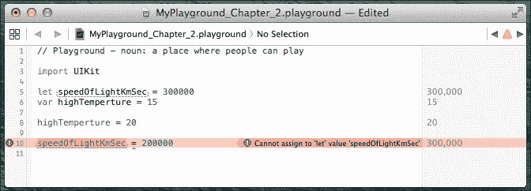
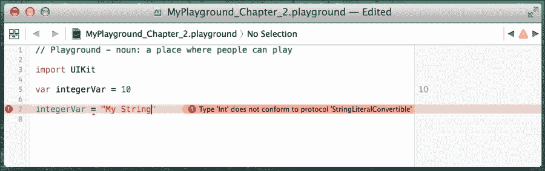
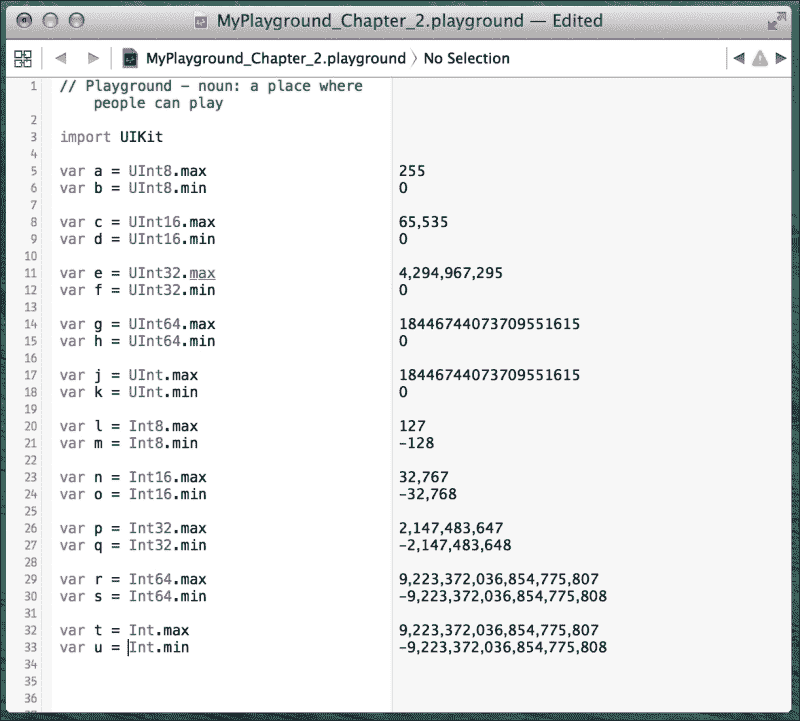
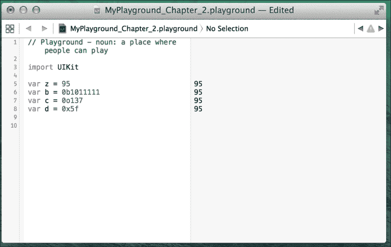
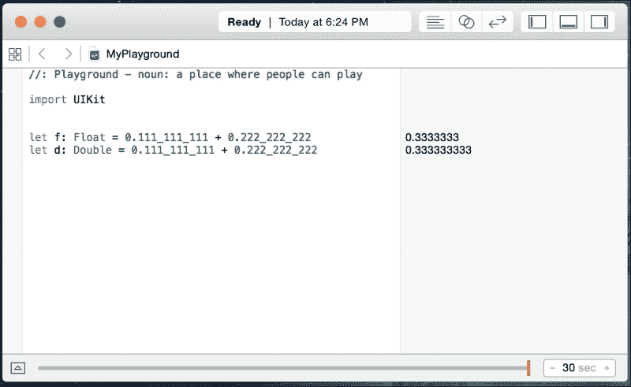
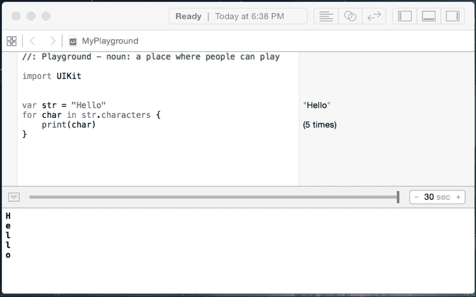
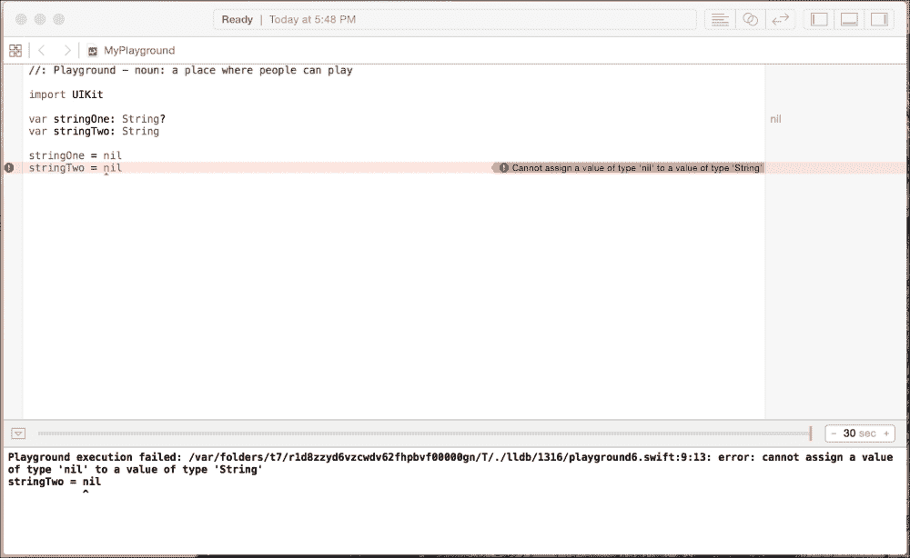
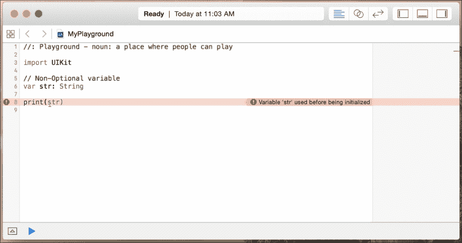
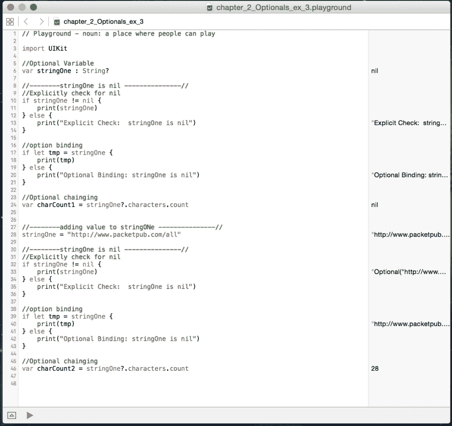

# 第二章：学习变量、常量、字符串和操作符

我写的第一个程序是用 BASIC 编程语言编写的，是一个典型的 Hello World 应用程序。这个应用程序一开始非常令人兴奋，但打印静态文本的兴奋感很快就消失了。对于我的第二个应用程序，我使用了 BASIC 的输入命令来提示用户输入姓名，然后打印出包含用户姓名的定制问候消息。12 岁时，显示“Hello Han Solo”非常酷。这个应用程序引导我创建了无数类似 Mad Lib 的应用程序，这些应用程序会提示用户输入各种单词，然后在用户输入所有必需的单词后，将这些单词放入显示的故事中。这些应用程序让我了解了变量的重要性。从那时起，我创建的每个有用的应用程序都使用了变量。

在本章中，我们将涵盖以下主题：

+   变量和常量的定义

+   显式类型和隐式类型之间的区别

+   解释数字、字符串和布尔类型

+   定义可选类型

+   解释 Swift 中枚举的工作原理

+   解释 Swift 操作符的工作原理

# 常量和变量

常量和变量将一个标识符（如 `myName` 或 `currentTemperature`）与特定类型的值（如 `String` 或 `Int`）关联起来，其中标识符可以用来检索值。常量和变量之间的区别在于，变量可以被更新或更改，而一旦为常量分配了值，它就不能被更改。

常量适用于定义那些你知道永远不会改变的值，例如水的冰点或光速。常量也适用于定义我们在整个应用程序中多次使用的值，例如标准字体大小或缓冲区中的最大字符数。本书中将有多个常量示例。

变量在软件开发中比常量更常见。这主要是因为开发者倾向于更喜欢变量而不是常量。在 Swift 2 和 Xcode 7 中，如果我们声明了一个永远不会改变的变量，我们会收到警告。这应该会增加常量的使用。我们可以不使用常量来创建有用的应用程序（尽管使用它们是一种好习惯）；然而，没有变量几乎不可能创建一个有用的应用程序。

### 注意

在 Swift 中鼓励使用常量。如果我们不期望或不想值发生变化，我们应该将其声明为常量。这为我们的代码添加了一个非常重要的安全约束，确保值永远不会改变。

你几乎可以在变量或常量的标识符中使用任何字符（甚至 Unicode 字符）；然而，你必须遵循一些规则：

+   标识符不能包含任何空白字符

+   标识符不能包含任何数学符号

+   标识符不能包含任何箭头

+   标识符不能包含私有用途或无效的 Unicode 字符

+   标识符不能包含行或框绘制字符

+   标识符不能以数字开头，但可以包含数字

+   如果你将 Swift 关键字用作标识符，请用反引号包围它

### 注意

关键字是 Swift 编程语言使用的单词。在本章中，你将看到的几个关键字示例是 `var` 和 `let`。你应该避免使用 Swift 关键字作为标识符，以避免阅读代码时产生混淆。

## 定义常量和变量

常量和变量在使用之前必须定义。要定义一个常量，你使用关键字 `let`，要定义一个变量，你使用关键字 `var`。以下是一些常量和变量的示例：

```swift
// Constants
let freezingTemperatureOfWaterCelsius = 0
let speedOfLightKmSec = 300000

// Variables
var currentTemperature = 22
var currentSpeed = 55
```

我们可以在一行中声明多个常量或变量，通过逗号分隔它们。例如，我们可以将前面的四行代码缩减为两行，如下所示：

```swift
// Constants
let freezingTempertureOfWaterCelsius = 0, speedOfLightKmSec = 300000

// Variables
var currentTemperture = 22, currentSpeed = 55
```

我们可以将变量的值更改为兼容类型的另一个值；然而，正如我们之前提到的，我们不能更改常量的值。让我们看看以下 Playgrounds。你能从以下截图显示的错误消息中告诉代码有什么问题吗？



你弄清楚代码哪里出问题了吗？任何物理学家都会告诉你，我们无法改变光速，在我们的代码中，`speedOfLightKmSec` 变量是一个常量，所以我们也不能改变它。因此，当我们尝试改变 `speedOfLightKmSec` 常量时，会报告一个错误。我们能够不报错地改变 `highTemperture` 变量的值，因为它是一个变量。我们提到变量和常量的区别好几次，因为这是一个非常重要的概念，尤其是在我们定义可变和不可变集合类型时，这在第三章，*使用集合和 Cocoa 数据类型*中尤为重要。

## 类型安全

Swift 是一种类型安全的语言。在类型安全的语言中，我们必须清楚地了解存储在变量中的值的类型。如果我们尝试将错误类型的值分配给变量，我们将得到一个错误。以下 Playgrounds 展示了如果我们尝试将字符串值放入期望整数值的变量中会发生什么；注意，我们将在本章稍后讨论最流行的类型：



Swift 在编译代码时执行类型检查；因此，它将用错误标记任何不匹配的类型。这个 Playgrounds 中的错误消息清楚地解释了我们在尝试将字符串字面量插入到整数变量中。

所以问题是，Swift 如何知道 `integerVar` 是 Int 类型？Swift 使用类型推断来确定合适的类型。让我们看看什么是类型推断。

## 类型推断

类型推断允许我们在定义变量时省略变量类型。编译器将根据初始值推断类型。例如，在 Objective-C 中，我们会这样定义一个整数：

```swift
int myInt = 1
```

这告诉编译器 `myInt` 变量是 Int 类型，初始值是数字 `1`。在 Swift 中，我们会这样定义相同的整数：

```swift
var myInt = 1
```

Swift 推断变量类型是整数，因为初始值是整数。让我们看看几个更具体的例子：

```swift
var x = 3.14      // Double type
var y = "Hello"   // String type
var z = true      // Boolean type
```

在前面的例子中，编译器将正确推断变量 `x` 是 Double，变量 `y` 是 String，变量 `z` 是 Boolean，基于初始值。

## 显式类型

类型推断是 Swift 中一个非常棒的功能，你可能会很快习惯它；然而，有时我们可能希望显式定义变量的类型。例如，在前面的例子中，变量 `x` 被推断为 `Double`，但如果我们想将变量类型设置为 `Float` 呢？我们可以像这样显式定义变量类型：

```swift
var x : Float = 3.14
```

注意变量标识符后面的 `: Float`（冒号和单词 `Float`）；这告诉编译器将变量定义为 `Float` 类型，并给它一个初始值 `3.14`。当我们以这种方式定义变量时，我们需要确保初始值与我们要定义的变量类型相同。如果我们尝试给变量一个初始值，即与我们定义的类型不同的类型，我们将收到一个错误。

如果我们没有设置初始值，我们也会显式定义变量类型。例如，以下代码行是无效的，因为编译器不知道将变量 `x` 设置为哪种类型：

```swift
var x
```

如果我们在应用程序中使用此代码，我们将收到一个 `Type annotation missing in pattern` 错误。如果我们没有为变量设置初始值，我们必须像这样定义类型：

```swift
var x: Int
```

现在我们已经看到了如何显式定义变量类型，让我们来看看一些最常用的类型。

## 数值类型

Swift 包含许多适合存储各种整数和浮点值的标准数值类型。

### 整数

整数是一个整数。整数可以是带符号的（正数、负数或零）或无符号的（正数或零）。Swift 提供了多种不同大小的整数类型。以下图表显示了不同整数类型的值范围：

| 类型 | 最小值 | 最大值 |
| --- | --- | --- |
| Int8 | -128 | 127 |
| Int16 | -32,768 | 32,767 |
| Int32 | -2,147,483,648 | 2,147,483,647 |
| Int64 | - 9,223,372,036,854,775,808 | 9,223,372,036,854,775,807 |
| Int | - 9,223,372,036,854,775,808 | 9,223,372,036,854,775,807 |
|   |   |   |
| UInt8 | 0 | 255 |
| UInt16 | 0 | 65,535 |
| UInt32 | 0 | 4,294,967,295 |
| UInt64 | 0 | 18,446,744,073,709,551,615 |
| UInt | 0 | 18,446,744,073,709,551,615 |

### 提示

除非有特定的理由来定义整型的大小，否则我建议使用标准的 `Int` 或 `UInt` 类型。这将让您免于需要在不同的整型类型之间进行转换。

在 Swift 中，Int（以及其他数值类型）实际上是命名类型，使用 Swift 标准库中的结构体实现。这为我们提供了对所有数据类型以及我们可以访问的属性进行内存管理的一致机制。对于前面的图表，我使用 `min` 和 `max` 属性检索了每种整型类型的最大和最小值。请查看以下 Playground，看看我是如何检索这些值的：



整数也可以表示为二进制、八进制和十六进制数。我们只需在数字前添加一个前缀，告诉编译器数字应该使用哪种基数。以下图表显示了每种数值基数的前缀：

| 基数 | 前缀 |
| --- | --- |
| 十进制 | 无 |
| 二进制 | 0b |
| 八进制 | 0o |
| 十六进制 | 0x |

以下 Playground 展示了数字 `95` 在每种数值基数中的表示方式：



Swift 还允许我们在数值字面量中插入任意下划线。这可以提高我们代码的可读性。例如，如果我们正在定义光速，这是一个常数，我们可以这样定义它：

```swift
let speedOfLightKmSec = 300_000
```

Swift 会忽略这些下划线；因此，它们不会以任何方式影响数值字面量的值。

### 浮点数

浮点数是带有小数部分的数字。Swift 中有两种标准的浮点数类型：Float 和 Double。Float 表示 32 位浮点数，而 Double 表示 64 位浮点数。Swift 还支持扩展的浮点数类型，即 **Float80**。Float80 类型是一个 80 位浮点数。

建议我们使用 Double 类型而不是 Float 类型，除非有特定的理由使用后者。Double 类型至少有 15 位十进制数字的精度，而 Float 类型的精度可能低至六位十进制数字。让我们看看一个例子，看看这如何在不为我们所知的情况下影响我们的应用程序。以下截图显示了如果我们将两个十进制数字相加并将结果放入 Float 类型和 Double 类型中的结果：



如从截图所示，我们相加的两个十进制数字在十进制点后有九位数字；然而，Float 类型的结果只包含七位数字，而 Double 类型的结果包含完整的九位数字。

如果我们在处理货币或其他需要精确计算的数字时精度丢失，可能会引发问题。浮点精度问题并不仅限于 Swift；所有实现 IEEE 754 浮点标准的语言都有类似的问题。最佳实践是，除非有特定原因不这样做，否则使用 Double 来表示浮点数。

如果我们有两个变量，一个是 Int 类型，另一个是 Double 类型？你认为我们能否像以下代码所示那样将它们相加：

```swift
var a : Int = 3
var b : Double = 0.14
var c = a + b
```

如果我们将前面的代码放入 Playground 中，我们会收到以下错误：`binary operator '+' cannot be applied to operands of type 'Int' and 'String'`

这个错误告诉我们我们正在尝试将两种不同类型的数字相加，这是不允许的。要将 Int 和 Double 相加，我们需要将 Int 值转换为 Double 值。以下代码展示了如何将 Int 值转换为 Double 值以便我们可以将它们相加：

```swift
var a : Int = 3
var b : Double = 0.14
var c = Double(a) + b
```

注意我们是如何使用`Double()`函数将 Int 值转换为 Double 值的。Swift 中的所有数值类型都有一个类似于前面代码示例中的`Double()`函数的便利初始化器。例如，以下代码展示了如何将`Int`变量转换为`Float`和`UInt16`变量：

```swift
var intVar = 32
var floatVar = Float(intVar)
var uint16Var = UInt16(intVar)
```

## 布尔类型

布尔值通常被称为逻辑值，因为它们可以是`true`或`false`。Swift 有一个内置的布尔类型叫做 Bool，它接受两个内置布尔常量之一。这些常量是`true`和`false`。

布尔常量和变量可以定义为如下所示：

```swift
let swiftIsCool = true
let swiftIsHard = false

var itIsWarm = false
var itIsRaining = true
```

布尔值在处理条件语句，如`if`和`while`时特别有用。例如，你认为以下代码会做什么：

```swift
let isSwiftCool = true
let isItRaining = false
if (isSwiftCool) {
    print("YEA, I cannot wait to learn it")
}
if (isItRaining) {
    print("Get a rain coat")
}
```

如果你回答说这段代码会打印出`YEA, I cannot wait to learn it`，那么你就对了。因为`isSwiftCool`被设置为 true，所以会打印出`YEA, I cannot wait to learn it`信息，但`isItRaining`是 false；因此，不会打印出`Get a rain coat`信息。

你也可以像这样从比较运算符中分配布尔值：

```swift
var x = 2, y = 1
var z = x > y
```

在前面的代码中，`z`是一个包含布尔`true`值的布尔变量，因为`2`大于`1`。

## 字符串类型

字符串是一个有序字符集合，例如`Hello`或`Swift`。在 Swift 中，字符串类型表示字符串。我们已经在这本书中看到了几个字符串的例子，所以以下代码应该看起来很熟悉。此代码展示了如何定义两个字符串：

```swift
var stringOne = "Hello"
var stringTwo = " World"
```

由于字符串是一个字符的有序集合，我们可以遍历字符串中的每个字符。以下代码展示了如何实现这一点：

```swift
varstringOne = "Hello"
for char in stringOne.characters {
    print(char)
}
```

以下代码将显示以下截图所示的结果：



有两种方法可以将一个字符串添加到另一个字符串中。我们可以连接它们或内联包含它们。要连接两个字符串，我们使用`+`或`+=`运算符。以下代码展示了如何连接两个字符串。第一个示例将`stringB`追加到`stringA`的末尾，并将结果放入新的`stringC`变量中。第二个示例直接将`stringB`追加到`stringA`的末尾，而不创建新的字符串：

```swift
var stringC = stringA + stringB
stringA += stringB
```

要将一个字符串内联包含在另一个字符串中，我们使用一个特殊的字符序列`\( )`。以下代码展示了如何将字符串内联包含在另一个字符串中：

```swift
var stringA = "Jon"
var stringB = "Hello \(stringA)"
```

在上一个示例中，`stringB`将包含消息`Hello Jon`，因为 Swift 会将`\(stringA)`字符序列替换为`stringA`的值。

在 Swift 中，我们使用`var`和`let`关键字来定义变量和集合的可变性。如果我们使用`var`定义一个字符串为变量，则该字符串是可变的；这意味着我们可以更改和编辑字符串的值。如果我们使用`let`定义一个字符串为常量，则该字符串是不可变的，这意味着一旦设置，我们无法更改或编辑其值。以下代码展示了可变字符串和不可变字符串之间的区别：

```swift
var x = "Hello"
let y = "HI"
var z = " World"

//This is valid, x is mutable
x += z

//This is invalid, y is not mutable.
y += z
```

Swift 中的字符串有三个计算属性，可以将字符串的字母大小写进行转换。这些属性是`capitalizedString`、`lowercaseString`和`uppercaseString`。以下示例演示了这些属性：

```swift
var stringOne = "hElLo"
print("capitalizedString:  " + stringOne.capitalizedString)
print("lowercaseString:  " + stringOne.lowercaseString)
print("uppercaseString:  " + stringOne.uppercaseString)
```

如果我们运行此代码，结果将如下所示：

```swift
capitalizedString:  Hello
lowercaseString:  hello
uppercaseString:  HELLO
```

Swift 提供了四种比较字符串的方法；这些是`string equality`（字符串相等性）、`prefix equality`（前缀相等性）、`suffix equality`（后缀相等性）和`isEmpty`（是否为空）。以下示例演示了这些方法：

```swift
var stringOne = "Hello Swift"
var stringTwo = ""
stringOne.isEmpty  //false
stringTwo.isEmpty  //true
stringOne == "hello swift"  //false
stringOne == "Hello Swift"  //true
stringOne.hasPrefix("Hello")  //true
stringOne.hasSuffix("Hello")  //false
```

我们可以用另一个字符串替换目标字符串的所有出现。这是通过`stringByReplacingOccurrencesOfString()`方法完成的。以下代码演示了这一点：

```swift
var stringOne = "one,to,three,four"
print(stringOne.stringByReplacingOccurrencesOfString("to", withString: "two"))
```

上述示例将打印`one`,`two`,`three`,`four`到屏幕上，因为我们正在将所有`to`的出现替换为`two`。

我们也可以从我们的字符串中检索子字符串和单个字符。以下示例展示了各种实现方式：

```swift
var path = "/one/two/three/four"
//Create start and end indexes
var startIndex = path.startIndex.advancedBy(4)
var endIndex = path.startIndex.advancedBy(14)
path.substringWithRange(Range(start:startIndex, end:endIndex))   //returns the String /two/three

path.substringToIndex(startIndex)  //returns the String /one
path.substringFromIndex(endIndex)  //returns the String /four
path.characters.last  //returns the last character in the String which is r
path.characters.first  //returns the first character in the String which is /
```

在上述示例中，我们使用`substringWithRange()`函数来检索从起始索引到结束索引之间的子字符串。索引是通过`startIndex.advanceBy()`函数创建的。`startIndex`属性返回字符串中第一个字符的索引，然后我们使用`advancedBy()`方法将索引推进到所需的位置数。

`substringToIndex()`函数从字符串的开始创建到索引的子字符串。`substringFromIndex()`函数从索引创建到字符串末尾的子字符串。然后我们使用`last`属性获取字符串的最后一个字符，使用`first`属性获取第一个字符。

我们可以通过使用`count`属性来检索字符串中的字符数。以下示例展示了如何使用此功能：

```swift
var path = "/one/two/three/four"
var length = path.characters.count
```

这完成了我们对字符串的快速浏览。我知道我们非常快地浏览了这些属性和函数，但在这本书中我们将广泛使用字符串，所以我们将有大量时间来熟悉它们。

## 可选变量

我们到目前为止所查看的所有变量都被认为是非可选变量。这意味着变量必须有一个非 nil 值；然而，有时我们希望或需要我们的变量包含`nil`值。这可能会发生在我们从一个操作失败的函数返回`nil`值或找不到值时。

在 Swift 中，可选变量是一个我们可以将其赋值为`nil`（无值）的变量。可选变量和常量使用`?`（问号）定义。让我们看看以下 Playground；它展示了如何定义`Optional`以及如果我们给一个`Non-Optional`变量赋值`nil`会发生什么：



注意当我们尝试将`nil`值赋给非可选变量时收到的错误。这个错误信息告诉我们`stringTwo`变量不符合`NilLiteralConvertible`协议。当我们看到这个错误时，请记住这意味着我们正在将`nil`值赋给一个未定义为可选类型的变量或常量。

可选变量被添加到 Swift 语言中作为一个安全特性。它们提供了一个编译时检查，以验证我们的变量是否包含一个有效值。除非我们的代码明确将变量定义为可选的，否则我们可以假设变量包含一个有效值，我们不需要检查`nil`值。由于我们能够在初始化之前定义变量，这可能会在非可选变量中产生`nil`值；然而，编译器会检查这一点。以下 Playground 展示了如果我们尝试在初始化之前使用非可选变量时收到的错误：



为了验证一个可选变量或常量是否包含一个有效的（非 nil）值，我们首先可能想到使用`!=`（不等于）运算符来验证变量不等于`nil`，但还有其他方法。这些其他方法包括`Optional Binding`和`Optional Chaining`。在我们介绍可选绑定和可选链之前，让我们看看如何使用`!=`（不等于）运算符以及什么是强制解包。

要使用强制解包，我们首先必须确保可选变量包含一个非 nil 值，然后我们可以使用感叹号来访问该值。以下示例展示了我们如何做到这一点：

```swift
var name: String?
Name = "Jon"

if name != nil {
    var newString = "Hello " + name!
}
```

在这个例子中，我们创建了一个名为 `name` 的可选变量，并将其值设置为 `Jon`。然后我们使用 `!=` 运算符来验证可选值不等于 `nil`。如果不等于 `nil`，我们就可以使用解释点来访问其值。虽然这是一个完全可行的选项，但建议我们使用接下来讨论的可选绑定方法，而不是强制展开。

我们使用可选绑定来检查可选变量或常量是否有非 `nil` 值，如果有，则将该值赋给一个临时变量。对于可选绑定，我们使用 `if-let` 或 `if-var` 关键字。如果我们使用 `if-let`，则临时值是一个常量，不能更改，而 `if-var` 关键字将临时值放入一个变量中，允许我们更改该值。以下代码说明了如何使用可选绑定：

```swift
if let temp = myOptional {
    print(temp)
    print("Can not use temp outside of the if bracket")
} else {
    print("myOptional was nil")
}
```

在前面的例子中，我们使用 `if let` 关键字来检查 `myOptional` 变量是否为 `nil`。如果不是 `nil`，我们将值赋给 `temp` 变量并执行括号内的代码。如果 `myOptional` 变量为 `nil`，则执行 `else` 括号内的代码，输出信息 `myOptional was nil`。需要注意的是，`temp` 变量仅在条件块的作用域内有效，不能在条件块外部使用。

使用可选绑定将值赋给同名的变量是完全可接受的。以下代码说明了这一点：

```swift
if let myOptional = myOptional {
    print(myOptional)
    print("Can not use temp outside of the if bracket")
} else {
    print("myOptional was nil")
}
```

为了说明临时变量的作用域，让我们看看以下代码：

```swift
var myOptional: String?

myOptional = "Jon"
print("Outside: \(myOptional)")

if var myOptional = myOptional {
    myOptional = "test"
    print("Inside:  \(myOptional)")
}

print("Outside: \(myOptional)")
```

在这个例子中，打印到控制台的第一行是 `Inside: Optional`( `test`)，因为我们处于将 `test` 的值赋给 `myOptional` 变量的 `if-var` 语句的作用域内。打印到控制台的第二行将是 `Outside: Optional`(`Jon`)，因为我们处于 `if-var` 语句的作用域之外，此时 `myOptional` 变量被设置为 `Jon`。

我们也可以在一行中测试多个可选变量。我们通过在每个可选检查之间用逗号分隔来实现这一点。以下示例展示了如何这样做：

```swift
if let myOptional = myOptional, myOptional2 = myOptional2, myOptional3 = myOptional3 {
  // only reach this if all three optionals
  // have non-nil values
}
```

可选链允许我们在可能为 `nil` 的可选对象上调用属性、方法和下标。如果链中的任何值返回 `nil`，则返回值将是 `nil`。以下代码通过一个虚构的 `car` 对象示例了可选链的使用。在这个例子中，如果 `car` 或 `tires` 中的任何一个为 `nil`，变量 `s` 将为 `nil`；否则，`s` 将等于 `tireSize` 属性：

```swift
var s = car?.tires?.tireSize
```

以下 Playground 展示了在使用可选值之前验证它们是否包含有效值的三种方法：



在前面的游乐场中，我们首先定义了一个可选字符串变量`stringOne`。然后我们通过使用`!=`运算符显式检查`nil`。如果`stringOne`不等于`nil`，我们将`stringOne`的值打印到控制台。如果`stringOne`是`nil`，我们将打印`Explicit Check: stringOne is nil`消息到控制台。正如我们在结果控制台中看到的那样，因为尚未给`stringOne`赋值，所以打印了`Explicit Check: stringOne is nil`。

然后，我们使用可选绑定来验证`stringOne`不是`nil`。如果`stringOne`不是`nil`，则将`stringOne`的值放入临时变量`tmp`中，并将`tmp`的值打印到控制台。如果`stringOne`是`nil`，我们打印`Optional Binding: stringOne is nil`消息到控制台。正如我们在结果控制台中看到的那样，因为尚未给`stringOne`赋值，所以打印了`Optional Binding: stringOne is nil`。

如果`stringOne`不是`nil`，我们使用可选链将`stringOne`变量的`characters.count`属性的值赋给`charCount1`变量。正如我们所看到的，`charCount1`变量是`nil`，因为我们尚未给`stringOne`赋值。

然后，我们将[`www.packtpub.com/all`](http://www.packtpub.com/all)的值赋给`stringOne`变量，并再次运行所有三个测试。这次`stringOne`有一个非`nil`的值；因此，`charCount2`的值被打印到控制台。

### 注意

很可能会说，我可能需要将此变量设置为`nil`，所以让我将其定义为可选的，但那将是一个错误。对于可选的思维方式应该是，只有当变量有`nil`值的具体原因时才使用它们。

## 枚举

枚举（也称为枚举）是一种特殊的数据类型，它使我们能够将相关的类型分组在一起，并以类型安全的方式使用它们。对于那些熟悉来自其他语言（如 C 或 Java）的枚举的人来说，Swift 中的枚举并不依赖于整数值。我们可以定义一个具有类型（字符串、字符、整数或浮点数）的枚举，然后它的实际值（称为原始值）将是分配的值。枚举还支持传统上只有类才支持的功能，如计算属性和实例方法。我们将在第五章*类和结构*中深入讨论这些高级功能。在本节中，我们将查看传统的枚举功能。

我们将定义一个枚举，其中包含类似这样的`Planets`列表：

```swift
enum Planets {
    case Mercury
    case Venus
    case Earth
    case Mars
    case Jupiter
    case Saturn
    case Uranus
    case Neptune
}
```

枚举中定义的值被认为是枚举的成员值（或简单地称为成员）。在大多数情况下，你将看到成员值像前面的示例那样定义，因为这样更容易阅读；然而，还有一个简短版本。这个简短版本允许我们在一行中定义多个成员，成员之间用逗号分隔，如下面的示例所示：

```swift
enum Planets {
    case Mercury, Venus, Earth, Mars, Jupiter
    case Saturn, Uranus, Neptune
}
```

我们可以使用`Planets`枚举如下：

```swift
var planetWeLiveOn = Planets.Earth
var furthestPlanet = Planets.Neptune
```

当我们使用`Planets`枚举的一个成员值初始化变量`planetWeLiveOn`和`furthestPlanet`时，这些变量的类型会被推断出来。一旦变量类型被推断出来，我们就可以在不使用`Planets`前缀的情况下分配新值，如下所示：

```swift
planetWeLiveOn = .Mars
```

我们可以使用传统的等于（`==`）运算符或使用`switch`语句来匹配枚举值。以下示例展示了如何使用`equals`运算符和`switch`语句与枚举一起使用：

```swift
// Using the traditional == operator
if planetWeLiveOn == .Earth {
    print("Earth it is")
}
// Using the switch statement
switch planetWeLiveOn {
case .Mercury:
    print("We live on Mercury, it is very hot!")
case .Venus:
    print("We live on Venus, it is very hot!")
case .Earth:
    print("We live on Earth, just right")
case .Mars:
    print("We live on Mars, a little cold")
default:
    print("Where do we live?")
}
```

枚举可以预先填充原始值，这些原始值必须是同一类型。这意味着我们可以定义我们的枚举以包含字符串、字符、整数或浮点值，但所有成员都必须定义为同一类型。以下示例展示了如何定义一个包含字符串值的枚举：

```swift
enum Devices: String {
    case iPod = "iPod"
    case iPhone = "iPhone"
    case iPad = "iPad"
}
print("We are using an " + Devices.iPad.rawValue)
```

前面的例子创建了一个包含三个苹果设备的枚举。然后我们使用`rawValue`属性来检索`Devices`枚举中`iPad`成员的原始值。此示例将打印一条消息，表示`We are using an iPad`。

让我们创建另一个`Planets`枚举，但这次给成员分配数字，如下所示：

```swift
enum Planets: Int  {
    case Mercury = 1
    case Venus
    case Earth
    case Mars
    case Jupiter
    case Saturn
    case Uranus
    case Neptune
}
print("Earth is planet number \(Planets.Earth.rawValue)")
```

两个枚举示例之间的主要区别在于，在第二个示例中，我们只给第一个成员（`Mercury`）赋值。如果枚举的原始值使用整数，我们就不必为每个成员赋值。如果没有值存在，原始值将自动递增。

在 Swift 中，枚举也可以有关联值。关联值允许我们在成员值之外存储额外的信息。这些额外信息每次使用成员时都可能不同。它也可以是任何类型，并且每个成员的类型可以不同。让我们通过定义一个包含两种产品的`Product`枚举来看看我们如何使用关联类型：

```swift
enum Product {
    case Book(Double, Int, Int)
    case Puzzle(Double, Int)
}
var masterSwift = Product.Book(49.99, 2015, 310)
var worldPuzzle = Product.Puzzle(9.99, 200)

switchmasterSwift {
case .Book(let price, let year, let pages):
    print("Mastering Swift was published in \(year) for the price of \(price) and has \(pages) pages")
case .Puzzle(let price, let pieces):
    print("Master Swift is a puzze with \(pieces) and sells for \(price)")
}

switchworldPuzzle {
case .Book(let price, let year, let pages):
    print("World Puzzle was published in \(year) for the price of \(price) and has \(pages) pages")
case .Puzzle(let price, let pieces):
    print("World Puzzle is a puzze with \(pieces) and sells for \(price)")
}
```

在前面的例子中，我们首先定义了一个包含两个成员——`Book`和`Puzzle`的`Product`枚举。`Book`成员关联的值类型为`Double`, `Int`, `Int`，而`Puzzle`成员关联的值类型为`Double, Int`。然后我们创建了两个产品`masterSwift`和`worldPuzzle`。我们将`masterSwift`变量赋值为`Product.Book`，并关联值为`49.99, 2015, 310`。然后我们将`worldPuzzle`变量赋值为`Product.Puzzle`，并关联值为`9.99, 200`。

我们可以使用`switch`语句来检查`Products`枚举，就像我们在前面的枚举例子中所做的那样。我们还在`switch`语句中提取了关联值。在先前的例子中，我们使用`let`关键字将关联值作为常量提取出来，但您也可以使用`var`关键字将关联值作为变量提取出来。

如果将前面的代码放入 Playground 中，将显示以下结果：

```swift
"Master Swift was published in 2015 for the price of 49.99 and has 310 pages"
"World Puzzle is a puzzle with 200 and sells for 9.99"
```

# 运算符

运算符是一个符号或符号的组合，我们可以用它来检查、更改或组合值。我们在本书中的大多数示例中都使用了运算符；然而，我们并没有特别称它们为运算符。在本节中，我们将展示如何使用 Swift 支持的大多数基本运算符。

Swift 支持大多数标准 C 运算符，并对其进行改进以消除几个常见的编码错误。例如，赋值运算符不返回值，以防止在打算使用相等运算符（`==`）时被误用。

让我们来看看 Swift 中的运算符。

## 赋值运算符

赋值运算符初始化或更新变量。

原型：

```swift
varA = varB
```

示例：

```swift
let x = 1
var y = "Hello"
a = b
```

## 比较运算符

比较运算符如果语句为真，则返回布尔 `true`；如果语句不为真，则返回布尔 `false`。

原型：

```swift
Equality:  varA == varB
Not equal:  varA != varB
Greater than:  varA > varB
Less than:  varA < varB
Greater than or equal to:  varA >= varB
Less than or equal to:  varA <= varB
```

示例：

```swift
2 == 1 //false, 2 does not equal 1
2 != 1 //true, 2 does not equal 1
2 > 1  //true, 2 is greater than 1
2 < 1  //false, 2 is not less than 1
2 >= 1 //true, 2 is greater or equal to 1
2 <= 1 //false, 2 is not less or equal to 1
```

## 算术运算符

算术运算符执行四种基本的数学运算。

原型：

```swift
Addition:  varA + varB
Subtraction:  varA – varB
Multiplication:  varA * varB
Division:  varA / varB
```

示例：

```swift
var x = 4 + 2  //x will equal 6
var x = 4 – 2  //x will equal 2
var x = 4 * 2  //x will equal 8
var x = 4 / 2  //x will equal 2
var x = "Hello " + "world"  //x will equal "Hello World"
```

## 取模运算符

取模运算符计算第一个操作数除以第二个操作数的余数。

原型：

```swift
varA % varB
```

示例：

```swift
var x = 10 % 3  //x will equal 1
var x = 10 % 2.6  //x will equal 2.2
```

## 自增和自减运算符

自增和自减运算符是用于将变量增加或减少 `1` 的快捷方式。

原型：

```swift
++varA - Increments the value of varA and then returns the value
varA++ - Returns the values of varA and then increments varA
--varA – Decrements the value of varA and then returns the value
varA-- - Returns the value of varA and then decrements varA
```

示例：

```swift
var x = 5
var y = ++x  //Both x and y equals 6
var y = x++  //x equals 6 but y equals 5
var y = --x  //Both x and y equals 4
var y = x--  //x equals 4 but y equals 5
```

## 复合赋值运算符

复合赋值运算符将算术运算符与赋值运算符结合。

原型：

```swift
varA += varB
varA -= varB
varA *= varB
varA /= varB
```

示例：

```swift
var x = 6
x += 2  //x is equal to 8
x -= 2  //x is equal to 4
x *= 2  //x is equal to 12
x /= 2  //x is equal to 3
```

## 三元条件运算符

三元条件运算符根据比较运算符或布尔值的评估将值赋给变量。

原型：

```swift
(boolValue ? valueA : valueB)
```

示例：

```swift
var x = 2
var y = 3
var z = (y > x ? "Y is greater" : "X is greater")  //z equals "Y is greater"
```

## 逻辑非运算符

逻辑非运算符反转布尔值。

原型：

```swift
varA = !varB
```

示例：

```swift
var x = true
var y = !x  //y equals false
```

## 逻辑与运算符

逻辑与运算符如果两个操作数都为真，则返回 `true`，否则返回 `false`。

原型：

```swift
varA && varB
```

示例：

```swift
var x = true
var y = false
var z = x && y  //z equals false
```

## 逻辑或运算符

逻辑或运算符如果任一操作数为真，则返回 `true`。

原型：

```swift
varA || varB
```

示例：

```swift
var x = true
var y = false
var z = x || y  //z equals true
```

对于熟悉 C 语言及其类似语法的语言的人来说，这些运算符应该看起来相当熟悉。对于那些不太熟悉 C 运算符的人来说，请放心，你会足够多地使用它们，它们将变得习以为常。

# 概述

在本章中，我们涵盖了大量的不同主题。这些主题从变量和常量到数据类型和运算符不等。本章中的内容将成为你编写每个应用程序的基础；因此，理解这里讨论的概念非常重要。

在下一章中，我们将探讨如何使用 Swift 的集合类型来存储相关数据。这些集合类型包括字典和数组类型。我们还将探讨如何在 Swift 中使用 Cocoa 和 Foundation 数据类型。
