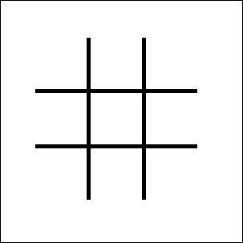
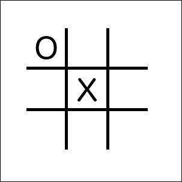

# 第九章。自定义下标

自定义下标于 2012 年添加到 Objective-C 中。当时，Chris Lattner 已经开发了 Swift 两年，并且像 Objective-C 的其他良好特性一样，下标成为了 Swift 语言的一部分。我在 Objective-C 中并不经常使用自定义下标，但我知道当需要时它们是语言的一部分。在我看来，Swift 中的下标似乎更像是语言的自然部分，这可能是由于它们在发布时就是语言的一部分，而不是后来添加的。

在本章中，你将学习以下主题：

+   什么是自定义下标

+   如何为类、结构体或枚举添加自定义下标

+   如何创建读写和只读下标

+   如何在不使用自定义下标的情况下使用外部名称

+   如何使用多维下标

# 介绍下标

下标是访问集合、列表或序列元素的快捷方式。它们用于通过索引设置或检索值，而不是使用获取器和设置器方法。如果使用正确，下标可以显著提高我们自定义类型的可用性和可读性。

我们可以为单个类型定义多个下标，并且将根据传递给下标的索引类型选择适当的下标。我们还可以为我们的下标设置外部参数名称，这有助于区分具有相同类型的下标。

使用自定义下标类似于使用数组和字典的下标。例如，要访问数组中的一个元素，我们将使用 `anArray[index]` 语法，要访问字典中的一个元素，我们将使用相同的语法，即 `aDictionary[key]`。当我们为我们的自定义类型定义自定义下标时，我们也将使用相同的语法访问它们，即 `ourType[key]`。

在创建自定义下标时，我们应该努力使它们感觉像是类、结构体或枚举的自然部分。如前所述，下标可以显著提高我们代码的可用性和可读性，但如果我们过度使用下标，它们将不会感觉自然，并且难以使用。

在本章中，我们将探讨几个如何创建和使用自定义下标的示例。我们还将展示一个不使用下标的示例。在我们展示如何使用自定义下标之前，让我们回顾一下如何在 Swift 数组中使用下标，以了解 Swift 语言中下标的用法。我们应该以类似于 Apple 在语言本身中使用下标的方式使用下标，使我们的自定义下标易于理解和使用。

# Swift 数组中的下标

以下示例展示了如何使用下标访问和更改数组的值：

```swift
var arrayOne = [1,2,3,4,5,6]
print(arrayOne[3])  //Displays '4'
arrayOne[3] = 10
print(arrayOne[3])  //Displays '10'
```

在先前的例子中，我们创建了一个整数数组，然后使用下标语法显示并更改数组中元素编号为`3`的项。下标主要用于从集合中获取或检索信息。我们通常不使用下标来应用特定逻辑以确定要选择哪个项。例如，我们不会使用下标向数组末尾添加项或检索数组中的项数。要向数组末尾添加项或获取数组中的项数，我们将使用类似这样的函数或属性：

```swift
arrayOne.append(7)  //append 7 to the end of the array
arrayOne.count  //returns the number of items in an array
```

在我们自定义的类型中，下标应该遵循 Swift 语言本身设定的相同标准，这样使用我们类型的其他开发者就不会因为实现方式而感到困惑。知道何时使用下标，何时不使用的关键在于理解下标将如何被使用。

# 读写自定义下标

让我们看看如何定义一个用于读取和写入后端数组的下标。读取和写入后端存储类是自定义下标最常见的使用之一，但正如我们将在本章中看到的，我们不需要有一个后端存储类。以下代码是一个用于读取和写入数组的下标：

```swift
class MyNames {
    private var names:[String] = ["Jon", "Kim", "Kailey", "Kara"]
    subscript(index: Int) -> String {
        get {
            return names[index]
        }
        set {
            names[index] = newValue
        }
    }
}
```

如我们所见，语法与我们使用`get`和`set`关键字在类中定义属性的方式相似。区别在于我们使用`subscript`关键字声明下标。然后我们指定一个或多个输入和返回类型。

我们现在可以使用自定义下标，就像我们使用数组或字典的下标一样。以下代码展示了如何在先前的例子中使用下标：

```swift
var nam = MyNames()
print(nam[0])  //Displays 'Jon'
nam[0] = "Buddy"
print(nam[0])  //Displays 'Buddy'
```

在先前的代码中，我们创建了一个`MyNames`类的实例。然后我们显示索引`0`处的原始名称，更改索引`0`处的名称，并重新显示它。在这个例子中，我们使用在`MyNames`类中定义的下标来检索和设置`MyNames`类中`names`数组的元素。

虽然我们可以直接让`names`数组属性对外部代码开放，以便直接读写，但这会将我们的代码锁定在必须使用数组来存储数据。如果我们想将后端存储机制更改为字典对象，甚至 SQLite 数据库，我们将无法做到，因为所有外部代码也必须进行更改。下标非常擅长隐藏我们在自定义类型中存储信息的方式；因此，使用我们自定义类型的外部代码不依赖于任何特定的存储实现。

如果我们直接提供对数组的访问权限，我们也将无法验证外部代码是否将有效信息插入数组。使用下标，我们可以在将数据添加到数组之前通过设置器添加验证来确保传入的数据是正确的。这无论我们是在创建框架还是库时都非常有用。

# 只读自定义下标

我们也可以通过不在下标中声明 setter 方法或没有隐式声明 getter 或 setter 方法来使下标只读。以下代码展示了如何通过不声明 setter 方法来声明只读属性：

```swift
//No getter/setters implicitly declared
subscript(index: Int) ->String {
  return names[index]
}
```

以下示例展示了如何通过只声明 getter 方法来声明只读属性：

```swift
//Declaring only a getter
subscript(index: Int) ->String {
  get {
    return names[index]
  }
}
```

在第一个例子中，我们没有定义 getter 或 setter 方法。所以，Swift 将下标设置为只读，代码的行为就像是在 getter 定义中。在第二个例子中，我们特别在 getter 定义中设置了代码。这两个例子都是有效的只读下标。

# 计算下标

虽然前面的例子与在类或结构中使用存储属性非常相似，但我们也可以以类似计算属性的方式使用下标。让我们看看如何做到这一点：

```swift
struct MathTable {
    var num: Int

    subscript(index: Int) -> Int {
        return num * index
    }
}
```

在前面的例子中，我们使用数组作为下标的后端存储机制。在这个例子中，我们使用下标的值来计算返回值。我们将使用这个下标如下：

```swift
var table = MathTable(num: 5)
print(table[4])
```

这个例子将显示初始化中定义的数字`5`乘以下标值`4`的计算值，等于 20。

# 下标值

在前面的下标示例中，所有的下标都接受整数作为下标的值；然而，我们并不限于整数。在以下示例中，我们将使用字符串类型作为下标的值。下标也将返回字符串类型：

```swift
struct Hello {
  subscript (name: String) ->String {
    return "Hello \(name)"
  }
}
```

在这个例子中，下标接受一个字符串作为下标内的值，并返回一条消息，说`Hello`。让我们看看如何使用这个下标：

```swift
var hello = Hello()
print(hello["Jon"])
```

这个例子将在控制台显示消息，`Hello Jon`。

# 带有范围的下标

类似于我们如何使用数组中的`range`运算符，我们也可以让我们的自定义下标使用`range`运算符。让我们扩展之前创建的`MathTable`结构，包括一个将接受`range`运算符的第二个下标，看看它是如何工作的：

```swift
struct MathTable {
  var num: Int
  subscript(index: Int) -> Int {
    return num * index
  }
  subscript(aRange: Range<Int>) -> [Int] {
    var retArray: [Int] = []
    for i in aRange {
      retArray.append(self[i])
    }
      return retArray

  }
}
```

我们例子中的新下标接受范围作为下标的值，然后返回一个整数数组。在下标内部，我们生成一个数组，将通过我们之前创建的另一个下标方法将范围的每个值乘以`num`属性，返回给调用代码。

以下示例展示了如何使用这个新的下标：

```swift
var table = MathTable(num: 5)
print(table[2...5])
```

如果我们运行这个例子，我们将看到一个包含值`10`、`15`、`20`和`25`的数组。

# 下标的外部名称

如我们本章前面提到的，我们可以为自定义类型有多个下标签名。将根据传入下标的索引类型选择合适的下标。有时我们可能希望定义多个具有相同类型的下标。为此，我们可以使用类似于为函数参数定义外部名称的外部名称。

让我们重写原始的`MathTable`结构，以包含两个下标，每个下标都接受一个整数作为下标类型；然而，一个将执行乘法操作，另一个将执行加法操作：

```swift
struct MathTable {
  var num: Int
  subscript(multiply index: Int) -> Int {
    return num * index
  }
  subscript(addition index: Int) -> Int {
    return num + index
  }
}
```

如我们所见，在这个例子中，我们定义了两个下标，每个下标都是整数类型。两个下标之间的区别在于定义中的外部名称。在第一个下标中，我们定义了一个外部名称为`multiply`，因为我们在这个下标中将下标的值乘以下标内的`num`属性。在第二个下标中，我们定义了一个外部名称为`addition`，因为我们在这个下标中将下标的值加以下标内的`num`属性。

让我们看看如何使用这两个下标：

```swift
var table = MathTable(num: 5)
print(table[multiply: 4])  //Displays 20 because 5*4=20
print(table[addition: 4])  //Displays 9 because 5+4=9
```

如果我们运行这个示例，我们将看到根据下标内的外部名称使用了正确的下标。

如果我们需要多个相同类型的下标，使用我们的下标内的外部名称非常有用；除非它们需要用来区分多个下标，否则我不建议使用外部名称。

# 多维下标

虽然最常见的下标是只接受单个参数的下标，但下标并不限于单个参数。它们可以接受任何数量的输入参数，并且这些参数可以是任何类型。

让我们看看我们如何使用多维下标来实现 Tic-Tac-Toe 棋盘。Tic-Tac-Toe 棋盘看起来类似于这个：



棋盘可以用一个二维数组来表示，其中每个维度有三个元素。然后，每位玩家将轮流在棋盘上放置他的/她的棋子（通常是 X 或 O），直到有玩家在行中放置了三个棋子或者棋盘被填满。

让我们看看我们如何使用多维数组和多维下标实现 Tic-Tac-Toe 棋盘：

```swift
struct TicTacToe {
  var board = [["","",""],["","",""],["","",""]]
  subscript(x: Int, y: Int) -> String {
    get {
      return board[x][y]
    }
    set {
      board[x][y] = newValue
    }
  }
}
```

我们通过定义一个 3x3 的数组来开始 Tic-Tac-Toe 结构，这个数组将代表游戏棋盘。然后我们定义一个下标，可以用来设置和检索棋盘上的玩家棋子。下标将接受两个整数值。通过在括号中放置值类型来定义多种类型。在我们的例子中，我们定义了下标，参数为`(x: Int, y: Int)`。然后我们可以在我们的下标中使用`x`和`y`变量名来访问传递进来的值。

让我们看看如何使用这个下标来设置用户在棋盘上的棋子：

```swift
var board = TicTacToe()
board[1,1] = "x"
board[0,0] = "o"
```

如果我们运行这段代码，我们将看到我们在中心方格添加了玩家`x`的棋子，在左上角方格添加了玩家`o`的棋子，因此我们的游戏棋盘看起来将类似于这个：



在我们的多维下标中，我们不仅限于使用单一类型，因此我们可以使用多种类型。例如，我们可能有一个`(x: Int, y: Double, z: String)`类型的下标。

我们还可以为我们的多维下标类型添加外部名称，以帮助识别使用哪些值，并区分具有相同类型的下标。让我们通过创建一个将根据下标值返回字符串实例数组的下标来查看如何使用多个类型和外部名称与下标一起使用：

```swift
struct SayHello {
  subscript(messageText message:String, messageName name:String, number number:Int) -> [String]{
  var retArray: [String] = []
    for var i=0; i < number; i++ {
      retArray.append("\(message) \(name)")
    }
    return retArray
  }
}
```

在`SayHello`结构体中，我们定义我们的下标如下：

```swift
subscript(messageText message:String,messageName name:String, number number:Int) -> [String]
```

这定义了一个包含三个元素的下标。每个元素都有一个外部名称（`message`、`name`和`number`）和一个内部名称（`message`、`name`和`number`）。前两个元素是字符串类型，最后一个元素是整型。我们使用前两个元素为用户创建一个消息，该消息将重复由最后一个（`number`）元素定义的次数。我们将使用此下标如下：

```swift
var message = SayHello()
var ret = message[messageText:"Bonjour",messageName:"Jon",number:5]
```

如果我们运行此代码，我们将看到`ret`变量包含一个包含五个字符串的数组，每个字符串等于`Bonjour Jon`。

# 何时不应使用自定义下标

正如我们在本章中看到的，创建自定义下标可以真正增强我们的代码；然而，我们应该避免过度使用它们或以不符合标准下标用法的方式使用它们。避免过度使用下标的方法是检查 Swift 标准库中下标的用法。

让我们看看以下示例：

```swift
class MyNames {
  private var names:[String] = ["Jon", "Kim", "Kailey", "Kara"]
  var number: Int {
    get {
      return names.count
    }
  }
  subscript(add name: String) -> String {
    names.append(name)
    return name
  }
  subscript(index: Int) -> String {
    get {
      return names[index]
    }
    set {
      names[index] = newValue
    }
  }
}
```

在前面的示例中，在`MyNames`类中，我们定义了一个数组，该数组在我们的应用程序中使用。例如，假设在我们的应用程序中，我们显示这个名字列表，并允许用户向其中添加名字。在`MyNames`类中，我们定义以下下标，允许我们向数组中添加新名字：

```swift
subscript(add name: String) -> String {
  names.append(name)
  return name
}
```

这将是一个对下标语法的糟糕使用，因为它的使用与 Swift 语言中下标的用法不一致。这可能会在将来使用该类时造成混淆。更合适的方式是将这个下标重写为一个函数，如下所示：

```swift
func append(name: String) {
  names.append(name)
}
```

记住，当你使用自定义下标时，确保你正在适当地使用它们。

# 摘要

正如我们在本章中看到的，为我们的自定义类型添加对下标的支持可以极大地增强其可读性和可用性。我们看到了下标可以用来在后台存储类和外部代码之间添加一个抽象层。下标也可以以类似的方式用于计算属性，其中下标用于计算一个值。正如我们指出的，下标的关键是适当地使用它们，并且以与 Swift 语言中的下标一致的方式使用。
