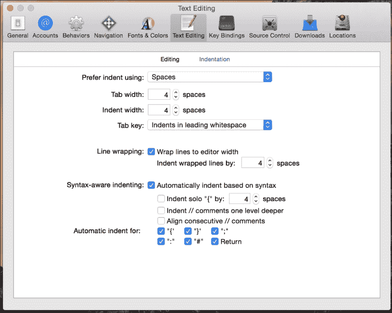

# 第十五章. Swift 格式和风格指南

在我的开发经验中，每次我学习一门新的编程语言时，通常都会提到如何编写和格式化该语言的代码。在我的开发生涯早期（那是很久以前），这些推荐都是非常基础的格式化建议，比如如何缩进代码，或者每行只写一个语句。实际上，直到最近 10 到 12 年，我才开始看到不同编程语言的复杂和详细的格式和风格指南。如今，很难找到一个只有两三个开发者而没有为每种语言制定风格/格式指南的开发团队。即使那些没有创建自己风格指南的公司，通常也会参考其他公司发布的某些标准指南，如 Google、Oracle 或 Microsoft。这些风格指南帮助团队编写一致且易于维护的代码。

# 什么是编程风格指南？

编程风格非常个人化，每个开发者都有自己的首选风格。这些风格可以从语言到语言、从人到人，甚至随时间而变化。编程风格的个人性质使得在众多个人贡献代码时，保持一致的、易于阅读的代码库变得困难。

虽然大多数开发者可能都有自己的首选风格，但不同语言之间推荐或首选的风格可能有所不同。例如，在 C#中，当我们命名一个方法或函数时，首选使用驼峰式命名法，首字母大写。而在大多数语言中，如 C、Objective-C 和 Java，也推荐使用驼峰式命名法，但我们应该将首字母小写。

最佳的应用程序都是编写得当的，而所谓的“得当”，并不仅仅是指它们能够正确运行，还意味着它们易于维护，代码易于阅读。如果每个开发者都使用自己的编码风格，那么对于大型项目和拥有大量开发者的公司来说，要拥有易于维护和阅读的代码是非常困难的。这就是为什么拥有多个开发者的公司和项目通常会为使用的每种语言采用编程风格指南。

编程风格指南定义了一套规则和指南，开发者在编写项目或公司内部特定语言的程序时应该遵循这些规则和指南。这些风格指南在公司或项目之间可能差异很大，反映了该公司或项目期望代码的编写方式。这些指南也可能随时间而变化。遵循这些风格指南对于保持一致的代码库非常重要。

许多开发者不喜欢被告知应该如何编写代码的想法，并声称只要他们的代码能正确运行，为什么他们的代码格式很重要。我把这比作一个篮球队。如果所有球员都认为他们想要的方式是正确的，并认为当他们在做自己想做的事情时，球队会更好，那么这个球队很可能会输掉大多数比赛。一个篮球队（或者任何运动队，无论如何）除非他们一起工作，否则不可能赢得大多数比赛。确保每个人都在一起工作并执行相同的比赛计划的责任在于教练，就像开发项目的团队领导确保所有开发者都按照采用的风格指南编写代码一样。

# 您的风格指南

在本书中定义的风格指南只是一个指南。它反映了作者对如何编写 Swift 代码的看法，并旨在成为创建您自己的风格指南的良好起点。如果您真的喜欢这个指南并直接采用它，那很好。如果您不同意其中的某些部分并在您的指南中进行了修改，那也很好。您和您的团队感到舒适的风格就是最适合您和您的团队的风格，它可能与本书中的指南不同。我们也应该指出，Swift 是一种非常年轻的语言，人们仍在努力找出与 Swift 一起使用的适当风格；因此，今天推荐的东西明天可能就会受到批评。不要害怕根据需要调整您的风格指南。

在本章的风格指南中，以及大多数好的风格指南中，一个值得注意的事情是，对为什么每个项目被优先考虑或不被优先考虑的解释非常少。风格指南应该提供足够的细节，以便读者了解每个项目的优先和非优先方法，但同时也应该小巧紧凑，以便于阅读和理解。

如果开发者对为什么某个特定方法被优先考虑有疑问，他或她应该将这个疑问提出给开发团队。

考虑到这一点，让我们开始编写指南。

## 不要在语句末尾使用分号

与许多语言不同，Swift 不需要在语句末尾使用分号。因此，我们不应该使用它们。让我们看看以下代码：

```swift
//Preferred Method
var name = "Jon"
print(name)

//Non-preferred Method
var name = "Jon";
print(name);
```

## 不要为条件语句使用括号

与许多语言不同，条件语句周围不需要括号；因此，除非需要澄清，否则我们应该避免使用它们。让我们看看以下代码：

```swift
//Preferred Method
if speed == 300000000 {
    print("Speed of light")
}

//Non-Preferred Method
if (speed == 300000000) {
    print("Speed of light")
}
```

## 命名

我们应该始终使用描述性的名称，并使用驼峰式命名法为类、方法、变量、常量等命名。让我们看看一些通用的命名规则。

### 类

类名应该有一个描述性的名称，描述类的作用。名称应该以大写字母开头，并使用驼峰式命名法。以下是根据我们的风格指南提供的正确名称和非正确名称的示例：

```swift
// Proper Naming Convention
BaseballTeam
LaptopComputer
//Non-Proper Naming Convention
baseballTeam          //Starts with a lowercase letter
Laptop_Computer       //Uses an underscore
```

### 函数和方法

函数名应该是描述性的，描述函数或方法。它们应该以小写字母开头，并使用驼峰式命名法。以下是一些正确名称和非正确名称的示例：

```swift
//Proper Naming Convention
getCityName
playSound

//
//Non-Proper Naming Convention
get_city_name         //All lowercase and has an underscore
PlaySound             //Begins with an upper case letter
```

### 常量和变量

常量和变量应该有一个描述性的名称。通常，它们以小写字母开头，并使用驼峰式命名法。唯一的例外是当常量是全局的；在这种情况下，常量的名称应包含所有大写字母，单词之间用下划线分隔。我见过许多指南都反对使用全部大写名称，但我个人喜欢在全局作用域中的常量使用它们，因为它们突出显示了它们是全局作用域，而不是局部作用域。以下是一些正确名称和非正确名称的示例：

```swift
//Proper Names
playerName
driveSize
PLAYERS_ON_A_TEAM    //Only for globally scoped constants

//Non-Proper Names
PlayerName           //Starts with uppercase letter
drive_size           //Has underscore in name
```

### 缩进

Xcode 中的缩进宽度默认定义为四个空格，制表符宽度也定义为四个空格。我们应该将其保留为默认设置。以下截图显示了 Xcode 中的缩进设置：



我们还应该在函数/方法之间添加一个额外的空行。我们还应该使用空行来分隔函数或方法内的功能。换句话说，在函数或方法中使用过多的空行可能意味着我们应该将函数分解成多个函数。

## 注释

我们应该根据需要使用注释来解释我们的代码是如何和为什么被编写的。我们应该在类和函数之前使用块注释，而我们应该使用双斜杠来注释行内代码。以下是如何编写注释的示例：

```swift
/**
* This is a block comment that should be used
* to explain a class or function
*/
public class EmployeeClass {
  // This is an inline comment with double slashes
  var firstName = ""
  var lastName = ""

  /**
Use Block comments for functions

  :parm: paramName  use this tag for parameters
  :returns:  explain what is returned
  */
  func getFullName() -> String {
    return firstName + " " + lastName
  }
}
```

当我们评论方法时，我们也应该使用会在 Xcode 中生成文档的文档标签，正如前一个示例所示。至少，如果这些标签适用于我们的方法，我们应该使用以下标签：

+   `:param`: 这用于参数

+   `:return`: 这用于返回的内容

## 使用 self 关键字

由于 Swift 不要求我们在访问对象的属性或调用对象的方法时使用 `self` 关键字，因此除非我们需要区分对象的属性和局部变量，否则我们应该避免使用它。以下是一个应该使用 `self` 关键字的示例：

```swift
public class EmployeeClass {
  var firstName = ""
  var lastName = ""
  func setName(firstName: String, lastName: String) {
    self.firstName = firstName
    self.lastName = lastName
  }
}
```

这里是一个不使用 `self` 关键字的示例：

```swift
public class EmployeeClass {
    var firstName = ""
    var lastName = ""
    func getFullName() -> String {
        return self.firstName + " " + self.lastName
    }
}
```

## 类型

在可能的情况下，我们应该始终使用 Swift 原生类型。如果我们记得，Swift 提供了与 Objective-C 类型的桥接，所以即使我们使用 Swift 原生类型，我们仍然可以访问 Objective-C 类型提供的全部方法集。以下代码显示了使用原生类型的推荐和非推荐方式：

```swift
//Preferred way
let amount = 25.34
let amountStr = (amount as NSNumber).stringValue

//Non-preferred way
let amount: NSNumber = 25.34
let amountStr = amount.stringValue
```

## 常量和变量

常量与变量的区别在于常量的值永远不会改变，而变量的值可能会改变。 wherever possible，我们应该定义常量而不是变量。

做这件事最简单的方法是将所有内容默认定义为常量，然后在代码中达到需要更改的点后再将其定义为变量。使用 Swift 2，如果你定义了一个变量但从未在代码中更改其值，你会收到一个警告。

## 可选类型

只有在绝对必要时才使用可选类型。如果没有绝对必要将 nil 值分配给变量，我们就不应该将其定义为可选的。

### 使用可选绑定

我们应该避免强制解包可选值，因为这很少是必要的。我们应该优先选择可选绑定或可选链来强制解包。

以下示例显示了定义 `myOptional` 变量为可选时的首选和非首选方法：

```swift
//Preferred Method Optional Binding
if let value = myOptional {
  // code if myOptional is not nil
} else {
  // code if myOptional is nil
}

//Non-Preferred Method
if myOptional != nil {
  // code if myOptional is not nil
} else {
  //  code if myOptional is nil
}
```

如果我们需要解包多个可选值，我们应该在相同的一行中包含它们，而不是在单独的行中解包，除非我们的业务逻辑不需要在解包失败时采取不同的路径。以下示例显示了首选和非首选方法：

```swift
//Preferred Method Optional Binding
if let value1 = myOptional1, value2 = myOptional2 {
  // code if myOptional1 and myOptional2 is not nil
} else {
  // code if myOptional1 and myOptional2 is nil
}

//Non-Preferred Method Optional Binding
if let value1 = myOptional1 {
    if let value2 = myOptional2 {
        // code if myOptional is not nil
    } else {
     // code if myOptional2 is nil
    }   
} else {
  // code if myOptional1 is nil
}
```

### 使用可选链而不是可选绑定进行多次解包

当我们需要解包多层时，我们应该使用可选链而不是多个可选绑定语句。以下示例显示了首选和非首选方法：

```swift
//Preferred Method
if let color = jon.pet?.collar?.color {
    print("The color of the collar is \(color)")
} else {
    print("Cannot retrieve color")
}

//Non-Preferred Method
if let tmpPet = jon.pet, tmpCollar = tmpPet.collar  {
    print("The color of the collar is \(tmpCollar.color)")
} else {
    print("Cannot retrieve color")
}
```

## 使用类型推断

我们不应该定义变量类型，而应该让 Swift 推断类型。我们只有在定义变量或常量时没有为其赋值的情况下才应该定义变量或常量类型。让我们看看以下代码：

```swift
//Preferred method
var myVar = "String Type"  //Infers a String type
var myNum = 2.25           //Infers a Double type

//Non-Preferred method
var myVar: String = "String Type"
var myNum: Double = 2.25
```

## 使用集合的简写声明

当声明原生 Swift 集合类型时，我们应该使用简写语法，除非绝对必要，否则我们应该初始化集合。以下示例显示了首选和非首选方法：

```swift
//Preferred Method
var myDictionary: [String: String] = [:]
var strArray: [String] = []
var strOptional: String?

//
//Non-Preferred Method
var myDictionary: Dictionary<String,String>
var strArray: Array<String>
var strOptional: Optional<String>
```

## 使用 `for-in` 循环而不是 `for` 循环

我们应该使用 `for-in` 循环而不是 `for` 循环，尤其是在遍历集合时。以下示例显示了首选和非首选方法：

```swift
//Preferred Method
for str in strArray {
    print(str)
}
for num in 0...3 {
    print(num)
}

//
//Non-Preferred Method
for var i = 0; i < strArray.count; i++ {
    print(strArray[i])
}

for var num = 0; num <= 3; num++ {
    print(num)
}
```

## 使用 switch 而不是多个 if 语句

wherever possible，我们应该优先使用单个 `switch` 语句而不是多个 `if` 语句。以下示例显示了首选和非首选方法：

```swift
//Preferred Method
let speed = 300000000
switch speed {
case 300000000:
    print("Speed of light")
case 340:
    print("Speed of sound")
default:
    print("Unknown speed")
}

//Non-preferred Method
let speed = 300000000
if speed == 300000000 {
    print("Speed of light")
} else if speed == 340 {
    print("Speed of sound")
} else {
    print("Unknown speed")
}
```

## 不要在应用程序中留下注释掉的代码

如果我们在尝试替换代码块时将其注释掉，一旦我们对更改感到满意，我们应该移除我们注释掉的代码。大量注释掉的代码块会使代码库看起来杂乱无章，难以跟踪。

## 大中央调度

在第十四章中讨论的 Grand Central Dispatch，*Swift 中的并发与并行*，是一个基于 C 的低级 API，它允许将特定任务排队执行，并在任何可用的处理器核心上调度执行。

## 在`dispatch_queue_create()`函数中设置属性

当使用`dispath_queue_create()`函数创建一个串行队列时，我们可以将`attribute`参数设置为`nil`（这定义了一个串行队列）；然而，我们应该始终将属性设置为`DISPATCH_QUEUE_SERIAL`或`DISPATCH_QUEUE_CONCURRENT`以明确定义我们正在创建的队列类型。以下示例显示了首选和非首选方法：

```swift
//Preferred method
let queue2 = dispatch_queue_create("squeue.hoffman.jon", DISPATCH_QUEUE_SERIAL)

//Non-Preferred method
let queue2 = dispatch_queue_create("squeue.hoffman.jon", nil)
```

## 为`dispatch_queue_create()`函数的标签参数使用反向 DNS 名称

我们可以将`dispatch_queue_create`函数的`tag`参数设置为任何有效的字符串；然而，为了保持一致性和易于故障排除，我们应该始终使用反向 DNS 命名方案。以下代码显示了首选和非首选方法：

```swift
//Preferred method
let queue2 = dispatch_queue_create("squeue.hoffman.jon", DISPATCH_QUEUE_SERIAL)

let queue = dispatch_queue_create("cqueue.hoffman.jon", DISPATCH_QUEUE_CONCURRENT)

//Non-Preferred method
let queue2 = dispatch_queue_create("Serial_Queue", DISPATCH_QUEUE_SERIAL)

let queue = dispatch_queue_create("Concurrent_Queue", DISPATCH_QUEUE_CONCURRENT)
```

## 使用`dispatch_get_global_queue()`而不是`dispatch_queue_create()`

虽然使用`dispatch_queue_create()`函数创建一个新的并发队列是完全可接受的，但我们应更倾向于使用`dispatch_get_global_queue()`函数来检索一个已经创建并可供使用的并发队列。以下示例显示了首选和非首选方法：

```swift
//Preferred Method
let queue = dispatch_get_global_queue(DISPATCH_QUEUE_PRIORITY_DEFAULT, 0)

//Non-preferred Method
let queue = dispatch_queue_create("cqueue.hoffman.jon", DISPATCH_QUEUE_CONCURRENT)
```

# 摘要

当我们在团队环境中开发应用程序时，拥有一个明确的编码风格，团队中的每个人都遵守，是非常重要的。这使我们能够拥有一个易于阅读和维护的代码库。

如果一个风格指南保持静态时间过长，这意味着它可能没有跟上语言中的最新变化。过长的时间因语言而异。例如，对于 C 语言，过长的时间将以年为单位定义，因为语言非常稳定；然而，对于 Swift，语言非常新，变化来得相当频繁，所以过长的时间可能被定义为几个月。

建议我们将我们的风格指南保存在版本控制系统中，这样我们就可以在需要时参考旧版本。这允许我们在查看旧代码时检索旧版本的风格指南。
