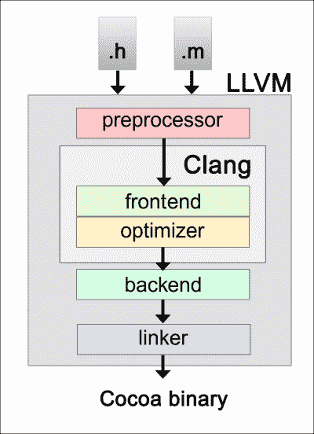
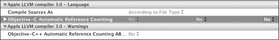

# 第二章：自动引用计数

好的想法可以长久生存，而坏的想法则很快就会消失。在 Objective-C 中，引用计数的长期存在被视为一个非常好的想法。在这个进化过程中的下一步是它变得自动，所以我们称之为**自动引用计数**（**ARC**），这是苹果公司在 2011 年为桌面和移动操作系统 Mac OS X Lion 和 iOS 5 上的应用程序开发引入的。它将初始引用计数的名称更改为**手动引用计数**。

在本章中，我们将涵盖以下主题：

+   ARC 及其工作原理

+   ARC 的优缺点

+   ARC 的项目设置

+   将不支持 ARC 的代码与您的项目混合

+   Objective-C 中的内存模型

+   UI 套件中的 ARC

# 什么是 ARC 以及它是如何工作的？

如果你还记得，引用计数的想法涵盖了从内存中实际删除对象。有了引用计数，Objective-C 负责实际的对象销毁。拥有对象的对象只负责释放其对对象的所有权。因此，下一个出现的想法是使一切完全自动化，就像在 Java 和 C#等语言中做的那样。这个想法在垃圾回收分支和自动引用计数中得到了发展。

垃圾回收仅适用于 Mac OS X，从版本 10.5 开始。此外，请注意，iOS 应用程序不能使用垃圾回收；因为它依赖于设备的性能，这将需要一些时间来处理，迫使用户等待处理结束，从而产生不良的用户体验。它也被弃用了，因为从 OS X 版本 10.8 开始，它支持 ARC，并计划在即将到来的 OS X 版本中删除。

ARC 是一种新的创新方式，它包含了垃圾回收的许多优点，但又不同于垃圾回收。ARC 没有后台进程来处理对象的释放，这使得 ARC 在性能比较中相对于垃圾回收具有很大的优势。

然而，在解释 ARC 如何做到这一点之前，了解 ARC 不做什么是很重要的：

+   ARC 不强制运行时内存模型，如垃圾回收所做的那样。在 ARC 下编译的代码使用与纯 C 或非 ARC Objective-C 代码相同的内存模型，并且可以链接到相同的库。

+   ARC 只为从`NSObject`继承的 Objective-C 对象提供自动内存管理，注意在 Objective-C 中，块也偶然是底层对象）。

+   以任何其他方式分配的内存不会被触及，并且仍然必须手动管理。对于其他资源，如文件句柄和套接字（如流）也是如此。

# ARC 的外观

首先，想象一个由专家 Cocoa 程序员编写的传统 Objective-C 源代码文件。`retain`、`release`和`autorelease`消息在所有正确的位置发送，并且处于完美的平衡状态。

现在，想象一下编辑源代码文件，移除所有`retain`、`release`和`autorelease`消息的实例，并在 Xcode 中更改一个单一的构建设置，该设置指示编译器在编译源代码时将所有合适的内存管理调用放回你的程序中。这就是 ARC。它正是名字所暗示的——传统的 Cocoa 引用计数，是自动完成的。

在其核心，ARC（自动引用计数）不是一个运行时服务；它不像垃圾回收那样作用于程序执行。另一方面，新的 Clang，C、C++、Objective-C 和 Objective-C++的编译器前端，将其提供为两个阶段（我们将这些阶段称为“周期”）。在下面的图中，你可以看到这两个阶段。在名为**前端**的周期中（如下所示），**Clang**将分析每个预处理的文件以查找属性和对象。然后，依靠一些固定的规则，它将插入正确的语句——`retain`、`release`和`autorelease`。



例如，如果一个对象被分配并且局部对应一个方法，这个对象将在该方法端点附近有一个`release`语句。如果这个`release`语句是一个类属性，它将进入类的`dealloc`方法中，这可能是一个自定义类或任何 Objective-C 类。如果它是一个集合对象或返回值，它将得到一个`autorelease`语句。然而，如果它被作为弱引用引用，它将被留在那里。

前端也会为局部释放的对象插入`retain`语句。它访问每个声明的访问器，并使用指令`@property`更新它们。它包括对超类如`NSObject`或`UIViewController`或甚至你自己的`customer`超类的`dealloc`例程的调用。它还会报告任何显式的管理调用和双重所有权。

在优化周期中，修改后的源代码被发送到 Clang 的负载均衡。因此，它计算为每个对象创建的`retain`和`release`调用，并将它们减少到最优的最小值。这个动作避免了过多的`retain`和`release`消息，这些消息可能会影响完全的性能：

```swift
To see how it works, take a look at the following code:
@class MyBar;
@interface MyFoo
{
@private
    NSString *myOwnString;
}
@property(readonly) NSString *myOwnString; 

- (MyBar *)getMyBarWithString:(NSString *)myString;
- (MyBar *)getMyBar;

@end

@implementation MyFoo;
@dynamic myOwnString;

– (MyBar *)getMyBarWithString:(NSString *)myString
{
    MyBar *yBar;

    if (![self.myString isEqualToString:myString]) 
    {
        myOwnString = myString;
    } 
    return [self getMyBar];
}

- (MyBar *)getMyBar
{
    MyBar *yBar

    return yBar;
}
@end
```

现在，它是一个没有`retain`或`release`的 Objective-C 类。有一个名为`myOwnString`的私有属性，它是一个`NSString`的实例。这个类导入了`MyBar`类的头文件（第 1 行）并声明了一个同名只读获取器，`myOwnString`。还有一个名为`getMyBarWithString`的修饰符和一个名为`getMyBar`的内部函数。

以下代码是使用**手动引用计数**（**MRC**）的相同代码片段：

```swift
@class MyBar;
@interface MyFoo
{
@private
    NSString *myOwnString;
}
@property (readonly) NSString *myOwnString; 

- (MyBar *)getMyBarWithString:(NSString *)myString;
- (MyBar *)getMyBar;

@end

@implementation MyFoo;
@dynamic myOwnString;

– (MyBar *)getMyBarWithString:(NSString *)myString
{
    MyBar *yBar;

    if (![self.myString isEqualToString:myString]) 
    {
        [myString retain];
        [myOwnString release];
        myOwnString = myString;
    }
    return [self getMyBar];
}

- (MyBar *)getMyBar
{
    MyBar *yBar

    [yBar autorelease];
    return yBar;
}

- (void)dealloc
{
    [myOwnString release];
    [super dealloc];
}
@end
```

注意，类接口仍然是相同的。然而，现在，`getMyBarWithString`修饰符有一些新的语句；更具体地说，两个：

```swift
[myString retain];
[myOwnString release];
```

向`myOwnString`属性（第 24 行）发送释放语句是其中之一的责任。另一个向`myString`参数（第 25 行）发送`retain`消息。在将最后一个返回作为其结果之前，`getMyBar`函数向`yBar`局部变量发送本地`autorelease`语句。最后，MRC 取代了该类的`dealloc`方法。MRC 还释放了`myOwnString`属性（第 44 行）并调用了其超类的`dealloc`方法（第 45 行）；仍然在该方法中，如果已经存在`dealloc`方法，MRC 会适当地更新其代码。

当使用 ARC 时，你不需要显式插入`retain`和`release`消息，因为 ARC 将在编译期间自动插入它们。由于 ARC 会自行决定如何更好地管理 Objective-C 对象，因此不再需要开发类代码所需的时间。因此，ARC 避免了任何空指针。你还可以在单个文件的基础上排除 ARC，选择你的目标，转到**构建阶段**，并在**编译器标志**中添加**-fno-objc-arc**标志。

然而，Clang 编译器是构建在 LLVM 3.0 中的，仅从 Xcode 4.2 版本开始可用。自从 Mac OS X 版本 10.7 和 iOS 版本 5.0 以来，已经对 ARC 提供了优化运行时支持。使用 Mac OS X 10.6 和 iOS 4.3 的二进制文件启用 ARC 并不困难，但对于 iOS 4.3，只能通过蓝代码实现；而对于 OS X 10.6，最新版本根本不使用弱指针。

关于 ARC 的一些要点如下：

+   它不适用于`AppleScriptObjC`或甚至`PyObjC`源；它仅适用于 Objective-C 源。

+   然而，或多或少，当有`PyObjC`和`AppleScriptObjC`类通过 Objective-C 代码连接到 Cocoa 时，ARC 将影响底层代码。

+   注意，对于某些第三方框架，如果启用了 ARC，它们在编译时可能会崩溃。请确保该框架的开发者能够并愿意更新它。

# ARC 的项目设置

当项目设置为使用 ARC 时，编译器标志`-fobjc-arc`默认为每个 Objective-C 源文件设置。可以通过编译器标志`-fno-obj-arc`禁用特定类的 ARC。在 Xcode 中，转到**构建阶段**标签，打开**编译源**组，你将能够看到源文件列表。当你双击想要设置的文件时，将出现一个弹出面板。在该面板中，输入`-fno-obj-arc`标志，然后点击**完成**以完成设置。

如果在创建项目时没有启用 ARC，那么要启用它，请按照以下步骤操作：

1.  打开项目。

1.  前往**编辑** | **重构** | **转换为 Objective-C ARC**。

1.  如果没有问题并且准备转换，它将检查你的代码。

默认情况下，Xcode 5 中所有新创建的 Objective-C 项目都启用了 ARC。但是，如果你需要禁用它，请按照以下步骤操作：

1.  选择**项目**。

1.  选择**目标**。

1.  从右侧面板，转到**构建设置**。

1.  选择**自动引用计数**。

1.  选择**Apple LLVM 编译器 3.0 – 语言**。

1.  定位到**Objective-C++ 自动引用计数**，并在所有三个部分中，选择**NO**。

# Objective-C 的内存模型

Objective-C 2.0 的一个非常重要的改进是其内存模型。作为预处理器的第一个 Objective-C 实现中无数问题的残留都被清理了。在旧版本中，Objective-C 对象仅仅是 C 结构，它们在第一个字段中包含指向其类的指针，并且当你想发送消息时，它们的指针只能接收消息。

现在每一个对象指针都属于以下类别之一：`弱`、`强`、`自动释放`和`不安全未保留`。当 ARC 被禁用时，程序员需要负责处理它们所有，确保它们都是安全的，因为这些指针仅仅适合最后一个类别。

默认类别（类型限定符）是一个`强`指针；它们在很大程度上对应于编写无缺陷的防御性保留/释放代码所带来的后果。对`强`指针的赋值相当于保留新值并释放旧值，因为拥有引用的存储就在这些指针中。

为了存储自动释放的值，你需要使用`自动释放`指针。在 Objective-C 中，这样的指针是最常见的非拥有引用指针形式；它们是在堆上存储自动释放值的变量。一个拥有引用指针，也称为实例变量，只有在它被存储到一个非拥有引用指针，即自动释放变量中时，才会被自动释放。如果你只是存储一个自动释放的引用指针，你将有一个简单的属性。

为了减少关键代码段中释放和保留语句的数量，可以使用四个 ARC 类型限定符之一`_autoreleasing`。然而，由于对象将被包含在自动释放池中，并且 ARC 通常可以消除这一点，所以通常不需要使用这个类型限定符，除了它可能会使事情变慢之外。

`弱`是指针的最后一个类别（类型限定符）。如果你在 Objective-C 中使用了垃圾回收器模式，你可能已经通过在这样一个指针中存储对象而遇到了`弱`指针。它不被视为一个拥有引用指针（例如，一个变量），当对象被释放时，这个指针立即被设置为 nil。

我们可以数出 GC 和 ARC 模式之间的许多不同之处，但非常重要的一点是关于 ARC 的确定性。你可以通过`弱`指针看到这一点。以下代码是一个示例：

```swift
    id strong = [NSObject new];
    __weak id weak = strong;
    strong = nil;
    NSLog(@"%@", weak);
```

首先，由于在垃圾回收模式下`__weak`对栈变量是不被允许的，所以前面的代码甚至无法通过编译。然而，如果将弱引用声明移动到有效位置会发生什么？我们假设此时对象的最后一个引用已经消失了。然而，日志语句会显示对象仍然存在，是活跃的。依赖于编译器运行的优化，如果强制运行垃圾回收器，收集器可能可以在堆上看到它的引用。

这段代码将在 ARC 模式下编译——现在，堆上允许存在弱变量。

# 你需要了解的关于 ARC 和弱引用的内容

自从 GNUstep Objective-C 运行时版本 1.5 以来，iOS 版本 5 和 OS X 版本 10.7 以来，弱引用一直被支持。ARC 通过兼容性库工作，但它需要对许多类进行修改才能与弱引用一起工作。

# 摘要

在本章中，我们关注了自动引用计数（ARC），它的优势、工作原理以及如何正确设置和将其集成到当前项目中。

在下一章中，我们将讨论自动释放池机制及其类、块和线程。我们还将了解 Objective-C 中的内存模型。我希望这一章能让你对 ARC 有一个良好的理解。
