# 第四章：对象创建和存储

在本章中，我们将更深入地探讨对象和类，展示它们创建、处理和定制的机制。

我们将涵盖以下主题：

+   对象创建和初始化

+   对象不可变性

+   对象可变性

+   对象继承

+   便利初始化器

+   单例模式

+   使用 @property

+   类的类型

+   自定义方法

+   格式说明符

# 对象的创建和初始化

对于开发者来说，构建 iOS 和 OS X 应用程序需要在创建和处理对象上花费大量时间。在 Objective-C 中，像任何其他面向对象编程语言一样，对象就像一个具有预定义行为的数据包。我们可以将应用程序视为一个包含对象的 环境，这些对象相互连接，传递和接收信息，例如如何构建图形界面、如何处理用户交互、如何以及在哪里存储和获取数据、如何执行计算等等。对象可以执行的任务的复杂性可能非常大，但这并不反映在创建对象的复杂性上。

Cocoa（用于 OS X）和 Cocoa Touch（iOS）已经提供了一个库，其中包含了一个广泛的对象列表，您可以将其直接使用或基于它们创建自己的对象——我们称之为代码重用。

最重要的发展过程之一是思考应用程序的基本结构，当你决定使用哪个对象、如何组合、定制，以及它们如何通信以生成预期的输出等。其中一些由 Cocoa 和 Cocoa Touch 提供供即时使用，如 NSString、NSArray、NSDictionary、UIView 和 UILabel，但这种重要性归因于其他人可能需要定制以执行所需操作，或者为了创建独特的框架——为您的应用程序提供功能。

# 什么是类？

在面向对象编程方法中，对象是类的实例。类将确定对象的行为，它接收的消息（方法），有时以及谁有权发送这些消息以获得响应。

一个类描述了指定对象的属性和行为，就像房子的蓝图会描述房子的属性，例如房子里的门数。同样，对于一个数字，名为 `NSNumber` 的类的实例，其类提供了许多获取、分析、比较和转换对象内部数值的方法。

除了存储在类多个实例中的内部内容外，所有属性和行为表现相同。查看以下示例：

```swift
/*
  =============================================
  Our object is created here as instance of NSNumber.
  We directly assign a float number to it;
  =============================================
*/

NSNumber *sampleNumber = @(3.1415);

/*
  =============================================
  Now, we send the built-in message "intValue" to convert the float value stored in it to an integer value.
  =============================================
*/

NSNumber firstNumber = @([ sampleNumber intValue]);
```

我们的数值对象 `firstNumber` 现在具有数值 `3`，这是一个整数，在发送了 `NSNumber` 类中预定义的 `intValue` 消息之后。对象将按照预期行为，将其值转换为整数。该类的任何对象实例都将以相同的方式行事。

对象被创建出来是为了以不同的预期方式使用，但您不需要知道它们行为内部机制是如何发生的，这也就是封装。相反，唯一的要求是知道如何处理对象以实现您想要的行为。这意味着您需要知道发送给对象的预定义消息。如果您有一个包含六个大写字母的`NSString`类的字符串实例，并且希望它们变为小写，您只需要知道要发送的消息：

```swift
/*
  =============================================
  We create our string with the uppercase characters: "QWERTY"
  =============================================
*/

NSString *sampleString = @"QWERTY";

/*
  =============================================
  Now, we send a message to it, requesting to convert the uppercase characters to lowercase
  =============================================
*/

sampleString = [sampleString lowercaseString];

/*
  =============================================
  After this process, our string has now the characters: "qwerty"
  =============================================
*/
```

为了指定对象的使用意图，我们使用类接口。它定义了一个公共接口，用于在代码的其他部分使用，而不仅仅是类本身。

## 类

为了创建自己的类，请转到菜单栏中的**文件** | **新建**，或者直接点击 *Command* + *N*，根据您的项目选择**iOS**或**OS X**，然后选择**Cocoa 类**或**Cocoa Touch 类**。之后，您可以命名您的类并选择其超类（它将从中继承）。Xcode 将自动为您创建一个头文件和一个实现文件，`.h`和`.m`。与其他编程语言一样，头文件相当于一个摘要，快速查看类中的内容，将要使用的内容，等等。

您的公共方法和属性将在头文件中声明。在这里，您可以看到一个新创建的头文件示例（`mySpecialTableViewController.h`）：

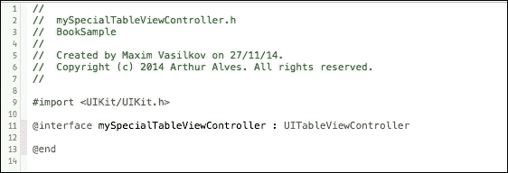

我们的这个类名为`mySpecialTableViewController`，是`UITableViewController`的一个子类。它创建了一个 UI 元素，正如其名所示，一个表格视图，这在 iOS 应用中非常常见。

仍然在我们的头文件中，我们将创建一个公共属性`NSArray`，用于接收和存储将在每个`UITableViewCell`上显示的数据。我们的表格视图将显示编程语言列表：

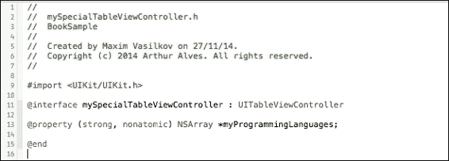

通过在创建时指定超类，Xcode 已经为您准备好了内置的可用/必需方法，以便运行它。正如我们在实现文件（`mySpecialTableViewController.m`）中看到的那样，我们只需要实现我们的代码：

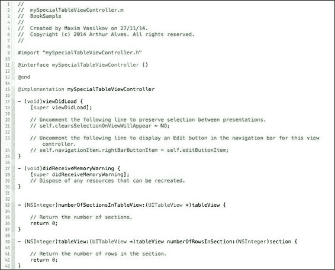

我们的表格视图将很简单，只显示存储在`myProgrammingLanguages`数组中的不同单元格上的编程语言。它将只有一个部分，这意味着我们可以在`numberOfSectionsInTableView:`方法中自由返回这个数字：

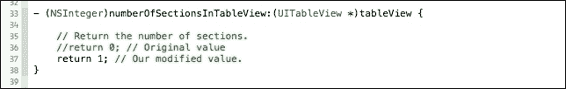

下一个修改是指定行数，也就是单元格的数量。如果这个数字依赖于可能不同的属性，我们就不能像处理部分数量那样硬编码它；相反，我们返回我们的数组所持有的对象数量：

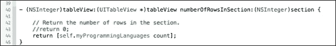

在 Objective-C 中创建表格视图的下一步是设置单元格的内容。我们使用`tableView:cellForRowAtIndexPath:`方法（已在实现文件中提供）。默认情况下，它是注释掉的。取消注释该方法以便使用它：

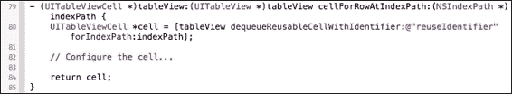

你首先应该注意到的第一件事是，它创建了`UITableViewCell`并将其返回以在表格视图中显示。这两个步骤之间是我们配置单元格的地方。

`UITableViewCell`类已经包含一个名为`textLabel`的属性。我们将使用它来显示存储在`myProgrammingLanguages`数组中的值。一旦`tableView:numberOfRowsInSection:`方法返回数组中的元素数量，对于每次迭代，它都会配置并返回数组中相应项的单元格。第一个单元格是第一个项，第二个单元格是第二个项，依此类推。在这个方法中，当前单元格已经是`indexPath`的正确单元格，但为了获取正确的值设置给它，我们使用`indexPath.row`来选择数组中的正确项：

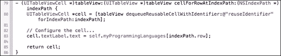

上述代码将`myProgrammingLanguages`数组中的第一个元素设置为第一个单元格的`textLabel`属性，依此类推，直到达到表格视图中的行数（数组中元素的数量）。

通过在`viewDidLoad`方法中硬编码我们的数组，设置`myProgrammingLanguages`的项，并构建我们的项目，我们能够看到表格视图中每个单元格上的数组项：

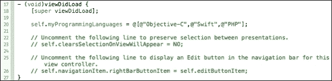

这里，你可以看到我们的自定义`UITableViewController`，包含三个`UITableViewCell`类，以及`myProgrammingLanguages`数组中的项：

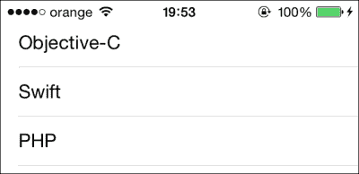

### 注意

使用`[tableView dequeueReusableCellWithIdentifier:@"anyReusableIdentifier" forIndexPath:indexPath]`创建单元格时，为单元格设置一个标识符，以便在它不再可见于屏幕上时与其他内容一起重用。

例如，如果一个表格视图有 15 个元素，在你的 iOS 设备上，屏幕上可以看到 12 个单元格，当你向上滚动以查看其他 3 个元素时，仍然会有 12 个单元格可见。在这种情况下，使用重用标识符，而不是创建 15 个`UITableViewCells`，它至少会创建 13 个不同的单元格（11 个完全可见的单元格和 2 个部分可见的单元格），当一个单元格从屏幕上消失（向上滚动）时，它会被重用来加载最新的可见元素，出现在底部。

# 对象不可变性

大多数由 Cocoa 和 Cocoa Touch 提供的类都使用不可变值创建对象。简而言之，一个不可变对象的内容只设置一次，之后永远不能修改其值。这些对象的内容在创建时指定。对象的创建可能发生在初始化过程中或之后，但只发生一次。

这里，我们可以看到一个初始化和创建的同时进行的数组。其内容是不可变的：

```swift
/*
  =============================================
  sampleArray is allocated, initialized and created with the strings "Item 1" and "Item 2"
  =============================================
*/
NSArray *sampleArray = [[NSArray alloc] initWithArray:@[
              @"Item 1",
              @"Item 2"]];
//This will throw a compile time error as NSArray is not mutable.
[sampleArray addObject:@"Item 3"];
```

在前一行代码中，`[sampleArray addObject:@"Item 3"];`将显示一个编译时错误，因为`sampleArray`被声明为`NSArray`而不是`NSMutableArray`，所以`sampleArray`在初始化后不能添加任何对象。

现在，我们创建另一个数组，首先在创建之前初始化它，这可能在代码的某个地方稍后发生：

```swift
/*
  =============================================
  secondSampleArray is allocated and initialized but not yet created.
  =============================================
*/
NSArray *secondSampleArray = nil;

/*
  =============================================
  Later in our code, we can create it setting contents to it, but it also happens once, the contents won't be changed.
  =============================================
*/
secondSampleArray = @[@"Item 1", @"Item 2"];
```

你可以看到我们将`secondSampleArray`设置为`nil`，在 Objective-C 中，`nil`表示`secondSampleArray`没有值或地址。只有在之后我们才将两个`NSString`字符串`"Item 1"`和`"Item 2"`插入到`secondSampleArray`中，使数组的大小变为 2。

# 对象可变性

Cocoa 和 Cocoa Touch 还为其不可变类提供了一些可变版本。一旦创建了一个可变对象，其内容可以被部分或完全删除或修改。正如我们在前一个主题中看到的不变数组对象——`NSArray`的一个实例——现在我将向你展示它的可变版本，即`NSMutableArray`类，我们将从这个类创建对象，如以下代码所示：

```swift
/*
  =============================================
  We will create now a mutable version of an array, using the class NSMutableArray.
  =============================================
*/
NSMutableArray *mutableSampleArray = [[NSMutableArray alloc] init];

/*
  =============================================
  Now, we assign to it the list of strings:
  "String 1", "String 2", "String 3"
  =============================================
*/
mutableSampleArray = @[@"String 1",
       @"String 2",
        @"String 3"];

/*
  =============================================
  Later, we change the 2nd item of the list with the string "Replacement String", having our array the list: "String 1", "Replacement String", "String 3"
  The indexes are 0 based and starts from 0
  =============================================
*/

[mutableSampleArray replaceObjectAtIndex:1 withObject:@"Replacement String"];
```

类的可变版本（在我们的例子中是`NSMutableArray`）与原始不可变版本`NSArray`有许多相似之处；然而，它们是不同的类。试图使用一个不可用于另一个的方法将生成编译错误。通常，不可变性是你应该尝试使用的，因为不可变性提供了一个保证，即在使用对象时其值不会改变。不可变性在字符串和字典等使用时也会带来性能优势，因为可变性在修改字符串或字典时需要分配和释放内存块，这会带来一些开销。

在`NSArray`和`NSMutableArray`的情况下，`NSMutableArray`不是线程安全的，如果在多线程中使用可能会出现奇怪的 bug。因此，通常情况下，除非你确实需要`NSMutableArray`，否则尽量使用`NSArray`作为默认的数组。

# 继承

要理解继承，可以将其想象成一个完美的生物树，你从父亲那里继承了一些行为特征，但不仅如此，你还有自己的。在 Objective-C 中，当一个类从另一个类继承时，就会发生类似的事情。

基本样本是 Cocoa 和 Cocoa Touch 提供的以`NS`开头命名的类，例如`NSString`、`NSArray`和`NSDictionary`。它们都继承自`NSObject`。每个类都有它们特有的方法来处理它们所持有的不同类型的内容，但它们都共享如`alloc`和`init`这样的方法。这两个从`NSObject`继承来的类方法分别分配内存和初始化对象：

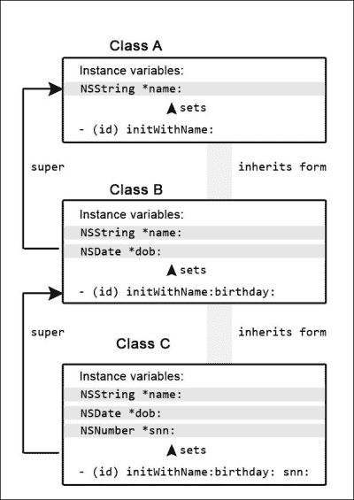

`alloc`方法很少被覆盖，执行单一任务并为创建的对象分配内存。然而，另一个继承示例是`init`方法，它也是从`NSObject`继承的。它在每个子类中进行了修改，创建了其他初始化方法以快速分配内容给对象。这些新的`init`方法是从原始的`init`方法继承的。这是一个`NSString`的例子：

```swift
  /*
  =============================================
    The variable is allocated and initialized but still has no content, its value is nil.
  ============================================= */
  NSString *simpleInitializedString = [[NSString alloc] init];
  /*
  =============================================
    Allocated and initialized by it's custom method, initWithString:, inherited from init. In this case, the variable is initialized with a content, "Hey!"
  ============================================= */
  NSString *customInitializedString = [[NSString alloc] initWithString:@"Hey!"];
```

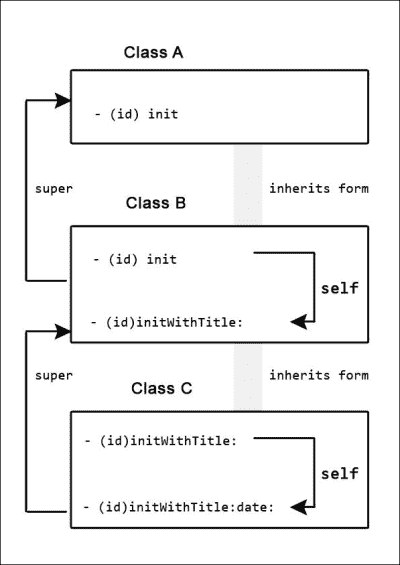

# 便利初始化器

分配和初始化方法将为对象的内容分配一块内存，并将其设置为空值，直到你分配自己的值。空值取决于对象的类型：布尔（BOOL）对象接收值`NO`，整数（int）接收`0`，浮点数（float）接收`0.0`，其余对象接收`nil`。

你可以先为你的对象分配内存，然后在代码中稍后初始化它，但这根本不推荐。

另一方面，你可以使用甚至创建我们所说的便利初始化器，这些初始化方法接收参数以分配不同和/或额外的值给实例变量。

为了更好地理解，我们现在将创建我们自己的对象类，并创建便利初始化器以用于不同的场景。首先，我们将创建一个从`NSObject`继承的类。它将返回一个浮点数，这是乘法分数的结果；我们将称之为`MultiFraction`：

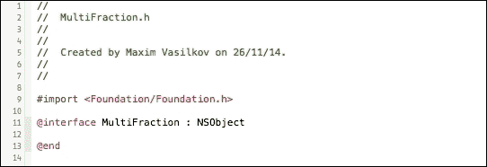

在我们的头文件`MultiFraction.h`中，我们将指定要包含在我们对象中的实例变量。它将包含三个值，我们将使用`property`关键字来定义`MultiFraction`类打算封装的信息，在这种情况下是类型为`NSInteger`的对象，分别命名为`firstNumerator`、`secondNumerator`和`denominator`：

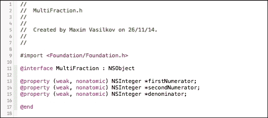

在实现文件`MultiFraction.m`中，通过省略`init`方法，它将使用从超类继承的初始化方法，在我们的例子中是`NSObject`，这将返回一个`nil`值。然而，我们想要实现一个便利初始化器，接受三个参数，将值保存以便其他方法使用以执行计算，并返回其结果。我们的初始化方法将被命名为`initWithFirstNumerator:`、`secondNumerator:`、`denominator:`：

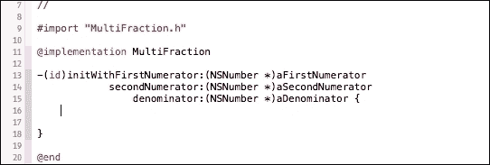

在我们的初始化方法内部，我们将存储传递给我们的对象的参数到各自的实例变量中，以防我们将来想要访问这些值中的任何一个，而不是直接计算结果：

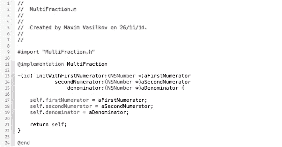

现在，我们可以在我们的 Xcode 项目中其他地方创建我们的对象，通过导入我们的头文件：

```swift
#import MultiFraction.h

/*
  =============================================
  Creating a MultiFraction object with the default init method, inherited from NSObject.
  ============================================= */
MultiFraction *firstMultiFraction = [[MultiFraction alloc] init];
// Later, when calling a method to calculate the fraction we will
// get a nil if we handle our instance variables or an error, if
// we try to calculate as they are, nil values.

/*
  =============================================
  Creating a MultiFraction object with the convenience initialization method we've created.
  ============================================= */
MultiFraction *secondMultiFraction = [[MultiFraction alloc] initWithFirstNumerator:25 secondNumerator:3 denominator:4];
// For the secondMultiFraction, when trying to calculate the
// fraction, we will get 18.75 as a float, if we take any
// argument as float when calculating the result.
```

# Objective-C 程序员的职责

如果您在其他编程语言（如 Java）中有所经验，现在正在转向 Objective-C，请忘记构造函数，它们在 Objective-C 中不存在。构造函数是语言级别的结构，它合并了分配和初始化操作，但它们有约束：

+   它们不返回任何内容。虽然 Objective-C 类的初始化方法`+ (`void`) `initialize`不返回任何内容，但 Objective-C 类的默认`(`id`) `init`方法返回一个`id`类型的对象。

+   构造函数的名称必须与类名相同。

+   当您调用超类时，作为第一条语句是必须的。

最后一点确保您不会处理垃圾数据，但这是一个限制。在 Objective-C 中，就像在 C 中一样，如果没有这个限制，您，作为程序员，将有更多的灵活性和能力，但这也意味着您需要负责处理垃圾数据。

# 单例模式

除了负责垃圾回收外，一个优秀的程序员还应该了解编程设计模式。设计模式是解决常见问题的解决方案，通常是可重用的代码解决方案，使开发者的生活更加轻松。在本节中，我将向您展示单例模式。单例在您需要一个单一实例并需要管理该单一实例（如写入日志文件）时非常有用。然而，单例可能会被误用为全局变量，这会导致不良的编程实践。单例也是通过静态方法实现的，这对单元测试来说并不好，因为它们不能被模拟或存根。因此，仅在正确的上下文中使用单例，而不是在遇到每个情况时都使用。

在 Objective-C 中，一次可以有多个类的实例（对象）。然而，如果您不需要呢？如果您出于某种原因只需要一个实例，而不需要更多，并希望避免该类的多个实例，在这种情况下，您使用单例模式。它确保只有一个类的实例，并且有一个全局方法可用于它。

苹果公司在`UIScreen`类中已经实现的一个例子是`mainScreen`方法。它是全局可用的，并返回其类的一个实例，确保它是唯一的。原因很明显，我们不需要超过一个主屏幕。它可以从项目的任何地方调用，如下所示：

```swift
 [UIScreen mainScreen]
```

当您第一次调用该方法时，实例尚未创建。它将被初始化并按预期返回；然而，从第二次调用该方法开始，它不会创建一个新的实例，而是返回现有的一个。这就是它确保只有一个实例存在的方式。让我们通过以下示例代码来了解：

在头文件中，我们首先创建一个全局方法来访问其实例：

```swift
@interface connectionLibrary : NSObject
+ (connectionLibrary*)mySharedInstance;
@end
```

然后，在你的实现文件中，实现这个方法，如下所示：

```swift
+ (connectionLibrary*)mySharedInstance {
  // First, we create a static variable to hold our instance 
  static connectionLibrary *_mySharedInstance = nil;
  /*
  Create a static variable to ensure the instance will be initialized only once
  */
  static dispatch_once_t initOnce;
/*
    Now, the core of the singleton pattern is GCD, Grand Central Dispatch, that executes a block where the initialization method is never called once the class was already initiated.
*/
    dispatch_once(&initOnce, ^{
    _mySharedInstance = [[connectionLibrary alloc] init];
});
  return _mySharedInstance;
}
```

现在，您可以从代码的任何地方初始化和访问这个实例：

```swift
connectionLibrary *sharedInstance = [connectionLibrary mySharedInstance];
```

# 创建`@property`

在对象中存储数据有两种方式，它们是属性和实例变量。后者应仅用于对象和由类本身独家处理的数据，而不是来自外部。另一方面，属性和值对于对象和值是可从外部（由其他类）访问的。

当使用实例变量时，你可以创建公开或私有的实例变量。区别基本上在于你声明它们的位置，有时你需要它们可以被其他类访问，而在其他情况下，没有必要将它们暴露给其他类。如果它们在头文件中作为`@interface`块的一部分声明，则具有公共作用域，如果它们在实现文件中作为`@implementation`块的一部分声明，则具有私有作用域。通常，它们应该是私有的：

```swift
@implementation Book {
  int _numberOfPages;
  int _numberOfChapters;
  NSArray *_authorsInfo;
}
```

为了更容易理解你的代码，实例变量以一个下划线开头；这不会影响它们的工作方式，但它是一个高度推荐的约定。

实例变量是私有的，只能由类或子类访问，并且它被包含它的类封装，而属性是公开的，可以被其他类访问。属性在作为类扩展的一部分声明时也可以是私有的，但它们通常是公开的，因为你想从外部访问它们。通过访问，有两种选项，获取或设置其内容。Objective-C 会自动为每个声明的属性生成获取器和设置器。为了声明具有公共作用域的属性，请在你的头文件中按照以下方式操作：

```swift
@interface Book : NSObject
@property (strong, nonatomic) NSString *chapterNote;
@end
```

上述代码主要告诉其他类`Book`类有一个公开属性，可以通过`chapterNote`访问：

```swift
Book *objCBook = [[Book alloc] init];
// This is our setter, we are setting an value to it
objCBook.chapterNote = "I really love this chapter";
//This non dot syntax setter is also valid [objCBook setChapterNote:@"I really love this chapter"];
/*
  This is our getter, we get the value hold on chapterNote and save it in myLastNote
*/
NSString *myLastNote = objCBook.chapterNote
```

# 创建自定义方法

在 Objective-C 中，声明方法时以`-`或`+`开头，正如你将在本节中看到的那样。后者声明了一个静态方法，而前者`-`声明了实例方法。作为开发者，你不会经常声明静态方法（以`+`开头）。

静态方法通常用于你不需要在该方法中创建类的实例时，而实例方法用于你需要该实例来修改其状态时。实例方法更常用，因为实例方法让你可以访问类的实例变量。

要声明一个方法，你需要遵循一种语法。你需要以下实体：

+   指定方法类型的符号

+   它将返回的数据类型

+   方法名称

+   对于每个参数：

    +   参数类型

    +   参数的名称

+   方法内的代码

按照我们的示例，在`mySpecialTableViewController`中，让我们声明一个实例方法，它将接受一个参数，一个字符串（`NSString`）。我们的方法将返回`myProgrammingLanguages`数组的内容作为一个单独的字符串。每个对象都将跟随提供的参数。我们的方法将被命名为`convertToStringWith`。

在我们转到实现文件之前，必须在头文件中声明该方法，不这样做可能会导致调用方法时出错，因为头文件定义了暴露给外部的哪些方法。

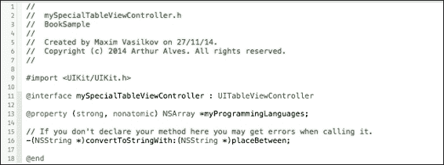

现在，转到实现文件并实现该方法：

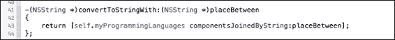

在此情况下，当调用方法时，如果 `myProgrammingLanguages` 数组包含以下字符串值："Objective-C", "Swift", 和 "PHP"，结果将是一个包含传递参数的唯一的字符串，如下面的示例所示：

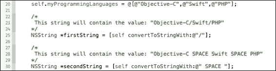

有时候你不想向方法传递任何参数。这是可能的；你只需要知道返回的数据类型和方法名称：

```swift
-(BOOL) doYouLikeThisBook
{
  return true;
}
```

关于方法返回的数据类型有两个特殊情况，当你不知道它时和当你不会返回任何内容时。在第一种情况下，你应该使用 `id`，如下所示：

```swift
-(id) initSomethingWithoutKnowingTheType
{
  self = [super class];
  return self;
}
```

另一方面，如果你不想返回任何内容，使用 `void`。

```swift
-(void) storeUserDetails:(NSString *)userName withID(int)userID
{
  self.name = userName;
  self.id = userID;
}
```

# 字符串格式化

当处理不同类型的对象时，特别是将它们插入/附加到字符串中，你需要在字符串中指定它们的类型，为此我们使用格式说明符。例如，打印到控制台需要打印一个字符串；这是唯一接受的格式。让我们看看如何将不同的对象插入其中，以便正确打印到控制台：

```swift
// Here we print a message, it's already a string.
NSLog(@"I'm a message. A string");
```

然而，如果你想打印存储在属性或实例变量中的值，你应该在内部指定其类型，以便正确地用外部的值替换它：

```swift
/*
    Now we print the string value stored on a property
    The console will print the message: "Hello, Mr. Gaius Julius Caesar"
*/
NSString *myStringObject = @"Gaius Julius Caesar";
NSLog(@"Hello, Mr. %@", myStringObject);
```

注意消息中的 `%@`。它指定值是一个字符串。这就是我们如何使用百分号 `%` 后跟一个特定的关键字（转换说明符）来指定对象的类型。为字符串使用不同的转换说明符会导致编译错误。

大多数说明符支持多种数据类型：

| 格式说明符 | 支持的对象类型 |
| --- | --- |
| `%d` | 整数（有符号整型），32 位 |
| `%u` | 整数（无符号整型），32 位 |
| `%x` | 以十六进制值表示的整数（无符号整型），32 位 |
| `%o` | 以八进制值表示的整数（无符号整型），32 位 |
| `%%` | 打印 `%` |
| `%f` | 浮点数，双精度浮点数（点浮点数），64 位 |
| `%e` | 浮点数，双精度浮点数（点浮点数）以科学记数法表示，64 位 |
| `%g` | 浮点数，双精度浮点数（点浮点数）如果指数小于-4，则按 `%e` 格式，否则按 `%f` 格式，64 位 |
| `%c` | 无符号字符（无符号字符），8 位 |
| `%S` | 以空指针结尾的 16 位 Unicode 字符数组 |
| `%p` | 以十六进制表示的空指针字符（`void *`），以 0x 开头 |
| `%a` | 以科学记数法表示的双精度浮点数（点浮点数），以 0x 开头，小数点前有一个十六进制数字，使用小写的 `p` 来引入指数，64 位 |
| `%F` | 以十进制表示的双精度浮点数（点浮点数） |
| `%hhd` | BOOL |

# 摘要

在本章中，我们能够详细地看到对象，了解继承的工作原理以及如何利用它来创建更强大的类。你学习了关于对象的可变性和不可变性，实例变量和属性的工作方式，它们是什么，以及除了分配、初始化和自定义方法之外如何创建它们，以及如何创建自己的对象。在下一章中，我们将涵盖应用数据管理，例如资源优化、缓存和数据保存。所以，我们下一章见。
