# 第九章：内存管理和调试

回到 iOS 3 和之前版本的美好时光，计算机内存的管理是一项繁重的工作，因为每个指针和内存分配都需要精确跟踪，以免你遇到可怕的内存泄漏情况，这可能是由于你的代码中缺少`release`键码等原因。然而，随着 iOS 4 及更高版本的发布，苹果引入了 ARC，全世界的开发者都欢欣鼓舞，因为他们认为内存管理的日子已经结束了。然而，遗憾的是，情况并非如此，因为 Objective-C 不像 Java 或 C#等其他编程语言那样，有一个垃圾回收器会为你进行内存管理和垃圾回收。ARC 只是一种使内存管理简化的工具，这样我们就不需要显式地调用`release`方法，例如`[myArray release]`，因为 ARC 会为我们处理这些。所以，尽管在开发 iOS 应用时我们需要的用于内存管理的脑细胞减少了，但我们仍然需要在引入 ARC 后进行一些基本的内存管理，而这一章将帮助你在这个过程中。因此，为了开始，以下是本章我们将要涵盖的主题：

+   内存泄漏

+   强/弱引用

+   保留周期

+   内存过度使用

+   使用调试器和断点

+   收集 AppPlumbing 泄漏的数据

+   使用 LLVM / Clang 静态分析器

+   使用 NSZombie

# 内存泄漏

如果你习惯在`alloc`/`init`方法或`retain`语句之后调用`release`方法，ARC 允许你省去这些步骤，因为即使你仍然可以调用你的`alloc`/`init`方法或`retain`语句，也不需要添加`release`语句，因为 ARC 会为你处理这一切。这引入了简洁性，并使你的代码更加简洁。以下是一个示例：

在 ARC 之前：

```swift
Class1 *obj1 = [[Class1 alloc] init];
Class1 *obj2 = [obj1 retain];
[obj2 release];
[obj1 release];
```

在 ARC 之后：

```swift
Class1 *obj1 = [[Class1 alloc] init];
Class1 *obj2 = obj1;
```

如果你编写的代码没有调用如“在 ARC 之后”中看到的`release`方法，你将有两个内存泄漏出现在你的代码中，这是由于你忘记添加两个`release`方法。你会注意到行数已经减少，代码更容易理解，因为不需要调用任何`release`语句。所以，有了 ARC，人们可能会误以为他们的内存管理问题已经解决，但实际上，即使有 ARC，内存泄漏仍然可能发生，我将向你展示如何处理这种情况。

ARC 有助于自动化添加`retain`/`release`/`autorelease`语句到你的代码中，但即使有 ARC，内存泄漏仍然可能发生。这并不明显，因为人们认为有了 ARC，就不会有任何内存泄漏。然而，情况并非如此，即使有 ARC，内存泄漏仍然可能发生，但你可以使用一些方法来查找内存泄漏。然而，首先，让我们通过一些术语来了解一下。

## 强/弱引用

强引用与`retain`属性同义，即通过将对象的引用计数增加 1。在 ARC 的世界里，`retain`和`assign`属性不再使用，分别被`strong`和`weak`所取代。

强引用是对象的默认属性，因为它意味着你想要获得对象的拥有权，而弱引用意味着另一个对象正在持有你想要的对象的拥有权，然后你不能阻止它被释放，因为拥有权不属于你。

`强引用`和`弱引用`分别由 Objective-C 中的`strong`和`weak`关键字表示。即使在自动引用计数（ARC）的情况下，仍然可能出现内存泄漏，并且使用 ARC 的一些内存泄漏原因包括：

+   保留周期

+   创建二级线程而不为其提供自己的自动释放池

+   使用具有非 ARC 代码的框架

+   在块内部引用自身，这会创建一个强引用

## 保留周期

当两个对象，例如父对象和子对象，相互具有强引用时，就会发生保留周期。一个简单的例子如下代码：

```swift
@interface MyParent : NSObject
@property (strong) MyChild *myChild;
@end

@interface MyChild : NSObject
@property (strong) MyParent *myParent;
@end
```

你可以使用以下代码创建`MyParent`类型的对象：

```swift
MyParent *myParent = [[MyParent alloc] init];
```

保留周期是由前一行代码创建的，其外观如下：

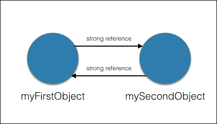

在前面的图中，你可以快速看到所谓的保留周期，因为**myParent**对**myChild**有强引用，而**myChild**对**myParent**也有强引用。这是一种内存泄漏的形式，如果一个对象试图释放第一个对象的一个实例，由于第二个对象对第一个对象有强引用，因此无法释放，这样就创建了保留周期。请注意，ARC 不会为你修复所有的内存泄漏，所以你必须，作为开发者，使用一些工具来修复这种类型的内存泄漏，我们将在后面介绍。由于这种类型的内存泄漏不是很明显，修复它需要更多的努力和思考，但幸运的是，苹果提供了一些工具，将极大地帮助我们。

避免保留周期发生的一般规则是记住这一点——如果对象 A 想要无限期地保留对象 B，那么对象 A 必须在层次结构树中位于对象 B 之上，对象 A 必须对对象 B 有强引用。如果你有在层次结构树中处于同一级别的对象，那么你应该使用弱引用来避免保留周期。所以，在前面的图中，为了避免保留周期，`mySecondObject`不应该对`myFirstObject`有强引用。然而，如果你确实需要让`mySecondObject`对`myFirstObject`有引用，那么应该将其设置为弱引用而不是强引用。树形层次结构是安全的，并且请记住，放置弱引用可以避免保留周期和内存泄漏。

## 内存过度使用

如果你使用了足够的 iOS 应用，你将注意到一些应用在你无意识地点击按钮或执行某些操作后，会强制关闭自己。这是 iOS 处理内存问题的方法，它基本上就是这么说，“这个应用有内存泄漏，你没有足够的内存来处理它，所以这个应用必须关闭。”

总共有三个 iOS 内存警告级别。当内存不足时，级别 1 和 2 将在你的 Xcode 控制台中显示，如下所示。级别 3 发生在你的应用程序崩溃并返回 Springboard 时，这是指 iOS 主屏幕的术语：

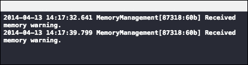

# 使用调试器和断点

使用 IDE，如 Xcode，进行调试的最基本概念之一是断点概念，你可以通过断点在特定时间点停止你的运行程序。使用断点非常简单；你只需打开你的 Xcode 项目，点击窗口左侧的代码位置，就会出现一个蓝色指示器，如下所示：

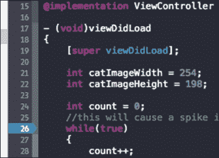

接下来，当你运行你的应用程序，当程序在`while(true)`语句的行号**26**处遇到时，程序将停止，你可以在行号**26**之前将光标移到任何变量上，Xcode 将显示该变量在该时间点包含的值。断点在调试内存泄漏时非常有用，其中你有一个关于泄漏出现位置的概念，并想查看该变量的值或内存地址。你可以设置多个断点，并使用“单步执行”命令来逐行执行代码，以查看程序的执行情况。以下是在使用断点调试时可能会遇到的图标列表：


在前面的屏幕截图中，从左到右的四个图标，你可以用于断点调试，如下所示：

| 图标 | 描述 |
| --- | --- |
| 继续程序执行 | 这将使你的程序继续执行，直到遇到下一个断点或程序结束 |
| 单步执行 | 这将使你的程序在当前作用域中执行下一行代码 |
| 步入 | 这将使你的程序跟随方法进入其自身的代码并查看方法的代码 |
| 跳出 | 这将带你从当前上下文退出，并调用程序堆栈中一个步骤向上的方法 |

断点在检查程序由于断点而停止时变量在特定时间点的值时非常有用。当内存不足时，Xcode 控制台将显示四个用于断点调试的图标，以帮助你调试与内存相关的和其他逻辑错误。

# 收集你的应用数据

请注意，内存警告级别并不一定意味着你的应用程序正在泄漏内存。可能存在这样的情况，即你的应用程序正在加载或对大型资源（如数据文件、图像、视频等）执行操作，这将触发内存警告。ARC 将在稍后处理清理工作。然而，如果你看到内存警告级别为 2，那么你应该开始检查你的代码，因为下一个内存警告级别将是实际的应用程序崩溃。

调试崩溃和内存泄漏就像捉迷藏或扮演侦探的游戏。周围会有很多线索，这些线索将引导你找到代码中导致令人烦恼的崩溃或内存泄漏的罪魁祸首。苹果为我们提供了许多工具和日志，这些工具和日志将对我们调试代码非常有用。我们将在这里介绍一些常用的方法，以便你能够尽快开始修复这些问题。

其中一种较简单的方法是通过你的电缆将你的设备连接到你的机器，启动 Xcode，它将自动检测你连接的设备，然后按*Shift* + *Command* + *C*激活你的调试控制台，这是一个位于 Xcode 屏幕右下角的黑色屏幕。或者，你可以从 Xcode 菜单中选择**视图** | **调试区域** | **激活控制台**，如下所示：


这将显示当你通过电缆连接到 Xcode 运行应用程序时所有的 NSLog 和崩溃输出。

然而，在测试你的应用程序时，有时它并未连接到你的 Xcode，而在那一刻崩溃。在这种情况下，前面提到的方法不起作用，那么你该怎么办呢？不要担心，一旦你回到你的桌子前，将你的 iOS 设备连接到你的机器并启动 Xcode，你就有另一种方法获取崩溃日志。

一旦你启动了 Xcode 并将你的设备连接到应用程序崩溃的地方，Xcode 实际上能够访问设备上的崩溃日志。为此，你只需要点击窗口并从 Xcode 菜单中选择**组织者**，如下面的截图所示：

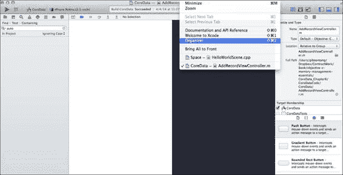

这将打开你的**组织者**，它实际上是一个所有连接到 Xcode 的设备的仓库，显示了有关应用程序的配置文件和截图等信息。然而，我们真正感兴趣的是崩溃日志。

因此，点击顶部的**设备**按钮，你将看到迄今为止连接到你的设备的所有设备开发者信息。

点击你当前连接的设备，它由一个绿色圆圈表示。然后，选择**设备日志**选项，这将打开一个包含已崩溃应用程序的另一个列表。在那里，你可以按**进程**（应用程序名称）、**类型**或**日期/时间**对结果进行排序。点击一个项目将在屏幕右侧显示崩溃日志。在那里，你可以看到回溯，它实际上是所有在崩溃前被调用的方法的列表。导致你崩溃的代码的最后一部分将在回溯的顶部，你应该从底部开始查看，以了解你的应用程序是如何工作的，以及它穿越的所有函数和方法：

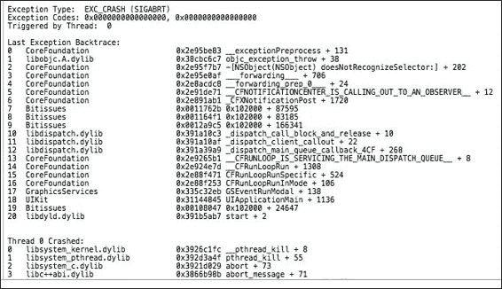

# 管道内存泄漏

接下来，我们将查看 Xcode 中一个特殊的工具，在应用程序运行时获取有关应用程序的详细信息。这个特殊工具实际上是一套工具，可以执行以下功能：

+   检查和监控一个或多个进程

+   记录一系列用户操作并回放它们，就像录像机一样

+   保存用户界面录制并从 Xcode 中访问它们

+   这套工具统称为 Instruments，它们在追踪难以复现的 bug（如随机崩溃和调试内存泄漏）时比 NSLogs 更有用。

+   分析你的应用程序性能

+   对你的应用程序进行压力测试

+   更好地了解你的应用程序是如何工作的

在本节中，我将教你 Instruments 的基础知识以及如何使用它来调试一些代码。所以，为了开始，你只需要遵循这三个简单的步骤：

1.  点击 Xcode IDE 左上角的**Xcode**菜单。

1.  从出现的列表中选择**打开开发者工具**。

1.  将会弹出一个子菜单，其中包含**Instruments**项，你应该点击它：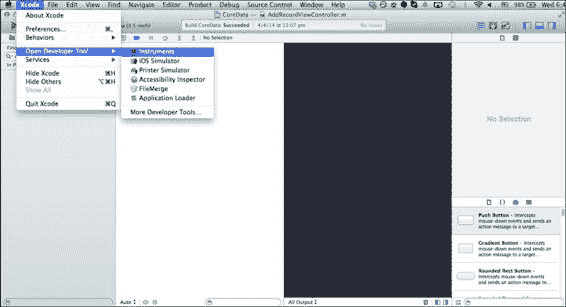

1.  然后，你应该会看到一个弹出窗口，其中包含以下选项：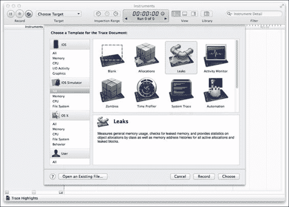

    有如**泄漏**、**分配**和**时间分析器**等选项，它们显示了所有各种工具。

1.  为了进行一个小测试运行，打开`Instruments.xcodeproj`文件，它有非常泄漏的代码，我们将看到如何使用 Xcode 调试工具**Instruments**来理解代码运行时内存分配峰值。所以，为了开始，让我们使用 Xcode 性能分析工具通过点击**产品** | **分析**菜单选项来查看我们的内存峰值，如图所示：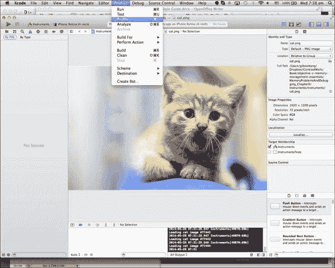

1.  然后，Xcode 将显示**仪表**窗口，然后您需要选择**分配**选项并点击**分析**按钮。一旦点击了**分析**按钮，泄漏的应用程序将开始执行，您将看到以下屏幕。注意您将看到的快速上升的图表以及**所有堆分配**行，它将显示内存消耗以非常快的速度增加：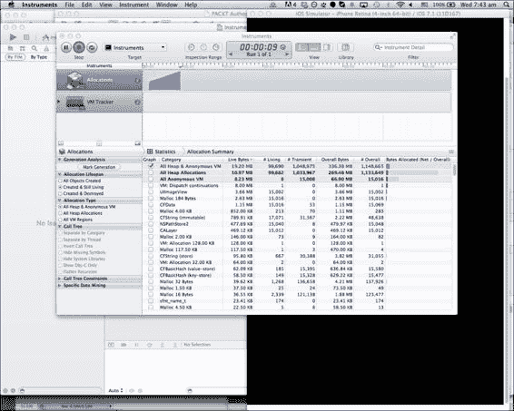

因此，为了重申步骤，我们需要做以下几件事：

1.  打开 Xcode。

1.  点击**产品** | **配置文件**。

1.  点击**分配** | **配置文件**。

1.  查看**所有堆分配**部分。

1.  查看图上的内存分配。

1.  检查块内部是否存在自身保留周期或使用，这可能会提示或创建一个保留周期。

# 使用 LLVM / Clang 静态分析器

Instruments 工具套件旨在在您的应用程序运行时使用。然而，正如俗话所说，“预防胜于治疗”。因此，在您拉起 Instruments 以在运行时调试应用程序之前，有一个很好的步骤您应该遵循，那就是对您的代码库执行静态分析。

静态分析是一种机制，其中使用一系列算法和技术来分析您的源代码以查找错误。这听起来可能像是您在编译阶段所做的事情，但这里有一个重要的区别。编译您的代码将告诉 Xcode 检查您的代码库中的语法错误，并标记出它检测到的任何错误或警告。静态分析更进一步，因为它分析您的代码以找到在运行时可能出现的潜在错误。静态分析允许程序计算程序的所有可能的执行情况，并对代码进行质量、安全性和安全性分析，以便您能够被提醒有关溢出、除以零、指针错误等问题。因此，将静态分析视为运行时测试，但是在您的代码开始执行之前。

随着静态分析深入到您的代码，Xcode 进行静态分析所需的时间将会更长。因此，仅将静态分析用于调试难以修复的错误，或在将应用程序提交到 iTunes App Store 之前作为最终步骤。要激活应用程序的静态分析，请点击**产品** | **分析**，让 Xcode 开始对您的代码进行静态分析：

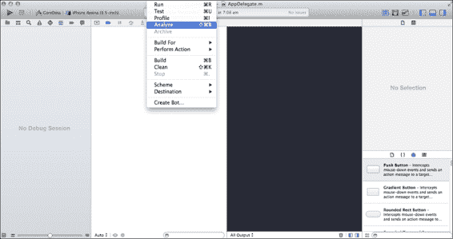

根据您的代码库的大小，静态分析可能需要几秒钟到几分钟，因为它深入到您的代码中，以挖掘出任何潜在的问题。只有几行代码的项目进行静态分析可能只需几秒钟，而拥有数千行代码的大型项目可能需要几分钟或更长时间，具体取决于项目的大小。然后，点击 Xcode 屏幕左侧，如图所示，以查看 Xcode 通过静态分析发现的潜在问题。

默认情况下，静态分析会深入到代码库的每个角落。这会在你的机器上消耗大量资源，如果你有一个大的代码库或者一个慢速的机器，静态分析所用的时间可能会相当长。因此，如果你不想进行深入分析，你可以调整 Xcode 使用的静态分析级别，这样可能不会发现像深度静态分析那样多的问题，但仍然可以帮助暴露一些问题。静态分析很有用，因为它可以暴露出编译器无法检测到的错误，如溢出、除以零等。要更改静态分析的级别，请点击左侧的项目，然后选择 **构建设置**，然后查找 **'分析' 的分析模式**选项，并将其设置为 **浅层（更快）**，如图所示：

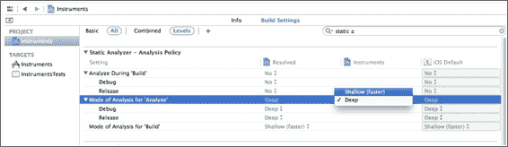

## 使用 NSZombie

最后但同样重要的是，让我向你介绍 NSZombie 的概念。NSZombie 是一种内存调试辅助工具，可以帮助你在调试内存泄漏时。正如你所知，当一个对象的保留计数为 0 时，该对象将被释放并不再存在。然而，如果你启用了 NSZombie，保留计数为 0 的对象将变成 NSZombie 实例。然后，当这个 NSZombie 从你的代码的另一个地方收到消息时，它将显示警告而不是使你的应用崩溃或表现出不可预测的行为。

NSZombie 对于调试微妙的过度释放或 autorelease 错误很有用，因为这些类型的错误往往会表现为崩溃或奇怪的行为。NSZombie 将将这些崩溃和奇怪的行为显示为警告，这有助于你的调试。

NSZombies 处于一种奇怪的半存活/半死亡状态，因为当保留计数为 0 时，它们不会被释放，但它们也不是完全活着的。因此，NSZombie 是一个合适的术语，用来描述这些半活/半死的对象。

然而，一个需要注意的重要点是，一旦你完成调试，就应该禁用 NSZombies。NSZombies 消耗内存，就像保留计数为 0 的任何对象一样，它们被转换成 NSZombie，仍然占用内存而不是被释放。所以，如果你不禁用 NSZombie，它将占用更多的内存。为了利用 NSZombie 的力量，使其记录警告而不是使你的应用崩溃或表现出不可预测的行为，只需遵循以下简单步骤来激活 NSZombie：

1.  在你的 Xcode IDE 中点击 **产品** 菜单。

1.  选择 **方案** 菜单项。

1.  继续点击 **编辑方案...** 以打开弹出窗口启用 NSZombie：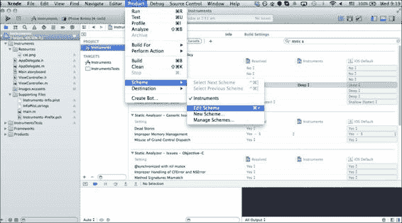

1.  然后，你会看到一个带有 **启用僵尸对象** 选项的弹出窗口出现。点击此复选框，NSZombie 将被启用。

1.  最后，运行你的项目，你将看到 NSZombie 在行动中：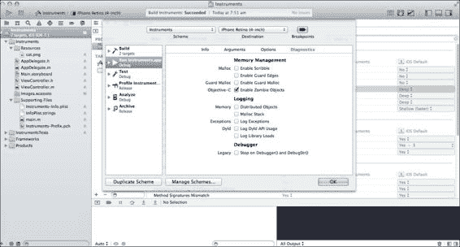

最后，这里有一个表格概述了在哪种情况下应该使用哪种调试工具，以便你可以根据情况使用正确的工具：

| 调试工具 | 适当的上下文 |
| --- | --- |
| Xcode Instruments | 这用于在运行时找到导致崩溃的内存泄漏 |
| 静态分析器 | 这用于在代码执行前分析代码库中的问题，例如除以 0、内存问题等 |
| NSZombie | 这用于显示警告而不是因为内存泄漏而崩溃 |

# 摘要

我们讨论了内存管理理论的一些方面，例如保留循环和强/弱引用。然后，我们转向内存泄漏的后果和不同的警告级别。在此之后，我们发现了如何获取崩溃日志以帮助您获取有关您的应用程序和代码的信息。然后，我们查看了一系列 Xcode 拥有的各种工具列表，例如 Instruments 和 NSZombies，这些工具将帮助我们调试由多种原因引起的内存泄漏，例如未释放对象或过早释放对象。最后，我们以静态分析、启用 NSZombies 及其用途的描述作为结束。有了所有这些工具和信息，我希望调试内存泄漏和错误对您来说已经变得更加容易，因为您拥有了完成这项任务所需的所有工具，使这个过程不再那么痛苦。

在下一章中，我们将介绍一些关于内存管理的开发者技巧，例如获取器、设置器和其他技巧。那么，让我们进入下一章。
