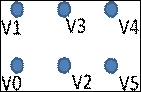
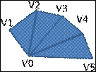
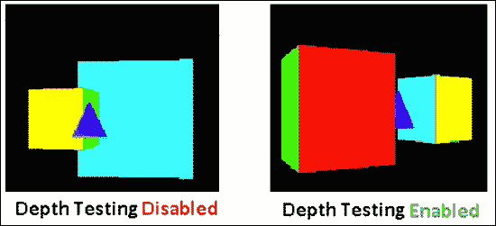

# 第二章：OpenGL ES 3.0 基础

在本章中，我们将涵盖以下小节：

+   使用 GLPI 框架构建原型

+   实现触摸事件

+   使用顶点数组渲染原语

+   OpenGL ES 3.0 中的绘图 API

+   使用顶点缓冲对象进行高效渲染

+   使用模型、视图和投影类比进行变换

+   在 GLPI 中理解投影系统

+   OpenGL ES 3.0 中的剔除

+   OpenGL ES 3.0 中的深度测试

# 简介

本章将详细描述理解 3D 图形并使用 OpenGL ES 3.0 实现它们所需的基本概念。在本章的开始，我们将构建一个迷你便携式 3D 引擎，这将有助于快速创建基于原型的项目。它在 OpenGL ES 3.0 可编程管道中轻松管理代码。您将学习事件处理，以在 Android 和 iOS 平台上管理屏幕表面的手势。这些将有助于实现基于手势的应用程序。

随着我们继续前进，我们将借助模型、视图和投影的类比来讨论 3D 图形中的基本变换。在核心方面，我们将探讨在 OpenGL ES 3.0 中渲染给定几何形状的不同原语类型，并讨论使用 **顶点缓冲对象**（**VBO**）可能提高渲染性能的优化技术。随着接近尾声，我们将了解几何剔除。它控制着对象的前面或后面的渲染。本章的最后一个小节将实现深度测试，这是计算机图形学中的一个非常重要的方面。

# 使用 GLPI 框架构建原型

GLPI 是一个 OpenGL ES 平台无关的框架。它是一个高度有用的迷你 3D 引擎，可以快速开发原型应用程序。它为渲染引擎、着色器编译、3D 变换、网格管理、缓冲区管理、纹理等提供了高级实用类。该框架主要支持 Android 和 iOS 平台，并设计为易于移植到其他平台，如 WinCE、Blackberry、Bada 等。在本章中，我们将详细讨论此框架的每个模块。

此框架为 OpenGL ES 3.0 原型应用程序的快速开发提供了专用模块。它包括以下三个主要模块，如图所示：


让我们逐一详细探讨它们：

+   **GLPI 模块**：此模块是 GLPI 框架的骨干。它包含以下类：

    | 类别 | 功能 |
    | --- | --- |
    | `程序管理器` | 此类负责从程序对象创建着色器程序。它维护所有程序对象在一个可管理的单一组件中，其他模块可以在需要时使用。 |
    | `着色器管理器` | 此类负责生成着色器对象。它自动化了为程序管理器加载、编译和生成着色器对象的流程。 |
    | `变换` | 此类提供用于 3D 变换操作的高级 API。它还提供了包装函数来模拟固定功能管道 API，例如变换、模型视图投影矩阵、推和弹出矩阵操作等。 |
    | `GLUtils` | 此类为 GLPI 模块提供辅助函数。 |

+   **模型模块**：此模块将帮助我们为我们的应用程序创建定制模型。`Model`类本质上代表我们在设备屏幕上感兴趣渲染的任何类型的几何对象。此类提供模型的初始化、状态管理、处理和渲染例程。它还在模型内提供触摸事件处理。

    ### 注意

    渲染模块的`Model`类代表我们在屏幕上感兴趣渲染的任何类型的 3D 渲染对象。例如，如果我们愿意渲染一个三角形，那么我们应该创建一个`Triangle`类，这个类必须从`Model`类派生，并且应该作为子成员添加到`Renderer`类中。

+   **渲染模块**：这是渲染引擎的管理器，它充当底层平台（如 Android 或 iOS）和我们的平台无关图形框架之间的接口。它管理整个图形系统渲染的生命周期。除此之外，我们创建的定制模型也将由它管理。

## 如何操作...

在上一章中，我们为 Android 和 iOS 平台实现了 Hello World 三角形的配方。现在，你将通过在 GLPI 中重新实现相同的配方来学习使用 GLPI 框架。你可以通过在本章的示例代码中定位`GLPIFrameworkIntro`来参考此配方的源代码。在以下步骤中，我们将为 Android/iOS 平台设置 GLPI 框架，并学习如何使用它。

**按照以下说明为 Android 平台设置 GLPI**：

1.  创建`Android.mk` make 文件。make 文件包括用于编译目的的`zlib` make 文件的路径。它用于读取/写入压缩文件。`zlib`文件被编译为共享库并包含在项目中。附加库包括`-lEGL -lGLESv3`，它提供对 EGL、OpenGL ES 3.0 的支持，以及`-llog`，它允许记录有助于调试应用程序的日志信息：

    ```java
    # Get the current local of the working directory
    MY_CUR_LOCAL_PATH := $(call my-dir)

    # Initialize variables to store relative directories
    FRAMEWORK_DIR      = ../../../../GLPIFramework
    SCENE_DIR          = ../../Scene
    GLM_SRC_PATH       = $(FRAMEWORK_DIR)/glm
    ZLIB_DIR           = $(FRAMEWORK_DIR)/zlib

    # Clear the any garbage variable and include ZLIB
    include $(CLEAR_VARS)
    include $(MY_CUR_LOCAL_PATH)/../../../../GLPIFramework/zlib/Android.mk

    LOCAL_PATH := $(MY_CUR_LOCAL_PATH)
    include $(CLEAR_VARS)

    # Name of the library
    LOCAL_MODULE     :=   glNative

    # Include the library and GLPI framework files
    LOCAL_C_INCLUDES :=   $(GLM_SRC_PATH)/core \
                          $(GLM_SRC_PATH)/gtc \
                          $(GLM_SRC_PATH)/gtx \
                          $(GLM_SRC_PATH)/virtrev \
                          $(ZLIB_DIR) \
                          $(FRAMEWORK_DIR) \
                          $(SCENE_DIR)

    # Specify the source files to compile
    LOCAL_SRC_FILES :=    $(FRAMEWORK_DIR)/GLutils.cpp \
                          $(FRAMEWORK_DIR)/Cache.cpp \
                          $(FRAMEWORK_DIR)/ShaderManager.cpp \
       $(FRAMEWORK_DIR)/ProgramManager.cpp \
       $(FRAMEWORK_DIR)/Transform.cpp \
       $(SCENE_DIR)/Model.cpp \
       $(SCENE_DIR)/Renderer.cpp \
       $(SCENE_DIR)/Triangle.cpp \
       ../../NativeTemplate.cpp

    # include necessary libraries
    LOCAL_SHARED_LIBRARIES    := zlib
    LOCAL_LDLIBS              :=  -llog -lEGL -lGLESv3

    # Build as shared library
    include $(BUILD_SHARED_LIBRARY)
    ```

1.  在同一目录下创建一个新的`Application.mk` make 文件，并将 STL、RTTI 和异常支持添加到你的项目中，如下面的代码行所示。对于 OpenGL ES 3.0，Android 平台的 API 级别必须为 18 或更高：

    ```java
    APP_PLATFORM    := android-18
    APP_STL         := gnustl_static
    APP_CPPFLAGS    := -frtti –fexceptions
    ```

1.  从现在开始，章节包含两个独立的 Android 和 iOS 开发部分。这些部分将通过名为 Android 和 iOS 的文件夹名称来识别。`NativeTemplate.h` 和 `NativeTemplate.cpp`（如第一章所述）放置在这些文件夹旁边。如果我们现在查看这些文件，我们会意识到它们比以前更干净，代码也更少。我们已经将这些文件中的代码移动到了 `Scene` 文件夹中的其他文件中：

1.  `Scene` 文件夹包含 `Model` 和 `Renderer` 类，负责生成模型和渲染它们。该文件夹中还存在另一个类，即 `Triangle` 类。它包含渲染蓝色三角形的代码。确保所有类都包含在 `Android.mk` 中：

1.  在 `assets` 文件夹下创建一个名为 `Shader` 的新文件夹，并在该文件夹中创建着色器文件（`BlueTriangleVertex.glsl` 和 `BlueTriangleFragment.glsl`）。将之前存在于 `NativeTemplate.cpp`（以字符串形式）中的着色器程序移动到新创建的 `Shader` 文件夹中。从现在开始，我们将在这个文件夹中管理我们的着色器程序：

**对于 iOS，设置框架的步骤相对简单，如下所示**：

1.  将所有 GLPI 框架内容（除了 `zlib` 库）导入到您的项目中。这个库仅用于 Android 的文件管理。iOS 不需要它。

1.  在导入的内容中，转到 `glm` 库并删除 `core` 文件夹（这个文件夹包含一些可能由于存在多个 `main()` 条目而导致现有项目出现错误的示例程序）。

1.  通过转到 `Android` | `Asset` | `Shader` 文件夹（`BlueTriangleVertex.glsl` 和 `BlueTriangleFragment.glsl`）将着色器文件导入到当前项目中。

1.  在 `main.m` 中设置 `"FILESYSTEM"` 环境变量。这将提供设备中应用程序的当前路径：

    ```java
    setenv( "FILESYSTEM", argv[ 0 ], 1 );
    ```

    

使用 GLPI 框架非常简单。我们必须遵循以下规则集来渲染我们的 3D 几何模型：

1.  创建一个新的自定义模型类，该类从 `Model` 类派生。例如，我们在 `Triangle.h` 中创建了从 `Model` 类派生的 `Triangle` 类：

    ```java
    class Triangle : public Model{
    private:
        // variables for holding attribute values
        GLuint positionAttribHandle,colorAttribHandle;
        GLuint radianAngle;

        float degree; // Rotation in degree form
        float radian; // Rotation in radian form

    public:
        Triangle(Renderer* parent = 0); // Constructor
        ~Triangle();                    // Destructor

        void InitModel();  // Initialize the model here
        void Render();    // Perform the rendering
    };
    ```

1.  打开 `constant.h` 并编辑枚举 `ModelType`。添加您选择的枚举以识别模型类型。例如，为 `Triangle` 和 `Cube` 添加了两个枚举。这个枚举将有助于渲染器管理模型对象：

    ```java
    enum ModelType{
       //! The Triangle Model identifier.
       TriangleType    = 0,
       CubeType        = 1
    };
    ```

1.  在 `Triangle` 的构造函数中定义 `ModelType`。每个模型都包含渲染对象作为其父对象。它还包含对 `ProgramManager` 和 `Transform` 的引用：

    ```java
    Triangle::Triangle( Renderer* parent ){
       if (!parent) return;

       RenderHandler      = parent;
       ProgramManagerObj  = parent->RendererProgramManager();
       TransformObj       = parent->RendererTransform();
       modelType          = TriangleType;
       degree             = 0;
    }
    ```

1.  在 `Triangle.cpp` 中创建 `VERTEX_SHADER_PRG` 和 `FRAGMENT_SHADER_PRG` 宏，以定义 iOS 和 Android 平台上的着色器文件相对路径。这些宏提供了一种平台无关的方式来从项目解决方案中访问着色器源代码文件：

    ```java
    #ifdef __APPLE__
    #define VERTEX_SHADER_PRG "BlueTriangleVertex.glsl"
    #define FRAGMENT_SHADER_PRG "BlueTriangleFragment.glsl"
    #else
    #define VERTEX_SHADER_PRG "shader/BlueTriangleVertex.glsl"
    #define FRAGMENT_SHADER_PRG "shader/BlueTriangleFragment.glsl"
    #endif
    ```

1.  重写 `InitModel()` 函数。在这里，我们需要编译我们的着色器并将其注册到 `ProgramManager` 以供将来使用。`ProgramManager` 以最优方式存储编译后的着色器，以便快速访问查询到的属性。始终为着色器提供一个名称（在我们的例子中，为 `Triangle`）。`ProgramManager` 使用它作为句柄，这将有助于从任何类型的模型类中检索着色器：

    ```java
    void Triangle::InitModel(){
    if(!(program = ProgramManagerObj->Program
     ( ( char* )"Triangle") )){
       program = ProgramManagerObj->ProgramInit
    ( ( char * )"Triangle" );
       ProgramManagerObj->AddProgram( program );
     }
     // Initialize Shader 
     program->VertexShader   = ShaderManager::ShaderInit
                   (VERTEX_SHADER_PRG, GL_VERTEX_SHADER);
     program->FragmentShader = ShaderManager::ShaderInit
                   (FRAGMENT_SHADER_PRG, GL_FRAGMENT_SHADER);

     // Allocate the buffer memory for shader source 
     CACHE *m = reserveCache( VERTEX_SHADER_PRG, true );
     if( m ) {
       if(!ShaderManager::ShaderCompile
         (program->VertexShader,(char*)m->buffer, 1)) exit(1);
          mclose( m );
     }

     m = reserveCache( FRAGMENT_SHADER_PRG, true );
     if( m ) {
       if(!ShaderManager::ShaderCompile
          (program->FragmentShader,(char*)m->buffer,1))exit(2);
           mclose( m );
     }
     // Link and Use the successfully compiled shader
     if(!ProgramManagerObj->ProgramLink(program,1)) exit(3);
     glUseProgram( program->ProgramID );
    }
    ```

1.  重写 `Render()` 函数。它负责在屏幕表面上渲染彩色三角形。在这个函数中，首先使用着色器程序查询相应的属性。这些属性用于将数据发送到着色器。三角形的每一帧都会旋转 1 度并在着色器中更新：

    ```java
    void Triangle::Render(){
       // Use the shader program for this render
       glUseProgram( program->ProgramID );

        radian = degree++/57.2957795;

        // Query and send the uniform variable.
        radianAngle = glGetUniformLocation
                    (program->ProgramID, "RadianAngle");
        glUniform1f(radianAngle, radian);

        positionAttribHandle = ProgramManagerObj->
                       ProgramGetVertexAttribLocation
                       (program,(char*)"VertexPosition");
        colorAttribHandle = ProgramManagerObj->
                      ProgramGetVertexAttribLocation
                      (program, (char*)"VertexColor");

        // Send the data to the shader    
        glVertexAttribPointer(positionAttribHandle, 2,
              GL_FLOAT, GL_FALSE, 0, gTriangleVertices);
        glVertexAttribPointer(colorAttribHandle, 3, 
              GL_FLOAT, GL_FALSE, 0, gTriangleColors);

        // Enable the attribute and draw geometry 
        glEnableVertexAttribArray(positionAttribHandle);
        glEnableVertexAttribArray(colorAttribHandle);
        glDrawArrays(GL_TRIANGLES, 0, 3); 
      }
    ```

1.  当不再需要着色器时，销毁它们。对于这个示例，我们将使用析构函数：

    ```java
      Triangle::~Triangle(){
        // Remove the shader in the destructor
        if (program = ProgramManagerObj->Program
                      ((char*) "Triangle"))
        {   ProgramManagerObj->RemoveProgram(program); }
      }
    ```

    ### 注意

    我们在类中创建的着色器对渲染引擎中的其他模型是公开可访问的。因此，是否销毁它或将其保留在渲染引擎中完全取决于我们。

1.  在 `Renderer.cpp` 文件中，在 `clearModels()` 函数之后，将 `Triangle` 模型添加到 `Renderer::createModels()` 中：

    ```java
    void Renderer::createModels(){
      clearModels();
      addModel(new Triangle(this )); //Add custom models here
    }
    ```

    ### 注意

    `clearModels()` 确保渲染引擎中 `Model` 对象和着色器之间没有冲突。因此，它提供了一种干净的方法来避免 OpenGL ES 着色器中的任何冗余。

1.  重写 `Render()` 函数。这个函数负责使渲染模型出现在屏幕上。

## 工作原理...

`Renderer` 类是渲染系统的管理者。在 GLPI 框架中定义的每个自定义模型都作为 `Renderer` 的注册成员，并通过其独特的模型类型被识别。`Renderer` 通过 `Transform` 和 `ProgramManager` 接口等实用程序和辅助类为注册组件提供服务。渲染引擎遍历整个注册模型以定义它们的生命周期。它确保模型的初始化、渲染和销毁在正确的时间以正确的顺序发生。

`ProgramManager` 负责编译着色器并将其缓存以供以后使用。变换在几何变换操作中起着至关重要的作用。例如，它通过旋转、平移和缩放操作帮助将模型放置在 3D 空间中。

关于 3D 变换内部机制的更多信息，您可以参考附录中的*理解 3D 图形中的变换*，*OpenGL ES 3.0 补充信息*。本主题涵盖了变换类型、变换矩阵约定、齐次坐标以及变换操作，如平移、缩放和旋转。

## 更多内容...

在`Renderer`类内部，可以使用`setUpProjection()`函数调整场景的投影。此函数负责设置视图剪切平面。剪切平面可以定义为截锥体（透视）或长方体（正交）形状。我们将在本章后面的*理解 GLPI 中的投影系统*配方中进一步讨论投影。

## 相关内容

+   参考第一章中的*开发 Android OpenGL ES 3.0 应用程序*和*开发 iOS OpenGL ES 3.0 应用程序*配方，第一章，*Android/iOS 上的 OpenGL ES 3.0*

# 实现触摸事件

当前的智能手机能够通过手势与应用程序交互。这些手势是在触摸敏感设备屏幕表面进行的。当设备检测到这些手势输入时，它会将这些触摸事件报告给相应的事件处理器。应用程序处理器接收这些事件并根据应用程序的要求过滤它们。在本配方中，我们将使用 iOS 和 Android 平台上的 OpenGL ES 3.0 实现触摸事件。您将学习如何以平台无关的方式接收和处理事件。

## 准备工作

Android 中的`GLSurfaceView`类和 iOS 中的`GLKViewController`提供了实现触摸事件所需的 API。这些 API 报告检测到的触摸事件性质，例如用户是否在设备屏幕上点击或移动了他们的手势。这些 API 通过常见的触摸事件接口暴露给 GLPI 框架。这些接口负责报告和传播触摸事件到已注册的成员。已注册成员的基础类（`Model`）包含所有可以由派生版本处理的触摸事件接口。由于这些是唯一的接口，因此已注册成员需要根据其自定义需求重写它们。

## 如何操作...

本节将详细描述如何在 Android 和 iOS 平台上设置和实现触摸事件。

首先，在`NativeTemple`和`Renderer`类中实现通用的接口，这些接口可以以通用的方式接收触摸事件，无论平台实现如何。

1.  在`Renderer`类中声明和定义触摸事件接口。例如，以下代码展示了点击事件实现：

    ```java
       // Declaration
       void TouchEventDown(float x, float y);

       // Definition
       void Renderer::TouchEventDown( float x, float y ){
       for( int i=0; i<RenderMemData.models.size(); i++ ){
           RenderMemData.models.at(i)->TouchEventDown(x, y);
       }
    }
    ```

1.  在`NativeTemple.h`/`.cpp`中，从全局声明和定义的包装函数中调用渲染器的触摸事件：

    ```java
    void TouchEventDown( float x, float y ) // Declaration
    void TouchEventDown( float x, float y ){ // Definition
       Renderer::Instance().TouchEventDown( x, y );
    }
    ```

1.  在 Android 平台上，我们需要在`NativeTemplate.h`/`.cpp`中定义新的 JNI 本地方法，以便与 Android 框架通信以检索触摸事件。为此，在`GLESNativeLib` Java 类中为触摸事件定义以下接口：

    ```java
    public static native void TouchEventStart(float x,float y);
    ```

1.  在`NativeTemplate`中声明并定义之前声明的触摸事件的 JNI 接口：

    ```java
    // Declaration of Tap event
    JNIEXPORT void JNICALL 
    Java_cookbook_gles_GLESNativeLib_TouchEventStart 
                             (JNIEnv * env, jobject obj, float x, float y );

    // Definition of Tap event
    JNIEXPORT void JNICALL
    Java_cookbook_gles_GLESNativeLib_TouchEventStart
                             (JNIEnv * env, jobject obj, float x, float y )
    {
       TouchEventDown(x ,y);
          }
    ```

1.  重复步骤 1 到 4 以实现移动和释放触摸事件。

1.  覆盖`GLSurfaceView`类的`onTouchEvent()`。此函数提供了各种类型的触摸事件。例如，点击、移动、单点/多点触摸等是一些重要的事件。这些事件需要过滤，以便它们可以使用：

    ```java
    public boolean onTouchEvent( final MotionEvent e ){
      switch( event.getAction() ){
      case MotionEvent.ACTION_DOWN: // Tap event
      GLESNativeLib.TouchEventStart(e.getX(0),e.getY(0));
      break;

      case MotionEvent.ACTION_MOVE: // Move event
      GLESNativeLib.TouchEventMove (e.getX(0), e.getY(0)); 
      break;

      case MotionEvent.ACTION_UP: // Release event
      GLESNativeLib.TouchEventRelease(e.getX(0),e.getY(0));
      break;
      }
      return true;
    }
    ```

1.  在 iOS 平台上，GLKit 的`GLKViewController`类提供了需要覆盖的触摸函数，以便它们可以在我们的应用程序中使用。例如，看一下以下代码。它实现了类似于 Android 情况的点击、移动和释放事件。每个定义都调用了`NativeTemplate.h`/`.cpp`的全局包装函数：

    ```java
    - (void)touchesBegan:(NSSet*)touches withEvent:(UIEvent *)event{
       UITouch *touch; CGPoint pos;
       for( touch in touches ){
           pos = [ touch locationInView:self.view ];
           TouchEventDown( pos.x, pos.y ); //The global wrapper
       }
    }

    - (void)touchesMoved:(NSSet *)touches withEvent:(UIEvent *)event{
       UITouch *touch; CGPoint pos;
       for( touch in touches ){
          pos = [ touch locationInView:self.view ];
          TouchEventMove( pos.x, pos.y ); // The global wrapper
       }
    }

    - (void)touchesEnded:(NSSet*)touches withEvent:(UIEvent*)event{
       UITouch *touch; CGPoint pos;
       for( touch in touches ){
          pos = [ touch locationInView:self.view ];
          TouchEventRelease(pos.x,pos.y); // The global wrapper
       }
    }
    ```

## 它是如何工作的...

当 Android 或 iOS 应用程序从设备接收到触摸事件时，将触摸事件传达给外部世界的责任在于`GLSurfaceView`和`GLKViewController`。这些类将触摸事件报告给定义在`NativeTemple`中的全局包装函数。此文件提供了触摸事件（如点击、移动和释放）的高级跨平台函数。这些函数在内部与`Renderer`类的相应触摸事件接口接口。`Renderer`类提供了一个接口，以抽象的方式处理触摸事件，使其在任一平台上都能无缝工作。这些函数或接口通过`NativeTemplates`全局方法从 Android 或 iOS 平台调用，并传播到所有已注册的模型。例如，以下示例显示了移动事件的处理：

```java
void Renderer::TouchEventMove( float x, float y ){
   for( int i=0; i<RenderMemData.models.size(); i++ ){
      // Handle the Touch events at model levels.
      RenderMemData.models.at(i)->TouchEventMove(x, y);
   }
}
```

## 参见

+   *OpenGL ES 3.0 中的深度测试*

# 使用顶点数组的渲染原语

在 OpenGL ES 3.0 中，顶点数组是绘制 3D 空间中对象的简单方法。对象通过顶点绘制，顶点按照由渲染原语指定的特定顺序排列。渲染原语表示单个或一组顶点如何组合以绘制几何图形。例如，四个顶点可以表示为一个点、一条线或一个三角形，如下所示：


顶点数组是几何数据（如顶点坐标、法线坐标、颜色信息和纹理坐标）以数组形式指定的方式。在本教程中，你将学习如何在 GLPI 框架中编程顶点数组。此外，我们还将演示 OpenGL ES 3.0 中可用的各种渲染原语。

## 如何做到这一点...

创建一个名为 `Primitive` 的新类，它从 `Model` 类派生，并按照以下步骤逐步实现使用顶点数组的渲染原语：

1.  创建 `PrimitiveVertex.glsl` 和 `PrimitiveFragment.glsl`，并使用以下代码作为顶点和片段着色器：

    ```java
    // Source code PrimitiveVertex.glsl
    #version 300 es
    in vec4 VertexPosition, VertexColor;
    out vec4 VarColor;
    uniform mat4 ModelViewProjectMatrix;

    void main(){
      gl_Position = ModelViewProjectMatrix * VertexPosition;
      VarColor    = VertexColor;
    }

    // Source code PrimitiveFragment.glsl
    #version 300 es
    precision mediump float;

    in vec4 VarColor;
    out vec4 FragColor;
    void main() {
      FragColor = vec4(VarColor.x,VarColor.y,VarColor.z,1.0);
    }
    ```

1.  创建 10 个顶点，如图所示。然后，将信息存储到顶点数组中，并为每个顶点分配颜色。颜色信息以 RGB 的形式存储在颜色数组中。

1.  在 `initModel` 函数中，编译和链接顶点和片段着色器。在成功创建着色器程序对象后，使用名为 `ProgramGetVertexAttribLocation` 的 GLPI 包装函数查询顶点属性 `VertexPosition` 和 `VertexColor`。此函数内部使用 OpenGL ES 3.0 通用顶点属性查询 API。使用包装 API 可以降低错误发生的概率并提高性能，因为这些查询已进行了优化：

    ```java
      void Primitives::InitModel(){
       // Shaders are compiled and linked successfully
       // Many line skipped, please refer to the code
       glUseProgram( program->ProgramID ); 
       attribVertex=ProgramManagerObj->ProgramGetVertexAttribLocation        
                   (program, (char*)"VertexPosition");
       attribColor=ProgramManagerObj->ProgramGetVertexAttribLocation
                   (program, (char*)"VertexColor");
      }
    ```

    `ProgramGetVertexAttribLocation` 返回通用属性位置 ID。位置 ID 的负值指定在着色器中不存在具有该名称的属性。

    +   **语法**:

        ```java
        char ProgramManager::ProgramGetVertexAttribLocation 
                                    (PROGRAM *program, char* name);
        ```

        | 变量 | 描述 |
        | --- | --- |
        | `program` | 这是包含着色器信息的 GLPI 程序对象 |
        | `name` | 这是着色器源程序中属性的名称 |

1.  在同一个 `initModel` 函数内，使用 GLPI 框架的另一个包装 API 查询统一变量：

    ```java
      mvp = ProgramManagerObj->ProgramGetUniformLocation 
                   (program,(char*)"MODELVIEWPROJECTIONMATRIX");
    ```

    GLPI 框架中的 `ProgramManager` 提供了一个高级包装函数 `ProgramGetUniformLocation`，用于从着色器程序中查询任何统一类型变量。

    +   **语法**:

        ```java
        GLint ProgramGetUniformLocation
                          (PROGRAM *program, char* name);
        ```

        | 变量 | 描述 |
        | --- | --- |
        | `program` | 这是包含着色器信息的 GLPI 程序对象 |
        | `name` | 这是着色器源程序中统一对象的名字 |

1.  创建一个 `RenderPrimitive` 函数，并在 `Render` 函数内部调用它。在这个函数中，将统一变量和每个顶点的属性数据发送到着色器：

    ```java
      void RenderPrimitives(){
        glDisable(GL_CULL_FACE); // Disable the culling
        glLineWidth(10.0f);      // Set the line width 

        glUniformMatrix4fv( mvp, 1, GL_FALSE,( float * )
         TransformObj->TransformGetModelViewProjectionMatrix() );

        glVertexAttribPointer(attribVertex, 2, GL_FLOAT, 
        GL_FALSE, 0, vertices);
        glVertexAttribPointer(attribColor, 3, GL_FLOAT, 
        GL_FALSE, 0, colors);
       }
    ```

1.  启用顶点和颜色通用属性，并使用 switch case 语句绘制各种原语：

    ```java
      glEnableVertexAttribArray(attribVertex);
      glEnableVertexAttribArray(attribColor);
      glDrawArrays(primitive, 0, numberOfElement);
    ```

## 工作原理...

此配方有两个数组，顶点和颜色，它们包含顶点信息和颜色信息。有 10 个顶点，每个顶点存储一个 `X`、`Y` 分量。颜色信息还包含每个顶点的 10 种不同的颜色。颜色信息以 RGB 颜色空间指定，范围为 0.0 到 1.0。

顶点着色器包含两个每个顶点的属性，`VertexPosition` 和 `VertexColor`。这些属性通过属性位置在程序中被唯一识别。此位置是通过 `ProgramGetVertexAttribLocation` 函数查询的。查询到的属性用于将顶点数组信息绑定到每个顶点的属性。顶点属性数据是通过 `glVertexAttribPointer` 发送的。

同样，使用名为`ProgramGetUniformLocation`的单独函数以相同的方式查询统一变量。统一变量是一个 4 x 4 的`ModelViewProjection`矩阵。因此，数据通过`glUniformMatrix4fv`发送到着色器。`glLineWidth`函数用于`GL_LINE`变体原语，以定义线的宽度为 10 像素。

最后，使用`glDrawArrays`渲染 OpenGL ES 3.0 原语。通过简单的屏幕点击可以看到各种原语渲染的实际效果。点击时，点击事件将调用`Primitive`类的`TouchEventDown`函数，该函数负责更改当前渲染的原语类型：


在计算机 3D 图形中，多边形形状是通过三角形原语进行渲染的。与`GL_TRIANGLES`相比，`GL_TRIANGLE_STRIP`更受欢迎，因为指定三角形形状所需的顶点数更少。在后一种情况下，需要从 CPU 发送更多数据到 GPU，因为相邻边共享公共顶点。在前一种情况下，顶点以特殊顺序排列，从而避免了共享边上的重复顶点。因此，它需要更少的数据。确实，在某些情况下，`GL_TRIANGLE_STRIP`可能更好，因为需要定义的数据更少。然而，这需要根据 3D 模型格式逐个案例考虑。

有许多工具可用于将三角形带形式的几何信息进行转换。例如，nVIDIA 的`NvTriStrip`库可以从任意 3D 几何中生成三角形带。更多信息，请访问[`www.nvidia.com/object/nvtristrip_library.html`](http://www.nvidia.com/object/nvtristrip_library.html)。

### 注意

关于绘图 API 的更多信息，请参考*OpenGL ES 3.0 中的绘图 API*配方。它演示了`glDrawArrays`和`glDrawElements`。

## 有更多内容...

本节将重点介绍 OpenGL ES 3.0 中可用的基本渲染原语。原语是用于生成 3D 图形中任何复杂形状的最简单形状。OpenGL ES 3.0 的原语可以分为三种基本类型：点、线和三角形。其余的都是这些类型的变体。

下表描述了 OpenGL ES 3.0 中所有可用的点、线和三角形变体原语：

| 原语类型 | 输入顶点 | 输出形状 | 描述 |
| --- | --- | --- | --- |
| `GL_POINTS` |  |  | 屏幕上的点代表每个顶点。 |
| `GL_LINES` |  |  | 每对顶点用于渲染它们之间的一条线。我们可以使用`glLineWidth()` API 来控制线渲染的宽度。 |
| `GL_LINE_LOOP` |  |  | 每个顶点与其前一个顶点之间画一条线。最后一个顶点始终与第一个顶点相连，形成一个闭合环。 |
| `GL_LINE_STRIP` |  |  | 每个顶点与其前一个顶点之间画一条线。 |
| `GL_TRIANGLES` |  |  | 使用三个顶点形成一个填充三角形。 |
| `GL_TRIANGLE_STRIP` |  |  | 每个顶点都与前两个顶点形成一个三角形。 |
| `GL_TRIANGLE_FAN` |  |  | 每个顶点都与第一个顶点和前一个顶点形成一个三角形。这生成一个类似扇形的图案。 |

## 参见

+   参考第一章中的*使用统一变量将数据发送到着色器*和*使用顶点属性将数据发送到着色器*食谱，*OpenGL ES 3.0 on Android/iOS*，第一章

# OpenGL ES 3.0 中的绘图 API

OpenGL ES 3.0 提供了两种渲染 API：`glDrawArrays`和`glDrawElements`。这些 API 允许我们将几何数据以原语的形式渲染到屏幕上。在本食谱中，你将学习这些 API 在编程中的应用，并了解它们之间的区别。

本食谱将通过使用前面提到的两种不同的渲染 API 来渲染一个立方体。这些 API 使用的数据集完全不同。点击屏幕以查看两个 API 之间的区别。

## 准备工作

`glDrawArray` API 按顺序读取数组形式的顶点信息，从第一个索引开始，到由 count 指定的总数。`glDrawArray` API 使用顶点数组数据信息渲染由 mode 参数指定的原语。

**语法**:

```java
void glDrawArrays( GLenum mode, GLint first, GLsizei count);
```

| 变量 | 描述 |
| --- | --- |
| `mode` | 这指定了需要渲染的 OpenGL ES 原语类型 |
| `first` | 这是数据数组的起始索引 |
| `count` | 这表示要渲染的总索引数 |

例如，一个正方形可以渲染为两个三角形的集合：

```java
   GLfloat  square[6][3] = {
      -1.0, -1.0, 1.0, /*Vertex0*/  1.0,-1.0, 1.0,  /*Vertex3*/
      -1.0,  1.0, 1.0, /*Vertex1*/  1.0, -1.0, 1.0, /*Vertex3*/
       1.0,  1.0, 1.0, /*Vertex2*/ -1.0,  1.0, 1.0, /*Vertex1*/
   };
  glDrawArrays(GL_TRIANGLES, 0, 18);
```

相比之下，`glDrawElement` API 使用一个类似于使用 C++/Java 访问数组元素的索引来映射每个顶点。与`glDrawArray`相比，这种方法在渲染时消耗的内存更少，因为在`glDrawArray`中，每个多余的顶点都需要用其`X`、`Y`和`Z`分量来提及。例如，考虑一个规则立方体几何形状的案例，并计算`glDrawElement`提供的内存节省量。

**语法**:

```java
void glDrawElements( GLenum mode, GLsizei count, GLenum type, const GLvoid * indices);
```

| 变量 | 描述 |
| --- | --- |
| `mode` | 这指定了前面表格中描述的原生类型 |
| `count` | 这指定了要渲染的元素数量 |
| `type` | 这指定了索引的数据类型 |
| `indices` | 这指定了顶点在数组形式中排列的索引顺序 |

例如，使用此 API 可以如下表示相同的正方形：

```java
GLfloat square[4][3] = {
   -1.0, -1.0, 1.0, /*Vertex0*/  -1.0,  1.0, 1.0, /*Vertex1*/
    1.0,  1.0, 1.0, /*Vertex2*/   1.0, -1.0, 1.0, /*Vertex3*/
};
GLushort squareIndices[] = {0,3,1, 3,2,1};   // 6 indices
glDrawElements(GL_TRIANGLES, 6, GL_UNSIGNED_SHORT, squareIndices);
```

## 如何做...

以下指令将提供逐步过程，以演示 `glDrawArrays` 和 `glDrawElements` API 的使用：

1.  创建一个从 `Model` 派生的 `Cube` 类。不需要在顶点和片段着色器中进行任何更改。可以重用之前菜谱中的 `Shaders`。

1.  定义 `glDrawArray` API 的顶点和颜色数据集：

1.  类似地，定义 `glDrawElement` API 的数据集：

1.  在 `InitModel` 中，编译并链接着色器。在成功编译后，查询 `ModelViewProjectionMatrix`、`VertexPosition`、`VertexColor` 并分别将它们存储到 `MVP`、`attribVertex`、`attribColor` 中。启用顶点和颜色通用属性：

    ```java
       void Cube::InitModel(){
       . . . . . // Load shaders
       glUseProgram( program->ProgramID );

       MVP = ProgramManagerObj->ProgramGetUniformLocation
                    (program, (char*)"ModelViewProjectionMatrix");
       attribVertex=ProgramManagerObj->ProgramGetVertexAttribLocation 
                    (program, (char*)"VertexPosition");
       attribColor = ProgramManagerObj->ProgramGetVertexAttribLocation
                    (program, (char*)"VertexColor");
       // Enable Vertex atrb
    glEnableVertexAttribArray(attribVertex);
       // Enable Color atrb
    glEnableVertexAttribArray(attribColor);
    }
    ```

1.  在渲染函数内部，实现以下代码以演示这两个 API 的实际操作：

    ```java
         glUseProgram( program->ProgramID );
         TransformObj->TransformRotate(k++, 1.0, 1.0, 1.0);
         glUniformMatrix4fv( MVP, 1, GL_FALSE,(float*)TransformObj->

          if ( useDrawElementAPI ){ //Toggle the flag by tap event
    glVertexAttribPointer(attribColor, 3, GL_FLOAT, GL_FALSE, 0, cubeColors);
    glVertexAttribPointer(attribVertex, 3, GL_FLOAT, GL_FALSE, 0, cubeVerts);
    glDrawElements(GL_TRIANGLES, 36, GL_UNSIGNED_SHORT, cubeIndices);
          }
          else{
             glVertexAttribPointer(attribColor, 3, GL_FLOAT, 
             GL_FALSE, 0, colorBufferData);
             glVertexAttribPointer (attribVertex, 3, GL_FLOAT, 
             GL_FALSE, 0, vertexBuffer);
             glDrawArrays(GL_TRIANGLES, 0, 36);
          }
    ```

## 工作原理...

`glDrawArray` 渲染 API 使用顶点属性，如顶点坐标、颜色信息和纹理坐标，以连续数据数组的形式发送到顶点着色器，其中数据读取不能跳过或跳跃。信息高度冗余，因为相同的顶点在不同的面之间重复写入。在这个菜谱中，`vertexBuffer` 和 `colorBufferData` 存储顶点坐标和颜色信息。这些信息通过 `attribVertex` 和 `attribColor` 发送到顶点着色器。最后，使用指定原始类型和需要渲染的顶点索引（起始和结束索引）的参数调用 `glDrawArray`。

相比之下，`glDrawElement` 使用 `cubeVert` 和 `cubeColors`，它们包含非冗余的顶点和颜色信息。它使用一个包含顶点信息索引的额外数组。使用这个数组，通过在顶点数组中跳跃来渲染原始数据。与 `glDrawArray` 不同，后者在连续的顶点数据集上工作，`glDrawElement` 可以使用最后提供的索引信息从一个顶点跳到另一个顶点。

## 更多...

在 OpenGL ES 3.0 中，多边形作为一组三角形绘制。每个三角形都有两个面：一个前表面和一个后表面。例如，以下图像表示由顶点 v0、v1、v2 和 v3 组成的正方形几何形状。它由两个三角形组成。顶点绕序（顺时针或逆时针）由 OpenGL ES 3.0 用于确定三角形是前向还是后向。在这种情况下，顶点是逆时针绕序的。默认情况下，OpenGL ES 3.0 将逆时针绕序视为前向。可以通过将 `glFrontFace`（顺时针）设置为 `GL_CW` 或 `GL_CCW`（顺时针）来更改此约定。

顺时针方向始终从用户的可视化点视图指定。OpenGL ES 管道负责此顺时针方向，并从摄像机的视角正确显示它们。例如，当我们指定一个立方体几何体的顶点时，它应该按照默认约定逆时针顺序排列。然而，我们知道，从摄像机的视角看，平行于彼此的面在摄像机视角下具有相反的顺时针方向，如下面的图所示。OpenGL ES 会自动从摄像机的视角生成正确的顺时针方向。

前面和后面面用于几何剔除。有关几何剔除和前后面定义的更多信息，请参阅本章后面的 *OpenGL ES 3.0 中的剔除* 菜谱。


## 参见

+   *OpenGL ES 3.0 中的绘图 API*

+   *OpenGL ES 3.0 中的剔除*

# 使用顶点缓冲对象进行高效渲染

顶点信息包括几何坐标、颜色信息、纹理坐标和法向量。这些信息以数组的形式存储，并且始终位于设备的本地内存（RAM，CPU 可访问）中。每当执行渲染命令时，这些信息就会从本地内存复制到 GPU。这些顶点信息通过数据总线发送，其速度比 GPU 的处理速度慢。此外，本地内存上的延迟时间也会增加一点延迟。

VBO 是渲染 3D 对象的一种更快的方式。VBO 充分利用 **图形处理器单元** (**GPU**)，并将几何数据存储在 GPU 的内存中，而不是存储在本地 RAM 内存中。这有助于 OpenGL ES 避免每次绘制调用时从本地内存向 GPU 不断发送数据。

VBO 的实现可以分为四个步骤：

1.  使用 `glGenBuffers()` 创建一个新的缓冲对象。

1.  使用 `glBindBuffer()` 将此缓冲对象绑定到管道。

1.  使用 `glBufferData()` 分配内存以存储数据。

1.  使用 `glBufferSubData()` 将数据存储/修改到分配的缓冲对象的部分。

## 如何操作...

按照以下分步流程来实施 VBO 菜谱：

1.  首先，使用 `glGenBuffers` API 创建一个顶点缓冲对象。此 API 生成 n 个顶点缓冲对象，其中每个顶点缓冲对象都由此 API 返回的唯一名称或句柄识别。此句柄是一个无符号 `int` ID，用于对 VBO 执行各种操作。

    +   **语法**:

        ```java
        void glGenBuffers(GLsizei n, GLuint* buffers);
        ```

        | 变量 | 描述 |
        | --- | --- |
        | `N` | 这是指需要生成的缓冲对象名称的数量 |
        | `buffers` | 这指定了一个包含缓冲对象的数组，在成功创建后 |

1.  使用 `glBindBuffer` API 将创建的顶点缓冲对象 ID 绑定到底层管道。

    +   **语法**:

        ```java
        void glBindBuffer(GLenum target, GLuint buffer);
        ```

        | 变量 | 描述 |
        | --- | --- |
        | `target` | 这指定了需要绑定缓冲区对象名称的符号常量目标。它可以接受`GL_ARRAY_BUFFER`、`GL_ELEMENT_ARRAY_BUFFER`、`GL_UNIFORM_BUFFER`、`GL_TRANSFORM_FEEDBACK_BUFFER`等。 |
        | `buffers` | 这是使用`glGenBuffer`创建的缓冲区对象的名称。 |

1.  通过指定几何数组（如顶点、颜色、法线等）的大小，使用`glBufferData`分配和初始化内存。 

    +   **语法**:

        ```java
        void glBufferData(GLenum target, GLsizeiptr size, const GLvoid * data, GLenum usage);
        ```

        | 变量 | 描述 |
        | --- | --- |
        | `target` | 此参数类似于前面描述的`glBindBuffer`中定义的内容。 |
        | `size` | 需要分配的缓冲区大小（以字节为单位）。 |
        | `data` | 这是一个指向包含几何信息的数组数据的指针。如果这是`NULL`，则不会复制任何数据。可以使用`glBufferSubData` API 稍后复制数据。 |
        | `usage` | 这是预期用于数据存储的模式类型。 |

1.  `usage`参数为 OpenGL ES 系统提供有关数据模式的提示，以便在存储或访问数据时能够智能且高效地处理。此参数可以接受以下类型之一：

    | 类型 | 含义 |
    | --- | --- |
    | `GL_STREAM_DRAW` | 此类型的顶点缓冲区数据仅渲染少量次数，然后被丢弃 |
    | `GL_STATIC_DRAW` | 这是一种缓冲区数据类型，它被渲染多次，其内容永远不会改变 |
    | `GL_DYNAMIC_DRAW` | 此类型的缓冲区数据被渲染多次，其内容在渲染过程中会发生变化 |

1.  `glBufferData`为当前绑定的目标创建具有所需大小的缓冲区数据存储。如果数据参数使用`NULL`初始化，则缓冲区保持未初始化状态。此 VBO 可以使用`glBufferSubData` API 稍后初始化。

    +   **语法**:

        ```java
        void glBufferSubData(GLenum target, GLintptr offset,GLsizeiptr size, const GLvoid * data);
        ```

        | 变量 | 描述 |
        | --- | --- |
        | `target` | 此参数类似于前面描述的`glBindBuffer`中定义的内容 |
        | `offset` | 这是缓冲区存储上的索引，指定从哪里开始写入数据 |
        | `size` | 这是需要填充到缓冲区存储中的数据大小（以字节为单位），从偏移位置开始 |
        | `data` | 这是一个指向将被复制到数据存储中的新数据的指针 |

1.  以下程序实现了前面讨论的所有 API 的 VBO：

    ```java
    float size = 24*sizeof(float);
    glGenBuffers(1, &vId);

    glBindBuffer(GL_ARRAY_BUFFER, vId );;
    glBufferData(GL_ARRAY_BUFFER,size+size,0,GL_STATIC_DRAW);;
    glBufferSubData(GL_ARRAY_BUFFER, 0, size, cubeVerts);
    glBufferSubData(GL_ARRAY_BUFFER, size,size,cubeColors);

    unsigned short indexSize = sizeof( unsigned short )*36;
    glGenBuffers(1, &iId);
    glBindBuffer(GL_ARRAY_BUFFER, iId);
    glBufferData(GL_ARRAY_BUFFER, indexSize,0,GL_STATIC_DRAW);
    glBufferSubData(GL_ARRAY_BUFFER,0,indexSize,cubeIndices);
    /* Once the VBO created and used, reset the array and element buffer array to its original state after use, this is done by binding 0 to array and element buffer*/ 
    glBindBuffer( GL_ARRAY_BUFFER, 0 );
    glBindBuffer( GL_ELEMENT_ARRAY_BUFFER, 0 );
    ```

1.  最后，通过绑定 VBO 并指定缓冲对象中的偏移量来表示通用属性数据，渲染将按如下方式执行：

    ```java
    // Specify VBO-ID for send attribute data 
    glBindBuffer( GL_ARRAY_BUFFER, vId );
    glVertexAttribPointer
       (attribVertex, 3, GL_FLOAT, GL_FALSE, 0, (void*)0);glVertexAttribPointer
       (attribColor, 3, GL_FLOAT, GL_FALSE, 0,(void*)size);

    // Specify VBO for element index array 
    glBindBuffer( GL_ELEMENT_ARRAY_BUFFER, iId );
    glDrawElements(GL_TRIANGLES,36,GL_UNSIGNED_SHORT,(void*)0);
    glBindBuffer( GL_ARRAY_BUFFER, 0 );
    glBindBuffer( GL_ELEMENT_ARRAY_BUFFER, 0 );
    ```

## 它是如何工作的...

`glGenBuffers` API 创建由第一个参数`n`指定的多个顶点缓冲对象。如果顶点缓冲对象成功创建，则返回 VBO ID（句柄）数组。

一旦创建了 VBO（顶点缓冲对象），它们需要通过`glBindBuffer` API 绑定到目标。基本上，目标告诉 VBO 它可以存储哪种类型的顶点数据。这些数据可以是顶点数组或索引数组数据。顶点数组数据包含顶点信息，如位置、颜色、纹理坐标等。然而，索引数组包含顶点索引的顺序信息。因此，目标可以指定为`GL_ARRAY_BUFFER`或`GL_ELEMENT_ARRAY_BUFFER`。

使用`glBufferData`指定填充到已绑定顶点缓冲对象中的数据大小。我们还需要指定 VBO 将要存储的数据的性质。最后的`步骤`是将数据填充到缓冲对象中。我们可以使用`glBufferSubData`来填充顶点数据。VBO 允许我们在同一个缓冲对象中指定多个数组。我们可以依次使用偏移量和大小。确保在用`glBindBuffer` API 渲染之前，将缓冲对象绑定到当前渲染状态。根据程序要求，可以使用`glDeleteBuffers`删除 VBO。

### 注意

如果应用程序使用多个 VBO，那么在模型渲染后将其绑定到`0`是明智的。这样，原始状态得以保留。

# 使用模型、视图和投影类比进行变换

在计算机 3D 图形中定义渲染场景，模型、视图和投影是最干净利落的方法。它将场景分解为这三个逻辑概念，帮助我们清晰地可视化场景，在它以纸张或程序形式出现之前。可以说，这是一种模块化的场景可视化方法。

**对象**：一个对象是由 3D 空间中的一组顶点定义的。每个对象都有自己的原点。例如，一个立方体相对于中心原点包含八个顶点。用于定义对象的顶点称为对象坐标：


**模型**：在 3D 图形中建模是一个变换过程，其中对象被移动到 3D 空间中的任意位置。这个 3D 空间被称为世界空间（也称为模型空间）。例如，我们可以使用我们立方体对象的几个实例，并将它们放置在 3D 空间中，以便它们形成英文字母**T**。

### 注意

建模可以通过一个 4x4 的矩阵实现，称为模型矩阵。从程序的角度来看，一个单位矩阵，它与变换矩阵相乘，包含缩放、平移和旋转信息。结果是模型矩阵。

**观察**：用更简单的话来说，我们可以这样说，视图是在三维空间中的一个位置，从该位置需要观察模型。例如，在工程制图中，有三种类型的视图：俯视图、正视图和侧视图。这些是通过在*x*、*y*和*z*轴上移动相机并朝向观察对象的起点来产生的。观察是一个变换，它应用于世界坐标以产生眼睛坐标。


### 注意

模型-视图类比：我们之前讨论的模型和视图概念是完全可互换的。这意味着我们可以使用模型变换来完成所有视图变换，反之亦然。例如，我们可以通过靠近观察对象或将其放置在观察位置附近来调整对象的缩放。同样，也可以对这个对象执行平移和旋转操作。因此，许多书籍将其表示为模型-视图方法，所以不要对这个术语感到困惑。从数学上讲，模型视图只是通过乘以视图矩阵和模型矩阵而得到的另一个 4x4 矩阵。

**投影**：投影变换是将场景限制在以截锥体或立方体形式存在的裁剪区域内的过程。这两种形式都有六个裁剪平面，有助于通过裁剪位于这些裁剪平面之外的对象来限制对象。这一阶段通过只考虑截锥体框内的有限对象集来帮助图形系统提高性能。以下图显示了截锥裁剪平面的作用。投影系统上眼睛坐标的结果是裁剪坐标：


**归一化视图**：裁剪坐标用于创建归一化设备坐标，通过除以**W**来缩小裁剪视图到单位范围，其中 W 是用于创建齐次坐标的常数。

**视口变换**：这是最终的变换，其中归一化设备坐标被转换为屏幕坐标系（即窗口坐标）：


前面的图显示了 3D 图形中的顶点处理过程，它从对象坐标系变换到窗口坐标系中物理屏幕上的显示。

## 准备工作

模型-视图-投影纯粹是一个数学变换概念。这不是 OpenGL ES 3.0 的一部分；完全由最终用户根据自己的方式实现这些变换。本书通过一个名为`glm`的开源`maths`库来实现变换，并使用该库的 0.9.4 版本。

### 注意

**OpenGL 数学**（**GLM**）是一个基于**OpenGL 着色语言**（**GLSL**）规范的仅头文件 C++数学库，用于图形软件。您可以从[`glm.g-truc.net`](http://glm.g-truc.net)下载此库。

GLM 库的基于变换的功能在 GLPI 框架中封装在一个称为`Transform`的高级类中。

**变换概述**：

变换是将一个坐标空间转换为另一个坐标空间的过程，例如平移、旋转和缩放。有两种类型的变换：

+   **几何变换**：这指定了对象相对于坐标系进行变换的时间。

+   **坐标变换**：这指定了坐标系进行变换的时间，而对象保持静止。

在计算机中，这些变换以 4x4 变换矩阵的形式存储。用于 3D 系统的变换矩阵在连续的内存位置中包含 16 个元素。在内存中，多维数组可以有两种表示方式。

+   **行主序**：内存位置中的元素按行存储

+   **列主序**：内存位置中的元素按列存储

**行主序**（**RM**）和**列主序**（**CM**）的矩阵逻辑表示：

| Offset | 0 | 1 | 2 | 3 | 4 | 5 | 6 | 7 | 8 | 9 | 10 | 11 | 12 | 13 | 14 | 15 |
| --- | --- | --- | --- | --- | --- | --- | --- | --- | --- | --- | --- | --- | --- | --- | --- | --- |
| RM | e1 | e5 | e9 | e13 | e2 | e6 | e10 | e14 | e3 | e7 | e11 | e15 | e4 | e8 | e12 | e16 |
| CM | e1 | e2 | e3 | e4 | e5 | e6 | e7 | e8 | e9 | e10 | e11 | e12 | e13 | e14 | e15 | e16 |

为了修复 OpenGL ES 的管线，矩阵使用的约定是列主序。程序员必须遵守这一约定。然而，在可编程管线中，没有限制使用行主序或列主序约定，因为所有矩阵都由程序员自己管理。坚持使用列矩阵表示法作为约定以避免任何混淆是明智的。

**矩阵形式的顶点表示**：三维空间中的顶点由三个坐标（x、y 和 z）表示。然而，在现实中，它由四个元组（x、y、z 和 w）表示，而不是三个。第四个元组称为齐次坐标。在 OpenGL ES 中，所有三维坐标和向量都使用齐次坐标。

**齐次坐标**：在齐次坐标中，一组坐标可以用不同类型的坐标表示。例如，对于 1、2 和 3，不同的齐次表示可以是 5、10、15 和 5 或 4、8、12 和 4，因为它们可以简化为一般形式：

```java
(a, b , c, w) => (a/w, b/w, c/w, w/w) => (a/w, b/w, c/w, 1)
```

因此，前面的两个坐标可以推断为 5/5、10/5、15/5 和 5/5 或 4/4、8/4、12/4 和 4/4。这在逻辑上等于 1、2、3 和 1。

在固定/可编程管道中的透视除法阶段，使用裁剪坐标的`w`分量来规范化它们。为了平移的目的，始终使用`w`分量为 1。因此，任何 3D 顶点（x，y 和 z）表示为（x，y，z，1）。

## 如何操作...

按照以下步骤，在数学变换操作的帮助下实现模型-视图-投影范式：

### 注意

关于 3D 变换的内部信息，您可以参考此配方中的*更多内容…*部分。本节涵盖了变换操作，如平移、缩放和旋转。

1.  当场景渲染到存储在模型、视图和投影矩阵中的模型-视图-投影信息时。为了使用这些矩阵中的任何一个，请使用`TransformSetMatrixMode`函数从`Transform`类。此类允许您根据应用程序的要求设置相关矩阵。此 API 接受一个名为 mode 的参数，它告诉 GLPI 框架当前正在执行哪种操作；此参数的接受值将是`MODEL_MATRIX`（建模）、`VIEW_MATRIX`（查看）或`PROJECTION_MATRIX`（投影）。

    +   **语法**：

        ```java
        void Transform::TransformSetMatrixMode( unsigned int mode )
        ```

    ### 注意

    在执行绘图命令之前，您可以以任意顺序操纵这些矩阵。本书遵循先处理投影矩阵的惯例，然后是视图和模型矩阵操作。

    投影信息在`Renderer::setupProjection`函数中计算。为此，首先需要激活投影矩阵。有关投影系统和该函数下的工作逻辑的更多信息，请参阅*理解 GLPI 中的投影系统*配方。此函数负责定义投影视锥体的裁剪平面；任何保持在视锥体框内的对象都将可见：

    ```java
    void Renderer::setUpProjection(){
       Transform*   TransformObj = &RenderMemData.TransformObj;

    //Set up the PROJECTION matrix.
       TransformObj->TransformSetMatrixMode( PROJECTION_MATRIX );
       TransformObj->TransformLoadIdentity();
    // Many lines skipped. 
    // For more information refer to next recipe
    }
    ```

    ### 注意

    当切换当前矩阵时，它可能包含一些垃圾或旧变换值。可以通过将矩阵设置为单位矩阵来清理这些值。这可以通过使用`TransformLoadIdentity()`函数从`Transform`类来完成。

1.  在`Renderer::setupView`函数中激活视图矩阵。此函数负责视图信息。例如，在此配方中，观察者距离原点（`0.0f`，`0.0f`，`0.0f`）为`-2`和`-15`单位：

    ```java
    void Renderer::setUpView(){
        Transform*  TransformObj = &RenderMemData.TransformObj;
    //Set up the VIEW matrix.
        TransformObj->TransformSetMatrixMode( VIEW_MATRIX );
        TransformObj->TransformLoadIdentity();

    // The viewer is -2 and -15 units away on y and z axis 
        TransformObj->TransformTranslate(0, -2, -15);
    }
    ```

1.  现在，我们已经准备好进行渲染；在建模变换被保留的情况下进行渲染。在`Renderer::setupModel`中激活模型矩阵。从现在起，任何建模变换都将始终应用于模型矩阵，因为它是最最近激活的矩阵：

    ```java
    void Renderer::setUpModel(){
        Transform*    = &R TransformObj enderMemData.TransformObj;
    //Set up the MODEL matrix.
        TransformObj->TransformSetMatrixMode( MODEL_MATRIX );
        TransformObj->TransformLoadIdentity();
    }
    ```

1.  渲染绘图对象；应用于这些对象的变换将影响模型矩阵。

    1.  创建八个简单的 3D 立方体，例如 C1、C2、C3、C4、C5、C6、C7 和 C8，每个立方体的尺寸为 2 x 2 x 2 逻辑单位（长度 x 宽度 x 高度）。请注意，OpenGL ES 中的单位是逻辑单位。

    1.  保持 C1 在原点。将 C2 沿正*y*轴移动 2 个单位，C3 沿正*y*轴移动 4 个单位，C4 沿正*y*轴移动 6 个单位。

    1.  将 C5 沿正*y*轴移动 6 个单位，沿负*x*轴移动 2 个单位。将 C6 沿正*y*轴移动 6 个单位，沿正*x*轴移动 2 个单位。

    1.  将 C7 沿正*y*轴移动 6 个单位，沿负*x*轴移动 6 个单位。

    1.  将 C8 沿正*y*轴移动 6 个单位，沿正*x*轴移动 6 个单位：

        ```java
        void Cube::Render(){ 

           static float k = 0;
           Transform* TransformObj = MapRenderHandler->
        RendererTransform();
            // Rotate the whole Geometry along Y-Axis
            TransformObj->TransformRotate(k++, 0, 1, 0);

            // Render C1 Box at Vertical 2 Units Up
            TransformObj->TransformPushMatrix();
            TransformObj->TransformTranslate( 0, 2, 0);
            RenderCubeVBO();
            TransformObj->TransformPopMatrix();

            // Render C2 Box at Vertical 4 Units Up
            TransformObj->TransformPushMatrix();
            TransformObj->TransformTranslate( 0, 4, 0);
            RenderCubeVBO();
            TransformObj->TransformPopMatrix();

            // Similarly, Render C3 to C8 boxes
        }
        ```

    

## 它是如何工作的...

场景是模型、视图和投影的组合。每个都有特定的职责。模型存储应用于渲染项（如旋转或平移）的建模变换。模型矩阵（`MODEL_MATRIX`）在`setupModel`函数中被激活。从现在开始，任何类型的模型渲染变换都应用于模型矩阵。例如，在当前的配方中，对简单的 3D 立方体应用了各种变换（如旋转和平移），以将其渲染到不同的空间位置。当立方体几何体的对象坐标应用于模型变换时，它产生世界坐标。可以使用`TransformSetMatrixMode`选择所需的矩阵（模型、视图和投影）。

视觉变换是场景构建的中间阶段，负责在 3D 空间中设置视图或相机。换句话说，它告诉你一个场景在 3D 空间中是如何被观察的。在当前的配方中，场景是从距离原点 15 个单位的位置在*z*轴上和距离*y*轴`-2`个单位的位置观察的。视图变换在`setupView`函数中执行，并影响视图矩阵（`VIEW_MATRIX`）。视图矩阵应用于世界坐标以产生视点坐标。

投影系统定义了一个视锥体并跟踪所有落在其中的对象。只有这些对象将被渲染。视锥体或截锥体由六个裁剪平面组成。这些平面在`setupProject`函数中构建。在这里，对投影矩阵（`PROJECTION_MATRIX`）进行变换。这个投影矩阵使用视点坐标并将它们转换为裁剪坐标。

以下图表显示了用于变换目的的顶点生命周期的完整过程：


## 还有更多...

**变换操作**：主要使用三种类型的变换。这些变换在 OpenGL ES 约定下以数学列主矩阵形式存储。这些变换由一个 4x4 矩阵表示。

+   **平移**: 这种平移操作占据了 4x4 变换矩阵或行列格式中的第 13、14 和第 15 个位置，即 [0, 3]、[1, 3] 和 [2, 3]。具有 T 平移（Tx、Ty 和 Tz）的 P 顶点（Vx、Vy 和 Vz）可以表示为一般形式：*P' = T.P*。

    ### **注意**

    `Transform` 类提供了 `TransformTranslate` API 用于平移操作。

    +   **语法**:

        ```java
        void TransformTranslate(float Tx, float Ty, float Tz);
        ```

        | 变量 | 描述 |
        | --- | --- |
        | Tx | 这指定了沿 *x* 轴的逻辑单位中的平移距离 |
        | Ty | 这指定了沿 *y* 轴的逻辑单位中的平移距离 |
        | Tz | 这指定了沿 *z* 轴的逻辑单位中的平移距离 |

+   **缩放**: 矩阵中沿 *x*、*y* 和 *z* 分量的缩放分量使用对角线元素表示。P 顶点（Vx、Vy 和 Vz）通过 S 因子（Sx、Sy 和 Sz）缩放可以概括，如下图中所示：

    ### **注意**

    `Transform` 类提供了 `TransformScale` API 用于缩放操作。

    +   **语法**:

        ```java
        void TransformScale(float Sx, float Sy, float Sz);
        ```

        | **Sx** | **这表示沿 x 轴缩放** |
        | --- | --- |
        | **Sy** | **这表示沿 y 轴缩放** |
        | **Sz** | **这表示沿 z 轴缩放** |

+   **旋转**: 沿 *x*、*y* 和 *z* 轴通过零度进行的这种变换可以用矩阵形式表示，如下图中所示：

    假设，cos (θ) = C 和 sin (θ) = S。

    

    ### **注意**

    `Transform` 类提供了 `TransformRotate` API 用于旋转操作。

    +   **语法**:

        ```java
        void TransformRotate(float angle,float Rx,float Ry,float Rz);
        ```

        | 变量 | 描述 |
        | --- | --- |
        | `angle` | 这表示旋转的角度 |
        | `Rx` | 这表示沿 *x* 轴旋转的角度 |
        | `Ry` | 这表示沿 *y* 轴旋转的角度 |
        | `Rz` | 这表示沿 *z* 轴旋转的角度 |

## 参见

+   *理解 GLPI 中的投影系统* 菜谱在 附录，*OpenGL ES 3.0 补充信息*

# 理解 GLPI 中的投影系统

在这个菜谱中，我们将了解在 3D 图形中非常常用的两种投影系统：透视投影系统和正交投影系统：

+   **透视投影系统**: 这种投影系统创建的视图类似于我们的眼睛观察物体时的视角。这意味着，相对于远离我们的物体，靠近我们的物体会显得更大。这种投影系统使用一个截锥剪切区域，如图中左侧所示。

    在 GLPI 框架中，可以使用 `Transform::TransformSetPerspective()` 函数来创建透视视图。

    +   **语法**:

        ```java
        void Transform::TransformSetPerspective( float fovy, float aspect_ratio, float clip_start, float clip_end, float screen_orientation )
        ```

        | 变量 | 描述 |
        | --- | --- |
        | `fov` | 这定义了视场 |
        | `aspect_ratio` | 这是渲染的宽高比（宽度/高度） |
        | `clip_start` 和 `clip_end` | 这些是近裁剪平面和远裁剪平面 |
        | `screen_orientation` | 这些是场景渲染的垂直或水平方向 |

+   **正交投影系统**：这种投影系统特别用于工程应用，其中近处和远处的物体总是以相同的尺寸出现。因此，正交投影系统保留了几何尺寸。此投影系统使用如图所示的立方体形状的裁剪区域。

    GLPI 框架通过 `TransformOrtho()` 函数提供正交投影。任何在此裁剪平面范围内渲染的模型都将显示在屏幕上，其余的将被裁剪掉。

    +   **语法**:

        ```java
        void Transform::TransformOrtho( float left, float right, float bottom,float top,float clip_start,float clip_end )
        ```

        | 变量 | 描述 |
        | --- | --- |
        | `left` 和 `right` | 这些是裁剪平面的左右范围 |
        | `bottom` 和 `top` | 这些是裁剪平面的底部和顶部范围 |
        | `clip_start` 和 `clip_end` | 这些是近裁剪平面和远裁剪平面 |

下图显示，靠近摄像机的立方体与其他放置在较远距离的立方体相比显得更大。在右侧，显示了由此产生的投影。这种投影清楚地表明，无论立方体与摄像机的距离如何，它们都以相同的尺寸出现：


## 如何做...

实现透视和正交投影系统的步骤如下：

1.  为了将特定的投影应用到场景中，我们将在 `Renderer` 类中使用 `setup Projection()` 函数。这将是在渲染每一帧之前被调用的第一个函数。使用 `TransformSetMatrixMode` (`PROJECTION_MATRIX`) 函数将当前矩阵设置为投影矩阵非常重要。这将确保投影矩阵正在使用中。现在，可以使用 `TransformOrtho()` 或 `TransformSetPerspective()` 函数应用正交或透视投影系统。

1.  在设置投影系统后，将当前矩阵设置为 `VIEW_MATRIX` 以在 3D 空间中设置摄像机位置非常重要。最后，在渲染对象的模型之前，使用 `TransformSetMatrixMode` 将当前矩阵设置为 `MODEL_MATRIX`。

    ### 注意

    当切换当前矩阵时，它可能包含一些垃圾或旧变换值。这些值可以通过将矩阵设置为单位矩阵来清理。这可以通过使用 `TransformLoadIdentity()` 函数来完成。

    ```java
    void Renderer::setUpProjection(){
     RenderMemData.isPerspective   = true;
     float span                    = 10.0;

     //Set up the projection matrix.
     TransformObj->TransformSetMatrixMode( PROJECTION_MATRIX );
     TransformObj->TransformLoadIdentity();

     //Set up the Perspective/Orthographic projection.
     if (RenderMemData.isPerspective){
      TransformObj->TransformSetPerspective(60.0f, 1, 1.0, 100,0);
     }
     else{
      TransformObj->TransformOrtho( -span,span,-span,span,span,span);
     }

     // Set the camera 10 units away
     TransformObj->TransformSetMatrixMode( VIEW_MATRIX );
     TransformObj->TransformLoadIdentity();
     TransformObj->TransformTranslate(0.0f, 0.0f, -10.0f);

     // Make the scene ready to render models
     TransformObj->TransformSetMatrixMode( MODEL_MATRIX );
     TransformObj->TransformLoadIdentity();
    }
    ```

## 它是如何工作的...

此配方在透视和正交投影系统中渲染几个线性排列的立方体。可以通过单次点击屏幕来切换投影系统。

此配方首先使用投影矩阵和投影系统定义一个三维空间体积（视锥体或长方体）。这个三维空间体积由六个平面组成，负责显示属于此体积内的对象内容。此三维体积之外的对象将被裁剪掉。视图矩阵负责在三维空间中设置眼睛或摄像机。在我们的配方中，摄像机距离原点 10 个单位。最后，设置模型矩阵以在三维空间中渲染对象。

# OpenGL ES 3.0 中的裁剪

裁剪是三维图形中的重要技术。它用于丢弃用户不可见的面。在一个封闭的几何体中，指向摄像机的面会隐藏其后的面，部分或全部。这些面可以通过裁剪技术轻松避免。这是在 OpenGL ES 图形中加快性能的简单方法。有两种类型的面：

+   **前表面**：在一个封闭的三维物体中，指向外部的面被认为是前表面

+   **背面**：在一个封闭的三维物体中，指向这些面的面被认为是背面

## 如何操作...

在 OpenGL ES 3.0 中，可以使用 `glenable` API 并将 `GL_CULL_FACE` 作为状态标志来启用裁剪。默认情况下，OpenGL ES 3.0 裁剪背面。这可以通过 `glCullFace` API 来更改。轻触屏幕以在前后裁剪模式之间切换。当设置背面裁剪时，此配方将显示立方体的外部面；否则，当启用正面裁剪时，它将显示内部面：

**语法**:

```java
void glCullFace(GLenum mode);
```

| 变量 | 描述 |
| --- | --- |
| `mode` | 这是模式参数，接受符号常量 `GL_FRONT`（丢弃前表面），`GL_BACK`（丢弃后表面），以及 `GL_FRONT_AND_BACK`（不绘制任何面） |

根据应用需求，裁剪可以在图形引擎初始化期间或渲染原语之前应用：

```java
void Cube::Render(){
  glEnable( GL_CULL_FACE  ); // Enable the culling
  if (toogle){
    glCullFace( GL_FRONT ); // Culls geometries front face
  }
  else{
    glCullFace ( GL_BACK ); // Culls geometries back face
  }
 . . . . . . .}
```

下图显示了背面裁剪和正面裁剪：


## 它是如何工作的...

与人眼不同，计算机通过顶点环绕的顺序来识别物体的前表面和后表面。这些顶点可以有两种排列方式：顺时针和逆时针。在下图中，矩形由两个三角形组成，其顶点按逆时针方向指定：


当使用`glEnable` API 启用剔除时，数组数据中顶点的排列顺序定义了面中顶点的方向。这种方向在定义前后面时起着重要作用。使用`glCullFaces` API，OpenGL ES 知道哪些面可以被丢弃。所有满足剔除规则的面都被丢弃。按照惯例，默认的排列方向是逆时针。我们可以通过使用`glFrontFace` API 并指定参数为`GL_CCW`（逆时针）或`GL_CW`（顺时针）来改变这种方向。

# OpenGL ES 3.0 中的深度测试

深度测试使我们能够按照从观察者到物体的距离顺序渲染物体。如果没有深度测试，物体的渲染类似于设备屏幕上的画家算法。它将根据先来先画的原则渲染物体。例如，如果有三个不同颜色的三角形按照红色、绿色和蓝色的顺序渲染，那么根据画家算法，它首先绘制红色，然后是绿色，最后是蓝色。结果将在屏幕上以相反的顺序显示，蓝色在最上面，绿色在中间，红色在最下面。这种渲染方式没有考虑三角形物体与摄像机的距离。在现实生活中，靠近摄像机的物体将隐藏其后面的物体。为了处理这种实时场景，我们使用深度测试。它根据物体与摄像机的距离深度来渲染物体，而不是使用绘制顺序（画家算法）。

在深度测试中，每个片段的深度被存储在一个称为深度缓冲区的特殊缓冲区中。与存储颜色信息的颜色缓冲区不同，深度缓冲区存储了从摄像机视图到原始片段的深度信息。深度缓冲区的维度通常与颜色缓冲区相同。深度缓冲区以 16 位、24 位或 32 位浮点值的形式存储深度信息。

除了以正确的深度顺序渲染物体之外，深度缓冲区还有许多其他应用。深度缓冲区最常见的一种用途是使用阴影映射技术产生实时阴影。有关更多信息，请参阅第十一章中关于*使用阴影映射创建阴影*的配方，*抗锯齿技术*。



## 准备工作

对于这个配方，我们将渲染三个物体，并使用切换方式（启用/禁用）应用深度测试，以查看深度测试在渲染场景中的效果。为了切换行为，在屏幕上轻触一次。

## 如何操作...

在这个菜谱中，三角形对象位于中心，两个立方体围绕三角形对象旋转。在 OpenGL ES 3.0 中，默认禁用深度测试。需要使用带有`GL_DEPTH_TEST`符号常量的`glEnable` API 来启用它。一旦启用深度测试，OpenGL ES 就会在幕后创建一个深度缓冲区。这个深度缓冲区在渲染场景时用于预测模型对象出现的正确顺序。确保在用`glClear(GL_DEPTH_BUFFER_BIT)`渲染每一帧之前清除深度缓冲区：

```java
void Cube::Render(){
   static float k,j,l = 0;
  if (toogle){
      glEnable( GL_DEPTH_TEST );
    }
    else{
        glDisable( GL_DEPTH_TEST );
    }

    // Rotate Both Cube Models
    TransformObj->TransformPushMatrix();
    TransformObj->TransformRotate(k=k+1, 0, 1, 0);

    // Render and Rotate Cube model
    TransformObj->TransformPushMatrix();
        TransformObj->TransformTranslate( 0, 0, -3);
        TransformObj->TransformRotate(j=j+4, 0, 1, 0);
        RenderCubeVBO();
    TransformObj->TransformPopMatrix();

    // Render and Rotate Second Cube model
    TransformObj->TransformPushMatrix();
        TransformObj->TransformTranslate( 0, 0, 3);
        TransformObj->TransformRotate(l=l-2, 0, 1, 0);
        RenderCubeVBO();
    TransformObj->TransformPopMatrix();
    TransformObj->TransformPopMatrix();
}
```

## 工作原理...

深度缓冲区是一种包含窗口屏幕上所有片段深度信息的缓冲区。深度缓冲区包含介于 0.0 和 1.0 之间的`z`（深度）值。深度缓冲区将其内容与从摄像机视图看到的场景中所有对象的`z`值进行比较。当调用`glClear(GL_DEPTH_BUFFER_BIT)`函数时，它将所有具有深度值的片段的`z`值设置为 1.0。像素值为 0.0 的深度缓冲区被认为是离摄像机位置最近的（在近平面），而像素值为 1.0 的片段被认为是距离最远的（在远平面）。当渲染对象时，相关的片段深度将与深度缓冲区中已存在的相应值进行比较。这种比较基于`glDepthFunction`深度 API。

### 注意

如果禁用深度测试或不存在深度缓冲区，则深度测试总是通过。

深度值可以通过`glDepthFunction` API 来控制。此 API 指定传入的深度值将如何与深度缓冲区中已存在的值进行比较。

**语法**:

```java
Void glDepthFunc(GLenum func);
```

| 变量 | 描述 |
| --- | --- |
| `func` | 这表示绘制像素的条件 |

以下表格指定了可以用于通过或失败深度测试的条件检查。以下是符号常量的定义含义：

| 符号常量 | 含义 |
| --- | --- |
| `GL_NEVER` | 从不通过 |
| `GL_LESS` | 如果传入的深度值小于存储的值，则通过 |
| `GL_EQUAL` | 如果传入的深度值等于存储的值，则通过 |
| `GL_LEQUAL` | 如果传入的深度值小于或等于存储的值，则通过 |
| `GL_GREATER` | 如果传入的深度值大于存储的值，则通过 |
| `GL_NOTEQUAL` | 如果传入的深度值不等于存储的值，则通过 |
| `GL_GEQUAL` | 如果传入的深度值大于或等于存储的值，则通过 |
| `GL_ALWAYS` | 总是通过 |

## 还有更多...

视图空间中对象的`z`值可以是视锥体近平面和远平面之间的任何值。因此，我们需要一些转换公式来生成范围在 0.0 和 1.0 之间的`z`值。以下图像显示了使用线性变换计算视锥体内对象深度的数学公式。

在现实中，用于计算`z`值的线性变换几乎不被使用，因为它在所有深度上提供的是恒定的精度。然而，对于靠近观察者眼睛的物品，我们需要更高的精度，而对于远离观察者的物品，则需要较低的精度。为此，使用了一个与`1/z`成比例的非线性函数来计算深度。显然，在第二幅图像中，非线性函数在范围 `[1, 20]` 内的对象在近平面产生了巨大的精度。相比之下，远处的物体精度较低，这满足了理想的要求：


