# 第四章 处理网格

在本章中，我们将介绍以下食谱：

+   使用 Blender 创建多边形网格

+   渲染 wavefront OBJ 网格模型

+   渲染 3Ds 网格模型

# 简介

在前面的章节中，您学习了 OpenGL ES 的基础知识，以创建 3D 几何对象并将它们放置在 3D 空间中，并且还了解和编程了 OpenGL ES 3.0 的新特性。我们还使用各种属性，如顶点位置和颜色，编程了一个简单的 3D 立方体模型。在 OpenGL ES 中进行过程式几何建模（仅使用代码构建，没有任何外部数据文件参考或工具的帮助）不仅耗时，而且如果几何形状非常复杂，编程起来也可能非常复杂。例如，渲染 3D 汽车模型比简单的 3D 立方体要困难得多。如果用户不够小心，编程几何形状会变得非常繁琐。

处理这种复杂的几何形状的最佳方式是使用计算机辅助设计工具来创建它们；这些工具不仅节省时间，而且可以创建用于可视化的模型。使用这些工具的主要优势是，您可以在不担心背后涉及的数学概念的情况下创建极其复杂的几何形状。模型创建后，您可以在程序中以各种 3D 文件格式导出它们。这些 3D 几何模型也称为网格。

在本章中，您将学习如何使用 Blender 创建简单的网格，Blender 是一个开源的 3D 建模工具。我们将讨论并理解两种非常著名的 3D 网格模型类型，OBJ 和 3Ds，并尝试理解它们的规格。您还将学习如何在您的 OpenGL ES 食谱中编写这些模型的解析器。此外，本章还将涵盖 3D 网格模型的各个方面，这将有助于将它们渲染为 3D 图形。

# 使用 Blender 创建多边形网格

多边形网格是由顶点、面、法线、颜色或纹理组成的集合，共同定义了一个 3D 模型。这个 3D 模型可以直接用于各种 3D 应用程序，如计算机图形、模拟器、动画电影和 CAD/CAM。在本节中，您将学习如何在 Blender 中创建网格模型，我们将在整个书籍的教程中使用这些模型来演示我们的食谱。

在本章中，我们将使用 Blender 2.68 来开发我们的 3D 模型网格。Blender 是一个免费且开源的 3D 计算机图形工具。您可以使用其他类似软件，如 3Ds Max、Maya、Google Sketch 等。

## 准备工作

您可以从[`www.blender.org/download`](http://www.blender.org/download)下载 Blender 的最新版本，并按照网站上的说明进行安装。

Blender 是跨平台的，可以在多个流行的计算平台上运行。Blender 允许使用多种几何原语，包括各种多边形网格、细分曲面建模和智能几何编辑工具。它还允许在几何表面上实现各种纹理技术。当 Blender 首次启动时，你将找到如图所示的工具界面：

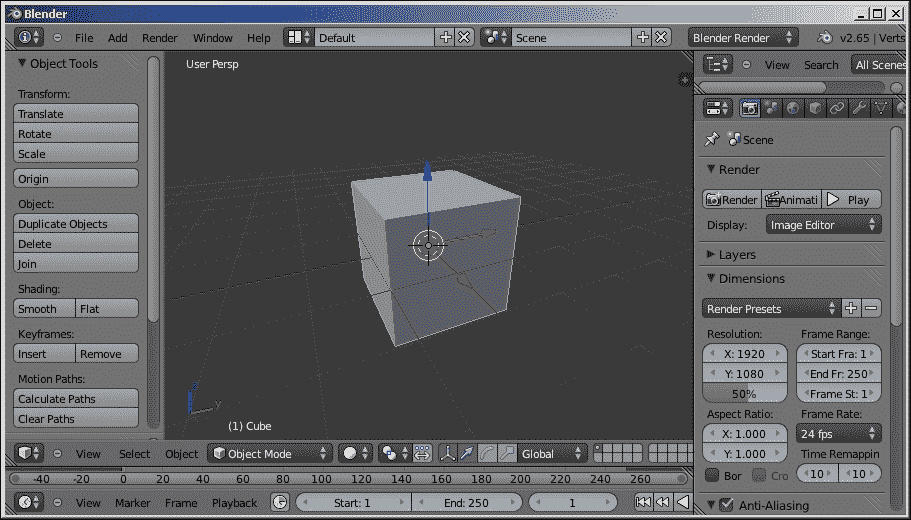

## 如何操作...

本节将提供一个逐步过程，介绍如何在 Blender 2.68 中创建网格模型。我们将了解创建这些网格的简单步骤，并将它们导出为`wavefront.obj`和 3Ds 格式，以便在后面的食谱中用于演示目的。

1.  当 Blender 首次启动时，画布网格中间将显示一个立方体对象。如果你不打算使用这个立方体，你可以删除它。为了从画布网格中删除一个对象，选择它（通过将光标放在它上面并右键单击它）然后在键盘上点击删除键。或者，你可以选择一个对象并点击**X**和*Enter*键来删除选定的对象。

1.  默认情况下，Blender 中有 10 种基本网格模型可用，可以一起使用来创建更复杂的形状。根据 Blender 版本类型，UI 界面可能有所不同。然而，基本功能是相同的。为了添加新的网格模型，导航到菜单，点击**添加** | **网格**，并选择所需的模型（例如，UV 球体）。在新版本的 Blender（如 2.7.0 及以后版本）中，你可能会在左侧面板的**创建**选项卡下找到此选项，如下面的截图所示：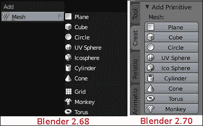

1.  你可以从左侧面板更改每个模型的模型属性，如下面的截图所示：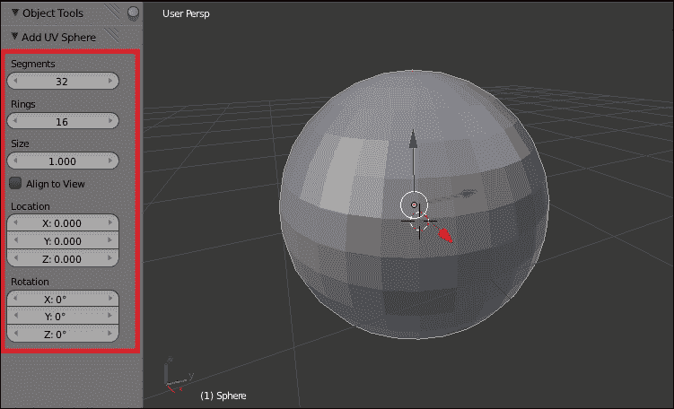

    对于每个网格，你可以更改位置并应用旋转。在我们的所有食谱中，我们将使用位置为（0.0，0.0，0.0），这样网格总是出现在画布网格的原点上。

1.  可以通过选择网格对象并点击*Tab*按钮在编辑模式中编辑模型。在编辑模式中，可以增强网格的几何形状。例如，网格对象的表面可以被细分成许多更小的表面，以增强表面的平滑度。在编辑模式中，你可以选择细分菜单选项来细分选定的对象表面。以下图像显示了细分的工作原理：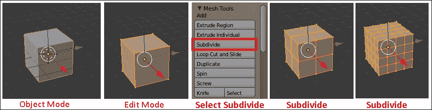

1.  使用**文件** | **导出**菜单选项导出创建的模型。我们将以 wavefront 和 3Ds 网格格式导出创建的模型。在接下来的章节中，我们将看到这些网格格式在我们的食谱中的应用：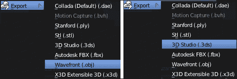

1.  在以 Wavefront（`.obj`）格式导出时，您可能需要根据您的需求选择以下选项：

    +   **包含边**：这将边导出为双面面。

    +   **三角化面**：不是将面作为四边形来写，每个四边形都使用三个三角形来表示。我们必须为我们的网格模型选择此选项。

    +   **包含 UVs（可选）**：写入关于几何表面的纹理坐标信息

    +   **包含法线（可选）**：根据面的平滑设置写入面和顶点法线：

    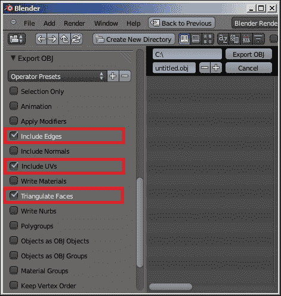

    ### 注意

    **包含法线**是可选的；它计算面法线并将其写入文件导出的文件格式。此外，在运行时计算法线将产生一些额外的处理成本。此功能可以通过牺牲大文件和读取此文件时使用的内存来最小化运行时计算。

    或者，您可以使用网格模型内提供的面信息来计算法线。在本食谱的后面部分，您将学习如何使用面信息来计算法线。

1.  要导出 3Ds 格式，请使用所有默认导出选项。

    ### 注意

    本章创建的网格不包含任何基于纹理的信息。我们将在后面的章节中使用基于纹理的模型。

1.  在使用 Blender 时，可以通过选择**文件** | **加载工厂设置**在任何时候将设置恢复到默认工厂设置。

## 更多...

在`GLPIFramework`文件夹下的`Models`中可以找到从 Blender 和其他示例模型导出的 Wavefront 和 3Ds 格式的模型。您可以自由探索它们。第五章，*光与材质*，广泛使用了 Wavefront 模型来演示各种类型的光。

## 参见

+   *渲染 Wavefront OBJ 网格模型*

+   *渲染 3Ds 网格模型*

# 渲染 Wavefront OBJ 网格模型

波文件格式是由 Wavefront 技术公司开发的一种著名的 3D 网格模型格式。它以可读的文本格式包含网格几何信息。

Wavefront 格式主要包含两种类型的文件：`.obj`和`.mtl`。`.obj`文件负责描述 3D 模型的几何信息，如顶点位置、法线、纹理坐标和面等。`.mtl`文件是可选的，包含单个网格部分的材质信息，如纹理和着色（漫反射、镜面等）信息。此外，如果`.mtl`文件包含纹理信息，它将自动导出；否则，您必须设置**写入材质**。这里的材质指的是物体的颜色或纹理。我们导出的模型不包含任何纹理信息。因此，这些模型只包含`.obj`文件。

**文件格式**：由于 wave front 格式是可读的，你可以在任何文本编辑器中打开它并读取它。它使用特殊的关键字来识别特定类型的信息。以下表格将帮助你理解用于 wavefront 文件格式的关键字：

| 关键字 | 含义 | 示例 |
| --- | --- | --- |
| `#` | 以`#`开头的内容被视为注释。 | 此文件使用 Blender 2.65 创建 |
| `v` | 这是指定 x、y 和 z 坐标的顶点位置。 |

+   v 1.000000 -1.000000 -1.000000

+   v 1.000000 -1.000000 1.000000

+   v -1.000000 -1.000000 1.000000

|

| `vt` | 这指定了 0.0 到 1.0 范围内的纹理坐标。 |
| --- | --- |

+   vt 0.0 0.0

+   vt 1.0 0.0

+   vt 1.0 1.0

+   vt 0.0 1.0

|

| `vn` | 这表示每个顶点位置的法线。 |
| --- | --- |

+   vn 0.0 1.0 0.0

+   vn 0.0 0.0 1.0

|

| `f` | 这包含面信息。每个面由顶点(v)后跟纹理坐标(u)和顶点法线(n)定义。面信息的语法是[v]/[u]/[n]。 | 面信息各种格式：

+   顶点坐标：f 1 2 3

+   顶点和纹理坐标：f 1/1 3/2 4/3

+   顶点和纹理法线：f 1/1/2 3/2/1 4/3/2

+   顶点和法线坐标：f 1//2 3//1 4//2

|

以下图像显示了在文本编辑器中打开的示例 wavefront (`.obj`)文件。此示例仅包含顶点和面信息，这是网格模型渲染到任何 3D 图形可视化工具的最小要求。根据选择的导出选项，可以通过新的关键字看到更多网格属性：

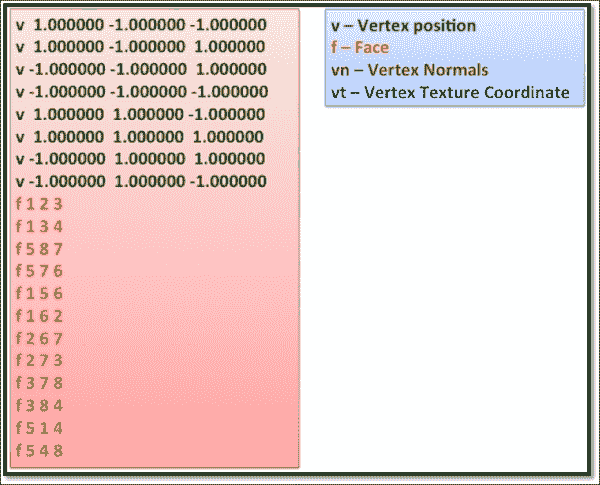

wavefront OBJ 模型的实际功能远远超出了我们在文件格式中指定的。涵盖`.obj`的所有规范超出了本书的范围。你可以参考[`paulbourke.net/dataformats/obj`](http://paulbourke.net/dataformats/obj)以获取完整的规范集。这个配方主要涵盖了规范中最重要和关键的部分，你将学习如何解析几何信息。我们的小型解析器和渲染器将帮助你深入理解网格的概念，并允许你编写任何其他类型的网格文件格式。

### 注意

你可以在[`paulbourke.net/dataformats/obj/`](http://paulbourke.net/dataformats/obj/)了解更多关于 wavefront OBJ 文件格式规范的信息。

## 准备工作

我们在 Blender 中创建的 3D 模型需要导入到项目中。Android 和 iOS 有不同的方式访问它们资源：

+   **Android**: 在 Android 上，3D 网格模型需要从`GLPIFramework/Models`复制并存储在内存卡下的`sdcard/Models`文件夹中

+   **iOS**: 使用**文件** | **将文件添加到[项目名称]**将`GLPIFramework/Models`文件夹添加到项目中

**类和数据结构**：`OBJMesh`类负责解析波前 OBJ 网格模型；它使用必要的数据结构来存储解析的波前 OBJ 信息。此类定义在`GLPIframework/WaveFrontOBJ`文件夹下的`WaveFrontObj.h`/`.cpp`中。以下是此类使用的必要数据结构：

+   **顶点**：此结构将存储 3D 几何中每个顶点的信息。它包含每个顶点沿*x*、*y*和*z*轴的位置坐标，存储在位置变量中。纹理坐标存储在*uv*变量中。法线坐标存储在法线变量中。每个顶点的切向信息存储在切线中：

    ```java
    struct Vertex
    {
    public:
       glm::vec3 position; //Store X/Y/Z coordinate.
       glm::vec2 uv;       //Store Tex coordinate.
       glm::vec3 normal;   //Store Normal information.
       glm::vec3 tangent;  //Store Tangent information.
       . . . . .
    };
    ```

+   **面索引**：此结构负责存储与面相关的信息。例如，它存储了所有有助于定义面的顶点、纹理坐标和法线的索引：

    ```java
    struct FaceIndex
    {
        short vertexIndex; // Face's vertex Index
        short normalIndex; // Face's normal Index
        short uvIndex;     // Face's texCoord Index
         . . . . .
    };
    ```

+   **网格**：网格数据结构负责存储网格几何信息。它包含需要解析的 OBJ 文件的完整路径，存储在`fileName`变量中。该类以向量数组的形式包含顶点、纹理和法线信息。这些信息分别存储在位置、UV 和法线向量列表变量中。`vecFaceIndex`以每个顶点形成面的索引形式存储每个面的信息。

    索引存储每个面的顶点索引，并在`.obj`网格文件中没有法线信息时用于计算法线：

    ```java
    struct Mesh
    {
        // Obj File name
        char fileName[MAX_FILE_NAME];

        // List of Face Indices For vertex, uvs, normal
       std::vector<FaceIndex> vecFaceIndex;

        // List of vertices containing interleaved 
     // information forposition, uv, and normals
       std::vector<Vertex>    vertices;

        // List of vertices containing positions
       std::vector<glm::vec3> positions;

        // List of vertices containing normal
       std::vector<glm::vec3> normals;

        // List of vertices containing uvs
       std::vector<glm::vec2> uvs;

        //! List of tangents
       std::vector<glm::vec4> tangents;

        // List of face indices
       std::vector<unsigned short> indices;
    };
    ```

## 如何做到这一点...

本节将提供逐步解析和渲染 OpenGL ES 3.0 中的波前 OBJ 网格模型的过程。让我们按照以下步骤开始：

1.  创建一个从`Model`类派生的`ObjLoader`类。它将继承`ObjLoader`生命周期所需的`Model`类的所有成员函数。

    这个类包含成员变量以存储波前模型网格信息。网格模型使用`ObjMesh`函数的`waveFrontObjectModel`对象进行解析。此对象调用`parseObjMesh`函数，该函数接受 3D 波前 OBJ 模型的路径作为参数，这是我们想要加载的：

    ```java
    OBJMesh waveFrontObjectModel;
    objMeshModel = waveFrontObjectModel.ParseObjModel(fname);
    ```

1.  `ParseObjModel`函数进一步调用一系列辅助函数来存储和处理`.obj`文件中的网格信息。此函数返回`Mesh`对象指针。此函数接受要加载的文件路径以及另一个参数，指定是否需要计算法线为平面或平滑：

    ```java
    Mesh* OBJMesh::ParseObjModel(char* path, bool flatShading)
    {
        ParseFileInfo(path);         // Parse's the obj file
        CreateInterleavedArray();    // Interleaved data array
        CalculateNormal(flatShading);// Generate the normal
        if(objMeshModel.uvs.size())
            { CalculateTangents(); } // Generate tangents
        ClearMesh();                 // Release alloc resources
        return &objMeshModel;
    }
    ```

1.  `ParseFileInfo`函数读取网格模型的路径以验证其存在。此函数通过读取文件中的每一行来解析文件。每一行开头都有一个关键字，指定它包含的信息类型。`#`、`u`、`s`或`g`关键字被忽略，因为它们在解析器中未使用。`#`关键字用于在 wavefront 文件中写入注释。从该函数解析的信息收集在网格的对象指针中：

    ```java
    strcpy(objMeshModel.fileName, path);
    while(!eofReached)
    {
        c = fgetc(pFile);
        switch(c)
        {
            case '#': // Ignore (This is a comment)
            case 'u': // Ignore
            case 's': // Ignore
            case 'g': // Grouping not supported
                while(fgetc(pFile) != '\n'); 
    // Skip till new next line not reached.
                break;

    #ifdef __IPHONE_4_0
          case EOF:
    #else
          case (unsigned char)EOF:
    #endif
                eofReached = true;
                break;

            case 'v': // Load the vertices.
                c = fgetc(pFile); 
    // The next character will
               // let us know what vertex attribute to load
                ScanVertexNormalAndUV( pFile, c );
                break;

            case 'f': 
    // 'f' means it is a face index information 
    // in the form of v/u/n
                ScanFaceIndex( pFile, c );
                break;
        }
    }
    ```

1.  以`v`关键字开头的行表示顶点属性，这些属性可能包含三种类型的信息：顶点位置（`v`）、顶点纹理坐标（`vt`）和顶点法线（`vn`）。此信息是通过使用`ScanVertexNormalAndUV`函数读取的。

    此函数解析每一行，并将顶点位置、纹理坐标和顶点法线的信息分别存储在`objMeshModel.positions`、`objMeshModel.uvs`和`objMeshModel.normals`中：

    ```java
           bool OBJMesh::ScanVertexNormalAndUV( FILE* pFile, char c )
    {
    float  x, y, z, u, v;
    switch(c)
    {
       case ' ': // Load vertices
          fscanf(pFile,"%f %f %f\n",&x,&y,&z);
          objMeshModel.positions.push_back(glm::vec3(x, y, z));
       break;
       case 'n': // Loading normal coordinate comp. x,y,z
           fscanf(pFile,"%f %f %f\n",&x,&y,&z);
          objMeshModel.normals.push_back(glm::vec3(x, y, z));
          break;
       case 't': // Loading Texture coordinates (UV)
    fscanf(pFile,"%f %f\n",&u,&v);
             objMeshModel.uvs.push_back(glm::vec2(u, v));
    break;
       default:
            return false;
    }
    }
    ```

1.  类似地，以`f`关键字开头并跟有一个空格的行表示面。一个面由三个顶点组成，每个顶点可能包含三个属性：顶点位置、纹理坐标和顶点法线。

    每个面以索引的形式存储信息。这里的索引指的是存储数组中实际元素的索引（在第 5 步中计算）。例如，给定面中顶点位置的索引为二表示`objMeshModel.positions`向量数组中的第三个顶点元素。

    在`objMeshModel.vecFaceIndex`向量列表中收集面索引信息。此列表包含属于每个面的顶点属性索引的所有面。有关更多信息，请参阅`ObjMesh::ScanFaceIndex`函数。

1.  使用在`objMeshModel.vecFace`中收集到的面索引信息，填充`objMeshModel.vertices`向量列表。此列表包含用于创建顶点缓冲对象的顶点属性：

    ```java
        // Allocate enough space to store vertices and indices

      objMeshModel.vertices.resize(obMeshModl.vecFacIndex.size());
            objMeshModel.indices.resize(obMeshModl.vecFacIndex.size());

           // Get the total number of indices.
            objMeshModel.indexCount = objMeshModel.indices.size();

           // Create the interleaved vertex information
      // containing position, uv and normal.
            for(int i = 0; i < objMeshModel.vecFaceIndex.size(); i++)
            {
    //Position information must be available always
    int index = objMeshModel.vecFaceIndex.at(i + 0).vertexIndex;
    objMeshModel.vertices[i].position =
                       objMeshModel.positions.at(index);
    objMeshModel.indices[i] =
                 (GLushort)objMeshModel.vecFaceIndex.at(i).vertexIndex;

    // If UV information is available.
    if(objMeshModel.uvs.size()){
    index = objMeshModel.vecFaceIndex.at(i).uvIndex;
       objMeshModel.vertices[i].uv =
     objMeshModel.uvs.at(index);
    }

    // If Normal information is available.
    if(objMeshModel.normals.size()){
    index = objMeshModel.vecFaceIndex.at(i ).normalIndex;
    objMeshModel.vertices[i].normal =
    objMeshModel.normals.at(index);
    }
    }
    ```

1.  如果 OBJ 文件中缺少法线属性，可以使用`OBJMesh::CalculateNormal()`来计算。有关更多信息，请参阅本食谱中的*更多内容...*部分。

1.  类似地，每个顶点的切线信息是通过使用`OBJMesh::CalculateTangents()`计算的。你可以参考第五章中的凹凸贴图，以深入了解此函数的工作原理。

1.  一旦 OBJ 网格信息被解析并存储在网格对象中，使用`ClearMesh`函数清除所有临时数据结构：

    ```java
    bool OBJMesh::ClearMesh()
    {
      objMeshModel.positions.clear();  // Clear positions
      objMeshModel.normals.clear();    // Clear normals
      objMeshModel.uvs.clear();        // Clear tex Coords
      objMeshModel.indices.clear();      // Clear indices
      objMeshModel.vecFaceIndex.clear(); // Clear FaceIdx 
      return true;
    }
    ```

1.  解析完 OBJ 文件后，在`ObjLoader`构造函数内创建 VBO：

    ```java
    // Function ObjLoader::ObjLoader( Renderer* parent )
    ObjLoader::ObjLoader( Renderer* parent )
    {
    . . . . . . . 
    objMeshModel= waveFrontObjectModel.ParseObjModel(fname);
    IndexCount  = waveFrontObjectModel.IndexTotal();
    stride      = (2 * sizeof(glm::vec3) )+ sizeof(glm::vec2);
              offset      = (GLvoid*) (sizeof(glm::vec3) + sizeof(glm::vec2));

              // Create the VBO for our obj model vertices.
              GLuint vertexBuffer; glGenBuffers(1, &vertexBuffer);
             glBindBuffer(GL_ARRAY_BUFFER, vertexBuffer);
          glBufferData(GL_ARRAY_BUFFER, objMeshModel->vertices.size()
                   * sizeof(objMeshModel->vertices[0]),
                   &objMeshModel->vertices[0], GL_STATIC_DRAW);

    // Create the Vertex Array Object (VAO)
              glGenVertexArrays(1, &OBJ_VAO_Id);
              glBindVertexArray(OBJ_VAO_Id);
    // Bind VBO, enable attributes and draw geometry
       glBindBuffer(GL_ARRAY_BUFFER, vertexBuffer);
       glEnableVertexAttribArray(VERTEX_POSITION);
              glEnableVertexAttribArray(NORMAL_POSITION);
              glVertexAttribPointer
          (VERTEX_POSITION, 3, GL_FLOAT, GL_FALSE, stride, 0);
              glVertexAttribPointer
          (NORMAL_POSITION, 3,GL_FLOAT,GL_FALSE,stride,offset);
              glBindVertexArray(0); //Use default VAO
    ```

## 它是如何工作的...

`OBJMesh`类中的`ParseObjMesh`函数负责解析波前 OBJ 文件并将信息存储在网格的`objMeshModel`对象变量中。此函数解析文件并识别顶点属性，如顶点位置、纹理坐标和顶点法线。它将这些属性存储在`objMeshModel.positions`、`objMeshModel.uvs`和`objMeshModel.normals`相应的向量数组中。这些向量数组在本质上连续。因此，可以直接使用索引信息来选择元素。

### 注意

顶点纹理和顶点法线是可选属性。没有这些属性，几何形状仍然可以生成。只有当模型包含任何纹理时，纹理坐标才会被存储。可以通过在导出选项中选择**包含法线**来在 OBJ 文件中保存法线。有关.OBJ 网格模型导出选项的更多信息，请参阅本章“使用 Blender 创建多边形网格”配方下的*如何做...*部分，以获取有关 OBJ 网格模型导出选项的更多信息。

解析顶点属性信息后，需要解析面信息。每个面由三个顶点组成。这些顶点可以包含位置、纹理和法线信息。面中每个顶点属性的信息以索引的形式存储。`objMeshModel.vecFaceIndex`中的面信息必须存储在向量数组列表中。

`objMeshModel.vertices`是另一个本质上连续且交错形式的基于向量的数组。数组中的每个记录代表一个顶点元素，它包含顶点位置、纹理坐标和法线属性。`OBJMesh::CreateInterleavedArray`函数负责生成此数组。交错数组非常推荐，因为它在单个数组中包含不同的属性数据，因此足以存储单个 VBO。然而，如果数据不是交错存储的，每个属性将存储在单独的数组中。对于每个数据数组，都需要单独的 VBO。使用过多的 VBO 会严重影响性能，因为渲染管线会花费更多时间绑定和切换 VBO。

OBJ 模型数据应使用`GL_TRIANGLES`绘制。所使用的片段着色器将根据传递的信息（例如，纹理坐标、光照信息等）在接下来的章节中提供不同的效果。我们将应用各种顶点和片段着色器到 OBJ 网格上，以产生令人惊叹的实时渲染效果：

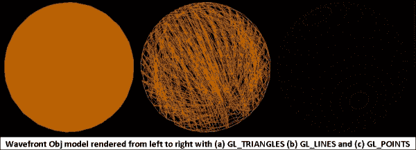

## 还有更多...

法线信息在 3D 对象的光照着色中起着重要作用。我们导出的波前模型不包含任何法线信息。本节将帮助我们使用面信息计算法线。

法线可以通过两种方式计算：

+   **面法线**: 这是通过单一的面信息计算得出的。这种类型的法线会导致平面着色。它是通过三角面形成的任意两个边的叉积来计算的。换句话说，它是垂直于由共面顶点生成的表面的。

+   **顶点法线**: 这是通过取共享公共顶点的面创建的法线的平均值来计算的：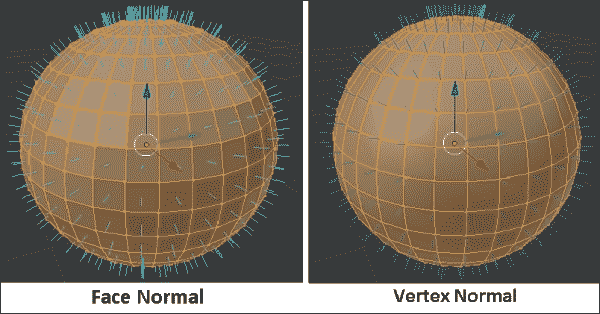

上一张图像显示了面和顶点法线。每个面法线都是使用四个顶点计算得出的，这些顶点形成一个平面表面。在这四个顶点中，可以使用任意三个顶点形成两条边。这两条边的叉积产生一个垂直于平面的向量。归一化这个向量产生一个面法线。

相比之下，每个顶点都显示由围绕每个顶点的四个平面或四个面形成的蓝色线条表示的顶点法线。这四个平面法线的平均值产生一个顶点法线。顶点法线对于生成高度详细且平滑的几何外观非常重要，而无需太多顶点。

平滑着色或平滑着色法线可以使用 `ParseObjMesh` 计算，第二个参数作为布尔值 `true` 用于平面着色，布尔值 `false` 用于平滑着色。内部，这个函数调用 `OBJMesh::CalculateNormal`，它负责法线的数学计算：

```java
    // Calculates the flat or smooth normal on the fly
Function OBJMesh::CalculateNormal(bool flatShading)
{
if( objMeshModel.normals.size() == 0 ){
    // Make space to store the normal information
objMeshModel.normals.resize(objMeshModel.positions.size());
int index0, index1, index2;
glm::vec3 a, b, c;
for(int i=0; i<objMeshModel.indices.size();i += 3){
    // Use indices to retrieve the vertices
          index0 = objMeshModel.indices.at(i);
          index1 = objMeshModel.indices.at(i+1);
          index2 = objMeshModel.indices.at(i+2);
    // Retrieve each triangles vertex    
          a = objMeshModel.positions.at(index0);
          b = objMeshModel.positions.at(index1);
          c = objMeshModel.positions.at(index2);
    // Calculate the normal triangle face.
         glm::vec3 faceNormal =  glm::cross((b - a), (c - a));

         if ( flatShading ){
    // Calculate normals for flat shading
             objMeshModel.vertices[i].normal += faceNormal;
             objMeshModel.vertices[i+1].normal += faceNormal;
             objMeshModel.vertices[i+2].normal += faceNormal;
          }
          else{
             objMeshModel.normals[index0] += faceNormal;
             objMeshModel.normals[index1] += faceNormal;
             objMeshModel.normals[index2] += faceNormal;
          }
}
        // Calculate normals for smooth shading
        if ( !flatShading ){
        for(int i = 0;i<objMeshModel.vecFaceIndex.size(); i++){
        int index=objMeshModel.vecFaceIndex.at
(i +0).vertexIndex;
        objMeshModel.vertices[i].normal=
                               objMeshModel.normals.at(index);
      }
   }
          // Store the calculated normal in normalized form
for (int j=0;j<objMeshModel.vertices.size(); j++){
objMeshModel.vertices[j].normal = 
glm::normalize (objMeshModel.vertices[j].normal);
}
}    
}
```

面法线指向多边形面向的方向。然而，顶点法线改变了多边形的梯度。如果我们改变顶点法线的方向，该顶点周围的着色将 `http://change.at/" \t "_blank`，这个梯度与旋转相同方向的一个平面多边形相同。计算机在多边形上伪造了一个梯度。

以下图像显示了左侧的简单球体在没有光照着色技术的情况下看起来如何。实际上，很难相信它是一个球体网格模型。中间和最右侧的网格模型使用光照着色进行演示。前面的网格模型使用平面光照着色，这是通过面法线实现的，而后面的网格模型以顶点法线渲染相同的网格模型：

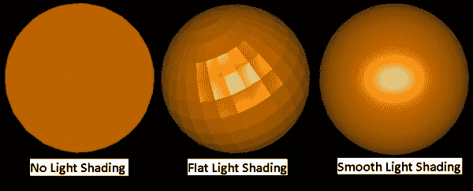

## 参见

+   请参阅 *使用顶点缓冲对象进行高效渲染* 菜谱 第二章, *OpenGL ES 3.0 基础*

+   请参阅 第五章 中的 *Phong 着色 – 每片段着色技术* 菜谱，*光照和材质*

+   请参阅 第五章 中的 *Gouraud 着色 – 每片段着色技术和 Phong 着色 – 每片段着色技术* 菜谱，*光照和材质*

+   请参阅 第七章 中的 *实现凹凸映射* 菜谱，*纹理和映射技术*

+   参考第三章中的*使用顶点数组对象管理 VBO*配方，*OpenGL ES 3.0 的新特性*。

# 渲染 3Ds 网格模型

3Ds 网格格式是计算机图形中广泛使用的知名 3D 网格文件格式。与 wavefront 不同，它不是基于文本的，并以二进制形式存储网格信息。这被广泛用于 Autodesk 3D Studio Max，是一款专业的 3D 图形程序软件，用于创建 3D 动画和模型。

**文件格式**：本节将概述 3Ds 文件格式。这种网格格式包含以块层次结构形式的信息。块是内存中结构化信息的一部分。其唯一的 ID 识别每个块，其中包含可用于读取或跳过块的大小信息（以字节为单位）。当前块的大小信息始终相对于其起始内存位置；跳过这么多大小将指向下一个块。

下表显示，每个块都由**开始**字段表示，该字段包含 3Ds 文件中的内存位置。**大小**字段告诉我们块的大小（以字节为单位），而**结束**字段指定了块结束的内存位置。**结束**字段可以通过*大小 - 开始 + 1*公式计算得出。下一个块信息始终相对于当前块位置：

| 开始 | 结束 | 大小 | 名称 |
| --- | --- | --- | --- |
| 0 | 1 | 2 | 块 ID |
| 2 | 5 | 4 | 下一个块 |

3Ds 文件中的每个块 ID 都与它相关的预定义意义。例如，此文件格式的第一个块 ID 始终是`0x4d4d`。这个块被称为主要或主块 ID。其他重要的块作为子节点存在于这个主要块下，如下面的截图所示：

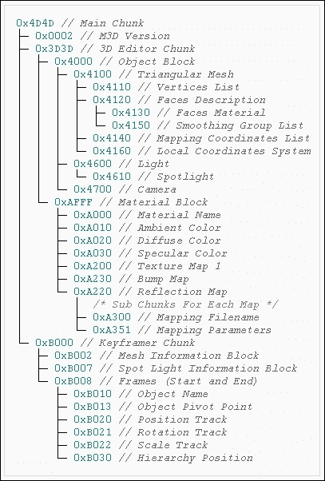

### 注意

3Ds 的详细规范超出了本书的范围。您可以在[`www.martinreddy.net/gfx/3d/3DS.spec`](http://www.martinreddy.net/gfx/3d/3DS.spec)找到有关此规范更多信息。

## 准备工作

在本配方中，我们将使用名为`lib3ds`的第三方库解析 3Ds 文件格式。这是一个开源库，帮助我们解析文件，并以数据结构的形式提供文件数据。这个库是用 ANCI-C 编写的。因此，它可以在各个平台上移植。lib3ds 可以在 GNU **较小通用公共** **许可证**（**LGPL**）下用于商业应用。可以从[`code.google.com/p/lib3ds/`](https://code.google.com/p/lib3ds/)下载这个库。

在我们的 GLPI 框架中，这个库位于`GLPIFramework/3DSParser/lib3ds`文件夹下。我们为这个库使用了 1.30 版本。将 3DS 网格模型渲染到应用程序中需要将这些模型存储在设备或模拟器上的某个适当位置。

在 Android 设备上，您可以将 3DS 网格模型文件存储在 `sdcard/GLPIFramework/Model` 文件夹下。对于 iOS，可以使用 **文件** | **将文件添加到 [项目名称]** 来将这些模型添加到项目中。

**Android**：在 Android 平台上，我们需要 makefile 来构建 `lib3ds` 库。在 `GLPIFramework/3DSParser/lib3ds` 下添加 `Android.mk` makefile。编辑此 makefile，如下所示。此库将被编译为共享库，命名为 `mylib3ds`。您也可以直接在主项目 makefile 中添加源代码，而不是编译共享库：

`Android.mk`:

```java
LOCAL_PATH := $(call my-dir)
include $(CLEAR_VARS)
# Name of the shared library
LOCAL_MODULE    := mylib3ds
LOCAL_SRC_FILES := \
   lib3ds/viewport.c \
   lib3ds/vector.c \
   lib3ds/tracks.c \
   lib3ds/tcb.c \
   lib3ds/shadow.c \
   lib3ds/quat.c \
   lib3ds/node.c \
   lib3ds/mesh.c \
   lib3ds/matrix.c \
   lib3ds/material.c \
   lib3ds/light.c \
   lib3ds/io.c \
   lib3ds/file.c \
   lib3ds/ease.c \
   lib3ds/chunk.c \
   lib3ds/camera.c \
   lib3ds/background.c \
   lib3ds/atmosphere.c
# Included libraries and compile time flags
LOCAL_LDLIBS := -lz
LOCAL_CFLAGS := -I. -g
# Build as shared library
include $(BUILD_SHARED_LIBRARY)
```

打开位于 `JNI` 文件夹下项目目录中的 `Android.mk` makefile，并包含我们之前代码中创建的 `lib3ds` 库 `Android.mk` 文件路径：

```java
MY_CUR_LOCAL_PATH := $(call my-dir)
FRAMEWORK_DIR   = ../../../../GLPIFramework
LIB3DS_DIR = $(FRAMEWORK_DIR)/3DSParser

include $(CLEAR_VARS)

include$(MY_CUR_LOCAL_PATH)/../GLPIFramework/zlib/Android.mk \
$(MY_CUR_LOCAL_PATH)/../GLPIFramework/3DSParser/Android.mk
# Source file for compilation
LOCAL_SRC_FILES := $(FRAMEWORK_DIR)/GLutils.cpp \
. . . . .
. . . . .
$(SCENE_DIR)/Renderer.cpp \
$(SCENE_DIR)/3DSLoader.cpp \
../../NativeTemplate.cpp
# Include the 3DS library
LOCAL_SHARED_LIBRARIES := zlib mylib3ds
```

在 `GLESNativeLib.java` 文件中，编辑 `GLESNativeLib` 类并添加我们共享库的引用，以便在运行时进行链接：

```java
public class GLESNativeLib {
static {
   System.loadLibrary("zlib");
   System.loadLibrary("mylib3ds");
   System.loadLibrary("glNative");
}
   . . . . . . Other code
}
```

**iOS**：在 iOS 平台上，您需要使用 **文件** | **将文件添加到 [项目名称]** 将 `lib3ds` 库源文件添加到您的项目中。

## 如何操作...

这里是创建 3Ds 网格渲染器类的步骤。此类将负责加载和渲染 3Ds 网格模型：

1.  对于这个配方，我们从 `Scene` 类派生了一个新的类，名为 `Loader3DS`。这个类包含一个 `load3dsModel` 函数，该函数将用于加载 3Ds 网格模型文件。

1.  实现如以下代码片段中描述的 `load3dsModel` 函数。此函数使用 `lib3ds` 库的 `lib3ds_file_load` 函数解析 3Ds 模型文件，并返回 `Lib3dsFile` 指针。`Lib3dsFile` 结构体包含解析后的 3Ds 网格文件信息：

    ```java
    Lib3dsFile* Loader3DS::load3dsModel(const char* fileName){
       Lib3dsFile* file = lib3ds_file_load(fileName);
       if (!file) {
       LOGI("*ERROR*\nLoading file %s failed\n", fileName);
          return NULL;
       }
       . . . . . .
       . . . . . . 
       return file;
    }
    ```

1.  当 3Ds 网格文件解析成功后，它将加载文件对象类型 `Lib3dsFile` 中的网格模型的数据（几何属性和材质信息）。此对象包含读取节点所需的所有必要信息。在 3Ds 规范中，节点是一个称为 `Lib3dsNode` 的特殊数据结构，对应于完整 3D 网格模型的子部分或子模型。例如，一个 `car` 模型由许多不同的子部分组成，如车身框架、轮胎、车门、引擎等。这些各个部分对应于代表 3D 汽车模型的父节点的子节点。

    根据模型的复杂度，可能会有多个节点。这些节点以层次结构排列。节点使用 `lib3ds_node_new_object()` 创建，并使用 `lib3ds_file_insert_node()` 以层次顺序排列：

    ```java
    if( !file->nodes )
    {
       Lib3dsMesh *mesh;
       Lib3dsNode *node;
       for(mesh=file->meshes; mesh!=NULL; mesh=mesh->next){
          node = lib3ds_node_new_object();
          strcpy(node->name, mesh->name);
          node->parent_id = LIB3DS_NO_PARENT;
          lib3ds_file_insert_node(file, node);
       }
    }
    ```

1.  通过递归遍历所有节点来渲染 3Ds 网格模型。调用 `RenderNodes()` 来渲染每个节点：

    ```java
    void Loader3DS::Render(Lib3dsFile* file)
    {
       . . . . . . .
       Lib3dsNode *p;
       for (Lib3dsNode* p=file->nodes; p!=0; p=p->next ){
           RenderNodes( file, p );
       }
       . . . . . . .
    }
    ```

1.  `RenderNodes()` 是一个递归函数，为每个节点创建 VBO 并渲染它们。每个节点都包含一个指向 `Lib3dsMesh` 的指针；`Lib3dsMesh` 是一个包含每个节点几何信息的数据结构：

    ```java
    void RenderNodes(Lib3dsFile* file,Lib3dsNode *node){
       . . . . . . . 
    // Use appropriate shader
    glUseProgram( program->ProgramID );

    Lib3dsNode *tempNode;
    for(tempNode=node->child;tempNode!=0;
    tempNode=tempNode->next)     {
          RenderNodes(file, tempNode);
                                 }
    }
    ```

1.  `Lib3ds`库包含一个名为`Lib3dsUserData`的结构。它允许你向`lib3ds`添加自定义变量。我们将使用这个结构来存储顶点缓冲对象变量，如顶点：

    ```java
    // Check the user.p variable if empty is assigned
    MyLib3dsUserData 
    if (!mesh->user.p){
      MyLib3dsUserData* myPObject = new MyLib3dsUserData;
      mesh->user.p = (void*)myPObject;
    }
    ```

1.  使用`BuildMesh()`函数为每个网格构建 VAO。将 VAO、VBO 和 IBO 信息缓存到`MyLib3dsUserData`对象中：

    ```java
    void Loader3DS::BuildMesh(Lib3dsMesh *mesh)
    {
     MyLib3dsUserData* userObj=(MyLib3dsUsrData*)mesh->user.p;

        // Allocation memory for vertex positions
        meshVert = new float[ mesh->points * 3 ];
       . . . . .

        // Allocate memory for texture
        meshTexture = new float[ mesh->texels * 2 ];
        . . . . .

        // Allocate memory for normal
        meshNormal = new Lib3dsVector[ 3 * mesh->faces ];
        lib3ds_mesh_calculate_normals(mesh, meshNormal);

        // Allocate memory for face information
        faceIndex = new unsigned short[mesh->faces*3];
        . . . . .

        // Create the VBO and populate the VBO data 
        glGenBuffers( 1, (GLuint *)&vId );
        glBindBuffer( GL_ARRAY_BUFFER, vId );
        . . . . .

        // Create and populate the IBO with index info. 
        glGenBuffers( 1, (GLuint *)&iId );
        glBindBuffer( GL_ARRAY_BUFFER, iId );
        . . . . .

        // Create and Bind Vertex Array Object
        glGenVertexArrays(1, &VAOId);
        glBindVertexArray(VAOId);
        . . . . .

        // Cache the information in the User data structure
        userObj->vertexId   = vId;
        userObj->indexId    = iId;
        userObj->VAOId      = VAOId;
        . . . . .
    }
    ```

1.  在`RenderNodes()`中，使用 VAO 信息渲染 3Ds 网格模型：

    ```java
     MyLib3dsUserData* userObj=(MyLib3dsUserData*)mesh->user.p;
     // If VAO is not created, create using BuildMesh. 
     if ( !userObj->VAOId ) {
           BuildMesh( mesh );
     }
     else {
          // Apply Transformation & set material information
          SetMaterialInfo( mesh );
          //Bind to VAO & draw primitives
          glBindVertexArray(userObj->VAOId);
          glDrawElements(GL_TRIANGLES, userObj->indexNum,
                      GL_UNSIGNED_SHORT, (void*)0);
          glBindVertexArray(0); //Bind to default VAO
     }
    ```

## 它是如何工作的...

使用 lib3ds 库的`lib3ds_file_load`函数解析 3Ds 网格文件。此函数成功填充了包含从 3Ds 文件中解析的所有信息的`Lib3dsFile`文件指针。使用这个数据变量，我们创建节点，并使用`lib3ds_file_insert_node`按层次顺序填充和组装这些节点。每个节点代表一个网格，它从节点结构中读取并缓存为**顶点数组对象**（**VAO**）。每个 VAO 存储**顶点缓冲对象**（**VBO**）、状态和属性。

`RenderNodes`是一个递归函数，它为每个节点创建 VAO 和 VBO 并渲染它们。每个节点包含一个指向`Lib3dsMesh`的指针，它进一步包含一个`Lib3dsUserData`，我们将使用它来检查相应的节点是否包含 VAO。VAO 通过顶点数组 ID 识别。这些 ID 绑定到运行时并用于渲染几何形状。一旦生成 VAO ID，这些 ID 就存储在每个节点的`Lib3dsUserData`结构中：

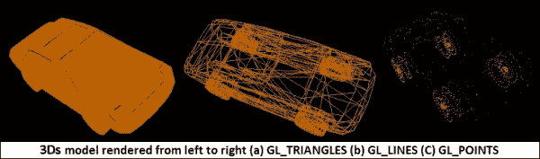

## 还有更多...

到目前为止，在这个菜谱中，你学习了如何渲染 3Ds 网格模型。我们使用单色进行了渲染。3Ds 文件格式还提供了渲染带有颜色的面的功能。这些信息存储在`Lib3dsMesh`的`Lib3dsMaterial`中。以下代码展示了如何从材质数据结构中读取材质信息，并将其作为统一变量发送到`3dsFragmentShader.glsl`以应用于面颜色：

```java
void Loader3DS::SetMaterialInfo( Lib3dsMesh *mesh )
{
   Lib3dsMaterial *material = 0;
   if ( mesh->faces ) {
      // Get associated material with the mesh
      material = lib3ds_file_material_by_name
                      (file, mesh->faceL[0].material);
   }

   if( !material ){
       return;
   }

   // Set Ambient, Diffuse and Specular light component
   glUniform4f(UniformKa, material->ambient[0], 
   material->ambient[1], material->ambient[2], 
   material->ambient[3]);
   glUniform4f(UniformKd, material->diffuse[0], 
   material->diffuse[1], material->diffuse[2], 
   material->diffuse[3]);
   glUniform4f(UniformKs,material->specular[0],
   material->specular[1], material->specular[2], 
   material->specular[3]);
   glUniform1f(UniformKsh, material->shininess);
}
```

颜色信息以材质颜色的形式存储。有关光和材质的更多信息，请参阅第五章，*光和材质*。以下图像展示了一个带有彩色面的汽车模型，其中网格模型使用三角形、线和点原语进行渲染：

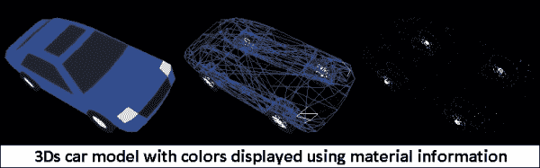

### 注意

**枢轴位置**：枢轴位置将网格模型渲染到平移信息中。这有助于网格以正确的位置渲染。没有枢轴定位，每个节点都在原点渲染。这种行为导致所有节点网格都聚集在原点，因为每个模型不知道其相对于其他模型的位置。

## 参见

+   请参阅第三章中的*使用顶点数组对象管理 VBO*菜谱，*OpenGL ES 3.0 的新特性*
