# 第九章.后期处理和图像效果

在本章中，我们将介绍以下食谱：

+   使用 Sobel 算子检测场景边缘

+   使用高斯模糊方程使场景模糊

+   使用光晕效果实时使场景发光

+   将场景绘制成卡通着色效果

+   生成浮雕场景

+   实现灰度值和 CMYK 转换

+   实现带有桶形畸变的鱼眼效果

+   使用程序纹理实现双目视图

+   旋转图像

+   使用纹理四边形实现球形幻觉

# 介绍

本章将展开探讨场景及其基于图像的效果的无限可能性，这些效果在数据可视化和后期效果领域被广泛应用。实际上，物体在三维空间中表现为一组顶点。随着顶点数量的增加，场景的时间复杂度也随之增加。此外，以图像的形式表示物体，其时间复杂度与场景中片段的数量成正比。另外，许多效果只能在图像空间中高效实现，而不是在顶点空间中实现，例如模糊、光晕、云渲染等等。

后期屏幕处理是一个应用于 OpenGL ES 场景的 texel 操作技术，一旦场景渲染完成。更具体地说，场景首先渲染到一个离屏表面，然后应用效果。然后，这个经过处理的离屏纹理被渲染回屏幕表面。

在后期处理中，给定 texel 的结果会受到其周围 texel 的影响。这些技术不能应用于实时场景，因为顶点着色器和片段着色器是局部工作的。这意味着顶点着色器只知道当前顶点，片段着色器只知道当前片段；它们不能使用邻居元素的信息。这种限制可以通过将场景渲染到纹理中来轻松解决，这允许片段着色器读取纹理中存在的任何 texel 信息。在场景渲染到纹理后，对纹理应用基于图像的技术。

基于图像的效果是通过片段着色器应用于图像纹理的。在后期处理实现过程中，渲染的场景会经过多个阶段，具体取决于效果复杂度。在每个阶段，它将处理后的输出保存到纹理中，然后将其作为输入传递到下一个阶段。

后期处理的执行模型可以大致分为四个部分：

+   **创建帧缓冲区**：第一阶段需要创建一个离线纹理，将场景渲染到其中。这是通过创建**帧缓冲区对象**（FBO）来实现的。根据场景的需求，将各种纹理或缓冲区，如颜色、模板和深度，附加到 FBO 上。

+   **将场景渲染到纹理**：默认情况下，OpenGL ES 场景渲染到默认帧缓冲区。作为后期处理的前提条件，这种渲染必须通过将 FBO 句柄绑定到当前渲染管线来转移到离线纹理（FBO 纹理）。这确保渲染必须发生在 FBO 纹理而不是默认帧缓冲区上。

+   **应用纹理效果**：在场景渲染成纹理之后，它就像记忆中的图像，可以应用各种图像效果。根据后期处理的复杂程度，你可能需要多次遍历来处理所需的效果。在多遍历后期处理中，我们可能需要两个或更多个 FBO 来存储当前遍历的中间处理结果，并在后续或后续遍历中使用。

+   **渲染到默认帧缓冲区**：最后，后期处理过的纹理场景被渲染回默认帧缓冲区，这使得场景变得可见。以下图示了一个边缘检测示例，其中展示了后期屏幕处理的各个阶段：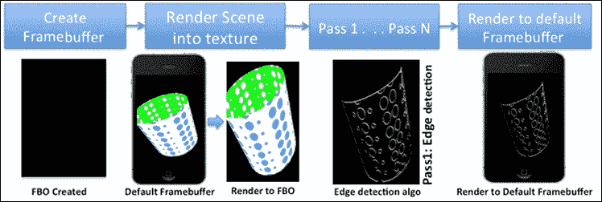

# 使用 Sobel 算子检测场景边缘

边缘检测是一种图像处理技术，用于检测图像中的边界。它在计算机视觉、数据可视化和表面拓扑学领域得到广泛应用。例如，图像的铅笔素描效果并非什么，而是一种边缘检测算法的应用。本配方将演示使用 Sobel 算子或滤波器进行边缘检测技术。

Sobel 滤波器测量图像梯度的变化，它识别图像中颜色过渡频率较高的区域。这些高过渡区域显示了梯度中的尖锐变化，最终对应于边缘。Sobel 算子使用卷积核来检测图像中的边缘部分。卷积核是一个矩阵，其中包含预定义的权重，这些权重基于卷积矩阵本身中的相邻像素强度和权重来计算当前像素。

Sobel 滤波器使用两个 3 x 3 卷积核进行边缘检测处理；一个作用于当前像素水平方向的相邻像素。同样，另一个作用于垂直方向的相邻像素。以下图像显示了两个卷积核：

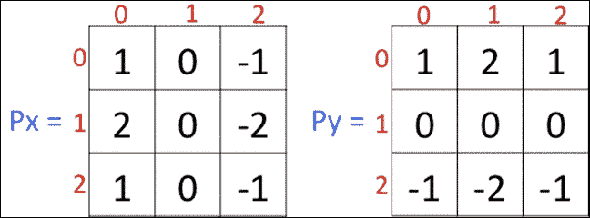

现在，我们非常清楚 Sobel 滤波器近似图像的梯度。因此，图像的 RGB 信息必须转换为某种梯度形式，最佳方式是计算图像的亮度或亮度。RGB 颜色代表 R、G、B 方向上的 3D 颜色空间。这些颜色必须使用图像的亮度信息将其带入 1D 梯度空间。图像的亮度由白到黑的梯度颜色表示：

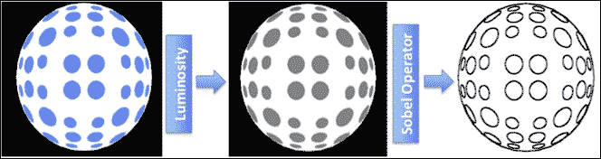

## 准备工作

后处理技术高度依赖于纹理基础和 FBO。因此，作为本章的先决条件，你必须理解这些概念。我们在第七章中很好地介绍了这些概念，*纹理和映射技术*。有关更多信息，请参阅本配方中的*另请参阅*子部分。

### 注意

纹理过滤技术必须设置为`GL_NEAREST`以检测更多边缘和较暗的显示。与使用四个最近纹理坐标的周围像素加权平均的`GL_LINEAR`过滤不同，`GL_NEAREST`过滤使用最接近纹理坐标的像素颜色，因此产生的梯度具有更高的频率变化可能性。

## 如何操作...

按以下步骤逐一指南来理解编程过程。在阅读本节之前，请确保查阅*另请参阅*部分以了解依赖关系。本配方重用了纹理中的 FBO 配方，并将类名从`DemoFBO`更改为`EdgeDetection`：

1.  在构造函数中，加载`SimpleTexture`和`ObjLoader`类。前者类渲染圆点图案网格，后者类用于渲染 FBO 纹理。

1.  在本课程中，创建两个变量`DefaultFBO`和`FboId`，分别用于存储默认帧缓冲区和 FBO 的句柄。再创建两个变量：`textureId`和`depthTextureId`，用于存储 FBO 中的颜色纹理和深度纹理的句柄。

1.  在`initModel()`中创建 FBO，根据应用程序要求使用用户定义的尺寸（宽度和高度）。本配方使用与渲染缓冲区相同的尺寸。帧缓冲区在`GenerateFBO()`函数中创建，该函数创建一个颜色缓冲区和深度缓冲区以存储场景颜色和深度信息：

    ```java
       void EdgeDetection::GenerateFBO(){
       glGetRenderbufferParameteriv(GL_RENDERBUFFER,GL_RENDERBUFFER_WIDTH, &TEXTURE_WIDTH);

       glGetRenderbufferParameteriv(GL_RENDERBUFFER,
       GL_RENDERBUFFER_HEIGHT, &TEXTURE_HEIGHT);

       glGenFramebuffers(1, &FboId); // Create FBO
       glBindFramebuffer(GL_FRAMEBUFFER, FboId);

       // Create color and depth buffer textureobject
        textureId = generateTexture(
        TEXTURE_WIDTH,TEXTURE_HEIGHT);
        depthTextureId = generateTexture(TEXTURE_WIDTH,TEXTURE_HEIGHT,true);

        // attach the texture to FBO color 
        // attachment point
        glFramebufferTexture2D(GL_FRAMEBUFFER,
        GL_COLOR_ATTACHMENT0, GL_TEXTURE_2D, textureId, 0);

       // attach the texture to FBO color 
       // attachment point
       glFramebufferTexture2D(GL_FRAMEBUFFER,GL_DEPTH_ATTACHMENT, GL_TEXTURE_2D,depthTextureId, 0);

       // check FBO status
       GLenum status = glCheckFramebufferStatus(
       GL_FRAMEBUFFER);
       if(status != GL_FRAMEBUFFER_COMPLETE){
       printf("Framebuffer creation fails: %d", status);
                    }
       glBindFramebuffer(GL_FRAMEBUFFER, 0);
             }
    ```

1.  使用`RenderObj()`函数渲染场景。场景使用`SetUpPerspectiveProjection()`渲染到透视投影系统，该函数在`RenderObj()`之前调用。在绘制场景之前必须绑定 FBO。这将渲染场景的颜色信息到 FBO 的颜色纹理，并将深度信息渲染到 FBO 的深度纹理。

1.  设置模型视图矩阵并绘制场景。确保在场景渲染到 FBO 后最后恢复默认帧缓冲区：

    ```java
    void EdgeDetection::RenderObj(){
        // Get the default Framebuffer
        glGetIntegerv(GL_FRAMEBUFFER_BINDING, &DefaultFBO);

        // Bind Framebuffer object
        glBindFramebuffer(GL_FRAMEBUFFER,FboId);
        glViewport(0, 0, TEXTURE_WIDTH, TEXTURE_HEIGHT);
        glFramebufferTexture2D(GL_FRAMEBUFFER,GL_COLOR_ATTACHMENT0, 
        GL_TEXTURE_2D, textureId,0);
        glFramebufferTexture2D(GL_FRAMEBUFFER, GL_DEPTH_ATTACHMENT,
        GL_TEXTURE_2D, depthTextureId, 0);

        glClear(GL_COLOR_BUFFER_BIT|GL_DEPTH_BUFFER_BIT);
        objModel->Render();

        glBindFramebuffer(GL_FRAMEBUFFER, DefaultFBO);
    }
    ```

1.  现在，我们使用`SimpleTexture`类进行边缘检测，一切准备就绪。此类将使用从 FBO 中保存的纹理并对其应用边缘检测着色器。有关`SimpleTexture`类如何工作的更多信息，请参阅第七章中的*使用 UV 映射应用纹理*配方，*纹理和映射技术*。

1.  FBO 纹理被渲染到大小为二的四边形。这个四边形适合完整的视口。这就是为什么正交投影系统也必须定义相同的维度：

    ```java
      TransformObj->TransformSetMatrixMode( PROJECTION_MATRIX );
      TransformObj->TransformLoadIdentity();
      float span = 1.0;
      TransformObj->TransformOrtho(-span,span,-span,span,-span,span);
    ```

1.  `EdgeDetect()` 函数使用 `SimpleTexture` 类应用 Sobel 滤波器。这将在边缘检测着色器中设置所需的 `pixelSize` 统一变量：

    ```java
    void EdgeDetection::EdgeDetect(){
        glDisable(GL_DEPTH_TEST);
        glBindFramebuffer(GL_FRAMEBUFFER, DefaultFBO);
        glViewport(0, 0, TEXTURE_WIDTH, TEXTURE_HEIGHT);
        glActiveTexture (GL_TEXTURE0);
        glBindTexture(GL_TEXTURE_2D,textureId);

        program = ProgramManagerObj->Program
    ((char*)"EdgeDetection" );
        glUseProgram( program->ProgramID );
        GLint PIXELSIZE = ProgramManagerObj->ProgramGetUniformLocation
    (program, (char*) "pixelSize");
        glUniform2f(PIXELSIZE, 1.0/TEXTURE_HEIGHT,
    1.0/TEXTURE_WIDTH);
        textureQuad->Render();
    }
    ```

1.  实现以下用于边缘检测的 `EdgeDetectionFragment.glsl` 片段着色器。在顶点着色器中不需要进行任何更改。使用 `SimpleTexture::InitModel()` 加载此着色器：

    ```java
    #version 300 es
    precision mediump float;
    in vec2 TexCoord;
    uniform vec2 pixelSize;
    uniform sampler2D Tex1;
    layout(location = 0) out vec4 outColor;
    uniform float GradientThreshold;
    float p00,p10,p20,p01,p21,p02,p12,p22,x,y,px,py,distance;
    vec3 lum = vec3(0.2126, 0.7152, 0.0722);
    void main(){
        x = pixelSize.x; y = pixelSize.y;
        p00 = dot(texture(Tex1, TexCoord+vec2(-x, y)).rgb, lum);
        p10 = dot(texture(Tex1, TexCoord+vec2(-x,0.)).rgb, lum);
        p20 = dot(texture(Tex1, TexCoord+vec2(-x,-y)).rgb, lum);
        p01 = dot(texture(Tex1, TexCoord+vec2(0., y)).rgb, lum);
        p21 = dot(texture(Tex1, TexCoord+vec2(0.,-y)).rgb, lum);
        p02 = dot(texture(Tex1, TexCoord+vec2( x, y)).rgb, lum);
        p12 = dot(texture(Tex1, TexCoord+vec2( x,0.)).rgb, lum);
        p22 = dot(texture(Tex1, TexCoord+vec2( x,-y)).rgb, lum);

    // Apply Sobel Operator

        px = p00 + 1.0*p10 + p20 - (p02 + 1.0*p12 + p22);
        py = p00 + 1.0*p01 + p02 - (p20 + 1.0*p21 + p22);
        // Check frequency change with given threshold
        if ((distance = px*px+py*py) > GradientThreshold ){
            outColor = vec4(0.0, 0.0, 0.0, 1.0);
        }else{ outColor = vec4(1.0); }
    }
    ```

## 它是如何工作的...

边缘检测在 `EdgeDetection` 类中实现。这个类包含两个 `ObjLoader` 和 `SimpleTexture` 类的对象。前者类渲染 3D 网格，后者在 HUD 上渲染纹理。首先，场景被渲染到一个帧缓冲对象中。这允许你在帧缓冲对象的颜色缓冲区中以纹理形式捕获当前场景。然后，这个纹理被应用到 Sobel 操作符卷积滤波器上，用于检测边缘。最后，使用 `SimpleTexture` 类的对象将过程纹理渲染回 HUD。

让我们详细理解其工作原理。`EdgeDetection` 类首先在构造函数中初始化 `ObjLoader` 和 `SimpleTexture` 类对象。在 `initModel()` 函数中，它调用 `GenerateFBO` 创建一个与渲染缓冲区具有相同维度的离线渲染缓冲区（FBO）。在渲染函数中，这个 FBO 被附加到绘图管道，以便所有绘图命令都转移到我们的 FBO，而不是默认缓冲区。`ObjLoader` 类将场景渲染到这个 FBO 的纹理（`textureId`）。图形管道再次绑定回默认帧缓冲区，以便输出可见于屏幕。现在，`SimpleTexture` 类通过 `EdgeDetectionFragment.glsl` 着色器处理剩余的查找场景边缘的工作。这个着色器实现了 Sobel 操作符并接受一个纹理作为输入。这个纹理必须是 FBO 的颜色纹理（`textureId`）。在片段着色器程序中，每次处理当前片段时，它都会检索围绕它的 3x3 片段矩阵。然后，这个矩阵沿着水平和垂直方向与卷积核相乘，得到 `px` 和 `py`。这个结果用于计算强度（`distance`）并与给定的阈值（`GradientThreshold`）进行比较。如果比较结果更大，则片段被着色为黑色；否则，它被着色为白色：

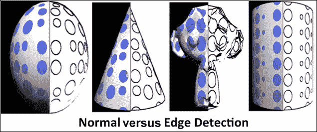

## 参见

+   参考第七章 *使用帧缓冲对象实现渲染到纹理* 的配方，*纹理和映射技术*

+   *实现灰度和 CMYK 转换*

+   参考第六章 *生成圆点图案* 的配方，*使用着色器工作*

# 使用高斯模糊方程制作场景模糊

模糊效果是一种图像处理技术，可以使图像变柔和或使其变得模糊。结果，图像看起来更平滑，就像通过半透明的镜子观看一样。它通过减少图像噪声来降低图像的整体锐度。它在许多应用中使用，例如开花效果、景深、模糊玻璃和热雾效果。

这个配方中的模糊效果是通过使用高斯模糊方程实现的。像其他图像处理技术一样，高斯模糊方程也使用卷积滤波器来处理图像像素。卷积滤波器越大，模糊效果越好，越密集。高斯模糊算法的工作原理非常简单。基本上，每个像素的颜色与相邻像素的颜色混合。这种混合是在一个权重系统的基础上进行的。与较远的像素相比，较近的像素被赋予更多的权重。

**高斯模糊方程背后的数学**：

高斯模糊方程利用高斯函数。该方程的数学形式以及该函数在一维和二维空间中的图形表示，如图中左侧所示。这个配方使用该函数的二维形式，其中 *σ* 是分布的标准差，*x* 和 *y* 是当前纹理像素在水平和垂直轴上的纹理像素距离，该卷积滤波器在其上工作。高斯函数在使高频值更平滑方面非常有用：

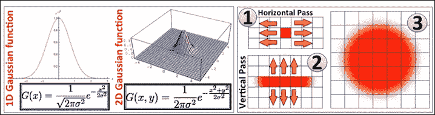

**工作原理**：

高斯滤波器应用于每个纹理像素。因此，其原始值的变化基于相邻像素。相邻像素的数量取决于卷积核的大小。对于一个 9 x 9 的核，所需的计算量是 *9 * 9 = 81*。这些可以通过执行两次高斯模糊来减少，其中第一次在水平方向（*s* 轴）上应用于每个纹理像素，如图中右上角图像的标签（1）所示，第二次在垂直方向（*t* 轴）上应用，由标签（2）表示。这需要 18 次计算，结果与 81 次计算相同。高斯模糊的最终输出由标签 3 表示。

实现高斯模糊需要五个步骤：

+   **滤波器大小**：这取决于许多因素，例如处理时间、图像大小、输出质量等。滤波器越大，处理时间越长，结果越好。在这个配方中，我们将使用 9 x 9 的卷积滤波器。

+   **FBO**：这创建了两个 FBO，第一个包含颜色和深度信息，第二个只包含颜色信息。

+   **渲染到纹理**：这会将场景渲染到第一个 FBO 的颜色纹理中。

+   **水平传递**：这使用第一个 FBO 的颜色缓冲区并应用水平高斯模糊传递。

+   **垂直传递**：这重用第一个 FBO 的颜色缓冲区并应用垂直传递。

## 如何做...

此配方使用了边缘检测的第一个配方。我们将类名从`EdgeDetection`重命名为`GaussianBlur`。理解所需更改的步骤如下：

1.  创建一个新的顶点着色器，称为`Vertex.glsl`，如下代码所示。此顶点着色器将由水平和垂直高斯模糊传递共享：

    ```java
    #version 300 es
    // Vertex information
    layout(location = 0) in vec3  VertexPosition;
    layout(location = 1) in vec2  VertexTexCoord;

    out vec2 TexCoord;
    uniform mat4 ModelViewProjectionMatrix;
    void main( void ) {
        TexCoord = VertexTexCoord;
        vec4 glPos = ModelViewProjectionMatrix *
        vec4(VertexPosition,1.0);
        vec2 Pos = sign(glPos.xy);
        gl_Position = ModelViewProjectionMatrix *
        vec4(VertexPosition,1.0);
    }
    ```

1.  创建一个新的片段着色器，称为`BlurHorizontal.glsl`并添加以下代码：

    ```java
    #version 300 es
    precision mediump float;
    in vec2 TexCoord; 
    uniform vec2 pixelSize; 
    uniform sampler2D Tex1;

    layout(location = 0) out vec4 outColor;

    uniform float PixOffset[5];   // Texel distance
    uniform float Weight[5];      // Gaussian weights

    void main(){
        vec4 sum = texture(Tex1, TexCoord) * Weight[0];
        for( int i = 1; i < 5; i++ ){ // Loop 4 times
           sum+=texture( Tex1, TexCoord + vec2(PixOffset[i],0.0)
           * pixelSize.x) * Weight[i];
           sum += texture( Tex1, TexCoord - vec2(PixOffset[i],0.0) 
           * pixelSize.x) * Weight[i];
        }
        outColor = sum;
    }
    ```

1.  类似地，创建另一个新的片段着色器，称为`BlurVertical.glsl`：

    ```java
    // Use same code from BlurHorizontal.glsl
    void main(){
        vec4 sum = texture(Tex1, TexCoord) * Weight[0];
        for( int i = 1; i < 5; i++ ){ // Loop 4 times
          sum+=texture( Tex1, TexCoord + vec2(0.0, PixOffset[i])
          * pixelSize.y) * Weight[i];
          sum += texture( Tex1, TexCoord - vec2(0.0, PixOffset[i])
          * pixelSize.y) * Weight[i];}
          outColor = sum;
    }
    ```

1.  在`SimpleTexture::InitModel()`中编译和链接这些着色器。

1.  使用`GaussianEquation()`计算高斯权重。我们假设 sigma (*σ*) 为 10.0。参数值包含沿水平或垂直方向的 texel 距离，σ是高斯分布的方差或标准差：

    ```java
    float GaussianBlur::GaussianEquation(float value, float sigma){
    return 1./(2.*PI*sigma)*exp(-(value*value)/(2*sigma));
    }
    ```

1.  计算水平和垂直高斯片段着色器的权重，如下代码所示，使用`GaussianEquation`函数：

    ```java
       gWeight[0]  = GaussianBlur::GaussianEquation(0, sigma);
        sum         = gWeight[0]; // Weight for centered texel

        for(int i = 1; i<FILTER_SIZE; i++){
            gWeight[i] = GaussianBlur::GaussianEquation(i, sigma);

           // Why multiplied by 2.0? because each weight
           // is applied in +ve and –ve direction from the 
           // centered texel in the fragment shader.
            sum += 2.0 * gWeight[i];
        }

        for(int i = 0; i<FILTER_SIZE; i++){
            gWeight[i] = gWeight[i] / sum;
        }

        if (GAUSSIAN_WEIGHT_HOR >= 0){
            glUniform1fv(GAUSSIAN_WEIGHT_HOR, 
            sizeof(gWeight)/sizeof(float), gWeight);
        }

        // Similarly, pass the weight to vertical Gaussian 
        // blur fragment shader corresponding weight 
        // variable GAUSSIAN_WEIGHT_VERT

        float pixOffset[FILTER_SIZE];
        // Calculate pixel offset 
        for(int i=0; i<FILTER_SIZE; i++){ pixOffset[i] = float(i); }
        if (PIXEL_OFFSET_HOR >= 0){
            glUniform1fv(PIXEL_OFFSET_HOR, sizeof(pixOffset)/
            sizeof(float), pixOffset);
        }
    ```

1.  在`Gaussian::InitModel`中创建两个 FBO，使用`GenerateBlurFBO1`（带有颜色和深度纹理）和`GenerateBlurFBO2`（仅颜色缓冲区）。这些创建两个 FBO，分别使用`blurFboId1`和`blurFboId2`句柄。第一个 FBO 使用额外的缓冲区用于深度，因为我们希望执行深度测试，以便将正确的图像渲染到该 FBO 的颜色纹理中。

1.  使用透视投影系统将场景渲染到第一个 FBO（`blurFboId1`颜色纹理）。这将渲染场景图像到该 FBO 的颜色纹理中：

    ```java
    void GaussianBlur::Render(){
       // Set up perspective projection
        SetUpPerspectiveProjection();

        RenderObj();
        // Set up orthographic project for HUD display
        SetUpOrthoProjection();
        RenderHorizontalBlur();
        RenderVerticalBlur();
    }

    void GaussianBlur::RenderObj(){
        // Get the current framebuffer handle
        glGetIntegerv(GL_FRAMEBUFFER_BINDING, &CurrentFbo);

        // Bind Framebuffer 1
        glBindFramebuffer(GL_FRAMEBUFFER,blurFboId1);
        glViewport(0, 0, TEXTURE_WIDTH, TEXTURE_HEIGHT);
        glFramebufferTexture2D(GL_FRAMEBUFFER, GL_COLOR_-ATTACHMENT0, GL_TEXTURE_2D, textureId,0);
        glFramebufferTexture2D(GL_FRAMEBUFFER, GL_DEPTH_-ATTACHMENT, GL_TEXTURE_2D, depthTextureId, 0);

        glClear(GL_COLOR_BUFFER_BIT|GL_DEPTH_BUFFER_BIT);
        objModel->Render();

        glBindFramebuffer(GL_FRAMEBUFFER, CurrentFbo);
    }
    ```

1.  现在，将第二个 FBO（带有`blurFboId2`句柄）设置为渲染目标，重用第一个 FBO 的颜色纹理（包含场景图像），并将其传递给水平模糊传递（传递 1）的`RenderHorizontalBlur()`函数。这将产生第二个 FBO 的（`textureId2`）颜色缓冲区上的水平模糊场景图像。注意，在设置第二个 FBO 之前，投影系统应该是正交的：

    ```java
    void GaussianBlur::RenderHorizontalBlur(){
        glDisable(GL_DEPTH_TEST);

        // Bind Framebuffer 2
        glBindFramebuffer(GL_FRAMEBUFFER,blurFboId2);
        glViewport(0, 0, TEXTURE_WIDTH, TEXTURE_HEIGHT);
        glFramebufferTexture2D(GL_FRAMEBUFFER, 
         GL_COLOR_ATTACHMENT0, GL_TEXTURE_2D, textureId2, 0);
        glActiveTexture (GL_TEXTURE0);
        glBindTexture(GL_TEXTURE_2D, textureId);

        // Apply the shader for horizontal blur pass
        program = textureQuad->ApplyShader(HorizontalBlurShader);
        textureQuad->Render();
        TransformObj->TransformError();
    }
    ```

1.  最后，使用默认帧缓冲区并使用第二个 FBO 的`RenderVerticalBlur`函数在第二个 FBO 的纹理（`textureId2`）上应用传递 2（垂直模糊）：

    ```java
     void GaussianBlur::RenderVerticalBlur() {
        glDisable(GL_DEPTH_TEST);

     // Restore to old framebuffer 
        glBindFramebuffer(GL_FRAMEBUFFER, CurrentFbo);
        glViewport(0, 0, TEXTURE_WIDTH, TEXTURE_HEIGHT);
        glActiveTexture (GL_TEXTURE1);
        glBindTexture(GL_TEXTURE_2D,textureId2);

        // Apply the shader for horizontal blur pass
        program = textureQuad->ApplyShader(VerticalBlurShader);
        GLint PIXELSIZE = ProgramManagerObj->ProgramGetUniform-Location( program, (char *) "pixelSize" );
        glUniform2f(PIXELSIZE, 1.0/TEXTURE_HEIGHT,1.0/TEXTURE_WIDTH);

        textureQuad->Render();
    }
    ```

## 它是如何工作的...

高斯模糊的基本思想是通过对其周围的 texel 进行加权平均来创建图像的新 texel。权重是通过高斯分布函数应用的。对于每个 texel，我们需要在中心像素周围创建一个正方形。例如，对于一个特定的 texel，一个由五个 texel 组成的正方形核对中间的 texel 贡献了 25 个 texel 的加权平均。现在，随着核直径的增长，操作变得昂贵，因为它需要读取更多的 texel 来贡献。这种开销不是线性的，因为一个 9 x 9 的核需要读取 81 个 texel，这几乎是之前核的四倍。

现在，高斯模糊可以被优化以读取更少的 texel 而且仍然达到相同的结果。这可以通过将核操作分为两个步骤，即水平和垂直步骤来实现。在前者中，仅使用核的行元素进行加权平均来计算行的中间 texel。同样，对于后者情况，考虑列元素。这样，它只需要读取 18（9 + 9）个像素，而不是 81。

现在，让我们了解这个菜谱的工作原理。高斯模糊应用于两个阶段。每个阶段都针对一维行和列。第一阶段是水平遍历，其中水平方向的 texel 被高斯核考虑。这个阶段被称为第 1 阶段，它使用 `BlurHorizontal.glsl` 执行。同样，第二阶段的第二个阶段在 `BlurVertical.glsl` 片段着色器中执行。这两个片段着色器共享一个名为 `Vertex.glsl` 的公共顶点着色器，这些着色器由 `SimpleTexture` 类管理。

当 `GaussianBlur` 类被初始化时，它创建了两个 FBO。第一个 FBO 需要颜色和深度信息来渲染场景。然而，第二个 FBO 不需要任何深度纹理信息，因为它在第一个 FBO 的颜色纹理上工作，该纹理已经考虑了场景的深度。

场景被渲染到第一个 FBO 的颜色纹理中。这个颜色纹理与 `SimpleTexture` 类共享，其中第一个步骤（水平模糊）应用于它。在第二个步骤中，使用第二个 FBO，并提供了来自第一个 FBO 的水平模糊颜色纹理（作为输入）。这个纹理（水平模糊）处理垂直模糊着色器，并将处理后的纹理存储在第二个 FBO 的颜色缓冲区中。最后，场景附加到默认帧缓冲区，第二个 FBO 的颜色缓冲区被渲染到屏幕上：

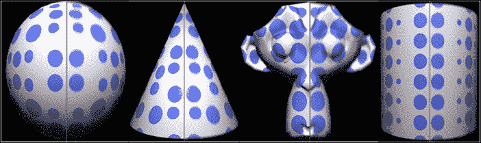

## 参见

+   *使用 Sobel 算子检测场景边缘*

# 使用光晕效果实时制作场景发光

模糊是一种非常有用的后屏幕处理技术，可以使实时场景发光。使用此效果，场景的某些部分会显得非常明亮，并给人一种在空气中发出散射光的感觉。这项技术在游戏和电影效果中得到了广泛应用。

模糊效果的工作原理非常简单。以下图像展示了当前配方中使用的模型的工作原理图，其中场景被渲染到离线帧缓冲区或纹理（标记**1**），其纹理作为下一阶段的输入，该阶段检测场景中的明亮部分并将其写入新的纹理（标记**2**）。然后，这个纹理被传递到水平（标记**3**）和垂直模糊（标记**4**），应用高斯模糊效果使其变得模糊并稍微分散。这个输出（标记**4**）最终与原始渲染的场景（标记**1**）结合，产生类似发光的效果：

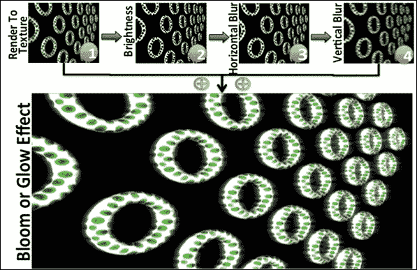

## 如何实现...

本配方重用了我们之前关于高斯模糊的配方。我们将类名从`GaussianBlur`更改为`Bloom`。以下是实现此配方的步骤：

1.  创建一个新的片段着色器，称为`Bloom.glsl`。这个片段着色器需要在`SimpleTexture`类中编译和链接。这个着色器负责定位场景中的明亮部分：

    ```java
       in vec2 TexCoord;
       uniform sampler2D Tex1;
       layout(location = 0) out vec4 outColor;
       void main() {
       vec4 val = texture(Tex1, TexCoord);
       float brightness = 0.212*val.r + 0.715*val.g + 0.072*val.b;
       brightness>0.6 ? outColor=vec4(1.) : outColor=vec4(0.); 
    }
    ```

1.  在`BlurHorizontal.glsl`中不需要进行任何更改。然而，在`BlurVertical.glsl`中，添加以下代码。这段代码负责将场景中模糊的明亮部分与保存在`RenderTex`纹理中的原始场景（未更改）混合：

    ```java
    void main(){
         vec4 scene = texture(RenderTex, TexCoord);
         vec4 sum = texture(Tex1, TexCoord) * Weight[0];
         for( int i = 1; i < 5; i++ ){
         sum+=texture(Tex1,TexCoord+vec2(0.0,PixOffset[i]) 
        *pixelSize.y)*Weight[i];
        sum+=texture(Tex1,TexCoord-vec2(0.0,PixOffset[i]) 
        *pixelSize.y)*Weight[i];
     }
         outColor = sum + scene;
    }
    ```

1.  在`Bloom::InitModel`中使用`GenerateSceneFBO()`（使用颜色和深度纹理）、`GenerateBloomFBO()`（仅使用颜色缓冲区）和`GenerateBlurFBO2()`（仅使用颜色缓冲区）创建三个 FBO。这些函数将分别创建具有`SceneFbo`、`BloomFbo`和`BlurFbo`句柄的三个 FBO。

1.  在`Bloom::Render()`下渲染模糊配方。在这个函数中，使用透视投影系统渲染场景，在正交投影系统下处理纹理，并存储默认帧缓冲区的句柄。

1.  使用`RenderObj()`、`RenderBloom()`、`RenderHorizontalBlur()`和`RenderVerticalBlur()`渲染模糊效果的各个阶段。所有这些函数都接受四个参数。第一个参数（`BindTexture`）指定输入颜色纹理/缓冲区，第二个参数（`Framebuffer`）指定场景应附加到的帧缓冲区的句柄，第三个参数（`ColorBuf`），以及第四个参数（`DepthBuf`）指定场景写入的颜色和深度缓冲区。如果任何参数不是必需的，则发送`NULL`作为参数：

    ```java
    void Bloom::Render(){
       // Perspective projection
       SetUpPerspectiveProjection(); 
       glGetIntegerv(GL_FRAMEBUFFER_BINDING, &DefaultFrameBuffer);

       // Render scene in first FBO called SceneFBO
       RenderObj(NULL, SceneFbo, SceneTexture, DepthTexture); 

       // Orthographic projection
       SetUpOrthoProjection(); 

       // Render Bloom pass  
       RenderBloom(SceneTexture, BloomFbo, BloomTexture, NULL);

       // Render Horizontal pass
       RenderHorizontalBlur(BloomTexture,
       BlurFbo, BlurTexture, NULL);
       // Render Vertical pass
       RenderVerticalBlur(BlurTexture,
       DefaultFrameBuffer,NULL,NULL);
    }
    ```

1.  `RenderObj()`将场景渲染到`SceneFbo`帧缓冲区中的`SceneTexture`和`DepthTexture`。

1.  类似地，`RenderBloom()`使用`SceneTexture`。现在，将其应用于`BlurHorizontal.glsl`着色器，这将渲染场景到`BlurTexture`。

1.  最后，`RenderVerticalBlur()`使用`BlurTexture`和`SceneTexture`作为输入，并对其应用`BlurVertical.glsl`着色器，这将应用垂直模糊通道并将其混合到场景纹理中。

1.  现在，使用`blurFboId2` FBO，并重用第一个 FBO 的纹理，将其传递到通道 1（水平模糊）使用`RenderHorizontaBlur()`函数。这将存储通道 2 的处理结果在`textureId2`。

1.  现在，使用默认的帧缓冲区，并将通道 2（垂直模糊）应用于第二个 FBO 的纹理（`textureId2`）。

## 它是如何工作的...

花瓣效果的工作原理与之前的菜谱非常相似。相反，增加了一个新的花瓣阶段。首先，场景被渲染到一个非默认的帧缓冲区，称为`SceneFBO`，其中它被写入到`SceneTexture`。下一个阶段称为花瓣，也是在离线帧缓冲区（`BloomFBO`）上执行的。在这里，前一个阶段的纹理被用作输入，并应用于花瓣片段着色器。花瓣着色器将彩色图像转换为亮度，以线性渐变形式存储图像信息。这提供了图像的亮度信息，其中通过将渐变值与所需的阈值进行比较来检测亮度部分。然后，最亮的部分被写入到`BloomTexture`，并提供给高斯模糊阶段。

在这个阶段，从上一个阶段存储在`BloomTexture`中的输入使用水平高斯模糊通道进行处理，其中它存储在`BlurTexture`并应用于垂直通道。在垂直模糊通道期间，模糊的亮度部分与原始场景使用`SceneTexture`混合。这样，图像与场景上的明亮散射光混合：

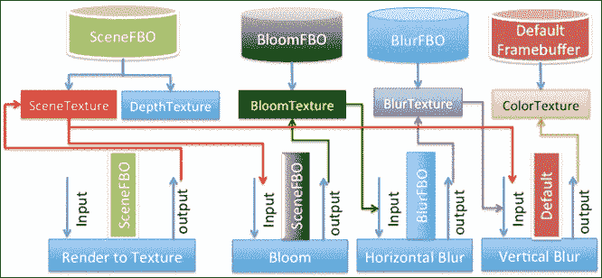

## 参见

+   *使用 Sobel 算子检测场景边缘*

+   *使用高斯模糊方程使场景模糊*

# 将场景绘制成卡通着色

在各种不同的着色器中，卡通着色器因其能够产生卡通着色场景而广为人知。卡通着色技术是在片段着色器中实现的。这种着色器的基本基础是颜色的量化。在这里，一系列颜色被表示为单一类型的颜色。从数学上讲，颜色值被限制在连续的值集合（以浮点数表示）到相对较小的离散颜色集合（用整数表示）。除了颜色的量化之外，几何形状的边缘也使用 Sobel 算子进行突出显示。

以下图像显示了当前菜谱的截图，其中可以很容易地看到各种绿色色调中的量化。同时，Sobel 算子渲染了粗黑边：

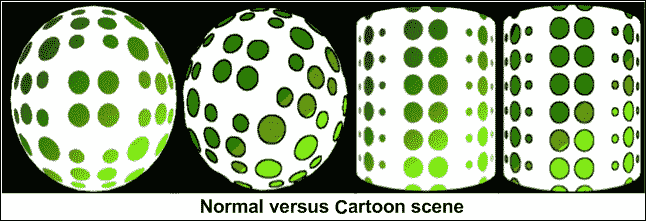

## 准备中

这个配方是我们边缘检测配方的扩展。通过在片段着色器中做非常小的改动，我们可以创建出类似绘画卡通的场景。对于这个配方，建议您彻底理解本章中的第一个配方。这个配方将涵盖我们为实施卡通着色器而添加到现有边缘检测片段着色器中的更改。

## 如何操作...

我们重用了`EdgeDetectionFragment.glsl`并将其重命名为`ToonShader.glsl`：

```java
uniform float quantizationFactor;
void main(){
    // Reuse Edge detection recipe fragment shader and
    // Calculate p00, p10, p20,p01, p21, p02, p12, p22 
    px = p00 + 2.0*p10 + p20 - (p02 + 2.0*p12 + p22);
    py = p00 + 2.0*p01 + p02 - (p20 + 2.0*p21 + p22);
    // Check frequency change with given threshold
    if ((distance = px*px+py*py) > GradientThreshold ){
        outColor = vec4(0.0, 0.0, 0.0, 1.0);
    }else{ // Apply the Cartoon shading
    rgb = texture(Tex1,TexCoord).rgb*quantizationFactor;
    rgb += vec3(0.5, 0.5, 0.5);
    ivec3 intrgb = ivec3(rgb);
    rgb = vec3(intrgb)/ quantizationFactor;
    outColor = vec4(rgb,1.0); 
   }
}
```

## 它是如何工作的...

在卡通着色中，每个传入的片段首先通过 Sobel 操作来检查它是否属于边缘。如果是，当前片段以黑色边缘颜色渲染；否则，它将以卡通着色效果进行着色。

在卡通着色效果中，每个片段颜色乘以一个`quantizationFactor`（在本例中为 2.0）。这在图像量化过程中被使用。在计算机图形学中，图像量化是将大量颜色限制为更少颜色的过程。换句话说，它将相似的颜色分组为一种。

获得的颜色分量加上 0.5 以增加产生大于 1.0 的值的可能性。这对于下一步很有帮助，在这一步中，浮点颜色空间被转换为整数类型。在这个过程中，颜色分量的十进制部分被截断。

最后，通过将整数空间颜色分量除以`quantizationFactor`来抵消`quantizationFactor`乘法的效果（我们在开始时应用了这一点）。结果值应用于片段。

## 参见

+   *使用 Sobel 算子检测场景边缘*

# 生成凸起场景

凸起是一种技术，其中场景看起来有凸起或突出，具有一定的 3D 深度。凸起着色器的逻辑与边缘检测技术类似。在这里，检测到的边缘用于根据边缘角度突出图像。

## 准备工作

对于这个配方，我们将重用本章中实现的任何先前后处理配方。这个配方将直接跳转到着色器部分，假设读者已经理解了后处理的基本逻辑。

## 如何操作...

创建一个新的片段着色器，命名为`EmbossFrag.glsl`，如下面的代码所示。对于顶点着色器没有需要更改的地方：

```java
in vec2 TexCoord;
uniform vec2 pixelSize;
uniform sampler2D Tex1;
layout(location = 0) out vec4 outColor;
uniform float EmbossBrightness, ScreenCoordX;

void main(){
   // Apply Emboss shading
   vec3 p00 = texture(Tex1, TexCoord).rgb;
   vec3 p01 = texture(Tex1, TexCoord + vec2(0.0,
 pixelSize.y)).rgb;

// Consecutive texel difference
   vec3 diff = p00 - p01;

// Find the max value among RGB
   float maximum = diff.r;
   if( abs(diff.g) > abs(maximum) ){ 
   maximum = diff.g;
}

if( abs(diff.b) > abs(maximum) ){
    maximum = diff.b;
}

// Choose White, Black, or Emboss color
   float gray = clamp(maximum+EmbossBrightness, 0.0, 1.0);
   outColor = vec4(gray,gray,gray, 1.0);

}
```

## 如何工作...

在这个配方中，通过取任意方向上两个连续 texel 之间的差值来检测边缘。这两个结果的差值产生一个新的颜色强度，其中每个分量（RGB）相互比较以找到具有最大幅度的分量（max）。然后使用这个分量在低（0.0）和高（1.0）之间进行 clamp 操作。这个操作产生了三种颜色强度：白色（来自低），黑色（来自高）1.0，和凸起（来自最大分量）。凸起着色器的结果如下所示。

首先，场景被渲染到一个 FBO 中，并在颜色缓冲区中存储。然后，这个颜色缓冲区被发送到 `Tex1` 变量中的浮雕着色器。`p00` 和 `p01` 被表示为两个连续的纹理元素，它们从 `Tex1` 中采样，用于当前片段的位置。差异被存储在 diff 变量中。diff 变量被检查以找到 RGB 组件中的最大幅度，它被存储在 max 变量中。使用 `clamp()` 函数将最大值钳位。最终结果被用作当前片段的 RGB 组件：

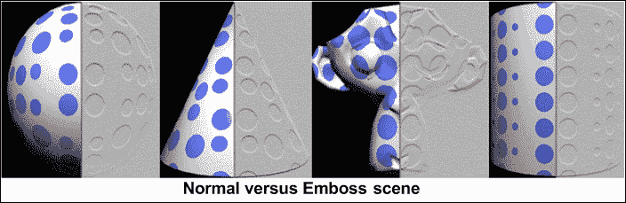

## 更多内容...

在本食谱中使用的钳位操作是通过 `clamp()` GLSL 函数执行的。这个函数接受三个值：原始值、下限和上限范围值。如果原始值位于最小和最大范围之间，则返回原始值；否则，如果值小于最小值，则返回最小范围值，反之亦然。

**语法**:

```java
void clamp(genType x, genType minVal, genType maxVal);
```

| 变量 | 描述 |
| --- | --- |
| `x` | 这指定了要约束的值 |
| `minVal` | 这指定了约束 `x` 的范围的下限 |
| `maxVal` | 这指定了约束 `x` 的范围的上限 |

## 相关内容

+   *实现灰度和 CMYK 转换*

# 实现灰度和 CMYK 转换

灰度或亮度是一个重要的主题，没有讨论其实际实现，数字图像处理就不完整。亮度在图像处理的多种应用中被广泛使用。边缘检测、卡通阴影和浮雕效果是我们在本章中实现的例子，它们都利用了亮度。在本食谱中，你将学习如何将 RGB 颜色空间转换为亮度和 CMYK。

从数值上讲，灰度是黑色和白色之间的线性插值，这取决于颜色深度。8 位深度表示从白色到黑色变化的 256 种不同色调。然而，使用 4 位，只能表示 16 种色调。黑色是可能的最暗色调，这是传输或反射光的总缺失。最亮的可能色调是白色，这是在所有可见光下传输或反射光的总和。中间的灰色色调由三种原色（红色、绿色和蓝色）的相等水平来表示，以传递光，或者由三种原色素（青色、品红色和黄色）的相等量来表示反射光。

### 注意

ITU-R BT.709 标准提供了以下这些组件的权重：

*RGB 亮度值 = 0.2125*(红色) + 0.7154*(绿色) + 0.0721*(蓝色)*

## 准备工作

从这个配方开始，我们将讨论本章中实现的各种图像处理技术。对于这些配方，我们重用了来自第七章的*应用带有 UV 映射的纹理*配方，*纹理和映射技术*。对于当前的图像处理配方，我们只需要在片段着色器中进行更改。继续下一节，了解需要进行的更改以实现灰度和 CMYK 转换。

## 如何操作...

重复使用之前提到的简单纹理配方，并在片段着色器中进行以下更改以实现灰度和 CMYK 配方：

**灰度配方**:

```java
in vec2 TexCoord;
uniform sampler2D Tex1;
  layout(location = 0) out vec4 outColor;
  // Luminance weight as per ITU-R BT.709 standard
  const vec3 luminanceWeight = vec3(0.2125, 0.7154, 0.0721);
  void main() {
  vec4 rgb = texture(Tex1, TexCoord); // Take the color sample
  // Multiply RGB with luminance weight
  float luminace = dot(rgb.rgb, luminanceWeight);
  outColor = vec4(luminace, luminace, luminace, rgb.a); 
}
```

## 它是如何工作的...

声明一个`luminanceWeight`变量，该变量包含 RGB 组件的权重，按照 ITU-R BT.709 标准。使用传入的纹理坐标，并在`rgb`变量中采样相应的 texel。计算亮度权重和 rgb 变量之间的点积，以生成灰度图像（存储在亮度变量中）。当前配方输出的灰度图像显示在以下右侧图像中：

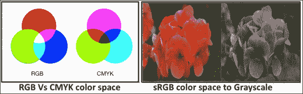

## 还有更多...

在彩色计算机显示器上，图像以 RGB 颜色空间表示。然而，当使用标准印刷过程发布这些图像时，需要将它们转换为 CMYK 颜色空间。RGB 模型是通过向黑色添加颜色成分来创建的。这是基于发射色。相比之下，CMYK 颜色是透射的。在这里，颜色是通过从白色中减去颜色成分来创建的。在 RGB 到 CMYK 转换中，红色成分变为青色，绿色变为品红色，蓝色变为黄色，黑色变为黑色。出版印刷机使用 CMYK 颜色格式，其中 RGB 空间图像被转换为四个单独的单色图像，这些图像用于创建四个单独的印刷版，用于印刷过程。

可以使用以下公式从 RGB 计算出 CMYK 颜色空间：

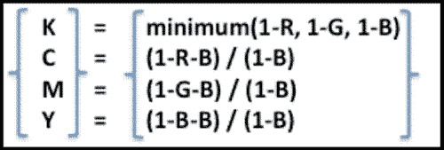

然而，这种简单的转换并不能真正达到转换后预期的结果。以下是从 Adobe Photoshop 中得到的近似值，效果非常令人满意。底色去除（**ucr**）和黑色生成（**bg**）函数如下所示，其中*Sk=0.1*，*K0 = 0.3*，*Kmax = 0.9*。这些是公式中使用的常数值：

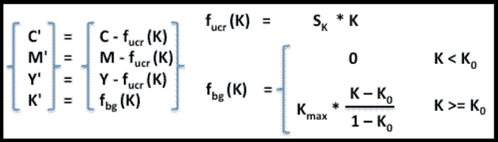

### 注意

**去除底色**（**ucr**）是消除用于产生深中性黑色时叠加的黄色、品红色和青色颜色成分的过程，用全黑墨水来替代它们。这导致墨水用量减少，阴影深度增加。

**黑色生成**（**bg**）是产生黑色通道或颜色的过程。这会影响颜色通道，当从 RGB 颜色空间转换为 CMYK 颜色空间时进行颜色转换。

下图显示了 CMYK 的彩色版本和四个分离的灰度版本。每个组件的灰度表示显示了每个较暗值所需的油墨量，表明油墨消耗量高：

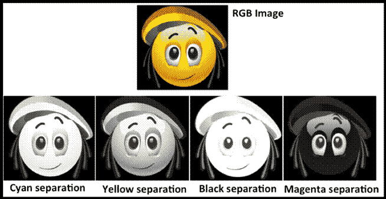

这里是 RGB 颜色空间到 CMYK 颜色空间转换的片段着色器代码：

```java
   in vec2 TexCoord;
   uniform sampler2D Tex1;
   uniform float ScreenCoordX;
   uniform int caseCYMK;
   layout(location = 0) out vec4 outColor;
   void main() { // Main Entrance
   vec4 rgb  = texture(Tex1, TexCoord);
   vec3 cmy  = vec3(1.0)-rgb.rbg;
   float k   = min(cmy.r, min(cmy.g, cmy.b));

   // fucr (K)= SK*K, SK = 0.1 
   vec3 target  = cmy - 0.1 * k;

   // fbg (K) = 0, when K<K0, K0 =0.3, Kmax =0.9
   // fbg (K) = Kmax*(K-K0)/(1-K0), when K>=K0
   k<0.3 ? k=0.0 : k=0.9*(k-0.3)/0.7; 
   vec4 cmyk = vec4(target, k);
// Since we are interested in the separation of each component
// we subtracted gray scale of each color component from white
   if(caseCYMK == 0){              // CYAN conversion
      outColor = vec4(vec3(1.0 - cmyk.x),rgb.a);
   }else if(caseCYMK == 1){     // MAGENTA conversion
       outColor = vec4(vec3(1.0 - cmyk.y),rgb.a);}
   else if(caseCYMK == 2){     // YELLOW conversion
       outColor = vec4(vec3(1.0 - cmyk.z),rgb.a);}
   else if(caseCYMK == 3){     // BLACK conversion
       outColor = vec4(vec3(1.0 - cmyk.w),rgb.a);}
   else{ outColor = rgb;}      // RGB
}
```

## 参见

+   参考第七章中的*使用 UV 映射应用纹理*配方，*纹理和映射技术*，第七章

# 使用桶形畸变实现鱼眼效果

鱼眼是一种效果，其中场景看起来是球形的。因此，场景中的边缘看起来是弯曲的，并围绕这个虚拟球体的中心弯曲。这种效果使场景看起来像被包裹在一个弯曲的表面上。

桶形畸变技术被用来实现当前效果，它可以应用于片段或顶点。这个配方首先将在片段着色器上实现桶形畸变，然后将其应用于顶点着色器。两者的区别在于：在前者着色器中，几何形状不会畸变。然而，纹理坐标会畸变，从而产生放大镜效果或鱼眼镜头效果。在后一种技术中，几何形状被位移，创造出不同的有趣畸变形状。请注意，这并不是一种后处理技术。

## 准备工作

对于这个配方，我们可以重用我们的第一个配方，并用当前的桶形畸变片段着色器`BarrelDistFishEyeFragment.glsl`替换边缘检测逻辑。

## 如何做到这一点...

修改`BarrelDistFishEyeFragment.glsl`，如下面的代码所示：

```java
precision mediump float;
in vec2 TexCoord;
uniform sampler2D Tex1;
layout(location = 0) out vec4 outColor;

uniform float BarrelPower;
uniform float ScreenCoordX;

vec2 BarrelDistortion(vec2 p){
    float theta  = atan(p.y, p.x);
    float radius = sqrt(p.x*p.x + p.y*p.y); 
    radius = pow(radius, BarrelPower);
    p.x = radius * cos(theta);
    p.y = radius * sin(theta);
    return (p + 0.5);
}

vec2 xy, uv;
float distance;
void main(){
      if(gl_FragCoord.x > ScreenCoordX){
          // The range of text coordinate is from (0,0)
          // to (1,1). Assuming center of the Texture
          // coordinate system middle of the screen.
          // Shift all coordinate wrt to the new 
          // center. This will be the new position 
          // vector of the displaced coordinate.
          xy = TexCoord - vec2(0.5);

         // Calculate the distance from the center point.
         distance = sqrt(xy.x*xy.x+xy.y*xy.y); 

         float radius = 0.35;
         // Apply the Barrel Distortion if the distance
         // is within the radius. Our radius is half of 
         // the ST dimension.
         uv = (distance < radius?BarrelDistortion(xy):TexCoord);

         if( distance > radius-0.01 && distance < radius+0.01 ){
             outColor = vec4(1.0, 0.0, 0.0,1.0);
         }
         else{
             // Fetch the UV from Texture Sample
             outColor = texture(Tex1, uv);
         }
     }
     else{
        outColor = texture(Tex1, TexCoord);
     }
}
```

## 它是如何工作的...

这个配方首先将场景渲染到 FBO 的颜色纹理中，然后与`SimpleTexture`类共享，并应用于纹理坐标从(0.0, 0.0)到(1.0, 1.0)的四边形几何形状。四边形的顶点和纹理信息被提供给顶点和片段着色器以处理几何和片段信息。桶形畸变技术实现在片段着色器中，其中每个传入的纹理坐标临时转换为极坐标以产生鱼眼效果。

纹理坐标首先在中心（0.5, 0.5）进行转换，并从中心计算这些转换后的纹理坐标的距离。如果转换后的纹理坐标（`xy`）超出了给定的 0.35 半径阈值，则使用未改变的纹理坐标（`TexCoord`）从`Tex1`获取样本；否则，将此坐标（`xy`）应用于桶形畸变，使用`BarrelDistortion`函数。以下图像显示了红色圆圈的半径。`BarrelDistortion`函数首先计算纹理坐标相对于逻辑圆心的长度。通过桶形功率改变获得的长度，从而缩小或扩大长度。以下图像显示了不同桶形功率（1.0、0.5、0.3 和 2.0）得到的不同结果。

然后将此改变后的长度乘以纹理坐标沿 S（水平）和 T（垂直）组件的斜率，这将得到一组新的转换后的纹理坐标。这些纹理坐标被重新转换回它们的原始位置（底部，左侧）。最后，使用重新转换的纹理坐标从输入纹理坐标计算采样纹理：

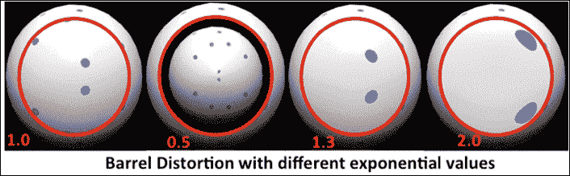

## 更多内容...

当桶形畸变应用于几何形状时，它会扭曲几何形状的物理形状。以下图像显示了桶形畸变在不同网格上的应用。您可以使用本章提供的`BarrelDistortion_Vtx_Shdr`源代码来探索此方法：

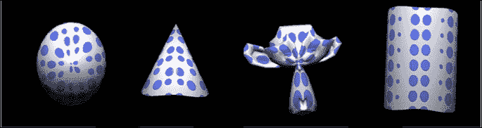

此方法的逻辑与之前类似，只是现在它是通过顶点着色器实现的。在这里，我们不需要从中心转换纹理坐标，因为默认情况下，原点始终是笛卡尔坐标系的原点。

在顶点着色器中使用以下代码来应用桶形畸变：

```java
layout(location = 0) in vec4  VertexPosition;
layout(location = 1) in vec3  Normal;
uniform mat4   ModelViewProjectionMatrix, ModelViewMatrix;
uniform mat3    NormalMatrix;
out vec3         normalCoord, eyeCoord, ObjectCoord;
uniform float   BarrelPower;

vec4 BarrelDistortion(vec4 p){
    vec2 v = p.xy / p.w;
    float radius = length(v);
   // Convert to polar coords
    if (radius > 0.0){ 
        float theta = atan(v.y,v.x);
        radius = pow(radius, BarrelPower);
    // Apply distortion
        // Convert back to Cartesian
        v.x = radius * cos(theta); 
        v.y = radius * sin(theta);
        p.xy = v.xy * p.w;
    }
    return p;
}

void main(){
    normalCoord = NormalMatrix * Normal;
    eyeCoord    = vec3 ( ModelViewMatrix * VertexPosition );
    ObjectCoord = VertexPosition.xyz;
    gl_Position = BarrelDistortion(ModelViewProjectionMatrix*
    VertexPosition);
} 
```

## 参见

+   参考第六章中的*生成圆点图案*配方，*使用着色器工作*，第六章，*使用着色器工作*

# 使用过程纹理实现双眼视图

此方法实现了一个双眼视图效果，其中场景被渲染成好像是从双眼本身可视化的。我们将通过编程过程着色器来实现此效果。或者，在另一种技术中，使用 alpha 映射纹理代替。在此方法中，一个包含双眼视图图像的 alpha 掩码纹理被叠加到场景之上。这样，只有属于非掩码纹理区域的场景部分是可见的。

程序化纹理方法也相对简单。在这里，场景是在片段着色器中编程的，其中使用顶点的纹理坐标创建双重视觉效果。纹理坐标用于在渲染的图像上创建一个逻辑圆形区域。属于这个圆形区域外缘的片段将以不透明颜色（例如黑色）渲染。随着距离缩小到这个圆形区域的中心点，这种不透明度会降低。设备屏幕上的触摸点（单次点击手势）用作圆形区域的中心点；这样，可以使用触摸手势在屏幕上移动镜头。

## 如何操作...

使用任何现有的图像处理配方，并在片段着色器中替换以下代码。这个片段着色器从 OpenGL ES 程序接受一些输入。图像纹理存储在`Tex1`中；必须提供触摸点作为中心变量，它将被视为圆的中心。我们还需要`horizontalAspectRatio`和`verticalAspectRatio`纵横比，以便在不同屏幕分辨率下，圆形保持圆形，不会变成任何椭圆形。最后，我们需要内半径和外半径（`LensInnerRadius`，`LensOuterRadius`）来定义圆形区域的宽度。颜色（`BorderColor`）将用于遮罩绘制：

```java
#version 300 es
precision mediump float;
in vec2 TexCoord; 
uniform sampler2D Tex1;
uniform vec2 center;
uniform float horizontalAspectRatio, verticalAspectRatio;
uniform float LensInnerRadius,LensOuterRadius;
uniform vec4 BorderColor;

layout(location = 0) out vec4 outColor;
void main() {
outColor = texture(Tex1, TexCoord);
   float dx = TexCoord.x-center.x; 
float dy = TexCoord.y-center.y;

dx *= horizontalAspectRatio; 
dy *= verticalAspectRatio;
   float distance = sqrt(dx * dx + dy * dy);
   outColor = mix( outColor, BorderColor,
       smoothstep(LensInnerRadius, LensOuterRadius, distance));
  return;
}
```

## 工作原理...

将传入的纹理坐标减去中心位置，并转换为新的逻辑坐标，其中变换后的纹理坐标或位置向量（dx，dy）以中心点（`center`）为参考存储。此坐标必须在水平和垂直方向上乘以`aspectRatio`，以消除由于水平和垂直设备屏幕分辨率差异引起的任何形状扭曲。

每个位置向量的距离使用向量长度公式 *P (x, y) = √(x² + y²)* 计算，并输入到平滑步 GLSL API 中。平滑步 API 接受三个参数（**edge1**，**edge2**和**x**）。前两个参数是两个外值，第三个是权重。参考以下左侧图像来理解其功能。此 API 根据提供的权重返回两个边缘之间的插值值。平滑步的输出用作权重，输入到另一个名为 mix 的 GLSL API 中。mix API 使用平滑步函数提供的加权值混合边框颜色与当前纹理：


## 参考内容

+   请参考第七章中关于*使用 UV 映射应用纹理*的配方，*纹理和映射技术*

# 旋转图像

旋转是一种在动画中非常常见的效果。当应用于渲染的场景或图像时，它扭曲了圆形区域内的外观，并在这些纹理元素围绕圆形区域中心移动时产生径向圆形运动，从而产生漩涡状效果。

在程序上，对于给定的图像，选择一个任意的纹理元素作为中心。从圆心到固定距离定义了圆的轨迹。所有落在该轨迹下的纹理元素都应用于旋转。圆内的纹理元素旋转随着与中心的距离增加而减小，并在圆周边缘消失。以下图像显示了旋转效果的外观：

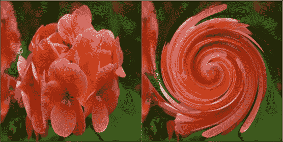

## 如何实现...

在片段着色器中使用以下代码实现旋转效果：

```java
in vec2 TexCoord;
uniform sampler2D Tex1;
uniform float ScreenCoordX,twirlRadius,angle,imageHeight, imageWidth;
uniform vec2 center;
float radiusFactor = 3.0;
layout(location = 0) out vec4 outColor;
// Note: the angle is assumed to be in radians to 
// work with trigonometric functions.  
vec4 Twirl(sampler2D tex, vec2 uv, float angle){
    // Get the current texture size of the image
    vec2 texSize = vec2(imageWidth, imageHeight);

    // Change the texCoordinate w.r.t. to the image dimensions
    vec2 tc = (uv * texSize) - center;

    // Calculate the distance of the current transformed
 // texture coordinate from the center.
    float distance = sqrt(tc.x*tc.x + tc.y*tc.y);
    if (distance < twirlRadius+angle*radiusFactor){
        float percent   = (twirlRadius - distance)/twirlRadius;
        float theta     = percent * percent * angle;
        float sinus     = sin(theta);
        float cosine    = cos(theta);
        tc = vec2(dot(tc, vec2(cosine, -sinus)), dot(tc,
 vec2(sinus, cosine)));
    }
 return texture(tex, (tc+center) / texSize);
}

void main() {
if(gl_FragCoord.x > ScreenCoordX)
outColor = Twirl(Tex1, TexCoord, angle); 
else
outColor = texture(Tex1, TexCoord);
}
```

## 它是如何工作的...

旋转效果需要一个中心点，围绕该中心点产生漩涡效果，这个中心点由 OpenGL ES 程序中的中心变量提供。此外，我们还需要图像的大小（`imageHeight` 和 `imageWidth`），它用于控制图像边界内的动画区域。

每个传入的纹理坐标通过乘以图像大小转换为相应的纹理元素位置，然后相对于中心进行平移。平移后的坐标代表位置向量，用于计算从中心点的距离。如果距离在给定的半径阈值内，则纹理元素将以在度数中指定的任意角度围绕中心旋转。旋转角度随着中心与平移坐标之间的距离减小而增加。

## 参见

+   *使用程序纹理实现双目视图*

# 纹理四边形球体幻觉

本食谱将演示一种性能高效的技巧，该技巧利用程序纹理来产生真实 3D 对象的幻觉。在 Gouraud 着色中，片段根据光源的方向和几何形状进行光照着色。例如，在第五章中，我们实现了球形模型上的漫反射光，该模型包含非常多的顶点。本食谱技术渲染相同的漫反射球体，但只使用四个顶点。它以这种方式伪造光照着色，使得两者之间的差异难以区分。

性能直接与它渲染到屏幕上的片段数量成正比。例如，单个全屏渲染球体覆盖的表面积相当于在屏幕上覆盖相同表面积的几个小球。

## 如何实现...

使用以下步骤来实现具有纹理的四边形球体：

1.  创建一个名为 `TextureQuadSphere` 的新类，该类从 `Model` 类派生。

1.  声明四边形所需的必要顶点信息，这将渲染成球体：

    ```java
    float vertexColors[12] = { 0, 0, 0, 1, 0, 0, 1, 1, 0, 0, 1, 0 };
    float texCoords[8]   = { 0.f, 0.f, 1.f, 0.f, 0.f, 1.f, 1.f, 1.f };
    float quad[8]       = { -1.f,-1.f,1.f,-1.f,-1.f, 1.f, 1.f,1.f};
    ```

1.  添加以下`TexQuadSphereVertex.glsl`顶点着色器：

    ```java
    #version 300 es
    uniform mat4 ModelViewProjectMatrix;
    layout(location = 0) in vec3  VertexPosition;
    layout(location = 1) in vec2  VertexTexCoord;
    layout(location = 2) in vec4  VertexColor;
    out vec4 TriangleColor; out vec2 TexCoord;

    void main() {
     gl_Position = ModelViewProjectMatrix*vec4(VertexPosition,1.0);
     TriangleColor = VertexColor;
     TexCoord = VertexTexCoord;
    }
    ```

1.  在`TexQuadSphereFragment.glsl`中不需要进行任何更改：

    ```java
    #version 300 es
    precision mediump float;
    in vec4 TriangleColor; 
    in vec2 TexCoord;
    uniform float ScreenWidth; 
    uniform float ScreenHeight;
    uniform float ScreenCoordX; 
    uniform float ScreenCoordY;
    out vec4 FragColor;
    vec3 lightDir = normalize(vec3(0.5, 0.5, 1.0));

    void main() {
    vec2 resolution = vec2(ScreenWidth, ScreenHeight);
       vec2 center     = vec2(resolution.x/2.0, resolution.y/2.0);
        lightDir = normalize(vec3((ScreenCoordX - center.x)
    /(ScreenWidth*0.5), (ScreenCoordY - center.y)
    /(ScreenHeight*0.5), 1.0));

        float radius   = 0.5; // Calculate the sphere radius
     vec2 position  = TexCoord.xy - vec2(0.5, 0.5);
        float z       = sqrt(radius*radius – 
    position.x*position.x - position.y*position.y);
        vec3 normal=normalize(vec3(position.x,position.y,abs(z)));
        if (length(position) > radius) { // Outside
            FragColor = vec4(vec3(0.0,0.0,0.0), 0.0);
        } else { // Inside
            float diffuse = max(0.0, dot(normal, lightDir));
            FragColor = vec4(vec3(diffuse), 1.0);
        }
    }
    ```

## 它是如何工作的...

这种技术使用一个具有四个纹理坐标的方形几何体，每个顶点共享纹理坐标。纹理坐标通过`TexCoord`变量在顶点着色器和片段着色器之间共享。纹理坐标的范围从 0.0 到 1.0。这些坐标减去半维度来计算相对于圆心的位置向量（`position`）。圆的半径和从圆心到任意位置向量的任意位置被用来计算给定位置的高度。

这个高度与位置坐标一起用来产生一个法向量；这个法向量提供了它与入射光线的角度。这个角度的余弦值用于颜色强度，以产生光在逻辑半球上的漫反射效果。入射光线使用屏幕分辨率和戳坐标*x*和*y*位置实时计算。

以下图显示了之前描述的工作逻辑的图示。P (x, y, 0.0)代表位置向量（`position`），C 是中心，Q 是半球上的一个点，它将使用*CQ = CP + PQ*来计算，如图所示：

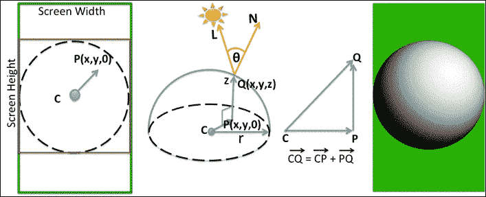

## 参见

+   请参考第五章中关于*实现每个顶点的漫反射光分量*的配方，*光和材料*
